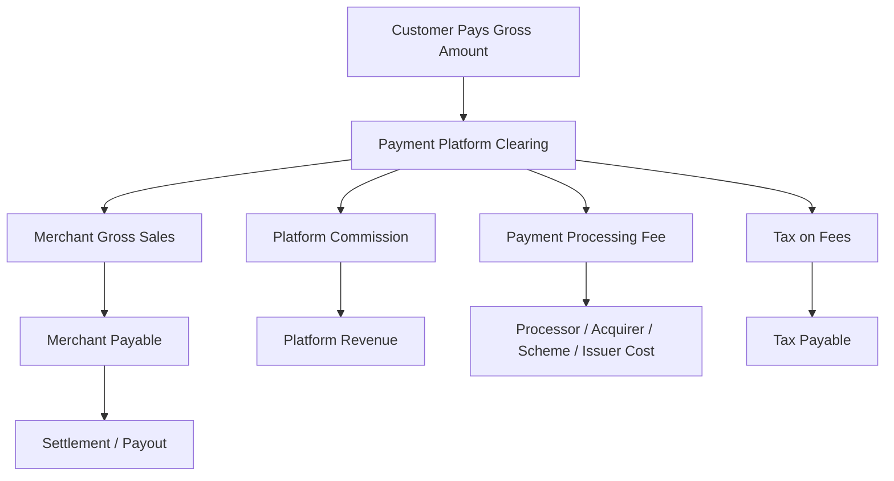
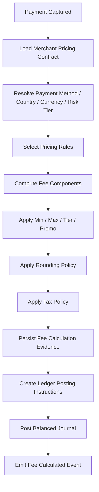
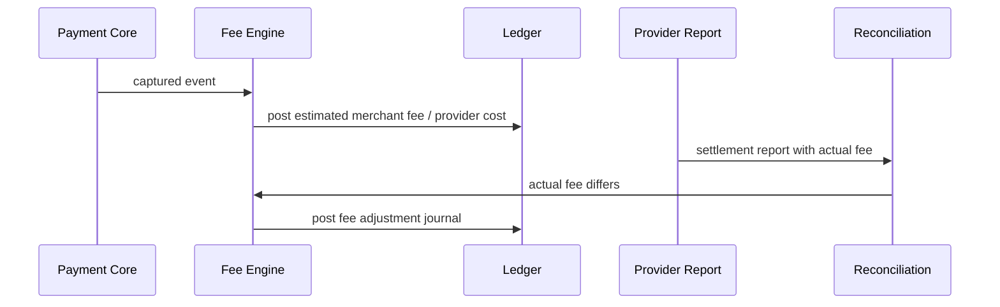

------
title: Build From Scratch: Large Production Grade Java Payment Systems - Part 023
description: Mendesain fee, commission, MDR, revenue accounting, split payments, dan ledger posting agar payment platform tidak hanya bisa menerima pembayaran, tetapi juga bisa menjelaskan siapa berhak atas uang apa, kapan, dan mengapa.
series: learn-java-payment-systems
seriesTitle: Build From Scratch: Large Production Grade Java Payment Systems
order: 23
partTitle: Fees, Commission, MDR, Platform Revenue, Split Payments
tags:
- java
- payments
- payment-systems
- ledger
- accounting
- fees
- mdr
- split-payments
- marketplace
- fintech
date: 2026-07-02
---

# Part 023 — Fees, Commission, MDR, Platform Revenue, Split Payments

Payment system yang baru bisa menerima pembayaran belum tentu bisa menghasilkan revenue yang benar.

Di production, pertanyaan yang sering menghancurkan desain bukan:

> Apakah payment sukses?

melainkan:

> Dari gross amount ini, berapa yang menjadi hak merchant, berapa yang menjadi hak platform, berapa yang menjadi fee processor/acquirer/scheme/issuer, berapa yang harus ditahan sebagai reserve, berapa pajaknya, kapan boleh disettle, dan bagaimana semuanya bisa dijelaskan ulang 18 bulan kemudian?

Part ini membahas **fee engine** dan **revenue accounting model** untuk payment platform enterprise.

Kita tidak akan mengulang dasar double-entry ledger dari Part 020–022. Di sini kita pakai fondasi itu untuk membangun model komersial: MDR, commission, fee split, platform revenue, pass-through fee, blended fee, refunds, chargeback, reserve, dan multi-party settlement.

---

## 1. Masalah Sebenarnya

Payment platform enterprise biasanya punya banyak skema komersial:

- card payment dikenakan MDR;
- QR payment dikenakan MDR berbeda;
- bank transfer bisa fixed fee;
- wallet bisa punya fee per transaction atau promo subsidy;
- marketplace mengambil platform commission;
- merchant premium punya custom pricing;
- merchant baru punya promotional pricing;
- refund bisa mengembalikan commission sebagian atau tidak;
- chargeback bisa menimbulkan dispute fee;
- settlement bisa dipotong reserve;
- provider fee bisa diketahui saat payment atau baru diketahui saat settlement report;
- pajak atas fee bisa berlaku berbeda per negara;
- transaksi multi-currency punya FX spread;
- platform bisa bertindak sebagai principal atau agent tergantung model bisnis dan policy accounting.

Kalau desainnya hanya:

```txt
merchant_receives = payment_amount - fee
```

maka sistem cepat rusak ketika ada:

- partial capture;
- partial refund;
- multiple merchant split;
- fee minimum;
- fee cap;
- fee tiering;
- fee reversal;
- settlement mismatch;
- provider fee adjustment;
- chargeback;
- reserve hold;
- retroactive pricing change;
- invoice monthly instead of immediate deduction.

Di production, fee bukan angka turunan sederhana. Fee adalah **financial obligation** yang harus punya rule, calculation record, ledger impact, audit trail, dan reconciliation evidence.

---

## 2. Mental Model: Gross, Net, dan Economic Ownership

Satu transaksi payment memiliki beberapa layer uang.



Yang perlu dijaga:

1. **Gross amount** adalah nominal yang customer bayar.
2. **Merchant gross sales** adalah economic value penjualan merchant.
3. **Platform commission** adalah revenue platform, jika platform memang berhak mengenakannya.
4. **Processing fee** adalah cost atau pass-through charge tergantung pricing model.
5. **Tax** bukan revenue bersih; biasanya liability yang harus diperlakukan terpisah.
6. **Net settlement** adalah uang yang akhirnya dikirim ke merchant.

Kesalahan umum adalah mencampur semua ini sebagai satu field `fee_amount`.

Itu tidak cukup.

---

## 3. Vocabulary yang Harus Presisi

### 3.1 Gross Amount

Jumlah yang customer bayar untuk order/payment.

```txt
Gross Amount = amount charged to customer
```

Untuk card authorization + capture:

- authorization amount bisa lebih besar/sama dengan capture amount;
- capture amount adalah amount yang benar-benar menjadi basis final clearing/settlement;
- fee sebaiknya dihitung atas captured amount, kecuali kontrak mengatakan lain.

### 3.2 Net Amount

Jumlah setelah deduction tertentu.

Masalahnya: “net” tanpa konteks tidak jelas.

Net terhadap apa?

- net of platform commission?
- net of provider fee?
- net of tax?
- net of reserve?
- net settlement after all deductions?

Gunakan nama eksplisit:

```txt
merchant_gross_amount
platform_commission_amount
provider_fee_amount
tax_on_fee_amount
reserve_hold_amount
merchant_settleable_amount
merchant_payout_amount
```

### 3.3 MDR

MDR, atau Merchant Discount Rate, biasanya dipahami sebagai biaya yang dibayar merchant ke acquiring/payment provider untuk memproses transaksi. Visa menjelaskan bahwa merchant tidak membayar interchange reimbursement fee secara langsung ke Visa; merchant membayar “merchant discount” ke financial institution/acquirer, yang biasanya dihitung sebagai persentase transaksi dan bisa mencakup berbagai layanan processing.

Dalam sistem internal, MDR sebaiknya tidak dimodelkan sebagai satu angka tunggal jika platform perlu accounting detail.

```txt
MDR = interchange + scheme/network fee + acquirer markup + PSP/platform markup + tax? + other fees?
```

Tergantung pricing contract, merchant bisa melihat:

- **blended pricing**: satu fee sederhana, misalnya X% + fixed;
- **interchange++ pricing**: interchange, scheme fee, dan markup dipisah;
- **pass-through pricing**: biaya eksternal diteruskan ke merchant;
- **subscription pricing**: fee transaksi lebih rendah, tetapi ada monthly fee;
- **custom pricing**: berdasarkan volume, channel, method, risk, country.

### 3.4 Interchange

Interchange adalah fee antar participant card network, umumnya dari acquirer ke issuer. Mastercard menyebut interchange sebagai salah satu komponen Merchant Discount Rate.

Payment platform biasanya tidak menghitung interchange final sendiri kecuali ia berada dekat dengan acquiring/processor. Namun platform tetap perlu bisa menyimpan interchange component ketika provider settlement report menyediakannya.

### 3.5 Scheme / Network Fee

Fee yang terkait card network/scheme. Bisa bersifat:

- percentage;
- fixed;
- assessment;
- cross-border;
- currency conversion;
- authorization fee;
- clearing fee.

### 3.6 Processor / PSP Fee

Fee yang dibebankan provider payment ke platform/merchant.

Contoh struktur:

```txt
provider_fee = provider_percentage_fee + provider_fixed_fee + provider_fx_fee + provider_dispute_fee
```

### 3.7 Platform Commission

Revenue platform dari merchant/seller/provider service.

Contoh:

- marketplace mengambil 10% dari order;
- SaaS platform mengambil 1.5% payment facilitation fee;
- delivery platform mengambil commission dari merchant dan driver fee;
- platform mengambil fixed fee per successful transaction;
- platform mengambil subscription fee bulanan dari merchant balance.

### 3.8 Application Fee

Dalam model marketplace/platform, application fee sering berarti fee yang diambil platform dari connected account/seller. Stripe Connect, misalnya, mendukung application fees dan model separate charges and transfers untuk memisahkan charge pada platform dari transfer ke connected accounts.

### 3.9 Split Payment

Split payment adalah membagi dana transaksi ke beberapa balance account atau party.

Adyen mendokumentasikan split instruction untuk membukukan bagian sale amount, platform commission, fee, dan top-up amount ke balance account yang relevan. Stripe Connect juga menyediakan model separate charges and transfers untuk memindahkan dana dari satu payment ke beberapa connected accounts.

Secara internal, split payment harus dipandang sebagai **allocation + ledger posting**, bukan hanya array recipients.

### 3.10 Reserve

Reserve adalah dana yang ditahan untuk risiko refund, dispute, chargeback, fraud, atau merchant default.

Reserve bukan platform revenue.

Reserve juga bukan fee.

Reserve adalah liability atau restricted merchant balance sampai condition release terpenuhi.

---

## 4. Taxonomy Fee yang Harus Didukung

Fee engine production-grade minimal harus mendukung kombinasi berikut.

| Fee Type | Bentuk | Contoh |
|---|---|---|
| Percentage fee | `amount * rate` | MDR 2.5% |
| Fixed fee | nominal tetap | Rp2.000 / transaction |
| Percentage + fixed | kombinasi | 2.9% + 30c |
| Minimum fee | floor | minimal Rp1.000 |
| Maximum fee | cap | maksimal Rp25.000 |
| Tiered fee | berdasarkan volume | 2.5% sampai 1M, 2.2% setelahnya |
| Method-specific fee | berdasarkan payment method | card beda dari bank transfer |
| Country/currency fee | geografis | cross-border fee |
| Merchant-specific fee | custom pricing | enterprise merchant |
| Risk-based fee | berdasarkan risk tier | high-risk merchant dikenakan reserve/fee lebih tinggi |
| Time-bound promo | tanggal efektif | free MDR 3 bulan pertama |
| Refund fee | saat refund | provider fee tidak dikembalikan |
| Dispute fee | saat chargeback | fixed dispute fee |
| Payout fee | saat payout | instant payout fee |
| FX fee | konversi mata uang | spread/markup |
| Tax on fee | pajak atas layanan | VAT/GST/PPN tergantung yurisdiksi |

Jangan mulai dari satu tabel `merchant_fee_percentage`.

Mulai dari **pricing rule model**.

---

## 5. Pricing Model: Blended vs Interchange++ vs Pass-through

### 5.1 Blended Pricing

Merchant melihat satu fee sederhana.

```txt
merchant_processing_fee = captured_amount * merchant_rate + fixed_fee
```

Keuntungan:

- mudah dijelaskan ke merchant;
- invoice sederhana;
- fee predictable.

Risiko:

- margin platform bisa berubah karena underlying provider fee berubah;
- settlement reconciliation lebih kompleks karena external fee tidak sama dengan fee yang dibebankan ke merchant;
- platform perlu model revenue/cost terpisah.

Ledger harus memisahkan:

```txt
merchant fee charged     -> revenue / fee receivable
provider fee incurred    -> cost / provider payable
margin                   -> revenue minus cost
```

### 5.2 Interchange++ Pricing

Merchant melihat komponen:

```txt
interchange + scheme fee + acquirer/processor markup + platform markup
```

Keuntungan:

- transparan;
- cocok untuk enterprise merchant;
- margin platform lebih eksplisit.

Risiko:

- komponen final bisa baru diketahui setelah clearing/settlement;
- perlu adjustment ketika estimated fee berbeda dari actual fee;
- reporting lebih kompleks.

### 5.3 Pass-through Pricing

Provider fee diteruskan ke merchant.

Platform bisa mengambil markup terpisah.

```txt
merchant_fee = actual_provider_fee + platform_markup
```

Masalah utama: actual provider fee kadang terlambat diketahui. Solusinya:

1. charge estimated fee saat capture;
2. reconcile actual fee saat settlement report;
3. post adjustment ledger untuk selisih.

### 5.4 Commission Model

Commission dihitung dari order/payment:

```txt
platform_commission = order_amount * commission_rate
```

Harus jelas basisnya:

- gross order amount sebelum tax?
- setelah discount?
- setelah shipping?
- captured amount?
- merchant gross sales?
- per line item category?
- sebelum atau sesudah refund?

Kalau basis tidak eksplisit, dispute accounting pasti terjadi.

---

## 6. Fee Engine Bukan Pricing Calculator Biasa

Fee engine payment harus menghasilkan **calculation evidence**.

Output fee engine bukan hanya angka.

Output yang benar:

```json
{
  "calculationId": "fee_calc_01J...",
  "pricingPlanId": "plan_enterprise_id_2026",
  "pricingPlanVersion": 17,
  "merchantId": "mrc_123",
  "paymentMethod": "CARD",
  "currency": "IDR",
  "basisAmountMinor": 10000000,
  "components": [
    {
      "type": "PLATFORM_COMMISSION",
      "basisAmountMinor": 10000000,
      "rateBps": 250,
      "fixedAmountMinor": 0,
      "computedAmountMinor": 250000,
      "roundedAmountMinor": 250000,
      "revenueTreatment": "PLATFORM_REVENUE"
    },
    {
      "type": "PROCESSING_FEE_CHARGED_TO_MERCHANT",
      "basisAmountMinor": 10000000,
      "rateBps": 180,
      "fixedAmountMinor": 2000,
      "computedAmountMinor": 182000,
      "roundedAmountMinor": 182000,
      "revenueTreatment": "MERCHANT_FEE_REVENUE"
    }
  ]
}
```

Mengapa perlu detail seperti ini?

Karena 1 tahun kemudian finance mungkin bertanya:

> Mengapa merchant A dipotong Rp182.000 pada transaksi ini?

Jawaban yang defensible:

- pricing plan apa;
- versi berapa;
- rule mana;
- basis amount apa;
- rounding mode apa;
- pajak apa;
- effective date kapan;
- siapa yang mengubah pricing;
- ledger journal mana yang memposting fee itu.

---

## 7. Fee Calculation Pipeline



Kunci desain:

- pricing rule harus versioned;
- calculation harus immutable;
- fee calculation harus idempotent per financial event;
- ledger posting harus memakai `calculation_id` sebagai idempotency key;
- pricing update tidak boleh mengubah transaksi lama;
- recalculation hanya boleh membuat adjustment/reversal, bukan overwrite.

---

## 8. Data Model: Pricing Plan dan Fee Rule

### 8.1 Pricing Plan

```sql
create table pricing_plan (
    id uuid primary key,
    plan_code text not null,
    version integer not null,
    status text not null check (status in ('DRAFT', 'ACTIVE', 'RETIRED')),
    effective_from timestamptz not null,
    effective_to timestamptz,
    created_at timestamptz not null default now(),
    created_by text not null,
    unique (plan_code, version)
);
```

### 8.2 Merchant Pricing Assignment

```sql
create table merchant_pricing_assignment (
    id uuid primary key,
    merchant_id uuid not null,
    pricing_plan_id uuid not null references pricing_plan(id),
    effective_from timestamptz not null,
    effective_to timestamptz,
    assigned_by text not null,
    assigned_reason text not null,
    created_at timestamptz not null default now()
);

create unique index ux_merchant_pricing_active
on merchant_pricing_assignment (merchant_id)
where effective_to is null;
```

Catatan: index partial di atas hanya mencegah lebih dari satu active assignment jika policy memang satu active pricing plan. Kalau pricing bisa bertingkat per method/region, uniqueness perlu lebih spesifik.

### 8.3 Fee Rule

```sql
create table fee_rule (
    id uuid primary key,
    pricing_plan_id uuid not null references pricing_plan(id),
    rule_order integer not null,
    fee_type text not null,
    payment_method text,
    currency char(3),
    country_code char(2),
    merchant_category_code text,
    risk_tier text,
    rate_bps integer,
    fixed_amount_minor bigint,
    minimum_amount_minor bigint,
    maximum_amount_minor bigint,
    rounding_mode text not null default 'HALF_UP',
    charge_to text not null check (charge_to in ('MERCHANT', 'PLATFORM', 'CUSTOMER', 'CONNECTED_ACCOUNT')),
    accounting_treatment text not null,
    effective_from timestamptz not null,
    effective_to timestamptz,
    metadata jsonb not null default '{}'::jsonb
);
```

### 8.4 Fee Calculation Evidence

```sql
create table fee_calculation (
    id uuid primary key,
    source_type text not null,
    source_id uuid not null,
    merchant_id uuid not null,
    payment_id uuid not null,
    capture_id uuid,
    pricing_plan_id uuid not null,
    pricing_plan_version integer not null,
    basis_amount_minor bigint not null,
    currency char(3) not null,
    rounding_policy text not null,
    calculation_status text not null check (calculation_status in ('CALCULATED', 'REVERSED', 'ADJUSTED')),
    idempotency_key text not null,
    calculated_at timestamptz not null default now(),
    unique (idempotency_key)
);
```

### 8.5 Fee Component

```sql
create table fee_component (
    id uuid primary key,
    fee_calculation_id uuid not null references fee_calculation(id),
    fee_rule_id uuid references fee_rule(id),
    component_type text not null,
    basis_amount_minor bigint not null,
    rate_bps integer,
    fixed_amount_minor bigint,
    raw_amount_minor numeric(38, 12) not null,
    rounded_amount_minor bigint not null,
    currency char(3) not null,
    charge_to text not null,
    accounting_treatment text not null,
    tax_treatment text,
    metadata jsonb not null default '{}'::jsonb
);
```

Mengapa `raw_amount_minor numeric(38, 12)` dan `rounded_amount_minor bigint`?

Karena calculation perlu menjelaskan angka sebelum rounding, tetapi ledger harus memposting amount final dalam minor unit integer.

---

## 9. Rounding Policy adalah Domain Policy

Rounding bukan detail UI.

Rounding menentukan uang.

Contoh:

```txt
amount = 10,001
rate  = 2.5%
raw   = 250.025
```

Apa fee final?

- 250?
- 251?
- 250.03?
- tergantung currency minor unit?
- tergantung tax rule?
- tergantung kontrak?

Fee engine harus menyimpan:

- basis amount;
- rate;
- raw result;
- rounding mode;
- rounded result;
- currency exponent;
- rule version.

Jangan hanya menyimpan final fee.

---

## 10. Fee Posting dalam Double-Entry Ledger

Misal customer membayar Rp1.000.000, platform mengambil commission Rp50.000, processing fee charged ke merchant Rp20.000, merchant settleable Rp930.000.

### 10.1 Capture Posting

Pada capture, platform mengakui dana masuk ke clearing dan merchant punya klaim gross.

```txt
Dr Payment Clearing / Provider Receivable      1,000,000
Cr Merchant Pending Payable                    1,000,000
```

### 10.2 Commission Deduction

```txt
Dr Merchant Pending Payable                       50,000
Cr Platform Commission Revenue                    50,000
```

### 10.3 Processing Fee Charged to Merchant

```txt
Dr Merchant Pending Payable                       20,000
Cr Merchant Processing Fee Revenue                20,000
```

### 10.4 Provider Fee Incurred by Platform

Jika provider fee actual adalah Rp14.000 dan platform menanggung cost tersebut:

```txt
Dr Payment Processing Cost                        14,000
Cr Provider Fee Payable                           14,000
```

### 10.5 Merchant Net Settleable

Merchant pending payable tersisa:

```txt
1,000,000 - 50,000 - 20,000 = 930,000
```

Ketika dana settled dan siap payout, bucket bisa dipindah:

```txt
Dr Merchant Pending Payable                      930,000
Cr Merchant Settled Payable                      930,000
```

Ketika payout dikirim:

```txt
Dr Merchant Settled Payable                      930,000
Cr Bank Cash / Payout Clearing                   930,000
```

---

## 11. Immediate Deduction vs Monthly Invoice

Ada dua cara menagih fee ke merchant.

### 11.1 Immediate Deduction

Fee langsung dipotong dari settlement.

Kelebihan:

- risiko collection rendah;
- settlement net sederhana bagi platform;
- umum untuk PSP/marketplace.

Kekurangan:

- merchant statement harus sangat jelas;
- refund/chargeback perlu reverse fee policy;
- adjustment settlement bisa kompleks.

### 11.2 Monthly Invoice

Merchant menerima gross settlement, lalu fee ditagih lewat invoice.

Kelebihan:

- cocok untuk enterprise merchant;
- accounting merchant lebih familiar;
- fee detail bisa direconcile per bulan.

Kekurangan:

- platform punya receivable risk;
- perlu billing/invoice engine;
- collection dan dunning dibutuhkan;
- refund/adjustment lintas periode lebih rumit.

Internal ledger harus membedakan:

```txt
fee charged by deduction -> reduce merchant payable
fee charged by invoice   -> create merchant fee receivable
```

### 11.3 Posting untuk Monthly Invoice

Saat fee dihitung:

```txt
Dr Merchant Fee Receivable                        20,000
Cr Merchant Processing Fee Revenue                20,000
```

Saat merchant membayar invoice:

```txt
Dr Bank Cash                                      20,000
Cr Merchant Fee Receivable                        20,000
```

Jika fee di-offset dari settlement berikutnya:

```txt
Dr Merchant Settled Payable                       20,000
Cr Merchant Fee Receivable                        20,000
```

---

## 12. Split Payment Model

Split payment memiliki dua problem:

1. **allocation problem**: siapa menerima berapa;
2. **settlement problem**: kapan dan lewat jalur apa uang benar-benar dibayar.

Jangan campur.

### 12.1 Allocation

Contoh order Rp1.000.000:

```txt
Restaurant gross        700,000
Driver gross            150,000
Platform commission     100,000
Delivery service fee     50,000
Total                 1,000,000
```

Allocation harus immutable setelah capture, kecuali ada adjustment event.

```sql
create table payment_allocation (
    id uuid primary key,
    payment_id uuid not null,
    capture_id uuid not null,
    allocation_group_id uuid not null,
    party_type text not null,
    party_id uuid,
    allocation_type text not null,
    amount_minor bigint not null check (amount_minor >= 0),
    currency char(3) not null,
    rule_source text not null,
    rule_version integer not null,
    created_at timestamptz not null default now()
);

create unique index ux_payment_allocation_line
on payment_allocation (capture_id, allocation_type, party_type, party_id);
```

Invariant:

```txt
sum(allocation.amount) = captured_amount
```

Tapi hati-hati: allocation gross tidak selalu sama dengan final payout karena fee, reserve, tax, dan dispute.

### 12.2 Settlement

Settlement adalah perpindahan dari payable/available balance ke bank account atau external destination.

Satu allocation bisa:

- ditahan reserve;
- tidak available karena KYC/KYB incomplete;
- dipakai untuk offset negative balance;
- dipayout dalam batch berbeda;
- dikurangi fee;
- dibatalkan karena refund.

Karena itu `payment_allocation` bukan `payout_instruction`.

---

## 13. Stripe/Adyen Model sebagai Pembelajaran Arsitektur

Stripe Connect menyediakan beberapa model charge, termasuk separate charges and transfers, di mana charge dibuat di platform lalu dana bisa ditransfer ke beberapa connected accounts. Ini mengajarkan separation penting: **payment acceptance** tidak harus identik dengan **fund distribution**.

Adyen split transactions menunjukkan bahwa platform bisa memberikan split instruction untuk membukukan sale amount, platform commission, fee, dan top-up ke balance account yang berbeda. Ini memperkuat mental model bahwa split adalah accounting event, bukan sekadar routing payment.

Kita tidak meniru API vendor. Kita mengambil prinsip desain:

```txt
capture != allocation != fee calculation != settlement != payout
```

Jika lima hal ini disatukan dalam satu endpoint, sistem akan sulit diaudit.

---

## 14. Revenue Recognition: Jangan Diputuskan Engineer Sendiri

Revenue recognition adalah accounting policy.

IFRS 15 menetapkan prinsip pelaporan informasi tentang nature, amount, timing, dan uncertainty dari revenue dan cash flows dari contract with customers. Dalam konteks platform, pertanyaan besar biasanya:

- apakah platform principal atau agent?
- apakah gross amount boleh diakui sebagai revenue?
- atau hanya commission/net fee yang revenue?
- kapan revenue diakui: payment captured, service fulfilled, settlement completed, atau invoice issued?
- bagaimana treatment refund, dispute, chargeback, promo, tax?

Engineer tidak boleh membuat keputusan accounting policy sendiri.

Tugas engineer:

1. memodelkan event dan obligation secara presisi;
2. menyediakan ledger account yang bisa mendukung policy finance;
3. menyimpan evidence yang cukup;
4. membuat sistem mampu menghasilkan report sesuai policy.

### 14.1 Principal vs Agent

Jika platform adalah principal, mungkin gross merchandise value masuk revenue lalu cost/merchant payable diperlakukan berbeda.

Jika platform adalah agent, biasanya hanya commission/fee yang menjadi revenue platform.

Secara sistem, jangan hardcode asumsi:

```java
revenue = paymentAmount;
```

Gunakan accounting treatment yang configurable dan versioned.

---

## 15. Java Domain Model: Fee Engine

### 15.1 Fee Component Type

```java
public enum FeeComponentType {
    PLATFORM_COMMISSION,
    PAYMENT_PROCESSING_FEE_CHARGED,
    PROVIDER_FEE_INCURRED,
    SCHEME_FEE,
    INTERCHANGE_FEE,
    FX_MARKUP,
    PAYOUT_FEE,
    DISPUTE_FEE,
    REFUND_FEE,
    TAX_ON_FEE,
    RESERVE_HOLD
}
```

### 15.2 Charge Party

```java
public enum ChargeParty {
    MERCHANT,
    PLATFORM,
    CUSTOMER,
    CONNECTED_ACCOUNT
}
```

### 15.3 Accounting Treatment

```java
public enum AccountingTreatment {
    PLATFORM_REVENUE,
    PROCESSING_COST,
    PASS_THROUGH_PAYABLE,
    MERCHANT_PAYABLE_DEDUCTION,
    MERCHANT_FEE_RECEIVABLE,
    TAX_PAYABLE,
    RESERVE_LIABILITY,
    NON_ACCOUNTING_INFORMATIONAL
}
```

### 15.4 Fee Rule

```java
public record FeeRule(
        FeeRuleId id,
        int order,
        FeeComponentType componentType,
        Predicate<FeeContext> eligibility,
        BigDecimal rateBps,
        Money fixedAmount,
        Money minimumAmount,
        Money maximumAmount,
        ChargeParty chargeParty,
        AccountingTreatment accountingTreatment,
        RoundingPolicy roundingPolicy
) {
    public Optional<FeeComponent> apply(FeeContext context) {
        if (!eligibility.test(context)) {
            return Optional.empty();
        }

        Money percentage = context.basisAmount().multiplyBps(rateBps, roundingPolicy);
        Money raw = percentage.plus(fixedAmount.orZero(context.currency()));
        Money capped = raw.applyMinMax(minimumAmount, maximumAmount);

        return Optional.of(new FeeComponent(
                id,
                componentType,
                context.basisAmount(),
                rateBps,
                fixedAmount,
                raw,
                capped,
                chargeParty,
                accountingTreatment
        ));
    }
}
```

### 15.5 Fee Calculator

```java
public final class FeeCalculator {
    private final PricingPlanRepository pricingPlans;
    private final FeeCalculationRepository calculations;

    public FeeCalculation calculate(FeeContext context) {
        PricingPlan plan = pricingPlans.resolveFor(
                context.merchantId(),
                context.paymentMethod(),
                context.currency(),
                context.occurredAt()
        );

        String idempotencyKey = context.sourceType() + ":" + context.sourceId() + ":" + plan.id() + ":" + plan.version();

        return calculations.findByIdempotencyKey(idempotencyKey)
                .orElseGet(() -> computeAndPersist(context, plan, idempotencyKey));
    }

    private FeeCalculation computeAndPersist(FeeContext context, PricingPlan plan, String key) {
        List<FeeComponent> components = plan.rules().stream()
                .sorted(Comparator.comparingInt(FeeRule::order))
                .flatMap(rule -> rule.apply(context).stream())
                .toList();

        FeeCalculation calculation = FeeCalculation.create(
                key,
                context,
                plan.id(),
                plan.version(),
                components
        );

        calculations.insert(calculation);
        return calculation;
    }
}
```

Kunci: calculation harus idempotent. Kalau capture event diproses ulang, fee calculation tidak boleh dobel.

---

## 16. Ledger Posting Rule dari Fee Component

Fee component belum tentu ledger posting. Ia harus diterjemahkan ke posting instruction.

```java
public interface FeePostingRule {
    boolean supports(FeeComponent component);
    List<PostingLine> toPostingLines(FeePostingContext context, FeeComponent component);
}
```

Contoh platform commission deducted from merchant settlement:

```java
public final class PlatformCommissionDeductionRule implements FeePostingRule {
    @Override
    public boolean supports(FeeComponent component) {
        return component.componentType() == FeeComponentType.PLATFORM_COMMISSION
            && component.accountingTreatment() == AccountingTreatment.PLATFORM_REVENUE
            && component.chargeParty() == ChargeParty.MERCHANT;
    }

    @Override
    public List<PostingLine> toPostingLines(FeePostingContext ctx, FeeComponent component) {
        Money amount = component.roundedAmount();
        return List.of(
            PostingLine.debit(ctx.accounts().merchantPendingPayable(), amount),
            PostingLine.credit(ctx.accounts().platformCommissionRevenue(), amount)
        );
    }
}
```

Provider fee incurred by platform:

```java
public final class ProviderFeeCostRule implements FeePostingRule {
    @Override
    public boolean supports(FeeComponent component) {
        return component.componentType() == FeeComponentType.PROVIDER_FEE_INCURRED;
    }

    @Override
    public List<PostingLine> toPostingLines(FeePostingContext ctx, FeeComponent component) {
        Money amount = component.roundedAmount();
        return List.of(
            PostingLine.debit(ctx.accounts().paymentProcessingCost(), amount),
            PostingLine.credit(ctx.accounts().providerFeePayable(), amount)
        );
    }
}
```

---

## 17. Refund Fee Semantics

Refund tidak selalu membalik fee secara penuh.

Kemungkinan policy:

| Policy | Makna |
|---|---|
| Full fee refund | platform mengembalikan semua fee proporsional/full |
| No fee refund | fee tetap karena service processing sudah terjadi |
| Proportional fee refund | fee dikembalikan sesuai refunded amount |
| Fixed fee retained | percentage fee balik, fixed fee tetap |
| Provider-dependent | mengikuti actual provider refund fee behavior |
| Merchant-contract-specific | tergantung pricing contract |

Contoh capture Rp1.000.000, commission 5% = Rp50.000. Refund Rp400.000.

Jika proportional commission refund:

```txt
commission_refund = 400,000 / 1,000,000 * 50,000 = 20,000
```

Ledger:

```txt
Dr Platform Commission Revenue Contra             20,000
Cr Merchant Pending Payable / Merchant Receivable 20,000
```

Atau jika fee tidak dikembalikan, tidak ada reversal fee. Namun merchant statement harus jelas.

Invariant:

```txt
refunded_commission_amount <= original_commission_amount
```

---

## 18. Chargeback dan Dispute Fee

Chargeback lebih berat dari refund karena bisa menimbulkan:

- reversal principal amount;
- dispute fee;
- representment fee;
- provisional debit;
- final loss booking;
- reserve impact;
- merchant negative balance.

Contoh:

```txt
Original capture      1,000,000
Platform commission      50,000
Merchant paid out       950,000
Chargeback principal  1,000,000
Dispute fee              150,000
```

Jika merchant sudah dipayout, platform mungkin harus mencatat merchant receivable/negative balance:

```txt
Dr Merchant Chargeback Receivable              1,150,000
Cr Payment Clearing / Scheme Payable           1,000,000
Cr Dispute Fee Revenue / Provider Payable        150,000
```

Tergantung siapa yang menerima dispute fee dan apakah platform hanya pass-through.

Jangan hardcode dispute fee sebagai revenue. Bisa jadi itu provider cost yang diteruskan.

---

## 19. Reserve sebagai Fee? Bukan.

Reserve hold sering terlihat seperti deduction dari merchant settlement. Tetapi accounting-nya berbeda.

Fee:

```txt
merchant no longer owns that amount
```

Reserve:

```txt
merchant still has claim, but restricted / not yet available
```

Posting reserve:

```txt
Dr Merchant Settled Payable                    100,000
Cr Merchant Reserve Liability                  100,000
```

Release reserve:

```txt
Dr Merchant Reserve Liability                  100,000
Cr Merchant Available Payable                  100,000
```

Jika reserve dipakai untuk cover chargeback:

```txt
Dr Merchant Reserve Liability                  100,000
Cr Chargeback Clearing                         100,000
```

---

## 20. FX Fee dan Multi-Currency

Multi-currency fee tidak boleh disederhanakan.

Minimal simpan:

- transaction currency;
- settlement currency;
- fee currency;
- FX rate;
- FX rate source;
- rate timestamp;
- markup/spread;
- rounding per currency;
- realized FX gain/loss, jika relevan;
- provider actual FX result.

Contoh:

```txt
Customer pays:       USD 100.00
Merchant settlement: IDR 1,600,000
FX rate:             16,000
FX markup:           1.0%
Platform FX revenue: IDR 16,000? atau sesuai accounting policy
```

Jangan campur FX spread dengan MDR.

---

## 21. Fee Adjustment Saat Actual Provider Cost Datang Belakangan

Dalam banyak payment rail, fee final baru diketahui dari settlement/report.

Flow:



Contoh:

```txt
estimated provider fee = 14,000
actual provider fee    = 14,700
adjustment             = 700
```

Posting:

```txt
Dr Payment Processing Cost                           700
Cr Provider Fee Payable                              700
```

Jika pass-through ke merchant:

```txt
Dr Merchant Pending Payable / Merchant Receivable    700
Cr Processing Fee Revenue / Cost Recovery            700
```

Tergantung pricing contract.

---

## 22. Idempotency untuk Fee dan Revenue

Fee calculation harus idempotent berdasarkan event finansial.

Contoh idempotency key:

```txt
fee:capture:<capture_id>:pricing_plan:<plan_version>
fee:refund:<refund_id>:policy:<refund_fee_policy_version>
fee:chargeback:<chargeback_id>:dispute_fee_rule:<version>
fee:provider_actual:<provider_report_line_id>
```

Ledger posting idempotency:

```txt
ledger:fee_calculation:<fee_calculation_id>
ledger:fee_adjustment:<adjustment_id>
```

Invariant:

```txt
A financial event can create at most one active fee calculation for a given calculation scope.
```

---

## 23. Query Model: Merchant Statement Fee Breakdown

Merchant harus bisa melihat statement seperti:

| Date | Payment | Gross | Commission | Processing Fee | Reserve | Refund | Net |
|---|---:|---:|---:|---:|---:|---:|---:|
| 2026-07-02 | pay_123 | 1,000,000 | 50,000 | 20,000 | 0 | 0 | 930,000 |

Jangan generate statement dari log provider mentah.

Statement harus berasal dari ledger/read model internal.

```sql
create view merchant_fee_statement_line as
select
    j.effective_at,
    j.source_type,
    j.source_id,
    e.account_id,
    e.amount_minor,
    e.currency,
    e.direction,
    j.description
from ledger_journal j
join ledger_entry e on e.journal_id = j.id
where j.status = 'POSTED';
```

Untuk production, view bisa diganti materialized projection dengan versioning.

---

## 24. Fee Engine Test Matrix

### 24.1 Unit Tests

- percentage fee exact;
- fixed fee exact;
- percentage + fixed;
- min fee applied;
- max fee applied;
- tiering boundary;
- currency rounding;
- promo effective date;
- merchant override;
- method-specific rule;
- country-specific rule;
- tax rule;
- negative amount rejected.

### 24.2 Property Tests

Properties:

```txt
fee_amount >= 0
sum(split_allocations) = captured_amount
fee_adjustment = actual_fee - estimated_fee
refunded_fee <= original_fee
rounded_amount is valid minor unit
pricing change never mutates historical fee calculation
```

### 24.3 Scenario Tests

- full capture;
- partial capture;
- multiple partial captures;
- full refund;
- partial refund;
- multiple partial refunds;
- refund after payout;
- chargeback after payout;
- settlement fee mismatch;
- merchant pricing changed after capture;
- provider fee report duplicated;
- split payment with 3 recipients;
- failed ledger posting after fee calculation;
- replay capture event.

---

## 25. Observability

Fee engine metrics:

```txt
fee_calculation_total{component_type, merchant_tier, payment_method}
fee_calculation_failed_total{reason}
fee_adjustment_total{reason}
fee_adjustment_amount_minor{currency}
fee_reversal_total{source_type}
merchant_fee_effective_rate{merchant_id, payment_method}
provider_cost_effective_rate{provider, payment_method}
platform_margin_bps{merchant_segment, payment_method}
```

Alerts:

- fee calculation failure after capture;
- ledger posting failure for fee;
- fee adjustment spike;
- negative platform margin spike;
- missing pricing assignment;
- fee actual vs estimated variance beyond threshold;
- merchant effective rate differs from contract;
- zero-fee transactions outside promo.

---

## 26. Operational Controls

Pricing changes are dangerous.

Minimal controls:

- maker-checker for pricing plan activation;
- effective date cannot be backdated without finance approval;
- pricing plan is immutable after activation;
- all changes require reason;
- all calculations store plan version;
- merchant override requires approval;
- manual fee adjustment requires journal entry and evidence;
- bulk pricing migration requires dry-run impact report;
- revenue-affecting changes require audit trail.

Backoffice action:

```txt
Create pricing plan draft
Run simulation on historical transactions
Approve pricing plan
Assign merchant to pricing plan
Activate on future effective date
Monitor fee variance
```

---

## 27. Anti-Patterns

### 27.1 One `fee_amount` Column

Tidak cukup untuk enterprise payment.

Kamu akan kehilangan:

- fee type;
- rate;
- basis;
- tax;
- rule version;
- charge party;
- accounting treatment;
- adjustment history.

### 27.2 Recalculate Old Transactions with Current Pricing

Ini fatal.

Historical transaction harus memakai pricing version saat event terjadi.

### 27.3 Treat Provider Fee as Platform Revenue Deduction Only

Provider fee bisa cost, pass-through, adjustment, atau reimbursable fee. Harus jelas.

### 27.4 Treat Reserve as Fee

Reserve adalah restricted liability, bukan revenue.

### 27.5 Split Payment Langsung Menjadi Payout

Split allocation bukan payout instruction. Merchant/recipient bisa belum eligible payout.

### 27.6 Hardcode Revenue Recognition

Revenue treatment harus mengikuti accounting policy dan bisa berubah per business model.

---

## 28. Build From Scratch Exercise

Bangun modul `fee-engine` dengan endpoint internal:

```http
POST /internal/fee-calculations
```

Input:

```json
{
  "sourceType": "CAPTURE",
  "sourceId": "cap_123",
  "merchantId": "mrc_123",
  "paymentId": "pay_123",
  "paymentMethod": "CARD",
  "basisAmount": {
    "currency": "IDR",
    "minor": 100000000
  },
  "occurredAt": "2026-07-02T10:00:00Z"
}
```

Output:

```json
{
  "calculationId": "fee_calc_123",
  "pricingPlanId": "plan_123",
  "pricingPlanVersion": 7,
  "components": [
    {
      "type": "PLATFORM_COMMISSION",
      "amount": {
        "currency": "IDR",
        "minor": 5000000
      },
      "chargeTo": "MERCHANT",
      "accountingTreatment": "PLATFORM_REVENUE"
    }
  ]
}
```

Lalu post ledger journal dari result tersebut.

Definition of done:

- calculation idempotent;
- pricing plan immutable;
- fee component auditable;
- ledger posting balanced;
- refund fee policy bisa diuji;
- provider actual fee adjustment bisa diposting;
- merchant statement bisa menjelaskan fee line.

---

## 29. Checklist Desain

Sebelum fee engine dianggap production-ready:

- [ ] Pricing plan versioned dan immutable setelah active.
- [ ] Merchant pricing assignment punya effective date.
- [ ] Fee calculation menyimpan basis, rate, raw amount, rounding, final amount.
- [ ] Fee component punya accounting treatment.
- [ ] Fee calculation idempotent per event.
- [ ] Ledger posting idempotent per calculation.
- [ ] Refund fee policy eksplisit.
- [ ] Chargeback/dispute fee policy eksplisit.
- [ ] Reserve tidak dimodelkan sebagai fee.
- [ ] Provider actual fee adjustment didukung.
- [ ] Merchant statement bisa menjelaskan semua deduction.
- [ ] Pricing change punya maker-checker.
- [ ] Finance bisa melakukan dry-run impact.
- [ ] Revenue recognition treatment tidak hardcoded sembarangan.

---

## 30. Mental Model yang Harus Dibawa

Fee engine bukan kalkulator kecil di samping payment service.

Fee engine adalah **commercial accounting control**.

Ia menentukan:

- siapa membayar biaya apa;
- siapa mendapat revenue apa;
- siapa menanggung cost apa;
- kapan merchant boleh menerima net settlement;
- bagaimana refund/dispute mengubah hak ekonomi;
- bagaimana finance menjelaskan margin;
- bagaimana auditor memverifikasi angka.

Payment system yang benar bukan hanya mencegah double charge. Ia juga mencegah **wrong revenue, wrong merchant payable, wrong reserve, wrong fee, dan wrong settlement**.

---

## References

- Visa — Rules + Interchange: https://usa.visa.com/support/small-business/regulations-fees.html
- Mastercard — Interchange Fees and Rates Explained: https://www.mastercard.com/us/en/business/support/merchant-interchange-rates.html
- Stripe Docs — Connect Separate Charges and Transfers: https://docs.stripe.com/connect/separate-charges-and-transfers
- Stripe Docs — Connect Application Fees: https://docs.stripe.com/connect/marketplace/tasks/app-fees
- Adyen Docs — Split Transactions Between Balance Accounts: https://docs.adyen.com/platforms/in-person-payments/split-transactions
- Adyen Docs — Automatic Split Configuration: https://docs.adyen.com/platforms/automatic-split-configuration
- IFRS Foundation — IFRS 15 Revenue from Contracts with Customers: https://www.ifrs.org/issued-standards/list-of-standards/ifrs-15-revenue-from-contracts-with-customers/
