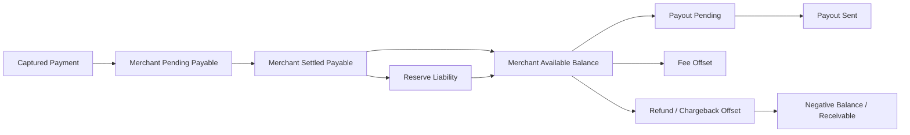
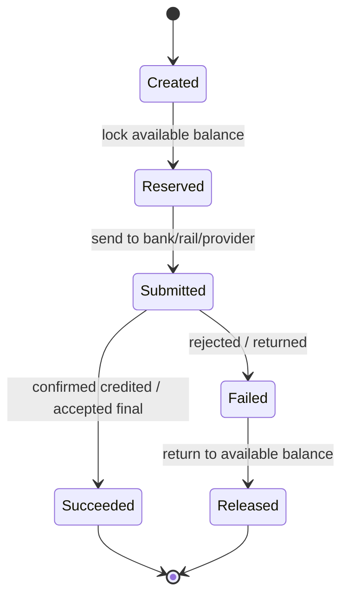

------
title: Build From Scratch: Large Production Grade Java Payment Systems - Part 024
description: Mendesain merchant accounting model untuk settlement account, payable, receivable, reserve, balance statement, negative balance, dan payout eligibility pada platform pembayaran enterprise.
series: learn-java-payment-systems
seriesTitle: Build From Scratch: Large Production Grade Java Payment Systems
order: 24
partTitle: Merchant Accounting Model
tags:
- java
- payments
- payment-systems
- merchant-accounting
- settlement
- ledger
- payout
- reserve
- reconciliation
- fintech
date: 2026-07-02
---

# Part 024 — Merchant Accounting Model: Settlement Accounts, Payable, Receivable, Reserve

Setelah Part 023, kita tahu bahwa gross payment bukan angka yang langsung bisa dikirim ke merchant.

Sekarang kita perlu menjawab pertanyaan yang lebih operasional:

> Di dalam ledger platform, bagaimana kita memodelkan uang milik merchant, uang yang masih pending, uang yang sudah settled, uang yang ditahan, uang yang sudah dipayout, uang yang harus ditagih kembali, dan uang yang menjadi risiko platform?

Part ini membangun **merchant accounting model**.

Ini bukan sekadar tabel `merchant_balance`. Ini adalah model accounting yang menjelaskan:

- merchant receivable;
- merchant payable;
- pending settlement;
- available balance;
- reserve;
- payout pending;
- payout sent;
- negative balance;
- settlement adjustment;
- invoice/fee receivable;
- dispute/chargeback receivable;
- statement dan reporting.

---

## 1. Merchant Balance Bukan Satu Angka

Jika sistem hanya menyimpan:

```sql
merchant.balance = merchant.balance + payment_amount - fee
```

maka sistem akan gagal saat:

- payment captured tapi belum settled dari provider;
- merchant belum lulus KYB;
- settlement cutoff belum lewat;
- dana harus ditahan reserve;
- refund terjadi setelah payout;
- chargeback terjadi 60 hari kemudian;
- provider settlement report berbeda dari internal expected amount;
- merchant punya pending invoice;
- payout gagal dan uang harus dikembalikan ke available balance;
- merchant punya multi-currency balance;
- platform harus menahan dana karena risk hold;
- regulator/auditor meminta statement per tanggal tertentu.

Production platform butuh beberapa bucket.



---

## 2. Merchant Accounting Vocabulary

### 2.1 Merchant Gross Sales

Nilai penjualan merchant sebelum fee, reserve, payout deduction, dan adjustment.

```txt
merchant_gross_sales = captured amount allocated to merchant
```

Untuk marketplace, gross sales bisa per seller/merchant, bukan payment total.

### 2.2 Merchant Pending Payable

Liability platform kepada merchant yang belum settled/available.

Biasanya terbentuk setelah capture.

```txt
Payment captured, but provider/bank settlement is not final yet.
```

Pending payable bukan available balance.

### 2.3 Merchant Settled Payable

Liability kepada merchant setelah platform menganggap dana underlying sudah settled atau cukup pasti untuk dilepas sesuai policy.

```txt
Funds are economically owed to merchant and have passed settlement condition.
```

### 2.4 Merchant Available Balance

Dana yang boleh dipayout setelah semua policy diterapkan:

- settlement completed;
- merchant eligible payout;
- no risk hold;
- reserve already deducted;
- negative balance offset applied;
- payout schedule condition met;
- minimum payout threshold met.

### 2.5 Reserve Liability

Dana merchant yang ditahan untuk risiko.

Reserve tetap liability ke merchant sampai digunakan/released.

### 2.6 Merchant Receivable

Amount yang merchant harus bayar ke platform.

Sumber:

- refund setelah merchant sudah dipayout;
- chargeback setelah payout;
- fee invoice unpaid;
- negative balance remediation;
- manual adjustment;
- over-settlement correction.

### 2.7 Payout Pending

Available balance yang sudah dikunci untuk payout batch, tapi transfer bank belum final.

Tujuannya mencegah uang sama dipayout dua kali.

### 2.8 Payout Clearing

Account sementara saat payout sudah dikirim ke bank/rail tetapi belum confirmed.

### 2.9 Suspense Account

Account untuk amount yang belum bisa diklasifikasikan.

Suspense bukan tempat membuang error selamanya. Semua suspense harus punya SLA resolution.

---

## 3. Chart of Accounts untuk Merchant Platform

Minimal chart of accounts:

```txt
Assets
  Cash / Bank
  Provider Receivable
  Merchant Fee Receivable
  Merchant Chargeback Receivable
  Payout Clearing

Liabilities
  Merchant Pending Payable
  Merchant Settled Payable
  Merchant Available Payable
  Merchant Reserve Liability
  Merchant Payout Pending
  Tax Payable
  Provider Fee Payable

Revenue
  Platform Commission Revenue
  Merchant Processing Fee Revenue
  FX Markup Revenue
  Payout Fee Revenue

Expenses
  Payment Processing Cost
  Chargeback Loss
  FX Loss

Contra / Adjustment
  Revenue Contra
  Settlement Adjustment
  Manual Adjustment
  Suspense
```

Untuk scale enterprise, account bisa dimensioned:

```txt
account_type + merchant_id + currency + region + payment_method + provider + legal_entity
```

Jangan membuat physical GL account baru untuk setiap kombinasi tanpa strategi indexing/partitioning. Namun ledger harus bisa query per merchant/currency/provider.

---

## 4. Account Template per Merchant

Saat merchant onboarded, sistem bisa membuat logical accounts:

```txt
merchant:{id}:pending_payable:{currency}
merchant:{id}:settled_payable:{currency}
merchant:{id}:available_payable:{currency}
merchant:{id}:reserve:{currency}
merchant:{id}:payout_pending:{currency}
merchant:{id}:receivable:{currency}
merchant:{id}:fee_receivable:{currency}
merchant:{id}:chargeback_receivable:{currency}
```

Contoh schema:

```sql
create table merchant_balance_account (
    id uuid primary key,
    merchant_id uuid not null,
    ledger_account_id uuid not null,
    account_role text not null,
    currency char(3) not null,
    status text not null check (status in ('ACTIVE', 'FROZEN', 'CLOSED')),
    created_at timestamptz not null default now(),
    unique (merchant_id, account_role, currency)
);
```

`account_role`:

```txt
PENDING_PAYABLE
SETTLED_PAYABLE
AVAILABLE_PAYABLE
RESERVE
PAYOUT_PENDING
FEE_RECEIVABLE
CHARGEBACK_RECEIVABLE
NEGATIVE_BALANCE_RECEIVABLE
SUSPENSE
```

---

## 5. Payment Capture Posting untuk Merchant

Misal customer membayar Rp1.000.000 untuk merchant M1.

```txt
Dr Provider Receivable / Payment Clearing        1,000,000
Cr Merchant Pending Payable M1                   1,000,000
```

Jika platform commission Rp50.000 dan processing fee charged Rp20.000 dipotong settlement:

```txt
Dr Merchant Pending Payable M1                      50,000
Cr Platform Commission Revenue                      50,000

Dr Merchant Pending Payable M1                      20,000
Cr Merchant Processing Fee Revenue                  20,000
```

Merchant pending payable tersisa Rp930.000.

### Important

Jangan langsung credit available balance saat capture.

Capture belum tentu berarti:

- provider sudah settle;
- fraud window aman;
- merchant eligible payout;
- no reserve required;
- no compliance hold.

---

## 6. Settlement Recognition

Ketika settlement report dari provider/bank menunjukkan dana settled:

```txt
Dr Cash / Bank                                  1,000,000
Cr Provider Receivable                          1,000,000
```

Lalu merchant payable dipindahkan dari pending ke settled/available sesuai policy:

```txt
Dr Merchant Pending Payable M1                    930,000
Cr Merchant Settled Payable M1                    930,000
```

Jika dana langsung available:

```txt
Dr Merchant Settled Payable M1                    930,000
Cr Merchant Available Payable M1                  930,000
```

Jika ada settlement lag internal, settled dan available dipisah.

---

## 7. Reserve Hold

Misal policy menahan 10% dari net merchant amount selama 30 hari.

Net merchant Rp930.000. Reserve Rp93.000.

```txt
Dr Merchant Settled Payable M1                     93,000
Cr Merchant Reserve Liability M1                   93,000

Dr Merchant Settled Payable M1                    837,000
Cr Merchant Available Payable M1                  837,000
```

Atau jika already moved to available, reserve movement:

```txt
Dr Merchant Available Payable M1                   93,000
Cr Merchant Reserve Liability M1                   93,000
```

Policy harus jelas kapan reserve dihitung:

- atas gross amount;
- atas net amount;
- atas risk score;
- atas rolling volume;
- fixed reserve amount;
- rolling reserve percentage;
- minimum reserve balance;
- merchant-specific reserve schedule.

---

## 8. Reserve Release

Setelah hold period selesai dan tidak ada dispute/risk block:

```txt
Dr Merchant Reserve Liability M1                   93,000
Cr Merchant Available Payable M1                   93,000
```

Reserve release harus idempotent.

Idempotency key:

```txt
reserve_release:<reserve_hold_id>:<release_date>
```

Jangan release reserve hanya berdasarkan cron tanpa persistent release record.

```sql
create table merchant_reserve_hold (
    id uuid primary key,
    merchant_id uuid not null,
    source_type text not null,
    source_id uuid not null,
    amount_minor bigint not null check (amount_minor > 0),
    currency char(3) not null,
    hold_reason text not null,
    hold_policy_id uuid not null,
    hold_until timestamptz,
    status text not null check (status in ('HELD', 'RELEASED', 'CONSUMED', 'CANCELLED')),
    created_at timestamptz not null default now(),
    unique (source_type, source_id, hold_reason)
);
```

---

## 9. Payout Lifecycle

Payout adalah transfer dana dari merchant available balance ke external bank account.



### 9.1 Create Payout Batch

Saat payout batch dibuat:

```txt
Dr Merchant Available Payable M1                837,000
Cr Merchant Payout Pending M1                   837,000
```

Ini mengunci dana.

### 9.2 Submit Payout

Saat payout dikirim ke bank/rail:

```txt
Dr Merchant Payout Pending M1                   837,000
Cr Payout Clearing                              837,000
```

### 9.3 Payout Succeeded

Saat uang keluar dari bank/platform cash:

```txt
Dr Payout Clearing                              837,000
Cr Cash / Bank                                  837,000
```

### 9.4 Payout Failed

Jika payout gagal sebelum uang benar-benar keluar:

```txt
Dr Merchant Payout Pending M1                   837,000
Cr Merchant Available Payable M1                837,000
```

Jika gagal setelah debit bank lalu returned, butuh cash movement terpisah:

```txt
Dr Cash / Bank                                  837,000
Cr Payout Clearing                              837,000

Dr Payout Clearing                              837,000
Cr Merchant Available Payable M1                837,000
```

Exact posting tergantung rail/provider semantics.

---

## 10. Payout Eligibility

Available balance belum tentu boleh dipayout.

Payout eligibility engine harus memeriksa:

- merchant status active;
- KYB/KYC complete;
- bank account verified;
- sanctions/risk hold absent;
- minimum payout amount;
- payout schedule;
- currency supported;
- country supported;
- negative balance offset applied;
- reserve minimum satisfied;
- tax/reporting hold absent;
- manual freeze absent;
- provider/platform risk policy.

```java
public record PayoutEligibilityDecision(
        MerchantId merchantId,
        Currency currency,
        boolean eligible,
        List<String> blockingReasons,
        Money maxPayoutAmount,
        Instant evaluatedAt
) {}
```

Do not compute payout by:

```sql
select sum(balance) from merchant_balance where merchant_id = ?
```

Compute dari ledger projection + policy engine.

---

## 11. Negative Balance

Negative balance terjadi ketika merchant liability ke platform lebih besar dari available/reserve.

Sumber:

- refund after payout;
- chargeback after payout;
- dispute fee;
- provider adjustment;
- over-settlement correction;
- fee invoice unpaid;
- fraud loss;
- payout reversal/return mismatch.

Stripe menjelaskan bahwa refund dan chargeback dapat membuat connected account balance menjadi negatif. Adyen juga mendokumentasikan reserved compensation account untuk mengompensasi negative balance pada balance platform dalam kondisi tertentu.

### 11.1 Example: Refund After Payout

Merchant sudah dipayout Rp930.000. Customer refund Rp1.000.000.

Jika tidak ada reserve:

```txt
Dr Merchant Refund Receivable M1              1,000,000
Cr Customer Refund Clearing                   1,000,000
```

Jika ada available balance Rp200.000:

```txt
Dr Merchant Available Payable M1                200,000
Dr Merchant Refund Receivable M1                800,000
Cr Customer Refund Clearing                   1,000,000
```

`Merchant Refund Receivable` merepresentasikan negative balance.

### 11.2 Recovery Strategy

Recovery bisa dilakukan lewat:

- offset dari future sales;
- consume reserve;
- debit external bank account jika mandate ada;
- invoice merchant;
- collection workflow;
- write-off setelah approval;
- suspend payout/payment capability.

Posting offset dari future sales:

```txt
Dr Merchant Pending Payable M1                  800,000
Cr Merchant Refund Receivable M1                800,000
```

---

## 12. Merchant Receivable vs Negative Balance

Jangan hanya menyimpan `available_balance = -800000`.

Lebih baik modelkan sebagai receivable.

Mengapa?

- receivable punya aging;
- bisa di-collect;
- bisa di-write-off;
- bisa di-offset;
- bisa punya case management;
- bisa diklasifikasikan sumbernya;
- finance bisa report exposure.

```sql
create table merchant_receivable (
    id uuid primary key,
    merchant_id uuid not null,
    receivable_type text not null,
    source_type text not null,
    source_id uuid not null,
    original_amount_minor bigint not null check (original_amount_minor > 0),
    outstanding_amount_minor bigint not null check (outstanding_amount_minor >= 0),
    currency char(3) not null,
    status text not null check (status in ('OPEN', 'PARTIALLY_RECOVERED', 'RECOVERED', 'WRITTEN_OFF')),
    opened_at timestamptz not null default now(),
    due_at timestamptz,
    unique (source_type, source_id, receivable_type)
);
```

---

## 13. Merchant Statement

Merchant statement adalah kontrak trust.

Merchant tidak cukup diberi:

```txt
Payout: Rp837.000
```

Mereka perlu tahu:

```txt
Gross sales              1,000,000
Platform commission        -50,000
Processing fee             -20,000
Reserve hold               -93,000
Net payout                 837,000
```

Statement juga harus bisa menjelaskan adjustment:

```txt
Previous reserve release   +93,000
Refund offset             -200,000
Chargeback fee            -150,000
Manual adjustment          +10,000
```

### 13.1 Statement Model

```sql
create table merchant_statement (
    id uuid primary key,
    merchant_id uuid not null,
    statement_period_start date not null,
    statement_period_end date not null,
    currency char(3) not null,
    opening_balance_minor bigint not null,
    closing_balance_minor bigint not null,
    status text not null check (status in ('DRAFT', 'FINALIZED', 'REISSUED')),
    generated_at timestamptz not null default now(),
    finalized_at timestamptz,
    unique (merchant_id, statement_period_start, statement_period_end, currency, status)
);
```

```sql
create table merchant_statement_line (
    id uuid primary key,
    statement_id uuid not null references merchant_statement(id),
    ledger_journal_id uuid not null,
    line_type text not null,
    source_type text not null,
    source_id uuid not null,
    description text not null,
    amount_minor bigint not null,
    currency char(3) not null,
    occurred_at timestamptz not null
);
```

Statement harus reproducible. Kalau ledger correction dibuat setelah statement finalized, jangan silently mutate statement lama. Buat reissue atau adjustment di statement berikutnya sesuai policy.

---

## 14. Merchant Balance Snapshot

Query balance dari ledger entries langsung bisa mahal.

Gunakan projection/snapshot.

```sql
create table merchant_balance_snapshot (
    id uuid primary key,
    merchant_id uuid not null,
    account_role text not null,
    currency char(3) not null,
    balance_minor bigint not null,
    ledger_sequence bigint not null,
    snapshot_at timestamptz not null default now(),
    unique (merchant_id, account_role, currency)
);
```

Setiap ledger journal punya monotonic sequence.

Projection worker:

```txt
read ledger journals after last_sequence
apply entries to merchant_balance_snapshot
commit last_sequence
```

Invariant:

```txt
snapshot balance at sequence N = sum ledger entries up to sequence N
```

Periodic rebuild job harus memverifikasi ini.

---

## 15. Settlement Batch Model

Settlement batch mengelompokkan dana yang akan atau sudah diproses.

```sql
create table merchant_settlement_batch (
    id uuid primary key,
    merchant_id uuid not null,
    currency char(3) not null,
    batch_type text not null check (batch_type in ('SETTLEMENT', 'PAYOUT', 'RESERVE_RELEASE', 'ADJUSTMENT')),
    status text not null check (status in ('CREATED', 'LOCKED', 'SUBMITTED', 'SUCCEEDED', 'FAILED', 'CANCELLED')),
    cutoff_start timestamptz not null,
    cutoff_end timestamptz not null,
    gross_amount_minor bigint not null,
    deduction_amount_minor bigint not null,
    net_amount_minor bigint not null,
    created_at timestamptz not null default now()
);
```

```sql
create table merchant_settlement_batch_item (
    id uuid primary key,
    batch_id uuid not null references merchant_settlement_batch(id),
    source_type text not null,
    source_id uuid not null,
    amount_minor bigint not null,
    currency char(3) not null,
    item_status text not null,
    unique (batch_id, source_type, source_id)
);
```

Batch harus immutable setelah locked/submitted. Jika ada perubahan, buat adjustment batch.

---

## 16. Cutoff dan Availability

Settlement/payment platform harus punya cutoff model.

Contoh:

```txt
Payments captured before 23:00 local time are eligible for T+2 payout.
Payments captured after 23:00 are eligible for next cycle.
High-risk merchants have T+7 availability.
QR payments have T+1 availability.
Bank transfer may be same-day after confirmation.
```

Schema:

```sql
create table availability_policy (
    id uuid primary key,
    policy_code text not null,
    version integer not null,
    payment_method text,
    merchant_risk_tier text,
    currency char(3),
    country_code char(2),
    delay_days integer not null,
    cutoff_time time,
    timezone text not null,
    status text not null,
    effective_from timestamptz not null,
    effective_to timestamptz,
    unique (policy_code, version)
);
```

Availability decision should be recorded:

```sql
create table merchant_availability_decision (
    id uuid primary key,
    merchant_id uuid not null,
    source_type text not null,
    source_id uuid not null,
    policy_id uuid not null,
    amount_minor bigint not null,
    currency char(3) not null,
    available_at timestamptz not null,
    decision_reason text not null,
    created_at timestamptz not null default now(),
    unique (source_type, source_id, policy_id)
);
```

---

## 17. Merchant Hold / Freeze

Operationally, platform perlu menahan merchant funds.

Jenis hold:

- compliance hold;
- risk hold;
- fraud investigation;
- negative balance hold;
- tax/reporting hold;
- legal/regulatory hold;
- manual hold;
- payout bank verification hold.

Hold harus eksplisit, bukan flag misterius.

```sql
create table merchant_fund_hold (
    id uuid primary key,
    merchant_id uuid not null,
    hold_type text not null,
    scope text not null check (scope in ('ALL_FUNDS', 'PAYOUT_ONLY', 'SPECIFIC_AMOUNT', 'SPECIFIC_CURRENCY')),
    amount_minor bigint,
    currency char(3),
    reason text not null,
    status text not null check (status in ('ACTIVE', 'RELEASED', 'EXPIRED')),
    created_by text not null,
    approved_by text,
    created_at timestamptz not null default now(),
    released_at timestamptz
);
```

Controls:

- high-impact hold requires approval;
- hold reason mandatory;
- release reason mandatory;
- expiry optional but recommended;
- merchant notification policy configurable;
- all hold changes logged in audit trail.

---

## 18. Payout Failure Semantics

Payout failure bukan satu jenis.

| Failure Type | Uang keluar? | Treatment |
|---|---:|---|
| Validation rejected before submission | Tidak | release to available |
| Bank account invalid after submission | Mungkin tidak | release or wait provider confirmation |
| Transfer returned after debit | Ya lalu balik | record cash return, release balance |
| Unknown outcome | Tidak tahu | keep in payout clearing until resolved |
| Duplicate payout request | Harus dicegah | idempotency + payout pending lock |

Unknown payout outcome harus diperlakukan seperti unknown payment outcome.

Jangan langsung release dana jika provider timeout saat payout submission. Bisa menyebabkan double payout.

---

## 19. Multi-Currency Merchant Accounting

Merchant bisa punya balance per currency.

```txt
merchant:M1:available:IDR
merchant:M1:available:USD
merchant:M1:reserve:IDR
merchant:M1:reserve:USD
```

Jangan campur currency dalam satu balance.

Jika platform melakukan conversion sebelum payout:

```txt
Dr Merchant Available Payable USD                 100.00 USD
Cr FX Clearing USD                                100.00 USD

Dr FX Clearing IDR                          1,600,000 IDR
Cr Merchant Available Payable IDR           1,600,000 IDR
```

FX gain/loss atau markup harus diposting sesuai accounting policy.

---

## 20. Reconciliation untuk Merchant Accounting

Merchant accounting harus direconcile terhadap:

1. internal payment ledger;
2. provider settlement report;
3. bank statement;
4. merchant statement;
5. payout provider/bank report;
6. dispute/chargeback report;
7. fee invoice/report.

Adyen menyediakan Balance Platform Accounting Report yang melacak balance changes pada balance accounts dalam balance platform, dan Payment Accounting Report yang memuat lifecycle status changes/events/modifications untuk transaksi dan bisa dipakai untuk invoice reconciliation. Ini menegaskan bahwa payment accounting tidak cukup memakai payment status; butuh financial activity report.

### 20.1 Reconciliation Questions

- Apakah semua captured payment punya merchant payable posting?
- Apakah semua provider settled payment punya cash/provider receivable posting?
- Apakah semua fee charged punya revenue/cost posting?
- Apakah settlement amount provider sama dengan expected?
- Apakah semua payout batch punya bank debit?
- Apakah failed payout sudah direlease?
- Apakah reserve release sudah sesuai hold policy?
- Apakah merchant statement closing balance sama dengan ledger snapshot?

---

## 21. Merchant Balance API

API internal untuk merchant balance tidak boleh hanya mengembalikan satu angka.

```json
{
  "merchantId": "mrc_123",
  "currency": "IDR",
  "asOfSequence": 9827341,
  "balances": {
    "pending": 125000000,
    "settled": 30000000,
    "available": 20000000,
    "reserve": 10000000,
    "payoutPending": 5000000,
    "receivable": 2500000
  },
  "payoutEligibility": {
    "eligible": true,
    "maxPayoutAmount": 17500000,
    "blockingReasons": []
  }
}
```

`available` tidak otomatis sama dengan `maxPayoutAmount` karena eligibility rules bisa menahan sebagian.

---

## 22. Java Model: Merchant Account Roles

```java
public enum MerchantAccountRole {
    PENDING_PAYABLE,
    SETTLED_PAYABLE,
    AVAILABLE_PAYABLE,
    RESERVE,
    PAYOUT_PENDING,
    FEE_RECEIVABLE,
    CHARGEBACK_RECEIVABLE,
    NEGATIVE_BALANCE_RECEIVABLE,
    SUSPENSE
}
```

```java
public record MerchantBalance(
        MerchantId merchantId,
        Currency currency,
        Money pending,
        Money settled,
        Money available,
        Money reserve,
        Money payoutPending,
        Money receivable,
        long ledgerSequence
) {
    public Money economicExposure() {
        return receivable.minus(reserve);
    }

    public Money payoutCandidateAmount() {
        return available.minus(receivable.min(available));
    }
}
```

### 22.1 Payout Reservation Service

```java
public final class PayoutReservationService {
    private final Ledger ledger;
    private final MerchantBalanceRepository balances;
    private final PayoutRepository payouts;
    private final PayoutEligibilityService eligibility;

    public PayoutId reserveForPayout(MerchantId merchantId, Currency currency, Money requestedAmount) {
        PayoutEligibilityDecision decision = eligibility.evaluate(merchantId, currency);
        if (!decision.eligible()) {
            throw new PayoutBlockedException(decision.blockingReasons());
        }

        Money amount = requestedAmount.min(decision.maxPayoutAmount());
        if (amount.isZeroOrNegative()) {
            throw new NoPayoutableBalanceException();
        }

        Payout payout = payouts.createReserved(merchantId, currency, amount);

        ledger.post(new JournalCommand(
                "PAYOUT_RESERVATION",
                payout.id().toString(),
                List.of(
                        PostingLine.debit(AccountRef.merchantAvailable(merchantId, currency), amount),
                        PostingLine.credit(AccountRef.merchantPayoutPending(merchantId, currency), amount)
                )
        ));

        return payout.id();
    }
}
```

Concurrency requirement:

- reservation must lock or atomically decrement available projection;
- ledger posting must be idempotent;
- payout ID must be unique;
- duplicate request must not reserve twice.

---

## 23. Accounting Events

Merchant accounting should emit domain/integration events:

```txt
MerchantPayableCreated
MerchantFeeDeducted
MerchantSettlementRecognized
MerchantFundsMadeAvailable
MerchantReserveHeld
MerchantReserveReleased
MerchantPayoutReserved
MerchantPayoutSubmitted
MerchantPayoutSucceeded
MerchantPayoutFailed
MerchantReceivableCreated
MerchantReceivableRecovered
MerchantStatementFinalized
```

Events must not be the source of financial truth. Ledger is source of financial truth. Events are notification/projection mechanisms.

---

## 24. Audit Trail

Every merchant accounting action must answer:

```txt
Who caused this movement?
What source event caused it?
Which ledger journal posted it?
Which policy version applied?
Which operator approved it?
Which report/file supports it?
Was it automatic or manual?
Can it be reversed?
```

Manual adjustment especially dangerous.

Manual adjustment record:

```sql
create table merchant_manual_adjustment (
    id uuid primary key,
    merchant_id uuid not null,
    adjustment_type text not null,
    amount_minor bigint not null,
    currency char(3) not null,
    reason text not null,
    evidence_uri text,
    status text not null check (status in ('DRAFT', 'APPROVED', 'POSTED', 'REJECTED', 'REVERSED')),
    created_by text not null,
    approved_by text,
    ledger_journal_id uuid,
    created_at timestamptz not null default now(),
    approved_at timestamptz,
    posted_at timestamptz
);
```

---

## 25. Merchant Accounting Failure Model

| Failure | Bad Outcome | Control |
|---|---|---|
| Duplicate capture event | payable doubled | idempotent ledger key |
| Settlement report delayed | funds remain pending | settlement SLA monitor |
| Payout worker retries | double payout | payout pending lock + idempotency |
| Payout timeout | wrong release | unknown outcome state |
| Refund after payout | platform loss hidden | merchant receivable |
| Chargeback after payout | negative balance untracked | receivable + reserve + recovery workflow |
| Reserve cron duplicate | reserve released twice | reserve release idempotency |
| Statement regenerated | history changed | finalized statement immutability |
| Manual adjustment misuse | fraud/accounting error | maker-checker + audit |
| Multi-currency mixed | wrong balance | per-currency account invariant |

---

## 26. Invariants

Core invariants:

```txt
merchant available cannot be paid out twice
payout pending must correspond to payout record
reserve is liability, not revenue
receivable has source and recovery status
settlement batch net = sum items after deductions
statement opening + activity = closing
ledger projection equals ledger entries at sequence
no cross-currency balance summation without FX event
manual adjustment requires approval before posting
failed payout must end either released or succeeded, not both
```

Ledger invariants:

```txt
every journal balances to zero per currency
all merchant balance movements use ledger postings
no direct update to merchant balance projection except projection worker
all reversal references original journal
all adjustment references evidence/reason
```

---

## 27. Observability

Metrics:

```txt
merchant_pending_balance_amount{currency, merchant_segment}
merchant_available_balance_amount{currency}
merchant_reserve_balance_amount{currency, risk_tier}
merchant_receivable_outstanding_amount{currency, receivable_type}
payout_pending_age_seconds{provider, currency}
payout_failed_total{reason}
reserve_release_due_total{currency}
negative_balance_merchant_total{risk_tier}
settlement_batch_amount{currency, status}
merchant_statement_generation_failed_total{reason}
```

Alerts:

- payout pending too old;
- payout clearing unresolved;
- reserve hold past release date;
- negative balance above threshold;
- merchant receivable aging > threshold;
- statement closing balance mismatch;
- settlement batch stuck locked/submitted;
- available balance projection mismatch;
- manual adjustment volume spike;
- merchant has payout while compliance hold active.

---

## 28. Backoffice Views

Backoffice merchant accounting should show:

1. balance summary by currency;
2. pending vs available vs reserve vs receivable;
3. payout eligibility blocking reasons;
4. recent ledger movements;
5. settlement batches;
6. payout history;
7. reserve holds and release schedule;
8. receivables and recovery status;
9. statements;
10. manual adjustments;
11. reconciliation breaks;
12. risk/compliance holds.

Do not let operators edit balance directly.

Operators create controlled actions:

- hold funds;
- release hold;
- approve payout retry;
- create manual adjustment draft;
- approve adjustment;
- write off receivable;
- freeze payouts;
- unfreeze payouts.

Every action posts ledger journal or changes policy state with audit.

---

## 29. Build From Scratch Exercise

Implement `merchant-accounting-service` with modules:

```txt
merchant-account-template
merchant-balance-projection
settlement-recognition
availability-policy
reserve-engine
payout-reservation
merchant-receivable
merchant-statement
manual-adjustment
```

### 29.1 Required Commands

```http
POST /internal/merchant-accounting/captures/{captureId}/recognize
POST /internal/merchant-accounting/settlements/{settlementId}/recognize
POST /internal/merchant-accounting/reserves/hold
POST /internal/merchant-accounting/reserves/{holdId}/release
POST /internal/merchant-accounting/payouts/reserve
POST /internal/merchant-accounting/payouts/{payoutId}/mark-submitted
POST /internal/merchant-accounting/payouts/{payoutId}/mark-succeeded
POST /internal/merchant-accounting/payouts/{payoutId}/mark-failed
POST /internal/merchant-accounting/receivables/{receivableId}/recover
POST /internal/merchant-accounting/statements/generate
```

### 29.2 Required Read APIs

```http
GET /internal/merchants/{merchantId}/balances?currency=IDR
GET /internal/merchants/{merchantId}/statements
GET /internal/merchants/{merchantId}/receivables
GET /internal/merchants/{merchantId}/reserve-holds
GET /internal/merchants/{merchantId}/payouts
```

Definition of done:

- no direct mutable merchant balance;
- balance projection derived from ledger;
- payout reservation prevents double payout;
- reserve hold/release idempotent;
- receivable created when negative event exceeds available/reserve;
- statement is reproducible and finalizable;
- manual adjustment requires approval;
- failed payout returns funds correctly;
- all postings balanced per currency.

---

## 30. Anti-Patterns

### 30.1 One Mutable Merchant Balance

Too weak for payment systems.

### 30.2 Payout from Pending Balance

Creates liquidity and risk issues.

### 30.3 Treating Provider Settlement as Merchant Settlement Automatically

Provider settlement is evidence, not always immediate permission to payout merchant.

### 30.4 No Receivable Model

Negative balances become hidden losses.

### 30.5 Reserve as Negative Fee

Reserve is still merchant liability, not revenue.

### 30.6 Statement Generated from Current State Only

Historical statement must be reproducible.

### 30.7 Payout Retry Without Unknown Outcome Handling

Can cause double payout.

---

## 31. Mental Model yang Harus Dibawa

Merchant accounting adalah jembatan antara:

```txt
payment lifecycle -> ledger -> settlement -> payout -> merchant trust -> finance reporting
```

Sistem yang baik tidak bertanya:

> Berapa balance merchant sekarang?

Ia bertanya:

> Balance apa, di bucket mana, currency apa, berdasarkan ledger sequence berapa, boleh dipayout atau tidak, ditahan oleh policy apa, dan bisa dijelaskan lewat statement mana?

Kalau jawaban itu bisa diberikan dengan konsisten, payment platform mulai punya fondasi enterprise.

---

## References

- Stripe Docs — Understanding Connect Account Balances: https://docs.stripe.com/connect/account-balances
- Stripe Docs — Payouts to Connected Accounts: https://docs.stripe.com/connect/payouts-connected-accounts
- Stripe Docs — Connect Risk Management: https://docs.stripe.com/connect/risk-management
- Stripe Docs — Minimum Balances for Automatic Payouts: https://docs.stripe.com/payouts/minimum-balances-for-automatic-payouts
- Adyen Docs — Balances: https://docs.adyen.com/account/balances
- Adyen Docs — Reserve: https://docs.adyen.com/account/balances/reserve
- Adyen Docs — Balance Platform Accounting Report: https://docs.adyen.com/platforms/reports-and-fees/balance-platform-accounting-report
- Adyen Docs — Payment Accounting Report: https://docs.adyen.com/reporting/invoice-reconciliation/payment-accounting-report
- Adyen Docs — Manage Liable Balance Accounts: https://docs.adyen.com/platforms/manage-liable-accounts
- Adyen Docs — Account Structure and Resources: https://docs.adyen.com/marketplaces/account-structure-resources
