------
title: Build From Scratch: Large Production Grade Java Payment Systems - Part 025
description: Card payment architecture for production Java payment systems: authorization, authentication, capture, void, clearing, settlement, refund, reversal, chargeback, provider integration, state machine, ledger boundaries, and failure handling.
series: learn-java-payment-systems
seriesTitle: Build From Scratch: Large Production Grade Java Payment Systems
order: 25
partTitle: Card Payment Architecture
tags:
- java
- payments
- card-payments
- authorization
- capture
- settlement
- chargeback
- ledger
- fintech
date: 2026-07-02
---

# Part 025 — Card Payment Architecture

Card payment is usually the first rail engineers imagine when they hear `payment system`, but it is also one of the easiest rails to model incorrectly.

A dummy implementation says:

```java
charge(card, amount);
```

A production payment system cannot think like that.

A production card payment is not one action. It is a chain of financial, network, risk, customer-authentication, clearing, settlement, fee, dispute, and evidence events. Some happen synchronously. Some arrive days later. Some reverse earlier assumptions. Some produce money movement. Some only produce permission to move money.

The practical mental model:

> A card payment starts as a merchant request, becomes a payment intent, may produce one or more payment attempts, may require cardholder authentication, may receive issuer authorization, may later be captured, cleared, settled, refunded, disputed, or reversed. Your system must preserve every step as evidence and only post ledger movement when the financial meaning is known.

This part focuses on architecture, not card-network certification. We are building an enterprise merchant-side payment platform, payment orchestrator, or PSP-like system in Java. We are not implementing VisaNet, Mastercard Banknet, an issuer processor, or an ISO 8583 switch from scratch.

---

## 1. What Problem This Part Solves

You already have the foundation:

- Part 001: money movement mental model
- Part 004: lifecycle
- Part 008: state machines
- Part 009: idempotency
- Part 013–016: orchestration, provider adapter, webhook ingestion
- Part 020–024: ledger, balances, merchant accounting

Now we bind those foundations to the card rail.

A production card payment platform must answer:

1. What is the difference between **authentication**, **authorization**, **capture**, **clearing**, and **settlement**?
2. When does money actually move?
3. What does the ledger post at auth time vs capture time vs settlement time?
4. How do partial capture, multiple capture, void, refund, reversal, and chargeback differ?
5. What state transitions are legal?
6. How do you handle timeout after authorization request?
7. How do you avoid double capture?
8. How do you reconcile card settlement reports against internal ledger?
9. How do you keep card data out of most services?
10. How do you design APIs and domain model that survive multiple providers?

---

## 2. Card Payment Is a Multi-Party Protocol

Card payment involves many actors.

```mermaid
flowchart LR
    C[Customer / Cardholder]
    M[Merchant]
    P[Payment Platform]
    PSP[PSP / Gateway / Processor]
    A[Acquirer]
    N[Card Network / Scheme]
    I[Issuer]

    C -->|card credential| M
    M -->|payment request| P
    P -->|normalized command| PSP
    PSP --> A
    A --> N
    N --> I
    I --> N
    N --> A
    A --> PSP
    PSP --> P
    P --> M
```

Each actor sees a different slice of truth:

| Actor | Main concern |
|---|---|
| Customer | Did I pay? Was I charged? Can I get refund? |
| Merchant | Can I fulfill order? When do I get paid? |
| Payment platform | Can I safely authorize, capture, ledger, reconcile, and settle? |
| Gateway/processor | Can I route and process card messages? |
| Acquirer | Can I sponsor merchant access to card networks? |
| Network/scheme | Can I route transactions and enforce scheme rules? |
| Issuer | Should this cardholder transaction be approved? |
| Regulator/auditor | Was cardholder data protected and money movement explainable? |

Your platform should not collapse these actors into one `provider` abstraction too early. The abstraction must preserve financial meaning.

---

## 3. The Core Card Payment Lifecycle

A common e-commerce card lifecycle:

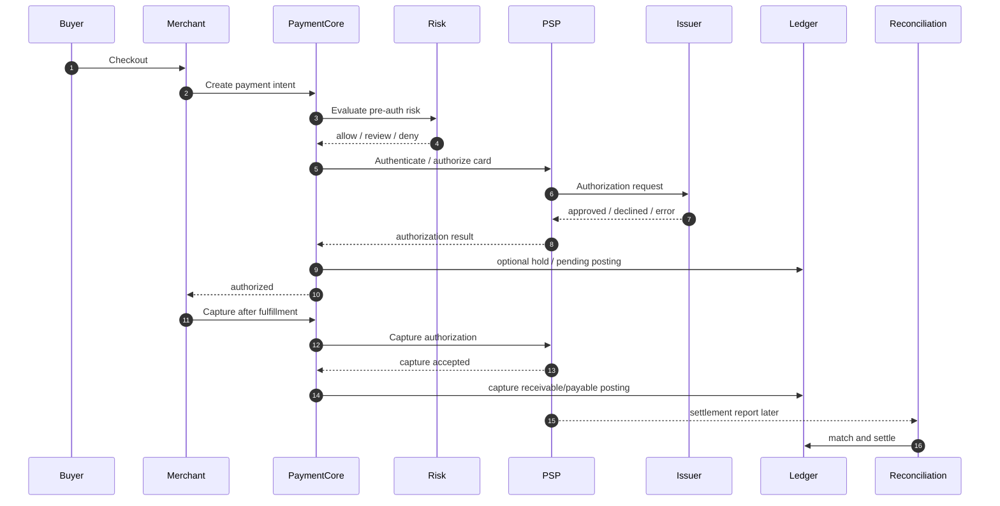

Important distinction:

- **Authorization**: issuer approves reservation/permission. It is not final merchant funding.
- **Capture**: merchant submits authorized transaction for clearing/settlement.
- **Clearing**: transaction data moves through scheme/acquirer/issuer for financial processing.
- **Settlement**: funds move between institutions and eventually become merchant payable/available.

Do not treat `authorized == paid`.

In many merchant systems, `authorized` may be enough to reserve inventory, but not enough to recognize revenue or release settlement funds.

---

## 4. Authentication vs Authorization

Authentication asks:

> Is the person initiating the transaction likely the legitimate cardholder?

Authorization asks:

> Will the issuer approve this transaction amount for this card/account under current risk, balance, and rule conditions?

They are related but not the same.

Examples:

| Scenario | Authentication | Authorization |
|---|---|---|
| Frictionless 3DS success, issuer approves | successful | approved |
| 3DS challenge fails | failed | usually not attempted |
| 3DS unavailable, merchant proceeds | unavailable | may approve or decline |
| Cardholder authenticated but insufficient funds | successful | declined |
| No 3DS, issuer approves low-risk transaction | absent | approved |

Production domain model should represent authentication separately.

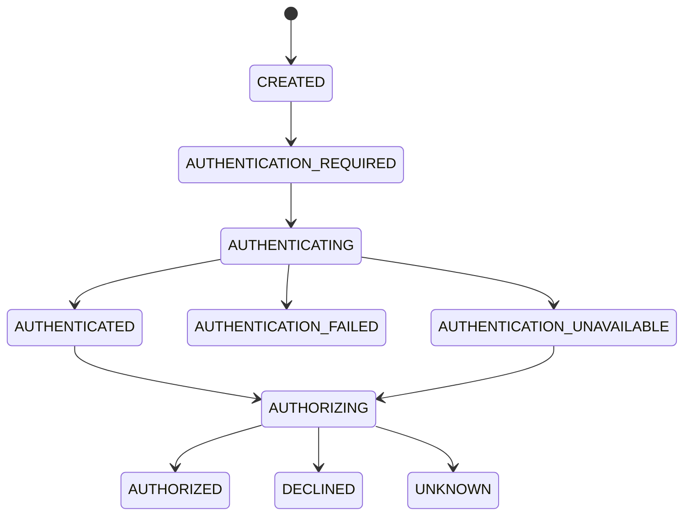

A common mistake is to store only one field:

```text
payment_status = SUCCESS
```

That field cannot explain whether the cardholder was authenticated, whether authorization happened, whether capture happened, whether settlement happened, or whether a later dispute reversed the economics.

---

## 5. Authorization Model

Authorization is a request to the issuer through the card network/acquirer path.

A production authorization object should preserve:

| Field | Why it matters |
|---|---|
| `authorization_id` | Internal aggregate ID |
| `payment_attempt_id` | Ties auth to a specific attempt |
| `provider_operation_id` | Idempotent provider call reference |
| `provider_authorization_id` | External auth code/reference |
| `amount` | Authorized amount |
| `currency` | Must match capture/refund rules |
| `status` | approved, declined, unknown, expired, reversed |
| `auth_code` | Provider/network authorization code where available |
| `avs_result` | Address verification result where available |
| `cvv_result` | CVV/CVC result where available |
| `eci` | E-commerce indicator for 3DS/card-not-present context |
| `liability_shift` | Risk and dispute implications |
| `expires_at` | Capture deadline/validity |
| `raw_provider_payload_ref` | Evidence without leaking PAN |

Authorization statuses should be richer than success/fail.

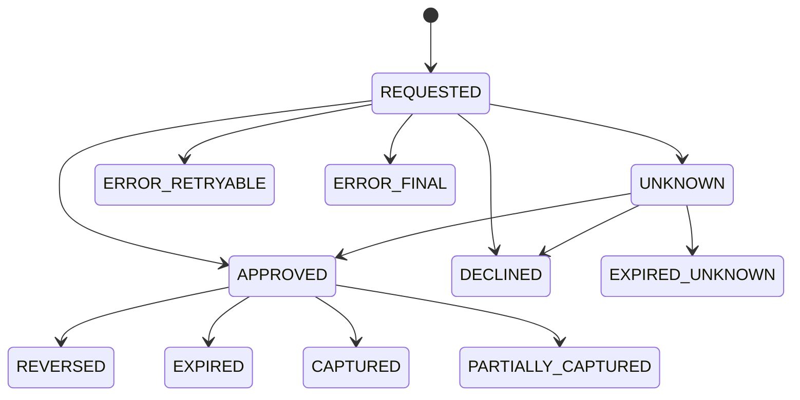

### Decline Is Not an Exception

Decline is a business result, not a system failure.

Bad model:

```java
try {
    provider.authorize(card, amount);
} catch (Exception e) {
    markFailed(paymentId);
}
```

Better model:

```java
sealed interface AuthorizationResult {
    record Approved(AuthApproval approval) implements AuthorizationResult {}
    record Declined(Decline decline) implements AuthorizationResult {}
    record Unknown(UnknownOutcome unknown) implements AuthorizationResult {}
    record TechnicalFailure(ProviderFailure failure) implements AuthorizationResult {}
}
```

A card decline has semantics: insufficient funds, suspected fraud, do not honor, expired card, invalid CVC, restricted card, lost/stolen card, authentication required, processing error, etc.

You may not expose raw issuer/network codes directly to merchants or customers, but you must preserve them internally for reconciliation, support, and risk analytics.

---

## 6. Capture Model

Capture submits an authorization for clearing/settlement.

It answers:

> Convert this previously approved authorization into a financial transaction to be settled.

Capture can be:

| Capture mode | Meaning |
|---|---|
| Automatic capture | Auth and capture are requested in one flow, common for digital goods/simple checkout |
| Manual capture | Merchant authorizes first, captures later after fulfillment |
| Partial capture | Capture less than authorized amount |
| Multiple capture | Multiple captures against one authorization where provider/scheme supports it |
| Final capture | Capture that releases remaining uncaptured amount |

Your domain should not assume every provider supports every mode.

```java
public enum CaptureMode {
    AUTOMATIC,
    MANUAL_SINGLE,
    MANUAL_PARTIAL,
    MANUAL_MULTIPLE
}
```

Provider capability matrix:

```sql
create table card_provider_capability (
    provider_code text not null,
    card_brand text not null,
    country_code char(2),
    currency char(3) not null,
    supports_manual_capture boolean not null,
    supports_partial_capture boolean not null,
    supports_multiple_capture boolean not null,
    max_auth_validity_days integer,
    primary key (provider_code, card_brand, country_code, currency)
);
```

Capture requires strong constraints.

```sql
create table card_capture (
    capture_id uuid primary key,
    authorization_id uuid not null,
    payment_intent_id uuid not null,
    amount_minor bigint not null check (amount_minor > 0),
    currency char(3) not null,
    status text not null check (status in (
        'REQUESTED', 'ACCEPTED', 'DECLINED', 'UNKNOWN', 'FAILED', 'SETTLED', 'REVERSED'
    )),
    idempotency_key text not null,
    provider_capture_id text,
    created_at timestamptz not null default now(),
    updated_at timestamptz not null default now(),
    unique (authorization_id, idempotency_key)
);
```

You also need a guard against over-capture.

```sql
create table card_authorization_capture_summary (
    authorization_id uuid primary key,
    authorized_amount_minor bigint not null,
    captured_amount_minor bigint not null default 0,
    currency char(3) not null,
    version bigint not null default 0,
    check (captured_amount_minor >= 0),
    check (captured_amount_minor <= authorized_amount_minor)
);
```

Update pattern:

```sql
update card_authorization_capture_summary
set captured_amount_minor = captured_amount_minor + :capture_amount,
    version = version + 1
where authorization_id = :authorization_id
  and currency = :currency
  and captured_amount_minor + :capture_amount <= authorized_amount_minor;
```

If this update affects zero rows, the capture is illegal or racing.

---

## 7. Void vs Reversal vs Refund

These terms are often confused.

| Operation | Applies when | Financial meaning |
|---|---|---|
| Void | Authorization/capture not yet settled depending on provider | Cancel pending transaction before settlement |
| Authorization reversal | Approved auth no longer needed | Release cardholder hold/authorization |
| Refund | Captured/settled transaction exists | Return money to cardholder after capture |
| Chargeback | Cardholder/issuer disputes transaction | Scheme/issuer reverses economics through dispute process |

Do not implement them as one endpoint called `/reverse`.

### Authorization Reversal

Use when merchant no longer needs the authorized hold.

Example: hotel pre-auth for deposit, then release unused amount.

State effect:

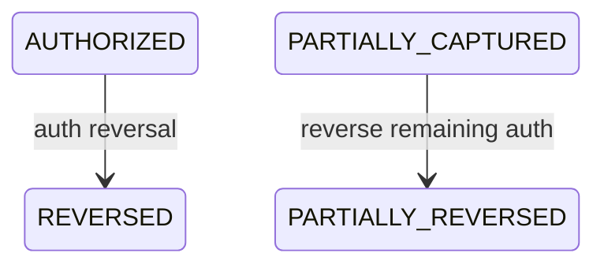

Ledger effect may be bucket release, not money return.

### Void

Provider-specific. Some systems allow voiding a capture before batch close/settlement.

Void is not always available after capture acceptance. The platform must know provider capability and timing.

### Refund

Refund applies after capture. It may settle as separate money movement. Refund can be:

- full
- partial
- multiple partial
- provider-initiated
- merchant-initiated
- forced due to risk/compliance

Refund is not the same as failed capture.

---

## 8. Ledger Posting for Card Payments

A simple but useful merchant-side ledger model:

### At Authorization

Two options:

1. Do not post financial ledger yet; store auth evidence only.
2. Post an off-balance hold/reservation journal if your system needs to model fulfillment risk.

For many PSP/merchant platforms, no actual merchant payable exists until capture is accepted or clearing occurs.

### At Capture Accepted

A capture accepted by provider often creates expected receivable and merchant pending payable.

```text
Dr Card Network / Acquirer Receivable
    Cr Merchant Pending Payable
    Cr Platform Fee Revenue / Fee Payable depending accounting policy
```

Depending on your accounting policy, fee recognition may happen at capture, settlement, or payout. Do not hardcode this globally.

### At Settlement Report Matched

When provider/acquirer settlement confirms funds:

```text
Dr Cash / Settlement Bank Account
    Cr Card Network / Acquirer Receivable
```

Move merchant balance bucket:

```text
Dr Merchant Pending Payable
    Cr Merchant Settled Payable
```

### At Payout

```text
Dr Merchant Settled Payable
    Cr Cash / Settlement Bank Account
```

### At Refund

Refund before settlement may reduce receivable/payable. Refund after settlement may create payable from platform/merchant to cardholder path.

A production ledger posting rule must include the timing context:

```java
public enum CardFinancialEventType {
    AUTH_APPROVED,
    AUTH_REVERSED,
    CAPTURE_ACCEPTED,
    CAPTURE_REVERSED,
    SETTLEMENT_MATCHED,
    REFUND_ACCEPTED,
    REFUND_SETTLED,
    CHARGEBACK_OPENED,
    CHARGEBACK_WON,
    CHARGEBACK_LOST,
    REPRESENTMENT_FEE_ASSESSED
}
```

---

## 9. Card Payment Aggregate Design

A useful aggregate split:

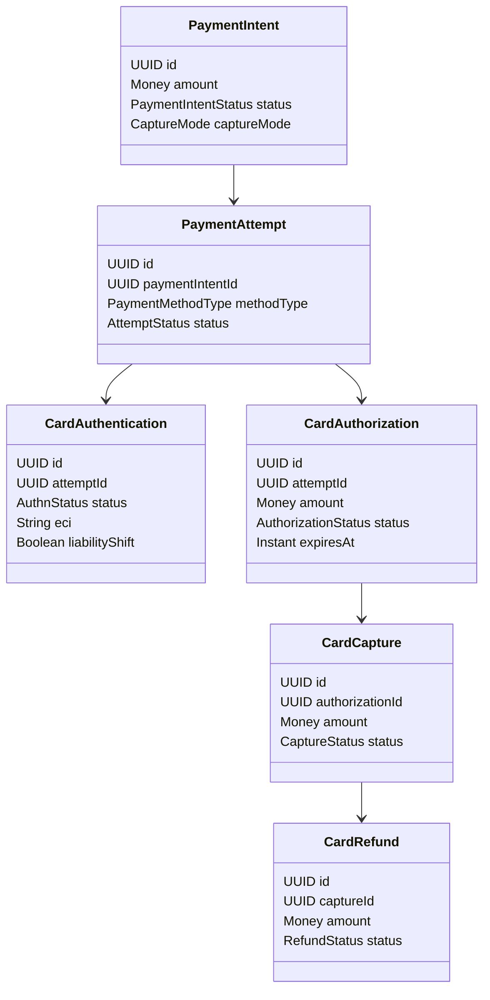

Why split like this?

Because each has different idempotency, lifecycle, evidence, and ledger meaning.

A single `payments` table cannot safely represent:

- multiple attempts
- one auth with partial captures
- one capture with multiple refunds
- separate authentication result
- dispute lifecycle
- settlement matching
- provider references per operation

---

## 10. Database Sketch

### Payment Attempt

```sql
create table payment_attempt (
    attempt_id uuid primary key,
    payment_intent_id uuid not null,
    payment_method_type text not null,
    provider_code text not null,
    status text not null,
    amount_minor bigint not null check (amount_minor > 0),
    currency char(3) not null,
    idempotency_key text not null,
    created_at timestamptz not null default now(),
    updated_at timestamptz not null default now(),
    version bigint not null default 0,
    unique (payment_intent_id, idempotency_key)
);
```

### Card Authentication

```sql
create table card_authentication (
    authentication_id uuid primary key,
    attempt_id uuid not null references payment_attempt(attempt_id),
    status text not null check (status in (
        'NOT_REQUIRED', 'REQUIRED', 'PENDING', 'FRICTIONLESS_SUCCEEDED',
        'CHALLENGE_REQUIRED', 'CHALLENGE_SUCCEEDED', 'FAILED', 'UNAVAILABLE'
    )),
    protocol text,
    eci text,
    cavv_ref text,
    ds_transaction_id text,
    liability_shift boolean,
    provider_reference text,
    created_at timestamptz not null default now(),
    updated_at timestamptz not null default now()
);
```

Do not store sensitive authentication cryptograms casually. Store only what your provider contract, PCI/security boundary, and audit policy allow.

### Card Authorization

```sql
create table card_authorization (
    authorization_id uuid primary key,
    attempt_id uuid not null references payment_attempt(attempt_id),
    status text not null check (status in (
        'REQUESTED', 'APPROVED', 'DECLINED', 'UNKNOWN', 'EXPIRED', 'REVERSED'
    )),
    amount_minor bigint not null check (amount_minor > 0),
    currency char(3) not null,
    auth_code text,
    provider_authorization_id text,
    provider_response_code text,
    normalized_decline_code text,
    expires_at timestamptz,
    raw_event_ref text,
    created_at timestamptz not null default now(),
    updated_at timestamptz not null default now(),
    version bigint not null default 0
);
```

### Provider Operation

Every external call needs an operation record.

```sql
create table provider_operation (
    operation_id uuid primary key,
    provider_code text not null,
    operation_type text not null,
    aggregate_type text not null,
    aggregate_id uuid not null,
    idempotency_key text not null,
    request_fingerprint text not null,
    status text not null check (status in (
        'PENDING', 'SENT', 'SUCCEEDED', 'DECLINED', 'UNKNOWN', 'FAILED'
    )),
    provider_reference text,
    http_status integer,
    provider_response_code text,
    error_class text,
    created_at timestamptz not null default now(),
    updated_at timestamptz not null default now(),
    unique (provider_code, operation_type, idempotency_key)
);
```

This table is the evidence bridge between command and provider outcome.

---

## 11. Java Domain Sketch

```java
public record CardAuthorizationCommand(
    PaymentIntentId paymentIntentId,
    PaymentAttemptId attemptId,
    PaymentMethodToken paymentMethodToken,
    Money amount,
    CaptureMode captureMode,
    IdempotencyKey idempotencyKey,
    MerchantContext merchantContext,
    RiskContext riskContext
) {}
```

```java
public final class CardAuthorizationService {
    private final PaymentAttemptRepository attemptRepository;
    private final ProviderOperationRepository operationRepository;
    private final CardProviderPort providerPort;
    private final CardAuthorizationRepository authorizationRepository;
    private final OutboxPublisher outboxPublisher;

    public AuthorizationResult authorize(CardAuthorizationCommand command) {
        return transaction.required(() -> {
            var existing = operationRepository.findByIdempotency(
                command.merchantContext().providerCode(),
                "CARD_AUTHORIZE",
                command.idempotencyKey()
            );

            if (existing.isPresent()) {
                return reconstructResult(existing.get());
            }

            var attempt = attemptRepository.lock(command.attemptId());
            attempt.ensureCanAuthorize(command.amount());

            var operation = ProviderOperation.pending(
                command.merchantContext().providerCode(),
                "CARD_AUTHORIZE",
                command.attemptId().value(),
                command.idempotencyKey(),
                RequestFingerprint.from(command)
            );

            operationRepository.insert(operation);
            outboxPublisher.enqueueProviderCommand(operation.toProviderCommandEvent());

            return AuthorizationResult.pending(operation.id());
        });
    }
}
```

Notice the service does not call provider inside the database transaction. It records intent and publishes via outbox. Whether you choose sync call in API request path or async worker depends on latency and business need, but the durable operation record must exist before remote uncertainty begins.

---

## 12. Synchronous vs Asynchronous Authorization

Card authorization is often implemented synchronously because checkout UX expects a fast response.

But even sync authorization should be modeled as durable operation with unknown outcome handling.

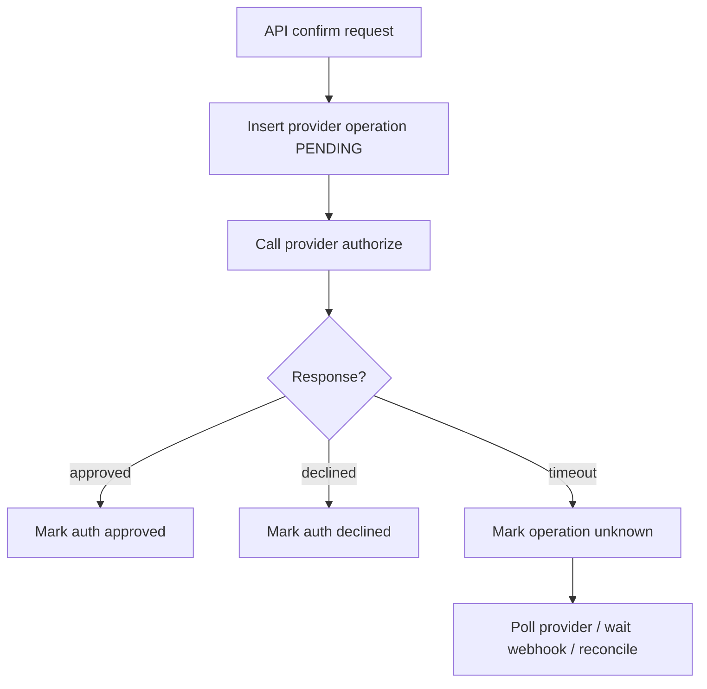

The unsafe version:

```java
ProviderResponse response = provider.authorize(request);
repository.save(response.toPayment());
```

If the process crashes after provider approval but before database commit, you may charge the customer and have no internal record.

Safer sync version:

1. Persist operation before remote call.
2. Use provider idempotency key.
3. Call provider.
4. Persist response.
5. If call outcome unknown, persist unknown.
6. Resolve unknown via provider lookup/webhook/reconciliation.

---

## 13. Unknown Outcome in Card Authorization

Unknown outcome is central to card architecture.

Examples:

- network timeout after provider received request
- provider returns HTTP 500 but still created auth
- API gateway times out but downstream processor approved
- your service crashes after provider response but before DB commit
- webhook arrives before API response handler commits

Do not mark timeout as failed.

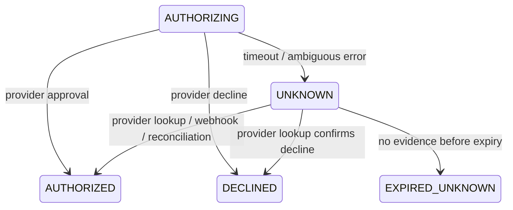

Operational rule:

> Unknown means fulfillment must not proceed as if paid, but retry must not blindly create a second authorization.

---

## 14. Capture Race Conditions

Common races:

1. Merchant sends capture twice due to retry.
2. Capture API times out, merchant retries with new idempotency key.
3. Webhook says captured while API response says pending.
4. Capture and void happen concurrently.
5. Partial captures concurrently exceed authorized amount.
6. Authorization expires while capture is in flight.

Guardrails:

- idempotency key per capture command
- capture summary row with atomic constraint
- provider operation table unique key
- operation status monotonic transition
- ledger posting idempotency key
- outbox/inbox dedupe
- reconciliation repair for unknown capture

Capture should be a state transition plus a financial-control update, not a blind provider call.

---

## 15. Card Refund Architecture

Refund should reference a capture, not just a payment.

```sql
create table card_refund (
    refund_id uuid primary key,
    capture_id uuid not null references card_capture(capture_id),
    payment_intent_id uuid not null,
    amount_minor bigint not null check (amount_minor > 0),
    currency char(3) not null,
    reason_code text,
    status text not null check (status in (
        'REQUESTED', 'ACCEPTED', 'DECLINED', 'UNKNOWN', 'SETTLED', 'FAILED'
    )),
    idempotency_key text not null,
    provider_refund_id text,
    created_at timestamptz not null default now(),
    updated_at timestamptz not null default now(),
    unique (capture_id, idempotency_key)
);
```

Refund availability depends on:

- captured amount
- already refunded amount
- chargeback status
- settlement status
- merchant available balance or platform funding policy
- provider refund window
- card network rules
- currency and original transaction constraints

Atomic refundable amount update:

```sql
update capture_refund_summary
set refunded_amount_minor = refunded_amount_minor + :refund_amount,
    version = version + 1
where capture_id = :capture_id
  and refunded_amount_minor + :refund_amount <= captured_amount_minor;
```

---

## 16. Chargeback and Dispute Model

Chargeback is not a refund.

Refund is usually merchant/platform initiated. Chargeback is initiated through issuer/cardholder/scheme process.

Dispute lifecycle:

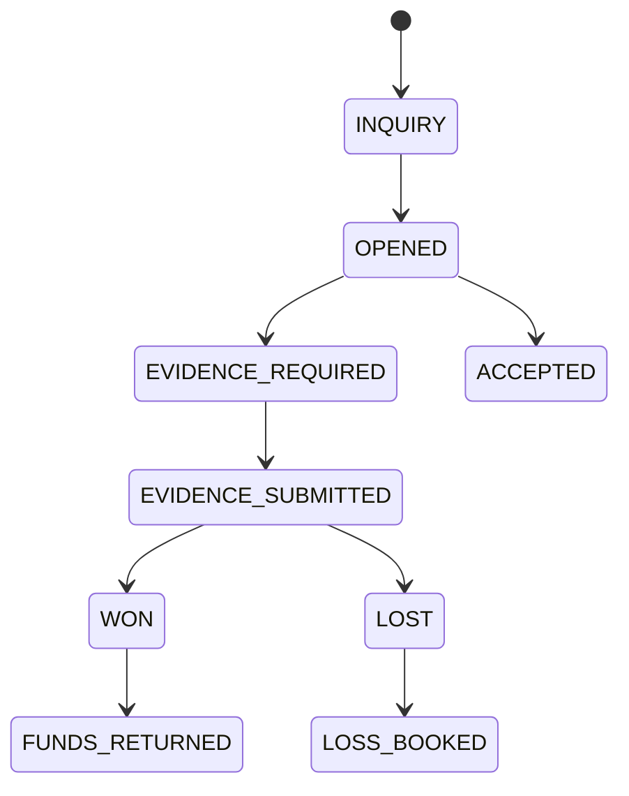

Financial impact may happen at dispute open, loss, or representment stage depending provider/acquirer.

A production system should model:

- dispute case
- chargeback amount
- reason code
- evidence deadline
- evidence packet
- merchant notification
- funds withdrawn/held
- fee assessed
- representment result
- final liability

Minimal table:

```sql
create table card_dispute (
    dispute_id uuid primary key,
    capture_id uuid not null,
    payment_intent_id uuid not null,
    provider_dispute_id text not null,
    reason_code text not null,
    amount_minor bigint not null,
    currency char(3) not null,
    status text not null,
    evidence_due_at timestamptz,
    opened_at timestamptz not null,
    updated_at timestamptz not null default now(),
    unique (provider_dispute_id)
);
```

---

## 17. Card State Machine: Composite View

A payment intent summary might say `SUCCEEDED`, but sub-state matters.

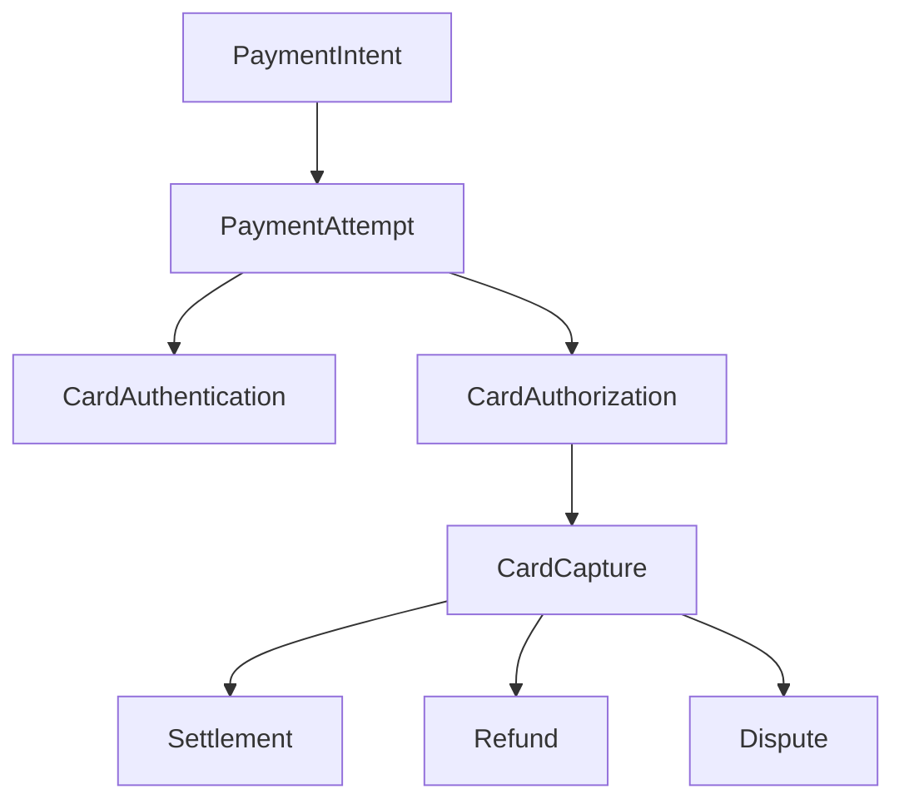

A useful summary rule:

| Internal facts | Payment intent summary |
|---|---|
| auth declined | `requires_payment_method` or `failed` |
| auth approved, capture pending manual | `requires_capture` |
| capture accepted | `processing` or `succeeded` depending semantics |
| capture settled | `settled` in finance view, not necessarily API customer view |
| full refund accepted | `refunded` |
| chargeback open | `disputed` in operations/risk view |
| chargeback lost | `lost_dispute` / financial loss booked |

Do not let one public status erase internal lifecycle facts.

---

## 18. Authorization Expiry

Authorizations expire. Expiry rules vary by card brand, merchant category, region, and provider.

Your system needs an expiry job.

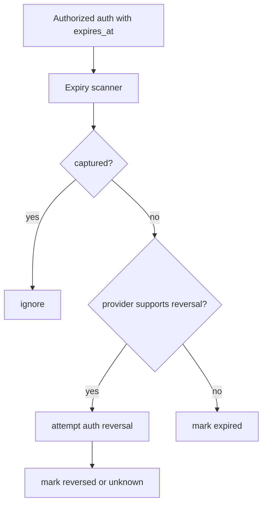

Expiry should release internal holds/reservations if any. It should not pretend customer paid.

---

## 19. Provider Status Normalization

Provider A might say:

```json
{ "status": "AUTHORISED" }
```

Provider B might say:

```json
{ "result": "approved", "capture": false }
```

Provider C might return:

```json
{ "status": "requires_capture" }
```

Normalize to your domain:

```java
public enum NormalizedCardAuthStatus {
    APPROVED,
    DECLINED,
    PENDING_AUTHENTICATION,
    UNKNOWN,
    PROVIDER_ERROR_RETRYABLE,
    PROVIDER_ERROR_FINAL
}
```

Rules belong in adapter mapping with versioned test fixtures.

```text
adapter-fixtures/
  provider-x/
    auth-approved-visa.json
    auth-declined-insufficient-funds.json
    auth-timeout-replay-approved.json
    capture-partial-accepted.json
    refund-unknown.json
```

---

## 20. Error Taxonomy for Card Operations

Classify errors by behavior.

| Class | Example | Retry? | User action? |
|---|---|---:|---:|
| Soft decline | issuer unavailable, temporary issue | maybe | maybe retry later |
| Hard decline | lost/stolen, invalid card | no | use another card |
| Authentication required | SCA/3DS needed | continue flow | complete challenge |
| Insufficient funds | not enough balance/credit | no immediate retry | use another card |
| Processor timeout | unknown outcome | no blind retry | resolve first |
| Provider validation error | bad request | no | fix integration |
| Duplicate operation | idempotent replay | no new operation | return stored result |

Design normalized error codes:

```java
public enum CardDeclineCategory {
    INSUFFICIENT_FUNDS,
    DO_NOT_HONOR,
    LOST_OR_STOLEN,
    EXPIRED_CARD,
    INVALID_CVC,
    AUTHENTICATION_REQUIRED,
    SUSPECTED_FRAUD,
    RESTRICTED_CARD,
    PROCESSOR_TEMPORARY_UNAVAILABLE,
    UNKNOWN_DECLINE
}
```

The point is not perfect universality. The point is consistent merchant/customer behavior and support analytics.

---

## 21. Fulfillment Decision

Payment system should produce a fulfillment-safe decision.

Possible decisions:

| Decision | Meaning |
|---|---|
| `DO_NOT_FULFILL` | payment failed/declined/unknown |
| `WAIT_FOR_CUSTOMER_ACTION` | 3DS challenge or payment method action required |
| `AUTHORIZED_ONLY` | safe to reserve inventory, not final settlement |
| `CAPTURE_ACCEPTED` | safe to fulfill depending merchant risk appetite |
| `SETTLED` | finance confirmed funds |
| `MANUAL_REVIEW` | risk/compliance/unknown requires operator |

For digital goods, merchant may fulfill on capture accepted. For high-risk physical goods, merchant may wait for risk post-auth review. For regulated or high-value goods, capture may not be enough.

Do not hardcode `status == succeeded` as fulfillment.

---

## 22. Backoffice Requirements for Card Payments

Production card payments need operational surfaces:

- search by payment ID, merchant reference, provider reference, auth code, last4, BIN, customer ID
- timeline of API request, provider operation, webhook, ledger journal, settlement match, refund, dispute
- safe retry for unknown provider operation
- safe manual capture/cancel/refund with approval
- evidence view for dispute
- masked card details only
- risk signals and decision history
- reconciliation break view
- ledger journal links
- idempotency replay view

Backoffice must not allow arbitrary mutation. It should issue controlled commands.

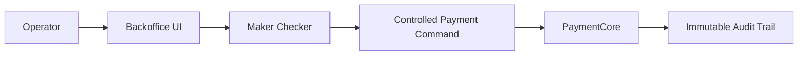

---

## 23. Observability for Card Payment

Technical metrics are insufficient.

You need business and rail metrics:

| Metric | Why it matters |
|---|---|
| authorization approval rate | routing, issuer behavior, risk impact |
| decline category distribution | customer experience and fraud signals |
| 3DS challenge rate | friction and conversion impact |
| capture success rate | fulfillment safety |
| auth-to-capture lag | expiry and operational risk |
| unknown outcome rate | provider/network reliability |
| duplicate command rate | client retry behavior |
| settlement match rate | finance correctness |
| refund success latency | customer support risk |
| chargeback rate | merchant/risk health |

Trace correlation IDs:

- payment intent ID
- attempt ID
- provider operation ID
- provider reference
- idempotency key hash
- merchant ID
- route decision ID

Do not put PAN, full CVC, or sensitive authentication data in logs.

---

## 24. Testing Matrix

### Unit Tests

- amount cannot mutate after authorization
- capture cannot exceed authorized amount
- refund cannot exceed captured amount
- auth decline does not create capture
- void not allowed after settlement
- chargeback not modeled as refund

### Contract Tests

- provider approved auth mapping
- provider hard decline mapping
- provider soft decline mapping
- provider timeout mapping
- webhook captured before API response
- duplicate webhook
- out-of-order refund webhook

### Property Tests

Useful invariants:

```text
sum(captures) <= authorized_amount
sum(refunds) <= sum(captures)
chargeback_amount <= captured_amount - refunded_amount where provider semantics require
ledger journals are balanced
provider operation idempotency returns same result for same key+fingerprint
no fulfillment decision is positive for UNKNOWN authorization
```

### Chaos Tests

- crash after provider approval before DB update
- provider timeout but webhook arrives later
- duplicate capture command with different request IDs
- concurrent partial capture
- settlement file contains transaction unknown to internal system

---

## 25. Anti-Patterns

### Anti-Pattern 1: One `payment_status`

```text
SUCCESS
FAILED
PENDING
```

This cannot represent card reality.

### Anti-Pattern 2: Timeout Equals Failure

Timeout may be success, failure, duplicate, or pending. Treat as unknown.

### Anti-Pattern 3: Capture Without Authorization Constraint

A capture command must be tied to authorization and amount constraints.

### Anti-Pattern 4: Refund as Negative Payment

Refund has its own lifecycle, provider reference, settlement, and failure behavior.

### Anti-Pattern 5: Logging Card Data

Masked card data and token references are fine; PAN/CVC in logs is a security incident.

### Anti-Pattern 6: Provider Status Leaks Everywhere

Normalize provider states at adapter boundary. Internal core should not contain `adyen_AUTHORISED` or `stripe_requires_capture` as native truth.

### Anti-Pattern 7: Ignoring Clearing and Settlement

Capture accepted does not mean provider cash reached your bank account.

---

## 26. Build Order

Implement in this order:

1. Payment intent and attempt domain
2. Provider operation log
3. Card authorization state machine
4. Idempotent authorize command
5. Provider adapter simulator
6. Unknown outcome resolver
7. Capture domain with amount guard
8. Refund domain with refundable amount guard
9. Ledger posting for capture/refund
10. Webhook ingestion for auth/capture/refund
11. Settlement report matching
12. Dispute model
13. Backoffice timeline and manual actions
14. Observability and SLOs

Do not start with provider SDK integration. Start with your domain invariants.

---

## 27. Minimal Production Checklist

Before calling your card payment support production-grade, verify:

- Authorization, capture, refund, reversal, and dispute are separate concepts.
- Authentication is not collapsed into authorization.
- Timeout creates unknown state, not failed state.
- Every provider call has durable operation record.
- Provider idempotency key is used where supported.
- Capture cannot exceed authorization under concurrency.
- Refund cannot exceed captured amount under concurrency.
- Ledger postings are idempotent and balanced.
- Webhooks are verified, deduped, and replayable.
- Provider status mapping is fixture-tested.
- Sensitive card data is not stored/logged outside approved boundary.
- Settlement report can be matched to captures.
- Chargeback has independent lifecycle and accounting impact.
- Backoffice actions are audited and approval-controlled.

---

## 28. References

- EMVCo, `EMV 3-D Secure`, https://www.emvco.com/emv-technologies/3-d-secure/
- PCI Security Standards Council, `Just Published: PCI DSS v4.0.1`, https://blog.pcisecuritystandards.org/just-published-pci-dss-v4-0-1
- PCI Security Standards Council, `PCI DSS v4.x Future-Dated Requirements`, https://blog.pcisecuritystandards.org/now-is-the-time-for-organizations-to-adopt-the-future-dated-requirements-of-pci-dss-v4-x
- Mastercard, `Transaction Processing Rules`, https://www.mastercard.us/content/dam/public/mastercardcom/na/global-site/documents/transaction-processing-rules.pdf
- Stripe Docs, `Payment Intents`, https://docs.stripe.com/payments/payment-intents
- Stripe Docs, `Idempotent Requests`, https://docs.stripe.com/api/idempotent_requests
- Adyen Docs, `Webhooks`, https://docs.adyen.com/development-resources/webhooks
- Martin Fowler, `Accounting Transaction`, https://martinfowler.com/eaaDev/AccountingTransaction.html

---

## 29. What Comes Next

Card payment architecture naturally leads to card data security.

The next part covers:

- PAN, CVC, expiry, BIN, last4
- tokenization
- card vault
- network token vs PSP token vs internal token
- PCI scope reduction
- log redaction
- cryptography and HSM boundary
- Java service segmentation for cardholder data environment
