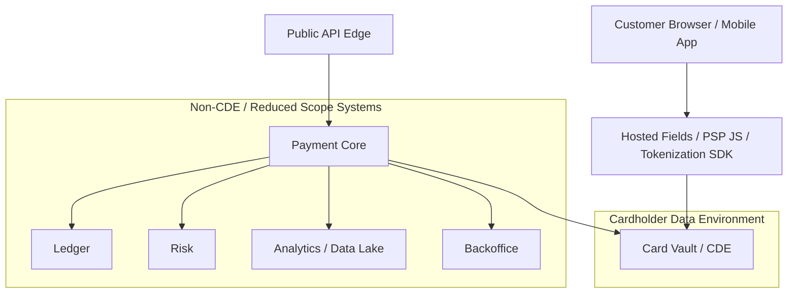
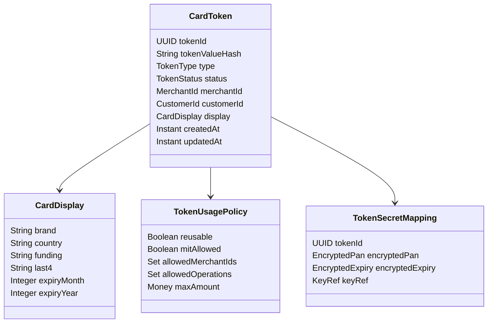
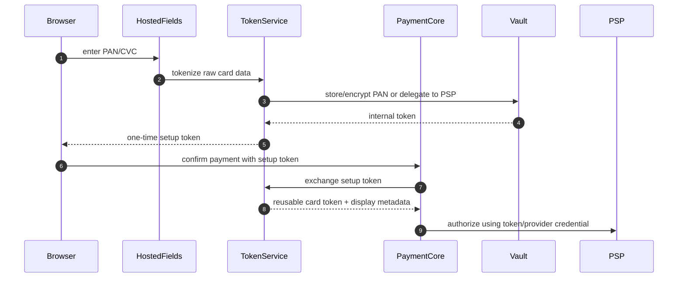
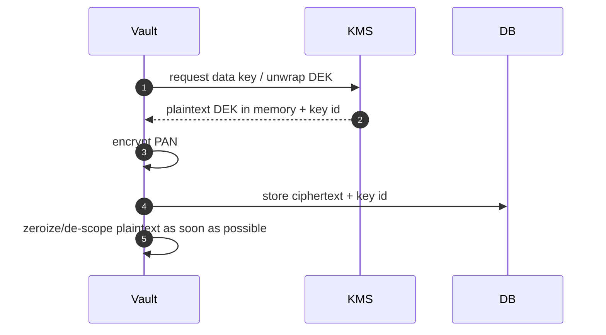

------
title: Build From Scratch: Large Production Grade Java Payment Systems - Part 026
description: Production-grade card data security and tokenization architecture for Java payment systems: PAN, CVC, token vault, network tokens, PSP tokens, PCI DSS boundaries, logging, encryption, HSM, segmentation, access control, and failure modeling.
series: learn-java-payment-systems
seriesTitle: Build From Scratch: Large Production Grade Java Payment Systems
order: 26
partTitle: Card Data Security and Tokenization
tags:
- java
- payments
- card-security
- tokenization
- pci-dss
- vault
- encryption
- fintech
date: 2026-07-02
---

# Part 026 — Card Data Security and Tokenization

A production payment system should treat card data as hazardous material.

Not because engineers are careless, but because normal engineering practices become dangerous around cardholder data:

- request logging becomes data leakage
- debugging payloads becomes compliance evidence failure
- analytics replication becomes uncontrolled propagation
- staging database copy becomes incident
- message queue replay becomes sensitive data exposure
- exception stack traces become breach surface
- support tooling becomes insider-risk vector

The safest architecture is not “encrypt everything and hope”.

The safest architecture is:

> keep raw card data out of almost every system; tokenize early; isolate the smallest possible cardholder data environment; make all downstream services operate on non-sensitive references; and make accidental leakage structurally difficult.

This part designs card data security for a Java payment platform.

---

## 1. What This Part Solves

By the end of this part you should understand:

1. What cardholder data is and why it changes system architecture.
2. Why tokenization is not the same as encryption.
3. How to design an internal card token vault.
4. When to use PSP tokens, network tokens, and internal tokens.
5. How to reduce PCI scope through segmentation and hosted fields/client-side tokenization.
6. How to prevent card data from leaking into logs, queues, caches, analytics, and support tools.
7. How to design Java service boundaries for card data.
8. How to test that sensitive data does not escape.
9. What failure modes matter for tokenization and vault operations.

We are not writing a full PCI compliance manual. We are designing software so compliance becomes realistic.

---

## 2. Card Data Vocabulary

Terms must be precise.

| Term | Meaning | Storage posture |
|---|---|---|
| PAN | Primary Account Number, the card number | Highly sensitive; avoid storage unless necessary |
| CVC/CVV/CID | Card verification code | Do not store after authorization under card security rules |
| Expiry date | Card expiration month/year | Sensitive in context; store only if needed and controlled |
| Cardholder name | Name on card | Sensitive personal/payment data |
| BIN/IIN | First digits identifying issuer/product range | Often used for routing/risk; avoid deriving from full PAN outside boundary |
| Last4 | Last four digits | Useful display attribute; still treat carefully in aggregate with other data |
| Token | Substitute reference for card data | Sensitivity depends on whether token can be used to transact |
| Cryptogram | Dynamic transaction security value, especially in tokenized/network token flows | Sensitive transaction/authentication artifact |
| Fingerprint | Stable identifier for same card without revealing PAN | Useful for dedupe/risk; must be carefully scoped |

A token is not automatically harmless. A token that can charge a card is a payment credential. It must be protected, but it is still safer than raw PAN.

---

## 3. PCI Scope Mental Model

PCI DSS applies to systems that store, process, or transmit cardholder data, and also connected systems that can affect security of that environment.

Architecturally, think in zones:



Goal:

- browser/mobile app may touch card data only through controlled hosted/tokenization component
- vault/CDE sees raw PAN only when absolutely necessary
- payment core sees only card token and safe display metadata
- ledger never sees PAN
- analytics never sees PAN
- support never sees PAN
- logs never see PAN
- queues never see PAN

---

## 4. Tokenization vs Encryption

Encryption transforms data using a cryptographic key. If you have ciphertext and key, you can recover plaintext.

Tokenization replaces sensitive data with a substitute value. The mapping may be stored in a vault or produced by a token service.

| Capability | Encryption | Tokenization |
|---|---|---|
| Reversible? | yes with key | maybe, through vault/mapping |
| Format-preserving? | optional | often can be format-preserving or opaque |
| Removes need to protect original? | no, ciphertext still sensitive | reduces spread of original data |
| Requires key management? | yes | yes, plus vault security |
| Useful for databases | yes | yes |
| Useful for PCI scope reduction | sometimes | often, if raw card data is removed from downstream systems |

Bad assumption:

> We encrypted PAN in every service, therefore all services are safe.

Better assumption:

> Every service that can access PAN, decrypt PAN, receive PAN, log PAN, or influence the PAN environment is in or near PCI scope.

---

## 5. Token Types

A payment platform may deal with several token types.

| Token type | Issuer | Purpose |
|---|---|---|
| PSP token | PSP/gateway | Charge card through that PSP without storing PAN internally |
| Internal vault token | Your platform | Stable internal reference to card credential |
| Network token | Card network/token service | Scheme-level token often used for lifecycle management and lower fraud |
| Device token | Wallet/device ecosystem | Card credential represented in wallet/device payment context |
| One-time token | Hosted field/client tokenization flow | Short-lived token exchanged for reusable token or used once |
| Merchant-scoped token | PSP/platform | Token usable only for one merchant/account context |
| Customer-scoped token | PSP/platform | Token attached to customer profile |

Do not mix these fields.

```java
public record CardCredentialReference(
    InternalCardToken internalToken,
    Optional<ProviderToken> providerToken,
    Optional<NetworkTokenReference> networkToken,
    CardDisplay display,
    CardSecurityClassification classification
) {}
```

---

## 6. Token Domain Model

A token should not be just a random string.

It needs metadata and controls.



Token status:

```java
public enum TokenStatus {
    ACTIVE,
    SUSPENDED,
    EXPIRED,
    DELETED,
    COMPROMISED,
    REPLACED
}
```

Token operation types:

```java
public enum TokenOperation {
    CREATE_TOKEN,
    AUTHORIZE,
    VERIFY,
    DETOKENIZE,
    ROTATE,
    SUSPEND,
    DELETE,
    EXPORT_TO_PROVIDER
}
```

Every sensitive operation should be audited.

---

## 7. Recommended Architecture: Hosted Capture + Internal Token

For most platforms, safest baseline:

1. Customer enters card in hosted fields or PSP/tokenization SDK.
2. Raw PAN goes directly to PSP or vault boundary, not through your general API.
3. PSP/vault returns one-time token.
4. Payment core exchanges one-time token for reusable internal/provider token.
5. Payment core stores only token reference and display metadata.
6. Future payments use token reference.



This keeps raw card data out of Payment Core.

---

## 8. Service Boundary Design

Recommended service split:

| Service | Sees PAN? | Notes |
|---|---:|---|
| Public Checkout API | no | receives token/setup reference only |
| Payment Core | no | orchestrates using token reference |
| Token Service | maybe | owns token lifecycle and policy |
| Card Vault | yes | smallest CDE boundary |
| Provider Adapter | ideally no; maybe provider token only | avoid PAN unless direct acquirer integration requires it |
| Ledger | no | never receives PAN |
| Risk | no raw PAN; may receive fingerprint/BIN metadata | strict minimization |
| Reconciliation | no | provider refs only |
| Backoffice | no raw PAN | masked display only |
| Analytics | no | tokenized/aggregated data only |

If your provider adapter must send PAN directly to acquirer, isolate that adapter inside CDE. Do not let every adapter become CDE casually.

---

## 9. API Design

### Token Creation

```http
POST /card-tokens
Idempotency-Key: setup_123
Content-Type: application/json

{
  "setupToken": "settok_...",
  "merchantId": "mer_123",
  "customerId": "cus_456",
  "usage": {
    "reusable": true,
    "merchantInitiatedAllowed": false
  }
}
```

Response:

```json
{
  "cardTokenId": "cardtok_01J...",
  "status": "ACTIVE",
  "display": {
    "brand": "VISA",
    "last4": "4242",
    "expiryMonth": 12,
    "expiryYear": 2030,
    "funding": "CREDIT",
    "country": "US"
  }
}
```

### Payment Confirm With Token

```json
{
  "paymentIntentId": "pi_01J...",
  "paymentMethod": {
    "type": "CARD",
    "cardTokenId": "cardtok_01J..."
  },
  "captureMode": "MANUAL"
}
```

### Never Accept This in General Payment Core

```json
{
  "cardNumber": "4111111111111111",
  "cvc": "123"
}
```

If raw card data ever enters a general API service, that service is now in scope and must be designed accordingly.

---

## 10. Vault Database Sketch

This table must live only in the vault/CDE database.

```sql
create table card_secret_mapping (
    token_id uuid primary key,
    encrypted_pan bytea not null,
    encrypted_expiry bytea not null,
    pan_key_id text not null,
    expiry_key_id text not null,
    pan_hash bytea not null,
    card_fingerprint bytea not null,
    created_at timestamptz not null default now(),
    rotated_at timestamptz,
    deleted_at timestamptz
);
```

Public token metadata can live in a non-CDE database if it contains no raw card data and follows your compliance assessment.

```sql
create table card_token_public (
    token_id uuid primary key,
    token_alias text not null unique,
    merchant_id uuid not null,
    customer_id uuid,
    status text not null,
    brand text,
    last4 char(4),
    expiry_month smallint,
    expiry_year smallint,
    funding text,
    issuer_country char(2),
    created_at timestamptz not null default now(),
    updated_at timestamptz not null default now()
);
```

Keep token alias separate from primary UUID if you want safe public references.

---

## 11. Token Generation

Token value should be high entropy and non-derivable from PAN.

Example shape:

```text
cardtok_live_01J2Y8S5D4K8V6Q9ZP8W2N3M4A
```

Rules:

- never encode PAN into token
- never use reversible base64 of sensitive payload
- never use sequential IDs as bearer credentials
- hash token values at rest if token itself authorizes operations
- scope token to merchant/customer/use case
- support revocation
- support rotation/replacement

Java sketch:

```java
public final class TokenGenerator {
    private final SecureRandom secureRandom = new SecureRandom();
    private final Base32Encoder encoder;

    public InternalCardToken generate(Environment environment) {
        byte[] random = new byte[20];
        secureRandom.nextBytes(random);
        String encoded = encoder.encode(random);
        return new InternalCardToken("cardtok_" + environment.prefix() + "_" + encoded);
    }
}
```

Do not design token generation around aesthetics first. Design around entropy, scoping, auditability, and operational usability.

---

## 12. PAN Hash and Fingerprint

You often need to know whether two tokens refer to the same card.

Do not compare PAN directly outside vault.

Vault can compute a keyed fingerprint.

```java
public record CardFingerprint(byte[] value) {}
```

Conceptual rule:

```text
fingerprint = HMAC(secret_key, normalized_pan)
```

Why keyed HMAC instead of plain hash?

PAN has limited structure and is not high-entropy like a random password. Plain hashes are vulnerable to enumeration. Use keyed construction, rotate keys carefully, and restrict access.

Use cases:

- duplicate card detection
- velocity rules
- customer saved-card dedupe
- risk signals
- card replacement linking where allowed

Never expose fingerprint publicly.

---

## 13. CVC Handling

CVC/CVV is special.

Architecture rule:

> CVC may be used for transaction authorization or verification, but must not be stored after authorization.

Operational implications:

- do not persist request bodies containing CVC
- do not log validation errors with CVC
- do not send CVC through message queues
- do not include CVC in outbox events
- do not save CVC in failed-tokenization records
- do not store CVC encrypted “just in case”

If a later payment requires CVC again, ask customer again or use a credential-on-file flow that does not require storing CVC.

---

## 14. Logging Redaction

Payment systems often leak data through logs before databases.

Redaction must be structural:

1. API gateway request body logging disabled for card endpoints.
2. Application log sanitizer blocks PAN-like patterns.
3. DTO `toString()` must not print sensitive fields.
4. Exception handler must not echo request payload.
5. HTTP client logging disabled or redacted.
6. Distributed tracing attributes allowlist only.
7. Queue DLQ payloads must not contain PAN.
8. Support export redacts payment credentials.

Java DTO rule:

```java
public record RawCardData(
    SensitivePan pan,
    SensitiveCvc cvc,
    Expiry expiry
) {
    @Override
    public String toString() {
        return "RawCardData{pan=REDACTED,cvc=REDACTED,expiry=REDACTED}";
    }
}
```

Better: raw card DTOs exist only in the vault boundary and never leave package/module boundaries.

---

## 15. Java Type System as Guardrail

Use types that make unsafe movement harder.

```java
public sealed interface CardCredential permits RawCardCredential, TokenizedCardCredential {}

public record RawCardCredential(
    SensitivePan pan,
    SensitiveCvc cvc,
    Expiry expiry
) implements CardCredential {}

public record TokenizedCardCredential(
    InternalCardToken token,
    CardDisplay display
) implements CardCredential {}
```

Do not allow Payment Core to depend on `RawCardCredential`.

Use module boundaries:

```text
payment-core/
  depends on: card-token-api
  must not depend on: card-vault-internal

card-vault/
  owns: RawCardCredential, encryption, detokenization

provider-adapter-card-cde/
  optional CDE adapter for direct acquirer integrations
```

Build enforcement:

- ArchUnit tests
- Maven module dependency rules
- forbidden imports
- static analysis for sensitive fields

Example ArchUnit rule:

```java
@ArchTest
static final ArchRule paymentCoreMustNotAccessRawCardData = noClasses()
    .that().resideInAPackage("..paymentcore..")
    .should().dependOnClassesThat().resideInAPackage("..cardvault.internal..");
```

---

## 16. Encryption and Key Management

Encryption is still required inside vault.

Design minimum:

- envelope encryption
- key IDs stored with ciphertext
- master keys in KMS/HSM
- data encryption keys rotated
- access to decrypt is service-account restricted
- decrypt operations audited
- separation between token lookup and detokenization permission

Conceptual flow:



Do not store encryption keys in application config, database, source code, or environment variables casually.

---

## 17. Detokenization Policy

Detokenization should be rare.

Allowed cases:

- direct acquirer authorization requiring PAN
- migration to another provider under approved process
- card account updater/token lifecycle operation
- regulated/export process with strong controls

Denied cases:

- support wants to see PAN
- analytics wants raw card number
- logs need debugging
- developer wants easier local testing
- backoffice search by full PAN

Policy model:

```sql
create table detokenization_request (
    request_id uuid primary key,
    token_id uuid not null,
    purpose text not null,
    requester_service text not null,
    approval_id uuid,
    status text not null,
    created_at timestamptz not null default now(),
    completed_at timestamptz
);
```

Not every authorization requires recording a manual detokenization request if it is normal automated card processing inside CDE, but every detokenization path should be auditable.

---

## 18. Token Usage Policy

A reusable card token should not be universally usable.

Policy dimensions:

| Dimension | Example |
|---|---|
| merchant scope | token only usable by merchant A |
| customer scope | token attached to customer X |
| operation scope | authorize only, no payout, no export |
| amount limit | max amount per transaction |
| velocity limit | max N uses/day |
| MIT/CIT flag | merchant-initiated allowed or not |
| region/currency | allowed regions/currencies |
| risk status | suspended after fraud signal |

Policy check:

```java
public final class CardTokenUsagePolicyService {
    public void assertUsable(TokenizedCardCredential credential, PaymentContext context) {
        var token = tokenRepository.getActive(credential.token());

        if (!token.merchantId().equals(context.merchantId())) {
            throw new TokenNotUsable("TOKEN_MERCHANT_SCOPE_VIOLATION");
        }

        if (context.isMerchantInitiated() && !token.policy().merchantInitiatedAllowed()) {
            throw new TokenNotUsable("MIT_NOT_ALLOWED");
        }

        if (context.amount().isGreaterThan(token.policy().maxAmount())) {
            throw new TokenNotUsable("TOKEN_AMOUNT_LIMIT_EXCEEDED");
        }
    }
}
```

---

## 19. Network Tokens

Network tokenization replaces the PAN with a token issued through card-network token services. It often comes with lifecycle management and transaction cryptograms.

Do not model network token as just another PSP token.

```java
public record NetworkTokenReference(
    String tokenRequestorId,
    String networkTokenAlias,
    CardBrand brand,
    TokenStatus status,
    Optional<Instant> expiresAt
) {}
```

Network token payment may require:

- network token
- token expiry
- cryptogram
- token assurance data
- device or wallet metadata
- token requestor ID

Architecturally:

- internal token references a credential bundle
- credential bundle may contain PAN mapping, PSP token, and/or network token
- routing engine decides which credential form can be used for a provider/rail

---

## 20. PSP Tokens vs Internal Tokens

Using PSP token only is simpler:

```text
customer -> PSP hosted tokenization -> PSP token -> payment core stores PSP token
```

Pros:

- reduced raw PAN exposure
- faster implementation
- PSP handles vaulting
- likely easier compliance posture

Cons:

- provider lock-in
- multi-provider routing harder
- migration harder
- token portability limited
- risk dedupe across PSPs harder

Using internal token vault is more complex:

Pros:

- provider-independent credential abstraction
- better routing portability
- unified saved-card model
- stronger internal policy control

Cons:

- significantly higher security/compliance burden
- vault availability becomes critical
- key management complexity
- audit and certification complexity

Decision rule:

> Start with PSP-hosted tokenization unless multi-provider portability, strategic PSP independence, or direct acquiring requirements justify the cost of a vault.

---

## 21. Message Queues and Card Data

Never put raw card data on general event streams.

Unsafe event:

```json
{
  "eventType": "CardAdded",
  "pan": "4111111111111111",
  "cvc": "123"
}
```

Safe event:

```json
{
  "eventType": "CardTokenCreated",
  "cardTokenId": "cardtok_live_...",
  "merchantId": "mer_123",
  "customerId": "cus_456",
  "display": {
    "brand": "VISA",
    "last4": "4242",
    "expiryMonth": 12,
    "expiryYear": 2030
  }
}
```

Outbox events should be reviewed as part of PCI/data governance. The event bus is often consumed by many systems, so a single sensitive field can multiply scope massively.

---

## 22. Cache and Search Index Rules

Sensitive data often leaks into Redis/Elasticsearch/OpenSearch by accident.

Rules:

- no PAN in cache
- no CVC in cache
- no raw provider payload with PAN in search index
- no full request/response payload indexing for CDE endpoints
- no autocomplete by PAN
- last4 search allowed only with other scoped filters and access controls
- token aliases can be indexed if policy allows

Backoffice search should use:

- payment ID
- merchant reference
- provider reference
- customer ID
- card token ID
- last4 + merchant/customer scope
- auth code if allowed

Never design support flow around full PAN lookup.

---

## 23. Test Data Strategy

Never use real card data in lower environments.

Rules:

- use provider test cards
- use synthetic PANs allowed by test provider/network documentation
- use fake tokens
- prevent production card data export to staging
- scan database dumps before restore
- scan logs and object storage
- synthetic settlement files only
- token vault backup restore tested in isolated controlled environment

Add automated leakage tests:

```text
- scan application logs for PAN-like Luhn-valid patterns
- scan Kafka topics for PAN-like fields
- scan data lake samples
- scan exception traces
- scan HTTP access logs
- scan support export files
```

A Luhn-valid regex is not enough, but it is a useful defense-in-depth signal.

---

## 24. Luhn Check Is Not Security

Luhn validates card number checksum. It does not prove card exists, card is active, or user owns it.

Use cases:

- client-side typo detection
- input validation before tokenization
- log scanner false-positive reduction

Do not use it for:

- authentication
- authorization
- fraud decision by itself
- token security

---

## 25. Incident and Compromise Handling

Token/card compromise scenarios:

| Incident | Response |
|---|---|
| token leaked but scoped | suspend token, review usage, rotate alias if needed |
| PAN exposure in logs | contain logs, revoke access, assess notification/compliance obligations |
| CVC stored accidentally | immediate purge, incident review, control fix |
| vault key exposed | rotate keys, re-encrypt data, forensic review |
| provider token compromised | revoke at provider, suspend internal credential |
| analytics leak | remove data, audit access, redesign pipeline |

Token status must support compromise.

```sql
update card_token_public
set status = 'COMPROMISED', updated_at = now()
where token_id = :token_id;
```

Payment authorization must check token status at use time, not only at creation time.

---

## 26. Availability and Failure Modeling

Card vault becomes critical if payments depend on it.

Failure modes:

| Failure | Impact | Design response |
|---|---|---|
| vault unavailable | cannot authorize stored-card payments requiring detokenization | circuit breaker, fail closed, retry later |
| KMS unavailable | cannot decrypt/encrypt | fail closed; no plaintext fallback |
| token service latency spike | checkout degradation | isolate pool, timeout, fallback to PSP hosted token if possible |
| token DB replica lag | stale token status | read primary for authorization decisions |
| key rotation bug | unable to decrypt old cards | staged rotation, canary, dual-read |
| accidental logging | data incident | redaction tests and runtime filters |

Security systems should usually fail closed. Do not bypass token checks to save conversion.

---

## 27. Migration Strategy

Provider token migration is one of the hardest payment problems.

Migration scenarios:

1. PSP A token to PSP B token
2. raw PAN vault to PSP token
3. PSP token to internal vault
4. internal token to network token
5. card updater replacement

Important controls:

- explicit migration job ID
- merchant/customer scope
- source and target credential references
- no plaintext export unless approved
- dual-run period
- validation authorization or zero/low-value verification where supported
- rollback plan
- audit report

Migration table:

```sql
create table card_token_migration (
    migration_id uuid primary key,
    source_token_id uuid not null,
    target_token_id uuid,
    source_provider text,
    target_provider text,
    status text not null,
    failure_reason text,
    created_at timestamptz not null default now(),
    completed_at timestamptz
);
```

---

## 28. Compliance Evidence Design

Engineering should produce evidence automatically.

Evidence examples:

- architecture diagram showing CDE boundary
- data-flow diagram for PAN/CVC/token
- service inventory and scope classification
- access control matrix
- key rotation logs
- detokenization audit logs
- vulnerability scan results
- log redaction test results
- dependency scan results
- firewall/network segmentation evidence
- secure code review evidence
- incident response runbook
- backup/restore test evidence

Payment engineers should design systems so auditors can verify controls without heroic manual archaeology.

---

## 29. Implementation Checklist

Before allowing card data/tokenization into production:

- Raw PAN only enters approved tokenization/vault boundary.
- CVC is never stored after authorization/tokenization use.
- Payment Core accepts token references, not PAN.
- Ledger never receives PAN or CVC.
- Analytics never receives PAN or CVC.
- Queues never carry PAN or CVC.
- Logs are redacted and tested.
- DTO `toString()` cannot leak sensitive fields.
- HTTP client/server body logging is disabled for CDE endpoints.
- Token values are high entropy and non-derivable.
- Token usage is scoped and checked per transaction.
- Detokenization is rare, authorized, and audited.
- Keys are managed through KMS/HSM, not app config.
- Vault database is isolated.
- Access to vault production data is tightly controlled.
- Backoffice shows masked display only.
- Incident response path exists for token/PAN leakage.
- PCI scope diagram and data-flow diagram are current.

---

## 30. Anti-Patterns

### Anti-Pattern 1: “Encrypted PAN Everywhere”

Encryption does not remove the need to secure every system that stores or decrypts PAN.

### Anti-Pattern 2: Raw Provider Payload Storage

Provider payloads may contain sensitive fields. Store raw payload only in controlled storage, with filtering and retention policy.

### Anti-Pattern 3: Full Request Logging

Full request logging is incompatible with safe card endpoints unless structurally redacted before persistence.

### Anti-Pattern 4: Token Without Scope

A token usable by any merchant for any amount is a dangerous bearer credential.

### Anti-Pattern 5: Support Can View PAN

Support does not need PAN. They need masked display, references, timeline, and safe action buttons.

### Anti-Pattern 6: Staging Copy of Production Vault

Never casually copy production card data to lower environments.

### Anti-Pattern 7: Provider SDK Inside Every Service

Provider SDK calls involving payment credentials should be isolated behind a credential-aware boundary.

---

## 31. How This Connects to Previous Parts

- Part 009 idempotency protects token creation from duplicate saved cards.
- Part 013 orchestration decides which credential/provider route to use.
- Part 014 provider adapter hides provider token formats.
- Part 016 webhook ingestion must avoid leaking payloads.
- Part 020 ledger never stores cardholder data.
- Part 025 card payment architecture uses tokens for authorization/capture.

The key invariant:

> Card data security is not a plugin. It is a boundary condition for the entire payment architecture.

---

## 32. References

- PCI Security Standards Council, `Just Published: PCI DSS v4.0.1`, https://blog.pcisecuritystandards.org/just-published-pci-dss-v4-0-1
- PCI Security Standards Council, `Now is the Time for Organizations to Adopt the Future-Dated Requirements of PCI DSS v4.x`, https://blog.pcisecuritystandards.org/now-is-the-time-for-organizations-to-adopt-the-future-dated-requirements-of-pci-dss-v4-x
- PCI Security Standards Council, `Tokenization Product Security Guidelines`, https://www.pcisecuritystandards.org/documents/Tokenization_Product_Security_Guidelines.pdf
- PCI Security Standards Council, `PCI Council Publishes Tokenization Product Security Guidelines`, https://www.pcisecuritystandards.org/about_us/press_releases/pci-council-publishes-tokenization-product-security-guidelines/
- EMVCo, `EMV 3-D Secure`, https://www.emvco.com/emv-technologies/3-d-secure/
- Stripe Docs, `Payment Methods and Cards`, https://docs.stripe.com/payments/payment-methods
- Stripe Docs, `Idempotent Requests`, https://docs.stripe.com/api/idempotent_requests
- Adyen Docs, `Card data security`, https://docs.adyen.com/development-resources/security/

---

## 33. What Comes Next

Next part: 3DS and strong customer authentication.

We will cover:

- frictionless vs challenge flow
- authentication result vs authorization result
- liability shift
- customer action state machine
- browser/app redirect handling
- webhook and callback ordering
- MIT/CIT implications
- Java API design for `nextAction`
