------
title: Build From Scratch: Large Production Grade Java Payment Systems - Part 027
description: Mendesain 3-D Secure dan Strong Customer Authentication sebagai authentication control, risk signal, liability boundary, dan evidence layer dalam payment platform Java production-grade.
series: learn-java-payment-systems
seriesTitle: Build From Scratch: Large Production Grade Java Payment Systems
order: 27
partTitle: 3DS & Strong Customer Authentication: Frictionless, Challenge, Liability Shift
tags:
- java
- payments
- payment-systems
- 3ds
- sca
- card-payments
- fintech
- risk
- pci-dss
date: 2026-07-02
---

# Part 027 — 3DS & Strong Customer Authentication

Di part sebelumnya kita membahas card payment architecture dan card data security. Sekarang kita masuk ke bagian yang sering disalahpahami: **3-D Secure** dan **Strong Customer Authentication**.

Kesalahan paling umum adalah menganggap 3DS sebagai “halaman OTP sebelum charge”. Itu terlalu dangkal.

Dalam payment platform yang serius, 3DS adalah:

1. **authentication protocol** untuk membuktikan bahwa cardholder memang berpartisipasi atau dinilai cukup aman oleh issuer,
2. **risk signal exchange** antara merchant, acquirer, scheme, dan issuer,
3. **liability boundary** yang dapat mengubah siapa yang menanggung fraud loss,
4. **evidence artifact** yang harus disimpan untuk dispute, audit, risk review, dan compliance,
5. **state machine tersendiri** yang tidak boleh dicampur sembarangan dengan authorization state.

EMVCo mendeskripsikan EMV 3-D Secure sebagai mekanisme untuk membantu issuer dan merchant mencegah card-not-present fraud dan meningkatkan keamanan pembayaran e-commerce. Ini bukan authorization. Ini authentication layer sebelum atau sekitar authorization.

> Mental model utama: **3DS menjawab “apakah payer/cardholder diautentikasi atau cukup dipercaya?” Authorization menjawab “apakah issuer menyetujui charge ini?”**

Keduanya berkaitan, tetapi bukan hal yang sama.

---

## 1. Masalah Yang Diselesaikan 3DS

Card-not-present payment punya masalah klasik: merchant menerima card detail, tetapi tidak melihat kartu fisik dan tidak melihat cardholder.

Pada card-present transaction, terminal, chip, PIN, contactless cryptogram, dan issuer authorization memberikan sinyal kuat. Pada e-commerce, sinyalnya lebih lemah.

Tanpa authentication layer, merchant bisa menghadapi:

- stolen card usage,
- account takeover,
- friendly fraud,
- issuer decline karena insufficient confidence,
- chargeback fraud,
- dispute evidence lemah,
- liability tetap di merchant/acquirer walaupun authorization approved.

3DS mencoba memperbaiki ini dengan membuat issuer dapat:

- menerima data transaksi dan device/browser/context,
- melakukan risk assessment,
- memilih frictionless authentication jika cukup aman,
- meminta challenge jika butuh bukti tambahan,
- mengirim authentication result ke merchant/acquirer path.

Dalam production system, 3DS bukan fitur UI. Ia adalah **subsystem**.

---

## 2. Aktor Dalam 3DS

Aktor 3DS sering membuat bingung karena tidak sama dengan aktor payment API biasa.

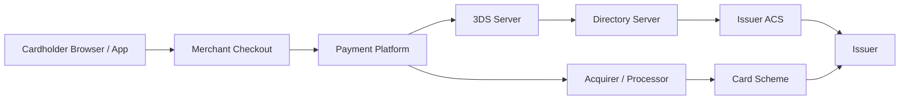

### 2.1 Cardholder

Orang yang mencoba membayar. Dalam browser flow, ia berinteraksi melalui halaman merchant dan mungkin diarahkan atau di-frame ke ACS challenge. Dalam app flow, interaksi bisa lewat SDK.

### 2.2 Merchant Checkout

Frontend merchant yang mengumpulkan checkout intent, browser metadata, device metadata, dan menampilkan challenge bila diperlukan.

Frontend tidak boleh menjadi sumber kebenaran result 3DS. Ia hanya perantara interaksi.

### 2.3 Payment Platform

Sistem kita. Ia memutuskan:

- apakah transaksi perlu 3DS,
- provider/3DS server mana yang digunakan,
- data apa yang dikirim,
- bagaimana result dinormalisasi,
- kapan authorization boleh dilanjutkan,
- evidence apa yang disimpan.

### 2.4 3DS Server

Komponen yang berbicara dengan Directory Server dan ACS sesuai spesifikasi EMV 3DS. Dalam banyak setup, ini disediakan PSP/acquirer/provider. Dalam setup enterprise besar, merchant atau platform bisa mengoperasikan 3DS Server bersertifikasi.

### 2.5 Directory Server

Komponen scheme/network yang merutekan authentication request ke ACS issuer yang tepat.

### 2.6 ACS — Access Control Server

Komponen di sisi issuer yang melakukan authentication atau risk evaluation terhadap cardholder.

### 2.7 Issuer

Bank/lembaga penerbit kartu. Issuer menentukan apakah cardholder dianggap authenticated, challenge diperlukan, authentication gagal, atau authentication tidak tersedia.

---

## 3. Authentication Bukan Authorization

Mari pisahkan lifecycle-nya.

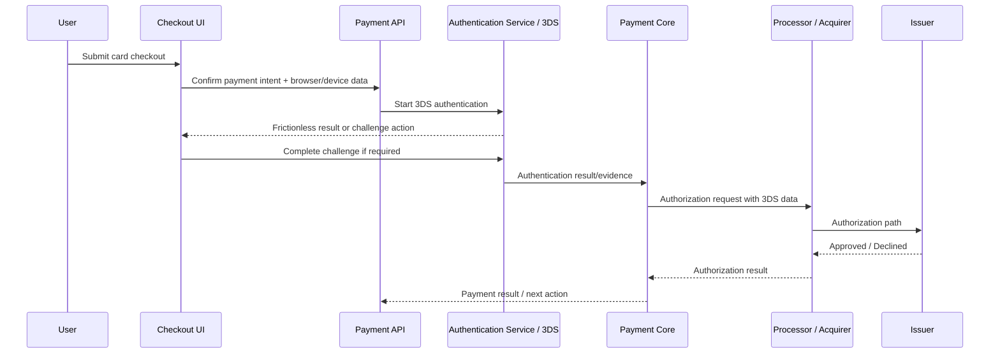

Authentication result dapat sukses, gagal, unavailable, attempted, rejected, atau challenge required. Authorization result dapat approved, declined, timeout, unknown, referred, atau provider error.

Kombinasinya tidak boleh disederhanakan menjadi satu boolean.

Contoh:

| 3DS Result | Authorization Result | Meaning |
|---|---|---|
| authenticated | approved | happy path |
| authenticated | declined | cardholder authenticated, tetapi issuer tetap menolak charge |
| frictionless | approved | issuer menerima tanpa challenge |
| challenge failed | not submitted | platform tidak boleh lanjut authorization normal |
| unavailable | approved | mungkin allowed, tetapi liability/risk berbeda |
| attempted | approved | scheme/region-specific liability semantics |
| authenticated | timeout | authentication evidence ada, tetapi money outcome unknown |

> Rule: authentication state tidak boleh dipakai sebagai bukti bahwa uang berhasil ditarik.

---

## 4. Strong Customer Authentication

Strong Customer Authentication atau SCA adalah konsep regulasi, terutama penting dalam konteks PSD2/Eropa. Secara umum, SCA mengharuskan authentication menggunakan minimal dua elemen independen dari kategori:

1. sesuatu yang customer tahu,
2. sesuatu yang customer punya,
3. sesuatu yang melekat pada customer.

Contoh:

| Category | Example |
|---|---|
| Knowledge | password, PIN |
| Possession | mobile banking app, hardware token, registered device |
| Inherence | fingerprint, face biometric, voice biometric |

Dalam payment platform, jangan hardcode “3DS = SCA”. Yang benar:

- 3DS dapat menjadi mekanisme untuk mendukung SCA.
- SCA applicability tergantung region, merchant, issuer, transaction type, exemption, acquirer, scheme rule, dan regulatory scope.
- SCA result harus diperlakukan sebagai evidence dengan atribut jelas, bukan boolean global.

### 4.1 SCA Exemption

Beberapa transaksi bisa eligible untuk exemption, tergantung aturan/regulator/scheme/provider:

- low value transaction,
- transaction risk analysis,
- recurring transaction,
- merchant initiated transaction,
- trusted beneficiary,
- secure corporate payment,
- out-of-scope transaction.

Namun exemption bukan “hak merchant”. Biasanya exemption adalah request atau classification yang masih bisa ditolak oleh issuer/acquirer. Issuer bisa tetap meminta challenge.

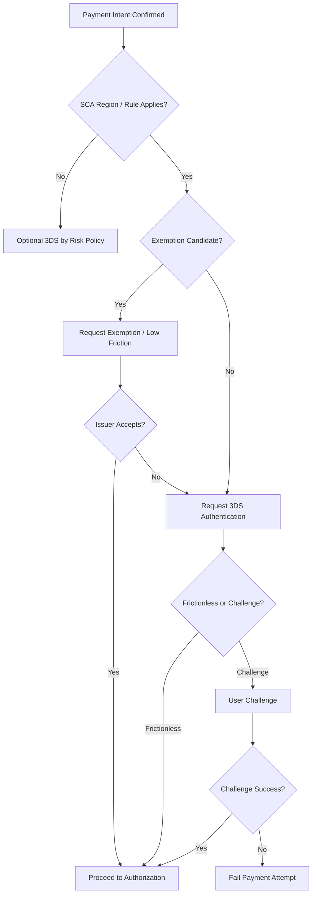

### 4.2 Do Not Encode Regulation As One If Statement

Bad design:

```java
if (country.equals("EU") && amount > 30) {
    require3ds = true;
}
```

Better design:

```java
public interface AuthenticationPolicy {
    AuthenticationRequirement evaluate(AuthenticationContext context);
}

public record AuthenticationContext(
    MerchantId merchantId,
    CustomerId customerId,
    CardFingerprint cardFingerprint,
    Money amount,
    String merchantCountry,
    String customerCountry,
    String issuerCountry,
    PaymentChannel channel,
    TransactionInitiator initiator,
    boolean recurringAgreementPresent,
    RiskScore riskScore,
    LocalDate transactionDate
) {}

public record AuthenticationRequirement(
    RequirementLevel level,
    Optional<ExemptionRequest> requestedExemption,
    String policyVersion,
    List<String> reasons
) {}
```

Why?

Karena payment regulation, scheme rule, issuer behavior, dan provider capability berubah. Production system butuh policy versioning dan evidence, bukan conditional logic tersembunyi.

---

## 5. 3DS Flow Yang Harus Dimodelkan

### 5.1 Frictionless Flow

Frictionless terjadi ketika issuer/ACS menilai transaction cukup aman tanpa meminta interaksi tambahan ke cardholder.

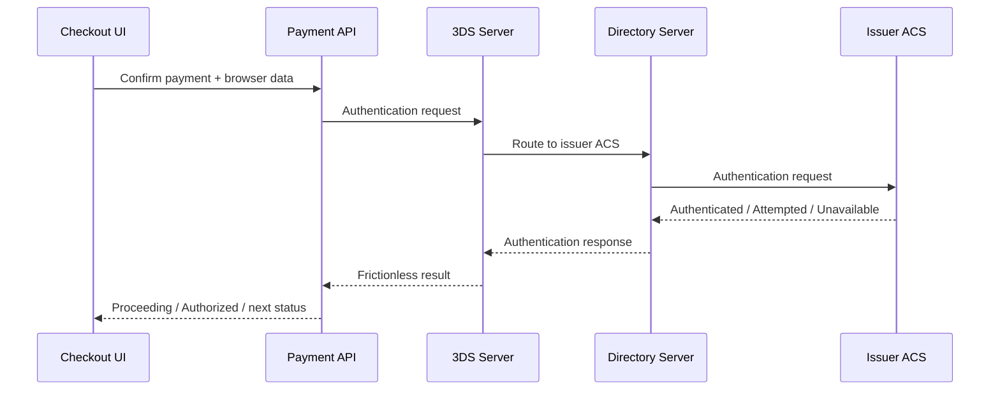

Karakteristik:

- user tidak melihat challenge,
- result harus tetap disimpan,
- payment dapat lanjut authorization jika policy mengizinkan,
- evidence seperti transaction ID, authentication value, ECI, version, dan status disimpan.

### 5.2 Challenge Flow

Challenge terjadi ketika issuer butuh interaksi cardholder.

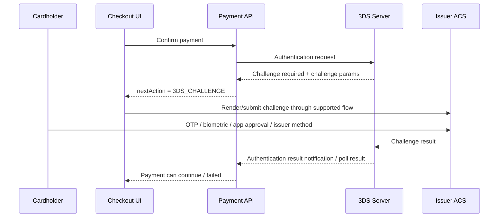

Challenge flow memperkenalkan masalah distributed system:

- user menutup browser,
- ACS lambat,
- challenge callback datang setelah frontend timeout,
- duplicate notification,
- provider result berbeda dari browser callback,
- payment intent sudah expired,
- merchant melakukan retry confirm,
- auth result sukses tetapi authorization gagal.

Maka challenge bukan sekadar redirect. Ia state machine.

### 5.3 Decoupled / Out-of-Band Flow

Pada beberapa implementasi, cardholder melakukan authentication di channel berbeda, misalnya banking app. Browser/app merchant menunggu hasil.

Design implication:

- checkout harus mampu menampilkan status pending,
- backend harus menyimpan session dan expiry,
- frontend tidak boleh polling provider langsung,
- user bisa kembali setelah delay,
- payment intent harus punya timeout policy.

---

## 6. State Machine Authentication Session

Payment platform harus punya entity terpisah untuk authentication session.

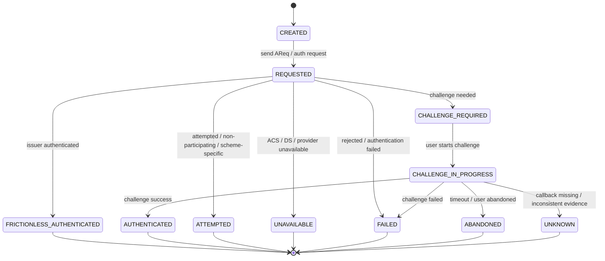

Payment attempt state machine then consumes normalized authentication outcome.

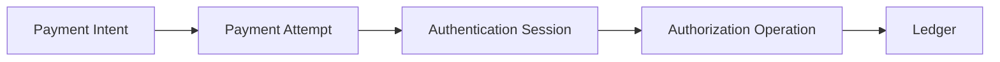

Rule penting:

1. `AuthenticationSession` boleh gagal tanpa membuat payment failed jika retry authentication masih allowed.
2. `PaymentAttempt` tidak boleh lanjut authorization normal jika authentication policy mengatakan authentication required dan session failed.
3. `AuthorizationOperation` harus mereferensikan authentication evidence yang dipakai.
4. Ledger posting tidak terjadi saat authentication saja.

---

## 7. Data Model

### 7.1 Authentication Session Table

```sql
create table card_authentication_session (
    id uuid primary key,
    payment_intent_id uuid not null,
    payment_attempt_id uuid not null,
    merchant_id uuid not null,

    provider text not null,
    provider_session_id text,
    provider_transaction_id text,
    scheme_transaction_id text,

    card_fingerprint text not null,
    card_brand text,
    issuer_country char(2),

    authentication_protocol text not null,
    authentication_version text,
    channel text not null,

    requested_exemption text,
    challenge_indicator text,
    challenge_preference text,

    status text not null,
    normalized_result text,
    liability_shift text,
    eci text,
    cavv_hash text,
    xid_hash text,

    request_payload_hash text not null,
    response_payload_hash text,

    failure_code text,
    failure_reason text,

    expires_at timestamptz not null,
    completed_at timestamptz,
    created_at timestamptz not null default now(),
    updated_at timestamptz not null default now(),

    constraint chk_card_auth_status check (
        status in (
            'CREATED',
            'REQUESTED',
            'FRICTIONLESS_AUTHENTICATED',
            'CHALLENGE_REQUIRED',
            'CHALLENGE_IN_PROGRESS',
            'AUTHENTICATED',
            'ATTEMPTED',
            'UNAVAILABLE',
            'FAILED',
            'ABANDONED',
            'UNKNOWN'
        )
    )
);

create unique index ux_auth_provider_session
    on card_authentication_session(provider, provider_session_id)
    where provider_session_id is not null;

create index ix_auth_payment_attempt
    on card_authentication_session(payment_attempt_id, created_at desc);
```

Kita tidak menyimpan raw CAVV/XID tanpa alasan. Sering kali yang cukup untuk general evidence adalah token/reference/hash/redacted value. Jika sistem masuk PCI/CDE atau scheme-specific certification, perlakuan field harus mengikuti assessment dan provider contract.

### 7.2 Authentication Event Table

Jangan hanya simpan current state. Simpan evidence timeline.

```sql
create table card_authentication_event (
    id uuid primary key,
    authentication_session_id uuid not null references card_authentication_session(id),
    event_type text not null,
    source text not null,
    provider_event_id text,
    raw_payload_hash text not null,
    normalized_status text,
    occurred_at timestamptz,
    received_at timestamptz not null default now(),
    processing_status text not null,
    processing_error text
);

create unique index ux_auth_event_provider
    on card_authentication_event(authentication_session_id, provider_event_id)
    where provider_event_id is not null;
```

### 7.3 Authorization Evidence Link

Authorization operation harus menyimpan auth evidence yang dipakai.

```sql
alter table card_authorization_operation
add column authentication_session_id uuid references card_authentication_session(id),
add column authentication_result text,
add column authentication_eci text,
add column authentication_liability_shift text,
add column authentication_evidence_hash text;
```

Kenapa link ini penting?

Karena pada dispute atau audit, kita harus menjawab:

- authorization ini memakai 3DS session yang mana?
- result saat authorization dikirim apa?
- ECI/authentication value apa yang dikirim?
- apakah exemption diminta?
- apakah liability shift expected?
- apakah issuer menolak challenge atau merchant bypass?

---

## 8. Normalized Authentication Result

Provider/scheme punya field dan naming berbeda. Payment Core tidak boleh bergantung pada enum mentah provider.

```java
public enum NormalizedAuthenticationResult {
    AUTHENTICATED,
    FRICTIONLESS_AUTHENTICATED,
    CHALLENGE_REQUIRED,
    ATTEMPTED,
    UNAVAILABLE,
    REJECTED,
    FAILED,
    ABANDONED,
    UNKNOWN
}

public enum LiabilityShiftExpectation {
    EXPECTED,
    NOT_EXPECTED,
    SCHEME_DEPENDENT,
    PROVIDER_DEPENDENT,
    UNKNOWN
}

public record AuthenticationEvidence(
    UUID authenticationSessionId,
    NormalizedAuthenticationResult result,
    Optional<String> eci,
    Optional<String> authenticationValueReference,
    Optional<String> dsTransactionId,
    Optional<String> schemeTransactionId,
    LiabilityShiftExpectation liabilityShiftExpectation,
    String authenticationVersion,
    String provider,
    String evidenceHash
) {}
```

Jangan desain seperti ini:

```java
public record ThreeDsResult(boolean success) {}
```

Karena `attempted`, `unavailable`, `exempted`, `rejected`, dan `unknown` punya konsekuensi berbeda.

---

## 9. Policy: Kapan 3DS Diperlukan?

Payment platform butuh authentication policy engine.

Input policy:

- merchant capability,
- merchant risk tier,
- amount,
- currency,
- card brand,
- issuer country,
- customer country,
- merchant country,
- transaction initiator,
- recurring agreement,
- device risk,
- velocity risk,
- fraud score,
- regulatory region,
- historical dispute rate,
- provider/acquirer requirement,
- scheme rule,
- product category.

Output policy:

```java
public sealed interface AuthenticationDecision {
    record Required(
        String policyVersion,
        List<String> reasons,
        ChallengePreference challengePreference
    ) implements AuthenticationDecision {}

    record Optional(
        String policyVersion,
        List<String> reasons
    ) implements AuthenticationDecision {}

    record RequestExemption(
        String exemptionType,
        String policyVersion,
        List<String> reasons
    ) implements AuthenticationDecision {}

    record NotRequired(
        String policyVersion,
        List<String> reasons
    ) implements AuthenticationDecision {}
}
```

Policy decision harus disimpan sebagai evidence.

```sql
create table authentication_policy_decision (
    id uuid primary key,
    payment_attempt_id uuid not null,
    policy_version text not null,
    decision text not null,
    requested_exemption text,
    reasons jsonb not null,
    input_hash text not null,
    created_at timestamptz not null default now()
);
```

Tanpa ini, ketika ada chargeback enam bulan kemudian, tim risk hanya bisa menebak kenapa transaksi tidak dichallenge.

---

## 10. Payment Confirm Flow Dengan 3DS

Endpoint confirm harus bisa menghasilkan beberapa outcome:

1. payment langsung authorized,
2. next action 3DS challenge,
3. authentication failed,
4. authorization declined,
5. async pending,
6. unknown outcome.

```mermaid
flowchart TD
    A[POST /payment-intents/{id}/confirm] --> B[Load Intent + Attempt]
    B --> C[Evaluate Authentication Policy]
    C --> D{Auth Required?}
    D -- No --> H[Authorize]
    D -- Optional/Exemption --> E[Start 3DS / Request Exemption if Needed]
    D -- Required --> E
    E --> F{3DS Result}
    F -- Frictionless/Auth OK --> H
    F -- Challenge Required --> G[Return nextAction]
    F -- Failed/Rejected --> X[Fail Attempt]
    F -- Unavailable/Attempted --> Y{Policy Allows Proceed?}
    Y -- Yes --> H
    Y -- No --> X
    H --> I{Authorization Result}
    I -- Approved --> J[Authorized]
    I -- Declined --> K[Declined]
    I -- Timeout --> L[Unknown]
```

API response sketch:

```json
{
  "paymentIntentId": "pi_123",
  "status": "REQUIRES_ACTION",
  "nextAction": {
    "type": "THREE_DS_CHALLENGE",
    "authenticationSessionId": "auth_456",
    "clientPayload": {
      "provider": "example-3ds-provider",
      "challengeUrl": "https://...",
      "transactionId": "..."
    },
    "expiresAt": "2026-07-02T10:15:30Z"
  }
}
```

Backend rule:

- `nextAction` tidak sama dengan payment success.
- `nextAction` punya expiry.
- `authenticationSessionId` adalah server-side state, bukan trust anchor dari frontend.
- Client payload boleh provider-specific, tetapi API contract tetap normalized.

---

## 11. Challenge Completion Flow

Setelah challenge selesai, ada beberapa kemungkinan arsitektur:

1. provider mengirim webhook ke backend,
2. frontend mengirim completion signal ke backend,
3. backend polling provider,
4. kombinasi callback + webhook + poll repair.

Production design sebaiknya menganggap frontend callback **tidak cukup sebagai evidence**.

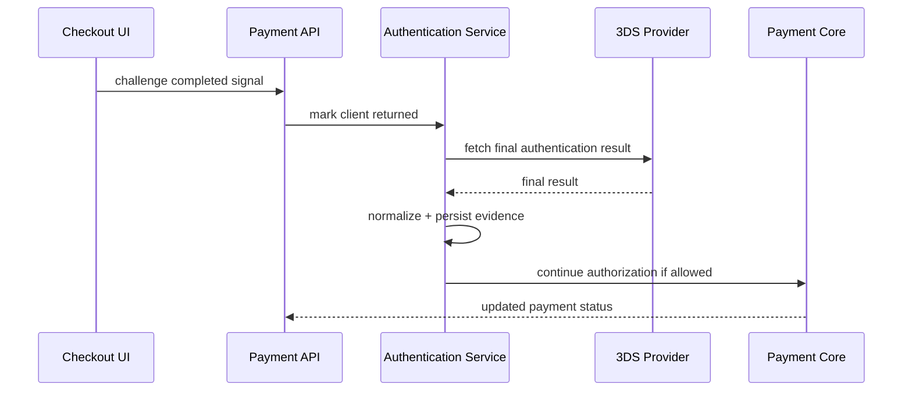

Why fetch final result?

Karena browser callback bisa dipalsukan, hilang, duplicate, atau tidak membawa semua evidence. Server-to-server provider result lebih kuat untuk state transition.

---

## 12. 3DS + Authorization Payload

Authorization request ke processor/acquirer sering membutuhkan authentication data.

Contoh normalized authorization command:

```java
public record CardAuthorizationCommand(
    UUID paymentAttemptId,
    Money amount,
    CardPaymentInstrument instrument,
    MerchantDescriptor descriptor,
    Optional<AuthenticationEvidence> authenticationEvidence,
    CaptureMode captureMode,
    String idempotencyKey
) {}
```

Processor adapter bertanggung jawab memetakan evidence ke field provider/scheme.

```java
public interface CardProcessorAdapter {
    AuthorizationResult authorize(CardAuthorizationCommand command);
}
```

Payment Core tidak boleh tahu detail seperti nama field provider untuk CAVV atau ECI. Payment Core hanya tahu evidence normalized.

---

## 13. Liability Shift: Jangan Oversimplify

Liability shift sering dijual sebagai “pakai 3DS maka fraud liability pindah ke issuer”. Ini berbahaya jika ditanam sebagai invariant absolut.

Yang lebih aman:

- 3DS dapat menciptakan expectation liability shift.
- Actual liability bergantung pada scheme rule, region, result status, acquirer setup, merchant category, exemption type, card product, transaction type, dan dispute reason.
- Payment platform harus menyimpan enough evidence, tetapi finance/risk tetap butuh rule engine/reporting untuk actual chargeback handling.

Data model:

```java
public record LiabilityAssessment(
    LiabilityShiftExpectation expectation,
    String scheme,
    String acquirer,
    String ruleVersion,
    List<String> reasons,
    boolean requiresManualReviewOnDispute
) {}
```

Dalam payment state, jangan tulis:

```text
liability_shifted = true
```

Lebih baik:

```text
liability_shift_expectation = EXPECTED
liability_rule_version = visa-eu-ecommerce-2026-01
liability_assessment_reasons = [...]
```

---

## 14. Fraud Engine Integration

3DS bukan pengganti fraud engine.

Fraud engine memutuskan:

- challenge recommended,
- block before 3DS,
- allow frictionless attempt,
- hold after authorization,
- manual review,
- require additional verification,
- velocity limit.

3DS result menjadi input balik ke fraud engine:

- challenge success dapat menurunkan risk,
- challenge failure dapat menaikkan risk,
- unavailable ACS bisa menjadi neutral atau high-risk tergantung context,
- abandoned challenge bisa menjadi signal suspicious atau UX failure,
- repeated challenge failures bisa trigger card/customer block.

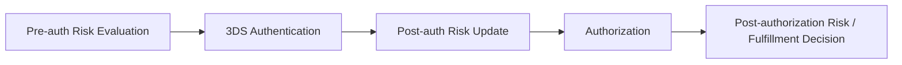

Important: jangan hanya gunakan 3DS result untuk authorize. Gunakan juga untuk fulfillment decision.

Contoh:

| Scenario | AuthN | AuthZ | Fulfillment |
|---|---|---|---|
| low risk, authenticated | success | approved | fulfill immediately |
| high value, attempted only | attempted | approved | hold/manual review |
| suspicious device, challenge failed | failed | not sent | reject |
| 3DS unavailable, issuer approved | unavailable | approved | fulfill depending on merchant/risk policy |
| authenticated but high fraud score | success | approved | hold for review |

---

## 15. Handling Unknown Authentication State

Unknown state dapat terjadi ketika:

- provider timeout,
- ACS callback hilang,
- webhook duplicate dan inconsistent,
- frontend abandoned,
- result polling gagal,
- provider API returns pending,
- authentication session expired tetapi provider later returns success.

Unknown handling:

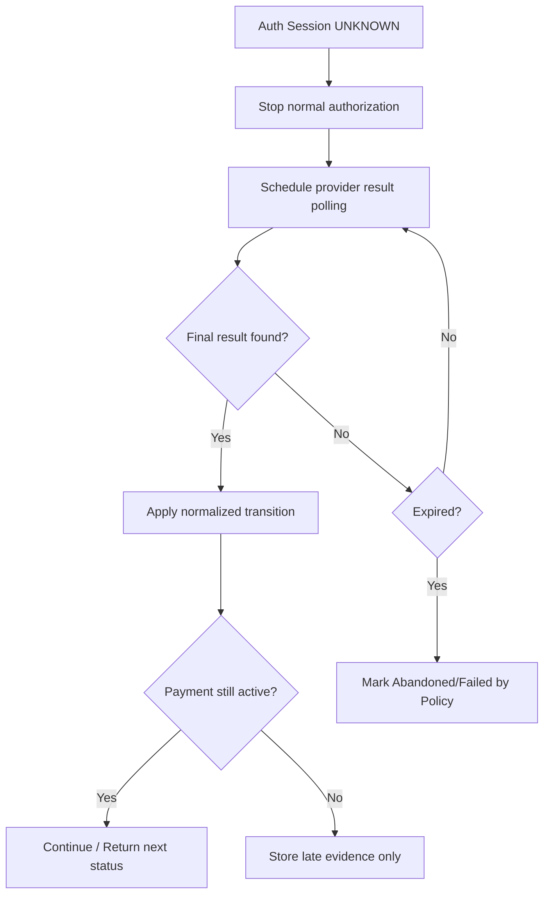

Golden rule:

> Unknown authentication should not automatically become failed, and it should not automatically proceed to authorization.

It is a repairable state with policy-driven timeout.

---

## 16. Idempotency Dalam 3DS

3DS flow penuh retry:

- merchant retry confirm,
- browser retry challenge completion,
- provider retry notification,
- backend retry provider fetch,
- worker retry authorization continuation.

Idempotency keys:

| Operation | Idempotency Scope |
|---|---|
| create authentication session | payment_attempt_id + policy_version |
| send auth request to provider | authentication_session_id + operation_type |
| process provider notification | provider_event_id or payload hash |
| complete challenge from client | authentication_session_id + completion_token |
| continue authorization | payment_attempt_id + authentication_session_id |

Database constraint:

```sql
create table auth_operation_log (
    id uuid primary key,
    authentication_session_id uuid not null,
    operation_type text not null,
    idempotency_key text not null,
    provider_operation_id text,
    status text not null,
    request_hash text not null,
    response_hash text,
    created_at timestamptz not null default now(),
    completed_at timestamptz,

    unique (authentication_session_id, operation_type, idempotency_key)
);
```

---

## 17. Security Controls

3DS touches sensitive payment context. Security controls:

1. never trust browser completion alone,
2. verify provider/webhook signatures,
3. store raw payload separately with access control,
4. redact PAN/CAVV/auth values from logs,
5. hash sensitive evidence where possible,
6. enforce TTL on client challenge payload,
7. bind session to payment attempt and merchant,
8. reject cross-merchant session reuse,
9. sign client payload if needed,
10. expose only minimal `nextAction` details.

Bad log:

```text
3ds result cavv=AAABBBCCC... xid=... card=4111111111111111
```

Better log:

```json
{
  "event": "3ds.authentication.completed",
  "authenticationSessionId": "auth_456",
  "paymentAttemptId": "pa_123",
  "provider": "provider_a",
  "normalizedResult": "AUTHENTICATED",
  "eci": "redacted",
  "evidenceHash": "sha256:..."
}
```

---

## 18. Java Service Sketch

```java
public final class AuthenticationApplicationService {
    private final AuthenticationPolicy policy;
    private final AuthenticationSessionRepository sessions;
    private final ThreeDsProviderPort provider;
    private final PaymentAttemptRepository attempts;
    private final AuthorizationContinuationService continuation;

    public ConfirmAuthenticationResult ensureAuthentication(
        PaymentAttempt attempt,
        BrowserContext browserContext,
        DeviceContext deviceContext
    ) {
        AuthenticationDecision decision = policy.evaluate(
            AuthenticationContext.from(attempt, browserContext, deviceContext)
        );

        if (decision instanceof AuthenticationDecision.NotRequired) {
            return ConfirmAuthenticationResult.notRequired(decision);
        }

        AuthenticationSession session = sessions.findOrCreateForAttempt(
            attempt.id(),
            decision,
            browserContext.fingerprintHash()
        );

        if (session.isTerminal()) {
            return ConfirmAuthenticationResult.fromTerminalSession(session);
        }

        ThreeDsAuthenticationResult result = provider.startAuthentication(
            ThreeDsAuthenticationCommand.from(attempt, session, browserContext, decision)
        );

        AuthenticationSession updated = session.applyProviderResult(result);
        sessions.save(updated);

        return ConfirmAuthenticationResult.fromSession(updated);
    }

    public PaymentContinuationResult completeChallenge(
        UUID authenticationSessionId,
        ClientChallengeCompletion completion
    ) {
        AuthenticationSession session = sessions.getForUpdate(authenticationSessionId);
        session.markClientReturned(completion.returnedAt());

        ThreeDsFinalResult finalResult = provider.fetchFinalResult(session.providerSessionId());
        AuthenticationSession completed = session.applyFinalResult(finalResult);
        sessions.save(completed);

        if (!completed.canProceedToAuthorization()) {
            return PaymentContinuationResult.authenticationFailed(completed.normalizedResult());
        }

        return continuation.continueAuthorization(completed.paymentAttemptId(), completed.evidence());
    }
}
```

Notice:

- `completeChallenge` fetches final result from provider.
- State transition happens under lock.
- Authorization continuation is idempotent.
- Authentication evidence is passed to authorization, not copied manually.

---

## 19. API Shape

### 19.1 Confirm Payment Intent

```http
POST /v1/payment-intents/{paymentIntentId}/confirm
Idempotency-Key: merchant-123:checkout-abc:confirm-1
Content-Type: application/json
```

```json
{
  "paymentMethodId": "pm_123",
  "returnUrl": "https://merchant.example/checkout/return",
  "browser": {
    "acceptHeader": "text/html,...",
    "colorDepth": 24,
    "javaEnabled": false,
    "language": "en-US",
    "screenHeight": 1080,
    "screenWidth": 1920,
    "timeZoneOffsetMinutes": -420,
    "userAgent": "Mozilla/5.0 ..."
  }
}
```

Response when challenge required:

```json
{
  "id": "pi_123",
  "status": "REQUIRES_ACTION",
  "nextAction": {
    "type": "THREE_DS_CHALLENGE",
    "authenticationSessionId": "auth_456",
    "expiresAt": "2026-07-02T10:15:30Z",
    "clientPayload": {
      "provider": "provider_a",
      "challengeToken": "opaque-token"
    }
  }
}
```

### 19.2 Complete Challenge

```http
POST /v1/payment-intents/{paymentIntentId}/actions/complete-3ds
Idempotency-Key: merchant-123:checkout-abc:complete-3ds-1
Content-Type: application/json
```

```json
{
  "authenticationSessionId": "auth_456",
  "clientResultToken": "opaque-client-result"
}
```

Response:

```json
{
  "id": "pi_123",
  "status": "AUTHORIZED",
  "authorizationId": "authz_789"
}
```

Or:

```json
{
  "id": "pi_123",
  "status": "PROCESSING",
  "reason": "AUTHENTICATION_RESULT_PENDING"
}
```

---

## 20. Testing Strategy

### 20.1 Scenario Matrix

| Scenario | Expected Behavior |
|---|---|
| frictionless authenticated | continue authorization |
| challenge required | return nextAction, no auth yet |
| challenge success | continue authorization once |
| duplicate challenge completion | no duplicate authorization |
| challenge failed | fail attempt or allow retry by policy |
| provider timeout on start | auth session unknown, repair job |
| provider timeout on final fetch | processing/unknown, no blind auth |
| webhook before frontend return | apply result, frontend completion becomes idempotent |
| frontend return before webhook | fetch final result server-side |
| late success after payment expired | store evidence, do not authorize expired attempt |
| 3DS unavailable but optional | proceed based on risk policy |
| 3DS unavailable but required | fail or manual review |

### 20.2 Property Tests

Invariants:

- one authentication session cannot authorize two payment attempts,
- one payment attempt cannot create multiple active challenge sessions under same policy unless explicitly allowed,
- failed challenge cannot silently become authorized,
- authentication completion is idempotent,
- duplicate provider event does not change state twice,
- late terminal event cannot resurrect cancelled/expired payment without explicit repair action.

### 20.3 Simulator Scenarios

3DS simulator must support:

- frictionless success,
- challenge success,
- challenge failure,
- challenge timeout,
- ACS unavailable,
- duplicate callback,
- out-of-order notification,
- inconsistent provider result,
- delayed final result,
- provider returns unknown then success.

---

## 21. Operational Metrics

Track metrics per merchant, issuer country, card brand, provider, and route:

- authentication required rate,
- frictionless rate,
- challenge rate,
- challenge success rate,
- challenge abandonment rate,
- ACS unavailable rate,
- authentication latency,
- authorization approval after authenticated,
- authorization decline after authenticated,
- fraud rate by auth result,
- chargeback rate by auth result,
- exemption acceptance rate,
- liability expectation distribution.

Dashboard tidak boleh hanya menampilkan “3DS success rate”. Itu terlalu kasar.

Useful operational dashboard:

```text
merchant_id
card_brand
issuer_country
auth_policy_version
required_rate
frictionless_rate
challenge_rate
challenge_success_rate
challenge_abandon_rate
authenticated_authz_approval_rate
authenticated_authz_decline_rate
attempted_chargeback_rate
unavailable_proceed_rate
```

---

## 22. Backoffice Requirements

Backoffice harus bisa melihat:

- payment intent,
- payment attempt,
- authentication session,
- authentication event timeline,
- policy decision,
- provider raw references,
- challenge start/completion time,
- normalized result,
- authorization evidence used,
- liability expectation,
- failure reason,
- late event handling.

Operator actions:

- mark abandoned after expiry,
- retry provider result fetch,
- attach missing evidence,
- override fulfillment hold,
- create case for suspicious repeated failure,
- export evidence for dispute.

Manual action harus maker-checker jika berdampak pada payment continuation, fulfillment, or dispute evidence.

---

## 23. Common Anti-Patterns

### 23.1 Treating 3DS As Frontend Feature

If 3DS only exists in frontend code, backend cannot prove what happened.

### 23.2 Using Boolean `threeDsPassed`

A boolean destroys important semantics: frictionless, attempted, unavailable, rejected, challenge, unknown.

### 23.3 Authorizing Before Challenge Completes

This defeats the purpose of required authentication and creates fraud/liability gaps.

### 23.4 Trusting Return URL

Return URL means user returned. It does not prove issuer authenticated the user.

### 23.5 Not Linking Auth Evidence To Authorization

Without this link, dispute evidence becomes weak.

### 23.6 Hardcoding SCA Rules

SCA/regulatory/scheme logic should be versioned policy, not scattered if statements.

### 23.7 Assuming Liability Shift Is Always True

3DS result is not a universal guarantee. Treat it as expectation/evidence.

---

## 24. Minimal Production Checklist

Before claiming 3DS/SCA support is production-ready:

- [ ] authentication session modeled separately from payment attempt,
- [ ] policy decision stored with version and reasons,
- [ ] frictionless and challenge flows supported,
- [ ] challenge completion is idempotent,
- [ ] frontend callback is not trusted as final evidence,
- [ ] provider/server-side result is fetched or verified,
- [ ] raw provider events are stored with hashes/redaction,
- [ ] authentication evidence linked to authorization operation,
- [ ] 3DS unavailable/attempted/unknown are distinct states,
- [ ] liability expectation modeled cautiously,
- [ ] risk engine consumes auth result,
- [ ] dispute evidence export exists,
- [ ] metrics distinguish frictionless/challenge/abandon/unavailable,
- [ ] simulator covers duplicate, delayed, timeout, and inconsistent results.

---

## 25. What We Have Built Conceptually

At this point, payment platform has:

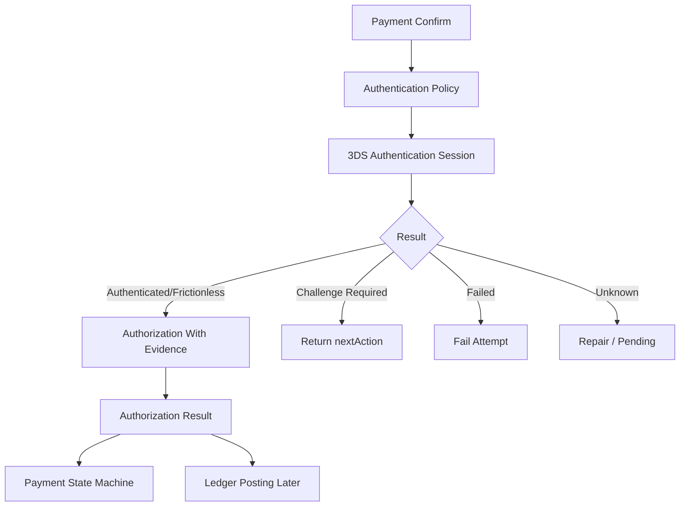

This is the key shift:

> 3DS is not a screen. It is a stateful authentication subsystem that produces evidence consumed by authorization, risk, dispute, and compliance workflows.

In the next part, we move from browser/card-not-present authentication into a lower-level integration model: **ISO 8583 processor integration**. We will not build a card network switch, but we need to understand MTI, bitmap, data elements, response code normalization, reversals, and unknown outcome handling because these concepts leak into every serious card processor integration.

---

## References

- EMVCo — EMV® 3-D Secure: https://www.emvco.com/emv-technologies/3-d-secure/
- EMVCo — EMV 3DS Version 2.3 announcement: https://www.emvco.com/news/emvco-publishes-emv-3-d-secure-2-3-to-support-more-secure-and-convenient-e-commerce-authentication/
- European Banking Authority — Regulatory Technical Standards on Strong Customer Authentication and Secure Communication under PSD2: https://www.eba.europa.eu/legacy/regulation-and-policy/regulatory-activities/payment-services-and-electronic-money-0
- PCI Security Standards Council — PCI DSS v4.0.1: https://blog.pcisecuritystandards.org/just-published-pci-dss-v4-0-1
- Stripe Docs — 3D Secure authentication: https://docs.stripe.com/payments/3d-secure
- Adyen Docs — 3D Secure 2: https://docs.adyen.com/online-payments/3d-secure/
