------
title: Build From Scratch: Large Production Grade Java Payment Systems - Part 028
description: Mendesain integrasi ISO 8583/processor untuk card payment platform Java: MTI, bitmap, data elements, response code, reversal, unknown outcome, MAC, logging, simulator, dan adapter boundary.
series: learn-java-payment-systems
seriesTitle: Build From Scratch: Large Production Grade Java Payment Systems
order: 28
partTitle: ISO 8583 Processor Integration Model: Message Semantics Without Building a Switch
tags:
- java
- payments
- payment-systems
- iso8583
- card-payments
- processor
- acquirer
- fintech
- reliability
date: 2026-07-02
---

# Part 028 — ISO 8583 Processor Integration Model

Kita tidak sedang membangun card network switch. Itu domain yang sangat spesifik, tersertifikasi, mahal, dan regulated. Tetapi payment platform enterprise yang berurusan dengan card processor tetap harus memahami ISO 8583 secara cukup dalam.

Kenapa?

Karena banyak konsep card processing bocor ke API modern:

- authorization,
- reversal,
- advice,
- response code,
- STAN,
- RRN,
- approval code,
- merchant category code,
- POS entry mode,
- processing code,
- network management,
- timeout with unknown outcome,
- duplicate message handling,
- MAC/signature/integrity check,
- settlement/report matching.

ISO mendeskripsikan ISO 8583:2023 sebagai interface umum untuk pertukaran pesan financial-transaction-card-originated antara acquirer dan issuer. Dengan kata lain, ISO 8583 adalah salah satu bahasa inti card authorization world.

> Mental model utama: **ISO 8583 bukan business API. Ia adalah protocol/message grammar untuk financial transaction messages. Payment platform harus menyembunyikannya di balik processor adapter.**

---

## 1. Dimana ISO 8583 Berada Dalam Arsitektur

Dalam banyak payment platform modern, merchant tidak pernah melihat ISO 8583. Merchant melihat REST/JSON API. Processor adapter atau acquirer connector yang berurusan dengan ISO 8583.

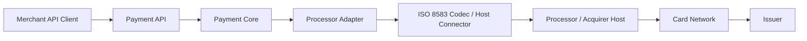

Boundary rule:

- Payment Core uses normalized command/result.
- Adapter translates normalized command to processor-specific message.
- ISO codec handles MTI, bitmap, packing, parsing, encoding, MAC, and field validation.
- Transport connector handles TCP/TLS/MQ/session/reconnect.
- Payment Core never handles raw bitmap or data element positions.

---

## 2. Why Not Expose ISO 8583 To Core?

Because ISO 8583 has many variants.

Even if two processors say “ISO 8583”, they can differ in:

- ISO version,
- bitmap encoding,
- field length encoding,
- numeric/binary/BCD/ASCII encoding,
- private fields,
- response code mapping,
- reversal expectation,
- sign-on/sign-off procedure,
- MAC calculation,
- key exchange process,
- advice/reversal retry rule,
- settlement report linkage,
- scheme-specific data.

Bad design:

```java
payment.setDe39(response.getField(39));
payment.setMti(response.getMti());
```

Better design:

```java
AuthorizationResult result = processorAdapter.authorize(command);
paymentAttempt.applyAuthorizationResult(result);
```

The raw ISO message is evidence, not domain model.

---

## 3. ISO 8583 Message Anatomy

A simplified ISO 8583 message contains:

1. Message Type Indicator / MTI,
2. primary bitmap,
3. optional secondary bitmap,
4. data elements.

```text
+----------+----------+-----------------------------+
|   MTI    |  Bitmap  |        Data Elements         |
+----------+----------+-----------------------------+
|  0100    |  ...     | DE2, DE3, DE4, DE11, ...     |
+----------+----------+-----------------------------+
```

### 3.1 MTI

MTI tells message class/function/origin in compact form. Common examples in card authorization integrations:

| MTI | Typical Meaning |
|---|---|
| 0100 | authorization request |
| 0110 | authorization response |
| 0200 | financial request |
| 0210 | financial response |
| 0400 | reversal request |
| 0410 | reversal response |
| 0420 | reversal advice |
| 0430 | reversal advice response |
| 0800 | network management request |
| 0810 | network management response |

Do not assume every processor uses these exactly the same way. Some use variants, proprietary extensions, or different operational rules.

### 3.2 Bitmap

Bitmap indicates which data elements are present.

Example mental model:

```text
MTI: 0100
Bitmap says: DE2, DE3, DE4, DE7, DE11, DE14, DE22, DE25, DE41, DE42, DE49, DE52, DE55 are present
Then message contains those fields in order.
```

Bitmap is like a compact schema instance. It tells the parser which fields to read.

### 3.3 Data Elements

Data elements carry transaction attributes.

Common fields you will see conceptually:

| Data Element | Common Meaning |
|---|---|
| DE2 | primary account number / PAN |
| DE3 | processing code |
| DE4 | transaction amount |
| DE7 | transmission date/time |
| DE11 | system trace audit number / STAN |
| DE12/DE13 | local transaction time/date |
| DE14 | card expiration date |
| DE18 | merchant type / MCC |
| DE22 | POS entry mode |
| DE25 | POS condition code |
| DE32 | acquiring institution ID |
| DE37 | retrieval reference number / RRN |
| DE38 | authorization identification response / approval code |
| DE39 | response code |
| DE41 | terminal ID |
| DE42 | merchant ID |
| DE43 | merchant name/location |
| DE49 | transaction currency code |
| DE52 | PIN data |
| DE55 | ICC/chip/EMV data |
| DE48/DE62/DE63 | private/additional data, processor-specific |

Important: data element meaning can be constrained by processor specs. The table above is orientation, not a universal implementation contract.

---

## 4. Integration Styles

Not every “processor integration” means raw ISO 8583 socket.

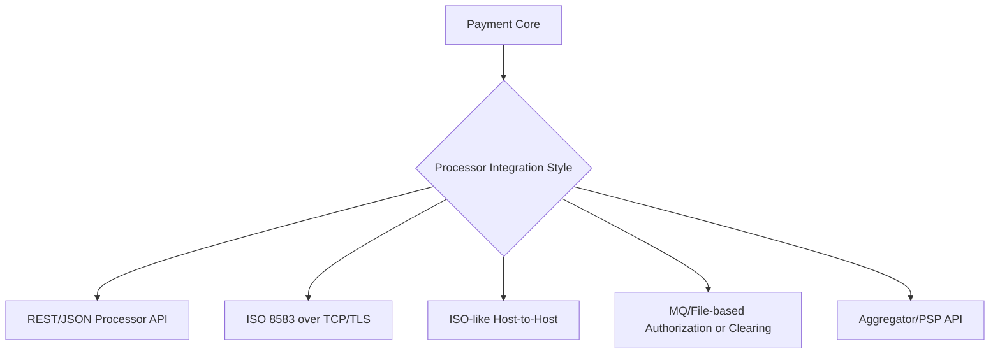

### 4.1 REST/JSON Processor API

Modern processor exposes REST API but internally maps to card network messages. You still need ISO concepts because response codes, reversals, authorization IDs, and settlement references leak through.

### 4.2 ISO 8583 Over TCP/TLS

Direct host connection. You need:

- connection pooling/session management,
- sign-on/sign-off,
- echo/network management,
- message correlation,
- timeout handling,
- reversal/advice handling,
- MAC/key management,
- parser/packer,
- operations console.

### 4.3 ISO-like Host-to-Host

Some processors provide “ISO-like” specs with proprietary fields. Treat as processor-specific dialect.

### 4.4 PSP/Aggregator API

PSP hides ISO, but you still need to model unknown outcome, auth/capture/reversal semantics, and response code normalization.

---

## 5. Authorization Message Flow

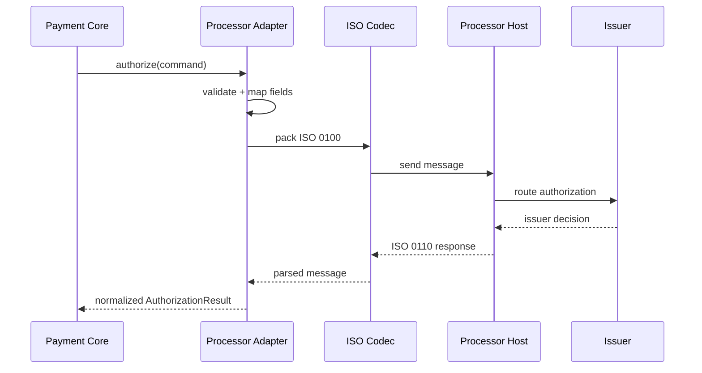

Payment Core sees:

```java
public sealed interface AuthorizationResult {
    record Approved(
        String processorReference,
        String approvalCode,
        String retrievalReferenceNumber,
        String networkTransactionId,
        AuthorizationEvidence evidence
    ) implements AuthorizationResult {}

    record Declined(
        String declineCode,
        String declineCategory,
        boolean retryable,
        AuthorizationEvidence evidence
    ) implements AuthorizationResult {}

    record Unknown(
        String reason,
        boolean reversalRequired,
        AuthorizationEvidence evidence
    ) implements AuthorizationResult {}

    record Failed(
        String failureCode,
        boolean retryable,
        AuthorizationEvidence evidence
    ) implements AuthorizationResult {}
}
```

Payment Core does not see `DE39` directly. It sees normalized categories.

---

## 6. Response Code Normalization

Issuer/processor response codes are not enough as domain states.

A response code must be normalized into:

- approved,
- declined hard,
- declined soft,
- insufficient funds,
- suspected fraud,
- do not honor,
- expired card,
- invalid card,
- authentication required,
- pickup card,
- format error,
- system malfunction,
- timeout/unknown,
- issuer unavailable,
- processor unavailable.

Example:

```java
public enum NormalizedDeclineCategory {
    INSUFFICIENT_FUNDS,
    DO_NOT_HONOR,
    EXPIRED_CARD,
    INVALID_CARD,
    SUSPECTED_FRAUD,
    AUTHENTICATION_REQUIRED,
    LIMIT_EXCEEDED,
    ISSUER_UNAVAILABLE,
    PROCESSOR_ERROR,
    FORMAT_ERROR,
    UNKNOWN_DECLINE
}
```

Mapping must be versioned per processor/acquirer/scheme.

```sql
create table processor_response_code_mapping (
    id uuid primary key,
    processor text not null,
    scheme text,
    raw_code text not null,
    raw_description text,
    normalized_category text not null,
    retryable boolean not null,
    customer_message_key text not null,
    merchant_message_key text not null,
    effective_from date not null,
    effective_to date,
    created_at timestamptz not null default now(),
    unique (processor, scheme, raw_code, effective_from)
);
```

Do not display raw processor response directly to customer. Also do not hide raw response from operations. You need both:

- customer-safe message,
- merchant-actionable message,
- internal evidence.

---

## 7. Unknown Outcome Is The Central Failure Mode

The hardest ISO/processor problem is not decline. It is unknown outcome.

Unknown can happen when:

- request sent, connection dropped,
- processor received request, response lost,
- issuer approved, processor response timeout,
- adapter timed out before host response,
- duplicate STAN/reference collision,
- reversal sent but reversal response lost,
- network management session unstable.

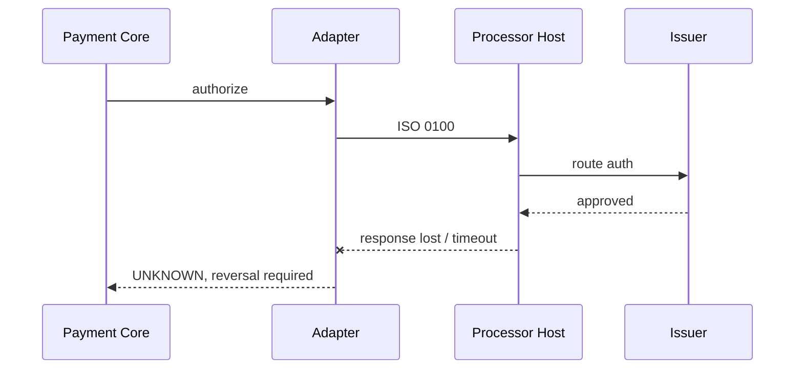

From merchant perspective, this is terrifying: customer may have been authorized, but platform does not know.

Rule:

> If a financial request may have reached the processor and the response is missing, do not blindly retry as a new authorization. Resolve, reverse, or reconcile according to processor contract.

---

## 8. Reversal Model

Reversal is used to undo/void an authorization or financial message when outcome is uncertain or transaction needs to be cancelled.

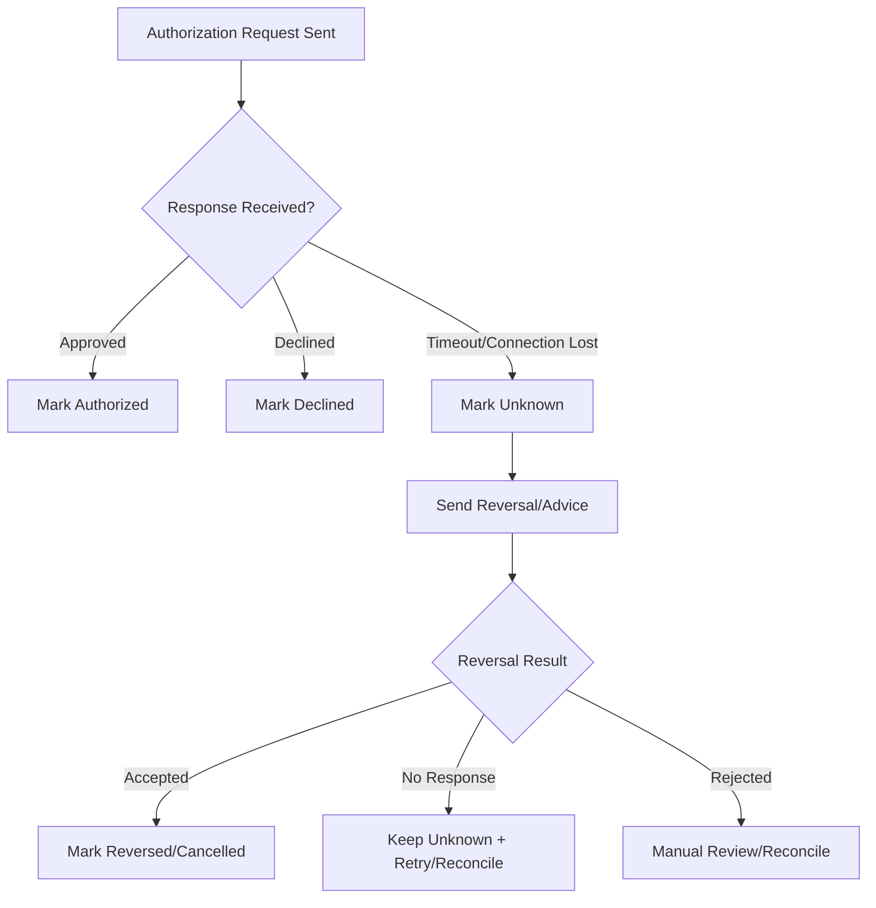

A reversal itself can have unknown outcome. Therefore reversal needs its own operation log.

```sql
create table processor_operation (
    id uuid primary key,
    payment_attempt_id uuid not null,
    operation_type text not null,
    processor text not null,
    mti text,
    stan text,
    retrieval_reference_number text,
    processor_reference text,
    correlation_key text not null,
    idempotency_key text not null,
    status text not null,
    normalized_result text,
    raw_request_hash text,
    raw_response_hash text,
    sent_at timestamptz,
    response_received_at timestamptz,
    timeout_at timestamptz,
    created_at timestamptz not null default now(),
    updated_at timestamptz not null default now(),

    unique (processor, operation_type, idempotency_key),
    unique (processor, correlation_key)
);
```

Operation status examples:

- CREATED,
- SENT,
- RESPONSE_RECEIVED,
- TIMEOUT,
- UNKNOWN,
- REVERSAL_REQUIRED,
- REVERSAL_SENT,
- REVERSED,
- RECONCILED,
- MANUAL_REVIEW.

---

## 9. STAN, RRN, Approval Code, Network Transaction ID

These references matter for support, reconciliation, dispute, and processor communication.

### 9.1 STAN

System Trace Audit Number. Often used to correlate request/response within a time window. It may not be globally unique forever.

### 9.2 RRN

Retrieval Reference Number. Used in retrieval, dispute, settlement, and support workflows. Often appears in merchant/issuer/acquirer communication.

### 9.3 Approval Code

Issuer authorization identification response. Useful evidence that authorization was approved.

### 9.4 Network Transaction ID

Scheme/network-level identifier where available. Extremely useful for lifecycle correlation.

Design implication:

```java
public record AuthorizationEvidence(
    String processor,
    Optional<String> stan,
    Optional<String> retrievalReferenceNumber,
    Optional<String> approvalCode,
    Optional<String> networkTransactionId,
    Optional<String> processorReference,
    String requestHash,
    Optional<String> responseHash,
    Instant sentAt,
    Optional<Instant> receivedAt
) {}
```

Store these carefully. They are not decoration.

---

## 10. Processor Adapter Boundary

Adapter should be divided into clear components.

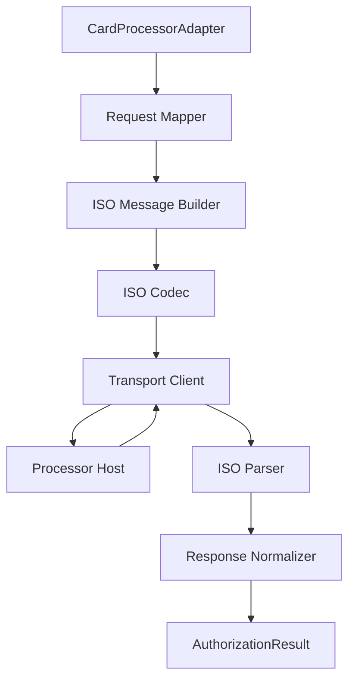

Java sketch:

```java
public final class Iso8583CardProcessorAdapter implements CardProcessorAdapter {
    private final IsoAuthorizationMapper mapper;
    private final IsoMessageCodec codec;
    private final ProcessorTransport transport;
    private final IsoResponseNormalizer normalizer;
    private final ProcessorOperationRepository operations;

    @Override
    public AuthorizationResult authorize(CardAuthorizationCommand command) {
        ProcessorOperation op = operations.createAuthorizeOperation(command);

        IsoMessage request = mapper.toAuthorizationRequest(command, op);
        byte[] packed = codec.pack(request);

        operations.markSent(op.id(), hash(packed));

        try {
            byte[] rawResponse = transport.sendAndReceive(op.correlationKey(), packed, command.timeout());
            IsoMessage response = codec.unpack(rawResponse);
            operations.markResponseReceived(op.id(), hash(rawResponse), response.mti());
            return normalizer.normalizeAuthorization(response, op);
        } catch (ProcessorTimeoutException timeout) {
            operations.markTimeout(op.id(), timeout.occurredAt());
            return AuthorizationResult.unknown(
                "PROCESSOR_TIMEOUT_AFTER_SEND",
                true,
                op.toEvidence()
            );
        } catch (IsoMessageException invalidMessage) {
            operations.markFailed(op.id(), "INVALID_ISO_RESPONSE");
            return AuthorizationResult.failed(
                "INVALID_ISO_RESPONSE",
                false,
                op.toEvidence()
            );
        }
    }
}
```

Important detail: if timeout occurs after send, result is not ordinary failure. It may be unknown.

---

## 11. ISO Codec Design

Do not scatter packing/parsing logic across adapter.

```java
public interface IsoMessageCodec {
    byte[] pack(IsoMessage message);
    IsoMessage unpack(byte[] bytes);
}

public record IsoMessage(
    String mti,
    Map<Integer, IsoFieldValue> fields
) {
    public Optional<IsoFieldValue> field(int number) {
        return Optional.ofNullable(fields.get(number));
    }
}

public sealed interface IsoFieldValue {
    record Numeric(String value) implements IsoFieldValue {}
    record Alpha(String value) implements IsoFieldValue {}
    record Binary(byte[] value) implements IsoFieldValue {}
    record Llvar(String value) implements IsoFieldValue {}
    record Lllvar(String value) implements IsoFieldValue {}
}
```

Production codec needs field dictionary:

```java
public record IsoFieldDefinition(
    int number,
    String name,
    IsoFieldType type,
    int maxLength,
    LengthEncoding lengthEncoding,
    ContentEncoding contentEncoding,
    boolean sensitive
) {}
```

The field dictionary is processor dialect-specific.

```text
iso-dialects/
  processor-a/
    auth-v1.yaml
    reversal-v1.yaml
    network-management-v1.yaml
  processor-b/
    auth-v3.yaml
```

---

## 12. Transport Layer

Raw ISO integration often uses long-lived TCP/TLS connection, not stateless HTTP.

Transport concerns:

- connection lifecycle,
- sign-on/sign-off,
- echo test,
- heartbeat,
- reconnect,
- in-flight request tracking,
- response correlation,
- socket timeout,
- write timeout,
- backpressure,
- circuit breaker,
- standby host failover,
- message framing length header,
- TLS certificate rotation.

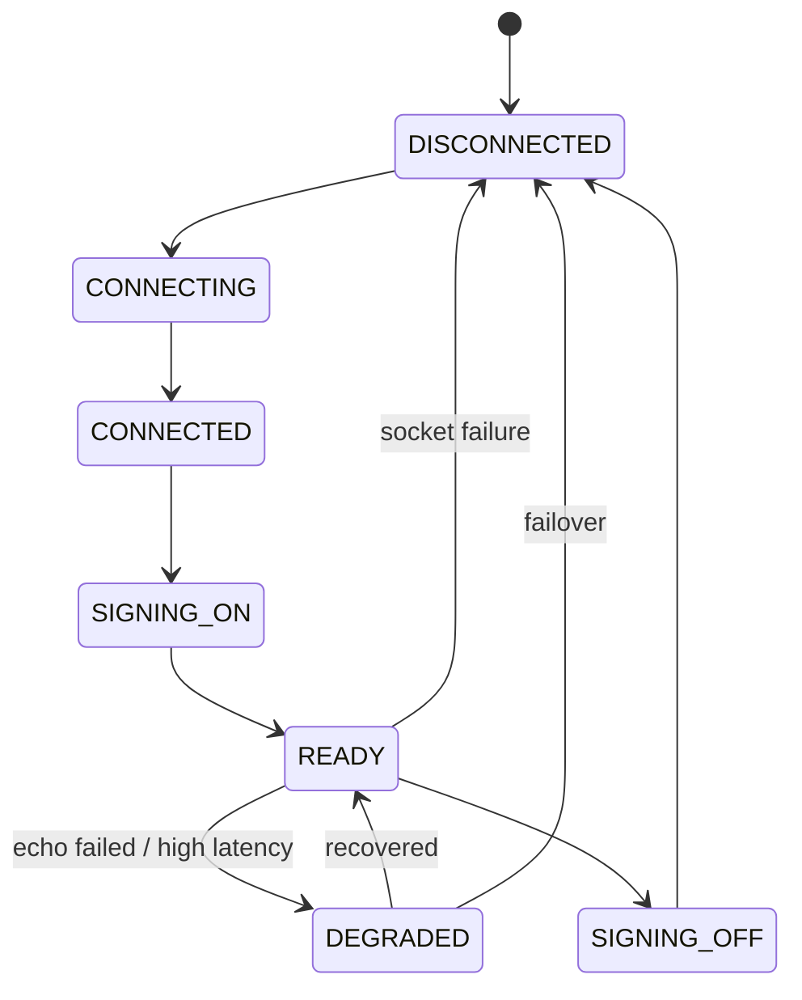

Payment Core should not know transport state. Orchestration/routing engine can consume processor health metrics.

---

## 13. Message Correlation

Processor responses must be matched to operation.

Correlation candidates:

- STAN,
- RRN,
- local transaction date/time,
- terminal ID,
- merchant ID,
- amount,
- processor reference,
- custom/private field,
- request sequence.

Never rely on only one field unless processor contract guarantees it.

```java
public record ProcessorCorrelationKey(
    String processor,
    String mtiFamily,
    String stan,
    Optional<String> rrn,
    Optional<String> terminalId,
    LocalDate localDate
) {}
```

If two in-flight requests collide on correlation key, stop the world for that route. That is a financial safety incident.

---

## 14. Idempotency And Duplicate Messages

A payment retry can create duplicate authorization if not controlled.

Required idempotency layers:

| Layer | Key |
|---|---|
| Merchant API | merchant id + idempotency key |
| Payment Attempt | payment intent + attempt sequence |
| Processor Operation | payment attempt + operation type |
| ISO Message | STAN/RRN/private trace according to processor spec |
| Ledger | business event id + posting rule |
| Reconciliation | provider reference + settlement report line |

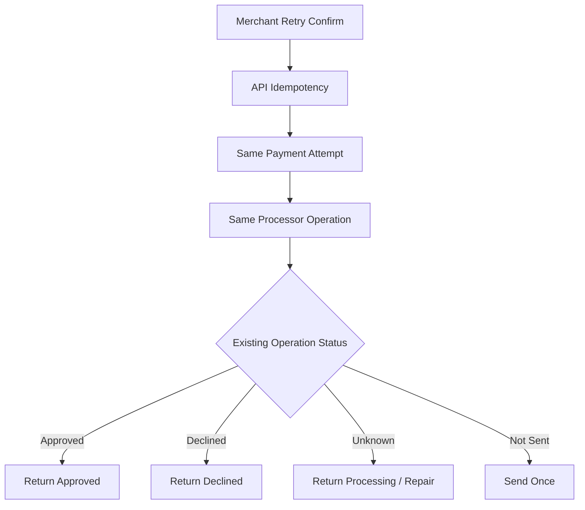

Never solve duplicate authorization with “just retry HTTP”. ISO/processor calls are financial operations.

---

## 15. MAC, PIN, Keys, And HSM Boundary

Some ISO integrations require message authentication code, PIN block, or cryptographic key exchange.

This is not application-layer decoration. It is a security boundary.

Typical concerns:

- key ceremony,
- key encryption key / working key,
- MAC generation,
- MAC verification,
- PIN block translation,
- HSM integration,
- key rotation,
- dual control,
- audit evidence,
- separation of duties.

Architecture boundary:

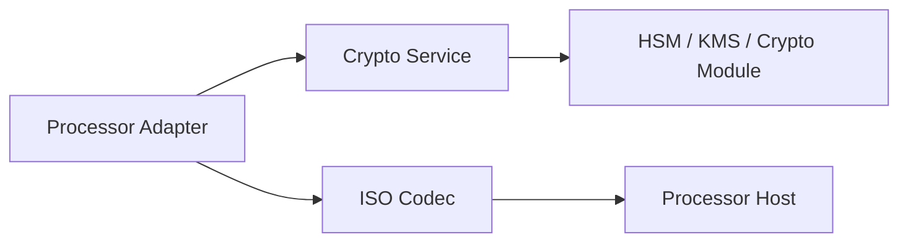

Do not implement PIN/MAC/key handling casually in app code. Use assessed crypto modules/HSM and follow processor/acquirer/security requirements.

PCI DSS is relevant because cardholder data and sensitive authentication data handling can place systems in PCI scope. The safer default is segmentation and minimization.

---

## 16. Logging And Redaction

ISO messages can contain PAN, expiry, track data, EMV data, PIN data, and private fields. Never log raw ISO blindly.

Field dictionary should mark sensitive fields.

```yaml
fields:
  2:
    name: pan
    type: llvar
    sensitive: true
    log: masked-pan
  4:
    name: transactionAmount
    type: numeric
    sensitive: false
    log: plain
  52:
    name: pinData
    type: binary
    sensitive: true
    log: forbidden
  55:
    name: iccData
    type: binary
    sensitive: true
    log: hash-only
```

Logging function:

```java
public final class IsoSafeLogger {
    public Map<String, Object> sanitize(IsoMessage message, IsoDialect dialect) {
        Map<String, Object> safe = new LinkedHashMap<>();
        safe.put("mti", message.mti());

        for (var entry : message.fields().entrySet()) {
            IsoFieldDefinition def = dialect.field(entry.getKey());
            safe.put("DE" + entry.getKey(), sanitizeField(def, entry.getValue()));
        }

        return safe;
    }
}
```

Operational evidence should store raw message hash and encrypted raw payload only if required and access-controlled.

---

## 17. Schema For Raw Evidence

```sql
create table processor_raw_message_evidence (
    id uuid primary key,
    processor_operation_id uuid not null references processor_operation(id),
    direction text not null,
    mti text,
    payload_hash text not null,
    encrypted_payload_ref text,
    sanitized_payload jsonb not null,
    contains_pan boolean not null default false,
    contains_sensitive_auth_data boolean not null default false,
    retention_policy text not null,
    created_at timestamptz not null default now(),

    constraint chk_raw_direction check (direction in ('REQUEST', 'RESPONSE'))
);
```

Retention policy matters. You do not keep sensitive auth data just because it is useful for debugging.

---

## 18. Settlement And Reconciliation Linkage

Authorization is not settlement. ISO authorization evidence must later connect to clearing/settlement files or processor reports.

Useful linkage fields:

- payment attempt id,
- authorization operation id,
- capture id,
- RRN,
- approval code,
- processor reference,
- network transaction id,
- amount,
- currency,
- merchant id,
- terminal id,
- transaction date,
- settlement date,
- batch id.

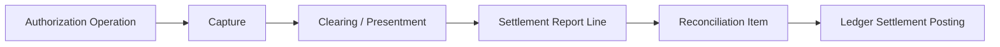

If processor reference mapping is weak, reconciliation becomes manual pain.

---

## 19. Advice Messages

Advice messages report that something happened or should be recorded, often without the same request/response semantics as normal authorization.

Examples:

- reversal advice,
- completion advice,
- network advice,
- offline approval advice.

Design advice handler like webhook ingestion:

- persist raw message,
- verify MAC/signature if applicable,
- deduplicate,
- correlate,
- apply state transition if legal,
- emit domain event,
- quarantine if unknown.

```java
public interface ProcessorIncomingMessageHandler {
    IncomingProcessorMessageResult handle(byte[] rawMessage);
}
```

Incoming processor messages are external evidence. Treat them like provider webhooks with stricter transport/security requirements.

---

## 20. Network Management

ISO host connection may require operational messages:

- sign-on,
- sign-off,
- echo test,
- key exchange,
- cutover notification,
- reconciliation batch control.

These are not payment attempts. Model them separately.

```sql
create table processor_network_session_event (
    id uuid primary key,
    processor text not null,
    connection_id text not null,
    event_type text not null,
    mti text,
    status text not null,
    request_hash text,
    response_hash text,
    occurred_at timestamptz not null default now()
);
```

Processor health should combine:

- socket connected,
- signed on,
- echo latency healthy,
- authorization response latency healthy,
- timeout rate below threshold,
- reversal backlog under threshold,
- response code distribution sane.

---

## 21. Routing Impact

Processor route health is not just “HTTP 200”. For ISO route, health includes:

| Signal | Meaning |
|---|---|
| sign-on status | route can accept financial messages |
| echo latency | host/network responsiveness |
| auth timeout rate | unknown outcome risk |
| reversal backlog | unresolved financial risk |
| issuer unavailable rate | downstream instability |
| format error rate | adapter or processor spec issue |
| MAC failure rate | key/security incident |
| duplicate response rate | correlation/transport issue |

Routing engine should degrade or disable route when unknown outcomes spike, not only when connection is down.

---

## 22. Simulator Design

You cannot production-test ISO integration only against processor certification host.

Build simulator with scenarios:

- approve,
- decline by response code,
- issuer unavailable,
- timeout before receiving,
- timeout after receiving but before sending response,
- duplicate response,
- malformed response,
- invalid MAC,
- reversal accepted,
- reversal timeout,
- late approval after timeout,
- echo failure,
- sign-on failure.

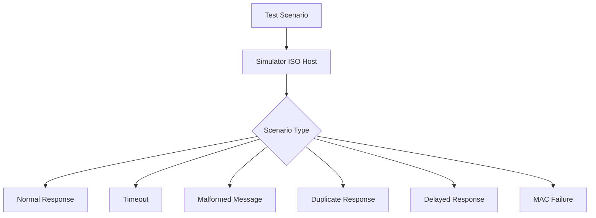

Simulator script example:

```yaml
scenario: auth_timeout_then_reversal_accepted
steps:
  - receive:
      mti: "0100"
      fields:
        4: "000000010000"
  - action:
      type: no_response
      durationMs: 35000
  - receive:
      mti: "0400"
  - respond:
      mti: "0410"
      fields:
        39: "00"
```

---

## 23. Contract Tests

Adapter contract tests should prove:

- correct MTI for operation,
- required fields present,
- amount formatting correct,
- currency code correct,
- STAN generated and stored,
- RRN generated or parsed according to spec,
- response code mapped correctly,
- timeout after send becomes unknown,
- reversal scheduled when required,
- raw PAN not logged,
- duplicate response is idempotent,
- invalid MAC quarantines message,
- malformed response does not mutate payment to approved.

Example test shape:

```java
@Test
void timeoutAfterSendCreatesUnknownAndSchedulesReversal() {
    simulator.givenScenario("auth_timeout_after_send");

    AuthorizationResult result = adapter.authorize(validCommand());

    assertThat(result).isInstanceOf(AuthorizationResult.Unknown.class);
    assertThat(((AuthorizationResult.Unknown) result).reversalRequired()).isTrue();

    ProcessorOperation op = operations.findByPaymentAttempt(command.paymentAttemptId());
    assertThat(op.status()).isEqualTo("UNKNOWN");
    assertThat(reversalQueue.hasPendingFor(op.id())).isTrue();
}
```

---

## 24. Certification And Test Evidence

Processor/acquirer certification usually requires evidence:

- message samples,
- positive/negative scenarios,
- reversal handling,
- timeout handling,
- MAC/key validation,
- settlement/reconciliation behavior,
- network management handling,
- log redaction proof,
- operational contact/runbook.

Keep certification artifacts versioned:

```text
certification/
  processor-a/
    2026-07-cert-run/
      test-plan.md
      message-samples/
      expected-results.csv
      issues.md
      signoff.pdf
```

Do not rely on tribal memory for processor certification.

---

## 25. Failure Matrix

| Failure | Correct Handling |
|---|---|
| socket unavailable before send | fail/retry route, no unknown financial outcome |
| socket drops after send | mark unknown, reversal/repair |
| response code declined | mark declined, no reversal needed unless processor says otherwise |
| approved response malformed | quarantine, do not mark approved blindly |
| MAC invalid | reject/quarantine, security alert |
| duplicate approved response | idempotent no-op after first apply |
| reversal response lost | reversal unknown, retry/reconcile |
| late approval after reversal | manual review/reconciliation |
| STAN collision | stop route, financial incident |
| high format error rate | adapter deployment/spec mismatch |
| PAN appears in logs | security incident |

---

## 26. Minimal Production Checklist

Before calling an ISO/processor integration production-ready:

- [ ] ISO dialect is explicit and versioned,
- [ ] codec isolated from payment core,
- [ ] adapter returns normalized domain result,
- [ ] raw response code mapping is versioned,
- [ ] timeout-after-send becomes unknown, not simple failure,
- [ ] reversal workflow exists,
- [ ] reversal workflow itself handles unknown,
- [ ] operation log stores STAN/RRN/approval/reference,
- [ ] duplicate request/response handling is idempotent,
- [ ] transport session state is observable,
- [ ] sign-on/echo/network management modeled separately,
- [ ] MAC/key/HSM boundary is explicit,
- [ ] sensitive fields are never logged raw,
- [ ] simulator covers approval, decline, timeout, malformed, duplicate, reversal,
- [ ] route health includes unknown outcome and reversal backlog metrics,
- [ ] certification artifacts are versioned.

---

## 27. What We Have Built Conceptually

We now understand how low-level processor integration maps into payment platform architecture.

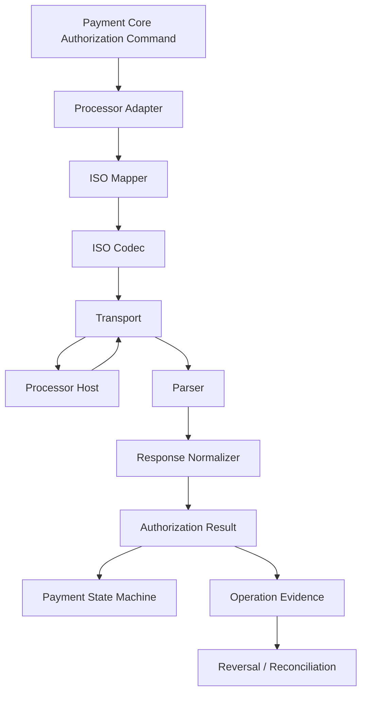

The core principle:

> ISO 8583 details are adapter concerns, but ISO 8583 semantics are platform concerns.

Payment Core should not know bitmap positions. But Payment Core must understand that authorization can be approved, declined, or unknown; that timeout can require reversal; and that references like RRN/approval code are important evidence for reconciliation and dispute.

In the next part, we move from card/processor integration into **bank transfer and virtual account flows**: collection, account matching, expiry, reconciliation, reversal, and the very different semantics of push-based payment rails.

---

## References

- ISO — ISO 8583:2023, Financial-transaction-card-originated messages: https://www.iso.org/standard/79451.html
- PCI Security Standards Council — PCI DSS v4.0.1: https://blog.pcisecuritystandards.org/just-published-pci-dss-v4-0-1
- EMVCo — EMV Specifications and secure card-based payments: https://www.emvco.com/
- jPOS — ISO 8583 Java framework documentation: https://jpos.org/doc/javadoc/
- Mastercard Developers — Card/payment API references and response handling examples: https://developer.mastercard.com/
- Visa Developer — Payment authorization and card payment APIs: https://developer.visa.com/
