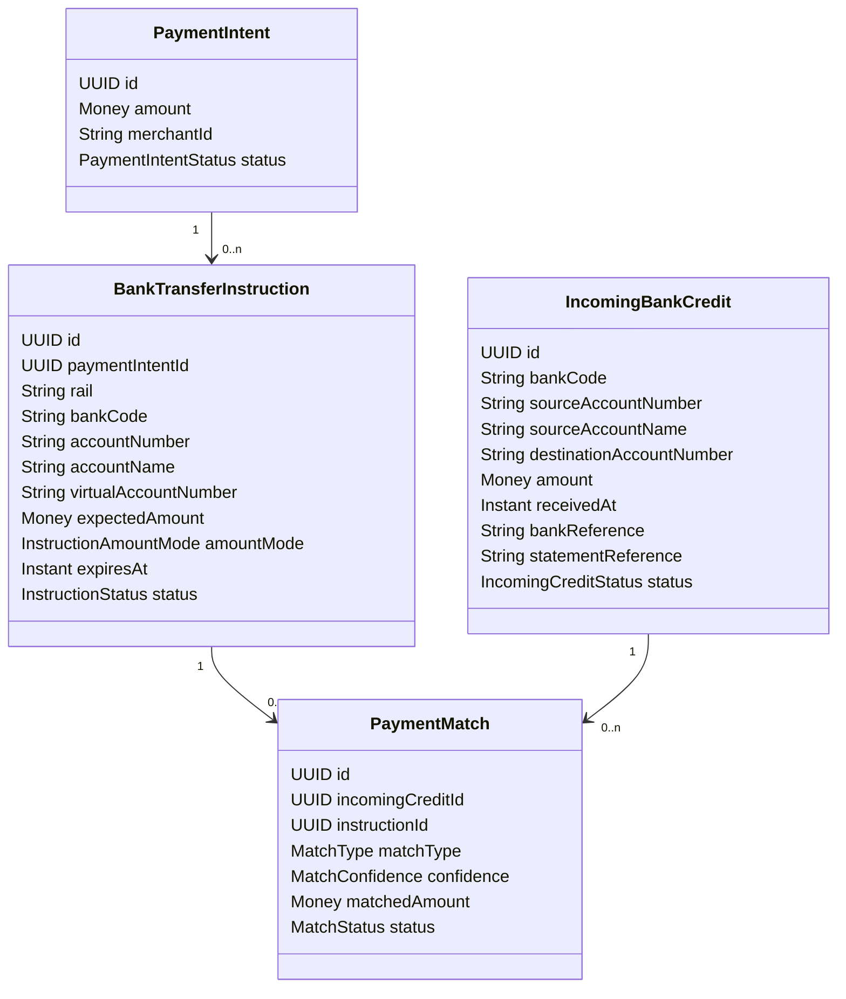
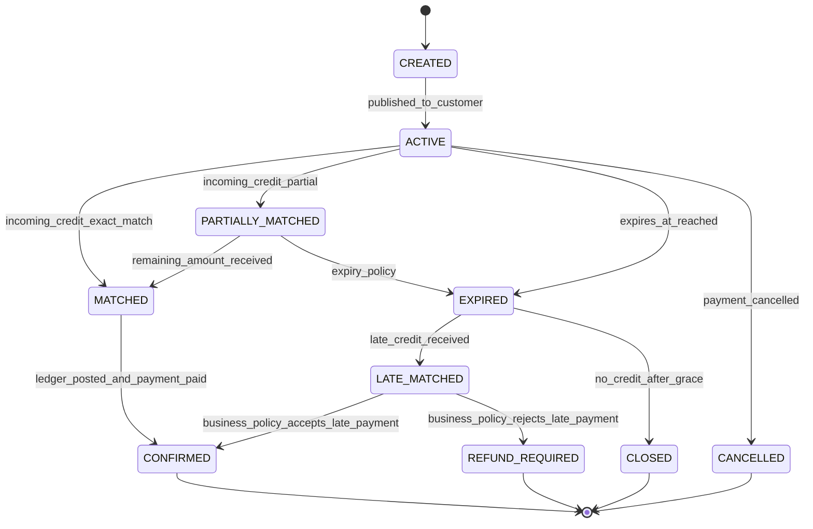
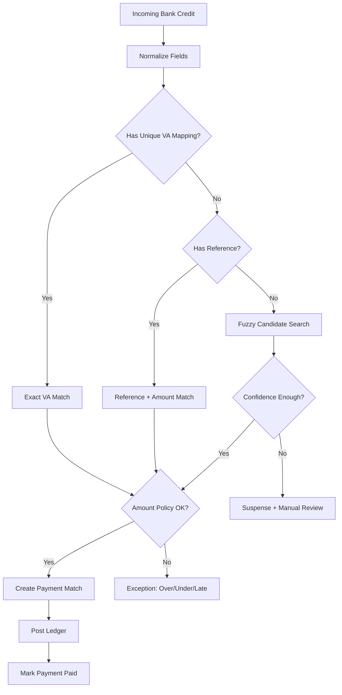
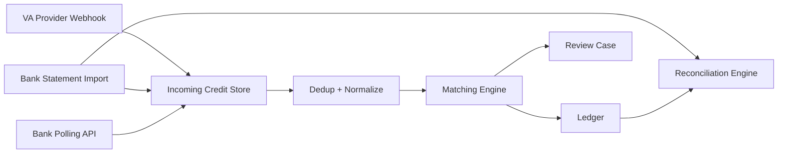
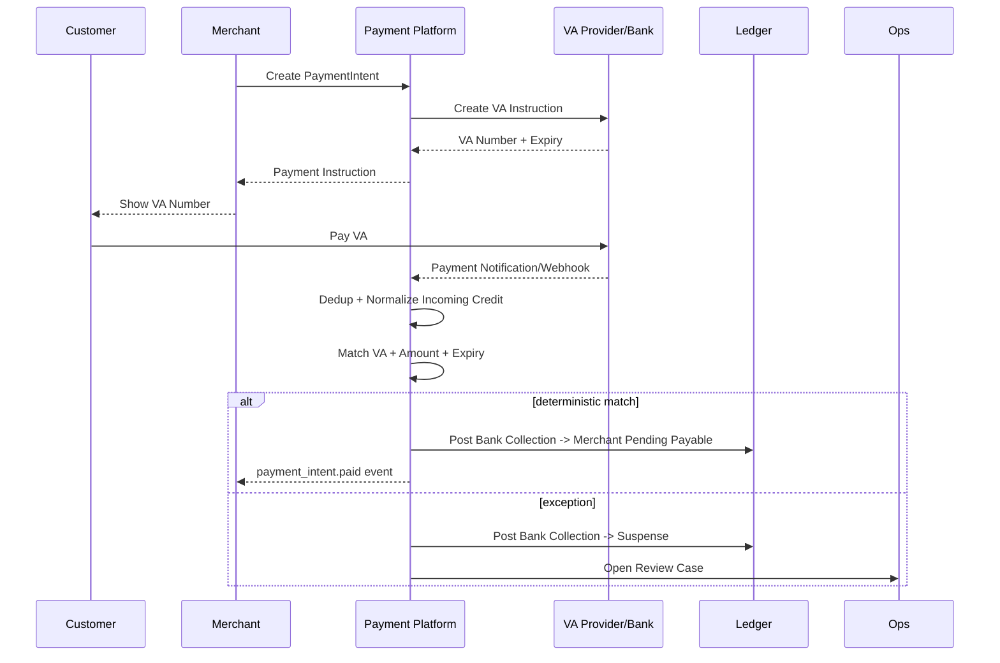

------
title: Build From Scratch: Large Production Grade Java Payment Systems - Part 029
description: Bank transfer and virtual account flows for enterprise-grade Java payment platforms: payment instructions, matching, expiry, reversal, bank statement ingestion, reconciliation, and ledger correctness.
series: learn-java-payment-systems
seriesTitle: Build From Scratch: Large Production Grade Java Payment Systems
order: 29
partTitle: Bank Transfer and Virtual Account Flows
tags:
- java
- payments
- bank-transfer
- virtual-account
- reconciliation
- ledger
- fintech
- enterprise-architecture
date: 2026-07-02
------

# Part 029 — Bank Transfer & Virtual Account Flows

> Payment kartu sering terlihat rumit karena authorization, capture, scheme, issuer, 3DS, dan chargeback.
>
> Tetapi bank transfer dan virtual account punya jebakan yang berbeda: uang sering datang lewat rail yang asynchronous, reference bisa salah, amount bisa kurang/lebih, notifikasi bisa terlambat, statement bank bisa berbeda dari webhook provider, dan sistem harus tetap tahu apakah sebuah invoice sudah boleh dianggap paid.

Part ini membangun payment rail berbasis **bank transfer** dan **virtual account** dari nol secara production-grade.

Kita tidak akan membahas ulang HTTP, SQL dasar, Kafka dasar, atau Java basic. Fokusnya adalah desain domain, state machine, matching engine, ledger impact, reconciliation, dan operational failure model.

---

## 1. Tujuan Pembelajaran

Setelah part ini, kamu harus bisa mendesain:

1. payment instruction untuk transfer bank dan virtual account;
2. lifecycle virtual account single-use, multi-use, fixed amount, dan open amount;
3. matching engine antara incoming bank credit dengan expected payment;
4. expiry dan late payment handling;
5. overpayment, underpayment, duplicate payment, dan unknown payer handling;
6. bank statement ingestion sebagai sumber reconciliation;
7. ledger posting untuk pending, matched, confirmed, refunded, dan suspense money;
8. Java domain model dan service boundary untuk collection rail;
9. operational tooling untuk finance/ops ketika matching otomatis gagal.

Target mental model-nya sederhana:

> Bank transfer payment bukan “request sukses”. Ia adalah **instruksi untuk membuat customer mengirim uang**, lalu sistem harus membuktikan bahwa uang benar-benar masuk dan cocok dengan obligation yang benar.

---

## 2. Kenapa Bank Transfer Tidak Boleh Dimodelkan Seperti Card Payment

Pada card payment, sistem biasanya mengirim request authorization ke processor/acquirer dan menerima hasil sinkron atau semi-sinkron.

Pada bank transfer, terutama model virtual account, flow-nya sering seperti ini:

1. merchant membuat invoice;
2. payment platform membuat payment instruction;
3. customer menerima nomor rekening/VA dan amount;
4. customer melakukan transfer dari mobile banking/ATM/internet banking;
5. bank/VA provider mengirim notification atau platform menarik statement;
6. platform mencocokkan incoming credit dengan instruction;
7. platform menandai payment sebagai paid;
8. ledger dan merchant balance diperbarui;
9. settlement/payout merchant diproses kemudian.

Ada perbedaan fundamental:

| Area | Card Authorization | Bank Transfer / VA |
|---|---|---|
| Initiator movement | Merchant/platform meminta authorization | Customer mengirim uang ke account/instruction |
| Result model | approved/declined/unknown | incoming credit matched/unmatched/late/duplicate |
| Timing | near real-time request-response | bisa real-time, delayed, batch, atau notification-based |
| Amount error | biasanya amount request fixed | bisa exact, overpaid, underpaid, multiple transfers |
| Identifier error | provider reference jelas | customer dapat salah reference, salah amount, salah VA, transfer manual |
| Financial proof | auth/capture response + clearing/settlement | bank credit + statement + reconciliation |
| Main risk | double charge, auth expiry, chargeback | false paid, lost incoming money, unmatched credit, settlement mismatch |

Karena itu, desain bank transfer harus lebih dekat ke **collection accounting** dan **matching engine** daripada “payment request”.

---

## 3. Rail Taxonomy

Tidak semua “bank transfer” sama. Production platform perlu membedakan beberapa rail.

### 3.1 Manual Bank Transfer

Customer transfer ke rekening bank merchant/platform dan memasukkan reference secara manual.

Contoh instruksi:

```text
Bank: BCA
Account: 1234567890
Name: PT Example Payments
Amount: IDR 250,000
Reference: INV-2026-000123
Expired at: 2026-07-03 23:59 WIB
```

Masalah utama:

- customer lupa reference;
- customer salah amount;
- customer transfer dari nama rekening berbeda;
- satu transfer membayar beberapa invoice;
- satu invoice dibayar beberapa transfer;
- statement bank datang batch;
- tim ops harus manual match.

### 3.2 Virtual Account Fixed Amount

Platform/gateway membuat nomor VA untuk satu obligation dengan amount fixed.

Karakteristik:

- customer bayar ke VA number;
- bank/VA provider tahu expected amount;
- provider bisa reject amount yang salah;
- matching lebih mudah karena VA number unik;
- cocok untuk invoice/order checkout.

### 3.3 Virtual Account Open Amount

VA number bisa menerima amount apa pun.

Cocok untuk:

- top up wallet;
- merchant deposit;
- balance funding;
- recurring collection;
- customer account funding.

Risiko:

- amount tidak bisa diasumsikan cocok dengan invoice tertentu;
- perlu allocation rule;
- duplicate/partial payment lebih umum;
- membutuhkan suspense handling lebih kuat.

### 3.4 Reusable Virtual Account

Nomor VA melekat ke customer/merchant, bukan invoice.

Contoh:

```text
VA customer 9008-0001-123456
```

Setiap transfer ke VA itu masuk ke account customer tersebut. Cocok untuk wallet/top-up atau balance account.

### 3.5 Single-Use Virtual Account

Nomor VA hanya untuk satu invoice/payment intent.

Cocok untuk checkout karena matching deterministik.

### 3.6 Instant Account Transfer

Transfer melalui instant payment rail seperti BI-FAST, FedNow, RTP, SEPA Instant, Faster Payments, Pix, UPI, atau rail lokal lain.

Ini dibahas lebih detail di Part 030, tetapi di part ini kita perlakukan sebagai variasi transfer yang lebih real-time.

---

## 4. Domain Model Utama

Bank transfer/VA flow sebaiknya tidak langsung menempel ke `PaymentIntent` tanpa abstraction tambahan.

Kita butuh konsep **PaymentInstruction**.



### 4.1 PaymentIntent

Representasi kewajiban bisnis: customer harus membayar merchant/platform sebesar amount tertentu.

### 4.2 PaymentInstruction

Instruksi eksternal yang diberikan ke customer agar uang masuk lewat rail tertentu.

Satu `PaymentIntent` bisa punya banyak instruction:

- customer memilih VA BCA lalu gagal;
- customer memilih VA Mandiri;
- instruction pertama expired;
- retry membuat instruction baru;
- fallback ke transfer manual.

### 4.3 IncomingBankCredit

Bukti bahwa bank/VA provider melihat uang masuk.

Incoming credit bukan otomatis payment success. Ia adalah evidence.

### 4.4 PaymentMatch

Relasi antara incoming credit dengan instruction/payment obligation.

Payment match bisa:

- exact automatic;
- fuzzy automatic;
- manual confirmed;
- rejected;
- split;
- many-to-one;
- one-to-many.

### 4.5 Suspense Account

Jika uang masuk tetapi belum bisa dicocokkan, uang tidak boleh hilang. Ia harus masuk ke suspense account di ledger sampai jelas milik siapa.

---

## 5. Lifecycle Bank Transfer Instruction

State instruction bukan state payment intent. Instruction bisa expired sementara payment intent masih bisa dibayar dengan instruction lain.



### Status yang Penting

| Status | Makna |
|---|---|
| `CREATED` | instruction dibuat tetapi belum disajikan ke customer |
| `ACTIVE` | customer boleh membayar |
| `MATCHED` | incoming credit cocok secara cukup kuat |
| `PARTIALLY_MATCHED` | amount belum memenuhi expected amount |
| `EXPIRED` | instruction tidak lagi boleh dibayar menurut platform |
| `LATE_MATCHED` | credit datang setelah expiry |
| `CONFIRMED` | payment sudah dianggap paid dan ledger diposting final |
| `REFUND_REQUIRED` | uang masuk tetapi tidak diterima sebagai pembayaran valid |
| `CANCELLED` | instruction dibatalkan sebelum matched |
| `CLOSED` | instruction ditutup tanpa payment |

---

## 6. Amount Mode

Payment instruction harus menyimpan policy amount.

```java
public enum InstructionAmountMode {
    EXACT_AMOUNT_ONLY,
    MINIMUM_AMOUNT,
    OPEN_AMOUNT,
    INSTALLMENT_ALLOWED,
    OVERPAYMENT_ALLOWED,
    UNDERPAYMENT_ALLOWED_WITH_REVIEW
}
```

### 6.1 Exact Amount Only

Incoming credit hanya valid jika amount sama dengan expected amount.

Cocok untuk:

- invoice checkout;
- fixed order amount;
- virtual account yang bank bisa enforce amount.

### 6.2 Minimum Amount

Payment valid jika incoming amount >= expected amount. Selisih bisa:

- masuk customer balance;
- dikembalikan;
- masuk suspense sampai keputusan ops.

### 6.3 Open Amount

Payment tidak punya expected amount khusus. Semua incoming credit diterima sebagai top-up/deposit.

### 6.4 Installment Allowed

Satu obligation boleh dibayar dalam beberapa incoming credit.

Contoh:

```text
Invoice: IDR 1,000,000
Transfer 1: IDR 400,000
Transfer 2: IDR 600,000
Status: paid
```

### 6.5 Underpayment Review

Incoming amount kurang dari expected amount. Sistem tidak boleh otomatis paid, kecuali policy mengizinkan toleransi.

---

## 7. Matching Strategy

Matching adalah inti bank transfer system.



### 7.1 Exact VA Match

Jika VA number unik per instruction, matching relatif mudah:

```text
incoming.destination_account_number == instruction.virtual_account_number
```

Tetapi tetap harus validasi:

- instruction masih aktif atau late policy menerima;
- amount sesuai;
- currency sama;
- provider/bank code sesuai;
- incoming credit belum pernah digunakan;
- payment intent belum paid oleh method lain.

### 7.2 Reference + Amount Match

Untuk manual transfer:

```text
statement.reference contains invoice number
AND amount == expected amount
AND received_at within window
```

Ini lebih rapuh karena reference bisa diubah bank atau diinput salah oleh customer.

### 7.3 Fuzzy Matching

Fuzzy matching bisa memakai kombinasi:

- amount;
- date/time window;
- customer name;
- bank account name;
- reference similarity;
- merchant/customer historical account;
- invoice age;
- destination account;
- unique cents strategy.

Contoh scoring:

| Signal | Score |
|---|---:|
| exact amount | +40 |
| reference exact | +40 |
| reference fuzzy | +25 |
| payer name exact | +15 |
| within 2 hours | +10 |
| instruction active | +20 |
| multiple candidates same score | -50 |

Tetapi hati-hati: fuzzy matching yang terlalu agresif bisa membuat false paid.

> Dalam payment system, false positive matching lebih berbahaya daripada unmatched credit. Unmatched credit masih bisa diperbaiki; false paid bisa menyebabkan fulfillment barang/jasa tanpa pembayaran yang benar.

---

## 8. Matching Confidence

Simpan confidence, bukan hanya boolean.

```java
public enum MatchConfidence {
    DETERMINISTIC,
    HIGH,
    MEDIUM,
    LOW,
    MANUAL
}
```

Policy:

| Confidence | Action |
|---|---|
| `DETERMINISTIC` | auto confirm jika semua invariant valid |
| `HIGH` | auto confirm untuk low-risk merchant/amount kecil, atau manual untuk amount besar |
| `MEDIUM` | manual review |
| `LOW` | suspense |
| `MANUAL` | hanya setelah operator memilih match |

---

## 9. Late Payment

Late payment adalah kasus umum.

Instruction expired jam 10:00. Customer transfer jam 10:05. Bank notification datang jam 10:07.

Apa yang harus terjadi?

Jawabannya bukan universal. Sistem harus policy-driven.

### 9.1 Late Acceptance Policy

```java
public enum LatePaymentPolicy {
    ACCEPT_WITHIN_GRACE_PERIOD,
    ACCEPT_IF_ORDER_NOT_CANCELLED,
    REJECT_AND_REFUND,
    MANUAL_REVIEW
}
```

### 9.2 Grace Period

Contoh:

```text
expiresAt = 10:00
lateGracePeriod = 30 minutes
receivedAt = 10:15 -> accepted
receivedAt = 10:45 -> manual/refund
```

### 9.3 Business Dependency

Late payment tidak bisa diputus oleh payment service sendiri jika order sudah dibatalkan atau stock sudah dilepas.

Maka payment platform harus expose event:

```text
PaymentLateMatched
```

Lalu commerce/order domain bisa menjawab:

```text
Accept late payment? yes/no/manual
```

Namun ledger tetap harus mencatat uang masuk sejak awal.

---

## 10. Overpayment dan Underpayment

### 10.1 Overpayment

Expected: IDR 250,000  
Received: IDR 255,000

Kemungkinan treatment:

1. accept as paid, excess masuk customer balance;
2. accept as paid, excess refund;
3. manual review;
4. reject entire payment dan refund full amount.

Jangan hilangkan selisih sebagai “rounding”.

### 10.2 Underpayment

Expected: IDR 250,000  
Received: IDR 249,000

Kemungkinan treatment:

1. mark partially paid;
2. keep pending until remaining received;
3. accept if within tolerance;
4. manual review;
5. refund partial and keep unpaid.

### 10.3 Ledger Treatment

Overpayment tidak boleh langsung menjadi revenue.

Ia biasanya masuk:

- customer payable;
- merchant payable tambahan jika policy menyatakan tip/donation;
- suspense liability;
- refund payable.

---

## 11. Duplicate Payment

Customer bisa membayar invoice yang sama dua kali.

Contoh:

```text
Instruction: VA-123 expected IDR 500,000
Credit A: IDR 500,000 10:01
Credit B: IDR 500,000 10:03
```

Credit A membuat payment paid. Credit B tidak boleh membuat duplicate paid.

Treatment credit B:

- mark duplicate incoming credit;
- post to duplicate/suspense/customer balance;
- create refund required case;
- notify merchant/customer if needed.

Invariant:

```text
One payment obligation cannot be marked paid twice.
But every incoming money must be accounted for exactly once.
```

---

## 12. Database Schema

### 12.1 Bank Transfer Instruction

```sql
CREATE TABLE bank_transfer_instruction (
    id UUID PRIMARY KEY,
    payment_intent_id UUID NOT NULL,
    merchant_id UUID NOT NULL,
    rail VARCHAR(64) NOT NULL,
    bank_code VARCHAR(32),
    account_number VARCHAR(128),
    account_name VARCHAR(256),
    virtual_account_number VARCHAR(128),
    expected_amount_minor BIGINT NOT NULL,
    currency CHAR(3) NOT NULL,
    amount_mode VARCHAR(64) NOT NULL,
    status VARCHAR(64) NOT NULL,
    expires_at TIMESTAMPTZ NOT NULL,
    late_grace_until TIMESTAMPTZ,
    provider_code VARCHAR(64),
    provider_instruction_id VARCHAR(256),
    metadata JSONB NOT NULL DEFAULT '{}'::jsonb,
    version BIGINT NOT NULL DEFAULT 0,
    created_at TIMESTAMPTZ NOT NULL,
    updated_at TIMESTAMPTZ NOT NULL,
    CHECK (expected_amount_minor >= 0)
);

CREATE UNIQUE INDEX ux_bank_transfer_instruction_provider_ref
ON bank_transfer_instruction(provider_code, provider_instruction_id)
WHERE provider_instruction_id IS NOT NULL;

CREATE UNIQUE INDEX ux_bank_transfer_instruction_va_active
ON bank_transfer_instruction(provider_code, virtual_account_number)
WHERE status IN ('CREATED', 'ACTIVE');
```

### 12.2 Incoming Bank Credit

```sql
CREATE TABLE incoming_bank_credit (
    id UUID PRIMARY KEY,
    provider_code VARCHAR(64) NOT NULL,
    bank_code VARCHAR(32),
    destination_account_number VARCHAR(128),
    source_account_number VARCHAR(128),
    source_account_name VARCHAR(256),
    amount_minor BIGINT NOT NULL,
    currency CHAR(3) NOT NULL,
    received_at TIMESTAMPTZ NOT NULL,
    provider_event_id VARCHAR(256),
    bank_reference VARCHAR(256),
    statement_reference VARCHAR(256),
    raw_payload_hash CHAR(64) NOT NULL,
    status VARCHAR(64) NOT NULL,
    created_at TIMESTAMPTZ NOT NULL,
    updated_at TIMESTAMPTZ NOT NULL,
    CHECK (amount_minor > 0)
);

CREATE UNIQUE INDEX ux_incoming_bank_credit_provider_event
ON incoming_bank_credit(provider_code, provider_event_id)
WHERE provider_event_id IS NOT NULL;

CREATE INDEX ix_incoming_bank_credit_unmatched
ON incoming_bank_credit(status, received_at)
WHERE status IN ('RECEIVED', 'UNMATCHED', 'SUSPENSE');
```

### 12.3 Payment Match

```sql
CREATE TABLE payment_match (
    id UUID PRIMARY KEY,
    incoming_credit_id UUID NOT NULL REFERENCES incoming_bank_credit(id),
    instruction_id UUID REFERENCES bank_transfer_instruction(id),
    payment_intent_id UUID,
    match_type VARCHAR(64) NOT NULL,
    confidence VARCHAR(64) NOT NULL,
    matched_amount_minor BIGINT NOT NULL,
    currency CHAR(3) NOT NULL,
    status VARCHAR(64) NOT NULL,
    reason JSONB NOT NULL DEFAULT '{}'::jsonb,
    created_by VARCHAR(128) NOT NULL,
    approved_by VARCHAR(128),
    created_at TIMESTAMPTZ NOT NULL,
    approved_at TIMESTAMPTZ,
    CHECK (matched_amount_minor > 0)
);

CREATE UNIQUE INDEX ux_payment_match_credit_confirmed
ON payment_match(incoming_credit_id)
WHERE status IN ('CONFIRMED', 'LEDGER_POSTED');
```

### 12.4 Manual Review Case

```sql
CREATE TABLE bank_transfer_review_case (
    id UUID PRIMARY KEY,
    incoming_credit_id UUID NOT NULL REFERENCES incoming_bank_credit(id),
    suggested_instruction_id UUID,
    suggested_payment_intent_id UUID,
    case_type VARCHAR(64) NOT NULL,
    priority VARCHAR(32) NOT NULL,
    status VARCHAR(64) NOT NULL,
    amount_minor BIGINT NOT NULL,
    currency CHAR(3) NOT NULL,
    evidence JSONB NOT NULL DEFAULT '{}'::jsonb,
    assigned_to VARCHAR(128),
    created_at TIMESTAMPTZ NOT NULL,
    resolved_at TIMESTAMPTZ
);
```

---

## 13. Idempotency dan Deduplication

Incoming credit bisa masuk dari beberapa channel:

- webhook VA provider;
- bank statement file;
- polling API bank;
- manual upload;
- reconciliation correction.

Satu credit yang sama bisa muncul beberapa kali dengan reference yang berbeda.

### 13.1 Dedup Key

Dedup tidak boleh hanya mengandalkan provider event ID. Beberapa bank statement tidak punya event ID stabil.

Candidate dedup fingerprint:

```text
provider_code
bank_code
destination_account_number
amount
currency
received_at truncated to second/minute
bank_reference
statement_reference
source_account_number
```

Tetapi fingerprint harus hati-hati. Dua transfer identik bisa valid.

Maka sistem sebaiknya punya:

1. hard dedup by provider event ID;
2. soft duplicate detection by fingerprint;
3. manual review for suspicious duplicates;
4. never silently drop incoming money without evidence.

---

## 14. Ledger Posting

Bank transfer ledger tidak boleh menunggu order domain dulu untuk mengakui bahwa uang masuk.

Jika bank credit masuk, platform sudah punya evidence bahwa uang ada di collection account.

### 14.1 Unmatched Incoming Credit

```text
Dr Bank Collection Asset                500,000
Cr Suspense Liability                   500,000
```

Artinya uang ada, tetapi pemilik/payment obligation belum jelas.

### 14.2 Matched Payment

Jika credit cocok dengan payment intent merchant:

```text
Dr Suspense Liability                   500,000
Cr Merchant Pending Payable             500,000
```

Jika langsung deterministik tanpa suspense intermediate, sistem bisa post satu journal:

```text
Dr Bank Collection Asset                500,000
Cr Merchant Pending Payable             500,000
```

Tetapi secara operasional, menyimpan fase suspense sering lebih mudah untuk repair.

### 14.3 Fee Recognition

Jika platform fee IDR 10,000:

```text
Dr Merchant Pending Payable             10,000
Cr Platform Fee Revenue / Fee Payable   10,000
```

Tergantung accounting policy, fee revenue recognition bisa ditunda sampai settlement/fulfillment.

### 14.4 Refund Late/Invalid Payment

Jika payment rejected dan perlu refund:

```text
Dr Suspense Liability                   500,000
Cr Refund Payable                       500,000
```

Saat payout refund keluar:

```text
Dr Refund Payable                       500,000
Cr Bank Collection Asset                500,000
```

---

## 15. Java Domain Model

### 15.1 Money

Gunakan value object dari part sebelumnya.

```java
public record Money(String currency, long minorUnits) {
    public Money {
        if (currency == null || currency.length() != 3) {
            throw new IllegalArgumentException("currency must be ISO-4217 alpha code");
        }
        if (minorUnits < 0) {
            throw new IllegalArgumentException("money cannot be negative here");
        }
    }
}
```

### 15.2 Instruction

```java
public final class BankTransferInstruction {
    private final UUID id;
    private final UUID paymentIntentId;
    private final String merchantId;
    private final String providerCode;
    private final String bankCode;
    private final String virtualAccountNumber;
    private final Money expectedAmount;
    private final InstructionAmountMode amountMode;
    private final Instant expiresAt;
    private final Instant lateGraceUntil;
    private InstructionStatus status;
    private long version;

    public boolean isPayableAt(Instant receivedAt) {
        return status == InstructionStatus.ACTIVE && !receivedAt.isAfter(expiresAt);
    }

    public boolean isLateButWithinGrace(Instant receivedAt) {
        return status == InstructionStatus.EXPIRED
            && lateGraceUntil != null
            && !receivedAt.isAfter(lateGraceUntil);
    }

    public AmountValidationResult validateAmount(Money received) {
        if (!expectedAmount.currency().equals(received.currency())) {
            return AmountValidationResult.currencyMismatch();
        }
        return switch (amountMode) {
            case EXACT_AMOUNT_ONLY -> received.minorUnits() == expectedAmount.minorUnits()
                ? AmountValidationResult.ok()
                : AmountValidationResult.amountMismatch(expectedAmount, received);
            case MINIMUM_AMOUNT -> received.minorUnits() >= expectedAmount.minorUnits()
                ? AmountValidationResult.okWithPossibleExcess(received.minorUnits() - expectedAmount.minorUnits())
                : AmountValidationResult.underpaid(expectedAmount, received);
            case OPEN_AMOUNT -> AmountValidationResult.ok();
            case INSTALLMENT_ALLOWED -> AmountValidationResult.partialOrComplete(expectedAmount, received);
            case OVERPAYMENT_ALLOWED -> received.minorUnits() >= expectedAmount.minorUnits()
                ? AmountValidationResult.okWithPossibleExcess(received.minorUnits() - expectedAmount.minorUnits())
                : AmountValidationResult.underpaid(expectedAmount, received);
            case UNDERPAYMENT_ALLOWED_WITH_REVIEW -> AmountValidationResult.requiresReview(expectedAmount, received);
        };
    }
}
```

### 15.3 Incoming Credit

```java
public record IncomingBankCredit(
    UUID id,
    String providerCode,
    String bankCode,
    String destinationAccountNumber,
    String sourceAccountNumber,
    String sourceAccountName,
    Money amount,
    Instant receivedAt,
    String providerEventId,
    String bankReference,
    String statementReference,
    String rawPayloadHash
) {}
```

### 15.4 Match Candidate

```java
public record MatchCandidate(
    UUID instructionId,
    UUID paymentIntentId,
    MatchType matchType,
    MatchConfidence confidence,
    int score,
    Map<String, Object> evidence
) {}
```

---

## 16. Matching Service

```java
public final class BankTransferMatchingService {
    private final IncomingCreditRepository incomingCredits;
    private final InstructionRepository instructions;
    private final PaymentMatchRepository matches;
    private final LedgerPostingService ledger;
    private final ReviewCaseService reviewCases;

    public MatchDecision processIncomingCredit(IncomingBankCredit credit) {
        IncomingBankCredit stored = incomingCredits.insertOrGetExisting(credit);

        if (matches.hasConfirmedMatch(stored.id())) {
            return MatchDecision.alreadyMatched(stored.id());
        }

        List<MatchCandidate> candidates = findCandidates(stored);

        if (candidates.isEmpty()) {
            ledger.postSuspenseIfNotPosted(stored);
            reviewCases.openUnmatchedCreditCase(stored);
            return MatchDecision.suspense(stored.id());
        }

        MatchCandidate best = chooseBestCandidate(candidates);

        if (requiresManualReview(best, candidates, stored)) {
            ledger.postSuspenseIfNotPosted(stored);
            reviewCases.openMatchReviewCase(stored, best, candidates);
            return MatchDecision.manualReview(stored.id(), best.instructionId());
        }

        return confirmMatch(stored, best);
    }

    private MatchDecision confirmMatch(IncomingBankCredit credit, MatchCandidate candidate) {
        return Transactional.run(() -> {
            BankTransferInstruction instruction = instructions.lockById(candidate.instructionId());

            AmountValidationResult amountResult = instruction.validateAmount(credit.amount());
            if (!amountResult.canAutoConfirm()) {
                ledger.postSuspenseIfNotPosted(credit);
                reviewCases.openAmountExceptionCase(credit, instruction, amountResult);
                return MatchDecision.amountException(credit.id(), instruction.id());
            }

            PaymentMatch match = matches.createConfirmed(
                credit.id(),
                instruction.id(),
                instruction.paymentIntentId(),
                candidate.matchType(),
                candidate.confidence(),
                credit.amount(),
                candidate.evidence()
            );

            ledger.postBankTransferMatched(match);
            instructions.markMatched(instruction.id());

            return MatchDecision.confirmed(credit.id(), instruction.paymentIntentId());
        });
    }
}
```

Catatan penting:

- `insertOrGetExisting` harus idempotent;
- `lockById` mencegah race confirm/cancel/expire;
- `hasConfirmedMatch` mencegah duplicate processing;
- ledger posting harus idempotent dengan `external_reference`/`posting_key`;
- manual review tidak boleh membuat ledger tidak seimbang.

---

## 17. Provider Notification vs Bank Statement

Provider webhook tidak selalu cukup.

Production system sebaiknya punya dua jalur evidence:



### Kenapa Statement Tetap Dibutuhkan?

Webhook memberi tahu event. Statement bank membuktikan posisi rekening.

Webhook bisa:

- hilang;
- terlambat;
- duplicate;
- salah format;
- provider outage;
- tidak membawa semua fee/adjustment;
- tidak sama dengan settlement bank.

Bank statement adalah sumber penting untuk reconciliation.

---

## 18. Expiry Job

Instruction expiry tidak boleh hanya bergantung pada client UI.

```java
public final class InstructionExpiryJob {
    public void expireDueInstructions(Instant now, int batchSize) {
        List<UUID> ids = repository.findActiveExpiredInstructions(now, batchSize);
        for (UUID id : ids) {
            Transactional.run(() -> {
                BankTransferInstruction instruction = repository.lockById(id);
                if (instruction.status() != InstructionStatus.ACTIVE) {
                    return;
                }
                repository.markExpired(id, now);
                outbox.publish(new BankTransferInstructionExpired(id, instruction.paymentIntentId(), now));
            });
        }
    }
}
```

Use `FOR UPDATE SKIP LOCKED` untuk parallel worker.

```sql
SELECT id
FROM bank_transfer_instruction
WHERE status = 'ACTIVE'
  AND expires_at <= now()
ORDER BY expires_at
LIMIT 100
FOR UPDATE SKIP LOCKED;
```

---

## 19. Settlement dan Merchant Balance

Bank transfer collection sering terlihat “langsung uang masuk”, tetapi merchant belum tentu langsung available.

Platform bisa punya policy:

- T+0 available;
- T+1 available;
- after reconciliation;
- after risk review;
- after bank statement confirmed;
- after settlement batch close.

State merchant balance:

```text
Incoming credit matched
-> Merchant Pending Payable
-> Merchant Settled Payable
-> Merchant Available Balance
-> Payout Pending
-> Payout Sent
```

Untuk VA/bank transfer, risiko chargeback lebih kecil daripada kartu, tetapi risiko operational mismatch tetap besar.

---

## 20. Operational Backoffice

Bank transfer platform tanpa backoffice akan gagal di production.

Minimal screen:

1. incoming credit list;
2. unmatched credit queue;
3. match suggestion detail;
4. instruction/payment detail;
5. bank statement viewer;
6. ledger journal viewer;
7. manual match action;
8. split match action;
9. refund required case;
10. duplicate credit case;
11. late payment case;
12. audit trail.

### Manual Match Action

Manual match harus punya maker-checker untuk amount besar.

```text
Operator A proposes: Credit C -> Instruction I
Operator B approves
System posts ledger
System marks payment paid
Audit trail stores both identities and evidence
```

Manual action juga harus idempotent.

---

## 21. API Surface

### 21.1 Create Bank Transfer Instruction

```http
POST /v1/payment-intents/{id}/bank-transfer-instructions
Idempotency-Key: create-va-merchant-123-order-456
```

Response:

```json
{
  "id": "bti_123",
  "paymentIntentId": "pi_123",
  "status": "ACTIVE",
  "rail": "VIRTUAL_ACCOUNT",
  "bankCode": "BCA",
  "virtualAccountNumber": "88081234567890",
  "amount": {
    "currency": "IDR",
    "minorUnits": 25000000
  },
  "expiresAt": "2026-07-03T10:00:00+07:00",
  "instructions": [
    "Open mobile banking",
    "Choose Virtual Account",
    "Enter VA number",
    "Pay exact amount"
  ]
}
```

### 21.2 Get Instruction

```http
GET /v1/bank-transfer-instructions/{id}
```

### 21.3 Incoming Credit Internal Endpoint

Provider webhook should not directly mutate payment state. It should persist raw event first.

```http
POST /internal/provider-webhooks/{provider}/bank-transfer-credit
```

### 21.4 Manual Match

```http
POST /internal/ops/incoming-bank-credits/{id}/match
```

Body:

```json
{
  "instructionId": "bti_123",
  "reason": "Customer sent proof of transfer. Bank reference and amount match.",
  "evidenceIds": ["ev_123", "ev_456"]
}
```

---

## 22. Failure Model

| Failure | Bad Design | Better Design |
|---|---|---|
| Webhook duplicate | double paid | provider event id + ledger posting idempotency |
| Webhook missing | payment stuck unpaid | statement ingestion + reconciliation repair |
| Statement duplicate | duplicate incoming credit | hard/soft dedup with review |
| Wrong amount | auto paid | amount policy + exception case |
| Late payment | lost credit | suspense + late payment policy |
| Payment already cancelled | paid cancelled order | late matched event + order accept/reject decision |
| Manual match mistake | irreversible hidden corruption | maker-checker + reversal journal + audit trail |
| Two workers match same credit | duplicate match | unique index on confirmed match per credit |
| Two credits pay same invoice | duplicate paid | payment obligation paid constraint + duplicate credit handling |
| Provider reference changes | no match | raw evidence + multi-key matching |

---

## 23. Testing Strategy

### 23.1 Deterministic Tests

- exact VA match;
- fixed amount mismatch;
- open amount top-up;
- overpayment policy;
- underpayment policy;
- late within grace;
- late after grace;
- duplicate webhook;
- duplicate statement;
- manual match approval;
- manual match rejection.

### 23.2 Property Tests

Invariant examples:

```text
For any sequence of duplicate incoming credit events,
confirmed matched amount for a single incoming credit <= incoming credit amount.
```

```text
For any sequence of transfers for one fixed invoice,
payment intent can become PAID at most once.
```

```text
For any unmatched credit,
ledger must contain either suspense liability or confirmed match posting.
```

### 23.3 Race Tests

Scenarios:

1. expiry job vs incoming credit;
2. webhook vs statement import;
3. manual match vs auto match;
4. duplicate webhook in parallel;
5. two incoming credits for same instruction;
6. cancel payment vs incoming credit.

---

## 24. Observability

Metrics:

```text
bank_transfer.instructions.created.count
bank_transfer.instructions.expired.count
bank_transfer.incoming_credit.received.count
bank_transfer.match.auto.count
bank_transfer.match.manual.count
bank_transfer.match.suspense.count
bank_transfer.match.false_positive.detected.count
bank_transfer.late_payment.count
bank_transfer.overpayment.count
bank_transfer.underpayment.count
bank_transfer.duplicate_credit.count
bank_transfer.statement.import.lag_seconds
bank_transfer.unmatched_credit.age_seconds
bank_transfer.suspense.balance_minor
```

Critical alerts:

- sudden drop in incoming credit notifications;
- spike in unmatched credit;
- suspense balance growing abnormally;
- statement import delayed;
- high late payment rate;
- duplicate provider event spike;
- bank account statement balance mismatch;
- manual review SLA breached.

---

## 25. Mermaid: End-to-End VA Flow



---

## 26. Implementation Order

Build in this order:

1. instruction schema and API;
2. provider adapter create instruction;
3. raw webhook storage;
4. incoming credit normalization;
5. exact VA matching;
6. idempotent ledger posting;
7. instruction expiry;
8. statement import;
9. unmatched/suspense flow;
10. manual review;
11. over/under/late policy;
12. reconciliation report;
13. metrics and alerting;
14. simulator.

Do not start with fuzzy matching. Start with deterministic VA matching first.

---

## 27. Common Anti-Patterns

### 27.1 Mark Paid From Webhook Without Ledger

Bad:

```text
webhook received -> payment.status = PAID
```

Better:

```text
webhook received -> incoming credit stored -> matched -> ledger posted -> payment paid
```

### 27.2 No Suspense Account

If unmatched incoming credit is just “ignored”, finance will eventually find money in bank that product cannot explain.

### 27.3 Expiry Only in Frontend

Frontend expiry timer does not prevent late transfer.

### 27.4 One VA Number for Everything Without Allocation Rule

Reusable VA is fine only if the system knows how to allocate incoming money.

### 27.5 Manual Match Without Audit

Manual match changes financial truth. It must be fully auditable.

### 27.6 Fuzzy Match Too Early

Automated fuzzy match can be dangerous if operational volume is still small. Manual review may be safer at first.

---

## 28. Production Readiness Checklist

A bank transfer/VA rail is not production-ready until:

- every incoming credit is persisted raw;
- duplicate webhook cannot double post ledger;
- provider notification and bank statement can be reconciled;
- unmatched credit goes to suspense;
- manual review exists;
- late payment policy exists;
- overpayment and underpayment policy exists;
- instruction expiry is server-side;
- payment paid requires ledger posting;
- ledger posting is idempotent;
- statement import is monitored;
- suspense balance is monitored;
- operator action has audit trail;
- refund path exists for invalid/duplicate/late rejected payments;
- customer support can search by VA number, bank reference, amount, source name, invoice, and payment intent.

---

## 29. Mini Capstone

Design a VA collection rail with these requirements:

1. merchant creates invoice;
2. customer can choose BCA VA, Mandiri VA, or manual bank transfer;
3. VA is single-use fixed amount;
4. manual transfer supports reference matching;
5. expiry is 24 hours;
6. late payment within 15 minutes can be accepted if order still active;
7. overpayment goes to customer balance;
8. underpayment opens manual review;
9. duplicate payment opens refund case;
10. statement import runs hourly;
11. unmatched credit goes to suspense;
12. all confirmed payment must post double-entry ledger.

Deliverables:

- state machine;
- database schema;
- matching algorithm;
- ledger posting rules;
- failure matrix;
- backoffice screens;
- test cases.

---

## 30. Ringkasan

Bank transfer dan virtual account adalah rail yang terlihat sederhana, tetapi production complexity-nya tinggi karena platform tidak selalu mengendalikan cara customer mengirim uang.

Mental model utama:

1. payment instruction bukan payment success;
2. incoming bank credit adalah evidence;
3. matching adalah financial decision;
4. unmatched money harus masuk suspense;
5. late/over/under/duplicate payment adalah first-class states;
6. ledger harus memegang truth, bukan webhook;
7. statement reconciliation adalah safety net;
8. backoffice bukan nice-to-have.

Di part berikutnya kita akan masuk ke **instant payment rails**: apa yang berubah ketika transfer menjadi real-time, 24/7, message-rich, dan sering memakai standar seperti ISO 20022.

---

## Referensi

- Bank Indonesia — BI-FAST adalah infrastruktur sistem pembayaran ritel nasional yang memfasilitasi pembayaran ritel real-time, aman, efisien, dan tersedia 24/7: https://www.bi.go.id/id/fungsi-utama/sistem-pembayaran/ritel/infrastruktur/default.aspx
- Bank Indonesia — SNAP / Standar Nasional Open API Pembayaran: https://www.bi.go.id/id/layanan/standar/snap/default.aspx
- Federal Reserve Financial Services — FedNow and ISO 20022: https://www.frbservices.org/financial-services/fednow/what-is-iso-20022-why-does-it-matter
- SWIFT — ISO 20022 implementation FAQ: https://www.swift.com/standards/iso-20022/iso-20022-faqs/implementation
- Martin Fowler — Accounting Transaction: https://martinfowler.com/eaaDev/AccountingTransaction.html
