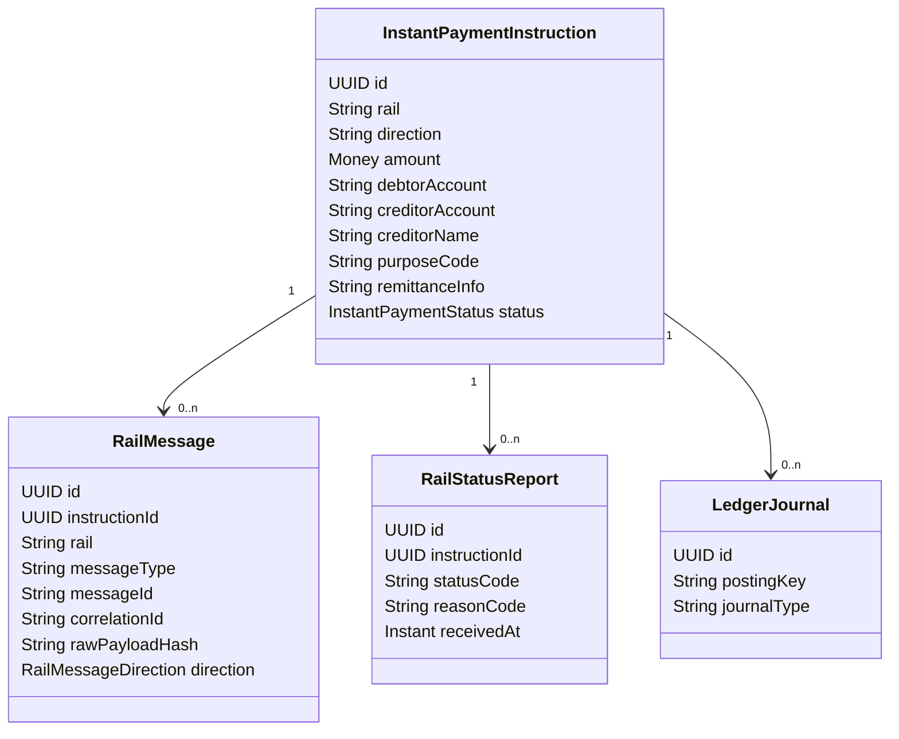
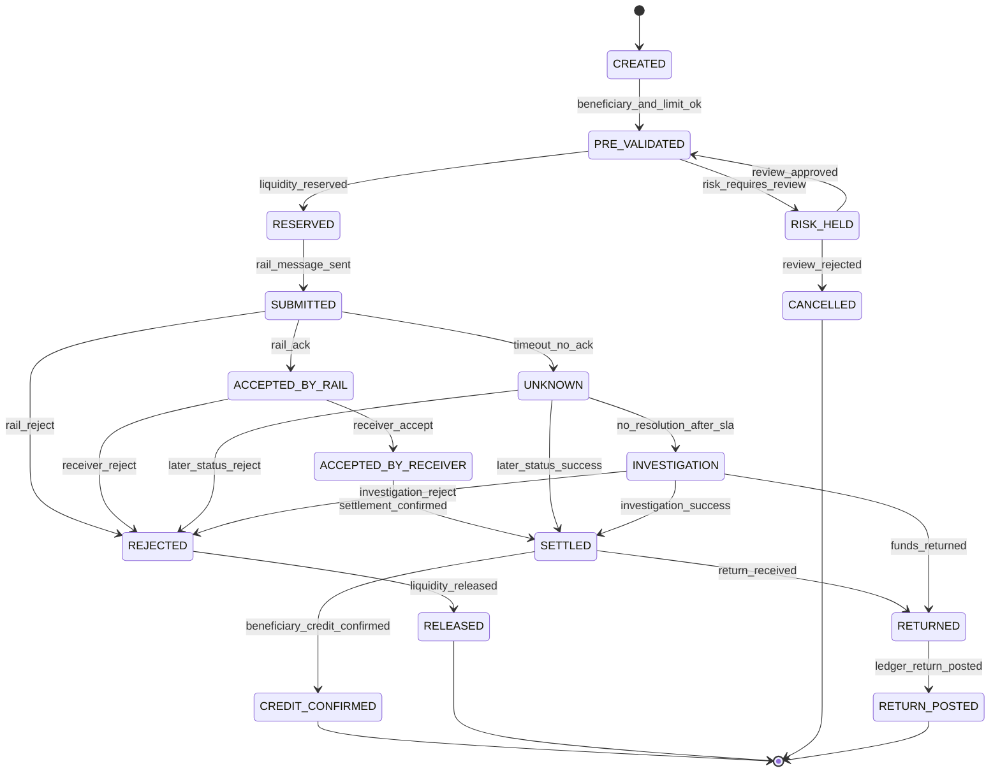
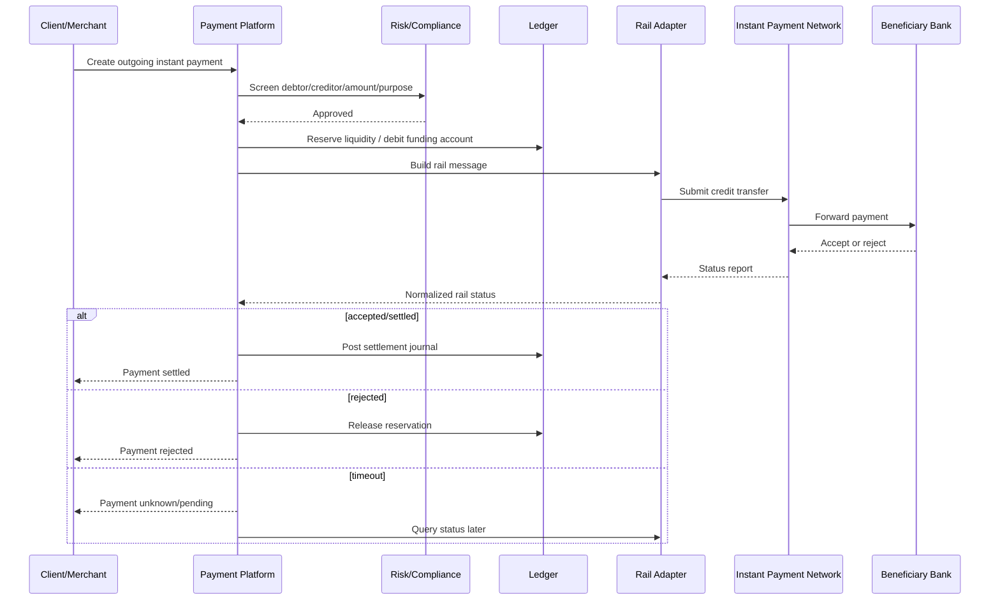
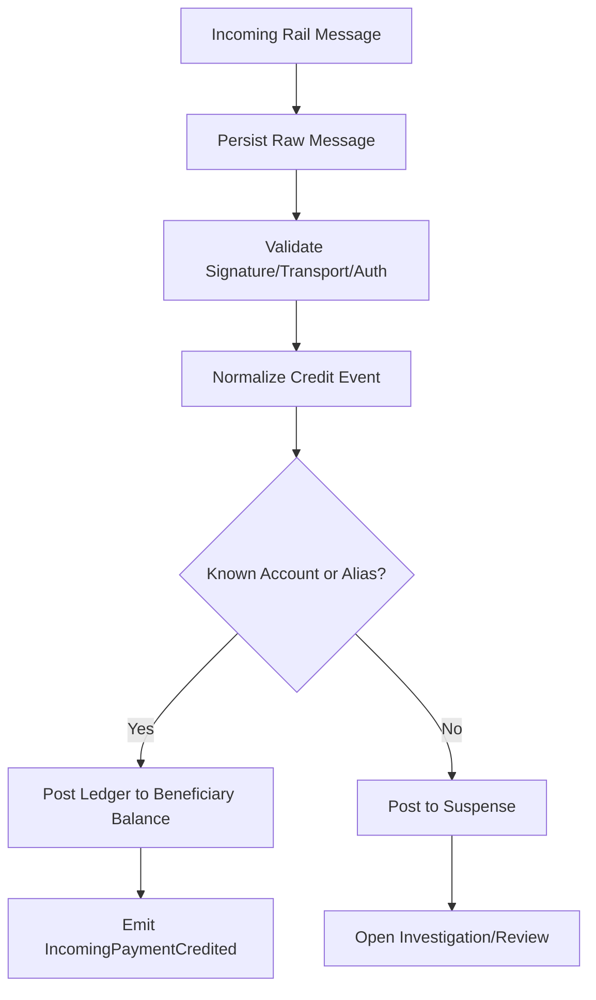
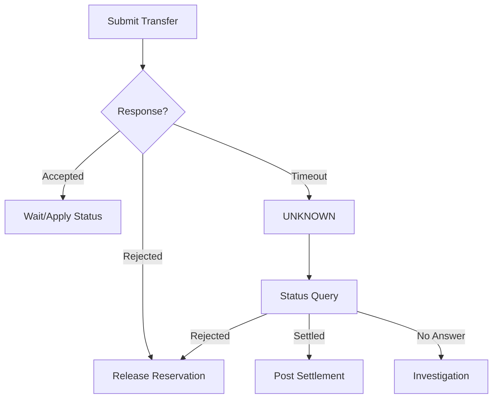
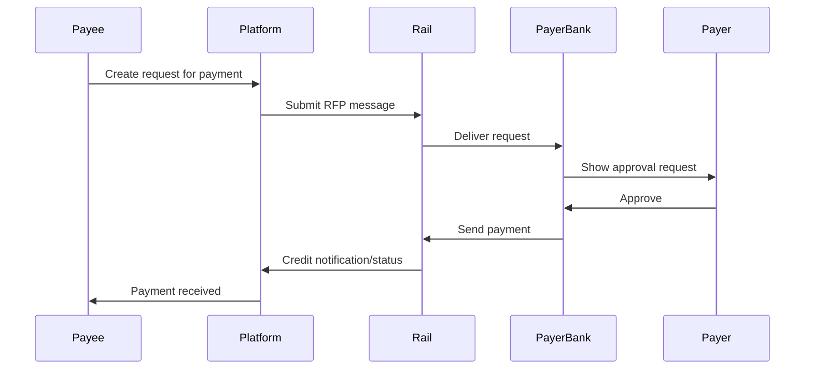
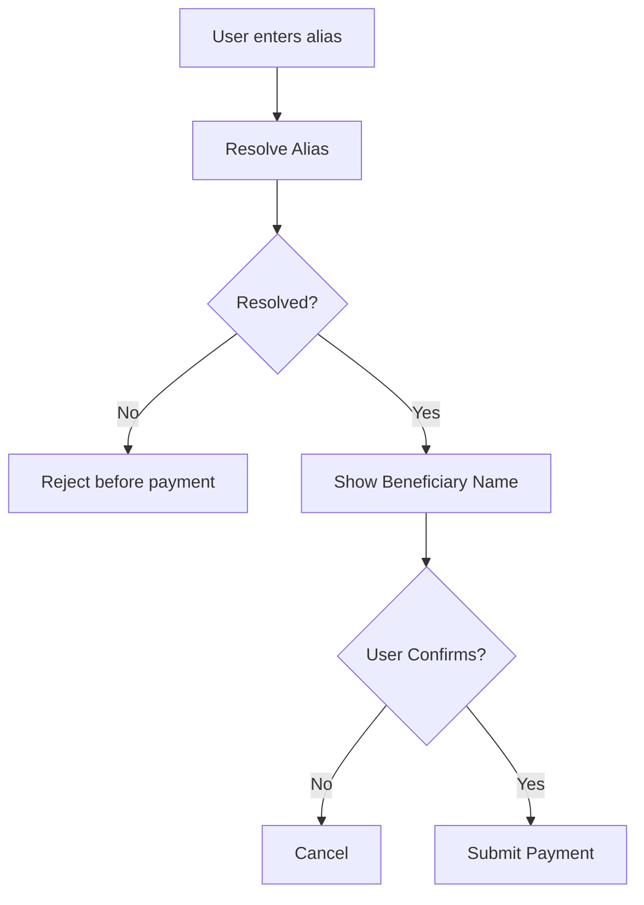
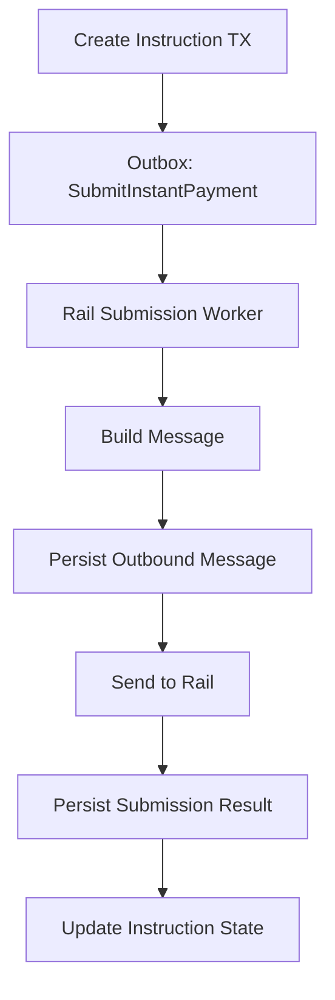
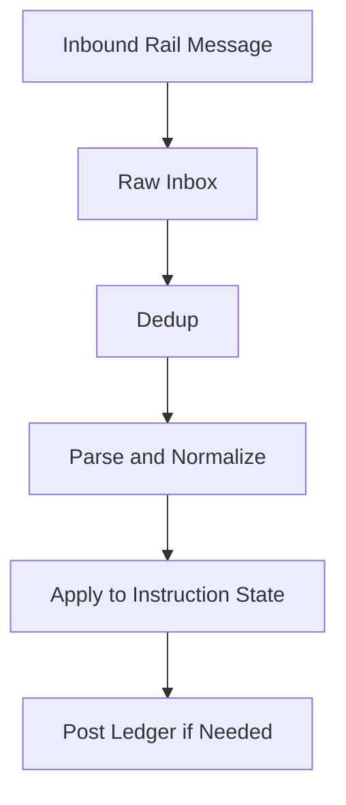

------
title: Build From Scratch: Large Production Grade Java Payment Systems - Part 030
description: Instant payment rails for production Java payment systems: BI-FAST, FedNow, RTP-like rails, ISO 20022 message modeling, finality, confirmation, returns, alias resolution, liquidity, and real-time operations.
series: learn-java-payment-systems
seriesTitle: Build From Scratch: Large Production Grade Java Payment Systems
order: 30
partTitle: Instant Payment Rails
tags:
- java
- payments
- instant-payments
- iso-20022
- bi-fast
- fednow
- real-time-payments
- ledger
- enterprise-architecture
date: 2026-07-02
------

# Part 030 — Instant Payment Rails

> Instant payment bukan sekadar bank transfer yang lebih cepat.
>
> Ia mengubah asumsi sistem: tidak ada batch cutoff tradisional, availability harus 24/7, confirmation harus cepat, error handling harus presisi, settlement bisa lebih final, dan operasi tidak bisa bergantung pada manusia yang bekerja jam kantor.

Part ini membahas desain instant payment rails untuk payment platform Java enterprise.

Contoh rail yang relevan:

- BI-FAST di Indonesia;
- FedNow di Amerika Serikat;
- RTP-like rail;
- SEPA Instant;
- Faster Payments;
- Pix;
- UPI;
- rail internal bank real-time;
- account-to-account payment berbasis ISO 20022.

Kita tidak akan membahas spesifikasi proprietary setiap rail secara lengkap. Fokusnya adalah mental model, domain abstraction, message lifecycle, state machine, ledger impact, failure handling, dan production readiness.

---

## 1. Tujuan Pembelajaran

Setelah part ini, kamu harus bisa menjawab:

1. apa bedanya instant payment dengan transfer bank biasa;
2. kenapa ISO 20022 penting untuk instant payment;
3. bagaimana memodelkan credit transfer, request for payment, confirmation, reject, return, dan investigation;
4. bagaimana menangani finality, unknown outcome, timeout, duplicate, dan return;
5. bagaimana ledger diposting untuk outgoing dan incoming instant payment;
6. bagaimana membangun Java abstraction yang bisa mendukung banyak rail;
7. bagaimana mendesain liquidity, limit, risk, compliance, reconciliation, dan operational monitoring untuk 24/7 payment.

Mental model utama:

> Instant payment adalah **real-time obligation execution rail**. Sistem tidak hanya membuat instruction, tetapi mengirim message ke network yang dapat menghasilkan acceptance, rejection, settlement, return, atau investigation dalam waktu sangat singkat.

---

## 2. Apa yang Berubah dari Bank Transfer Biasa

| Dimensi | Traditional Transfer / VA | Instant Payment |
|---|---|---|
| Availability | bisa tergantung bank/cutoff/provider | 24/7/365 pada banyak rail |
| Confirmation | webhook/batch/polling | near real-time status message |
| Settlement | batch atau deferred | sering immediate/near-immediate, tergantung rail |
| Message richness | reference terbatas | structured message, often ISO 20022 |
| Reversal | bisa manual/batch | return/reject/investigation flow rail-specific |
| Ops model | office-hour repair masih mungkin | real-time monitoring wajib |
| Risk window | delay memberi waktu review | decision harus pre-send atau inline |
| Liquidity | batch funding | continuous liquidity/position management |
| Failure semantics | pending/unmatched umum | timeout unknown lebih tajam karena user berharap real-time |

Instant rail memaksa sistem membedakan:

- **accepted by platform**;
- **accepted by rail**;
- **accepted by receiving institution**;
- **settled/final**;
- **credited to beneficiary**;
- **returned**;
- **rejected**;
- **under investigation**.

---

## 3. Rail Examples and Why They Matter

### 3.1 BI-FAST

BI-FAST adalah infrastruktur sistem pembayaran ritel nasional Indonesia yang memfasilitasi pembayaran ritel real-time, aman, efisien, dan tersedia 24/7 menurut Bank Indonesia.

Untuk payment platform Indonesia, BI-FAST relevan untuk:

- account-to-account transfer;
- disbursement/payout;
- funding wallet;
- merchant settlement;
- refund bank transfer;
- customer-to-merchant payment;
- alias/proxy addressing jika didukung oleh peserta/channel.

### 3.2 FedNow

FedNow memakai ISO 20022 message specifications. Federal Reserve menjelaskan ISO 20022 sebagai structured and data-rich common language yang penting untuk instant payments dan modernisasi dari batch end-of-day ke real-time processing.

### 3.3 RTP-like Rails

RTP rails biasanya memiliki:

- credit push;
- immediate confirmation;
- request for payment;
- messaging support;
- participant directory;
- returns/investigation;
- prefunding/liquidity model.

### 3.4 ISO 20022 Cross-Border Context

SWIFT menyatakan coexistence period CBPR+ berakhir pada 22 November 2025. Ini membuat ISO 20022 semakin penting sebagai bahasa pembayaran lintas institusi.

---

## 4. Instant Payment Primitive

Untuk membangun abstraction yang benar, jangan mulai dari endpoint seperti `POST /transfer`.

Mulai dari primitive domain.



Core concepts:

| Concept | Meaning |
|---|---|
| Instruction | business command to move money through an instant rail |
| Rail message | actual protocol message sent/received |
| Status report | network/participant response about instruction state |
| Return | money sent back after prior accepted payment |
| Reject | rail/participant refused before final acceptance |
| Investigation | inquiry because state is unclear or contested |
| Finality | point after which platform treats payment as irrevocably settled, subject to rail rules |

---

## 5. Message Types as Domain Events

ISO 20022 uses many message families. You do not need to memorize all messages to build the mental model, but you must understand the pattern.

Common message categories in instant payment systems:

| Category | Typical ISO 20022 Family | Meaning |
|---|---|---|
| Customer credit transfer | `pacs.008` / `pain.001` depending context | request to move funds |
| Payment status report | `pacs.002` / `pain.002` | accepted/rejected/pending status |
| Return | `pacs.004` | return of funds |
| Request for payment | `pain.013` / rail-specific | request that payer initiates payment |
| Account report/statement | `camt.*` | account/transaction reporting |
| Investigation | `camt.*` | inquiry, cancellation, resolution flows |

The exact message set differs by rail and implementation guide.

Platform abstraction should not leak raw XML fields into core domain. Instead, raw message stays in adapter/evidence layer.

---

## 6. Instant Payment State Machine



Important distinction:

- `SUBMITTED` means your system sent a message.
- `ACCEPTED_BY_RAIL` means the rail accepted the message syntax/business validation.
- `ACCEPTED_BY_RECEIVER` means receiving participant accepted it.
- `SETTLED` means money movement is financially settled according to rail semantics.
- `CREDIT_CONFIRMED` means beneficiary credit is confirmed if the rail exposes that distinction.

Do not collapse all of these into `SUCCESS` unless the rail contract proves they are equivalent.

---

## 7. Outgoing Instant Payment Flow



Key idea:

> You reserve or debit internal balance before sending, but you must not claim final success until rail evidence supports it.

---

## 8. Incoming Instant Payment Flow

Incoming instant payments are different from outgoing.

The platform may receive notification that money has arrived for:

- merchant collection;
- customer wallet top-up;
- internal account funding;
- refund return;
- payout return;
- misdirected payment.



Incoming payment is closer to Part 029 incoming bank credit, but message format and confirmation are more structured.

---

## 9. Pre-Validation

Instant payment has low tolerance for post-send repair. Validate before submit.

### 9.1 Beneficiary Validation

Depending on rail/provider:

- account number format;
- bank participant code;
- beneficiary name check;
- alias/proxy resolution;
- account status;
- participant reachability.

Do not treat name check as perfect unless rail contract guarantees it.

### 9.2 Limit Validation

Validate:

- per transaction limit;
- daily customer limit;
- merchant limit;
- rail limit;
- participant limit;
- risk tier limit;
- regulatory limit;
- liquidity limit.

### 9.3 Compliance Screening

Screen before send:

- sanctions;
- AML risk;
- purpose code;
- country restrictions;
- high-risk merchant/customer;
- beneficiary watchlist;
- velocity anomaly.

### 9.4 Idempotency

Outgoing instant payment create/submit must be idempotent.

```text
client request key -> payment instruction
payment instruction -> rail message id
rail message id -> status reports
ledger posting key -> journal
```

Never generate a second outgoing transfer because client retried after timeout.

---

## 10. Message Identity and Correlation

Instant rails require careful identity mapping.

Common identifiers:

| Identifier | Owner | Purpose |
|---|---|---|
| instruction id | platform | internal aggregate id |
| end-to-end id | originator/platform | business correlation across participants |
| message id | rail adapter/platform | unique protocol message |
| transaction id | rail/network | network transaction reference |
| original message id | rail/protocol | correlate status/return to original message |
| provider reference | provider/bank | adapter-level correlation |
| ledger posting key | platform | idempotent financial posting |

Store all of them.

```sql
CREATE TABLE instant_payment_reference (
    id UUID PRIMARY KEY,
    instruction_id UUID NOT NULL,
    reference_type VARCHAR(64) NOT NULL,
    reference_value VARCHAR(256) NOT NULL,
    source VARCHAR(64) NOT NULL,
    created_at TIMESTAMPTZ NOT NULL,
    UNIQUE(reference_type, reference_value, source)
);
```

---

## 11. Database Schema

### 11.1 Instruction

```sql
CREATE TABLE instant_payment_instruction (
    id UUID PRIMARY KEY,
    merchant_id UUID,
    customer_id UUID,
    direction VARCHAR(32) NOT NULL,
    rail VARCHAR(64) NOT NULL,
    amount_minor BIGINT NOT NULL,
    currency CHAR(3) NOT NULL,
    debtor_account_id UUID,
    creditor_account_number VARCHAR(128),
    creditor_bank_code VARCHAR(64),
    creditor_name VARCHAR(256),
    creditor_alias VARCHAR(256),
    purpose_code VARCHAR(64),
    remittance_info VARCHAR(512),
    status VARCHAR(64) NOT NULL,
    idempotency_key VARCHAR(256),
    risk_decision_id UUID,
    liquidity_reservation_id UUID,
    submitted_at TIMESTAMPTZ,
    settled_at TIMESTAMPTZ,
    returned_at TIMESTAMPTZ,
    version BIGINT NOT NULL DEFAULT 0,
    created_at TIMESTAMPTZ NOT NULL,
    updated_at TIMESTAMPTZ NOT NULL,
    CHECK (amount_minor > 0)
);

CREATE UNIQUE INDEX ux_instant_payment_idempotency
ON instant_payment_instruction(merchant_id, idempotency_key)
WHERE idempotency_key IS NOT NULL;
```

### 11.2 Rail Message

```sql
CREATE TABLE instant_payment_rail_message (
    id UUID PRIMARY KEY,
    instruction_id UUID NOT NULL REFERENCES instant_payment_instruction(id),
    rail VARCHAR(64) NOT NULL,
    direction VARCHAR(32) NOT NULL,
    message_type VARCHAR(64) NOT NULL,
    message_id VARCHAR(256) NOT NULL,
    correlation_id VARCHAR(256),
    original_message_id VARCHAR(256),
    provider_reference VARCHAR(256),
    payload_format VARCHAR(32) NOT NULL,
    raw_payload_hash CHAR(64) NOT NULL,
    normalized_payload JSONB NOT NULL DEFAULT '{}'::jsonb,
    received_at TIMESTAMPTZ,
    sent_at TIMESTAMPTZ,
    created_at TIMESTAMPTZ NOT NULL
);

CREATE UNIQUE INDEX ux_instant_payment_rail_message_id
ON instant_payment_rail_message(rail, message_id, direction);
```

### 11.3 Status Report

```sql
CREATE TABLE instant_payment_status_report (
    id UUID PRIMARY KEY,
    instruction_id UUID NOT NULL REFERENCES instant_payment_instruction(id),
    rail VARCHAR(64) NOT NULL,
    status_code VARCHAR(64) NOT NULL,
    reason_code VARCHAR(64),
    reason_text VARCHAR(512),
    rail_message_id UUID REFERENCES instant_payment_rail_message(id),
    provider_reference VARCHAR(256),
    effective_at TIMESTAMPTZ NOT NULL,
    received_at TIMESTAMPTZ NOT NULL,
    created_at TIMESTAMPTZ NOT NULL
);

CREATE INDEX ix_instant_payment_status_report_instruction
ON instant_payment_status_report(instruction_id, received_at);
```

### 11.4 Return

```sql
CREATE TABLE instant_payment_return (
    id UUID PRIMARY KEY,
    original_instruction_id UUID NOT NULL REFERENCES instant_payment_instruction(id),
    return_instruction_id UUID,
    rail VARCHAR(64) NOT NULL,
    amount_minor BIGINT NOT NULL,
    currency CHAR(3) NOT NULL,
    reason_code VARCHAR(64) NOT NULL,
    reason_text VARCHAR(512),
    rail_return_reference VARCHAR(256),
    status VARCHAR(64) NOT NULL,
    received_at TIMESTAMPTZ NOT NULL,
    ledger_journal_id UUID,
    created_at TIMESTAMPTZ NOT NULL,
    CHECK (amount_minor > 0)
);
```

---

## 12. Java Domain Sketch

### 12.1 Instruction

```java
public final class InstantPaymentInstruction {
    private final UUID id;
    private final InstantPaymentDirection direction;
    private final InstantPaymentRail rail;
    private final Money amount;
    private final AccountRef debtor;
    private final BeneficiaryRef creditor;
    private final String purposeCode;
    private final String remittanceInfo;
    private InstantPaymentStatus status;
    private long version;

    public void markPreValidated() {
        requireStatus(InstantPaymentStatus.CREATED);
        this.status = InstantPaymentStatus.PRE_VALIDATED;
    }

    public void markReserved(UUID liquidityReservationId) {
        requireStatus(InstantPaymentStatus.PRE_VALIDATED);
        this.status = InstantPaymentStatus.RESERVED;
    }

    public void markSubmitted() {
        requireStatus(InstantPaymentStatus.RESERVED);
        this.status = InstantPaymentStatus.SUBMITTED;
    }

    public void applyStatusReport(NormalizedRailStatus statusReport) {
        InstantPaymentStatus next = InstantPaymentTransitionPolicy.nextStatus(
            this.status,
            statusReport.normalizedStatus()
        );
        this.status = next;
    }

    private void requireStatus(InstantPaymentStatus expected) {
        if (this.status != expected) {
            throw new IllegalStateException("Expected " + expected + " but was " + status);
        }
    }
}
```

### 12.2 Rail Adapter Port

```java
public interface InstantPaymentRailAdapter {
    InstantPaymentRail rail();

    BeneficiaryValidationResult validateBeneficiary(BeneficiaryValidationCommand command);

    RailSubmissionResult submitCreditTransfer(CreditTransferCommand command);

    RailStatusQueryResult queryStatus(RailStatusQuery query);

    NormalizedRailMessage parseIncomingMessage(RawRailMessage rawMessage);
}
```

### 12.3 Normalized Status

```java
public enum NormalizedInstantPaymentStatus {
    ACCEPTED_BY_RAIL,
    ACCEPTED_BY_RECEIVER,
    SETTLED,
    CREDIT_CONFIRMED,
    REJECTED,
    RETURNED,
    PENDING,
    UNKNOWN,
    INVESTIGATION_REQUIRED
}
```

---

## 13. Rail Adapter Boundary

The core payment platform should not know XML paths like:

```text
Document/FIToFICstmrCdtTrf/CdtTrfTxInf/PmtId/EndToEndId
```

Instead:

```java
public record CreditTransferCommand(
    UUID instructionId,
    String endToEndId,
    Money amount,
    AccountRef debtor,
    BeneficiaryRef creditor,
    String purposeCode,
    String remittanceInfo
) {}
```

Adapter responsibilities:

1. map normalized command to rail-specific message;
2. validate against rail schema/implementation guide;
3. assign protocol message ID;
4. sign/authenticate/transmit;
5. store raw outbound message hash;
6. parse inbound status/report/return;
7. normalize status and reason codes;
8. never post ledger directly.

Core responsibilities:

1. validate business/risk/liquidity;
2. decide submission;
3. own instruction state;
4. own ledger posting;
5. own idempotency;
6. own customer/merchant-facing status.

---

## 14. Ledger Design for Outgoing Instant Payment

Outgoing instant payment can be funded from:

- merchant balance;
- customer wallet balance;
- platform operating bank account;
- settlement account;
- prefunded rail account.

### 14.1 Reservation

Before submission:

```text
Dr Merchant Available Payable           1,000,000
Cr Merchant Payment Reserved            1,000,000
```

### 14.2 Rail Submission Accepted and Settled

When settlement confirmed:

```text
Dr Merchant Payment Reserved            1,000,000
Cr Rail Settlement Clearing Asset        1,000,000
```

Then when bank account movement confirms:

```text
Dr Rail Settlement Clearing Asset        1,000,000
Cr Bank Operating Asset                  1,000,000
```

Depending on accounting architecture, you may collapse or split these accounts. Do not collapse them before you understand reconciliation needs.

### 14.3 Rejected Before Settlement

```text
Dr Merchant Payment Reserved            1,000,000
Cr Merchant Available Payable           1,000,000
```

This releases funds.

### 14.4 Returned After Settlement

If payment settled then returned:

```text
Dr Bank Operating Asset                  1,000,000
Cr Merchant Return Pending Payable       1,000,000
```

Then policy decides whether to restore merchant/customer balance, hold, or investigate.

---

## 15. Ledger Design for Incoming Instant Payment

Incoming customer payment to merchant:

```text
Dr Rail/Bank Collection Asset            1,000,000
Cr Merchant Pending Payable              1,000,000
```

Incoming top-up to customer wallet:

```text
Dr Rail/Bank Collection Asset            1,000,000
Cr Customer Stored Value Liability        1,000,000
```

Incoming unknown payment:

```text
Dr Rail/Bank Collection Asset            1,000,000
Cr Suspense Liability                     1,000,000
```

---

## 16. Unknown Outcome

Instant payment creates a painful scenario:

1. platform submits message;
2. network times out;
3. client waits;
4. no status report arrives;
5. retrying can duplicate payment;
6. not retrying may leave payment stuck.

Correct behavior:

- keep same instruction;
- mark `UNKNOWN` or `PENDING_RESOLUTION`;
- query status using original references;
- do not create second instruction automatically;
- do not release funds until reject/failure confirmed;
- expose pending state to client;
- open investigation after SLA.



---

## 17. Retry Semantics

Do not retry blindly.

| Failure | Safe Action |
|---|---|
| connection failed before send confirmed | query if possible; retry only with same message id if rail supports it |
| timeout after send | mark unknown, query status |
| validation reject | no retry until data changed |
| participant unavailable | retry/fallback based on rail rules |
| duplicate message response | correlate to original instruction |
| status pending | do not create another payment |

Rail adapter must classify failure:

```java
public enum RailSubmissionFailureClass {
    VALIDATION_REJECT,
    BUSINESS_REJECT,
    TRANSPORT_BEFORE_SEND_UNKNOWN,
    TRANSPORT_AFTER_SEND_UNKNOWN,
    RAIL_TIMEOUT_UNKNOWN,
    PARTICIPANT_UNAVAILABLE,
    DUPLICATE_MESSAGE,
    AUTHENTICATION_FAILURE,
    SYSTEM_ERROR_RETRIABLE,
    SYSTEM_ERROR_NON_RETRIABLE
}
```

---

## 18. Request for Payment

Some instant rails support request-for-payment style flows.

Instead of platform pushing money, payee requests payer to approve payment.

Flow:



Design consequence:

- request object is separate from payment object;
- payer can reject/ignore/expire;
- request can be cancelled;
- payment may arrive later;
- matching still required.

Domain entities:

```text
PaymentRequest
PaymentRequestDelivery
PaymentRequestApproval
IncomingInstantPayment
PaymentMatch
```

---

## 19. Alias / Proxy Addressing

Many instant payment ecosystems support alias/proxy:

- phone number;
- email;
- national ID/business ID;
- virtual payment address;
- QR identifier;
- account alias.

Alias resolution must be treated as a separate step.



Do not silently pay after alias resolution if user expected to verify beneficiary name.

Store:

- alias input;
- resolved account/bank;
- resolved name;
- resolution timestamp;
- user confirmation evidence;
- resolver provider;
- resolver response hash.

---

## 20. Liquidity Management

Instant rails may require prefunded accounts or real-time settlement positions.

Payment platform needs a liquidity subsystem.

### 20.1 Liquidity Concepts

| Concept | Meaning |
|---|---|
| available liquidity | funds available for instant outgoing payment |
| reserved liquidity | funds held for submitted/pending payment |
| rail position | expected balance on rail/settlement account |
| low-water mark | minimum safe liquidity threshold |
| top-up | moving money into settlement account |
| drain | moving excess out |

### 20.2 Reservation Table

```sql
CREATE TABLE liquidity_reservation (
    id UUID PRIMARY KEY,
    rail VARCHAR(64) NOT NULL,
    funding_account_id UUID NOT NULL,
    instruction_id UUID NOT NULL,
    amount_minor BIGINT NOT NULL,
    currency CHAR(3) NOT NULL,
    status VARCHAR(64) NOT NULL,
    expires_at TIMESTAMPTZ NOT NULL,
    created_at TIMESTAMPTZ NOT NULL,
    released_at TIMESTAMPTZ,
    consumed_at TIMESTAMPTZ,
    CHECK (amount_minor > 0)
);

CREATE UNIQUE INDEX ux_liquidity_reservation_instruction
ON liquidity_reservation(instruction_id);
```

### 20.3 Liquidity Invariant

```text
available_liquidity = ledger_balance(funding_account)
                    - active_reservations
                    - safety_buffer
```

Do not compute liquidity from memory-only counters.

---

## 21. Limits and Risk

Instant payments are fast; risk decision must happen before movement.

Risk checks:

- new beneficiary;
- first transaction to beneficiary;
- amount anomaly;
- velocity by sender;
- velocity by beneficiary;
- device/session risk;
- account age;
- merchant risk tier;
- purpose code risk;
- sanction/AML screening;
- mule account signals;
- unusual time-of-day;
- repeated failed attempts.

Risk action:

| Decision | Action |
|---|---|
| approve | continue |
| step-up | require stronger authentication/approval |
| hold | manual review before send |
| reject | do not submit |
| allow with lower limit | submit smaller/partial if business supports it |

---

## 22. Compliance Evidence

Instant payment instruction should store:

- debtor identity;
- creditor identity;
- amount/currency;
- purpose/remittance info;
- timestamp;
- channel/device/user;
- screening decision;
- risk decision;
- approval chain;
- beneficiary confirmation;
- rail message references;
- raw message hash;
- operator actions;
- status reports;
- return/investigation messages.

This matters for audit, dispute, law enforcement inquiry, regulatory reporting, and internal incident review.

---

## 23. Reconciliation

Even instant payments need reconciliation.

Sources:

1. internal instruction table;
2. rail status reports;
3. ledger journal;
4. bank/settlement account report;
5. provider/participant report;
6. return report;
7. fee report;
8. liquidity account statement.

Reconciliation cases:

| Case | Meaning |
|---|---|
| instruction settled, ledger missing | ledger repair needed |
| ledger posted, rail missing | severe inconsistency/investigation |
| rail settled, bank statement missing | timing or bank report issue |
| bank debit exists, instruction unknown | unrecognized outgoing movement |
| return received, original not found | reference mapping issue |
| duplicate status report | normal if idempotent |
| rejected but reservation not released | stuck liquidity |

---

## 24. API Surface

### 24.1 Create Outgoing Instant Payment

```http
POST /v1/instant-payments
Idempotency-Key: merchant-123-payout-456
```

```json
{
  "rail": "BI_FAST",
  "amount": {
    "currency": "IDR",
    "minorUnits": 100000000
  },
  "debtorAccountId": "acct_platform_settlement_idr",
  "creditor": {
    "bankCode": "BANK_CODE",
    "accountNumber": "1234567890",
    "name": "PT Beneficiary Example"
  },
  "purposeCode": "MERCHANT_PAYOUT",
  "remittanceInfo": "Settlement batch SB-2026-07-02-001"
}
```

Response:

```json
{
  "id": "ip_123",
  "status": "SUBMITTED",
  "rail": "BI_FAST",
  "amount": {
    "currency": "IDR",
    "minorUnits": 100000000
  },
  "createdAt": "2026-07-02T10:00:00+07:00"
}
```

### 24.2 Get Status

```http
GET /v1/instant-payments/ip_123
```

Response:

```json
{
  "id": "ip_123",
  "status": "SETTLED",
  "rail": "BI_FAST",
  "railReferences": {
    "endToEndId": "E2E-20260702-000123",
    "networkTransactionId": "NET-987"
  },
  "submittedAt": "2026-07-02T10:00:01+07:00",
  "settledAt": "2026-07-02T10:00:04+07:00"
}
```

### 24.3 Beneficiary Validation

```http
POST /v1/instant-payments/beneficiary-validations
```

```json
{
  "rail": "BI_FAST",
  "bankCode": "BANK_CODE",
  "accountNumber": "1234567890"
}
```

---

## 25. Outbox/Inbox for Instant Payment

Use outbox for outbound message submission requests, but do not let a generic event relay send rail messages without rail-specific control.

Better design:



Inbound messages use inbox:



---

## 26. Operational Dashboard

Instant payment operations need real-time dashboard:

- submission success rate by rail;
- median/p95/p99 settlement latency;
- unknown state count;
- unknown state age;
- reject rate by reason code;
- return rate;
- liquidity available/reserved;
- participant downtime;
- status query backlog;
- message parsing errors;
- reconciliation breaks;
- rail certificate/key expiry;
- inbound message lag;
- retry queue depth.

Critical SLOs:

```text
99% of accepted instant payments reach terminal state within N seconds/minutes.
0 confirmed duplicate outgoing payments from same idempotency key.
100% of settled rail messages have ledger journal within X seconds.
No liquidity reservation older than SLA without terminal state.
```

---

## 27. Simulator

Build simulator before production integration.

Simulator scenarios:

1. immediate settled;
2. immediate reject;
3. timeout then settled;
4. timeout then reject;
5. duplicate status report;
6. out-of-order status report;
7. return after settlement;
8. participant unavailable;
9. invalid beneficiary;
10. low liquidity;
11. malformed inbound message;
12. unknown original reference;
13. delayed bank statement;
14. rail status query returns pending;
15. investigation required.

Example simulator API:

```http
POST /simulator/rails/{rail}/scenario
```

```json
{
  "instructionId": "ip_123",
  "scenario": "TIMEOUT_THEN_SETTLED",
  "settleAfterSeconds": 30
}
```

---

## 28. Java Application Service

```java
public final class InstantPaymentApplicationService {
    private final InstantPaymentRepository payments;
    private final RiskService risk;
    private final ComplianceService compliance;
    private final LiquidityService liquidity;
    private final Outbox outbox;

    public InstantPaymentResult createAndSubmit(CreateInstantPaymentCommand command) {
        return Transactional.run(() -> {
            InstantPaymentInstruction existing = payments.findByIdempotencyKey(
                command.merchantId(), command.idempotencyKey()
            );
            if (existing != null) {
                return InstantPaymentResult.from(existing);
            }

            compliance.screen(command).throwIfBlocked();
            risk.evaluate(command).throwIfRejected();

            InstantPaymentInstruction instruction = InstantPaymentInstruction.create(command);
            instruction.markPreValidated();

            LiquidityReservation reservation = liquidity.reserve(
                command.rail(),
                command.fundingAccountId(),
                command.amount(),
                instruction.id()
            );
            instruction.markReserved(reservation.id());

            payments.save(instruction);
            outbox.publish(new SubmitInstantPaymentRequested(instruction.id()));

            return InstantPaymentResult.from(instruction);
        });
    }
}
```

Rail submission worker:

```java
public final class InstantPaymentSubmissionWorker {
    private final InstantPaymentRepository payments;
    private final InstantPaymentRailAdapterRegistry adapters;
    private final RailMessageRepository railMessages;

    public void handle(SubmitInstantPaymentRequested event) {
        Transactional.run(() -> {
            InstantPaymentInstruction instruction = payments.lockById(event.instructionId());
            if (instruction.status() != InstantPaymentStatus.RESERVED) {
                return;
            }

            InstantPaymentRailAdapter adapter = adapters.get(instruction.rail());
            CreditTransferCommand command = CreditTransferCommand.from(instruction);

            RailSubmissionResult result = adapter.submitCreditTransfer(command);
            railMessages.saveOutbound(result.outboundMessage());

            instruction.markSubmitted();
            instruction.applyStatusReport(result.initialStatus());
            payments.save(instruction);
        });
    }
}
```

The exact transaction boundary around network call needs careful handling. Many teams persist outbound message before sending, then send outside DB transaction, then persist result. The key invariant: never lose evidence of attempted send and never submit a second independent payment because the first send outcome is unclear.

---

## 29. Failure Matrix

| Failure | Correct Response |
|---|---|
| beneficiary validation fails | reject before reservation |
| risk blocks | do not submit rail message |
| liquidity insufficient | reject or queue based on product policy |
| send timeout | mark unknown, query status, do not duplicate |
| rail reject | release reservation, terminal reject |
| receiver reject after rail accepted | release or reverse based on whether funds moved |
| settled but ledger failed | retry ledger posting idempotently, alert immediately |
| return received | post return journal, update original instruction, notify owner |
| duplicate status | ignore idempotently after recording evidence |
| out-of-order status | apply monotonic transition policy |
| inbound message unknown original | suspense/investigation |
| status query unavailable | remain unknown, escalate after SLA |

---

## 30. Security Controls

Instant payment rail adapter handles sensitive integration material:

- client certificates;
- signing keys;
- HSM keys;
- mTLS config;
- API credentials;
- participant identifiers;
- raw financial messages;
- account numbers;
- customer/beneficiary PII.

Controls:

1. no raw account numbers in logs;
2. message hash for evidence;
3. encrypted raw payload store;
4. strict access to replay tools;
5. key rotation runbook;
6. certificate expiry alerting;
7. network allowlisting/private connectivity;
8. maker-checker for manual resend/repair;
9. tamper-evident audit trail;
10. least privilege for ops.

---

## 31. Common Anti-Patterns

### 31.1 Treat Timeout as Failure

Timeout is unknown, not failure.

If you release funds and let user retry, you may create duplicate outgoing payments.

### 31.2 Treat Rail Accepted as Beneficiary Credited

Some rails may make these equivalent; many systems expose multiple steps. Do not collapse until verified.

### 31.3 No Liquidity Reservation

Without reservation, parallel outgoing payments can overspend funding account.

### 31.4 No Return Flow

Even if rail is “instant and final”, operational return/recall/investigation flows may still exist. Model them.

### 31.5 Core Domain Depends on ISO XML

Keep ISO/protocol-specific details in adapter/evidence layer.

### 31.6 No 24/7 Ops Model

Instant payment runs outside office hours. Alerting, auto-repair, and escalation must reflect that.

---

## 32. Production Readiness Checklist

An instant payment rail is production-ready only if:

- create/submit is idempotent;
- rail message ID is unique and stored;
- outbound raw message/evidence is persisted;
- inbound raw message/evidence is persisted;
- timeout creates unknown state, not failure;
- status query exists;
- duplicate/out-of-order status reports are safe;
- liquidity reservation exists;
- risk/compliance pre-check exists;
- beneficiary validation evidence is stored;
- ledger posting is idempotent;
- return flow is modeled;
- investigation flow exists;
- reconciliation compares instruction, rail status, ledger, and bank/settlement report;
- operator repair is maker-checker controlled;
- 24/7 monitoring exists;
- simulator covers timeout, return, duplicate, and out-of-order events.

---

## 33. Mini Capstone

Design an instant payout system for merchants:

Requirements:

1. merchants can request instant payout to bank account;
2. platform supports BI-FAST-like rail and fallback normal transfer;
3. payout uses merchant available balance;
4. risk check blocks suspicious payout;
5. beneficiary validation is required for new account;
6. liquidity reservation is required before send;
7. timeout must not trigger duplicate payout;
8. status query resolves unknown state;
9. return after settlement must restore funds into merchant return-pending balance;
10. reconciliation runs against rail report and bank statement;
11. ops can manually investigate unknown payout;
12. all movements use double-entry ledger.

Deliverables:

- state machine;
- ledger posting rules;
- Java service boundary;
- DB schema;
- adapter contract;
- timeout strategy;
- simulator scenarios;
- observability dashboard.

---

## 34. Ringkasan

Instant payment rail membuat payment platform lebih powerful tetapi juga lebih unforgiving.

Key lessons:

1. instant payment bukan sekadar transfer cepat;
2. status harus dimodelkan lebih rinci daripada success/failed;
3. timeout adalah unknown;
4. idempotency adalah kontrol anti-duplicate payout;
5. liquidity reservation wajib untuk outgoing rail;
6. ISO 20022 harus dibungkus adapter, bukan bocor ke core domain;
7. returns dan investigations tetap perlu dimodelkan;
8. ledger dan reconciliation tetap menjadi financial truth;
9. 24/7 rail membutuhkan 24/7 observability dan repair path.

Di part berikutnya kita akan masuk ke **QR payment flows**, termasuk merchant-presented mode, QRIS, static QR, dynamic QR, payment instruction, status notification, settlement, dan reconciliation.

---

## Referensi

- Bank Indonesia — BI-FAST sebagai infrastruktur pembayaran ritel nasional real-time, aman, efisien, dan tersedia 24/7: https://www.bi.go.id/id/fungsi-utama/sistem-pembayaran/ritel/infrastruktur/default.aspx
- Bank Indonesia — Payment System and Rupiah Currency Management, termasuk orientasi pengembangan retail payment real-time 24/7: https://www.bi.go.id/en/fungsi-utama/sistem-pembayaran/default.aspx
- Federal Reserve Financial Services — FedNow and ISO 20022: https://www.frbservices.org/financial-services/fednow/what-is-iso-20022-why-does-it-matter
- FedNow Explorer — ISO 20022 and the FedNow Service: https://explore.fednow.org/explore-the-city?building=technology-tower&id=2&resource=24&resourceTitle=what-is-iso-20022&role=fi_sp-eu_spe
- SWIFT — ISO 20022 implementation FAQ, CBPR+ coexistence period ended 22 November 2025: https://www.swift.com/standards/iso-20022/iso-20022-faqs/implementation
- ISO — ISO 20022 financial services universal financial industry message scheme: https://www.iso20022.org/
