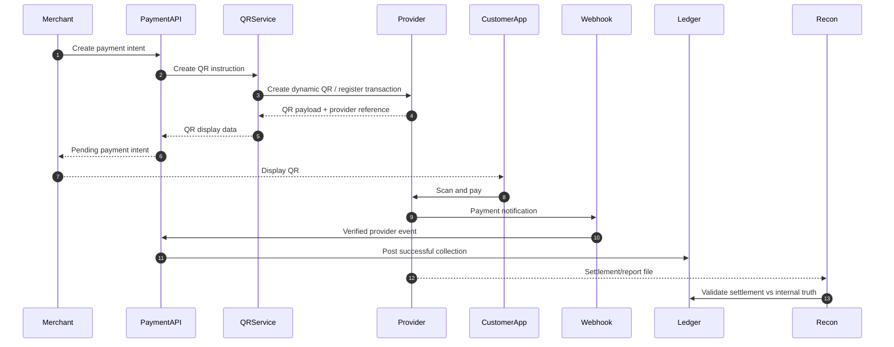
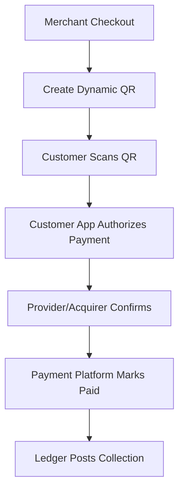
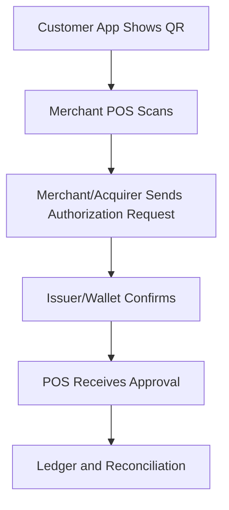
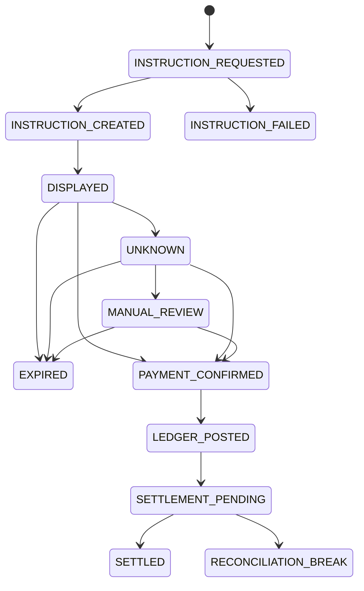
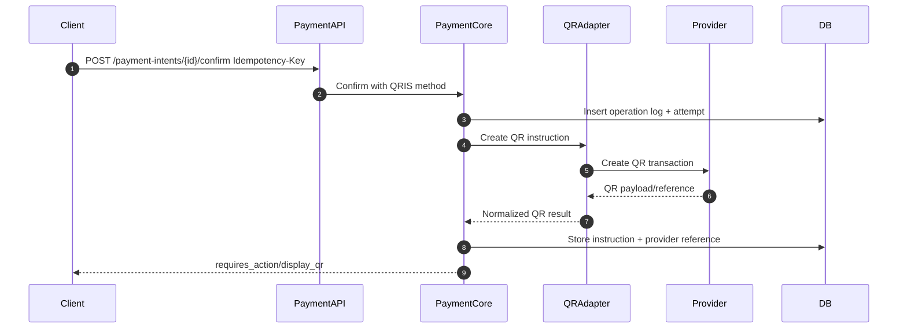
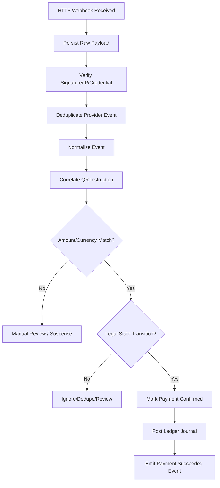
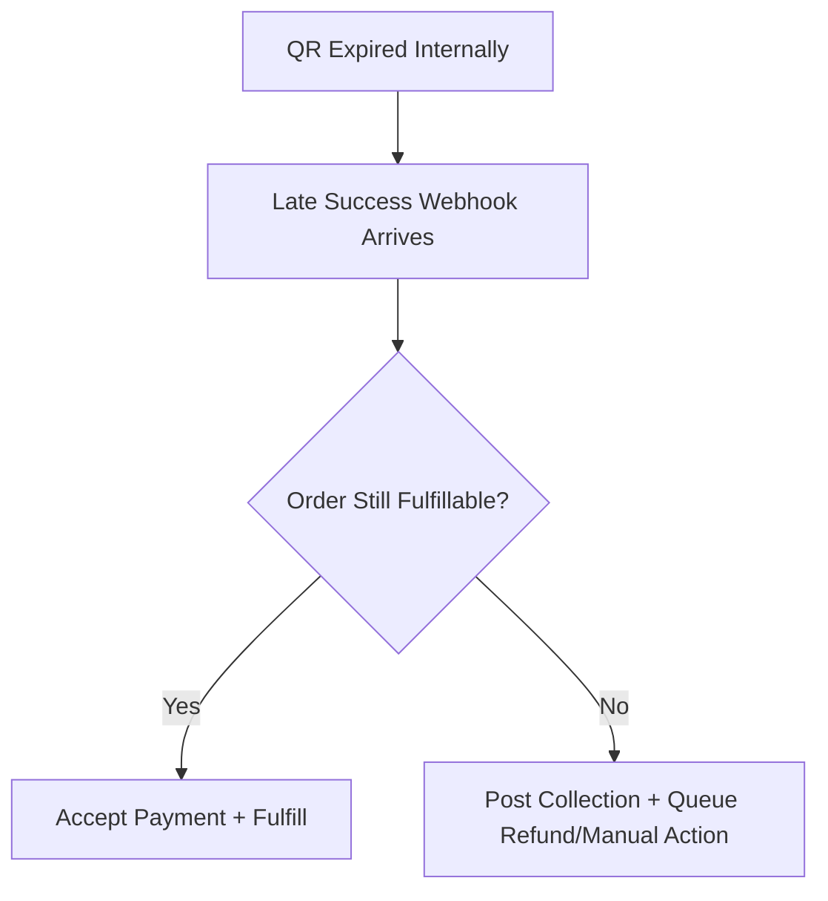

------
title: Build From Scratch: Large Production Grade Java Payment Systems - Part 031
description: QR payment flows in a production-grade Java payment platform: QRIS, static QR, dynamic QR, merchant-presented mode, consumer-presented mode, matching, expiry, settlement, reconciliation, and operational failure handling.
series: learn-java-payment-systems
seriesTitle: Build From Scratch: Large Production Grade Java Payment Systems
order: 31
partTitle: QR Payment Flows: QRIS, Static QR, Dynamic QR, Merchant Presented Mode
tags:
- java
- payments
- payment-systems
- qris
- qr-code
- bank-indonesia
- orchestration
- reconciliation
- ledger
date: 2026-07-02
---

# Part 031 — QR Payment Flows: QRIS, Static QR, Dynamic QR, Merchant Presented Mode

QR payment looks simple from the outside: show QR, customer scans, merchant gets paid.

Production reality is different.

QR payment is not “a QR code feature”. It is a **payment instruction, identity, confirmation, matching, settlement, and reconciliation problem** compressed into a square barcode.

A QR code payment platform must answer questions like:

- Who created the QR?
- Is the QR static or bound to a specific invoice?
- Can the customer change the amount?
- When does the payment expire?
- Which provider/acquirer owns the merchant identity?
- How do we correlate a bank/PSP callback to the original payment intent?
- What happens if the customer pays twice?
- What happens if the callback is late?
- What happens if provider status says success but settlement file disagrees?
- What is the ledger effect before and after settlement?

For Indonesia, QRIS matters because Bank Indonesia defines QRIS as the national QR Code payment standard, developed with the payment system industry so QR transactions are faster, easier, cheaper, safer, and reliable. Bank Indonesia states that all payment service providers offering QR Code payments are required to use QRIS.

This part is about designing QR payments as a serious payment rail in a Java platform.

---

## 1. The Mental Model

A QR payment has three layers:

1. **Presentation layer**  
   The QR code shown to the customer.

2. **Instruction layer**  
   The encoded payment instruction: merchant identity, amount policy, currency, expiry, terminal/reference metadata.

3. **Confirmation layer**  
   The event proving that a customer paid: webhook, polling result, bank statement, settlement report, or reconciliation file.

The mistake is treating QR as layer 1 only.

A production payment system treats QR as a full lifecycle:



The QR image is not the transaction.

The transaction is the **payment intent + QR instruction + provider reference + customer payment confirmation + ledger posting + settlement evidence**.

---

## 2. QRIS in an Enterprise Platform

In Indonesian payment systems, QRIS should be modeled as a rail with specific capabilities, not as a generic `PAYMENT_METHOD = QR`.

At minimum, keep these concepts separate:

| Concept | Meaning |
|---|---|
| QRIS merchant | Merchant identity registered with QRIS acquirer/PSP |
| QRIS NMID | National Merchant ID used in QRIS ecosystem |
| Terminal/store ID | Merchant outlet or terminal representation |
| Static QR | Reusable QR, often merchant-level, amount entered by customer or merchant app |
| Dynamic QR | Transaction-specific QR, often bound to amount/reference/expiry |
| Acquirer/PSP | Institution providing QRIS acceptance |
| Issuer/customer app | Customer's wallet/mobile banking/payment app scanning QR |
| Payment notification | Provider/acquirer event indicating successful QR payment |
| Settlement report | File/report proving money settlement to merchant/platform |

A large platform rarely has one QRIS connector only. It may need:

- QRIS through PSP A for online merchants.
- QRIS through bank B for enterprise merchants.
- QRIS through acquirer C for offline stores.
- QRIS static QR for small merchants.
- QRIS dynamic QR for invoices, checkout, POS, and marketplaces.
- QRIS cross-border handling if enabled by provider/acquirer.

The architecture must preserve provider-specific details without leaking them into the core payment model.

---

## 3. Static QR vs Dynamic QR

### Static QR

Static QR is reusable.

Typical use cases:

- small merchant counter
- donation box
- offline store display
- reusable outlet QR
- simple payment acceptance

Characteristics:

- QR payload does not represent a unique internal payment intent.
- Amount may be customer-entered or app-entered.
- Confirmation must be matched after payment.
- Duplicate/overpayment/underpayment handling becomes important.
- Reconciliation becomes more dependent on provider reference and statement data.

Static QR is operationally simple for merchants but harder for platform correctness.

### Dynamic QR

Dynamic QR is transaction-specific.

Typical use cases:

- e-commerce checkout
- POS invoice
- bill payment
- order-specific payment
- marketplace order

Characteristics:

- QR is created for one payment intent.
- Amount is usually fixed.
- Expiry can be enforced.
- Provider reference can be mapped directly.
- Duplicate payment detection is easier.
- Checkout UX is cleaner.

Dynamic QR is usually better for production-grade platforms because it has stronger correlation.

### Modeling Choice

Never model both as one vague field.

Use explicit QR instruction type:

```java
public enum QrInstructionType {
    STATIC_REUSABLE,
    DYNAMIC_SINGLE_USE
}
```

And encode it into your aggregate:

```java
public record QrPaymentInstruction(
        UUID instructionId,
        UUID paymentIntentId,
        QrRail rail,
        QrInstructionType type,
        Money amount,
        Instant expiresAt,
        String providerCode,
        String providerQrReference,
        String qrPayload,
        QrDisplayFormat displayFormat,
        QrInstructionStatus status
) {}
```

The instruction is not merely display data. It is a lifecycle object.

---

## 4. Merchant-Presented Mode and Consumer-Presented Mode

EMVCo QR specifications support two broad QR payment patterns:

- **Merchant-Presented Mode (MPM)**: merchant displays QR, customer scans.
- **Consumer-Presented Mode (CPM)**: customer displays QR, merchant scans.

Most online QR checkout flows are merchant-presented.



Consumer-presented flows feel closer to card-present/POS flows:



Do not mix their assumptions.

MPM usually starts from a merchant payment intent. CPM usually starts from a customer credential/token presented to merchant/POS.

---

## 5. QR Payment Aggregate Design

A production QR payment should not be stored as a single `qr_url` column.

You need a lifecycle model.



Important invariant:

> `EXPIRED` means the QR instruction is no longer valid for new customer payment. It does not prove no money arrived.

This is why late callback handling matters.

---

## 6. Database Schema

A minimal production schema:

```sql
create table qr_payment_instruction (
    id uuid primary key,
    payment_intent_id uuid not null,
    payment_attempt_id uuid not null,
    rail varchar(32) not null,
    instruction_type varchar(32) not null,
    provider_code varchar(64) not null,
    provider_qr_reference varchar(128),
    qr_payload text,
    qr_image_url text,
    amount_minor bigint not null,
    currency char(3) not null,
    status varchar(32) not null,
    expires_at timestamptz,
    created_at timestamptz not null default now(),
    updated_at timestamptz not null default now(),
    version bigint not null default 0,
    constraint uq_qr_instruction_attempt unique (payment_attempt_id),
    constraint uq_qr_provider_reference unique (provider_code, provider_qr_reference)
);

create index idx_qr_payment_instruction_status_expiry
    on qr_payment_instruction(status, expires_at);
```

Provider events:

```sql
create table qr_provider_event (
    id uuid primary key,
    provider_code varchar(64) not null,
    provider_event_id varchar(128),
    provider_qr_reference varchar(128),
    raw_payload jsonb not null,
    normalized_status varchar(32) not null,
    amount_minor bigint,
    currency char(3),
    received_at timestamptz not null default now(),
    verified_at timestamptz,
    processed_at timestamptz,
    processing_status varchar(32) not null,
    constraint uq_qr_provider_event unique (provider_code, provider_event_id)
);
```

Matching table for static QR or ambiguous events:

```sql
create table qr_payment_match_candidate (
    id uuid primary key,
    provider_event_id uuid not null,
    payment_intent_id uuid,
    payment_attempt_id uuid,
    match_type varchar(32) not null,
    match_confidence numeric(5, 4) not null,
    reason text not null,
    created_at timestamptz not null default now()
);
```

For dynamic QR, matching should be mostly exact.

For static QR, matching becomes a first-class subsystem.

---

## 7. Payment Creation Flow

Dynamic QR creation should be idempotent.



The response should not say `paid` after QR creation.

It should say something like:

```json
{
  "paymentIntentId": "pi_...",
  "status": "requires_customer_action",
  "nextAction": {
    "type": "display_qr",
    "qrType": "QRIS_DYNAMIC",
    "payload": "000201010212...",
    "expiresAt": "2026-07-02T10:15:30Z"
  }
}
```

Payment is not complete until confirmation evidence arrives.

---

## 8. Webhook Confirmation Flow

Webhook handling must be evidence-first.



The most important rule:

> Do not update payment state before raw event durability and dedupe.

Otherwise, replay and investigation become unreliable.

---

## 9. Ledger Posting for QR Collection

A confirmed QR payment is usually a collection event.

Before settlement, money may be owed by provider/acquirer to the platform/merchant. The ledger should represent this as receivable or pending settlement.

Example: customer pays IDR 100,000 through QRIS. Platform fee is IDR 2,000. Merchant receives IDR 98,000 before settlement availability.

```text
Dr Provider/Acquirer Receivable        100,000
    Cr Merchant Pending Payable                    98,000
    Cr Platform Fee Revenue Pending                 2,000
```

When settlement report confirms receipt:

```text
Dr Bank Cash                           100,000
    Cr Provider/Acquirer Receivable               100,000
```

When merchant amount becomes available:

```text
Dr Merchant Pending Payable             98,000
    Cr Merchant Available Payable                   98,000
```

Do not skip the receivable stage just because the webhook says success.

Webhook success proves customer payment confirmation.

Settlement report proves settlement.

---

## 10. Static QR Matching

Static QR is dangerous if you pretend it is dynamic.

For static QR, payment may arrive with:

- merchant ID
- terminal/store ID
- timestamp
- amount
- payer reference
- provider transaction reference
- customer bank/wallet information
- optional remarks

But it may not include your internal order ID.

Matching strategies:

| Strategy | Strength | Risk |
|---|---|---|
| Exact provider reference | Strong | Only possible if provider supports reference |
| Amount + merchant + time window | Medium | Collision risk |
| Amount + customer + invoice hint | Medium | Depends on data availability |
| Free-text remark | Weak | User input unreliable |
| Manual review | Safe fallback | Operational cost |

Static QR should use a suspense account when matching is uncertain.

```text
Dr Provider/Acquirer Receivable        100,000
    Cr QR Suspense Liability                       100,000
```

After manual/automated match:

```text
Dr QR Suspense Liability               100,000
    Cr Merchant Pending Payable                    98,000
    Cr Platform Fee Revenue Pending                 2,000
```

This prevents accidental allocation to the wrong merchant/order.

---

## 11. Expiry Semantics

Expiry is not simple.

There are at least three expiries:

1. **Client display expiry**  
   The checkout page should stop showing the QR.

2. **Provider QR expiry**  
   The provider/acquirer may reject payments after expiry.

3. **Internal payment intent expiry**  
   Your platform refuses to fulfill order after a deadline.

These can disagree.

Therefore, expired QR must not be final unless checked against provider/report evidence.

Late success handling:



Invariant:

> If money arrived after expiry, the platform still owes someone an accounting treatment.

You cannot ignore money because the UI expired.

---

## 12. Duplicate Payment Handling

Duplicate QR payment can happen because:

- customer scans twice
- customer retries payment in different app
- provider sends duplicate webhook
- static QR receives multiple payments
- user shares QR with someone else
- provider creates duplicate transaction under retry

Dynamic QR should prevent most duplicate payment, but your platform must still handle it.

Possible treatments:

| Situation | Treatment |
|---|---|
| Duplicate webhook same provider event | Deduplicate and ignore |
| Same provider transaction reference | Deduplicate and ignore |
| Different provider transaction, same dynamic QR | Mark extra payment as duplicate collection; refund or manual review |
| Static QR multiple payments | Create separate incoming payment records and match separately |
| Overpayment | Allocate expected amount, send excess to suspense/refund flow |
| Underpayment | Keep payment pending, partial policy, or refund/manual review |

Never overwrite the original payment result.

Create explicit records for extra money movement.

---

## 13. Java Service Boundary

The core should not know provider-specific QR payload fields.

Use ports:

```java
public interface QrPaymentProviderPort {
    CreateQrInstructionResult createInstruction(CreateQrInstructionCommand command);

    NormalizedQrEvent normalizeWebhook(RawProviderWebhook webhook);

    ProviderPaymentStatus queryStatus(QueryQrStatusCommand command);
}
```

Core command:

```java
public record CreateQrInstructionCommand(
        UUID paymentIntentId,
        UUID paymentAttemptId,
        Money amount,
        String merchantAccountId,
        QrRail rail,
        QrInstructionType instructionType,
        Instant expiresAt,
        Map<String, String> metadata
) {}
```

Normalized result:

```java
public sealed interface CreateQrInstructionResult {
    record Created(
            String providerCode,
            String providerQrReference,
            String qrPayload,
            URI qrImageUrl,
            Instant providerExpiresAt
    ) implements CreateQrInstructionResult {}

    record Failed(
            String providerCode,
            String reasonCode,
            boolean retriable
    ) implements CreateQrInstructionResult {}

    record Unknown(
            String providerCode,
            String operationReference
    ) implements CreateQrInstructionResult {}
}
```

Unknown creation must be queryable. If provider timed out after creating QR, retrying blindly can create duplicate instructions.

---

## 14. Provider Status Normalization

Different providers may expose QR statuses like:

- `CREATED`
- `ACTIVE`
- `PENDING`
- `PAID`
- `SUCCESS`
- `SETTLED`
- `EXPIRED`
- `CANCELED`
- `FAILED`
- `REFUNDED`

Your core should normalize them.

```java
public enum NormalizedQrStatus {
    INSTRUCTION_CREATED,
    AWAITING_CUSTOMER_PAYMENT,
    CUSTOMER_PAYMENT_CONFIRMED,
    PROVIDER_REJECTED,
    EXPIRED,
    UNKNOWN
}
```

Do not map provider `SETTLED` to internal `SETTLED` unless you know it means actual settlement report finality, not merely customer payment success.

Many providers use terms inconsistently.

Your normalized model must be stricter than provider naming.

---

## 15. Reconciliation Model

QR payments require several reconciliation views:

1. **Payment confirmation reconciliation**  
   Did every provider success event map to an internal payment?

2. **Ledger reconciliation**  
   Did every confirmed payment produce balanced journal entries?

3. **Settlement reconciliation**  
   Did provider/acquirer settlement reports match expected receivables?

4. **Merchant statement reconciliation**  
   Does merchant-facing reporting match ledger and settlement?

5. **Bank cash reconciliation**  
   Did actual bank credit match settlement file?

A good reconciliation item model:

```sql
create table qr_reconciliation_item (
    id uuid primary key,
    provider_code varchar(64) not null,
    report_date date not null,
    provider_transaction_reference varchar(128) not null,
    internal_payment_intent_id uuid,
    internal_journal_id uuid,
    amount_minor bigint not null,
    currency char(3) not null,
    reconciliation_status varchar(32) not null,
    break_reason varchar(64),
    created_at timestamptz not null default now(),
    constraint uq_qr_recon_provider_tx unique (
        provider_code,
        report_date,
        provider_transaction_reference
    )
);
```

Common breaks:

- provider success but no internal payment
- internal success but no provider report
- amount mismatch
- fee mismatch
- settlement date mismatch
- duplicate provider transaction
- wrong merchant account
- late settlement
- refunded before settlement

---

## 16. Operational Dashboard

QR operations need their own dashboard.

Minimum metrics:

| Metric | Why it matters |
|---|---|
| QR creation success rate | Provider/acquirer availability |
| QR payment conversion rate | UX/customer app/provider issue detection |
| QR expired without payment | Checkout friction or abandoned orders |
| Late success after expiry | Fulfillment/refund risk |
| Webhook delay p50/p95/p99 | Confirmation latency |
| Duplicate provider events | Provider behavior or retry noise |
| Unmatched static QR payments | Money allocation risk |
| Suspense balance | Operational debt |
| Settlement breaks | Financial control issue |
| Provider receivable aging | Cash settlement risk |

Alert on financial risk, not only HTTP failures.

Bad alert:

```text
Webhook endpoint 5xx > 1%
```

Better alert:

```text
QR provider success events older than 10 minutes without ledger posting > threshold
```

Best alert:

```text
Provider receivable for QRIS T+1 settlement has unresolved breaks > materiality threshold
```

---

## 17. Testing Matrix

QR payment tests must simulate real failure behavior.

| Scenario | Expected behavior |
|---|---|
| Create dynamic QR success | Instruction stored, payment pending |
| Create QR timeout but provider created | Internal state unknown; query repair required |
| Webhook success before API response | Payment confirmed once |
| Duplicate webhook | No duplicate ledger posting |
| Out-of-order expired then success | Success handled based on money evidence |
| Amount mismatch | Manual review/suspense, no fulfillment |
| Static QR ambiguous match | Suspense + review |
| Settlement missing | Receivable remains open |
| Provider settlement amount mismatch | Reconciliation break |
| Late payment after order cancellation | Refund/manual action policy |

Use simulator-driven tests.

A QR simulator should support:

- success after configurable delay
- duplicate webhooks
- missing webhook
- webhook before create response
- amount mismatch
- expired QR success
- settlement file generation
- settlement file omission
- duplicate settlement line

Without a simulator, you only test the happy path.

---

## 18. Anti-Patterns

### Anti-Pattern 1: `qr_status = SUCCESS` Means Money Is Settled

No.

It may only mean customer payment was confirmed.

Settlement is a separate event/report.

### Anti-Pattern 2: Expired QR Means No Money

No.

Late money can still arrive.

### Anti-Pattern 3: Static QR Without Suspense Account

This creates hidden misallocation risk.

### Anti-Pattern 4: QR Payload as Primary Key

Payload formats can change. Use provider reference and internal instruction ID.

### Anti-Pattern 5: One Generic QR Table for All Rails

QRIS, EMV QR, wallet QR, bank QR, and closed-loop merchant QR may have different semantics.

Normalize at core boundary, preserve rail-specific evidence.

---

## 19. Production Checklist

Before QR payment is production-ready, ensure:

- Dynamic QR has unique internal instruction ID.
- Provider reference is persisted before response when available.
- QR creation is idempotent.
- Webhook raw payload is persisted before processing.
- Webhook signature is verified.
- Duplicate events cannot create duplicate ledger journals.
- Expiry does not erase late money evidence.
- Static QR uses suspense for ambiguous payment.
- Reconciliation can compare provider report, ledger, and bank cash.
- Merchant statement is derived from ledger/reporting model, not provider dashboard manually.
- Provider adapter exposes normalized statuses and preserves raw evidence.
- Operational dashboard includes financial-risk metrics.

---

## 20. Key Takeaways

QR payments are deceptively simple.

The correct model is:

> QR is a payment instruction surface; payment truth comes from verified confirmation evidence, ledger posting, and settlement reconciliation.

Static QR optimizes merchant onboarding but increases matching risk.

Dynamic QR improves correlation but still needs duplicate, expiry, late success, and reconciliation handling.

A production QR platform must preserve four truths separately:

1. internal payment intent state,
2. provider confirmation state,
3. ledger/accounting state,
4. settlement/bank cash state.

If those are collapsed into one `status`, the system will eventually lose explainability.

---

## References

- Bank Indonesia — Quick Response Code Indonesian Standard (QRIS): https://www.bi.go.id/id/fungsi-utama/sistem-pembayaran/ritel/kanal-layanan/qris/default.aspx
- Bank Indonesia — QRIS English overview: https://www.bi.go.id/en/fungsi-utama/sistem-pembayaran/ritel/kanal-layanan/qris/default.aspx
- EMVCo — EMV QR Codes: https://www.emvco.com/emv-technologies/qr-codes/
- EMVCo — Merchant-Presented QR Codes: https://www.emvco.com/processes/merchant-presented-qr-codes/
- Bank Indonesia — SNAP: https://www.bi.go.id/id/layanan/standar/snap/default.aspx
- Bank Indonesia — Payment System Blueprint: https://www.bi.go.id/id/fungsi-utama/sistem-pembayaran/blueprint/default.aspx
