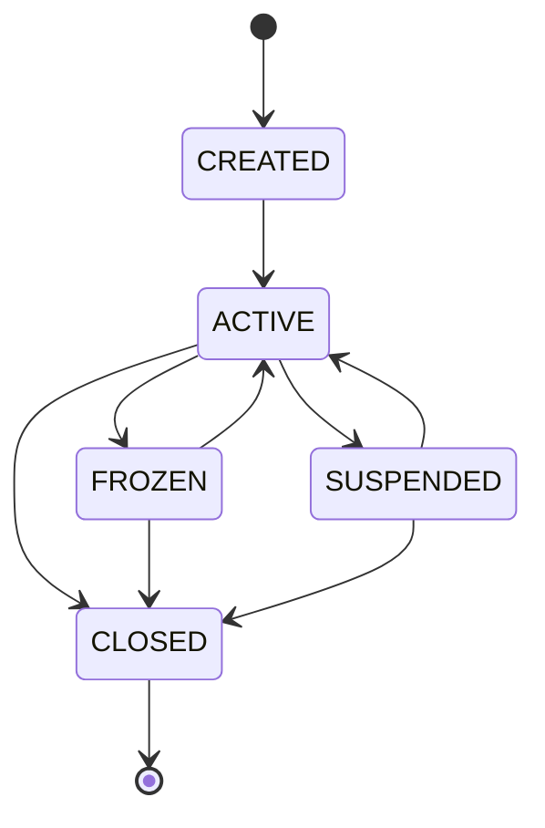
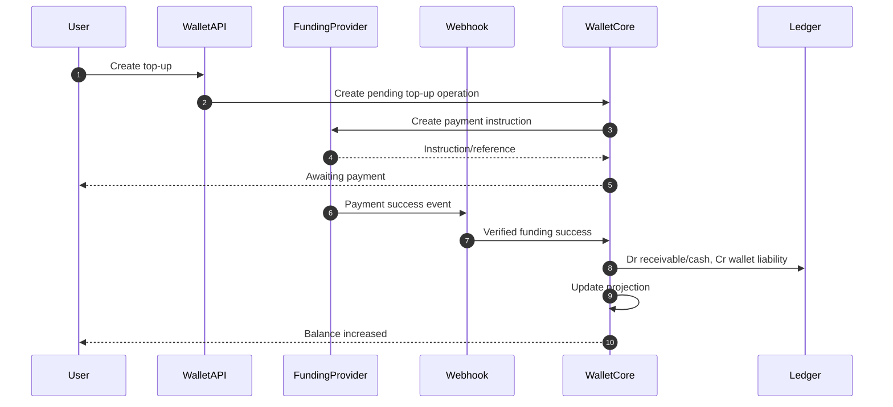
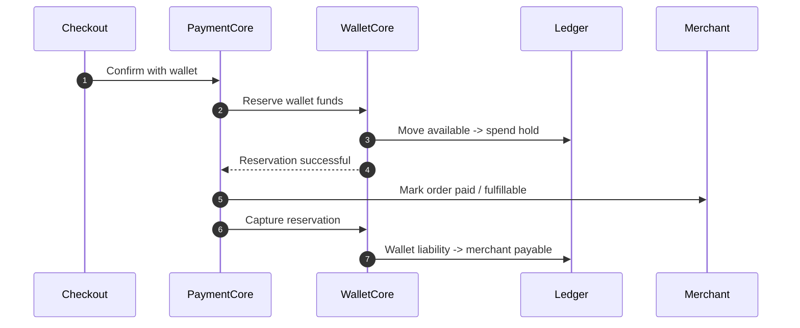
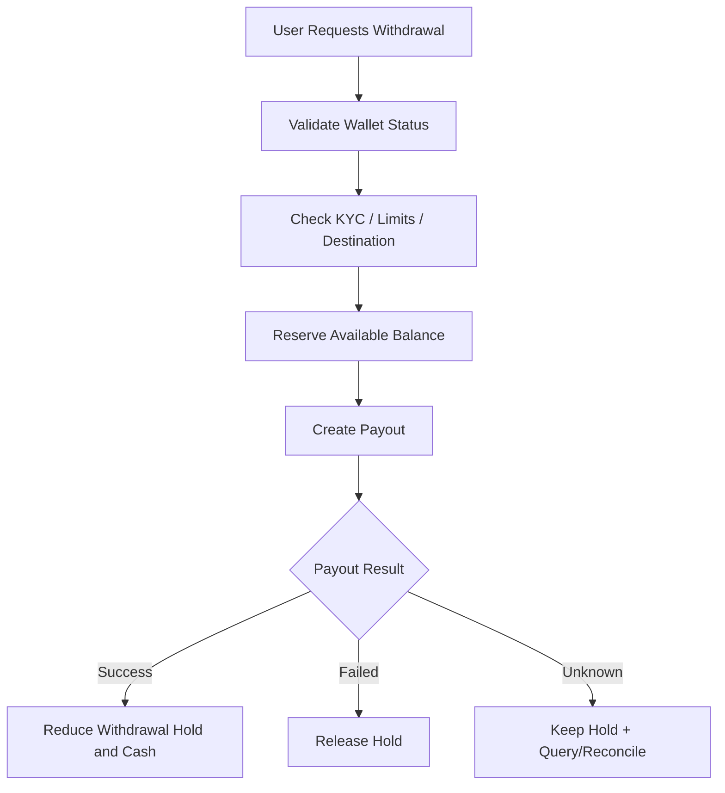

------
title: Build From Scratch: Large Production Grade Java Payment Systems - Part 032
description: Wallet and stored value systems in a production-grade Java payment platform: top-up, spend, withdraw, internal ledgering, liability accounting, reserves, limits, compliance, reconciliation, and operational safety.
series: learn-java-payment-systems
seriesTitle: Build From Scratch: Large Production Grade Java Payment Systems
order: 32
partTitle: Wallet & Stored Value Systems: Top Up, Spend, Withdraw, Internal Ledgering
tags:
- java
- payments
- payment-systems
- wallet
- stored-value
- electronic-money
- ledger
- compliance
- reconciliation
date: 2026-07-02
---

# Part 032 — Wallet & Stored Value Systems: Top Up, Spend, Withdraw, Internal Ledgering

A wallet is not a table with `user_id` and `balance`.

A wallet is a liability system.

When a customer tops up, the platform now owes the customer value. That obligation must be represented, protected, reconciled, limited, audited, and eventually extinguished through spend, withdrawal, expiry, chargeback, refund, adjustment, or legal handling.

This part builds a production-grade wallet/stored value model for a Java payment platform.

We will avoid the common toy design:

```sql
update wallet set balance = balance + 100000 where user_id = ?;
```

That design has no explainability, no double-entry integrity, no reconciliation, no dispute handling, no reserve handling, no legal liability model, and no safe recovery path after failure.

The correct mental model is:

> Wallet balance is not the source of truth. Wallet balance is a projection of ledgered obligations.

---

## 1. Stored Value Mental Model

Stored value has three basic operations:

1. **Load / top-up**  
   Customer gives money to platform. Platform increases customer stored value liability.

2. **Spend / transfer out**  
   Customer uses stored value to pay merchant, another user, platform, or biller.

3. **Withdraw / redemption**  
   Platform returns money to customer bank/account and reduces stored value liability.

But production reality adds more operations:

- failed top-up
- pending top-up
- bank transfer matching
- card top-up chargeback
- refund into wallet
- merchant refund from wallet payment
- promotional credit
- expired promotional credit
- account freeze
- compliance hold
- reserve hold
- withdrawal pending
- withdrawal reversal
- manual adjustment
- negative correction
- dormant balance handling

A wallet is a stateful financial subsystem.

---

## 2. Wallet vs Payment Account vs Ledger Account

Keep these concepts separate.

| Concept | Meaning |
|---|---|
| Wallet | Product/account visible to user |
| Stored value account | The financial obligation represented by wallet value |
| Ledger account | Accounting account used for double-entry posting |
| Balance projection | Read model derived from ledger entries |
| Payment method | Wallet as a way to pay for something |
| Funding source | External source used to add value |
| Withdrawal destination | Bank/account receiving redemption |

A wallet is product-facing.

A ledger account is accounting-facing.

A payment method is checkout-facing.

Do not collapse them.

---

## 3. Regulatory and Product Framing

Electronic money / stored value systems are regulated differently across jurisdictions. In Indonesia, Bank Indonesia defines electronic money under PBI No. 20/6/PBI/2018 as a payment instrument meeting specific elements, including issuance based on money deposited in advance and stored electronically. Bank Indonesia educational material also emphasizes that the electronic money value managed by the issuer is not a bank deposit.

That distinction matters architecturally.

If value is not a deposit, your system should not accidentally model it like a bank account with interest, overdraft, or unconstrained lending semantics.

Your platform needs explicit product rules:

- Is the wallet closed-loop or open-loop?
- Can value be withdrawn?
- Can users transfer to other users?
- Can value expire?
- Can promo value mix with cash value?
- Can balance go negative?
- Is top-up final immediately or after settlement?
- Which users require KYC?
- Which limits apply before and after KYC?
- What happens during sanctions/compliance review?

Engineering cannot fix unclear product/legal semantics after the fact.

---

## 4. Core Wallet States

A wallet should have lifecycle state independent from balance.



Balance state and wallet lifecycle state are different.

A wallet can be active with zero balance.

A wallet can be frozen with positive balance.

A wallet can be closed only after all financial obligations are resolved or transferred according to policy.

---

## 5. Balance Buckets

A serious wallet does not have one balance.

You need buckets.

| Bucket | Meaning |
|---|---|
| available | Spendable immediately |
| pending_topup | Top-up initiated but not final |
| pending_withdrawal | Reserved for withdrawal |
| held | Frozen due to risk/compliance/dispute |
| promo_available | Promotional value that may have restrictions |
| promo_expiring | Promo value nearing expiry |
| chargeback_hold | Value held due to top-up dispute risk |
| adjustment_pending | Manual correction awaiting approval |

A wallet balance API should be honest:

```json
{
  "walletId": "wal_123",
  "currency": "IDR",
  "available": 150000,
  "pendingTopup": 50000,
  "pendingWithdrawal": 20000,
  "held": 0,
  "promoAvailable": 10000,
  "totalCustomerVisible": 210000
}
```

But the API is only a projection.

The ledger remains the truth.

---

## 6. Double-Entry Ledger Model

Wallet accounting revolves around liabilities.

When customer tops up IDR 100,000 and money is confirmed:

```text
Dr Cash / Provider Receivable          100,000
    Cr Customer Wallet Liability                   100,000
```

When customer spends IDR 30,000 at a merchant:

```text
Dr Customer Wallet Liability            30,000
    Cr Merchant Pending Payable                     30,000
```

When customer withdraws IDR 50,000:

Reserve first:

```text
Dr Customer Wallet Available Liability  50,000
    Cr Customer Wallet Withdrawal Hold              50,000
```

After payout succeeds:

```text
Dr Customer Wallet Withdrawal Hold      50,000
    Cr Bank Cash / Payout Clearing                  50,000
```

If payout fails and funds must be released:

```text
Dr Customer Wallet Withdrawal Hold      50,000
    Cr Customer Wallet Available Liability          50,000
```

The key rule:

> Every change in wallet balance is a journal. Never mutate balance without a ledger reason.

---

## 7. Wallet Account Schema

Product-facing wallet:

```sql
create table wallet (
    id uuid primary key,
    owner_type varchar(32) not null,
    owner_id uuid not null,
    currency char(3) not null,
    status varchar(32) not null,
    created_at timestamptz not null default now(),
    updated_at timestamptz not null default now(),
    version bigint not null default 0,
    constraint uq_wallet_owner_currency unique (owner_type, owner_id, currency)
);
```

Ledger mapping:

```sql
create table wallet_ledger_account_map (
    id uuid primary key,
    wallet_id uuid not null references wallet(id),
    bucket varchar(64) not null,
    ledger_account_id uuid not null,
    created_at timestamptz not null default now(),
    constraint uq_wallet_bucket unique (wallet_id, bucket),
    constraint uq_wallet_ledger_account unique (ledger_account_id)
);
```

Balance projection:

```sql
create table wallet_balance_projection (
    wallet_id uuid not null,
    currency char(3) not null,
    available_minor bigint not null default 0,
    pending_topup_minor bigint not null default 0,
    pending_withdrawal_minor bigint not null default 0,
    held_minor bigint not null default 0,
    promo_available_minor bigint not null default 0,
    last_journal_sequence bigint not null,
    updated_at timestamptz not null default now(),
    primary key (wallet_id, currency)
);
```

The projection may be used for fast reads, but it must be rebuildable from ledger journals.

---

## 8. Wallet Operation Log

Every wallet-changing command needs an operation log.

```sql
create table wallet_operation (
    id uuid primary key,
    wallet_id uuid not null references wallet(id),
    operation_type varchar(64) not null,
    idempotency_key varchar(128) not null,
    request_fingerprint text not null,
    status varchar(32) not null,
    amount_minor bigint not null,
    currency char(3) not null,
    related_payment_intent_id uuid,
    related_payout_id uuid,
    related_journal_id uuid,
    created_at timestamptz not null default now(),
    updated_at timestamptz not null default now(),
    constraint uq_wallet_operation_idem unique (wallet_id, operation_type, idempotency_key)
);
```

Why operation log?

Because wallet operations are high-concurrency and retry-heavy.

Examples:

- user taps top-up twice
- webhook retries
- withdrawal worker retries
- customer spends during withdrawal reservation
- manual adjustment is resubmitted
- app retries after timeout

Idempotency is not optional.

---

## 9. Top-Up Flow

Top-up can be funded by:

- bank transfer
- virtual account
- QR payment
- card
- instant payment
- cash-in partner
- merchant refund
- internal adjustment

Each funding source has different finality.

A safe top-up flow:



Important distinction:

- Payment instruction created is not top-up completed.
- Provider success may create receivable, not cash.
- Settlement report closes receivable.
- Card-funded top-up may have chargeback risk.

For risky funding methods, you may credit `available` immediately, delay availability, or place a hold depending on risk policy.

---

## 10. Spend Flow

Wallet spend should reserve before committing external business action.

A simple wallet payment flow:



Reservation protects against race conditions:

- user pays two orders at the same time
- user withdraws while paying
- refund arrives while spend is in progress
- compliance hold is applied during checkout

Spend should be represented as two possible phases:

1. **Reserve** value.
2. **Capture/commit** value to merchant/platform.

For instant irreversible wallet payments, reserve and capture may happen in the same database transaction, but keeping the conceptual separation is valuable.

---

## 11. Withdrawal Flow

Withdrawal is not simply `balance -= amount`.

It is a payout operation.



Unknown payout state is especially important.

If you release the hold after timeout but provider later succeeds, you can double-spend platform cash.

Invariant:

> Withdrawal hold must remain until payout outcome is known or safely reversed by evidence.

---

## 12. Wallet Transfers

Peer-to-peer or user-to-user transfers require additional controls:

- sender wallet status
- receiver wallet status
- KYC levels
- transfer limits
- velocity limits
- fraud scoring
- sanctions screening
- irreversible vs reversible transfer policy
- receiver acceptance policy
- ledger traceability

Transfer posting:

```text
Dr Sender Wallet Liability             25,000
    Cr Receiver Wallet Liability                   25,000
```

If fee applies:

```text
Dr Sender Wallet Liability             26,000
    Cr Receiver Wallet Liability                   25,000
    Cr Platform Fee Revenue Pending                 1,000
```

Do not implement transfer as two separate operations:

```text
sender.balance -= amount
receiver.balance += amount
```

That creates split-brain money.

A transfer is one journal.

---

## 13. Promo Credit vs Cash Value

Promo credit must not be mixed blindly with cash wallet value.

Why?

Because promo credit often has restrictions:

- cannot be withdrawn
- expires
- applies only to certain merchants/categories
- has campaign budget
- may be reversed if abuse is detected
- may require different accounting treatment

Use separate buckets and ledger accounts.

Cash top-up:

```text
Dr Cash / Receivable                   100,000
    Cr Customer Cash Wallet Liability              100,000
```

Promo grant:

```text
Dr Marketing Expense / Promo Asset      10,000
    Cr Customer Promo Wallet Liability              10,000
```

Promo expiry:

```text
Dr Customer Promo Wallet Liability      10,000
    Cr Promo Breakage / Contra Expense              10,000
```

Whether this exact accounting treatment is appropriate depends on finance/legal policy. The engineering point is that promo and cash are not the same thing.

---

## 14. Holds, Freezes, and Compliance Controls

Wallet platforms must support holds.

Types:

| Hold type | Trigger | Effect |
|---|---|---|
| risk hold | fraud suspicion | blocks spend/withdrawal |
| compliance hold | KYC/AML/sanctions issue | blocks movement |
| dispute hold | chargeback/top-up dispute | reserves value |
| operational hold | manual investigation | blocks selected operations |
| withdrawal hold | payout pending | prevents double-spend |
| promo hold | campaign abuse | restricts promo use |

Holds should be ledgered when they affect available balance.

Example:

```text
Dr Customer Wallet Available Liability  20,000
    Cr Customer Wallet Held Liability               20,000
```

Releasing hold:

```text
Dr Customer Wallet Held Liability       20,000
    Cr Customer Wallet Available Liability          20,000
```

Never represent material holds as only a boolean flag.

A boolean flag can block operations, but it does not explain balance movements.

---

## 15. Limit Engine

Wallet limits should be explicit and versioned.

Limit dimensions:

- per transaction amount
- daily spend amount
- monthly spend amount
- daily top-up amount
- monthly top-up amount
- daily withdrawal amount
- balance cap
- transfer count
- failed withdrawal count
- KYC tier
- merchant/category restrictions
- country/currency restrictions

A limit decision should produce evidence:

```java
public record WalletLimitDecision(
        boolean allowed,
        String policyVersion,
        List<String> evaluatedRules,
        List<String> violatedRules,
        Instant evaluatedAt
) {}
```

If a user complains, support should be able to answer:

> Which rule blocked this withdrawal?

Not:

> The service returned false.

---

## 16. Concurrency Control

Wallet is a hotspot system.

You need to defend against:

- double spend
- spend vs withdrawal race
- multiple checkout confirmations
- concurrent top-up confirmation
- manual hold during checkout
- balance projection lag
- retry storms

Use several layers:

1. **Idempotency key** per operation.
2. **Unique constraint** for operation dedupe.
3. **Ledger journal idempotency key**.
4. **Wallet row optimistic version** for lifecycle state.
5. **Balance bucket row lock** for reservation.
6. **Invariant checks** before posting journal.

Reservation example:

```sql
select *
from wallet_balance_projection
where wallet_id = :wallet_id
  and currency = :currency
for update;
```

Then check:

```text
available >= requested_amount
wallet.status == ACTIVE
limits.allow == true
no blocking hold exists
```

Then post journal and update projection in one transaction.

Do not rely on eventually consistent projections for spend authorization.

---

## 17. Java Domain Model

Wallet command:

```java
public sealed interface WalletCommand {
    UUID walletId();
    Money amount();
    String idempotencyKey();
}

public record ReserveSpendCommand(
        UUID walletId,
        UUID paymentIntentId,
        Money amount,
        String idempotencyKey
) implements WalletCommand {}

public record CreateWithdrawalCommand(
        UUID walletId,
        UUID destinationId,
        Money amount,
        String idempotencyKey
) implements WalletCommand {}
```

Wallet operation result:

```java
public sealed interface WalletOperationResult {
    record Accepted(UUID operationId, UUID journalId) implements WalletOperationResult {}
    record Rejected(String reasonCode, String message) implements WalletOperationResult {}
    record Duplicate(UUID originalOperationId) implements WalletOperationResult {}
    record Unknown(UUID operationId) implements WalletOperationResult {}
}
```

Avoid returning only boolean.

Wallet operations need explainable outcomes.

---

## 18. Reconciliation

Wallet reconciliation has more layers than external payment reconciliation.

You must reconcile:

1. **Ledger integrity**  
   Every journal balances to zero.

2. **Projection correctness**  
   Wallet balance projection equals ledger-derived balance.

3. **Funding source settlement**  
   Top-up receivables are settled by provider/bank.

4. **Payout settlement**  
   Withdrawals match payout provider/bank result.

5. **Customer statement**  
   Customer-visible history matches ledgered operations.

6. **Float/cash coverage**  
   Cash/reserved funds cover stored value liabilities according to policy/regulation.

A critical control:

```text
Total Customer Wallet Liability <= Segregated Cash + Provider Receivables - Breaks
```

The exact formula depends on jurisdiction and accounting policy, but the engineering concept is universal: wallet liabilities must be explainable and covered.

---

## 19. Customer Statement

Customer statement should be derived from wallet operations and ledger postings, not arbitrary event logs.

Statement row:

```sql
create table wallet_statement_entry (
    id uuid primary key,
    wallet_id uuid not null,
    journal_id uuid not null,
    operation_id uuid not null,
    entry_type varchar(64) not null,
    amount_minor bigint not null,
    currency char(3) not null,
    direction varchar(8) not null,
    description text not null,
    occurred_at timestamptz not null,
    visible_at timestamptz not null,
    constraint uq_wallet_statement_journal unique (wallet_id, journal_id, entry_type)
);
```

Statement must handle:

- pending top-up
- completed top-up
- failed top-up
- spend
- refund
- withdrawal pending
- withdrawal completed
- withdrawal failed/released
- hold
- hold release
- promo grant
- promo expiry
- manual adjustment

The user-facing language can be simple, but the backend must preserve precise financial semantics.

---

## 20. Failure Model

Wallet failure modes are severe.

| Failure | Risk | Control |
|---|---|---|
| Duplicate spend | User spends more than balance | reservation + lock + idempotency |
| Lost top-up webhook | User paid but balance not updated | provider polling + recon |
| Payout timeout | money may have left bank | hold until known outcome |
| Projection corruption | wrong visible balance | rebuild from ledger |
| Manual adjustment error | created/destroyed value | maker-checker + ledger rule |
| Promo mixed with cash | withdrawal of promo value | separate buckets |
| Freeze flag without ledger hold | balance unexplained | ledgered hold bucket |
| Negative balance accidental | platform loss | invariant checks + policy |
| Chargeback after wallet spend | loss recovery needed | risk hold/reserve/negative receivable |

A wallet platform should be designed as if every network call can return unknown, every webhook can duplicate, every worker can retry, and every user can click twice.

---

## 21. Operations and Backoffice

Wallet backoffice is not optional.

Needed capabilities:

- search wallet by user, phone, email, wallet ID
- view balance buckets
- view ledger journals
- view operation history
- freeze/unfreeze wallet
- create hold/release hold
- approve manual adjustment
- trigger top-up investigation
- retry withdrawal status check
- view reconciliation breaks
- export customer statement
- add case notes
- attach evidence
- maker-checker approval
- audit trail for every operator action

Backoffice must not directly mutate balance.

Backoffice should create commands that go through the same ledger posting and policy controls as API flows.

---

## 22. Security and Abuse Controls

Wallets attract abuse.

Controls:

- device fingerprinting
- velocity limits
- suspicious top-up/spend pattern detection
- mule account detection
- withdrawal destination risk scoring
- account takeover checks
- beneficiary cooling period
- step-up authentication
- sanctions screening where applicable
- transaction monitoring
- immutable audit log
- encrypted PII
- least-privilege operator access

Security must be built into movement rules, not bolted onto UI.

---

## 23. Production Testing Matrix

| Scenario | Expected behavior |
|---|---|
| Top-up success webhook duplicate | one wallet credit only |
| Top-up success webhook lost | polling/recon repair credits wallet |
| Spend twice concurrently | one succeeds if balance insufficient for both |
| Withdrawal timeout | hold remains until outcome resolved |
| Withdrawal failed | hold released once |
| Hold applied during checkout | operation blocked or reservation fails |
| Promo spend restriction | cash/promo allocation follows rules |
| Projection deleted | rebuilt from ledger exactly |
| Manual adjustment rejected | no ledger posting |
| Manual adjustment approved twice | idempotency prevents duplicate |
| Chargeback after top-up spend | recovery workflow created |
| Wallet close with positive balance | rejected or redemption flow required |

Property tests should assert:

- no journal is unbalanced
- available balance never below zero unless explicit negative policy
- sum of bucket balances equals ledger-derived liability
- replaying same operation does not change result
- projection rebuild equals live projection

---

## 24. Anti-Patterns

### Anti-Pattern 1: Wallet Balance as Mutable Field

A mutable balance without ledger is not a wallet system. It is an unexplained counter.

### Anti-Pattern 2: Top-Up Success Before Funding Finality

Funding source semantics differ. Card top-up, bank transfer, QR, and instant payment do not have identical risk/finality.

### Anti-Pattern 3: Withdrawal Without Hold

If payout timeout happens, releasing balance too early can create double spend.

### Anti-Pattern 4: Promo and Cash in One Bucket

This causes withdrawal leakage and broken campaign accounting.

### Anti-Pattern 5: Backoffice SQL Update

Manual balance fix through SQL creates audit and reconciliation damage.

### Anti-Pattern 6: Ignoring Liability Coverage

Wallet value is an obligation. If liabilities cannot be reconciled to cash/receivables, the system is financially unsafe.

---

## 25. Production Checklist

Before launching wallet/stored value:

- Wallet lifecycle state is separate from balance.
- Balance buckets are ledger-derived.
- Every balance movement has a journal.
- Top-up finality is funding-source aware.
- Spend uses reservation or equivalent atomic control.
- Withdrawal uses hold until final outcome.
- Promo and cash value are separated.
- Holds are ledgered when they affect availability.
- Limits are versioned and explainable.
- Wallet operation log enforces idempotency.
- Projection is rebuildable from ledger.
- Reconciliation covers funding, payout, ledger, projection, and cash coverage.
- Backoffice uses command flows, not direct balance mutation.
- Audit trail captures every operator action.
- Failure scenarios are tested through simulator/replay.

---

## 26. Key Takeaways

A wallet is a liability ledger with a product interface.

The visible balance is only a projection.

The real system consists of:

- wallet lifecycle state,
- ledger accounts,
- operation log,
- balance buckets,
- funding flows,
- spend/reservation flows,
- withdrawal/payout flows,
- holds and compliance controls,
- reconciliation and cash coverage checks.

The most important engineering invariant is:

> A wallet platform must never create, lose, or misallocate stored value without a balanced, explainable, auditable ledger event.

If the system can rebuild every balance from ledger and explain every movement to customer support, finance, compliance, and regulators, it is moving toward production-grade maturity.

---

## References

- Bank Indonesia — Electronic Money Instrument overview: https://www.bi.go.id/en/fungsi-utama/sistem-pembayaran/ritel/instrumen/default.aspx
- Bank Indonesia — PBI No. 20/6/PBI/2018 concerning Electronic Money: https://www.bi.go.id/id/publikasi/peraturan/Pages/PBI-200618.aspx
- Bank Indonesia — Apa itu Uang Elektronik: https://www.bi.go.id/id/edukasi/Pages/Apa-itu-Uang-Elektronik.aspx
- PCI Security Standards Council — Standards: https://www.pcisecuritystandards.org/standards/
- Martin Fowler — Accounting Transaction: https://martinfowler.com/eaaDev/AccountingTransaction.html
