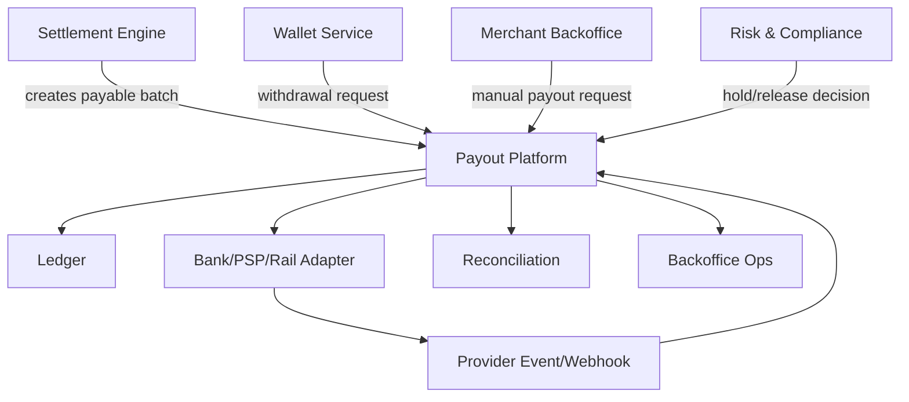
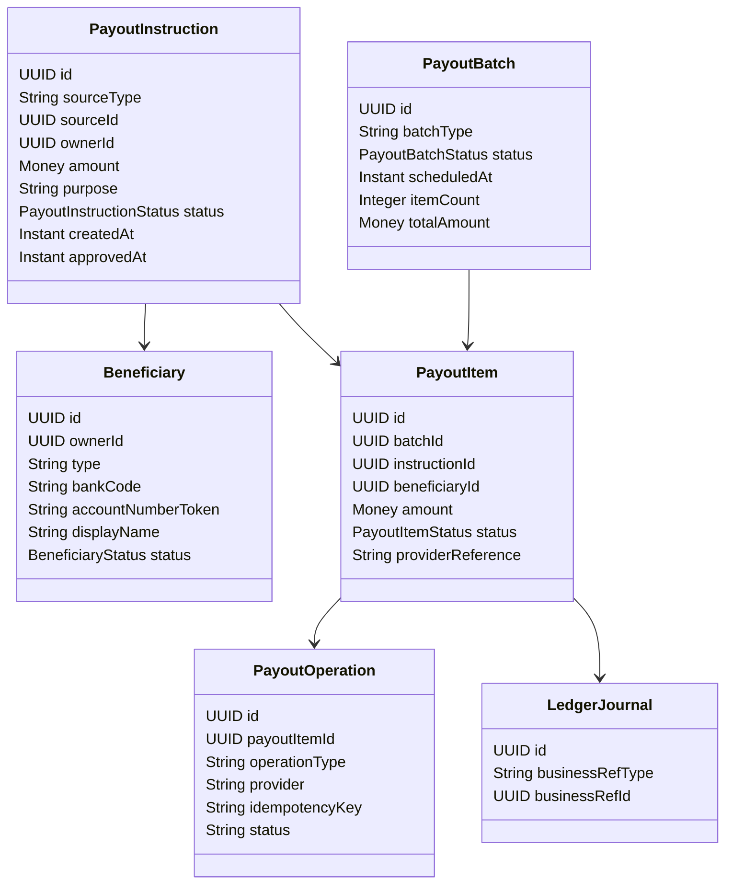
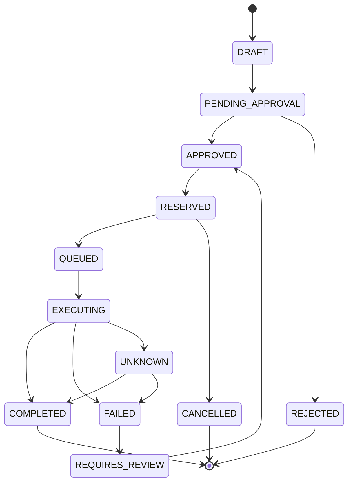
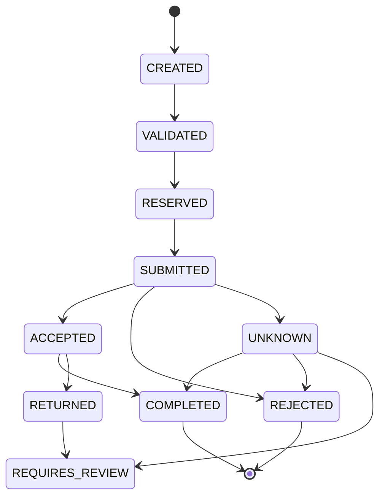
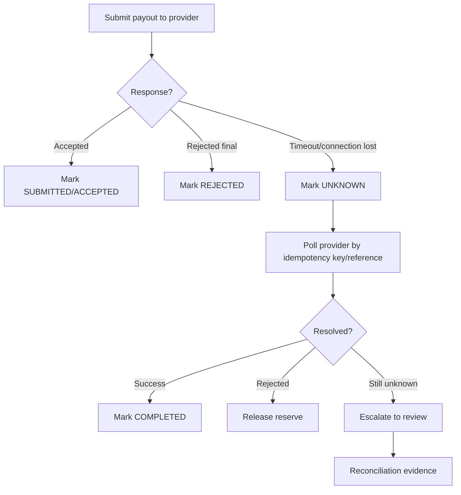
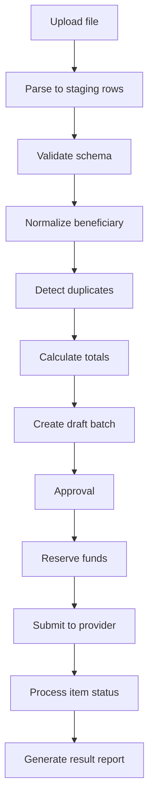
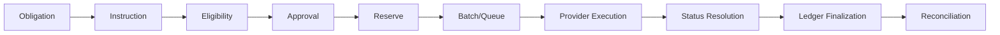

------
title: Build From Scratch: Large Production Grade Java Payment Systems - Part 033
description: Payout and disbursement platform design for enterprise Java payment systems, covering beneficiary management, approval, batching, execution, reversal, retry, reconciliation, ledger posting, and operational controls.
series: learn-java-payment-systems
seriesTitle: Build From Scratch: Large Production Grade Java Payment Systems
order: 33
partTitle: Payout and Disbursement Platform
tags:
- java
- payments
- payout
- disbursement
- ledger
- settlement
- fintech
- enterprise-architecture
date: 2026-07-02
---

# Part 033 — Payout & Disbursement Platform

Payout adalah sisi lain dari payment system yang sering diremehkan.

Pay-in menjawab pertanyaan:

> bagaimana uang masuk dari customer ke platform atau merchant?

Payout menjawab pertanyaan yang lebih berbahaya:

> kapan, kepada siapa, berapa, lewat rail apa, dengan approval apa, dan berdasarkan saldo apa uang boleh keluar?

Di production, payout bukan sekadar endpoint `POST /transfer` ke bank atau PSP. Payout adalah **controlled outbound money movement platform**.

Kalau payment gagal, merchant mungkin marah karena transaksi tidak sukses. Kalau payout salah, uang benar-benar keluar ke rekening yang salah, nominal salah, beneficiary salah, atau keluar sebelum kewajiban risiko selesai. Itu bukan hanya bug teknis; itu bisa menjadi kerugian finansial, audit finding, fraud incident, operational crisis, dan regulatory issue.

Materi ini membahas payout dan disbursement sebagai bagian dari enterprise-grade payment system berbasis Java.

Kita tidak akan mengulang konsep dasar REST API, Kafka, SQL, worker, atau Kubernetes. Fokus kita adalah bagaimana semua itu dipakai untuk menjaga **uang keluar** tetap benar.

---

## 1. Mental Model: Payout Is Not Payment Refund

Payout sering disamakan dengan refund, transfer, withdrawal, settlement, atau disbursement. Di sistem kecil, istilah ini sering bercampur. Di sistem besar, perbedaan ini harus eksplisit.

| Istilah | Arti | Source of funds | Penerima | Risiko utama |
|---|---|---|---|---|
| Refund | Mengembalikan dana ke customer untuk transaksi tertentu | payment sebelumnya | customer original | refund melebihi captured amount |
| Payout | Mengirim dana keluar ke merchant/user/beneficiary | saldo payable/platform wallet | bank/e-wallet penerima | salah penerima/saldo tidak cukup |
| Settlement payout | Membayar hasil settlement ke merchant | merchant settled payable | merchant | fee/reserve/netting salah |
| Disbursement | Pembayaran massal ke banyak penerima | platform/merchant funding account | banyak beneficiary | batch salah/duplikasi |
| Withdrawal | User menarik saldo tersimpan | wallet balance | user sendiri | account takeover/limit abuse |
| Transfer internal | Memindah saldo antar account internal | ledger internal | account internal | created/lost money |

Payout bukan refund karena refund terikat pada pembayaran awal. Payout bukan settlement karena settlement adalah proses menghitung kewajiban finansial. Payout adalah eksekusi outbound dari kewajiban atau instruksi yang sudah lolos kontrol.

Mental model yang lebih aman:

```txt
Payout = execution of an approved outbound obligation against an available funding source.
```

Payout punya tiga komponen besar:

1. **Obligation**: mengapa uang harus keluar?
2. **Eligibility**: apakah uang boleh keluar sekarang?
3. **Execution**: bagaimana uang dikirim dan dibuktikan?

Kalau hanya membangun execution tanpa obligation dan eligibility, sistem payout akan cepat menjadi mesin transfer liar.

---

## 2. Payout Platform Boundary

Dalam payment platform enterprise, payout sebaiknya tidak dicampur langsung ke Payment Core atau Ledger Core.

Payment Core tahu transaksi customer.
Ledger tahu kebenaran finansial.
Settlement tahu kewajiban merchant.
Payout tahu cara mengeksekusi dana keluar.



Payout Platform bertanggung jawab untuk:

- menerima payout instruction;
- validasi beneficiary;
- validasi saldo available;
- menjalankan approval workflow;
- memilih payout rail/provider;
- membuat payout batch;
- mengunci dana;
- mengirim instruksi ke provider;
- memproses status provider;
- menangani retry dan unknown outcome;
- posting ledger;
- menyediakan audit trail;
- menyediakan repair/backoffice tooling;
- mendukung reconciliation.

Payout Platform **tidak boleh** menjadi owner tunggal dari balance. Balance harus berasal dari ledger/projection yang dikontrol.

---

## 3. Core Invariants for Payout

Payout harus menjaga invariant yang lebih keras daripada pay-in.

### 3.1 No payout without funding

Sistem tidak boleh mengeksekusi payout jika saldo available tidak cukup.

```txt
requested_payout_amount <= available_balance - existing_reservations
```

Pengecekan ini tidak boleh hanya di UI. Harus dijaga di server, dalam transaction boundary, dengan lock atau constraint yang mencegah race.

### 3.2 No duplicate payout

Payout instruction yang sama tidak boleh menghasilkan dua transfer keluar.

Duplikasi bisa datang dari:

- user double click;
- client retry;
- scheduler retry;
- worker crash setelah submit ke provider;
- provider timeout;
- webhook terlambat;
- operator replay batch;
- file upload ulang;
- event consumption duplicate.

Karena itu payout butuh idempotency di banyak level:

- payout request idempotency;
- beneficiary idempotency;
- batch item idempotency;
- provider operation idempotency;
- ledger posting idempotency;
- reconciliation adjustment idempotency.

### 3.3 No payout to unverified beneficiary

Beneficiary harus punya status yang jelas.

```txt
DRAFT -> PENDING_VERIFICATION -> VERIFIED -> SUSPENDED -> DELETED
```

Payout ke beneficiary `DRAFT`, `PENDING_VERIFICATION`, `SUSPENDED`, atau `DELETED` harus ditolak kecuali ada controlled exception dengan approval.

### 3.4 No silent mutation after approval

Setelah payout approved, field kritikal tidak boleh berubah:

- beneficiary account number;
- bank code;
- beneficiary name;
- amount;
- currency;
- source account;
- merchant/user owner;
- purpose code;
- schedule date;
- rail/provider.

Kalau field itu berubah, approval harus invalidated.

### 3.5 Every outbound movement must be explainable

Untuk setiap payout, kita harus bisa menjawab:

- mengapa payout dibuat?
- siapa/apa yang membuatnya?
- balance mana yang dipakai?
- kapan dana di-reserve?
- siapa yang approve?
- provider mana yang dipakai?
- external reference apa yang diberikan provider?
- status akhirnya apa?
- ledger journal mana yang dibuat?
- reconciliation record mana yang membuktikan uang keluar?

Kalau tidak bisa menjawab ini, payout platform belum production-grade.

---

## 4. Payout Domain Model

Minimal aggregate yang dibutuhkan:



Kita pisahkan `PayoutInstruction`, `PayoutBatch`, dan `PayoutItem` karena tidak semua payout dieksekusi satu per satu.

- `PayoutInstruction`: niat bisnis.
- `PayoutBatch`: grouping eksekusi.
- `PayoutItem`: unit eksekusi per beneficiary.
- `PayoutOperation`: attempt ke provider.

Jangan gabungkan semuanya dalam satu tabel `payout`. Itu akan membuat state machine rusak ketika batch partially failed, provider retry, atau reconciliation menemukan mismatch.

---

## 5. Payout State Machine

Payout memiliki beberapa state machine. Yang paling penting adalah state instruction dan state item.

### 5.1 Instruction state



Makna state:

| State | Makna |
|---|---|
| `DRAFT` | Belum siap dieksekusi |
| `PENDING_APPROVAL` | Butuh approval maker-checker/risk/finance |
| `APPROVED` | Disetujui, tetapi dana belum di-reserve |
| `RESERVED` | Dana sudah dikunci di ledger |
| `QUEUED` | Siap diproses worker/provider |
| `EXECUTING` | Instruksi sudah dikirim/diusahakan ke provider |
| `UNKNOWN` | Provider result tidak pasti |
| `COMPLETED` | Provider dan/atau reconciliation membuktikan sukses |
| `FAILED` | Gagal final; reserve bisa dilepas sesuai policy |
| `REQUIRES_REVIEW` | Butuh manual decision |
| `CANCELLED` | Dibatalkan sebelum execution irreversible |

### 5.2 Item state

Dalam batch payout, satu instruction bisa menjadi banyak item atau satu batch punya banyak instruction. Item-level state harus independen.



Provider sering memberi status yang bukan final.

Contoh:

- `SUBMITTED`: provider menerima request, belum berarti uang keluar.
- `ACCEPTED`: bank/rail menerima instruksi, belum tentu beneficiary credited.
- `COMPLETED`: final success menurut provider/rail.
- `RETURNED`: sebelumnya accepted/completed di sisi instruction, tetapi dana dikembalikan oleh bank tujuan.
- `UNKNOWN`: timeout atau response tidak pasti.

State machine payout harus mengizinkan status intermediate. Kalau semua dipaksa jadi `SUCCESS` atau `FAILED`, reconciliation akan kacau.

---

## 6. Beneficiary Management

Beneficiary bukan string `bankAccountNumber` di request payout. Beneficiary adalah entity yang punya lifecycle, ownership, verification, risk, audit, dan privacy boundary.

### 6.1 Beneficiary fields

```sql
CREATE TABLE payout_beneficiary (
    id UUID PRIMARY KEY,
    owner_type TEXT NOT NULL,
    owner_id UUID NOT NULL,
    beneficiary_type TEXT NOT NULL,
    country_code CHAR(2) NOT NULL,
    currency CHAR(3) NOT NULL,
    rail TEXT NOT NULL,
    bank_code TEXT,
    account_number_token TEXT NOT NULL,
    account_number_last4 TEXT,
    account_holder_name TEXT NOT NULL,
    account_holder_type TEXT NOT NULL,
    status TEXT NOT NULL,
    verification_status TEXT NOT NULL,
    risk_status TEXT NOT NULL,
    created_at TIMESTAMPTZ NOT NULL,
    updated_at TIMESTAMPTZ NOT NULL,
    version BIGINT NOT NULL DEFAULT 0,
    UNIQUE(owner_type, owner_id, rail, bank_code, account_number_token)
);
```

Catatan penting:

- account number sebaiknya tidak disimpan plain text;
- simpan token atau encrypted value sesuai security model;
- `last4` boleh digunakan untuk display;
- ownership harus eksplisit;
- beneficiary currency/rail harus jelas;
- verification dan risk status dipisahkan.

### 6.2 Beneficiary verification

Verification bisa berupa:

- name inquiry;
- bank account validation;
- micro-deposit;
- document verification;
- KYB/KYC status inheritance;
- manual approval;
- sanctions screening;
- internal allowlist.

State:

```txt
UNVERIFIED -> VERIFYING -> VERIFIED -> VERIFICATION_FAILED -> SUSPENDED
```

Payout eligibility sebaiknya membaca verification state, bukan mengulang seluruh logic di payout service.

### 6.3 Beneficiary mutation rule

Field berikut harus dianggap sensitive:

- account number;
- bank code;
- routing number;
- account holder name;
- owner id;
- country;
- currency;
- rail.

Kalau field sensitive berubah, buat beneficiary baru atau reset verification status.

Jangan update beneficiary lama diam-diam karena payout history harus tetap menunjuk ke beneficiary detail pada saat payout dibuat.

Praktik aman:

```sql
CREATE TABLE payout_beneficiary_snapshot (
    id UUID PRIMARY KEY,
    payout_instruction_id UUID NOT NULL,
    beneficiary_id UUID NOT NULL,
    snapshot_json JSONB NOT NULL,
    created_at TIMESTAMPTZ NOT NULL
);
```

Snapshot ini membuat payout tetap audit-able walaupun beneficiary master data berubah.

---

## 7. Payout Request API

API payout harus memisahkan instruction creation, approval, reservation, dan execution.

### 7.1 Create payout instruction

```http
POST /v1/payout-instructions
Idempotency-Key: merchant_123:payout:invoice_998
Content-Type: application/json
```

```json
{
  "sourceType": "MERCHANT_SETTLEMENT",
  "sourceId": "0bfb7d1c-3d6e-4511-ae21-2623c9654376",
  "ownerId": "6d28a0e2-6b12-403c-9a9f-63450419e5e7",
  "beneficiaryId": "5da6c2f7-aec7-4a6b-bd7e-d2182d5e1b91",
  "amount": {
    "currency": "IDR",
    "valueMinor": 125000000
  },
  "purpose": "MERCHANT_SETTLEMENT_PAYOUT",
  "requestedExecutionDate": "2026-07-03"
}
```

Response:

```json
{
  "id": "3e7d19e1-98ff-44df-8a48-6638e630d53a",
  "status": "PENDING_APPROVAL",
  "approvalRequired": true,
  "amount": {
    "currency": "IDR",
    "valueMinor": 125000000
  }
}
```

### 7.2 Approve payout

```http
POST /v1/payout-instructions/{id}/approve
Idempotency-Key: operator_777:approve:3e7d19e1
```

```json
{
  "reason": "Settlement batch approved by finance",
  "approvalToken": "approval-workflow-123"
}
```

### 7.3 Execute payout

Execution sebaiknya tidak selalu public API. Untuk batch settlement, execution bisa dilakukan worker setelah approval dan schedule time.

```http
POST /internal/v1/payout-instructions/{id}/queue-execution
```

Sistem harus membedakan command public dari internal command. Endpoint internal tetap butuh auth, audit, idempotency, dan permission.

---

## 8. Approval Workflow

Payout approval bukan kosmetik UI. Ia adalah financial control.

Approval policy bisa berdasarkan:

- amount;
- currency;
- country;
- rail;
- beneficiary risk;
- merchant risk tier;
- source type;
- manual adjustment flag;
- first payout to beneficiary;
- payout frequency;
- velocity;
- reserve ratio;
- negative balance exposure;
- operator role.

Contoh policy:

```txt
IF amount > 100_000_000 IDR THEN require FINANCE_MANAGER + RISK_MANAGER
IF beneficiary is new THEN require MANUAL_REVIEW
IF owner risk tier = HIGH THEN require COMPLIANCE_APPROVAL
IF sourceType = MANUAL_ADJUSTMENT THEN require TWO_PERSON_APPROVAL
```

### 8.1 Maker-checker invariant

Pembuat payout tidak boleh menjadi approver final untuk payout yang sama.

```sql
CREATE TABLE payout_approval (
    id UUID PRIMARY KEY,
    payout_instruction_id UUID NOT NULL,
    approver_user_id UUID NOT NULL,
    approval_role TEXT NOT NULL,
    decision TEXT NOT NULL,
    reason TEXT NOT NULL,
    created_at TIMESTAMPTZ NOT NULL,
    UNIQUE(payout_instruction_id, approver_user_id, approval_role)
);
```

Constraint maker-checker sering tidak bisa diekspresikan penuh di SQL karena butuh data creator. Simpan creator di payout instruction dan enforce di domain service.

```java
public void approve(Operator approver, ApprovalDecision decision) {
    if (approver.id().equals(createdBy)) {
        throw new DomainViolation("Maker cannot approve own payout");
    }
    if (!approvalPolicy.canApprove(approver, this, decision)) {
        throw new DomainViolation("Operator lacks payout approval authority");
    }
    this.approvals.add(decision.toApprovalRecord());
    if (approvalPolicy.isSatisfiedBy(this.approvals)) {
        this.status = PayoutInstructionStatus.APPROVED;
    }
}
```

### 8.2 Approval invalidation

Kalau payout field kritikal berubah setelah approval, approval harus invalid.

Lebih aman: jangan izinkan mutation. Buat payout instruction baru.

```txt
APPROVED payout is immutable.
To change amount or beneficiary, cancel and create a new instruction.
```

---

## 9. Balance Reservation for Payout

Payout tidak boleh langsung mengurangi balance available tanpa jejak. Harus ada reserve.

Contoh merchant payout:

```txt
Before:
Merchant Settled Payable: 10,000,000 IDR
Merchant Payout Reserved: 0

Reserve payout 3,000,000 IDR:
Dr Merchant Settled Payable     3,000,000
Cr Merchant Payout Reserved     3,000,000
```

Ketika payout berhasil:

```txt
Dr Merchant Payout Reserved     3,000,000
Cr Bank Clearing / Cash         3,000,000
```

Kalau payout gagal final:

```txt
Dr Merchant Payout Reserved     3,000,000
Cr Merchant Settled Payable     3,000,000
```

Reserve membuat beberapa hal aman:

- payout lain tidak memakai dana yang sama;
- cancellation punya journal jelas;
- unknown outcome tidak membuat balance ambiguous;
- audit bisa melihat dana terkunci;
- retry tidak membuat double debit.

### 9.1 Reservation table

```sql
CREATE TABLE payout_reservation (
    id UUID PRIMARY KEY,
    payout_instruction_id UUID NOT NULL UNIQUE,
    owner_type TEXT NOT NULL,
    owner_id UUID NOT NULL,
    currency CHAR(3) NOT NULL,
    amount_minor NUMERIC(38,0) NOT NULL CHECK (amount_minor > 0),
    status TEXT NOT NULL,
    ledger_journal_id UUID NOT NULL,
    created_at TIMESTAMPTZ NOT NULL,
    released_at TIMESTAMPTZ
);
```

`UNIQUE(payout_instruction_id)` mencegah double reserve untuk instruction yang sama.

### 9.2 Reservation transaction boundary

Reservation harus atomic dengan state transition.

```java
@Transactional
public void reserveForPayout(UUID payoutInstructionId) {
    PayoutInstruction payout = payoutRepository.lockById(payoutInstructionId);

    payout.assertStatus(APPROVED);
    balanceService.assertAvailable(
        payout.owner(),
        payout.amount()
    );

    LedgerJournal journal = ledger.post(
        PostingRule.reservePayout(payout)
    );

    payout.markReserved(journal.id());
    payoutRepository.save(payout);

    outbox.publish(PayoutReservedEvent.from(payout));
}
```

Remote provider call **tidak boleh** ada di transaction ini.

---

## 10. Payout Batch Design

Batching diperlukan untuk:

- settlement payout massal;
- payroll/disbursement;
- bank file upload;
- cost optimization;
- provider throughput limit;
- approval per batch;
- reconciliation per file/report.

Tetapi batch membuat failure model lebih kompleks.

Satu batch bisa:

- seluruhnya accepted;
- sebagian accepted sebagian rejected;
- file diterima tapi item pending;
- file rejected karena header invalid;
- item returned setelah sukses;
- provider duplicate file;
- operator upload ulang;
- provider report datang terlambat.

### 10.1 Batch table

```sql
CREATE TABLE payout_batch (
    id UUID PRIMARY KEY,
    batch_type TEXT NOT NULL,
    currency CHAR(3) NOT NULL,
    provider TEXT NOT NULL,
    rail TEXT NOT NULL,
    status TEXT NOT NULL,
    scheduled_at TIMESTAMPTZ NOT NULL,
    item_count INT NOT NULL CHECK (item_count >= 0),
    total_amount_minor NUMERIC(38,0) NOT NULL CHECK (total_amount_minor >= 0),
    file_reference TEXT,
    created_at TIMESTAMPTZ NOT NULL,
    submitted_at TIMESTAMPTZ,
    completed_at TIMESTAMPTZ,
    version BIGINT NOT NULL DEFAULT 0
);

CREATE TABLE payout_batch_item (
    id UUID PRIMARY KEY,
    batch_id UUID NOT NULL REFERENCES payout_batch(id),
    payout_instruction_id UUID NOT NULL,
    beneficiary_snapshot_id UUID NOT NULL,
    currency CHAR(3) NOT NULL,
    amount_minor NUMERIC(38,0) NOT NULL CHECK (amount_minor > 0),
    status TEXT NOT NULL,
    provider_reference TEXT,
    failure_code TEXT,
    failure_message TEXT,
    created_at TIMESTAMPTZ NOT NULL,
    updated_at TIMESTAMPTZ NOT NULL,
    UNIQUE(batch_id, payout_instruction_id)
);
```

### 10.2 Batch integrity check

Sebelum submit batch:

```txt
batch.item_count = count(items)
batch.total_amount = sum(item.amount)
all items currency = batch currency
all items status = RESERVED or VALIDATED
all items beneficiary_snapshot exists
all items owner/source policy satisfied
```

Jangan membangun file bank langsung dari query longgar. Buat batch immutable dulu, lalu generate file dari snapshot batch.

---

## 11. Provider/Rail Adapter for Payout

Provider payout bisa berupa:

- bank API;
- PSP disbursement API;
- wallet provider;
- instant payment rail;
- ACH-like batch rail;
- file-based bank host-to-host;
- internal treasury system.

Payout adapter port harus stabil.

```java
public interface PayoutProviderPort {
    ProviderSubmitPayoutResult submitSingle(
        ProviderPayoutCommand command
    );

    ProviderSubmitBatchResult submitBatch(
        ProviderPayoutBatchCommand command
    );

    ProviderPayoutStatusResult getStatus(
        ProviderPayoutStatusQuery query
    );

    ProviderCancelResult cancel(
        ProviderCancelPayoutCommand command
    );
}
```

Normalized result:

```java
public sealed interface ProviderSubmitPayoutResult {
    record Accepted(
        ProviderReference providerReference,
        Instant acceptedAt,
        Map<String, String> rawEvidence
    ) implements ProviderSubmitPayoutResult {}

    record Rejected(
        String code,
        String message,
        boolean retryable,
        Map<String, String> rawEvidence
    ) implements ProviderSubmitPayoutResult {}

    record Unknown(
        String reason,
        boolean safeToPoll,
        Map<String, String> rawEvidence
    ) implements ProviderSubmitPayoutResult {}
}
```

Jangan expose provider-specific status ke domain core. Domain core hanya tahu normalized semantics.

---

## 12. Unknown Outcome in Payout

Unknown outcome di payout lebih berbahaya daripada pay-in karena aksi eksternal bisa sudah mengirim uang.

Contoh:

1. sistem submit payout ke bank;
2. bank menerima dan memproses;
3. koneksi timeout sebelum response diterima;
4. worker menganggap gagal;
5. worker retry tanpa provider idempotency;
6. beneficiary menerima dua transfer.

Karena itu `timeout` bukan `failed`.

```txt
Timeout after submit = UNKNOWN
UNKNOWN must be resolved by status query, webhook/report, or reconciliation.
```

### 12.1 Unknown handling flow



### 12.2 Unknown state policy

When payout is `UNKNOWN`:

- jangan release reserve;
- jangan auto retry ke rail yang tidak punya idempotency;
- jangan create payout baru untuk instruksi yang sama;
- tampilkan status “processing/under review”;
- poll provider dengan controlled schedule;
- tunggu provider report/reconciliation;
- escalate kalau melewati SLA.

---

## 13. Retry Policy

Retry payout harus sangat konservatif.

| Failure | Retry? | Catatan |
|---|---:|---|
| validation error | no | data salah, perlu fix |
| insufficient funds at provider | maybe | depends funding source |
| network timeout before connection established | yes | kalau request belum terkirim |
| timeout after write | no direct retry | mark unknown dulu |
| provider 5xx before accepted reference | maybe | butuh idempotency key |
| duplicate idempotency response | no new payout | load existing operation |
| beneficiary bank rejected | no | final failure |
| provider rate limited | yes | backoff |
| provider maintenance | yes later | queue delay |
| unknown outcome | poll/reconcile | bukan retry biasa |

### 13.1 Operation log

```sql
CREATE TABLE payout_provider_operation (
    id UUID PRIMARY KEY,
    payout_item_id UUID NOT NULL,
    operation_type TEXT NOT NULL,
    provider TEXT NOT NULL,
    idempotency_key TEXT NOT NULL,
    request_hash TEXT NOT NULL,
    status TEXT NOT NULL,
    provider_reference TEXT,
    attempt_number INT NOT NULL,
    started_at TIMESTAMPTZ NOT NULL,
    completed_at TIMESTAMPTZ,
    raw_request_ref TEXT,
    raw_response_ref TEXT,
    UNIQUE(provider, operation_type, idempotency_key)
);
```

`request_hash` penting untuk mendeteksi idempotency key reuse dengan payload berbeda.

---

## 14. Ledger Posting for Payout

Payout membutuhkan beberapa posting rule, bukan satu.

### 14.1 Reserve payout

```txt
Dr Merchant Settled Payable
Cr Merchant Payout Reserved
```

### 14.2 Submit payout to clearing

Tergantung policy, saat submit/accepted ke provider bisa memindahkan dari reserve ke clearing.

```txt
Dr Merchant Payout Reserved
Cr Payout Clearing Liability
```

Atau reserve tetap sampai final success. Pilihan ini tergantung definisi internal dan reconciliation design. Yang penting: state dan ledger harus konsisten.

### 14.3 Final success

```txt
Dr Payout Clearing Liability
Cr Cash at Bank / Provider Settlement Account
```

### 14.4 Final reject before money leaves

```txt
Dr Merchant Payout Reserved
Cr Merchant Settled Payable
```

### 14.5 Return after success

Kalau bank tujuan mengembalikan dana setelah payout dianggap sukses:

```txt
Dr Cash at Bank / Provider Settlement Account
Cr Payout Return Suspense
```

Lalu setelah dikaitkan ke merchant:

```txt
Dr Payout Return Suspense
Cr Merchant Settled Payable
```

Jangan langsung “undo” payout sukses. Secara audit, payout sukses lalu return adalah dua event berbeda.

---

## 15. Payout Source Types

Payout platform harus tahu source type, karena rules berbeda.

| Source type | Contoh | Kontrol tambahan |
|---|---|---|
| `MERCHANT_SETTLEMENT` | payout hasil settlement | settlement batch approved |
| `WALLET_WITHDRAWAL` | user withdraw balance | KYC, limit, ATO risk |
| `MARKETPLACE_SELLER_PAYOUT` | seller payout | seller verification, reserve |
| `REFUND_ALTERNATIVE` | refund via bank transfer | original payment evidence |
| `PROMOTION_DISBURSEMENT` | cashback/manual promo | budget control |
| `CLAIM_PAYMENT` | insurance/benefit claim | claim approval |
| `MANUAL_ADJUSTMENT` | finance correction | maker-checker, audit reason |
| `LOAN_DISBURSEMENT` | loan payout | credit approval, regulation |

Jangan hanya simpan `description`. Source type harus enum/policy dimension.

---

## 16. Disbursement Use Case

Disbursement berarti payout massal. Contoh:

- payroll;
- marketplace seller payout;
- insurance claim payout;
- merchant settlement payout;
- campaign cashback;
- vendor payment;
- loan disbursement.

Disbursement punya problem tambahan:

- file upload dari merchant;
- row-level validation;
- duplicate row;
- beneficiary mismatch;
- scheduled execution;
- partial failure;
- approval per batch;
- large batch throughput;
- item-level reconciliation;
- result file generation.

### 16.1 File upload pipeline



### 16.2 Staging table

```sql
CREATE TABLE disbursement_file_row (
    id UUID PRIMARY KEY,
    file_id UUID NOT NULL,
    row_number INT NOT NULL,
    external_row_id TEXT,
    raw_json JSONB NOT NULL,
    normalized_json JSONB,
    validation_status TEXT NOT NULL,
    validation_errors JSONB,
    payout_instruction_id UUID,
    created_at TIMESTAMPTZ NOT NULL,
    UNIQUE(file_id, row_number),
    UNIQUE(file_id, external_row_id)
);
```

File row harus disimpan sebagai evidence. Jangan hanya parse lalu buang file.

---

## 17. Provider Status Normalization

Provider payout status sering berbeda-beda.

Contoh normalized model:

| Normalized status | Makna |
|---|---|
| `RECEIVED` | provider menerima request |
| `VALIDATION_FAILED` | request ditolak sebelum processing |
| `PROCESSING` | sedang diproses |
| `ACCEPTED_BY_RAIL` | diterima rail/bank |
| `COMPLETED` | final success |
| `FAILED_FINAL` | final failure |
| `RETURNED` | dana dikembalikan setelah accepted/completed |
| `CANCELLED` | dibatalkan sebelum final |
| `UNKNOWN` | outcome tidak pasti |

Mapping harus versioned.

```sql
CREATE TABLE payout_provider_status_mapping (
    id UUID PRIMARY KEY,
    provider TEXT NOT NULL,
    provider_status TEXT NOT NULL,
    provider_reason_code TEXT,
    normalized_status TEXT NOT NULL,
    retryable BOOLEAN NOT NULL,
    final BOOLEAN NOT NULL,
    mapping_version INT NOT NULL,
    active BOOLEAN NOT NULL,
    UNIQUE(provider, provider_status, provider_reason_code, mapping_version)
);
```

Status mapping bug bisa menyebabkan uang salah dianggap berhasil/gagal. Treat mapping as production configuration with review.

---

## 18. Payout Reconciliation

Payout tidak selesai hanya karena provider API bilang sukses.

Sistem harus reconcile terhadap:

- provider payout report;
- bank statement;
- settlement file;
- return file;
- internal ledger;
- batch item status;
- cash movement.

### 18.1 Reconciliation dimensions

| Internal field | External evidence |
|---|---|
| payout item id | provider reference |
| amount/currency | amount/currency in report |
| beneficiary account | masked account / bank reference |
| execution date | bank effective date |
| status | provider final status |
| cash account | bank statement debit |
| return | bank return credit |

### 18.2 Break examples

- internal completed, provider missing;
- provider completed, internal unknown;
- amount mismatch;
- beneficiary mismatch;
- duplicate provider debit;
- return received but payout not found;
- cash debit not matching provider report;
- batch total mismatch.

Payout reconciliation will be deeper in later reconciliation parts, but payout design must already provide stable references.

---

## 19. Operational Controls

Payout platform needs strong operator tooling.

### 19.1 Backoffice capabilities

Operations team needs:

- search payout by id, reference, owner, beneficiary, amount;
- inspect timeline;
- inspect raw provider evidence;
- inspect ledger journal;
- see approval chain;
- see risk/compliance decision;
- pause payout;
- release payout;
- retry allowed operation;
- mark manual resolution with evidence;
- export report;
- link reconciliation break;
- create controlled adjustment.

### 19.2 Dangerous operations

These require extra control:

- force complete;
- force fail;
- release reserve;
- manual payout creation;
- beneficiary override;
- retry unknown payout;
- change provider reference;
- exclude payout from batch;
- create ledger adjustment.

Every dangerous operation must have:

- role permission;
- reason;
- maker-checker if high risk;
- audit event;
- before/after state;
- link to evidence;
- immutable operator id;
- timestamp;
- preferably ticket/case id.

---

## 20. Java Domain Sketch

### 20.1 Value objects

```java
public record PayoutId(UUID value) {}
public record BeneficiaryId(UUID value) {}
public record PayoutBatchId(UUID value) {}

public record PayoutAmount(String currency, BigInteger valueMinor) {
    public PayoutAmount {
        Objects.requireNonNull(currency);
        Objects.requireNonNull(valueMinor);
        if (valueMinor.signum() <= 0) {
            throw new IllegalArgumentException("Payout amount must be positive");
        }
    }
}
```

### 20.2 Aggregate

```java
public final class PayoutInstruction {
    private final PayoutId id;
    private final OwnerRef owner;
    private final BeneficiaryId beneficiaryId;
    private final PayoutAmount amount;
    private PayoutStatus status;
    private long version;

    public void submitForApproval() {
        requireStatus(PayoutStatus.DRAFT);
        status = PayoutStatus.PENDING_APPROVAL;
    }

    public void approve(ApprovalPolicyResult result) {
        requireStatus(PayoutStatus.PENDING_APPROVAL);
        if (!result.approved()) {
            throw new DomainViolation("Approval policy not satisfied");
        }
        status = PayoutStatus.APPROVED;
    }

    public void markReserved(UUID ledgerJournalId) {
        requireStatus(PayoutStatus.APPROVED);
        status = PayoutStatus.RESERVED;
        // store journal link
    }

    public void markQueued() {
        requireStatus(PayoutStatus.RESERVED);
        status = PayoutStatus.QUEUED;
    }

    public void markUnknown(String reason) {
        if (status != PayoutStatus.EXECUTING && status != PayoutStatus.QUEUED) {
            throw new DomainViolation("Cannot mark unknown from " + status);
        }
        status = PayoutStatus.UNKNOWN;
    }

    private void requireStatus(PayoutStatus expected) {
        if (status != expected) {
            throw new DomainViolation("Expected " + expected + " but was " + status);
        }
    }
}
```

### 20.3 Application service

```java
public final class PayoutExecutionService {
    private final PayoutRepository payoutRepository;
    private final PayoutProviderPort providerPort;
    private final PayoutOperationRepository operationRepository;
    private final Outbox outbox;

    @Transactional
    public void startExecution(PayoutId payoutId) {
        PayoutInstruction payout = payoutRepository.lockById(payoutId);
        payout.requireExecutable();

        PayoutOperation operation = PayoutOperation.submit(
            payout.id(),
            IdempotencyKey.forPayoutSubmit(payout.id())
        );
        operationRepository.save(operation);

        payout.markExecuting(operation.id());
        payoutRepository.save(payout);
        outbox.publish(PayoutExecutionRequested.from(payout, operation));
    }

    public void executeProviderCall(UUID operationId) {
        PayoutOperation op = operationRepository.findById(operationId);
        ProviderSubmitPayoutResult result = providerPort.submitSingle(op.toCommand());
        // convert provider result into domain command through separate handler
    }
}
```

Remote call should happen outside the DB transaction. The result should be applied through a command/event that is idempotent.

---

## 21. Worker Design

Payout worker must be lease-based and idempotent.

```sql
CREATE TABLE payout_work_item (
    id UUID PRIMARY KEY,
    payout_item_id UUID NOT NULL,
    work_type TEXT NOT NULL,
    status TEXT NOT NULL,
    available_at TIMESTAMPTZ NOT NULL,
    locked_by TEXT,
    locked_until TIMESTAMPTZ,
    attempt_count INT NOT NULL DEFAULT 0,
    created_at TIMESTAMPTZ NOT NULL,
    updated_at TIMESTAMPTZ NOT NULL,
    UNIQUE(payout_item_id, work_type)
);
```

Worker claim query:

```sql
SELECT *
FROM payout_work_item
WHERE status = 'READY'
  AND available_at <= now()
  AND (locked_until IS NULL OR locked_until < now())
ORDER BY available_at ASC
LIMIT 100
FOR UPDATE SKIP LOCKED;
```

Use fencing token if worker updates external side effects after lease expiry risk.

---

## 22. Security and Compliance Boundary

Payout is a fraud target.

Attack patterns:

- account takeover changes beneficiary then requests payout;
- insider creates manual payout;
- attacker replays old payout file;
- beneficiary details changed after approval;
- fake webhook marks payout failed and releases reserve;
- duplicate provider callback manipulates state;
- operator force-completes payout to hide mismatch;
- malicious merchant uses payout to launder funds.

Controls:

- strong authentication for operators;
- role-based and attribute-based access;
- maker-checker;
- beneficiary change cooldown;
- first payout delay;
- velocity limits;
- sanctions/AML screening where applicable;
- raw webhook signature verification;
- immutable audit log;
- ledger reconciliation;
- anomaly detection;
- case management;
- secret management;
- masked account display;
- encrypted beneficiary data.

---

## 23. Observability

Technical metrics:

- payout create rate;
- approval queue size;
- reserve failure rate;
- provider submit latency;
- provider timeout rate;
- unknown payout count;
- batch processing duration;
- webhook delay;
- polling backlog;
- worker retry count;
- reconciliation break count.

Business metrics:

- total payout amount by currency;
- payout success rate by provider/rail;
- average time to complete;
- pending payout liability;
- payout reserve amount;
- returned payout amount;
- manual intervention rate;
- high-risk payout volume;
- payout SLA breach count.

Critical alerts:

```txt
unknown_payout_count > threshold
payout_completed_without_ledger_journal > 0
reserve_released_for_unknown_payout > 0
provider_debit_without_internal_payout > 0
payout_batch_total_mismatch > 0
manual_force_complete_count spikes
```

---

## 24. Testing Matrix

### 24.1 Domain tests

- cannot approve own payout;
- cannot payout unverified beneficiary;
- cannot mutate approved payout;
- cannot reserve twice;
- cannot execute without reserve;
- cannot release reserve on unknown;
- cannot complete without provider evidence;
- cannot exceed available balance.

### 24.2 Concurrency tests

- two payout requests same idempotency key;
- two workers submit same payout;
- approval and cancellation race;
- reserve and balance change race;
- webhook arrives before submit response;
- polling result and webhook result race;
- batch retry while item status updates.

### 24.3 Simulator scenarios

Provider simulator must support:

- immediate success;
- immediate rejection;
- accepted then success webhook;
- accepted then return;
- timeout after accepting;
- duplicate webhook;
- out-of-order webhook;
- batch partial failure;
- delayed status report;
- provider idempotency duplicate response.

---

## 25. Common Anti-Patterns

### 25.1 Direct payout from available balance

```txt
balance -= amount
call provider
```

This fails if provider call returns unknown or crashes.

Use reserve and operation log.

### 25.2 Timeout means failed

Timeout after submit must be unknown. Treating it as failed creates duplicate payout risk.

### 25.3 Updating beneficiary in place

Changing account number under existing beneficiary breaks historical payout evidence.

Use snapshot or new beneficiary version.

### 25.4 Batch as one status

A batch can be partially successful. Item-level status is required.

### 25.5 Manual backoffice without ledger journal

Any operator correction that changes financial state must produce ledger journal or attach to one.

### 25.6 Payout success without reconciliation path

Provider API success is not the same as cash movement proof.

---

## 26. Build Order

Recommended implementation sequence:

1. Beneficiary model and verification state.
2. Payout instruction aggregate.
3. Approval policy.
4. Balance availability check.
5. Ledger reservation posting.
6. Provider operation log.
7. Single payout provider adapter.
8. Unknown outcome handling.
9. Webhook/status ingestion.
10. Payout completion/failure posting.
11. Backoffice timeline.
12. Batch payout.
13. File upload/staging.
14. Reconciliation import.
15. Risk/compliance rules.
16. Advanced routing and fallback.

Do not start with batch file generation. Start with correctness of one payout item.

---

## 27. Minimal Production Checklist

Before calling payout production-ready:

- [ ] payout cannot execute without approved instruction;
- [ ] payout cannot execute without verified beneficiary;
- [ ] payout cannot execute without available balance;
- [ ] payout reserve is ledger-backed;
- [ ] provider call has operation log;
- [ ] timeout becomes unknown;
- [ ] unknown cannot be auto-released;
- [ ] retry is idempotent;
- [ ] batch supports item-level status;
- [ ] beneficiary snapshot is stored;
- [ ] approval is immutable;
- [ ] maker-checker exists for dangerous actions;
- [ ] all provider events are deduplicated;
- [ ] payout can be reconciled to provider/bank report;
- [ ] manual actions are audited;
- [ ] dashboard tracks unknown/stuck/returned payout;
- [ ] simulator covers duplicate/out-of-order/timeout;
- [ ] ledger trial balance remains zero-sum.

---

## 28. References

- Stripe Connect documentation explains that connected-account charges accumulate in connected-account balances and can be paid out according to payout configuration: https://docs.stripe.com/connect/payouts-connected-accounts
- Stripe marketplace payout task documentation describes payout timing and configurable payout frequency: https://docs.stripe.com/connect/marketplace/tasks/payout
- Adyen platform documentation describes splitting payments, deducting costs, holding funds until payout, and paying out/transferring funds in platform models: https://docs.adyen.com/platforms
- Adyen split transaction documentation explains that split instructions book funds and fees to correct balance accounts: https://docs.adyen.com/platforms/in-person-payments/split-transactions
- PostgreSQL explicit locking documentation: https://www.postgresql.org/docs/current/explicit-locking.html
- Martin Fowler, Accounting Transaction pattern: https://martinfowler.com/eaaDev/AccountingTransaction.html

---

## 29. What We Have Built Mentally

At this point, payout is no longer a `sendMoney()` helper.

It is a controlled pipeline:



The key insight:

> Payout correctness is not achieved by trusting provider success. It is achieved by controlling obligation, beneficiary, approval, reservation, execution, ledger posting, and reconciliation as one auditable lifecycle.

In the next part, we move from outbound payout to recurring/merchant-initiated charging: subscriptions, mandates, retry, dunning, and stored credential semantics.
