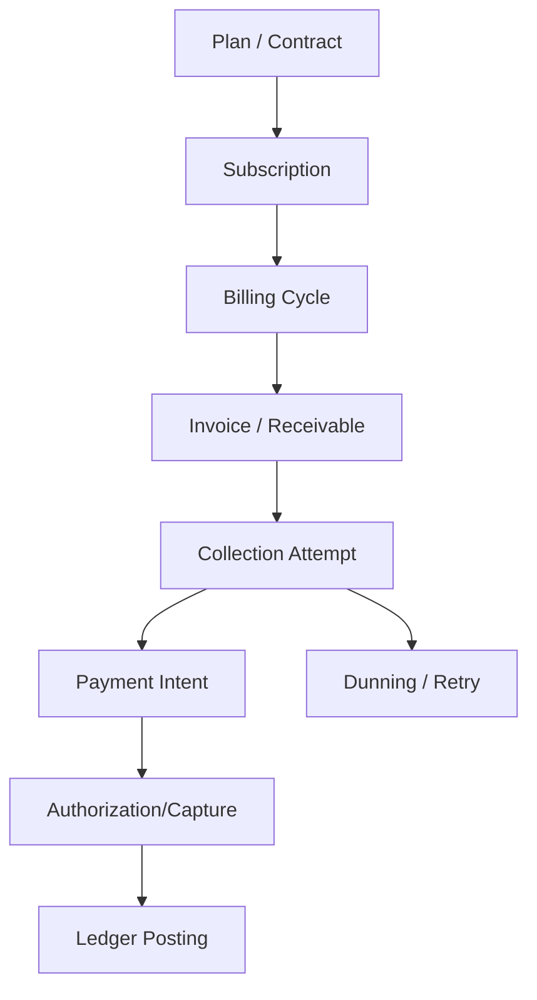
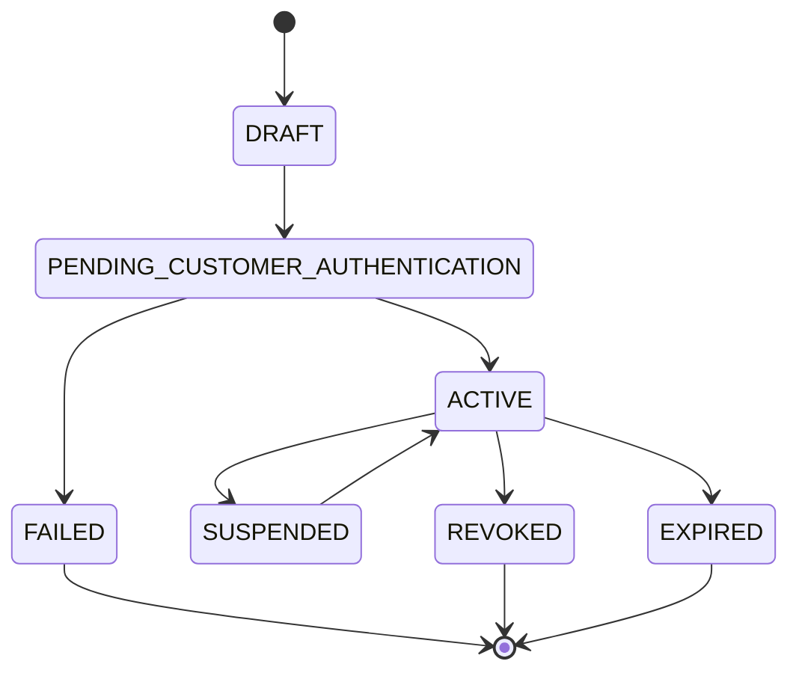
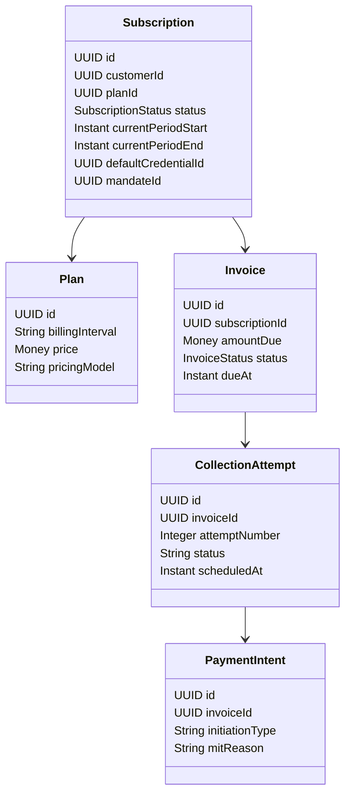
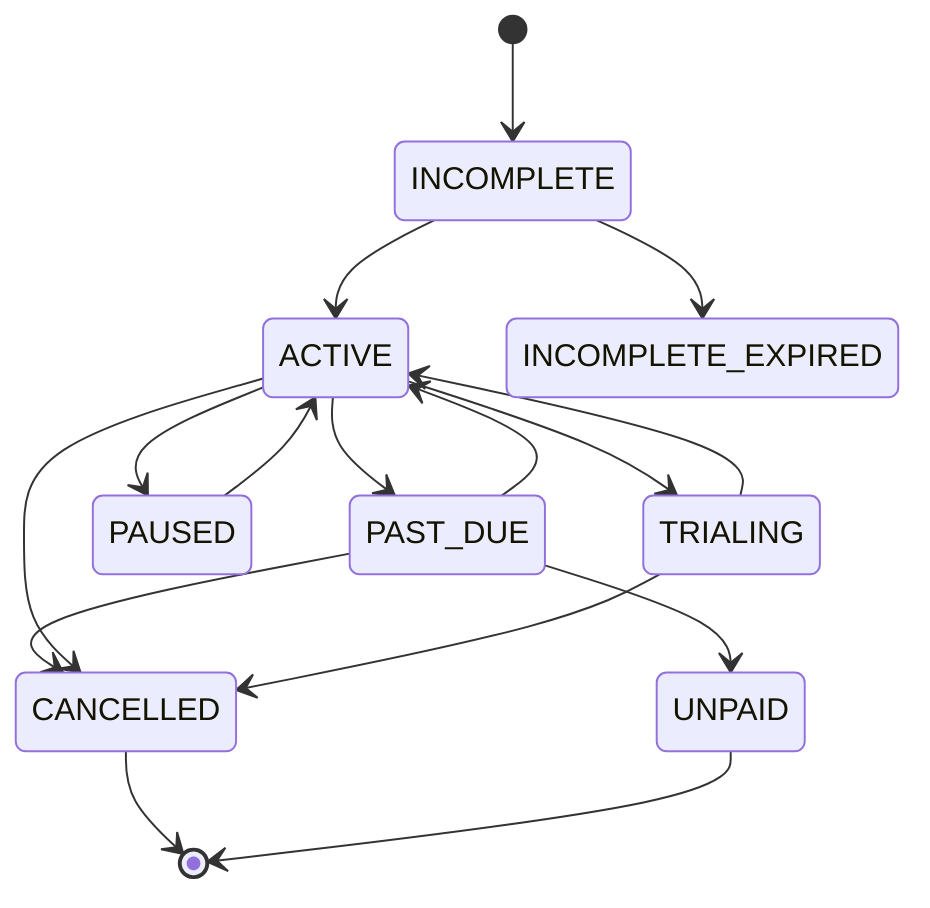
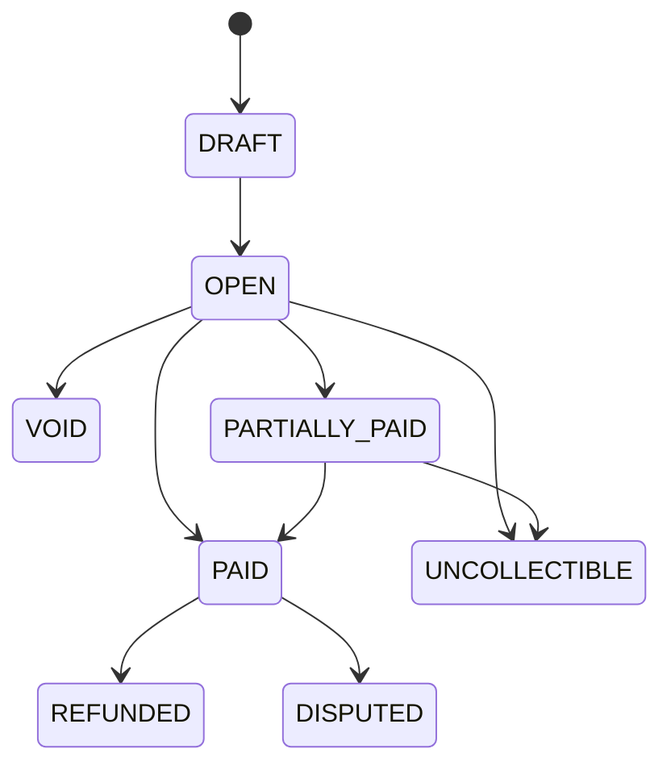
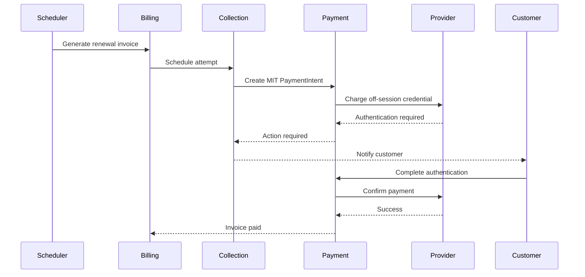
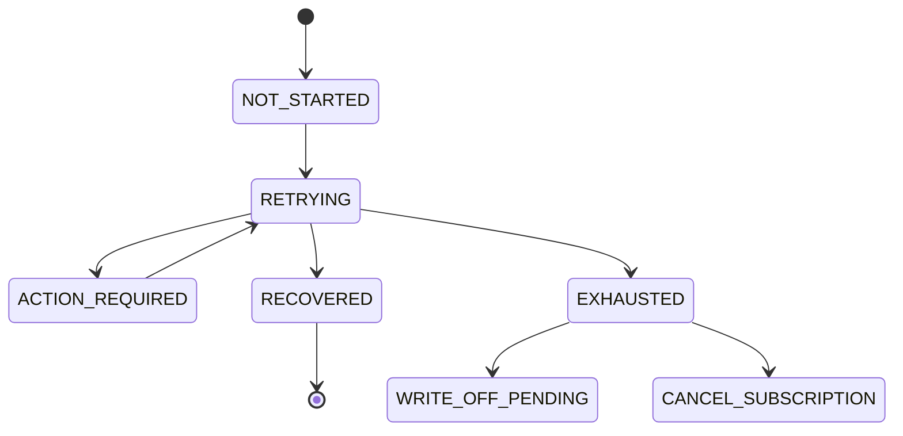
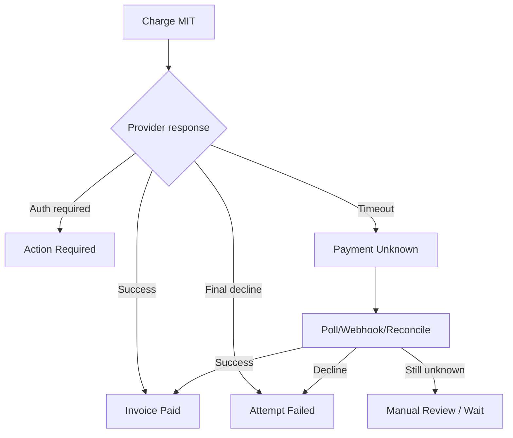
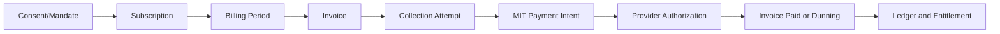

------
title: Build From Scratch: Large Production Grade Java Payment Systems - Part 034
description: Subscription and merchant-initiated transaction design for enterprise Java payment systems, covering mandates, billing cycles, retry, dunning, stored credentials, idempotency, ledger posting, and lifecycle correctness.
series: learn-java-payment-systems
seriesTitle: Build From Scratch: Large Production Grade Java Payment Systems
order: 34
partTitle: Subscription and Merchant-Initiated Transactions
tags:
- java
- payments
- subscription
- mit
- cit
- recurring-billing
- card-on-file
- payment-systems
- enterprise-architecture
date: 2026-07-02
---

# Part 034 — Subscription & Merchant-Initiated Transactions

Subscription payment looks simple until it runs in production.

The naive version:

```txt
Every month:
  charge customer card
```

The production version:

```txt
Every billing cycle:
  prove there is a valid commercial obligation,
  prove customer consent exists,
  determine invoice amount,
  determine whether payment is customer-initiated or merchant-initiated,
  charge stored credential using correct network/provider indicators,
  retry safely without duplicate charge,
  handle decline, expiry, SCA, mandate issue, account update, dunning,
  post ledger accurately,
  communicate status,
  preserve evidence for dispute and audit.
```

Subscription/MIT is not just scheduler + card token. It is a recurring obligation engine.

This part focuses on building a production-grade recurring and merchant-initiated payment subsystem inside a Java payment platform.

---

## 1. Mental Model: Subscription Is Obligation Before Payment

A subscription is not a payment.

A subscription is a commercial agreement that periodically creates obligations.

```txt
Subscription -> Billing Period -> Invoice/Obligation -> Payment Attempt -> Collection Result
```

Payment is downstream from billing. If you let payment logic create obligations implicitly, you will eventually double charge, charge wrong amount, retry expired invoices, or fail to explain why money was collected.

Better model:



The system must separate:

- subscription lifecycle;
- billing/invoice lifecycle;
- payment lifecycle;
- mandate/stored credential lifecycle;
- dunning lifecycle;
- ledger lifecycle.

Mixing these is one of the fastest ways to build an unfixable billing/payment system.

---

## 2. CIT vs MIT

For card-on-file and recurring billing, a core distinction is **Cardholder-Initiated Transaction** versus **Merchant-Initiated Transaction**.

Simplified:

| Type | Who initiates? | Customer actively present? | Example |
|---|---|---|---|
| CIT | customer/cardholder | yes | checkout, first subscription payment, customer manually pays invoice |
| MIT | merchant/platform | no real-time customer action | recurring renewal, installment, unscheduled charge after consent |

This distinction matters because card networks and gateways often require stored credential indicators, original transaction references, and transaction intent. It also impacts authentication, authorization rate, dispute evidence, and compliance posture.

The architecture should not store this as a random string in provider metadata. It should be first-class domain data.

```java
public enum InitiationType {
    CARDHOLDER_INITIATED,
    MERCHANT_INITIATED
}

public enum MerchantInitiatedReason {
    RECURRING,
    INSTALLMENT,
    UNSCHEDULED_CREDENTIAL_ON_FILE,
    INCREMENTAL,
    RESUBMISSION,
    DELAYED_CHARGE,
    NO_SHOW
}
```

Do not send every charge as a normal checkout. That may work in sandbox and fail subtly in production.

---

## 3. Stored Credential and Mandate Model

A stored credential is not just a token. It is a token plus consent and usage context.

### 3.1 Credential object

```sql
CREATE TABLE stored_payment_credential (
    id UUID PRIMARY KEY,
    owner_type TEXT NOT NULL,
    owner_id UUID NOT NULL,
    payment_method_type TEXT NOT NULL,
    provider TEXT NOT NULL,
    provider_payment_method_ref TEXT NOT NULL,
    token_ref TEXT NOT NULL,
    card_brand TEXT,
    card_last4 TEXT,
    card_exp_month INT,
    card_exp_year INT,
    status TEXT NOT NULL,
    created_at TIMESTAMPTZ NOT NULL,
    updated_at TIMESTAMPTZ NOT NULL,
    UNIQUE(provider, provider_payment_method_ref)
);
```

Credential tells us how to charge. It does not fully prove that we are allowed to charge.

### 3.2 Mandate object

```sql
CREATE TABLE payment_mandate (
    id UUID PRIMARY KEY,
    owner_type TEXT NOT NULL,
    owner_id UUID NOT NULL,
    credential_id UUID NOT NULL REFERENCES stored_payment_credential(id),
    mandate_type TEXT NOT NULL,
    initiation_type TEXT NOT NULL,
    status TEXT NOT NULL,
    consent_source TEXT NOT NULL,
    consent_captured_at TIMESTAMPTZ NOT NULL,
    consent_ip TEXT,
    consent_user_agent TEXT,
    terms_version TEXT NOT NULL,
    original_payment_intent_id UUID,
    original_provider_transaction_ref TEXT,
    started_at TIMESTAMPTZ NOT NULL,
    expires_at TIMESTAMPTZ,
    revoked_at TIMESTAMPTZ,
    created_at TIMESTAMPTZ NOT NULL,
    updated_at TIMESTAMPTZ NOT NULL
);
```

Mandate answers:

- who consented?
- for what usage?
- when?
- under what terms?
- what original transaction established the relationship?
- is it active now?
- has it been revoked?

### 3.3 Mandate state machine



Do not charge MIT if mandate is not active.

---

## 4. Subscription Domain Model

Minimal production model:



Key rule:

> subscription creates invoice; invoice creates collection attempt; collection attempt creates payment intent.

Do not make subscription scheduler call provider directly.

---

## 5. Subscription State Machine



State meanings:

| State | Meaning |
|---|---|
| `INCOMPLETE` | subscription created but first payment/mandate not completed |
| `ACTIVE` | service entitlement is active |
| `TRIALING` | trial period active |
| `PAST_DUE` | invoice overdue and collection still being attempted |
| `UNPAID` | collection stopped; debt may remain |
| `PAUSED` | service paused without cancellation |
| `CANCELLED` | subscription terminated |
| `INCOMPLETE_EXPIRED` | initial activation failed within allowed window |

Do not derive subscription state only from latest payment status. Subscription state has business meaning.

---

## 6. Invoice Lifecycle

Invoice is the payable obligation from customer to merchant/platform.



Production invoice needs:

- line items;
- tax;
- discount;
- proration;
- currency;
- due date;
- billing reason;
- collection method;
- amount due;
- amount paid;
- amount remaining;
- payment link/payment intent reference;
- ledger journal reference;
- immutable finalized version.

### 6.1 Invoice table

```sql
CREATE TABLE billing_invoice (
    id UUID PRIMARY KEY,
    subscription_id UUID,
    customer_id UUID NOT NULL,
    currency CHAR(3) NOT NULL,
    amount_due_minor NUMERIC(38,0) NOT NULL CHECK (amount_due_minor >= 0),
    amount_paid_minor NUMERIC(38,0) NOT NULL CHECK (amount_paid_minor >= 0),
    amount_remaining_minor NUMERIC(38,0) NOT NULL CHECK (amount_remaining_minor >= 0),
    status TEXT NOT NULL,
    billing_reason TEXT NOT NULL,
    collection_method TEXT NOT NULL,
    due_at TIMESTAMPTZ,
    finalized_at TIMESTAMPTZ,
    paid_at TIMESTAMPTZ,
    voided_at TIMESTAMPTZ,
    created_at TIMESTAMPTZ NOT NULL,
    updated_at TIMESTAMPTZ NOT NULL,
    version BIGINT NOT NULL DEFAULT 0,
    CHECK (amount_due_minor = amount_paid_minor + amount_remaining_minor)
);
```

This check looks simple but catches a large class of billing drift.

---

## 7. Billing Cycle Generation

A billing cycle generator should be deterministic.

Input:

- subscription id;
- plan version;
- current period;
- timezone/calendar policy;
- usage data cutoff;
- discounts;
- tax policy;
- proration events;
- previous invoice state.

Output:

- invoice draft;
- line items;
- billing period transition;
- collection schedule.

### 7.1 Cycle generation idempotency

Billing job can run twice. It must not create two invoices for the same subscription period.

```sql
CREATE TABLE subscription_billing_period (
    id UUID PRIMARY KEY,
    subscription_id UUID NOT NULL,
    period_start TIMESTAMPTZ NOT NULL,
    period_end TIMESTAMPTZ NOT NULL,
    status TEXT NOT NULL,
    invoice_id UUID,
    created_at TIMESTAMPTZ NOT NULL,
    UNIQUE(subscription_id, period_start, period_end)
);
```

The unique constraint is a financial control.

### 7.2 Scheduler mistake to avoid

Bad design:

```java
@Scheduled(cron = "0 0 0 * * *")
void chargeDueSubscriptions() {
    subscriptionsDueToday().forEach(s -> paymentProvider.charge(s.card(), s.price()));
}
```

This bypasses invoice, mandate, idempotency, retry, dunning, ledger, and audit.

Better:

```java
void processDueSubscription(SubscriptionId id, BillingPeriod period) {
    BillingPeriodRecord record = billingPeriodRepository.getOrCreate(id, period);
    Invoice invoice = invoiceService.finalizeInvoice(record);
    collectionService.scheduleInitialAttempt(invoice.id());
}
```

---

## 8. Collection Attempt

A collection attempt is a controlled attempt to collect an invoice.

```sql
CREATE TABLE collection_attempt (
    id UUID PRIMARY KEY,
    invoice_id UUID NOT NULL REFERENCES billing_invoice(id),
    attempt_number INT NOT NULL,
    scheduled_at TIMESTAMPTZ NOT NULL,
    started_at TIMESTAMPTZ,
    completed_at TIMESTAMPTZ,
    status TEXT NOT NULL,
    payment_intent_id UUID,
    failure_category TEXT,
    failure_code TEXT,
    next_retry_at TIMESTAMPTZ,
    created_at TIMESTAMPTZ NOT NULL,
    UNIQUE(invoice_id, attempt_number)
);
```

Attempt state:

```txt
SCHEDULED -> RUNNING -> SUCCEEDED
SCHEDULED -> RUNNING -> FAILED_RETRYABLE -> SCHEDULED
SCHEDULED -> RUNNING -> FAILED_FINAL
SCHEDULED -> SKIPPED
RUNNING -> UNKNOWN
UNKNOWN -> SUCCEEDED / FAILED_RETRYABLE / FAILED_FINAL / REVIEW
```

Attempt should create or reuse a PaymentIntent with a deterministic idempotency key.

```txt
collection:{invoice_id}:attempt:{attempt_number}
```

---

## 9. PaymentIntent for MIT

PaymentIntent must carry MIT context.

```json
{
  "amount": { "currency": "USD", "valueMinor": 2999 },
  "customerId": "cus_123",
  "paymentMethodId": "pm_456",
  "storedCredentialId": "cred_789",
  "mandateId": "mandate_001",
  "initiationType": "MERCHANT_INITIATED",
  "merchantInitiatedReason": "RECURRING",
  "originalTransactionReference": "auth_abc123",
  "businessReferenceType": "INVOICE",
  "businessReferenceId": "invoice_001"
}
```

The provider adapter maps this into provider/network-specific fields.

Domain core should not know every provider field, but it must know the semantic meaning.

---

## 10. First Payment vs Renewal Payment

Initial subscription payment is usually different from renewal payment.

### 10.1 Initial payment

Often customer is present:

- customer selects plan;
- customer enters payment method;
- 3DS/SCA may happen;
- credential is stored;
- mandate is established;
- first invoice is paid;
- subscription becomes active.

This is commonly a CIT flow.

### 10.2 Renewal payment

Customer is not present:

- invoice generated automatically;
- mandate checked;
- stored credential used;
- MIT indicators sent;
- payment may fail because card expired, insufficient funds, issuer decline, mandate issue, SCA required, risk decline.

Renewal payment should not pretend to be checkout.

---

## 11. Strong Customer Authentication and Off-Session Payment

Some recurring or off-session payments may require customer action.

System must support:

- payment succeeds off-session;
- payment fails final;
- payment requires customer authentication;
- provider returns “authentication required”; 
- invoice enters `PAYMENT_ACTION_REQUIRED` or similar state;
- customer is notified;
- customer completes action;
- collection resumes.

### 11.1 Flow



Do not mark subscription cancelled immediately when authentication is required. That is a recoverable state.

---

## 12. Retry and Dunning

Retry is not simply “try every hour”. It is a policy decision.

Retry should consider:

- decline code;
- retryable vs non-retryable failure;
- card expiry;
- insufficient funds;
- authentication required;
- lost/stolen card;
- do-not-honor;
- network error;
- customer risk;
- invoice age;
- plan value;
- customer segment;
- legal notice requirement;
- communication frequency.

### 12.1 Failure taxonomy

| Category | Retry? | Action |
|---|---:|---|
| network timeout before outcome | resolve unknown | poll/webhook/reconcile |
| issuer insufficient funds | yes | retry later with schedule |
| expired card | no direct retry | request updated payment method/account updater |
| authentication required | customer action | send authentication flow |
| stolen/lost card | no | stop, ask new method |
| invalid mandate | no | re-consent |
| provider 5xx | yes | backoff/idempotent retry |
| risk blocked | no auto | manual/risk flow |

### 12.2 Dunning state



### 12.3 Retry schedule table

```sql
CREATE TABLE dunning_schedule (
    id UUID PRIMARY KEY,
    invoice_id UUID NOT NULL,
    policy_id TEXT NOT NULL,
    current_step INT NOT NULL,
    status TEXT NOT NULL,
    next_action_at TIMESTAMPTZ,
    exhausted_at TIMESTAMPTZ,
    created_at TIMESTAMPTZ NOT NULL,
    updated_at TIMESTAMPTZ NOT NULL,
    UNIQUE(invoice_id)
);

CREATE TABLE dunning_event (
    id UUID PRIMARY KEY,
    invoice_id UUID NOT NULL,
    event_type TEXT NOT NULL,
    attempt_id UUID,
    message_channel TEXT,
    created_at TIMESTAMPTZ NOT NULL,
    metadata JSONB NOT NULL DEFAULT '{}'::jsonb
);
```

Dunning must be idempotent too. Duplicate notifications are customer experience bugs and sometimes regulatory/compliance issues.

---

## 13. Ledger Posting for Subscription Billing

Subscription systems often confuse invoice, payment, revenue, receivable, and cash. For payment platform design, keep them distinct.

### 13.1 Invoice finalized

When invoice becomes collectible:

```txt
Dr Customer Receivable        29.99
Cr Deferred Revenue / Revenue 29.99
```

Actual revenue recognition depends on accounting policy. In many systems, you may use deferred revenue and recognize over service period.

### 13.2 Payment succeeds

```txt
Dr Cash / PSP Receivable      29.99
Cr Customer Receivable        29.99
```

### 13.3 Payment provider fee

```txt
Dr Payment Processing Expense  1.00
Cr Cash / PSP Receivable       1.00
```

### 13.4 Refund

```txt
Dr Refund Liability / Contra Revenue 29.99
Cr Cash / PSP Receivable             29.99
```

Exact accounts depend on business model. The invariant is the same: every financial event posts balanced ledger journals.

---

## 14. Subscription Idempotency

Idempotency keys must exist for each layer.

| Operation | Idempotency key |
|---|---|
| create subscription | `customer:plan:external_order_id` |
| generate billing period | `subscription:period_start:period_end` |
| finalize invoice | `invoice:finalize:{invoice_id}` |
| schedule collection attempt | `invoice:{id}:attempt:{n}` |
| create payment intent | `collection_attempt:{id}` |
| provider confirm | `provider:{payment_intent_id}:confirm:{attempt}` |
| mark invoice paid | `payment:{id}:invoice:{id}:paid` |
| send dunning email | `invoice:{id}:dunning_step:{n}:channel:{x}` |

Important point:

> idempotency keys at different layers should not be reused interchangeably.

The key that prevents duplicate invoice is not the same key that prevents duplicate provider charge.

---

## 15. Handling Unknown Outcome in Renewal Charge

Unknown outcome can happen during recurring charge too.

Flow:

1. collection attempt starts;
2. PaymentIntent created;
3. provider charge submitted;
4. timeout after request write;
5. worker crashes;
6. webhook arrives later or not at all.

Wrong behavior:

```txt
timeout -> create second payment intent -> charge again
```

Correct behavior:

```txt
timeout -> mark payment intent UNKNOWN -> keep invoice OPEN/IN_COLLECTION -> poll/reconcile -> only retry if proven safe
```

The invoice should not immediately become `PAID` or `FAILED_FINAL`.



---

## 16. Account Updater and Credential Expiry

Cards expire. Accounts are replaced. Credentials can become invalid.

A mature system models credential health separately from subscription state.

```sql
CREATE TABLE credential_health_event (
    id UUID PRIMARY KEY,
    credential_id UUID NOT NULL,
    event_type TEXT NOT NULL,
    old_value JSONB,
    new_value JSONB,
    source TEXT NOT NULL,
    created_at TIMESTAMPTZ NOT NULL
);
```

Credential status examples:

- `ACTIVE`;
- `EXPIRING_SOON`;
- `EXPIRED`;
- `REPLACED`;
- `CUSTOMER_ACTION_REQUIRED`;
- `BLOCKED`;
- `REVOKED`.

Do not wait until renewal day to discover every credential is expired.

---

## 17. Plan Changes and Proration

Subscription systems become hard when customers change plan mid-cycle.

Events:

- upgrade;
- downgrade;
- add seat;
- remove seat;
- pause;
- resume;
- cancel immediately;
- cancel at period end;
- trial conversion;
- coupon applied;
- coupon removed;
- tax change;
- currency change.

Proration must be explicit, not hidden inside charge amount.

```sql
CREATE TABLE invoice_line_item (
    id UUID PRIMARY KEY,
    invoice_id UUID NOT NULL,
    line_type TEXT NOT NULL,
    description TEXT NOT NULL,
    period_start TIMESTAMPTZ,
    period_end TIMESTAMPTZ,
    quantity NUMERIC(38,6) NOT NULL,
    unit_amount_minor NUMERIC(38,0) NOT NULL,
    amount_minor NUMERIC(38,0) NOT NULL,
    metadata JSONB NOT NULL DEFAULT '{}'::jsonb
);
```

Proration line examples:

```txt
Unused time credit for old plan: -10.00
Remaining time charge for new plan: +20.00
Net invoice amount: +10.00
```

The payment platform does not need to be a full billing product, but if it supports subscription charging, it must preserve billing evidence.

---

## 18. Entitlement and Payment Coupling

Do not let payment status directly toggle user access without policy.

Subscription entitlement should depend on:

- subscription status;
- invoice status;
- grace period;
- dunning status;
- plan policy;
- manual override;
- fraud/compliance hold;
- legal requirement.

Example:

```txt
Invoice payment failed today.
Subscription becomes PAST_DUE.
Entitlement remains ACTIVE during 7-day grace period.
After dunning exhausted, entitlement becomes SUSPENDED.
```

This avoids brutal customer experience and makes business policy explicit.

---

## 19. Webhooks and Event Ordering

Subscription payment touches multiple webhook types:

- payment succeeded;
- payment failed;
- action required;
- mandate updated;
- payment method updated;
- dispute created;
- invoice paid;
- charge refunded;
- subscription cancelled;
- provider account updater event.

If provider sends webhooks out of order, state machine must handle it.

Example:

```txt
payment_succeeded webhook arrives before create-payment response.
```

Correct behavior:

- store raw event;
- dedupe;
- correlate by provider reference/idempotency key;
- apply only legal transition;
- queue unmatched event for repair;
- never create duplicate invoice/payment based only on webhook.

---

## 20. Subscription Repository Design

Suggested tables:

```txt
subscription
subscription_event
subscription_billing_period
billing_invoice
invoice_line_item
collection_attempt
dunning_schedule
dunning_event
stored_payment_credential
payment_mandate
credential_health_event
```

Do not put all subscription state in one JSON blob. JSON can be useful for metadata, but core financial lifecycle needs relational constraints.

### 20.1 Subscription table

```sql
CREATE TABLE subscription (
    id UUID PRIMARY KEY,
    customer_id UUID NOT NULL,
    plan_id UUID NOT NULL,
    plan_version INT NOT NULL,
    status TEXT NOT NULL,
    currency CHAR(3) NOT NULL,
    current_period_start TIMESTAMPTZ,
    current_period_end TIMESTAMPTZ,
    cancel_at_period_end BOOLEAN NOT NULL DEFAULT FALSE,
    cancelled_at TIMESTAMPTZ,
    default_credential_id UUID,
    mandate_id UUID,
    created_at TIMESTAMPTZ NOT NULL,
    updated_at TIMESTAMPTZ NOT NULL,
    version BIGINT NOT NULL DEFAULT 0
);
```

### 20.2 Subscription event table

```sql
CREATE TABLE subscription_event (
    id UUID PRIMARY KEY,
    subscription_id UUID NOT NULL,
    event_type TEXT NOT NULL,
    event_time TIMESTAMPTZ NOT NULL,
    actor_type TEXT NOT NULL,
    actor_id TEXT,
    metadata JSONB NOT NULL DEFAULT '{}'::jsonb,
    created_at TIMESTAMPTZ NOT NULL
);
```

Events are useful for audit and reconstructing business decisions, even if the main model is not event-sourced.

---

## 21. Application Service Sketch

```java
public final class SubscriptionBillingService {
    private final SubscriptionRepository subscriptionRepository;
    private final BillingPeriodRepository periodRepository;
    private final InvoiceService invoiceService;
    private final CollectionService collectionService;
    private final Outbox outbox;

    @Transactional
    public void generateDueInvoice(SubscriptionId subscriptionId, BillingPeriod period) {
        Subscription subscription = subscriptionRepository.lockById(subscriptionId);
        subscription.assertBillableFor(period);

        BillingPeriodRecord periodRecord = periodRepository.getOrCreate(
            subscription.id(),
            period
        );

        if (periodRecord.hasInvoice()) {
            return;
        }

        Invoice invoice = invoiceService.createDraftFromSubscription(subscription, period);
        invoice.finalizeInvoice();

        periodRecord.attachInvoice(invoice.id());
        subscription.advancePeriod(period.next());

        collectionService.scheduleInitialAttempt(invoice.id());
        outbox.publish(InvoiceFinalizedEvent.from(invoice));
    }
}
```

Collection service:

```java
public final class CollectionService {
    private final InvoiceRepository invoiceRepository;
    private final MandateRepository mandateRepository;
    private final PaymentIntentClient paymentIntentClient;

    @Transactional
    public void runAttempt(CollectionAttemptId attemptId) {
        CollectionAttempt attempt = attemptRepository.lockById(attemptId);
        Invoice invoice = invoiceRepository.lockById(attempt.invoiceId());
        Mandate mandate = mandateRepository.getActiveFor(invoice.customerId());

        attempt.start();

        PaymentIntentRequest request = PaymentIntentRequest.forInvoiceMit(
            invoice.id(),
            invoice.amountRemaining(),
            mandate.id(),
            MerchantInitiatedReason.RECURRING,
            IdempotencyKey.collectionAttempt(attempt.id())
        );

        PaymentIntentResult result = paymentIntentClient.createAndConfirm(request);
        attempt.apply(result);
    }
}
```

Remote payment call boundary depends on architecture. If PaymentIntent is another service, use outbox/command and idempotency rather than direct distributed transaction.

---

## 22. Communication Strategy

Subscription payment has customer communication obligations.

Messages:

- subscription created;
- trial ending soon;
- invoice upcoming;
- payment succeeded;
- payment failed;
- action required;
- payment method expiring;
- final retry warning;
- subscription cancelled;
- refund issued;
- dispute received.

Communication should be event-driven but controlled.

```sql
CREATE TABLE customer_notification_intent (
    id UUID PRIMARY KEY,
    customer_id UUID NOT NULL,
    business_ref_type TEXT NOT NULL,
    business_ref_id UUID NOT NULL,
    notification_type TEXT NOT NULL,
    channel TEXT NOT NULL,
    status TEXT NOT NULL,
    idempotency_key TEXT NOT NULL,
    created_at TIMESTAMPTZ NOT NULL,
    UNIQUE(idempotency_key)
);
```

Do not send emails directly from payment transaction handler. Create notification intent and let notification service deliver.

---

## 23. Risk and Abuse Cases

Subscription/MIT abuse cases:

- merchant charges after customer cancellation;
- system retries too aggressively;
- stolen card added as stored credential;
- first payment passes but renewal fraud spikes;
- customer disputes recurring charge as unauthorized;
- subscription not cancelled after payment failure policy says it should;
- operator manually reactivates without payment;
- duplicate billing periods;
- proration bug creates inflated invoice;
- dunning emails leak sensitive information.

Controls:

- mandate evidence;
- cancellation evidence;
- retry caps;
- customer notification history;
- invoice immutability after finalization;
- plan versioning;
- audit trail;
- dispute evidence package;
- card testing detection;
- velocity limits;
- customer-visible billing portal.

---

## 24. Dispute Evidence for Recurring Payments

Recurring payment disputes often require evidence:

- customer accepted recurring terms;
- mandate/consent timestamp;
- IP/user agent;
- terms version;
- original transaction reference;
- subscription start date;
- cancellation policy;
- invoice details;
- service usage/entitlement evidence;
- renewal notification;
- payment attempt timeline;
- customer communication history.

Store evidence as structured records, not screenshots only.

```sql
CREATE TABLE recurring_payment_evidence (
    id UUID PRIMARY KEY,
    invoice_id UUID NOT NULL,
    payment_intent_id UUID NOT NULL,
    mandate_id UUID NOT NULL,
    evidence_type TEXT NOT NULL,
    evidence_json JSONB NOT NULL,
    created_at TIMESTAMPTZ NOT NULL
);
```

---

## 25. Testing Matrix

### 25.1 Billing tests

- creates one invoice per period;
- does not create invoice for cancelled subscription;
- handles trial to active transition;
- handles cancel at period end;
- computes proration line items correctly;
- preserves plan version for old subscription;
- invoice amount invariant holds.

### 25.2 Mandate tests

- cannot run MIT without active mandate;
- revoked mandate blocks collection;
- expired mandate blocks collection;
- original transaction reference is included when required by provider mapping;
- customer action can activate mandate.

### 25.3 Collection tests

- successful renewal marks invoice paid;
- retryable decline schedules next attempt;
- final decline stops retry;
- authentication required triggers customer action;
- unknown outcome does not create duplicate charge;
- duplicate webhook does not duplicate invoice payment;
- dunning exhausted changes subscription according to policy.

### 25.4 Concurrency tests

- two billing workers process same subscription period;
- collection attempt and webhook race;
- customer cancels while renewal payment running;
- payment method changes while attempt scheduled;
- retry worker and manual pay-now action race;
- invoice paid webhook arrives twice;
- action-required completed after subscription cancelled.

### 25.5 Simulator scenarios

Provider simulator should support:

- MIT success;
- MIT final decline;
- MIT authentication required;
- issuer insufficient funds then later success;
- expired card;
- lost card response;
- timeout after charge accepted;
- duplicate webhook;
- delayed webhook;
- mandate revoked;
- account updater event.

---

## 26. Common Anti-Patterns

### 26.1 Scheduler directly charges cards

This bypasses invoice, mandate, dunning, idempotency, and ledger.

### 26.2 Subscription status equals last payment status

Subscription is business state. Payment is collection state. Keep them separate.

### 26.3 MIT without consent evidence

Stored card token is not enough. You need mandate/consent evidence.

### 26.4 Infinite retry

Aggressive retry increases issuer decline, customer anger, dispute risk, and fraud exposure.

### 26.5 Mutable finalized invoice

Finalized invoice should not be edited casually. Use credit note, adjustment, or new invoice depending on policy.

### 26.6 Unknown outcome treated as failure

This causes duplicate charges on retry.

### 26.7 Dunning inside payment provider callback

Webhook handler should update state, not decide entire customer lifecycle inline.

---

## 27. Build Order

Recommended implementation order:

1. Stored credential model.
2. Mandate model and consent evidence.
3. Subscription aggregate.
4. Billing period uniqueness.
5. Invoice and line item finalization.
6. Collection attempt model.
7. MIT PaymentIntent integration.
8. Unknown outcome handling.
9. Retry taxonomy.
10. Dunning schedule.
11. Customer action required flow.
12. Ledger posting for invoice/payment.
13. Subscription entitlement policy.
14. Webhook correlation.
15. Dispute evidence package.
16. Provider-specific stored credential mapping.

Do not start with fancy pricing. Start with recurring collection correctness.

---

## 28. Minimal Production Checklist

- [ ] subscription does not directly call provider;
- [ ] invoice is created once per billing period;
- [ ] finalized invoice is immutable;
- [ ] collection attempt is idempotent;
- [ ] MIT requires active mandate;
- [ ] stored credential status is checked;
- [ ] original transaction/mandate evidence is retained;
- [ ] payment intent carries initiation type and MIT reason;
- [ ] retry policy uses failure taxonomy;
- [ ] unknown outcome is not retried blindly;
- [ ] dunning is stateful and idempotent;
- [ ] action-required flow exists;
- [ ] cancellation race is handled;
- [ ] ledger postings are balanced;
- [ ] dispute evidence is available;
- [ ] customer communication is deduped;
- [ ] provider webhook is deduped and correlated;
- [ ] simulator covers MIT-specific outcomes.

---

## 29. References

- Visa Acceptance support article on Merchant-Initiated Transactions and Credential-on-File explains that merchant-initiated follow-on transactions should follow the MIT framework to identify transaction intent and cardholder participation: https://support.visaacceptance.com/knowledgebase/Knowledgearticle/?code=000003041
- Visa stored credential transaction framework document: https://usa.visa.com/content/dam/VCOM/global/support-legal/documents/stored-credential-transaction-framework-vbs-10-may-17.pdf
- Mastercard Gateway documentation describes cardholder-initiated and merchant-initiated payment flows for stored credentials: https://na-gateway.mastercard.com/api/documentation/integrationGuidelines/gettingStarted/cardHolderMerchantinitiatedPayment.html
- Mastercard Gateway stored credential documentation: https://na.gateway.mastercard.com/api/documentation/integrationGuidelines/supportedFeatures/pickAdditionalFunctionality/storedCredentials.html
- Stripe Billing subscriptions lifecycle documentation: https://docs.stripe.com/billing/subscriptions/overview
- Stripe off-session payments and PaymentIntents documentation: https://docs.stripe.com/payments/payment-intents
- EMVCo 3-D Secure overview: https://www.emvco.com/emv-technologies/3-d-secure/
- Martin Fowler, Accounting Transaction pattern: https://martinfowler.com/eaaDev/AccountingTransaction.html

---

## 30. What We Have Built Mentally

Subscription/MIT is a controlled recurring collection system.



The key insight:

> A subscription platform becomes production-grade when it treats recurring charges as obligation + consent + collection + evidence, not as a cron job that charges stored cards.

In the next part, we return to payment lifecycle semantics and separate refund, cancellation, void, and reversal precisely. These words look similar in product UI, but they create different financial and provider effects.
