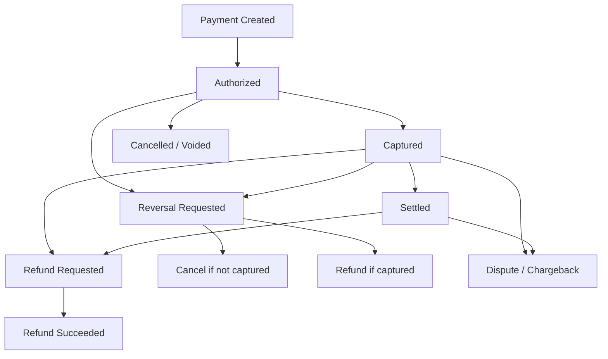
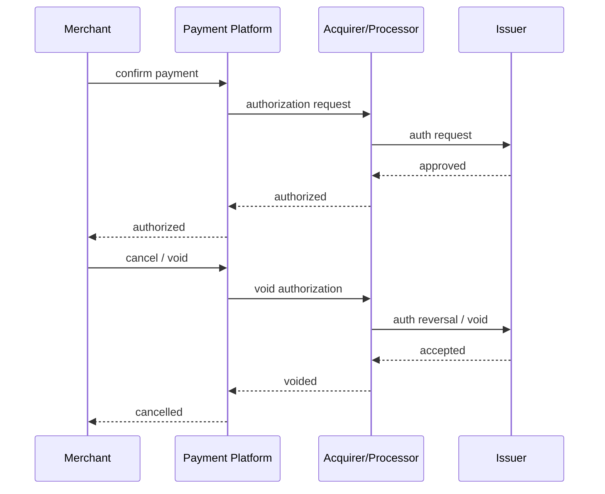
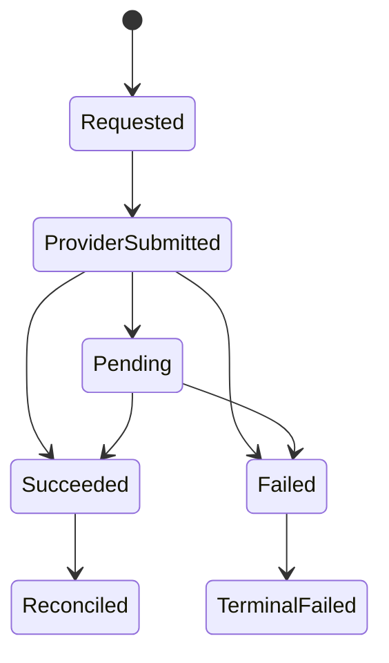
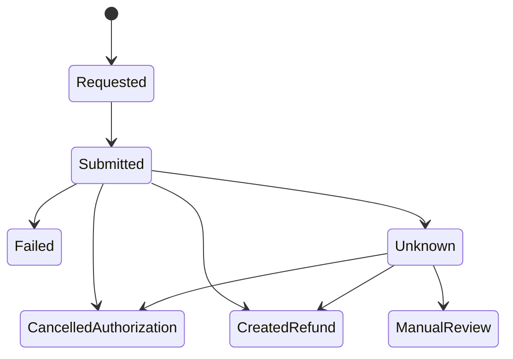
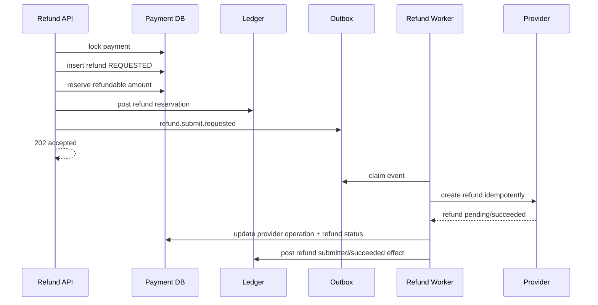

------
title: Build From Scratch: Large Production Grade Java Payment Systems - Part 035
description: Refund, cancellation, void, and reversal semantics for production Java payment systems, covering lifecycle boundaries, ledger effects, idempotency, provider differences, unknown states, and operational controls.
series: learn-java-payment-systems
seriesTitle: Build From Scratch: Large Production Grade Java Payment Systems
order: 35
partTitle: Refund, Cancellation, and Reversal Semantics
tags:
- java
- payments
- refund
- cancellation
- reversal
- void
- ledger
- payment-systems
- enterprise-architecture
date: 2026-07-02
---

# Part 035 — Refund, Cancellation, Void, and Reversal Semantics

Most payment bugs hide behind words that sound interchangeable.

```txt
cancel
void
reverse
refund
return
release
rollback
```

In a normal application, these words may all mean "undo".

In payment systems, they do not.

A cancellation may prevent money movement.
A void may release an authorization hold.
A reversal may undo an uncertain authorization or capture depending on rail/provider semantics.
A refund may create a new money movement after original capture/settlement.
A chargeback is not a refund.
A ledger correction is not a refund.
A database rollback is almost never a financial reversal.

This part builds the semantic model needed before implementing refund/cancel endpoints.

The goal is simple:

```txt
Never return money twice.
Never promise a refund that cannot be funded.
Never cancel a payment that already captured.
Never hide provider uncertainty behind a fake success status.
Never mutate history to pretend money did not move.
```

---

## 1. The Core Distinction: Prevent vs Undo vs Compensate

The first model:

```txt
cancel/void  = prevent completion of a not-yet-final payment
refund       = compensate after successful payment
reversal     = rail/provider-specific operation that may cancel or refund depending on state
adjustment   = internal accounting correction, not customer money movement by itself
chargeback   = issuer/network-driven dispute debit, not merchant-initiated refund
```

Payment systems are append-only in spirit. You do not erase facts.

If an authorization was approved, it happened.
If capture was requested, it happened.
If provider returned timeout, the request may have happened.
If settlement file later shows captured money, the ledger must reconcile it.

The domain therefore needs separate operations for separate financial effects.



The trap is implementing one endpoint:

```http
POST /payments/{id}/undo
```

That endpoint is not a payment operation. It is ambiguity as an API.

Production payment APIs should expose intent precisely:

```http
POST /payment-intents/{id}/cancel
POST /charges/{id}/refunds
POST /authorizations/{id}/void
POST /payments/{id}/reversals
POST /ledger-adjustments
```

Different payment rails use different names. Your internal model must still be precise.

---

## 2. Lifecycle Boundary: Operation Depends on Where the Payment Is

A payment operation is valid only in certain lifecycle states.

```txt
Before authorization    -> cancel intent locally
Authorized only         -> void/cancel authorization
Captured                -> refund, not void
Settled                 -> refund or dispute flow
Disputed                -> dispute handling; refund may be blocked or coordinated
Unknown                 -> resolve or use rail-specific reversal carefully
```

A useful matrix:

| Current State | Customer-Facing Goal | Correct Operation | Money Effect |
|---|---|---|---|
| `CREATED` | buyer abandons checkout | cancel intent | no provider money movement |
| `REQUIRES_ACTION` | buyer cancels auth step | cancel attempt/intent | no capture, maybe no auth |
| `AUTHORIZED` | merchant does not fulfill | void/cancel authorization | release hold; no captured funds |
| `CAPTURE_REQUESTED` | merchant wants to undo | usually unknown resolution first | capture may already happen |
| `CAPTURED` | merchant returns money | refund | new outbound customer money movement |
| `SETTLED` | merchant returns money | refund funded from merchant/platform | new outbound customer money movement |
| `REFUND_PENDING` | duplicate customer support request | return existing refund status | no duplicate refund |
| `DISPUTED` | merchant wants to appease customer | policy-dependent | may conflict with dispute lifecycle |
| `UNKNOWN` | customer/support asks to cancel | poll/reconcile/reversal depending rail | never pretend certainty |

One of the strongest invariants:

```txt
Operation legality is a function of payment state, rail semantics, provider evidence, and ledger state.
```

Not just local state.

---

## 3. Cancellation

Cancellation means the payment should not proceed.

There are two forms:

```txt
local cancellation
provider cancellation
```

### 3.1 Local Cancellation

A local cancellation happens before money-impacting provider action.

Example:

```txt
PaymentIntent CREATED
no attempt sent to provider
customer abandoned checkout
merchant cancels order
```

Ledger effect:

```txt
usually none
```

State effect:

```txt
CREATED -> CANCELLED
```

Evidence:

```txt
cancelled_by
cancel_reason
cancel_requested_at
idempotency_key
order_id
operator/user
```

### 3.2 Provider Cancellation

Provider cancellation happens after an external authorization or pending instruction exists.

Example:

```txt
card authorization approved but not captured
virtual account generated but merchant wants to close it
QR dynamic code generated but order expired
bank transfer instruction created but not paid
```

Ledger effect depends on whether the system posted a hold/reservation.

For card authorization:

```txt
authorize created hold/reservation
cancel/void releases hold/reservation
```

For asynchronous instructions:

```txt
cancel marks instruction no longer valid
late payment may still arrive
late payment must go to suspense/review/refund path
```

Cancellation does not guarantee the outside world obeys instantly.

---

## 4. Void

Void usually means cancel an authorization before capture.

In card rails, an authorization hold may exist on the cardholder account. A void/cancel requests release of that hold. It is not the same as refund because money was not captured yet.



A void is valuable because it avoids refund complexity.

But it has constraints:

```txt
void only works before capture
void may be time-limited
void may return async status
void may not instantly release customer-visible hold
void may fail after capture race
```

Internal model:

```java
public enum AuthorizationState {
    REQUESTED,
    APPROVED,
    VOID_REQUESTED,
    VOIDED,
    CAPTURE_REQUESTED,
    CAPTURED,
    EXPIRED,
    UNKNOWN
}
```

Do not model void as:

```java
payment.status = REFUNDED;
```

That is wrong. No captured funds were returned.

---

## 5. Refund

Refund is a new financial operation that returns value after a payment succeeded.

A refund is not deletion of the original payment.

Original sale:

```txt
customer paid merchant/platform
```

Refund:

```txt
merchant/platform returns money to customer
```

These are two facts.

A refund has its own lifecycle:



A refund needs its own aggregate:

```txt
refund_id
payment_id
charge_id
merchant_id
amount
currency
reason
status
provider_refund_id
idempotency_key
requested_by
created_at
updated_at
```

Why separate aggregate?

Because one payment can have multiple partial refunds.

```txt
Payment 100.00 USD
Refund A 20.00 USD
Refund B 15.00 USD
Refund C 65.00 USD
Total refunded = 100.00 USD
Further refund rejected
```

Invariant:

```txt
sum(successful_or_pending_refunds) <= refundable_amount
```

For production, include pending refunds in the check.

Bad:

```sql
SELECT SUM(amount) FROM refunds WHERE status = 'SUCCEEDED';
```

Then create another refund while first refund is pending.

Better:

```sql
SELECT SUM(amount)
FROM refunds
WHERE payment_id = :payment_id
  AND status IN ('REQUESTED', 'PROVIDER_SUBMITTED', 'PENDING', 'SUCCEEDED');
```

Then lock the refundable source row or use a reservation table.

---

## 6. Refundable Amount Is Not Just Captured Minus Refunded

Naive formula:

```txt
refundable_amount = captured_amount - refunded_amount
```

Production formula may involve:

```txt
captured amount
minus existing refund reservations
minus succeeded refunds
minus chargebacked amount
minus dispute-held amount
minus non-refundable fee portion
minus merchant reserve policy
minus settlement/payout availability constraints
minus currency/FX limitations
```

Better model:

```txt
technical_refundable_amount = captured - refund_reserved - refund_succeeded - chargebacked
fundable_refundable_amount  = min(technical_refundable_amount, available_funding_source)
policy_refundable_amount    = apply merchant/refund policy/legal/compliance constraints
```

Refund validation should ask three questions:

```txt
Is it technically valid?
Is it fundable?
Is it allowed by policy?
```

Example:

```txt
Captured: 100.00
Refunded: 0.00
Merchant available balance: 10.00
Refund request: 100.00
```

Possible policy outcomes:

```txt
allow and create merchant negative balance
allow and debit platform advance account
reject insufficient available balance
hold refund for review
reserve from future settlement
```

Do not hide this inside a boolean method called `canRefund()`.

Model the decision explicitly.

```java
public record RefundEligibility(
        boolean eligible,
        Money technicalMax,
        Money fundableMax,
        List<RefundBlocker> blockers,
        RefundFundingPlan fundingPlan
) {}
```

---

## 7. Reversal

Reversal is a dangerous word because providers and rails define it differently.

A practical internal definition:

```txt
reversal = request to undo a previous provider operation when the platform cannot or should not choose between cancel and refund with certainty
```

Some providers expose a reversal/cancel-or-refund operation:

```txt
if not captured -> cancel
if captured     -> refund
```

This is useful when local state is uncertain.

Example:

```txt
capture request timed out
merchant wants to cancel order
platform does not know if capture happened
```

Bad behavior:

```txt
local status = CAPTURE_FAILED
customer told no charge happened
later provider webhook says captured
settlement file includes capture
```

Better behavior:

```txt
local status = CAPTURE_UNKNOWN
submit reversal/cancel-or-refund if rail supports it
or poll provider until final state
or quarantine for manual review
```

A reversal request must be idempotent.

```txt
same payment_id + same reversal_reason + same provider operation target
must not create multiple refunds
```

Internal reversal lifecycle:



A reversal may result in:

```txt
voided authorization
refund created
no-op because already cancelled
manual review because provider state inconsistent
```

So the reversal result type must be explicit.

```java
public sealed interface ReversalOutcome {
    record AuthorizationCancelled(String providerRef) implements ReversalOutcome {}
    record RefundCreated(String providerRefundRef, Money amount) implements ReversalOutcome {}
    record AlreadyReversed(String providerRef) implements ReversalOutcome {}
    record Unknown(String operationRef) implements ReversalOutcome {}
    record Failed(String code, String message) implements ReversalOutcome {}
}
```

---

## 8. Database Model

A good model separates original payment, provider operation, refund, reversal, and ledger journal.

```sql
CREATE TABLE payment (
    id UUID PRIMARY KEY,
    merchant_id UUID NOT NULL,
    amount_minor BIGINT NOT NULL,
    currency CHAR(3) NOT NULL,
    status TEXT NOT NULL,
    captured_amount_minor BIGINT NOT NULL DEFAULT 0,
    refunded_reserved_minor BIGINT NOT NULL DEFAULT 0,
    refunded_succeeded_minor BIGINT NOT NULL DEFAULT 0,
    version BIGINT NOT NULL DEFAULT 0,
    created_at TIMESTAMPTZ NOT NULL DEFAULT now(),
    updated_at TIMESTAMPTZ NOT NULL DEFAULT now(),
    CHECK (amount_minor > 0),
    CHECK (captured_amount_minor >= 0),
    CHECK (refunded_reserved_minor >= 0),
    CHECK (refunded_succeeded_minor >= 0),
    CHECK (refunded_reserved_minor + refunded_succeeded_minor <= captured_amount_minor)
);

CREATE TABLE payment_refund (
    id UUID PRIMARY KEY,
    payment_id UUID NOT NULL REFERENCES payment(id),
    merchant_id UUID NOT NULL,
    amount_minor BIGINT NOT NULL,
    currency CHAR(3) NOT NULL,
    status TEXT NOT NULL,
    reason TEXT NOT NULL,
    provider_id TEXT,
    provider_refund_id TEXT,
    idempotency_key TEXT NOT NULL,
    request_fingerprint TEXT NOT NULL,
    requested_by_type TEXT NOT NULL,
    requested_by_id TEXT NOT NULL,
    created_at TIMESTAMPTZ NOT NULL DEFAULT now(),
    updated_at TIMESTAMPTZ NOT NULL DEFAULT now(),
    CHECK (amount_minor > 0),
    UNIQUE (merchant_id, idempotency_key),
    UNIQUE (provider_id, provider_refund_id)
);

CREATE TABLE payment_reversal (
    id UUID PRIMARY KEY,
    payment_id UUID NOT NULL REFERENCES payment(id),
    target_operation_id UUID,
    status TEXT NOT NULL,
    requested_reason TEXT NOT NULL,
    outcome_type TEXT,
    linked_refund_id UUID REFERENCES payment_refund(id),
    provider_operation_ref TEXT,
    idempotency_key TEXT NOT NULL,
    request_fingerprint TEXT NOT NULL,
    created_at TIMESTAMPTZ NOT NULL DEFAULT now(),
    updated_at TIMESTAMPTZ NOT NULL DEFAULT now(),
    UNIQUE (payment_id, idempotency_key)
);

CREATE TABLE provider_operation (
    id UUID PRIMARY KEY,
    payment_id UUID NOT NULL REFERENCES payment(id),
    operation_type TEXT NOT NULL,
    provider_id TEXT NOT NULL,
    provider_operation_ref TEXT,
    status TEXT NOT NULL,
    request_hash TEXT NOT NULL,
    response_hash TEXT,
    error_code TEXT,
    error_class TEXT,
    started_at TIMESTAMPTZ NOT NULL DEFAULT now(),
    completed_at TIMESTAMPTZ,
    UNIQUE (provider_id, provider_operation_ref)
);
```

Notice the split:

```txt
payment_refund = domain object customer/merchant cares about
provider_operation = technical evidence of request/response
ledger_journal = financial posting truth
```

Do not use one table to represent all three.

---

## 9. Refund Reservation Pattern

Without reservation, concurrent refunds cause over-refund.

Race:

```txt
Payment captured = 100
Refund A reads refunded = 0, approves 80
Refund B reads refunded = 0, approves 80
Total refund = 160
```

Use one of two approaches.

### 9.1 Lock Payment Row

```sql
BEGIN;

SELECT *
FROM payment
WHERE id = :payment_id
FOR UPDATE;

-- compute remaining refundable
-- insert refund in REQUESTED
-- increment refunded_reserved_minor

COMMIT;
```

Simple and effective per payment.

### 9.2 Reservation Ledger

For complex platforms, make refund reservation itself a ledger posting.

```txt
Dr Merchant Refund Reserve
Cr Merchant Available/Pending Payable
```

When refund succeeds:

```txt
Dr Customer Refund Clearing
Cr Merchant Refund Reserve
```

When refund fails:

```txt
Dr Merchant Available/Pending Payable
Cr Merchant Refund Reserve
```

This gives stronger explainability.

Use row locks for local atomicity and ledger entries for financial evidence.

---

## 10. Ledger Effects

### 10.1 Authorization Void

If the platform posts authorization holds:

Authorization:

```txt
Dr Customer Authorized Receivable      100
Cr Merchant Pending Authorization      100
```

Void:

```txt
Dr Merchant Pending Authorization      100
Cr Customer Authorized Receivable      100
```

Some platforms do not ledger card authorization because no funds are captured. Even then, they often maintain operational reservation/fulfillment hold.

The decision depends on whether authorization affects merchant/customer visible balance or fulfillment decision.

### 10.2 Refund Before Settlement

Sale captured but not yet settled:

```txt
Dr Processor Receivable                100
Cr Merchant Pending Payable            100
```

Refund:

```txt
Dr Merchant Pending Payable             20
Cr Customer Refund Clearing             20
```

Provider confirms refund:

```txt
Dr Customer Refund Clearing             20
Cr Processor Receivable                 20
```

### 10.3 Refund After Settlement and Payout

If merchant has already been paid out:

```txt
Dr Merchant Refund Receivable           20
Cr Customer Refund Clearing             20
```

Then recover from future settlement:

```txt
Dr Merchant Payable                     20
Cr Merchant Refund Receivable           20
```

Or allow negative balance.

### 10.4 Chargeback Is Not Refund

Chargeback debit:

```txt
Dr Merchant Chargeback Loss/Receivable 100
Cr Processor/Bank Settlement Account   100
```

Chargeback fee:

```txt
Dr Merchant Fee Receivable              15
Cr Platform Fee Revenue                 15
```

If the merchant also refunds the customer independently, the system must detect duplicate customer credit risk.

---

## 11. API Design

### 11.1 Cancel Payment Intent

```http
POST /v1/payment-intents/{paymentIntentId}/cancel
Idempotency-Key: pi_cancel_20260702_001
Content-Type: application/json

{
  "reason": "customer_abandoned_checkout"
}
```

Response:

```json
{
  "id": "pi_123",
  "status": "cancelled",
  "cancellation": {
    "reason": "customer_abandoned_checkout",
    "cancelledAt": "2026-07-02T10:00:00Z"
  }
}
```

### 11.2 Create Refund

```http
POST /v1/payments/{paymentId}/refunds
Idempotency-Key: refund_order_789_return_1
Content-Type: application/json

{
  "amount": {
    "valueMinor": 2000,
    "currency": "USD"
  },
  "reason": "requested_by_customer",
  "merchantReference": "return-rma-456"
}
```

Response:

```json
{
  "id": "rf_123",
  "paymentId": "pay_123",
  "amount": {
    "valueMinor": 2000,
    "currency": "USD"
  },
  "status": "pending",
  "reason": "requested_by_customer"
}
```

### 11.3 Request Reversal

```http
POST /v1/payments/{paymentId}/reversals
Idempotency-Key: reverse_capture_unknown_001
Content-Type: application/json

{
  "targetOperationId": "op_capture_123",
  "reason": "capture_outcome_unknown_order_cancelled"
}
```

Response should not pretend finality unless finality exists.

```json
{
  "id": "rev_123",
  "paymentId": "pay_123",
  "status": "submitted",
  "outcome": "unknown"
}
```

---

## 12. Java Domain Model

```java
public enum MoneyReturnKind {
    CANCEL_INTENT,
    VOID_AUTHORIZATION,
    REFUND_CAPTURED_PAYMENT,
    REVERSAL_UNKNOWN_CAPTURE_STATE,
    LEDGER_ADJUSTMENT
}

public record RefundRequest(
        PaymentId paymentId,
        Money amount,
        RefundReason reason,
        IdempotencyKey idempotencyKey,
        RequestFingerprint fingerprint,
        Actor requestedBy
) {}

public final class RefundService {
    private final PaymentRepository payments;
    private final RefundRepository refunds;
    private final LedgerPostingService ledger;
    private final ProviderRefundPort provider;

    public RefundResult createRefund(RefundRequest request) {
        return payments.withLockedPayment(request.paymentId(), payment -> {
            RefundId existing = refunds.findByIdempotencyKey(
                    payment.merchantId(),
                    request.idempotencyKey()
            );
            if (existing != null) {
                return refunds.resultOf(existing, request.fingerprint());
            }

            RefundEligibility eligibility = payment.evaluateRefund(request.amount());
            if (!eligibility.eligible()) {
                throw new RefundNotAllowedException(eligibility.blockers());
            }

            Refund refund = Refund.requested(
                    request.paymentId(),
                    request.amount(),
                    request.reason(),
                    request.idempotencyKey(),
                    request.fingerprint(),
                    request.requestedBy()
            );

            payment.reserveRefund(request.amount());
            refunds.insert(refund);
            payments.save(payment);

            ledger.postRefundReservation(refund.id(), payment.id(), request.amount());
            return RefundResult.accepted(refund.id());
        });
    }
}
```

Important: provider call is not inside the database transaction unless you have a very specific, bounded reason. Prefer:

```txt
transaction:
  create refund REQUESTED
  reserve amount
  post reservation ledger
  write outbox refund.submit.requested

async worker:
  call provider
  update refund/provider operation
  post success/failure ledger
```

---

## 13. Refund Worker Flow



Why async?

Because provider may timeout, return pending, retry webhook, or succeed after API caller disconnected.

The API response should say what is true:

```txt
refund request accepted
not necessarily money returned
```

---

## 14. Unknown Outcome Handling

Unknown outcome is common during refund and reversal.

Examples:

```txt
provider timeout after refund request
HTTP 500 but provider created refund
network disconnect after provider processed request
webhook arrives before API response
settlement file contains refund not known locally
```

Never solve this by sending another refund blindly.

Resolution order:

```txt
1. check local provider_operation by idempotency key/reference
2. query provider by provider operation reference if available
3. query provider by merchant reference/idempotency key if supported
4. wait for webhook if provider guarantee exists
5. reconcile against settlement/report file
6. manual review only if evidence remains inconsistent
```

Status model:

```txt
REFUND_SUBMIT_UNKNOWN
REFUND_PENDING
REFUND_SUCCEEDED
REFUND_FAILED
REFUND_RECONCILED
REFUND_MANUAL_REVIEW
```

Unknown is not failed.

Unknown means:

```txt
money may already move; do not duplicate operation
```

---

## 15. Webhook Interactions

Provider webhook may arrive:

```txt
before API response
after API response
multiple times
out of order
without original request known locally
with amount mismatch
with terminal status after local timeout
```

Webhook handler must be idempotent.

```java
public void onRefundWebhook(ProviderRefundEvent event) {
    rawEvents.storeIfNew(event.rawId(), event.payload(), event.signature());

    ProviderRefundRef ref = event.providerRefundRef();
    Refund refund = refunds.findByProviderRef(ref)
            .orElseGet(() -> refunds.createFromUnmatchedProviderRefund(event));

    refund.apply(event.normalizedStatus(), event.amount(), event.occurredAt());
    refunds.save(refund);

    ledger.postIdempotently(
            LedgerIntent.refundProviderEvent(refund.id(), event.eventId()),
            postingRules.forRefundEvent(refund, event)
    );
}
```

Unmatched provider refund must not be discarded.

It goes to:

```txt
unmatched_refund_event
suspense ledger account if financial effect is confirmed
manual review queue
reconciliation break
```

---

## 16. Refund Policy Engine

Refund is not always a purely technical operation.

Policy dimensions:

```txt
payment method
rail/provider
merchant category
merchant risk tier
order age
settlement status
payout status
dispute status
fraud status
amount
currency
country
customer account status
operator role
refund reason
```

Examples:

```txt
No refund after 180 days for provider X.
Refund above 5,000 USD requires approval.
Refund after chargeback opened requires dispute team approval.
Refund for high-risk merchant after payout creates reserve debit.
Refund to closed card may require provider-specific handling.
Partial refund of tax/fee follows merchant policy.
```

Model policy as decision output, not exception text.

```java
public record RefundPolicyDecision(
        RefundPolicyOutcome outcome,
        List<RefundPolicyReason> reasons,
        ApprovalRequirement approvalRequirement,
        RefundFundingStrategy fundingStrategy
) {}
```

This lets backoffice explain:

```txt
Refund blocked because payment is under active chargeback.
Refund requires approval because amount exceeds operator limit.
Refund accepted but funded from merchant negative balance.
```

---

## 17. Backoffice Operations

Support teams will need refund tools.

Do not give them a raw SQL console.

Minimum controls:

```txt
search payment/refund by customer/order/provider reference
show captured/refunded/refundable/fundable amounts
show dispute/chargeback risk
show settlement/payout status
show provider operation history
show ledger postings
show refund policy decision
require reason code
require maker-checker for high-value refund
apply operator limit
create audit event
idempotency key generated by action context
support dry-run eligibility check
```

Backoffice refund API:

```http
POST /internal/refund-requests

{
  "paymentId": "pay_123",
  "amount": {"valueMinor": 10000, "currency": "USD"},
  "reason": "merchant_customer_service_goodwill",
  "evidenceCaseId": "case_456"
}
```

If approval needed:

```json
{
  "status": "requires_approval",
  "approvalId": "appr_123",
  "reasons": ["operator_limit_exceeded"]
}
```

---

## 18. Testing Matrix

### 18.1 Legality Tests

```txt
cancel CREATED -> allowed
cancel CAPTURED -> rejected or mapped to refund only by explicit API
void AUTHORIZED -> allowed
void CAPTURED -> rejected
refund CAPTURED -> allowed
refund AUTHORIZED -> rejected
refund after full refund -> rejected
partial refund after partial refund -> allowed within cap
refund during dispute -> policy-dependent
reversal UNKNOWN_CAPTURE -> allowed if provider supports it
```

### 18.2 Concurrency Tests

```txt
two 80 refunds on 100 payment -> one accepted, one rejected
same idempotency key repeated -> same refund returned
same provider webhook repeated -> one ledger posting
timeout then webhook success -> final success, no duplicate refund
timeout then retry same idempotency -> same provider refund
manual operator double-click -> one refund request
```

### 18.3 Provider Simulation Tests

```txt
provider returns success immediately
provider returns pending then webhook success
provider returns timeout then later success webhook
provider returns 500 but creates refund
provider returns duplicate request as same refund
provider creates refund but webhook lost; reconciliation imports report
provider says refund failed after reservation
```

### 18.4 Ledger Property Tests

Properties:

```txt
all refund journals balance to zero
refunded amount never exceeds captured amount unless explicit over-refund policy exists
refund failure releases reservation
refund success consumes reservation
reconciliation does not create duplicate journal
manual adjustment does not mutate original payment journal
```

---

## 19. Failure Model

| Failure | Naive System | Production System |
|---|---|---|
| Duplicate refund API call | creates two refunds | idempotency returns same refund |
| Refund timeout | marks failed | marks unknown and resolves |
| Capture/refund race | inconsistent state | lock + legal transition check |
| Webhook before API response | ignored | correlates by provider ref / operation ref |
| Late payment after VA cancelled | lost or incorrectly cancelled | suspense + review/refund |
| Refund after chargeback | double customer credit | policy blocks or coordinates |
| Provider reversal creates refund | local model says cancelled | outcome links reversal to refund aggregate |
| Refund succeeds after merchant payout | unexplained negative balance | merchant receivable/negative balance posting |

---

## 20. Common Anti-Patterns

### 20.1 Treating Refund as Negative Payment

Bad:

```txt
insert payment amount = -100
```

Why bad:

```txt
loses refund lifecycle
hides provider operation
breaks merchant statement
breaks dispute evidence
makes reconciliation ambiguous
```

### 20.2 Updating Captured Amount Downward

Bad:

```sql
UPDATE payment SET captured_amount = captured_amount - refund_amount;
```

Captured amount is historical fact.

Refund is another fact.

### 20.3 Calling Provider Before Reserving Refund Amount

Bad:

```txt
provider refund first
then update local database
```

If DB update fails, provider already moved money.

Reserve locally first, use outbox, then call provider.

### 20.4 Marking Timeout as Failed

Timeout is not failure. Timeout is uncertainty.

### 20.5 One Generic `status = reversed`

`reversed` hides:

```txt
authorization cancelled?
refund created?
chargeback won?
ledger corrected?
provider operation voided?
```

Do not hide financial semantics behind one vague terminal state.

---

## 21. Build Order

Implement in this order:

```txt
1. Define operation vocabulary: cancel, void, refund, reversal, adjustment.
2. Define legal state transition matrix.
3. Implement refundable amount calculation.
4. Add refund aggregate and idempotency.
5. Add refund reservation with row lock.
6. Add refund ledger posting rules.
7. Add provider refund worker through outbox.
8. Add webhook idempotent status application.
9. Add unknown outcome resolver.
10. Add reconciliation import for refund reports.
11. Add backoffice refund with policy decision.
12. Add approval controls for risky refunds.
```

Do not start with provider API integration. Start with semantic correctness.

---

## 22. Readiness Checklist

A production refund/cancel/reversal subsystem is not ready until:

```txt
[ ] refund and cancel are separate domain operations
[ ] void/cancel cannot be used after capture
[ ] refund cannot exceed refundable amount under concurrency
[ ] pending refunds reserve amount
[ ] timeout creates unknown, not failed
[ ] provider operation log stores request/response/evidence
[ ] webhook deduplication is implemented
[ ] provider refund status is normalized
[ ] ledger posting is idempotent
[ ] chargeback/refund conflict policy exists
[ ] merchant funding/negative balance policy exists
[ ] backoffice requires reason and audit trail
[ ] high-risk refund requires approval
[ ] reconciliation can discover missing refunds
[ ] support can explain every customer credit
```

---

## 23. What You Should Internalize

Refund/cancel/reversal is not an "undo" feature.

It is a set of financial operations with different meanings:

```txt
cancel prevents
void releases
refund compensates
reversal resolves ambiguity according to rail semantics
adjustment corrects internal accounting
chargeback is external dispute debit
```

If you model them as one thing, the platform will eventually double refund, misstate balances, or lie to support and finance.

A top-level payment engineer thinks in terms of:

```txt
state legality
provider evidence
ledger effect
funding source
idempotency
reconciliation
operator auditability
```

That is the difference between a demo payment integration and a production payment platform.

---

## References

- Stripe Docs — Refund and cancel payments.
- Stripe API Reference — Cancel a PaymentIntent.
- Stripe API Reference — Capture a PaymentIntent.
- Adyen Docs — Reversal.
- Adyen Docs — Refund.
- Martin Fowler — Accounting Transaction.
- PostgreSQL Documentation — Explicit Locking.
