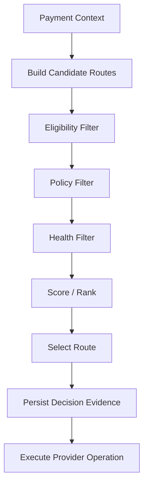
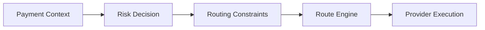

------
title: Build From Scratch: Large Production Grade Java Payment Systems - Part 036
description: Payment routing engine design for enterprise Java payment systems, covering eligibility, ranking, provider health, cost, success rate, risk, BIN, currency, fallback, experimentation, and deterministic routing evidence.
series: learn-java-payment-systems
seriesTitle: Build From Scratch: Large Production Grade Java Payment Systems
order: 36
partTitle: Payment Routing Engine
tags:
- java
- payments
- payment-routing
- orchestration
- risk
- provider-routing
- payment-systems
- enterprise-architecture
date: 2026-07-02
---

# Part 036 — Payment Routing Engine

A payment routing engine answers one deceptively simple question:

```txt
Where should this payment attempt go?
```

Naive answer:

```txt
always Provider A
```

Slightly better answer:

```txt
if Provider A fails, use Provider B
```

Production answer:

```txt
choose an eligible route based on payment method, currency, country, merchant capability,
provider capability, BIN/card attributes, risk, cost, success rate, latency, health,
contractual constraints, compliance constraints, retry history, and operational policy;
then preserve the decision evidence so the platform can explain and replay it later.
```

Routing is not just optimization.

It is a financial control plane.

A bad routing decision can cause:

```txt
declined payments
higher processing cost
fraud exposure
compliance breach
duplicate charge through unsafe retry
provider outage blast radius
unexplainable merchant settlement
incorrect payment method display
```

This part builds a production-grade routing engine for a Java payment platform.

---

## 1. Mental Model: Routing Is a Decision, Not an If-Else

A routing decision should be treated as a domain artifact.

```txt
input context + rule/policy version + observed metrics + candidate routes -> selected route + explanation
```

You should be able to answer later:

```txt
Why did payment pay_123 go to provider_adyen instead of provider_stripe?
Why was bank transfer hidden for this customer?
Why did we retry on Provider B after Provider A timeout?
Why did high-risk merchant traffic stop using route X?
Why did authorization rate drop after rule release 2026.07.02?
```

So the output is not just:

```java
ProviderId provider = chooseProvider(payment);
```

It is:

```java
public record RouteDecision(
        RouteDecisionId id,
        PaymentAttemptId attemptId,
        List<RouteCandidate> evaluatedCandidates,
        RouteCandidate selectedCandidate,
        RouteDecisionReason reason,
        RoutingPolicyVersion policyVersion,
        MetricsSnapshot metricsSnapshot,
        Instant decidedAt
) {}
```

The routing engine is a deterministic decision function around changing inputs.

```txt
same input + same policy version + same metric snapshot = same decision
```

This is how routing becomes auditable.

---

## 2. What Is a Route?

A route is not only provider.

A route may include:

```txt
provider
merchant account / sub-merchant account
acquirer
payment method
card brand/network
capture mode
authentication strategy
currency handling
settlement currency
MCC / merchant category
risk mode
processor endpoint
credential set
fee plan
settlement account
```

Example route:

```json
{
  "provider": "adyen",
  "providerMerchantAccount": "platform_us_cards_high_volume",
  "paymentMethodFamily": "card",
  "cardNetwork": "visa",
  "authCaptureMode": "manual_capture",
  "settlementCurrency": "USD",
  "riskProfile": "standard",
  "credentialProfile": "adyen-us-prod-2026q3"
}
```

Another route:

```json
{
  "provider": "bank_partner_a",
  "rail": "instant_credit_transfer",
  "scheme": "BI_FAST",
  "settlementAccount": "id_bifast_operational_001",
  "riskProfile": "low_value_transfer",
  "cutoffMode": "always_on"
}
```

A route is a complete execution plan, not just a URL.

---

## 3. Routing Pipeline

The engine has stages.



A clean pipeline:

```txt
candidate generation
eligibility filtering
policy filtering
health filtering
scoring/ranking
selection
persistence
execution
```

Do not mix these stages into one 900-line method.

---

## 4. Payment Context

The router needs a normalized context.

```java
public record RoutingContext(
        PaymentIntentId paymentIntentId,
        PaymentAttemptId attemptId,
        MerchantId merchantId,
        Money amount,
        CustomerContext customer,
        PaymentMethodContext paymentMethod,
        OrderContext order,
        RiskContext risk,
        RetryContext retry,
        FulfillmentContext fulfillment,
        Instant requestedAt
) {}
```

Important fields:

```txt
merchant country
merchant capabilities
merchant risk tier
merchant MCC/category
customer country
billing/shipping country
IP/device country
currency
amount
payment method family
card BIN/IIN metadata
card brand
card funding type
issuer country
wallet type
prior attempt result
provider outage state
authentication result
capture mode
settlement preference
```

Routing quality depends on context quality.

Garbage context gives garbage route.

---

## 5. Candidate Generation

Candidate generation answers:

```txt
Which routes might possibly process this payment?
```

Example table:

```sql
CREATE TABLE payment_route (
    id UUID PRIMARY KEY,
    provider_id TEXT NOT NULL,
    provider_merchant_account TEXT NOT NULL,
    payment_method_family TEXT NOT NULL,
    country TEXT,
    currency CHAR(3),
    card_brand TEXT,
    merchant_risk_tier TEXT,
    capture_mode TEXT,
    enabled BOOLEAN NOT NULL DEFAULT true,
    priority INT NOT NULL DEFAULT 100,
    created_at TIMESTAMPTZ NOT NULL DEFAULT now(),
    updated_at TIMESTAMPTZ NOT NULL DEFAULT now()
);

CREATE INDEX idx_payment_route_lookup
ON payment_route(payment_method_family, country, currency, enabled);
```

Candidate generation should be broad enough not to exclude valid routes too early.

It should not decide best route.

It should produce candidates.

---

## 6. Eligibility Filter

Eligibility means the route can legally/technically process the payment.

Examples:

```txt
provider supports payment method
provider supports currency
provider supports merchant country
provider supports customer country
provider supports amount range
provider supports capture mode
provider supports refund/partial capture if required
merchant is onboarded for provider route
merchant capability is active
credential exists and is valid
card network supported
wallet supported
rail availability window allows processing
```

Eligibility result should carry reasons.

```java
public record EligibilityResult(
        RouteCandidate candidate,
        boolean eligible,
        List<IneligibilityReason> reasons
) {}
```

Example reasons:

```txt
currency_not_supported
merchant_not_onboarded
amount_below_minimum
amount_above_maximum
payment_method_disabled
provider_credential_missing
capture_mode_not_supported
country_not_supported
```

Never silently drop candidates.

You need explainability.

---

## 7. Policy Filter

Policy is not the same as eligibility.

Eligibility asks:

```txt
Can this route process the payment?
```

Policy asks:

```txt
Should this route be allowed for this business/risk/compliance context?
```

Policy examples:

```txt
Do not route high-risk MCC to provider X.
Do not route EU cards to non-EU acquirer for this merchant group.
Use local acquiring when available for issuer country.
Block route Y for merchant under compliance review.
Disable instant payout route for merchant risk tier HIGH.
Do not retry hard declines on another provider.
Route low-value transactions to low-cost provider.
Force provider A for merchant contract group Enterprise-001.
```

Represent policy as versioned rules.

```sql
CREATE TABLE routing_policy_version (
    id UUID PRIMARY KEY,
    version TEXT NOT NULL UNIQUE,
    status TEXT NOT NULL,
    effective_from TIMESTAMPTZ NOT NULL,
    created_by TEXT NOT NULL,
    created_at TIMESTAMPTZ NOT NULL DEFAULT now()
);

CREATE TABLE routing_rule (
    id UUID PRIMARY KEY,
    policy_version_id UUID NOT NULL REFERENCES routing_policy_version(id),
    rule_name TEXT NOT NULL,
    priority INT NOT NULL,
    condition_json JSONB NOT NULL,
    action_json JSONB NOT NULL,
    enabled BOOLEAN NOT NULL DEFAULT true
);
```

A policy rule should not be a hidden Java deploy every time.

But also do not create a chaotic no-code rules system without testing/versioning.

For payment routing, rule changes are production risk.

---

## 8. Health Filter

Provider health is not binary.

Health dimensions:

```txt
availability
latency
timeout rate
authorization success rate
error code distribution
webhook delay
settlement/report delay
refund API health
capture API health
provider incident/manual override
regional degradation
merchant-specific degradation
payment-method-specific degradation
```

A provider can be healthy for refunds but unhealthy for authorizations.
A provider can be healthy for cards but unhealthy for wallets.
A provider can be healthy globally but failing for one region.

Model health by route segment.

```java
public record RouteHealth(
        RouteId routeId,
        OperationType operationType,
        HealthState state,
        double successRate5m,
        double timeoutRate5m,
        double p95LatencyMs,
        int consecutiveFailures,
        Instant measuredAt
) {}
```

Health states:

```txt
HEALTHY
DEGRADED
PROBATION
DISABLED_AUTOMATIC
DISABLED_MANUAL
```

Manual disable must override scoring.

```txt
incident commander disabled route -> router must not select it
```

---

## 9. Scoring and Ranking

Once candidates are eligible and allowed, rank them.

Factors:

```txt
expected authorization success
processing cost
latency
risk score
provider health
merchant preference
local acquiring benefit
retry suitability
settlement speed
refund/dispute capability
contractual volume commitments
```

Simple scoring:

```txt
score =
  success_weight * normalized_success_rate
- cost_weight    * normalized_cost
- latency_weight * normalized_latency
- risk_weight    * normalized_risk_penalty
+ preference_bonus
- degradation_penalty
```

Do not start with ML.

Start with transparent rule-based scoring.

```java
public final class RouteScorer {
    public ScoredRoute score(RouteCandidate c, RoutingContext ctx, MetricsSnapshot m) {
        BigDecimal score = BigDecimal.ZERO;

        score = score.add(weight("success").multiply(m.successRate(c.routeId())));
        score = score.subtract(weight("cost").multiply(c.estimatedCost().normalized()));
        score = score.subtract(weight("latency").multiply(m.latencyPenalty(c.routeId())));
        score = score.subtract(weight("risk").multiply(ctx.risk().routePenalty(c.routeId())));
        score = score.add(c.preferenceBonus(ctx.merchantId()));

        return new ScoredRoute(c, score, explanation(c, ctx, m, score));
    }
}
```

The explanation is not optional.

```json
{
  "selectedRoute": "route_cards_us_adyen_001",
  "score": "0.8421",
  "reasons": [
    "eligible_for_currency_usd",
    "merchant_onboarded",
    "provider_healthy",
    "higher_success_rate_15m",
    "cost_within_policy"
  ],
  "rejectedCandidates": [
    {
      "route": "route_cards_us_provider_b_001",
      "reason": "provider_degraded_timeout_rate"
    }
  ]
}
```

---

## 10. Cost Model

Payment routing often optimizes cost.

Cost may include:

```txt
MDR
interchange estimate
scheme fee
provider markup
cross-border fee
FX spread
refund fee
chargeback fee expectation
minimum fee
monthly volume commitment
local acquiring benefit
settlement delay cost
operational/reconciliation cost
```

Cost is not always known exactly at authorization time.

Use estimate + later settlement truth.

```txt
estimated_route_cost_at_decision
actual_route_cost_after_settlement
variance
```

Cost model table:

```sql
CREATE TABLE route_cost_model (
    id UUID PRIMARY KEY,
    route_id UUID NOT NULL,
    version TEXT NOT NULL,
    effective_from TIMESTAMPTZ NOT NULL,
    condition_json JSONB NOT NULL,
    fixed_fee_minor BIGINT NOT NULL DEFAULT 0,
    variable_bps INT NOT NULL DEFAULT 0,
    min_fee_minor BIGINT,
    max_fee_minor BIGINT,
    currency CHAR(3) NOT NULL,
    created_at TIMESTAMPTZ NOT NULL DEFAULT now(),
    UNIQUE (route_id, version)
);
```

Never overwrite old cost models.

Routing decisions must preserve the cost model version used.

---

## 11. Success Rate Model

Authorization success rate is not global.

Bad metric:

```txt
Provider A success rate = 82%
```

Better metric:

```txt
Provider A success rate for:
  merchant segment = enterprise retail
  payment method = card
  card network = visa
  issuer country = ID
  currency = IDR
  amount bucket = 100k-500k
  last 15 minutes = 91.2%
```

But segmentation can become sparse.

Use fallback hierarchy:

```txt
exact segment metric
merchant + method + country
method + country
method global
provider global
```

Store metric confidence.

```java
public record SuccessMetric(
        RouteId routeId,
        MetricSegment segment,
        BigDecimal successRate,
        long sampleSize,
        Duration window,
        BigDecimal confidence
) {}
```

Do not route aggressively on 3 samples.

---

## 12. BIN/IIN and Card Attribute Routing

Card routing often uses card attributes:

```txt
BIN/IIN
card brand
issuer country
issuer bank
funding type: credit/debit/prepaid
commercial vs consumer
3DS capability
network token availability
local acquiring availability
```

Rules:

```txt
Use local acquirer for domestic issuer when available.
Avoid provider X for issuer bank Y if timeout spike detected.
Require 3DS route for high-risk BIN range.
Block prepaid cards for merchant category Z.
Prefer network token route if credential-on-file and token present.
```

Be careful with BIN data:

```txt
BIN ranges change
8-digit BIN migration exists in many card ecosystems
issuer metadata can be stale
card attributes are not always available before tokenization
```

Therefore:

```txt
BIN metadata is routing signal, not absolute truth unless contractually guaranteed
```

---

## 13. Risk-Aware Routing

Routing and risk are linked.

Risk engine may say:

```txt
allow
challenge with 3DS
manual review
block
route only through provider with stronger fraud tooling
route with manual capture
route with delayed fulfillment
```

Risk-aware route example:

```txt
low risk -> frictionless route, low cost provider
medium risk -> provider supporting 3DS/challenge
high risk -> block or manual review
merchant under investigation -> force manual capture
```

Never let routing bypass risk.

Pipeline:



Risk output becomes routing constraint.

```java
public record RiskRoutingConstraint(
        boolean require3ds,
        boolean requireManualCapture,
        Set<ProviderId> blockedProviders,
        Set<RouteCapability> requiredCapabilities,
        RiskAction action
) {}
```

---

## 14. Retry-Aware Routing

Retry is routing with history.

A retry should know:

```txt
previous provider
previous route
previous error code
previous error class
previous auth response code
whether decline was hard or soft
whether provider may have processed request
whether idempotency allows retry
whether customer action is required
whether retrying another provider is allowed
```

Bad:

```txt
Provider A timeout -> immediately charge via Provider B
```

Why bad:

```txt
Provider A may have authorized successfully
Provider B may also authorize
customer may see two holds/charges
```

Retry matrix:

| Previous Result | Same Provider Retry | Different Provider Retry | Notes |
|---|---:|---:|---|
| network connect failed before request write | maybe | maybe | depends on certainty request not sent |
| HTTP timeout after request sent | idempotent status check first | no until resolved | outcome unknown |
| provider 5xx with idempotency key | same key retry | no until known | provider may have created payment |
| soft decline insufficient funds | no immediate blind retry | usually no | may retry later/customer update |
| issuer unavailable | maybe route alternative | policy-dependent | ensure no prior auth |
| hard decline stolen card | no | no | risk/compliance block |
| provider manual outage before request | no | yes | safe fallback if no request sent |

The route engine needs retry context.

```java
public record RetryContext(
        int attemptNumber,
        List<PreviousRouteAttempt> previousAttempts,
        boolean previousOutcomeKnown,
        Optional<DeclineClassification> declineClassification
) {}
```

---

## 15. Fallback Routing

Fallback is not retry everything elsewhere.

Fallback is safe only when:

```txt
previous operation did not create financial effect
or previous outcome is known terminal failed
or rail/provider supports idempotent transfer of attempt semantics
or customer explicitly reattempts after clear failure
```

Fallback policy examples:

```txt
If provider disabled before request, use next eligible provider.
If provider returns retryable technical failure before auth created, use backup route.
If provider returns unknown, hold and resolve.
If provider returns hard decline, do not fallback.
If provider returns fraud decline, block.
If provider returns 3DS required, route to 3DS-capable flow.
```

Fallback must preserve evidence.

```txt
attempt_1 -> provider A -> result technical_failure_known_no_auth
attempt_2 -> provider B -> result authorized
```

Do not mutate attempt 1 into attempt 2.

---

## 16. Payment Method Display Routing

Routing begins before payment execution.

Checkout may ask:

```txt
Which payment methods should be shown to this customer?
```

This is not the same as provider route selection, but related.

Inputs:

```txt
merchant capability
customer country
currency
amount
device/channel
risk pre-score
payment method availability
provider availability
commercial preference
conversion expectations
```

Output:

```txt
eligible payment method list
ordering
method-specific display metadata
constraints/warnings
```

Example:

```json
{
  "paymentMethods": [
    {"type": "card", "rank": 1},
    {"type": "wallet", "rank": 2},
    {"type": "bank_transfer", "rank": 3}
  ],
  "policyVersion": "pm-display-2026.07.02"
}
```

Payment method display should be versioned, because it affects conversion and compliance.

Do not hardcode checkout order in frontend.

---

## 17. Route Decision Persistence

Persist the decision before execution.

```sql
CREATE TABLE route_decision (
    id UUID PRIMARY KEY,
    payment_attempt_id UUID NOT NULL,
    merchant_id UUID NOT NULL,
    selected_route_id UUID NOT NULL,
    policy_version TEXT NOT NULL,
    cost_model_version TEXT,
    metric_snapshot_id UUID,
    decision_context_hash TEXT NOT NULL,
    decision_json JSONB NOT NULL,
    selected_reason TEXT NOT NULL,
    created_at TIMESTAMPTZ NOT NULL DEFAULT now(),
    UNIQUE (payment_attempt_id)
);

CREATE TABLE route_decision_candidate (
    id UUID PRIMARY KEY,
    route_decision_id UUID NOT NULL REFERENCES route_decision(id),
    route_id UUID NOT NULL,
    eligible BOOLEAN NOT NULL,
    score NUMERIC(18,8),
    rejection_reasons JSONB NOT NULL DEFAULT '[]'::jsonb,
    explanation_json JSONB NOT NULL DEFAULT '{}'::jsonb
);
```

Decision evidence should include:

```txt
input context hash
candidate list
rejection reasons
scores
selected reason
policy version
cost model version
metric snapshot reference
manual override if any
operator/incident reference if any
```

This helps with:

```txt
merchant disputes
provider incident analysis
A/B experiment analysis
finance cost analysis
audit/compliance review
routing regression investigation
```

---

## 18. Routing Configuration Lifecycle

Routing config changes are dangerous.

Minimum lifecycle:

```txt
draft
validated
approved
scheduled
active
rolled back
archived
```

Controls:

```txt
schema validation
static rule conflict detection
simulation against historical traffic
approval workflow
canary rollout
shadow evaluation
automatic rollback threshold
full audit trail
```

Example validation:

```txt
No active route for IDR QR payment after rule change.
Provider X receives 100% traffic accidentally.
High-risk merchant route loses required 3DS capability.
Currency EUR routed to account settling only USD.
Rule priority creates unreachable fallback.
```

Build a route simulator before giving non-engineers route editing power.

---

## 19. Shadow Routing

Shadow routing means computing a decision without executing it.

```txt
production selected route: A
shadow policy selected route: B
execute A
record B for analysis
```

Use shadow mode for:

```txt
new scoring algorithm
new cost model
new provider onboarding
new policy version
new ML/bandit model
new health threshold
```

Schema:

```sql
CREATE TABLE route_shadow_decision (
    id UUID PRIMARY KEY,
    payment_attempt_id UUID NOT NULL,
    experiment_key TEXT NOT NULL,
    shadow_policy_version TEXT NOT NULL,
    selected_route_id UUID,
    decision_json JSONB NOT NULL,
    created_at TIMESTAMPTZ NOT NULL DEFAULT now()
);
```

Shadow routing prevents experimenting with real money before evidence exists.

---

## 20. Experimentation and Traffic Allocation

Routing experiments can improve success/cost, but they can also harm merchants.

Guardrails:

```txt
small initial allocation
merchant opt-in/segmenting
exclude high-risk or high-value payments
monitor auth rate and timeout rate
monitor chargeback/fraud delayed metrics
monitor settlement/reconciliation breaks
stop-loss threshold
manual kill switch
```

Traffic allocation:

```txt
hash(payment_intent_id + experiment_key) % 100 < allocation_percent
```

Do not randomize per retry attempt; that makes behavior unstable.

Use stable assignment.

```java
public boolean assignedToExperiment(PaymentIntentId id, String experimentKey, int percent) {
    int bucket = stableHash(id.value() + ":" + experimentKey) % 100;
    return bucket < percent;
}
```

Do not optimize only authorization success.

A route that improves auth success but doubles chargebacks may be worse.

---

## 21. Adaptive Routing Without Losing Control

Dynamic routing can use live metrics.

But payment systems need stability.

Problems with naive adaptive routing:

```txt
oscillation: all traffic moves to provider B, B degrades, traffic moves back
small sample overreaction
feedback loop caused by retry behavior
provider-specific decline code differences
cost ignored while chasing success
fraud delayed signal ignored
```

Controls:

```txt
minimum sample size
cooldown windows
maximum traffic shift per interval
confidence thresholds
manual override
route probation state
merchant-level caps
delayed fraud/dispute feedback
```

A safe adaptive system changes gradually.

```txt
Provider A success falls from 92% to 86% over 5 minutes.
Provider B is 91% with sufficient samples.
Shift 10% traffic to B.
Observe.
Shift another 10% if stable.
Do not instantly shift 100%.
```

---

## 22. Operational Overrides

There must be an emergency control plane.

Operations need to:

```txt
disable route globally
disable route for merchant
disable route for payment method
disable route for country/currency
force route for merchant temporarily
pause fallback
set provider to probation
add incident reference
schedule automatic expiry of override
```

Override table:

```sql
CREATE TABLE routing_override (
    id UUID PRIMARY KEY,
    scope_type TEXT NOT NULL,
    scope_value TEXT NOT NULL,
    action TEXT NOT NULL,
    route_id UUID,
    provider_id TEXT,
    payment_method_family TEXT,
    reason TEXT NOT NULL,
    incident_ref TEXT,
    effective_from TIMESTAMPTZ NOT NULL,
    expires_at TIMESTAMPTZ,
    created_by TEXT NOT NULL,
    approved_by TEXT,
    created_at TIMESTAMPTZ NOT NULL DEFAULT now()
);
```

Every override must expire or be reviewed.

Permanent emergency overrides become invisible architecture.

---

## 23. Java Architecture

Interfaces:

```java
public interface PaymentRouter {
    RouteDecision decide(RoutingContext context);
}

public interface CandidateRouteRepository {
    List<RouteCandidate> findCandidates(RoutingContext context);
}

public interface RouteEligibilityPolicy {
    EligibilityResult evaluate(RouteCandidate candidate, RoutingContext context);
}

public interface RoutingPolicyEngine {
    PolicyEvaluation evaluate(RouteCandidate candidate, RoutingContext context);
}

public interface RouteHealthProvider {
    RouteHealth getHealth(RouteId routeId, OperationType operationType);
}

public interface RouteScoringModel {
    ScoredRoute score(RouteCandidate candidate, RoutingContext context, MetricsSnapshot metrics);
}
```

Implementation skeleton:

```java
public final class DefaultPaymentRouter implements PaymentRouter {
    private final CandidateRouteRepository candidates;
    private final List<RouteEligibilityPolicy> eligibilityPolicies;
    private final RoutingPolicyEngine policyEngine;
    private final RouteHealthProvider healthProvider;
    private final RouteScoringModel scoringModel;
    private final RouteDecisionRepository decisions;
    private final RoutingClock clock;

    @Override
    public RouteDecision decide(RoutingContext context) {
        List<RouteCandidate> initial = candidates.findCandidates(context);

        List<EvaluatedRoute> evaluated = initial.stream()
                .map(candidate -> evaluate(candidate, context))
                .toList();

        List<ScoredRoute> scored = evaluated.stream()
                .filter(EvaluatedRoute::selectable)
                .map(e -> scoringModel.score(e.candidate(), context, e.metrics()))
                .sorted(Comparator.comparing(ScoredRoute::score).reversed())
                .toList();

        if (scored.isEmpty()) {
            RouteDecision noRoute = RouteDecision.noRoute(context, evaluated, clock.now());
            decisions.insert(noRoute);
            return noRoute;
        }

        RouteDecision decision = RouteDecision.selected(
                context,
                evaluated,
                scored.get(0),
                clock.now()
        );
        decisions.insert(decision);
        return decision;
    }

    private EvaluatedRoute evaluate(RouteCandidate candidate, RoutingContext context) {
        List<DecisionReason> reasons = new ArrayList<>();

        for (RouteEligibilityPolicy p : eligibilityPolicies) {
            EligibilityResult r = p.evaluate(candidate, context);
            reasons.addAll(r.reasons());
            if (!r.eligible()) {
                return EvaluatedRoute.rejected(candidate, reasons);
            }
        }

        PolicyEvaluation policy = policyEngine.evaluate(candidate, context);
        reasons.addAll(policy.reasons());
        if (!policy.allowed()) {
            return EvaluatedRoute.rejected(candidate, reasons);
        }

        RouteHealth health = healthProvider.getHealth(candidate.routeId(), context.operationType());
        if (health.state() == HealthState.DISABLED_MANUAL || health.state() == HealthState.DISABLED_AUTOMATIC) {
            reasons.add(DecisionReason.providerUnhealthy(health.state()));
            return EvaluatedRoute.rejected(candidate, reasons);
        }

        return EvaluatedRoute.selectable(candidate, reasons, health.toMetricsSnapshot());
    }
}
```

The router should not call provider APIs.

It decides.

The orchestrator executes.

---

## 24. API Shape

Internal route decision API:

```http
POST /internal/routing/decisions
Content-Type: application/json

{
  "paymentAttemptId": "pa_123",
  "merchantId": "m_123",
  "amount": {"valueMinor": 10000, "currency": "USD"},
  "paymentMethod": {
    "family": "card",
    "brand": "visa",
    "issuerCountry": "US",
    "funding": "credit"
  },
  "risk": {
    "level": "medium",
    "require3ds": true
  },
  "retry": {
    "attemptNumber": 1
  }
}
```

Response:

```json
{
  "routeDecisionId": "rd_123",
  "selectedRouteId": "route_us_cards_adyen_001",
  "providerId": "adyen",
  "policyVersion": "routing-2026.07.02",
  "reason": "best_score_after_eligibility_policy_health",
  "candidates": [
    {
      "routeId": "route_us_cards_adyen_001",
      "eligible": true,
      "score": "0.84210000"
    },
    {
      "routeId": "route_us_cards_provider_b_001",
      "eligible": false,
      "rejectionReasons": ["provider_degraded_timeout_rate"]
    }
  ]
}
```

Public API should usually not expose provider route.

Merchant-facing API may expose generic status:

```txt
payment method unavailable
payment route unavailable
payment processing unavailable
```

Do not leak internal provider incident details unless there is a merchant contract reason.

---

## 25. Observability

Routing metrics:

```txt
route selected count
route rejected count by reason
no route found count
provider health state
auth success by route
decline code by route
technical failure by route
timeout rate by route
fallback count
retry count
cost estimate by route
cost variance after settlement
manual override active count
policy version distribution
shadow policy difference rate
```

Dashboard questions:

```txt
Which routes are receiving traffic right now?
Which routes were disabled automatically?
Which merchants are affected by no-route errors?
Did policy version X reduce auth success?
Did route B reduce cost but increase disputes?
Are retries causing duplicate unknown states?
```

Logs must include:

```txt
payment_attempt_id
route_decision_id
selected_route_id
policy_version
provider_id
candidate_count
rejection_reasons
score components
metric_snapshot_id
```

Never log raw PAN/card data.

---

## 26. Testing Strategy

### 26.1 Unit Tests

```txt
currency unsupported -> route rejected
merchant not onboarded -> route rejected
provider disabled manually -> route rejected
risk requires 3DS -> non-3DS route rejected
hard decline retry -> no fallback route
timeout unknown -> no different-provider retry
cost scoring selects lower cost when success equal
success scoring selects higher success when cost threshold allows
```

### 26.2 Golden Decision Tests

Create fixture files:

```txt
routing-input-001.json
routing-policy-2026.07.02.json
metrics-snapshot-001.json
expected-decision-001.json
```

Run deterministic comparison.

Golden tests prevent accidental routing drift.

### 26.3 Historical Simulation

Replay last 30 days traffic through new policy in dry-run mode.

Measure:

```txt
route distribution change
auth success predicted impact
cost predicted impact
no-route rate
risk policy violations
merchant-level impact
```

### 26.4 Chaos/Incident Tests

```txt
provider A manual disabled -> traffic shifts safely
provider A timeout spike -> automatic degradation
metrics stale -> router uses fallback policy
all routes disabled -> no-route with explainable reason
policy config invalid -> deployment blocked
shadow policy unavailable -> production routing unaffected
```

---

## 27. Failure Model

| Failure | Naive System | Production Routing Engine |
|---|---|---|
| Provider outage | all payments fail | health filter/fallback before request |
| Timeout after provider request | retry elsewhere | mark unknown; resolve first |
| Rule change disables all card routes | checkout outage | validation and simulation block release |
| Low sample success spike | sends all traffic to unstable route | confidence threshold and gradual shift |
| Manual override forgotten | silent permanent behavior | expiry/review/audit |
| Cost model overwritten | cannot explain margin | versioned cost model stored in decision |
| Merchant not onboarded | provider error at execution | eligibility rejects before execution |
| Risk-required 3DS lost | fraud/compliance issue | risk constraints filter route |
| Duplicate route decision | inconsistent provider selection | one decision per payment attempt |

---

## 28. Common Anti-Patterns

### 28.1 Routing Inside Provider Adapter

Bad:

```txt
PaymentService calls StripeAdapter
StripeAdapter decides to call AdyenAdapter if failed
```

Provider adapter should not route.

It should execute one provider contract.

### 28.2 Routing After Provider Failure Without Outcome Classification

Bad:

```txt
catch Exception -> try next provider
```

This causes duplicate authorizations.

### 28.3 No Decision Persistence

Bad:

```txt
route = router.choose(ctx)
provider.call(route)
```

If you do not persist the decision, you cannot explain behavior later.

### 28.4 ML Before Rules

If the team cannot build transparent eligibility, policy, health, and scoring first, ML will amplify confusion.

### 28.5 Frontend Hardcoded Payment Methods

Checkout display is part of routing. If frontend hardcodes payment methods, backend policy cannot control availability safely.

---

## 29. Build Order

Implement in this order:

```txt
1. Define RouteCandidate and RouteDecision domain model.
2. Build route/capability registry.
3. Implement eligibility filters.
4. Implement policy version model.
5. Persist decision evidence.
6. Add manual route override.
7. Add health provider and health filter.
8. Add simple transparent scoring.
9. Add retry-aware/fallback-safe policy.
10. Add cost model versioning.
11. Add metrics and dashboards.
12. Add shadow routing.
13. Add historical simulation.
14. Add controlled experimentation.
15. Only then consider adaptive/ML routing.
```

Do not begin with a dynamic optimization algorithm.

Begin with deterministic correctness.

---

## 30. Readiness Checklist

A production routing engine is not ready until:

```txt
[ ] route is more precise than provider ID
[ ] route decision is persisted before execution
[ ] every rejected route has reason codes
[ ] routing policy is versioned
[ ] cost model is versioned
[ ] metric snapshot is referenced
[ ] manual override exists with audit and expiry
[ ] provider health is operation-specific
[ ] retry policy prevents duplicate financial effects
[ ] risk constraints are applied before route selection
[ ] no-route response is explainable
[ ] rule changes can be simulated on historical traffic
[ ] shadow routing exists for new policy/model
[ ] dashboards show route distribution and failures
[ ] incident kill switch exists
[ ] checkout payment method display is policy-controlled
```

---

## 31. What You Should Internalize

Payment routing is not an optimization afterthought.

It is where business, risk, reliability, cost, compliance, and customer experience meet.

A strong routing engine does not merely choose the highest success provider.

It produces an explainable execution plan:

```txt
eligible
allowed
healthy
scored
selected
persisted
observable
safe to retry/fallback
```

The production mindset:

```txt
Do not route money through a path you cannot explain.
Do not retry money through a path when previous outcome is unknown.
Do not change routing policy without simulation, audit, and rollback.
```

That is the difference between a payment gateway wrapper and a payment orchestration platform.

---

## References

- Stripe Docs — Dynamic payment methods.
- Stripe Docs — Payment method rules.
- Stripe Docs — Supported payment methods.
- Adyen Knowledge Hub — Payment orchestration.
- Adyen Docs — Manage payment methods with API.
- AWS Builders Library — Making retries safe with idempotent APIs.
- Stripe Docs — Idempotent requests.
