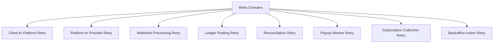
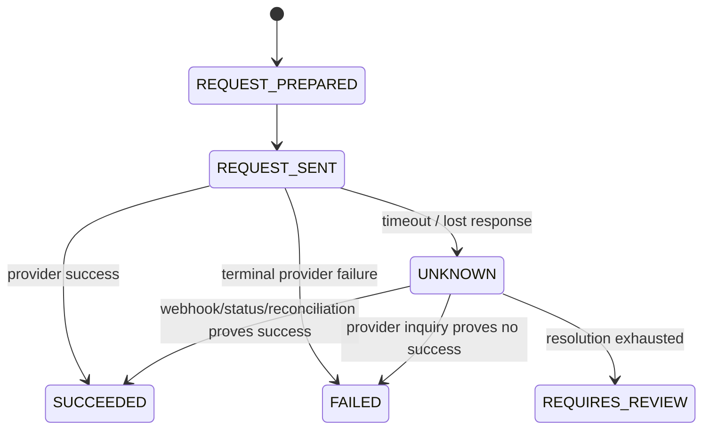
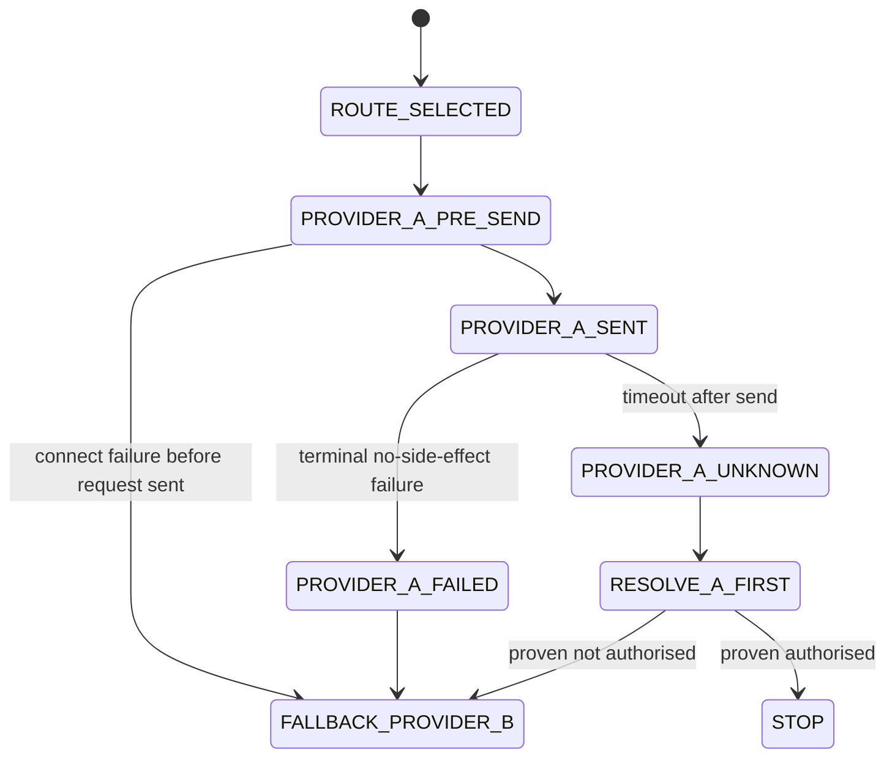
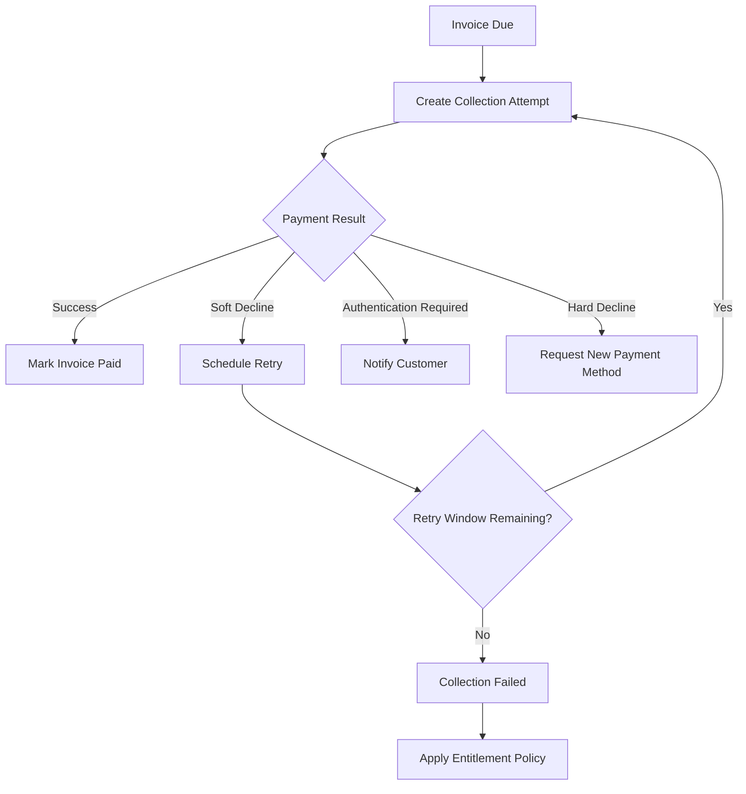
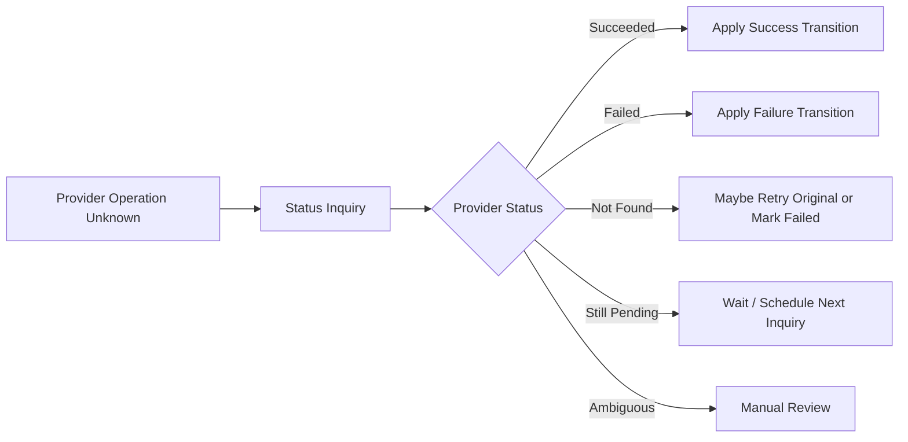

------
title: Build From Scratch: Large Production Grade Java Payment Systems - Part 037
description: Smart retry and fallback design for enterprise Java payment systems, covering retriable vs non-retriable failures, unknown outcome, idempotency, provider fallback, retry budget, circuit breaking, subscriptions, payout retries, and operational controls.
series: learn-java-payment-systems
seriesTitle: Build From Scratch: Large Production Grade Java Payment Systems
order: 37
partTitle: Smart Retry and Fallback
tags:
- java
- payments
- retry
- fallback
- idempotency
- orchestration
- resilience
- payment-systems
- enterprise-architecture
date: 2026-07-02
---

# Part 037 — Smart Retry and Fallback

A retry is not a loop.

In a payment system, a retry is a financial decision.

A naive engineer sees this:

```txt
call provider
if timeout, call again
```

A production payment engineer sees this:

```txt
call provider
if timeout, decide whether a financial side effect may already exist
if side effect may exist, do not blindly call another provider
first resolve outcome through idempotency, provider reference, webhook, status inquiry, or reconciliation
only retry when the operation is proven safe under a specific retry contract
```

That difference is the boundary between a normal distributed system and a system that moves money.

Most distributed-systems retry advice is directionally useful:

```txt
use timeouts
use exponential backoff
use jitter
make APIs idempotent
avoid retry storms
```

But payment systems add a sharper rule:

```txt
never use retry to hide uncertainty about money movement.
```

If a payment provider times out, there are three possible realities:

```txt
1. provider never received the request
2. provider received it but did not execute it
3. provider received it, executed it, but response was lost
```

The client sees the same symptom in all three cases:

```txt
timeout
```

The payment system must not collapse those into:

```txt
failed
```

It must classify them as:

```txt
unknown until proven otherwise
```

This part builds the retry and fallback subsystem for a production-grade Java payment platform.

---

## 1. Core Mental Model

Retries are safe only when the repeated operation has the same business effect as one execution.

In normal backend systems, idempotency often means:

```txt
same request -> same response
```

In payment systems, idempotency means more:

```txt
same financial operation -> at most one external side effect -> at most one ledger posting -> same observable business outcome
```

A retry policy therefore needs four inputs:

```txt
operation type
current known state
provider contract
failure classification
```

Example:

```txt
operation type: card authorization
current state: AUTHORIZING
provider contract: supports idempotency key on authorization
failure: HTTP 503 before body received
```

Possible decision:

```txt
retry same provider with same idempotency key after backoff
```

Different example:

```txt
operation type: card authorization
current state: AUTHORIZING_UNKNOWN
provider contract: no reliable idempotency key
failure: socket timeout after request body was sent
```

Possible decision:

```txt
do not retry authorization
run status inquiry / wait webhook / queue reconciliation repair
```

The retry is not determined by error code alone.

It is determined by the combination of:

```txt
error + operation + state + idempotency guarantee + side-effect risk
```

---

## 2. Retry Classes in a Payment Platform

A payment platform has several retry domains. Mixing them is a common source of double charge, double refund, duplicate payout, or noisy incidents.



Each domain has different safety rules.

| Retry Domain | Typical Trigger | Safe When | Dangerous When |
|---|---|---|---|
| Client to platform | mobile retry, browser retry, API timeout | platform idempotency key is stable | key changes per click |
| Platform to provider | provider timeout, 5xx, rate limit | provider idempotency and operation log are reliable | outcome may already exist |
| Webhook processing | DB deadlock, transient consumer crash | raw webhook already stored and deduped | handler calls external side effect repeatedly |
| Ledger posting | outbox consumer retry, DB retry | journal idempotency key is unique | posting is generated with new key every retry |
| Reconciliation retry | file parse failure, provider API pagination failure | imports are content-addressed/deduped | each import creates new financial movement |
| Payout worker retry | bank timeout, worker crash | payout operation reference is stable | worker creates new bank transfer each time |
| Subscription retry | soft decline, issuer unavailable | retry window and card network rules allow | hard decline/fraud decline is retried aggressively |
| Backoffice action retry | operator page timeout | action command has idempotency and approval id | duplicate manual adjustment |

A production platform does not have one retry utility.

It has a retry decision layer.

---

## 3. The Most Important Rule: Retry Same Operation, Not Same Intent

Payment systems often confuse these two statements:

```txt
Retry this purchase.
Retry this provider operation.
```

They are not the same.

A purchase intent may have multiple attempts:

```txt
payment_intent pi_123
  attempt att_1 -> Provider A -> timeout -> unknown
  attempt att_2 -> Provider B -> authorised
```

This can be valid only if `att_1` is proven not authorised, or if the business explicitly permits multiple attempts with only one capturable authorization and has a cancellation/reversal process for late success.

Most systems should not fallback from Provider A to Provider B while Provider A is unknown.

Safer model:

```txt
same external operation unknown -> resolve outcome first
same payment intent failed with terminal non-side-effect failure -> may create new attempt
same payment intent refused by issuer -> may ask customer for another method
same subscription invoice soft-declined -> may schedule future collection attempt
```

The retry target matters.

```txt
Retry provider operation = same attempt, same provider, same idempotency key, same amount, same method.
Retry payment intent = new attempt, possibly different provider or method, only after prior attempt is terminal or safely isolated.
```

---

## 4. Failure Classification

The orchestrator should not consume raw errors directly. It should receive normalized failure classification.

```txt
raw provider outcome -> adapter normalization -> retry decision
```

Basic taxonomy:

| Failure Class | Meaning | Example | Retry Default |
|---|---|---|---|
| `VALIDATION_ERROR` | request invalid before side effect | invalid amount, unsupported currency | no retry |
| `AUTHENTICATION_ERROR` | credential/config issue | invalid API key | no automatic retry |
| `RATE_LIMITED` | provider throttling | HTTP 429 | retry with backoff if safe |
| `TEMPORARY_PROVIDER_ERROR` | provider transient failure | HTTP 500/503 | retry if idempotent |
| `NETWORK_CONNECT_FAILURE` | could not connect | DNS/connect timeout | retry if request not sent |
| `NETWORK_READ_TIMEOUT` | request may have been sent | socket read timeout | unknown unless idempotency/status inquiry exists |
| `PROVIDER_TIMEOUT` | provider acknowledged timeout | gateway timeout | unknown/safe retry depends on provider contract |
| `ISSUER_SOFT_DECLINE` | issuer says try later or authenticate | issuer unavailable, try again later | scheduled retry or customer action |
| `ISSUER_HARD_DECLINE` | issuer says do not retry | stolen card, invalid account | no retry |
| `RISK_DECLINE` | risk system blocks | fraud suspected | no retry unless review changes decision |
| `UNKNOWN_OUTCOME` | platform cannot know side effect | lost response after request sent | resolve first |

The retry policy should not say:

```txt
retry all 5xx
```

It should say:

```txt
retry if the operation is retry-safe under the provider contract and current state remains non-terminal
```

---

## 5. Unknown Outcome Is Not Failure

This is the central payment reliability idea.



`UNKNOWN` must be explicit in the domain model.

Bad model:

```java
if (timeout) {
    payment.markFailed();
}
```

Better model:

```java
if (failure.isOutcomeUnknown()) {
    payment.markAuthorizingUnknown(operationId, failure.evidence());
    resolutionQueue.enqueue(operationId);
}
```

A timeout is evidence of communication failure, not evidence of payment failure.

---

## 6. Provider Operation Log

Every external side-effecting call should be represented as an operation.

```txt
PaymentIntent
  PaymentAttempt
    ProviderOperation AUTHORIZATION
    ProviderOperation CAPTURE
    ProviderOperation REFUND
```

Why?

Because retry and fallback decisions need operation-level evidence:

```txt
operation id
operation type
provider
provider account
idempotency key
request fingerprint
request sent at
network phase
response received at
normalized result
raw response reference
retry count
last failure class
resolution state
```

Example schema:

```sql
create table provider_operation (
    id uuid primary key,
    payment_attempt_id uuid not null,
    operation_type text not null,
    provider_code text not null,
    provider_account_id text not null,
    idempotency_key text not null,
    request_fingerprint text not null,
    status text not null,
    outcome text not null,
    retry_count integer not null default 0,
    next_retry_at timestamptz,
    last_failure_class text,
    provider_reference text,
    raw_request_ref text,
    raw_response_ref text,
    created_at timestamptz not null,
    updated_at timestamptz not null,
    constraint uq_provider_operation_idempotency
        unique (provider_code, provider_account_id, operation_type, idempotency_key),
    constraint ck_provider_operation_status
        check (status in (
            'PREPARED',
            'SENDING',
            'SUCCEEDED',
            'FAILED',
            'UNKNOWN',
            'RESOLUTION_PENDING',
            'REQUIRES_REVIEW'
        )),
    constraint ck_provider_operation_outcome
        check (outcome in (
            'NONE',
            'AUTHORISED',
            'CAPTURED',
            'REFUNDED',
            'DECLINED',
            'CANCELLED',
            'UNKNOWN'
        ))
);
```

Notice the unique constraint.

That is not just database hygiene.

It is a financial control.

---

## 7. Request Fingerprint

An idempotency key without a request fingerprint is dangerous.

Bad:

```txt
idempotency key: order-123
first request: amount 100000 IDR
second request: amount 150000 IDR
```

A payment platform should store a fingerprint of semantic request fields:

```txt
merchant_id
payment_intent_id
operation_type
provider
amount
currency
payment_method_reference
capture_method
customer_reference
```

Then reject incompatible retries.

```sql
create table idempotent_operation_guard (
    idempotency_scope text not null,
    idempotency_key text not null,
    request_fingerprint text not null,
    operation_id uuid not null,
    created_at timestamptz not null,
    expires_at timestamptz not null,
    primary key (idempotency_scope, idempotency_key)
);
```

If the same key arrives with a different fingerprint:

```txt
409 IDEMPOTENCY_KEY_REUSED_WITH_DIFFERENT_PAYLOAD
```

Do not continue.

---

## 8. Retry Decision Model

A good retry decision should be explicit and auditable.

```java
public enum RetryAction {
    RETRY_SAME_OPERATION,
    SCHEDULE_RETRY,
    WAIT_FOR_WEBHOOK,
    STATUS_INQUIRY,
    MARK_TERMINAL_FAILURE,
    ASK_CUSTOMER_ACTION,
    FALLBACK_NEW_ATTEMPT,
    SEND_TO_MANUAL_REVIEW,
    STOP
}

public record RetryDecision(
    RetryAction action,
    boolean externalSideEffectMayExist,
    boolean requiresSameIdempotencyKey,
    Duration delay,
    String reasonCode,
    String explanation
) {}
```

The policy input should be rich enough:

```java
public record RetryContext(
    OperationType operationType,
    PaymentState paymentState,
    ProviderCode providerCode,
    ProviderContract providerContract,
    FailureClass failureClass,
    int retryCount,
    Instant firstAttemptAt,
    Instant now,
    boolean requestBytesSent,
    boolean providerReferenceKnown,
    boolean statusInquiryAvailable,
    boolean webhookExpected,
    boolean paymentIntentAllowsNewAttempt
) {}
```

Policy skeleton:

```java
public final class PaymentRetryPolicy {

    public RetryDecision decide(RetryContext ctx) {
        if (ctx.failureClass() == FailureClass.VALIDATION_ERROR) {
            return stop("REQUEST_INVALID", "Invalid request cannot be fixed by retry.");
        }

        if (ctx.failureClass() == FailureClass.ISSUER_HARD_DECLINE) {
            return customerAction("HARD_DECLINE", "Customer must use another payment method.");
        }

        if (ctx.failureClass() == FailureClass.NETWORK_READ_TIMEOUT && ctx.requestBytesSent()) {
            if (ctx.providerContract().supportsIdempotencyFor(ctx.operationType())) {
                return retrySameOperationWithBackoff(ctx, "READ_TIMEOUT_WITH_IDEMPOTENCY");
            }
            if (ctx.statusInquiryAvailable()) {
                return statusInquiry("READ_TIMEOUT_NEEDS_RESOLUTION");
            }
            return manualReview("READ_TIMEOUT_UNRESOLVABLE_AUTOMATICALLY");
        }

        if (ctx.failureClass() == FailureClass.RATE_LIMITED) {
            return scheduleBackoff(ctx, "PROVIDER_RATE_LIMIT");
        }

        if (ctx.failureClass() == FailureClass.TEMPORARY_PROVIDER_ERROR) {
            if (ctx.retryCount() < ctx.providerContract().maxSafeRetries(ctx.operationType())) {
                return retrySameOperationWithBackoff(ctx, "TRANSIENT_PROVIDER_ERROR");
            }
            return statusInquiry("RETRY_BUDGET_EXHAUSTED");
        }

        if (ctx.failureClass() == FailureClass.UNKNOWN_OUTCOME) {
            return statusInquiry("UNKNOWN_OUTCOME_MUST_BE_RESOLVED");
        }

        return manualReview("UNCLASSIFIED_FAILURE");
    }
}
```

The implementation detail is less important than the invariant:

```txt
retry decisions are explicit domain decisions, not incidental exception handling.
```

---

## 9. Retry Budget

Unbounded retry is self-inflicted outage.

A retry budget limits retries per:

```txt
operation
payment intent
merchant
provider
route
error class
time window
```

Example:

```yaml
operation_policies:
  card_authorization:
    transient_provider_error:
      max_attempts: 2
      backoff: exponential_jitter
      initial_delay_ms: 300
      max_delay_ms: 5000
    network_read_timeout:
      max_attempts: 1
      only_if_provider_idempotency: true
      otherwise: status_inquiry
    issuer_hard_decline:
      max_attempts: 0
    issuer_soft_decline:
      realtime_retry: 0
      scheduled_retry: allowed_if_subscription
```

Provider-level budget:

```txt
Provider A has 40% timeout rate in last 5 minutes.
Stop retrying immediately.
Open circuit.
Route new eligible attempts elsewhere.
Resolve existing unknown operations separately.
```

Retry budget should be visible in metrics:

```txt
payment_retry_attempts_total{operation, provider, failure_class}
payment_retry_budget_exhausted_total{operation, provider}
payment_unknown_outcome_total{provider, operation}
payment_status_inquiry_total{provider, reason}
```

---

## 10. Backoff With Jitter

Backoff without jitter can synchronize workers and amplify incidents.

Bad:

```txt
retry all failed provider calls after exactly 1 second
```

Better:

```txt
base delay grows exponentially
actual delay has jitter
max delay is capped
retry budget is enforced
```

Example:

```java
public final class JitteredBackoff {
    private final Duration base;
    private final Duration max;
    private final SecureRandom random = new SecureRandom();

    public JitteredBackoff(Duration base, Duration max) {
        this.base = base;
        this.max = max;
    }

    public Duration delayForAttempt(int attempt) {
        long exponent = 1L << Math.min(attempt, 10);
        long upperMillis = Math.min(max.toMillis(), base.toMillis() * exponent);
        long jitteredMillis = random.nextLong(Math.max(1, upperMillis));
        return Duration.ofMillis(jitteredMillis);
    }
}
```

Payment-specific addition:

```txt
backoff schedules retry of same operation, not creation of a new financial operation.
```

---

## 11. Fallback Semantics

Fallback means using an alternative route or provider.

Fallback is safe only in certain states.



Unsafe fallback:

```txt
Provider A timed out after receiving authorization request.
System immediately sends same card authorization to Provider B.
Later Provider A webhook says authorised.
Provider B also authorised.
Customer has two authorizations.
```

Safe fallback cases:

```txt
connect failure before request bytes sent
provider rejects request before side effect because capability/config validation failed
provider returns terminal failure that proves no authorization/capture/payout happened
risk/policy rejects route before external call
provider health circuit is open before route selection
```

Potentially safe but requires design:

```txt
provider returns issuer soft decline and policy says another acquirer may improve authorization rate
subscription retry after delay with stored credential rules
customer selects a different payment method after terminal decline
```

Never treat fallback as a generic catch block.

---

## 12. Route Attempt vs Provider Operation

Payment routing and retry must coordinate.

A common model:

```txt
PaymentIntent
  PaymentAttempt #1
    RouteDecision #1: Provider A
    ProviderOperation #1: AUTHORIZE
  PaymentAttempt #2
    RouteDecision #2: Provider B
    ProviderOperation #2: AUTHORIZE
```

Rules:

```txt
one payment attempt has one selected route for authorization
same attempt may retry same provider operation
fallback to another provider usually creates a new attempt
old attempt must be terminal failed or safely isolated before new attempt becomes active
```

Example table:

```sql
create table payment_attempt (
    id uuid primary key,
    payment_intent_id uuid not null,
    attempt_no integer not null,
    provider_code text not null,
    status text not null,
    amount_minor bigint not null,
    currency char(3) not null,
    created_at timestamptz not null,
    constraint uq_payment_attempt_no unique (payment_intent_id, attempt_no),
    constraint ck_payment_attempt_status check (status in (
        'CREATED',
        'ROUTE_SELECTED',
        'AUTHORIZING',
        'AUTHORIZING_UNKNOWN',
        'AUTHORISED',
        'FAILED',
        'CANCELLED',
        'REQUIRES_REVIEW'
    ))
);
```

A fallback attempt should reference the reason:

```sql
alter table payment_attempt
add column fallback_from_attempt_id uuid,
add column fallback_reason_code text,
add column fallback_policy_version text;
```

This makes later analysis possible:

```txt
Did fallback improve conversion?
Did fallback increase duplicate authorization incidents?
Did fallback produce higher cost?
Did fallback violate provider routing policy?
```

---

## 13. Operation-Specific Retry Rules

Not all payment operations are equally dangerous.

### Authorization

Authorization creates a hold or approval.

Retry with same idempotency key can be safe if provider supports it.

Fallback to another acquirer is risky when the first outcome is unknown.

### Capture

Capture moves an authorization toward clearing/settlement.

Rules:

```txt
capture amount cannot exceed authorized remaining amount
capture retry must use same capture operation idempotency key
unknown capture should be resolved before recapture
partial capture needs separate capture sequence
```

### Refund

Refund moves money back to customer.

Rules:

```txt
refund amount cannot exceed refundable amount
refund retry must not create a new refund object accidentally
unknown refund should be resolved before issuing another refund
```

### Void/Cancel

Void/cancel releases an authorization before capture.

Rules:

```txt
cancel after capture may not be possible
cancel/capture race must be serialized per authorization
unknown cancel should not be interpreted as failed if provider may process it later
```

### Payout

Payout sends money out of the platform.

Rules:

```txt
beneficiary verified before retry
balance reservation persists across retry
bank reference/idempotency key stable
unknown bank transfer is never retried as a new transfer without inquiry
```

### Ledger Posting

Ledger posting is internal but financially critical.

Rules:

```txt
posting rule idempotency key unique
same business event cannot post twice
retry after DB deadlock is safe if journal key is stable
```

---

## 14. Subscription Retry and Dunning

Subscription retry is different from realtime checkout retry.

Realtime checkout retry:

```txt
customer is present
latency matters
retry budget is tiny
fallback may be possible only when safe
customer can choose another method
```

Subscription retry:

```txt
customer may be absent
time window is days/weeks
retry must respect stored credential/mandate semantics
notifications and dunning matter
entitlement policy matters
card network retry constraints matter
```

Dunning flow:



For subscription retry, the platform should store:

```txt
retry schedule version
failure classification
merchant policy
invoice state
customer notification evidence
payment method mandate/stored credential reference
attempt count
next collection time
```

Do not model dunning as only:

```txt
next_retry_at
```

Dunning is customer communication plus financial collection policy.

---

## 15. Rate Limits and Retry Storms

Provider rate limits require backoff, not aggression.

If Provider A returns rate limit:

```txt
wrong response: all workers retry immediately
right response: shared provider budget reduces traffic, queue delays retries, circuit health degrades
```

A provider health model should include:

```txt
success rate
timeout rate
p95/p99 latency
rate limit rate
unknown outcome rate
error mix
status inquiry success rate
webhook delay
```

Circuit states:

```txt
CLOSED: route normally
DEGRADED: route lower priority, reduce retries
OPEN: do not route new attempts, only resolve existing unknowns
HALF_OPEN: limited probes
```

Payment-specific circuit rule:

```txt
open circuit for new attempts does not mean stop resolution of existing unknown operations.
```

Existing unknowns still need status inquiry, webhook ingestion, or reconciliation.

---

## 16. Retry Worker Design

A retry worker should not select arbitrary failed records.

It should acquire due operations safely.

```sql
select id
from provider_operation
where status in ('FAILED', 'UNKNOWN', 'RESOLUTION_PENDING')
  and next_retry_at <= now()
order by next_retry_at asc
for update skip locked
limit 100;
```

But the worker should still re-evaluate the state inside the transaction.

```java
public final class ProviderOperationRetryWorker {

    public void handle(UUID operationId) {
        ProviderOperation op = operationRepository.lockById(operationId);
        PaymentAttempt attempt = attemptRepository.lockById(op.paymentAttemptId());

        RetryContext ctx = retryContextFactory.from(op, attempt);
        RetryDecision decision = retryPolicy.decide(ctx);

        switch (decision.action()) {
            case RETRY_SAME_OPERATION -> retrySameOperation(op, decision);
            case STATUS_INQUIRY -> scheduleStatusInquiry(op, decision);
            case WAIT_FOR_WEBHOOK -> waitForWebhook(op, decision);
            case MARK_TERMINAL_FAILURE -> markFailed(op, decision);
            case FALLBACK_NEW_ATTEMPT -> createFallbackAttempt(attempt, decision);
            case SEND_TO_MANUAL_REVIEW -> openCase(op, decision);
            case ASK_CUSTOMER_ACTION -> requestCustomerAction(attempt, decision);
            case STOP -> stop(op, decision);
            default -> throw new IllegalStateException("Unsupported retry action " + decision.action());
        }
    }
}
```

Important invariant:

```txt
retry worker does not decide from stale state.
```

It locks and revalidates.

---

## 17. Status Inquiry as Retry Alternative

Sometimes the correct retry is not repeating the original operation.

It is asking:

```txt
what happened to the original operation?
```

Status inquiry is necessary for:

```txt
unknown authorization
unknown capture
unknown refund
unknown payout
late webhook suspicion
provider response lost
merchant support investigation
```

Status inquiry result should feed the same state machine as webhook.



Do not create a second path that bypasses validation.

The state machine should not care whether evidence came from:

```txt
synchronous response
webhook
status inquiry
reconciliation file
operator action
```

It should apply evidence consistently.

---

## 18. Customer-Facing Retry

Internal retry and customer retry are not the same.

Customer-facing message should not say:

```txt
Provider A returned acquirer error 905 with network timeout after socket write.
```

Customer-facing messages should be safe and actionable:

```txt
Your bank could not approve this payment. Try another payment method or contact your bank.
```

Customer-facing retry options:

```txt
try same method again
use another card
complete authentication
choose bank transfer
wait and retry later
contact issuer
contact merchant support
```

The platform should map failure classifications to recommended actions.

```txt
issuer_hard_decline -> use another method / contact issuer
insufficient_funds -> use another method
authentication_required -> complete authentication
provider_temporary_error -> try again shortly
payment_unknown -> do not ask customer to pay again until resolved, unless duplicate risk is explicitly managed
```

This is both UX and risk control.

---

## 19. Fallback and Ledger Timing

Do not post success ledger entries before outcome is known.

Possible states:

```txt
authorization pending -> no capture/settlement ledger movement yet, maybe optional internal hold/reservation
authorization success -> post authorization/receivable/pending payable as appropriate
capture success -> post capture/clearing-related movement
settlement success -> post settlement movement
```

When fallback happens, ledger must represent each attempt distinctly.

```txt
attempt A failed terminally -> no success posting
attempt B authorised -> success posting tied to attempt B
attempt A later succeeds unexpectedly -> duplicate incident, reversal/cancel workflow, ledger correction
```

A robust system also has a late-success handler:

```txt
if previously failed/unknown attempt later receives success evidence:
  if payment intent already paid by another attempt:
      open duplicate authorization case
      cancel/void/refund depending on operation stage
      post correction/reserve if money moved
  else:
      apply success normally
```

Production systems must be humble about time.

Late events happen.

---

## 20. Backoffice Controls

Operations need visibility into retry/fallback decisions.

Backoffice should show:

```txt
payment intent timeline
attempt timeline
provider operations
idempotency key
request fingerprint
raw response reference
failure classification
retry decisions
next retry time
retry budget remaining
status inquiry attempts
fallback attempts
manual override availability
```

Manual actions should be controlled:

```txt
force status inquiry
stop retry
resume retry
mark requires review
create customer action request
approve fallback
trigger provider-specific repair
```

Manual actions should not include:

```txt
click random retry with new provider operation id
edit amount after authorization
delete failed attempt record
manually mark paid without ledger posting
```

Backoffice must be safer than the automated system, not more dangerous.

---

## 21. Observability

Useful metrics:

```txt
payment_operation_retry_total{operation_type, provider, failure_class, decision}
payment_operation_unknown_total{operation_type, provider}
payment_operation_unknown_age_seconds{provider}
payment_fallback_total{from_provider, to_provider, reason}
payment_duplicate_late_success_total{provider, operation_type}
payment_retry_budget_exhausted_total{provider, operation_type}
payment_status_inquiry_total{provider, outcome}
payment_retry_queue_depth{provider, operation_type}
payment_retry_queue_oldest_age_seconds{provider, operation_type}
```

Important dashboards:

```txt
provider health
unknown outcome aging
retry volume by error class
fallback conversion impact
duplicate authorization incidents
subscription recovery rate
payout retry backlog
```

Important alerts:

```txt
unknown outcome count above threshold
unknown outcome age above SLA
fallback spike
retry budget exhausted spike
provider rate limit spike
late success after fallback
payout unknown state unresolved
```

---

## 22. Testing Matrix

Test retry logic as a state machine, not only as unit tests.

| Scenario | Expected Result |
|---|---|
| connect timeout before request sent | retry or fallback may be allowed |
| read timeout after request sent with provider idempotency | retry same operation with same key or inquiry |
| read timeout after request sent without idempotency | status inquiry/manual review |
| provider 500 before side effect proven | retry same operation if safe |
| provider 429 | backoff; reduce provider health score |
| issuer hard decline | no retry; customer action |
| issuer soft decline in checkout | limited retry/customer action |
| issuer soft decline in subscription | scheduled retry/dunning |
| capture timeout | do not create second capture blindly |
| refund timeout | do not create second refund blindly |
| payout timeout | do not create second bank transfer blindly |
| webhook success after fallback success | duplicate incident workflow |
| retry worker crashes after external success before DB update | idempotency/status inquiry resolves |
| operation log duplicate insert | unique constraint prevents duplicate side effect record |

Property-like invariant:

```txt
For any sequence of retries, crashes, webhooks, and status inquiries,
there must be at most one successful financial posting per idempotent operation.
```

Another invariant:

```txt
Fallback must not be selected while previous attempt has unresolved side-effect risk,
unless the platform has explicit duplicate-risk containment logic.
```

---

## 23. Anti-Patterns

### Anti-Pattern 1: Retry All Exceptions

```java
@Retryable
public AuthorizationResult authorize(...) {
    return provider.authorize(...);
}
```

This is dangerous because exception type alone does not encode side-effect risk.

### Anti-Pattern 2: New Idempotency Key Per Retry

```txt
attempt 1: key abc
retry 1: key def
retry 2: key ghi
```

This defeats provider idempotency.

### Anti-Pattern 3: Fallback on Timeout

```txt
Provider A timeout -> Provider B immediately
```

This can create duplicate authorization.

### Anti-Pattern 4: Treat Decline as Error

Issuer decline is often a valid business outcome, not a system error.

### Anti-Pattern 5: Hide Unknown From Domain Model

```txt
timeout -> failed
```

This corrupts settlement and support workflows.

### Anti-Pattern 6: Retry Without Budget

A provider outage plus aggressive retry can become a self-inflicted traffic storm.

### Anti-Pattern 7: Manual Retry Button Without Idempotency

Backoffice must not bypass financial controls.

---

## 24. Production Checklist

Before enabling smart retry/fallback, verify:

```txt
[ ] every external operation has operation id
[ ] operation has stable idempotency key
[ ] request fingerprint is stored
[ ] raw request/response evidence is stored safely
[ ] timeout phase is classified
[ ] unknown outcome is explicit
[ ] retry budget exists per operation/provider/failure class
[ ] backoff uses jitter
[ ] provider health can suppress retry/fallback
[ ] fallback is blocked while prior side-effect risk is unresolved
[ ] status inquiry is integrated into same state machine as webhook
[ ] ledger posting is idempotent
[ ] late success after fallback has incident workflow
[ ] subscription retry is separated from realtime checkout retry
[ ] payout retry has beneficiary and balance reservation controls
[ ] operations can inspect and control retry safely
[ ] metrics and alerts exist for unknown outcomes and retry storms
```

---

## 25. Minimal Build Order

Build in this order:

```txt
1. provider operation table
2. idempotency guard with request fingerprint
3. failure classification from adapter
4. explicit UNKNOWN state
5. retry policy engine
6. retry queue with retry budget
7. jittered backoff
8. status inquiry path
9. provider health circuit
10. fallback with attempt isolation
11. backoffice timeline
12. late success handler
```

Do not start with dynamic routing.

Start with safety.

---

## References

- Stripe API Reference — Idempotent requests: https://docs.stripe.com/api/idempotent_requests
- Stripe Docs — Card decline codes: https://docs.stripe.com/declines/codes
- Stripe Docs — Card declines and retrying issuer declines: https://docs.stripe.com/declines/card
- PayPal Developer — Idempotency: https://developer.paypal.com/api/rest/reference/idempotency/
- PayPal Developer — API requests and `PayPal-Request-Id`: https://developer.paypal.com/api/rest/requests/
- AWS Builders' Library — Making retries safe with idempotent APIs: https://aws.amazon.com/builders-library/making-retries-safe-with-idempotent-APIs/
- Google Cloud — Retry strategy and exponential backoff with jitter: https://docs.cloud.google.com/storage/docs/retry-strategy
- Adyen Docs — Response handling and result codes: https://docs.adyen.com/development-resources/overview-response-handling
- Adyen Docs — Refusal reasons: https://docs.adyen.com/development-resources/refusal-reasons
