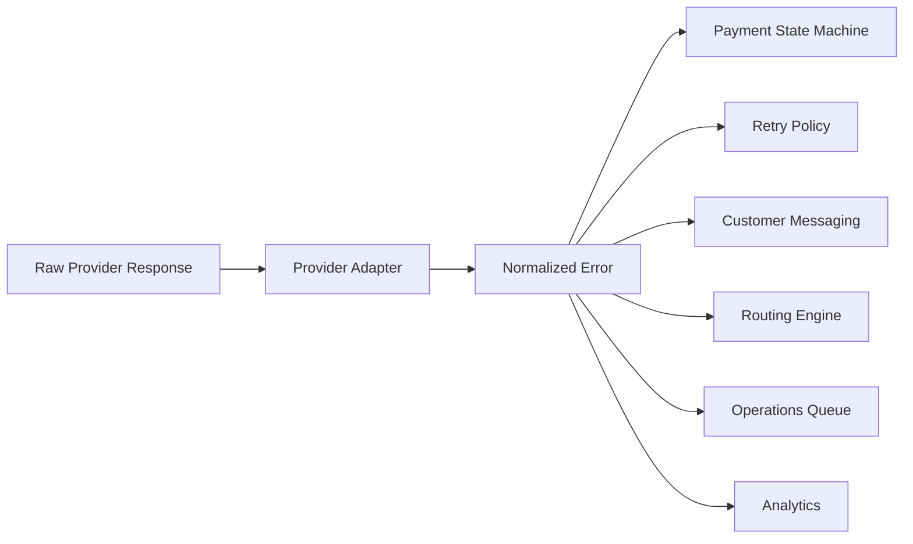
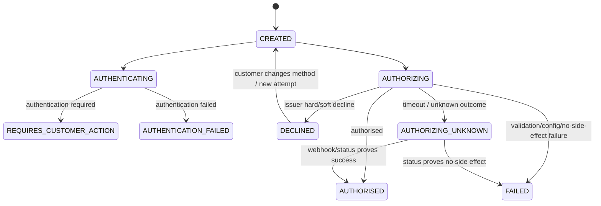
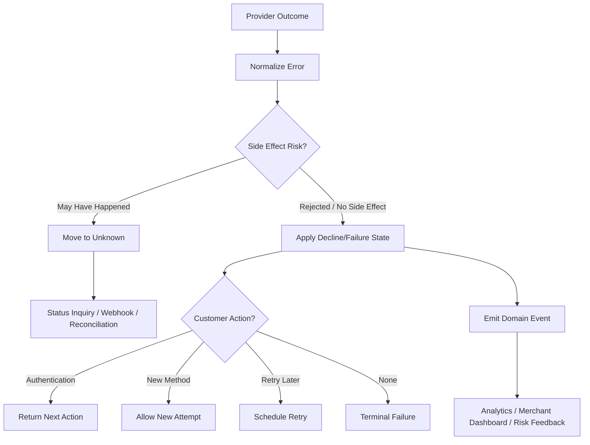

------
title: Build From Scratch: Large Production Grade Java Payment Systems - Part 038
description: Error taxonomy and decline handling for enterprise Java payment systems, covering provider errors, issuer declines, soft and hard declines, normalized error models, customer action, retry eligibility, risk decisions, operations handling, and observability.
series: learn-java-payment-systems
seriesTitle: Build From Scratch: Large Production Grade Java Payment Systems
order: 38
partTitle: Error Taxonomy and Decline Handling
tags:
- java
- payments
- error-taxonomy
- decline-handling
- card-payments
- provider-integration
- risk
- payment-systems
- enterprise-architecture
date: 2026-07-02
---

# Part 038 — Error Taxonomy and Decline Handling

A payment error is not just an error.

It may be:

```txt
customer entered wrong data
issuer refused the transaction
issuer asked for authentication
provider is down
provider throttled us
merchant is misconfigured
risk engine blocked the payment
network response was lost
request was invalid
money may already have moved
```

If all of these become:

```json
{
  "error": "PAYMENT_FAILED"
}
```

then the platform cannot:

```txt
retry safely
show correct user action
route intelligently
measure provider quality
separate fraud from issuer decline
support merchant operations
reconcile unknown outcomes
avoid duplicate charges
```

Decline handling is not a UI feature.

It is a domain model.

This part builds the normalized error taxonomy for a production-grade Java payment platform.

---

## 1. The Goal of Error Taxonomy

An error taxonomy should answer these questions:

```txt
Who caused or owns the next action?
Did any financial side effect happen?
Is retry allowed?
Should retry be immediate, delayed, or never?
Should customer act?
Should merchant act?
Should operations act?
Should risk review act?
What should be shown to the customer?
What should be hidden from the customer?
What evidence must be preserved?
```

A good taxonomy separates raw provider details from platform decisions.



Raw provider response is evidence.

Normalized error is decision input.

Do not throw away raw evidence.

Do not leak raw evidence directly to users.

---

## 2. Three Layers of Error Meaning

A payment error has at least three layers.

### Layer 1: Transport / Protocol

This is how communication behaved.

```txt
HTTP 400
HTTP 401
HTTP 429
HTTP 500
socket timeout
TLS failure
invalid JSON
malformed ISO8583 response
```

This layer is useful for engineering but insufficient for business decisions.

### Layer 2: Provider / Network Meaning

This is what the provider or payment rail says.

```txt
Authorised
Refused
Pending
Error
Received
issuer unavailable
insufficient funds
stolen card
3DS challenge required
invalid merchant configuration
```

This layer is provider-specific.

### Layer 3: Platform Decision Meaning

This is what your platform should do.

```txt
PAYMENT_AUTHORISED
CUSTOMER_ACTION_REQUIRED
PAYMENT_METHOD_DECLINED_HARD
PAYMENT_METHOD_DECLINED_SOFT
PROVIDER_TEMPORARY_FAILURE
OUTCOME_UNKNOWN
MERCHANT_CONFIGURATION_ERROR
RISK_DECLINED
```

This is the layer your core domain should consume.

---

## 3. Raw Error vs Normalized Error

Bad domain model:

```java
payment.fail(providerResponse.getErrorCode());
```

Better domain model:

```java
NormalizedPaymentError error = errorNormalizer.normalize(providerResponse, context);
payment.apply(error.toStateTransitionEvidence());
retryPolicy.decide(error.toRetryContext());
```

A normalized error should preserve references to raw evidence:

```java
public record NormalizedPaymentError(
    String providerCode,
    String providerErrorCode,
    String providerErrorMessage,
    String rawResponseRef,
    PaymentErrorCategory category,
    PaymentErrorReason reason,
    FailurePermanence permanence,
    RetryEligibility retryEligibility,
    CustomerAction customerAction,
    MerchantAction merchantAction,
    OperationsAction operationsAction,
    FinancialSideEffectRisk sideEffectRisk,
    String publicMessageCode,
    String internalExplanation
) {}
```

Do not store only `providerErrorMessage`.

Provider messages can change, be localized, be too vague, or include sensitive detail.

---

## 4. Core Taxonomy Dimensions

A mature taxonomy is multi-dimensional.

### Category

```java
public enum PaymentErrorCategory {
    REQUEST_VALIDATION,
    AUTHENTICATION_OR_CREDENTIAL,
    MERCHANT_CONFIGURATION,
    PAYMENT_METHOD_DECLINE,
    ISSUER_DECLINE,
    AUTHENTICATION_REQUIRED,
    RISK_DECLINE,
    COMPLIANCE_BLOCK,
    PROVIDER_TEMPORARY_FAILURE,
    PROVIDER_PERMANENT_FAILURE,
    RATE_LIMITED,
    NETWORK_FAILURE,
    OUTCOME_UNKNOWN,
    LEDGER_FAILURE,
    RECONCILIATION_MISMATCH,
    OPERATIONAL_REVIEW_REQUIRED
}
```

### Reason

Reason is more specific.

```java
public enum PaymentErrorReason {
    INSUFFICIENT_FUNDS,
    DO_NOT_HONOR,
    STOLEN_CARD,
    LOST_CARD,
    EXPIRED_CARD,
    INVALID_CARD_NUMBER,
    INCORRECT_CVC,
    INCORRECT_POSTAL_CODE,
    ISSUER_UNAVAILABLE,
    PROCESSING_ERROR,
    TRY_AGAIN_LATER,
    AUTHENTICATION_CHALLENGE_REQUIRED,
    AUTHENTICATION_FAILED,
    FRAUD_SUSPECTED,
    SANCTIONS_BLOCKED,
    UNSUPPORTED_CURRENCY,
    AMOUNT_LIMIT_EXCEEDED,
    MERCHANT_NOT_ENABLED,
    PROVIDER_RATE_LIMIT,
    PROVIDER_TIMEOUT,
    RESPONSE_LOST,
    UNKNOWN
}
```

### Permanence

```java
public enum FailurePermanence {
    PERMANENT,
    TEMPORARY,
    UNKNOWN
}
```

### Retry Eligibility

```java
public enum RetryEligibility {
    NEVER_RETRY,
    RETRY_SAME_OPERATION_IMMEDIATELY,
    RETRY_SAME_OPERATION_AFTER_BACKOFF,
    RETRY_AFTER_CUSTOMER_ACTION,
    RETRY_AFTER_MERCHANT_ACTION,
    RETRY_AFTER_RISK_REVIEW,
    STATUS_INQUIRY_FIRST,
    MANUAL_REVIEW_FIRST
}
```

### Customer Action

```java
public enum CustomerAction {
    NONE,
    TRY_AGAIN_LATER,
    USE_ANOTHER_PAYMENT_METHOD,
    CONTACT_ISSUER,
    COMPLETE_AUTHENTICATION,
    CORRECT_CARD_DATA,
    ADD_FUNDS,
    CONTACT_MERCHANT_SUPPORT
}
```

### Financial Side-Effect Risk

```java
public enum FinancialSideEffectRisk {
    NO_SIDE_EFFECT,
    SIDE_EFFECT_CONFIRMED,
    SIDE_EFFECT_REJECTED,
    SIDE_EFFECT_MAY_HAVE_HAPPENED,
    INTERNAL_ONLY
}
```

This last dimension is crucial.

A timeout and a decline may both look like failed checkout to the user.

But only one may have already created an authorization.

---

## 5. Decline Is Not the Same as Error

A card decline is usually a valid business outcome from the issuer or payment method.

It is not necessarily a system failure.

```txt
Payment method was received.
Authorization was attempted.
Issuer or network refused approval.
```

Adyen's response handling distinguishes results such as `Authorised` and `Refused`; a refused transaction means the payment method or issuer rejected the transaction. Stripe exposes decline codes when an issuer declines a card payment. These provider-specific details should be normalized into platform-level reasons.

Incorrect mental model:

```txt
payment error = infrastructure failure
```

Correct mental model:

```txt
payment error can be business refusal, customer action, merchant misconfiguration, provider failure, or unknown outcome
```

This distinction drives:

```txt
HTTP response
payment state
retry policy
customer copy
merchant analytics
risk decision
support workflow
```

---

## 6. Hard Decline vs Soft Decline

A useful operational split:

```txt
hard decline -> do not retry without meaningful change
soft decline -> retry may succeed later or after customer/action/context changes
```

Examples of hard-ish declines:

```txt
stolen card
lost card
invalid account
expired card when no updater available
transaction not allowed
card restricted
```

Examples of soft-ish declines:

```txt
issuer unavailable
processing error
try again later
insufficient funds, depending on business context
authentication required
temporary network/processor issue
```

But do not hardcode universal truth too aggressively.

The same code can mean different follow-up depending on:

```txt
card network
country
merchant category
provider mapping
transaction type
stored credential indicator
subscription vs one-time checkout
issuer advice
provider advice
```

Therefore, model it as policy.

```yaml
reason_policies:
  INSUFFICIENT_FUNDS:
    checkout:
      customer_action: USE_ANOTHER_PAYMENT_METHOD
      retry: NEVER_RETRY_REALTIME
    subscription:
      customer_action: ADD_FUNDS
      retry: RETRY_AFTER_SCHEDULE
  ISSUER_UNAVAILABLE:
    checkout:
      retry: RETRY_SAME_OPERATION_AFTER_BACKOFF
    subscription:
      retry: RETRY_AFTER_SCHEDULE
  STOLEN_CARD:
    all:
      retry: NEVER_RETRY
      customer_action: USE_ANOTHER_PAYMENT_METHOD
      risk_signal: high
```

---

## 7. Provider Result Normalization

Provider A might say:

```txt
resultCode = Refused
refusalReasonCode = 5
refusalReason = Blocked Card
```

Provider B might say:

```txt
error.code = card_declined
decline_code = stolen_card
```

Provider C might say:

```txt
ISO8583 response code = 05
```

Your payment core should not be rewritten for each provider.

Normalize at the adapter boundary:

```java
public interface ProviderErrorNormalizer {
    NormalizedPaymentError normalize(ProviderRawOutcome raw, ProviderOperationContext ctx);
}
```

Example mapping:

```java
public final class StripeErrorNormalizer implements ProviderErrorNormalizer {

    @Override
    public NormalizedPaymentError normalize(ProviderRawOutcome raw, ProviderOperationContext ctx) {
        String declineCode = raw.get("decline_code");
        String code = raw.get("code");

        if ("card_declined".equals(code) && "insufficient_funds".equals(declineCode)) {
            return NormalizedPaymentErrorFactory.issuerDecline(
                raw,
                PaymentErrorReason.INSUFFICIENT_FUNDS,
                FailurePermanence.TEMPORARY,
                RetryEligibility.RETRY_AFTER_CUSTOMER_ACTION,
                CustomerAction.USE_ANOTHER_PAYMENT_METHOD,
                FinancialSideEffectRisk.SIDE_EFFECT_REJECTED,
                "PAYMENT_METHOD_DECLINED"
            );
        }

        if ("idempotency_key_in_use".equals(code)) {
            return NormalizedPaymentErrorFactory.platformConcurrency(
                raw,
                RetryEligibility.RETRY_SAME_OPERATION_AFTER_BACKOFF,
                "IDEMPOTENCY_KEY_IN_USE"
            );
        }

        return NormalizedPaymentErrorFactory.unknown(raw);
    }
}
```

Do not make the normalized taxonomy depend on provider brand.

Provider-specific details belong in evidence.

---

## 8. Payment State Impact

Errors should transition state carefully.



Rules:

```txt
validation error before provider call -> no side effect, fail operation
issuer decline -> payment attempt declined, payment intent may remain open for another method
provider timeout after request sent -> unknown, not declined
risk decline before provider call -> declined/blocked, no provider attempt
merchant configuration error -> fail attempt, alert merchant/ops
```

The state machine should consume normalized evidence, not raw HTTP status.

---

## 9. HTTP Status for Your API

Your public API should not mirror provider HTTP status blindly.

Example:

```txt
Provider returns HTTP 402 card_declined.
Your API may return HTTP 200 with PaymentIntent status requires_payment_method,
or HTTP 402 with structured error, depending on API style.
```

The important part is consistency.

Possible API response:

```json
{
  "id": "pi_123",
  "status": "requires_payment_method",
  "last_payment_error": {
    "code": "payment_method_declined",
    "reason": "insufficient_funds",
    "message": "This payment method could not be approved. Use another payment method.",
    "customer_action": "use_another_payment_method",
    "retry_allowed": false
  }
}
```

For unknown outcome:

```json
{
  "id": "pi_123",
  "status": "processing",
  "last_payment_error": null,
  "next_action": {
    "type": "wait_for_confirmation",
    "message": "We are confirming the payment status. Do not retry payment yet."
  }
}
```

Do not tell the client to pay again when the prior attempt is unresolved.

---

## 10. Customer Messaging

Customer messaging should be:

```txt
safe
actionable
not too revealing
not provider-specific
not fraud-leaking
localized
consistent across providers
```

Bad:

```txt
Issuer returned raw code 83 Fraud/Security. Try again with another card.
```

Better:

```txt
This payment method could not be approved. Please use another payment method or contact your bank.
```

Bad:

```txt
Your transaction was blocked because our fraud score was 99.7.
```

Better:

```txt
We could not complete this payment. Please use another payment method or contact support.
```

Messaging table:

| Normalized Reason | Public Message Code | Customer Action |
|---|---|---|
| `INSUFFICIENT_FUNDS` | `PAYMENT_METHOD_DECLINED` | use another method/add funds |
| `INCORRECT_CVC` | `CARD_DETAILS_INCORRECT` | correct card data |
| `AUTHENTICATION_CHALLENGE_REQUIRED` | `AUTHENTICATION_REQUIRED` | complete authentication |
| `ISSUER_UNAVAILABLE` | `TRY_AGAIN_LATER` | retry later |
| `STOLEN_CARD` | `PAYMENT_METHOD_DECLINED` | use another method/contact issuer |
| `FRAUD_SUSPECTED` | `PAYMENT_COULD_NOT_BE_COMPLETED` | contact support/use another method |
| `PROVIDER_TIMEOUT` | `PAYMENT_PROCESSING` | wait, do not retry yet |
| `MERCHANT_NOT_ENABLED` | `PAYMENT_UNAVAILABLE` | contact merchant |

---

## 11. Merchant and Operations Messaging

Merchant-facing and operations-facing messages can be more detailed but must still be controlled.

Merchant-facing:

```txt
Payment declined by issuer: insufficient funds.
Suggested action: ask customer to use another payment method.
```

Operations-facing:

```txt
Provider: adyen
pspReference: ...
resultCode: Refused
refusalReasonCode: 5
normalizedReason: STOLEN_CARD
rawResponseRef: s3://secure-evidence/...
riskDecisionId: rd_...
sideEffectRisk: SIDE_EFFECT_REJECTED
```

Operations should see evidence.

Customers should see action.

---

## 12. Decline Handling Workflow

A production decline handler is a workflow.



The key is that decline handling and unknown outcome handling are separated.

A provider error may be a decline.

A communication error may not be.

---

## 13. Persistence Model

Store normalized and raw fields.

```sql
create table payment_error_event (
    id uuid primary key,
    payment_intent_id uuid not null,
    payment_attempt_id uuid,
    provider_operation_id uuid,
    provider_code text,
    provider_error_code text,
    provider_decline_code text,
    provider_refusal_reason_code text,
    provider_result_code text,
    normalized_category text not null,
    normalized_reason text not null,
    permanence text not null,
    retry_eligibility text not null,
    customer_action text not null,
    merchant_action text not null,
    operations_action text not null,
    side_effect_risk text not null,
    public_message_code text not null,
    raw_response_ref text,
    policy_version text not null,
    occurred_at timestamptz not null,
    created_at timestamptz not null,
    constraint ck_payment_error_side_effect check (side_effect_risk in (
        'NO_SIDE_EFFECT',
        'SIDE_EFFECT_CONFIRMED',
        'SIDE_EFFECT_REJECTED',
        'SIDE_EFFECT_MAY_HAVE_HAPPENED',
        'INTERNAL_ONLY'
    ))
);
```

Why store `policy_version`?

Because mappings change.

If the platform changes `ISSUER_UNAVAILABLE` from immediate retry to delayed retry, historical analysis must know which policy made the original decision.

---

## 14. Mapping Versioning

Decline/error mapping is product logic and risk logic.

It changes over time.

Version the mapping.

```yaml
version: payment-error-map-2026-07-02
providers:
  stripe:
    card_declined:
      insufficient_funds:
        category: ISSUER_DECLINE
        reason: INSUFFICIENT_FUNDS
        permanence: TEMPORARY
        retry_eligibility: RETRY_AFTER_CUSTOMER_ACTION
        customer_action: USE_ANOTHER_PAYMENT_METHOD
        side_effect_risk: SIDE_EFFECT_REJECTED
        public_message_code: PAYMENT_METHOD_DECLINED
  adyen:
    refusalReasonCode:
      "5":
        category: ISSUER_DECLINE
        reason: BLOCKED_CARD
        permanence: PERMANENT
        retry_eligibility: NEVER_RETRY
        customer_action: USE_ANOTHER_PAYMENT_METHOD
        side_effect_risk: SIDE_EFFECT_REJECTED
        public_message_code: PAYMENT_METHOD_DECLINED
```

Mapping rollout should support:

```txt
dry-run mapping comparison
shadow evaluation
approval workflow
rollback
per-provider version
analytics impact report
```

Bad mapping can directly affect revenue and risk.

Treat it like code.

---

## 15. Risk Declines

Risk decline differs from issuer decline.

Issuer decline:

```txt
external financial institution refuses authorization
```

Risk decline:

```txt
your platform or provider risk engine refuses or blocks before/around authorization
```

Risk decline may happen:

```txt
before provider call
after authentication
after authorization but before capture
before payout
during merchant onboarding
```

Risk decision should be stored separately:

```sql
create table risk_decision (
    id uuid primary key,
    subject_type text not null,
    subject_id uuid not null,
    decision text not null,
    reason_code text not null,
    score numeric(10,4),
    policy_version text not null,
    evidence_ref text,
    created_at timestamptz not null,
    constraint ck_risk_decision check (decision in (
        'ALLOW', 'CHALLENGE', 'REVIEW', 'BLOCK', 'HOLD'
    ))
);
```

A risk decline should not be exposed as:

```txt
fraud detected
```

Expose safe public message.

Internally, link payment error to `risk_decision_id`.

---

## 16. Authentication Required vs Payment Declined

Authentication required is not the same as declined.

For card-not-present flows, 3DS may produce next actions:

```txt
frictionless authenticated
challenge required
challenge failed
challenge abandoned
decoupled authentication pending
```

If authentication is required, response should guide the client:

```json
{
  "status": "requires_action",
  "next_action": {
    "type": "redirect_to_url",
    "url": "https://..."
  }
}
```

If authentication fails:

```txt
status may become requires_payment_method or failed
retry may require new authentication
risk may increase
```

Do not normalize all 3DS friction as `PAYMENT_FAILED`.

Authentication is part of the payment state machine.

---

## 17. Provider Temporary Failure

Provider temporary failure means the provider or rail could not process the request reliably.

Examples:

```txt
HTTP 500
HTTP 503
provider maintenance
acquirer error
issuer unavailable
processor timeout
rate limit
```

But temporary failure does not automatically mean retry.

Decision depends on side-effect risk.

```txt
before request sent -> retry/fallback may be safe
request sent and response lost -> unknown outcome
provider explicitly says no side effect -> retry may be safe
provider says pending -> wait/status inquiry
```

Normalized error should include:

```txt
side_effect_risk
retry_eligibility
status_inquiry_required
```

---

## 18. Merchant Configuration Errors

Merchant misconfiguration is often mistaken for provider instability.

Examples:

```txt
merchant not enabled for currency
payment method disabled
MCC not allowed
provider account missing capability
invalid descriptor
invalid tax/identity data
missing settlement account
invalid webhook endpoint
```

These are rarely solved by retry.

They require merchant/operations action.

Normalized result:

```txt
category: MERCHANT_CONFIGURATION
permanence: PERMANENT_UNTIL_CONFIGURATION_CHANGE
retry: RETRY_AFTER_MERCHANT_ACTION
customer message: payment unavailable
merchant action: update configuration/contact support
```

Route engine should learn from this:

```txt
do not route merchant X to provider Y for this method/currency until capability is fixed
```

---

## 19. API Validation Errors

Validation errors are no-side-effect failures if caught before external call.

Examples:

```txt
amount <= 0
currency unsupported
amount exceeds limit
capture amount exceeds authorized amount
refund amount exceeds refundable amount
missing payment method
invalid idempotency key reuse
```

These should usually be:

```txt
HTTP 400 or 409
no provider operation
no ledger posting
no retry
```

Important:

```txt
validation before provider call is safer than provider rejection after provider call.
```

Move as much deterministic validation as possible before the external side effect.

---

## 20. Reconciliation Errors

Some errors appear only after the payment lifecycle.

Examples:

```txt
provider says authorised but internal state failed
settlement file contains unknown transaction
settled amount differs from expected amount
fee differs from expected fee
refund exists at provider but not internally
chargeback received without prior dispute event
```

These are not customer checkout errors.

They are reconciliation breaks.

Normalize separately:

```txt
category: RECONCILIATION_MISMATCH
reason: PROVIDER_SETTLEMENT_UNMATCHED
operations_action: OPEN_RECON_CASE
customer_action: NONE
side_effect_risk: SIDE_EFFECT_CONFIRMED
```

Do not feed settlement-file mismatch into normal customer retry logic.

---

## 21. Ledger Errors

Ledger errors are internal correctness failures.

Examples:

```txt
journal not balanced
posting rule missing
account not found
duplicate journal key
balance projection mismatch
currency mismatch
```

Ledger error should not be handled like provider decline.

It should generally:

```txt
block finalization
raise incident
quarantine event
prevent payout/settlement if material
require repair/replay
```

Normalize:

```txt
category: LEDGER_FAILURE
customer_action: NONE
operations_action: ENGINEERING_REVIEW
retry_eligibility: MANUAL_REVIEW_FIRST or RETRY_AFTER_INTERNAL_REPAIR
```

---

## 22. Public Error Contract

A stable public error contract helps merchants integrate correctly.

Example:

```json
{
  "error": {
    "type": "payment_error",
    "code": "payment_method_declined",
    "reason": "insufficient_funds",
    "message": "This payment method could not be approved. Use another payment method.",
    "payment_intent_id": "pi_123",
    "payment_attempt_id": "pa_456",
    "customer_action": "use_another_payment_method",
    "retry_allowed": false,
    "request_id": "req_789"
  }
}
```

For unknown:

```json
{
  "error": {
    "type": "payment_processing",
    "code": "payment_status_unknown",
    "message": "The payment is still being confirmed. Do not create another payment for this order yet.",
    "payment_intent_id": "pi_123",
    "customer_action": "wait_for_confirmation",
    "retry_allowed": false
  }
}
```

Design principle:

```txt
merchant can automate safely from your error contract.
```

---

## 23. Analytics and Feedback Loop

Decline/error taxonomy powers optimization.

Useful slices:

```txt
decline rate by provider
soft decline rate by issuer BIN/country
hard decline rate by merchant
authentication required rate by card type
provider temporary error rate by route
risk decline rate by rule version
merchant configuration errors by capability
unknown outcome rate by provider
retry recovery rate by reason
fallback success rate by reason
```

Without normalization, analytics becomes vendor-specific noise.

With normalization, you can answer:

```txt
Are declines from customers, issuers, providers, risk, or our own configuration?
```

That answer changes engineering priorities.

---

## 24. Testing Error Mapping

Test mapping as a product-critical contract.

### Golden File Tests

Store raw provider payload examples.

```txt
stripe/card_declined_insufficient_funds.json
stripe/idempotency_key_in_use.json
adyen/refused_blocked_card.json
adyen/authorised_with_refusal_code_zero.json
paypal/duplicate_request.json
iso8583/05_do_not_honor.txt
iso8583/91_issuer_unavailable.txt
```

Expected normalized output:

```json
{
  "category": "ISSUER_DECLINE",
  "reason": "INSUFFICIENT_FUNDS",
  "permanence": "TEMPORARY",
  "retry_eligibility": "RETRY_AFTER_CUSTOMER_ACTION",
  "customer_action": "USE_ANOTHER_PAYMENT_METHOD",
  "side_effect_risk": "SIDE_EFFECT_REJECTED",
  "public_message_code": "PAYMENT_METHOD_DECLINED"
}
```

### Contract Tests

Each provider adapter must prove:

```txt
all known result codes map to normalized categories
unknown codes map safely to UNKNOWN or OPERATIONAL_REVIEW_REQUIRED
provider-specific sensitive data is not exposed publicly
side-effect risk is conservative
```

### Regression Tests

When mapping policy changes:

```txt
compare old vs new mapping
calculate affected historical volume
review retry/customer-message impact
approve rollout
```

---

## 25. Anti-Patterns

### Anti-Pattern 1: One Error Code

```txt
PAYMENT_FAILED
```

This destroys retry, analytics, UX, and operations.

### Anti-Pattern 2: Provider Codes in Core Domain

```java
if (adyenRefusalReasonCode == 5) { ... }
```

Provider-specific codes belong in adapter mapping.

### Anti-Pattern 3: Show Raw Decline to Customer

Raw decline can be confusing, sensitive, or risk-leaking.

### Anti-Pattern 4: Retry Declines Blindly

Some declines must not be retried without customer or merchant action.

### Anti-Pattern 5: Treat Timeout as Decline

Timeout is communication uncertainty.

Decline is explicit refusal.

### Anti-Pattern 6: Lose Raw Evidence

If mapping is wrong, you need raw evidence to repair and reclassify.

### Anti-Pattern 7: Unversioned Mapping

Mapping changes affect business outcomes. Version them.

---

## 26. Production Checklist

Before going live, verify:

```txt
[ ] raw provider errors are stored securely
[ ] normalized error category/reason is persisted
[ ] side-effect risk is explicit
[ ] retry eligibility is explicit
[ ] customer action is explicit
[ ] merchant action is explicit
[ ] operations action is explicit
[ ] public message codes are stable
[ ] provider-specific codes do not leak into core domain
[ ] mapping is versioned
[ ] golden file tests cover common provider responses
[ ] unknown provider codes map conservatively
[ ] timeout never maps directly to decline
[ ] hard declines are not retried blindly
[ ] authentication-required flow is distinct from decline
[ ] risk decline messaging does not leak risk rules
[ ] reconciliation and ledger errors are separated from checkout errors
[ ] analytics dashboards group by normalized taxonomy
```

---

## 27. Minimal Build Order

Build in this order:

```txt
1. define normalized taxonomy enums
2. define public message codes
3. implement provider raw evidence storage
4. implement provider-specific normalizers
5. persist payment_error_event
6. connect normalized error to state machine
7. connect normalized error to retry policy
8. connect normalized error to customer response
9. add golden file tests
10. add mapping versioning
11. build decline analytics
12. build operations views
```

Do not start from UI copy.

Start from domain classification.

---

## References

- Stripe Docs — Card decline codes: https://docs.stripe.com/declines/codes
- Stripe Docs — Card declines: https://docs.stripe.com/declines/card
- Stripe Docs — Error codes: https://docs.stripe.com/error-codes
- Adyen Docs — Response handling and result codes: https://docs.adyen.com/development-resources/overview-response-handling
- Adyen Docs — Refusal reasons: https://docs.adyen.com/development-resources/refusal-reasons
- Adyen Docs — Raw acquirer responses: https://docs.adyen.com/development-resources/raw-acquirer-responses
- PayPal Developer — API responses: https://developer.paypal.com/api/rest/responses/
- PayPal Developer — Idempotency: https://developer.paypal.com/api/rest/reference/idempotency/
- Visa Developer — Request and response codes: https://developer.visa.com/request_response_codes
