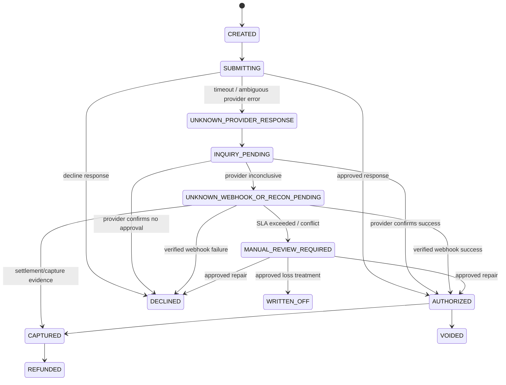
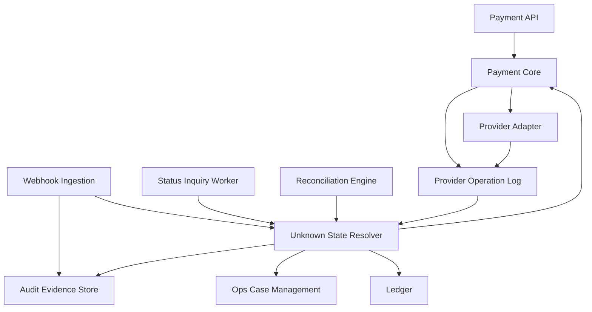
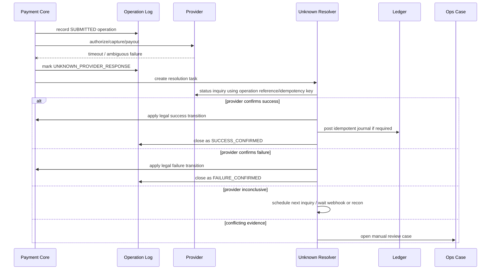
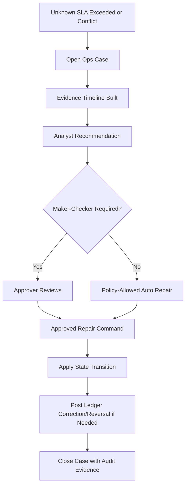

------
title: Build From Scratch: Large Production Grade Java Payment Systems - Part 039
description: Unknown payment state resolution for enterprise Java payment systems, covering timeout semantics, provider inquiry, webhook repair, reconciliation repair, evidence hierarchy, suspense handling, manual review, and safe resolution workflows.
series: learn-java-payment-systems
seriesTitle: Build From Scratch: Large Production Grade Java Payment Systems
order: 39
partTitle: Unknown Payment State Resolution
tags:
- java
- payments
- unknown-state
- reconciliation
- webhooks
- idempotency
- payment-operations
- ledger
- enterprise-architecture
date: 2026-07-02
---

# Part 039 — Unknown Payment State Resolution

A payment system becomes dangerous when it pretends to know what it does not know.

The most expensive bug is often not:

```txt
payment failed
```

The most expensive bug is:

```txt
payment status is unknown, but the platform treats it as failed and tries again
```

That can produce:

```txt
double charge
duplicate payout
duplicate settlement liability
merchant over-credit
customer trust damage
manual reconciliation chaos
regulatory/audit weakness
```

In normal software, an unknown result is annoying.

In payment software, an unknown result is a financial control problem.

This part builds a production-grade unknown-state resolution model for Java payment systems.

---

## 1. Core Mental Model

A payment operation crosses boundaries you do not control:

```txt
Your API
  -> your database
  -> your provider adapter
  -> provider API
  -> processor/acquirer/bank/wallet
  -> issuer/customer institution
  -> provider webhook/reporting/reconciliation
```

Any boundary can fail after the previous boundary already performed a side effect.

Example:

```txt
1. Customer confirms payment.
2. Your system sends authorize request to provider.
3. Provider forwards request to network.
4. Issuer approves.
5. Provider receives approval.
6. Your connection times out before response arrives.
```

Your system sees:

```txt
HTTP timeout
```

Reality may be:

```txt
money was authorized
```

So the invariant is:

```txt
A timeout is not a decline.
A missing response is not a failure.
An absent webhook is not proof that money did not move.
```

Unknown state is a first-class domain state.

---

## 2. Unknown Is Not One State

A mature platform does not store only:

```txt
UNKNOWN
```

It classifies unknown by cause and by recovery path.

```txt
UNKNOWN_PROVIDER_RESPONSE
UNKNOWN_WEBHOOK_DELAYED
UNKNOWN_STATUS_INQUIRY_PENDING
UNKNOWN_RECONCILIATION_PENDING
UNKNOWN_MANUAL_REVIEW_REQUIRED
UNKNOWN_PROVIDER_CONFLICT
UNKNOWN_LEDGER_CONFLICT
UNKNOWN_SETTLEMENT_MISMATCH
```

Each subtype answers:

```txt
What evidence do we have?
What evidence is missing?
What operation must never be repeated yet?
Which resolver owns the next step?
What is the SLA?
What customer/merchant message is safe?
What ledger posting is allowed?
```

Unknown is not an error bucket.

Unknown is a resolution workflow.

---

## 3. Common Sources of Unknown State

### 3.1 Transport Timeout

```txt
client -> payment platform: request received
payment platform -> provider: request sent
provider -> payment platform: response lost or delayed
```

You know the request left your system.

You do not know whether the provider executed it.

Safe behavior:

```txt
record provider operation as SENT
mark attempt as UNKNOWN_PROVIDER_RESPONSE
schedule status inquiry
reject unsafe repeat operations
wait for webhook/reconciliation/provider inquiry
```

Unsafe behavior:

```txt
mark as failed
try another provider immediately
allow customer to pay again without warning
release reserved balance blindly
```

---

### 3.2 Provider 5xx After Side Effect

A provider `500` does not always mean no side effect.

It may mean:

```txt
provider executed operation but failed while formatting response
provider timed out waiting for processor
provider accepted asynchronous operation but returned generic error
provider system is inconsistent
```

Provider docs usually define retry/idempotency expectations differently.

The platform must model provider-specific behavior behind the adapter.

---

### 3.3 Webhook Delay

Webhook delivery is asynchronous.

Provider events can arrive:

```txt
late
duplicate
out of order
after manual status inquiry already resolved the attempt
after reconciliation imported settlement data
after customer support already touched the case
```

Stripe documents automatic webhook retries for up to three days in live mode with exponential backoff. That means webhook arrival time cannot be assumed to match business event time.

Design implication:

```txt
webhook_received_at != provider_event_created_at != payment_effective_at
```

---

### 3.4 Out-of-Order Events

Example:

```txt
CAPTURED arrives before AUTHORIZED
REFUNDED arrives before CAPTURED
SETTLED arrives before CAPTURED due to imported report order
DISPUTE_OPENED arrives before final settlement import
```

Safe behavior:

```txt
store event durably
validate signature
correlate target aggregate
apply only if transition is legal
if prerequisite missing, park event as pending_dependency
run repair job when dependency appears
```

Unsafe behavior:

```txt
overwrite status with latest webhook blindly
```

---

### 3.5 Reconciliation Mismatch

Reconciliation can reveal:

```txt
provider says success but internal state says failed
provider says failed but internal state says pending
bank statement shows funds but provider report lacks transaction
settlement file includes transaction not in internal ledger
fee amount differs from pricing engine result
```

This is not merely reporting.

Reconciliation is one of the strongest sources of truth for financial state repair.

---

### 3.6 Partial Internal Commit

Even if provider is correct, your own system can be partially correct:

```txt
payment_attempt updated
outbox not published
ledger posting failed
webhook event stored but not applied
status changed but operation log not closed
manual adjustment created but approval event missing
```

Unknown state can be internal, not only external.

---

## 4. Evidence Hierarchy

A payment platform should have an explicit evidence hierarchy.

Not every signal has equal authority.

Typical hierarchy:

```txt
1. Ledger journal posted by controlled posting rule
2. Provider/bank/scheme settlement report
3. Provider status inquiry response
4. Verified provider webhook
5. Provider synchronous API response
6. Internal operation log
7. Customer/merchant claim
8. Application log line
```

This hierarchy is not absolute for every rail.

For example:

```txt
card authorization response may be stronger than later display status
bank statement may be stronger than provider webhook for transfer receipt
settlement report may be stronger than authorization event for funds movement
manual adjustment may be valid only with maker-checker approval
```

The platform should encode this as policy, not tribal knowledge.

---

## 5. State Machine Extension for Unknown

A simplified payment attempt state machine:



Notice the system never jumps from timeout to failed without evidence.

---

## 6. Unknown State Policy Matrix

| Condition | Safe customer status | Internal state | Allowed action | Forbidden action |
|---|---|---|---|---|
| Provider timeout after request sent | Processing | Unknown provider response | Inquiry, wait webhook | New charge on different route |
| Verified success webhook after timeout | Paid/Authorized | Authorized/Captured | Post ledger if not posted | Treat as duplicate failure |
| Provider says not found immediately after timeout | Processing | Inquiry pending | Retry inquiry later | Assume failure instantly |
| Provider says declined with matching operation ID | Failed | Declined | Release hold | Retry same operation automatically without policy |
| Settlement report contains transaction unknown internally | Paid with repair | Reconciliation break | Create repair case | Ignore as report noise |
| Conflicting provider success and failure events | Under review | Manual review required | Freeze state, collect evidence | Last-write-wins |

---

## 7. Reference Architecture



The resolver does not invent truth.

It evaluates evidence and applies controlled transitions.

---

## 8. Provider Operation Log

Unknown state resolution starts with a durable operation log.

Without it, you cannot answer:

```txt
Did we send the request?
Which provider endpoint did we call?
Which idempotency key did we use?
What provider reference did we receive?
What raw response did we get?
Did the connection fail before or after headers?
Was the retry using the same operation identity?
Which credential/config version was used?
```

Example schema:

```sql
create table provider_operation (
    id uuid primary key,
    payment_attempt_id uuid not null,
    provider_name text not null,
    provider_account_id text not null,
    operation_type text not null,
    operation_key text not null,
    request_fingerprint text not null,
    provider_request_id text,
    provider_reference text,
    status text not null,
    ambiguity_reason text,
    http_status int,
    normalized_result text,
    retryable boolean not null default false,
    idempotency_key text not null,
    request_payload_hash text not null,
    response_payload_hash text,
    sent_at timestamptz,
    completed_at timestamptz,
    created_at timestamptz not null default now(),
    updated_at timestamptz not null default now(),

    unique (provider_name, provider_account_id, operation_key),
    unique (provider_name, provider_account_id, idempotency_key)
);
```

Important fields:

```txt
operation_key        stable internal key for the financial operation
idempotency_key      provider-facing retry key when provider supports it
request_fingerprint immutable semantic hash of the intended operation
ambiguity_reason     why the platform does not know the result
provider_reference   external correlation handle, if known
```

---

## 9. Unknown Resolution Task

Unknown states should not depend on ad-hoc support queries.

Create a durable task.

```sql
create table unknown_resolution_task (
    id uuid primary key,
    aggregate_type text not null,
    aggregate_id uuid not null,
    provider_operation_id uuid,
    reason text not null,
    status text not null,
    priority int not null default 100,
    next_attempt_at timestamptz not null,
    attempt_count int not null default 0,
    max_attempts int not null default 20,
    last_error_code text,
    last_error_message text,
    locked_by text,
    locked_until timestamptz,
    created_at timestamptz not null default now(),
    updated_at timestamptz not null default now(),

    unique (aggregate_type, aggregate_id, reason)
);

create index idx_unknown_resolution_ready
on unknown_resolution_task (next_attempt_at, priority)
where status = 'READY';
```

Worker claim pattern:

```sql
with picked as (
    select id
    from unknown_resolution_task
    where status = 'READY'
      and next_attempt_at <= now()
      and (locked_until is null or locked_until < now())
    order by priority asc, next_attempt_at asc
    for update skip locked
    limit 100
)
update unknown_resolution_task t
set locked_by = :worker_id,
    locked_until = now() + interval '60 seconds',
    status = 'RUNNING',
    updated_at = now()
from picked
where t.id = picked.id
returning t.*;
```

This is not generic job processing.

It is a financial repair queue.

---

## 10. Resolution Flow



---

## 11. Resolver Algorithm

Pseudo-code:

```java
public final class UnknownStateResolver {

    private final ProviderInquiryPort providerInquiry;
    private final EvidenceRepository evidenceRepository;
    private final PaymentAttemptRepository attemptRepository;
    private final LedgerPostingService ledgerPostingService;
    private final OpsCaseService opsCaseService;

    public ResolutionResult resolve(UnknownResolutionTask task) {
        PaymentAttempt attempt = attemptRepository.getForUpdate(task.aggregateId());
        EvidenceSet evidence = evidenceRepository.collectFor(attempt.id());

        ResolutionDecision decision = classify(attempt, evidence);

        return switch (decision.action()) {
            case CONFIRM_SUCCESS -> confirmSuccess(attempt, decision);
            case CONFIRM_FAILURE -> confirmFailure(attempt, decision);
            case RUN_PROVIDER_INQUIRY -> runInquiry(attempt, task);
            case WAIT_FOR_WEBHOOK_OR_RECON -> reschedule(task, decision.nextAttemptAt());
            case OPEN_MANUAL_REVIEW -> openCase(attempt, decision);
            case NOOP_ALREADY_RESOLVED -> ResolutionResult.noop();
        };
    }
}
```

Key rule:

```txt
The resolver must be idempotent.
```

If the same task runs twice, it must not double-post ledger, double-open cases, or double-release holds.

---

## 12. Evidence Model

```java
public sealed interface PaymentEvidence
        permits ProviderSynchronousResponse,
                VerifiedWebhookEvent,
                ProviderInquiryResponse,
                ReconciliationRecord,
                LedgerJournalEvidence,
                ManualDecisionEvidence {

    EvidenceId id();
    PaymentAttemptId attemptId();
    Instant observedAt();
    Instant effectiveAt();
    EvidenceSource source();
    EvidenceStrength strength();
    String rawReference();
    PayloadHash payloadHash();
}
```

Evidence strength should be explicit:

```java
public enum EvidenceStrength {
    INTERNAL_OPERATION_LOG,
    SYNCHRONOUS_PROVIDER_RESPONSE,
    VERIFIED_WEBHOOK,
    PROVIDER_INQUIRY,
    SETTLEMENT_REPORT,
    BANK_STATEMENT,
    LEDGER_JOURNAL,
    APPROVED_MANUAL_DECISION
}
```

This makes resolution explainable.

A support operator should be able to see:

```txt
why this payment was marked captured
which evidence caused the transition
which weaker signals were ignored
who approved manual repair
which ledger journal was posted
```

---

## 13. Provider Inquiry

A provider inquiry asks:

```txt
What is the status of operation X?
```

But providers differ in what `X` means:

```txt
provider payment ID
merchant reference
idempotency key
order ID
transaction reference
RRN/STAN/approval code
virtual account number
QR reference
payout reference
```

The adapter must hide this behind a stable port.

```java
public interface ProviderStatusInquiryPort {
    InquiryResult inquire(ProviderOperation operation);
}

public sealed interface InquiryResult {
    record ConfirmedSuccess(
            ProviderReference providerReference,
            ProviderStatus providerStatus,
            Money amount,
            Instant providerEffectiveAt,
            RawPayloadHash payloadHash
    ) implements InquiryResult {}

    record ConfirmedFailure(
            ProviderStatus providerStatus,
            String providerReasonCode,
            RawPayloadHash payloadHash
    ) implements InquiryResult {}

    record NotFoundYet(String reason) implements InquiryResult {}

    record StillAmbiguous(String reason, boolean retryLater) implements InquiryResult {}

    record ProviderUnavailable(String reason) implements InquiryResult {}

    record ConflictDetected(String reason) implements InquiryResult {}
}
```

Do not let provider-specific status leak into core.

---

## 14. `Not Found` Is Not Always Failure

A subtle failure mode:

```txt
provider status inquiry returns NOT_FOUND
```

This may mean:

```txt
operation never reached provider
provider has eventual consistency delay
wrong reference was used
provider stored the transaction under a different ID
operation is on a downstream network but not visible yet
```

So `NOT_FOUND` should often be:

```txt
NOT_FOUND_YET
```

not:

```txt
FAILED
```

Rule:

```txt
Only classify NOT_FOUND as final failure if provider contract explicitly guarantees immediate read-after-write visibility for the reference used, or if reconciliation/expiry policy says it is safe.
```

---

## 15. Handling Verified Webhooks During Unknown

When a webhook arrives for an unknown attempt:

```txt
verify signature
store raw event
dedupe event
correlate attempt
load attempt with lock
compare event against current state
apply legal transition
close/annotate unknown resolution task
post ledger idempotently if required
emit domain event
```

Webhook must not bypass the state machine.

```java
public final class WebhookPaymentEventApplier {

    public ApplyResult apply(VerifiedProviderEvent event) {
        PaymentAttempt attempt = attempts.getForUpdate(event.attemptId());

        Transition transition = transitionPolicy.fromProviderEvent(attempt.state(), event);

        if (transition.isIllegalButParkable()) {
            parkedEvents.park(event, transition.reason());
            return ApplyResult.parked();
        }

        if (transition.requiresManualReview()) {
            cases.openConflictCase(attempt, event, transition.reason());
            return ApplyResult.manualReview();
        }

        attempt.apply(transition);
        ledger.postIfRequired(transition.ledgerPostingCommand());
        tasks.closeRelatedUnknownTasks(attempt.id());
        return ApplyResult.applied();
    }
}
```

---

## 16. Reconciliation as Resolution Source

Reconciliation can close unknowns when API/webhook paths fail.

Example:

```txt
Internal: UNKNOWN_PROVIDER_RESPONSE
Provider settlement report: transaction settled successfully
```

Resolution:

```txt
mark attempt captured/settled depending on lifecycle
post missing ledger journal if absent
link settlement row as evidence
close unknown task
create audit event
notify merchant if needed
```

But if reconciliation shows transaction with unknown internal reference:

```txt
provider settlement row has merchant_reference = missing / malformed
amount matches no known payment
```

Resolution:

```txt
post to suspense only if accounting policy allows
open reconciliation break case
never silently credit random merchant
```

---

## 17. Suspense Accounts

Suspense exists for money/evidence that cannot yet be safely assigned.

Example chart:

```txt
Asset: Bank Cash
Liability: Merchant Payable
Liability: Customer Wallet
Liability: Suspense Unallocated Inbound Funds
Asset Contra: Provider Receivable
Expense: Payment Loss
```

Example journal for unidentified inbound bank transfer:

```txt
Dr Bank Cash                              100.00
Cr Suspense Unallocated Inbound Funds     100.00
```

After investigation assigns it to merchant/customer obligation:

```txt
Dr Suspense Unallocated Inbound Funds     100.00
Cr Merchant Pending Payable               100.00
```

Do not use suspense as a trash bin.

Every suspense balance needs:

```txt
age
owner
case
expected resolution path
write-off policy
approval evidence
```

---

## 18. Customer and Merchant Messaging

Unknown state must be reflected carefully.

Bad message:

```txt
Payment failed. Try again.
```

Safer message:

```txt
We are still confirming your payment. Please do not retry yet. This usually resolves automatically.
```

For merchant API:

```json
{
  "paymentIntentId": "pi_123",
  "status": "processing",
  "resolutionStatus": "provider_confirmation_pending",
  "safeToRetry": false,
  "safeToFulfill": false,
  "nextAction": {
    "type": "wait_for_confirmation"
  }
}
```

The API should not expose every internal unknown subtype, but it must expose safe operational meaning.

---

## 19. Fulfillment Decision

Payment status and fulfillment status are related but separate.

```txt
AUTHORIZED may allow reservation of inventory
CAPTURED may allow shipment depending on merchant policy
PROCESSING may block fulfillment
UNKNOWN may require hold
SETTLED usually confirms financial finality but may arrive too late for fulfillment
```

Design:

```java
public enum FulfillmentRecommendation {
    FULFILL,
    HOLD,
    CANCEL,
    MANUAL_REVIEW
}
```

Never let the order service infer fulfillment safety from raw provider status.

Payment platform should publish a domain event:

```json
{
  "eventType": "payment.fulfillment_recommendation_changed",
  "paymentIntentId": "pi_123",
  "recommendation": "HOLD",
  "reason": "UNKNOWN_PROVIDER_RESPONSE",
  "safeToRetryPayment": false
}
```

---

## 20. Backoff and SLA

Unknown resolution should have escalation tiers.

Example:

```txt
T+0s       create unknown task
T+15s      first status inquiry
T+60s      second inquiry
T+5m       wait webhook/inquiry
T+30m      merchant-visible processing warning
T+2h       operations queue if high value
T+24h      reconciliation priority
T+72h      manual review mandatory if unresolved
```

This varies by rail.

Card auth, virtual account, QR, payout, and bank transfer have different timing assumptions.

The SLA should be policy-driven:

```sql
create table unknown_resolution_policy (
    id uuid primary key,
    payment_method_type text not null,
    operation_type text not null,
    amount_band text not null,
    merchant_risk_tier text not null,
    first_inquiry_delay_seconds int not null,
    max_auto_resolution_seconds int not null,
    manual_review_after_seconds int not null,
    high_value_threshold_minor bigint not null,
    created_at timestamptz not null default now()
);
```

---

## 21. Conflict Resolution

Conflicts happen.

Example:

```txt
sync response says failed
webhook says authorized
settlement report says settled
```

A production system does not use last-write-wins.

It creates a conflict case.

```sql
create table payment_evidence_conflict (
    id uuid primary key,
    payment_attempt_id uuid not null,
    conflict_type text not null,
    status text not null,
    strongest_success_evidence_id uuid,
    strongest_failure_evidence_id uuid,
    opened_at timestamptz not null default now(),
    resolved_at timestamptz,
    resolution text,
    resolved_by text
);
```

Conflict handling policy:

```txt
freeze unsafe actions
prevent automatic payout if merchant credit is uncertain
prevent duplicate refund if capture is uncertain
open case with evidence timeline
allow approved repair transition only through auditable workflow
```

---

## 22. Ledger Posting During Unknown

Do not post final financial movements without sufficient evidence.

But you may need temporary control postings.

Examples:

### Card authorization unknown

Usually do not credit merchant yet.

```txt
No final merchant payable posting until authorization/capture evidence exists.
```

### Wallet spend submitted to external merchant but unknown

You may hold customer balance:

```txt
Dr Customer Available Wallet      100.00
Cr Customer Pending Hold          100.00
```

When confirmed successful:

```txt
Dr Customer Pending Hold          100.00
Cr Merchant Payable               100.00
```

When confirmed failed:

```txt
Dr Customer Pending Hold          100.00
Cr Customer Available Wallet      100.00
```

### Payout unknown

You may keep funds in payout pending until bank/provider confirms.

```txt
Dr Merchant Available Payable     100.00
Cr Merchant Payout Pending        100.00
```

Do not return funds to available balance on timeout.

---

## 23. Manual Review Workflow

Manual review is not editing database rows.

It is a controlled state transition.



Manual decision data:

```sql
create table payment_manual_resolution_decision (
    id uuid primary key,
    case_id uuid not null,
    payment_attempt_id uuid not null,
    recommended_state text not null,
    ledger_action text not null,
    reason_code text not null,
    evidence_summary text not null,
    maker_user_id text not null,
    checker_user_id text,
    approved_at timestamptz,
    applied_at timestamptz,
    created_at timestamptz not null default now()
);
```

---

## 24. Unknown State Metrics

Measure unknown state as a first-class health signal.

```txt
unknown_attempts_total
unknown_attempts_by_provider
unknown_attempts_by_method
unknown_attempts_by_reason
unknown_age_p50/p95/p99
unknown_value_minor_total
unknown_high_value_count
unknown_auto_resolved_total
unknown_manual_review_total
unknown_conflict_total
inquiry_success_rate
inquiry_error_rate
webhook_resolution_latency
reconciliation_resolution_count
```

Business SLO examples:

```txt
99.9% of card authorization unknowns resolved within 15 minutes
99% of payout unknowns resolved within 24 hours
0 unresolved unknowns older than 72 hours without case owner
100% of manual resolution decisions have evidence and approval
```

---

## 25. Alerting

Alert on:

```txt
provider-specific unknown spike
unknown value above threshold
unknown age breach
status inquiry failure spike
webhook delivery gap
reconciliation break involving previously failed payments
manual review backlog
suspense balance age breach
```

Avoid alerting only on technical errors.

An API can be healthy while money state is unknown.

---

## 26. Testing Matrix

| Scenario | Expected behavior |
|---|---|
| Provider timeout after auth request | Attempt becomes unknown; no retry to different route |
| Provider success webhook after timeout | Attempt becomes authorized/captured; task closes |
| Provider decline webhook after timeout | Attempt becomes declined; hold released |
| Duplicate webhook success | No duplicate ledger posting |
| Out-of-order capture before auth | Event parked or case opened depending policy |
| Inquiry returns not found immediately | Remains unknown until policy expiry |
| Settlement report shows success for failed internal attempt | Reconciliation break and repair workflow |
| Conflicting success/failure evidence | Manual review case; no last-write-wins |
| Resolver task runs twice concurrently | One transition; no duplicate journal |
| Manual repair approved twice | Idempotent repair command prevents duplicate posting |

---

## 27. Property-Based Invariants

Test unknown resolution with generated event orderings.

Invariants:

```txt
A payment attempt cannot be both failed and captured.
A ledger posting for capture is idempotent by payment operation key.
A timeout cannot release a payout reservation.
A duplicate success webhook cannot increase merchant payable twice.
A failure event after settlement evidence cannot erase settlement without manual case.
A manual repair must leave ledger balanced.
Unknown tasks eventually close or escalate to case.
```

---

## 28. Anti-Patterns

### Anti-Pattern 1: Timeout Means Failed

```txt
timeout -> failed -> allow retry
```

This is how duplicate charges happen.

### Anti-Pattern 2: Last Webhook Wins

```txt
payment.status = webhook.status
```

This ignores state machine legality and evidence strength.

### Anti-Pattern 3: Manual SQL Repair

```sql
update payment_attempt set status = 'CAPTURED' where id = ...;
```

No audit trail, no ledger posting, no evidence, no replay safety.

### Anti-Pattern 4: Reconciliation Only as Report

Reconciliation is not only a finance report.

It is a state repair input.

### Anti-Pattern 5: No Provider Operation Log

If you only store final payment state, you cannot reconstruct ambiguity.

---

## 29. Implementation Checklist

```txt
[ ] Every provider operation has stable operation_key
[ ] Every provider operation stores idempotency key and request fingerprint
[ ] Timeout creates UNKNOWN state, not failed state
[ ] Unknown state creates durable resolution task
[ ] Provider inquiry is adapter-specific but core-normalized
[ ] Webhook is verified, stored, deduped, and applied through state machine
[ ] Reconciliation can resolve or escalate unknowns
[ ] Conflicting evidence opens case, not last-write-wins
[ ] Ledger posting is idempotent
[ ] Suspense accounts have owner, age, and resolution policy
[ ] Customer/merchant API exposes safe processing semantics
[ ] Unknown state metrics are visible
[ ] Unknown SLA breach alerts exist
[ ] Manual repair requires evidence and audit trail
```

---

## 30. The Real Lesson

Unknown state is not an exception.

It is the normal result of distributed money movement.

A production payment platform must behave like this:

```txt
When I know, I transition.
When I do not know, I preserve evidence.
When evidence conflicts, I escalate.
When I repair, I leave an audit trail.
When I post money, I do it once.
```

That is the difference between a payment demo and a payment system.

---

## References

- Stripe Docs — Receive Stripe events in your webhook endpoint: `https://docs.stripe.com/webhooks`
- Stripe Docs — Process undelivered webhook events: `https://docs.stripe.com/webhooks/process-undelivered-events`
- Adyen Docs — Verify HMAC signatures: `https://docs.adyen.com/development-resources/webhooks/secure-webhooks/verify-hmac-signatures`
- PayPal Developer — Webhooks guide and verification: `https://developer.paypal.com/api/rest/webhooks/`
- PostgreSQL Docs — Explicit Locking: `https://www.postgresql.org/docs/current/explicit-locking.html`
- Martin Fowler — Accounting Transaction: `https://martinfowler.com/eaaDev/AccountingTransaction.html`
