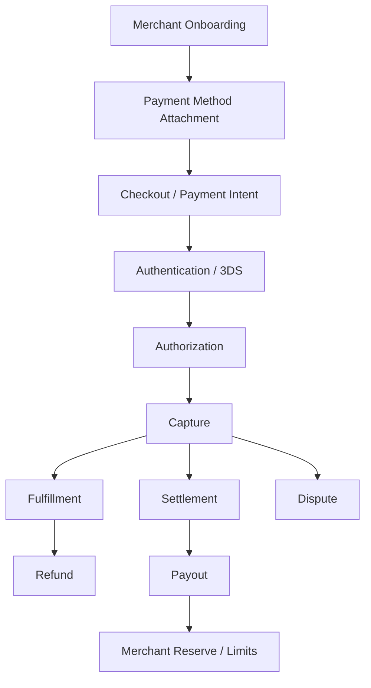
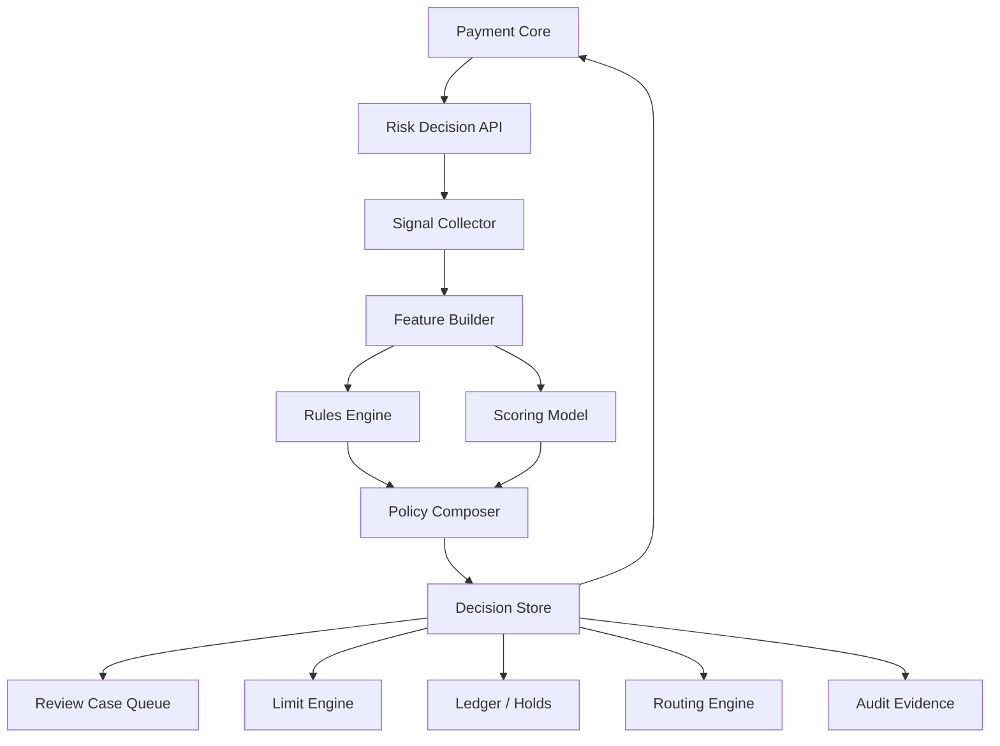
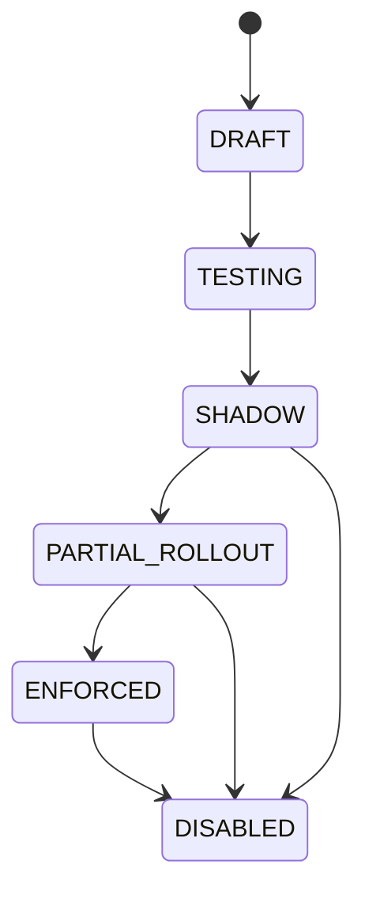

------
title: Build From Scratch: Large Production Grade Java Payment Systems - Part 040
description: Risk engine foundation for enterprise Java payment systems, covering risk signals, velocity rules, policy decisions, fraud workflows, rule versioning, review queues, feature collection, privacy boundaries, and risk decision auditability.
series: learn-java-payment-systems
seriesTitle: Build From Scratch: Large Production Grade Java Payment Systems
order: 40
partTitle: Risk Engine Foundation
tags:
- java
- payments
- risk-engine
- fraud-detection
- velocity-rules
- policy-engine
- compliance
- payment-systems
- enterprise-architecture
date: 2026-07-02
---

# Part 040 — Risk Engine Foundation

A payment risk engine is often misunderstood.

Many teams think it means:

```txt
fraud machine learning model
```

That is too narrow.

A production payment risk engine is a control system that answers:

```txt
Should this payment be allowed?
Should it be challenged?
Should it be held?
Should it be routed differently?
Should it be manually reviewed?
Should this merchant be limited?
Should this payout be delayed?
Should this account be frozen?
```

The risk engine protects:

```txt
customers
merchants
platform funds
issuer/acquirer relationships
scheme compliance
regulatory obligations
brand trust
operations capacity
```

This part builds the foundation for a production-grade risk engine in Java.

---

## 1. Risk Engine Is a Decision System

A risk engine does not merely compute a score.

It produces a decision.

```txt
input signals -> risk evaluation -> decision -> reason codes -> downstream controls -> evidence
```

Example:

```json
{
  "decision": "REVIEW",
  "riskScore": 742,
  "reasonCodes": [
    "HIGH_VELOCITY_CARD_BIN",
    "NEW_DEVICE",
    "MERCHANT_HIGH_DISPUTE_RATE"
  ],
  "actions": [
    "HOLD_FULFILLMENT",
    "REQUIRE_MANUAL_REVIEW"
  ],
  "decisionId": "rd_01h...",
  "policyVersion": "payment-preauth-v17"
}
```

The score helps explain.

The decision controls the platform.

---

## 2. Risk Happens Across the Payment Lifecycle

Risk is not only before authorization.



Risk decisions exist at many points:

| Stage | Risk question |
|---|---|
| Merchant onboarding | Should this merchant be allowed to process? |
| Payment method attach | Is this card/device/customer suspicious? |
| Payment confirm | Should this payment be allowed/challenged/blocked? |
| Authorization response | Should a soft decline trigger step-up or retry? |
| Capture | Should capture be delayed pending review? |
| Fulfillment | Should goods be shipped? |
| Refund | Is refund abuse likely? |
| Payout | Should merchant payout be held? |
| Dispute | Should merchant reserve increase? |
| Backoffice | Is operator action risky? |

---

## 3. Risk Decision Vocabulary

Define decisions explicitly.

```java
public enum RiskDecisionType {
    ALLOW,
    BLOCK,
    REVIEW,
    CHALLENGE,
    HOLD,
    LIMIT,
    ROUTE_AWAY,
    REQUIRE_APPROVAL,
    FREEZE
}
```

Decision meanings:

| Decision | Meaning |
|---|---|
| `ALLOW` | Continue normal flow |
| `BLOCK` | Stop operation immediately |
| `REVIEW` | Pause or allow with human review depending policy |
| `CHALLENGE` | Require step-up authentication such as 3DS or OTP equivalent |
| `HOLD` | Allow payment but hold fulfillment, settlement, wallet balance, or payout |
| `LIMIT` | Reduce allowed amount/count/capability |
| `ROUTE_AWAY` | Avoid provider/rail/region/method due to risk or compliance |
| `REQUIRE_APPROVAL` | Maker-checker or higher authority needed |
| `FREEZE` | Freeze account/merchant/wallet capability |

A good risk engine separates:

```txt
decision
reason
control action
user-facing message
merchant-facing message
internal evidence
```

---

## 4. Risk Signals

Risk signals are observations.

They are not decisions by themselves.

### 4.1 Customer Signals

```txt
customer age on platform
previous successful payments
previous failed payments
refund history
dispute history
chargeback history
account takeover indicators
email reputation
phone reputation
KYC/KYB status if applicable
```

### 4.2 Device and Session Signals

```txt
device fingerprint
browser characteristics
IP address
proxy/VPN/TOR indicator
geo mismatch
new device
session age
cookie continuity
login risk score
```

### 4.3 Payment Method Signals

```txt
card BIN/IIN
card country
issuer country
prepaid/debit/credit/commercial card
wallet type
bank account age
VA/QR/payment rail type
token type
3DS availability
previous usage count
```

### 4.4 Transaction Signals

```txt
amount
currency
cart type
shipping speed
digital vs physical goods
high resale value item
first transaction
amount deviation from customer norm
merchant risk tier
cross-border flag
```

### 4.5 Merchant Signals

```txt
merchant age
business category/MCC
processing volume
refund rate
dispute rate
chargeback ratio
payout behavior
sudden volume spike
manual adjustment rate
support complaints
onboarding/KYB status
```

### 4.6 Network and Provider Signals

```txt
issuer response code
processor risk code
AVS/CVC result where applicable
3DS authentication result
provider risk score
wallet risk response
bank account verification result
```

### 4.7 Operations Signals

```txt
manual override frequency
operator risk level
case backlog
previous maker-checker exceptions
break-glass access usage
```

---

## 5. Signal Quality

Not all signals are equal.

Signal metadata should include:

```txt
source
observed_at
effective_at
confidence
freshness
scope
privacy classification
retention policy
normalization version
```

Example:

```java
public record RiskSignal(
        String name,
        SignalValue value,
        SignalSource source,
        Instant observedAt,
        Duration maxAge,
        SignalConfidence confidence,
        PrivacyClass privacyClass
) {}
```

A stale signal should not silently drive high-impact decisions.

---

## 6. Risk Engine Reference Architecture



The key idea:

```txt
Risk decision is persisted before downstream action depends on it.
```

Do not recompute risk differently in every service.

---

## 7. Online vs Offline Risk

### Online Risk

Online risk runs in the payment path.

Constraints:

```txt
low latency
high availability
deterministic fallback
no heavy joins
clear timeout behavior
idempotent decision ID
```

Example decisions:

```txt
allow payment
require 3DS
block payment
hold fulfillment
```

### Offline Risk

Offline risk runs after events accumulate.

Constraints:

```txt
batch/stream processing
historical analysis
case generation
merchant tier update
reserve adjustment
model training
```

Example decisions:

```txt
increase merchant reserve
freeze payout
open account review
adjust routing risk tier
```

A production platform needs both.

---

## 8. Synchronous Decision Contract

Payment Core calls Risk before critical transitions.

```http
POST /risk-decisions/payment-confirm
Idempotency-Key: risk_pi_123_confirm_1
Content-Type: application/json
```

```json
{
  "paymentIntentId": "pi_123",
  "paymentAttemptId": "pa_456",
  "merchantId": "m_789",
  "customerId": "c_111",
  "amount": {
    "currency": "IDR",
    "minor": 15000000
  },
  "paymentMethod": {
    "type": "CARD",
    "cardBin": "411111",
    "cardCountry": "US",
    "tokenType": "NETWORK_TOKEN"
  },
  "session": {
    "ipCountry": "ID",
    "deviceId": "dev_abc",
    "isNewDevice": true
  },
  "context": {
    "operation": "CONFIRM_PAYMENT",
    "channel": "WEB_CHECKOUT"
  }
}
```

Response:

```json
{
  "riskDecisionId": "rd_123",
  "decision": "CHALLENGE",
  "riskScore": 681,
  "reasonCodes": [
    "NEW_DEVICE",
    "CROSS_BORDER_CARD",
    "HIGH_AMOUNT_FOR_NEW_CUSTOMER"
  ],
  "actions": [
    {
      "type": "REQUIRE_3DS"
    }
  ],
  "policyVersion": "payment-confirm-v21",
  "expiresAt": "2026-07-02T10:15:00Z"
}
```

---

## 9. Risk Decision Store

Risk decisions must be auditable.

```sql
create table risk_decision (
    id uuid primary key,
    decision_key text not null,
    subject_type text not null,
    subject_id text not null,
    operation_type text not null,
    decision text not null,
    risk_score int,
    policy_version text not null,
    model_version text,
    reason_codes text[] not null,
    actions jsonb not null,
    input_fingerprint text not null,
    signal_snapshot_hash text not null,
    expires_at timestamptz,
    created_at timestamptz not null default now(),

    unique (decision_key)
);

create index idx_risk_decision_subject
on risk_decision (subject_type, subject_id, created_at desc);
```

Why store `input_fingerprint`?

```txt
same input + same policy version should return same idempotent decision
changed input should produce new decision or explicit conflict
```

Why store `signal_snapshot_hash`?

```txt
decision must be explainable later even if live signals changed
```

---

## 10. Rule Versioning

Rules change frequently.

If you cannot reconstruct which rule blocked a payment, you cannot defend the decision.

Example rule table:

```sql
create table risk_rule (
    id uuid primary key,
    rule_code text not null,
    rule_set text not null,
    version int not null,
    status text not null,
    expression text not null,
    action text not null,
    severity int not null,
    reason_code text not null,
    effective_from timestamptz not null,
    effective_until timestamptz,
    created_by text not null,
    approved_by text,
    created_at timestamptz not null default now(),

    unique (rule_code, version)
);
```

Rules should have:

```txt
code
version
owner
intent
expected false positive cost
expected false negative cost
test cases
approval trail
rollout percentage
kill switch
```

---

## 11. Simple Rule Engine Model

Start simple.

Do not begin with a black-box model.

```java
public interface RiskRule {
    RuleCode code();
    RuleVersion version();
    RuleEvaluation evaluate(RiskContext context);
}

public record RuleEvaluation(
        boolean matched,
        int scoreDelta,
        RiskDecisionType proposedDecision,
        ReasonCode reasonCode,
        List<RiskAction> actions
) {}
```

Example rule:

```java
public final class HighVelocityByCardRule implements RiskRule {

    @Override
    public RuleEvaluation evaluate(RiskContext ctx) {
        long attempts = ctx.velocity().count("card_bin", ctx.cardBin(), Duration.ofMinutes(10));

        if (attempts >= 20) {
            return new RuleEvaluation(
                    true,
                    250,
                    RiskDecisionType.REVIEW,
                    ReasonCode.HIGH_VELOCITY_CARD_BIN,
                    List.of(RiskAction.holdFulfillment())
            );
        }

        return RuleEvaluation.noMatch();
    }
}
```

---

## 12. Velocity Rules

Velocity is one of the most useful early controls.

It asks:

```txt
How many times has this entity done X in window Y?
```

Common velocity keys:

```txt
customer_id
merchant_id
card_fingerprint
card_bin
email_hash
phone_hash
device_id
ip_address
shipping_address_hash
beneficiary_account_hash
wallet_id
operator_id
```

Common windows:

```txt
1 minute
5 minutes
15 minutes
1 hour
24 hours
7 days
30 days
```

Common metrics:

```txt
attempt_count
success_count
decline_count
refund_count
dispute_count
payout_count
total_amount_minor
distinct_cards
distinct_customers
distinct_devices
```

---

## 13. Velocity Counter Design

Velocity counters need idempotency.

If payment confirmation retries three times, the risk engine must not count three separate attempts unless policy intentionally counts retries.

Example event:

```json
{
  "eventId": "evt_123",
  "eventType": "payment_attempt.created",
  "dedupeKey": "pa_456:first_submit",
  "dimensions": {
    "merchant_id": "m_789",
    "card_fingerprint": "cfp_abc",
    "device_id": "dev_111"
  },
  "amountMinor": 15000000,
  "occurredAt": "2026-07-02T10:00:00Z"
}
```

Counter update invariant:

```txt
same dedupeKey affects counters once
```

A practical design:

```sql
create table risk_velocity_event (
    id uuid primary key,
    dedupe_key text not null unique,
    event_type text not null,
    subject_hash text not null,
    amount_minor bigint,
    occurred_at timestamptz not null,
    created_at timestamptz not null default now()
);
```

Then maintain online counters in Redis and durable raw events in PostgreSQL/Kafka.

Do not make Redis the only evidence store.

---

## 14. Risk Actions

Risk actions should be typed.

```java
public sealed interface RiskAction permits
        Require3dsAction,
        BlockPaymentAction,
        HoldFulfillmentAction,
        HoldPayoutAction,
        OpenReviewCaseAction,
        ApplyLimitAction,
        RouteAwayAction,
        FreezeCapabilityAction {
}
```

Example:

```java
public record HoldPayoutAction(
        MerchantId merchantId,
        Duration holdDuration,
        String reasonCode
) implements RiskAction {}
```

Why actions matter:

```txt
Risk decision becomes executable.
Operations can audit what happened.
Payment Core does not interpret raw reason codes differently.
Backoffice can show meaningful controls.
```

---

## 15. Rule Composition

Risk decisions often combine many weaker signals.

Example:

```txt
new customer                     +80
new device                       +90
cross-border card                +120
high amount                      +140
merchant high dispute rate       +170
3DS frictionless successful      -100
previous customer success        -80
```

Policy:

```txt
score < 300       ALLOW
300..599          ALLOW + monitor
600..749          CHALLENGE
750..899          REVIEW/HOLD
>=900             BLOCK
hard rule match   override to BLOCK
```

Rules need priorities:

```txt
hard compliance block > fraud block > challenge > review > hold > allow
```

---

## 16. Hard Blocks vs Soft Risk

Hard blocks should be rare and explicit.

Examples:

```txt
sanctioned entity match
prohibited merchant category
blocked country by policy
known stolen card fingerprint
closed account
regulatory restriction
```

Soft risk:

```txt
new device
high amount
unusual velocity
high decline ratio
mismatched geo
```

Soft risk should often lead to:

```txt
challenge
review
hold
limit
route adjustment
```

not automatic permanent block.

---

## 17. 3DS and Risk

Risk engine should decide whether to request 3DS when optional.

Inputs:

```txt
issuer country
merchant region
card product
amount
device risk
customer history
merchant risk tier
SCA exemption eligibility
previous challenge friction
```

Decision:

```txt
frictionless preferred
challenge requested
exemption requested
force 3DS
skip 3DS
```

But 3DS result should also feed risk:

```txt
authentication successful -> reduce risk
challenge abandoned -> increase risk / cancel flow
authentication failed -> block or retry with different method
attempted but unavailable -> depends on policy
```

---

## 18. Payout Risk

Inbound payment risk and outbound payout risk are different.

Payout risk asks:

```txt
Should money leave the platform now?
```

Signals:

```txt
merchant age
settlement maturity
recent dispute spike
refund spike
sudden volume increase
unusual beneficiary change
bank account changed recently
reserve coverage
negative balance exposure
manual override history
```

Controls:

```txt
hold payout
split payout
reduce payout amount
increase reserve
require approval
freeze merchant capability
```

This is why risk engine must integrate with merchant accounting and settlement.

---

## 19. Merchant Risk Tier

Merchant tier should be explicit.

```txt
LOW
NORMAL
ELEVATED
HIGH
RESTRICTED
SUSPENDED
```

Tier affects:

```txt
allowed payment methods
transaction limits
settlement delay
reserve percentage
manual review threshold
payout frequency
chargeback monitoring
routing eligibility
```

Schema:

```sql
create table merchant_risk_profile (
    merchant_id uuid primary key,
    risk_tier text not null,
    reserve_rate_bps int not null default 0,
    payout_delay_days int not null default 0,
    max_transaction_amount_minor bigint,
    daily_volume_limit_minor bigint,
    capability_status jsonb not null,
    reason_codes text[] not null,
    policy_version text not null,
    updated_at timestamptz not null default now()
);
```

---

## 20. Review Case Queue

A `REVIEW` decision needs an operations workflow.

Not this:

```txt
status = REVIEW
```

But this:

```txt
case created
SLA assigned
evidence attached
operator queue selected
decision options constrained
approval required when high value
outcome updates payment/merchant/payout state
```

Case schema:

```sql
create table risk_review_case (
    id uuid primary key,
    subject_type text not null,
    subject_id text not null,
    risk_decision_id uuid not null,
    case_type text not null,
    priority int not null,
    status text not null,
    assigned_to text,
    sla_due_at timestamptz not null,
    evidence_snapshot jsonb not null,
    created_at timestamptz not null default now(),
    resolved_at timestamptz
);
```

Case outcome:

```txt
approve payment
reject payment
request customer action
hold fulfillment
release hold
hold payout
release payout
increase merchant tier
freeze capability
```

---

## 21. Explainability

Every risk decision should explain:

```txt
what was decided
which policy version ran
which rule matched
which signal values mattered
which model version was used if any
which action was executed
who overrode it if changed
```

Operator view:

```txt
Decision: REVIEW
Score: 742
Top Reasons:
- New device never seen for this customer
- 8 attempts from same card BIN in 10 minutes
- Merchant dispute rate crossed elevated threshold
Actions:
- Hold fulfillment
- Open fraud review case
Policy: payment-confirm-v21
```

Avoid exposing sensitive internals to fraudsters.

Customer-facing messages should be generic and safe.

---

## 22. Model vs Rules

A robust platform usually evolves like this:

```txt
Phase 1: explicit rules + velocity
Phase 2: rule tuning + review feedback
Phase 3: simple scoring model
Phase 4: ML-assisted score with rule guardrails
Phase 5: adaptive routing/risk optimization
```

Do not start with ML if you lack:

```txt
labeled outcomes
dispute feedback loop
feature correctness
data lineage
model monitoring
manual review taxonomy
false positive cost model
```

Rules are not primitive.

Bad rules are primitive.

Well-versioned, evidence-backed rules are production controls.

---

## 23. Feedback Loop

Risk decisions must learn from outcomes.

Outcome events:

```txt
payment succeeded
payment declined
payment refunded
payment disputed
chargeback won/lost
merchant payout failed
manual review approved/rejected
customer complaint received
account takeover confirmed
```

Feedback table:

```sql
create table risk_outcome_feedback (
    id uuid primary key,
    risk_decision_id uuid not null,
    outcome_type text not null,
    outcome_value text not null,
    financial_impact_minor bigint,
    occurred_at timestamptz not null,
    observed_at timestamptz not null default now(),
    source text not null
);
```

Without feedback, the engine cannot improve.

---

## 24. Data Minimization and Boundaries

Risk wants more data.

Security and privacy want less data.

Good design reconciles both:

```txt
hash identifiers where possible
classify sensitive fields
avoid storing raw PAN/CVC
avoid leaking PCI data into risk logs
store only needed feature values
limit retention
control access by purpose
separate customer-visible and operator-visible reasons
```

Risk engine should not become a shadow data lake of sensitive payment data.

---

## 25. PCI Boundary Awareness

Risk may need card-related signals:

```txt
BIN/IIN
last4
card country
card fingerprint/token
CVC check result
3DS result
```

But it should not receive:

```txt
full PAN
CVC
raw magnetic stripe/chip data
unredacted provider payload containing card data
```

Keep PCI scope controlled.

Risk needs features, not raw secrets.

---

## 26. Risk Decision Idempotency

Payment Core may call Risk multiple times due to retry.

Risk must be idempotent.

```txt
same decision_key + same input fingerprint + same policy version -> same decision
same decision_key + different input fingerprint -> conflict or new versioned decision
```

Example key:

```txt
risk:payment_attempt:pa_456:confirm:v1
```

If decision expires, create a new decision key:

```txt
risk:payment_attempt:pa_456:confirm:v2
```

Never let repeated calls create multiple conflicting review cases.

---

## 27. Timeout Behavior

Risk engine timeout is itself a risk decision.

Policies:

```txt
fail closed for high-risk operation
fail open for low-risk low-value operation
fallback to cached merchant risk tier
fallback to require 3DS
fallback to hold payout
```

Do not hide timeout behavior in HTTP client config.

Make it domain policy.

```java
public enum RiskTimeoutPolicy {
    FAIL_OPEN_ALLOW,
    FAIL_CLOSED_BLOCK,
    REQUIRE_CHALLENGE,
    HOLD_AND_REVIEW,
    USE_CACHED_DECISION
}
```

---

## 28. Integration with Payment Core

Payment Core should not contain complex fraud logic.

It should ask Risk at policy points.

```java
public final class PaymentConfirmationService {

    public ConfirmResult confirm(ConfirmPaymentCommand command) {
        PaymentAttempt attempt = attempts.createOrLoad(command.idempotencyKey());

        RiskDecision decision = risk.decidePaymentConfirm(
                RiskDecisionRequest.from(command, attempt)
        );

        switch (decision.primaryDecision()) {
            case BLOCK -> {
                attempt.block(decision.id(), decision.reasonCodes());
                return ConfirmResult.blocked();
            }
            case CHALLENGE -> {
                attempt.requireAuthentication(decision.id());
                return ConfirmResult.nextAction3ds();
            }
            case REVIEW -> {
                attempt.markReviewPending(decision.id());
                return ConfirmResult.processingReview();
            }
            case ALLOW -> {
                return submitToProvider(attempt, decision);
            }
            default -> throw new IllegalStateException("Unsupported decision");
        }
    }
}
```

---

## 29. Integration with Routing

Risk can influence routing.

Example:

```txt
high-risk card + provider A has better 3DS support -> route to A
merchant high dispute rate -> disable low-friction wallet method
issuer decline spike -> route away from specific acquirer
country risk policy -> route to local acquirer or block
```

Risk should not directly call providers.

It should emit route constraints:

```json
{
  "routeConstraints": {
    "require3dsCapableProvider": true,
    "excludedProviders": ["provider_x"],
    "preferredAuthenticationStrength": "CHALLENGE_CAPABLE"
  }
}
```

Routing engine then chooses.

---

## 30. Integration with Ledger and Settlement

Risk actions often affect money availability.

Examples:

```txt
hold merchant payout
increase reserve
freeze wallet withdrawal
hold refund approval
prevent balance release
```

These must become ledger/balance controls, not flags ignored by settlement.

Example reserve adjustment:

```txt
Dr Merchant Settled Payable       100.00
Cr Merchant Rolling Reserve       100.00
```

The risk engine decides reserve policy.

The ledger posts the financial movement.

---

## 31. Operational Dashboards

Risk dashboard should show:

```txt
decision volume by type
block/review/challenge/allow rate
false positive indicators
manual review backlog
case SLA breach
merchant tier distribution
payout holds value
reserve value
dispute rate by merchant/method/provider
velocity rule hit rate
top reason codes
risk engine latency/error rate
risk timeout fallback count
```

Business health matters as much as technical health.

---

## 32. Testing Strategy

Risk tests should include:

```txt
rule unit tests
policy composition tests
decision idempotency tests
velocity dedupe tests
case creation tests
timeout fallback tests
feature freshness tests
privacy redaction tests
backtest against historical decisions
shadow mode comparison tests
```

Example test:

```java
@Test
void repeatedRiskRequestDoesNotCreateTwoCases() {
    RiskDecision first = risk.decide(requestWithKey("risk-pa-1"));
    RiskDecision second = risk.decide(requestWithKey("risk-pa-1"));

    assertThat(first.id()).isEqualTo(second.id());
    assertThat(reviewCases.countFor(first.id())).isEqualTo(1);
}
```

---

## 33. Shadow Mode

Before enforcing a new rule:

```txt
run rule in shadow mode
record would-have-blocked decisions
compare against later outcomes
measure false positives
measure operational load
then gradually enforce
```

Rule lifecycle:



---

## 34. Failure Modeling

| Failure | Safe behavior |
|---|---|
| Risk API timeout during low-value payment | Apply configured fallback, record fallback decision |
| Risk API timeout during high-value payout | Hold payout and open review |
| Redis velocity unavailable | Use degraded policy; never pretend velocity is zero without marking degraded |
| Rule deployment bug | Kill switch and rollback to previous policy version |
| Duplicate risk request | Return same decision |
| Signal collector stale data | Mark signal stale and apply policy |
| Review queue down | Hold operation or fail closed depending impact |
| Model service unavailable | Use rule-only policy fallback |
| Operator overrides block | Require approval and audit trail |

---

## 35. Anti-Patterns

### Anti-Pattern 1: Risk Score Without Decision

```txt
score = 0.84
```

What should Payment Core do?

A score without action is incomplete.

### Anti-Pattern 2: Risk Logic Scattered Everywhere

```txt
checkout has some rules
payment core has some rules
payout service has some rules
backoffice has some rules
```

This creates inconsistent controls.

### Anti-Pattern 3: Velocity Without Idempotency

Retries inflate counts and block legitimate customers.

### Anti-Pattern 4: Black-Box Model With No Evidence

If operations cannot explain decisions, they cannot defend them.

### Anti-Pattern 5: Risk Engine Stores Raw Secrets

Risk wants features, not raw cardholder data.

### Anti-Pattern 6: No Review Workflow

A `REVIEW` decision without a queue, SLA, evidence, and outcome path is just a stuck payment.

---

## 36. Implementation Checklist

```txt
[ ] Risk decisions are typed, not just scores
[ ] Every decision has reason codes
[ ] Every decision has policy version
[ ] Every decision is persisted
[ ] Risk request is idempotent
[ ] Velocity counters are deduped
[ ] Signal freshness is modeled
[ ] Rules are versioned and approved
[ ] Shadow mode exists for new rules
[ ] Timeout fallback is explicit policy
[ ] Review decision creates a real case
[ ] Risk actions integrate with payment, routing, ledger, settlement, and payout
[ ] Sensitive data boundaries are enforced
[ ] Dashboards show business and technical risk health
[ ] Outcomes feed back into rule/model improvement
```

---

## 37. The Real Lesson

A risk engine is not a fraud sidecar.

It is the policy brain of a payment platform.

It must be:

```txt
auditable
versioned
idempotent
explainable
integrated with money controls
safe under timeout
careful with sensitive data
connected to operations
improvable through feedback
```

The goal is not to block as much as possible.

The goal is to make the correct control decision under uncertainty.

---

## References

- PCI Security Standards Council — PCI DSS v4.0.1 Document Library: `https://www.pcisecuritystandards.org/document_library/`
- PCI SSC Blog — Just Published: PCI DSS v4.0.1: `https://blog.pcisecuritystandards.org/just-published-pci-dss-v4-0-1`
- EMVCo — EMV 3-D Secure: `https://www.emvco.com/emv-technologies/3-d-secure/`
- Stripe Docs — Radar rules and risk evaluation concepts: `https://docs.stripe.com/radar/rules`
- Stripe Docs — Dynamic payment methods: `https://docs.stripe.com/payments/payment-methods/dynamic-payment-methods`
- PostgreSQL Docs — Constraints: `https://www.postgresql.org/docs/current/ddl-constraints.html`
- OWASP — Logging Cheat Sheet: `https://cheatsheetseries.owasp.org/cheatsheets/Logging_Cheat_Sheet.html`
