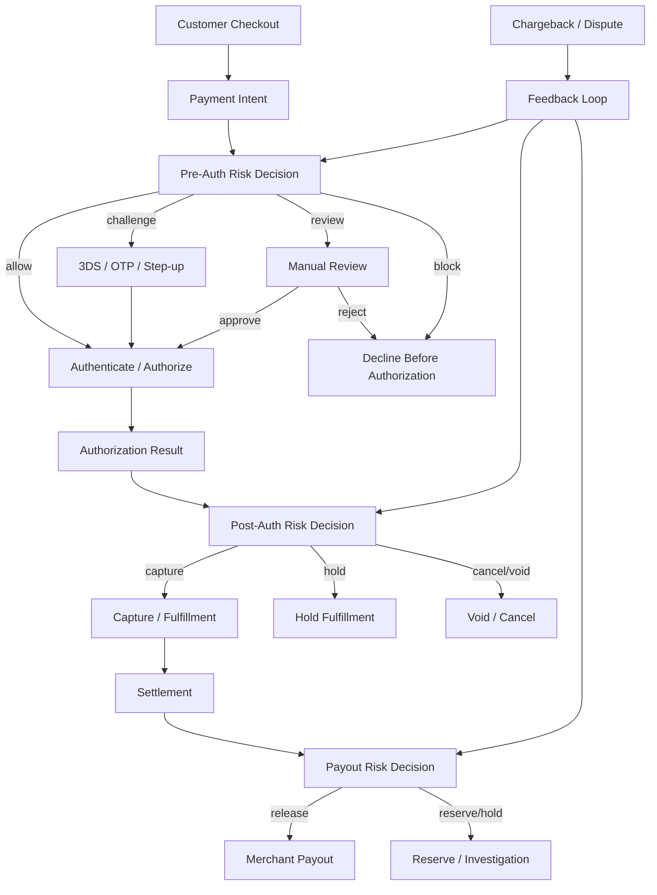
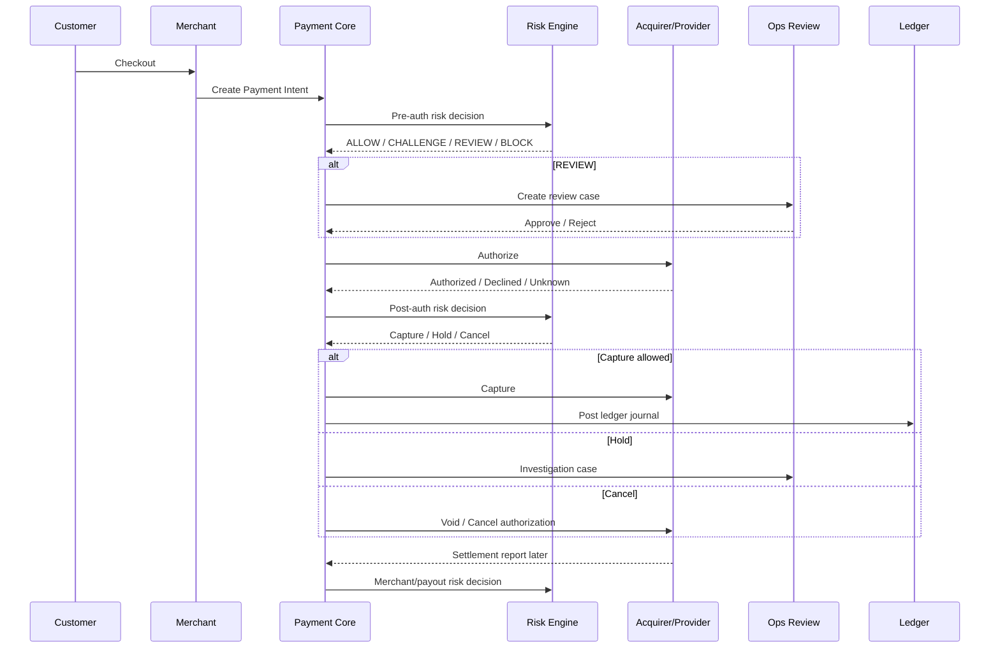
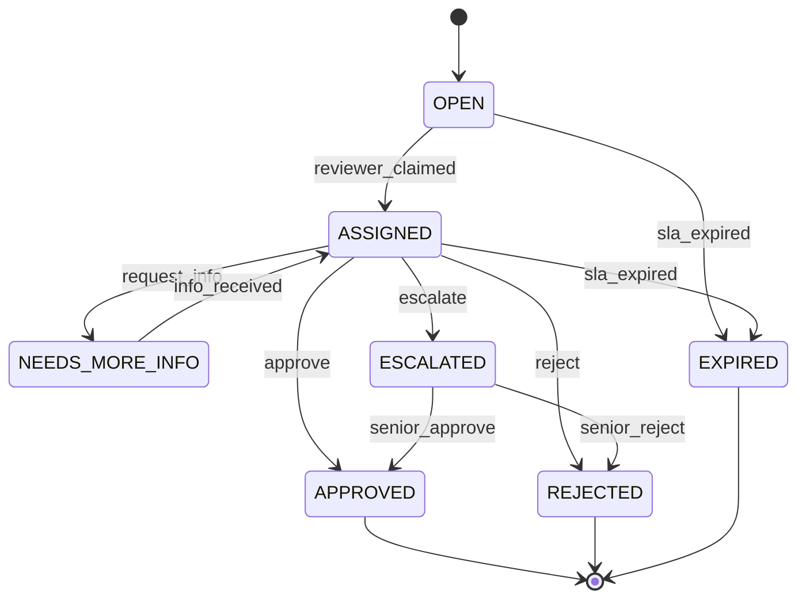
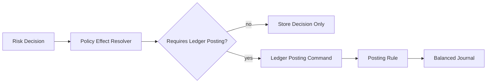
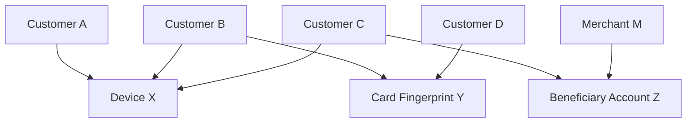
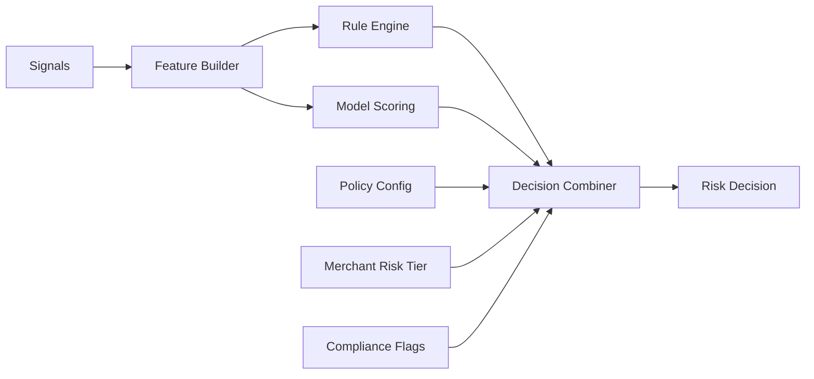
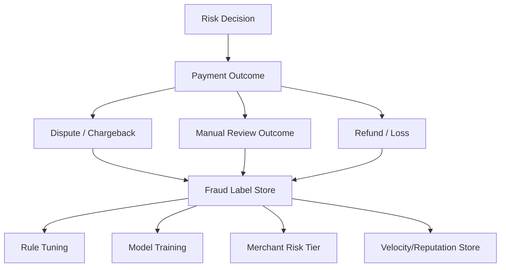

------
title: Build From Scratch: Large Production Grade Java Payment Systems - Part 041
description: Fraud detection workflows for a production-grade Java payment platform: pre-auth, post-auth, manual review, holds, release, evidence, chargeback feedback, and operational controls.
series: learn-java-payment-systems
seriesTitle: Build From Scratch: Large Production Grade Java Payment Systems
order: 41
partTitle: Fraud Detection Workflows
tags:
- java
- payments
- fraud
- risk-engine
- chargeback
- workflow
- ledger
- enterprise-architecture
date: 2026-07-02
---

# Part 041 — Fraud Detection Workflows

Fraud detection di payment system bukan hanya pertanyaan: **"apakah transaksi ini fraud?"**

Pertanyaan yang lebih benar:

> Pada titik lifecycle mana kita harus mengambil keputusan, seberapa yakin kita, action apa yang boleh dilakukan, evidence apa yang harus disimpan, dan bagaimana keputusan itu memengaruhi authorization, capture, fulfillment, settlement, refund, dispute, ledger, dan merchant experience?

Kalau fraud detection diperlakukan sebagai model ML yang mengembalikan `score`, sistem akan rapuh. Production fraud system adalah **workflow control system**.

Ia punya state, deadline, evidence, override, audit trail, feedback loop, dan konsekuensi finansial.

---

## 1. Mental Model

Payment fraud workflow adalah lapisan keputusan di antara:

1. customer intent,
2. merchant intent,
3. payment method,
4. provider/acquirer/issuer response,
5. fulfillment decision,
6. ledger movement,
7. settlement/payout release,
8. dispute/chargeback outcome.

Fraud engine tidak berdiri sendiri.

Ia mengubah apa yang boleh terjadi berikutnya.



Fraud workflow bukan satu titik. Ia muncul berulang di sepanjang lifecycle.

---

## 2. Fraud Decisions Are Not Binary

Keputusan fraud minimal punya beberapa bentuk:

| Decision | Meaning | Typical Effect |
|---|---|---|
| `ALLOW` | Risk acceptable | Continue normal flow |
| `CHALLENGE` | Need stronger customer authentication | Trigger 3DS/SCA/OTP/manual verification |
| `REVIEW` | Human decision required | Pause capture/fulfillment/payout |
| `HOLD` | Money may move, goods/funds held | Hold fulfillment or payout |
| `BLOCK` | Risk unacceptable before money movement | Do not authorize |
| `CANCEL` | Risk unacceptable after authorization, before capture | Void/cancel authorization |
| `REFUND` | Risk discovered after capture | Refund if policy allows |
| `FREEZE` | Broader actor-level risk | Freeze merchant/customer/wallet/payout capability |

A weak system reduces this to:

```java
boolean isFraud = riskScore > 0.9;
```

A production system models the decision explicitly:

```java
public enum RiskDecisionAction {
    ALLOW,
    CHALLENGE,
    REVIEW,
    HOLD,
    BLOCK,
    CANCEL_AUTHORIZATION,
    REFUND_CAPTURED_PAYMENT,
    FREEZE_ACTOR,
    RELEASE_HOLD
}

public record RiskDecision(
    UUID decisionId,
    UUID subjectId,
    RiskSubjectType subjectType,
    RiskDecisionAction action,
    RiskDecisionReason reason,
    RiskLevel level,
    String ruleSetVersion,
    BigDecimal score,
    Instant decidedAt,
    List<RiskSignalSnapshot> signals,
    List<String> matchedRules
) {}
```

Fraud decision is a durable business fact. It should not vanish into logs.

---

## 3. The Main Workflow Points

A payment platform typically needs fraud decisions at five different points.



The five points:

1. **Pre-authorization risk** — before money movement.
2. **Authentication risk** — decide whether to step-up via 3DS/SCA/OTP.
3. **Post-authorization risk** — after issuer approved but before capture/fulfillment.
4. **Post-capture monitoring** — after capture but before settlement/payout.
5. **Payout/merchant risk** — before releasing funds to merchant.

Each point has different permitted actions.

---

## 4. Pre-Authorization Fraud Workflow

Pre-auth is the safest time to block because no authorization has occurred yet.

Typical inputs:

- customer account age,
- login/session risk,
- device fingerprint,
- IP/geolocation,
- shipping/billing mismatch,
- card BIN/country mismatch,
- email/phone risk,
- merchant category,
- amount,
- velocity counters,
- prior chargebacks,
- blacklist/allowlist,
- sanctions/AML signal if applicable,
- suspicious payment method pattern.

Typical actions:

| Action | Use When |
|---|---|
| `ALLOW` | Signals look normal |
| `CHALLENGE` | Risk is elevated but recoverable through authentication |
| `REVIEW` | High value or suspicious but not conclusive |
| `BLOCK` | Known bad actor, impossible pattern, policy violation |

Pre-auth block is operationally clean, but has commercial cost. Too many false positives kill conversion.

The design goal is not "block all fraud". It is:

> maximize approved legitimate payment volume while keeping expected fraud loss, dispute rate, compliance risk, and operational cost within policy.

---

## 5. Authentication / Step-Up Workflow

Fraud engine may decide to step-up rather than block.

Examples:

- require 3DS challenge,
- require OTP,
- require login re-authentication,
- require CVV re-entry,
- require KYC/KYB update,
- require manual document validation,
- require merchant approval for high-risk order.

For cards, EMV 3DS is commonly used to help prevent card-not-present fraud and improve e-commerce payment security. In architecture terms, 3DS is not only UX. It is evidence.

A 3DS result may affect:

- authorization request fields,
- issuer decision,
- fraud decision,
- chargeback representment evidence,
- liability shift expectations,
- fulfillment policy.

Never store only:

```json
{ "threeDsPassed": true }
```

Store structured evidence:

```java
public record AuthenticationEvidence(
    UUID authenticationId,
    UUID paymentIntentId,
    AuthenticationType type,
    AuthenticationStatus status,
    String protocolVersion,
    String eci,
    String cavvPresent,
    String dsTransactionId,
    String acsTransactionId,
    String challengeIndicator,
    Instant startedAt,
    Instant completedAt,
    Map<String, String> providerReferences
) {}
```

The fraud decision should point to the authentication evidence, not copy it loosely.

---

## 6. Post-Authorization Fraud Workflow

Issuer approval is not proof of legitimacy.

An authorization means the issuer approved the payment attempt. It does not mean:

- the buyer is legitimate,
- the merchant should ship immediately,
- the platform should release payout immediately,
- the payment will not be disputed,
- the settlement will succeed.

Post-auth fraud workflow is needed because some signals only arrive after authorization:

- provider risk score,
- 3DS result,
- AVS/CVV result,
- issuer response metadata,
- order enrichment,
- merchant behavior,
- duplicate customer/account linkages,
- suspicious fulfillment address,
- prior order link analysis,
- sudden velocity changes.

Typical actions:

| Action | Effect |
|---|---|
| `CAPTURE` | Continue money movement |
| `HOLD_CAPTURE` | Keep auth open if capture is manual |
| `VOID_AUTHORIZATION` | Cancel authorization before capture |
| `HOLD_FULFILLMENT` | Capture may proceed, goods withheld |
| `REVIEW` | Open case |

For manual capture merchants, post-auth risk can pause capture. For auto-capture merchants, it may pause fulfillment or payout instead.

This distinction is critical.

---

## 7. Capture vs Fulfillment vs Payout

Fraud workflow must separate three decisions:

1. **Can we capture?**
2. **Can merchant fulfill goods/service?**
3. **Can platform release funds to merchant?**

They are not the same.

Example:

| Situation | Capture | Fulfillment | Payout |
|---|---:|---:|---:|
| Low risk digital order | yes | yes | normal schedule |
| High value physical goods | yes | hold until review | reserve until delivery evidence |
| Suspicious carding attempt | no | no | none |
| Fraud discovered after capture | maybe already done | block | hold/refund/reserve |
| Merchant fraud suspected | payment may be valid | customer may receive goods | hold merchant payout |

A bad design binds everything to `payment.status = SUCCEEDED`.

A better design uses separate control states:

```java
public enum CapturePermission { ALLOWED, BLOCKED, REVIEW_REQUIRED }
public enum FulfillmentPermission { ALLOWED, HELD, BLOCKED }
public enum PayoutPermission { ALLOWED, RESERVED, HELD, FROZEN }
```

---

## 8. Manual Review as a First-Class Workflow

Manual review is not a Slack message.

It is a case management workflow with:

- case ID,
- subject,
- queue,
- SLA,
- reason,
- evidence snapshot,
- assigned reviewer,
- decision,
- audit trail,
- maker-checker for sensitive decisions,
- allowed actions,
- deadline automation,
- escalation path.



A review decision must be linked to subsequent actions.

For example:

```text
case: REVIEW-2026-00091
subject: payment_intent pi_123
risk reason: high_value_new_customer_shipping_mismatch
review decision: approved
allowed actions: capture, fulfill_after_24h, payout_reserve_7d
reviewer: ops_user_42
reviewed_at: 2026-07-02T08:42:11Z
```

Without this linkage, audit and dispute evidence become weak.

---

## 9. Fraud Hold Model

A fraud hold is not a boolean flag.

It needs a type, owner, scope, release condition, and financial effect.

```java
public enum HoldType {
    CAPTURE_HOLD,
    FULFILLMENT_HOLD,
    REFUND_HOLD,
    PAYOUT_HOLD,
    MERCHANT_RESERVE_HOLD,
    WALLET_WITHDRAWAL_HOLD
}

public enum HoldStatus {
    ACTIVE,
    RELEASED,
    EXPIRED,
    ESCALATED,
    CONVERTED_TO_RESERVE,
    CONVERTED_TO_LOSS
}

public record FraudHold(
    UUID holdId,
    HoldType type,
    UUID subjectId,
    String reasonCode,
    String policyVersion,
    Instant createdAt,
    Instant expiresAt,
    HoldStatus status,
    UUID createdByDecisionId
) {}
```

Different holds affect different systems:

| Hold | Affects |
|---|---|
| Capture hold | Payment orchestration |
| Fulfillment hold | Merchant/order system |
| Refund hold | Refund API/backoffice |
| Payout hold | Settlement/payout engine |
| Merchant reserve | Ledger/balance availability |
| Wallet withdrawal hold | Wallet/disbursement engine |

A fraud hold should be visible in backoffice and explainable to operations.

---

## 10. Ledger Effects of Fraud Decisions

Not every fraud decision posts ledger entries.

Examples:

| Decision | Ledger Effect |
|---|---|
| Pre-auth block | usually none |
| Challenge | none |
| Manual review | none unless hold/reserve posted |
| Capture hold | none if capture not done |
| Payout hold | may move available to reserved bucket |
| Merchant reserve | ledger movement from merchant payable to reserve liability |
| Fraud refund | refund journal |
| Chargeback loss | dispute/loss journal |

Fraud engine must not directly mutate balances.

It emits a decision. Ledger posting is performed by a posting service using explicit rules.



This keeps the money invariant centralized.

---

## 11. Fraud Signal Snapshot

Fraud decisions must be reproducible.

That does not mean the rule engine can always produce the same decision years later, because models/rules/data change. It means you must preserve enough evidence to explain why the decision was made at that time.

A decision should store:

- rule set version,
- model version,
- feature values,
- matched rules,
- score,
- missing/failed signals,
- provider risk signals,
- authentication evidence ID,
- reviewer action if any,
- override reason.

Example schema:

```sql
create table risk_decision (
    decision_id uuid primary key,
    subject_type text not null,
    subject_id uuid not null,
    action text not null,
    risk_level text not null,
    score numeric(8,5),
    reason_code text not null,
    ruleset_version text not null,
    model_version text,
    decided_at timestamptz not null,
    decision_context jsonb not null,
    created_by text not null default 'system',
    constraint risk_decision_action_valid check (
        action in (
            'ALLOW','CHALLENGE','REVIEW','HOLD','BLOCK',
            'CANCEL_AUTHORIZATION','REFUND_CAPTURED_PAYMENT',
            'FREEZE_ACTOR','RELEASE_HOLD'
        )
    )
);

create index idx_risk_decision_subject
    on risk_decision(subject_type, subject_id, decided_at desc);
```

Store snapshots carefully. Do not store raw PAN, CVC, secrets, or unnecessary personal data.

---

## 12. Feature Engineering for Payments

Payment risk features are usually built around velocity, mismatch, reputation, novelty, and graph linkage.

### 12.1 Velocity Features

Examples:

- number of payment attempts per card fingerprint in 10 minutes,
- number of failed attempts per IP in 1 hour,
- number of cards used by same customer in 24 hours,
- total amount attempted by merchant in 1 hour,
- refund count by merchant in 7 days,
- payout amount change vs trailing average.

Do not implement all velocity counters as ad-hoc Redis keys without governance.

A counter needs:

- subject,
- window,
- event type,
- value,
- TTL,
- source of truth,
- reset/rebuild strategy,
- privacy classification.

```java
public record VelocityCounterKey(
    String subjectType,
    String subjectHash,
    String eventType,
    Duration window
) {}
```

### 12.2 Mismatch Features

Examples:

- billing country != card issuing country,
- shipping country != customer profile country,
- device geolocation far from IP geolocation,
- email domain age suspicious,
- merchant category inconsistent with transaction pattern.

Mismatch is not fraud by itself. It is a signal.

### 12.3 Reputation Features

Examples:

- customer historical chargeback ratio,
- merchant refund ratio,
- device seen in prior fraud,
- beneficiary bank account linked to fraud case,
- IP / ASN reputation.

### 12.4 Novelty Features

Examples:

- first purchase on new device,
- new card used after password reset,
- new payout beneficiary,
- first high-value transaction after dormant period.

### 12.5 Graph Features

Examples:



Graph linkage is powerful but dangerous. It can create false positives if used naively.

Production systems need explainability: "blocked due to shared device with confirmed fraud cluster" is better than "model score high".

---

## 13. Rules vs Models

A production fraud system usually combines:

- deterministic rules,
- configurable policies,
- velocity counters,
- provider signals,
- machine learning models,
- manual review outcomes,
- merchant/customer tiering.



Rules are good for:

- legal/policy constraints,
- known bad patterns,
- hard blocks,
- limits,
- explainable review triggers.

Models are good for:

- pattern generalization,
- ranking risk,
- anomaly detection,
- prioritizing review queue.

But models should not silently override legal or compliance rules.

A common combiner strategy:

1. apply hard policy blocks,
2. apply compliance blocks,
3. apply deterministic allowlists if safe,
4. compute risk score,
5. apply decision thresholds,
6. apply merchant-specific policy,
7. create explainable decision.

---

## 14. Rule Versioning

Fraud rules must be versioned.

Bad:

```sql
update fraud_rule set threshold = 5000000 where name = 'high_value_new_user';
```

Better:

```sql
create table risk_ruleset (
    ruleset_version text primary key,
    status text not null,
    effective_from timestamptz not null,
    effective_to timestamptz,
    config jsonb not null,
    created_by text not null,
    created_at timestamptz not null,
    approved_by text,
    approved_at timestamptz
);
```

Risk decisions should point to `ruleset_version`.

Why?

Because when a merchant asks six months later why a payment was held, you need to explain using the rules that existed then, not today's rules.

---

## 15. Case Queue Prioritization

Manual review capacity is finite.

A case queue should prioritize by expected loss and deadline.

Possible priority factors:

- transaction amount,
- fraud score,
- order fulfillment deadline,
- authorization expiry,
- merchant tier,
- card chargeback window sensitivity,
- customer impact,
- payout cutoff,
- SLA age,
- regulatory sensitivity.

Example priority function:

```text
priority =
  expected_loss_weight
+ deadline_pressure_weight
+ merchant_tier_weight
+ customer_impact_weight
+ compliance_weight
```

But the formula should be explainable and configurable.

---

## 16. Fraud Feedback Loop

The strongest fraud system learns from outcomes.

Outcome sources:

- chargeback received,
- chargeback won/lost,
- refund due to suspected fraud,
- manual review decision,
- issuer fraud advice,
- customer complaint,
- merchant report,
- account takeover confirmation,
- payout reversal/loss,
- law enforcement/regulatory notice.



Be careful: labels are noisy.

A chargeback can mean:

- stolen card fraud,
- friendly fraud,
- merchant failed to deliver,
- product quality dispute,
- duplicate processing,
- unclear billing descriptor,
- customer confusion.

Do not train everything as "fraud".

---

## 17. Fraud and Chargeback Integration

Fraud workflow must produce evidence useful for chargeback response.

Examples:

- IP/device/session evidence,
- 3DS authentication evidence,
- billing/shipping match,
- delivery proof,
- customer communication,
- prior successful orders,
- refund/return policy acceptance,
- login/authentication logs,
- merchant fulfillment evidence.

Store evidence references, not necessarily all raw data in the payment core.

```sql
create table payment_evidence_link (
    evidence_id uuid primary key,
    payment_intent_id uuid not null,
    evidence_type text not null,
    storage_ref text not null,
    hash_sha256 text,
    collected_at timestamptz not null,
    retention_until timestamptz,
    privacy_classification text not null
);
```

Evidence must have retention and access controls.

---

## 18. Fraud Against Merchants vs Fraud By Merchants

Payment platforms face two broad categories:

### 18.1 Fraud against merchant/platform

Examples:

- stolen card usage,
- card testing,
- account takeover,
- refund abuse,
- promo abuse,
- synthetic identity,
- triangulation fraud.

### 18.2 Fraud by merchant

Examples:

- fake merchant selling nonexistent goods,
- collusive transactions,
- laundering through card payments,
- excessive refund/chargeback pattern,
- misleading business model,
- prohibited goods/services,
- sudden volume spike before disappearance.

Merchant fraud is often detected at settlement/payout layer, not checkout layer.

Controls:

- merchant risk tier,
- rolling reserve,
- payout delay,
- capability limits,
- enhanced review,
- volume caps,
- KYB refresh,
- website/product monitoring,
- chargeback threshold monitoring.

---

## 19. Card Testing Detection

Card testing is a common pattern: attackers try many card numbers with low-value transactions.

Signals:

- many failed attempts from same IP/device/session,
- many cards against same customer/merchant,
- low amount attempts,
- unusual BIN diversity,
- high issuer decline ratio,
- repeated CVC/expiry mismatch,
- abnormal authorization velocity,
- payment method creation spike.

Actions:

- rate limit,
- require challenge,
- block payment method creation,
- block authorization attempt,
- temporarily disable merchant capability,
- require CAPTCHA at checkout edge,
- alert merchant success team,
- isolate provider route to protect acquirer relationship.

Important: card testing can hurt your acquirer relationship because it creates decline spikes and fraud signals.

---

## 20. Account Takeover Workflow

Account takeover detection is not only a payment concern, but payment platform must consume its signals.

Signals:

- password reset followed by high-value payment,
- new device,
- new shipping address,
- new card,
- new payout beneficiary,
- session from impossible travel,
- email/phone changed recently,
- MFA disabled recently.

Actions:

- step-up authentication,
- hold fulfillment,
- block payout beneficiary change,
- delay withdrawal,
- notify account owner,
- create security case.

The fraud workflow should distinguish:

```text
payment_risk != account_security_risk
```

But they influence each other.

---

## 21. Refund Abuse Workflow

Refund abuse often bypasses payment authorization risk because the payment itself may be legitimate.

Signals:

- high refund ratio by customer,
- repeated refund requests after digital consumption,
- many accounts using same device/address,
- refund request immediately after fulfillment,
- multiple partial refunds,
- merchant operator abuse,
- refund to different instrument where unsupported.

Actions:

- require manual approval,
- block self-service refund,
- limit refund amount,
- require evidence,
- hold future payouts,
- review merchant/customer.

Refund workflow must integrate with ledger so refunded amount cannot exceed captured refundable amount.

---

## 22. Payout Fraud Workflow

Payout fraud is often more dangerous than payment fraud because funds leave the platform.

Signals:

- new beneficiary account,
- high payout after sudden sales spike,
- first payout for new merchant,
- beneficiary linked to other suspicious merchants,
- chargeback ratio rising,
- mismatch between merchant legal entity and bank account,
- merchant changed settlement bank recently,
- product/business model mismatch.

Controls:

- payout delay,
- rolling reserve,
- manual review,
- beneficiary verification,
- maker-checker for bank account change,
- velocity caps,
- freeze capability,
- require updated KYB.

Never allow:

```text
change beneficiary -> immediate payout of all available balance
```

There should be cooling-off and review policy.

---

## 23. Data Model

A minimal production schema:

```sql
create table risk_subject_profile (
    subject_type text not null,
    subject_id uuid not null,
    risk_tier text not null,
    status text not null,
    updated_at timestamptz not null,
    primary key (subject_type, subject_id)
);

create table risk_decision (
    decision_id uuid primary key,
    subject_type text not null,
    subject_id uuid not null,
    payment_intent_id uuid,
    payment_attempt_id uuid,
    action text not null,
    risk_level text not null,
    reason_code text not null,
    score numeric(8,5),
    ruleset_version text not null,
    model_version text,
    signal_snapshot jsonb not null,
    decided_at timestamptz not null,
    created_by text not null
);

create table risk_case (
    case_id uuid primary key,
    case_type text not null,
    subject_type text not null,
    subject_id uuid not null,
    payment_intent_id uuid,
    status text not null,
    priority integer not null,
    reason_code text not null,
    assigned_to text,
    opened_at timestamptz not null,
    due_at timestamptz,
    closed_at timestamptz
);

create table risk_case_action (
    action_id uuid primary key,
    case_id uuid not null references risk_case(case_id),
    action_type text not null,
    actor_id text not null,
    reason text not null,
    created_at timestamptz not null,
    metadata jsonb not null default '{}'
);

create table risk_hold (
    hold_id uuid primary key,
    subject_type text not null,
    subject_id uuid not null,
    hold_type text not null,
    status text not null,
    reason_code text not null,
    decision_id uuid references risk_decision(decision_id),
    created_at timestamptz not null,
    expires_at timestamptz,
    released_at timestamptz,
    released_by text,
    release_reason text
);
```

Indexes:

```sql
create index idx_risk_decision_payment
    on risk_decision(payment_intent_id, decided_at desc);

create index idx_risk_case_open_priority
    on risk_case(priority desc, opened_at asc)
    where status in ('OPEN', 'ASSIGNED', 'ESCALATED');

create index idx_active_risk_hold_subject
    on risk_hold(subject_type, subject_id, hold_type)
    where status = 'ACTIVE';
```

---

## 24. Java Service Boundary

Keep risk engine behind a port.

```java
public interface RiskDecisionPort {
    RiskDecision decidePreAuthorization(PreAuthorizationRiskRequest request);
    RiskDecision decidePostAuthorization(PostAuthorizationRiskRequest request);
    RiskDecision decideBeforeCapture(CaptureRiskRequest request);
    RiskDecision decideBeforePayout(PayoutRiskRequest request);
    RiskDecision decideRefund(RefundRiskRequest request);
}
```

Request objects must contain stable domain values, not raw HTTP/provider payloads.

```java
public record PreAuthorizationRiskRequest(
    UUID paymentIntentId,
    UUID merchantId,
    UUID customerId,
    Money amount,
    PaymentMethodRiskView paymentMethod,
    CustomerRiskView customer,
    MerchantRiskView merchant,
    DeviceRiskView device,
    OrderRiskView order,
    Instant requestedAt
) {}
```

Do not let payment core depend on a specific vendor fraud SDK.

Use an adapter:

```java
public interface ExternalRiskProviderPort {
    ExternalRiskAssessment assess(ExternalRiskAssessmentRequest request);
}
```

---

## 25. Decision Application Pattern

Risk engine decides. Payment core applies.

```java
public final class PreAuthorizationRiskApplicationService {
    private final RiskDecisionPort riskDecisionPort;
    private final PaymentIntentRepository paymentIntentRepository;
    private final RiskDecisionRepository riskDecisionRepository;
    private final ReviewCaseService reviewCaseService;

    public PreAuthResult evaluate(UUID paymentIntentId) {
        PaymentIntent intent = paymentIntentRepository.getForUpdate(paymentIntentId);

        RiskDecision decision = riskDecisionPort.decidePreAuthorization(
            PreAuthorizationRiskRequest.from(intent)
        );

        riskDecisionRepository.insert(decision);

        return switch (decision.action()) {
            case ALLOW -> PreAuthResult.allowed(decision.decisionId());
            case CHALLENGE -> PreAuthResult.challenge(decision.decisionId());
            case REVIEW -> {
                UUID caseId = reviewCaseService.openPaymentReview(intent, decision);
                yield PreAuthResult.reviewRequired(decision.decisionId(), caseId);
            }
            case BLOCK -> {
                intent.blockByRisk(decision.decisionId());
                paymentIntentRepository.save(intent);
                yield PreAuthResult.blocked(decision.decisionId());
            }
            default -> throw new IllegalStateException("Unsupported pre-auth action " + decision.action());
        };
    }
}
```

The decision application must be idempotent.

If the same payment is evaluated twice due to retry, the platform must not create duplicate cases or contradictory actions.

---

## 26. Idempotency in Fraud Workflows

Fraud decisions can be expensive and externally visible.

Use idempotency at multiple levels:

| Operation | Idempotency Key |
|---|---|
| Pre-auth risk decision | `payment_intent_id + phase + ruleset_version + relevant_version` |
| Review case creation | `subject_id + case_type + decision_id` |
| Hold creation | `decision_id + hold_type` |
| Release hold | `hold_id + release_action_id` |
| Payout block | `payout_id + decision_id` |
| Fraud refund | `payment_id + fraud_refund_decision_id` |

Important: if signals change materially, you may intentionally create a new decision. Model this as a new phase or new evaluation version.

---

## 27. Handling Stale Decisions

Risk decision is time-sensitive.

Example:

- decision at 10:00 says `ALLOW`,
- at 10:05 the customer changes shipping address,
- at 10:06 merchant tries to capture,
- the previous allow may no longer be safe.

Use invalidation triggers:

- amount changed,
- payment method changed,
- shipping address changed,
- customer security event,
- merchant status changed,
- new chargeback label linked,
- authorization expired,
- risk ruleset changed for active high-risk queue.

Model:

```java
public record RiskDecisionValidity(
    UUID decisionId,
    Instant validFrom,
    Instant validUntil,
    Set<String> invalidatedByFields,
    boolean stillValid
) {}
```

---

## 28. Operational Dashboards

Fraud dashboard should not only show total fraud.

Minimum metrics:

### Decision metrics

- pre-auth allow/challenge/review/block rate,
- post-auth hold/cancel rate,
- payout hold rate,
- decision latency,
- missing signal rate,
- external risk provider timeout rate,
- rule/model version distribution.

### Quality metrics

- chargeback rate by merchant/method/route,
- false positive estimate,
- manual review approve/reject rate,
- review SLA breach,
- fraud loss by cohort,
- recovery rate,
- dispute win rate.

### Operational metrics

- open case count,
- aging case count,
- held amount,
- reserve amount,
- payout blocked amount,
- customers impacted,
- merchants impacted.

### Acquirer/provider health metrics

- authorization decline spike,
- suspected card testing spike,
- provider fraud score distribution,
- route-level chargeback rate.

---

## 29. Failure Modes

| Failure | Consequence | Control |
|---|---|---|
| Risk provider timeout | Checkout blocked or unsafe allow | fallback policy by merchant/method/risk tier |
| Missing signal | Bad decision | signal completeness score |
| Duplicate review case | Ops confusion | unique constraint by decision/case type |
| Review approved but payment changed | stale approval | decision validity check |
| Hold not applied | fraudulent fulfillment/payout | transactional hold application |
| Hold not released | customer/merchant harm | expiry + alert |
| Model update too aggressive | false positive spike | canary + shadow mode |
| Rule misconfiguration | mass declines | maker-checker + kill switch |
| Payout released before risk check | loss | payout workflow guard |
| Fraud labels polluted | bad training | label taxonomy |

---

## 30. Anti-Patterns

Avoid these:

1. `risk_score` column on payment table with no evidence.
2. Fraud decision only in logs.
3. Manual review in Slack/spreadsheet.
4. One boolean `is_fraud`.
5. Blocking after authorization without void/cancel strategy.
6. Capturing before risk decision when merchant expects delayed fulfillment.
7. Payout release without merchant risk check.
8. Model decision with no versioning.
9. Rules changed in-place.
10. Storing raw sensitive data in risk snapshots.
11. Treating all chargebacks as fraud.
12. No appeal/release path for holds.
13. No SLA for manual review.
14. No feedback loop from dispute outcomes.
15. No operational dashboard for held amount.

---

## 31. Build Order

Build in this order:

1. risk decision data model,
2. deterministic rule engine,
3. pre-auth decision API,
4. post-auth decision API,
5. manual review case workflow,
6. fraud hold model,
7. payout hold integration,
8. evidence snapshot storage,
9. velocity counters,
10. chargeback feedback loop,
11. dashboard/alerting,
12. external fraud provider adapter,
13. model scoring integration,
14. shadow/canary deployment.

Do not start with ML.

Start with durable decisions and workflow correctness.

---

## 32. Test Matrix

| Scenario | Expected Result |
|---|---|
| Low-risk payment | allow, no case, no hold |
| Known bad card fingerprint | block before authorization |
| High-risk but recoverable | challenge required |
| Review required | one case created idempotently |
| Reviewer approves | payment can proceed if unchanged |
| Reviewer rejects | authorization voided if applicable |
| Payment changes after approval | approval invalidated |
| Risk provider timeout low-risk merchant | fallback allow or review per policy |
| Risk provider timeout high-risk merchant | fallback review/block per policy |
| Duplicate risk evaluation | no duplicate case/hold |
| Payout to new beneficiary | payout hold/review |
| Chargeback outcome fraud | label store updated |
| Hold expires | escalation or auto-release by policy |
| Ruleset changed | new decisions use new version; old decisions remain explainable |

---

## 33. Minimal Capstone for This Part

Implement these flows:

1. create payment intent,
2. evaluate pre-auth risk,
3. if review required, open case,
4. approve case,
5. authorize payment,
6. evaluate post-auth risk,
7. hold fulfillment,
8. release hold,
9. capture payment,
10. later receive chargeback fraud label,
11. update merchant/customer risk profile.

Success criteria:

- every risk decision is durable,
- every case is idempotent,
- every hold has lifecycle,
- payment state transition checks decision validity,
- chargeback outcome feeds future risk,
- no fraud workflow directly mutates ledger balances.

---

## 34. References

- EMVCo — EMV 3-D Secure: https://www.emvco.com/emv-technologies/3-d-secure/
- Visa — 3D Secure overview: https://corporate.visa.com/en/solutions/visa-protect/insights/3d-secure.html
- PCI SSC — PCI DSS v4.0.1 announcement: https://blog.pcisecuritystandards.org/just-published-pci-dss-v4-0-1
- Stripe Docs — Radar and fraud prevention concepts: https://docs.stripe.com/radar
- Adyen Docs — Risk management: https://docs.adyen.com/risk-management/

---

## 35. What We Have Built Mentally

You should now think of fraud detection as:

> a versioned, explainable, auditable workflow system that changes what the platform may do with authorization, capture, fulfillment, settlement, payout, refund, and dispute handling.

A fraud score is just one input.

The system is the workflow around it.
