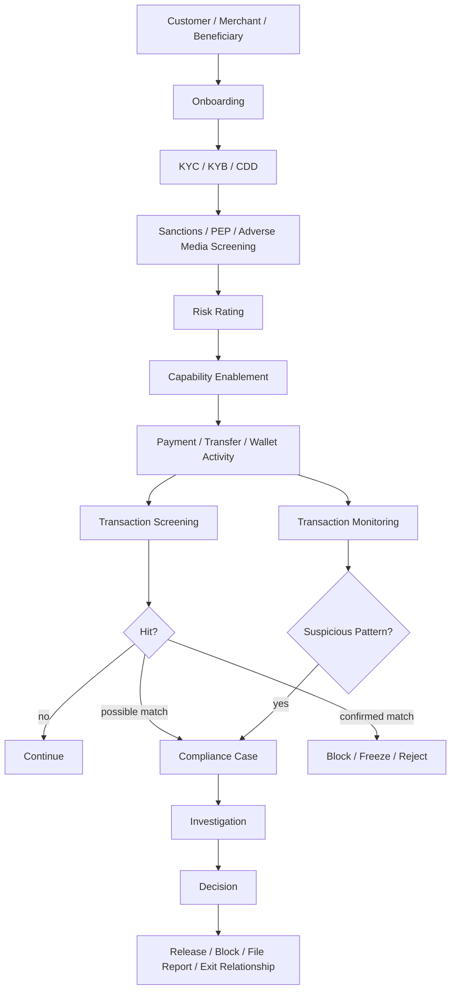
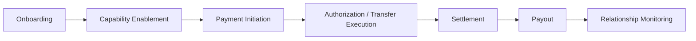
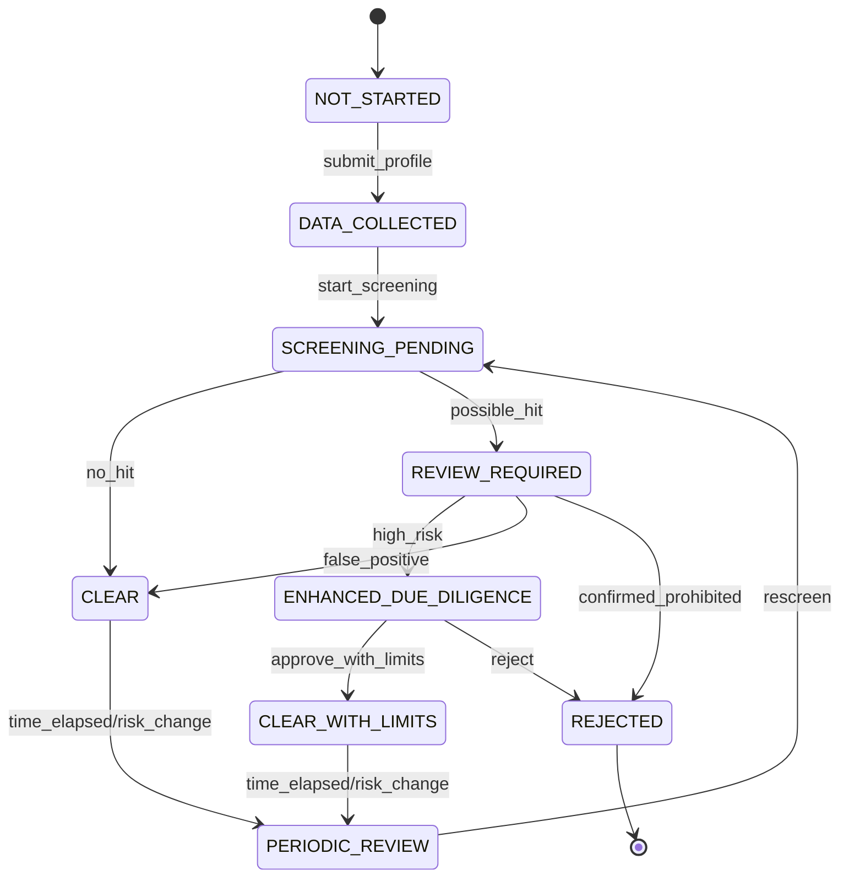
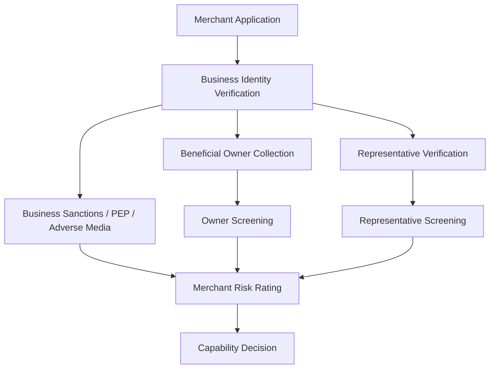
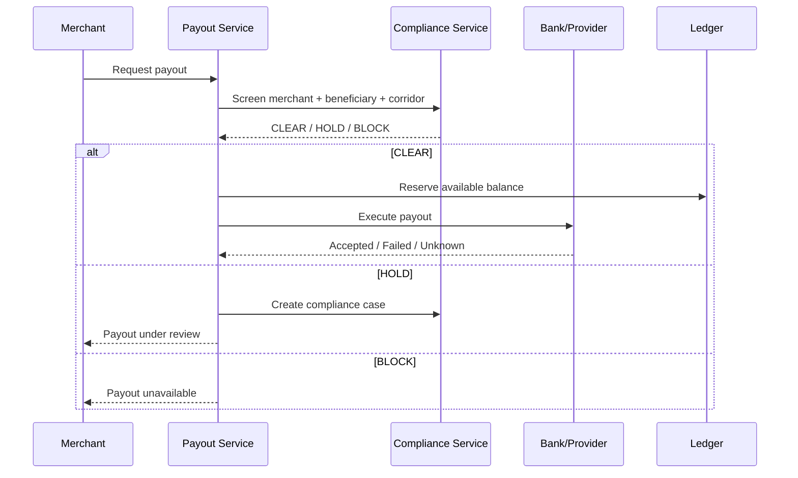
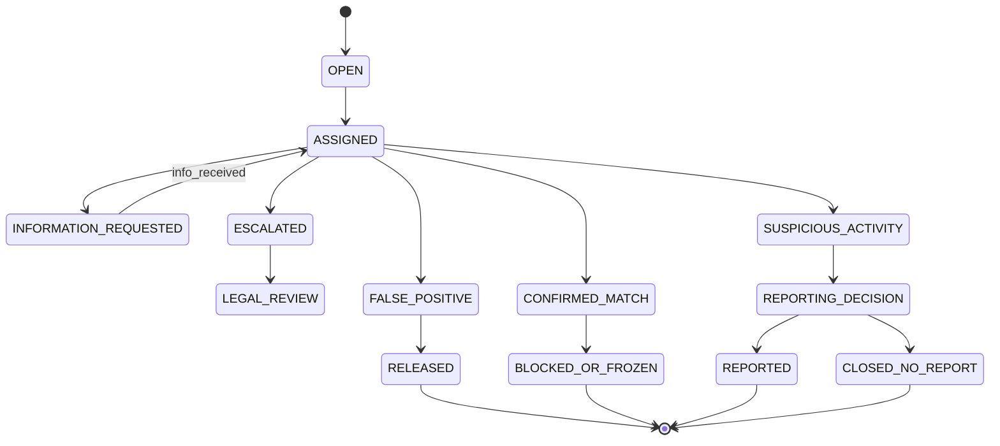
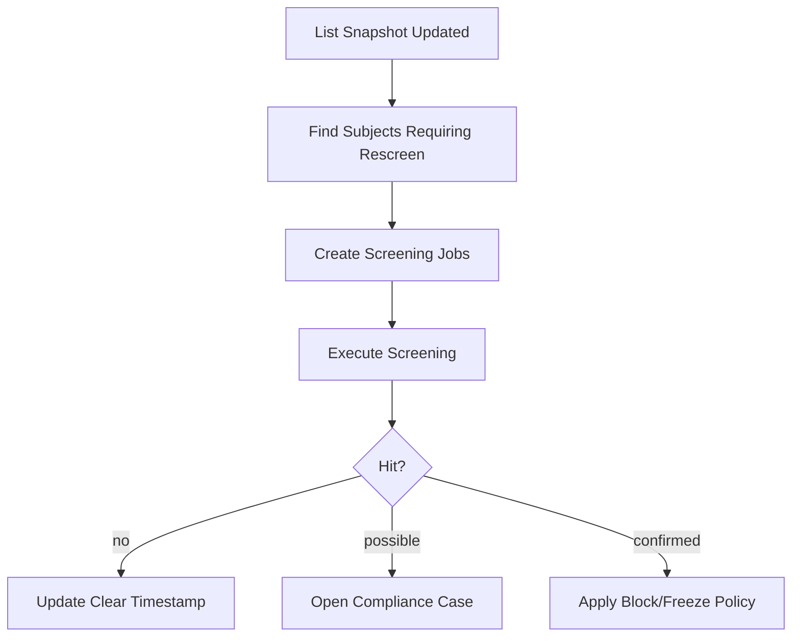
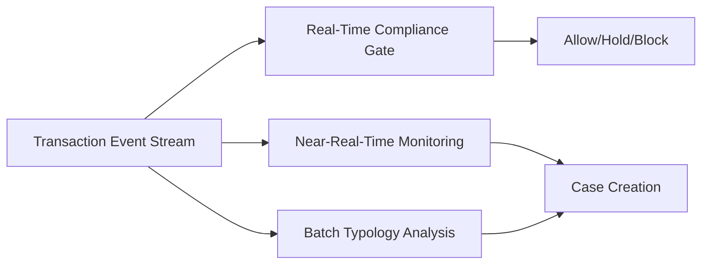
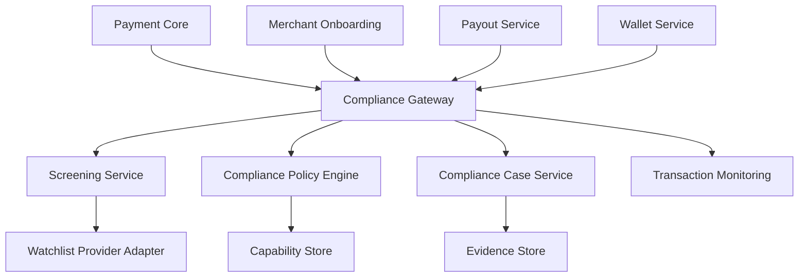

------
title: Build From Scratch: Large Production Grade Java Payment Systems - Part 042
description: AML, sanctions, CFT, proliferation financing, transaction monitoring, screening, case management, and compliance architecture for a production-grade Java payment platform.
series: learn-java-payment-systems
seriesTitle: Build From Scratch: Large Production Grade Java Payment Systems
order: 42
partTitle: AML, Sanctions, and Compliance Screening
tags:
- java
- payments
- aml
- sanctions
- compliance
- cft
- risk-engine
- case-management
- enterprise-architecture
date: 2026-07-02
---

# Part 042 — AML, Sanctions, and Compliance Screening

Fraud asks:

> Is this actor or transaction likely to cause financial loss through deception or abuse?

AML/sanctions/compliance asks a different question:

> Are we legally and policy-wise allowed to onboard this actor, process this transaction, hold this value, or release these funds?

These two worlds overlap, but they are not the same.

A fraud false positive is mostly a commercial/user harm problem. A sanctions miss can become a regulatory, legal, and enforcement problem. An AML failure can become a systemic risk problem.

This part is not legal advice. It is an engineering architecture model for building systems that can support compliance obligations. Final interpretation must come from qualified compliance/legal teams in the relevant jurisdiction.

---

## 1. Mental Model

Compliance screening is a **control layer** that sits across onboarding, payment, wallet, payout, settlement, dispute, and backoffice.



This is not a single API call to a screening vendor.

It is a lifecycle.

---

## 2. Core Domains

| Domain | Meaning |
|---|---|
| KYC | Know Your Customer for individual customers |
| KYB | Know Your Business for merchants/legal entities |
| CDD | Customer Due Diligence |
| EDD | Enhanced Due Diligence for higher-risk actors |
| AML | Anti-Money Laundering |
| CFT | Countering the Financing of Terrorism |
| PF | Proliferation Financing controls |
| Sanctions | Legal restrictions against certain persons, entities, countries, sectors, vessels, etc. |
| PEP | Politically Exposed Person risk signal |
| Adverse Media | Negative news/media risk signal |
| Transaction Screening | Screening a transaction and parties before/during execution |
| Transaction Monitoring | Detecting suspicious behavior patterns over time |
| SAR/STR | Suspicious activity/transaction report, depending on jurisdiction |
| Freeze/Block | Prevent movement of funds/assets when required by law/policy |

Do not merge all of this into `risk_flag`.

---

## 3. Compliance Is Jurisdictional

A Java payment platform may serve many jurisdictions. Requirements differ.

Examples:

- U.S. sanctions obligations may involve OFAC.
- U.S. MSB obligations may involve FinCEN/BSA depending on business model.
- Indonesia payment system providers may be subject to Bank Indonesia supervision and AML/CFT requirements.
- EU/UK obligations involve separate AML, sanctions, PSD/payment institution, and data protection regimes.
- Cross-border processing may introduce multiple obligation sets.

Architecture implication:

> Compliance policy must be configurable by jurisdiction, product, actor type, transaction type, currency, payment rail, and business model.

Hard-coding one country's compliance rules into payment core is a design failure.

---

## 4. Compliance Control Points

A payment system needs compliance checks at multiple points.



| Point | Example Checks |
|---|---|
| Onboarding | KYC/KYB, beneficial owner, sanctions, PEP, business type |
| Capability enablement | allowed payment methods, payout, wallet, cross-border, high-risk MCC |
| Payment initiation | party screening, country/currency/rail restrictions |
| Execution | sanctions hit, travel rule-like data needs, return/reject controls |
| Settlement | funds hold/freeze, reserve, suspicious merchant behavior |
| Payout | beneficiary screening, bank account ownership, sanctions, payout corridor |
| Ongoing monitoring | behavior change, periodic rescreening, adverse media, risk rerating |

Compliance is a continuous process, not only onboarding.

---

## 5. Actor Model

Compliance screening requires a richer actor model than payment fraud.

```java
public sealed interface ComplianceSubject permits IndividualSubject, BusinessSubject, BeneficiarySubject {}

public record IndividualSubject(
    UUID subjectId,
    String legalName,
    LocalDate dateOfBirth,
    List<CountryCode> nationalities,
    List<Address> addresses,
    List<IdentificationDocument> documents,
    List<String> aliases
) implements ComplianceSubject {}

public record BusinessSubject(
    UUID subjectId,
    String legalName,
    String registrationNumber,
    CountryCode incorporationCountry,
    List<Address> addresses,
    List<BeneficialOwner> beneficialOwners,
    String mcc,
    String website,
    List<String> tradeNames
) implements ComplianceSubject {}

public record BeneficiarySubject(
    UUID subjectId,
    String beneficiaryName,
    BankAccountReference accountReference,
    CountryCode bankCountry,
    UUID ownerActorId
) implements ComplianceSubject {}
```

Key point:

A payment subject is not always the same as the legal compliance subject.

Example:

- customer account,
- cardholder,
- billing name,
- shipping recipient,
- merchant legal entity,
- merchant representative,
- beneficial owner,
- payout beneficiary,
- bank account holder.

They may differ.

---

## 6. Screening Types

### 6.1 Sanctions Screening

Sanctions screening checks whether a subject or transaction party matches restricted persons/entities/countries/programs.

It usually involves:

- exact name matching,
- fuzzy name matching,
- alias matching,
- date of birth matching,
- country matching,
- address matching,
- identifier matching,
- list source/version,
- match confidence,
- analyst disposition.

Sanctions screening has a low tolerance for false negatives.

### 6.2 PEP Screening

PEP screening identifies politically exposed persons and related parties.

A PEP hit may not require blocking. It usually triggers enhanced due diligence and higher risk rating.

### 6.3 Adverse Media Screening

Adverse media is a risk signal from negative news or other sources.

It should not automatically block without investigation unless policy says so.

### 6.4 Country / Corridor Screening

Checks based on:

- customer country,
- merchant country,
- issuer country,
- beneficiary country,
- bank country,
- shipping country,
- IP country,
- currency,
- payment rail,
- sanctions regime.

### 6.5 Transaction Screening

Screens parties and data around a specific transaction.

For example:

- sender,
- receiver,
- beneficiary,
- payment reference,
- narrative text,
- bank account,
- wallet address,
- country/currency/rail.

### 6.6 Transaction Monitoring

Detects behavior over time.

Examples:

- structuring/smurfing,
- rapid in-out funds movement,
- mule account behavior,
- merchant laundering through fake purchases,
- unusual cross-border flow,
- high refund/chargeback pattern,
- circular movement,
- activity inconsistent with profile.

---

## 7. Screening Result Model

Never model sanctions screening as a boolean.

```java
public enum ScreeningDecision {
    CLEAR,
    POSSIBLE_MATCH,
    CONFIRMED_MATCH,
    FALSE_POSITIVE,
    NEEDS_INFORMATION,
    ESCALATED
}

public enum ComplianceAction {
    ALLOW,
    HOLD,
    BLOCK,
    REJECT,
    FREEZE,
    REQUEST_INFORMATION,
    ESCALATE,
    FILE_REPORT,
    EXIT_RELATIONSHIP
}

public record ScreeningResult(
    UUID screeningId,
    UUID subjectId,
    ComplianceSubjectType subjectType,
    ScreeningType screeningType,
    ScreeningDecision decision,
    ComplianceAction recommendedAction,
    String listVersion,
    BigDecimal matchScore,
    List<ScreeningMatchCandidate> candidates,
    Instant screenedAt
) {}
```

A possible match is not the same as a confirmed match.

A possible match creates a case. A confirmed match may require block/freeze/reject depending on law and policy.

---

## 8. Screening Match Candidate

```java
public record ScreeningMatchCandidate(
    String sourceList,
    String sourceListId,
    String matchedName,
    List<String> matchedAliases,
    BigDecimal nameScore,
    BigDecimal dateOfBirthScore,
    BigDecimal countryScore,
    BigDecimal overallScore,
    Map<String, String> attributes,
    String rawProviderReference
) {}
```

A match candidate must be explainable to an analyst.

Bad analyst experience:

```text
Sanctions hit: score 0.87
```

Better:

```text
Possible OFAC SDN match
Input name: Muhammad Ali Rahman
List name: Mohammed Aly Rahman
Alias match: yes
DOB: no DOB provided
Country: ID vs unknown
Score: 0.87
List version: 2026-07-01T00:00Z
```

---

## 9. List Versioning

Sanctions and watch lists change.

A compliance decision must know which list version was used.

```sql
create table screening_list_snapshot (
    snapshot_id uuid primary key,
    provider text not null,
    list_type text not null,
    list_version text not null,
    fetched_at timestamptz not null,
    effective_at timestamptz,
    checksum_sha256 text not null,
    storage_ref text not null,
    status text not null,
    unique(provider, list_type, list_version)
);
```

Screening records should reference the snapshot:

```sql
create table compliance_screening (
    screening_id uuid primary key,
    subject_type text not null,
    subject_id uuid not null,
    screening_type text not null,
    decision text not null,
    action text not null,
    list_snapshot_id uuid references screening_list_snapshot(snapshot_id),
    match_score numeric(8,5),
    match_candidates jsonb not null,
    screened_at timestamptz not null,
    idempotency_key text not null unique
);
```

This is essential for audit:

> Why did we allow this payout on 2026-07-02?

Answer must include list version, policy version, subject data version, and analyst disposition.

---

## 10. Customer Due Diligence Workflow

CDD is not just file upload.



CDD result controls capabilities:

| CDD Status | Capabilities |
|---|---|
| `NOT_STARTED` | maybe browse-only/no payment |
| `PENDING` | limited low-risk operations |
| `CLEAR` | normal capabilities by tier |
| `CLEAR_WITH_LIMITS` | limited amount/corridor/payout |
| `EDD_REQUIRED` | hold activation until resolved |
| `REJECTED` | no service |
| `FROZEN` | no movement; special handling |

---

## 11. KYB and Beneficial Ownership

Merchant onboarding requires business-level checks.

Important entities:

- legal entity,
- trade name,
- business registration,
- business address,
- directors/officers,
- authorized representative,
- beneficial owners,
- website/app,
- products/services,
- MCC/category,
- bank account owner,
- expected volume,
- payout country/currency.



Do not enable payouts just because the business name passed basic validation.

Beneficial owner and payout beneficiary checks matter.

---

## 12. Capability-Based Compliance

Payment platform should not use one global `merchant_status` to control everything.

Use capability states:

```java
public enum CapabilityType {
    ACCEPT_CARD_PAYMENTS,
    ACCEPT_BANK_TRANSFERS,
    ACCEPT_QR_PAYMENTS,
    HOLD_STORED_VALUE,
    SEND_PAYOUTS,
    CROSS_BORDER_PAYOUTS,
    HIGH_VALUE_TRANSACTIONS,
    SUBSCRIPTIONS,
    MARKETPLACE_SPLIT_PAYMENTS
}

public enum CapabilityStatus {
    DISABLED,
    PENDING_REVIEW,
    ENABLED,
    ENABLED_WITH_LIMITS,
    SUSPENDED,
    REVOKED
}
```

Example:

| Merchant | Card Acceptance | Payout | Cross-Border | Stored Value |
|---|---|---|---|---|
| New low-risk merchant | enabled with limits | delayed | disabled | disabled |
| Verified merchant | enabled | enabled | maybe enabled | disabled unless licensed |
| High chargeback merchant | suspended | held | disabled | disabled |
| Sanctions possible match | suspended | frozen/held | disabled | disabled |

Capability design prevents overblocking and underblocking.

---

## 13. Transaction Screening

Some checks must happen before executing a transaction.

Example payout flow:



For real-time payments, screening latency matters. But speed must not remove controls.

OFAC has specific guidance for instant payment systems that recognizes real-time fund availability while emphasizing risk-based sanctions compliance controls.

---

## 14. Transaction Monitoring

Transaction screening asks: **is this transaction allowed now?**

Transaction monitoring asks: **does behavior over time look suspicious?**

Patterns:

### 14.1 Structuring

Many small transactions just below threshold or policy limit.

```text
customer sends 9,900,000 IDR repeatedly instead of one 99,000,000 IDR transfer
```

### 14.2 Rapid Movement

Funds enter and leave quickly with no economic rationale.

```text
top up -> transfer -> withdraw within minutes
```

### 14.3 Circular Flow

Money moves between linked accounts/entities.

```text
A pays B, B pays C, C pays A
```

### 14.4 Merchant Laundering

Merchant processes fake transactions to turn illicit funds into payout balance.

Signals:

- high sales with no web traffic,
- same cards/customers repeatedly,
- immediate payout requests,
- high refund/chargeback rate,
- business model mismatch.

### 14.5 Mule Account Behavior

Customer/merchant account is used to receive and forward funds.

Signals:

- many inbound payments from unrelated parties,
- rapid outbound transfers,
- new account,
- inconsistent profile,
- shared device/IP with other mule accounts.

---

## 15. Monitoring Rule Model

```java
public record MonitoringRule(
    String ruleId,
    String version,
    MonitoringSubjectType subjectType,
    String description,
    Duration lookbackWindow,
    RiskLevel severity,
    ComplianceAction action,
    boolean createsCase
) {}
```

Example rules:

```text
RULE: payout_burst_new_merchant_v1
IF merchant_age_days < 14
AND payout_requested_amount_24h > expected_monthly_volume * 0.5
THEN HOLD_PAYOUT_AND_REVIEW

RULE: circular_flow_cluster_v1
IF graph_cycle_detected_between_linked_accounts
AND total_amount_7d > threshold
THEN CREATE_AML_CASE

RULE: sanctioned_country_corridor_v1
IF beneficiary_country in prohibited_country_list
THEN BLOCK_TRANSACTION
```

Compliance rules must be versioned and approved.

---

## 16. Compliance Case Management

Compliance cases differ from fraud cases.

They may require stricter access controls and reporting workflows.



Minimum fields:

```sql
create table compliance_case (
    case_id uuid primary key,
    case_type text not null,
    subject_type text not null,
    subject_id uuid not null,
    related_payment_id uuid,
    related_payout_id uuid,
    status text not null,
    severity text not null,
    source text not null,
    reason_code text not null,
    assigned_to text,
    opened_at timestamptz not null,
    due_at timestamptz,
    closed_at timestamptz,
    confidentiality_level text not null default 'restricted'
);

create table compliance_case_event (
    event_id uuid primary key,
    case_id uuid not null references compliance_case(case_id),
    event_type text not null,
    actor_id text not null,
    event_time timestamptz not null,
    notes text,
    metadata jsonb not null default '{}'
);
```

Keep a strict audit trail.

---

## 17. Block, Reject, Hold, Freeze

These words are not interchangeable.

| Action | Meaning |
|---|---|
| Reject | Do not accept onboarding/transaction |
| Block | Stop operation before execution |
| Hold | Temporarily pause operation pending review |
| Freeze | Restrict movement of existing funds/value due to legal/compliance issue |
| Exit relationship | Terminate service relationship by policy/legal decision |
| File report | Submit required suspicious activity/transaction report where applicable |

A freeze may have ledger implications.

For example, move available merchant balance to restricted/frozen liability bucket:

```text
Debit  merchant_available_payable
Credit merchant_frozen_payable
```

But whether and how to freeze is a legal/compliance decision. Engineering must support it safely and audibly.

---

## 18. Ledger Integration

Compliance actions can affect money movement.

| Compliance Event | Ledger/Balance Effect |
|---|---|
| onboarding rejected | none |
| payout blocked before reservation | none |
| payout held after reservation | keep payout reservation active or move to hold bucket |
| funds frozen | move available to frozen/restricted bucket |
| suspicious wallet withdrawal | keep wallet balance but disable withdrawal; maybe hold bucket |
| relationship exited with remaining funds | legal handling required; do not auto-payout |

Compliance service must not directly mutate ledger entries.

It should emit a command/effect:

```java
public record ComplianceFinancialControlCommand(
    UUID commandId,
    ComplianceAction action,
    UUID subjectId,
    Money amount,
    String reasonCode,
    UUID complianceCaseId,
    String policyVersion
) {}
```

Ledger posting service then applies a balanced posting rule.

---

## 19. Idempotency and Race Conditions

Compliance decisions happen concurrently with payment operations.

Dangerous races:

| Race | Risk | Control |
|---|---|---|
| payout execution vs sanctions hit | funds released after hit | payout state lock + final compliance gate |
| payment capture vs merchant freeze | capture after freeze | capability check at capture |
| rescreen clear vs analyst block | wrong release | decision precedence + case lock |
| webhook success vs compliance hold | fulfillment/payout continues | state transition guard |
| list update vs in-flight transaction | stale screening | list version policy |

Final gate pattern:

```java
public final class PayoutExecutionGuard {
    public void assertExecutable(Payout payout) {
        complianceService.assertCapabilityEnabled(payout.merchantId(), CapabilityType.SEND_PAYOUTS);
        complianceService.assertBeneficiaryClear(payout.beneficiaryId());
        complianceService.assertNoActiveFreeze(payout.merchantId());
        complianceService.assertTransactionScreeningClear(payout.payoutId());
    }
}
```

Run final gate immediately before irreversible external execution.

---

## 20. Ongoing Rescreening

Actors should be rescreened periodically and on material changes.

Triggers:

- sanctions list update,
- name/legal entity change,
- beneficial owner change,
- address/country change,
- bank account/beneficiary change,
- new corridor/currency enabled,
- large volume spike,
- adverse media signal,
- regulator/law enforcement notice,
- periodic review interval.

Rescreening job:



Make rescreening incremental and observable.

---

## 21. Watchlist Provider Adapter

Do not bind compliance domain to one vendor.

```java
public interface WatchlistScreeningProvider {
    ProviderScreeningResult screenIndividual(IndividualScreeningRequest request);
    ProviderScreeningResult screenBusiness(BusinessScreeningRequest request);
    ProviderScreeningResult screenTransaction(TransactionScreeningRequest request);
}
```

Normalize results:

```java
public final class WatchlistResultNormalizer {
    public ScreeningResult normalize(ProviderScreeningResult raw, ScreeningContext context) {
        // Map vendor-specific score, list names, match reasons, and identifiers
        // into internal decision/candidate model.
        throw new UnsupportedOperationException("example");
    }
}
```

Store raw provider references for audit, but avoid leaking vendor-specific fields into payment core.

---

## 22. Policy Engine

Compliance policy must be explicit.

```yaml
policyVersion: compliance-policy-2026-07-02
jurisdiction: ID
subjectType: MERCHANT
rules:
  - id: sanctions-confirmed-match
    when:
      screeningDecision: CONFIRMED_MATCH
    action: FREEZE
    caseRequired: true
    makerCheckerRequired: true
  - id: pep-high-risk-owner
    when:
      pepHit: true
      ownershipPercentageGte: 25
    action: ENHANCED_DUE_DILIGENCE
    caseRequired: true
  - id: new-beneficiary-high-value-payout
    when:
      beneficiaryAgeDaysLt: 7
      payoutAmountGte: 100000000
    action: HOLD
    caseRequired: true
```

Policy changes should require approval.

Do not let engineers silently change compliance action behavior through redeploy without governance.

---

## 23. Privacy and Data Minimization

Compliance systems handle sensitive personal and business data.

Design principles:

- collect only required fields,
- classify data sensitivity,
- encrypt sensitive fields,
- restrict analyst access,
- log access to case data,
- redact logs,
- avoid storing raw documents in payment core,
- apply retention schedules,
- separate search index from authoritative record,
- preserve evidence hash for integrity.

Example:

```sql
create table compliance_document_reference (
    document_ref_id uuid primary key,
    subject_type text not null,
    subject_id uuid not null,
    document_type text not null,
    storage_ref text not null,
    content_hash_sha256 text not null,
    encryption_key_ref text not null,
    uploaded_at timestamptz not null,
    retention_until timestamptz not null,
    access_classification text not null
);
```

Never put passport images, ID documents, or raw sensitive information into general application logs.

---

## 24. Reporting Workflow

Some suspicious activity may require regulatory reporting depending on jurisdiction.

Architecture should support:

- case disposition,
- report decision,
- report data preparation,
- maker-checker/legal approval,
- submission tracking,
- post-submission evidence retention,
- confidentiality controls,
- no customer tipping-off where applicable.

Generic reporting model:

```sql
create table compliance_report (
    report_id uuid primary key,
    case_id uuid not null references compliance_case(case_id),
    report_type text not null,
    jurisdiction text not null,
    status text not null,
    prepared_by text,
    approved_by text,
    submitted_at timestamptz,
    regulator_reference text,
    report_payload_ref text,
    created_at timestamptz not null
);
```

The platform should support report generation without exposing report details to unrelated operations users.

---

## 25. AML Typology Examples for Payments

### 25.1 Rapid Top-Up and Withdrawal

```text
Customer deposits funds using card/bank transfer, then withdraws to new beneficiary shortly after.
```

Controls:

- withdrawal cooling period,
- beneficiary verification,
- velocity monitoring,
- source-of-funds request for high-risk cases.

### 25.2 Merchant Laundering

```text
Merchant uses fake sales to convert illicit funds into platform settlement payouts.
```

Controls:

- KYB,
- website/product monitoring,
- sales pattern monitoring,
- chargeback/refund monitoring,
- payout delay/reserve,
- merchant capability limits.

### 25.3 Mule Account Network

```text
Many new accounts receive funds and forward them to common beneficiaries.
```

Controls:

- graph detection,
- beneficiary clustering,
- device/IP linkage,
- velocity monitoring,
- case escalation.

### 25.4 Structuring Around Limits

```text
Repeated transactions just below review threshold.
```

Controls:

- rolling-window aggregation,
- linked-account aggregation,
- threshold proximity rules,
- periodic review.

### 25.5 Sanctioned Corridor Evasion

```text
Actor uses intermediaries or altered names to send funds to restricted destination.
```

Controls:

- fuzzy screening,
- corridor policy,
- beneficiary screening,
- narrative screening,
- enhanced review.

---

## 26. Real-Time vs Batch Monitoring

Use both.

### Real-Time Controls

Good for:

- sanctions screening,
- hard policy blocks,
- payout beneficiary check,
- high-risk transaction hold,
- capability enforcement.

### Batch/Near-Real-Time Controls

Good for:

- behavior monitoring,
- graph analysis,
- merchant risk rerating,
- periodic rescreening,
- suspicious pattern detection.



Payment execution needs final gates. Monitoring can enrich future decisions.

---

## 27. Compliance Eventing

Compliance decisions should be published as integration events.

Examples:

- `ComplianceSubjectCleared`
- `ComplianceSubjectReviewRequired`
- `ComplianceSubjectFrozen`
- `ComplianceCaseOpened`
- `CapabilitySuspended`
- `PayoutBlockedByCompliance`
- `ComplianceHoldReleased`

Event schema:

```json
{
  "eventId": "evt_...",
  "eventType": "ComplianceSubjectFrozen",
  "subjectType": "MERCHANT",
  "subjectId": "...",
  "caseId": "...",
  "policyVersion": "compliance-policy-2026-07-02",
  "occurredAt": "2026-07-02T10:15:00Z"
}
```

Consumers must be idempotent.

If `ComplianceSubjectFrozen` is delivered twice, payout service must not create duplicate holds or contradictory state.

---

## 28. Service Boundary

Suggested service boundaries:



Keep compliance central enough to enforce policy, but expose simple decision APIs to payment services.

Example:

```java
public interface ComplianceDecisionPort {
    ComplianceGateResult evaluatePayment(PaymentComplianceRequest request);
    ComplianceGateResult evaluatePayout(PayoutComplianceRequest request);
    CapabilityDecision evaluateCapability(UUID subjectId, CapabilityType capability);
    ScreeningResult screenSubject(UUID subjectId, ComplianceSubjectType subjectType);
}
```

---

## 29. Database Model

Core tables:

```sql
create table compliance_subject_profile (
    subject_type text not null,
    subject_id uuid not null,
    jurisdiction text not null,
    risk_rating text not null,
    cdd_status text not null,
    last_screened_at timestamptz,
    next_review_due_at timestamptz,
    status text not null,
    profile_version bigint not null,
    updated_at timestamptz not null,
    primary key (subject_type, subject_id)
);

create table compliance_capability (
    subject_type text not null,
    subject_id uuid not null,
    capability_type text not null,
    status text not null,
    limit_config jsonb not null default '{}',
    reason_code text,
    policy_version text not null,
    updated_at timestamptz not null,
    primary key (subject_type, subject_id, capability_type)
);

create table compliance_screening (
    screening_id uuid primary key,
    subject_type text not null,
    subject_id uuid not null,
    screening_type text not null,
    decision text not null,
    action text not null,
    match_score numeric(8,5),
    list_snapshot_id uuid,
    policy_version text not null,
    subject_profile_version bigint not null,
    match_candidates jsonb not null,
    screened_at timestamptz not null,
    idempotency_key text not null unique
);

create table compliance_transaction_monitoring_alert (
    alert_id uuid primary key,
    subject_type text not null,
    subject_id uuid not null,
    transaction_id uuid,
    rule_id text not null,
    rule_version text not null,
    severity text not null,
    status text not null,
    signal_snapshot jsonb not null,
    created_at timestamptz not null
);
```

---

## 30. API Sketch

Internal APIs:

```http
POST /internal/compliance/screenings/subjects
Content-Type: application/json
Idempotency-Key: screen-merchant-123-profile-v42-list-v20260702
```

```json
{
  "subjectType": "MERCHANT",
  "subjectId": "2c99d43b-0f4b-4c3e-9f12-76968861fe19",
  "screeningTypes": ["SANCTIONS", "PEP", "ADVERSE_MEDIA"],
  "reason": "MERCHANT_ONBOARDING",
  "jurisdiction": "ID"
}
```

Response:

```json
{
  "screeningId": "e94ce9c2-...",
  "decision": "POSSIBLE_MATCH",
  "recommendedAction": "HOLD",
  "caseRequired": true,
  "caseId": "case_...",
  "policyVersion": "compliance-policy-2026-07-02"
}
```

Payout gate:

```http
POST /internal/compliance/gates/payout
Content-Type: application/json
```

```json
{
  "payoutId": "...",
  "merchantId": "...",
  "beneficiaryId": "...",
  "amount": { "currency": "IDR", "minorAmount": 1500000000 },
  "rail": "BANK_TRANSFER",
  "destinationCountry": "ID"
}
```

---

## 31. Testing Strategy

Test categories:

### 31.1 Screening Matching Tests

- exact name match,
- alias match,
- transliteration variant,
- DOB mismatch,
- country mismatch,
- common name false positive,
- business name with suffix variations,
- beneficial owner match.

### 31.2 Policy Tests

- confirmed sanctions match freezes subject,
- PEP hit requires EDD, not automatic rejection unless configured,
- high-risk corridor blocks transaction,
- new beneficiary high-value payout creates hold,
- capability disabled prevents payment/payout.

### 31.3 Race Tests

- freeze occurs while payout in execution,
- list update happens during batch payout,
- analyst clears case while rescreen creates new hit,
- transaction event delivered twice,
- capability event delivered out of order.

### 31.4 Audit Tests

- every decision has policy version,
- every screening has list version,
- every manual action has actor/reason/time,
- every freeze has case reference,
- every release has approval evidence.

---

## 32. Observability

Compliance observability should include:

- screening volume by type,
- possible match rate,
- false positive rate,
- confirmed match count,
- case backlog,
- SLA breach count,
- frozen amount,
- held payout amount,
- capability suspension count,
- screening provider latency,
- list snapshot freshness,
- monitoring alert volume by rule,
- regulatory report workflow status.

Alerts:

- list update failed,
- screening provider unavailable,
- final compliance gate bypassed,
- payout executed despite active hold,
- freeze command failed,
- case SLA breach,
- suspicious monitoring alert spike,
- excessive false positives after policy change.

---

## 33. Failure Modes

| Failure | Consequence | Control |
|---|---|---|
| Screening provider down | onboarding/payout blocked or unsafe | fallback policy by risk tier |
| List snapshot stale | missed sanctions update | freshness SLA + alerts |
| False positive not reviewed | customer/merchant harm | case SLA + prioritization |
| Confirmed match not frozen | regulatory breach | final gate + freeze workflow |
| Payout bypasses compliance | funds released improperly | hard service guard + audit query |
| Policy changed without approval | uncontrolled compliance behavior | maker-checker policy deployment |
| Subject data changed after screening | stale clear decision | profile version invalidation |
| Case data leaked | privacy/legal breach | access control + audit logs |
| Monitoring alert flood | analyst overload | prioritization + tuning |
| Compliance event out of order | wrong capability state | versioned capability state |

---

## 34. Anti-Patterns

Avoid these:

1. `is_sanctioned boolean` on merchant table.
2. No list version stored.
3. No policy version stored.
4. Screening only at onboarding, never again.
5. Payout beneficiary not screened.
6. Merchant representative screened but beneficial owners ignored.
7. Compliance cases in spreadsheets.
8. Compliance notes in general customer support tickets.
9. Fraud and AML alerts collapsed into one queue.
10. No access restriction for sensitive case data.
11. No final compliance gate before payout.
12. No freeze/hold distinction.
13. No ledger model for frozen funds.
14. No SLA for possible matches.
15. No audit trail for analyst decisions.
16. No fallback policy when screening provider is down.

---

## 35. Build Order

Build in this order:

1. compliance subject profile model,
2. capability model,
3. screening result model,
4. watchlist provider adapter,
5. list snapshot tracking,
6. onboarding screening workflow,
7. compliance case management,
8. payout final gate,
9. transaction screening,
10. freeze/hold financial control command,
11. ongoing rescreening job,
12. transaction monitoring rules,
13. reporting workflow,
14. dashboards and audit queries,
15. policy versioning/maker-checker.

Do not start by buying a vendor API and wiring it directly into checkout.

Start by modeling the control lifecycle.

---

## 36. Minimal Capstone for This Part

Implement:

1. merchant onboarding creates compliance subject,
2. KYB profile version stored,
3. sanctions/PEP screening executed,
4. possible match opens compliance case,
5. merchant capability remains pending,
6. analyst clears false positive,
7. card acceptance enabled with limits,
8. merchant adds payout beneficiary,
9. beneficiary screened,
10. payout request passes final compliance gate,
11. later list update triggers rescreen,
12. possible match freezes payout capability,
13. frozen balance movement is posted by ledger service,
14. every step is auditable.

Success criteria:

- no transaction/payout can bypass capability checks,
- every screening records list and policy version,
- every manual decision records actor/reason/time,
- compliance decisions do not directly mutate ledger,
- final gates are tested under concurrency,
- rescreening can detect new list hits.

---

## 37. References

- FATF — Recommendations and risk-based approach materials: https://www.fatf-gafi.org/en/publications/Fatfrecommendations/Fatf-recommendations.html
- FATF — Guidance for Money or Value Transfer Services: https://www.fatf-gafi.org/content/dam/fatf-gafi/guidance/Guidance-RBA-money-value-transfer-services.pdf.coredownload.pdf
- OFAC — A Framework for OFAC Compliance Commitments: https://ofac.treasury.gov/media/16331/download?inline=
- OFAC — Sanctions Compliance Guidance for Instant Payment Systems: https://ofac.treasury.gov/system/files/126/instant_payment_systems_compliance_guidance_brochure.pdf
- OFAC — Sanctions List Search: https://sanctionssearch.ofac.treas.gov/
- FinCEN — BSA Requirements for MSBs: https://www.fincen.gov/bsa-requirements-msbs
- Bank Indonesia — AML/CFT for Payment Systems: https://www.bi.go.id/en/fungsi-utama/sistem-pembayaran/anti-pencucian-uang-dan-pencegahan-pendanaan-terrorisme/default.aspx

---

## 38. What We Have Built Mentally

You should now think of AML/sanctions/compliance as:

> a jurisdiction-aware control system that determines whether actors, capabilities, transactions, balances, and payouts are legally and policy-wise allowed to proceed.

The technical core is not a screening API.

The technical core is: subject profile, policy version, list version, capability state, screening result, case workflow, final gate, financial control command, and audit evidence.
