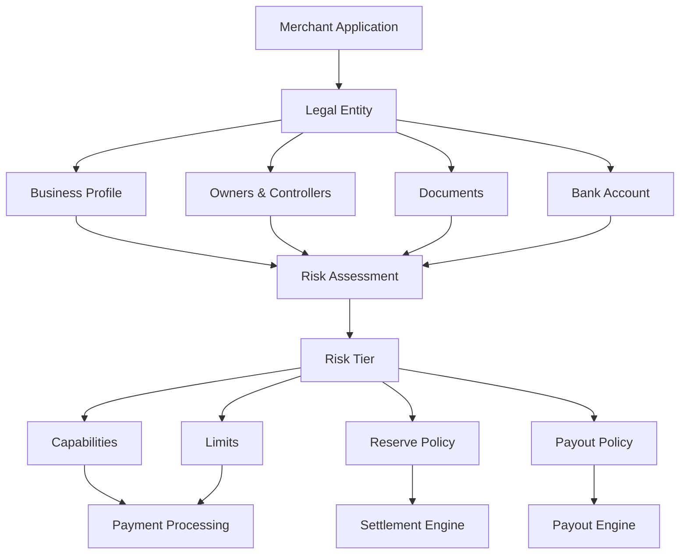
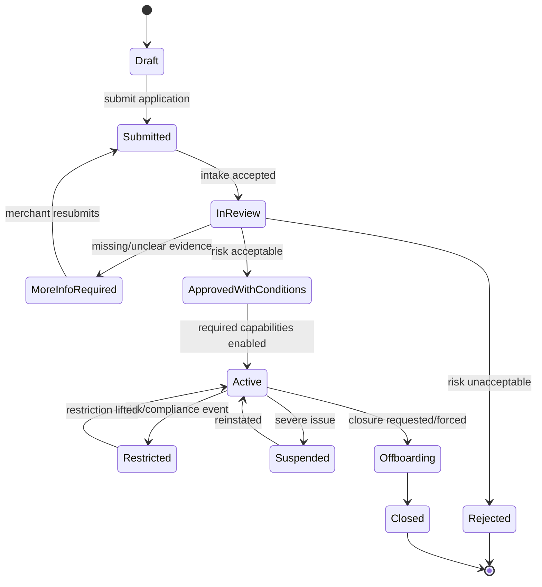
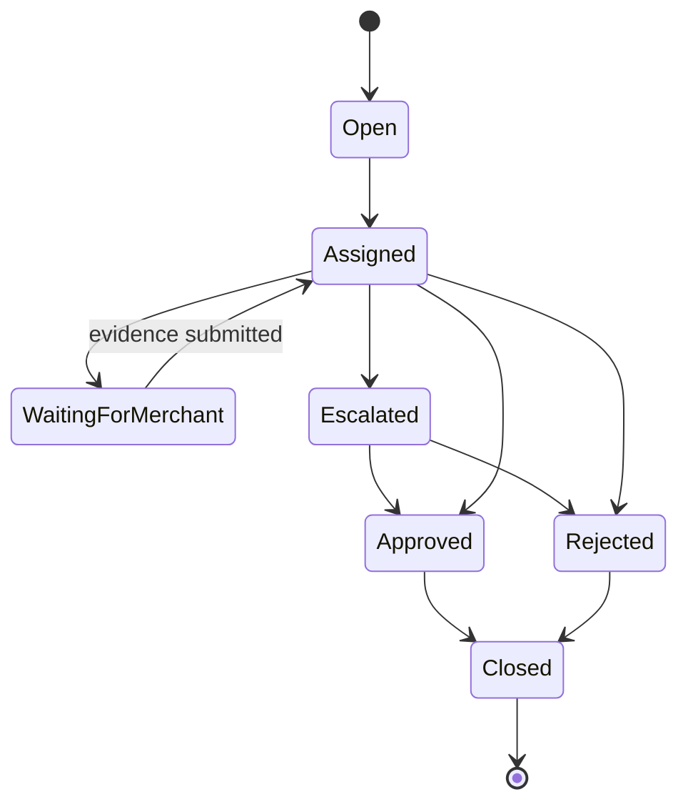
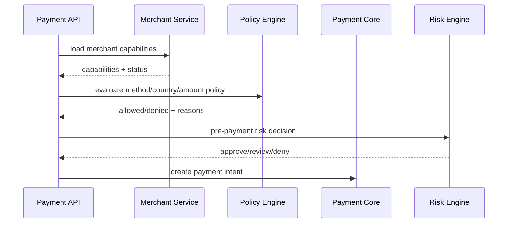

------
title: Build From Scratch: Large Production Grade Java Payment Systems - Part 043
description: Merchant onboarding dan KYB untuk payment platform enterprise: lifecycle, evidence, beneficial ownership, risk tiering, capability enablement, limit, reserve, payout control, dan audit trail.
series: learn-java-payment-systems
seriesTitle: Build From Scratch: Large Production Grade Java Payment Systems
order: 43
partTitle: Merchant Onboarding and KYB
tags:
- java
- payments
- payment-systems
- fintech
- kyb
- merchant-onboarding
- compliance
- risk
- enterprise-architecture
date: 2026-07-02
---

# Part 043 — Merchant Onboarding and KYB

Payment platform yang menerima merchant bukan hanya membangun halaman pendaftaran.
Ia sedang membuka pintu bagi pihak lain untuk menerima uang, menahan uang, mengembalikan uang, melakukan payout, mungkin menyentuh data konsumen, dan berinteraksi dengan payment rails.

Itu sebabnya merchant onboarding adalah **control plane**.

Bukan:

```txt
merchant submits form -> system creates account -> merchant can transact
```

Melainkan:

```txt
merchant submits identity + business + ownership + bank + risk evidence
-> platform verifies what must be verified
-> platform assigns risk tier
-> platform enables only allowed capabilities
-> platform sets limits, reserves, payout delay, settlement policy
-> platform monitors continuously
-> platform records evidence for audit, dispute, regulator, and internal review
```

Top 1% engineer tidak melihat KYB sebagai “fitur compliance”.
Mereka melihatnya sebagai **gatekeeper terhadap money movement capability**.

---

## 1. What We Are Building

Kita akan membangun merchant onboarding subsystem untuk large payment platform.

Scope-nya mencakup:

1. merchant application intake,
2. legal entity modeling,
3. business profile,
4. beneficial owner / controller model,
5. document collection,
6. bank account verification,
7. sanctions/AML screening hook,
8. risk tiering,
9. capability enablement,
10. processing limits,
11. payout limits,
12. reserve policy,
13. review case workflow,
14. evidence and audit trail,
15. ongoing monitoring and re-verification.

Yang tidak kita bahas ulang:

- REST dasar,
- database indexing dasar,
- generic workflow engine dasar,
- authn/authz dasar,
- generic file upload dasar.

Yang dibahas adalah payment-specific model.

---

## 2. Merchant Onboarding Is Not User Registration

User registration menjawab:

> “Siapa user ini dan bolehkah dia masuk?”

Merchant onboarding menjawab:

> “Apakah entitas ini boleh menerima uang melalui platform kita, dengan metode apa, sampai batas berapa, dengan settlement seperti apa, dan risiko apa yang kita terima?”

Perbedaannya besar.

| Dimension | User Registration | Merchant Onboarding |
|---|---|---|
| Subject | Person/user | Legal entity / sole proprietor / business |
| Main question | Can this user access? | Can this business process money? |
| Evidence | Email/phone/password | Legal docs, ownership, bank, tax, address, website, business model |
| Risk | Account abuse | Fraud, AML, sanctions, chargeback, illegal business, payout loss |
| Output | User account | Merchant capabilities, limits, reserve, payout policy |
| Lifecycle | Mostly static | Ongoing monitoring |
| Audit burden | Moderate | High |

A payment platform can survive a bad user registration flow.
It cannot survive reckless merchant onboarding at scale.

---

## 3. Core Mental Model

Merchant onboarding produces **capabilities**, not just a merchant row.



A merchant is not “approved” in one global sense.
A merchant can be:

- approved to create payment intents,
- approved to accept cards,
- approved to accept QR payments,
- approved to accept bank transfer,
- approved to issue refunds,
- approved to receive automatic payouts,
- approved to process high-risk categories,
- approved for cross-border payments,
- approved for subscription/MIT,
- approved for manual adjustment,
- approved for instant settlement.

Each capability can have different conditions.

---

## 4. The Dangerous Simplification

A naive design:

```sql
CREATE TABLE merchants (
    id UUID PRIMARY KEY,
    name TEXT NOT NULL,
    status TEXT NOT NULL
);
```

Then application code does:

```java
if (merchant.status().equals("ACTIVE")) {
    allowPayment();
}
```

This is dangerous.

Why?

Because `ACTIVE` hides too many questions:

- active for which country?
- active for which payment method?
- active for what transaction size?
- active for manual capture?
- active for refunds?
- active for payout?
- active after sanctions rescreening?
- active before bank account verified?
- active despite unresolved KYB case?
- active with reserve or without reserve?

In payment systems, boolean approval is usually a modeling smell.

---

## 5. Better Primitive: Merchant Capability

Use explicit capability records.

```txt
MerchantCapability
- merchantId
- capabilityType
- status
- effectiveFrom
- effectiveUntil
- conditions
- reasonCode
- sourceDecisionId
- version
```

Examples:

```txt
ACCEPT_CARD_PAYMENTS       ENABLED_WITH_CONDITIONS
ACCEPT_QR_PAYMENTS         ENABLED
ACCEPT_BANK_TRANSFER       ENABLED
ISSUE_REFUNDS              ENABLED
RECEIVE_AUTOMATIC_PAYOUTS  DISABLED_PENDING_BANK_VERIFICATION
PROCESS_SUBSCRIPTIONS      DISABLED_REQUIRES_ADDITIONAL_REVIEW
INSTANT_SETTLEMENT         DISABLED_HIGH_RISK_CATEGORY
```

Capability status is not just operational metadata.
It is a financial control.

---

## 6. Merchant Lifecycle

A production merchant lifecycle should be explicit.



Important: lifecycle state is not enough.
It coordinates onboarding workflow, but runtime authorization must use capability + policy + limit.

---

## 7. Main Aggregates

A robust model separates these aggregates:

```txt
Merchant
LegalEntity
MerchantApplication
BusinessProfile
BusinessOwner
BusinessController
MerchantDocument
MerchantBankAccount
MerchantCapability
MerchantRiskProfile
MerchantLimitProfile
MerchantReserveProfile
MerchantReviewCase
MerchantAuditEvent
```

Do not put all fields into one `merchant` table.
That creates a giant mutable blob that is hard to audit, hard to version, and impossible to reason about.

---

## 8. Merchant Aggregate

`Merchant` is the operating identity inside your platform.

```txt
Merchant
- merchantId
- platformAccountId
- legalEntityId
- displayName
- lifecycleStatus
- country
- primaryCurrency
- createdAt
- activatedAt
- closedAt
```

The merchant is not necessarily the same as the legal entity.

One legal entity may have:

- one merchant account,
- multiple storefronts,
- multiple brands,
- multiple settlement accounts,
- multiple platform sub-accounts,
- multiple capabilities.

Depending on product, you may need `merchant_site`, `merchant_store`, `merchant_channel`, or `merchant_sub_account` later.

For this series, we keep `Merchant` as the processing principal.

---

## 9. Legal Entity Model

The legal entity is what compliance cares about.

```txt
LegalEntity
- legalEntityId
- entityType
- legalName
- registrationNumber
- taxIdentifier
- incorporationCountry
- registeredAddress
- operatingAddress
- dateOfIncorporation
- businessCategory
- ownershipStructure
```

Entity types:

```txt
INDIVIDUAL_SOLE_PROPRIETOR
PRIVATE_COMPANY
PUBLIC_COMPANY
PARTNERSHIP
NON_PROFIT
GOVERNMENT_ENTITY
```

Do not mix legal entity data with merchant display data.

Bad:

```txt
merchant.name = "Warung Budi"
```

Good:

```txt
legal_entity.legal_name = "PT Budi Digital Niaga"
merchant.display_name = "Warung Budi Online"
```

---

## 10. Beneficial Ownership and Controllers

For KYB, knowing the company name is not enough.
You often need to know who owns or controls it.

Model separately:

```txt
BusinessOwner
- ownerId
- legalEntityId
- personId
- ownershipPercentage
- ownershipType
- verificationStatus
- sourceDocumentId
```

```txt
BusinessController
- controllerId
- legalEntityId
- personId
- role
- authorityLevel
- verificationStatus
```

Examples:

```txt
Ultimate Beneficial Owner
Director
Authorized Representative
Signer
Primary Contact
Compliance Contact
Finance Contact
```

The FATF beneficial ownership guidance emphasizes adequate, accurate, and up-to-date information about beneficial ownership so that legal persons cannot be misused behind opaque ownership structures.
In architecture terms, that means ownership data is not a one-time text field.
It is structured evidence with freshness and review status.

---

## 11. Business Profile

Business profile explains what the merchant does.

```txt
BusinessProfile
- merchantId
- businessModel
- productCategory
- mcc
- websiteUrl
- appUrl
- salesChannel
- expectedMonthlyVolume
- averageTransactionAmount
- maxTransactionAmount
- refundPolicyUrl
- deliveryFulfillmentModel
- countriesServed
- customerType
- subscriptionModel
- highRiskFlags
```

Business profile drives:

- MCC/category assignment,
- risk tier,
- allowed payment methods,
- dispute risk estimation,
- refund risk,
- payout delay,
- reserve policy,
- monitoring thresholds,
- compliance requirement.

A merchant selling digital goods with instant delivery has different risk from a merchant selling low-value physical goods with delayed fulfillment.

---

## 12. Merchant Category and Prohibited Businesses

Never hard-code prohibited business logic in random payment code.

Create structured category policy.

```txt
MerchantCategoryPolicy
- categoryCode
- country
- paymentMethod
- allowedStatus
- requiredReviewLevel
- requiredDocuments
- defaultRiskTier
- defaultReservePolicy
- defaultPayoutDelay
```

Possible statuses:

```txt
ALLOWED
ALLOWED_WITH_REVIEW
ALLOWED_WITH_RESTRICTIONS
PROHIBITED
UNKNOWN_REQUIRES_REVIEW
```

This policy must be versioned.
A merchant approved under one policy version may need re-review when policy changes.

---

## 13. Document Model

Documents are evidence.
Do not store them as anonymous files.

```txt
MerchantDocument
- documentId
- merchantId
- legalEntityId
- documentType
- storageReference
- checksum
- submittedBy
- submittedAt
- expiresAt
- verificationStatus
- verificationProvider
- verificationResultId
- rejectionReason
```

Examples:

```txt
BUSINESS_REGISTRATION
TAX_DOCUMENT
ARTICLES_OF_ASSOCIATION
BANK_STATEMENT
PROOF_OF_ADDRESS
IDENTITY_DOCUMENT_OWNER
AUTHORIZATION_LETTER
WEBSITE_SCREENSHOT
PROCESSING_HISTORY
FINANCIAL_STATEMENT
```

Important attributes:

- document type,
- issuer,
- expiry,
- version,
- hash/checksum,
- reviewer,
- verification outcome,
- reason code,
- link to decision.

Never make document review a comment field.

---

## 14. Bank Account Verification

Merchant payout requires confidence in destination account.

```txt
MerchantBankAccount
- bankAccountId
- merchantId
- country
- currency
- bankCode
- accountNumberToken
- accountHolderName
- verificationStatus
- verificationMethod
- verificationEvidenceId
- capabilityStatus
- createdAt
- disabledAt
```

Verification methods may include:

- name matching,
- micro-deposit,
- bank API validation,
- uploaded bank statement,
- manual review,
- third-party verification provider.

Runtime rule:

```txt
No payout to unverified or disabled bank account.
```

Do not rely only on UI.
Payout engine must enforce it.

---

## 15. Capability Enablement

Capability records are the bridge between onboarding and runtime payment.

```sql
CREATE TABLE merchant_capability (
    capability_id UUID PRIMARY KEY,
    merchant_id UUID NOT NULL,
    capability_type TEXT NOT NULL,
    status TEXT NOT NULL,
    condition_json JSONB NOT NULL DEFAULT '{}',
    source_decision_id UUID,
    effective_from TIMESTAMPTZ NOT NULL,
    effective_until TIMESTAMPTZ,
    version BIGINT NOT NULL DEFAULT 0,
    created_at TIMESTAMPTZ NOT NULL DEFAULT now(),
    updated_at TIMESTAMPTZ NOT NULL DEFAULT now(),
    UNIQUE (merchant_id, capability_type)
);
```

Capability types:

```txt
ACCEPT_CARD_PAYMENTS
ACCEPT_QR_PAYMENTS
ACCEPT_BANK_TRANSFER_PAYMENTS
ACCEPT_WALLET_PAYMENTS
CREATE_PAYMENT_LINKS
CREATE_SUBSCRIPTIONS
ISSUE_REFUNDS
MANUAL_CAPTURE
RECEIVE_AUTOMATIC_PAYOUTS
RECEIVE_INSTANT_PAYOUTS
CHANGE_BANK_ACCOUNT
CREATE_MANUAL_ADJUSTMENT_REQUEST
```

Capability statuses:

```txt
PENDING
ENABLED
ENABLED_WITH_CONDITIONS
DISABLED
SUSPENDED
REVOKED
EXPIRED
```

Runtime check example:

```java
public void assertCapability(UUID merchantId, CapabilityType type, PaymentContext ctx) {
    MerchantCapability cap = capabilityRepository.getRequired(merchantId, type);

    if (!cap.isCurrentlyUsable(clock.instant())) {
        throw new CapabilityDeniedException(type, cap.status(), cap.reasonCode());
    }

    conditionEvaluator.assertSatisfied(cap.conditions(), ctx);
}
```

---

## 16. Risk Tiering

Risk tier is a compact operational classification.
It must not hide the evidence behind it.

```txt
MerchantRiskProfile
- merchantId
- riskTier
- score
- decisionId
- policyVersion
- reasonCodes
- effectiveFrom
- nextReviewAt
```

Example tiers:

```txt
LOW
STANDARD
ELEVATED
HIGH
PROHIBITED
```

Risk tier drives defaults:

| Risk Tier | Card Capability | Payout Delay | Reserve | Review Cadence |
|---|---|---:|---:|---:|
| LOW | Enabled | T+1 | 0% | Annual |
| STANDARD | Enabled | T+2 | 0-5% | Annual/Semiannual |
| ELEVATED | Conditional | T+7 | 5-15% | Quarterly |
| HIGH | Restricted | Manual/Delayed | 15-30% | Monthly |
| PROHIBITED | Disabled | N/A | N/A | N/A |

These are examples, not universal rules.
The actual numbers depend on business model, jurisdiction, scheme rule, acquirer policy, and internal risk appetite.

---

## 17. Review Case Workflow

A review case is not just a support ticket.
It is an evidence-driven decision process.



Case types:

```txt
KYB_INITIAL_REVIEW
BENEFICIAL_OWNER_REVIEW
BANK_ACCOUNT_REVIEW
HIGH_RISK_CATEGORY_REVIEW
SANCTIONS_POTENTIAL_MATCH
WEBSITE_REVIEW
PROCESSING_LIMIT_INCREASE
PAYOUT_RESTRICTION_REVIEW
REACTIVATION_REVIEW
```

Each case should store:

- subject merchant,
- reason,
- policy version,
- evidence list,
- reviewer actions,
- decision,
- decision reasons,
- capability/limit/reserve changes applied,
- audit trail.

---

## 18. Decision Model

Avoid scattered approval fields.
Create explicit decision records.

```txt
MerchantDecision
- decisionId
- merchantId
- decisionType
- decisionStatus
- policyVersion
- riskTierBefore
- riskTierAfter
- reasonCodes
- evidenceReferences
- decidedBy
- decidedAt
```

Decision types:

```txt
APPROVE_MERCHANT
REJECT_MERCHANT
ENABLE_CAPABILITY
DISABLE_CAPABILITY
CHANGE_LIMIT
CHANGE_RESERVE
CHANGE_PAYOUT_DELAY
REQUEST_MORE_INFORMATION
SUSPEND_MERCHANT
REINSTATE_MERCHANT
```

The output of review is not text.
It must mutate controlled objects:

- capabilities,
- limits,
- reserve policy,
- payout policy,
- review cadence,
- merchant lifecycle state.

---

## 19. Schema Sketch

A minimal schema family:

```sql
CREATE TABLE merchant_application (
    application_id UUID PRIMARY KEY,
    merchant_id UUID,
    status TEXT NOT NULL,
    submitted_by UUID NOT NULL,
    submitted_at TIMESTAMPTZ,
    current_step TEXT NOT NULL,
    country TEXT NOT NULL,
    created_at TIMESTAMPTZ NOT NULL DEFAULT now(),
    updated_at TIMESTAMPTZ NOT NULL DEFAULT now()
);

CREATE TABLE legal_entity (
    legal_entity_id UUID PRIMARY KEY,
    entity_type TEXT NOT NULL,
    legal_name TEXT NOT NULL,
    registration_number TEXT,
    tax_identifier TEXT,
    incorporation_country CHAR(2) NOT NULL,
    registered_address_json JSONB NOT NULL,
    operating_address_json JSONB,
    created_at TIMESTAMPTZ NOT NULL DEFAULT now(),
    updated_at TIMESTAMPTZ NOT NULL DEFAULT now()
);

CREATE TABLE merchant (
    merchant_id UUID PRIMARY KEY,
    legal_entity_id UUID NOT NULL REFERENCES legal_entity(legal_entity_id),
    display_name TEXT NOT NULL,
    lifecycle_status TEXT NOT NULL,
    country CHAR(2) NOT NULL,
    primary_currency CHAR(3) NOT NULL,
    created_at TIMESTAMPTZ NOT NULL DEFAULT now(),
    activated_at TIMESTAMPTZ,
    closed_at TIMESTAMPTZ
);

CREATE TABLE business_owner (
    owner_id UUID PRIMARY KEY,
    legal_entity_id UUID NOT NULL REFERENCES legal_entity(legal_entity_id),
    person_ref UUID NOT NULL,
    ownership_percentage NUMERIC(5,2),
    ownership_type TEXT NOT NULL,
    verification_status TEXT NOT NULL,
    created_at TIMESTAMPTZ NOT NULL DEFAULT now()
);

CREATE TABLE merchant_risk_profile (
    merchant_id UUID PRIMARY KEY REFERENCES merchant(merchant_id),
    risk_tier TEXT NOT NULL,
    score NUMERIC(10,4),
    policy_version TEXT NOT NULL,
    reason_codes TEXT[] NOT NULL,
    effective_from TIMESTAMPTZ NOT NULL,
    next_review_at TIMESTAMPTZ
);
```

This is not complete, but it establishes the shape.

---

## 20. Event Model

Merchant onboarding produces domain events.

```txt
MerchantApplicationSubmitted
MerchantDocumentUploaded
MerchantDocumentVerified
MerchantDocumentRejected
MerchantBeneficialOwnerAdded
MerchantBankAccountSubmitted
MerchantBankAccountVerified
MerchantRiskAssessed
MerchantCapabilityEnabled
MerchantCapabilitySuspended
MerchantLimitProfileChanged
MerchantReservePolicyChanged
MerchantApproved
MerchantRejected
MerchantSuspended
MerchantReinstated
```

These events feed:

- compliance monitoring,
- risk engine,
- payment authorization,
- payout engine,
- settlement engine,
- backoffice audit,
- data warehouse,
- regulatory reporting.

---

## 21. Capability Check in Payment Flow

Payment creation should not rely on merchant lifecycle alone.



Runtime guard:

```txt
merchant lifecycle active
AND capability enabled
AND method allowed
AND amount within limit
AND country allowed
AND risk decision allows
AND no active restriction
```

---

## 22. Restriction Model

Restrictions are important because they can be temporary and partial.

```txt
MerchantRestriction
- restrictionId
- merchantId
- restrictionType
- scope
- reasonCode
- sourceCaseId
- effectiveFrom
- effectiveUntil
- createdBy
```

Restriction types:

```txt
BLOCK_NEW_PAYMENTS
BLOCK_REFUNDS
BLOCK_PAYOUTS
BLOCK_BANK_ACCOUNT_CHANGE
BLOCK_HIGH_VALUE_TRANSACTIONS
REQUIRE_MANUAL_REVIEW_FOR_PAYOUT
FORCE_RESERVE_HOLD
```

Avoid one global `SUSPENDED` switch unless the situation truly requires full stop.
Partial restrictions preserve business continuity while containing risk.

---

## 23. Merchant Onboarding and Ledger

Onboarding itself does not usually post ledger entries.
But onboarding decisions configure future ledger behavior.

Examples:

- reserve policy determines settlement journal split,
- payout delay determines available balance timing,
- negative balance policy determines refund funding behavior,
- high-risk tier determines dispute reserve,
- merchant country/currency determines account structure,
- platform pricing plan determines fee posting.

Therefore merchant metadata must be versioned and referenced in financial decisions.

A settlement journal should be able to answer:

```txt
Which merchant risk profile version was active?
Which reserve policy was used?
Which fee plan version was used?
Which payout delay policy was used?
```

---

## 24. Merchant Statement Implication

Merchant onboarding affects statements.

A merchant statement may need to show:

- processing volume,
- fee model,
- reserve hold,
- reserve release,
- payout delay,
- negative balance recovery,
- account restrictions,
- settlement currency,
- tax/VAT/GST identifiers,
- legal entity name.

If onboarding data is mutable without versioning, historical statements become inconsistent.

---

## 25. Data Versioning

Fields that influence financial outcomes need versioning.

Version these:

- pricing plan,
- reserve policy,
- payout policy,
- limits,
- risk tier,
- merchant category,
- settlement bank account,
- legal entity identity,
- tax profile,
- capability status.

Not every read needs historical versioning, but every financial posting must reference the effective version used.

---

## 26. Ongoing Monitoring

KYB is not one-time.

Triggers for re-review:

```txt
business category changes
website changes
ownership changes
bank account changes
volume spike
chargeback spike
refund spike
payout destination change
sanctions list update
manual report
regulatory request
policy version update
```

Architecture pattern:

```txt
Event -> Monitoring Rule -> Review Case -> Decision -> Capability/Limit/Reserve Change
```

Do not let monitoring only produce alerts.
It must be able to drive controlled state changes.

---

## 27. Java Domain Sketch

```java
public record MerchantId(UUID value) {}
public record LegalEntityId(UUID value) {}

public enum CapabilityType {
    ACCEPT_CARD_PAYMENTS,
    ACCEPT_QR_PAYMENTS,
    ACCEPT_BANK_TRANSFER_PAYMENTS,
    ISSUE_REFUNDS,
    RECEIVE_AUTOMATIC_PAYOUTS,
    RECEIVE_INSTANT_PAYOUTS,
    CREATE_SUBSCRIPTIONS
}

public enum CapabilityStatus {
    PENDING,
    ENABLED,
    ENABLED_WITH_CONDITIONS,
    DISABLED,
    SUSPENDED,
    REVOKED,
    EXPIRED
}

public record MerchantCapability(
    UUID capabilityId,
    MerchantId merchantId,
    CapabilityType type,
    CapabilityStatus status,
    CapabilityConditions conditions,
    Instant effectiveFrom,
    Optional<Instant> effectiveUntil,
    long version
) {
    public boolean isCurrentlyUsable(Instant now) {
        if (!(status == CapabilityStatus.ENABLED || status == CapabilityStatus.ENABLED_WITH_CONDITIONS)) {
            return false;
        }
        if (now.isBefore(effectiveFrom)) {
            return false;
        }
        return effectiveUntil.map(now::isBefore).orElse(true);
    }
}
```

The important point is not the enum.
The important point is that capability is explicit, versioned, and evaluated at runtime.

---

## 28. Service Boundary

A clean boundary:

```txt
merchant-service
- merchant lifecycle
- legal entity profile
- business profile
- documents metadata
- bank account metadata
- capabilities
- restrictions
- risk profile snapshot
- onboarding cases
```

It should not own:

```txt
payment execution
ledger posting
settlement batch creation
payout execution
fraud scoring internals
sanctions provider internals
```

But it exposes decisions to those systems.

Example API:

```txt
GET /internal/merchants/{merchantId}/runtime-profile
```

Response:

```json
{
  "merchantId": "...",
  "lifecycleStatus": "ACTIVE",
  "riskTier": "ELEVATED",
  "capabilities": [
    { "type": "ACCEPT_CARD_PAYMENTS", "status": "ENABLED_WITH_CONDITIONS" },
    { "type": "RECEIVE_AUTOMATIC_PAYOUTS", "status": "ENABLED" }
  ],
  "restrictions": [],
  "limitProfileId": "...",
  "reservePolicyId": "...",
  "payoutPolicyId": "..."
}
```

---

## 29. Runtime Caching

Merchant runtime profile is read frequently.

But stale data can be dangerous.

Use caching only with clear invalidation:

- short TTL,
- event-driven invalidation,
- version number,
- fail-closed for critical capabilities,
- fail-open only for explicitly approved low-risk reads.

Critical examples:

```txt
payout capability -> fail closed
card processing capability -> fail closed if merchant suspended
payment method display -> can tolerate short stale cache
statement display -> can tolerate stale read
```

---

## 30. Backoffice Actions

Backoffice must not update merchant rows directly.

Use command actions:

```txt
ApproveMerchantApplication
RejectMerchantApplication
RequestMoreInformation
EnableCapability
DisableCapability
ChangeRiskTier
ChangeLimitProfile
ApplyPayoutRestriction
ReleasePayoutRestriction
ChangeReservePolicy
VerifyBankAccount
RejectBankAccount
```

Each action must record:

- actor,
- role,
- reason,
- before state,
- after state,
- evidence,
- approval chain if required,
- timestamp,
- correlation id.

For high-risk actions, require maker-checker.

---

## 31. Failure Modes

### Failure: Merchant Approved Without Bank Verification

Impact:

- merchant can accept payments,
- settlement accumulates,
- payout later fails,
- operations manually intervene.

Mitigation:

- separate `ACCEPT_PAYMENTS` from `RECEIVE_PAYOUTS`,
- allow staged approval,
- make payout engine enforce verified bank account.

### Failure: Risk Tier Changed but Limits Not Updated

Impact:

- high-risk merchant still processes large volume,
- reserve policy wrong,
- loss exposure grows.

Mitigation:

- decision transaction updates tier + limit + reserve together,
- publish event,
- reconciliation/monitoring job checks consistency.

### Failure: Document Rejected but Capability Still Enabled

Impact:

- compliance breach,
- audit failure,
- unauthorized processing.

Mitigation:

- document status feeds review case,
- review decision drives capability,
- invariant job checks capability requirements.

### Failure: Bank Account Changed Without Payout Hold

Impact:

- account takeover payout fraud.

Mitigation:

- bank change triggers payout hold,
- require re-verification,
- notify merchant contacts,
- maker-checker for manual override.

---

## 32. Invariants

Key invariants:

```txt
Merchant cannot receive payout unless payout capability enabled.
Merchant cannot receive payout to unverified bank account.
Merchant cannot process method unless capability enabled for that method.
Merchant cannot exceed active limit profile.
Merchant cannot bypass active restrictions.
Risk tier change must produce auditable decision.
Capability change must reference decision or system rule.
Document rejection must not silently leave dependent capability enabled.
Bank account change must create audit event and may trigger payout hold.
Reserve policy used by settlement must be versioned.
```

These invariants should be tested in unit, integration, and nightly consistency jobs.

---

## 33. Consistency Jobs

Production systems need invariant checkers.

Examples:

```sql
-- payout capability enabled but no verified active bank account
SELECT m.merchant_id
FROM merchant m
JOIN merchant_capability c ON c.merchant_id = m.merchant_id
WHERE c.capability_type = 'RECEIVE_AUTOMATIC_PAYOUTS'
  AND c.status IN ('ENABLED', 'ENABLED_WITH_CONDITIONS')
  AND NOT EXISTS (
      SELECT 1
      FROM merchant_bank_account b
      WHERE b.merchant_id = m.merchant_id
        AND b.verification_status = 'VERIFIED'
        AND b.status = 'ACTIVE'
  );
```

This should page an operational owner if found.

---

## 34. Test Matrix

| Scenario | Expected Outcome |
|---|---|
| Merchant submits incomplete application | More info required |
| Legal entity verified, bank unverified | Can process only if policy allows, cannot payout |
| High-risk category | Manual review required |
| Owner potential sanctions match | Capability disabled or pending review |
| Bank account changed | Payout hold triggered |
| Risk tier upgraded | Limits/reserve/payout delay updated |
| Merchant suspended | Payment and payout runtime checks deny |
| Merchant reinstated | Capabilities re-enabled only according to decision |
| Processing limit increase requested | Review case created |
| Document expires | Re-verification workflow triggered |

---

## 35. Anti-Patterns

### Anti-Pattern 1: `merchant.status = ACTIVE`

Too coarse.
Use lifecycle + capability + limits + restrictions.

### Anti-Pattern 2: Compliance Data as Free Text

Free text cannot drive runtime controls.
Structure evidence.

### Anti-Pattern 3: Approval Without Conditions

Most real approval is conditional.
Capture conditions explicitly.

### Anti-Pattern 4: Manual Database Update

Backoffice changes must go through commands and audit.

### Anti-Pattern 5: No Versioning

If settlement uses today’s merchant policy for last month’s transaction, statements become wrong.

### Anti-Pattern 6: Onboarding Only Before Activation

Risk changes after activation.
Ongoing monitoring is required.

---

## 36. Build Order

Build in this order:

1. legal entity and merchant model,
2. application intake,
3. document metadata,
4. bank account metadata,
5. capability model,
6. risk profile snapshot,
7. limit/reserve/payout policy references,
8. review case workflow,
9. backoffice command actions,
10. runtime merchant profile API,
11. payment/payout enforcement integration,
12. consistency jobs,
13. ongoing monitoring triggers.

Do not start with a giant KYB form.
Start with the state and control model.

---

## 37. Production Readiness Checklist

- [ ] Merchant lifecycle state is separate from capabilities.
- [ ] Legal entity data is separate from merchant display data.
- [ ] Beneficial owners/controllers are structured.
- [ ] Documents are stored as evidence with metadata and verification status.
- [ ] Bank accounts require verification before payout.
- [ ] Capability changes are decision-backed and auditable.
- [ ] Risk tier is versioned and tied to policy version.
- [ ] Limit, reserve, and payout policy are effective-dated.
- [ ] Backoffice cannot mutate critical state without command/audit.
- [ ] Merchant suspension is enforced by payment and payout runtime flows.
- [ ] Ongoing monitoring can create review cases.
- [ ] Consistency jobs detect broken invariants.
- [ ] Historical settlement can explain which merchant policy was used.

---

## 38. References

- FATF — Guidance on Beneficial Ownership of Legal Persons.
- OFAC — A Framework for OFAC Compliance Commitments.
- Bank Indonesia — SNAP: Standar Nasional Open API Pembayaran.
- Bank Indonesia — Blueprint Sistem Pembayaran Indonesia 2030.
- Stripe Connect — Account balances, capabilities, payouts, and connected account onboarding concepts.
- Adyen for Platforms — Account holder, balance account, verification, split transaction, and payout concepts.

---

## 39. What Comes Next

Merchant onboarding decides who may access the payment platform.
But after a merchant is active, every payment/refund/payout still needs runtime controls.

Next we build:

```txt
Part 044 — Limits, Controls, and Policy Engine
```

That part turns merchant risk decisions into executable controls.
