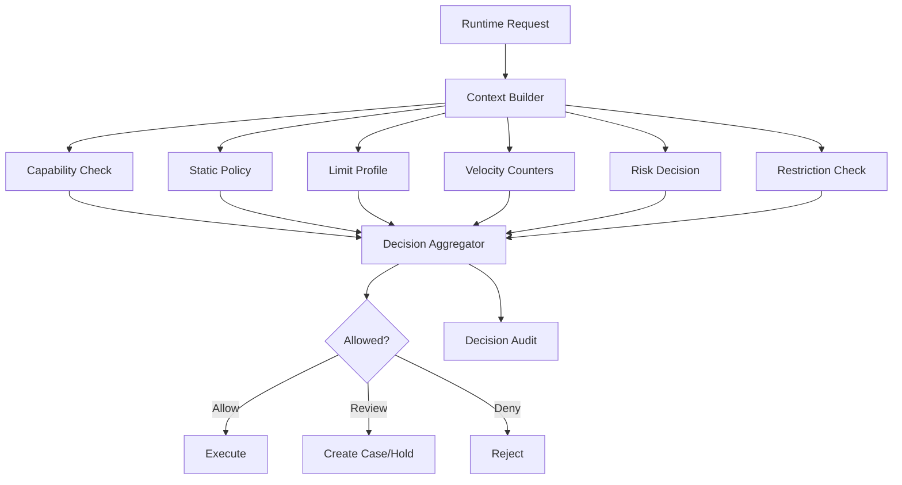
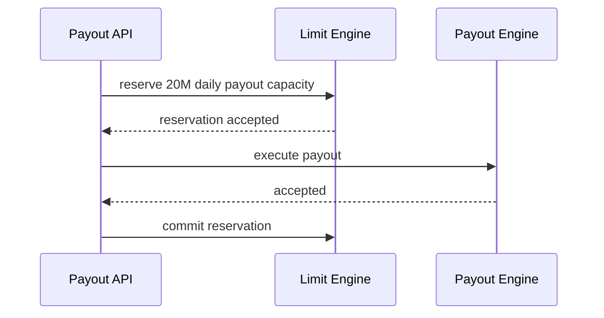
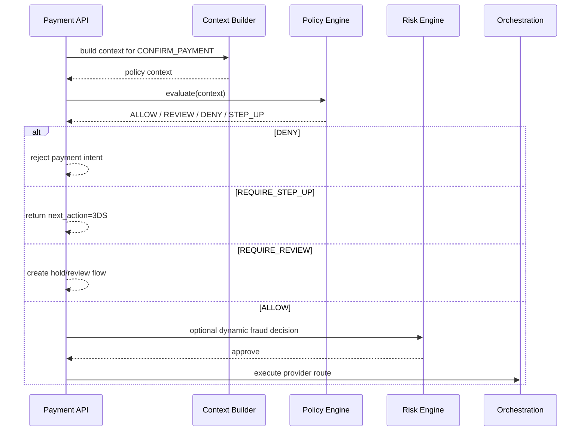
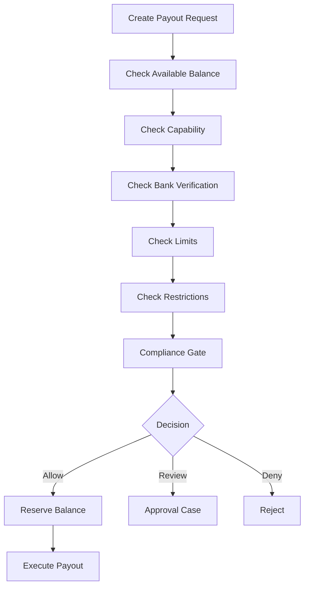

------
title: Build From Scratch: Large Production Grade Java Payment Systems - Part 044
description: Limits, controls, dan policy engine untuk payment platform enterprise: amount limit, velocity, merchant risk, country/method policy, payout control, reserve, operational override, dan runtime enforcement.
series: learn-java-payment-systems
seriesTitle: Build From Scratch: Large Production Grade Java Payment Systems
order: 44
partTitle: Limits, Controls, and Policy Engine
tags:
- java
- payments
- payment-systems
- fintech
- policy-engine
- limits
- risk
- controls
- enterprise-architecture
date: 2026-07-02
---

# Part 044 — Limits, Controls, and Policy Engine

Payment system tanpa limit adalah mesin yang bisa memperbesar bug, fraud, dan kesalahan operasional dalam hitungan detik.

A payment platform needs a **runtime control plane**.

Control plane ini menjawab:

```txt
Should this merchant/customer/payment/refund/payout/action be allowed now?
Under which conditions?
Up to what amount?
How often?
Through which method?
With which review requirement?
With which reserve/payout delay?
```

Part ini membangun policy engine dan limits system untuk money movement.

---

## 1. What We Are Building

Kita akan membangun:

1. policy model,
2. limit profile,
3. velocity counter,
4. risk-aware runtime decision,
5. payment/refund/payout controls,
6. merchant controls,
7. customer controls,
8. payment method controls,
9. country/currency controls,
10. backoffice override,
11. decision audit,
12. simulation and shadow mode,
13. consistency and monitoring.

Ini bukan generic rules engine tutorial.
Ini adalah payment-specific control engine.

---

## 2. Mental Model

A payment decision is not a single `if`.
It is a composition of controls.



Policy engine does not move money.
It says whether money movement is allowed.

---

## 3. Policy vs Limit vs Risk vs Restriction

These are different primitives.

| Primitive | Meaning | Example |
|---|---|---|
| Policy | Rule about what is allowed | Cards not allowed for prohibited MCC |
| Limit | Numeric boundary | Max transaction IDR 10,000,000 |
| Velocity | Time-window boundary | Max 100 payments per hour |
| Risk decision | Dynamic assessment | Hold payment for review |
| Restriction | Explicit block/condition | Block payouts due to investigation |
| Capability | Merchant permission | Merchant may accept QR payments |
| Override | Authorized exception | Temporary higher limit for campaign |

Do not collapse them into one `rules` table.

---

## 4. Where Controls Apply

Controls apply at multiple stages:

```txt
merchant onboarding
payment method display
payment intent creation
payment confirmation
authorization
capture
refund
reversal
wallet spend
top-up
payout creation
payout approval
settlement release
manual adjustment
bank account change
limit increase request
```

Each stage needs different controls.

Example:

- payment display can be permissive,
- payment confirmation must be strict,
- payout execution must be stricter,
- manual adjustment must require approval,
- settlement release must be auditable.

---

## 5. Policy Decision Contract

A policy engine should return structured decision, not boolean.

```txt
PolicyDecision
- decisionId
- subjectType
- subjectId
- action
- result
- reasonCodes
- evaluatedPolicyVersion
- evaluatedLimitProfileVersion
- evaluatedAt
- ttl
- obligations
- warnings
```

Results:

```txt
ALLOW
ALLOW_WITH_CONDITIONS
REQUIRE_REVIEW
REQUIRE_STEP_UP
DENY
HOLD
```

Obligations:

```txt
APPLY_RESERVE
DELAY_PAYOUT
REQUIRE_3DS
REQUIRE_MANUAL_APPROVAL
REQUIRE_DOCUMENT_REFRESH
CREATE_REVIEW_CASE
LOG_ENHANCED_EVIDENCE
```

This shape matters because payment systems often need conditional approval, not binary approval.

---

## 6. Request Context

Policy is only as good as context.

```txt
PaymentPolicyContext
- merchantId
- merchantRiskTier
- merchantCountry
- merchantCategory
- merchantCapabilities
- customerId
- customerCountry
- paymentMethodType
- cardBinCountry
- cardProductType
- currency
- amount
- channel
- deviceRiskSignals
- ipCountry
- billingCountry
- shippingCountry
- isSubscription
- isOffSession
- previousAttempts
- currentVelocitySnapshot
- activeRestrictions
- providerRoute
```

Avoid lazy policy code that fetches random data during evaluation.
Build context first.
Then evaluate deterministically.

---

## 7. Action Model

Use explicit action names.

```txt
CREATE_PAYMENT_INTENT
CONFIRM_PAYMENT
CAPTURE_PAYMENT
CANCEL_PAYMENT
ISSUE_REFUND
CREATE_PAYOUT
APPROVE_PAYOUT
EXECUTE_PAYOUT
CHANGE_BANK_ACCOUNT
INCREASE_LIMIT
CREATE_MANUAL_ADJUSTMENT
RELEASE_RESERVE
ENABLE_CAPABILITY
```

Every action has:

- subject,
- actor,
- amount/currency if applicable,
- channel,
- request source,
- idempotency key,
- risk context.

---

## 8. Limit Model

A limit is an amount/count/velocity boundary.

```txt
LimitProfile
- profileId
- subjectType
- subjectId
- version
- effectiveFrom
- effectiveUntil
- rules[]
```

```txt
LimitRule
- limitType
- action
- paymentMethod
- currency
- window
- maxAmount
- maxCount
- aggregationKey
- hardOrSoft
- reasonCode
```

Examples:

```txt
merchant daily card volume <= IDR 100,000,000
merchant single transaction <= IDR 10,000,000
merchant refund daily amount <= IDR 20,000,000
customer card attempts <= 5 per 10 minutes
payout batch amount <= IDR 500,000,000
manual adjustment amount > IDR 5,000,000 requires maker-checker
```

---

## 9. Limit Types

Common limit types:

```txt
SINGLE_TRANSACTION_AMOUNT
DAILY_AMOUNT
WEEKLY_AMOUNT
MONTHLY_AMOUNT
DAILY_COUNT
HOURLY_COUNT
ROLLING_WINDOW_AMOUNT
ROLLING_WINDOW_COUNT
MAX_REFUND_AMOUNT_RATIO
MAX_PAYOUT_AMOUNT
MAX_MANUAL_ADJUSTMENT_AMOUNT
MAX_BANK_ACCOUNT_CHANGE_COUNT
MAX_FAILED_ATTEMPT_COUNT
```

Payment-specific limit types:

```txt
CAPTURE_AMOUNT_NOT_EXCEED_AUTHORIZED
REFUND_AMOUNT_NOT_EXCEED_CAPTURED_MINUS_REFUNDED
PAYOUT_AMOUNT_NOT_EXCEED_AVAILABLE_BALANCE
WALLET_SPEND_NOT_EXCEED_AVAILABLE_BALANCE
RESERVE_RELEASE_NOT_EXCEED_HELD_RESERVE
```

The second group is not “risk limit”.
It is correctness invariant.

---

## 10. Hard vs Soft Limits

Hard limit:

```txt
deny if exceeded
```

Soft limit:

```txt
allow but flag/review/step-up
```

Examples:

| Control | Hard/Soft | Behavior |
|---|---|---|
| Refund > captured amount | Hard | Deny |
| Payout > available balance | Hard | Deny |
| Merchant daily volume spike | Soft/Hard | Review or hold |
| New merchant high-value card payment | Soft | Require review/capture hold |
| Manual adjustment over threshold | Hard until approved | Maker-checker |

Financial invariants are hard.
Risk appetite thresholds can be soft.

---

## 11. Velocity Counters

Velocity is about behavior over time.

Examples:

```txt
payments per merchant per hour
failed attempts per card fingerprint per 10 minutes
refund amount per merchant per day
payout amount per merchant per day
bank account changes per merchant per month
new customer cards per account per day
manual adjustments by operator per day
```

Velocity counters must answer quickly.
But they also must be defensible.

Architecture options:

1. Redis counters for online decision.
2. Database/event-sourced counter for audit/rebuild.
3. Stream processor for derived velocity features.
4. Hybrid: Redis fast path + event log truth.

Do not rely only on ephemeral Redis if the counter controls serious money movement.

---

## 12. Velocity Counter Design

```txt
VelocityEvent
- eventId
- subjectType
- subjectId
- action
- amount
- currency
- occurredAt
- aggregationKeys
- idempotencyKey
```

```txt
VelocitySnapshot
- aggregationKey
- windowType
- windowStart
- windowEnd
- count
- amount
- currency
- updatedAt
```

For online evaluation:

```java
public interface VelocityCounter {
    VelocitySnapshot getSnapshot(VelocityQuery query);
    VelocityReservation reserve(VelocityReservationCommand command);
    void commit(VelocityReservationId reservationId);
    void release(VelocityReservationId reservationId, ReleaseReason reason);
}
```

Reservation is useful when several concurrent payout/payment requests could pass the same limit before counters update.

---

## 13. Limit Reservation

Naive pattern:

```txt
check current daily payout amount
if below limit: execute payout
```

Race:

```txt
request A sees 80M of 100M used, wants 20M -> allowed
request B sees 80M of 100M used, wants 20M -> allowed
result = 120M used
```

Better:

```txt
reserve limit capacity -> execute -> commit or release reservation
```



For critical monetary limits, enforce reservation inside a database transaction or strongly consistent store.

---

## 14. Policy Rule Shape

Use declarative rules where possible, but keep semantics explicit.

Example rule:

```yaml
ruleId: card-high-value-new-merchant-review
version: 7
action: CONFIRM_PAYMENT
when:
  all:
    - merchant.riskTier in [STANDARD, ELEVATED]
    - merchant.ageDays < 30
    - payment.method == CARD
    - payment.amountMinor >= 100000000
then:
  result: REQUIRE_REVIEW
  obligations:
    - HOLD_CAPTURE
    - CREATE_REVIEW_CASE
reasonCode: NEW_MERCHANT_HIGH_VALUE_CARD_PAYMENT
```

Be careful with generic expression engines.
They can become impossible to audit if rules can call arbitrary code.

---

## 15. Deterministic Evaluation

Policy evaluation should be deterministic:

```txt
same context + same policy version -> same decision
```

This requires:

- immutable policy version,
- immutable input context snapshot,
- stable rule ordering,
- no random data fetch inside evaluation,
- explicit time passed as context,
- no hidden dependency on current database state after context build.

Store the decision with input hash.

---

## 16. Policy Versioning

Every decision should reference policy version.

```txt
PolicyDecision
- policySetId
- policySetVersion
- inputContextHash
- decisionResult
- reasonCodes
```

Why?

Because later you need to answer:

```txt
Why did we allow this merchant to payout 500M on this date?
```

The answer cannot be:

```txt
Because the current code says so.
```

It must be:

```txt
Because policy set payout-v12 evaluated context hash X and returned ALLOW with reason Y.
```

---

## 17. Policy Sources

Policies come from multiple places:

```txt
regulatory policy
scheme/acquirer/provider policy
country policy
merchant category policy
company risk appetite
merchant-specific exception
customer abuse policy
operational safety policy
incident response override
```

Separate global policy from merchant-specific override.

---

## 18. Priority and Aggregation

When multiple rules match, aggregation must be explicit.

Common precedence:

```txt
DENY > HOLD > REQUIRE_REVIEW > REQUIRE_STEP_UP > ALLOW_WITH_CONDITIONS > ALLOW
```

But not all cases are simple.

Example:

- one rule says require 3DS,
- one rule says deny prohibited MCC,
- one rule says apply reserve,
- one rule says allow.

Final result should be DENY because deny dominates.

For obligations, aggregate all compatible obligations.

---

## 19. Policy Decision Audit

Store decisions.

```sql
CREATE TABLE policy_decision (
    decision_id UUID PRIMARY KEY,
    action TEXT NOT NULL,
    subject_type TEXT NOT NULL,
    subject_id UUID NOT NULL,
    result TEXT NOT NULL,
    reason_codes TEXT[] NOT NULL,
    obligations JSONB NOT NULL,
    policy_set_id TEXT NOT NULL,
    policy_set_version TEXT NOT NULL,
    input_context_hash TEXT NOT NULL,
    input_context_json JSONB NOT NULL,
    evaluated_at TIMESTAMPTZ NOT NULL,
    expires_at TIMESTAMPTZ
);
```

For sensitive data, store redacted context or tokenized references.
Do not dump PAN, raw identity documents, or full PII into policy logs.

---

## 20. Runtime Integration: Payment Confirmation



Policy engine can request 3DS, review, hold, or deny before provider call.

---

## 21. Runtime Integration: Refund

Refund has correctness and risk controls.

Controls:

```txt
refund amount <= captured - already refunded
merchant has ISSUE_REFUNDS capability
payment status refundable
refund currency matches original payment or policy allows FX refund
merchant refund daily limit not exceeded
refund reason allowed
refund after dispute may require review
high refund ratio merchant may require review
```

Refund engine should not implement these randomly.
Call policy/limit services consistently.

---

## 22. Runtime Integration: Payout

Payout has the strictest controls.

Controls:

```txt
merchant payout capability enabled
bank account verified
available balance sufficient
payout amount within single/daily/monthly limit
no active payout restriction
reserve policy satisfied
payout delay elapsed
sanctions/compliance gate passed
manual approval if threshold exceeded
```



Payout policy should fail closed if controls are unavailable.

---

## 23. Operational Controls

Policy engine also controls operators.

Examples:

```txt
operator cannot approve own payout request
operator cannot create adjustment above role threshold
manual adjustment over threshold requires two approvers
bank account override requires compliance approval
reserve release requires finance approval
merchant reactivation requires risk approval
```

This is not just RBAC.
It is contextual authorization.

RBAC says:

```txt
Can this user perform adjustment?
```

Policy says:

```txt
Can this user perform this adjustment of this amount for this merchant in this state with this evidence?
```

---

## 24. Maker-Checker Controls

For high-risk actions:

```txt
maker creates request
checker approves/rejects
system applies action
```

Schema:

```txt
ControlApprovalRequest
- requestId
- action
- subject
- requestedBy
- requestPayload
- riskLevel
- requiredApprovals
- status
```

```txt
ControlApprovalDecision
- decisionId
- requestId
- approverId
- decision
- reason
- decidedAt
```

Invariant:

```txt
maker cannot be checker
```

For very high-risk actions, require multiple checkers from different roles.

---

## 25. Emergency Override

Incidents require fast controls:

```txt
disable provider route
block method in country
freeze merchant payouts
cap transaction amount globally
force 3DS for risky traffic
block specific BIN range
block payout to specific bank
```

Design emergency override as first-class policy, not config hack.

```txt
EmergencyControl
- controlId
- scope
- action
- condition
- effect
- reason
- createdBy
- approvedBy
- effectiveFrom
- expiresAt
```

Every emergency control must expire or be reviewed.
Permanent emergency config becomes invisible policy debt.

---

## 26. Shadow Mode

Before enforcing a new policy, run it in shadow.

```txt
current policy -> actual decision
candidate policy -> shadow decision
compare
report divergence
```

Examples:

```txt
new refund abuse rule would have held 2.3% more refunds
new payout limit would have blocked 17 merchants
new country rule would have denied 0.4% of card payments
```

Shadow mode reduces accidental revenue loss and operational chaos.

---

## 27. Simulation

Policy must be simulatable.

Inputs:

```txt
merchantId
amount
currency
method
country
customer profile
current counters
policy version
```

Output:

```txt
ALLOW/DENY/REVIEW
matched rules
reasons
obligations
counter impact
```

Backoffice should allow risk/compliance/finance to test “what would happen if”.

Do not let policy behavior be knowable only by reading code.

---

## 28. Java Service Boundary

```java
public interface PolicyEngine {
    PolicyDecision evaluate(PolicyEvaluationRequest request);
}

public record PolicyEvaluationRequest(
    UUID requestId,
    PolicyAction action,
    Subject subject,
    PolicyContext context,
    String policySetId,
    Optional<String> policyVersion
) {}

public record PolicyDecision(
    UUID decisionId,
    DecisionResult result,
    List<ReasonCode> reasonCodes,
    List<PolicyObligation> obligations,
    String policySetVersion,
    String inputContextHash,
    Instant evaluatedAt,
    Optional<Instant> expiresAt
) {}
```

Policy engine should be called by:

- payment service,
- refund service,
- payout service,
- merchant service,
- backoffice service,
- settlement release workflow,
- risk operations.

---

## 29. Context Builder Pattern

Do not make each caller construct context manually.

```java
public interface PolicyContextBuilder<A extends PolicyActionCommand> {
    PolicyContext build(A command);
}
```

Example:

```java
public final class ConfirmPaymentContextBuilder
    implements PolicyContextBuilder<ConfirmPaymentCommand> {

    public PolicyContext build(ConfirmPaymentCommand command) {
        MerchantRuntimeProfile merchant = merchantClient.getRuntimeProfile(command.merchantId());
        VelocitySnapshot velocity = velocityClient.snapshotForPayment(command);
        ActiveRestrictionSet restrictions = restrictionClient.activeForMerchant(command.merchantId());

        return PolicyContext.confirmPayment()
            .merchant(merchant)
            .amount(command.amount())
            .method(command.paymentMethod())
            .velocity(velocity)
            .restrictions(restrictions)
            .requestTime(clock.instant())
            .build();
    }
}
```

This keeps policy evaluation consistent.

---

## 30. Fail-Open vs Fail-Closed

Not every control should behave the same when dependency fails.

| Control | Failure Mode |
|---|---|
| Payout balance check unavailable | Fail closed |
| Sanctions gate unavailable | Fail closed or queue review |
| Refund correctness unavailable | Fail closed |
| Payment method display policy unavailable | Fail open with safe defaults possible |
| Fraud score unavailable | Depends on risk tier/method/amount |
| Velocity counter unavailable | Fail closed for high risk, degrade for low risk |

Document this explicitly.

Implicit fail-open is one of the most dangerous payment bugs.

---

## 31. Policy and Reconciliation

Policy decisions influence later reconciliation.

Examples:

- payment allowed due to policy version X,
- payout held due to risk rule Y,
- reserve applied due to merchant tier Z,
- refund denied due to captured amount invariant,
- manual adjustment approved by checker.

Reconciliation and audit need references to decisions.

Ledger journal metadata should include policy references when policy affects money posting.

```json
{
  "policyDecisionId": "...",
  "limitReservationId": "...",
  "reservePolicyVersion": "reserve-v9",
  "riskDecisionId": "..."
}
```

---

## 32. Policy and Product Experience

Policy engine is not only backend blocking.
It can improve UX.

Examples:

- hide unavailable payment methods,
- show “additional verification required”,
- require 3DS before authorization,
- ask merchant for more documents before limit increase,
- warn merchant before payout limit breach,
- suggest settlement delay reason.

But UI is not enforcement.
Backend must enforce again at execution.

---

## 33. Multi-Tenant and Platform Controls

If the payment platform serves platforms/marketplaces, controls may exist at multiple levels:

```txt
platform-level limit
merchant-level limit
store-level limit
customer-level limit
payment-method-level limit
operator-level limit
provider-route-level limit
```

Aggregation must be explicit.

Example:

```txt
payout allowed only if:
platform daily payout not exceeded
AND merchant daily payout not exceeded
AND merchant available balance sufficient
AND bank account verified
AND no sanctions hold
```

---

## 34. Country and Currency Policy

Country/currency controls matter for payment rails.

Examples:

```txt
method allowed only for merchant country
currency allowed only for provider route
cross-border payout requires additional review
certain countries require enhanced due diligence
certain currency conversions require FX disclosure
```

Do not encode country logic inside provider adapters.
Provider adapters should execute; policy engine should decide eligibility.

---

## 35. Provider Route Controls

Provider routing should respect policy:

```txt
provider unavailable
provider disabled for incident
provider not allowed for MCC
provider not allowed for currency
provider requires 3DS
provider has transaction amount cap
provider has daily volume cap
provider not approved for merchant segment
```

Routing engine asks policy for route eligibility.

Policy engine should not pick the best route.
It should say which routes are allowed and under what conditions.
Routing engine ranks them.

---

## 36. Database Sketch

```sql
CREATE TABLE policy_set (
    policy_set_id TEXT NOT NULL,
    version TEXT NOT NULL,
    status TEXT NOT NULL,
    effective_from TIMESTAMPTZ NOT NULL,
    effective_until TIMESTAMPTZ,
    created_by UUID NOT NULL,
    created_at TIMESTAMPTZ NOT NULL DEFAULT now(),
    PRIMARY KEY (policy_set_id, version)
);

CREATE TABLE limit_profile (
    profile_id UUID PRIMARY KEY,
    subject_type TEXT NOT NULL,
    subject_id UUID,
    version BIGINT NOT NULL,
    status TEXT NOT NULL,
    effective_from TIMESTAMPTZ NOT NULL,
    effective_until TIMESTAMPTZ,
    created_at TIMESTAMPTZ NOT NULL DEFAULT now()
);

CREATE TABLE limit_rule (
    rule_id UUID PRIMARY KEY,
    profile_id UUID NOT NULL REFERENCES limit_profile(profile_id),
    action TEXT NOT NULL,
    limit_type TEXT NOT NULL,
    payment_method TEXT,
    currency CHAR(3),
    window_seconds INTEGER,
    max_amount_minor NUMERIC(38,0),
    max_count BIGINT,
    hard_or_soft TEXT NOT NULL,
    reason_code TEXT NOT NULL
);

CREATE TABLE limit_reservation (
    reservation_id UUID PRIMARY KEY,
    rule_id UUID NOT NULL REFERENCES limit_rule(rule_id),
    aggregation_key TEXT NOT NULL,
    amount_minor NUMERIC(38,0),
    count_units BIGINT,
    status TEXT NOT NULL,
    idempotency_key TEXT NOT NULL,
    created_at TIMESTAMPTZ NOT NULL DEFAULT now(),
    expires_at TIMESTAMPTZ NOT NULL,
    committed_at TIMESTAMPTZ,
    released_at TIMESTAMPTZ,
    UNIQUE(rule_id, idempotency_key)
);
```

This is a starting point.
High-volume velocity may use Redis/Kafka/OLAP, but the control decisions need auditable persistence.

---

## 37. Consistency Checks

Examples:

```txt
active high-risk merchant without limit profile
merchant payout enabled without payout limit
emergency control expired but still enforced
limit reservation expired but not released
policy decision references unknown policy version
manual override without approver
maker approved own request
```

Write jobs that detect these.

Payment systems require continuous internal control validation.

---

## 38. Failure Modes

### Failure: Limit Check and Execution Not Atomic Enough

Impact:

- limit exceeded under concurrency,
- risk exposure expands.

Mitigation:

- reservation,
- row lock,
- unique idempotency key,
- counter commit/release,
- reconciliation job.

### Failure: Policy Version Changed Mid-Request

Impact:

- decision cannot be explained.

Mitigation:

- resolve policy version at evaluation start,
- store version in decision,
- pass decision id downstream.

### Failure: Emergency Block Implemented as Config Flag

Impact:

- no expiry,
- no audit,
- invisible production behavior.

Mitigation:

- emergency controls table,
- approval,
- expiry,
- dashboard.

### Failure: Fail-Open Payout Control

Impact:

- unauthorized payout.

Mitigation:

- explicit failure policy,
- payout controls fail closed,
- queue for review.

---

## 39. Testing Matrix

| Scenario | Expected Outcome |
|---|---|
| Payment amount below limit | ALLOW |
| Payment amount above hard limit | DENY |
| New merchant high-value card payment | REQUIRE_REVIEW or REQUIRE_3DS |
| Payout above available balance | DENY |
| Payout above soft threshold | REQUIRE_APPROVAL |
| Merchant suspended | DENY |
| Active emergency block by method | DENY or HOLD depending policy |
| Expired emergency control | Not enforced |
| Two concurrent payouts near limit | Only one reservation succeeds if combined exceeds limit |
| Policy engine unavailable during payout | Fail closed |
| Candidate policy in shadow mode | No enforcement, divergence recorded |
| Manual adjustment by same maker/checker | DENY |

---

## 40. Property Tests

Useful properties:

```txt
For any refund, approvedAmount <= capturedAmount - previouslyRefundedAmount.
For any payout, approvedAmount <= availableBalance at reservation time.
For any hard deny rule matched, final decision cannot be ALLOW.
For any maker-checker action, maker != checker.
For same context and same policy version, decision is stable.
For expired emergency control, control is not applied.
For active restriction BLOCK_PAYOUTS, payout decision is not ALLOW.
```

These properties are more valuable than only example-based tests.

---

## 41. Operational Dashboard

Policy dashboard should show:

- decision counts by result,
- top deny reason codes,
- top review reason codes,
- limit utilization by merchant,
- emergency controls active,
- shadow policy divergence,
- policy evaluation latency,
- dependency failure rate,
- fail-open/fail-closed counts,
- override usage,
- maker-checker pending approvals.

A policy engine without observability becomes a black box that blocks revenue and hides risk.

---

## 42. Build Order

Build in this order:

1. action model,
2. policy decision contract,
3. context builder,
4. hard correctness rules,
5. merchant capability integration,
6. simple limit profile,
7. limit reservation,
8. velocity event stream,
9. policy decision audit table,
10. backoffice policy simulation,
11. emergency controls,
12. maker-checker approvals,
13. shadow mode,
14. dashboard and consistency jobs.

Start with invariants and hard controls.
Add flexible rule authoring later.

---

## 43. Anti-Patterns

### Anti-Pattern 1: Boolean Rules

```java
boolean allowed = policyService.isAllowed(...);
```

Too little information.
You lose reason, version, obligations, and audit.

### Anti-Pattern 2: Limits Only in UI

UI can guide.
Backend must enforce.

### Anti-Pattern 3: Redis as Sole Truth for Financial Limits

Fast, but not defensible alone.
Use event/audit persistence.

### Anti-Pattern 4: Policy Hidden in Provider Adapter

Provider adapter should not decide merchant eligibility.
It should execute normalized commands.

### Anti-Pattern 5: Emergency Config Without Expiry

Creates invisible permanent behavior.

### Anti-Pattern 6: No Shadow Testing

New policies can accidentally block legitimate volume.

---

## 44. Production Readiness Checklist

- [ ] Policy decision is structured, not boolean.
- [ ] Every decision stores policy version.
- [ ] Context snapshot or hash is stored.
- [ ] Hard financial invariants cannot be overridden casually.
- [ ] Payout controls fail closed.
- [ ] Refund amount invariant is enforced centrally.
- [ ] Limit reservations prevent concurrent overrun.
- [ ] Velocity counters have audit/rebuild path.
- [ ] Emergency controls are auditable and expire.
- [ ] Maker-checker prevents self-approval.
- [ ] Shadow mode exists for risky new policies.
- [ ] Backoffice can simulate policy outcomes.
- [ ] Dashboards expose deny/review/override behavior.
- [ ] Consistency jobs validate control integrity.

---

## 45. References

- OFAC — A Framework for OFAC Compliance Commitments.
- FATF — Risk-based approach and beneficial ownership guidance.
- Bank Indonesia — SNAP: Standar Nasional Open API Pembayaran.
- Bank Indonesia — Blueprint Sistem Pembayaran Indonesia 2030.
- PCI SSC — PCI DSS v4.0.1 and payment data security control expectations.
- AWS Builders Library — Making retries safe with idempotent APIs.
- PostgreSQL documentation — Transaction isolation, row-level locks, constraints.

---

## 46. What Comes Next

We now have merchant onboarding and runtime control plane.
The next step is to make the platform safe for sensitive payment data.

Next:

```txt
Part 045 — PCI DSS Architecture
```

That part covers segmentation, CDE boundaries, token vault, logging controls, least privilege, secure operations, and audit evidence.
