------
title: Build From Scratch: Large Production Grade Java Payment Systems - Part 045
description: Mendesain arsitektur PCI DSS untuk payment platform Java: CDE, segmentation, token vault, logging, access control, evidence, dan engineering controls agar card data tidak menyebar ke seluruh sistem.
series: learn-java-payment-systems
seriesTitle: Build From Scratch: Large Production Grade Java Payment Systems
order: 45
partTitle: PCI DSS Architecture
tags:
- java
- payments
- payment-systems
- pci-dss
- card-data
- tokenization
- security-architecture
- compliance
- enterprise-architecture
date: 2026-07-02
---

# Part 045 — PCI DSS Architecture

Payment platform yang menyentuh card payment tidak bisa dipikirkan hanya sebagai problem API dan ledger. Begitu sistem menyimpan, memproses, mentransmisikan, atau bahkan dapat memengaruhi keamanan cardholder data environment, pembahasan berubah menjadi security architecture.

Part ini membahas bagaimana mendesain **PCI DSS architecture** untuk platform pembayaran Java production-grade. Fokusnya bukan menghafal checklist PCI, tetapi membangun arsitektur yang membuat card data tidak menyebar, akses bisa dibuktikan, boundary jelas, dan engineering team tidak tanpa sadar memasukkan seluruh platform ke dalam PCI scope.

PCI SSC menjelaskan PCI DSS ditujukan untuk entity yang menyimpan, memproses, atau mentransmisikan cardholder data dan/atau sensitive authentication data, atau yang dapat memengaruhi keamanan CDE. Itu berarti payment platform tidak cukup berkata, “kami tidak menyimpan PAN.” Kalau service, network, admin tool, CI/CD, log pipeline, atau operator path dapat memengaruhi sistem yang menangani card data, area itu tetap relevan terhadap scope.

> Core idea: **PCI architecture is scope architecture.** Tujuan utama engineer bukan sekadar “compliant”, tetapi mengecilkan permukaan tempat card data dapat hidup, bergerak, bocor, atau dikendalikan.

---

## 1. Payment Security Problem yang Sering Disalahpahami

Kesalahan umum adalah menganggap PCI hanya urusan security/compliance team. Pada payment system, PCI adalah design constraint yang memengaruhi:

- API design.
- frontend checkout design.
- provider integration.
- logging.
- database schema.
- service boundary.
- observability.
- network topology.
- IAM.
- release pipeline.
- incident response.
- operator tooling.

Kalau platform dibangun tanpa boundary sejak awal, biasanya hasilnya seperti ini:

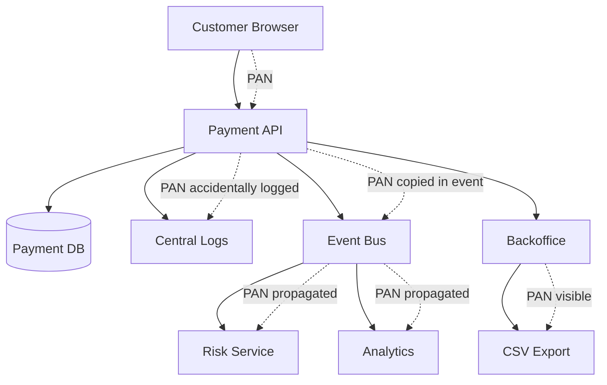

Satu field PAN yang bocor ke event, log, analytics, atau customer support export dapat memperluas scope secara brutal. Engineer yang baik tidak hanya menulis masking function. Engineer yang matang mendesain sistem agar field itu **tidak pernah masuk** ke komponen yang tidak perlu.

---

## 2. Vocabulary yang Harus Presisi

Sebelum desain, vocabulary harus disepakati.

| Term | Makna Praktis dalam Arsitektur |
|---|---|
| CHD | Cardholder Data. Umumnya termasuk PAN dan elemen terkait seperti cardholder name, expiration date, service code ketika disimpan bersama PAN. |
| SAD | Sensitive Authentication Data. Misalnya full track data, CAV2/CVC2/CVV2/CID, PIN/PIN block. Umumnya tidak boleh disimpan setelah authorization. |
| PAN | Primary Account Number. Field paling sensitif dan pusat dari cardholder data. |
| CDE | Cardholder Data Environment. Sistem, orang, proses, dan network yang menyimpan, memproses, atau mentransmisikan CHD/SAD. |
| Scope | Semua komponen yang berada di CDE atau dapat memengaruhi keamanan CDE. |
| Segmentation | Kontrol teknis dan operasional untuk memisahkan CDE dari non-CDE. |
| Tokenization | Mengganti PAN dengan token yang tidak bernilai di luar tokenization system. |
| Vault | Sistem yang menyimpan mapping token ke PAN atau credential sensitif. |
| SAQ/ROC | Bentuk validasi PCI tergantung model bisnis, volume, dan kontrak; bukan desain engineering itu sendiri. |

Mental model sederhana:

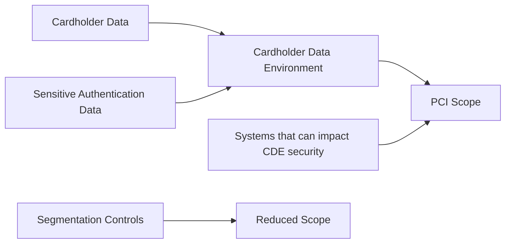

Scope bukan hanya “di mana PAN disimpan”. Scope juga mencakup sistem yang dapat mengubah, mengakses, deploy, observe, configure, atau mengendalikan path yang memproses PAN.

---

## 3. Arsitektur Target: Keep PAN Out of Your Core

Payment platform enterprise sebaiknya mendesain agar core payment system tidak pernah menerima raw PAN jika tidak benar-benar perlu. Ada beberapa model.

### 3.1 Hosted Payment Page Model

Customer memasukkan kartu pada halaman provider/PSP. Platform hanya menerima token/payment method reference.

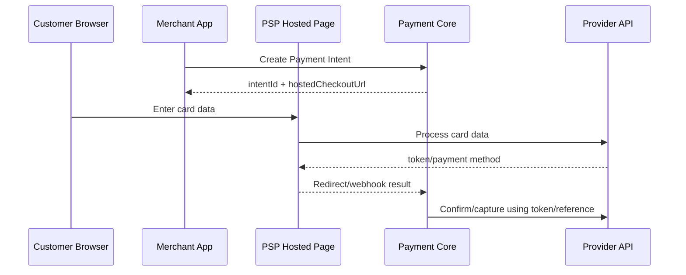

Kelebihan:

- scope platform lebih kecil.
- tidak perlu membangun vault sendiri.
- CVC/PAN tidak melewati API core.
- lebih cepat masuk production.

Trade-off:

- checkout UX lebih tergantung provider.
- multi-provider orchestration lebih sulit jika token tidak portable.
- migration provider bisa lebih rumit.

### 3.2 Hosted Fields / Elements Model

Merchant page tetap milik platform/merchant, tetapi input card dikirim langsung dari browser ke provider melalui iframe atau SDK.

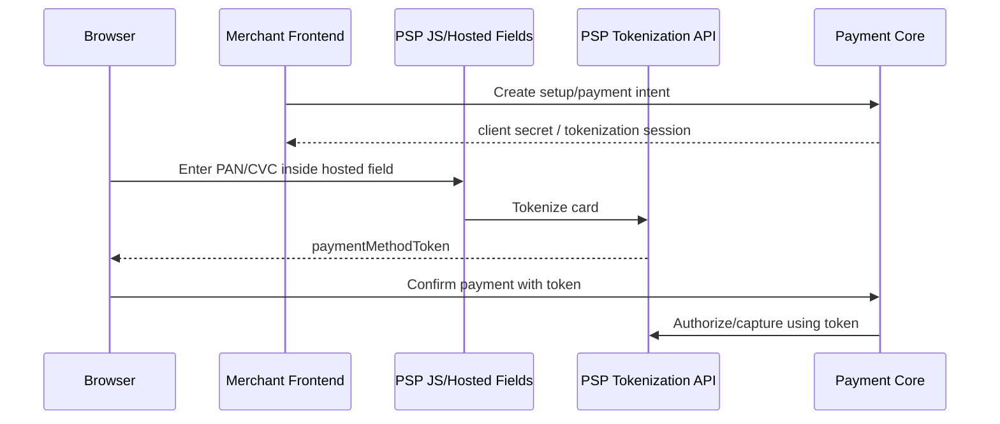

Kelebihan:

- UX lebih fleksibel.
- core tetap tidak menerima PAN.
- cocok untuk orchestration bila provider token dipakai per provider.

Trade-off:

- frontend security lebih penting.
- CSP, script governance, iframe integrity, dan dependency control menjadi kritikal.
- token portability tetap menjadi isu.

### 3.3 Direct PAN API Model

Platform menerima raw PAN/CVC lewat API sendiri, lalu tokenisasi atau kirim ke processor.

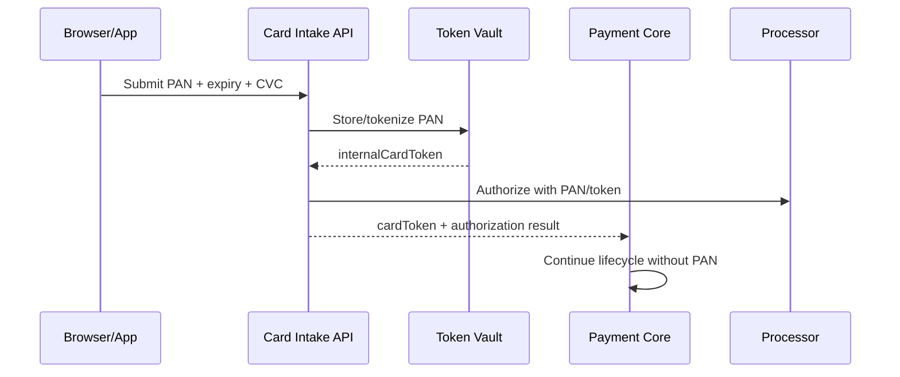

Ini model paling powerful dan paling mahal secara security/compliance. Jangan pilih ini hanya karena “ingin full control.” Pilih hanya jika ada alasan nyata: acquiring/processing langsung, network tokenization, card lifecycle management, advanced routing yang butuh credential portability, atau requirement bisnis yang tidak bisa dipenuhi PSP-hosted flow.

---

## 4. Scope Boundary yang Sehat

Desain target:

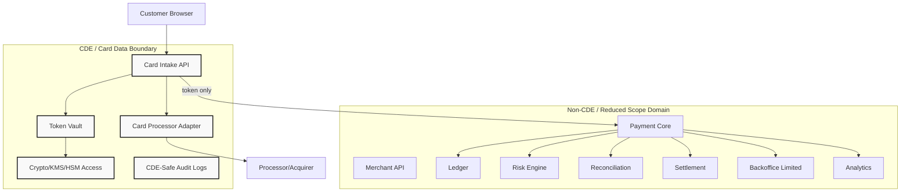

Core rule:

> Raw PAN/SAD boleh masuk hanya ke CDE services. Semua service lain hanya melihat token, brand, last4, expiry month/year jika benar-benar diperlukan, BIN metadata yang aman, dan references.

---

## 5. Data Classification untuk Payment Platform

Setiap field harus punya klasifikasi.

| Classification | Contoh | Storage Policy | Log Policy | Access Policy |
|---|---|---|---|---|
| SAD | CVC, PIN block, full track data | Jangan simpan setelah authorization | Never log | Sangat dibatasi; biasanya transient only |
| CHD-PAN | PAN | Hanya vault/CDE jika unavoidable | Never log full PAN | Break-glass sangat terbatas |
| CHD-Derived/Display | last4, brand, expiry | Boleh di core dengan justifikasi | boleh masked | least privilege |
| Token | `card_tok_xxx`, PSP payment method id | Boleh di core | boleh, tapi tidak sembarang export | service/user scoped |
| Payment Reference | paymentId, authorizationId, providerRef | Boleh | boleh | normal operational access |
| Risk Signal | IP, device fingerprint, email, velocity | Boleh sesuai privacy policy | controlled | risk/support scoped |
| Ledger Data | journal, account, amount | Boleh | boleh dengan PII minimization | finance/ops scoped |

Java type system harus ikut membantu:

```java
public sealed interface SensitiveValue permits Pan, Cvc, TrackData {}

public record Pan(String value) implements SensitiveValue {
    public Pan {
        if (value == null || !value.matches("\\d{12,19}")) {
            throw new IllegalArgumentException("Invalid PAN shape");
        }
    }

    @Override
    public String toString() {
        return "Pan(****)";
    }
}

public record Cvc(String value) implements SensitiveValue {
    public Cvc {
        if (value == null || !value.matches("\\d{3,4}")) {
            throw new IllegalArgumentException("Invalid CVC shape");
        }
    }

    @Override
    public String toString() {
        return "Cvc(****)";
    }
}

public record CardToken(String value) {
    public CardToken {
        if (value == null || !value.startsWith("card_tok_")) {
            throw new IllegalArgumentException("Invalid card token");
        }
    }
}
```

Jangan mengandalkan developer untuk selalu ingat tidak melakukan log. Buat unsafe value object yang tidak bisa tercetak polos secara tidak sengaja.

---

## 6. Token Vault Architecture

Token vault adalah boundary paling penting jika platform menyimpan card credential sendiri.

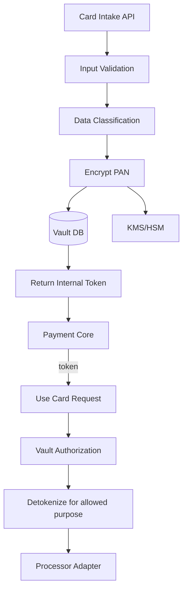

Vault harus menjawab pertanyaan ini:

1. Siapa boleh membuat token?
2. Siapa boleh memakai token?
3. Untuk purpose apa token boleh dipakai?
4. Apakah token merchant-scoped, customer-scoped, platform-scoped, atau network-scoped?
5. Apakah token bisa dipakai untuk MIT/off-session?
6. Apakah token bisa diekspor atau dimigrasikan?
7. Apakah detokenization pernah mengembalikan PAN ke caller?
8. Apakah CVC pernah disimpan? Jawaban production yang sehat: tidak.
9. Bagaimana token dinonaktifkan?
10. Bagaimana evidence akses vault disimpan?

### 6.1 Vault Schema Sketch

```sql
CREATE TABLE card_token (
    token_id            UUID PRIMARY KEY,
    token_value         TEXT NOT NULL UNIQUE,
    token_scope         TEXT NOT NULL CHECK (token_scope IN ('CUSTOMER', 'MERCHANT', 'PLATFORM')),
    merchant_id         UUID,
    customer_id         UUID,
    card_fingerprint    TEXT NOT NULL,
    brand               TEXT NOT NULL,
    bin6_hash           TEXT,
    last4               TEXT NOT NULL,
    expiry_month        SMALLINT NOT NULL CHECK (expiry_month BETWEEN 1 AND 12),
    expiry_year         SMALLINT NOT NULL,
    status              TEXT NOT NULL CHECK (status IN ('ACTIVE', 'SUSPENDED', 'EXPIRED', 'DELETED')),
    created_at          TIMESTAMPTZ NOT NULL DEFAULT now(),
    updated_at          TIMESTAMPTZ NOT NULL DEFAULT now()
);

CREATE TABLE card_secret_material (
    token_id            UUID PRIMARY KEY REFERENCES card_token(token_id),
    encrypted_pan       BYTEA NOT NULL,
    encryption_key_ref  TEXT NOT NULL,
    encryption_context  JSONB NOT NULL,
    pan_hash_blind      TEXT NOT NULL,
    created_at          TIMESTAMPTZ NOT NULL DEFAULT now(),
    rotated_at          TIMESTAMPTZ
);

CREATE TABLE vault_access_log (
    access_id           UUID PRIMARY KEY,
    token_id            UUID NOT NULL,
    actor_type          TEXT NOT NULL,
    actor_id            TEXT NOT NULL,
    purpose             TEXT NOT NULL,
    decision            TEXT NOT NULL CHECK (decision IN ('ALLOW', 'DENY')),
    request_id          TEXT NOT NULL,
    reason_code         TEXT NOT NULL,
    created_at          TIMESTAMPTZ NOT NULL DEFAULT now()
);
```

Perhatikan: CVC tidak ada di schema. Kalau butuh CVC untuk initial authorization, gunakan transient processing dan pastikan tidak persisted, tidak masuk log, tidak masuk queue.

---

## 7. Data Flow: Direct PAN Intake yang Aman

Contoh flow direct PAN intake yang lebih sehat:

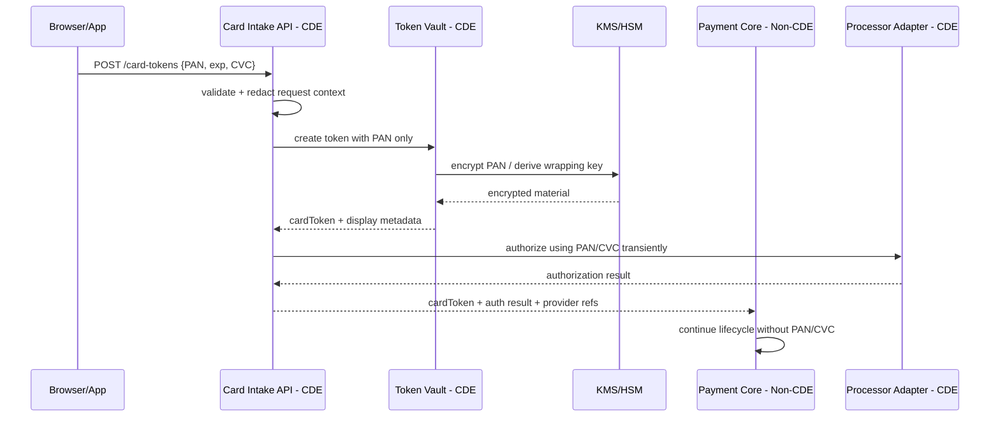

Important boundary:

- `Edge` boleh menerima PAN/CVC.
- `Vault` boleh menyimpan encrypted PAN.
- `Processor Adapter` boleh memakai PAN untuk authorize bila direct processing.
- `Payment Core`, `Ledger`, `Risk`, `Settlement`, `Backoffice`, `Analytics` tidak boleh menerima PAN/CVC.

---

## 8. Segmentation bukan Sekadar Network Diagram

Segmentation harus dibuktikan secara teknis dan operasional.

| Layer | Control |
|---|---|
| Network | private subnet, firewall/security group, deny-by-default, egress allowlist |
| Identity | separate service accounts, short-lived credentials, least privilege |
| Secrets | separate secret store path, CDE-only access |
| Runtime | dedicated namespace/node pool/security policy |
| Data | separate database/schema/table encryption boundary |
| CI/CD | restricted deployment pipeline, approval, artifact signing |
| Observability | CDE-safe logs, separate sink, strict redaction |
| Admin | bastion/zero trust access, MFA, session recording where appropriate |
| Change | stricter review for CDE code/config |

A poor segmentation model:

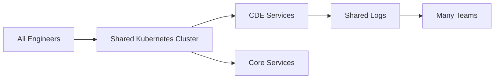

A better model:

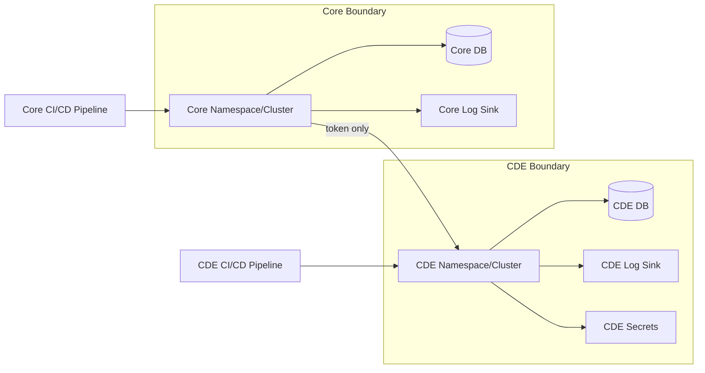

Segmentation gagal kalau shared admin credentials, shared logs, shared database users, shared shell access, atau shared CI/CD runners membuat non-CDE system bisa memengaruhi CDE.

---

## 9. Logging Rules: Payment Logs Harus Bernilai, Tapi Tidak Berbahaya

Payment system butuh log yang kaya untuk debugging unknown state, dispute, reconciliation, dan incident. Tetapi CDE log yang salah dapat menjadi breach amplifier.

### 9.1 Never Log Fields

Never log:

- PAN full.
- CVC/CVV/CID.
- track data.
- PIN/PIN block.
- raw provider request yang berisi card details.
- unredacted browser payload.
- decrypted secrets.
- authorization headers.
- cryptographic key material.

### 9.2 Safe Payment Log Shape

```json
{
  "event": "card_authorization_submitted",
  "payment_id": "pay_123",
  "attempt_id": "pa_456",
  "merchant_id": "m_789",
  "provider": "processor_a",
  "card": {
    "brand": "VISA",
    "last4": "4242",
    "expiry_year": 2030,
    "token_id": "card_tok_abc"
  },
  "amount": {
    "currency": "USD",
    "minor": 10000
  },
  "idempotency_key_hash": "sha256:...",
  "request_id": "req_...",
  "trace_id": "trace_..."
}
```

### 9.3 Java Redaction Guard

```java
public final class PaymentLogSanitizer {
    private static final Pattern PAN_LIKE = Pattern.compile("\\b(?:\\d[ -]*?){13,19}\\b");
    private static final Set<String> BLOCKED_KEYS = Set.of(
        "pan", "cardNumber", "number", "cvc", "cvv", "cid",
        "track1", "track2", "pin", "pinBlock"
    );

    public Map<String, Object> sanitize(Map<String, Object> input) {
        Map<String, Object> out = new LinkedHashMap<>();
        for (var entry : input.entrySet()) {
            String key = entry.getKey();
            Object value = entry.getValue();

            if (BLOCKED_KEYS.contains(key)) {
                out.put(key, "[REDACTED]");
            } else if (value instanceof String s && PAN_LIKE.matcher(s).find()) {
                out.put(key, PAN_LIKE.matcher(s).replaceAll("[REDACTED_PAN_LIKE]"));
            } else if (value instanceof Map<?, ?> nested) {
                out.put(key, sanitize((Map<String, Object>) nested));
            } else {
                out.put(key, value);
            }
        }
        return out;
    }
}
```

Regex redaction bukan satu-satunya kontrol. Ia guardrail terakhir. Kontrol utama tetap: jangan masukkan PAN ke log payload.

---

## 10. Event Bus Boundary

Payment event bus sering menjadi jalur bocor terbesar.

Anti-pattern:

```json
{
  "eventType": "PaymentCreated",
  "payload": {
    "paymentId": "pay_123",
    "cardNumber": "4111111111111111",
    "cvc": "123",
    "amount": 10000
  }
}
```

Correct pattern:

```json
{
  "eventType": "PaymentAttemptAuthorized",
  "eventVersion": 3,
  "aggregateId": "pa_456",
  "payload": {
    "paymentId": "pay_123",
    "attemptId": "pa_456",
    "merchantId": "m_789",
    "amountMinor": 10000,
    "currency": "USD",
    "paymentMethod": {
      "type": "CARD",
      "token": "card_tok_abc",
      "brand": "VISA",
      "last4": "4242"
    },
    "authorization": {
      "status": "AUTHORIZED",
      "provider": "processor_a",
      "providerAuthorizationRef": "auth_abc"
    }
  }
}
```

Event schema review harus punya “sensitive field gate”. Jangan izinkan generic JSON payload dari CDE masuk ke event bus publik.

---

## 11. Backoffice Boundary

Backoffice adalah titik rawan karena manusia diberi kemampuan melihat dan mengubah data.

Backoffice yang sehat:

- tidak menampilkan full PAN.
- tidak menampilkan CVC, ever.
- memakai role-based dan purpose-based access.
- semua operator action tercatat immutable.
- high-risk action butuh maker-checker.
- export dibatasi.
- search tidak menerima PAN full kecuali sangat dikontrol dan di-tokenize.
- break-glass punya expiry, approval, dan audit.

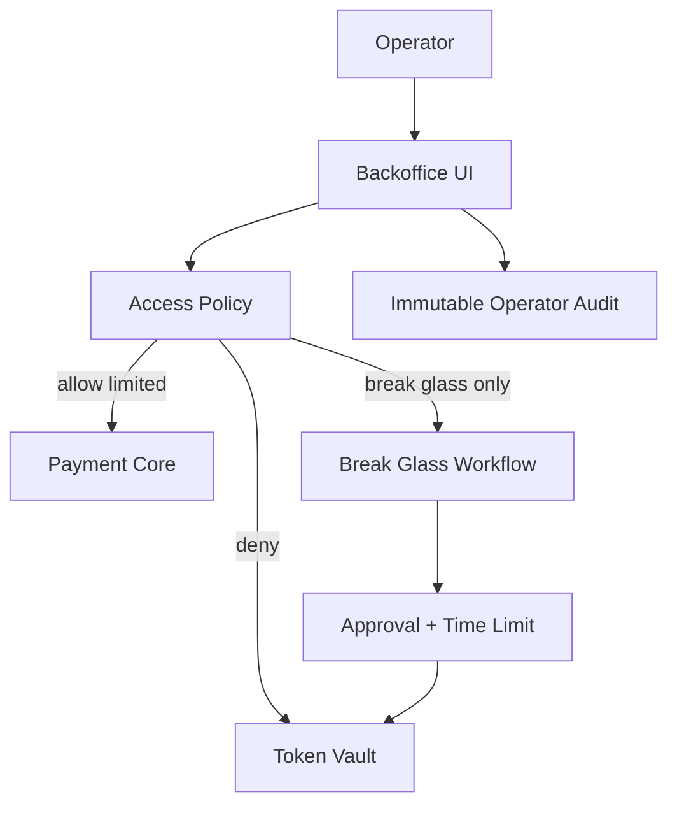

Backoffice bukan admin database dengan UI. Backoffice adalah controlled command surface.

---

## 12. Database Design: Jangan Campur CDE dan Non-CDE

Bad:

```sql
CREATE TABLE payment_method (
    id UUID PRIMARY KEY,
    merchant_id UUID NOT NULL,
    customer_id UUID NOT NULL,
    card_number TEXT,
    cvc TEXT,
    expiry_month INT,
    expiry_year INT,
    provider_token TEXT
);
```

Better:

```sql
-- Non-CDE core DB
CREATE TABLE payment_method_ref (
    payment_method_id UUID PRIMARY KEY,
    merchant_id UUID NOT NULL,
    customer_id UUID,
    type TEXT NOT NULL CHECK (type IN ('CARD', 'BANK_ACCOUNT', 'WALLET')),
    card_token TEXT,
    card_brand TEXT,
    card_last4 TEXT,
    card_expiry_month SMALLINT,
    card_expiry_year SMALLINT,
    status TEXT NOT NULL,
    created_at TIMESTAMPTZ NOT NULL DEFAULT now()
);

-- CDE vault DB
CREATE TABLE vault_card_secret (
    token_value TEXT PRIMARY KEY,
    encrypted_pan BYTEA NOT NULL,
    encryption_key_ref TEXT NOT NULL,
    created_at TIMESTAMPTZ NOT NULL DEFAULT now()
);
```

Gunakan separate database, separate schema, separate user, separate backup policy, dan separate retention policy bila memungkinkan.

---

## 13. API Surface: Pisahkan Card Intake dari Payment Core

Jangan buat endpoint seperti ini di core:

```http
POST /payments
{
  "amount": 10000,
  "currency": "USD",
  "cardNumber": "4111111111111111",
  "cvc": "123"
}
```

Lebih baik:

```http
POST /card-tokens
{
  "number": "4111111111111111",
  "expiryMonth": 12,
  "expiryYear": 2030,
  "cvc": "123"
}
```

Response:

```json
{
  "cardToken": "card_tok_abc",
  "brand": "VISA",
  "last4": "1111",
  "expiryMonth": 12,
  "expiryYear": 2030
}
```

Lalu core:

```http
POST /payment-intents/{id}/confirm
{
  "paymentMethod": {
    "type": "CARD",
    "cardToken": "card_tok_abc"
  }
}
```

Dengan begitu, raw card data hanya hidup pada endpoint card intake.

---

## 14. CI/CD dan Change Control untuk CDE

PCI architecture tidak lengkap tanpa release path.

CDE deployment harus punya:

- repository ownership jelas.
- branch protection.
- code review wajib.
- dependency scanning.
- secret scanning.
- SAST/DAST sesuai risk.
- artifact signing atau provenance.
- approval untuk production deployment.
- audit trail perubahan config.
- rollback plan.
- environment parity.
- restricted production access.

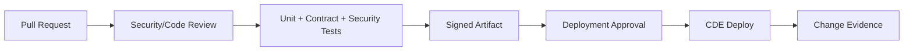

Tujuannya bukan birokrasi. Tujuannya menjawab: “siapa mengubah sistem yang dapat memproses PAN, kapan, apa yang berubah, apa buktinya, dan bagaimana kita tahu perubahan itu aman?”

---

## 15. Access Control Model

Akses ke CDE harus dijaga pada beberapa level.

| Access Type | Example | Control |
|---|---|---|
| Human UI | support membuka payment detail | role + purpose + audit |
| Human Shell | engineer debug production | exceptional, time-bound, approved |
| Service-to-Service | core memakai card token | mTLS/service identity + policy |
| DB Access | vault DB query | no direct human access by default |
| Secret Access | KMS key usage | key policy + service identity |
| Export Access | report generation | no CHD export except controlled process |

Java service authorization sketch:

```java
public record VaultUseRequest(
    CardToken token,
    String callerService,
    String purpose,
    String paymentAttemptId,
    String merchantId
) {}

public enum VaultDecision { ALLOW, DENY }

public interface VaultPolicy {
    VaultDecision decide(VaultUseRequest request);
}

public final class PurposeBasedVaultPolicy implements VaultPolicy {
    private static final Set<String> ALLOWED_PURPOSES = Set.of(
        "AUTHORIZE_CARD_PAYMENT",
        "NETWORK_TOKEN_REFRESH",
        "CARD_ACCOUNT_UPDATER"
    );

    @Override
    public VaultDecision decide(VaultUseRequest request) {
        if (!ALLOWED_PURPOSES.contains(request.purpose())) return VaultDecision.DENY;
        if (!Set.of("card-processor-adapter", "token-vault-worker").contains(request.callerService())) {
            return VaultDecision.DENY;
        }
        return VaultDecision.ALLOW;
    }
}
```

---

## 16. Evidence Design

Compliance tanpa evidence adalah opini.

Evidence yang perlu dihasilkan sistem:

- data flow diagram.
- network segmentation diagram.
- service inventory.
- CHD/SAD data inventory.
- access review records.
- vulnerability scan results.
- change records.
- deployment records.
- log redaction test results.
- key rotation records.
- incident response drill records.
- backup/restore test records.
- penetration test report.
- segmentation test evidence.

Buat evidence sebagian besar otomatis.

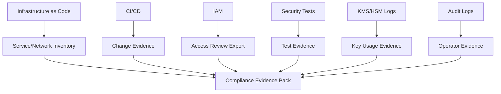

Manual screenshot-driven compliance tidak skala untuk enterprise platform.

---

## 17. Threat Model

PCI architecture harus diuji terhadap threat, bukan hanya checklist.

| Threat | Failure Mode | Control |
|---|---|---|
| PAN logged | raw request dumped during exception | structured logging, redaction, no raw payload logs |
| PAN in event bus | generic event payload copies request | schema allowlist, sensitive field linter |
| CDE lateral movement | compromised non-CDE service reaches vault | network deny, service identity, mTLS, policy |
| Operator abuse | support exports sensitive card data | no full PAN display, export control, audit |
| Secret leakage | processor API key exposed | secret manager, rotation, least privilege |
| Token misuse | stolen token used across merchants | token scope, purpose restriction, merchant binding |
| Unsafe debug | engineer runs DB query | no direct DB access, break-glass, session audit |
| Backup leak | CDE DB backup copied to non-CDE | encrypted backups, restricted restore, inventory |
| Test data leak | real PAN used in staging | synthetic test data, environment controls |
| Dependency compromise | malicious lib in CDE service | dependency scanning, lockfiles, review |

---

## 18. CDE Runtime Hardening Checklist

For CDE services:

- run minimal container images.
- do not write local files containing card data.
- disable request body logging.
- reject debug endpoints in production.
- expose only required ports.
- use mTLS or strong service identity.
- restrict outbound egress to processor/KMS/log sink.
- use short-lived credentials.
- maintain patch cadence.
- set resource limits.
- separate runtime identity per service.
- ship only sanitized logs.
- alert on redaction hits and suspicious payloads.

Kubernetes example intent:

```yaml
apiVersion: networking.k8s.io/v1
kind: NetworkPolicy
metadata:
  name: card-intake-egress
  namespace: cde
spec:
  podSelector:
    matchLabels:
      app: card-intake-api
  policyTypes:
    - Egress
  egress:
    - to:
        - namespaceSelector:
            matchLabels:
              name: cde
          podSelector:
            matchLabels:
              app: token-vault
    - to:
        - namespaceSelector:
            matchLabels:
              name: security
          podSelector:
            matchLabels:
              app: kms-proxy
```

Ini hanya ilustrasi. Production policy harus sesuai platform/network model organisasi.

---

## 19. Validation Test: Prove Card Data Does Not Escape

Buat automated tests untuk membuktikan field sensitif tidak bocor.

### 19.1 Contract Test for Events

```java
@Test
void paymentEventsMustNotContainCardholderData() {
    String eventJson = publishPaymentAuthorizedFixture();

    assertThat(eventJson).doesNotContain("4111111111111111");
    assertThat(eventJson).doesNotContain("123");
    assertThat(eventJson).doesNotContain("cardNumber");
    assertThat(eventJson).doesNotContain("cvc");
}
```

### 19.2 Log Sanitization Test

```java
@Test
void logsMustRedactPanLikeValues() {
    var sanitizer = new PaymentLogSanitizer();
    var sanitized = sanitizer.sanitize(Map.of(
        "paymentId", "pay_123",
        "cardNumber", "4111111111111111",
        "message", "failed for PAN 4111 1111 1111 1111"
    ));

    assertThat(sanitized.toString()).doesNotContain("4111111111111111");
    assertThat(sanitized.toString()).doesNotContain("4111 1111 1111 1111");
}
```

### 19.3 Schema Linter

```java
@Test
void openApiSchemasMustNotExposePanOutsideCardIntakeApi() {
    var violations = openApiSpec.findSchemasOutside("/card-tokens", schema ->
        schema.hasPropertyNamed("pan") ||
        schema.hasPropertyNamed("cardNumber") ||
        schema.hasPropertyNamed("cvc")
    );

    assertThat(violations).isEmpty();
}
```

---

## 20. PCI Architecture Review Questions

Sebelum production, jawab pertanyaan ini secara tertulis:

1. Di endpoint mana PAN bisa masuk?
2. Di service mana PAN bisa hidup dalam memory?
3. Di database mana PAN disimpan?
4. Apakah CVC pernah persisted?
5. Apakah raw provider request/response disimpan?
6. Apakah log pipeline sudah terbukti tidak menerima PAN/CVC?
7. Apakah event bus punya sensitive field gate?
8. Apakah support bisa melihat full PAN?
9. Apakah engineer bisa query vault DB langsung?
10. Apakah non-CDE service bisa call vault?
11. Apakah backup CDE terpisah dan encrypted?
12. Apakah staging pernah memakai real card data?
13. Apakah deployment CDE butuh approval dan evidence?
14. Apakah segmentation test dilakukan?
15. Apakah key rotation punya prosedur dan evidence?
16. Apakah incident response untuk card data exposure sudah dilatih?

Kalau jawaban “tidak tahu”, itu bukan detail kecil. Itu architecture gap.

---

## 21. Anti-Patterns

### 21.1 “We Mask PAN, So We Are Safe”

Masking membantu display/logging, tetapi tidak menghapus scope jika sistem tetap menerima, memproses, atau menyimpan PAN.

### 21.2 Generic Metadata JSON

Kolom seperti `metadata JSONB` sering menjadi tempat field sensitif bocor.

```sql
-- dangerous if unrestricted
metadata JSONB NOT NULL DEFAULT '{}'
```

Solusi: validasi schema, denylist/allowlist, dan sensitive field scanner.

### 21.3 Sharing Production Dump ke Staging

Staging tidak boleh menerima real CHD. Tokenized dump pun harus dianalisis apakah token dapat dipakai kembali atau memengaruhi CDE.

### 21.4 Full PAN Search di Backoffice

Support sering meminta search by card number. Alternatif lebih aman:

- search by last4 + date + merchant + amount.
- search by token.
- search by provider reference.
- search by blinded hash only di CDE-controlled flow.

### 21.5 Raw Provider Payload Archive

Raw payload archive berguna untuk debugging, tetapi bisa membawa CHD/SAD. Simpan raw hanya jika sudah diklasifikasi, dienkripsi, dibatasi, dan ada retention policy. Untuk banyak platform, lebih baik simpan normalized safe payload plus provider reference.

---

## 22. Minimal Production Design Recommendation

Untuk mayoritas enterprise merchant/payment platform yang tidak menjadi card processor langsung:

1. Gunakan hosted page atau hosted fields.
2. Jangan terima raw PAN di Payment Core.
3. Simpan PSP token/internal token saja.
4. Pisahkan card intake/tokenization kalau perlu.
5. Jangan simpan CVC.
6. Jangan publish raw payload ke event bus.
7. Pisahkan CDE logs.
8. Gunakan strict data classification.
9. Buat automated tests untuk sensitive field leakage.
10. Desain backoffice dengan purpose-based access.

Jika bisnis benar-benar butuh direct PAN processing, siapkan CDE sebagai platform terpisah dengan lifecycle, staffing, evidence, incident response, dan compliance cost yang realistis.

---

## 23. Implementation Roadmap

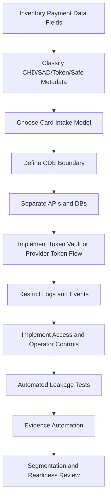

Jangan mulai dari checklist. Mulai dari data flow. Checklist hanya memvalidasi bahwa data flow dan control plane sudah benar.

---

## 24. What Good Looks Like

Payment platform yang sehat punya ciri berikut:

- Payment Core tidak tahu full PAN.
- Ledger tidak pernah menerima CHD/SAD.
- Risk menerima tokenized/safe signals, bukan raw card data.
- Event bus tidak pernah membawa raw card fields.
- Backoffice tidak bisa menampilkan atau mengekspor full PAN.
- Vault access selalu punya purpose, actor, request id, dan audit trail.
- CDE service punya separate runtime, network, secrets, DB, logs, dan deployment control.
- Evidence bisa dihasilkan dari sistem, bukan dikumpulkan manual setiap audit.
- Engineer dapat menjelaskan data flow PAN dari browser sampai processor tanpa menebak.

---

## 25. Latihan Desain

Desain payment platform untuk marketplace dengan requirement:

- merchant dapat menerima kartu.
- customer dapat menyimpan kartu untuk repeat purchase.
- platform ingin multi-provider routing.
- support perlu melihat brand, last4, expiry, provider reference.
- finance perlu settlement report.
- risk perlu BIN country, issuer country, last4, fingerprint, customer velocity.
- tidak ada kebutuhan menampilkan full PAN.

Pertanyaan:

1. Model card intake apa yang kamu pilih?
2. Apakah kamu membangun vault sendiri atau memakai PSP token?
3. Service mana yang masuk CDE?
4. Event apa yang dipublish ke non-CDE bus?
5. Bagaimana risk mendapat signal tanpa PAN?
6. Bagaimana support search payment tanpa full PAN?
7. Bagaimana migration provider dilakukan jika token tidak portable?
8. Evidence apa yang otomatis dikumpulkan?

Jawaban bagus biasanya memilih hosted fields atau provider tokenization untuk versi awal, lalu membangun token abstraction internal agar future provider migration tidak merusak Payment Core.

---

## 26. Referensi Resmi

- PCI Security Standards Council — PCI DSS standard overview: https://www.pcisecuritystandards.org/standards/pci-dss/
- PCI Security Standards Council — PCI DSS v4.0.1 announcement: https://blog.pcisecuritystandards.org/just-published-pci-dss-v4-0-1
- PCI Security Standards Council — PCI DSS v4.x future-dated requirements: https://blog.pcisecuritystandards.org/now-is-the-time-for-organizations-to-adopt-the-future-dated-requirements-of-pci-dss-v4-x
- PCI Security Standards Council — Glossary: https://www.pcisecuritystandards.org/glossary/
- PCI Security Standards Council — Document Library: https://www.pcisecuritystandards.org/document_library/
- PCI Security Standards Council — Tokenization product security guidance announcement: https://www.pcisecuritystandards.org/about_us/press_releases/pci-council-publishes-tokenization-product-security-guidelines/
