------
title: Build From Scratch: Large Production Grade Java Payment Systems - Part 046
description: Mendesain cryptography, key management, envelope encryption, signing, rotation, KMS, dan HSM untuk payment platform Java yang aman, auditable, dan operasional.
series: learn-java-payment-systems
seriesTitle: Build From Scratch: Large Production Grade Java Payment Systems
order: 46
partTitle: Cryptography, Key Management, and HSM
tags:
- java
- payments
- payment-systems
- cryptography
- key-management
- hsm
- kms
- encryption
- signing
- security-architecture
date: 2026-07-02
---

# Part 046 — Cryptography, Key Management, and HSM

Payment system memakai cryptography di banyak tempat: encrypt PAN, sign webhook, verify provider callback, protect API credentials, secure settlement file, tokenize identifiers, generate nonces, hash PII untuk matching, protect secrets, dan audit high-risk action.

Tetapi production cryptography jarang gagal karena algoritmanya tidak cukup keren. Ia gagal karena key disimpan sembarangan, rotasi tidak pernah diuji, signing canonicalization ambigu, log membocorkan secret, engineer bisa copy key dari environment variable, atau sistem tidak tahu versi key mana yang dipakai untuk data lama.

Part ini membahas **cryptography architecture** untuk Java payment platform: key lifecycle, envelope encryption, KMS/HSM boundary, key rotation, signing, hashing, tokenization support, audit evidence, dan failure model.

> Core idea: **cryptography is not a utility class. It is a controlled subsystem.**

---

## 1. Cryptography Use Cases dalam Payment Platform

Payment platform biasanya memiliki use case berikut.

| Use Case | Primitive | Example |
|---|---|---|
| PAN storage | authenticated encryption / envelope encryption | encrypt PAN in token vault |
| Webhook verification | HMAC or asymmetric signature | verify provider callback |
| Outbound API signing | HMAC/RSA/ECDSA depending provider | SNAP/API signature, bank API signing |
| File encryption | PGP/envelope encryption | settlement file to bank/merchant |
| Secret storage | KMS-backed encryption | provider API key, webhook secret |
| Token generation | CSPRNG + uniqueness | card token, payment token |
| PII matching | keyed hash/HMAC | blinded PAN hash, email/device hash |
| Request integrity | signature + timestamp + nonce | prevent tampering/replay |
| Operator action integrity | audit signing/hash chain | tamper-evident audit log |
| mTLS | certificates/private keys | service-to-service/bank connection |

Satu payment platform bisa punya puluhan key types. Kalau semua disebut `SECRET_KEY`, sistem akan rapuh.

---

## 2. Key Management Mental Model

Cryptographic key punya lifecycle.

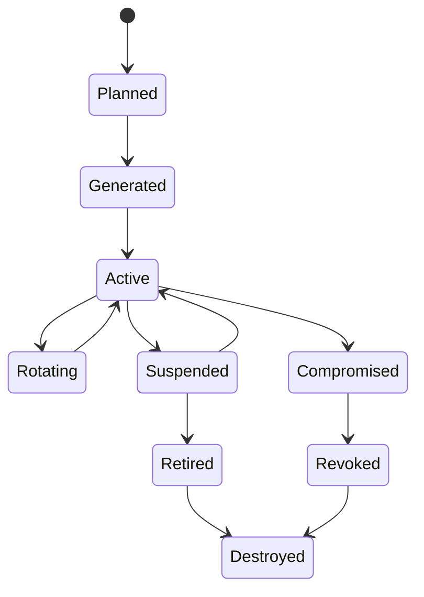

Setiap key harus bisa menjawab:

1. Key ini dipakai untuk apa?
2. Siapa boleh memakai key ini?
3. Di environment mana key ini valid?
4. Apakah key bisa exportable?
5. Bagaimana key dibuat?
6. Bagaimana key diputar?
7. Data lama dibuka dengan key mana?
8. Bagaimana revoke jika bocor?
9. Log apa yang membuktikan key dipakai oleh siapa?
10. Kapan key dihancurkan?

NIST SP 800-57 Part 1 Rev. 5 memberi guidance umum dan best practice untuk manajemen cryptographic keying material. Untuk payment platform, dokumen seperti ini bukan sekadar referensi compliance; ia membantu engineer memikirkan lifecycle, cryptoperiod, usage, dan separation of duties.

---

## 3. Jangan Menulis Crypto Sendiri

Anti-pattern klasik:

```java
public String encrypt(String plaintext) {
    Cipher cipher = Cipher.getInstance("AES");
    cipher.init(Cipher.ENCRYPT_MODE, new SecretKeySpec(secret.getBytes(), "AES"));
    return Base64.getEncoder().encodeToString(cipher.doFinal(plaintext.getBytes()));
}
```

Masalah:

- mode default bisa tidak aman.
- tidak ada IV/nonce yang benar.
- tidak ada authentication tag.
- key dari string environment variable.
- tidak ada key version.
- tidak ada encryption context.
- tidak ada audit penggunaan key.
- tidak ada rotation strategy.

Gunakan primitive modern yang jelas: AEAD seperti AES-GCM atau ChaCha20-Poly1305 bila sesuai platform, atau library/KMS SDK yang benar. Untuk payment-grade architecture, encryption operation idealnya dibungkus oleh KMS/HSM boundary, bukan utility random di setiap service.

---

## 4. Envelope Encryption

Envelope encryption memisahkan data encryption key dari key encryption key.

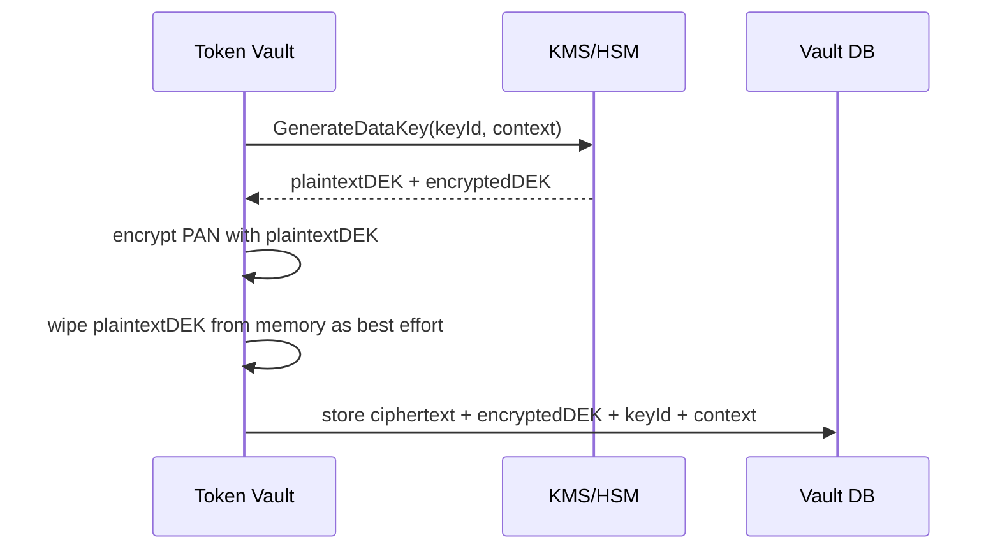

Decrypt:

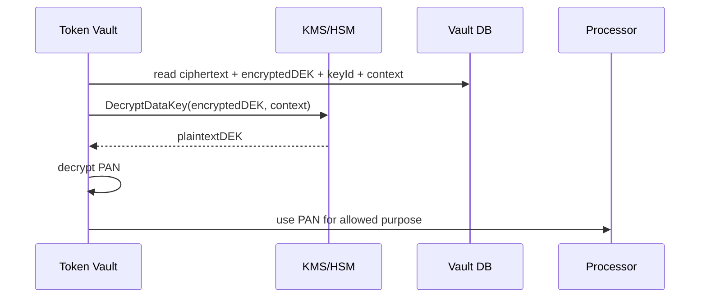

Kelebihan:

- master key tidak keluar dari KMS/HSM.
- data key bisa unique per record/batch.
- rotation master key lebih mudah.
- access log KMS memberi evidence.
- encryption context mengikat ciphertext ke purpose/merchant/token.

---

## 5. Encryption Context

Encryption context adalah metadata authenticated yang harus cocok saat decrypt. Ia tidak rahasia, tetapi melindungi dari ciphertext swapping.

Contoh context:

```json
{
  "purpose": "CARD_PAN_STORAGE",
  "environment": "production",
  "merchant_id": "m_123",
  "token_id": "card_tok_abc",
  "schema_version": "v3"
}
```

Jika ciphertext milik `merchant_A` dipindahkan ke token milik `merchant_B`, decrypt harus gagal karena context tidak cocok.

Java value object:

```java
public record EncryptionContext(
    String purpose,
    String environment,
    String merchantId,
    String tokenId,
    int schemaVersion
) {
    public Map<String, String> asMap() {
        return Map.of(
            "purpose", purpose,
            "environment", environment,
            "merchant_id", merchantId,
            "token_id", tokenId,
            "schema_version", Integer.toString(schemaVersion)
        );
    }
}
```

---

## 6. Key Hierarchy

Payment platform butuh key hierarchy yang eksplisit.

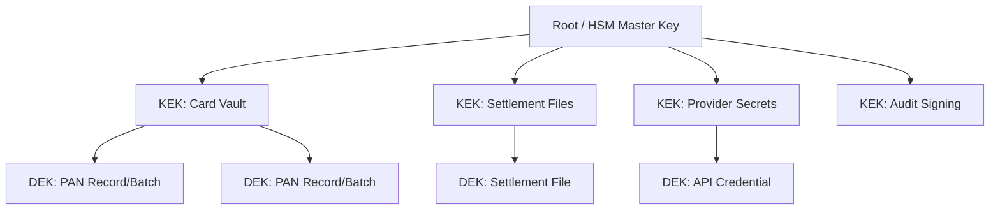

Rule sehat:

- Jangan pakai satu key untuk semua purpose.
- Jangan pakai key production di staging.
- Jangan pakai encryption key untuk signing.
- Jangan pakai signing key untuk hashing.
- Jangan pakai provider webhook secret untuk internal token generation.
- Jangan menyimpan plaintext key di database.

---

## 7. Key Inventory Schema

Payment platform butuh metadata key sendiri walaupun memakai cloud KMS/HSM. Metadata ini bukan key material, tetapi control registry.

```sql
CREATE TABLE crypto_key_registry (
    key_ref             TEXT PRIMARY KEY,
    provider            TEXT NOT NULL CHECK (provider IN ('AWS_KMS', 'GCP_KMS', 'AZURE_KEYVAULT', 'HSM', 'INTERNAL_TEST')),
    provider_key_id     TEXT NOT NULL,
    purpose             TEXT NOT NULL,
    algorithm           TEXT NOT NULL,
    environment         TEXT NOT NULL,
    status              TEXT NOT NULL CHECK (status IN ('PLANNED', 'ACTIVE', 'ROTATING', 'SUSPENDED', 'RETIRED', 'REVOKED')),
    exportable          BOOLEAN NOT NULL DEFAULT FALSE,
    created_at          TIMESTAMPTZ NOT NULL DEFAULT now(),
    activated_at        TIMESTAMPTZ,
    rotate_after        TIMESTAMPTZ,
    retired_at          TIMESTAMPTZ,
    metadata            JSONB NOT NULL DEFAULT '{}'
);

CREATE TABLE crypto_operation_log (
    operation_id        UUID PRIMARY KEY,
    key_ref             TEXT NOT NULL REFERENCES crypto_key_registry(key_ref),
    operation_type      TEXT NOT NULL CHECK (operation_type IN ('ENCRYPT', 'DECRYPT', 'SIGN', 'VERIFY', 'GENERATE_DATA_KEY', 'ROTATE')),
    actor_service       TEXT NOT NULL,
    purpose             TEXT NOT NULL,
    resource_type       TEXT NOT NULL,
    resource_id         TEXT NOT NULL,
    decision            TEXT NOT NULL CHECK (decision IN ('ALLOW', 'DENY', 'ERROR')),
    request_id          TEXT NOT NULL,
    created_at          TIMESTAMPTZ NOT NULL DEFAULT now()
);
```

Ini membantu audit: bukan hanya “KMS logs somewhere”, tetapi business-level evidence bahwa key dipakai untuk token/payment/resource tertentu.

---

## 8. HSM vs KMS vs Secret Manager

Istilah ini sering dicampur.

| Component | Fungsi | Payment Use Case |
|---|---|---|
| Secret Manager | Menyimpan secret seperti API key/password | provider API key, webhook secret |
| KMS | Mengelola key dan operasi encrypt/decrypt/sign | envelope encryption, signing, data key generation |
| HSM | Hardware-backed secure crypto boundary | PIN, card processing, acquiring, high-assurance key custody |
| Vault Service | Business service yang memakai KMS/HSM untuk tokenization | card token vault |

KMS/HSM bukan pengganti domain design. Ia hanya primitive/control plane. Kamu tetap perlu:

- token scope.
- purpose authorization.
- audit log.
- schema.
- rotation workflow.
- incident handling.

### 8.1 Kapan HSM Dibutuhkan?

Gunakan HSM atau payment-grade crypto device saat:

- memproses PIN/PIN block.
- menjadi issuer/acquirer/processor dengan card network requirement.
- melakukan key injection/DUKPT/terminal key management.
- melakukan cryptographic operations yang diwajibkan oleh processor/scheme/regulator.
- membutuhkan non-exportable key custody dengan assurance tinggi.

Untuk merchant/PSP integration biasa, cloud KMS sering cukup untuk application-level encryption, tetapi payment card processing tertentu dapat mensyaratkan PCI PTS HSM atau FIPS-backed control tergantung scope dan kontrak.

---

## 9. Signing dan Verification

Webhook/API signing sering gagal karena canonicalization tidak presisi.

### 9.1 Bad Signing Design

```java
String signature = hmac(secret, requestBody.toString());
```

Masalah:

- JSON key order bisa berubah.
- whitespace berubah.
- encoding ambigu.
- timestamp tidak ada.
- nonce tidak ada.
- replay tidak dicegah.
- signed fields tidak eksplisit.

### 9.2 Better Signing Input

Gunakan canonical string eksplisit:

```text
METHOD\n
PATH\n
QUERY_STRING\n
TIMESTAMP\n
NONCE\n
SHA256_HEX_BODY
```

Contoh verifier:

```java
public record SignatureHeaders(
    String timestamp,
    String nonce,
    String signature
) {}

public final class HmacRequestVerifier {
    private final MacFactory macFactory;
    private final ReplayNonceStore nonceStore;
    private final Clock clock;

    public VerificationResult verify(HttpRequestSnapshot request, SignatureHeaders headers, SecretRef secretRef) {
        Instant ts = Instant.ofEpochSecond(Long.parseLong(headers.timestamp()));
        if (Duration.between(ts, clock.instant()).abs().compareTo(Duration.ofMinutes(5)) > 0) {
            return VerificationResult.reject("timestamp_out_of_window");
        }

        if (!nonceStore.reserve(headers.nonce(), Duration.ofMinutes(10))) {
            return VerificationResult.reject("replay_detected");
        }

        String canonical = canonicalize(request, headers.timestamp(), headers.nonce());
        byte[] expected = macFactory.hmacSha256(secretRef, canonical.getBytes(StandardCharsets.UTF_8));
        byte[] actual = Base64.getDecoder().decode(headers.signature());

        if (!MessageDigest.isEqual(expected, actual)) {
            return VerificationResult.reject("signature_mismatch");
        }

        return VerificationResult.accept();
    }
}
```

Use constant-time comparison. Jangan bandingkan signature dengan `String.equals` untuk data sensitif.

---

## 10. Webhook Secret Rotation

Provider webhook signing secret harus bisa rotate tanpa downtime.

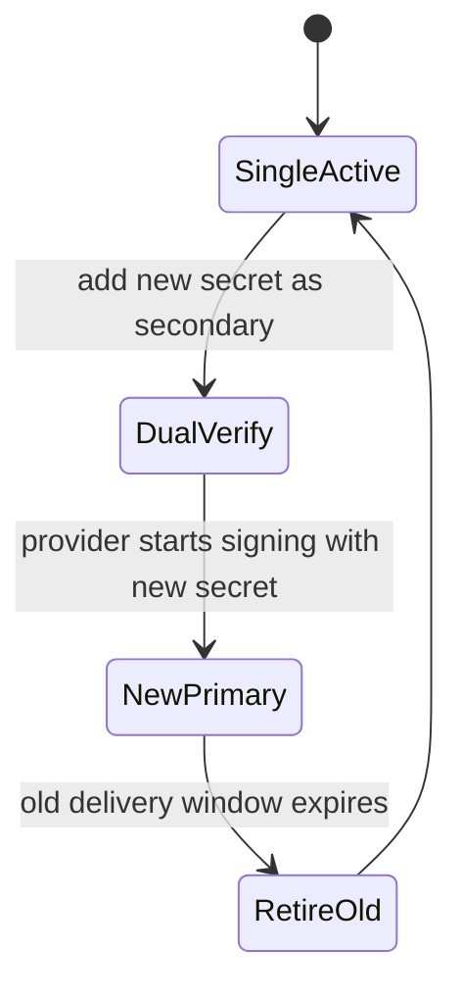

Verifier harus mendukung multiple active verification keys:

```java
public final class RotatingWebhookVerifier {
    private final List<WebhookSecret> secrets;

    public VerificationResult verify(byte[] payload, String signature) {
        for (WebhookSecret secret : secrets) {
            if (secret.status().canVerify() && verifyWith(secret, payload, signature)) {
                return VerificationResult.accept(secret.keyRef());
            }
        }
        return VerificationResult.reject("no_matching_signature_key");
    }
}
```

Log key reference yang berhasil verify, bukan secret value.

---

## 11. Hashing PII dan PAN Fingerprint

Kadang payment system perlu matching tanpa menyimpan plaintext: same card detection, velocity, fraud graph, duplicate customer, reconciliation hints.

Jangan pakai unsalted SHA-256 untuk PAN/email karena domain input kecil dan bisa brute-force.

Bad:

```java
String fingerprint = sha256(pan);
```

Better:

```java
String fingerprint = hmacSha256(blindingKeyRef, normalizePan(pan));
```

Design notes:

- pakai keyed hash/HMAC untuk blinding.
- key disimpan di KMS/HSM/secret manager.
- rotasi fingerprint key harus direncanakan karena mengubah joinability.
- fingerprint purpose harus dipisah: fraud fingerprint, duplicate card fingerprint, reconciliation fingerprint.
- jangan membuat global join key kalau privacy boundary seharusnya merchant-scoped.

```java
public record FingerprintPurpose(String value) {
    public static final FingerprintPurpose CARD_DEDUP = new FingerprintPurpose("CARD_DEDUP");
    public static final FingerprintPurpose RISK_GRAPH = new FingerprintPurpose("RISK_GRAPH");
}
```

---

## 12. Token Generation

Token payment harus unpredictable, unique, scoped, dan tidak mengandung data sensitif.

Bad:

```java
String token = "card_" + merchantId + "_" + last4;
```

Better:

```java
public final class SecureTokenGenerator {
    private final SecureRandom secureRandom = new SecureRandom();

    public String generateCardToken() {
        byte[] bytes = new byte[24];
        secureRandom.nextBytes(bytes);
        return "card_tok_" + Base64.getUrlEncoder().withoutPadding().encodeToString(bytes);
    }
}
```

Production notes:

- use CSPRNG.
- enforce uniqueness with DB constraint.
- no PAN/PII inside token.
- prefix helps debugging/classification.
- token should be scoped by database/policy, not by embedding sensitive claims.

---

## 13. Secrets Management

Provider credentials are not configuration. They are high-risk secrets.

Secret metadata:

```sql
CREATE TABLE provider_secret_ref (
    secret_ref          TEXT PRIMARY KEY,
    provider            TEXT NOT NULL,
    merchant_id         UUID,
    environment         TEXT NOT NULL,
    purpose             TEXT NOT NULL,
    secret_manager_ref  TEXT NOT NULL,
    status              TEXT NOT NULL CHECK (status IN ('ACTIVE', 'ROTATING', 'RETIRED', 'REVOKED')),
    created_at          TIMESTAMPTZ NOT NULL DEFAULT now(),
    rotate_after        TIMESTAMPTZ,
    retired_at          TIMESTAMPTZ
);
```

Rules:

- no provider secret in Git.
- no provider secret in plaintext env dump.
- no provider secret in logs.
- no shared provider credential across unrelated merchants unless intentionally platform-level.
- rotate secret with dual credential support if provider allows.
- record who accessed/changed secret reference.

---

## 14. File Encryption for Settlement and Reports

Bank/merchant settlement integration often uses encrypted files.

Flow:

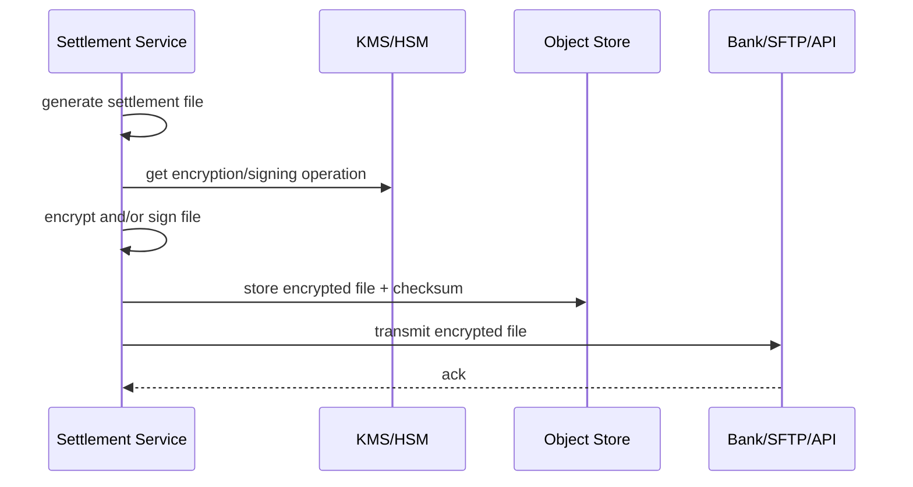

Controls:

- checksum before/after transfer.
- file signing for integrity/non-repudiation.
- encryption recipient key version recorded.
- no plaintext file persisted long-term.
- retention policy clear.
- retry must not generate different content for same batch unless versioned.
- manual download requires approval and audit.

Settlement file metadata:

```sql
CREATE TABLE settlement_file_crypto (
    settlement_file_id  UUID PRIMARY KEY,
    file_sha256         TEXT NOT NULL,
    encrypted_sha256    TEXT NOT NULL,
    encryption_key_ref  TEXT NOT NULL,
    signing_key_ref     TEXT,
    recipient_key_ref   TEXT,
    crypto_profile      TEXT NOT NULL,
    created_at          TIMESTAMPTZ NOT NULL DEFAULT now()
);
```

---

## 15. mTLS and Certificates

Payment/bank integration may require mTLS. Certificate lifecycle must be managed like key lifecycle.

Certificate inventory:

```sql
CREATE TABLE certificate_registry (
    cert_ref            TEXT PRIMARY KEY,
    subject             TEXT NOT NULL,
    issuer              TEXT NOT NULL,
    serial_number       TEXT NOT NULL,
    purpose             TEXT NOT NULL,
    environment         TEXT NOT NULL,
    not_before          TIMESTAMPTZ NOT NULL,
    not_after           TIMESTAMPTZ NOT NULL,
    status              TEXT NOT NULL CHECK (status IN ('ACTIVE', 'ROTATING', 'EXPIRED', 'REVOKED')),
    private_key_ref     TEXT NOT NULL,
    created_at          TIMESTAMPTZ NOT NULL DEFAULT now()
);
```

Alerts:

- cert expires in 60 days.
- cert expires in 30 days.
- cert expires in 7 days.
- cert active but not used.
- unknown cert used by provider.

No payment system should discover certificate expiry from a failed payout batch.

---

## 16. Key Rotation Patterns

### 16.1 Encrypt New, Decrypt Old

Most common pattern:

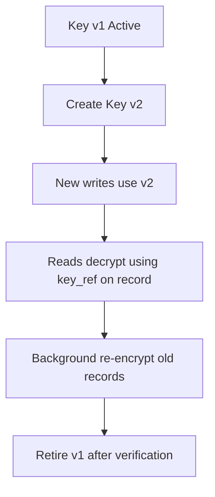

Schema stores `key_ref` per record. Without key reference, rotation becomes guesswork.

### 16.2 Rewrap Data Keys

For envelope encryption, you can rotate KEK by rewrapping encrypted DEK without decrypting all data plaintext.

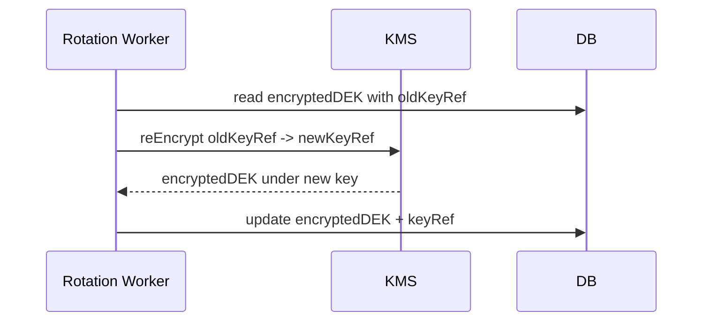

### 16.3 Signing Key Rotation

Signing rotation requires verifier support for old signatures.

- New signatures use v2.
- Verification accepts v1 and v2 during overlap.
- Old events/files keep key id.
- Retain old public keys for verification as long as evidence retention requires.

---

## 17. Crypto Service Boundary

Instead of every service calling KMS directly, payment platform may introduce a crypto service or library.

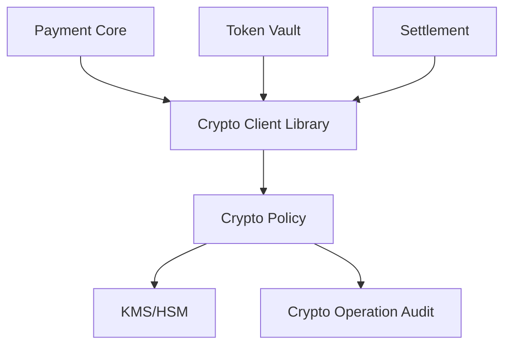

Library-only approach:

- lower latency.
- simpler operations.
- harder to centralize policy if unmanaged.

Crypto service approach:

- central policy and audit.
- easier key usage governance.
- extra latency and availability dependency.

For high-volume PAN encryption, direct KMS envelope encryption with shared vetted library often works. For high-control signing/decryption use cases, service boundary may be better.

---

## 18. Java Crypto Client Interface

Keep domain interface purpose-based.

```java
public interface PaymentCrypto {
    EncryptedPayload encryptPan(Pan pan, EncryptionContext context);
    Pan decryptPan(EncryptedPayload payload, EncryptionContext context, CryptoPurpose purpose);
    Signature signPayload(byte[] payload, SigningContext context);
    VerificationResult verifyPayload(byte[] payload, Signature signature, VerificationContext context);
    Fingerprint fingerprint(String normalizedValue, FingerprintPurpose purpose);
}
```

Avoid generic interface:

```java
byte[] encrypt(byte[] data, String key);
byte[] decrypt(byte[] data, String key);
```

Generic crypto APIs allow misuse. Payment crypto APIs should encode purpose.

---

## 19. Error Handling

Crypto errors must be classified carefully.

| Error | Meaning | Action |
|---|---|---|
| key_not_found | wrong key ref/config | fail closed, alert |
| access_denied | caller not allowed to use key | fail closed, security alert |
| decrypt_failed | wrong context/corrupt ciphertext | quarantine record, investigate |
| signature_mismatch | tampering/wrong secret | reject request, alert if spike |
| replay_detected | duplicate nonce/timestamp | reject request |
| kms_timeout | infra uncertainty | retry if safe, degrade/fail closed depending operation |
| rate_limited | KMS capacity issue | backoff, circuit breaker |
| key_revoked | compromised/retired key | fail closed and incident workflow |

Never treat decrypt failure as “return null and continue.” That can create money movement with missing evidence.

---

## 20. Availability Trade-Off

KMS/HSM outage can block payments. But caching plaintext keys carelessly can destroy the security model.

Possible strategies:

| Strategy | Benefit | Risk |
|---|---|---|
| No caching | strongest key boundary | higher latency/outage sensitivity |
| Short-lived DEK cache | lower latency | memory exposure, policy complexity |
| Local envelope decrypt cache | reduced KMS calls | hard invalidation/revocation |
| Graceful degradation | preserve non-card payment flows | product complexity |
| Fail closed for card vault | security strong | payment outage |

For PAN decrypt/payment authorization, fail closed is usually correct. For non-sensitive verification or public key validation, behavior can vary.

---

## 21. Observability

Crypto subsystem needs metrics without leaking secrets.

Metrics:

- `crypto_operation_total{operation,purpose,key_ref,status}`
- `crypto_operation_latency_ms{operation,purpose}`
- `crypto_access_denied_total{purpose,caller}`
- `crypto_signature_mismatch_total{provider}`
- `crypto_replay_detected_total{provider}`
- `crypto_key_rotation_pending_total{key_ref}`
- `crypto_key_days_to_expiry{key_ref}`
- `certificate_days_to_expiry{cert_ref}`
- `kms_timeout_total{provider}`

Logs:

```json
{
  "event": "crypto_operation",
  "operation": "DECRYPT",
  "keyRef": "card-vault-pan-prod-v3",
  "purpose": "AUTHORIZE_CARD_PAYMENT",
  "actorService": "card-processor-adapter",
  "resourceType": "card_token",
  "resourceId": "card_tok_abc",
  "decision": "ALLOW",
  "requestId": "req_123"
}
```

Do not log plaintext, ciphertext if unnecessary, raw key id if sensitive, or secret references that enable misuse.

---

## 22. Incident Response for Key Compromise

You need a playbook before compromise.

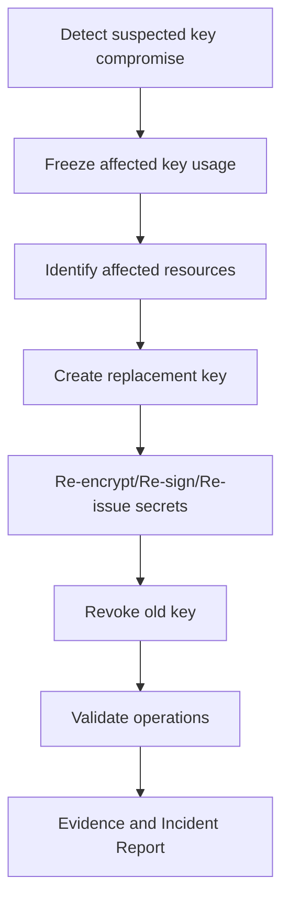

Questions:

1. Which records were encrypted with affected key?
2. Can attacker decrypt old data or only sign new requests?
3. Is key exportable?
4. Which services used it recently?
5. Can we disable without outage?
6. Do we need to re-encrypt, re-tokenize, or rotate provider credentials?
7. Do merchants/regulators/providers need notification?
8. What evidence proves containment?

If you cannot query key usage by `key_ref`, incident response becomes archaeology.

---

## 23. Testing Crypto Workflows

### 23.1 Encryption Context Test

```java
@Test
void decryptMustFailWhenContextDoesNotMatch() {
    var pan = new Pan("4111111111111111");
    var contextA = new EncryptionContext("CARD_PAN_STORAGE", "prod", "m_1", "tok_1", 1);
    var contextB = new EncryptionContext("CARD_PAN_STORAGE", "prod", "m_2", "tok_1", 1);

    var encrypted = crypto.encryptPan(pan, contextA);

    assertThatThrownBy(() -> crypto.decryptPan(encrypted, contextB, CryptoPurpose.AUTHORIZE_CARD_PAYMENT))
        .isInstanceOf(DecryptFailedException.class);
}
```

### 23.2 Rotation Test

```java
@Test
void oldRecordsRemainReadableAfterNewWritesUseRotatedKey() {
    var oldPayload = cryptoV1.encryptPan(new Pan("4111111111111111"), ctx);

    keyRegistry.activate("card-vault-pan-prod-v2");
    var newPayload = crypto.encryptPan(new Pan("4000000000000002"), ctx2);

    assertThat(crypto.decryptPan(oldPayload, ctx, CryptoPurpose.AUTHORIZE_CARD_PAYMENT).value())
        .isEqualTo("4111111111111111");
    assertThat(newPayload.keyRef()).isEqualTo("card-vault-pan-prod-v2");
}
```

### 23.3 Signature Replay Test

```java
@Test
void duplicateNonceMustBeRejected() {
    var request = signedRequestFixture();

    assertThat(verifier.verify(request)).isAccepted();
    assertThat(verifier.verify(request)).isRejectedWith("replay_detected");
}
```

---

## 24. Common Anti-Patterns

### 24.1 Key in Environment Variable Forever

Environment variables leak through process dumps, debug endpoints, deployment metadata, logs, and human workflows. They can be acceptable for some low-risk config, but not as payment-grade key custody for PAN encryption.

### 24.2 One Global Encryption Key

One key for PAN, webhook, settlement file, audit signing, and provider secret means compromise blast radius is total.

### 24.3 No Key Version on Ciphertext

If ciphertext does not record key ref/version, rotation becomes fragile and decrypt path guesses.

### 24.4 Hashing PAN with Plain SHA-256

PAN search space is small enough that unsalted hashes can be attacked. Use keyed hash/HMAC with proper key custody and scope.

### 24.5 Logging Signature Base String with Secret

Debugging signature mismatch often leads teams to log too much. Log canonical fields and hashes, not secrets.

### 24.6 Manual Certificate Tracking

Spreadsheet-based certificate tracking causes outages. Store certificates in registry and alert before expiry.

### 24.7 Crypto Library Without Policy

A perfect AES-GCM utility still fails if any service can call decrypt for any purpose.

---

## 25. Design Checklist

Before production, confirm:

- every key has purpose.
- every key has owner.
- every ciphertext has key reference.
- every decrypt/sign operation is authorized by purpose.
- every key operation has audit record.
- key material is not stored in source code.
- provider secrets are not logged.
- webhook verification supports rotation.
- request signing has timestamp and replay protection.
- PAN fingerprint uses keyed hash/HMAC.
- token generation uses CSPRNG.
- certificate expiry is monitored.
- settlement file encryption/signing is deterministic and auditable.
- key compromise playbook exists.
- rotation is tested in staging and production-like environment.
- old data remains readable after rotation.
- revoked key behavior is fail-closed.

---

## 26. Production Build Order

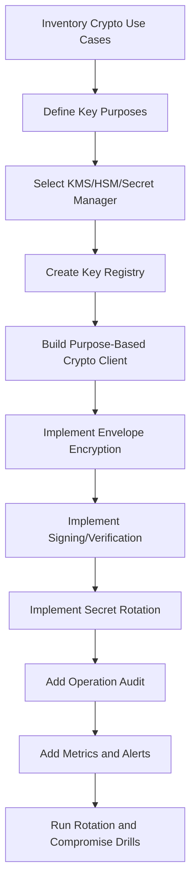

Jangan mulai dari `CryptoUtils.java`. Mulai dari inventory use case dan key purpose.

---

## 27. Example: Card Vault Encryption Flow

```java
public final class CardVaultService {
    private final PaymentCrypto crypto;
    private final CardTokenRepository tokenRepository;
    private final SecureTokenGenerator tokenGenerator;

    public CardToken createToken(CreateCardTokenCommand command) {
        String tokenValue = tokenGenerator.generateCardToken();
        var token = new CardToken(tokenValue);

        var context = new EncryptionContext(
            "CARD_PAN_STORAGE",
            command.environment(),
            command.merchantId(),
            token.value(),
            1
        );

        EncryptedPayload encryptedPan = crypto.encryptPan(command.pan(), context);

        tokenRepository.insert(new CardTokenRecord(
            token,
            command.merchantId(),
            command.customerId(),
            command.brand(),
            command.last4(),
            command.expiryMonth(),
            command.expiryYear(),
            encryptedPan
        ));

        return token;
    }
}
```

Design details:

- `CreateCardTokenCommand` must not implement unsafe `toString`.
- CVC is not persisted.
- `encryptedPan` carries key ref and encrypted data key.
- token is generated before encryption so token id can be part of context.
- repository must not expose encrypted material outside vault boundary unless required.

---

## 28. Example: Provider API Credential Signing

```java
public final class ProviderRequestSigner {
    private final PaymentCrypto crypto;
    private final Clock clock;
    private final NonceGenerator nonceGenerator;

    public SignedProviderRequest sign(ProviderRequest request, SigningKeyRef keyRef) {
        String timestamp = Long.toString(clock.instant().getEpochSecond());
        String nonce = nonceGenerator.generate();
        byte[] bodyHash = sha256(request.body());

        String canonical = String.join("\n",
            request.method(),
            request.path(),
            request.queryString(),
            timestamp,
            nonce,
            hex(bodyHash)
        );

        Signature signature = crypto.signPayload(
            canonical.getBytes(StandardCharsets.UTF_8),
            new SigningContext(keyRef.value(), "PROVIDER_API_REQUEST")
        );

        return request.withHeaders(Map.of(
            "X-Timestamp", timestamp,
            "X-Nonce", nonce,
            "X-Signature", signature.encoded(),
            "X-Key-Id", signature.keyRef()
        ));
    }
}
```

This shape makes replay and canonicalization explicit.

---

## 29. How This Connects to Previous Parts

Part 045 limited where card data can live. This part controls how sensitive data and messages are protected inside those boundaries.

- Token Vault from Part 045 uses envelope encryption here.
- Webhook ingestion from Part 016 uses signature verification here.
- Provider adapter from Part 014 uses outbound request signing and secret rotation here.
- Settlement engine from later parts uses file encryption/signing here.
- Audit trail from next part can use hash chain/signing concepts here.
- PCI DSS architecture relies on key management evidence here.

Crypto is not isolated. It is a cross-cutting control with domain-specific usage.

---

## 30. What Good Looks Like

A mature payment platform has:

- key registry with purpose/status/owner.
- no plaintext payment keys in Git/env dumps/logs.
- envelope encryption for sensitive stored data.
- encryption context binding ciphertext to resource/purpose.
- purpose-based decrypt/sign authorization.
- HMAC/keyed hash for fingerprints.
- rotation without downtime.
- certificate expiry alerting.
- webhook secret dual verification.
- settlement file encryption/signing evidence.
- crypto operation audit logs.
- incident playbook for key compromise.
- tests that prove rotation, replay protection, and context mismatch behavior.

---

## 31. Latihan Desain

Design crypto architecture for this payment platform:

- stores card token with encrypted PAN.
- verifies PSP webhooks.
- signs bank payout API requests.
- encrypts settlement files sent to merchants.
- hashes email and PAN for fraud graph matching.
- supports production and staging.
- must rotate keys every defined cryptoperiod.
- must survive one compromised webhook secret.

Answer:

1. What key purposes do you define?
2. Which keys are symmetric and which are asymmetric?
3. Which keys are in KMS vs HSM vs secret manager?
4. What metadata is stored with ciphertext?
5. How does rotation work for encrypted PAN?
6. How does webhook secret rotation work?
7. How do you prevent replay attacks?
8. How do you prove which key signed a settlement file?
9. What happens when KMS is unavailable?
10. What incident playbook triggers if a signing key is compromised?

---

## 32. Referensi Resmi

- NIST SP 800-57 Part 1 Rev. 5 — Recommendation for Key Management: https://csrc.nist.gov/pubs/sp/800/57/pt1/r5/final
- PCI Security Standards Council — PCI DSS: https://www.pcisecuritystandards.org/standards/pci-dss/
- PCI Security Standards Council — PCI PTS POI overview and approved device listing: https://www.pcisecuritystandards.org/standards/pts-point-of-interaction-poi/
- PCI Security Standards Council — Approved PTS devices listing: https://listings.pcisecuritystandards.org/assessors_and_solutions/pin_transaction_devices
- PCI Security Standards Council — PTS HSM Security Requirements v3 PDF: https://www.pcisecuritystandards.org/documents/PCI_HSM_Security_Requirements_v3_2016_final.pdf
- PCI Security Standards Council — Glossary: https://www.pcisecuritystandards.org/glossary/
