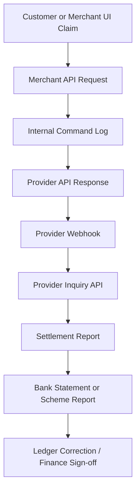
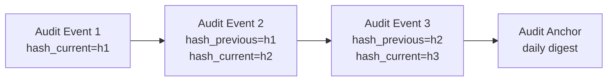
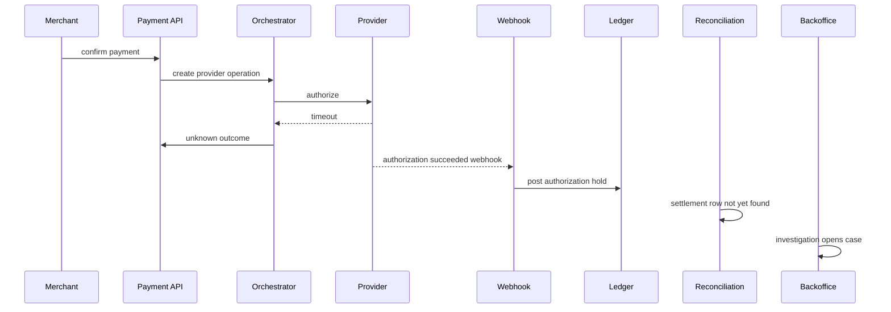

------
title: Build From Scratch: Large Production Grade Java Payment Systems - Part 047
description: Mendesain audit trail dan evidence layer untuk payment platform enterprise: immutable evidence, operator actions, compliance logs, investigation timeline, forensic replay, dan defensible operational history.
series: learn-java-payment-systems
seriesTitle: Build From Scratch: Large Production Grade Java Payment Systems
order: 47
partTitle: Audit Trail & Evidence Design
tags:
- java
- payments
- audit-trail
- evidence
- compliance
- pci-dss
- security
- fintech
- backoffice
- enterprise-architecture
date: 2026-07-02
---

# Part 047 — Audit Trail & Evidence Design

Payment system yang production-grade tidak cukup hanya punya `created_at`, `updated_at`, dan application log. Ketika ada dispute, regulator inquiry, reconciliation break, merchant complaint, suspected fraud, atau incident security, sistem harus bisa menjawab pertanyaan yang lebih berat:

> siapa melakukan apa, terhadap objek apa, berdasarkan evidence apa, lewat channel apa, memakai privilege apa, pada versi data yang mana, menghasilkan perubahan finansial apa, dan bagaimana kita membuktikannya tanpa mengarang cerita setelah kejadian?

Audit trail bukan log tambahan. Audit trail adalah **defensibility layer**.

Sistem payment yang matang harus bisa menjelaskan history secara deterministik. Bukan hanya "payment sukses", tetapi:

- request awal dari merchant;
- idempotency key yang dipakai;
- route/provider yang dipilih;
- raw provider response yang diterima;
- webhook yang masuk;
- state transition yang diterapkan;
- ledger journal yang diposting;
- settlement report yang mencocokkan transaksi;
- operator action jika ada manual adjustment;
- approval chain jika ada payout override;
- policy/risk decision yang menyebabkan hold, decline, review, atau release.

Di sistem biasa, log digunakan untuk debugging. Di payment system, evidence digunakan untuk **membuktikan kebenaran finansial**.

---

## 1. Mental Model: Audit Trail Bukan Application Log

Application log menjawab:

> apa yang terjadi di runtime?

Audit trail menjawab:

> apa keputusan bisnis/finansial yang terjadi, siapa/apa yang memicunya, dan apa bukti yang mendukungnya?

Evidence menjawab:

> dokumen/payload/raw event/report apa yang bisa diverifikasi ulang?

Ketiganya berbeda.

| Layer | Tujuan | Contoh | Boleh Dihapus? | Dipakai Untuk |
|---|---|---|---|---|
| Application log | Debugging runtime | stack trace, warning, latency | boleh sesuai retention teknis | engineering diagnosis |
| Audit event | History keputusan/action | `REFUND_APPROVED`, `PAYOUT_RELEASED` | tidak boleh sembarang | compliance, investigation |
| Evidence record | Bukti mentah/terstruktur | webhook payload, settlement file row, operator approval note | immutable/retained | dispute, audit, forensic replay |
| Ledger journal | Financial truth | debit/credit entries | immutable | accounting, reconciliation |

Anti-pattern yang sering terjadi:

```java
log.info("Refund created for paymentId={}", paymentId);
```

Lalu tim menganggap itu sudah audit trail. Padahal tidak ada:

- actor;
- reason;
- authority;
- before/after state;
- approval;
- request fingerprint;
- immutable evidence;
- correlation ke ledger;
- correlation ke provider operation;
- retention guarantee.

Log di atas berguna, tetapi tidak defensible.

---

## 2. Apa yang Harus Bisa Dijawab Payment Audit Layer?

Audit layer harus mampu menjawab minimal 12 pertanyaan ini.

| Pertanyaan | Contoh Jawaban yang Harus Ada |
|---|---|
| Who? | actor type: merchant API key, customer, internal operator, scheduler, webhook consumer |
| Did what? | command/action: confirm payment, approve refund, release hold, mark reconciliation break resolved |
| To what? | resource: payment, attempt, refund, payout, merchant, ledger journal, dispute |
| When? | event time, received time, committed time, effective time |
| From where? | IP, device, service, job, provider, region |
| Under what authority? | role, permission, policy version, approval chain |
| With what input? | request body hash, sanitized parameters, idempotency key |
| Based on what evidence? | provider response, webhook, settlement row, case attachment, risk decision |
| What changed? | before state, after state, legal transition |
| What financial effect? | ledger journal ID, balance projection delta, settlement batch ID |
| Was it approved? | maker/checker, approval status, approver actor |
| Can we replay/explain it? | deterministic reconstruction from audit + evidence + ledger |

Jika salah satu jawaban ini tidak ada, operasi tertentu mungkin masih berjalan, tetapi tidak mudah dipertahankan di depan finance, auditor, regulator, atau incident review.

---

## 3. Evidence Hierarchy

Tidak semua evidence punya bobot yang sama. Sistem harus punya hierarki evidence agar conflict bisa diselesaikan.

Contoh: client API call mengatakan payment timeout. Provider inquiry mengatakan authorized. Webhook mengatakan captured. Settlement report mengatakan paid. Mana yang benar?

Payment platform perlu evidence hierarchy.



Semakin bawah, biasanya semakin kuat untuk pembuktian finansial. Tetapi bukan berarti selalu lebih cepat atau lebih lengkap.

Prinsipnya:

1. API response memberi **immediate operation evidence**.
2. Webhook memberi **asynchronous provider evidence**.
3. Provider inquiry memberi **current provider state evidence**.
4. Settlement report memberi **financial movement evidence**.
5. Bank statement memberi **cash movement evidence**.
6. Ledger memberi **internal accounting truth**.
7. Reconciliation menentukan apakah internal truth dan external evidence selaras.

Audit layer tidak boleh hanya menyimpan event internal. Ia harus mengikat event internal dengan evidence eksternal.

---

## 4. Audit Event vs Domain Event vs Integration Event

Di part sebelumnya kita membedakan command, event, dan ledger. Sekarang kita tambahkan satu layer: audit event.

| Jenis Event | Audience | Mutability | Contoh | Fungsi |
|---|---|---|---|---|
| Domain event | internal bounded context | immutable | `PaymentAuthorized` | memodelkan fact domain |
| Integration event | service lain | immutable/versioned | `payment.authorized.v1` | komunikasi antar-service |
| Audit event | auditor/operator/compliance | immutable | `OPERATOR_REFUND_APPROVED` | accountability |
| Ledger event | finance/accounting | immutable | `journal.posted.v1` | financial truth notification |

Satu domain event bisa menghasilkan audit event, tetapi tidak selalu sama.

Contoh:

```text
Domain event:
PaymentCaptureRequested

Audit event:
MERCHANT_API_CAPTURE_REQUESTED
  actor = merchant_api_key:mk_live_...
  permission = payment.capture
  idempotency_key = capture-123
  request_hash = sha256(...)
  resource = payment_intent:pi_123
  previous_state = AUTHORIZED
  requested_amount = IDR 100000
```

Audit event lebih fokus pada accountability dan evidence. Domain event lebih fokus pada perubahan domain.

---

## 5. Audit Trail untuk Actor yang Berbeda

Payment system punya banyak jenis actor. Semua harus dimodelkan eksplisit.

```java
public enum ActorType {
    CUSTOMER,
    MERCHANT_USER,
    MERCHANT_API_KEY,
    INTERNAL_OPERATOR,
    INTERNAL_SERVICE,
    SCHEDULED_JOB,
    PROVIDER_WEBHOOK,
    PROVIDER_REPORT,
    BANK_STATEMENT_IMPORT,
    SYSTEM_REPAIR_JOB
}
```

Jangan menyimpan actor sebagai string bebas seperti `created_by = "system"`.

`system` terlalu kabur. Sistem apa? Job apa? Versi apa? Trigger apa? Berdasarkan evidence apa?

Model yang lebih baik:

```java
public record AuditActor(
    ActorType type,
    String actorId,
    String displayName,
    String serviceName,
    String serviceVersion,
    String authenticationMethod,
    String ipAddress,
    String userAgent,
    String requestId,
    String sessionId
) {}
```

Untuk `PROVIDER_WEBHOOK`, actor bukan manusia. Tetapi tetap actor:

```json
{
  "type": "PROVIDER_WEBHOOK",
  "actorId": "stripe:event:evt_123",
  "serviceName": "webhook-ingestion-service",
  "authenticationMethod": "hmac_signature_verified",
  "requestId": "req_abc"
}
```

---

## 6. Audit Schema: Minimal Tetapi Defensible

Audit table yang baik bukan sekadar tabel log. Ia harus append-only, queryable, dan bisa dikorelasikan dengan resource/payment/ledger.

```sql
CREATE TABLE audit_event (
    id                  UUID PRIMARY KEY,
    tenant_id           UUID NOT NULL,

    event_type          TEXT NOT NULL,
    event_version       INT NOT NULL DEFAULT 1,
    event_time          TIMESTAMPTZ NOT NULL,
    committed_at        TIMESTAMPTZ NOT NULL DEFAULT now(),

    actor_type          TEXT NOT NULL,
    actor_id            TEXT NOT NULL,
    actor_display_name  TEXT,
    actor_ip            INET,
    actor_user_agent    TEXT,
    actor_auth_method   TEXT,

    resource_type       TEXT NOT NULL,
    resource_id         TEXT NOT NULL,
    resource_version    BIGINT,

    action              TEXT NOT NULL,
    outcome             TEXT NOT NULL CHECK (outcome IN ('SUCCESS', 'DENIED', 'FAILED', 'PENDING_APPROVAL')),

    before_state        TEXT,
    after_state         TEXT,

    correlation_id      TEXT NOT NULL,
    causation_id        TEXT,
    request_id          TEXT,
    idempotency_key     TEXT,

    command_id          UUID,
    domain_event_id     UUID,
    ledger_journal_id   UUID,
    evidence_id         UUID,
    policy_decision_id  UUID,
    approval_id         UUID,

    reason_code         TEXT,
    reason_text         TEXT,

    input_hash          TEXT,
    metadata            JSONB NOT NULL DEFAULT '{}'::jsonb,

    hash_previous       TEXT,
    hash_current        TEXT NOT NULL
);

CREATE INDEX idx_audit_resource
ON audit_event (tenant_id, resource_type, resource_id, committed_at DESC);

CREATE INDEX idx_audit_actor
ON audit_event (tenant_id, actor_type, actor_id, committed_at DESC);

CREATE INDEX idx_audit_correlation
ON audit_event (tenant_id, correlation_id, committed_at);

CREATE INDEX idx_audit_ledger
ON audit_event (tenant_id, ledger_journal_id)
WHERE ledger_journal_id IS NOT NULL;
```

Catatan desain:

- `event_type` adalah nama audit event stabil.
- `action` adalah klasifikasi operation.
- `outcome` membedakan action yang berhasil, ditolak, gagal, atau menunggu approval.
- `before_state` dan `after_state` membantu investigation.
- `input_hash` menyimpan fingerprint sanitized input, bukan semua data mentah.
- `hash_previous` dan `hash_current` dapat dipakai untuk tamper-evident chain per tenant/resource.
- `metadata` boleh ada, tetapi field penting harus tetap kolom eksplisit.

---

## 7. Evidence Store Schema

Evidence berbeda dari audit event. Evidence menyimpan bukti yang dapat diverifikasi.

```sql
CREATE TABLE evidence_record (
    id                  UUID PRIMARY KEY,
    tenant_id           UUID NOT NULL,

    evidence_type       TEXT NOT NULL,
    source_system       TEXT NOT NULL,
    source_reference    TEXT,

    received_at         TIMESTAMPTZ NOT NULL DEFAULT now(),
    occurred_at         TIMESTAMPTZ,

    resource_type       TEXT,
    resource_id         TEXT,

    content_type        TEXT NOT NULL,
    storage_uri         TEXT,
    payload_hash        TEXT NOT NULL,
    payload_size_bytes  BIGINT NOT NULL,

    signature_status    TEXT CHECK (signature_status IN ('NOT_APPLICABLE', 'VERIFIED', 'FAILED', 'SKIPPED')),
    signature_algorithm TEXT,
    signer_reference    TEXT,

    redaction_status    TEXT NOT NULL CHECK (redaction_status IN ('RAW_RESTRICTED', 'REDACTED', 'TOKENIZED')),
    retention_policy    TEXT NOT NULL,

    metadata            JSONB NOT NULL DEFAULT '{}'::jsonb,

    created_at          TIMESTAMPTZ NOT NULL DEFAULT now()
);

CREATE UNIQUE INDEX uq_evidence_source
ON evidence_record (tenant_id, source_system, source_reference)
WHERE source_reference IS NOT NULL;

CREATE INDEX idx_evidence_resource
ON evidence_record (tenant_id, resource_type, resource_id, received_at DESC);
```

Contoh `evidence_type`:

- `MERCHANT_API_REQUEST`
- `PROVIDER_API_RESPONSE`
- `PROVIDER_WEBHOOK_RAW`
- `PROVIDER_WEBHOOK_NORMALIZED`
- `PROVIDER_INQUIRY_RESPONSE`
- `SETTLEMENT_REPORT_FILE`
- `SETTLEMENT_REPORT_ROW`
- `BANK_STATEMENT_FILE`
- `BANK_STATEMENT_ROW`
- `OPERATOR_NOTE`
- `CASE_ATTACHMENT`
- `APPROVAL_RECORD`
- `POLICY_DECISION_SNAPSHOT`

Jangan mencampur semua evidence ke satu JSON blob tanpa taxonomy. Taxonomy membuat investigation, retention, redaction, dan replay jauh lebih mudah.

---

## 8. Tamper-Evident Audit Chain

Audit trail harus append-only. Tetapi append-only di database saja tidak selalu cukup. Admin database masih bisa mengubah row jika tidak ada kontrol lain.

Minimal, buat audit chain per partition logis:

```text
hash_current = sha256(
  tenant_id || resource_type || resource_id || event_time || event_type || actor_id || input_hash || hash_previous
)
```

Diagramnya:



Untuk sistem yang lebih matang:

- anchor digest harian ke storage terpisah;
- simpan digest ke WORM/object-lock bucket;
- kirim digest ke SIEM atau audit warehouse;
- batasi akses update/delete di database;
- gunakan database role yang hanya bisa insert;
- jalankan periodic integrity verification.

Hash chain bukan pengganti access control, tetapi membuat perubahan diam-diam lebih sulit disembunyikan.

---

## 9. Operator Action Audit

Backoffice adalah area rawan. Operator bisa:

- approve refund;
- release payout;
- freeze merchant;
- unfreeze merchant;
- adjust ledger;
- resolve reconciliation break;
- attach dispute evidence;
- override risk decision;
- change merchant limits;
- rotate credential;
- mark payout as completed manually.

Setiap action harus punya audit record yang lebih kaya dibanding API biasa.

```sql
CREATE TABLE operator_action (
    id                  UUID PRIMARY KEY,
    tenant_id           UUID NOT NULL,
    operator_user_id    UUID NOT NULL,
    action_type         TEXT NOT NULL,
    resource_type       TEXT NOT NULL,
    resource_id         TEXT NOT NULL,
    requested_at        TIMESTAMPTZ NOT NULL DEFAULT now(),
    completed_at        TIMESTAMPTZ,
    status              TEXT NOT NULL CHECK (status IN ('REQUESTED', 'APPROVED', 'REJECTED', 'EXECUTED', 'FAILED', 'CANCELLED')),
    reason_code         TEXT NOT NULL,
    reason_text         TEXT NOT NULL,
    risk_level          TEXT NOT NULL CHECK (risk_level IN ('LOW', 'MEDIUM', 'HIGH', 'CRITICAL')),
    before_snapshot     JSONB NOT NULL,
    requested_change    JSONB NOT NULL,
    after_snapshot      JSONB,
    approval_required   BOOLEAN NOT NULL DEFAULT false,
    approval_id         UUID,
    created_at          TIMESTAMPTZ NOT NULL DEFAULT now()
);
```

Prinsip:

1. High-risk action tidak boleh langsung execute.
2. Reason wajib structured, bukan free text saja.
3. Before snapshot wajib ada.
4. After snapshot wajib ada setelah execute.
5. Action harus link ke audit event.
6. Action yang menyebabkan ledger movement harus link ke ledger journal.

---

## 10. Maker-Checker Audit

Maker-checker bukan sekadar dua orang klik tombol. Sistem harus membuktikan:

- maker dan checker berbeda;
- checker punya permission yang cukup;
- checker melihat perubahan yang sama dengan yang dibuat maker;
- request tidak diubah setelah approval;
- approval belum expired;
- execution memakai approved payload;
- audit event mencatat seluruh chain.

```sql
CREATE TABLE approval_request (
    id                    UUID PRIMARY KEY,
    tenant_id             UUID NOT NULL,
    requested_by          UUID NOT NULL,
    requested_at          TIMESTAMPTZ NOT NULL DEFAULT now(),
    approval_type         TEXT NOT NULL,
    resource_type         TEXT NOT NULL,
    resource_id           TEXT NOT NULL,
    payload_hash          TEXT NOT NULL,
    payload_snapshot      JSONB NOT NULL,
    status                TEXT NOT NULL CHECK (status IN ('PENDING', 'APPROVED', 'REJECTED', 'EXPIRED', 'EXECUTED')),
    expires_at            TIMESTAMPTZ NOT NULL,
    approved_by           UUID,
    approved_at           TIMESTAMPTZ,
    rejection_reason      TEXT,
    executed_at           TIMESTAMPTZ
);

ALTER TABLE approval_request
ADD CONSTRAINT ck_maker_checker_different
CHECK (approved_by IS NULL OR approved_by <> requested_by);
```

Di Java, jangan execute payload dari request baru. Execute dari `payload_snapshot` yang sudah disetujui.

```java
public void executeApprovedAction(UUID approvalId, UUID executorId) {
    ApprovalRequest approval = approvalRepository.lockById(approvalId);

    approval.assertApproved();
    approval.assertNotExpired(clock.instant());
    approval.assertNotExecuted();

    OperatorCommand command = commandDeserializer.fromSnapshot(approval.payloadSnapshot());
    command.assertHashEquals(approval.payloadHash());

    ExecutionResult result = commandExecutor.execute(command);

    approval.markExecuted(clock.instant());
    auditTrail.record(AuditEvent.operatorActionExecuted(approval, executorId, result));
}
```

---

## 11. Sensitive Data and Redaction

Audit trail sering menjadi tempat kebocoran data karena developer ingin "menyimpan semua biar aman".

Itu berbahaya.

Audit layer harus punya data classification.

| Data | Boleh Masuk Audit? | Bentuk Aman |
|---|---|---|
| PAN | Tidak, kecuali CDE controlled evidence | token, BIN/last4 jika perlu |
| CVC/CVV | Tidak | tidak pernah disimpan |
| Password/API secret | Tidak | secret reference |
| Webhook secret | Tidak | key ID/reference |
| Customer email | Terbatas | masked/hash tergantung use case |
| Bank account number | Terbatas | last digits/token |
| Full raw provider payload | Ya, tetapi restricted evidence store | encrypted, access controlled, redacted projection |
| Operator reason | Ya | structured reason + text |

Buat redaction utility sebagai library wajib, bukan optional convention.

```java
public interface AuditSanitizer {
    SanitizedPayload sanitize(AuditPayload payload);
}

public record SanitizedPayload(
    JsonNode visiblePayload,
    String payloadHash,
    Set<String> redactedFields,
    DataClassification maxClassification
) {}
```

Dan buat test yang gagal jika payload audit mengandung pattern sensitif:

```java
@Test
void auditPayloadMustNotContainPanOrCvv() {
    SanitizedPayload sanitized = sanitizer.sanitize(rawPaymentRequest());

    assertThat(sanitized.visiblePayload().toString()).doesNotContain("4111111111111111");
    assertThat(sanitized.visiblePayload().toString()).doesNotContain("123");
}
```

---

## 12. Audit Event Generation Pattern

Jangan sebarkan audit insert di seluruh codebase dengan style bebas.

Gunakan pattern:

```java
public final class AuditedCommandHandler<C extends Command, R> {
    private final CommandHandler<C, R> delegate;
    private final AuditTrail auditTrail;
    private final AuditContextFactory contextFactory;

    public R handle(C command) {
        AuditContext ctx = contextFactory.from(command);
        auditTrail.recordAttempt(ctx);

        try {
            R result = delegate.handle(command);
            auditTrail.recordSuccess(ctx, result);
            return result;
        } catch (PolicyDeniedException ex) {
            auditTrail.recordDenied(ctx, ex.policyDecision());
            throw ex;
        } catch (Exception ex) {
            auditTrail.recordFailure(ctx, ex);
            throw ex;
        }
    }
}
```

Namun hati-hati: untuk command finansial, audit success harus berada dalam transaction boundary yang benar.

Jika command menghasilkan state transition + ledger journal + audit event, ketiganya harus commit bersama atau punya outbox repair path yang jelas.

---

## 13. Timeline Reconstruction

Investigator tidak ingin melihat tabel mentah. Mereka butuh timeline.



Timeline harus menggabungkan:

- command log;
- audit event;
- domain event;
- provider operation;
- webhook event;
- ledger journal;
- reconciliation item;
- settlement batch;
- backoffice case;
- approval request;
- operator note.

Buat query model khusus:

```sql
CREATE VIEW payment_timeline AS
SELECT
    tenant_id,
    resource_id AS payment_id,
    committed_at AS occurred_at,
    'AUDIT' AS source,
    event_type AS type,
    metadata
FROM audit_event
WHERE resource_type IN ('PAYMENT', 'PAYMENT_ATTEMPT')

UNION ALL

SELECT
    tenant_id,
    payment_id,
    created_at,
    'LEDGER',
    'JOURNAL_POSTED',
    jsonb_build_object('journal_id', id, 'posting_rule', posting_rule)
FROM ledger_journal

UNION ALL

SELECT
    tenant_id,
    payment_id,
    received_at,
    'WEBHOOK',
    event_type,
    metadata
FROM provider_webhook_event;
```

Untuk performance, production biasanya memakai materialized timeline/projection, bukan view union besar untuk semua request.

---

## 14. Audit and Evidence for Reconciliation Breaks

Reconciliation break tidak boleh diselesaikan dengan komentar informal.

Contoh break:

```text
Internal ledger: captured IDR 100000
Provider report: settled IDR 97000
Expected fee: IDR 2500
Difference: IDR 500
```

Resolution action harus punya evidence:

- settlement report row;
- expected fee calculation version;
- provider fee schedule version;
- operator analysis;
- adjustment journal jika ada;
- approval jika adjustment material;
- final resolution code.

Schema:

```sql
CREATE TABLE reconciliation_break_resolution (
    id                    UUID PRIMARY KEY,
    tenant_id             UUID NOT NULL,
    reconciliation_break_id UUID NOT NULL,
    resolution_code       TEXT NOT NULL,
    resolution_notes      TEXT NOT NULL,
    evidence_id           UUID,
    adjustment_journal_id UUID,
    approval_id           UUID,
    resolved_by           UUID NOT NULL,
    resolved_at           TIMESTAMPTZ NOT NULL DEFAULT now()
);
```

Invariant:

```text
A reconciliation break with financial adjustment must link to exactly one adjustment journal.
```

---

## 15. Retention Strategy

Retention bukan satu angka untuk semua data.

| Data | Retention Direction |
|---|---|
| Application logs | pendek-menengah, operational |
| Security audit logs | sesuai compliance/security policy |
| Payment audit events | panjang, business/compliance |
| Ledger journals | sangat panjang/permanent sesuai accounting policy |
| Raw provider payload | sesuai legal/compliance + privacy minimization |
| Redacted evidence projection | panjang untuk investigation |
| Backoffice action | panjang |
| Approval records | panjang |
| Risk decision snapshots | cukup panjang untuk dispute/fraud model audit |

Desain retention harus mempertimbangkan:

- privacy regulation;
- PCI scope;
- accounting record retention;
- dispute window;
- chargeback window;
- AML/KYC retention;
- data minimization;
- legal hold.

Jangan membuat satu policy `delete_after_30_days` untuk semua audit/payment evidence.

---

## 16. Security Controls Around Audit Data

Audit data sensitif. Ia bisa mengandung:

- merchant revenue;
- customer identity;
- bank account reference;
- fraud decision;
- internal operator action;
- security event;
- provider payload;
- dispute evidence.

Kontrol minimal:

1. append-only writer role;
2. no update/delete permission untuk aplikasi normal;
3. separate read permission untuk investigator;
4. field-level redaction untuk UI;
5. reason-required access untuk raw evidence;
6. access-to-audit-data itself audited;
7. export action audited;
8. bulk download restricted;
9. retention/legal hold support;
10. SIEM forwarding untuk security-relevant events.

PCI DSS Requirement 10 berfokus pada logging dan monitoring akses ke system components serta cardholder data environment. NIST SP 800-92 juga menekankan log management sebagai proses enterprise: generation, transmission, storage, analysis, disposal. Audit architecture payment harus mengambil prinsip yang sama, tetapi memperluasnya ke financial evidence.

---

## 17. Java Audit API

Buat API internal yang explicit.

```java
public interface AuditTrail {
    void record(AuditEvent event);
}

public record AuditEvent(
    UUID id,
    UUID tenantId,
    String eventType,
    int eventVersion,
    Instant eventTime,
    AuditActor actor,
    AuditResource resource,
    AuditOutcome outcome,
    String beforeState,
    String afterState,
    Correlation correlation,
    EvidenceRef evidenceRef,
    LedgerJournalRef ledgerJournalRef,
    PolicyDecisionRef policyDecisionRef,
    ApprovalRef approvalRef,
    String reasonCode,
    String reasonText,
    String inputHash,
    JsonNode metadata
) {}
```

Event construction harus memakai factory per use case agar konsisten.

```java
public final class PaymentAuditEvents {
    public static AuditEvent refundApproved(
        TenantId tenantId,
        Operator operator,
        Refund refund,
        ApprovalRequest approval,
        LedgerJournal journal
    ) {
        return AuditEventBuilder.named("REFUND_APPROVED")
            .tenant(tenantId)
            .actor(operator.toAuditActor())
            .resource("REFUND", refund.id().value())
            .outcome(AuditOutcome.SUCCESS)
            .beforeState("REVIEW_REQUIRED")
            .afterState("APPROVED")
            .approvalRef(approval.id())
            .ledgerJournalRef(journal.id())
            .reasonCode(refund.reasonCode())
            .metadata("amount", refund.amount().toJson())
            .build();
    }
}
```

---

## 18. Failure Modes

| Failure | Dampak | Guardrail |
|---|---|---|
| audit insert gagal setelah state berubah | history hilang | same transaction atau outbox audit repair |
| audit event menyimpan PAN | PCI/privacy incident | sanitizer + classification test |
| operator action tidak punya reason | tidak defensible | reason mandatory + enum |
| approval payload berubah setelah approval | unauthorized execution | payload hash + snapshot execution |
| evidence payload hilang | tidak bisa replay | durable object store + hash |
| audit row bisa di-update | tampering | append-only role + hash chain |
| semua actor disebut `system` | investigation buntu | structured actor model |
| manual adjustment tanpa ledger link | money unexplained | DB constraint/business invariant |
| reconciliation break resolved tanpa evidence | finance risk | mandatory resolution evidence |
| audit UI tanpa access audit | insider risk | audit all audit-data access |

---

## 19. Practical Build Order

Bangun audit/evidence layer secara bertahap:

1. Define actor/resource/action taxonomy.
2. Implement `audit_event` table.
3. Implement audit context propagation.
4. Add audit event for high-risk payment commands.
5. Add evidence store for raw provider webhook/API response.
6. Link audit event to evidence record.
7. Link ledger journal to audit event.
8. Add operator action audit.
9. Add maker-checker approval record.
10. Add timeline projection.
11. Add tamper-evident hash chain.
12. Add access audit for evidence viewer.
13. Add retention/legal hold.
14. Add periodic audit integrity job.

Jangan menunggu sistem besar selesai baru menambahkan audit. Audit harus muncul sejak command finansial pertama.

---

## 20. Checklist

Sebelum menganggap audit layer siap production, pastikan:

- [ ] Setiap command finansial menghasilkan audit event.
- [ ] Setiap operator high-risk action punya reason dan approval.
- [ ] Setiap ledger journal bisa ditelusuri ke command/evidence.
- [ ] Setiap provider webhook raw tersimpan sebagai evidence.
- [ ] Payload audit sudah disanitasi dari PAN/CVV/secret.
- [ ] Actor model tidak memakai `system` secara kabur.
- [ ] Audit event append-only.
- [ ] Evidence payload punya hash.
- [ ] Timeline payment bisa direkonstruksi.
- [ ] Reconciliation break resolution punya evidence.
- [ ] Audit data access juga diaudit.
- [ ] Retention policy per evidence type jelas.
- [ ] Hash chain/integrity check tersedia untuk event penting.
- [ ] Export/download evidence dibatasi dan diaudit.

---

## 21. Inti Part Ini

Audit trail di payment system bukan fitur admin. Ia adalah bagian dari correctness.

Payment platform yang baik tidak hanya bisa memindahkan uang. Ia bisa menjelaskan uang itu bergerak karena apa, oleh siapa, berdasarkan bukti apa, dan bagaimana setiap perubahan bisa diverifikasi ulang.

Kalau ledger adalah financial truth, maka audit/evidence layer adalah **argumentasi yang membuat truth itu bisa dipercaya**.

---

## References

- PCI Security Standards Council — PCI DSS v4.0.1 Document Library: https://www.pcisecuritystandards.org/document_library/
- PCI Security Standards Council — PCI DSS overview: https://www.pcisecuritystandards.org/standards/pci-dss/
- PCI SSC Blog — PCI DSS v4.0.1 publication notes: https://blog.pcisecuritystandards.org/just-published-pci-dss-v4-0-1
- NIST SP 800-92 — Guide to Computer Security Log Management: https://csrc.nist.gov/pubs/sp/800/92/final
- NIST SP 800-53 Rev. 5 — Security and Privacy Controls: https://csrc.nist.gov/pubs/sp/800/53/r5/upd1/final
- OWASP Logging Cheat Sheet: https://cheatsheetseries.owasp.org/cheatsheets/Logging_Cheat_Sheet.html
- Stripe Docs — Webhooks: https://docs.stripe.com/webhooks
- Adyen Docs — Webhooks: https://docs.adyen.com/development-resources/webhooks
- Martin Fowler — Accounting Transaction: https://martinfowler.com/eaaDev/AccountingTransaction.html
