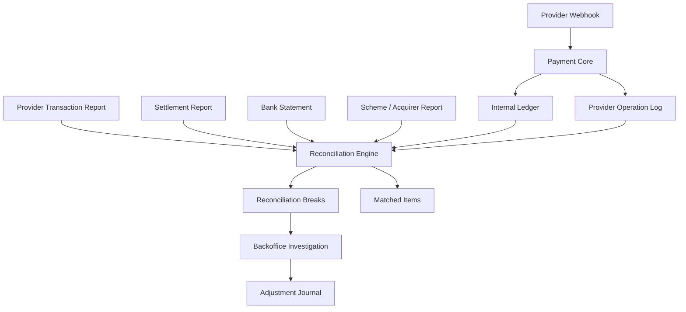
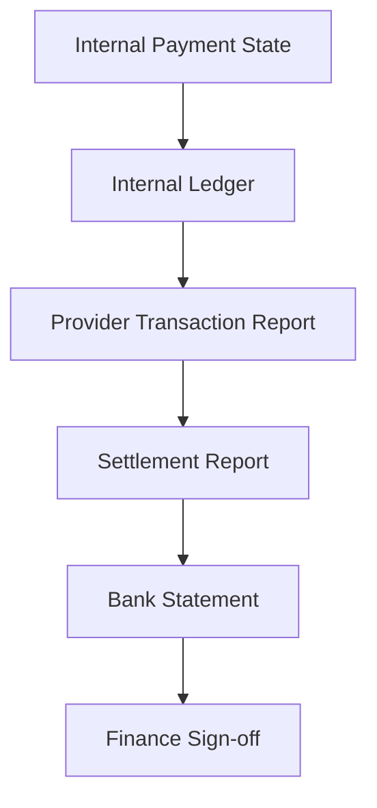
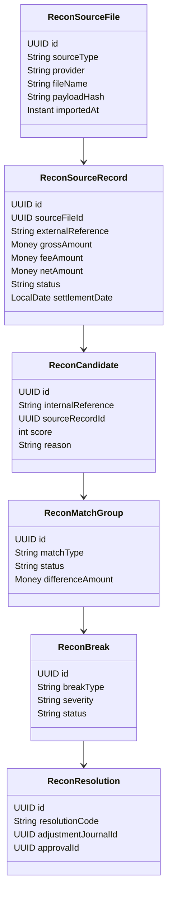
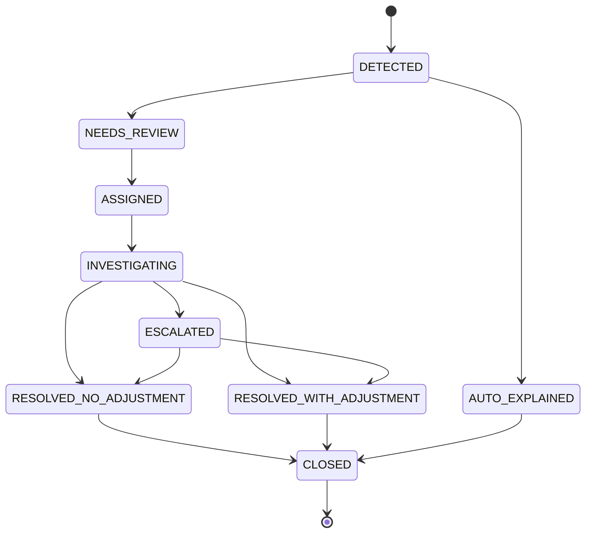

------
title: Build From Scratch: Large Production Grade Java Payment Systems - Part 048
description: Membangun fondasi reconciliation system untuk payment platform enterprise: membandingkan ledger internal, provider reports, settlement reports, bank statements, scheme reports, dan operational evidence.
series: learn-java-payment-systems
seriesTitle: Build From Scratch: Large Production Grade Java Payment Systems
order: 48
partTitle: Reconciliation Foundation
tags:
- java
- payments
- reconciliation
- ledger
- settlement
- accounting
- finance-operations
- payment-operations
- enterprise-architecture
date: 2026-07-02
---

# Part 048 — Reconciliation Foundation

Payment system yang terlihat sukses di API belum tentu benar secara finansial.

Merchant bisa menerima response `succeeded`. Customer bisa melihat saldo terpotong. Provider bisa mengirim webhook sukses. Ledger internal bisa memposting revenue. Tetapi beberapa hari kemudian, settlement report menunjukkan amount berbeda, fee berbeda, transaksi tidak muncul, payout gagal, atau bank statement tidak cocok.

Di sinilah reconciliation masuk.

> Reconciliation adalah proses membuktikan bahwa internal financial truth sesuai dengan external financial evidence.

Tanpa reconciliation, payment system hanya berharap provider, bank, dan sistem internal selalu sepakat. Di production, mereka tidak selalu sepakat.

---

## 1. Mental Model: Reconciliation Bukan Report

Report menjawab:

> apa yang terjadi menurut satu sumber data?

Reconciliation menjawab:

> apakah beberapa sumber data yang seharusnya merepresentasikan uang yang sama benar-benar cocok?

Contoh:

```text
Internal payment: CAPTURED IDR 100000
Internal ledger: merchant payable +97000, platform revenue +3000
Provider report: settled gross IDR 100000, fee IDR 3200, net IDR 96800
Bank statement: payout received IDR 96800
```

Pertanyaan reconciliation:

- Apakah payment internal muncul di provider report?
- Apakah provider gross amount sama?
- Apakah fee sesuai pricing/fee model?
- Apakah net settlement sesuai expected?
- Apakah payout batch sesuai bank statement?
- Apakah selisih IDR 200 adalah provider fee difference, FX, tax, adjustment, chargeback, atau bug?
- Apakah ledger perlu correction journal?

Reconciliation bukan dashboard finance. Ia adalah **control system**.

---

## 2. Reconciliation Sources

Payment platform production biasanya punya beberapa sumber external evidence.

| Source | Contoh | Menjawab |
|---|---|---|
| Internal payment state | `payment_intent`, `payment_attempt` | apa yang sistem percaya terjadi |
| Internal ledger | journal/entry | apa yang sistem bukukan |
| Provider operation log | API request/response | apa yang kita kirim/terima dari provider |
| Provider webhook | async event | apa yang provider kabarkan |
| Provider transaction report | balance/transaction report | apa yang provider catat sebagai movement |
| Settlement report | batch settlement detail | apa yang masuk ke settlement batch |
| Scheme/acquirer report | card scheme/acquirer file | apa yang card network/acquirer proses |
| Bank statement | cash account statement | uang kas nyata yang masuk/keluar |
| Merchant statement | statement yang kita berikan ke merchant | apa yang kita klaim ke merchant |
| Backoffice adjustment | manual correction | keputusan manusia yang mengubah financial position |

Diagram relasi:



---

## 3. What Reconciliation Actually Compares

Reconciliation bukan hanya `amount == amount`.

Ia membandingkan banyak dimensi:

| Dimension | Contoh |
|---|---|
| Identity | payment ID, provider reference, RRN, STAN, settlement reference |
| Amount | gross, fee, tax, net, refund amount, chargeback amount |
| Currency | transaction currency, settlement currency, FX rate |
| State | authorized, captured, settled, refunded, disputed |
| Time | authorization time, capture time, settlement date, bank posting date |
| Party | merchant, sub-merchant, platform, customer, bank account |
| Batch | settlement batch, payout batch, bank statement date |
| Method | card, QR, VA, wallet, instant payment, payout |
| Accounting | ledger journal, account, debit/credit, balance bucket |
| Evidence | report row, webhook event, inquiry response, statement row |

Dalam reconciliation, satu transaksi bisa cocok secara amount tetapi salah batch. Atau cocok secara reference tetapi salah fee. Atau cocok secara gross tetapi net berbeda.

Maka reconciliation result harus kaya.

---

## 4. Truth Hierarchy in Reconciliation

Di part audit kita punya evidence hierarchy. Reconciliation membutuhkan versi finansialnya.



Prinsip:

- internal payment state menjelaskan lifecycle;
- internal ledger menjelaskan accounting position;
- provider report menjelaskan provider-side movement;
- settlement report menjelaskan batch/net settlement;
- bank statement menjelaskan cash movement;
- finance sign-off menyelesaikan interpretasi accounting jika ada ambiguity.

Jangan menganggap provider webhook sebagai bukti settlement final. Webhook bisa cepat, tetapi report dan bank movement yang biasanya menutup siklus finansial.

---

## 5. Reconciliation Domains

Payment platform perlu beberapa jenis reconciliation.

### 5.1 Payment Capture Reconciliation

Mencocokkan captured payments internal dengan provider transaction report.

Pertanyaan:

- Apakah semua captured internal ada di provider?
- Apakah ada provider transaction yang tidak ada internal?
- Apakah amount/currency sama?
- Apakah status provider sesuai?
- Apakah capture time masuk cutoff yang benar?

### 5.2 Settlement Reconciliation

Mencocokkan ledger expected settlement dengan settlement report.

Pertanyaan:

- Apakah semua captured transaction masuk settlement batch?
- Apakah fee/net sesuai?
- Apakah chargeback/refund/adjustment dihitung?
- Apakah payout expected cocok?

### 5.3 Bank Reconciliation

Mencocokkan payout/settlement cash movement dengan bank statement.

Pertanyaan:

- Apakah settlement batch benar-benar masuk bank?
- Apakah amount net sama?
- Apakah bank fee/withholding tax ada?
- Apakah payout gagal/return?

### 5.4 Refund Reconciliation

Mencocokkan refund internal dengan provider refund report dan ledger.

Pertanyaan:

- Apakah refund sukses internal benar-benar diproses provider?
- Apakah refund partial amount benar?
- Apakah provider fee refunded atau tidak?
- Apakah merchant balance sudah dikurangi?

### 5.5 Chargeback/Dispute Reconciliation

Mencocokkan dispute case internal, scheme/acquirer report, provider balance movement, dan ledger loss booking.

Pertanyaan:

- Apakah chargeback debit sudah dibukukan?
- Apakah representment win/loss sudah tercermin?
- Apakah fee chargeback dibebankan?
- Apakah reserve/hold digunakan?

### 5.6 Payout Reconciliation

Mencocokkan payout instruction, provider/bank result, ledger payout pending/clearing, dan bank debit/credit.

Pertanyaan:

- Apakah payout yang dikirim benar-benar keluar?
- Apakah beneficiary menerima?
- Apakah failed payout dikembalikan ke available balance?
- Apakah duplicate payout terjadi?

---

## 6. Reconciliation Object Model

Kita butuh model yang memisahkan source records, match groups, breaks, dan resolution.



---

## 7. Source File Ingestion

Jangan langsung parse report lalu update payment.

Simpan dulu file mentah sebagai evidence.

```sql
CREATE TABLE recon_source_file (
    id                  UUID PRIMARY KEY,
    tenant_id           UUID NOT NULL,
    source_type         TEXT NOT NULL,
    provider            TEXT,
    file_name           TEXT NOT NULL,
    content_type        TEXT NOT NULL,
    storage_uri         TEXT NOT NULL,
    payload_hash        TEXT NOT NULL,
    file_date           DATE,
    imported_at         TIMESTAMPTZ NOT NULL DEFAULT now(),
    imported_by         TEXT NOT NULL,
    status              TEXT NOT NULL CHECK (status IN ('RECEIVED', 'PARSED', 'FAILED', 'REJECTED')),
    metadata            JSONB NOT NULL DEFAULT '{}'::jsonb,
    UNIQUE (tenant_id, source_type, provider, payload_hash)
);
```

Kemudian parse menjadi normalized records.

```sql
CREATE TABLE recon_source_record (
    id                    UUID PRIMARY KEY,
    tenant_id             UUID NOT NULL,
    source_file_id         UUID NOT NULL REFERENCES recon_source_file(id),
    line_number            INT,

    record_type            TEXT NOT NULL,
    external_reference     TEXT,
    provider_reference     TEXT,
    merchant_reference     TEXT,
    payment_id             UUID,
    payment_attempt_id     UUID,

    transaction_time       TIMESTAMPTZ,
    settlement_date        DATE,
    currency               CHAR(3) NOT NULL,
    gross_minor            BIGINT,
    fee_minor              BIGINT,
    tax_minor              BIGINT,
    net_minor              BIGINT,

    status                 TEXT,
    raw_record_hash         TEXT NOT NULL,
    normalized_payload      JSONB NOT NULL,

    created_at             TIMESTAMPTZ NOT NULL DEFAULT now()
);

CREATE INDEX idx_recon_record_ref
ON recon_source_record (tenant_id, provider_reference);

CREATE INDEX idx_recon_record_payment
ON recon_source_record (tenant_id, payment_id);

CREATE INDEX idx_recon_record_settlement
ON recon_source_record (tenant_id, settlement_date, currency);
```

Prinsip:

1. Raw file immutable.
2. Parsed rows immutable.
3. Parser version dicatat.
4. Normalized payload bisa berubah hanya lewat reparse version baru, bukan update diam-diam.
5. Semua source row punya hash.

---

## 8. Internal Reconciliation Snapshot

Jangan membaca payment dan ledger live table secara sembarang saat reconciliation berjalan panjang.

Buat snapshot internal.

```sql
CREATE TABLE recon_internal_snapshot (
    id                    UUID PRIMARY KEY,
    tenant_id             UUID NOT NULL,
    snapshot_type          TEXT NOT NULL,
    business_date          DATE NOT NULL,
    created_at             TIMESTAMPTZ NOT NULL DEFAULT now(),
    source_watermark       TIMESTAMPTZ NOT NULL,
    status                 TEXT NOT NULL CHECK (status IN ('CREATED', 'MATCHED', 'FAILED', 'CLOSED'))
);

CREATE TABLE recon_internal_record (
    id                    UUID PRIMARY KEY,
    tenant_id             UUID NOT NULL,
    snapshot_id            UUID NOT NULL REFERENCES recon_internal_snapshot(id),

    internal_reference     TEXT NOT NULL,
    payment_id             UUID,
    payment_attempt_id     UUID,
    ledger_journal_id      UUID,
    merchant_id            UUID,

    record_type            TEXT NOT NULL,
    transaction_time       TIMESTAMPTZ,
    settlement_date        DATE,
    currency               CHAR(3) NOT NULL,
    gross_minor            BIGINT,
    expected_fee_minor     BIGINT,
    expected_net_minor     BIGINT,
    status                 TEXT NOT NULL,

    metadata               JSONB NOT NULL DEFAULT '{}'::jsonb
);
```

Kenapa snapshot?

- reconciliation batch bisa berjalan lama;
- payment live state bisa berubah saat matching berjalan;
- finance perlu tahu data cut yang dipakai;
- rerun harus deterministic;
- audit harus bisa membuktikan hasil matching berdasarkan snapshot tertentu.

---

## 9. Matching Levels

Reconciliation matching tidak selalu satu strategi.

| Level | Meaning | Example |
|---|---|---|
| Exact match | reference + amount + currency cocok | provider_reference sama dan net sama |
| Strong match | reference cocok, amount beda kecil/terjelaskan | fee/tax difference |
| Probable match | beberapa dimensi cocok, reference hilang | amount + time + merchant + method |
| Many-to-one | beberapa internal item cocok ke satu settlement row | batch netting |
| One-to-many | satu internal item pecah ke beberapa external row | split settlement/partial capture |
| No match | internal ada, external tidak ada | missing settlement |
| Unexpected external | external ada, internal tidak ada | orphan provider transaction |

Part 049 nanti akan masuk lebih dalam ke matching engine. Part ini fokus foundation.

---

## 10. Reconciliation Result Model

```sql
CREATE TABLE recon_match_group (
    id                    UUID PRIMARY KEY,
    tenant_id             UUID NOT NULL,
    reconciliation_run_id  UUID NOT NULL,
    match_type             TEXT NOT NULL,
    match_status           TEXT NOT NULL CHECK (match_status IN ('MATCHED', 'MATCHED_WITH_DIFFERENCE', 'UNMATCHED_INTERNAL', 'UNEXPECTED_EXTERNAL', 'NEEDS_REVIEW')),
    confidence_score       INT NOT NULL CHECK (confidence_score BETWEEN 0 AND 100),
    currency               CHAR(3),
    expected_gross_minor   BIGINT,
    actual_gross_minor     BIGINT,
    expected_fee_minor     BIGINT,
    actual_fee_minor       BIGINT,
    expected_net_minor     BIGINT,
    actual_net_minor       BIGINT,
    difference_minor       BIGINT,
    created_at             TIMESTAMPTZ NOT NULL DEFAULT now()
);

CREATE TABLE recon_match_item (
    id                    UUID PRIMARY KEY,
    tenant_id             UUID NOT NULL,
    match_group_id         UUID NOT NULL REFERENCES recon_match_group(id),
    item_side              TEXT NOT NULL CHECK (item_side IN ('INTERNAL', 'EXTERNAL')),
    internal_record_id     UUID,
    source_record_id       UUID,
    role                  TEXT NOT NULL,
    amount_minor           BIGINT,
    currency               CHAR(3)
);
```

Kenapa `match_group`, bukan hanya `internal_id -> external_id`?

Karena reconciliation sering bukan one-to-one.

Contoh settlement:

```text
Internal captured payments:
- p1 gross 100000 fee 3000 net 97000
- p2 gross 50000 fee 1500 net 48500
- refund r1 net -20000

Settlement report row/batch:
- batch net 125500
```

Satu settlement batch bisa menjelaskan banyak internal records.

---

## 11. Break Types

Reconciliation break harus diklasifikasi. Jangan hanya `status = mismatch`.

```java
public enum ReconciliationBreakType {
    INTERNAL_MISSING_EXTERNAL,
    EXTERNAL_MISSING_INTERNAL,
    GROSS_AMOUNT_MISMATCH,
    FEE_AMOUNT_MISMATCH,
    NET_AMOUNT_MISMATCH,
    CURRENCY_MISMATCH,
    STATUS_MISMATCH,
    DUPLICATE_INTERNAL,
    DUPLICATE_EXTERNAL,
    SETTLEMENT_DATE_MISMATCH,
    BATCH_MISMATCH,
    MERCHANT_MISMATCH,
    UNKNOWN_PROVIDER_REFERENCE,
    UNEXPECTED_CHARGEBACK,
    UNEXPECTED_REFUND,
    PAYOUT_NOT_RECEIVED_IN_BANK,
    BANK_AMOUNT_MISMATCH
}
```

Break severity juga penting.

| Severity | Meaning | Example |
|---|---|---|
| Low | tidak material, explainable | rounding 1 minor unit |
| Medium | perlu review | fee mismatch kecil |
| High | financial impact | missing settlement row |
| Critical | possible duplicate/lost money/compliance issue | bank payout missing besar |

---

## 12. Break Lifecycle



Break resolution tidak boleh langsung mengubah data lama. Jika perlu financial correction, buat adjustment journal.

Contoh:

```text
Provider fee actual lebih besar IDR 200 dari expected.
Resolution: PROVIDER_FEE_DIFFERENCE_ACCEPTED
Financial effect: debit platform revenue expense / credit merchant payable or provider payable depending model
```

---

## 13. Ledger Integration

Reconciliation tidak mengganti ledger. Reconciliation menjelaskan apakah ledger cocok dengan external evidence.

Ada tiga kemungkinan:

### 13.1 Ledger benar, external report terlambat

Tidak perlu adjustment. Break tetap open sampai report berikutnya.

### 13.2 External report benar, ledger kurang posting

Perlu correction journal.

### 13.3 Keduanya benar tetapi beda timing/cutoff

Perlu timing explanation, bukan adjustment.

Contoh correction journal:

```sql
INSERT INTO ledger_journal (
    id,
    tenant_id,
    journal_type,
    posting_rule,
    source_type,
    source_id,
    description
) VALUES (
    :journal_id,
    :tenant_id,
    'ADJUSTMENT',
    'PROVIDER_FEE_CORRECTION',
    'RECONCILIATION_BREAK',
    :break_id,
    'Provider actual fee differs from expected fee for settlement batch X'
);
```

Invariant:

```text
Reconciliation must never mutate old ledger entries.
Reconciliation can only create explanation, match result, break, or correction journal.
```

---

## 14. Reconciliation Run

Setiap batch reconciliation harus punya run record.

```sql
CREATE TABLE reconciliation_run (
    id                    UUID PRIMARY KEY,
    tenant_id             UUID NOT NULL,
    run_type              TEXT NOT NULL,
    provider              TEXT,
    business_date          DATE NOT NULL,
    started_at            TIMESTAMPTZ NOT NULL DEFAULT now(),
    finished_at           TIMESTAMPTZ,
    status                TEXT NOT NULL CHECK (status IN ('RUNNING', 'SUCCEEDED', 'FAILED', 'CANCELLED')),
    internal_snapshot_id   UUID,
    source_file_id         UUID,
    algorithm_version      TEXT NOT NULL,
    total_internal_count   INT NOT NULL DEFAULT 0,
    total_external_count   INT NOT NULL DEFAULT 0,
    matched_count          INT NOT NULL DEFAULT 0,
    break_count            INT NOT NULL DEFAULT 0,
    metadata              JSONB NOT NULL DEFAULT '{}'::jsonb
);
```

Jangan menjalankan reconciliation tanpa `algorithm_version`. Ketika matching logic berubah, finance harus bisa tahu hasil lama dibuat oleh versi apa.

---

## 15. Example: Card Settlement Reconciliation

Misalnya satu card payment:

```text
Payment captured: IDR 100000
Expected MDR: 2.9% + IDR 1000 = IDR 3900
Expected net: IDR 96100
```

Provider settlement report:

```text
Gross: IDR 100000
Fee: IDR 4000
Net: IDR 96000
Settlement batch: B-2026-07-02
```

Reconciliation result:

```json
{
  "matchStatus": "MATCHED_WITH_DIFFERENCE",
  "breakType": "FEE_AMOUNT_MISMATCH",
  "expectedFeeMinor": 3900,
  "actualFeeMinor": 4000,
  "differenceMinor": 100,
  "severity": "MEDIUM",
  "recommendedResolution": "VERIFY_PROVIDER_FEE_SCHEDULE"
}
```

Ini bukan failure payment. Ini finance break.

---

## 16. Example: Bank Statement Reconciliation

Settlement engine expected payout:

```text
Settlement batch S1 net: IDR 500000000
Expected bank credit date: 2026-07-03
```

Bank statement:

```text
Credit received: IDR 499990000
Description: SETTLEMENT S1
Bank fee: IDR 10000
```

Result:

```text
Matched with explainable bank fee.
No customer/merchant payment issue.
Journal needed if bank fee not previously accrued.
```

Ledger correction:

```text
Debit: Bank Fee Expense       10000
Credit: Cash/Settlement Bank  10000
```

---

## 17. Java Service Boundary

```java
public interface ReconciliationService {
    ReconciliationRunId startRun(StartReconciliationCommand command);
    void importSourceFile(ImportReconFileCommand command);
    void buildInternalSnapshot(BuildSnapshotCommand command);
    void match(ReconciliationRunId runId);
    void openBreaks(ReconciliationRunId runId);
    void resolveBreak(ResolveReconBreakCommand command);
}
```

Core objects:

```java
public record ReconciliationRun(
    ReconciliationRunId id,
    RunType runType,
    ProviderCode provider,
    LocalDate businessDate,
    AlgorithmVersion algorithmVersion,
    RunStatus status
) {}

public record ReconciliationRecord(
    RecordSide side,
    String reference,
    Money gross,
    Money fee,
    Money net,
    LocalDate settlementDate,
    Map<String, String> dimensions
) {}

public record MatchResult(
    MatchStatus status,
    int confidenceScore,
    List<ReconciliationRecord> internalRecords,
    List<ReconciliationRecord> externalRecords,
    Difference difference,
    List<BreakCandidate> breakCandidates
) {}
```

---

## 18. Import Parser Design

Provider reports berubah. CSV column bisa bertambah. Timezone bisa berbeda. Decimal separator bisa bermasalah.

Buat parser versioned.

```java
public interface ReconciliationFileParser {
    ProviderCode provider();
    SourceType sourceType();
    ParserVersion version();
    ParsedReconFile parse(RawReconFile file);
}
```

Parser output harus normalized.

```java
public record ParsedReconRecord(
    int lineNumber,
    String externalReference,
    String providerReference,
    String merchantReference,
    Instant transactionTime,
    LocalDate settlementDate,
    Money gross,
    Money fee,
    Money tax,
    Money net,
    String providerStatus,
    JsonNode rawFields,
    String rawRecordHash
) {}
```

Jangan parse amount memakai `double`.

---

## 19. Operational Dashboard

Reconciliation dashboard minimal menampilkan:

- run status;
- business date;
- provider/source;
- internal record count;
- external record count;
- matched count;
- unmatched internal count;
- unexpected external count;
- total difference amount;
- high/critical breaks;
- oldest unresolved break;
- settlement batch not reconciled;
- bank statement missing;
- parser failure;
- run duration;
- algorithm version.

Business SLO contoh:

```text
99% provider settlement reports reconciled within T+1 business day.
100% critical cash movement breaks reviewed within 4 business hours.
No payout batch is marked finance-closed before bank reconciliation is complete.
```

---

## 20. Failure Modes

| Failure | Dampak | Guardrail |
|---|---|---|
| report file tidak masuk | settlement blind spot | missing file detector |
| file double imported | duplicate break/match | payload hash unique constraint |
| parser salah timezone | settlement date mismatch | parser test + provider timezone config |
| amount parsed as floating point | rounding error | integer minor unit/decimal exact |
| matching update payment langsung | corrupt lifecycle | reconciliation creates result/break only |
| unmatched ignored | lost money | unresolved break SLO |
| adjustment tanpa approval | unauthorized finance impact | maker-checker for material adjustment |
| algorithm berubah tanpa version | result tidak explainable | algorithm version mandatory |
| bank statement terlambat dianggap missing cash | false critical alert | expected arrival calendar |
| provider row tanpa internal record langsung dibukukan | fake/duplicate risk | unexpected external workflow |

---

## 21. Build Order

Bangun reconciliation foundation seperti ini:

1. Define reconciliation source taxonomy.
2. Store raw source files as evidence.
3. Build normalized source record table.
4. Build internal snapshot generator.
5. Create reconciliation run model.
6. Implement exact matching for one rail/provider.
7. Produce match groups.
8. Produce breaks, not direct corrections.
9. Build break lifecycle and resolution UI.
10. Link resolution to audit/evidence.
11. Allow approved adjustment journal.
12. Add dashboard and SLO.
13. Add missing-file detector.
14. Add parser versioning/golden tests.
15. Expand to fuzzy/many-to-one matching in next part.

Mulai dari one provider + one report + one business date. Jangan langsung mencoba semua rails.

---

## 22. Checklist

Sebelum reconciliation foundation dianggap siap:

- [ ] Raw provider/bank/settlement file disimpan immutable.
- [ ] Parsed records punya hash dan parser version.
- [ ] Internal records dibuat sebagai snapshot dengan watermark.
- [ ] Reconciliation run punya algorithm version.
- [ ] Match result tidak mengubah payment state langsung.
- [ ] Break punya type, severity, status, owner.
- [ ] Break resolution punya evidence.
- [ ] Financial correction memakai ledger journal baru.
- [ ] Material adjustment butuh approval.
- [ ] Dashboard menunjukkan unresolved breaks.
- [ ] Missing report detector tersedia.
- [ ] Bank reconciliation dibedakan dari provider reconciliation.
- [ ] Settlement closure bergantung pada reconciliation state.
- [ ] Semua operation diaudit.

---

## 23. Inti Part Ini

Reconciliation adalah cara payment platform membuktikan bahwa uang yang menurut sistem bergerak memang bergerak di dunia luar.

Payment API bisa sukses, webhook bisa masuk, ledger bisa balance, tetapi tanpa reconciliation kita belum tahu apakah provider report, settlement batch, dan bank statement sepakat.

Payment system yang enterprise-grade tidak hanya memproses transaksi. Ia menutup loop finansial sampai uang bisa dijelaskan.

Part berikutnya akan masuk lebih dalam ke **reconciliation matching engine**: exact matching, fuzzy matching, many-to-one, one-to-many, tolerance, scoring, candidate generation, dan break prioritization.

---

## References

- Stripe Docs — Payout reconciliation report: https://docs.stripe.com/reports/payout-reconciliation
- Stripe Docs — Balance summary report: https://docs.stripe.com/reports/balance
- Stripe Docs — Reporting and reconciliation: https://docs.stripe.com/plan-integration/get-started/reporting-reconciliation
- Adyen Docs — Settlement reconciliation: https://docs.adyen.com/reporting/settlement-reconciliation
- Adyen Docs — Settlement details report: https://docs.adyen.com/reporting/settlement-reconciliation/transaction-level/settlement-details-report
- Adyen Help — Settlement details report overview: https://help.adyen.com/knowledge/finance/reports-and-reconciliation/settlement-detail-report
- Martin Fowler — Accounting Transaction: https://martinfowler.com/eaaDev/AccountingTransaction.html
- PostgreSQL Documentation — Numeric Types: https://www.postgresql.org/docs/current/datatype-numeric.html
- PostgreSQL Documentation — Constraints: https://www.postgresql.org/docs/current/ddl-constraints.html
