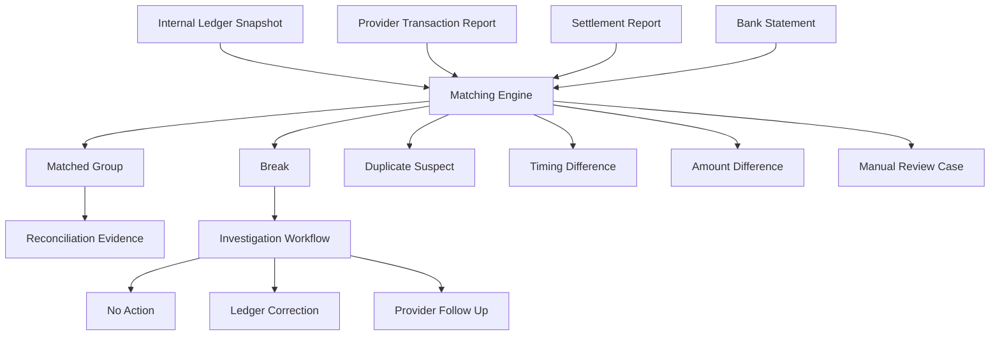
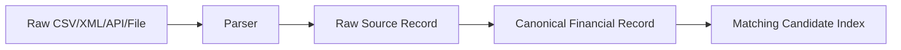
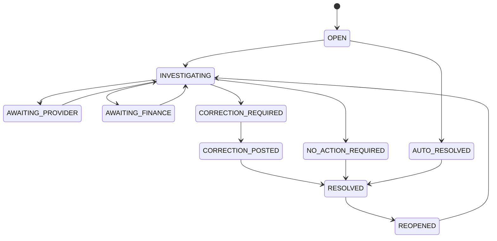
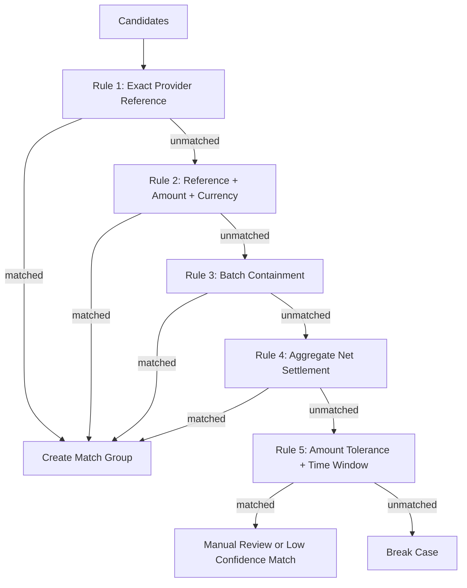
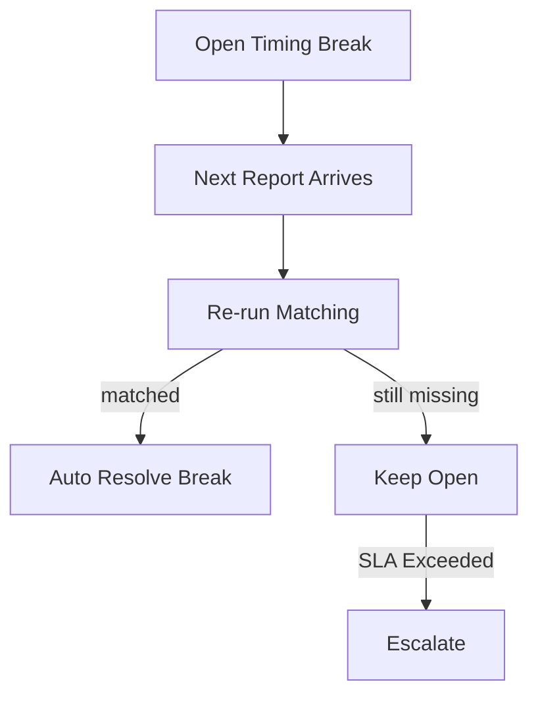
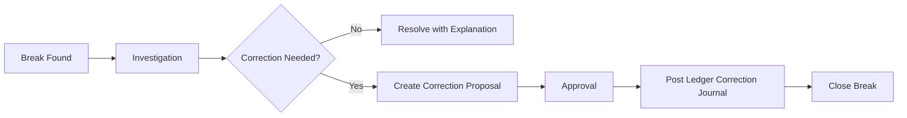
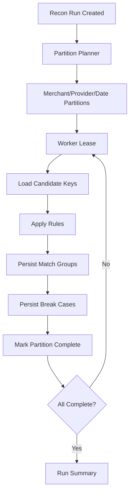

------
title: Build From Scratch: Large Production Grade Java Payment Systems - Part 049
description: Designing a reconciliation matching engine for production payment systems: exact matching, fuzzy matching, tolerances, many-to-one matching, break lifecycle, idempotent repair, and operational defensibility.
series: learn-java-payment-systems
seriesTitle: Build From Scratch: Large Production Grade Java Payment Systems
order: 49
partTitle: Reconciliation Matching Engine
tags:
- java
- payments
- reconciliation
- settlement
- ledger
- postgresql
- enterprise-architecture
date: 2026-07-02
------

# Part 049 — Reconciliation Matching Engine

> Payment system yang sehat bukan hanya bisa menerima pembayaran. Sistem yang sehat bisa menjawab pertanyaan ini setiap hari: **uang yang menurut ledger internal ada, apakah benar-benar muncul di provider report, settlement report, dan bank statement?**

Pada Part 048 kita membangun fondasi reconciliation: sumber data, normalized records, reconciliation run, match group, break, dan correction flow. Part ini masuk lebih dalam ke jantung reconciliation: **matching engine**.

Matching engine bukan sekadar `JOIN` antara tabel internal dan tabel provider. Di production, data eksternal hampir selalu punya variasi:

- reference berbeda,
- settlement delay,
- fee dipotong di tempat berbeda,
- refund/chargeback muncul sebagai baris terpisah,
- satu payout berisi banyak transaksi,
- satu transaksi punya banyak event lifecycle,
- amount bisa berbeda karena FX atau rounding,
- provider report bisa telat, duplicate, atau revised,
- bank statement sering hanya menampilkan aggregate settlement amount.

Kalau desain matching terlalu naif, hasilnya berbahaya: false match, missing break, double correction, atau adjustment manual yang tidak defensible.

Tujuan part ini: membangun matching engine yang deterministic, explainable, auditable, dan bisa diperbaiki tanpa merusak ledger.

---

## 1. Mental Model

Matching engine bertugas mengelompokkan evidence dari beberapa sumber menjadi satu kesimpulan finansial.



Matching engine bukan pemilik uang. Pemilik financial truth tetap ledger. Matching engine adalah **evidence correlation layer**.

Artinya:

- matching result tidak boleh langsung mengubah historical ledger entry;
- correction harus lewat journal baru;
- match decision harus punya rule version dan explanation;
- manual override harus meninggalkan audit trail;
- hasil matching harus reproducible untuk source file yang sama dan rule version yang sama.

---

## 2. Kenapa Matching Bukan Sekadar SQL Join

Bayangkan internal ledger punya record:

```text
payment_id       = pay_123
provider_ref     = psp_abc
merchant_id      = m_789
currency         = IDR
gross_amount     = 100000
fee_amount       = 2500
net_amount       = 97500
captured_at      = 2026-07-01T10:15:00+07:00
```

Provider settlement report mungkin berisi:

```text
psp_reference    = psp_abc
type             = Settled
currency         = IDR
gross_debit      = 0
gross_credit     = 100000
commission       = -2500
net_credit       = 97500
settlement_batch = ST20260702-A
```

Bank statement mungkin hanya berisi:

```text
date             = 2026-07-03
narrative        = SETTLEMENT PSP JUL02
credit_amount    = 482750000
```

Tidak ada satu key yang menyatukan semua data dari awal sampai akhir. Matching harus bergerak dari paling kuat ke paling lemah:

1. exact identity match;
2. reference + amount match;
3. batch containment match;
4. aggregate amount match;
5. temporal + amount tolerance match;
6. fuzzy narrative match;
7. manual evidence match.

Production rule: **jangan memakai fuzzy matching sebelum exact matching gagal**.

---

## 3. Source Record Canonicalization

Sebelum matching, semua sumber harus dinormalisasi ke bentuk canonical.



Canonical record minimal:

```sql
create table recon_source_record (
    id uuid primary key,
    source_system text not null,
    source_file_id uuid,
    source_record_hash text not null,
    parser_version text not null,

    record_type text not null,
    direction text not null check (direction in ('DEBIT', 'CREDIT', 'NEUTRAL')),

    merchant_id uuid,
    payment_id uuid,
    refund_id uuid,
    payout_id uuid,
    settlement_batch_id text,

    provider_reference text,
    provider_original_reference text,
    bank_reference text,
    scheme_reference text,
    external_reference text,

    currency char(3) not null,
    gross_amount_minor bigint,
    fee_amount_minor bigint,
    net_amount_minor bigint,
    tax_amount_minor bigint,

    event_time timestamptz,
    booking_date date,
    value_date date,

    raw_payload jsonb not null,
    normalized_payload jsonb not null,

    created_at timestamptz not null default now(),

    unique (source_system, source_record_hash)
);
```

Kenapa `source_record_hash` penting?

Karena report bisa diupload ulang. Tanpa hash deduplication, satu file yang sama bisa menghasilkan break palsu atau double match.

Hash harus dihitung dari bentuk yang stabil, misalnya:

```text
source_system + source_file_name + row_number + canonicalized_raw_row
```

Untuk provider yang sering meregenerasi report dengan urutan baris berubah, jangan bergantung hanya pada row number. Gunakan kombinasi field finansial dan reference.

---

## 4. Internal Snapshot

Matching engine sebaiknya tidak membaca langsung semua tabel operasional secara bebas. Buat snapshot internal khusus reconciliation.

```sql
create table recon_internal_record (
    id uuid primary key,
    snapshot_run_id uuid not null,

    ledger_journal_id uuid not null,
    ledger_account_id uuid not null,

    business_type text not null,
    business_id uuid not null,
    merchant_id uuid,

    provider_reference text,
    settlement_batch_id text,

    currency char(3) not null,
    gross_amount_minor bigint,
    fee_amount_minor bigint,
    net_amount_minor bigint not null,

    expected_settlement_date date,
    actual_settlement_date date,

    created_at timestamptz not null,

    unique (snapshot_run_id, ledger_journal_id, ledger_account_id)
);
```

Alasan snapshot:

- reconciliation harus reproducible;
- matching run tidak berubah saat ledger operasional berubah;
- audit bisa melihat data yang dipakai saat keputusan dibuat;
- matching bisa diulang dengan rule version berbeda tanpa mengubah source.

---

## 5. Match Group

Hasil matching harus disimpan sebagai group, bukan boolean di record.

```sql
create table recon_match_group (
    id uuid primary key,
    recon_run_id uuid not null,
    match_status text not null check (
        match_status in (
            'MATCHED',
            'PARTIAL_MATCH',
            'TIMING_DIFFERENCE',
            'AMOUNT_DIFFERENCE',
            'DUPLICATE_SUSPECT',
            'UNMATCHED_INTERNAL',
            'UNMATCHED_EXTERNAL',
            'MANUAL_REVIEW'
        )
    ),
    match_rule_id text not null,
    match_rule_version int not null,
    confidence_score numeric(6, 5) not null,
    explanation jsonb not null,
    created_at timestamptz not null default now()
);

create table recon_match_group_member (
    match_group_id uuid not null references recon_match_group(id),
    record_origin text not null check (record_origin in ('INTERNAL', 'SOURCE')),
    record_id uuid not null,
    role text not null,
    amount_contribution_minor bigint,
    primary key (match_group_id, record_origin, record_id)
);
```

Kenapa group?

Karena relasi reconciliation sering bukan 1:1:

- satu payout bank statement berisi ribuan payment;
- satu payment punya gross, fee, tax, settlement record terpisah;
- satu refund bisa settle di batch berbeda;
- provider adjustment bisa mengoreksi beberapa transaksi sekaligus;
- chargeback fee bisa muncul sebagai record terpisah.

---

## 6. Break Lifecycle

Break bukan sekadar `unmatched=true`. Break adalah case lifecycle.



Break harus punya:

- owner;
- severity;
- age;
- expected resolution path;
- evidence;
- manual note;
- approval if correction required;
- link ke ledger correction journal jika ada.

Schema:

```sql
create table recon_break_case (
    id uuid primary key,
    match_group_id uuid not null references recon_match_group(id),
    break_type text not null,
    severity text not null check (severity in ('LOW', 'MEDIUM', 'HIGH', 'CRITICAL')),
    status text not null,
    merchant_id uuid,
    currency char(3),
    amount_minor bigint,
    owner_team text,
    due_at timestamptz,
    resolution_type text,
    correction_journal_id uuid,
    explanation jsonb not null,
    created_at timestamptz not null default now(),
    updated_at timestamptz not null default now()
);
```

---

## 7. Matching Rule Pipeline

Matching harus berurutan dari confidence tertinggi ke confidence rendah.



Setiap rule harus deterministic.

Rule tidak boleh:

- tergantung urutan record tanpa sort stabil;
- berubah karena timezone lokal worker;
- memakai floating point;
- auto-match fuzzy dengan confidence rendah tanpa review;
- menghasilkan dua match group untuk record yang sama di run yang sama.

---

## 8. Exact Reference Match

Rule pertama: exact match dengan reference kuat.

Contoh:

```text
internal.provider_reference = source.provider_reference
internal.currency = source.currency
internal.net_amount_minor = source.net_amount_minor
```

SQL candidate query:

```sql
select
    i.id as internal_id,
    s.id as source_id
from recon_internal_record i
join recon_source_record s
  on s.provider_reference = i.provider_reference
 and s.currency = i.currency
 and s.net_amount_minor = i.net_amount_minor
where i.snapshot_run_id = :snapshotRunId
  and s.source_file_id = :sourceFileId
  and s.record_type in ('PAYMENT_SETTLED', 'CAPTURE_SETTLED')
  and not exists (
      select 1
      from recon_match_group_member m
      where m.record_origin = 'INTERNAL'
        and m.record_id = i.id
  )
  and not exists (
      select 1
      from recon_match_group_member m
      where m.record_origin = 'SOURCE'
        and m.record_id = s.id
  );
```

Rule ini confidence tinggi, tetapi tetap perlu guard:

- apakah reference duplicate di source?
- apakah amount sama?
- apakah currency sama?
- apakah record type compatible?
- apakah business lifecycle compatible?

Jika reference sama tapi amount berbeda, jangan match sebagai sukses. Buat `AMOUNT_DIFFERENCE`.

---

## 9. Reference Match Dengan Amount Difference

Amount difference harus diperlakukan eksplisit.

Contoh:

```text
internal net = 97,500
provider net = 97,450
selisih      = 50
```

Kemungkinan penyebab:

- fee schedule berubah;
- tax fee tidak dimodelkan;
- rounding fee salah;
- FX rounding;
- provider adjustment;
- internal ledger posting salah;
- source parser salah.

Schema explanation:

```json
{
  "rule": "REFERENCE_AMOUNT_DIFFERENCE",
  "providerReference": "psp_abc",
  "internalNetMinor": 97500,
  "sourceNetMinor": 97450,
  "differenceMinor": -50,
  "currency": "IDR",
  "possibleCauses": [
    "FEE_SCHEDULE_MISMATCH",
    "TAX_OR_ROUNDING_DIFFERENCE",
    "SOURCE_PARSER_MAPPING"
  ]
}
```

Production principle: **selisih kecil tidak otomatis aman**. Tolerance hanya boleh dipakai jika policy-nya jelas, tercatat, dan disetujui.

---

## 10. Time Window Matching

Tidak semua payment settle di tanggal yang sama.

Matching time window harus mempertimbangkan:

- provider timezone;
- merchant timezone;
- cut-off time;
- weekend/holiday;
- settlement delay;
- payment method;
- refund settlement delay;
- bank value date vs booking date.

Contoh rule:

```text
same merchant
same currency
same amount
provider event date within expected settlement date ± 3 business days
unique candidate only
```

Jangan auto-match jika ada banyak kandidat dengan amount sama.

```java
public enum TimeWindowMatchResult {
    UNIQUE_MATCH,
    MULTIPLE_CANDIDATES,
    NO_CANDIDATE,
    OUTSIDE_WINDOW
}
```

Untuk payment volume tinggi, amount yang sama sangat sering terjadi. `100000 IDR` bisa muncul ribuan kali. Time window matching tanpa reference kuat biasanya hanya boleh menghasilkan `MANUAL_REVIEW`, bukan `MATCHED`.

---

## 11. Many-to-One Matching

Settlement dan bank statement hampir selalu aggregate.

Contoh:

```text
Bank statement credit = 482,750,000 IDR
Provider batch ST20260702-A net total = 482,750,000 IDR
Internal ledger settled payable movement total = 482,750,000 IDR
```

Ini bukan 1:1. Ini many-to-one.

Schema group member mendukung hal ini:

```text
match_group_id = grp_1
members:
- INTERNAL: ledger batch total projection
- SOURCE: provider batch record
- SOURCE: bank statement line
```

Atau lebih detail:

```text
match_group_id = grp_2
members:
- INTERNAL: payment ledger record 1
- INTERNAL: payment ledger record 2
- INTERNAL: payment ledger record 3
- SOURCE: settlement batch line
```

Invariant:

```text
sum(internal net amount) == sum(source net amount)
```

Jika sumber memakai sign convention berbeda, normalisasi harus selesai sebelum matching.

---

## 12. One-to-Many Matching

Satu internal operation bisa menghasilkan beberapa external rows.

Contoh:

- capture gross amount;
- provider fee;
- scheme fee;
- tax on fee;
- reserve hold;
- rolling reserve release.

Internal ledger mungkin sudah memposting beberapa entry, tetapi source report memecahnya berbeda.

Matching rule harus mendukung decomposition:

```text
internal payment economic event
= provider gross row
+ provider fee row
+ tax row
+ reserve row
```

Jangan memaksa provider report menjadi shape internal. Bentuk canonical record harus fleksibel.

---

## 13. Fuzzy Matching

Fuzzy matching berguna untuk bank statement narrative, tetapi berbahaya jika dipakai sembarangan.

Contoh narrative:

```text
TRF SETTLEMENT PSP MERCHANT 123 JUL02
```

Bisa dicocokkan dengan:

- merchant short name;
- settlement date;
- amount;
- bank account;
- known PSP settlement descriptor;
- payout batch amount.

Fuzzy score harus explainable:

```json
{
  "rule": "BANK_NARRATIVE_FUZZY_MATCH",
  "score": 0.87,
  "features": {
    "amountExact": true,
    "dateWithinOneDay": true,
    "merchantDescriptorMatched": true,
    "bankAccountMatched": true,
    "batchReferenceMatched": false
  },
  "decision": "MANUAL_REVIEW"
}
```

Rule praktis:

- fuzzy match boleh membantu kandidat;
- fuzzy match tidak boleh auto-post correction;
- fuzzy match confidence rendah harus masuk review;
- fuzzy algorithm version harus disimpan.

---

## 14. Candidate Indexing

Matching bisa mahal. Jangan scan semua record.

Buat index table atau generated candidate keys.

```sql
create table recon_candidate_key (
    id uuid primary key,
    record_origin text not null,
    record_id uuid not null,
    key_type text not null,
    key_value text not null,
    currency char(3),
    amount_minor bigint,
    event_date date,
    merchant_id uuid,
    created_at timestamptz not null default now(),

    unique (record_origin, record_id, key_type, key_value)
);

create index idx_recon_candidate_key_lookup
on recon_candidate_key (key_type, key_value, currency, amount_minor);

create index idx_recon_candidate_amount_date
on recon_candidate_key (currency, amount_minor, event_date);
```

Candidate keys:

```text
PROVIDER_REFERENCE: psp_abc
BANK_REFERENCE: bank_123
SETTLEMENT_BATCH: ST20260702-A
MERCHANT_AMOUNT_DATE: m_789|IDR|97500|2026-07-02
NARRATIVE_TOKEN: PSP
```

Indexing strategy:

- exact keys for exact rules;
- amount/date keys for candidate generation;
- narrative tokens for fuzzy prefilter;
- merchant/currency partition for volume control.

---

## 15. Matching Rule Interface di Java

Rule harus reusable dan testable.

```java
public interface ReconciliationMatchRule {
    MatchRuleId id();
    int version();
    MatchRulePriority priority();
    boolean supports(ReconciliationContext context);
    MatchRuleResult evaluate(ReconciliationContext context, CandidateWindow candidates);
}
```

Result:

```java
public sealed interface MatchRuleResult permits
        MatchFound,
        PartialMatchFound,
        AmountDifferenceFound,
        DuplicateSuspectFound,
        NoMatchFound,
        RuleSkipped {
}

public record MatchFound(
        MatchRuleId ruleId,
        int ruleVersion,
        BigDecimal confidence,
        List<MatchMember> members,
        MatchExplanation explanation
) implements MatchRuleResult {
}
```

Explanation bukan optional.

```java
public record MatchExplanation(
        String summary,
        Map<String, Object> factors,
        List<String> warnings
) {
}
```

Tanpa explanation, hasil matching sulit diaudit.

---

## 16. Deterministic Rule Ordering

Matching engine harus menghindari hasil berbeda karena urutan data.

```java
public final class ReconciliationMatchingEngine {
    private final List<ReconciliationMatchRule> rules;

    public ReconciliationMatchingEngine(List<ReconciliationMatchRule> rules) {
        this.rules = rules.stream()
                .sorted(Comparator
                        .comparing((ReconciliationMatchRule r) -> r.priority().value())
                        .thenComparing(r -> r.id().value())
                        .thenComparingInt(ReconciliationMatchRule::version))
                .toList();
    }

    public MatchingRunResult run(ReconciliationContext context) {
        CandidateWindow candidates = loadCandidates(context);
        MatchingRunAccumulator accumulator = new MatchingRunAccumulator(context.runId());

        for (ReconciliationMatchRule rule : rules) {
            if (!rule.supports(context)) {
                continue;
            }
            MatchRuleResult result = rule.evaluate(context, candidates.remaining());
            accumulator.apply(result);
            candidates = candidates.removeMatchedMembers(result);
        }

        return accumulator.toResultWithBreaksForRemaining(candidates.remaining());
    }
}
```

Key point:

- rules sorted deterministically;
- matched records removed from candidate pool;
- remaining records become break candidates;
- run result immutable after completion;
- rerun creates new run, not overwrite old run.

---

## 17. Idempotency Matching Run

Reconciliation run harus idempotent.

Natural key:

```text
recon_period + merchant_scope + source_file_set_hash + rule_set_version
```

Schema:

```sql
create table recon_run (
    id uuid primary key,
    run_key text not null unique,
    period_start date not null,
    period_end date not null,
    merchant_scope text not null,
    source_file_set_hash text not null,
    rule_set_version text not null,
    status text not null,
    started_at timestamptz not null default now(),
    finished_at timestamptz
);
```

Jika run diulang dengan input dan rule sama, hasilnya harus sama.

Jika rule berubah, buat run baru dengan `rule_set_version` baru. Jangan rewrite hasil lama.

---

## 18. Duplicate Detection

Duplicate bisa muncul dari:

- source file upload ulang;
- provider report revised;
- same transaction appears in two reports;
- webhook generated ledger movement and report importer generated same correction;
- manual upload duplicate;
- provider reference reuse bug.

Rule duplicate:

```text
same source system
same provider reference
same record type
same currency
same amount
same event date
more than one source record
```

Result: `DUPLICATE_SUSPECT`, bukan matched.

Duplicate handling harus hati-hati. Kadang provider memang punya multiple rows untuk lifecycle event yang sama tetapi record type berbeda.

---

## 19. Timing Difference

Timing difference adalah record yang expected tetapi belum muncul karena settlement delay.

Contoh:

```text
internal expects settlement on 2026-07-02
provider report not received until 2026-07-03
bank payout arrives 2026-07-04
```

Jangan langsung buat loss adjustment.

Break type:

```text
TIMING_DIFFERENCE_PENDING_EXTERNAL
```

Auto-resolution job:



Timing break harus punya SLA berbeda per rail/payment method.

---

## 20. Amount Tolerance Policy

Tolerance harus policy-driven.

Contoh config:

```yaml
reconciliation:
  tolerancePolicies:
    - name: IDR_FEE_ROUNDING_SMALL
      currency: IDR
      maxAbsoluteMinor: 100
      allowedBreakTypes:
        - FEE_ROUNDING_DIFFERENCE
      autoResolve: false
      requiresApproval: true
    - name: USD_FX_ROUNDING_SMALL
      currency: USD
      maxAbsoluteMinor: 1
      allowedBreakTypes:
        - FX_ROUNDING_DIFFERENCE
      autoResolve: false
      requiresApproval: true
```

Jangan membuat global tolerance seperti:

```text
ignore all differences below 1000
```

Itu bisa menyembunyikan sistematis leakage.

---

## 21. Reconciliation Break Severity

Severity bukan hanya berdasarkan amount.

Faktor severity:

- amount absolute;
- repeated pattern;
- merchant tier;
- payment method;
- direction of difference;
- source trust level;
- age;
- financial statement impact;
- regulatory/compliance impact;
- possible fraud indicator.

Example rule:

```java
public BreakSeverity classify(ReconciliationBreak b) {
    if (b.amount().abs().greaterThan(Money.ofMinor("IDR", 100_000_000))) {
        return BreakSeverity.CRITICAL;
    }
    if (b.type() == BreakType.UNMATCHED_BANK_DEBIT) {
        return BreakSeverity.HIGH;
    }
    if (b.age().toDays() > 3 && b.amount().abs().greaterThan(Money.ofMinor("IDR", 10_000_000))) {
        return BreakSeverity.HIGH;
    }
    if (b.pattern().isRecurring()) {
        return BreakSeverity.MEDIUM;
    }
    return BreakSeverity.LOW;
}
```

---

## 22. Manual Match

Manual matching harus dibatasi.

Operator boleh mengusulkan match jika:

- record candidates jelas;
- explanation diberikan;
- evidence attach tersedia;
- maker-checker approval untuk amount material;
- system validates sum/currency compatibility;
- result masuk audit trail.

Manual match command:

```json
{
  "commandId": "cmd_123",
  "action": "CREATE_MANUAL_MATCH",
  "internalRecordIds": ["..."],
  "sourceRecordIds": ["..."],
  "reasonCode": "BANK_NARRATIVE_CONFIRMED_BY_PROVIDER_EMAIL",
  "operatorNote": "Provider confirmed batch ST20260702-A corresponds to bank line 2026-07-03.",
  "evidenceIds": ["ev_1"]
}
```

System validation:

```text
same currency
sum amounts compatible
records not already matched in active run
operator has permission
approval required if threshold exceeded
```

---

## 23. Correction Is Not Matching

Matching mengidentifikasi perbedaan. Correction memperbaiki ledger melalui journal baru.

Jangan gabungkan keduanya.



Correction proposal harus punya:

- correction type;
- affected account;
- debit/credit entries;
- source evidence;
- reason code;
- approval record;
- idempotency key.

---

## 24. Performance Architecture

Reconciliation bisa besar: jutaan rows per hari.

Strategi:

1. partition by reconciliation period;
2. shard by merchant or provider;
3. precompute candidate keys;
4. run exact matching first;
5. remove matched rows early;
6. fuzzy matching only on reduced candidate pool;
7. write result in batches;
8. keep run immutable;
9. use worker leasing for partitions;
10. expose progress per partition.

Schema partition example:

```sql
create table recon_source_record_2026_07
partition of recon_source_record
for values from ('2026-07-01') to ('2026-08-01');
```

Untuk PostgreSQL, partitioning harus didesain berdasarkan access pattern, bukan karena “tabel besar”. Jika query selalu filter by period, partition by period masuk akal. Jika query dominan per merchant, tambahkan index merchant/currency/date.

---

## 25. Worker Model



Worker lease schema:

```sql
create table recon_run_partition (
    id uuid primary key,
    recon_run_id uuid not null,
    partition_key text not null,
    status text not null,
    lease_owner text,
    lease_until timestamptz,
    attempt_count int not null default 0,
    started_at timestamptz,
    finished_at timestamptz,
    unique (recon_run_id, partition_key)
);
```

Use `FOR UPDATE SKIP LOCKED` untuk claim partition, tetapi tetap gunakan fencing token/lease expiry agar worker mati tidak menahan pekerjaan selamanya.

---

## 26. Observability

Metrics:

```text
recon_run_total
recon_run_duration_seconds
recon_match_rate
recon_auto_match_rate
recon_manual_review_rate
recon_break_count_by_type
recon_break_amount_by_currency
recon_break_age_seconds
recon_duplicate_source_record_count
recon_amount_difference_total
recon_unmatched_bank_debit_total
recon_rule_execution_duration_seconds
recon_fuzzy_candidate_count
```

Dashboards:

- match rate per provider;
- break aging;
- break amount by currency;
- unmatched bank debit;
- provider report completeness;
- source parser failure;
- high confidence vs low confidence matches;
- manual override volume;
- correction journal amount.

Alert examples:

```text
critical if unmatched bank debit > threshold
critical if break amount total exceeds materiality threshold
warning if match rate drops below baseline
warning if provider report missing after cutoff SLA
warning if duplicate source records spike
```

---

## 27. Testing Strategy

Unit tests are not enough. Matching engine needs scenario/property tests.

Test categories:

1. exact 1:1 match;
2. reference same amount different currency;
3. reference same different amount;
4. duplicate provider row;
5. many internal records to one settlement batch;
6. one internal record to multiple fee rows;
7. bank statement aggregate match;
8. timing difference auto-resolves next day;
9. fuzzy narrative produces manual review;
10. tolerance threshold exceeded;
11. old run remains immutable after rule update;
12. manual match requires approval;
13. correction journal is idempotent;
14. source file upload duplicate;
15. parser version change creates new normalized records.

Property invariant:

```text
For every MATCHED group:
    sum(normalized internal amount by currency) == sum(normalized source amount by currency)
except if match_status explicitly records AMOUNT_DIFFERENCE.
```

Another invariant:

```text
A record cannot belong to two active MATCHED groups for the same reconciliation run.
```

---

## 28. Anti-Patterns

### Anti-pattern 1: Auto-correct on first unmatched record

Unmatched does not always mean ledger wrong. It might be late provider report.

### Anti-pattern 2: Fuzzy match langsung dianggap settled

Fuzzy match is candidate discovery, not financial truth.

### Anti-pattern 3: Correction mengupdate ledger entry lama

Ledger harus immutable. Correction adalah journal baru.

### Anti-pattern 4: Ignore small differences

Small repeated leakage can become material.

### Anti-pattern 5: Tidak menyimpan rule version

Tanpa rule version, hasil reconciliation tidak bisa dijelaskan ulang.

### Anti-pattern 6: Manual match tanpa approval

Manual match bisa menyembunyikan fraud, operational mistake, atau reconciliation gap.

### Anti-pattern 7: Bank statement dianggap cukup untuk transaction-level truth

Bank statement sering aggregate. Transaction-level truth biasanya butuh provider/settlement report.

---

## 29. Minimal Build Plan

Urutan implementasi yang masuk akal:

1. source file registry;
2. parser + raw source record;
3. canonical source record;
4. internal ledger snapshot;
5. candidate key generator;
6. exact reference matching;
7. amount difference matching;
8. unmatched break generation;
9. match group persistence;
10. break case workflow;
11. many-to-one settlement batch matching;
12. bank statement aggregate matching;
13. manual match with audit;
14. correction proposal;
15. dashboard and alerting;
16. fuzzy candidate search.

Jangan mulai dari fuzzy matching. Mulai dari deterministic exact matching.

---

## 30. Checklist

Matching engine production-ready jika:

- [ ] source records deduplicated dengan stable hash;
- [ ] parser version disimpan;
- [ ] internal snapshot immutable;
- [ ] match group mendukung 1:1, 1:N, N:1, N:M;
- [ ] rule punya ID, version, priority, explanation;
- [ ] exact matching jalan sebelum fuzzy matching;
- [ ] amount difference tidak disembunyikan;
- [ ] timing difference punya SLA;
- [ ] manual match butuh audit dan approval;
- [ ] correction dilakukan lewat ledger journal baru;
- [ ] run idempotent berdasarkan source set + rule version;
- [ ] hasil lama tidak dioverwrite;
- [ ] unmatched bank debit alerting aktif;
- [ ] duplicate source record terdeteksi;
- [ ] break aging dipantau;
- [ ] property tests menjaga invariant match group.

---

## 31. Referensi

- Stripe Docs — Payout reconciliation report: `https://docs.stripe.com/reports/payout-reconciliation`
- Stripe Docs — Balance summary report: `https://docs.stripe.com/reports/balance`
- Adyen Docs — Settlement details report: `https://docs.adyen.com/reporting/settlement-reconciliation/transaction-level/settlement-details-report`
- Adyen Docs — Payment accounting report: `https://docs.adyen.com/reporting/invoice-reconciliation/payment-accounting-report`
- ISO 20022 — Message Definitions Catalogue: `https://www.iso20022.org/iso-20022-message-definitions`
- PostgreSQL Docs — Constraints: `https://www.postgresql.org/docs/current/ddl-constraints.html`
- PostgreSQL Docs — Explicit Locking: `https://www.postgresql.org/docs/current/explicit-locking.html`

---

## Penutup

Matching engine adalah tempat payment platform belajar jujur terhadap dirinya sendiri.

API bisa sukses. Webhook bisa diterima. Ledger bisa balanced. Tetapi sampai reconciliation membuktikan bahwa internal ledger cocok dengan provider, settlement, dan bank statement, sistem belum punya bukti kuat bahwa uang benar-benar bergerak sesuai ekspektasi.

Part berikutnya masuk ke **settlement engine**: bagaimana matched/settled obligation dikonversi menjadi payout batch, merchant payable, reserve, cutoff, netting, dan settlement execution yang aman.
