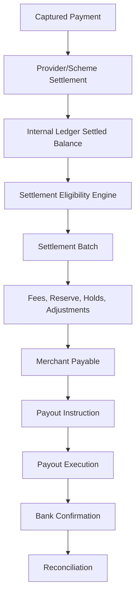
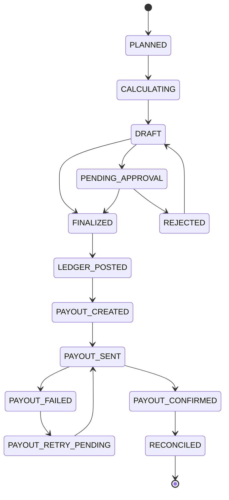
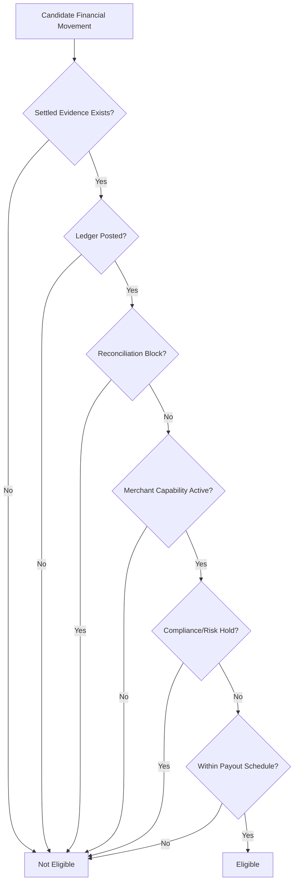
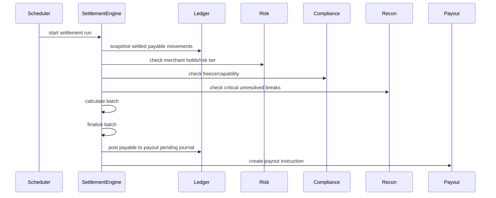

------
title: Build From Scratch: Large Production Grade Java Payment Systems - Part 050
description: Building a settlement engine for production payment platforms: cutoff, eligibility, netting, merchant payable, fees, reserve, negative balance, payout batch, ledger posting, controls, and operational safety.
series: learn-java-payment-systems
seriesTitle: Build From Scratch: Large Production Grade Java Payment Systems
order: 50
partTitle: Settlement Engine
tags:
- java
- payments
- settlement
- payout
- ledger
- reconciliation
- enterprise-architecture
date: 2026-07-02
------

# Part 050 — Settlement Engine

> Payment platform bukan hanya menerima uang. Ia harus bisa menentukan **kapan**, **berapa**, **kepada siapa**, dan **dengan bukti apa** uang hasil transaksi boleh dibayarkan.

Settlement engine adalah subsystem yang mengubah payment activity menjadi merchant payable dan payout instruction.

Di platform kecil, settlement sering dianggap laporan harian:

```text
sum(success payments) - fees - refunds = transfer to merchant
```

Di production, formula itu tidak cukup.

Settlement harus mempertimbangkan:

- capture yang belum settled;
- refund yang terjadi sebelum/after settlement;
- chargeback;
- rolling reserve;
- merchant risk hold;
- payout schedule;
- cutoff time;
- holiday calendar;
- multi-currency;
- fees/tax;
- minimum payout amount;
- negative balance;
- pending reconciliation break;
- compliance freeze;
- bank account verification;
- payout provider failure;
- settlement report evidence;
- manual approval threshold.

Settlement engine adalah **financial control engine**. Kesalahannya langsung menjadi salah bayar, telat bayar, bayar ganda, atau membayar merchant yang seharusnya ditahan.

---

## 1. Mental Model

Settlement bukan payment success. Settlement adalah proses mengubah settled funds menjadi payable obligation.



Important distinction:

```text
Payment success != settled funds
Settled funds != available for payout
Available for payout != payout sent
Payout sent != bank credited
```

Setiap tahap punya ledger effect dan evidence berbeda.

---

## 2. Settlement Engine Scope

Settlement engine bertanggung jawab untuk:

1. menentukan transaction mana eligible untuk settlement batch;
2. menghitung merchant net payable;
3. menerapkan fee, tax, reserve, hold, adjustment;
4. membentuk settlement batch;
5. mengunci batch agar immutable setelah finalisasi;
6. memposting ledger movement dari settled ke payable/payout pending;
7. membuat payout instruction;
8. menghubungkan payout dengan reconciliation;
9. menghasilkan statement basis untuk merchant;
10. menyediakan operational controls.

Settlement engine **tidak** bertanggung jawab untuk:

- authorization;
- capture request ke card processor;
- webhook ingestion;
- fraud scoring awal;
- parsing settlement file;
- bank transfer execution detail;
- dispute evidence upload.

Tetapi settlement engine mengonsumsi output dari semua itu.

---

## 3. Core Terms

| Term | Meaning |
|---|---|
| Settlement | Proses mengakui dana sebagai settled/available menurut provider, scheme, atau bank rail. |
| Merchant payable | Kewajiban platform kepada merchant. |
| Payout | Instruksi aktual untuk mengirim dana ke bank/wallet merchant. |
| Cutoff | Batas waktu transaksi masuk batch settlement tertentu. |
| Netting | Menggabungkan credit/debit/fee/refund/chargeback/adjustment menjadi nilai net payable. |
| Reserve | Dana merchant yang ditahan sebagai mitigasi risk/chargeback/refund. |
| Hold | Penahanan dana karena risk/compliance/ops. |
| Release | Pengembalian dana dari reserve/hold ke available payable. |
| Negative balance | Kondisi merchant berutang ke platform karena refund/chargeback/fee melebihi payable. |
| Settlement batch | Unit immutable yang menjelaskan settlement calculation untuk period/scope tertentu. |

---

## 4. Settlement State Machine



Invariant penting:

- batch `FINALIZED` tidak boleh berubah komposisi;
- kalau ada salah hitung setelah finalized, buat adjustment batch berikutnya;
- ledger posting harus idempotent;
- payout instruction harus punya unique key;
- failed payout tidak boleh membuat dana hilang;
- retry payout harus memakai idempotency dan provider operation log.

---

## 5. Settlement Calendar dan Cutoff

Settlement membutuhkan calendar.

```sql
create table settlement_calendar (
    id uuid primary key,
    country_code char(2) not null,
    currency char(3) not null,
    calendar_date date not null,
    is_business_day boolean not null,
    holiday_name text,
    cutoff_time_local time,
    timezone text not null,
    unique (country_code, currency, calendar_date)
);
```

Cutoff bukan hanya jam.

Cutoff dipengaruhi:

- provider settlement schedule;
- payment method;
- currency;
- merchant payout schedule;
- bank holiday;
- risk hold policy;
- reconciliation readiness;
- payout provider processing window.

Example:

```text
Card payments captured before 23:00 Asia/Jakarta settle T+1 business day.
QR payments confirmed before 21:00 settle T+1.
High-risk merchant payout delayed T+7.
Merchant with unresolved critical break cannot payout automatically.
```

---

## 6. Settlement Eligibility

Transaction eligible untuk settlement jika memenuhi semua gates.



Eligibility should be explainable:

```json
{
  "paymentId": "pay_123",
  "eligible": false,
  "reasons": [
    {
      "code": "RISK_HOLD_ACTIVE",
      "details": "Merchant risk tier requires T+7 payout delay. Available on 2026-07-09."
    }
  ]
}
```

No silent exclusion. If a transaction is not in settlement batch, finance/ops must know why.

---

## 7. Candidate Source

Settlement engine should consume ledger/projection, not raw API success table.

Candidate query source:

```text
merchant settled payable movements
minus already batched movements
plus eligible adjustment movements
minus blocked/held movements
```

Schema:

```sql
create table settlement_candidate_snapshot (
    id uuid primary key,
    settlement_run_id uuid not null,
    merchant_id uuid not null,
    business_type text not null,
    business_id uuid not null,
    ledger_journal_id uuid not null,
    currency char(3) not null,
    gross_amount_minor bigint not null,
    fee_amount_minor bigint not null,
    tax_amount_minor bigint not null,
    net_amount_minor bigint not null,
    event_time timestamptz not null,
    expected_available_date date not null,
    eligibility_status text not null,
    eligibility_explanation jsonb not null,
    created_at timestamptz not null default now(),
    unique (settlement_run_id, ledger_journal_id)
);
```

Snapshot again matters: settlement calculation must be reproducible.

---

## 8. Settlement Batch Schema

```sql
create table settlement_batch (
    id uuid primary key,
    batch_key text not null unique,
    merchant_id uuid not null,
    currency char(3) not null,
    period_start timestamptz not null,
    period_end timestamptz not null,
    cutoff_at timestamptz not null,
    status text not null,
    calculation_version text not null,
    gross_amount_minor bigint not null,
    fee_amount_minor bigint not null,
    tax_amount_minor bigint not null,
    reserve_hold_minor bigint not null,
    reserve_release_minor bigint not null,
    adjustment_amount_minor bigint not null,
    net_payable_minor bigint not null,
    payout_amount_minor bigint not null,
    created_at timestamptz not null default now(),
    finalized_at timestamptz
);

create table settlement_batch_item (
    id uuid primary key,
    settlement_batch_id uuid not null references settlement_batch(id),
    candidate_snapshot_id uuid not null,
    business_type text not null,
    business_id uuid not null,
    ledger_journal_id uuid not null,
    currency char(3) not null,
    gross_amount_minor bigint not null,
    fee_amount_minor bigint not null,
    tax_amount_minor bigint not null,
    net_amount_minor bigint not null,
    item_type text not null,
    explanation jsonb not null,
    unique (settlement_batch_id, candidate_snapshot_id)
);
```

`batch_key` example:

```text
merchant_id + currency + period_start + period_end + cutoff_at + calculation_version
```

Natural key mencegah double batch untuk scope yang sama.

---

## 9. Netting Model

Settlement netting menghitung payout amount dari banyak movement.

```text
payout_amount
= settled payments
- provider/platform fees
- tax on fees
- refunds funded by merchant
- chargebacks
- chargeback fees
- reserve holds
+ reserve releases
+ manual credits
- manual debits
- negative balance recovery
```

Dalam ledger, ini bukan satu update angka. Ini rangkaian journal movement.

Example settlement batch:

```text
Gross payment settled       +100,000,000
Platform fee                 -2,500,000
Tax on fee                    -275,000
Refunds                      -4,000,000
Chargebacks                  -1,000,000
Reserve hold                 -5,000,000
Reserve release              +1,500,000
Manual adjustment credit       +250,000
----------------------------------------
Payout amount                88,975,000
```

Setiap komponen harus traceable ke source movement.

---

## 10. Reserve Handling

Reserve adalah liability yang ditahan, bukan revenue.

Reserve types:

- rolling reserve percentage;
- fixed reserve;
- risk hold reserve;
- dispute reserve;
- refund reserve;
- compliance freeze;
- merchant-specific collateral.

Reserve hold posting:

```text
Debit  Merchant Settled Payable
Credit Merchant Reserve Liability
```

Reserve release posting:

```text
Debit  Merchant Reserve Liability
Credit Merchant Available Payable
```

Schema:

```sql
create table merchant_reserve_policy (
    id uuid primary key,
    merchant_id uuid not null,
    policy_version int not null,
    reserve_type text not null,
    percentage_bps int,
    fixed_amount_minor bigint,
    currency char(3),
    hold_days int,
    effective_from timestamptz not null,
    effective_to timestamptz,
    created_at timestamptz not null default now()
);
```

Reserve policy version harus disimpan di settlement item explanation. Jangan menghitung ulang batch lama dengan policy baru.

---

## 11. Negative Balance

Negative balance terjadi ketika merchant liability kepada platform lebih besar daripada payable yang tersedia.

Penyebab:

- refund setelah payout;
- chargeback setelah payout;
- fee adjustment;
- payout reversal;
- provider debit;
- fraud loss recovery.

Policy options:

1. recover from next settlement;
2. debit merchant bank account;
3. freeze payouts;
4. require top-up;
5. write off after approval;
6. recover from reserve.

Ledger principle:

```text
Negative balance is not hidden.
It is explicit receivable from merchant.
```

Posting example:

```text
Debit  Merchant Receivable
Credit Platform Cash/Settlement Clearing
```

Settlement engine should include recovery line:

```text
settled_payable = 10,000,000
negative_balance_recovery = -3,000,000
payout_amount = 7,000,000
remaining_receivable = 0
```

---

## 12. Minimum Payout and Carry Forward

Many systems should avoid tiny payouts.

Policy:

```yaml
minimumPayout:
  IDR: 50000
  USD: 1000
```

If payout amount below threshold:

```text
Do not payout.
Carry forward available payable.
```

Do not create fake payout. Create settlement batch with status `CARRIED_FORWARD` or include item in next eligible batch, depending on statement policy.

Merchant statement must clearly explain carry forward.

---

## 13. Payout Schedule

Merchant payout schedule examples:

- daily T+1;
- weekly every Monday;
- monthly;
- manual payout only;
- instant payout if eligible;
- delayed payout by risk tier;
- suspended payout.

Schema:

```sql
create table merchant_payout_schedule (
    id uuid primary key,
    merchant_id uuid not null,
    schedule_type text not null,
    timezone text not null,
    payout_day_of_week int,
    payout_day_of_month int,
    delay_business_days int not null default 0,
    minimum_amount_minor bigint not null default 0,
    currency char(3) not null,
    active boolean not null,
    effective_from timestamptz not null,
    effective_to timestamptz
);
```

Schedule decision must be separate from amount calculation.

---

## 14. Settlement Run Flow



Do not call payout provider before ledger posting succeeds.

Preferred boundary:

```text
finalize settlement batch + ledger posting + outbox event in one DB transaction
payout service consumes outbox event
payout execution happens asynchronously
```

---

## 15. Ledger Posting for Settlement

Simplified account model:

```text
Merchant Settled Payable
Merchant Available Payable
Merchant Reserve Liability
Merchant Payout Pending
Platform Revenue
Tax Payable
Merchant Receivable
Bank Clearing
```

Settlement finalization can post:

```text
Debit  Merchant Available Payable
Credit Merchant Payout Pending
```

For fees already deducted at capture time, avoid double fee posting. Settlement should only move balances between buckets. If fees are calculated at settlement time, post fee journals then.

Posting rule must know where fee was recognized.

Bad design:

```text
charge fee at capture
charge fee again at settlement
```

Correct design:

```text
fee calculation evidence says fee already recognized at capture
settlement only nets available payable
```

---

## 16. Settlement Calculation Service

```java
public final class SettlementCalculationService {
    private final EligibilityService eligibilityService;
    private final FeeProjectionService feeProjectionService;
    private final ReservePolicyService reservePolicyService;
    private final NegativeBalanceService negativeBalanceService;

    public SettlementDraft calculate(SettlementRunContext context,
                                     List<SettlementCandidate> candidates) {
        List<SettlementItem> items = new ArrayList<>();

        for (SettlementCandidate candidate : candidates) {
            EligibilityDecision eligibility = eligibilityService.evaluate(context, candidate);
            if (!eligibility.eligible()) {
                items.add(SettlementItem.excluded(candidate, eligibility.explanation()));
                continue;
            }

            ReserveDecision reserve = reservePolicyService.calculate(context, candidate);
            items.add(SettlementItem.included(candidate, reserve));
        }

        NegativeBalanceRecovery recovery = negativeBalanceService.calculateRecovery(context);
        SettlementTotals totals = SettlementTotals.from(items, recovery);

        return new SettlementDraft(
                context.runId(),
                context.merchantId(),
                context.currency(),
                items,
                recovery,
                totals
        );
    }
}
```

Important:

- calculation is pure-ish;
- all external decisions are snapshotted;
- output includes excluded items with reasons;
- totals are derived from items;
- finalization persists immutable batch.

---

## 17. Finalization Transaction

Finalization must be atomic.

Pseudo-flow:

```java
@Transactional
public FinalizedSettlementBatch finalizeBatch(FinalizeSettlementCommand command) {
    SettlementDraft draft = settlementDraftRepository.lock(command.draftId());

    draft.assertFinalizable();
    draft.assertCommandMatchesFingerprint(command.fingerprint());

    SettlementBatch batch = settlementBatchRepository.createFinalizedBatch(draft);

    LedgerJournal journal = ledgerPostingService.postSettlementFinalization(
            batch.toLedgerPostingCommand(command.idempotencyKey())
    );

    outbox.publish(new SettlementBatchFinalizedEvent(batch.id(), journal.id()));

    audit.record(command.actor(), "SETTLEMENT_BATCH_FINALIZED", batch.id());

    return batch.markLedgerPosted(journal.id());
}
```

Use lock because two operators/workers could finalize the same draft.

Database constraints:

```sql
create unique index ux_settlement_batch_finalized_scope
on settlement_batch (merchant_id, currency, period_start, period_end, cutoff_at)
where status in ('FINALIZED', 'LEDGER_POSTED', 'PAYOUT_CREATED', 'PAYOUT_SENT', 'PAYOUT_CONFIRMED');
```

---

## 18. Idempotency

Settlement commands needing idempotency:

- create run;
- calculate draft;
- finalize batch;
- post settlement ledger;
- create payout instruction;
- retry payout;
- cancel failed payout;
- manual adjustment;
- reserve release.

Key examples:

```text
settlement-run:{merchant}:{currency}:{period}:{calculationVersion}
settlement-finalize:{batchId}:{draftFingerprint}
settlement-ledger-post:{batchId}
payout-create:{batchId}
reserve-release:{reserveHoldId}:{releaseDate}
```

If retry command has same key but different fingerprint, reject it.

---

## 19. Risk and Compliance Holds

Settlement engine must ask: **is this payable allowed to leave?**

Holds:

- merchant under review;
- sanctions/compliance freeze;
- risk tier payout delay;
- fraud spike;
- unresolved critical reconciliation break;
- negative balance threshold;
- bank account not verified;
- capability disabled;
- manual payout suspension.

Hold schema:

```sql
create table merchant_funds_hold (
    id uuid primary key,
    merchant_id uuid not null,
    hold_type text not null,
    currency char(3),
    amount_minor bigint,
    applies_to text not null,
    status text not null,
    reason_code text not null,
    explanation jsonb not null,
    created_by text not null,
    approved_by text,
    created_at timestamptz not null default now(),
    released_at timestamptz
);
```

If hold is amount-specific, settlement can payout remainder. If hold is merchant-wide, settlement should exclude all payout.

---

## 20. Merchant Statement Basis

Settlement batch should be sufficient to generate merchant statement.

Statement sections:

- opening balance;
- payments;
- refunds;
- chargebacks;
- fees;
- tax;
- reserves held;
- reserves released;
- adjustments;
- negative balance recovery;
- carried forward;
- payout amount;
- closing balance.

Do not generate statement from ad-hoc queries that differ from settlement batch. The batch is the statement basis.

---

## 21. Settlement and Reconciliation Interaction

Settlement should not depend on perfect transaction-level reconciliation for every case, but it must respect material breaks.

Policy examples:

```yaml
settlementControls:
  blockIfUnmatchedBankDebit: true
  blockIfCriticalBreakAmountExceedsMinor: 100000000
  allowTimingDifferenceBelowDays: 2
  allowProviderReportMissingForLowRiskMerchant: false
```

Possible decisions:

- allow settlement;
- allow with reserve increase;
- delay settlement;
- exclude specific items;
- require manual approval;
- block merchant payout.

Every decision must be explainable.

---

## 22. Payout Creation

Settlement batch creates payout instruction, not direct bank transfer inside settlement transaction.

```sql
create table payout_instruction (
    id uuid primary key,
    settlement_batch_id uuid not null unique,
    merchant_id uuid not null,
    beneficiary_id uuid not null,
    currency char(3) not null,
    amount_minor bigint not null,
    status text not null,
    idempotency_key text not null unique,
    created_at timestamptz not null default now()
);
```

Payout service then executes:

```text
PAYOUT_CREATED -> PAYOUT_SUBMITTED -> PAYOUT_CONFIRMED
or
PAYOUT_CREATED -> PAYOUT_SUBMITTED -> PAYOUT_FAILED
```

Failed payout should move funds back from payout pending to available payable or keep them pending retry depending on failure class.

---

## 23. Failed Payout

Failure types:

| Failure | Meaning | Settlement Effect |
|---|---|---|
| Validation failure | beneficiary invalid | return to available payable, require merchant update |
| Provider timeout | unknown outcome | keep payout pending, inquire/reconcile |
| Bank rejection | payout failed | return to available payable or hold |
| Compliance block | payout rejected | freeze funds |
| Duplicate suspected | possible double-send | stop retry, investigate |

Unknown payout outcome is dangerous. Do not create a second payout immediately.

Use provider inquiry and bank reconciliation.

---

## 24. Multi-Currency Settlement

Never net different currencies unless FX conversion is explicit.

Bad:

```text
IDR payable + USD payable = one payout amount
```

Correct:

```text
currency-specific settlement batch
or
explicit FX conversion journal with rate evidence
```

FX conversion needs:

- rate source;
- rate timestamp;
- quote id;
- spread/fee;
- rounding rule;
- settlement currency;
- original currency;
- realized gain/loss handling.

---

## 25. Concurrency Risks

Risks:

- two settlement runs include same journal;
- batch finalized twice;
- payout created twice;
- candidate added after cutoff included inconsistently;
- reserve policy changes during calculation;
- manual hold added during finalization;
- negative balance changes during batch calculation.

Controls:

- candidate snapshot;
- unique constraints on batch scope;
- lock merchant settlement account during finalization;
- policy version snapshot;
- command fingerprint;
- idempotency key;
- outbox event;
- ledger posting idempotency;
- final pre-flight hold check.

---

## 26. Settlement Read API

Finance/ops need explainability.

Example endpoint:

```http
GET /settlement-batches/{batchId}
```

Response shape:

```json
{
  "id": "setbat_123",
  "merchantId": "m_789",
  "currency": "IDR",
  "periodStart": "2026-07-01T00:00:00+07:00",
  "periodEnd": "2026-07-02T00:00:00+07:00",
  "status": "PAYOUT_CREATED",
  "totals": {
    "grossAmountMinor": 100000000,
    "feeAmountMinor": -2500000,
    "taxAmountMinor": -275000,
    "reserveHoldMinor": -5000000,
    "reserveReleaseMinor": 1500000,
    "adjustmentAmountMinor": 250000,
    "netPayableMinor": 88975000,
    "payoutAmountMinor": 88975000
  },
  "controls": {
    "riskHoldApplied": false,
    "complianceFreezeApplied": false,
    "manualApprovalRequired": true,
    "approvalStatus": "APPROVED"
  }
}
```

---

## 27. Operational Dashboard

Settlement dashboard harus menampilkan:

- batches due today;
- calculated but not finalized;
- pending approval;
- blocked by risk/compliance;
- carried forward due minimum payout;
- payout created but not confirmed;
- failed payout;
- merchant negative balance;
- settlement amount by currency;
- reserve held/released;
- reconciliation breaks blocking settlement;
- SLA breached.

Metrics:

```text
settlement_batch_total
settlement_batch_amount_minor
settlement_batch_duration_seconds
settlement_blocked_by_risk_total
settlement_blocked_by_compliance_total
settlement_pending_approval_total
settlement_payout_created_total
settlement_payout_failed_total
settlement_negative_balance_recovery_minor
settlement_reserve_hold_minor
settlement_reserve_release_minor
```

---

## 28. Testing Matrix

Critical scenarios:

1. normal daily settlement;
2. payment captured but not settled;
3. refund before settlement;
4. refund after payout;
5. chargeback after payout;
6. rolling reserve hold;
7. reserve release after hold days;
8. merchant risk hold blocks payout;
9. compliance freeze blocks all funds;
10. bank account unverified;
11. negative balance recovery;
12. minimum payout carry forward;
13. duplicate settlement run command;
14. concurrent finalization;
15. payout creation retry;
16. payout provider timeout;
17. failed payout returns funds safely;
18. policy version changes after draft;
19. multi-currency settlement separated;
20. unresolved critical recon break blocks settlement.

Property invariant:

```text
No eligible ledger movement may be included in more than one finalized settlement batch.
```

Another invariant:

```text
For each finalized batch:
    payout_amount = payments - fees - tax - refunds - chargebacks - reserve_holds + reserve_releases + adjustments - negative_balance_recovery
```

But in implementation, compute from itemized entries, not from manually entered totals.

---

## 29. Anti-Patterns

### Anti-pattern 1: Settlement dari `payment.status = SUCCESS`

Payment success tidak sama dengan settled funds.

### Anti-pattern 2: Mutable finalized batch

Jika finalized batch bisa diedit, finance tidak punya historical truth.

### Anti-pattern 3: Payout langsung di settlement transaction

Remote bank/provider call tidak boleh berada dalam DB transaction.

### Anti-pattern 4: Fee dihitung ulang tanpa version

Batch lama bisa berubah jika pricing plan berubah.

### Anti-pattern 5: Negative balance disembunyikan sebagai zero payout

Merchant receivable harus eksplisit.

### Anti-pattern 6: Reserve dianggap revenue

Reserve adalah liability/hold, bukan pendapatan.

### Anti-pattern 7: Tidak ada explanation untuk excluded item

Merchant/finance akan melihat “uang hilang” karena item tidak muncul di settlement.

### Anti-pattern 8: Multi-currency netting tanpa FX journal

Ini merusak accounting dan reconciliation.

---

## 30. Minimal Build Plan

Bangun settlement engine bertahap:

1. merchant payout schedule;
2. settlement candidate snapshot dari ledger;
3. eligibility engine;
4. settlement draft calculation;
5. immutable settlement batch;
6. settlement ledger posting;
7. payout instruction creation via outbox;
8. failed payout handling;
9. reserve hold/release;
10. negative balance recovery;
11. manual approval workflow;
12. reconciliation break gate;
13. merchant statement basis;
14. dashboard and alerting;
15. multi-currency/FX support jika diperlukan.

Jangan mulai dari bank file generation. Mulai dari correct payable model.

---

## 31. Checklist

Settlement engine production-ready jika:

- [ ] settlement candidate berasal dari ledger/projection, bukan status payment mentah;
- [ ] candidate snapshot immutable;
- [ ] eligibility decision explainable;
- [ ] cutoff/calendar/payout schedule eksplisit;
- [ ] batch finalized immutable;
- [ ] batch scope punya unique constraint;
- [ ] fee/reserve/tax/adjustment itemized;
- [ ] reserve diperlakukan sebagai liability;
- [ ] negative balance menjadi merchant receivable;
- [ ] minimum payout/carry forward jelas;
- [ ] risk/compliance hold terintegrasi;
- [ ] unresolved critical reconciliation break bisa block settlement;
- [ ] ledger posting idempotent;
- [ ] payout instruction dibuat async via outbox;
- [ ] failed payout tidak menghilangkan dana;
- [ ] multi-currency tidak di-net tanpa FX journal;
- [ ] merchant statement berasal dari settlement batch;
- [ ] dashboard settlement dan payout SLA tersedia;
- [ ] property tests menjaga no double settlement.

---

## 32. Referensi

- Stripe Docs — Payout reconciliation report: `https://docs.stripe.com/reports/payout-reconciliation`
- Stripe Docs — Account balances for connected accounts: `https://docs.stripe.com/connect/account-balances`
- Stripe Docs — Payouts to connected accounts: `https://docs.stripe.com/connect/payouts-connected-accounts`
- Adyen Docs — Settlement details report: `https://docs.adyen.com/reporting/settlement-reconciliation/transaction-level/settlement-details-report`
- Adyen Docs — Aggregate settlement details report: `https://docs.adyen.com/reporting/settlement-reconciliation/batch-level/aggregate-settlement-details-report`
- Adyen Docs — Payment accounting report: `https://docs.adyen.com/reporting/invoice-reconciliation/payment-accounting-report`
- Nacha — How ACH Payments Work: `https://www.nacha.org/content/how-ach-payments-work`
- ISO 20022 — Message Definitions Catalogue: `https://www.iso20022.org/iso-20022-message-definitions`

---

## Penutup

Settlement engine adalah titik di mana payment platform berhenti menjadi transaction processor dan mulai menjadi financial operating system.

Tanpa settlement engine yang benar, platform bisa terlihat sukses di API tetapi salah bayar di dunia nyata. Dengan settlement engine yang benar, setiap rupiah/dollar punya jalur yang jelas: dari capture, settled balance, merchant payable, reserve, adjustment, payout, sampai reconciliation.

Part berikutnya akan masuk ke **settlement files and reporting**: bagaimana settlement batch diterjemahkan menjadi file/report/statement yang bisa dipakai finance, bank, merchant, dan reconciliation downstream.
