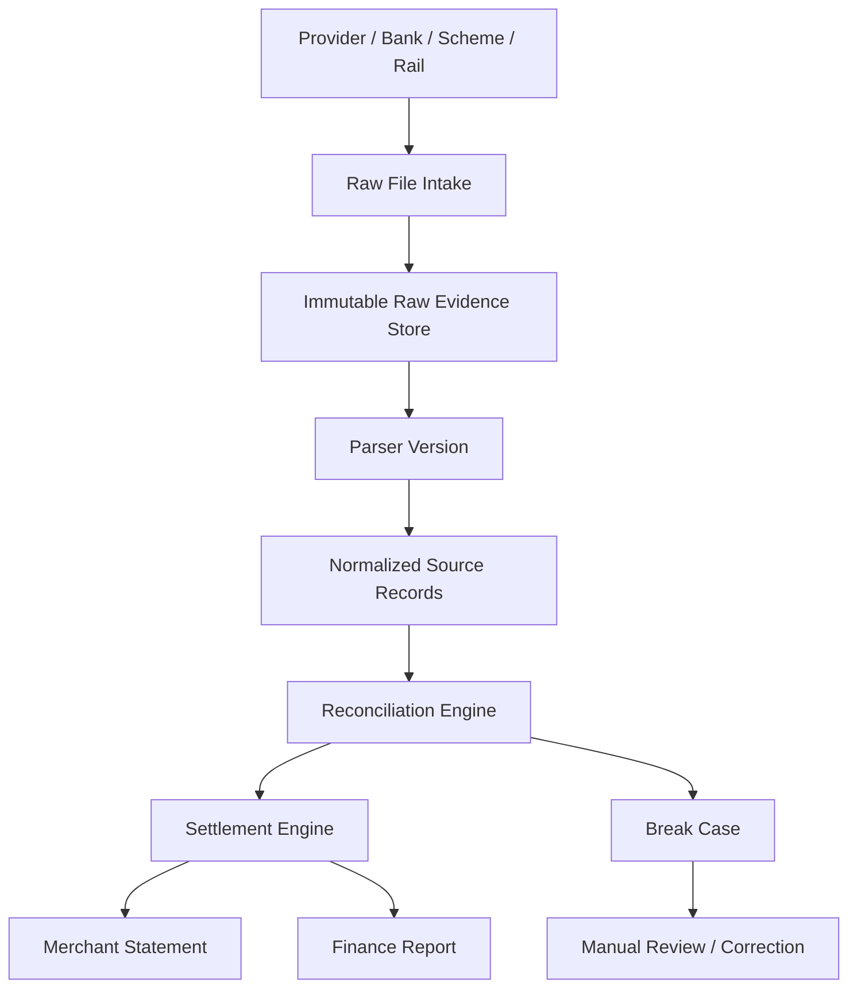
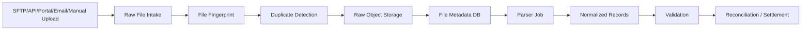
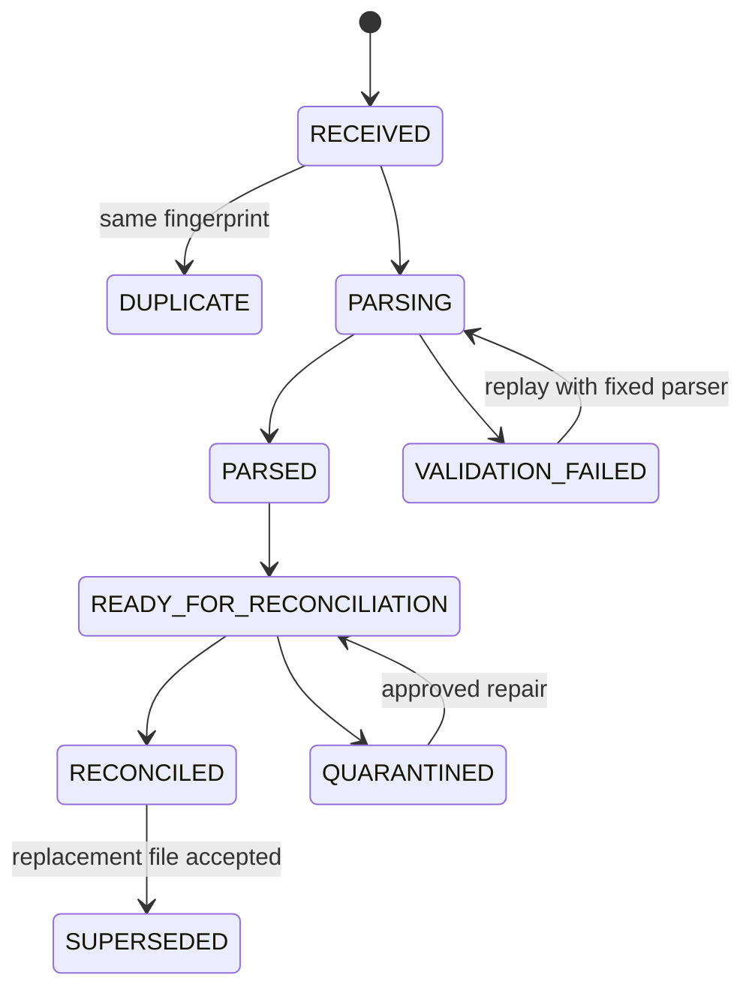
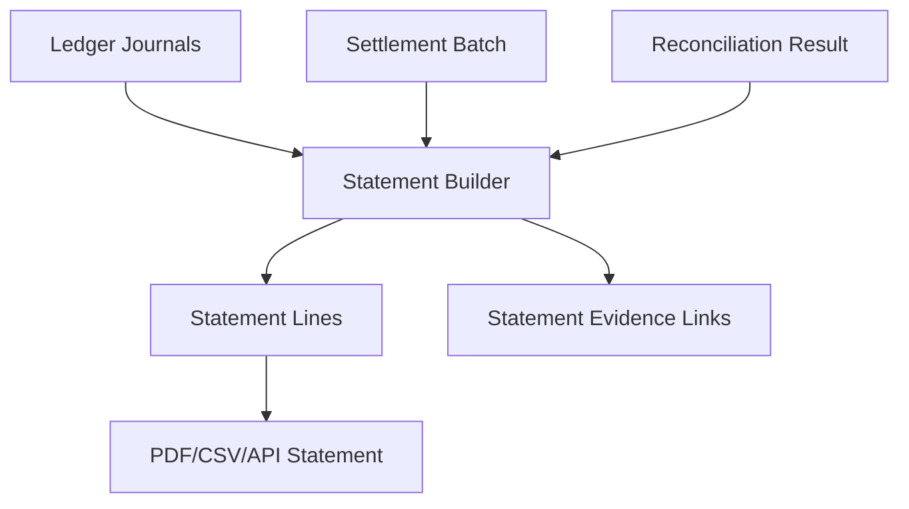
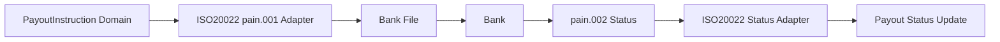
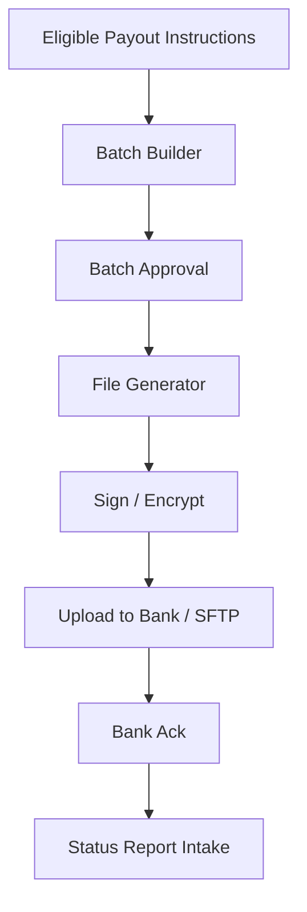

------
title: Build From Scratch: Large Production Grade Java Payment Systems - Part 051
description: Settlement files, provider reports, bank statements, ISO 20022 messages, merchant statements, and reporting pipelines for production-grade Java payment systems.
series: learn-java-payment-systems
seriesTitle: Build From Scratch: Large Production Grade Java Payment Systems
order: 51
partTitle: Settlement Files and Reporting
tags:
- java
- payments
- payment-systems
- settlement
- reconciliation
- reporting
- iso-20022
- enterprise-architecture
date: 2026-07-02
---

# Part 051 — Settlement Files and Reporting

Di part sebelumnya kita membangun settlement engine: cutoff, eligibility, netting, fee, reserve, batch, payout instruction, dan reconciliation gate.

Sekarang kita masuk ke sesuatu yang terlihat membosankan tetapi sangat menentukan kualitas payment platform: **file dan reporting**.

Di sistem pembayaran production, uang jarang selesai hanya karena sebuah API mengembalikan `200 OK`. Banyak kebenaran finansial datang sebagai file:

- provider settlement report,
- acquirer clearing report,
- bank statement,
- payout report,
- dispute report,
- chargeback report,
- fee report,
- tax report,
- merchant statement,
- settlement instruction file,
- ISO 20022 payment status report,
- operational exception report.

File adalah tempat realitas finansial sering muncul dalam bentuk yang paling tidak nyaman: CSV, fixed-width, Excel, ZIP terenkripsi, SFTP folder, email attachment, portal download, API export, atau ISO 20022 XML.

Payment engineer yang kuat tidak memperlakukan file sebagai “import job biasa”. File settlement adalah **external evidence**. Ia harus dikelola seperti data finansial yang immutable, auditable, replayable, versioned, dan bisa dipakai untuk menjelaskan uang.

## 1. Mental Model: Report Is Not Just Data, It Is Evidence

Sebuah report settlement bukan sekadar tabel transaksi. Report adalah klaim dari pihak eksternal.

Contoh:

> Provider mengatakan: “Pada settlement batch S-2026-07-02, kami settled transaksi A, B, C, mengurangi fee X, menahan reserve Y, dan mengirim payout Z ke bank account merchant.”

Sistem internal harus bertanya:

1. Apakah transaksi A/B/C memang ada di ledger kita?
2. Apakah statusnya eligible untuk settlement?
3. Apakah amount dan currency sama?
4. Apakah fee yang dipotong sesuai pricing policy atau provider fee schedule?
5. Apakah payout yang dikirim provider sama dengan payout yang masuk ke bank statement?
6. Apakah ada transaksi provider yang tidak pernah kita catat?
7. Apakah ada transaksi internal yang seharusnya masuk settlement tetapi tidak muncul di report?

Jadi file/reporting layer bukan “ETL pinggiran”. Ia adalah bagian dari financial control system.



Rule utamanya:

> Raw file tidak boleh hilang, tidak boleh diubah, dan tidak boleh diganti diam-diam.

Kalau parser salah, parser diperbaiki lalu file yang sama di-replay. Jangan mengedit file sumber agar cocok dengan parser.

## 2. Jenis File yang Harus Dimodelkan

Payment platform enterprise biasanya berhadapan dengan banyak jenis file. Jangan masukkan semuanya ke satu tabel `imported_file` tanpa domain.

### 2.1 Settlement Report

Settlement report menjelaskan transaksi yang diselesaikan provider/acquirer pada batch tertentu.

Biasanya berisi:

- settlement batch id,
- provider transaction id,
- merchant id,
- gross amount,
- fee amount,
- tax amount,
- net amount,
- currency,
- settlement date,
- transaction date,
- payment method,
- adjustment/dispute/refund indicator,
- payout reference.

Settlement report adalah input utama reconciliation dan merchant statement.

### 2.2 Payout Report

Payout report menjelaskan outbound transfer dari provider/platform ke merchant/bank account.

Biasanya berisi:

- payout id,
- merchant id,
- bank account reference,
- payout amount,
- currency,
- payout status,
- failure reason,
- arrival estimate,
- included settlement batch ids.

Payout report tidak sama dengan settlement report. Settlement dapat terjadi sebelum payout. Payout bisa gagal walaupun settlement batch valid.

### 2.3 Bank Statement

Bank statement adalah bukti eksternal dari bank account platform atau merchant.

Biasanya berisi:

- bank transaction reference,
- booking date,
- value date,
- debit/credit indicator,
- amount,
- currency,
- narrative/description,
- counterparty,
- account number/IBAN/virtual account,
- running balance.

Bank statement sering menjadi sumber “uang benar-benar masuk/keluar”. Masalahnya, narrative bisa buruk, reference bisa dipotong, time zone bisa berbeda, dan satu bank transaction bisa merepresentasikan banyak payment.

### 2.4 Fee Report

Fee report menjelaskan biaya provider, interchange, assessment fee, processing fee, refund fee, dispute fee, chargeback fee, FX fee, dan pajak.

Jika payment platform melakukan pricing ke merchant, fee report penting untuk:

- margin analysis,
- fee pass-through,
- reconciliation fee,
- dispute atas fee provider,
- statement merchant.

### 2.5 Dispute / Chargeback Report

Dispute report memberi status dispute, chargeback, representment, pre-arbitration, arbitration, fee, deadline, reason code, dan evidence requirement.

Ini akan dibahas lebih dalam di Part 052, tetapi dari perspektif reporting, dispute file adalah source event yang bisa memicu ledger posting.

### 2.6 Settlement Instruction File

Tidak semua outbound settlement dilakukan via API. Di banyak enterprise environment, settlement instruction dikirim sebagai file:

- CSV batch ke bank,
- fixed-width host-to-host file,
- ISO 20022 `pain.001` customer credit transfer initiation,
- encrypted ZIP ke SFTP,
- signed file ke treasury system.

File instruction bukan report. Ia adalah command keluar. Tapi tetap harus disimpan sebagai evidence.

### 2.7 Merchant Statement

Merchant statement adalah report yang dikonsumsi merchant.

Isinya harus menjawab:

- transaksi apa saja yang diproses,
- berapa gross amount,
- berapa fee,
- berapa refund/dispute/adjustment,
- berapa reserve hold/release,
- berapa net payable,
- berapa payout,
- apa carry forward/negative balance,
- settlement period mana yang dicakup.

Merchant statement harus explainable. Merchant tidak peduli internal table Anda. Merchant peduli: “Kenapa saya menerima uang segini?”

## 3. Raw File Intake Architecture

Jangan langsung parse file dari SFTP ke tabel transaksi. Bangun intake pipeline.



Layer ini harus menjamin:

1. file source disimpan sebelum diproses,
2. file fingerprint dihitung,
3. duplicate file dikenali,
4. parser version dicatat,
5. hasil parsing bisa dihapus/rebuild tanpa menghapus raw evidence,
6. semua error import bisa direview,
7. upload manual juga masuk pipeline yang sama.

## 4. File Metadata Model

Minimal model:

```sql
create table source_file (
    id uuid primary key,
    source_system text not null,
    file_type text not null,
    file_name text not null,
    source_location text,
    received_at timestamptz not null,
    business_date date,
    declared_record_count int,
    declared_total_amount numeric(38, 8),
    currency char(3),
    sha256_hex text not null,
    size_bytes bigint not null,
    storage_uri text not null,
    status text not null,
    parser_name text,
    parser_version text,
    parsed_at timestamptz,
    parse_error text,
    created_by text not null,
    created_at timestamptz not null default now(),
    unique (source_system, file_type, sha256_hex)
);

create index idx_source_file_type_date
    on source_file (source_system, file_type, business_date);
```

Status bisa:

- `RECEIVED`,
- `DUPLICATE`,
- `PARSING`,
- `PARSED`,
- `VALIDATION_FAILED`,
- `READY_FOR_RECONCILIATION`,
- `RECONCILED`,
- `QUARANTINED`,
- `SUPERSEDED`.

Perhatikan: status `SUPERSEDED` bukan berarti file lama dihapus. Artinya file baru menggantikan file sebelumnya sebagai report business date tertentu, tetapi file lama tetap evidence.

## 5. Parser Versioning

File provider berubah. Header berubah. Kolom baru muncul. Kolom lama berubah format. Decimal separator berubah. Time zone berubah.

Parser harus versioned.

```sql
create table source_file_parse_run (
    id uuid primary key,
    source_file_id uuid not null references source_file(id),
    parser_name text not null,
    parser_version text not null,
    started_at timestamptz not null,
    completed_at timestamptz,
    status text not null,
    record_count int not null default 0,
    error_count int not null default 0,
    warning_count int not null default 0,
    created_at timestamptz not null default now()
);

create table source_file_parse_error (
    id uuid primary key,
    parse_run_id uuid not null references source_file_parse_run(id),
    line_number int,
    column_name text,
    raw_value text,
    error_code text not null,
    error_message text not null,
    created_at timestamptz not null default now()
);
```

Parser versioning membuat Anda bisa menjawab:

- report tanggal tertentu diparse dengan parser versi apa,
- perubahan parser mengubah hasil berapa record,
- error terjadi karena file corrupt atau parser belum support format baru,
- apakah rebuild aman dilakukan.

## 6. Normalized Source Record

Jangan pakai raw CSV row langsung sebagai data reconciliation. Buat normalized source record.

```sql
create table settlement_source_record (
    id uuid primary key,
    source_file_id uuid not null references source_file(id),
    source_system text not null,
    source_record_key text not null,
    record_type text not null,

    provider_transaction_id text,
    provider_settlement_id text,
    provider_payout_id text,
    merchant_reference text,
    internal_payment_id uuid,

    event_date date,
    transaction_time timestamptz,
    settlement_date date,

    direction text not null,
    gross_amount numeric(38, 8),
    fee_amount numeric(38, 8),
    tax_amount numeric(38, 8),
    net_amount numeric(38, 8),
    currency char(3) not null,

    raw_line_number int,
    raw_payload jsonb not null,
    normalization_version text not null,
    created_at timestamptz not null default now(),

    unique (source_system, source_record_key, normalization_version)
);

create index idx_settlement_source_record_refs
    on settlement_source_record (provider_transaction_id, provider_settlement_id, provider_payout_id);
```

`raw_payload` tetap disimpan karena normalized fields tidak akan pernah menangkap semua nuance provider.

## 7. CSV, Fixed-Width, JSON, XML, and Excel: Jangan Tertipu Format

Format file tidak menentukan kompleksitas domain.

CSV bisa lebih sulit dari XML kalau:

- amount punya comma decimal,
- quoted newline,
- optional trailing column,
- duplicate header,
- encoding bukan UTF-8,
- file punya footer total,
- satu kolom overloaded dengan banyak arti.

Fixed-width bisa lebih aman untuk batch banking, tetapi rentan pada:

- posisi kolom berubah,
- padding tidak konsisten,
- negative amount memakai sign di belakang,
- encoding EBCDIC/legacy,
- field date tanpa timezone.

Excel adalah paling berbahaya untuk automation karena:

- cell type bisa berubah,
- formula bisa tersimpan,
- format display berbeda dari raw value,
- sheet name bisa berubah,
- manual edit sulit dideteksi.

ISO 20022 XML lebih formal, tetapi tetap perlu domain mapping:

- message id,
- payment information id,
- end-to-end id,
- transaction status,
- reason code,
- debtor/creditor account,
- instructed amount,
- settlement amount,
- bank status.

## 8. Canonical File Parsing Contract di Java

Buat parser sebagai contract eksplisit.

```java
public interface SourceFileParser<T extends NormalizedSourceRecord> {
    ParserDescriptor descriptor();
    boolean supports(SourceFileMetadata metadata);
    ParseResult<T> parse(InputStream rawStream, ParseContext context);
}

public record ParserDescriptor(
        String sourceSystem,
        String fileType,
        String parserName,
        String parserVersion
) {}

public record ParseContext(
        UUID sourceFileId,
        ZoneId sourceTimeZone,
        Currency defaultCurrency,
        LocalDate businessDate,
        boolean strictMode
) {}

public sealed interface ParseResult<T>
        permits ParseResult.Success, ParseResult.Failed {

    record Success<T>(
            List<T> records,
            List<ParseWarning> warnings,
            FileControlTotals controlTotals
    ) implements ParseResult<T> {}

    record Failed<T>(
            List<ParseError> errors,
            List<ParseWarning> warnings
    ) implements ParseResult<T> {}
}
```

Parsing harus menghasilkan:

- normalized records,
- warnings,
- errors,
- control totals,
- parser descriptor,
- deterministic record keys.

## 9. Deterministic Source Record Key

Setiap row harus punya key deterministik.

Urutan preferensi:

1. provider row id jika ada,
2. provider transaction id + settlement batch id + record type,
3. file id + line number + stable row hash,
4. normalized fields hash.

Jangan pakai auto-increment id sebagai dedupe key. Auto-increment hanya local identity.

```java
public final class SourceRecordKeyGenerator {

    public String keyFor(SettlementRow row) {
        if (row.providerRowId() != null) {
            return "provider-row:" + row.providerRowId();
        }

        if (row.providerTransactionId() != null && row.settlementBatchId() != null) {
            return "txn-batch-type:" + row.providerTransactionId()
                    + ":" + row.settlementBatchId()
                    + ":" + row.recordType();
        }

        return "line-hash:" + row.sourceFileSha256()
                + ":" + row.lineNumber()
                + ":" + sha256(row.canonicalRawLine());
    }
}
```

## 10. Control Totals

Control total adalah salah satu pertahanan paling murah untuk mencegah salah parse.

Contoh footer file:

```text
TRAILER|2026-07-02|125000|983241234.50|IDR
```

Parser harus mencocokkan:

- declared record count,
- parsed record count,
- total gross amount,
- total net amount,
- total fee amount,
- total by currency,
- total by record type.

Schema:

```sql
create table source_file_control_total (
    id uuid primary key,
    source_file_id uuid not null references source_file(id),
    total_type text not null,
    record_type text,
    currency char(3),
    declared_count int,
    parsed_count int,
    declared_amount numeric(38, 8),
    parsed_amount numeric(38, 8),
    status text not null,
    created_at timestamptz not null default now(),
    unique (source_file_id, total_type, record_type, currency)
);
```

Kalau control total gagal, jangan lanjutkan settlement posting otomatis.

## 11. File Lifecycle State Machine



State machine ini menghindari file dipakai setengah matang.

## 12. Settlement Report Normalization

Provider settlement report biasanya mengandung berbagai record type:

- payment captured,
- refund,
- chargeback,
- chargeback reversal,
- fee,
- tax,
- reserve hold,
- reserve release,
- payout,
- adjustment,
- FX conversion.

Jangan semua dipaksa menjadi `transaction`.

Buat normalized type:

```java
public enum SettlementRecordType {
    PAYMENT_CAPTURED,
    REFUND_SETTLED,
    DISPUTE_DEBIT,
    DISPUTE_CREDIT,
    PROVIDER_FEE,
    TAX,
    RESERVE_HOLD,
    RESERVE_RELEASE,
    PAYOUT,
    FX_CONVERSION,
    MANUAL_ADJUSTMENT,
    UNKNOWN
}
```

Mapping provider harus versioned. Kalau provider menambah type baru, jangan silently ignore. Masukkan ke `UNKNOWN`, quarantine, atau manual mapping tergantung policy.

## 13. Bank Statement Normalization

Bank statement perlu model berbeda.

```sql
create table bank_statement_entry (
    id uuid primary key,
    source_file_id uuid not null references source_file(id),
    bank_account_id uuid not null,
    bank_transaction_reference text,
    booking_date date not null,
    value_date date,
    direction text not null,
    amount numeric(38, 8) not null,
    currency char(3) not null,
    narrative text,
    counterparty_name text,
    counterparty_account text,
    running_balance numeric(38, 8),
    raw_payload jsonb not null,
    created_at timestamptz not null default now(),
    unique (bank_account_id, bank_transaction_reference)
);
```

Bank statement adalah reality check untuk payout/collection.

Tapi jangan selalu jadikan bank statement sebagai satu-satunya truth. Terkadang provider settlement report lebih granular dan bank statement hanya net total.

Truth hierarchy tergantung pertanyaan:

| Pertanyaan | Source utama |
|---|---|
| Apakah provider menyelesaikan transaksi? | Provider settlement report |
| Apakah payout masuk bank? | Bank statement |
| Apakah merchant payable benar? | Internal ledger + settlement batch |
| Apakah fee provider benar-benar dipotong? | Provider fee/settlement report |
| Apakah payout instruction dikirim? | Internal payout instruction + provider ack |

## 14. Settlement Statement Generation

Merchant statement harus dibangun dari settlement batch dan ledger, bukan dari raw provider report langsung.



Statement line minimal:

```sql
create table merchant_statement (
    id uuid primary key,
    merchant_id uuid not null,
    statement_number text not null unique,
    period_start date not null,
    period_end date not null,
    currency char(3) not null,
    opening_balance numeric(38, 8) not null,
    gross_sales numeric(38, 8) not null,
    refunds numeric(38, 8) not null,
    disputes numeric(38, 8) not null,
    fees numeric(38, 8) not null,
    tax numeric(38, 8) not null,
    reserve_hold numeric(38, 8) not null,
    reserve_release numeric(38, 8) not null,
    payout_amount numeric(38, 8) not null,
    closing_balance numeric(38, 8) not null,
    status text not null,
    generated_at timestamptz not null,
    published_at timestamptz,
    created_at timestamptz not null default now()
);

create table merchant_statement_line (
    id uuid primary key,
    statement_id uuid not null references merchant_statement(id),
    line_type text not null,
    source_reference_type text not null,
    source_reference_id uuid not null,
    description text not null,
    transaction_date date,
    amount numeric(38, 8) not null,
    currency char(3) not null,
    sort_order int not null,
    created_at timestamptz not null default now()
);
```

Statement harus immutable setelah published. Jika salah, buat corrected statement atau adjustment pada periode berikutnya. Jangan update diam-diam.

## 15. Report Grain: Jangan Campur Detail dan Summary

Satu kesalahan umum: membuat satu report yang mencoba menjadi segalanya.

Pisahkan grain:

| Report | Grain | Konsumen |
|---|---|---|
| Transaction detail report | payment/refund/dispute record | merchant ops, finance |
| Settlement summary report | settlement batch | finance, merchant owner |
| Payout report | payout instruction | treasury, merchant |
| Fee report | fee component | finance, pricing team |
| Reserve report | reserve hold/release | risk, merchant |
| Reconciliation break report | break case | ops, finance |
| Ledger trial balance | ledger account | accounting |

Report detail bisa sangat besar. Summary harus stabil dan cepat.

## 16. Report Builder Pattern

Buat report builder sebagai pipeline deterministic.

```java
public interface ReportBuilder<C extends ReportContext, R extends ReportArtifact> {
    ReportDescriptor descriptor();
    R build(C context);
}

public record ReportDescriptor(
        String reportType,
        String reportVersion,
        String grain,
        boolean immutableAfterPublish
) {}

public record MerchantStatementContext(
        UUID merchantId,
        LocalDate periodStart,
        LocalDate periodEnd,
        Currency currency,
        boolean includeLineLevelEvidence
) implements ReportContext {}
```

Report artifact:

```java
public record ReportArtifact(
        UUID reportId,
        String reportType,
        String version,
        URI storageUri,
        String sha256Hex,
        int rowCount,
        BigDecimal controlTotal,
        Instant generatedAt
) {}
```

## 17. Export Format Strategy

Report format harus dipilih berdasarkan consumer.

### CSV

Baik untuk:

- merchant self-service export,
- finance reconciliation,
- BI ingestion,
- operational analysis.

Risiko:

- Excel formula injection,
- encoding issue,
- delimiter issue,
- timezone ambiguity,
- amount formatting.

Untuk CSV yang bisa dibuka Excel, sanitasi cell yang dimulai dengan `=`, `+`, `-`, `@`.

### PDF

Baik untuk:

- human-readable statement,
- formal merchant document,
- monthly statement.

Risiko:

- sulit diparse ulang,
- layout berubah,
- bukan source of truth.

PDF statement harus punya underlying CSV/API equivalent.

### JSON/API

Baik untuk:

- merchant integration,
- dashboard,
- programmatic reconciliation.

Risiko:

- pagination/versioning,
- breaking change,
- consumer misuse.

### ISO 20022 XML

Baik untuk:

- bank integration,
- payment initiation,
- payment status,
- statement/reporting rail tertentu.

Risiko:

- schema kompleks,
- bank-specific usage guideline,
- reason code mapping,
- namespace/versioning.

## 18. ISO 20022: Gunakan Sebagai Boundary, Bukan Internal Model Mentah

ISO 20022 sangat penting untuk payment messages modern. Tapi jangan jadikan XML ISO langsung sebagai internal domain object.

Internal domain Anda harus tetap berbicara dengan bahasa payment platform:

- `PayoutInstruction`,
- `PaymentStatusReport`,
- `BankStatementEntry`,
- `SettlementBatch`,
- `ReconciliationBreak`.

ISO message menjadi external adapter.



Common message families yang sering muncul:

- `pain.001`: payment initiation,
- `pain.002`: payment status report,
- `camt.052`: bank-to-customer account report,
- `camt.053`: bank-to-customer statement,
- `camt.054`: debit/credit notification,
- `pacs.008`: FI to FI customer credit transfer,
- `pacs.002`: payment status report.

Tetapi bank/rail bisa punya usage guideline sendiri. Always validate against partner profile, not only generic XML schema.

## 19. Report Scheduling and Cutoff

Report scheduling harus mengikuti business calendar.

Contoh:

- settlement report harian pukul 03:00 local provider time,
- merchant statement bulanan pada hari pertama bulan berikutnya,
- payout report setelah bank confirmation,
- reconciliation break report setiap pagi,
- finance trial balance EOD,
- reserve report mingguan.

Jangan hardcode `midnight UTC` sebagai cutoff universal. Payment system selalu punya timezone/cutoff semantics.

```sql
create table report_schedule (
    id uuid primary key,
    report_type text not null,
    merchant_id uuid,
    timezone text not null,
    cutoff_time time not null,
    frequency text not null,
    calendar_id uuid,
    enabled boolean not null default true,
    created_at timestamptz not null default now()
);
```

## 20. Report Idempotency

Report generation harus idempotent.

Contoh idempotency key:

```text
merchant-statement:{merchantId}:{periodStart}:{periodEnd}:{currency}:{reportVersion}
```

Jika report sudah published, request generate ulang harus menghasilkan:

- artifact yang sama, atau
- error `ALREADY_PUBLISHED`, atau
- corrected statement flow.

Jangan overwrite file statement lama.

## 21. Data Warehouse vs Financial Reporting

Data warehouse bagus untuk analytics. Tapi jangan jadikan warehouse sebagai source of truth financial report.

Financial report harus traceable ke ledger dan settlement evidence.

Warehouse boleh dipakai untuk:

- aggregate dashboard,
- trend analysis,
- merchant insight,
- fraud analysis,
- performance metric.

Tetapi laporan seperti merchant settlement statement, payout report, trial balance, dan reconciliation break harus punya lineage ke sumber finansial.

## 22. Lineage: Setiap Angka Harus Bisa Dijelaskan

Jika statement menunjukkan:

```text
Net payout: IDR 97,500,000
```

Sistem harus bisa menjelaskan:

```text
Gross sales:       IDR 100,000,000
Refunds:          IDR  -1,000,000
MDR fee:          IDR  -1,800,000
Tax on fee:       IDR    -198,000
Reserve hold:     IDR    -500,000
Reserve release:  IDR     998,000
Net payout:       IDR  97,500,000
```

Lalu setiap line harus link ke:

- ledger journal,
- settlement batch,
- provider source record,
- reconciliation match group,
- payout instruction,
- bank statement entry jika sudah arrived.

Schema lineage:

```sql
create table report_line_evidence (
    id uuid primary key,
    report_line_id uuid not null references merchant_statement_line(id),
    evidence_type text not null,
    evidence_id uuid not null,
    evidence_role text not null,
    created_at timestamptz not null default now(),
    unique (report_line_id, evidence_type, evidence_id, evidence_role)
);
```

## 23. Reporting API Design

Merchant-facing report API harus stabil.

```http
GET /v1/merchants/{merchantId}/statements?periodStart=2026-06-01&periodEnd=2026-06-30
GET /v1/statements/{statementId}
GET /v1/statements/{statementId}/lines?limit=100&cursor=...
GET /v1/statements/{statementId}/download?format=csv
GET /v1/payouts/{payoutId}/reconciliation
```

Response statement summary:

```json
{
  "id": "stmt_01J...",
  "merchantId": "m_123",
  "periodStart": "2026-06-01",
  "periodEnd": "2026-06-30",
  "currency": "IDR",
  "status": "PUBLISHED",
  "openingBalance": { "amountMinor": 0, "currency": "IDR" },
  "grossSales": { "amountMinor": 10000000000, "currency": "IDR" },
  "refunds": { "amountMinor": -100000000, "currency": "IDR" },
  "fees": { "amountMinor": -180000000, "currency": "IDR" },
  "tax": { "amountMinor": -19800000, "currency": "IDR" },
  "reserveHold": { "amountMinor": -50000000, "currency": "IDR" },
  "reserveRelease": { "amountMinor": 99800000, "currency": "IDR" },
  "payoutAmount": { "amountMinor": 9750000000, "currency": "IDR" },
  "closingBalance": { "amountMinor": 0, "currency": "IDR" }
}
```

## 24. Reporting Security

Report mengandung data sensitif:

- merchant revenue,
- customer identifiers,
- bank account references,
- fee schedule,
- risk reserve,
- dispute details,
- tax data,
- payout bank info.

Controls:

- least privilege,
- report-level authorization,
- merchant scoping,
- download audit,
- signed URL TTL,
- watermark PDF,
- column-level masking,
- no PAN/CVC,
- pii minimization,
- data retention.

Jangan kirim report finance via public bucket URL.

## 25. Settlement File Generation for Bank/Payout

Untuk outbound settlement instruction, jangan bangun file dari query ad-hoc.

Flow:



Schema:

```sql
create table outbound_file_batch (
    id uuid primary key,
    file_type text not null,
    destination_system text not null,
    business_date date not null,
    currency char(3) not null,
    status text not null,
    record_count int not null,
    total_amount numeric(38, 8) not null,
    generated_file_uri text,
    sha256_hex text,
    generated_at timestamptz,
    approved_by text,
    approved_at timestamptz,
    sent_at timestamptz,
    created_at timestamptz not null default now()
);

create table outbound_file_batch_item (
    id uuid primary key,
    batch_id uuid not null references outbound_file_batch(id),
    payout_instruction_id uuid not null,
    amount numeric(38, 8) not null,
    currency char(3) not null,
    beneficiary_reference text not null,
    status text not null,
    created_at timestamptz not null default now(),
    unique (batch_id, payout_instruction_id)
);
```

Outbound file harus punya:

- batch id,
- control total,
- hash,
- approval evidence,
- upload evidence,
- bank acknowledgment,
- status report mapping.

## 26. Excel Formula Injection

CSV export yang dibuka Excel bisa menjadi attack vector jika cell diawali formula.

Contoh nilai merchant/customer:

```text
=HYPERLINK("https://evil.example","click")
```

Export sanitizer:

```java
public final class CsvCellSanitizer {
    public String sanitize(String value) {
        if (value == null) return "";
        if (value.startsWith("=") || value.startsWith("+") ||
            value.startsWith("-") || value.startsWith("@")) {
            return "'" + value;
        }
        return value;
    }
}
```

Jangan menganggap report output aman hanya karena bukan payment API.

## 27. Operational Dashboard

Minimum dashboard:

- files received by source/type/date,
- parser success/failure rate,
- control total mismatch,
- duplicate file count,
- unprocessed file age,
- reconciliation readiness,
- settlement report availability SLA,
- report generation latency,
- statement publish status,
- outbound file sent/ack status,
- report download audit anomalies.

Alert penting:

- expected file not received,
- file received with zero records,
- control total mismatch,
- parser error spike,
- unknown record type muncul,
- report generation failed after settlement closed,
- merchant statement mismatch dengan ledger,
- outbound file sent but no bank ack.

## 28. Failure Model

| Failure | Dampak | Mitigasi |
|---|---|---|
| File tidak datang | settlement/recon terlambat | expected-file monitor, provider escalation |
| File duplicate | double processing | fingerprint unique constraint |
| Parser salah | angka salah | parser version, replay, control total |
| Provider ubah format | parsing gagal | quarantine, schema contract monitor |
| Control total mismatch | trust rendah | stop auto-posting |
| Report overwritten | audit rusak | immutable artifact + corrected report |
| Statement salah publish | merchant dispute | correction statement + audit trail |
| Bank ack hilang | payout unknown | status inquiry + manual control |
| Timezone salah | cutoff salah | explicit source timezone + business calendar |
| CSV formula injection | security incident | cell sanitization |

## 29. Testing Strategy

Test parser dengan golden files.

Folder:

```text
src/test/resources/golden/provider-x/settlement/v1/
  normal.csv
  refund.csv
  dispute.csv
  fee-only.csv
  multi-currency.csv
  duplicate-row.csv
  bad-control-total.csv
  unknown-record-type.csv
```

Test expectations:

```java
@Test
void parsesProviderSettlementReportWithRefundAndFee() {
    var parser = new ProviderXSettlementParser();
    var input = golden("provider-x/settlement/v1/refund.csv");

    var result = parser.parse(input, context());

    assertThat(result).isInstanceOf(ParseResult.Success.class);
    var success = (ParseResult.Success<SettlementSourceRecord>) result;

    assertThat(success.records()).hasSize(3);
    assertThat(success.controlTotals().status()).isEqualTo(ControlTotalStatus.MATCHED);
    assertThat(success.records())
            .extracting(SettlementSourceRecord::recordType)
            .contains(PAYMENT_CAPTURED, REFUND_SETTLED, PROVIDER_FEE);
}
```

Property tests:

- parsed count equals row count excluding header/trailer,
- sum by currency equals control total,
- deterministic key stable across parse run,
- same raw file + same parser produces same normalized records,
- published report total equals sum of lines,
- statement closing balance equals opening + lines.

## 30. Anti-Patterns

### Anti-pattern 1: Parse langsung ke transaction table

Ini merusak evidence. Jika parser salah, transaction table tercemar.

### Anti-pattern 2: Menghapus raw file setelah sukses

Tanpa raw file, Anda tidak bisa membuktikan angka.

### Anti-pattern 3: Report generated from production query ad-hoc

Report harus versioned dan reproducible. Query ad-hoc tidak cukup.

### Anti-pattern 4: Statement bisa di-update setelah publish

Ini menghancurkan trust. Buat correction flow.

### Anti-pattern 5: Semua file dianggap CSV sederhana

Settlement file adalah external contract. Perlakukan seperti API contract.

### Anti-pattern 6: Tidak ada control total

Tanpa control total, parser bisa salah tetapi terlihat sukses.

### Anti-pattern 7: Merchant report dari provider report mentah

Merchant report harus berasal dari internal ledger dan settlement model yang sudah direconcile.

## 31. Build Order

Urutan implementasi yang masuk akal:

1. `source_file` metadata + raw storage.
2. File fingerprint + duplicate detection.
3. Parser contract.
4. One provider settlement parser.
5. Normalized source record table.
6. Control total validation.
7. Parse run/error tracking.
8. Reconciliation integration.
9. Merchant statement builder.
10. CSV export with immutable artifact.
11. Download audit.
12. Outbound file batch for payouts.
13. Bank ack/status file intake.
14. Operational dashboard.
15. Replay/rebuild tooling.

## 32. Final Mental Model

A good settlement/reporting system follows this rule:

> Never let an external file directly mutate money. Store it as evidence, parse it deterministically, normalize it with versioning, validate it with control totals, reconcile it against ledger, then use the reconciled result to produce settlement/reporting outputs.

Production payment systems are not only API systems. They are file systems, evidence systems, reporting systems, and finance explanation systems.

Kalau report tidak bisa menjelaskan uang, ledger Anda belum cukup berguna.

## Referensi

- Stripe Docs — Balance summary report: https://docs.stripe.com/reports/balance
- Stripe Docs — Payout reconciliation report: https://docs.stripe.com/reports/payout-reconciliation
- Adyen Docs — Settlement details report: https://docs.adyen.com/reporting/settlement-reconciliation/transaction-level/settlement-details-report
- Adyen Docs — Aggregate settlement details report: https://docs.adyen.com/reporting/settlement-reconciliation/batch-level/aggregate-settlement-details-report
- ISO 20022 — Universal financial industry message scheme: https://www.iso20022.org/
- SWIFT — ISO 20022 for financial institutions: https://www.swift.com/standards/iso-20022
- PostgreSQL Docs — Numeric Types: https://www.postgresql.org/docs/current/datatype-numeric.html
