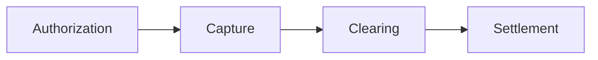
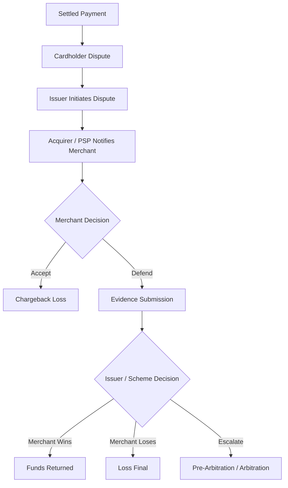
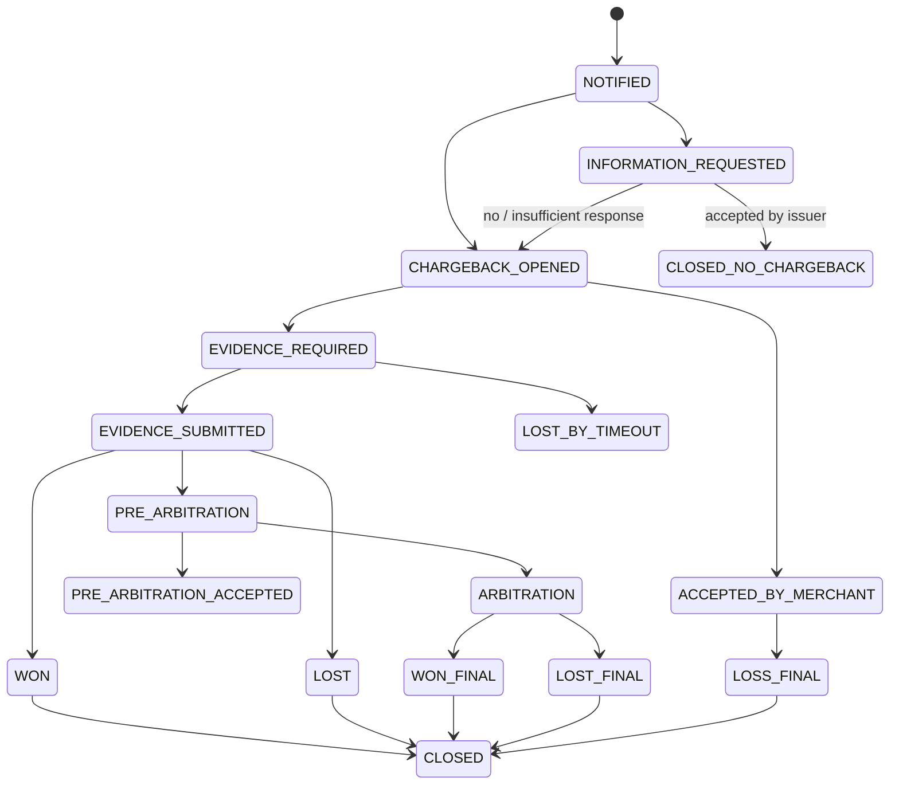
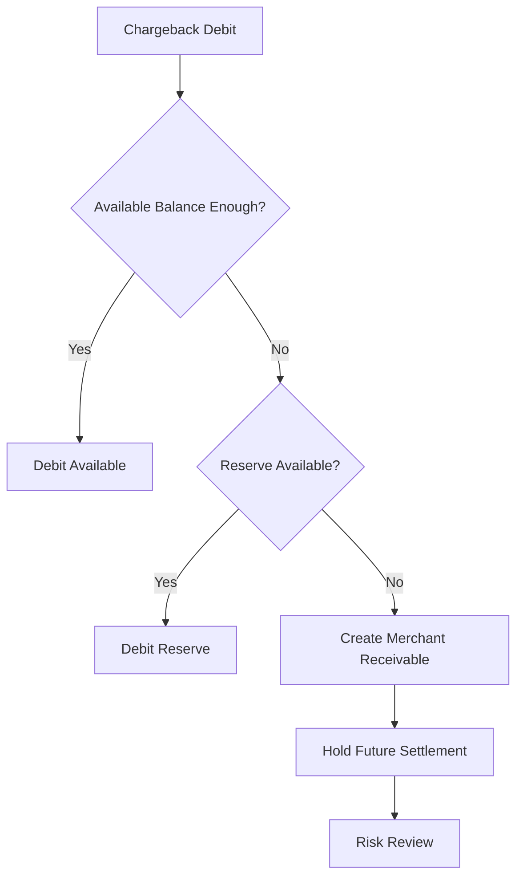
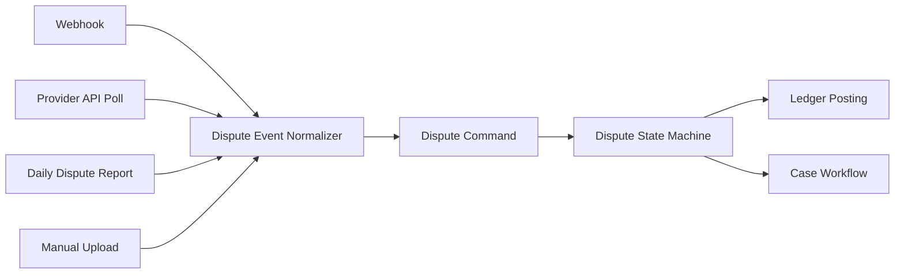

------
title: Build From Scratch: Large Production Grade Java Payment Systems - Part 052
description: Dispute and chargeback management for production-grade Java payment systems, including reason codes, evidence, deadlines, representment, ledger impact, reconciliation, and operational workflows.
series: learn-java-payment-systems
seriesTitle: Build From Scratch: Large Production Grade Java Payment Systems
order: 52
partTitle: Dispute and Chargeback Management
tags:
- java
- payments
- payment-systems
- dispute
- chargeback
- fraud
- ledger
- reconciliation
- enterprise-architecture
date: 2026-07-02
---

# Part 052 — Dispute and Chargeback Management

Refund adalah ketika merchant/platform secara sadar mengembalikan uang.

Chargeback adalah ketika cardholder mengajukan dispute ke issuer, lalu rail/scheme/acquirer menarik kembali nilai transaksi dari merchant/platform, sering kali beserta fee, deadline, reason code, dan evidence workflow.

Di payment system production, dispute tidak boleh dimodelkan sebagai “refund tipe lain”. Dispute adalah lifecycle sendiri.

Ia punya:

- external actor,
- network/scheme rules,
- deadline,
- evidence,
- temporary debit,
- representment,
- pre-arbitration,
- arbitration,
- fee,
- risk feedback,
- merchant notification,
- ledger impact,
- reconciliation impact,
- operational case management.

Kalau dispute dimodelkan terlalu sederhana, platform akan terlihat benar di API tetapi salah di finance.

## 1. Mental Model: Dispute Is a Legal-Financial Workflow

Payment lifecycle biasa:



Dispute lifecycle datang setelah transaksi dianggap sukses.



Dispute adalah workflow dengan uang dan evidence.

Rule utama:

> A dispute is not just a negative transaction. It is a case with financial postings, deadlines, obligations, and evidence.

## 2. Core Terms

### 2.1 Retrieval Request / Request for Information

Issuer atau network meminta informasi transaksi sebelum chargeback formal.

Efek uang:

- sering kali belum ada debit,
- tetapi deadline evidence sudah berjalan,
- jika tidak dijawab, bisa berubah menjadi chargeback.

### 2.2 Chargeback

Issuer membalikkan nilai transaksi karena cardholder dispute.

Efek uang:

- merchant payable berkurang,
- reserve/settled balance bisa didebit,
- chargeback fee dapat dikenakan,
- ledger harus mencatat dispute debit.

### 2.3 Representment

Merchant/acquirer menolak chargeback dengan evidence.

Efek uang:

- jika menang, dana bisa dikreditkan kembali,
- jika kalah, loss tetap,
- evidence dan deadline menentukan outcome.

### 2.4 Pre-Arbitration

Tahap lanjutan jika salah satu pihak menolak hasil representment.

Efek uang:

- risiko fee lebih tinggi,
- operasional lebih kompleks,
- butuh decision apakah layak melanjutkan.

### 2.5 Arbitration

Network/scheme memutuskan dispute final.

Efek uang:

- final liability assignment,
- fee bisa signifikan,
- perlu approval policy.

### 2.6 Dispute Fee

Fee yang dikenakan provider/acquirer/scheme untuk dispute/chargeback.

Jangan gabungkan dispute amount dan dispute fee. Mereka punya accounting berbeda.

## 3. Dispute Is Not Refund

| Aspek | Refund | Dispute/Chargeback |
|---|---|---|
| Initiator | Merchant/platform | Cardholder/issuer/network |
| Timing | Bisa sebelum/after settlement | Umumnya setelah settlement |
| Control | Internal decision | External workflow |
| Evidence | Optional | Required untuk defense |
| Deadline | Internal SLA | Network/provider deadline |
| Fee | Refund fee mungkin ada | Dispute/chargeback fee umum |
| Ledger | Refund liability reversal | Dispute receivable/loss workflow |
| Outcome | Known when provider confirms | Bisa berubah setelah representment |

Refund adalah instruction. Dispute adalah case.

## 4. Dispute Aggregate

Domain model:

```java
public final class Dispute {
    private DisputeId id;
    private PaymentId paymentId;
    private MerchantId merchantId;
    private ProviderDisputeId providerDisputeId;
    private Money disputedAmount;
    private Money feeAmount;
    private DisputeReason reason;
    private DisputeStatus status;
    private Instant receivedAt;
    private Instant responseDueAt;
    private List<DisputeEvidence> evidence;
    private List<DisputeEvent> events;
    private Version version;
}
```

`Dispute` bukan child sederhana dari `Payment`. Ia reference ke payment, tetapi lifecycle-nya sendiri.

Kenapa?

- Satu payment bisa punya lebih dari satu dispute event.
- Dispute bisa partial amount.
- Dispute bisa berubah status setelah payment selesai lama.
- Dispute punya evidence/deadline sendiri.
- Dispute bisa punya ledger postings sendiri.

## 5. Dispute State Machine



Jangan buat state terlalu “payment-like”. Dispute state harus menjawab pertanyaan operations:

- apakah perlu action,
- kapan deadline,
- apa evidence yang kurang,
- apakah dana sudah didebit,
- apakah merchant ingin defend,
- apakah outcome final,
- apakah ledger sudah posted.

## 6. Schema Dasar

```sql
create table dispute (
    id uuid primary key,
    payment_id uuid not null,
    merchant_id uuid not null,
    provider text not null,
    provider_dispute_id text not null,
    provider_payment_reference text,
    reason_code text,
    reason_category text,
    status text not null,
    disputed_amount numeric(38, 8) not null,
    fee_amount numeric(38, 8),
    currency char(3) not null,
    received_at timestamptz not null,
    response_due_at timestamptz,
    evidence_due_at timestamptz,
    current_liability text,
    latest_provider_status text,
    created_at timestamptz not null default now(),
    updated_at timestamptz not null default now(),
    version bigint not null,
    unique (provider, provider_dispute_id)
);

create index idx_dispute_merchant_status
    on dispute (merchant_id, status, response_due_at);

create index idx_dispute_payment
    on dispute (payment_id);
```

Provider dispute id wajib unique. Duplicate webhook/report tidak boleh membuat case baru.

## 7. Dispute Event Log

Jangan hanya update status dispute. Simpan event.

```sql
create table dispute_event (
    id uuid primary key,
    dispute_id uuid not null references dispute(id),
    event_type text not null,
    provider_event_id text,
    occurred_at timestamptz not null,
    received_at timestamptz not null,
    payload jsonb not null,
    source text not null,
    ledger_journal_id uuid,
    created_at timestamptz not null default now(),
    unique (dispute_id, event_type, provider_event_id)
);
```

Event type contoh:

- `INFORMATION_REQUESTED`,
- `CHARGEBACK_OPENED`,
- `FUNDS_WITHDRAWN`,
- `EVIDENCE_SUBMITTED`,
- `REPRESENTMENT_WON`,
- `REPRESENTMENT_LOST`,
- `PRE_ARBITRATION_OPENED`,
- `ARBITRATION_OPENED`,
- `DISPUTE_FEE_ASSESSED`,
- `CASE_CLOSED`.

Event log membuat timeline bisa dibuktikan.

## 8. Reason Code Normalization

Visa, Mastercard, Amex, Discover, provider, dan wallet bisa punya reason code berbeda.

Internal reason category harus normalized.

```java
public enum DisputeReasonCategory {
    FRAUD,
    AUTHORIZATION,
    PROCESSING_ERROR,
    CONSUMER_DISPUTE,
    DUPLICATE_PROCESSING,
    CREDIT_NOT_PROCESSED,
    PRODUCT_NOT_RECEIVED,
    PRODUCT_UNACCEPTABLE,
    SUBSCRIPTION_CANCELLED,
    OTHER
}
```

Mapping table:

```sql
create table dispute_reason_mapping (
    id uuid primary key,
    scheme text not null,
    provider text not null,
    external_reason_code text not null,
    external_reason_description text,
    internal_category text not null,
    evidence_template_id uuid,
    mapping_version text not null,
    active boolean not null default true,
    created_at timestamptz not null default now(),
    unique (scheme, provider, external_reason_code, mapping_version)
);
```

Jangan hardcode reason code di Java enum. Reason code berubah dan provider mapping bisa berbeda.

## 9. Evidence Model

Evidence bukan attachment random. Evidence harus structured.

```sql
create table dispute_evidence_item (
    id uuid primary key,
    dispute_id uuid not null references dispute(id),
    evidence_type text not null,
    title text not null,
    description text,
    storage_uri text,
    content_sha256 text,
    metadata jsonb not null default '{}',
    collected_at timestamptz not null,
    collected_by text not null,
    redaction_status text not null,
    created_at timestamptz not null default now()
);
```

Evidence type contoh:

- customer identity evidence,
- IP/device evidence,
- 3DS authentication result,
- AVS/CVV result,
- signed delivery proof,
- shipping tracking,
- digital access log,
- subscription agreement,
- cancellation policy,
- refund policy,
- customer communication,
- invoice/receipt,
- merchant terms acceptance.

## 10. Evidence Package

Provider biasanya tidak mau 20 file random. Mereka perlu package sesuai format.

```sql
create table dispute_evidence_package (
    id uuid primary key,
    dispute_id uuid not null references dispute(id),
    package_version int not null,
    status text not null,
    generated_at timestamptz,
    submitted_at timestamptz,
    submitted_by text,
    provider_submission_id text,
    storage_uri text,
    sha256_hex text,
    created_at timestamptz not null default now(),
    unique (dispute_id, package_version)
);
```

Status:

- `DRAFT`,
- `READY`,
- `SUBMISSION_FAILED`,
- `SUBMITTED`,
- `ACCEPTED_BY_PROVIDER`,
- `REJECTED_BY_PROVIDER`.

Evidence package harus reproducible. Jika evidence berubah, buat package version baru.

## 11. Deadline Management

Deadline adalah domain utama dispute.

```sql
create table dispute_deadline (
    id uuid primary key,
    dispute_id uuid not null references dispute(id),
    deadline_type text not null,
    due_at timestamptz not null,
    source text not null,
    status text not null,
    completed_at timestamptz,
    created_at timestamptz not null default now(),
    unique (dispute_id, deadline_type)
);
```

Deadline type:

- `INFORMATION_RESPONSE_DUE`,
- `EVIDENCE_SUBMISSION_DUE`,
- `PRE_ARBITRATION_RESPONSE_DUE`,
- `ARBITRATION_RESPONSE_DUE`,
- `MERCHANT_REVIEW_DUE`,
- `INTERNAL_QA_DUE`.

Alerting:

- due in 72 hours,
- due in 24 hours,
- due in 4 hours,
- missed deadline,
- evidence incomplete near deadline.

## 12. Ledger Impact

Dispute memengaruhi uang. Jangan hanya update dispute status.

### 12.1 Chargeback Opened

Ketika chargeback debit terjadi:

```text
Dr Merchant Dispute Receivable / Loss Pending       100.00
Cr Merchant Payable / Available Balance             100.00
```

Atau jika payable tidak cukup:

```text
Dr Merchant Dispute Receivable / Loss Pending       100.00
Cr Platform Receivable From Merchant                100.00
```

### 12.2 Chargeback Fee

```text
Dr Merchant Fee Expense / Platform Receivable        15.00
Cr Provider Fee Payable / Cash                       15.00
```

Tergantung apakah fee pass-through atau ditanggung platform.

### 12.3 Merchant Wins Representment

```text
Dr Merchant Payable / Available Balance             100.00
Cr Merchant Dispute Receivable / Loss Pending       100.00
```

### 12.4 Merchant Loses Final

```text
Dr Merchant Loss / Chargeback Expense               100.00
Cr Merchant Dispute Receivable / Loss Pending       100.00
```

Ledger account tergantung accounting policy, tetapi prinsipnya sama: setiap impact balanced, idempotent, dan traceable ke dispute event.

## 13. Ledger Posting Rule

```java
public final class DisputeLedgerPostingService {

    public void postChargebackOpened(Dispute dispute, DisputeEvent event) {
        var key = LedgerIdempotencyKey.of(
                "DISPUTE_CHARGEBACK_OPENED",
                dispute.id().value(),
                event.id().value()
        );

        ledger.post(new JournalCommand(
                key,
                "Chargeback opened for dispute " + dispute.id(),
                List.of(
                        debit(account.merchantDisputeReceivable(dispute.merchantId()), dispute.disputedAmount()),
                        credit(account.merchantAvailableBalance(dispute.merchantId()), dispute.disputedAmount())
                ),
                evidence(event.id())
        ));
    }
}
```

Posting harus idempotent. Duplicate provider event tidak boleh double debit merchant.

## 14. Insufficient Merchant Balance

Jika chargeback datang setelah merchant sudah dipayout, merchant balance bisa tidak cukup.

Policy:

1. debit available balance jika cukup,
2. debit reserve jika policy mengizinkan,
3. create receivable from merchant,
4. hold future settlement,
5. block payout,
6. escalate risk/compliance case.



Ini alasan reserve accounting penting.

## 15. Dispute Intake Sources

Dispute bisa datang dari:

- webhook,
- provider dispute API polling,
- daily dispute report,
- chargeback report file,
- manual upload,
- acquirer portal export,
- email notification.

Semua harus masuk satu ingestion model:



Jangan buat separate logic untuk webhook dan file. Buat source adapter berbeda, domain command sama.

## 16. Normalized Dispute Command

```java
public sealed interface DisputeCommand {
    DisputeProvider provider();
    ProviderDisputeId providerDisputeId();
    Instant occurredAt();
    EvidenceRef sourceEvidence();

    record OpenChargeback(
            DisputeProvider provider,
            ProviderDisputeId providerDisputeId,
            PaymentReference paymentReference,
            Money amount,
            Money fee,
            String reasonCode,
            Instant responseDueAt,
            Instant occurredAt,
            EvidenceRef sourceEvidence
    ) implements DisputeCommand {}

    record SubmitEvidence(
            DisputeId disputeId,
            UUID evidencePackageId,
            UserId submittedBy,
            Instant occurredAt,
            EvidenceRef sourceEvidence
    ) implements DisputeCommand {}

    record Resolve(
            DisputeProvider provider,
            ProviderDisputeId providerDisputeId,
            DisputeOutcome outcome,
            Money returnedAmount,
            Instant occurredAt,
            EvidenceRef sourceEvidence
    ) implements DisputeCommand {}
}
```

## 17. Case Management Workflow

Dispute adalah case.

Minimum fields:

```sql
create table dispute_case (
    id uuid primary key,
    dispute_id uuid not null references dispute(id),
    merchant_id uuid not null,
    assignee text,
    priority text not null,
    status text not null,
    required_action text,
    internal_note text,
    merchant_visible_note text,
    created_at timestamptz not null default now(),
    updated_at timestamptz not null default now()
);
```

Workflow:

1. dispute received,
2. classify reason,
3. compute defendability,
4. request merchant evidence,
5. assemble evidence package,
6. internal QA,
7. submit evidence,
8. monitor outcome,
9. post ledger result,
10. feed risk model.

## 18. Defendability Score

Tidak semua dispute harus dilawan. Kadang biaya operasional lebih besar dari amount.

Defendability factors:

- dispute amount,
- reason category,
- 3DS liability shift,
- delivery evidence strength,
- historical win rate by reason,
- merchant risk tier,
- product type,
- customer history,
- response deadline remaining,
- evidence completeness,
- arbitration fee risk.

```java
public record DefendabilityDecision(
        boolean shouldDefend,
        BigDecimal score,
        List<String> reasons,
        Money expectedRecovery,
        Money expectedCost
) {}
```

Decision ini bukan final truth. Ia membantu ops/merchant mengambil tindakan.

## 19. Merchant Experience

Merchant harus bisa melihat:

- dispute id,
- payment id,
- amount,
- reason,
- deadline,
- required evidence,
- current status,
- financial impact,
- submitted evidence,
- outcome,
- next action.

Merchant tidak boleh melihat internal fraud signal atau sensitive provider detail yang bukan miliknya.

API:

```http
GET /v1/merchants/{merchantId}/disputes?status=ACTION_REQUIRED
GET /v1/disputes/{disputeId}
POST /v1/disputes/{disputeId}/evidence
POST /v1/disputes/{disputeId}/accept
POST /v1/disputes/{disputeId}/submit
```

## 20. Evidence Template by Reason Category

```sql
create table dispute_evidence_template (
    id uuid primary key,
    reason_category text not null,
    payment_method text,
    product_type text,
    template_version text not null,
    required_items jsonb not null,
    recommended_items jsonb not null,
    active boolean not null default true,
    created_at timestamptz not null default now(),
    unique (reason_category, payment_method, product_type, template_version)
);
```

Example required items:

```json
{
  "required": [
    "receipt",
    "customer_identity_match",
    "delivery_confirmation",
    "terms_acceptance"
  ],
  "recommended": [
    "customer_communication",
    "ip_address",
    "device_fingerprint",
    "3ds_authentication_result"
  ]
}
```

## 21. Dispute and Fraud Feedback Loop

Dispute outcome harus feed risk engine.

Events:

- `DISPUTE_OPENED`,
- `DISPUTE_LOST_FRAUD`,
- `DISPUTE_LOST_PRODUCT_NOT_RECEIVED`,
- `DISPUTE_WON`,
- `DISPUTE_ACCEPTED`,
- `HIGH_DISPUTE_RATE_MERCHANT`.

Risk updates:

- merchant risk score,
- customer/device risk,
- BIN/card fingerprint risk,
- product category risk,
- route/provider risk,
- rule tuning,
- reserve policy adjustment,
- payout hold.

Chargeback rate is a real business metric, not only an ops metric.

## 22. Dispute Rate Monitoring

Monitor:

- chargeback count,
- chargeback amount,
- chargeback rate by merchant,
- chargeback rate by payment method,
- chargeback rate by BIN/country,
- reason category distribution,
- win rate,
- loss rate,
- accepted rate,
- timeout loss rate,
- average evidence submission time,
- reserve coverage,
- fee impact.

Alert:

- merchant dispute rate spike,
- fraud reason spike,
- deadline misses,
- evidence submission failures,
- provider dispute webhook delay,
- dispute debit with no ledger posting,
- ledger dispute balance mismatch,
- high loss merchant still receiving payouts.

## 23. Reconciliation Impact

Dispute appears in multiple places:

- provider dispute webhook,
- dispute report,
- settlement report,
- fee report,
- bank payout amount,
- ledger postings,
- merchant statement.

Reconciliation must answer:

1. Did every dispute debit in provider settlement report map to a known dispute?
2. Did every known chargeback produce ledger posting?
3. Did every won representment produce return credit?
4. Did dispute fee match provider report?
5. Did merchant statement include dispute line?
6. Did reserve/negative balance policy apply correctly?

Break examples:

- provider debited dispute unknown to system,
- system opened dispute but provider settlement report missing debit,
- amount mismatch,
- currency mismatch,
- provider says won but ledger still loss pending,
- chargeback fee duplicated,
- reversal credit received but not applied.

## 24. Dispute Source Record

Extend source file records with dispute-specific table:

```sql
create table dispute_source_record (
    id uuid primary key,
    source_file_id uuid,
    source_event_id uuid,
    provider text not null,
    provider_dispute_id text not null,
    provider_payment_reference text,
    record_type text not null,
    reason_code text,
    amount numeric(38, 8),
    fee_amount numeric(38, 8),
    currency char(3),
    due_at timestamptz,
    provider_status text,
    raw_payload jsonb not null,
    normalization_version text not null,
    created_at timestamptz not null default now(),
    unique (provider, provider_dispute_id, record_type, normalization_version)
);
```

## 25. Out-of-Order Events

Provider may send:

1. `DISPUTE_WON`,
2. then delayed `CHARGEBACK_OPENED` webhook,
3. then settlement report with original debit.

State machine must use monotonic transition logic and event occurred time.

Approach:

- store all events,
- apply only legal transition,
- if old event arrives, attach as evidence but do not downgrade state,
- if event contains missing financial impact, post idempotent ledger correction if not already posted,
- quarantine impossible conflict.

## 26. Concurrency Model

Two workers may process duplicate dispute event from webhook and daily report.

Use:

- unique `(provider, provider_dispute_id)`,
- unique event key,
- `SELECT ... FOR UPDATE` on dispute row,
- ledger idempotency key,
- optimistic version for case update,
- inbox dedupe for integration events.

Pseudo flow:

```java
@Transactional
public void handle(DisputeCommand command) {
    var existing = disputeRepository.findByProviderIdForUpdate(command.provider(), command.providerDisputeId());

    var dispute = existing.orElseGet(() -> Dispute.openFrom(command));
    var transition = dispute.apply(command);

    disputeRepository.save(dispute);
    disputeEventRepository.append(transition.event());
    ledgerPostingPlanner.planAndPostIfNeeded(dispute, transition);
    outbox.publish(disputeDomainEvent(dispute, transition));
}
```

## 27. Manual Actions

Manual actions must be audited:

- accept dispute,
- choose defend,
- upload evidence,
- remove evidence,
- submit evidence,
- override defendability decision,
- extend internal deadline,
- mark lost/won from external evidence,
- post manual adjustment,
- escalate arbitration.

Maker-checker required for high-risk actions:

- accept high-value dispute,
- submit arbitration,
- manual financial adjustment,
- suppress merchant notification,
- override loss booking.

## 28. Notification Strategy

Notify merchant when:

- dispute opened,
- evidence needed,
- deadline approaching,
- evidence submitted,
- dispute won/lost,
- funds debited/returned,
- case escalated.

Message harus jelas:

- amount,
- reason,
- deadline,
- action required,
- impact on balance,
- evidence checklist.

Jangan kirim raw reason code tanpa explanation. Merchant perlu tahu tindakan.

## 29. Security and Privacy

Dispute evidence bisa mengandung:

- customer PII,
- shipping address,
- email/phone,
- IP address,
- device data,
- invoice,
- communication logs,
- identity data.

Controls:

- redaction,
- access control,
- evidence download audit,
- retention limit,
- malware scanning upload,
- file type whitelist,
- size limit,
- encryption at rest,
- signed URL TTL,
- no PAN/CVC in evidence,
- merchant scoping.

## 30. API Sketch

```java
@Path("/v1/disputes")
@Produces(MediaType.APPLICATION_JSON)
@Consumes(MediaType.APPLICATION_JSON)
public class DisputeResource {

    @GET
    public DisputeListResponse list(@BeanParam DisputeQuery query) {
        return disputeQueryService.list(query);
    }

    @GET
    @Path("/{id}")
    public DisputeResponse get(@PathParam("id") UUID id) {
        return disputeQueryService.get(id);
    }

    @POST
    @Path("/{id}/accept")
    public Response accept(@PathParam("id") UUID id, AcceptDisputeRequest request) {
        disputeCommandService.accept(id, request);
        return Response.accepted().build();
    }

    @POST
    @Path("/{id}/evidence-packages")
    public EvidencePackageResponse createEvidencePackage(
            @PathParam("id") UUID id,
            CreateEvidencePackageRequest request
    ) {
        return evidenceService.createPackage(id, request);
    }

    @POST
    @Path("/{id}/submit-evidence")
    public Response submitEvidence(@PathParam("id") UUID id, SubmitEvidenceRequest request) {
        disputeCommandService.submitEvidence(id, request);
        return Response.accepted().build();
    }
}
```

Public API should not expose internal ledger account ids, raw provider payload, or risk features by default.

## 31. Testing Matrix

### 31.1 State Transition Tests

- information request -> closed no chargeback,
- information request -> chargeback opened,
- chargeback opened -> evidence submitted,
- evidence submitted -> won,
- evidence submitted -> lost,
- won -> delayed chargeback opened event,
- lost -> reversal credit received,
- pre-arbitration -> arbitration -> lost final.

### 31.2 Ledger Tests

- chargeback debit posts once,
- duplicate chargeback webhook posts once,
- fee posts separately,
- won representment reverses receivable,
- lost final books loss,
- insufficient merchant balance creates receivable,
- reserve debit follows policy,
- statement includes dispute lines.

### 31.3 Deadline Tests

- alert generated at T-72h,
- missed deadline transitions to lost by timeout,
- evidence submission after deadline rejected or escalated,
- provider deadline timezone handled correctly.

### 31.4 Evidence Tests

- required evidence missing blocks submission,
- evidence package hash stable,
- redacted file used for merchant-visible download,
- malware scan failure blocks file,
- package version increments after evidence changed.

### 31.5 Reconciliation Tests

- provider report dispute maps to known dispute,
- unknown provider dispute creates break,
- fee mismatch creates break,
- won dispute credit reconciles,
- duplicate report row deduped.

## 32. Simulator Scenarios

Build dispute simulator. Do not rely only on provider sandbox.

Scenarios:

- dispute opened after settled payment,
- partial chargeback,
- chargeback fee assessed later,
- merchant accepts,
- merchant submits evidence and wins,
- merchant submits evidence and loses,
- information request becomes chargeback,
- duplicate dispute event,
- out-of-order won-before-open event,
- deadline missed,
- pre-arbitration escalation,
- provider report contains unknown dispute,
- chargeback debit arrives without webhook.

Simulator matters because provider dispute sandboxes are often incomplete.

## 33. Operational Dashboard

Dashboard cards:

- open disputes by status,
- action required count,
- due today,
- overdue,
- amount at risk,
- loss pending,
- won/lost rate,
- dispute rate by merchant,
- top reason categories,
- evidence completion rate,
- provider event lag,
- unreconciled dispute debit,
- negative merchant balance due to disputes.

Queue views:

- high amount disputes,
- near deadline,
- missing evidence,
- merchant high chargeback rate,
- provider conflict,
- arbitration candidate.

## 34. Anti-Patterns

### Anti-pattern 1: Treat dispute as refund

Refund is controlled internally. Chargeback is external liability process.

### Anti-pattern 2: Store only latest status

Without event timeline, you cannot prove what happened.

### Anti-pattern 3: No deadline engine

A dispute system without deadlines is a loss generator.

### Anti-pattern 4: Evidence as random upload

Evidence must be structured, versioned, redacted, and submitted as package.

### Anti-pattern 5: No ledger posting per dispute event

If dispute only changes status, finance will drift.

### Anti-pattern 6: Ignore fees

Chargeback fee, arbitration fee, and provider fee can be material.

### Anti-pattern 7: No reconciliation link

Provider report can debit dispute your webhook missed. File/report reconciliation must repair this.

### Anti-pattern 8: No risk feedback

Chargeback outcome must feed fraud/risk/merchant controls.

## 35. Build Order

Implement in this order:

1. Dispute aggregate and state machine.
2. Provider dispute id uniqueness.
3. Dispute event log.
4. Basic chargeback opened ingestion.
5. Ledger posting for debit and fee.
6. Merchant balance/receivable policy.
7. Deadline table and alerting.
8. Evidence item model.
9. Evidence package builder.
10. Submit/accept workflows.
11. Dispute report parser.
12. Reconciliation integration.
13. Merchant dispute API/dashboard.
14. Defendability scoring.
15. Representment outcome handling.
16. Pre-arbitration/arbitration workflow.
17. Risk feedback loop.
18. Advanced simulator.

## 36. Final Mental Model

A production dispute system must preserve four truths:

1. **Case truth** — what stage the dispute is in and who must act.
2. **Evidence truth** — what proof exists, when it was submitted, and what version.
3. **Financial truth** — what money was debited, credited, lost, or recovered.
4. **Operational truth** — what deadline exists, who acted, and whether the platform failed to respond.

Jika salah satu hilang, sistem akan kehilangan uang atau kehilangan kemampuan membela diri.

Chargeback management bukan fitur sampingan payment platform. Ia adalah sistem hukum, finansial, operasional, dan risk feedback dalam satu workflow.

## Referensi

- Adyen Docs — Dispute process and flow: https://docs.adyen.com/risk-management/understanding-disputes/dispute-process-and-flow
- Adyen Docs — Manage disputes: https://docs.adyen.com/risk-management/manage-disputes
- Adyen Docs — Payments lifecycle / disputes and chargeback statuses: https://docs.adyen.com/account/payments-lifecycle
- Adyen Docs — Disputed transactions report: https://docs.adyen.com/reporting/disputed-transactions
- Stripe Docs — Disputes: https://docs.stripe.com/disputes
- Stripe Docs — Dispute evidence: https://docs.stripe.com/disputes/evidence
- Visa — Dispute Resolution: https://www.visa.com/en-us/support/business/dispute-resolution
- Visa — Core Rules and Visa Product and Service Rules: https://usa.visa.com/support/consumer/visa-rules.html
- Mastercard — Chargeback Guide: https://www.mastercard.us/en-us/business/overview/support/rules.html
