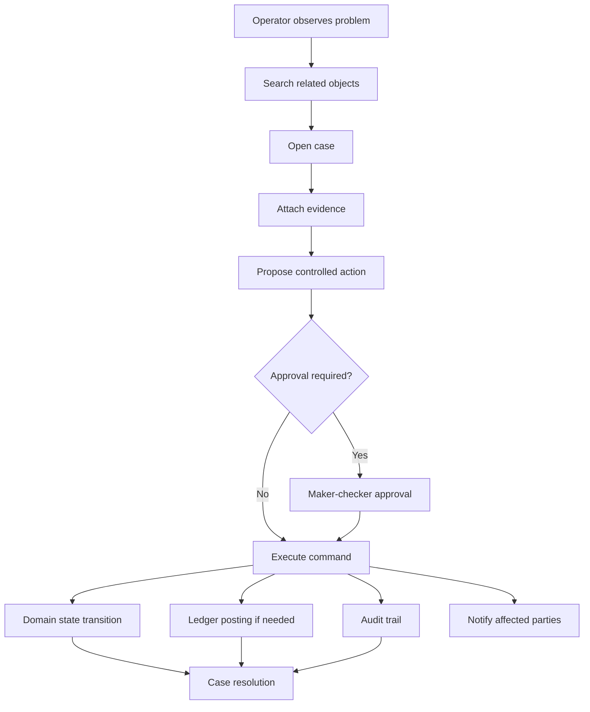
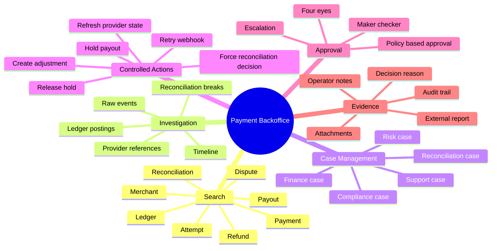
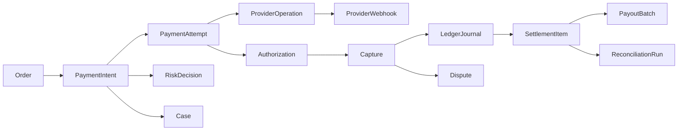
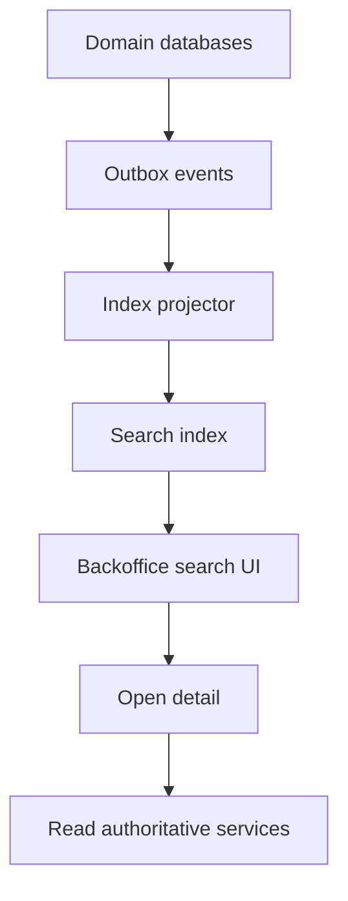
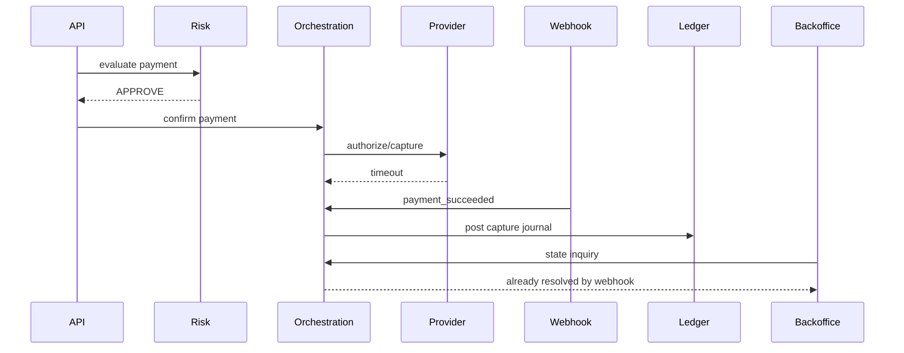
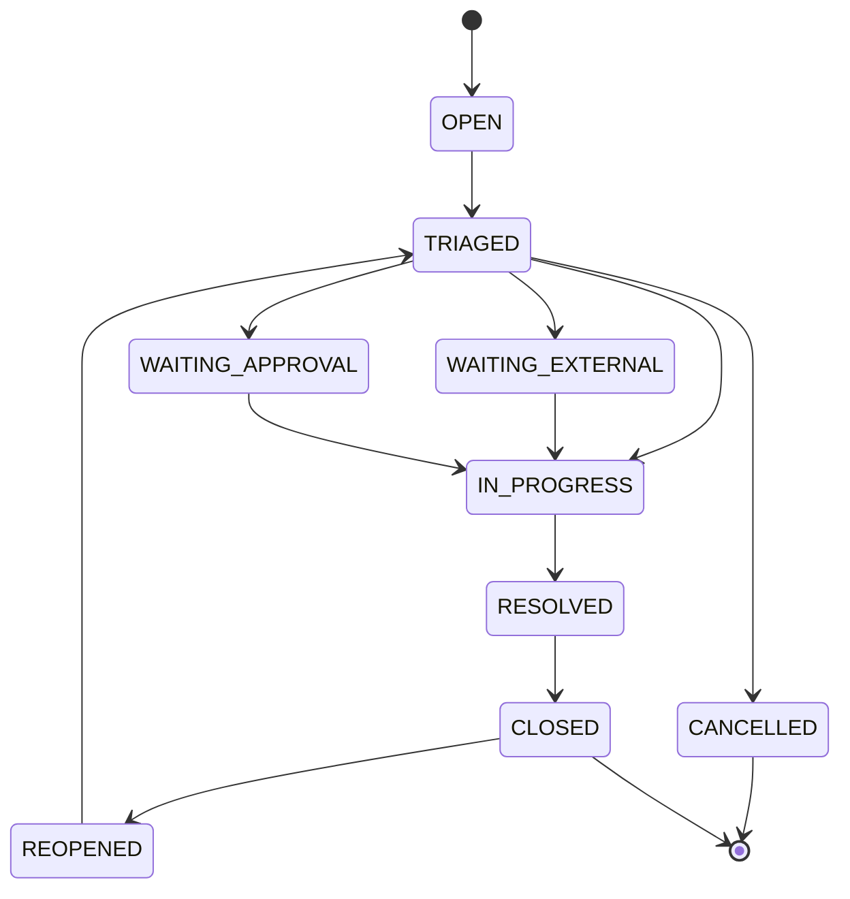
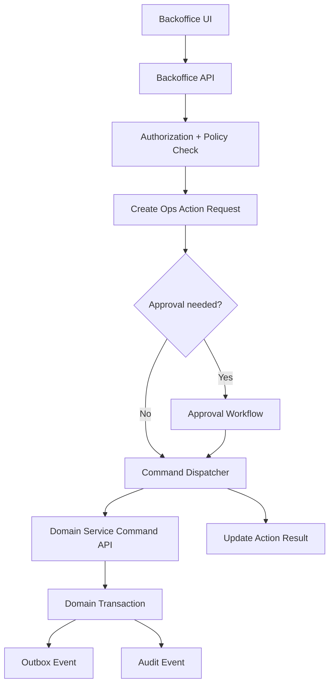
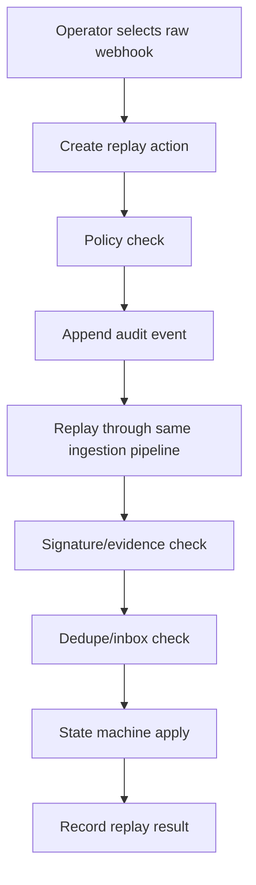
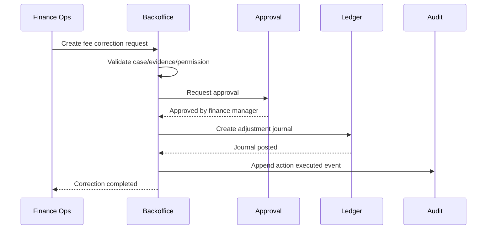

------
title: Build From Scratch: Large Production Grade Java Payment Systems - Part 053
description: Backoffice operations platform for production-grade Java payment systems, including operational search, case management, manual adjustment, approvals, auditability, ledger-safe commands, and repair workflows.
series: learn-java-payment-systems
seriesTitle: Build From Scratch: Large Production Grade Java Payment Systems
order: 53
partTitle: Backoffice Operations Platform
tags:
- java
- payments
- payment-systems
- backoffice
- operations
- case-management
- ledger
- audit
- enterprise-architecture
date: 2026-07-02
---

# Part 053 — Backoffice Operations Platform

Payment system yang production-grade tidak selesai ketika API pembayaran berhasil.

Justru setelah sistem live, sebagian besar masalah paling mahal muncul di ruang operasi:

- payment sukses di provider tetapi merchant melihat pending,
- webhook datang terlambat,
- settlement report tidak cocok,
- payout gagal tetapi saldo sudah reserved,
- refund double-requested oleh support,
- merchant meminta koreksi fee,
- bank statement punya credit yang tidak bisa dimatch,
- risk team perlu hold payout,
- compliance perlu freeze merchant,
- finance perlu adjustment yang bisa diaudit,
- customer support butuh jawaban yang benar tanpa membuka data sensitif.

Backoffice adalah tempat realitas production bertemu manusia.

Karena itu backoffice payment system bukan dashboard admin biasa. Ia adalah **operational control plane**.

Kalau salah desain, backoffice bisa menjadi jalur bypass yang lebih berbahaya daripada bug API publik.

## 1. Mental Model: Backoffice Is a Controlled Repair Surface

API publik dibuat untuk happy path dan predictable path.

Backoffice dibuat untuk:

- investigasi,
- exception handling,
- repair,
- override,
- approval,
- evidence gathering,
- manual intervention,
- finance correction,
- compliance action,
- customer support answer.

Tetapi repair tidak berarti bebas mengubah data.

Payment backoffice yang benar tidak memberi tombol “edit payment status”. Ia memberi command yang legal, sempit, beralasan, diaudit, dan punya efek ledger yang eksplisit.



Rule utama:

> Backoffice must never be a database editor. It must be a governed command interface over the same domain model as production flows.

## 2. Why Payment Backoffice Is Hard

Backoffice payment terlihat sederhana karena UI-nya sering hanya search, table, detail page, dan button.

Yang sulit bukan UI-nya.

Yang sulit adalah memastikan setiap tombol aman secara finansial.

Contoh tombol sederhana:

```text
Mark payment as succeeded
```

Kelihatannya praktis.

Tetapi pertanyaan yang harus dijawab:

- Apakah provider memang sukses?
- Apakah payment sudah pernah captured?
- Apakah ledger sudah diposting?
- Apakah settlement nanti akan membawa transaksi ini?
- Apakah merchant balance berubah?
- Apakah customer boleh menerima fulfilment?
- Apakah reconciliation akan match atau break?
- Apakah operator punya wewenang?
- Apakah action ini perlu approval?
- Apakah alasan dan evidence cukup?
- Apakah action bisa diulang secara idempotent?
- Bagaimana rollback-nya?

Karena itu production backoffice harus didesain sebagai bagian dari domain architecture.

Bukan fitur tambahan.

## 3. Backoffice Capability Map

Payment backoffice minimal punya capability berikut.



Backoffice bukan satu service raksasa.

Ia adalah layer di atas domain services:

- Payment Core,
- Ledger,
- Reconciliation,
- Settlement,
- Payout,
- Risk,
- Compliance,
- Merchant,
- Dispute,
- Audit.

Backoffice sebaiknya tidak memiliki ownership atas data finansial utama. Ia mengorkestrasi command ke owner yang benar.

## 4. Boundary: What Backoffice May and May Not Do

Backoffice boleh:

- membaca timeline lengkap,
- membuka case,
- mengusulkan action,
- menjalankan command yang sudah didefinisikan domain,
- meminta approval,
- menambahkan evidence,
- melakukan manual match reconciliation,
- membuat adjustment melalui ledger posting rule,
- memicu replay webhook,
- memicu provider state inquiry,
- hold/release sesuai policy,
- mengubah metadata operasional yang tidak mengubah financial truth.

Backoffice tidak boleh:

- update payment status langsung di database,
- update ledger balance langsung,
- menghapus ledger entry,
- menghapus webhook raw event,
- mengubah provider reference,
- bypass idempotency,
- mengubah amount transaksi historis,
- mengedit settlement batch yang sudah finalized,
- menjalankan payout tanpa balance reservation,
- mengubah audit trail,
- melihat PAN/CVC/raw secret,
- mengekspor data sensitif tanpa policy.

Tabel batas ownership:

| Object | Owner | Backoffice access |
|---|---|---|
| Payment intent | Payment Core | Read + controlled commands |
| Payment attempt | Payment Core / Orchestration | Read + inquiry/retry commands |
| Raw webhook | Webhook Ingestion | Read + replay/quarantine commands |
| Ledger journal | Ledger | Read + reversal/adjustment commands |
| Balance | Ledger Projection | Read only |
| Settlement batch | Settlement Engine | Read + approve/hold/release where legal |
| Reconciliation break | Reconciliation | Read + propose/manual match |
| Merchant restriction | Risk/Compliance/Merchant | Read + controlled capability command |
| Audit event | Audit Service | Append only by system |

## 5. Backoffice Object Graph

Operator jarang mencari satu object saja.

Mereka butuh melihat graph.

Satu transaksi bisa terkait dengan:

- customer order,
- merchant,
- payment intent,
- payment attempt,
- provider operation,
- provider webhook,
- authorization,
- capture,
- ledger journal,
- fee journal,
- settlement item,
- payout batch,
- bank statement item,
- reconciliation match/break,
- dispute,
- risk decision,
- support case.



Backoffice detail page harus menjawab pertanyaan:

> Apa yang terjadi, kapan, oleh siapa/apa, berdasarkan evidence apa, dan uangnya sekarang berada di mana?

## 6. Search Architecture

Payment backoffice butuh search yang kuat.

Tetapi search tidak boleh menjadi source of truth.

Pattern yang umum:



Search index dipakai untuk menemukan object.

Detail page harus membaca dari authoritative services/database read model.

Kenapa?

Karena search index bisa stale.

Kalau operator membuat keputusan finansial berdasarkan index stale, backoffice menjadi sumber bug.

### 6.1 Search Keys

Minimal searchable keys:

| Key | Contoh | Catatan |
|---|---|---|
| Payment ID | `pi_...` | Internal canonical ID |
| Attempt ID | `pa_...` | Per provider attempt |
| Provider reference | PSP transaction ID | Harus normalized dan indexed |
| Merchant reference | order ID | Bisa tidak unik global |
| Customer email/phone | masked/hash | Hati-hati privacy |
| Amount + currency | `100000 IDR` | Biasanya dikombinasi tanggal |
| Bank reference | VA number / RRN / STAN | Payment rail specific |
| Ledger journal ID | `lj_...` | Untuk finance investigation |
| Settlement batch ID | `sb_...` | Untuk settlement issue |
| Payout ID | `po_...` | Untuk outbound money movement |
| Dispute ID | `dp_...` | Untuk chargeback case |
| Reconciliation break ID | `rb_...` | Untuk finance ops |

### 6.2 Search Result Must Be Safe

Search result jangan menampilkan data sensitif.

Contoh aman:

```text
Payment pi_123
Merchant: m_456 / Example Store
Amount: IDR 150,000
Status: SUCCEEDED
Method: CARD •••• 4242
Created: 2026-07-02 10:12:22 WIB
Provider: provider_a
```

Contoh buruk:

```text
Card: 4242424242424242
CVC: 123
Customer full address
Raw provider token
```

Backoffice user sering lebih luas daripada engineer. Jangan beri data sensitif hanya karena “internal”.

## 7. Timeline as the Primary Debugging View

Payment investigation harus timeline-first.

Bukan table-first.

Timeline menyatukan event dari banyak subsystem:

- API command received,
- idempotency hit/miss,
- risk decision,
- route selected,
- provider request sent,
- provider response received,
- webhook received,
- state transition,
- ledger journal posted,
- reconciliation item matched,
- settlement included,
- payout created,
- operator action executed.



Timeline harus menampilkan:

- timestamp business,
- timestamp received,
- source system,
- actor,
- event type,
- correlation ID,
- idempotency key,
- provider reference,
- before/after state,
- ledger journal if any,
- evidence link.

## 8. Case Management Model

Backoffice tanpa case management akan berubah menjadi Slack-driven operations.

Slack boleh untuk komunikasi, tetapi bukan system of record.

Case adalah container untuk:

- masalah,
- owner,
- severity,
- evidence,
- timeline,
- notes,
- tasks,
- approvals,
- commands,
- resolution,
- postmortem link.

### 8.1 Case Types

| Case type | Trigger | Owner utama |
|---|---|---|
| Support case | Customer/merchant complaint | Support Ops |
| Payment investigation | Unknown/mismatch payment | Payment Ops |
| Reconciliation break | Internal vs external mismatch | Finance Ops |
| Settlement exception | Payout/settlement issue | Settlement Ops |
| Risk review | Fraud/velocity/suspicious pattern | Risk Ops |
| Compliance review | KYB/sanctions/AML issue | Compliance |
| Dispute case | Chargeback/retrieval | Dispute Ops |
| Incident case | Broad production degradation | SRE/Incident Commander |

### 8.2 Case State Machine



State case tidak sama dengan state payment.

Case bisa resolved walaupun payment tetap failed.

Case bisa reopened walaupun payment status tidak berubah.

## 9. Case Data Model

Contoh schema awal:

```sql
create table ops_case (
    id uuid primary key,
    case_number text not null unique,
    case_type text not null,
    severity text not null,
    status text not null,
    title text not null,
    description text,
    merchant_id uuid,
    customer_reference text,
    owner_user_id uuid,
    team text not null,
    created_by uuid not null,
    created_at timestamptz not null,
    updated_at timestamptz not null,
    closed_at timestamptz,
    resolution_code text,
    resolution_summary text,
    constraint ops_case_status_check check (
        status in ('OPEN','TRIAGED','IN_PROGRESS','WAITING_EXTERNAL','WAITING_APPROVAL','RESOLVED','CLOSED','REOPENED','CANCELLED')
    )
);

create table ops_case_link (
    id uuid primary key,
    case_id uuid not null references ops_case(id),
    object_type text not null,
    object_id text not null,
    relation_type text not null,
    created_at timestamptz not null,
    created_by uuid not null,
    unique (case_id, object_type, object_id, relation_type)
);

create table ops_case_note (
    id uuid primary key,
    case_id uuid not null references ops_case(id),
    note_type text not null,
    body text not null,
    created_by uuid not null,
    created_at timestamptz not null,
    redaction_level text not null default 'INTERNAL'
);

create table ops_case_evidence (
    id uuid primary key,
    case_id uuid not null references ops_case(id),
    evidence_type text not null,
    storage_key text not null,
    sha256_hex text not null,
    uploaded_by uuid not null,
    uploaded_at timestamptz not null,
    retention_class text not null,
    classification text not null
);
```

`ops_case_link` penting karena case bisa link ke banyak object.

Jangan menaruh semua foreign key langsung di `ops_case`. Payment platform akan punya terlalu banyak object type.

## 10. Controlled Action Model

Backoffice action harus dimodelkan sebagai command.

Contoh action:

- `REFRESH_PROVIDER_STATE`,
- `REPLAY_WEBHOOK`,
- `MOVE_WEBHOOK_TO_QUARANTINE`,
- `RELEASE_WEBHOOK_FROM_QUARANTINE`,
- `CREATE_LEDGER_ADJUSTMENT`,
- `CREATE_REFUND_CORRECTION`,
- `HOLD_PAYOUT`,
- `RELEASE_PAYOUT_HOLD`,
- `MANUAL_RECONCILIATION_MATCH`,
- `MARK_RECONCILIATION_BREAK_AS_ACCEPTED`,
- `FREEZE_MERCHANT_CAPABILITY`,
- `UNFREEZE_MERCHANT_CAPABILITY`,
- `REQUEST_SETTLEMENT_REBUILD`,
- `REGENERATE_MERCHANT_STATEMENT`.

Setiap action punya:

- actor,
- role/capability,
- target object,
- reason code,
- free-text reason,
- evidence requirement,
- idempotency key,
- approval requirement,
- risk level,
- expected domain effect,
- expected ledger effect,
- audit event.

```sql
create table ops_action_request (
    id uuid primary key,
    action_type text not null,
    target_type text not null,
    target_id text not null,
    case_id uuid references ops_case(id),
    status text not null,
    requested_by uuid not null,
    requested_at timestamptz not null,
    reason_code text not null,
    reason_text text not null,
    idempotency_key text not null,
    request_payload jsonb not null,
    risk_level text not null,
    executed_at timestamptz,
    executed_by uuid,
    result_payload jsonb,
    error_code text,
    error_message text,
    unique (action_type, target_type, target_id, idempotency_key),
    constraint ops_action_status_check check (
        status in ('DRAFT','REQUESTED','APPROVED','REJECTED','EXECUTING','SUCCEEDED','FAILED','CANCELLED')
    )
);
```

Backoffice action request adalah audit anchor.

Bahkan jika action gagal, kegagalan itu harus tercatat.

## 11. Command Execution Pattern

Jangan biarkan UI memanggil database domain langsung.

Pattern yang lebih aman:



Backoffice API bertanggung jawab untuk:

- authentication,
- authorization,
- policy check,
- action request creation,
- approval workflow,
- audit context,
- command dispatch,
- result recording.

Domain service bertanggung jawab untuk:

- invariant,
- state transition,
- ledger posting,
- idempotency,
- consistency,
- events.

## 12. Manual Adjustment Is Not Manual Balance Edit

Manual adjustment sering diperlukan.

Contoh:

- fee correction,
- settlement correction,
- goodwill credit,
- chargeback fee correction,
- reconciliation correction,
- rounding correction,
- provider report correction,
- merchant compensation,
- operational loss booking.

Tetapi adjustment harus lewat ledger.

Jangan pernah:

```sql
update merchant_balance set available = available + 100000 where merchant_id = ...;
```

Yang benar:

```text
Create ledger journal:
  Debit  Platform Operational Loss Expense  IDR 100,000
  Credit Merchant Payable                   IDR 100,000
Reason: SETTLEMENT_CORRECTION
Case: CASE-2026-000123
Evidence: provider settlement file + finance approval
```

### 12.1 Adjustment Request Schema

```sql
create table ledger_adjustment_request (
    id uuid primary key,
    case_id uuid not null references ops_case(id),
    merchant_id uuid,
    currency char(3) not null,
    amount_minor numeric(38, 0) not null,
    adjustment_type text not null,
    reason_code text not null,
    reason_text text not null,
    status text not null,
    requested_by uuid not null,
    requested_at timestamptz not null,
    approved_by uuid,
    approved_at timestamptz,
    ledger_journal_id uuid,
    idempotency_key text not null unique,
    constraint adjustment_amount_positive check (amount_minor > 0)
);
```

Direction jangan disimpan sebagai tanda negatif bebas.

Lebih aman memakai `adjustment_type` dan posting rule.

Contoh:

| Adjustment type | Debit | Credit |
|---|---|---|
| MERCHANT_CREDIT | Platform Ops Loss | Merchant Payable |
| MERCHANT_DEBIT | Merchant Payable | Platform Ops Recovery |
| FEE_REFUND | Platform Revenue | Merchant Payable |
| RESERVE_RELEASE_CORRECTION | Merchant Reserve | Merchant Available |
| RESERVE_HOLD_CORRECTION | Merchant Available | Merchant Reserve |

## 13. Reconciliation Operations

Reconciliation break sering butuh intervensi manusia.

Tetapi manual match harus tetap terkendali.

Action reconciliation:

- accept exact match,
- accept tolerance match,
- manual many-to-one match,
- manual one-to-many match,
- classify as timing difference,
- classify as provider fee difference,
- classify as bank fee difference,
- classify as duplicate external record,
- create correction proposal,
- send to provider investigation,
- mark as unrecoverable after approval.

Manual match tidak boleh hanya mengubah status break.

Ia harus menyimpan:

- records yang dimatch,
- rule/version atau manual reason,
- amount delta,
- tolerance policy,
- actor,
- approver if needed,
- resulting ledger correction if any.

```sql
create table reconciliation_manual_decision (
    id uuid primary key,
    break_id uuid not null,
    decision_type text not null,
    reason_code text not null,
    reason_text text not null,
    amount_delta_minor numeric(38, 0),
    currency char(3),
    decided_by uuid not null,
    decided_at timestamptz not null,
    approved_by uuid,
    approved_at timestamptz,
    correction_journal_id uuid,
    evidence_id uuid references ops_case_evidence(id)
);
```

## 14. Webhook Replay and Repair

Webhook repair adalah fitur backoffice yang sangat berguna dan sangat berbahaya.

Command yang aman:

- replay raw webhook event yang sudah tersimpan,
- re-run parser/mapping version tertentu,
- re-run state transition idempotently,
- move event from quarantine to retry queue,
- mark poison after investigation,
- fetch provider current state.

Command yang tidak aman:

- create fake webhook tanpa evidence,
- edit raw webhook payload,
- delete duplicate webhook,
- force apply webhook walaupun signature invalid,
- skip state machine validation.

Webhook replay harus idempotent.



Replay harus melewati pipeline yang sama. Jangan buat shortcut khusus backoffice yang langsung mengubah state.

## 15. Provider State Inquiry

Untuk unknown payment state, operator sering butuh tombol:

```text
Refresh from provider
```

Tombol ini tidak boleh hanya “call provider and update status”.

Harus menjadi command:

```text
ProviderStateInquiryCommand
- target payment attempt
- provider account
- provider reference
- initiated by operator/system
- reason
- idempotency key
- inquiry timeout policy
```

Hasil inquiry harus dicatat sebagai evidence.

Jika provider mengatakan succeeded, domain service tetap harus cek:

- apakah amount cocok,
- currency cocok,
- merchant/account cocok,
- reference cocok,
- state transition legal,
- ledger posting belum ada,
- operation idempotency belum pernah dipakai.

## 16. Merchant and Capability Operations

Backoffice sering punya tombol untuk merchant:

- enable card payment,
- disable payout,
- freeze settlement,
- change risk tier,
- set reserve percentage,
- change payout schedule,
- update processing limit,
- block refund,
- require manual review.

Semua ini adalah control-plane change.

Harus ada:

- effective time,
- expiration time if temporary,
- reason,
- approver,
- policy impact preview,
- affected payment methods,
- affected pending transactions,
- audit trail.

Contoh command:

```java
public record SetMerchantCapabilityRestrictionCommand(
    UUID merchantId,
    String capability,
    RestrictionMode mode,
    Instant effectiveAt,
    Optional<Instant> expiresAt,
    String reasonCode,
    String reasonText,
    UUID requestedBy,
    UUID caseId,
    String idempotencyKey
) {}
```

Jangan membuat boolean liar seperti:

```text
merchant.payout_enabled = false
```

Lebih baik punya restriction model:

```text
MERCHANT_CAPABILITY_RESTRICTION
- capability: PAYOUT
- mode: BLOCK
- reason: RISK_REVIEW
- source: BACKOFFICE
- effective_at
- expires_at
- status
```

Dengan begitu policy engine bisa menjawab:

```text
Can merchant m_123 create payout now?
No. Blocked by restriction RISK_REVIEW until 2026-07-05.
```

## 17. Support View vs Finance View vs Risk View

Tidak semua operator perlu melihat hal yang sama.

| View | Fokus | Sensitive access |
|---|---|---|
| Support | Customer/merchant answer | Minimum, masked |
| Payment Ops | Payment lifecycle repair | Provider refs, timeline |
| Finance Ops | Ledger, reconciliation, settlement | Amount/accounting detail |
| Risk Ops | Fraud signals, holds, review | Risk signals, device/customer linkage |
| Compliance | KYB, sanctions, freeze | Identity/evidence data |
| Engineering/SRE | Technical event, trace, logs | Operational metadata, not raw secrets |

Backoffice perlu view-level authorization.

Jangan hanya `ADMIN`.

Payment platform dengan role `ADMIN` tunggal akan sulit lolos audit dan sulit dikendalikan saat organisasi tumbuh.

## 18. Authorization Model for Backoffice

Minimal model:

```text
Subject: operator identity
Role: support_ops, payment_ops, finance_ops, risk_ops, compliance_ops, sre
Permission: action-level ability
Scope: merchant, region, currency, payment method, amount limit
Condition: time, approval, case required, evidence required
```

Contoh permission:

```yaml
permission: payment.provider_state_inquiry
scope:
  region: ID
  payment_method: CARD
conditions:
  case_required: true
  max_actions_per_hour: 20
```

Contoh action yang lebih kuat:

```yaml
permission: ledger.manual_adjustment.create
scope:
  currency: IDR
conditions:
  max_amount_minor: 100000000
  approval_required: true
  approver_role: finance_manager
  case_required: true
  evidence_required: true
```

Part 054 akan membahas operational safety controls ini lebih dalam.

## 19. Java Service Boundary

Backoffice service sebaiknya tidak langsung import repository dari Payment Core/Ledger.

Gunakan application-level command ports.

```java
public interface PaymentOperationsPort {
    ProviderStateInquiryResult inquireProviderState(ProviderStateInquiryCommand command);
    WebhookReplayResult replayWebhook(WebhookReplayCommand command);
    PaymentTimeline getPaymentTimeline(PaymentTimelineQuery query);
}

public interface LedgerOperationsPort {
    LedgerAdjustmentResult createAdjustment(CreateLedgerAdjustmentCommand command);
    LedgerJournalView getJournal(UUID journalId);
    AccountStatementView getAccountStatement(AccountStatementQuery query);
}

public interface ReconciliationOperationsPort {
    ManualMatchResult createManualMatch(CreateManualMatchCommand command);
    BreakView getBreak(UUID breakId);
}
```

Backoffice API melakukan authorization dan workflow.

Domain port melakukan invariant.

## 20. Example: Safe Manual Fee Correction

Scenario:

Merchant dikenakan fee IDR 10,000 padahal harusnya IDR 7,500.

Bad solution:

```sql
update merchant_balance set available = available + 2500;
```

Safe flow:



Ledger posting:

```text
Debit  Platform Fee Revenue        IDR 2,500
Credit Merchant Payable            IDR 2,500
```

Evidence:

- original fee calculation snapshot,
- pricing plan version,
- merchant contract reference,
- approval,
- adjustment journal ID.

## 21. Example: Unknown Payment Repair

Scenario:

Client received timeout. Provider later shows payment successful. Webhook was lost or quarantined.

Safe flow:

1. Operator opens payment timeline.
2. Sees provider operation timeout.
3. Sees no succeeded webhook.
4. Opens case.
5. Runs provider state inquiry.
6. Inquiry returns `SUCCEEDED` with matching amount/currency/reference.
7. Payment Core applies legal transition from `UNKNOWN` to `SUCCEEDED`.
8. Ledger posts capture journal idempotently.
9. Case resolves.

Unsafe flow:

```text
Operator changes payment.status = SUCCEEDED in DB.
```

Why unsafe?

- no provider evidence,
- no ledger posting,
- no idempotency,
- no state machine validation,
- no reconciliation link,
- no audit event.

## 22. Backoffice API Shape

Example endpoints:

```http
GET /ops/payments/{paymentId}/timeline
GET /ops/search?q=...
POST /ops/cases
POST /ops/cases/{caseId}/links
POST /ops/cases/{caseId}/notes
POST /ops/actions/provider-state-inquiry
POST /ops/actions/webhook-replay
POST /ops/actions/ledger-adjustment
POST /ops/actions/reconciliation-manual-match
POST /ops/actions/payout-hold
POST /ops/actions/payout-release
GET /ops/actions/{actionId}
```

Backoffice command response should not hide asynchronous workflow.

```json
{
  "actionId": "act_01J...",
  "status": "WAITING_APPROVAL",
  "approvalRequired": true,
  "requiredApproverRole": "FINANCE_MANAGER",
  "caseId": "case_01J..."
}
```

Or:

```json
{
  "actionId": "act_01J...",
  "status": "SUCCEEDED",
  "domainResult": {
    "ledgerJournalId": "lj_01J...",
    "paymentId": "pi_01J..."
  }
}
```

## 23. Audit Event for Backoffice Action

Audit event should be structured.

```json
{
  "eventType": "OPS_ACTION_EXECUTED",
  "eventId": "audit_01J...",
  "occurredAt": "2026-07-02T10:12:22Z",
  "actor": {
    "userId": "usr_123",
    "role": "FINANCE_OPS",
    "sessionId": "sess_456",
    "ipAddressHash": "..."
  },
  "action": {
    "actionId": "act_789",
    "actionType": "CREATE_LEDGER_ADJUSTMENT",
    "targetType": "MERCHANT",
    "targetId": "m_123"
  },
  "reason": {
    "code": "FEE_CORRECTION",
    "textHash": "..."
  },
  "caseId": "case_123",
  "approvalId": "appr_123",
  "result": {
    "status": "SUCCEEDED",
    "ledgerJournalId": "lj_123"
  }
}
```

Free text reason boleh disimpan, tetapi hati-hati PII.

Untuk audit query, gunakan structured fields.

## 24. Operational Dashboards

Backoffice harus punya dashboard untuk operasi, bukan hanya reporting bisnis.

Minimal:

- open cases by type/severity/age,
- actions waiting approval,
- failed ops actions,
- unknown payments pending resolution,
- quarantined webhooks,
- reconciliation breaks by age/amount,
- payout holds,
- merchant freezes,
- manual adjustments by amount/user/team,
- high-risk operators/actions,
- SLA breach,
- break-glass sessions,
- failed authorization attempts,
- policy denials.

Metric penting:

```text
ops_case_open_total{case_type,severity}
ops_case_age_seconds_bucket{case_type,severity}
ops_action_total{action_type,status}
ops_action_approval_wait_seconds_bucket{action_type}
ops_manual_adjustment_amount_minor_sum{currency,reason_code}
ops_webhook_replay_total{provider,result}
ops_provider_inquiry_total{provider,result}
ops_reconciliation_manual_match_total{decision_type}
```

## 25. Backoffice UX Principles

Backoffice UX bukan estetika saja. UX yang buruk bisa menyebabkan kerugian finansial.

Prinsip:

1. **Show money impact before action.**
2. **Show irreversible warning for finalized financial actions.**
3. **Require reason and evidence for high-risk action.**
4. **Make stale data visible.**
5. **Show current state and allowed actions only.**
6. **Prefer command preview over blind submit.**
7. **Use comparison view for before/after.**
8. **Show policy denial reason.**
9. **Mask sensitive data by default.**
10. **Make audit trail visible to operator.**

Example preview:

```text
Action: Create Merchant Credit Adjustment
Merchant: Example Store
Amount: IDR 2,500
Reason: Fee correction
Ledger impact:
  Debit  Platform Fee Revenue  IDR 2,500
  Credit Merchant Payable      IDR 2,500
Requires approval: Yes, Finance Manager
Can be reversed: Yes, via reversal journal
```

## 26. Failure Modes

| Failure | Bad design result | Correct design response |
|---|---|---|
| Operator clicks twice | Double adjustment | Action idempotency key |
| Browser timeout | Unknown whether action executed | Action request status lookup |
| Approval after target changed | Stale dangerous action | Revalidate at execution time |
| Search index stale | Wrong decision | Read authoritative detail before action |
| Operator lacks context | Wrong repair | Case/evidence required |
| Manual match wrong | Hidden reconciliation error | Manual decision audit + reversal path |
| Admin abuse | Unauthorized money movement | SoD, approval, limits, audit |
| Sensitive data copied to notes | Compliance leak | Redaction/scanning/classification |
| Emergency access overused | Control bypass | Break-glass expiry/review |

## 27. Testing Strategy

Test backoffice like production money movement.

### 27.1 Permission Tests

- support cannot create ledger adjustment,
- finance ops cannot unfreeze sanctions block,
- risk ops cannot see full bank account number,
- SRE cannot create payout without approval,
- approver cannot approve their own request.

### 27.2 Idempotency Tests

- double submit action request,
- browser retry after timeout,
- repeated command dispatcher retry,
- domain service duplicate command,
- approval callback duplicate.

### 27.3 Ledger Safety Tests

- adjustment must create balanced journal,
- direct balance mutation impossible,
- reversal creates new journal,
- correction links to case and evidence,
- amount sign cannot bypass posting rule.

### 27.4 Workflow Tests

- approval required by amount,
- approval rejected,
- approval expires,
- target state changes before approval,
- command fails after approval,
- case cannot close while action executing.

### 27.5 Audit Tests

- every action has audit event,
- actor/session captured,
- reason captured,
- approval captured,
- before/after state captured,
- sensitive fields redacted.

## 28. Anti-Patterns

### 28.1 One Big Admin Role

`ROLE_ADMIN` is not an operational model.

It is a risk acceptance statement disguised as authorization.

### 28.2 Direct Database Fixes as Normal Workflow

Emergency SQL might happen during incident.

But if it becomes normal operational workflow, the system architecture has failed.

### 28.3 Status Override Without Ledger Effect

Changing status without ledger posting creates split-brain financial truth.

### 28.4 Audit Logs as Text

Text logs are useful, but payment operations need structured audit events.

### 28.5 No Case Requirement for High-Risk Action

If an operator can create money-impacting adjustment without case/evidence, the platform is not defensible.

### 28.6 Backoffice Bypasses Domain Invariants

The domain model must protect against internal callers too.

Internal caller does not mean safe caller.

## 29. Build Order

Implement backoffice in this order:

1. read-only search,
2. object timeline,
3. case management,
4. action request model,
5. audit event integration,
6. low-risk command execution,
7. approval workflow,
8. ledger adjustment via posting rule,
9. reconciliation manual decision,
10. risk/compliance restrictions,
11. break-glass and emergency workflow,
12. dashboards and review reports.

Do not start with the dangerous buttons.

Start with visibility.

Then controlled action.

## 30. Production Readiness Checklist

Backoffice is production-ready only if:

- every write action is a domain command,
- every action is authorized at action-level,
- high-risk actions require case/evidence/reason,
- high-risk actions require approval,
- maker cannot approve own request,
- every action is idempotent,
- ledger-impacting action posts balanced journal,
- direct balance edit is impossible,
- raw evidence is immutable,
- audit trail is structured and searchable,
- sensitive data is masked by default,
- search index is not source of truth,
- stale detail view blocks dangerous action,
- break-glass is time-limited and reviewed,
- dashboard shows pending/failing actions,
- reconciliation/settlement/backoffice actions are linked.

## 31. Key Takeaways

Backoffice bukan admin UI.

Backoffice adalah operational safety layer untuk production payment system.

Desain yang benar:

- memperlihatkan realitas sistem,
- mengikat tindakan ke case dan evidence,
- menjalankan command domain yang legal,
- membuat efek ledger eksplisit,
- menerapkan approval dan separation of duties,
- menjaga audit trail defensible,
- mencegah operator menjadi sumber hidden financial drift.

Kalau API publik adalah pintu depan payment platform, backoffice adalah ruang kontrol.

Ruang kontrol harus lebih aman daripada pintu depan, bukan sebaliknya.

## References

- NIST SP 800-53 Rev. 5, Security and Privacy Controls for Information Systems and Organizations: https://csrc.nist.gov/pubs/sp/800/53/r5/upd1/final
- PCI Security Standards Council, PCI DSS v4.0.1 document library: https://www.pcisecuritystandards.org/document_library/
- OWASP Application Security Verification Standard: https://owasp.org/www-project-application-security-verification-standard/
- Martin Fowler, Accounting Transaction: https://martinfowler.com/eaaDev/AccountingTransaction.html
- Stripe Docs, Balance and payout reconciliation reports: https://docs.stripe.com/reports/payout-reconciliation
- Adyen Docs, Settlement reconciliation reports: https://docs.adyen.com/reporting/settlement-reconciliation/
