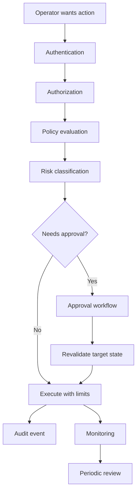
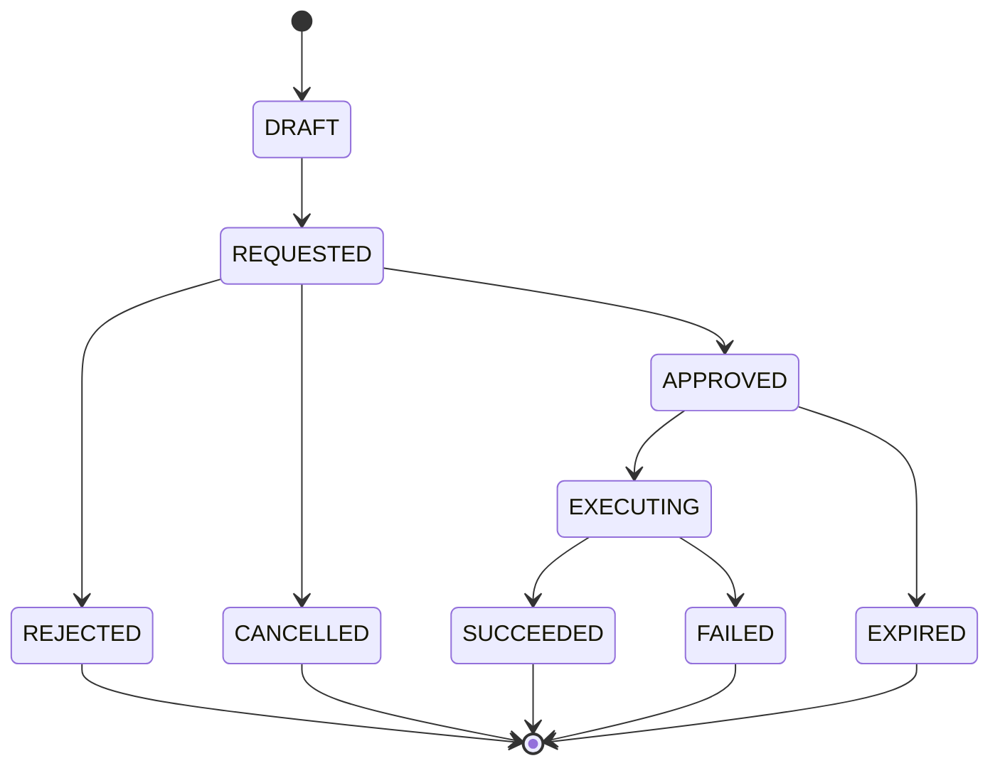
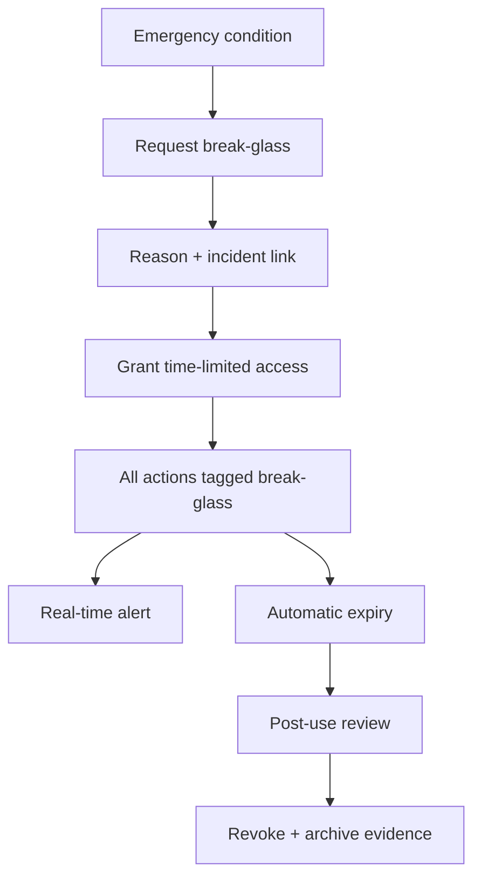
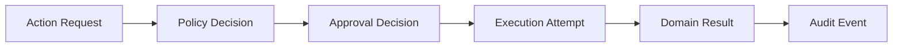

------
title: Build From Scratch: Large Production Grade Java Payment Systems - Part 054
description: Operational safety controls for production-grade Java payment systems, including maker-checker, four-eyes approval, separation of duties, action limits, break-glass access, emergency controls, and auditability.
series: learn-java-payment-systems
seriesTitle: Build From Scratch: Large Production Grade Java Payment Systems
order: 54
partTitle: Operational Safety Controls
tags:
- java
- payments
- payment-systems
- operational-safety
- maker-checker
- four-eyes
- access-control
- audit
- compliance
- enterprise-architecture
date: 2026-07-02
---

# Part 054 — Operational Safety Controls

Backoffice memberi manusia kemampuan untuk memperbaiki sistem.

Kemampuan itu juga bisa merusak sistem.

Di payment platform, operator yang salah klik bisa:

- mengirim payout dua kali,
- melepas hold merchant yang sedang diselidiki,
- membuat adjustment besar tanpa dasar,
- membalik hasil reconciliation,
- membuka akses data sensitif,
- menandai payment sukses tanpa ledger,
- menghapus jejak operasional,
- mengubah capability merchant sehingga transaksi berisiko berjalan.

Operational safety controls adalah lapisan yang memastikan manusia tetap bisa bekerja, tetapi tidak bisa diam-diam menghancurkan kebenaran finansial.

## 1. Mental Model: Internal Users Are Part of the Threat Model

Banyak engineer mendesain security untuk attacker eksternal.

Payment system harus mendesain security untuk:

- attacker eksternal,
- compromised account,
- malicious insider,
- operator lelah,
- support yang salah interpretasi,
- engineer yang terburu-buru saat incident,
- manager yang override policy tanpa evidence,
- automation yang salah rule,
- approval yang diberikan tanpa konteks.

Internal user bukan otomatis trusted.

Mereka adalah actor dengan capability terbatas.



Rule utama:

> Operational safety is not a UI confirmation dialog. It is a policy-driven execution system for privileged actions.

## 2. Control Taxonomy

Operational safety controls bisa dikelompokkan menjadi beberapa kategori.

| Control | Fungsi |
|---|---|
| Authentication | Membuktikan siapa operatornya |
| Authorization | Menentukan action apa yang boleh dilakukan |
| Least privilege | Memberi akses minimum yang dibutuhkan |
| Separation of duties | Memecah tanggung jawab agar satu orang tidak punya end-to-end control |
| Maker-checker | Request dibuat satu orang, disetujui orang lain |
| Four-eyes principle | Aksi penting dilihat/disetujui minimal dua orang |
| Action limits | Membatasi nominal, frekuensi, scope, dan waktu |
| Case/evidence requirement | Mengikat action ke alasan dan bukti |
| Stale-state protection | Mencegah approval lama dieksekusi pada state baru |
| Break-glass | Emergency access yang time-bound dan heavily audited |
| Dual control | Dua pihak harus hadir untuk action sangat kritikal |
| Audit trail | Membuat semua tindakan bisa direkonstruksi |
| Periodic review | Menemukan akses/action abnormal setelah kejadian |

NIST SP 800-53 Rev. 5 mencakup kontrol seperti AC-5 Separation of Duties dan AC-6 Least Privilege. PCI DSS juga menekankan pembatasan akses dan logging/monitoring akses terhadap system components dan cardholder data environment.

## 3. Action Risk Classification

Tidak semua backoffice action sama risikonya.

Gunakan risk class.

```text
LOW       Read-only / no financial impact
MEDIUM    Operational retry / repair idempotent
HIGH      Money-impacting or merchant capability-changing
CRITICAL  Irreversible, large amount, compliance override, security-sensitive
```

Contoh:

| Action | Risk class | Reason |
|---|---:|---|
| View masked payment timeline | LOW | Read-only |
| Replay webhook through same pipeline | MEDIUM | Idempotent repair, limited effect |
| Run provider state inquiry | MEDIUM | External call, evidence-generating |
| Hold payout | HIGH | Blocks merchant funds |
| Release payout hold | HIGH/CRITICAL | Can release risky money |
| Create IDR 50,000 adjustment | HIGH | Money impact |
| Create IDR 500,000,000 adjustment | CRITICAL | Large financial impact |
| Disable sanctions restriction | CRITICAL | Compliance impact |
| Export customer data | HIGH/CRITICAL | Privacy/security impact |
| Break-glass database access | CRITICAL | Broad power |

Risk class drives controls:

| Risk class | Controls |
|---|---|
| LOW | Authenticated, logged |
| MEDIUM | Permission, reason, rate limit, audit |
| HIGH | Case, evidence, maker-checker, amount/frequency limit |
| CRITICAL | Senior approval, dual control, time window, post-action review, alert |

## 4. Permission Model: Beyond Roles

`ROLE_ADMIN` is not enough.

Payment operations need action-level permission.

A good permission model includes:

```text
subject      = who
permission   = what action
target       = on which object
scope        = merchant/region/currency/payment method
condition    = amount/time/case/evidence/approval
context      = incident mode? normal mode? break-glass?
```

Example permissions:

```yaml
- permission: payment.timeline.read
  scope:
    region: ID
  conditions:
    pii_masked: true

- permission: payout.hold.create
  scope:
    currency: IDR
  conditions:
    case_required: true
    reason_required: true

- permission: payout.hold.release
  scope:
    currency: IDR
  conditions:
    case_required: true
    approval_required: true
    approver_must_differ_from_requester: true

- permission: ledger.adjustment.create
  scope:
    currency: IDR
  conditions:
    max_amount_minor_without_senior_approval: 100000000
    evidence_required: true
    approval_required: true
```

Authorization decision should be explicit:

```json
{
  "allowed": false,
  "reasonCode": "APPROVAL_REQUIRED",
  "requiredControls": [
    "CASE_REQUIRED",
    "EVIDENCE_REQUIRED",
    "FINANCE_MANAGER_APPROVAL"
  ]
}
```

Do not return only `403` to the UI.

Operator needs to know what control is missing.

## 5. Policy Decision Object

Use a structured policy decision object.

```java
public record OperationalPolicyDecision(
    boolean allowed,
    String decisionCode,
    RiskClass riskClass,
    List<RequiredControl> requiredControls,
    List<String> denialReasons,
    Optional<ApprovalRequirement> approvalRequirement,
    Optional<ActionLimit> effectiveLimit,
    Map<String, String> evidenceRequirements
) {}
```

Example:

```json
{
  "allowed": false,
  "decisionCode": "WAITING_APPROVAL",
  "riskClass": "HIGH",
  "requiredControls": [
    "CASE_REQUIRED",
    "EVIDENCE_REQUIRED",
    "MAKER_CHECKER"
  ],
  "approvalRequirement": {
    "approverRole": "FINANCE_MANAGER",
    "minimumApprovers": 1,
    "requesterCannotApprove": true
  }
}
```

This lets UI show actionable requirements while backend remains authoritative.

## 6. Maker-Checker Pattern

Maker-checker means:

- maker creates request,
- checker reviews and approves/rejects,
- maker cannot approve own request,
- execution happens after approval,
- target state is revalidated before execution,
- both maker and checker are audited.



### 6.1 Maker-Checker Schema

```sql
create table approval_request (
    id uuid primary key,
    action_request_id uuid not null,
    approval_policy_id uuid not null,
    status text not null,
    requested_by uuid not null,
    requested_at timestamptz not null,
    expires_at timestamptz not null,
    target_snapshot_hash text not null,
    approval_summary jsonb not null,
    constraint approval_status_check check (
        status in ('REQUESTED','APPROVED','REJECTED','CANCELLED','EXPIRED')
    )
);

create table approval_decision (
    id uuid primary key,
    approval_request_id uuid not null references approval_request(id),
    decision text not null,
    decided_by uuid not null,
    decided_at timestamptz not null,
    reason text,
    actor_role text not null,
    actor_team text not null,
    constraint approval_decision_check check (decision in ('APPROVE','REJECT'))
);

create unique index approval_one_decision_per_actor
on approval_decision(approval_request_id, decided_by);
```

For multi-approver policies, do not collapse to one row with `approved_by`.

Use decision rows.

### 6.2 Approver Cannot Be Maker

This rule should be enforced in code and database if possible.

```java
if (approval.requestedBy().equals(decision.decidedBy())) {
    throw new PolicyViolationException("REQUESTER_CANNOT_APPROVE_OWN_ACTION");
}
```

But code is not enough.

Also make it visible in policy result, UI, and audit.

## 7. Four-Eyes and Multi-Approval

Four-eyes means at least two independent human reviews.

For critical actions, use multiple approval requirements:

```yaml
action: compliance.sanctions_block.override
riskClass: CRITICAL
approval:
  requirements:
    - role: COMPLIANCE_MANAGER
      minimum: 1
    - role: LEGAL_APPROVER
      minimum: 1
  requesterCannotApprove: true
  sameTeamOnly: false
  expiryMinutes: 60
```

For high-value ledger adjustment:

```yaml
action: ledger.adjustment.create
riskClass: CRITICAL
threshold:
  amountMinorGreaterThan: 1000000000
approval:
  requirements:
    - role: FINANCE_MANAGER
      minimum: 1
    - role: FINANCE_DIRECTOR
      minimum: 1
```

Four-eyes is not merely two button clicks.

The approver must see:

- action summary,
- target object,
- current state,
- amount impact,
- ledger impact,
- reason,
- evidence,
- requester,
- previous similar actions,
- policy flags,
- stale-state warning.

## 8. Stale Approval Protection

Approval can become stale.

Example:

1. Maker requests payout hold release.
2. Approver waits 30 minutes.
3. During that time, risk engine detects new fraud signal.
4. Approver approves old request.
5. Payout is released incorrectly.

Solution:

- capture target snapshot hash at request time,
- re-read target before execution,
- re-run policy evaluation,
- fail if critical fields changed,
- require new approval if stale.

```java
public void executeApprovedAction(UUID actionId) {
    ActionRequest action = actionRepo.get(actionId);
    ApprovalRequest approval = approvalRepo.getApproved(actionId);

    TargetSnapshot current = targetReader.snapshot(action.target());
    if (!current.hash().equals(approval.targetSnapshotHash())) {
        throw new StaleApprovalException("TARGET_CHANGED_AFTER_APPROVAL_REQUEST");
    }

    OperationalPolicyDecision decision = policy.evaluate(action, current);
    if (!decision.allowed()) {
        throw new PolicyViolationException(decision.decisionCode());
    }

    dispatcher.execute(action);
}
```

Some changes are harmless. Some are critical.

Do not hash everything blindly if it causes noise. Define material fields per action.

## 9. Action Limits

Action limits reduce blast radius.

Limits can be based on:

- amount,
- currency,
- merchant risk tier,
- operator role,
- operator tenure,
- team,
- region,
- time of day,
- action type,
- frequency,
- daily cumulative amount,
- case severity,
- incident mode.

Example:

```yaml
limits:
  ledger.adjustment.create:
    support_ops:
      max_amount_minor: 0
    finance_ops:
      max_amount_minor: 10000000
      daily_cumulative_minor: 50000000
    finance_manager:
      max_amount_minor: 100000000
      daily_cumulative_minor: 500000000
    finance_director:
      max_amount_minor: 5000000000
      approval_required: true
```

Action limit is not just authorization.

It must reserve/check cumulative usage to prevent many small actions bypassing one big threshold.

### 9.1 Cumulative Limit Counter

```sql
create table ops_action_limit_usage (
    id uuid primary key,
    subject_user_id uuid not null,
    permission text not null,
    currency char(3),
    window_start timestamptz not null,
    window_end timestamptz not null,
    used_amount_minor numeric(38, 0) not null default 0,
    used_count integer not null default 0,
    version bigint not null default 0,
    unique (subject_user_id, permission, currency, window_start, window_end)
);
```

Reserve limit usage before execution for high-risk actions.

Release if action cancelled/expired.

Do not check limit only after execution.

## 10. Case and Evidence Requirements

High-risk action must be attached to case and evidence.

Policy example:

```yaml
action: ledger.adjustment.create
required:
  case: true
  reasonCode: true
  evidence:
    anyOf:
      - RECONCILIATION_BREAK
      - PROVIDER_REPORT
      - FINANCE_APPROVAL_DOCUMENT
```

Evidence should be immutable:

- stored in object storage,
- content hash recorded,
- classification recorded,
- retention policy recorded,
- access logged.

Do not accept “because merchant asked” as sufficient for money-impacting adjustment.

## 11. Break-Glass Access

Break-glass is emergency access for exceptional situations.

It is not a shortcut for convenience.

Break-glass should be:

- explicit,
- time-limited,
- reason-required,
- incident-linked,
- separately approved if possible,
- heavily logged,
- alerted in real time,
- reviewed after use,
- automatically revoked.



Break-glass session should never silently become normal permission.

### 11.1 Break-Glass Schema

```sql
create table break_glass_session (
    id uuid primary key,
    user_id uuid not null,
    incident_id text not null,
    reason text not null,
    status text not null,
    requested_at timestamptz not null,
    approved_by uuid,
    approved_at timestamptz,
    starts_at timestamptz not null,
    expires_at timestamptz not null,
    closed_at timestamptz,
    review_status text not null default 'PENDING_REVIEW',
    constraint break_glass_status_check check (
        status in ('REQUESTED','APPROVED','ACTIVE','EXPIRED','REVOKED','CLOSED')
    )
);
```

Every audit event during session should include:

```json
{
  "breakGlassSessionId": "bg_123",
  "incidentId": "INC-2026-001",
  "emergencyAccess": true
}
```

## 12. Dual Control for Extreme Actions

Some actions should require two people present at execution time, not only approval.

Examples:

- rotate high-impact payment signing key,
- activate emergency payout release for large batch,
- disable sanctions block globally,
- run production ledger correction script,
- execute bulk merchant freeze/unfreeze,
- export sensitive regulated data.

Dual control pattern:

1. Maker prepares action.
2. Approvers approve.
3. Execution requires second operator confirmation within short window.
4. Both sessions are recorded.
5. Execution token expires quickly.

```text
Execution token:
- actionId
- preparedBy
- confirmedBy
- validFrom
- expiresAt
- scope hash
- one-time use
```

Do not overuse dual control. If every action requires it, operators will normalize approval fatigue.

## 13. Revalidation at Execution Time

Every approved action must be revalidated at execution time.

Controls to re-check:

- user still active,
- user still has role,
- approval not expired,
- target state still compatible,
- merchant not newly restricted,
- amount still within limit,
- case still open,
- evidence still accessible,
- no conflicting action already executed,
- system not in freeze mode.

This prevents stale approval and privilege drift.

## 14. Freeze Mode and Kill Switches

Payment platform needs emergency controls.

Examples:

- disable provider route,
- disable payment method,
- stop payout execution,
- pause settlement finalization,
- block refunds above threshold,
- require manual review for merchant tier,
- disable backoffice adjustment temporarily,
- turn webhook replay to approval-only,
- force 3DS for risky segment.

Kill switch should be scoped.

Bad:

```text
payments_enabled = false
```

Better:

```text
control: ROUTE_DISABLED
scope:
  provider: provider_a
  payment_method: CARD
  country: ID
reason: PROVIDER_INCIDENT
expires_at: 2026-07-02T16:00:00Z
```

Emergency control must have expiry or review.

Permanent emergency flags become configuration debt.

## 15. Operational Policy Engine

Policy engine can be simple initially.

Do not start with an overly generic rule engine if the team cannot reason about it.

A production-friendly design:

```java
public interface OperationalPolicy {
    boolean supports(OperationalAction action);
    OperationalPolicyDecision evaluate(OperationalPolicyContext context, OperationalAction action);
}

public final class LedgerAdjustmentPolicy implements OperationalPolicy {
    @Override
    public boolean supports(OperationalAction action) {
        return action.type().equals("LEDGER_ADJUSTMENT_CREATE");
    }

    @Override
    public OperationalPolicyDecision evaluate(OperationalPolicyContext context, OperationalAction action) {
        List<RequiredControl> controls = new ArrayList<>();

        controls.add(RequiredControl.CASE_REQUIRED);
        controls.add(RequiredControl.EVIDENCE_REQUIRED);

        if (action.amountMinor().compareTo(context.roleLimit().maxAmountMinor()) > 0) {
            controls.add(RequiredControl.SENIOR_APPROVAL_REQUIRED);
        } else {
            controls.add(RequiredControl.MAKER_CHECKER_REQUIRED);
        }

        if (!context.hasCase()) {
            return OperationalPolicyDecision.denied("CASE_REQUIRED", controls);
        }

        if (!context.hasEvidence()) {
            return OperationalPolicyDecision.denied("EVIDENCE_REQUIRED", controls);
        }

        return OperationalPolicyDecision.waitingApproval("APPROVAL_REQUIRED", controls);
    }
}
```

Then evolve to DSL only after policy complexity justifies it.

## 16. Approval Fatigue

More approvals do not automatically mean safer system.

Bad approval design creates rubber stamping.

Signs of approval fatigue:

- too many low-risk actions require approval,
- approver cannot understand impact,
- UI hides evidence,
- approval message lacks context,
- approver sees hundreds of similar requests,
- approvals are used to compensate for bad automation,
- no post-approval audit quality review.

Better:

- risk-based approval,
- clear impact preview,
- threshold-based escalation,
- batch approval only for homogeneous low-risk items,
- random sampling review for low-risk actions,
- strict approval for high-risk actions,
- metrics on approval latency and rejection rate.

## 17. Segregation of Duties Matrix

Example matrix:

| Action | Maker allowed | Checker required | Forbidden approver |
|---|---|---|---|
| Fee correction | Finance Ops | Finance Manager | Same user |
| Large fee correction | Finance Manager | Finance Director | Same user, same request chain |
| Release risk hold | Risk Ops | Risk Manager | Same user |
| Release compliance freeze | Compliance Ops | Compliance Manager + Legal | Same user |
| Manual reconciliation match | Finance Ops | Finance Manager if above tolerance | Same user |
| Break-glass access | SRE | Incident Commander/Security | Same user |
| Payout batch release | Settlement Ops | Settlement Manager | Same user |

Separation of duties is about reducing the risk that one person can initiate and complete an abusive or erroneous critical action without collusion.

## 18. Operator Session Controls

For high-risk backoffice:

- require MFA,
- re-authenticate before critical action,
- short session lifetime,
- device posture if available,
- IP/location anomaly detection,
- no shared accounts,
- no service account for human operation,
- step-up auth for critical action,
- session binding in audit event.

Example critical action prompt:

```text
Re-authentication required.
Action: Release payout hold
Merchant: Example Store
Amount potentially released: IDR 250,000,000
Case: CASE-2026-000321
```

Do not make re-auth generic. Show context.

## 19. Data Access Controls

Operational safety is not only write actions.

Read access can be risky.

Examples:

- customer PII,
- bank account details,
- device fingerprint,
- risk signals,
- KYB documents,
- sanctions screening results,
- dispute evidence,
- support notes,
- raw provider payload,
- card metadata.

Controls:

- masked by default,
- explicit reveal action,
- reason required for reveal,
- reveal audited,
- copy/download restricted,
- field-level authorization,
- row-level scope,
- watermark exports,
- expire downloaded reports,
- prevent sensitive data in notes.

A reveal event should be audited like a write action.

## 20. Sensitive Notes and Redaction

Operators will write notes.

Notes often become data leakage sink.

Guardrails:

- warn/block PAN-like patterns,
- warn/block CVC-like content,
- classify notes,
- allow redaction workflow,
- immutable original with restricted access if legally needed,
- visible redacted copy for normal operations,
- training and UI hints.

Example:

```text
Blocked: This note appears to contain a full card number. Do not store PAN in case notes.
```

Never rely only on training.

Build controls.

## 21. Bulk Actions

Bulk operations are dangerous.

Examples:

- bulk payout hold,
- bulk merchant freeze,
- bulk statement regeneration,
- bulk reconciliation classification,
- bulk refund retry,
- bulk provider route disable.

Controls:

- dry run required,
- sample preview,
- count and amount summary,
- export of affected IDs,
- approval based on aggregate impact,
- execution rate limit,
- pause/resume,
- idempotent per item,
- partial failure report,
- rollback/compensation plan.

Bulk action preview:

```text
Action: Hold payouts
Affected merchants: 1,248
Total available balance affected: IDR 18,420,000,000
Reason: Provider settlement incident
Dry run generated at: 2026-07-02 10:00 WIB
Requires approval: Settlement Director + Risk Manager
```

## 22. Immutable Action Log

Every privileged action needs an immutable action log.

A normal audit event is not enough if you cannot reconstruct execution.

Capture:

- request payload,
- normalized target snapshot,
- policy decision,
- approval decisions,
- execution attempt,
- domain command result,
- ledger journal/result,
- failure reason,
- alerts triggered,
- actor/session metadata.



The action log should be append-only.

Correct mistakes through new events, not edits.

## 23. Monitoring for Operator Risk

Monitor operator behavior.

Examples:

- unusually high manual adjustment amount,
- many small adjustments below threshold,
- frequent access to sensitive data,
- approvals always by same pair,
- repeated after-hours actions,
- break-glass usage increase,
- high rejection rate by a maker,
- high approval rate without review time,
- repeated policy denials,
- actions against own merchant/account if applicable.

Metrics:

```text
ops_privileged_action_total{action_type,user,team,status}
ops_approval_decision_total{action_type,approver,decision}
ops_sensitive_reveal_total{field,user,team}
ops_break_glass_session_total{team,status}
ops_manual_adjustment_amount_minor_sum{user,currency,reason_code}
ops_policy_denial_total{permission,reason_code}
```

Alerts:

- critical action executed,
- break-glass activated,
- large adjustment approved,
- compliance restriction overridden,
- payout freeze disabled globally,
- operator action spike,
- approval policy bypass attempted.

## 24. Review Workflows

Controls are incomplete without review.

Review types:

| Review | Frequency | Purpose |
|---|---|---|
| Access review | Monthly/quarterly | Remove stale privileges |
| Break-glass review | After each use | Validate emergency justification |
| Adjustment review | Daily/weekly | Catch unusual money corrections |
| Approval quality review | Weekly/monthly | Detect rubber stamping |
| Sensitive access review | Weekly/monthly | Detect data browsing abuse |
| Policy exception review | Monthly | Reduce permanent exceptions |
| Incident control review | After incident | Validate emergency switches used correctly |

Review output should be recorded as evidence.

## 25. Implementation: Action Execution Service

A safe execution service might look like:

```java
public final class OperationalActionService {
    private final OperationalPolicyEngine policyEngine;
    private final ApprovalService approvalService;
    private final ActionLimitService limitService;
    private final ActionRepository actionRepository;
    private final DomainCommandDispatcher dispatcher;
    private final AuditPort auditPort;

    public ActionRequestResult request(OperationalActionRequest request, OperatorContext actor) {
        TargetSnapshot snapshot = dispatcher.snapshot(request.target());
        OperationalPolicyDecision decision = policyEngine.evaluate(request, actor, snapshot);

        if (decision.deniedWithoutRemediation()) {
            auditPort.append(OpsAuditEvent.denied(request, actor, decision));
            return ActionRequestResult.denied(decision);
        }

        ActionRequest action = actionRepository.create(request, actor, snapshot, decision);

        if (decision.requiresApproval()) {
            approvalService.createApprovalRequest(action, decision.approvalRequirement());
            auditPort.append(OpsAuditEvent.approvalRequested(action, actor, decision));
            return ActionRequestResult.waitingApproval(action.id(), decision);
        }

        return execute(action.id(), actor);
    }

    public ActionRequestResult execute(UUID actionId, OperatorContext actor) {
        ActionRequest action = actionRepository.lock(actionId);
        TargetSnapshot current = dispatcher.snapshot(action.target());

        OperationalPolicyDecision decision = policyEngine.evaluate(action, actor, current);
        if (!decision.allowedForExecution()) {
            actionRepository.markBlocked(actionId, decision);
            auditPort.append(OpsAuditEvent.executionBlocked(action, actor, decision));
            return ActionRequestResult.blocked(actionId, decision);
        }

        limitService.reserve(action, actor);

        try {
            DomainCommandResult result = dispatcher.dispatch(action.toDomainCommand(actor));
            actionRepository.markSucceeded(actionId, result);
            auditPort.append(OpsAuditEvent.succeeded(action, actor, result));
            return ActionRequestResult.succeeded(actionId, result);
        } catch (Exception e) {
            actionRepository.markFailed(actionId, e);
            limitService.releaseIfNeeded(action, actor);
            auditPort.append(OpsAuditEvent.failed(action, actor, e));
            throw e;
        }
    }
}
```

The important part is not the exact code.

The important part is the sequence:

1. snapshot,
2. policy,
3. action record,
4. approval if needed,
5. revalidate,
6. reserve limit,
7. dispatch domain command,
8. audit.

## 26. Database Guardrails

Application checks are necessary but insufficient.

Use database constraints where possible.

Examples:

```sql
-- Approver decision uniqueness
create unique index approval_decision_unique_actor
on approval_decision(approval_request_id, decided_by);

-- Action idempotency
create unique index ops_action_idempotency_unique
on ops_action_request(action_type, target_type, target_id, idempotency_key);

-- Prevent negative adjustment amount; direction comes from posting rule
alter table ledger_adjustment_request
add constraint adjustment_amount_positive check (amount_minor > 0);

-- Break-glass expiry sanity
alter table break_glass_session
add constraint break_glass_expiry_check check (expires_at > starts_at);
```

Database cannot enforce every policy, but it can prevent entire classes of mistake.

## 27. Integration with Incident Management

During incident, operational safety matters more, not less.

Incident mode should:

- activate scoped emergency controls,
- reduce blast radius,
- preserve evidence,
- mark actions with incident ID,
- require post-incident review,
- expire temporary overrides,
- prevent quiet permanent changes.

Example incident action:

```text
Disable route provider_a for card payments in ID
Reason: PSP timeout spike
Incident: INC-2026-007
Expires: 2 hours
Approval: Incident Commander
```

Do not make incident mode equal to “no approval needed”.

It should be “right approval and full evidence under time pressure”.

## 28. Testing Operational Safety

### 28.1 Authorization Tests

- user without permission cannot request action,
- user with read permission cannot write,
- region-scoped user cannot act on other region,
- finance user cannot override compliance block,
- suspended operator cannot approve,
- expired break-glass session cannot execute.

### 28.2 Maker-Checker Tests

- requester cannot approve own action,
- approval expires,
- rejected action cannot execute,
- approved action with changed target fails stale check,
- two required approvers both needed,
- duplicate approval decision rejected.

### 28.3 Limit Tests

- single action above threshold requires escalation,
- cumulative small actions trigger threshold,
- cancelled action releases reservation,
- failed action releases reservation only if no money effect,
- concurrent actions cannot bypass limit.

### 28.4 Break-Glass Tests

- reason required,
- incident ID required,
- session expires automatically,
- all actions are tagged,
- review required after use,
- access revoked when session closed.

### 28.5 Audit Tests

- denied action audited,
- approval request audited,
- approval decision audited,
- execution audited,
- sensitive reveal audited,
- policy decision stored,
- actor/session captured,
- evidence hash captured.

### 28.6 Abuse Simulation

Simulate:

- malicious operator creates many small credits,
- maker and checker collude,
- stolen account tries payout release,
- engineer uses break-glass outside incident,
- support copies PAN into notes,
- approval happens after target changes,
- bulk action affects wrong merchant segment.

Operational safety must be tested like fraud/risk logic.

## 29. Anti-Patterns

### 29.1 Confirmation Dialog as Control

“Are you sure?” is not maker-checker.

It is a weak UX prompt.

### 29.2 Shared Admin Accounts

Shared account destroys attribution.

No attribution means no audit defensibility.

### 29.3 Approval Without Context

Approver cannot approve safely if they cannot see impact and evidence.

### 29.4 Permanent Break-Glass

Emergency access that never expires is just uncontrolled admin access.

### 29.5 Threshold Bypass via Small Actions

If IDR 100,000,000 requires approval but ten IDR 10,000,000 actions do not trigger review, the limit model is broken.

### 29.6 Manual SQL as Standard Operating Procedure

Manual SQL might be last resort.

It should never be normal workflow.

If it happens, create a domain command afterward or replace it with one.

### 29.7 Audit Trail After the Fact

Audit event must be produced at action time, not written later from memory.

## 30. Production Readiness Checklist

Operational safety controls are ready when:

- every privileged action has action-level permission,
- no one uses shared admin accounts,
- high-risk action requires case and reason,
- money-impacting action requires evidence,
- maker cannot approve own action,
- approval expires,
- target state is revalidated before execution,
- action limits cover single and cumulative actions,
- sensitive reveal is controlled and audited,
- break-glass is time-limited and reviewed,
- bulk actions require dry run and approval,
- every privileged action has structured audit event,
- denied actions are logged,
- policy decisions are stored,
- dashboards show pending approvals and critical actions,
- access review exists,
- incident emergency controls have expiry,
- operational controls are tested automatically.

## 31. Key Takeaways

Operational safety is where architecture meets human behavior.

A production payment platform must assume:

- people make mistakes,
- accounts can be compromised,
- pressure creates shortcuts,
- “admin” is too broad,
- approval can become rubber stamp,
- emergency access can become permanent,
- manual repair can create hidden financial drift.

The answer is not to remove humans.

The answer is to give humans controlled, observable, reversible, and auditable power.

Maker-checker, separation of duties, action limits, break-glass, and audit trail are not bureaucracy.

They are part of the payment system correctness model.

## References

- NIST SP 800-53 Rev. 5, Security and Privacy Controls for Information Systems and Organizations: https://csrc.nist.gov/pubs/sp/800/53/r5/upd1/final
- NIST SP 800-53 Rev. 5, AC-5 Separation of Duties and AC-6 Least Privilege are part of the Access Control family in the NIST control catalog: https://csrc.nist.gov/pubs/sp/800/53/r5/upd1/final
- PCI Security Standards Council, PCI DSS v4.0.1 document library: https://www.pcisecuritystandards.org/document_library/
- PCI Security Standards Council, Just Published: PCI DSS v4.0.1: https://blog.pcisecuritystandards.org/just-published-pci-dss-v4-0-1
- OWASP Application Security Verification Standard: https://owasp.org/www-project-application-security-verification-standard/
- OWASP Logging Cheat Sheet: https://cheatsheetseries.owasp.org/cheatsheets/Logging_Cheat_Sheet.html
