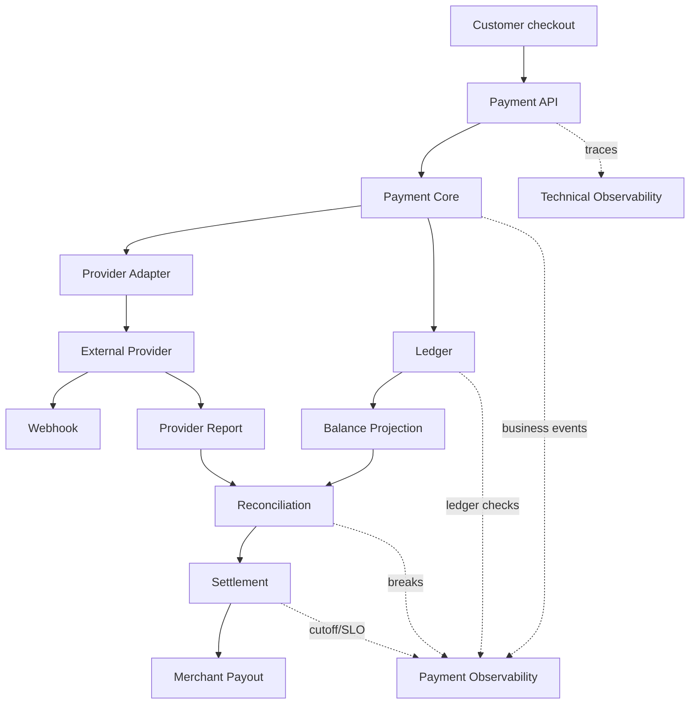
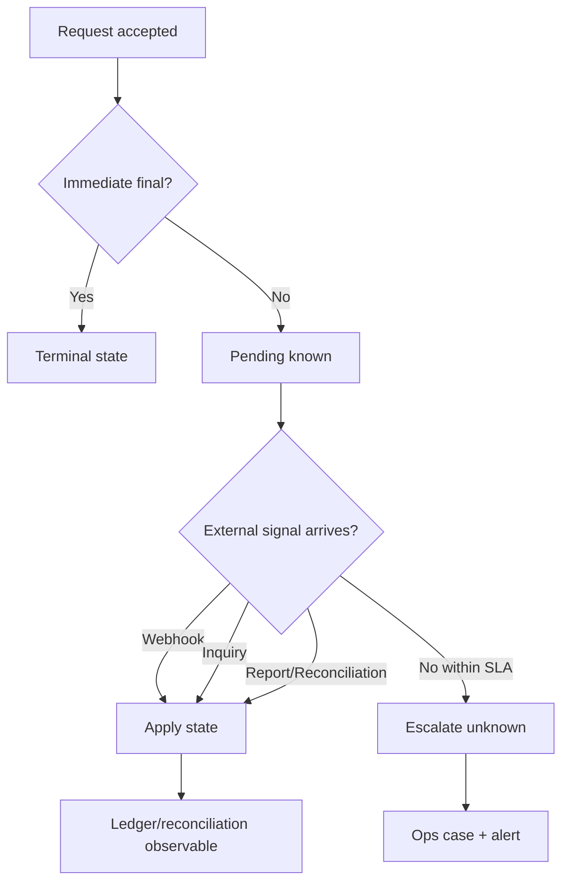
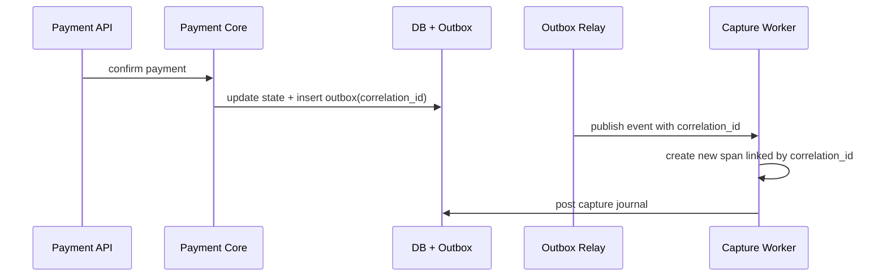
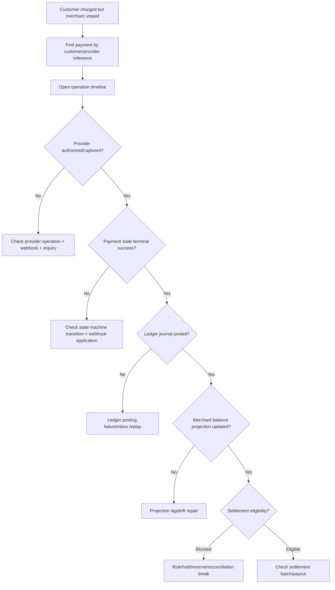

------
title: Build From Scratch: Large Production Grade Java Payment Systems - Part 055
description: Observability for production-grade Java payment systems, including traces, metrics, logs, business SLOs, ledger health, reconciliation health, alerting, dashboards, and operational diagnostics.
series: learn-java-payment-systems
seriesTitle: Build From Scratch: Large Production Grade Java Payment Systems
order: 55
partTitle: Observability for Payment Systems
tags:
- java
- payments
- payment-systems
- observability
- opentelemetry
- sre
- ledger
- reconciliation
- enterprise-architecture
date: 2026-07-02
---

# Part 055 — Observability for Payment Systems

Payment system yang tidak observable akan berubah menjadi kotak hitam.

Kotak hitam itu mungkin masih menerima request.

Tetapi tidak ada yang bisa menjawab pertanyaan paling penting:

- apakah customer benar-benar tertagih?
- apakah merchant benar-benar akan dibayar?
- apakah ledger balanced?
- apakah settlement batch hari ini lengkap?
- apakah provider sedang timeout atau hanya lambat?
- apakah webhook terlambat atau hilang?
- apakah retry aman atau sedang menciptakan duplicate operation?
- apakah reconciliation break disebabkan provider, bank, parser, timezone, atau ledger posting?
- apakah outage teknis sudah menjadi risiko finansial?

Observability payment bukan sekadar log, trace, dan metric.

Observability payment adalah kemampuan untuk menjelaskan perjalanan uang secara teknis, finansial, dan operasional.

## 1. Mental Model: Observability Must Explain Money, Not Just Services

Observability generic biasanya menjawab:

- service up atau down,
- latency naik atau tidak,
- error rate tinggi atau tidak,
- CPU/memory penuh atau tidak.

Itu perlu, tetapi tidak cukup.

Payment observability harus menjawab:

- berapa payment yang berada di unknown state?
- berapa authorization sukses tetapi capture belum berjalan?
- berapa payment succeeded tetapi ledger posting gagal?
- berapa webhook verified tetapi belum applied?
- berapa settlement file diterima tetapi belum parsed?
- berapa merchant balance projection tidak sama dengan ledger source?
- berapa payout sudah dikirim tetapi belum ada bank confirmation?
- berapa refund melewati refundable amount invariant?
- berapa provider operation retry melampaui retry budget?
- berapa reconciliation break yang melewati SLA?

Dengan kata lain:

> Technical health tells you whether software is running. Payment observability tells you whether money is still explainable.



Kalau trace menunjukkan request `/payments/confirm` sukses 200 OK, itu belum cukup.

Yang perlu dilihat:

- apakah command diterima?
- apakah idempotency record dibuat?
- apakah attempt dibuat?
- apakah provider operation dikirim?
- apakah provider response normalized?
- apakah state transition legal?
- apakah ledger journal posted?
- apakah outbox event published?
- apakah webhook berikutnya correlated?
- apakah reconciliation nanti bisa menemukan transaksi itu?

Observability harus mengikuti business lifecycle, bukan hanya call stack.

## 2. Observability Signals yang Relevan

OpenTelemetry mendefinisikan observability sebagai pengumpulan telemetry seperti traces, metrics, dan logs. Dalam payment platform, tiga sinyal ini perlu ditambah dengan domain signals.

| Signal | Fungsi umum | Payment-specific usage |
|---|---|---|
| Trace | melihat request flow lintas service | payment journey, provider call, ledger posting, webhook application |
| Metric | angka time-series | success rate, unknown state count, ledger imbalance, reconciliation break |
| Log | detail event | evidence, diagnosis, provider payload metadata, error reason |
| Audit event | defensibility | siapa melakukan aksi apa, kapan, dengan approval apa |
| Domain event | state fact | `PaymentAuthorized`, `CaptureSucceeded`, `RefundFailed` |
| Ledger health check | financial invariant | zero-sum, projection drift, duplicate journal |
| Reconciliation break | external agreement | mismatch internal vs provider/bank/scheme |
| Operation timeline | human diagnosis | ordered view dari request sampai settlement |

Rule utama:

> Logs explain one occurrence. Metrics explain population behavior. Traces explain path. Audit explains accountability. Ledger checks explain correctness.

## 3. Four Golden Signals, Payment Edition

Google SRE popularized four golden signals:

- latency,
- traffic,
- errors,
- saturation.

Payment platform tetap membutuhkan ini, tetapi perlu diterjemahkan ke domain.

### 3.1 Latency

Generic latency:

- HTTP request duration,
- database query time,
- Kafka publish delay,
- webhook handler duration.

Payment latency:

- payment confirmation latency,
- provider authorization latency,
- 3DS redirect completion latency,
- webhook delivery-to-apply latency,
- capture scheduling latency,
- ledger posting latency,
- refund completion latency,
- payout execution latency,
- reconciliation file availability latency,
- break resolution latency.

Contoh metric:

```text
payment_confirm_duration_seconds
provider_authorization_duration_seconds
webhook_ingest_to_apply_duration_seconds
ledger_post_duration_seconds
settlement_batch_generation_duration_seconds
reconciliation_run_duration_seconds
payout_instruction_to_confirmation_duration_seconds
```

Peringatan:

> Jangan hanya mengukur latency API. Banyak payment rail sukses secara asynchronous. User-facing latency rendah belum berarti lifecycle selesai.

### 3.2 Traffic

Generic traffic:

- requests per second,
- messages per second,
- job throughput.

Payment traffic:

- payment intents created per minute,
- authorization attempts per provider,
- captures per cutoff window,
- refunds per merchant,
- payout instructions per bank,
- webhooks received per provider event type,
- reconciliation records processed per file,
- manual actions per operator/team.

Traffic harus bisa di-slice oleh:

- merchant,
- provider,
- payment method,
- currency,
- country,
- route,
- risk decision,
- card BIN range,
- integration version,
- API version.

Tetapi hati-hati.

High-cardinality label bisa menghancurkan metrics backend.

Jangan jadikan `payment_id` sebagai metric label.

Gunakan `payment_id` di trace/log, bukan di time-series label.

### 3.3 Errors

Generic error:

- HTTP 5xx,
- exception count,
- failed job count.

Payment error:

- provider timeout,
- provider hard decline,
- provider soft decline,
- risk decline,
- state transition rejected,
- ledger posting rejected,
- idempotency fingerprint mismatch,
- duplicate provider operation detected,
- webhook signature invalid,
- webhook duplicate,
- webhook out-of-order,
- reconciliation unmatched,
- settlement batch blocked,
- payout failed,
- manual action denied.

Error perlu dibedakan:

| Error type | Contoh | Alert? |
|---|---|---|
| Expected business decline | insufficient funds | biasanya tidak |
| Risk decline | high-risk transaction | monitor rate |
| Provider outage | timeout spike | ya |
| Internal invariant violation | ledger unbalanced | page segera |
| Reconciliation break | provider amount mismatch | alert by SLA/severity |
| Duplicate webhook | normal behavior | tidak, kecuali spike abnormal |
| Signature invalid | possible attack/misconfig | alert jika spike |

Business decline bukan service error.

Kalau semua decline dianggap error, dashboard akan berisik.

Kalau invariant violation tidak dipisahkan, dashboard akan membunuh engineer dengan noise.

### 3.4 Saturation

Generic saturation:

- CPU,
- memory,
- disk,
- database connection pool,
- queue depth.

Payment saturation:

- outbox backlog,
- webhook raw event backlog,
- provider operation queue backlog,
- capture scheduler backlog,
- payout approval queue backlog,
- reconciliation break queue age,
- manual review case backlog,
- settlement batch generation delay,
- ledger projection rebuild lag,
- risk velocity counter latency.

Contoh metric:

```text
payment_outbox_oldest_unpublished_age_seconds
webhook_unapplied_event_count
provider_operation_pending_count
ledger_projection_lag_events
reconciliation_break_open_count
manual_review_case_oldest_age_seconds
settlement_batch_blocked_count
```

Saturation payment sering lebih penting dari CPU.

Service bisa sehat, tetapi queue webhook 2 jam tertinggal.

Itu berarti merchant dan customer melihat status yang salah.

## 4. Payment Business SLO

SLO payment tidak bisa hanya:

> 99.9% API availability.

Karena API bisa available sementara uang tidak selesai.

Payment SLO harus mencakup lifecycle.

Contoh SLO:

| Area | SLO |
|---|---|
| Confirm API | 99.9% valid confirm request menghasilkan terminal or pending-known state dalam 3 detik |
| Provider authorization | 99% provider call selesai atau masuk unknown-resolution workflow dalam 10 detik |
| Webhook processing | 99.9% verified webhook applied atau quarantined dalam 2 menit |
| Ledger posting | 100% financial state transition punya idempotent ledger posting atau explicit non-financial reason |
| Ledger balance | 0 unbalanced posted journal |
| Reconciliation | 99% provider settlement records matched atau assigned break reason sebelum T+1 cutoff |
| Settlement | 99% eligible merchant settlement generated sebelum cutoff |
| Payout | 99% payout instruction final state known dalam configured rail SLA |
| Manual review | P95 high-risk payment review selesai dalam SLA bisnis |

Perhatikan beda antara:

- availability,
- correctness,
- freshness,
- explainability,
- operational completion.

Untuk payment, SLO paling penting sering bukan availability, tetapi **bounded uncertainty**.

Payment boleh pending.

Payment boleh unknown sementara.

Tetapi unknown tidak boleh tidak terdeteksi.



## 5. Trace Design for Payment Journeys

Trace payment harus memperlihatkan journey, bukan hanya request.

Satu payment bisa terdiri dari:

- create intent API,
- confirm API,
- risk evaluation,
- provider authorization,
- redirect/3DS,
- webhook callback,
- capture job,
- ledger posting,
- outbox publish,
- settlement file ingestion,
- reconciliation match,
- settlement batch,
- payout instruction.

Trace distributed tradisional biasanya putus karena proses asynchronous.

Solusinya bukan memaksa satu span hidup berhari-hari.

Solusinya adalah correlation.

Gunakan correlation identifiers:

| Identifier | Fungsi |
|---|---|
| `trace_id` | technical call path jangka pendek |
| `correlation_id` | request/journey correlation lintas async step |
| `payment_id` | domain aggregate |
| `payment_attempt_id` | provider attempt |
| `provider_operation_id` | one external call/inquiry/refund/capture |
| `provider_reference` | external reference |
| `idempotency_key_hash` | retry grouping tanpa exposing raw key |
| `ledger_journal_id` | financial posting |
| `reconciliation_run_id` | matching context |
| `settlement_batch_id` | payout/settlement grouping |

Trace attribute contoh:

```text
payment.id=pay_01J...
payment.intent_id=pi_01J...
payment.attempt_id=pa_01J...
payment.method=card
payment.operation=authorize
payment.provider=adyen
payment.route_id=route_card_id_domestic_001
payment.currency=IDR
payment.amount_minor=12500000
payment.state_before=CONFIRMING
payment.state_after=AUTHORIZED
payment.result=SUCCESS
ledger.journal_id=lj_01J...
```

Jangan masukkan:

- PAN,
- CVC,
- full card holder name bila tidak perlu,
- raw bank account number,
- raw PII,
- raw webhook signature secret,
- full provider payload yang mengandung sensitive data.

Payment trace harus aman untuk dibuka engineer on-call.

## 6. Span Boundary yang Berguna

Jangan trace semuanya dengan granularitas ekstrem.

Trace harus menjawab keputusan penting.

Span penting:

```text
POST /v1/payment-intents/{id}/confirm
  payment.load_intent
  idempotency.reserve_or_load
  risk.evaluate
  routing.decide
  provider_operation.create
  provider.authorize
  provider_response.normalize
  state_machine.apply
  ledger.post_authorization_hold
  outbox.enqueue_payment_event
```

Webhook trace:

```text
POST /webhooks/{provider}
  raw_event.persist
  signature.verify
  event.dedupe
  provider_event.normalize
  payment.correlate
  state_machine.apply_external_signal
  ledger.post_if_needed
  outbox.enqueue_domain_event
```

Reconciliation trace:

```text
reconciliation.run
  source_file.load
  parser.parse
  control_total.validate
  internal_snapshot.load
  matching.find_candidates
  match_group.create
  break.create_or_update
  correction.propose
```

Settlement trace:

```text
settlement.generate_batch
  eligibility.select_merchants
  balance.compute_available
  reserve.apply
  fees.net
  payout_instruction.create
  ledger.post_settlement_batch
  merchant_statement.generate
```

Rule:

> Trace decisions, boundaries, external calls, persistence commits, and financial postings. Do not trace random getters.

## 7. Logs: Evidence, Not Dumping Ground

Logs payment harus structured.

Log seperti ini buruk:

```text
Payment failed
```

Log seperti ini lebih berguna:

```json
{
  "event": "provider_authorization_failed",
  "payment_id": "pay_...",
  "attempt_id": "pa_...",
  "provider": "provider_a",
  "operation_id": "op_...",
  "normalized_error_class": "PROVIDER_TIMEOUT",
  "retryable": true,
  "unknown_outcome": true,
  "route_id": "route_card_id_domestic_001",
  "state_before": "AUTHORIZING",
  "next_action": "STATUS_INQUIRY",
  "correlation_id": "corr_..."
}
```

Payment log harus memiliki:

- event name stabil,
- aggregate ID,
- operation ID,
- state before/after bila ada,
- normalized result,
- reason code,
- idempotency context,
- correlation ID,
- actor bila operator action,
- evidence reference bila ada.

Payment log tidak boleh:

- menyimpan raw PAN,
- menyimpan CVC,
- menyimpan bearer token,
- menyimpan secret key,
- menyimpan full PII tanpa klasifikasi,
- menyimpan raw webhook payload sembarangan di general logging system.

Raw payload boleh disimpan di evidence store yang controlled, encrypted, access-limited, dan retention-managed.

## 8. Audit Event vs Log

Log adalah diagnostic.

Audit event adalah evidence.

Jangan campur.

| Aspek | Log | Audit event |
|---|---|---|
| Tujuan | debugging/diagnosis | accountability/defensibility |
| Retention | bisa lebih pendek | biasanya lebih panjang |
| Mutability | append-only ideal | append-only wajib secara desain |
| Audience | engineer/SRE | compliance, finance, auditor, ops lead |
| Sensitive handling | redacted | controlled evidence references |
| Query | troubleshooting | timeline, review, investigation |

Contoh audit event:

```json
{
  "audit_event_type": "MANUAL_REFUND_APPROVED",
  "actor_user_id": "usr_...",
  "approval_id": "appr_...",
  "target_type": "PAYMENT",
  "target_id": "pay_...",
  "amount_minor": 12500000,
  "currency": "IDR",
  "reason_code": "MERCHANT_REQUEST",
  "evidence_id": "ev_...",
  "policy_version": "refund-policy-2026-07-01",
  "created_at": "2026-07-02T12:00:00Z"
}
```

Kalau operator melakukan manual adjustment, log aplikasi tidak cukup.

Harus ada audit event yang menjelaskan:

- siapa,
- melakukan apa,
- terhadap objek apa,
- sebelum state apa,
- sesudah state apa,
- berdasarkan approval apa,
- dengan evidence apa,
- dieksekusi oleh job/service apa,
- menghasilkan ledger journal apa.

## 9. Metrics Taxonomy

Susun metric taxonomy sejak awal.

Tanpa taxonomy, setiap team akan membuat metric berbeda dan dashboard sulit dipercaya.

### 9.1 API Metrics

```text
payment_api_requests_total{endpoint,method,status_class,api_version}
payment_api_duration_seconds{endpoint,method,status_class}
payment_idempotency_conflict_total{endpoint,conflict_type}
payment_validation_error_total{endpoint,error_code}
```

### 9.2 Payment Lifecycle Metrics

```text
payment_intents_created_total{merchant_tier,payment_method,currency}
payment_attempts_total{provider,payment_method,result}
payment_state_transition_total{from_state,to_state,trigger}
payment_unknown_state_current{provider,payment_method}
payment_terminal_state_total{state,provider,payment_method}
payment_age_in_state_seconds{state,payment_method}
```

### 9.3 Provider Metrics

```text
provider_operation_total{provider,operation,result_class}
provider_operation_duration_seconds{provider,operation,result_class}
provider_timeout_total{provider,operation}
provider_unknown_outcome_total{provider,operation}
provider_inquiry_total{provider,result_class}
provider_fallback_total{from_provider,to_provider,reason}
```

### 9.4 Webhook Metrics

```text
webhook_received_total{provider,event_type}
webhook_signature_invalid_total{provider}
webhook_duplicate_total{provider,event_type}
webhook_unapplied_current{provider,event_type,reason}
webhook_apply_duration_seconds{provider,event_type}
webhook_event_age_on_receive_seconds{provider,event_type}
webhook_out_of_order_total{provider,event_type}
```

### 9.5 Ledger Metrics

```text
ledger_journal_posted_total{journal_type,currency}
ledger_post_duration_seconds{journal_type}
ledger_unbalanced_journal_total
ledger_duplicate_posting_prevented_total{posting_rule}
ledger_projection_lag_events{projection}
ledger_projection_drift_total{projection,currency}
ledger_trial_balance_result{currency}
```

`ledger_unbalanced_journal_total` harus selalu nol.

Kalau naik dari nol, itu page.

Bukan ticket besok.

### 9.6 Reconciliation Metrics

```text
reconciliation_run_total{source_type,result}
reconciliation_source_record_total{source_type}
reconciliation_match_total{match_rule,match_quality}
reconciliation_break_open_current{source_type,break_type,severity}
reconciliation_break_age_seconds{source_type,break_type,severity}
reconciliation_control_total_mismatch_total{source_type}
reconciliation_manual_match_total{operator_team,break_type}
```

### 9.7 Settlement and Payout Metrics

```text
settlement_batch_total{currency,result}
settlement_batch_blocked_current{reason}
settlement_amount_minor_total{currency}
merchant_payout_instruction_total{rail,result}
payout_unknown_state_current{rail,bank}
payout_failed_total{rail,reason}
payout_confirmation_latency_seconds{rail}
```

### 9.8 Risk and Operations Metrics

```text
risk_decision_total{decision,reason_group,merchant_tier}
risk_manual_review_open_current{severity}
risk_manual_review_age_seconds{severity}
operator_action_total{action_type,result,risk_level}
operator_action_denied_total{action_type,reason}
break_glass_session_total{reason}
```

## 10. Label Design and Cardinality Control

Metrics label yang salah bisa merusak observability platform.

Jangan gunakan label berikut:

- `payment_id`,
- `customer_id`,
- `merchant_id` untuk semua metric high-volume,
- raw `error_message`,
- raw provider response text,
- raw bank narrative,
- idempotency key,
- PAN/BIN lengkap.

Gunakan label yang bounded:

- `provider`,
- `operation`,
- `payment_method`,
- `currency`,
- `country`,
- `merchant_tier`,
- `route_id` bila jumlah route terbatas,
- `result_class`,
- `error_class`,
- `state`,
- `event_type` yang normalized.

Untuk merchant-level diagnosis, gunakan:

- logs,
- traces,
- analytic warehouse,
- exemplars,
- dashboard drill-down berbasis query, bukan metric label global high-cardinality.

Rule:

> High-cardinality IDs belong in traces/logs/events, not in global time-series labels.

## 11. Operation Timeline

Payment operator tidak akan membaca 50 log line lintas service.

Mereka butuh operation timeline.

Timeline adalah read model yang menggabungkan:

- API request accepted,
- idempotency decision,
- risk decision,
- route decision,
- provider operation,
- provider response,
- webhook event,
- state transition,
- ledger journal,
- reconciliation match,
- settlement inclusion,
- payout instruction,
- manual action.

Schema sederhana:

```sql
CREATE TABLE operation_timeline_event (
    id                  UUID PRIMARY KEY,
    aggregate_type      TEXT NOT NULL,
    aggregate_id        UUID NOT NULL,
    event_time          TIMESTAMPTZ NOT NULL,
    sequence_no         BIGINT NOT NULL,
    event_type          TEXT NOT NULL,
    actor_type          TEXT NOT NULL,
    actor_id            TEXT,
    summary             TEXT NOT NULL,
    severity            TEXT NOT NULL,
    correlation_id      TEXT,
    trace_id            TEXT,
    evidence_ref        TEXT,
    metadata_json       JSONB NOT NULL DEFAULT '{}'::jsonb,
    created_at          TIMESTAMPTZ NOT NULL DEFAULT now(),
    UNIQUE (aggregate_type, aggregate_id, sequence_no)
);

CREATE INDEX idx_operation_timeline_aggregate
ON operation_timeline_event (aggregate_type, aggregate_id, sequence_no);
```

Timeline contoh:

```text
12:00:00 Payment intent created by API key merchant_live_123
12:00:01 Confirm requested with idempotency key hash idem_abc
12:00:01 Risk approved rule version risk-2026-07-01
12:00:01 Routed to ProviderA because domestic IDR card route
12:00:02 Authorization request sent provider operation op_001
12:00:03 Provider timeout; outcome unknown
12:00:20 Status inquiry returned authorized
12:00:20 Payment transitioned AUTHORIZING -> AUTHORIZED
12:00:20 Ledger journal lj_001 posted authorization hold
12:00:21 PaymentAuthorized event published
```

Tanpa timeline, on-call harus menjadi forensik engineer setiap incident.

Dengan timeline, support dan ops bisa memahami status tanpa akses database.

## 12. Ledger Health Dashboard

Dashboard ledger harus membedakan:

- invariant breach,
- projection lag,
- reconciliation break,
- expected pending state.

Minimal panel:

1. trial balance by currency,
2. unbalanced journal count,
3. journal posting failure count,
4. duplicate ledger posting prevented,
5. projection lag by projection,
6. projection drift count,
7. accounts with abnormal negative balances,
8. suspense account balance,
9. manual adjustment volume,
10. reversal/correction volume.

Contoh query health check:

```sql
SELECT
    currency,
    SUM(CASE WHEN direction = 'DEBIT' THEN amount_minor ELSE -amount_minor END) AS net_minor
FROM ledger_entry
WHERE posted_at < now()
GROUP BY currency
HAVING SUM(CASE WHEN direction = 'DEBIT' THEN amount_minor ELSE -amount_minor END) <> 0;
```

Kalau query ini menghasilkan row untuk posted journal universe yang sama, sistem punya masalah serius.

Tetapi pada ledger besar, query full scan tidak boleh dilakukan terus-menerus.

Gunakan:

- per-journal check saat posting,
- periodic trial balance snapshot,
- partitioned ledger table,
- incremental validation,
- alert pada drift,
- offline audit job.

## 13. Reconciliation Observability

Reconciliation adalah observability finansial terhadap dunia luar.

Metrics penting:

- file expected vs file received,
- file received delay,
- parser success/failure,
- control total mismatch,
- unmatched internal count,
- unmatched external count,
- amount mismatch,
- duplicate external reference,
- settlement batch mismatch,
- break age,
- manual resolution rate,
- correction posting count.

Dashboard reconciliation harus menjawab:

- file apa yang belum datang?
- file mana yang gagal parse?
- provider mana yang mismatch rate-nya naik?
- rule matching mana yang menghasilkan false positive?
- break mana yang paling tua?
- berapa nominal uang di suspense?
- break mana yang memblokir settlement?

Contoh alert:

```text
ALERT: Provider settlement file missing
Condition: expected_file_count{provider="provider_a", date=today} > received_file_count
Severity: high if after cutoff + grace period
Action: check provider portal, SFTP, file ingestion, credential expiry
```

```text
ALERT: Reconciliation break monetary exposure high
Condition: sum(open_break_amount_minor{severity="high"}) > threshold
Severity: page finance-ops/on-call depending threshold
Action: stop settlement batch if break affects merchant payable
```

## 14. Alerting: Page Only What Requires Human Action Now

Alert buruk:

```text
Payment error rate > 1%
```

Masalahnya:

- business decline bisa normal,
- risk decline bisa expected,
- provider decline bisa issuer-side,
- internal error bisa critical,
- retryable timeout butuh action berbeda.

Alert lebih baik:

```text
ProviderA authorization timeout rate > 10% for 5 minutes AND unknown outcome count increasing
```

```text
Ledger unbalanced journal count > 0
```

```text
Webhook verified but unapplied oldest age > 10 minutes for provider critical event type
```

```text
Settlement batch blocked within 30 minutes before cutoff
```

```text
Reconciliation break exposure > configured threshold after T+1 cutoff
```

```text
Payout unknown state count increasing for bank rail X
```

Alert harus punya runbook.

Setiap alert sebaiknya punya:

- impact,
- likely causes,
- dashboard link,
- query link,
- safe action,
- unsafe action,
- escalation owner,
- customer/merchant communication guidance.

Tanpa runbook, alert hanyalah suara panik.

## 15. Alert Severity Model

Payment platform perlu severity yang menggabungkan technical dan financial impact.

| Severity | Kondisi | Contoh |
|---|---|---|
| SEV-1 | money correctness at risk, large impact, active incident | ledger imbalance, duplicate charge spike, payout duplicate risk |
| SEV-2 | significant payment degradation or settlement risk | provider timeout spike, webhook apply backlog critical |
| SEV-3 | delayed operation with bounded impact | reconciliation file late but before cutoff grace |
| SEV-4 | non-urgent investigation | mild decline-rate anomaly, dashboard drift warning |

Financial severity bisa bergantung pada:

- amount exposure,
- number of affected merchants,
- number of affected customers,
- rail finality,
- whether funds left platform,
- whether ledger correction possible,
- regulatory reporting implication,
- customer-visible impact.

## 16. Observability Data Model

Jangan hanya mengandalkan vendor observability.

Payment system perlu internal observability model untuk domain timeline dan health.

Contoh table:

```sql
CREATE TABLE payment_observation_event (
    id                  UUID PRIMARY KEY,
    payment_id          UUID,
    payment_attempt_id  UUID,
    provider_operation_id UUID,
    ledger_journal_id   UUID,
    reconciliation_run_id UUID,
    settlement_batch_id UUID,
    observation_type    TEXT NOT NULL,
    severity            TEXT NOT NULL,
    observed_at         TIMESTAMPTZ NOT NULL,
    source_service      TEXT NOT NULL,
    correlation_id      TEXT,
    trace_id            TEXT,
    summary             TEXT NOT NULL,
    metadata_json       JSONB NOT NULL DEFAULT '{}'::jsonb,
    created_at          TIMESTAMPTZ NOT NULL DEFAULT now()
);

CREATE INDEX idx_payment_observation_payment
ON payment_observation_event (payment_id, observed_at DESC);

CREATE INDEX idx_payment_observation_type_time
ON payment_observation_event (observation_type, observed_at DESC);
```

Ini bukan pengganti logs.

Ini domain observation read model.

Gunanya:

- backoffice timeline,
- support investigation,
- incident analysis,
- postmortem evidence,
- operational reports.

## 17. Java Instrumentation Boundary

Di Java service, observability harus masuk ke boundary penting:

- API resource,
- command handler,
- repository transaction,
- state machine application,
- provider adapter,
- ledger posting,
- outbox enqueue,
- message consumer,
- scheduled job,
- reconciliation parser,
- settlement generator.

Sketch sederhana:

```java
public final class PaymentObservationContext {
    private final UUID paymentId;
    private final UUID attemptId;
    private final String correlationId;
    private final String routeId;
    private final String provider;
    private final String operation;

    public Map<String, String> traceAttributes() {
        var attrs = new LinkedHashMap<String, String>();
        attrs.put("payment.id", paymentId.toString());
        if (attemptId != null) attrs.put("payment.attempt_id", attemptId.toString());
        attrs.put("correlation.id", correlationId);
        attrs.put("payment.provider", provider);
        attrs.put("payment.operation", operation);
        attrs.put("payment.route_id", routeId);
        return attrs;
    }
}
```

Provider operation wrapper:

```java
public final class ObservedProviderClient implements ProviderClient {
    private final ProviderClient delegate;
    private final PaymentMetrics metrics;
    private final Tracer tracer;

    @Override
    public ProviderResult authorize(AuthorizeCommand command) {
        Span span = tracer.spanBuilder("provider.authorize")
            .setAttribute("payment.id", command.paymentId().toString())
            .setAttribute("payment.provider", command.providerCode())
            .setAttribute("payment.operation", "AUTHORIZE")
            .startSpan();

        long started = System.nanoTime();
        try (Scope scope = span.makeCurrent()) {
            ProviderResult result = delegate.authorize(command);
            span.setAttribute("payment.result", result.normalizedResult().name());
            span.setAttribute("payment.unknown_outcome", result.unknownOutcome());
            metrics.recordProviderOperation(command.providerCode(), "AUTHORIZE", result.normalizedResult(), started);
            return result;
        } catch (RuntimeException ex) {
            span.recordException(ex);
            span.setAttribute("payment.result", "TECHNICAL_EXCEPTION");
            metrics.recordProviderException(command.providerCode(), "AUTHORIZE", ex, started);
            throw ex;
        } finally {
            span.end();
        }
    }
}
```

Catatan:

- contoh ini konseptual,
- jangan masukkan sensitive value ke span attributes,
- lakukan normalization pada error/result,
- gunakan bounded labels untuk metrics,
- pakai correlation ID lintas async boundaries.

## 18. Correlation Across Async Boundaries

HTTP trace context tidak otomatis survive di:

- database outbox,
- Kafka event,
- scheduled job,
- webhook retry,
- SFTP file ingestion,
- manual backoffice action,
- provider settlement report.

Payment platform perlu correlation fields di domain records.

Outbox schema:

```sql
CREATE TABLE payment_outbox_event (
    id              UUID PRIMARY KEY,
    aggregate_type  TEXT NOT NULL,
    aggregate_id    UUID NOT NULL,
    event_type      TEXT NOT NULL,
    payload_json    JSONB NOT NULL,
    correlation_id  TEXT NOT NULL,
    causation_id    TEXT,
    traceparent     TEXT,
    created_at      TIMESTAMPTZ NOT NULL DEFAULT now(),
    published_at    TIMESTAMPTZ
);
```

Consumer rule:

1. read correlation fields,
2. create new processing span,
3. link to previous context if available,
4. emit domain observation event,
5. preserve correlation ID in downstream command/event.



## 19. Observability for Unknown State

Unknown state wajib punya dedicated dashboard.

Minimal fields:

- provider,
- operation,
- payment method,
- state age,
- amount exposure,
- last provider request time,
- last provider response/error,
- last webhook time,
- last inquiry time,
- next scheduled inquiry,
- retry count,
- status inquiry result,
- reconciliation evidence,
- manual case status.

Metric:

```text
payment_unknown_state_current{provider,operation,payment_method}
payment_unknown_state_age_seconds{provider,operation,payment_method}
payment_unknown_state_amount_minor{provider,currency,operation}
payment_unknown_resolution_total{resolution_source,result}
```

Unknown state runbook:

1. cek provider operation log,
2. cek apakah request mencapai provider,
3. cek response timeout vs connection failure,
4. cek webhook raw event,
5. cek duplicate/out-of-order event,
6. lakukan provider status inquiry jika aman,
7. cek reconciliation report,
8. jangan retry create charge tanpa idempotency/protection,
9. escalate manual review jika exposure melewati threshold.

Payment unknown yang tidak terlihat adalah akar banyak double charge dan lost money incident.

## 20. Observability for Idempotency

Idempotency harus observable.

Metric:

```text
idempotency_key_created_total{scope,endpoint}
idempotency_key_reused_total{scope,endpoint,result}
idempotency_fingerprint_conflict_total{scope,endpoint}
idempotency_inflight_conflict_total{scope,endpoint}
idempotency_expired_reuse_total{scope,endpoint}
```

Dashboard harus bisa menjawab:

- client mana yang retry agresif?
- endpoint mana yang punya conflict tinggi?
- apakah idempotency TTL terlalu pendek?
- apakah provider idempotency mismatch terjadi?
- apakah duplicate prevented meningkat setelah deploy?

Log event:

```json
{
  "event": "idempotency_fingerprint_conflict",
  "scope": "payment_confirm",
  "payment_id": "pay_...",
  "idempotency_key_hash": "idem_hash_...",
  "first_request_hash": "req_hash_1",
  "current_request_hash": "req_hash_2",
  "decision": "REJECTED"
}
```

Jangan log raw idempotency key.

## 21. Observability for Provider Health

Provider health bukan hanya `/health`.

Provider bisa sehat untuk refund tetapi bermasalah untuk authorization.

Provider bisa sehat untuk kartu domestik tetapi bermasalah untuk cross-border.

Provider health model:

```text
provider_health_score{provider,operation,payment_method,currency,country}
provider_success_rate{provider,operation,payment_method}
provider_timeout_rate{provider,operation}
provider_unknown_outcome_rate{provider,operation}
provider_p95_latency_seconds{provider,operation}
provider_refusal_rate{provider,operation,reason_class}
```

Routing engine sebaiknya memakai health signal yang sudah distabilkan, bukan raw metric satu menit.

Gunakan:

- rolling window,
- minimum sample threshold,
- outlier protection,
- cooldown,
- manual override,
- route decision audit.

## 22. Observability for Compliance and Security

Security observability payment harus mencakup:

- webhook signature invalid spike,
- failed authentication internal users,
- privileged action denied,
- break-glass session,
- sensitive data reveal,
- token vault access,
- key rotation status,
- HSM/KMS error,
- suspicious API key usage,
- merchant capability changes,
- compliance screening provider unavailable,
- sanctions list update delay.

Metric contoh:

```text
webhook_signature_invalid_total{provider}
operator_sensitive_reveal_total{data_class,reason}
token_vault_detokenization_total{purpose,result}
crypto_key_rotation_due_current{key_class}
compliance_screening_unavailable_current{provider}
```

Security alert harus mempertimbangkan false positive, tetapi tidak boleh mengabaikan spike.

Webhook invalid signature yang muncul satu kali mungkin internet noise.

Webhook invalid signature massal pada satu provider setelah deployment mungkin secret rotation issue.

Webhook invalid signature massal dari banyak IP mungkin attack/misconfiguration.

## 23. Dashboard Set Minimal

Production payment platform minimal punya dashboard berikut.

### 23.1 Executive Business Health

Audience: product, ops lead, finance lead.

Panels:

- total payment volume,
- success rate by method,
- unknown state count,
- settlement blocked count,
- payout failed/unknown count,
- reconciliation break exposure,
- fraud review backlog,
- provider degradation summary.

### 23.2 Payment Lifecycle Dashboard

Audience: engineer/on-call.

Panels:

- state distribution,
- state age heatmap,
- transition rate,
- invalid transition attempts,
- provider attempt result,
- retry/fallback count,
- unknown resolution source.

### 23.3 Provider Health Dashboard

Audience: payment engineering, routing ops.

Panels:

- authorization latency,
- timeout rate,
- decline/refusal classes,
- unknown outcome,
- fallback rate,
- webhook delay,
- provider inquiry failure.

### 23.4 Ledger Health Dashboard

Audience: engineering + finance.

Panels:

- unbalanced journal count,
- posting failures,
- projection lag,
- projection drift,
- suspense balance,
- manual adjustment amount,
- reversal/correction count.

### 23.5 Reconciliation Dashboard

Audience: finance ops.

Panels:

- expected vs received files,
- parser errors,
- match rate,
- break count by type,
- break exposure amount,
- oldest break,
- manual match volume,
- blocked settlement batch.

### 23.6 Settlement/Payout Dashboard

Audience: finance ops + on-call.

Panels:

- settlement batch status,
- eligible vs excluded merchants,
- hold/reserve amount,
- payout instruction status,
- payout unknown age,
- failed payout reason,
- bank/rail latency.

### 23.7 Security/Compliance Dashboard

Audience: security/compliance/on-call.

Panels:

- privileged actions,
- denied actions,
- break-glass sessions,
- sensitive reveal,
- token vault access,
- webhook invalid signature,
- screening provider unavailable,
- sanctions list age.

## 24. Incident Debugging Flow

Ketika ada laporan:

> Customer charged but merchant sees unpaid.

Investigation flow:



Tanpa observability, engineer langsung query random table.

Dengan observability, engineer mengikuti money lifecycle.

## 25. Postmortem Data Requirements

Untuk setiap incident payment, postmortem harus bisa menjawab:

- impact customer,
- impact merchant,
- impact amount,
- first bad timestamp,
- detection source,
- why alert did/did not fire,
- affected payment methods/providers,
- affected lifecycle stage,
- whether ledger correctness violated,
- whether reconciliation caught it,
- whether settlement/payout affected,
- whether manual repair needed,
- whether customer/merchant communication needed,
- permanent control added.

Observation yang perlu tersedia:

- timeline event,
- trace sample,
- metric graph,
- audit event,
- provider operation evidence,
- webhook evidence,
- ledger journal,
- reconciliation result,
- operator action record.

## 26. Common Anti-Patterns

### 26.1 Logging Everything

Raw payload disimpan di semua log.

Akibat:

- data sensitif bocor,
- log mahal,
- debugging tetap sulit,
- compliance scope melebar.

Solusi:

- structured log,
- redaction,
- evidence store controlled,
- event taxonomy.

### 26.2 Dashboard Green but Money Broken

Service dashboard hijau.

Ledger drift terjadi.

Reconciliation break menumpuk.

Settlement file belum datang.

Solusi:

- payment business SLO,
- ledger health dashboard,
- reconciliation SLO,
- settlement cutoff alert.

### 26.3 Alert on All Declines

Issuer declines normal dianggap error.

On-call noise.

Solusi:

- normalized decline taxonomy,
- alert pada anomaly/spike,
- pisahkan business decline dan platform failure.

### 26.4 No Unknown State Dashboard

Timeout provider dianggap failed.

Client retry menciptakan duplicate charge.

Solusi:

- explicit unknown state,
- unknown dashboard,
- inquiry workflow,
- reconciliation repair.

### 26.5 High-Cardinality Metrics

`payment_id` menjadi label metric.

Metrics backend collapse.

Solusi:

- IDs di trace/log,
- bounded labels di metrics,
- analytics warehouse untuk drill-down.

### 26.6 No Correlation Across Async

API trace berhenti sebelum webhook/settlement.

Investigation manual sulit.

Solusi:

- correlation ID,
- causation ID,
- traceparent persistence,
- operation timeline.

## 27. Testing Observability

Observability harus diuji.

Test bukan hanya assert business result.

Test juga assert signal penting muncul.

Contoh test:

```java
@Test
void providerTimeoutCreatesUnknownMetricAndTimelineEvent() {
    providerSimulator.timeoutNextAuthorization();

    ConfirmResult result = paymentService.confirm(paymentId, idemKey);

    assertThat(result.state()).isEqualTo(PaymentState.AUTHORIZING_UNKNOWN);

    assertMetricIncremented("provider_unknown_outcome_total",
        Map.of("provider", "simulator", "operation", "AUTHORIZE"));

    assertTimelineContains(paymentId, "PROVIDER_AUTHORIZATION_UNKNOWN");
    assertUnknownStateVisible(paymentId);
}
```

Observability regression nyata:

- deploy mengubah error code mapping,
- metric label berubah,
- dashboard mati,
- alert tidak jalan,
- timeline event tidak dibuat,
- trace kehilangan correlation.

Karena itu, observability contract harus masuk CI untuk sinyal yang critical.

## 28. Readiness Checklist

Sebelum payment platform production, cek:

- [ ] Semua lifecycle stage punya metric.
- [ ] Unknown state punya dashboard dan alert.
- [ ] Ledger health punya invariant alert.
- [ ] Reconciliation break punya exposure dashboard.
- [ ] Settlement cutoff punya alert.
- [ ] Webhook backlog dan event age terlihat.
- [ ] Provider health dislice per operation.
- [ ] Idempotency conflict terlihat.
- [ ] Retry/fallback count terlihat.
- [ ] Manual action punya audit event.
- [ ] Sensitive data tidak muncul di logs/traces/metrics.
- [ ] Correlation ID survive across outbox/inbox/webhook/job.
- [ ] On-call runbook tersedia untuk setiap alert critical.
- [ ] Postmortem bisa mengambil timeline dan evidence tanpa query manual liar.

## 29. Kesimpulan

Observability payment system bukan tentang membuat dashboard cantik.

Observability adalah kemampuan untuk membuktikan bahwa uang masih bisa dijelaskan.

Production-grade payment observability harus mencakup:

- technical signals,
- business lifecycle signals,
- ledger health,
- reconciliation health,
- settlement/payout health,
- security/compliance signals,
- auditability,
- operation timeline,
- bounded unknown workflow.

Kalau sistem hanya bisa menjawab “service up”, sistem belum production-grade.

Sistem baru layak disebut production-grade ketika bisa menjawab:

> Untuk setiap payment, dari request pertama sampai settlement terakhir, kita tahu apa yang terjadi, kenapa terjadi, siapa/apa yang memicu, apa efeknya ke ledger, dan apa yang masih belum pasti.

## 30. Referensi

- OpenTelemetry Documentation — https://opentelemetry.io/docs/
- OpenTelemetry Logs Specification — https://opentelemetry.io/docs/specs/otel/logs/
- Google SRE Book, Chapter 6: Monitoring Distributed Systems — https://sre.google/sre-book/monitoring-distributed-systems/
- Stripe Webhooks — https://docs.stripe.com/webhooks
- PostgreSQL Explicit Locking — https://www.postgresql.org/docs/current/explicit-locking.html
