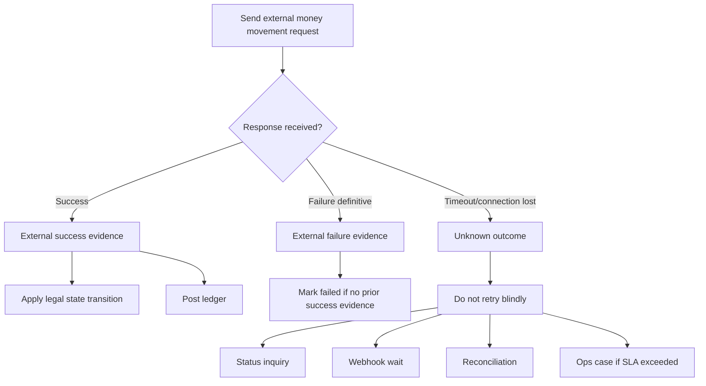
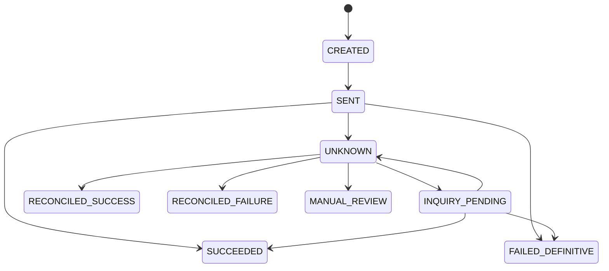
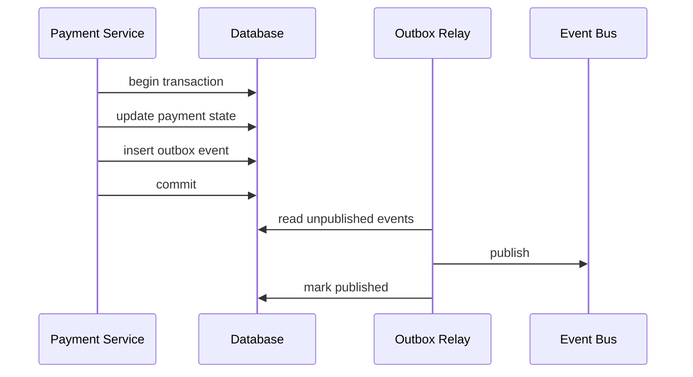
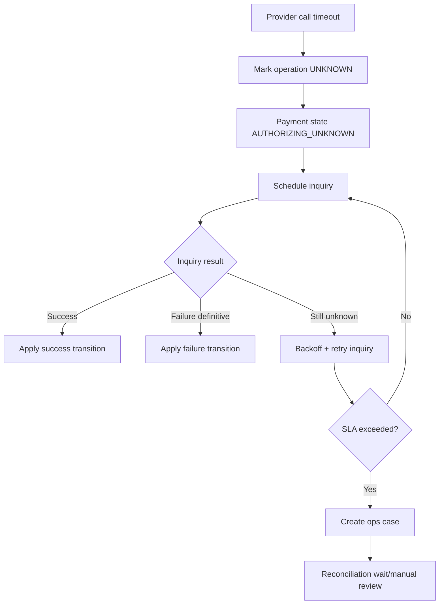
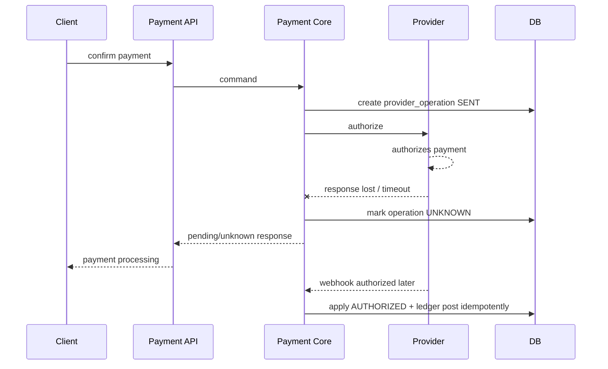
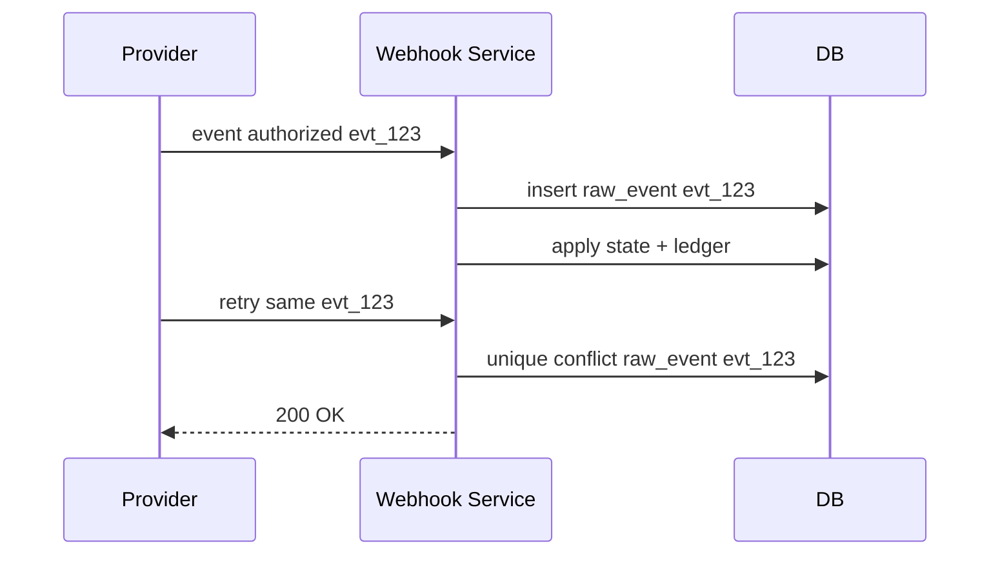
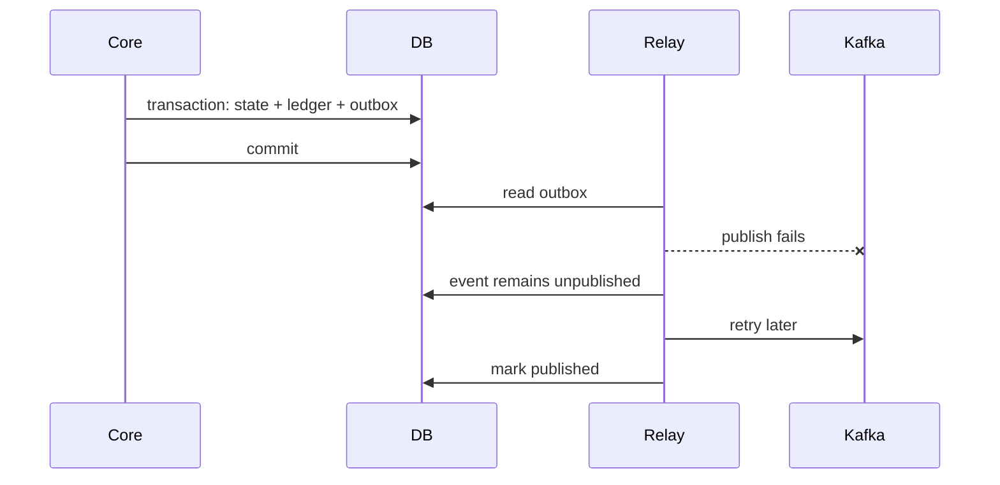
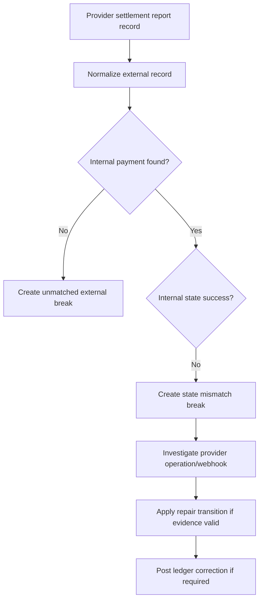

------
title: Build From Scratch: Large Production Grade Java Payment Systems - Part 056
description: Reliability and failure modeling for production-grade Java payment systems, including timeout, duplicate, lost webhook, partial success, unknown outcome, replay, compensation, degraded mode, and operational recovery.
series: learn-java-payment-systems
seriesTitle: Build From Scratch: Large Production Grade Java Payment Systems
order: 56
partTitle: Reliability and Failure Modeling
tags:
- java
- payments
- payment-systems
- reliability
- failure-modeling
- sre
- resilience
- ledger
- enterprise-architecture
date: 2026-07-02
---

# Part 056 — Reliability and Failure Modeling

Payment system tidak gagal seperti CRUD app.

CRUD app gagal biasanya menghasilkan:

- request error,
- data tidak tersimpan,
- user coba lagi.

Payment system gagal bisa menghasilkan:

- customer tertagih dua kali,
- customer tertagih tetapi merchant tidak melihat order paid,
- merchant dibayar dua kali,
- refund berhasil di provider tetapi ledger tidak mencatat,
- payout terkirim tetapi status internal tetap pending,
- reconciliation menemukan uang yang tidak punya payment,
- settlement batch salah karena event terlambat,
- operator melakukan repair yang membuat masalah kedua.

Reliability payment bukan hanya uptime.

Reliability payment adalah kemampuan sistem untuk tetap menjaga invariant finansial saat dunia eksternal tidak deterministik.

## 1. Mental Model: Failure Is Not Binary

Dalam sistem sederhana, failure sering dianggap:

```text
success or failed
```

Dalam payment:

```text
success or failed or pending or unknown or partially applied or externally final but internally stale
```

Ini perbedaan besar.

Kalau provider timeout, kita tidak tahu apakah provider memproses charge.

Kalau webhook tidak datang, kita tidak tahu apakah event hilang, terlambat, atau endpoint kita menolak.

Kalau ledger posting gagal setelah provider sukses, customer mungkin sudah tertagih tetapi financial truth internal belum lengkap.

Kalau payout request timeout, uang mungkin sudah keluar.

Rule utama:

> In payment systems, unknown is a first-class state. Treating unknown as failed is how duplicate money movement happens.



Reliability model harus dimulai dari failure semantics, bukan library retry.

## 2. Failure Taxonomy

Payment platform perlu taxonomy failure yang eksplisit.

| Category | Meaning | Example | Safe action |
|---|---|---|---|
| Validation failure | request invalid before side effect | amount <= 0 | reject |
| Business decline | external party definitively declines | insufficient funds | terminal failed/declined |
| Risk/compliance block | policy denies movement | sanctions match | hold/reject/escalate |
| Transport failure before send | request not sent | DNS failure before write | retry may be safe with idempotency |
| Transport failure after send | unknown if processed | socket timeout after write | status inquiry, no blind duplicate |
| Provider 5xx | provider uncertain/failed | HTTP 500 | depends provider semantics |
| Provider timeout | no definitive result | read timeout | unknown workflow |
| Provider async pending | accepted but not final | QR/VA/payout pending | wait/poll/webhook |
| Webhook missing | external event not received | delivery failure | repair/replay/inquiry |
| Webhook duplicate | same event delivered again | provider retry | dedupe/apply idempotently |
| Webhook out-of-order | later event before earlier event | capture before auth webhook | monotonic state machine |
| Internal commit failure | app error around DB commit | transaction rollback | retry command safely |
| Partial internal success | state updated but event not published | dual-write issue | outbox relay repair |
| Ledger posting failure | financial posting rejected | unbalanced journal | block transition/repair |
| Projection lag | truth posted, read model stale | balance not updated | rebuild/replay |
| Reconciliation mismatch | internal/external disagree | amount mismatch | break workflow |
| Operator error | manual action wrong | wrong adjustment | approval/reversal/correction |

Failure taxonomy mencegah satu error handler melakukan semua hal.

## 3. Failure Mode Matrix by Lifecycle Stage

### 3.1 Payment Intent Create

Possible failures:

- duplicate client retry,
- idempotency key reused with different payload,
- amount/currency invalid,
- merchant disabled,
- risk policy unavailable,
- DB commit failure after response uncertainty.

Controls:

- idempotency table,
- unique merchant reference,
- immutable amount after confirm,
- validation before side effect,
- transaction boundary,
- operation timeline.

Invariant:

> Satu business purchase tidak boleh menghasilkan beberapa payment intent aktif kecuali merchant secara eksplisit membuat retry purchase baru.

### 3.2 Confirm / Authorize

Possible failures:

- provider timeout,
- provider accepts but response lost,
- provider decline definitive,
- 3DS required,
- risk decision stale,
- route health changed mid-flight,
- duplicate confirm request,
- confirm response 200 but outbox event not published.

Controls:

- idempotency,
- provider operation log,
- status inquiry,
- unknown state,
- state machine legal transition,
- transactional outbox,
- trace/correlation.

Invariant:

> Same payment attempt cannot send two independent authorization operations unless failure semantics explicitly allow a new attempt and prior attempt is terminal or safely abandoned.

### 3.3 Capture

Possible failures:

- capture after authorization expired,
- duplicate capture,
- partial capture exceeds authorized amount,
- capture timeout unknown,
- auth webhook late after capture command,
- ledger hold release fails,
- fulfillment shipped before capture final.

Controls:

- capture amount constraint,
- authorization state check,
- provider operation idempotency,
- capture operation log,
- ledger posting atomically with state transition,
- fulfillment gating.

Invariant:

> Captured amount must never exceed capturable amount.

### 3.4 Refund

Possible failures:

- refund exceeds refundable amount,
- duplicate refund request,
- refund timeout unknown,
- refund succeeds externally but internal state remains pending,
- refund while dispute open,
- refund fee policy misapplied,
- refund reversal unsupported.

Controls:

- refundable balance projection,
- refund idempotency,
- provider operation log,
- refund state machine,
- reconciliation repair,
- dispute interaction policy.

Invariant:

> Total successful refund amount must not exceed captured amount minus prior successful refunds, except explicit adjustment/correction workflows.

### 3.5 Payout

Possible failures:

- payout sent twice,
- beneficiary invalid,
- bank rejects after delay,
- timeout unknown,
- payout file partially accepted,
- settlement batch regenerated with different contents,
- balance reservation released too early.

Controls:

- payout reservation,
- immutable settlement batch,
- maker-checker for high risk,
- bank file control totals,
- payout instruction idempotency,
- unknown outcome workflow,
- reconciliation against bank statement.

Invariant:

> Payout must be backed by reserved available balance and must not be regenerated into a different batch silently.

## 4. The Most Dangerous Failures

Not all failures are equal.

The most dangerous payment failures are:

1. **External success + internal failure**
2. **Internal success + external failure**
3. **Duplicate external side effect**
4. **Unknown external outcome treated as failed**
5. **Ledger state not matching lifecycle state**
6. **Reconciliation ignored or delayed past settlement**
7. **Manual repair without audit/approval**

### 4.1 External Success + Internal Failure

Example:

- provider authorizes card,
- service crashes before updating DB,
- webhook later fails due invalid mapping,
- customer sees charged,
- platform shows unpaid.

Controls:

- provider operation log before external call,
- idempotent webhook application,
- status inquiry by provider reference,
- reconciliation repair,
- no fulfillment solely from API response if internal state not updated.

### 4.2 Internal Success + External Failure

Example:

- state marked `CAPTURED`,
- provider capture actually failed,
- ledger posts merchant payable,
- settlement pays merchant incorrectly.

Controls:

- never mark financial external success without definitive evidence,
- state transition requires provider evidence,
- reconciliation can block settlement,
- capture success evidence stored.

### 4.3 Duplicate External Side Effect

Example:

- client retries confirm,
- idempotency missing,
- two provider authorizations created.

Controls:

- API idempotency,
- operation uniqueness,
- provider idempotency key,
- state-machine guard,
- duplicate authorization detector.

### 4.4 Unknown Treated as Failed

Example:

- payout request times out,
- system marks failed,
- retry sends another payout,
- first payout later succeeds.

Controls:

- unknown state,
- status inquiry,
- reconciliation,
- retry only with provider idempotency or known no-side-effect semantics.

## 5. Reliability Pattern: Durable Operation Log

Before calling external provider, record operation intent.

Why?

Because after request is sent, process can die.

Operation log lets system know:

- what operation was attempted,
- with what idempotency key,
- to which provider,
- for which payment,
- with what amount/currency,
- when it was sent,
- what response was received,
- whether outcome is definitive,
- whether inquiry is needed.

Schema:

```sql
CREATE TABLE provider_operation (
    id                      UUID PRIMARY KEY,
    aggregate_type          TEXT NOT NULL,
    aggregate_id            UUID NOT NULL,
    operation_type          TEXT NOT NULL,
    provider_code           TEXT NOT NULL,
    provider_idempotency_key TEXT NOT NULL,
    request_fingerprint     TEXT NOT NULL,
    amount_minor            BIGINT,
    currency                CHAR(3),
    status                  TEXT NOT NULL,
    definitive_outcome      BOOLEAN NOT NULL DEFAULT false,
    unknown_outcome         BOOLEAN NOT NULL DEFAULT false,
    provider_reference      TEXT,
    normalized_result       TEXT,
    normalized_error_class  TEXT,
    attempt_no              INT NOT NULL,
    sent_at                 TIMESTAMPTZ,
    completed_at            TIMESTAMPTZ,
    next_inquiry_at         TIMESTAMPTZ,
    raw_request_evidence_id UUID,
    raw_response_evidence_id UUID,
    created_at              TIMESTAMPTZ NOT NULL DEFAULT now(),
    updated_at              TIMESTAMPTZ NOT NULL DEFAULT now(),
    UNIQUE (provider_code, provider_idempotency_key),
    UNIQUE (aggregate_type, aggregate_id, operation_type, attempt_no)
);
```

State model:



Rule:

> External side effects must be represented by durable internal operation records.

## 6. Reliability Pattern: Transactional Outbox

Dual-write problem:

```text
update payment state
publish PaymentAuthorized event
```

If DB commit succeeds but publish fails, downstream services never know.

If publish succeeds but DB rollback happens, downstream sees fake event.

Transactional outbox solves this by writing event in the same DB transaction as state change.



Outbox relay can fail.

But event is durable.

Consumer can receive duplicate event.

So consumer must use inbox/deduplication.

## 7. Reliability Pattern: Inbox and Idempotent Consumer

Every consumer that causes side effect should dedupe.

Schema:

```sql
CREATE TABLE consumer_inbox (
    consumer_name   TEXT NOT NULL,
    message_id      UUID NOT NULL,
    aggregate_id    UUID NOT NULL,
    processed_at    TIMESTAMPTZ NOT NULL DEFAULT now(),
    result          TEXT NOT NULL,
    PRIMARY KEY (consumer_name, message_id)
);
```

Consumer logic:

```java
public void handle(PaymentAuthorized event) {
    if (inbox.alreadyProcessed("capture-scheduler", event.messageId())) {
        return;
    }

    transaction.begin();
    try {
        inbox.markProcessing("capture-scheduler", event.messageId(), event.paymentId());
        captureScheduler.scheduleIfEligible(event.paymentId());
        inbox.markProcessed("capture-scheduler", event.messageId());
        transaction.commit();
    } catch (Exception e) {
        transaction.rollback();
        throw e;
    }
}
```

Better pattern:

- insert inbox row under unique constraint,
- if insert conflict, skip,
- perform idempotent domain action,
- commit.

Rule:

> At-least-once delivery is normal. Exactly-once must be approximated at business boundaries using idempotency and constraints.

## 8. Reliability Pattern: Explicit Unknown Outcome Workflow

Unknown outcome workflow:



Unknown state should include:

- reason,
- provider operation ID,
- first unknown timestamp,
- last inquiry timestamp,
- inquiry count,
- next inquiry timestamp,
- exposure amount,
- blocking effect.

Example table:

```sql
CREATE TABLE unknown_outcome_case (
    id                      UUID PRIMARY KEY,
    provider_operation_id   UUID NOT NULL REFERENCES provider_operation(id),
    aggregate_type          TEXT NOT NULL,
    aggregate_id            UUID NOT NULL,
    operation_type          TEXT NOT NULL,
    amount_minor            BIGINT,
    currency                CHAR(3),
    reason                  TEXT NOT NULL,
    severity                TEXT NOT NULL,
    status                  TEXT NOT NULL,
    first_unknown_at        TIMESTAMPTZ NOT NULL,
    last_inquiry_at         TIMESTAMPTZ,
    next_inquiry_at         TIMESTAMPTZ,
    inquiry_count           INT NOT NULL DEFAULT 0,
    resolved_at             TIMESTAMPTZ,
    resolution_source       TEXT,
    resolution_summary      TEXT
);
```

Unknown should not be hidden in a log line.

Unknown is operational inventory.

## 9. Reliability Pattern: Monotonic State Machine

Out-of-order events are normal.

Example:

- provider sends `CAPTURED` webhook,
- later sends `AUTHORIZED` webhook,
- network delay reorders delivery.

If handler naively sets state from event, state can move backward.

Use legal transitions and monotonic facts.

Bad:

```java
payment.status = providerEvent.status();
```

Better:

```java
PaymentTransition transition = stateMachine.transition(
    payment.currentState(),
    normalizedProviderEvent
);

if (transition.isStale()) {
    timeline.recordStaleEvent(payment.id(), normalizedProviderEvent);
    return;
}

if (transition.isIllegal()) {
    quarantine(event, transition.reason());
    return;
}

payment.apply(transition);
ledger.postIfRequired(transition);
```

Monotonic does not mean state always numerically increases.

Refund and chargeback are new lifecycle branches.

Monotonic means old facts cannot erase newer valid facts.

## 10. Reliability Pattern: Financial Constraints in Database

Application checks are not enough.

Use database constraints for invariants that must never break.

Examples:

```sql
ALTER TABLE payment_capture
ADD CONSTRAINT chk_capture_amount_positive
CHECK (amount_minor > 0);

CREATE UNIQUE INDEX uq_provider_operation_idempotency
ON provider_operation (provider_code, provider_idempotency_key);

CREATE UNIQUE INDEX uq_ledger_posting_rule_ref
ON ledger_journal (posting_rule, business_reference)
WHERE reversal_of_journal_id IS NULL;
```

For mutable aggregate:

```sql
ALTER TABLE payment
ADD COLUMN version BIGINT NOT NULL DEFAULT 0;
```

Update with optimistic locking:

```sql
UPDATE payment
SET state = :new_state,
    version = version + 1,
    updated_at = now()
WHERE id = :payment_id
  AND version = :expected_version;
```

If affected row count is zero, reload and re-evaluate.

Do not blindly retry the same transition.

## 11. Failure Modeling with Sequence Diagrams

### 11.1 Timeout After Provider Processes Authorization



Correct behavior:

- do not mark failed,
- do not create new authorization blindly,
- wait for webhook/inquiry,
- apply success once.

### 11.2 Webhook Duplicate



Correct behavior:

- duplicate is not error,
- return success if already processed,
- no duplicate ledger posting.

### 11.3 Ledger Posted but Outbox Not Published



Correct behavior:

- no dual-write outside DB transaction,
- relay retry safe,
- consumer idempotent.

### 11.4 Reconciliation Finds Missing Internal Success



Correct behavior:

- reconciliation is not just reporting,
- it can be a repair signal,
- repair must be controlled and audited.

## 12. Degraded Mode Design

Payment platform should define degraded modes explicitly.

Examples:

| Dependency down | Degraded behavior |
|---|---|
| Risk provider down | fail closed for high-risk merchants, fallback rules for low-risk if policy allows |
| Provider A down | route to provider B if safe; otherwise show method unavailable |
| Ledger service down | block financial success transition or queue only if consistency design supports it |
| Webhook processing delayed | keep payment pending, show processing, alert if SLA exceeded |
| Reconciliation file late | delay settlement or mark settlement provisional depending policy |
| Payout rail down | hold payout instructions, do not release reservations |
| Backoffice down | disable manual repair, keep automated safeguards active |
| Observability backend down | do not block payment, but local/audit evidence must remain durable |

Dangerous degraded mode:

> Ledger down, but payment success continues without financial posting.

That creates hidden financial debt.

Safer options:

- make ledger posting local/in-transaction with payment state,
- if ledger unavailable, do not mark terminal financial success,
- accept external event into raw evidence, then apply later,
- expose delayed processing state.

## 13. Retry Design

Retry rules:

1. retry only when operation is idempotent or protected by idempotency key,
2. classify error before retry,
3. use retry budget,
4. use exponential backoff with jitter,
5. stop retrying when outcome becomes unknown and inquiry is required,
6. avoid retry storm during provider outage,
7. preserve same provider idempotency key for same logical operation,
8. never generate new money movement operation just because response was missing.

Pseudo-policy:

```java
public RetryDecision decideRetry(ProviderError error, ProviderOperation operation) {
    if (operation.hasDefinitiveOutcome()) {
        return RetryDecision.stop("definitive outcome exists");
    }

    if (error.isBusinessDecline()) {
        return RetryDecision.stop("business decline");
    }

    if (error.isTimeoutAfterSend()) {
        return RetryDecision.inquiry("outcome unknown");
    }

    if (!operation.hasIdempotencyKey()) {
        return RetryDecision.stop("unsafe without idempotency");
    }

    if (operation.retryCountExceeded()) {
        return RetryDecision.escalate("retry budget exceeded");
    }

    if (providerHealth.isCircuitOpen(operation.provider(), operation.type())) {
        return RetryDecision.defer("provider circuit open");
    }

    return RetryDecision.retryWithBackoff();
}
```

## 14. Circuit Breaker for Payment Providers

Circuit breaker generic:

- failure rate high,
- open circuit,
- reject calls.

Payment circuit breaker must be operation-specific.

Provider A may fail refund but succeed authorization.

Provider A may fail card but succeed bank transfer.

Provider A may timeout for IDR but not USD.

Circuit dimensions:

- provider,
- operation,
- payment method,
- country/currency,
- merchant segment,
- error class.

Circuit open behavior:

- stop routing new eligible traffic,
- keep inquiry for existing unknown operations if provider status endpoint works,
- do not blindly fallback operation if prior external operation outcome unknown,
- notify routing engine,
- record route decision reason.

Circuit half-open:

- limited canary operations,
- low-risk traffic only,
- monitor unknown outcome and latency,
- cooldown before full recovery.

## 15. Bulkhead Isolation

Payment service should avoid one rail saturating all rails.

Bulkheads:

- separate worker pool per provider operation type,
- separate queue for webhook ingestion vs application,
- separate reconciliation job pool per source,
- separate payout execution pool per rail/bank,
- separate DB connection pool for backoffice heavy queries if needed,
- separate rate limit per merchant/provider.

Example:

```text
provider-a-authorize-workers
provider-a-refund-workers
provider-b-authorize-workers
webhook-raw-ingest-workers
webhook-apply-workers
ledger-projection-workers
reconciliation-workers
payout-bank-file-workers
```

Without bulkhead:

- one noisy provider backlog delays all webhooks,
- reconciliation parser issue blocks capture worker,
- merchant search query consumes DB pool used by confirm API.

## 16. Rate Limiting and Load Shedding

Payment system should shed unsafe load intentionally.

Rate limit dimensions:

- merchant API key,
- endpoint,
- payment method,
- provider,
- risk tier,
- backoffice user,
- payout batch size.

Load shedding examples:

- reject new low-priority payment method display requests,
- delay non-urgent reconciliation re-runs,
- pause bulk merchant reports,
- stop new payout batch generation near incident,
- keep webhook raw ingestion alive even if downstream application delayed,
- prioritize status inquiry for high-exposure unknown outcomes.

Do not shed:

- audit events,
- ledger invariant checks,
- raw webhook persistence,
- security signals,
- high-risk compliance holds.

## 17. Timeout Budgeting

Timeouts must reflect payment lifecycle.

Bad:

```text
HTTP client timeout = 60 seconds everywhere
```

Better:

| Operation | Timeout shape |
|---|---|
| API confirm | short user-facing budget, async pending allowed |
| Provider authorize | provider-specific connect/read timeout |
| Provider status inquiry | short retryable timeout |
| Webhook ingestion | very short raw persist path, async apply |
| Ledger posting | should be local/fast; failure critical |
| Reconciliation parse | batch timeout and resumability |
| Payout file upload | rail-specific timeout and confirmation workflow |

Timeout hierarchy:

```text
client timeout > API internal budget > provider call timeout + persistence budget
```

But do not make user wait for all asynchronous certainty.

Return safe pending state when needed.

## 18. Data Repair and Replay

Reliable systems need repair paths.

Repair is not shameful.

Uncontrolled repair is dangerous.

Replayable units:

- raw webhook event,
- outbox event,
- provider operation inquiry,
- reconciliation file,
- ledger projection event,
- settlement batch generation simulation,
- payout status inquiry.

Repair rules:

- raw evidence immutable,
- replay idempotent,
- replay result audited,
- replay cannot bypass state machine,
- replay cannot duplicate ledger posting,
- manual override requires approval for high-risk actions,
- all corrections use reversal/correction journals.

Replay command example:

```java
public ReplayResult replayWebhook(UUID rawEventId, OperatorContext operator) {
    RawWebhookEvent raw = rawWebhookRepository.get(rawEventId);
    policy.require(operator, "WEBHOOK_REPLAY", raw.providerCode());

    NormalizedProviderEvent event = adapterRegistry
        .adapter(raw.providerCode())
        .normalize(raw.payload(), raw.headers());

    return transaction.execute(() -> {
        inbox.dedupeOrThrow("webhook-replay", raw.id());
        PaymentTransitionResult result = paymentSignalApplicator.apply(event);
        audit.recordWebhookReplay(operator, raw.id(), result.summary());
        return ReplayResult.from(result);
    });
}
```

## 19. Disaster Recovery and RPO/RTO

Payment DR must consider financial correctness, not just service recovery.

Key questions:

- What is RPO for payment command records?
- What is RPO for ledger journals?
- What is RPO for raw webhook evidence?
- Can provider resend webhook if we lose data?
- Can reconciliation reconstruct missing state?
- Can we safely replay outbox events after failover?
- How do we prevent split-brain ledger posting?
- Are idempotency records replicated consistently?
- Can payout batch be resent accidentally after DR?

Critical data classes:

| Data | Loss tolerance |
|---|---|
| Ledger journal | near zero loss tolerance |
| Provider operation log | near zero loss tolerance |
| Idempotency record | very low loss tolerance during TTL |
| Raw webhook evidence | low loss tolerance; provider retry may help but not enough |
| Outbox/inbox | low loss tolerance; duplicates acceptable, loss dangerous |
| Timeline observation | useful but not source of truth |
| Dashboard metrics | can tolerate more loss |

Split-brain risk:

- two regions both accept same payment confirm,
- both call provider,
- both post ledger.

Controls:

- single-writer per financial aggregate,
- globally unique idempotency and operation keys,
- region fencing,
- leader election for settlement/payout batch,
- database uniqueness constraints,
- provider idempotency keys stable across failover.

## 20. Chaos Testing for Payment

Generic chaos test:

- kill service,
- add latency,
- drop network.

Payment chaos test:

- provider times out after processing success,
- webhook duplicated 10 times,
- webhook arrives before API response,
- webhook arrives 2 days late,
- provider sends contradictory statuses,
- outbox relay publishes duplicate event,
- ledger projection lags 1 hour,
- settlement file missing,
- bank statement has unknown credit,
- payout file partially accepted,
- DB deadlock during capture/refund race,
- retry storm hits provider outage,
- risk provider unavailable.

Chaos assertions:

- no duplicate charge,
- no duplicate payout,
- no unbalanced journal,
- unknown state visible,
- reconciliation break created,
- settlement blocked when necessary,
- replay resolves safely,
- alert fires with runbook,
- customer/merchant state not falsely final.

## 21. Property-Based Reliability Tests

Payment systems benefit from property tests.

Properties:

- captured amount <= authorized amount,
- refunded amount <= captured amount,
- every terminal financial success has ledger posting,
- every ledger journal is balanced,
- duplicate webhook does not change ledger twice,
- stale event cannot move state backward,
- retry with same idempotency key returns same result or safe in-flight state,
- payout amount <= reserved available amount,
- settlement batch immutable after approval,
- reconciliation correction creates reversal/correction, not mutation.

Pseudo-test:

```java
@Property
void duplicateAndOutOfOrderEventsNeverDoublePostLedger(
    @ForAll("paymentEventSequences") List<ProviderEvent> events
) {
    PaymentId paymentId = fixture.authorizedPayment();

    for (ProviderEvent event : shuffledWithDuplicates(events)) {
        webhookApplicator.apply(event);
    }

    LedgerView ledger = ledgerRepository.viewForPayment(paymentId);

    assertThat(ledger.hasDuplicatePostingForSameProviderEvent()).isFalse();
    assertThat(ledger.allJournalsBalanced()).isTrue();
    assertThat(paymentRepository.get(paymentId).state()).isLegalTerminalOrPending();
}
```

## 22. Reliability Runbooks

Runbook harus konkret.

### 22.1 Provider Timeout Spike

Symptoms:

- provider timeout rate high,
- unknown outcome count increasing,
- auth success rate dropping.

Actions:

1. open provider health dashboard,
2. confirm operation/method/currency scope,
3. check provider status if available,
4. open routing circuit for affected route if threshold met,
5. stop blind retries,
6. allow status inquiry for unknown operations,
7. communicate pending status to affected merchants,
8. monitor reconciliation later.

Unsafe actions:

- mark unknown as failed globally,
- retry all confirms with new provider operation,
- delete provider operation records.

### 22.2 Ledger Projection Drift

Symptoms:

- ledger journal balanced,
- projection mismatch detected.

Actions:

1. identify projection and partition,
2. stop dependent settlement if projection affects payable,
3. rebuild projection from ledger entries,
4. compare snapshot before/after,
5. audit repair.

Unsafe actions:

- update balance number manually without ledger source,
- settle using known drifted projection.

### 22.3 Payout Unknown Outcome

Symptoms:

- payout request timeout,
- bank confirmation missing,
- amount reserved.

Actions:

1. keep reservation,
2. run bank/provider status inquiry,
3. check bank statement/reconciliation,
4. do not generate replacement payout unless original definitive failed,
5. escalate if SLA exceeded,
6. release reservation only after definitive failure/cancel.

Unsafe actions:

- mark failed because timeout,
- release funds and create new payout immediately.

## 23. Architecture Checklist

Reliability design checklist:

- [ ] External operations have durable operation log.
- [ ] Provider idempotency key exists where supported.
- [ ] API idempotency exists for money-moving commands.
- [ ] Unknown outcome is explicit state/case.
- [ ] Status inquiry exists for supported providers/rails.
- [ ] Webhook raw event persistence happens before processing.
- [ ] Webhook dedupe exists.
- [ ] State machine rejects illegal/stale transitions.
- [ ] Ledger posting is idempotent and balanced.
- [ ] Outbox/inbox prevents event loss and duplicate side effects.
- [ ] Reconciliation can detect external/internal mismatch.
- [ ] Settlement can be blocked by unresolved critical break.
- [ ] Payout has reservation and immutable instruction/batch.
- [ ] Replay tools are audited and idempotent.
- [ ] Degraded modes are explicit.
- [ ] Circuit breakers are operation-specific.
- [ ] Bulkheads isolate provider/rail/job failures.
- [ ] Runbooks exist for high-risk failure modes.
- [ ] Chaos tests cover duplicate, timeout, lost webhook, out-of-order, and partial success.

## 24. Common Anti-Patterns

### 24.1 Retry as a Reflex

Retry without knowing if side effect happened.

This causes duplicate charge/payout.

Fix:

- idempotency,
- operation log,
- unknown workflow,
- inquiry before retry when outcome uncertain.

### 24.2 Boolean Payment Status

`paid = true/false` cannot represent pending, authorized, captured, settled, refunded, disputed, or unknown.

Fix:

- explicit lifecycle state machine,
- separate payment, attempt, capture, refund, settlement states.

### 24.3 State Mutation from Provider Payload

Directly mapping provider status to internal status.

Fix:

- normalized event,
- legal transition engine,
- stale/duplicate handling.

### 24.4 Ledger as Afterthought

Mark payment success, then later maybe post ledger.

Fix:

- financial transition and ledger posting are one controlled operation,
- if async, use explicit pending-ledger state and repair workflow.

### 24.5 Reconciliation as Finance Report Only

Reconciliation break ignored by engineering.

Fix:

- reconciliation as production correctness signal,
- critical breaks block settlement/payout.

### 24.6 Manual SQL Repair

Operator/engineer updates payment status manually.

Fix:

- controlled backoffice command,
- maker-checker,
- audit event,
- ledger correction journal,
- replayable evidence.

## 25. Build Order for Reliability

Do not build reliability as final polish.

Build order:

1. idempotency table,
2. payment state machine,
3. provider operation log,
4. unknown outcome state,
5. ledger idempotency,
6. webhook raw event + dedupe,
7. transactional outbox,
8. inbox consumers,
9. status inquiry workflow,
10. reconciliation break model,
11. settlement block rules,
12. replay tooling,
13. provider health/circuit breaker,
14. chaos/property tests,
15. runbooks and dashboards.

If you build provider integration first and reliability later, you will encode unsafe assumptions everywhere.

## 26. Kesimpulan

Payment reliability adalah discipline of bounded uncertainty.

Sistem tidak harus selalu tahu hasil eksternal secara instan.

Tetapi sistem harus selalu tahu:

- operation apa yang dicoba,
- apakah outcome definitive atau unknown,
- state mana yang legal,
- ledger apa yang sudah diposting,
- event mana yang sudah diproses,
- webhook mana yang duplicate/stale,
- retry mana yang aman,
- reconciliation mana yang menunjukkan mismatch,
- settlement/payout mana yang harus diblokir,
- repair mana yang boleh dilakukan.

Production-grade payment system bukan sistem yang tidak pernah gagal.

Production-grade payment system adalah sistem yang gagal secara terkendali, terlihat, auditable, dan tidak diam-diam menciptakan atau menghilangkan uang.

## 27. Referensi

- AWS Builders Library: Making retries safe with idempotent APIs — https://aws.amazon.com/builders-library/making-retries-safe-with-idempotent-APIs/
- Stripe Idempotent Requests — https://docs.stripe.com/api/idempotent_requests
- Stripe Webhooks — https://docs.stripe.com/webhooks
- Microservices.io: Transactional Outbox — https://microservices.io/patterns/data/transactional-outbox.html
- Debezium Outbox Event Router — https://debezium.io/documentation/reference/stable/transformations/outbox-event-router.html
- Google SRE Book: Addressing Cascading Failures — https://sre.google/sre-book/addressing-cascading-failures/
- PostgreSQL Explicit Locking — https://www.postgresql.org/docs/current/explicit-locking.html
