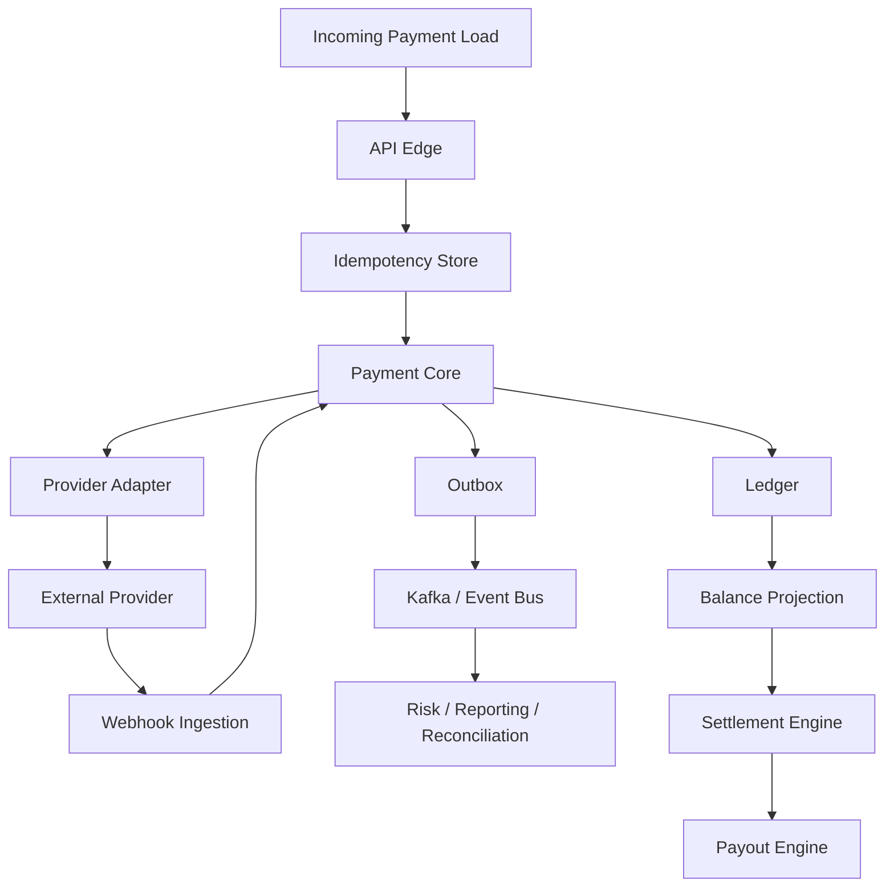
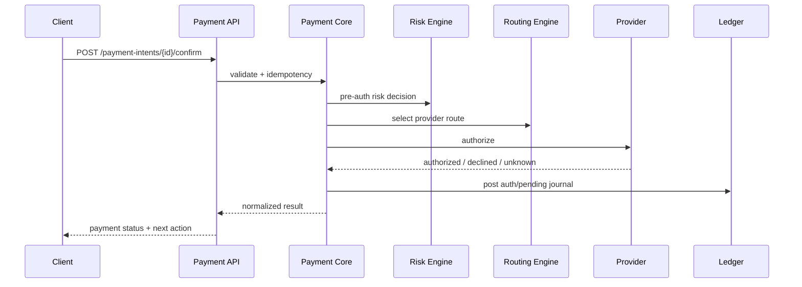
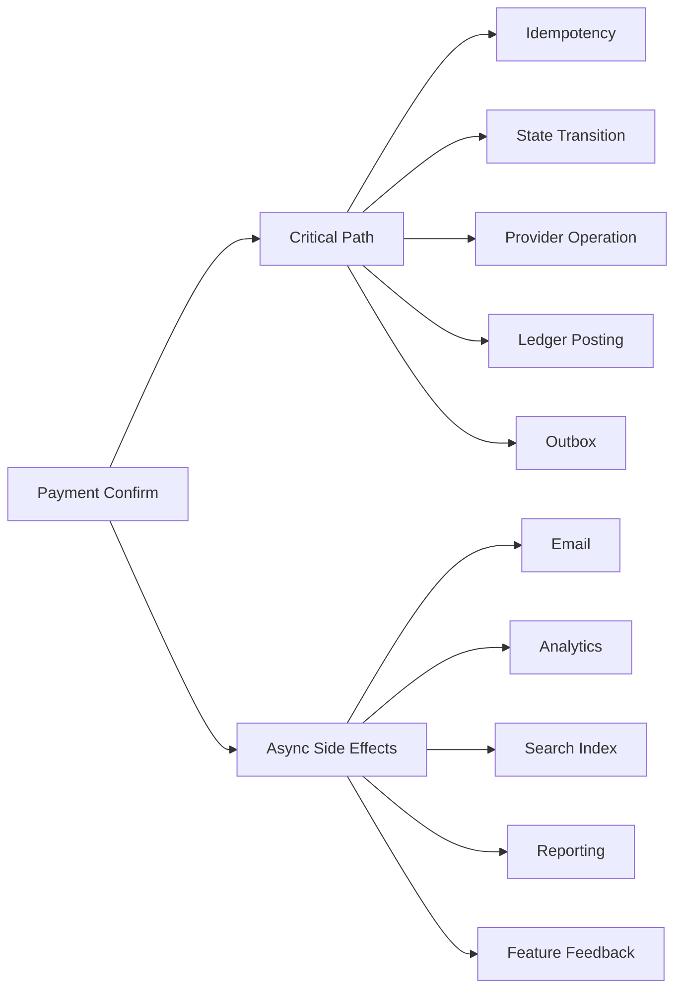
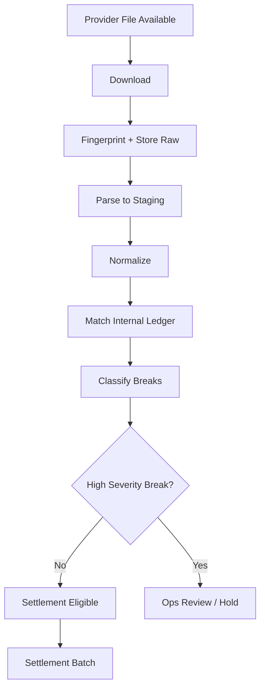
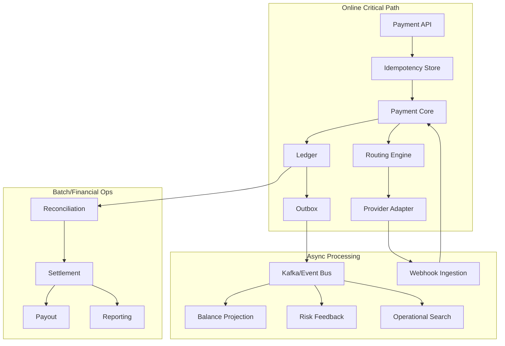

------
title: Build From Scratch: Large Production Grade Java Payment Systems - Part 057
description: Performance and capacity planning for production-grade Java payment systems, including TPS, latency budget, batch window, database growth, queue depth, Kafka partitions, hot merchants, provider limits, and financial safety under load.
series: learn-java-payment-systems
seriesTitle: Build From Scratch: Large Production Grade Java Payment Systems
order: 57
partTitle: Performance and Capacity Planning
tags:
- java
- payments
- payment-systems
- performance
- capacity-planning
- scalability
- kafka
- postgresql
- sre
- enterprise-architecture
date: 2026-07-02
---

# Part 057 — Performance and Capacity Planning

Performance payment system bukan lomba membuat endpoint cepat.

Performance payment system adalah kemampuan sistem untuk memproses money movement dalam volume tinggi sambil tetap menjaga:

- tidak ada double charge,
- tidak ada ledger drift,
- tidak ada balance phantom,
- tidak ada settlement batch salah,
- tidak ada webhook hilang karena overload,
- tidak ada reconciliation tertunda sampai operasi buta,
- tidak ada retry storm yang memperparah incident.

Di sistem pembayaran, throughput yang tinggi tapi menghasilkan data finansial tidak bisa dipercaya adalah kegagalan.

Rule pertama:

> A payment system is not performant when it is fast. It is performant when it remains correct, explainable, and recoverable at target load.

## 1. Mental Model: Capacity Is a Financial Control

Capacity planning sering diperlakukan sebagai urusan infra.

Di payment platform, capacity adalah kontrol finansial.

Kenapa?

Karena overload bisa berubah menjadi:

| Overload Point | Failure Finansial |
|---|---|
| API edge overload | client retry storm, duplicate payment attempt |
| idempotency store slow | duplicate command lolos |
| payment state row hot | confirm/capture race |
| provider adapter queue penuh | payment pending terlalu lama |
| webhook endpoint lambat | provider retry, duplicate webhook, stale state |
| ledger posting slow | payment paid tapi balance belum berubah |
| outbox relay lag | downstream settlement/risk/reconciliation stale |
| reconciliation batch melewati window | break tidak ditemukan sebelum settlement |
| payout worker backlog | merchant payout terlambat |
| audit log unavailable | operator action tidak defensible |

Capacity planning harus menjawab:

1. Berapa beban normal?
2. Berapa peak?
3. Berapa spike?
4. Apa yang harus tetap synchronous?
5. Apa yang boleh async?
6. Queue mana yang boleh menumpuk?
7. Queue mana yang tidak boleh menumpuk?
8. Table mana yang akan tumbuh paling cepat?
9. Key mana yang akan menjadi hot?
10. Jika overload, fitur mana yang ditutup dulu?



Setiap node punya capacity limit sendiri.

Satu bottleneck saja cukup untuk membuat seluruh lifecycle payment terlihat random.

## 2. Workload Classes

Jangan satukan semua traffic menjadi `TPS`.

Payment platform punya workload berbeda.

| Workload | Example | Latency Sensitivity | Correctness Sensitivity | Pattern |
|---|---|---:|---:|---|
| Synchronous checkout | create/confirm payment | tinggi | sangat tinggi | request-response |
| Provider call | authorize/capture/refund | tinggi | sangat tinggi | external RPC |
| Webhook ingestion | payment success/failure event | sedang | sangat tinggi | async intake |
| Ledger posting | journal creation | tinggi | sangat tinggi | transactional write |
| Balance projection | update read model | sedang | tinggi | async/sync hybrid |
| Risk decision | pre-auth/payout risk | tinggi | tinggi | request-response/cache |
| Reconciliation import | provider/bank report | rendah-sedang | sangat tinggi | batch/stream |
| Settlement calculation | merchant settlement | rendah-sedang | sangat tinggi | batch |
| Payout execution | disbursement | sedang | sangat tinggi | queue worker |
| Backoffice search | ops investigation | sedang | tinggi | query/read model |
| Reporting export | merchant report | rendah | tinggi | batch/export |

Satu angka seperti `10k TPS` tidak cukup.

Yang dibutuhkan adalah workload profile:

```yaml
workload_profile:
  checkout_confirm:
    average_rps: 600
    peak_rps: 2500
    p99_latency_target_ms: 900
    external_provider_timeout_ms: 3000
  webhook_ingest:
    average_eps: 900
    peak_eps: 8000
    ack_target_ms: 200
  ledger_posting:
    average_journals_per_second: 2500
    peak_journals_per_second: 12000
  reconciliation_import:
    files_per_day: 160
    largest_file_rows: 15000000
    batch_window_minutes: 90
  settlement:
    merchants_per_cutoff: 400000
    cutoff_count_per_day: 4
    settlement_window_minutes: 45
  payout:
    average_payouts_per_day: 250000
    peak_payouts_per_hour: 90000
```

Kalau workload tidak dipisah, optimasi akan salah arah.

## 3. Latency Budget per Payment Flow

Latency harus dipecah per stage.

Contoh checkout card authorization:

```text
Target p99 checkout confirm <= 1200 ms

API gateway/authentication      40 ms
request validation              10 ms
idempotency lookup/insert        25 ms
payment aggregate load           20 ms
risk pre-check                   80 ms
route decision                   15 ms
provider adapter mapping          5 ms
provider authorization          750 ms
state transition                 20 ms
ledger pending/auth posting      40 ms
outbox insert                    10 ms
response serialization           10 ms
buffer/jitter                   175 ms
```

Ini bukan angka universal.

Ini template berpikir.

Kalau provider p99 naik dari 750 ms ke 1800 ms, endpoint tidak akan memenuhi target walaupun Java service sangat cepat.

Jangan menghabiskan waktu micro-optimizing JSON mapping kalau p99 provider call mendominasi.



Latency budget harus dibuat untuk:

- payment create,
- payment confirm,
- capture,
- refund,
- webhook ack,
- webhook apply,
- balance read,
- merchant statement,
- reconciliation import,
- settlement batch,
- payout execution.

## 4. Throughput Model: Little's Law untuk Engineer

Gunakan formula sederhana:

```text
concurrency = throughput * latency
```

Kalau target:

```text
2,000 confirm per second
provider latency p95 = 800 ms
```

Maka concurrent provider calls kira-kira:

```text
2,000 * 0.8 = 1,600 concurrent calls
```

Kalau connection pool provider adapter hanya 200, sistem akan antre.

Kalau DB pool 50 dan setiap request menahan connection selama provider call, sistem akan mati.

Rule:

> Never hold scarce internal resources while waiting for slow external money movement unless the critical section is intentionally bounded.

Desain yang buruk:

```text
open DB transaction
load payment row
call provider for 3 seconds
update payment row
commit
```

Desain yang lebih aman:

```text
short transaction: create operation record + reserve transition intent
external call outside long DB transaction
short transaction: apply result if legal + post ledger + outbox
```

Tetapi ini membawa trade-off: ada gap external call.

Gap itu harus ditutup dengan:

- provider operation log,
- idempotency key,
- status inquiry,
- webhook ingestion,
- reconciliation.

Performance tidak boleh membeli latency dengan menghapus correctness.

## 5. Critical Path vs Non-Critical Path

Payment confirm critical path hanya boleh berisi hal yang diperlukan untuk menjawab safely.

Critical path biasanya:

- authentication/authorization request,
- idempotency,
- validation,
- state transition,
- provider operation,
- minimal ledger posting atau durable financial event,
- outbox event.

Non-critical path:

- email receipt,
- merchant analytics,
- heavy report update,
- search index update,
- BI export,
- full timeline enrichment,
- ML feature feedback,
- non-blocking notification.

Diagram:



Anti-pattern:

```text
payment success response waits for:
- fraud analytics enrichment,
- customer email,
- CRM sync,
- data warehouse insert,
- merchant notification,
- PDF invoice rendering.
```

Ini membuat checkout latency bergantung pada sistem yang tidak punya hak untuk memblokir uang.

## 6. Database Growth Model

Payment platform cepat menjadi write-heavy.

Contoh rough sizing:

```text
1 payment =
  1 payment_intent
  1-3 payment_attempt
  2-8 provider_operation
  2-20 webhook_event/provider_event over time
  1-8 ledger_journal
  2-30 ledger_entry
  1-10 outbox_event
  0-5 reconciliation_item
  0-3 risk_decision
  0-2 audit_event minimum
```

Kalau 10 juta payment per hari:

```text
ledger_entry could be 200M+ rows/day
webhook_event could be 50M+ rows/day
provider_operation could be 40M+ rows/day
outbox_event could be 80M+ rows/day
```

Ini bukan berarti satu Postgres cluster pasti tidak mampu.

Artinya schema, partitioning, retention, index, archive, dan read model harus direncanakan dari awal.

Tabel yang biasanya tumbuh cepat:

| Table | Growth Driver | Access Pattern |
|---|---|---|
| `payment_attempt` | retry/provider attempt | by payment, provider ref |
| `provider_operation` | every external operation | by payment, idempotency, provider ref |
| `provider_webhook_event` | raw webhook | by event id, provider ref, received time |
| `ledger_journal` | every financial movement | by business ref, account, date |
| `ledger_entry` | 2+ rows per journal | by account/date, journal |
| `outbox_event` | every integration event | by status, partition key, created_at |
| `inbox_message` | consumer dedupe | by message id, consumer |
| `risk_decision` | every decision | by entity, rule version, time |
| `audit_event` | every operator/system action | by actor, object, time |
| `reconciliation_source_record` | every report row | by file, provider ref, amount/date |

## 7. PostgreSQL Partitioning Strategy

Partitioning bukan magic performance.

Partitioning membantu kalau:

- query selalu punya partition key,
- maintenance per partition penting,
- archival/drop by period dibutuhkan,
- indexes per partition lebih kecil,
- batch import tidak mengunci satu giant table.

PostgreSQL mendukung declarative partitioning; partitioned table dibagi menjadi partitions, dan declarative partitioning memakai partitioned table + child partitions dengan set kolom yang sama.

Contoh partitioning untuk raw webhook:

```sql
create table provider_webhook_event (
    id uuid not null,
    provider_code text not null,
    provider_event_id text not null,
    received_at timestamptz not null,
    payload jsonb not null,
    signature_valid boolean not null,
    processing_status text not null,
    primary key (id, received_at),
    unique (provider_code, provider_event_id, received_at)
) partition by range (received_at);

create table provider_webhook_event_2026_07
partition of provider_webhook_event
for values from ('2026-07-01') to ('2026-08-01');
```

Untuk ledger, partitioning harus hati-hati.

Ledger query sering butuh:

- by account + date,
- by business reference,
- by journal id,
- by settlement batch,
- by merchant + date.

Kalau partition hanya by date, lookup by `payment_id` bisa lambat tanpa index tambahan atau reference table.

Desain umum:

```text
ledger_journal partition by posted_at month
ledger_entry partition by posted_at month
ledger_business_reference small indexed table by business_type + business_id -> journal_id
account_balance_projection by account_id + currency
account_balance_snapshot by account_id + snapshot_at
```

Jangan buat partition strategy dari asumsi.

Buat dari query matrix.

## 8. Index Budget

Index mempercepat read tapi memperlambat write.

Payment platform write-heavy tidak boleh punya index “untuk jaga-jaga”.

Setiap index harus punya alasan:

| Index | Reason |
|---|---|
| `unique(idempotency_scope, idempotency_key)` | prevent duplicate command |
| `unique(provider_code, provider_operation_id)` | dedupe provider operation |
| `unique(provider_code, provider_event_id)` | webhook dedupe |
| `payment_intent(merchant_id, created_at desc)` | merchant dashboard |
| `ledger_entry(account_id, posted_at)` | account statement |
| `ledger_journal(business_type, business_id)` | trace payment to journal |
| `outbox_event(status, available_at, id)` | relay polling |
| `payout_instruction(status, available_at, id)` | worker polling |
| `reconciliation_break(status, severity, created_at)` | ops queue |

Index anti-pattern:

```sql
create index on ledger_entry(amount_minor);
create index on ledger_entry(description);
create index on webhook_event(payload);
create index on payment_intent(status);
```

Index seperti itu sering tidak berguna di workload nyata.

Gunakan query plan dan cardinality.

## 9. Hot Rows and Hot Aggregates

Hot row adalah pembunuh throughput.

Contoh hot row:

```text
merchant_balance row updated for every payment
platform_balance row updated for every transaction
risk_velocity_counter row updated for same merchant every request
settlement_batch row updated for every included payment
sequence-like manual counter row
```

Masalahnya:

- row lock queue panjang,
- latency naik,
- deadlock risk meningkat,
- throughput stuck walaupun CPU idle,
- worker retry memperparah lock contention.

Solusi umum:

### 9.1 Append-Only Entry, Async Projection

Jangan update satu row balance untuk setiap event kalau throughput tinggi.

Gunakan append-only ledger entry lalu projection worker.

```text
payment success -> ledger journal append
ledger projection worker -> update account_balance_projection
```

Tetapi read balance harus tahu freshness.

```json
{
  "accountId": "acct_123",
  "available": { "amountMinor": 1500000, "currency": "IDR" },
  "projectionLagMs": 180,
  "asOfLedgerSequence": 992331881
}
```

### 9.2 Sharded Counters

Untuk velocity/risk counter:

```text
counter_key = merchant_id + window + shard
```

Write menyebar ke beberapa shard.

Read menjumlahkan shard.

Trade-off:

- lebih scalable,
- read sedikit lebih mahal,
- limit enforcement harus punya tolerance/reservation kalau hard limit.

### 9.3 Reservation Ledger

Untuk balance yang harus hard-safe, jangan hanya counter.

Gunakan reservation:

```text
available -> reserved -> payout_pending -> paid_out
```

Dengan ledger posting dan idempotency.

## 10. Kafka / Event Bus Capacity

Kafka membantu scale event processing, tetapi tidak menghapus kebutuhan desain ordering.

Kafka menjamin ordering dalam topic-partition, bukan global ordering antar-partition. Karena itu payment event key penting.

Key yang umum:

| Stream | Key | Reason |
|---|---|---|
| payment events | `payment_id` | preserve lifecycle ordering per payment |
| merchant balance events | `merchant_account_id` | preserve account-level balance ordering |
| payout events | `payout_id` or `merchant_id` | depends on settlement model |
| reconciliation records | `source_file_id` or `provider_ref` | deterministic matching pipeline |
| webhook events | `provider_code + provider_object_ref` | avoid out-of-order per provider object |

Hot partition terjadi kalau key terlalu skewed.

Contoh:

```text
key = merchant_id
```

Kalau satu enterprise merchant menghasilkan 40% traffic, satu partition akan panas.

Alternatif:

```text
key = payment_id for payment lifecycle
key = merchant_id + shard for analytics
key = account_id for balance-sensitive posting
```

Trade-off utama:

- ordering per payment,
- ordering per account,
- parallelism,
- reconciliation determinism.

Tidak ada key universal.

## 11. Queue Depth and Backpressure

Queue bukan tempat membuang masalah.

Queue adalah buffer terbatas.

Metric yang wajib:

```text
queue_depth
oldest_message_age_seconds
processing_rate_per_second
ingress_rate_per_second
retry_rate_per_second
dlq_rate_per_second
replay_rate_per_second
```

Lebih penting dari `queue_depth` adalah `oldest_message_age`.

Queue 1 juta event mungkin aman kalau diproses 200k/s.

Queue 10k event berbahaya kalau event tertua sudah 2 jam dan settlement cutoff 30 menit lagi.

Backpressure policy harus payment-specific:

| Condition | Response |
|---|---|
| webhook queue high | ack raw event quickly, slow non-critical processors |
| ledger posting lag | block settlement/payout dependent actions |
| risk service degraded | fail closed for payout, maybe step-up for payment |
| provider timeout storm | circuit route, reduce retry, mark unknown |
| reconciliation backlog | freeze settlement batch finalization |
| outbox relay lag | alert stale downstream, not duplicate publish blindly |

## 12. Provider Capacity and Rate Limits

External provider adalah bottleneck yang tidak bisa kamu scale sendiri.

Provider integration perlu:

- per-provider concurrency limit,
- per-merchant/provider route limit,
- rate limit token bucket,
- circuit breaker,
- retry budget,
- timeout budget,
- status inquiry budget,
- bulkhead per operation type.

Contoh policy:

```yaml
provider_capacity:
  acquirer_a:
    authorize:
      max_concurrency: 800
      timeout_ms: 2500
      retry_budget_per_minute: 200
      circuit_open_error_rate: 0.25
    capture:
      max_concurrency: 400
      timeout_ms: 3000
    refund:
      max_concurrency: 200
      timeout_ms: 5000
  bank_payout_x:
    payout:
      max_concurrency: 100
      timeout_ms: 10000
      inquiry_after_unknown_seconds: 60
```

Jangan biarkan refund traffic menghabiskan seluruh connection pool authorization.

Gunakan bulkhead:

```text
provider pool per operation:
- authorize pool
- capture pool
- refund pool
- payout pool
- inquiry pool
```

## 13. Batch Window Planning

Settlement dan reconciliation punya batch window.

Misalnya:

```text
provider report available: 01:00
bank statement available: 02:00
reconciliation must finish: 04:00
settlement calculation starts: 04:15
merchant payout file submitted: 05:00
```

Capacity question:

```text
Can we parse, normalize, match, break-classify, and approve settlement before cutoff?
```

Batch performance tidak hanya rows/second.

Harus mengukur:

- file download time,
- checksum/fingerprint,
- parse throughput,
- staging insert throughput,
- normalization throughput,
- matching candidate search,
- break classification,
- settlement eligibility recompute,
- report generation,
- operator review time for high-severity breaks.



Jika window pendek, jangan tunggu satu giant job selesai.

Gunakan pipeline:

```text
file chunks -> staging -> normalize -> match -> aggregate control totals -> break summary
```

Tetapi chunking harus menjaga determinism.

## 14. Settlement Batch Capacity

Settlement batch bukan sekadar query:

```sql
select sum(amount) group by merchant
```

Settlement engine menghitung:

- captured/settled payment,
- fees,
- tax,
- refunds,
- chargebacks,
- reserves,
- payout holds,
- negative balance recovery,
- minimum payout threshold,
- merchant schedule,
- currency,
- bank account validity,
- compliance restrictions,
- reconciliation gate.

Capacity plan harus menghitung complexity per merchant.

Contoh:

```text
400,000 merchants per cutoff
40M eligible ledger movements
4 currencies
12 fee policies
20k merchants with reserve policy
3k merchants under risk hold
```

Batch strategy:

- partition merchants by settlement schedule/currency,
- compute independent merchant settlement in parallel,
- use immutable settlement candidate table,
- freeze input watermark,
- store calculation evidence,
- finalize with idempotent ledger posting.

Watermark penting:

```text
settlement_run.input_ledger_sequence_to = 991883818
```

Tanpa watermark, batch bisa berubah saat sedang dihitung.

## 15. Read Model Capacity

Backoffice dan merchant dashboard sering membunuh primary database.

Payment search query berbahaya:

```sql
select * from payment_intent
where merchant_id = ?
order by created_at desc
limit 50;
```

Ini aman jika ada index yang benar.

Tapi ops search biasanya:

```text
find by customer email
find by provider reference
find by last4
find by amount + date
find by dispute case
find by settlement batch
find by bank narrative
```

Solusi:

- operational search read model,
- denormalized payment timeline,
- search index dengan redaction,
- provider reference index table,
- ledger business reference table,
- async projection with lag indicator.

Jangan beri backoffice kebebasan full table scan production ledger.

## 16. Capacity Planning Worksheet

Gunakan worksheet sederhana.

```text
payments_per_day = 20,000,000
peak_factor = 8x average
seconds_per_day = 86,400
average_payment_rps = 231
peak_payment_rps = 1,851
attempts_per_payment = 1.25
provider_ops_per_attempt = 1.6
webhooks_per_payment = 2.4
journals_per_payment = 2.8
entries_per_journal = 4.0
outbox_events_per_payment = 4.5
```

Derived:

```text
peak_attempt_rps = 2,314
peak_provider_ops_rps = 3,702
peak_webhook_eps = 4,442
peak_journals_per_second = 5,183
peak_ledger_entries_per_second = 20,732
peak_outbox_eps = 8,329
```

Pertanyaan lanjut:

```text
Can DB sustain 20k ledger entry inserts/s with required indexes?
Can webhook raw store sustain 4.4k events/s burst?
Can outbox relay publish 8.3k events/s while preserving key ordering?
Can provider adapter handle 3.7k concurrent-ish ops with external latency?
Can settlement process 20M payment/day inside cutoff window?
```

## 17. Java Service-Level Performance Controls

Di Java service, performance controls penting:

- bounded executor,
- bounded connection pool,
- bounded queue,
- timeout per dependency,
- bulkhead per provider/operation,
- async pipeline only where ordering safe,
- structured logging without huge payload,
- JSON parsing budget,
- no accidental N+1 queries,
- no unbounded in-memory batch,
- no `parallelStream()` on request path,
- no blocking call on event-loop thread jika memakai reactive stack,
- backpressure-aware consumer.

Contoh worker loop yang lebih aman:

```java
public final class BoundedPayoutWorker {
    private final Semaphore permits;
    private final PayoutRepository repository;
    private final PayoutExecutor executor;

    public void runOnce() {
        int available = permits.availablePermits();
        if (available == 0) return;

        List<PayoutJob> jobs = repository.claimReadyJobs(available);
        for (PayoutJob job : jobs) {
            if (!permits.tryAcquire()) break;
            executor.submit(() -> {
                try {
                    process(job);
                } finally {
                    permits.release();
                }
            });
        }
    }
}
```

Tapi jangan lupa:

- claim job harus memakai lease/fencing,
- processing harus idempotent,
- provider result unknown harus masuk unknown workflow,
- retry harus punya budget.

## 18. Load Testing Scenarios

Load test payment system tidak cukup `GET /health` atau `POST /payments` sukses terus.

Test scenarios harus mencerminkan lifecycle.

| Scenario | What to Measure |
|---|---|
| normal checkout success | p50/p95/p99, DB write, provider latency |
| issuer decline burst | decline handling throughput |
| provider timeout storm | unknown queue, retry budget, circuit behavior |
| webhook duplicate burst | dedupe contention |
| webhook out-of-order | state machine conflict rate |
| delayed webhook | stale payment resolution |
| partial capture high volume | capture constraint and ledger posting |
| refund burst after incident | refund worker and ledger capacity |
| settlement cutoff load | batch completion time |
| payout peak | provider limit, queue age |
| reconciliation giant file | parse/match throughput |
| backoffice incident search | read model capacity |
| merchant hot key | partition and lock contention |

Gunakan provider simulator, bukan provider real, untuk testing kapasitas ekstrem.

Simulator harus bisa menghasilkan:

```yaml
provider_simulator:
  latency_distribution:
    p50_ms: 250
    p95_ms: 900
    p99_ms: 2500
  outcomes:
    success: 0.82
    soft_decline: 0.07
    hard_decline: 0.05
    timeout_unknown: 0.03
    provider_5xx: 0.02
    malformed_response: 0.01
  webhook:
    duplicate_rate: 0.02
    out_of_order_rate: 0.01
    max_delay_seconds: 7200
```

## 19. Hot Partition Test

Payment platform harus secara sengaja diuji dengan skew.

Contoh traffic:

```text
merchant A = 45% traffic
merchant B = 20%
merchant C = 10%
long tail = 25%
```

Jika Kafka key by `merchant_id`, satu partition panas.

Jika DB balance row by `merchant_id`, satu row panas.

Jika risk counter by `merchant_id`, satu counter panas.

Test harus menampilkan:

- partition lag per partition,
- DB lock wait by relation/index,
- p99 latency per merchant,
- queue age per merchant,
- error rate per provider route,
- settlement calculation time for hot merchant.

## 20. Cost and Capacity Trade-Off

Tidak semua harus real-time.

Real-time yang wajib:

- checkout decision,
- idempotency,
- legal state transition,
- provider operation evidence,
- minimal financial posting/evidence,
- fraud hard block,
- payout hold/block.

Bisa near-real-time:

- merchant dashboard projection,
- analytics,
- search index,
- report enrichment,
- feature feedback,
- email/notification.

Batch:

- bank statement import,
- settlement statement generation,
- monthly report,
- archive,
- data warehouse.

Cost optimization bukan menurunkan instance.

Cost optimization adalah menempatkan setiap workload pada consistency/latency tier yang tepat.

## 21. Graceful Degradation

Saat kapasitas menipis, sistem harus degrade dengan aman.

| Degradation | Safe? | Notes |
|---|---:|---|
| turn off merchant analytics | yes | non-financial |
| delay email receipt | yes | as long payment visible elsewhere |
| disable heavy backoffice export | yes | protect primary |
| reduce payment method display | yes | hide degraded routes |
| disable risky provider route | yes | circuit/routing control |
| delay settlement finalization | yes | safer than wrong payout |
| fail open risk for payout | no | unsafe |
| assume timeout as failed | no | double charge risk |
| skip ledger posting to be faster | no | financial drift |
| skip webhook signature verification | no | fraud/security risk |

Graceful degradation harus menjadi feature, bukan improvisasi incident.

## 22. Performance Acceptance Criteria

Sebelum go-live, tetapkan acceptance criteria.

Contoh:

```yaml
performance_acceptance:
  checkout_confirm:
    p95_ms: 700
    p99_ms: 1200
    error_rate: "< 0.1% excluding issuer declines"
    duplicate_charge_rate: 0
  webhook_ingestion:
    ack_p95_ms: 100
    raw_event_persist_success: "99.999%"
    oldest_unprocessed_event_seconds: "< 60 normal, < 900 degraded"
  ledger:
    unbalanced_journals: 0
    duplicate_business_postings: 0
    projection_lag_seconds: "< 10 normal"
  outbox:
    oldest_unpublished_event_seconds: "< 30 normal"
  reconciliation:
    daily_file_processed_before_cutoff: true
    high_severity_breaks_auto_settle: false
  settlement:
    batch_reproducible: true
    input_watermark_recorded: true
  payout:
    duplicate_payout_rate: 0
    unknown_outcome_has_case: true
```

Perhatikan: acceptance criteria payment selalu memuat correctness metric, bukan hanya latency.

## 23. Reference Architecture for Capacity



Capacity harus diukur per boundary.

Jangan hanya ukur service CPU.

## 24. Common Failure in Capacity Planning

### 24.1 Mengukur Average, Bukan Peak

Payment traffic punya spike:

- campaign,
- payday,
- flash sale,
- salary disbursement,
- holiday,
- provider recovery after outage,
- webhook retry burst.

Average traffic menipu.

### 24.2 Mengabaikan Retry Amplification

Kalau error rate naik, client/provider/worker melakukan retry.

Load bisa naik karena sistem gagal.

```text
original load = 1000 rps
error rate = 20%
client retry once = +200 rps
worker retry = +100 rps
webhook provider retry = +80 rps
status inquiry = +150 rps
total = 1530 rps
```

Incident memperbesar load.

Retry budget harus dihitung.

### 24.3 Menguji Happy Path Saja

Happy path adalah beban paling mudah.

Unknown path jauh lebih mahal karena membutuhkan:

- inquiry,
- queue,
- manual case,
- reconciliation,
- delayed webhook handling,
- customer/merchant messaging.

### 24.4 Membiarkan One Big Merchant Menjadi Arsitektur

Enterprise merchant besar bisa mengubah distribusi.

Desain harus support skew.

### 24.5 Menunda Archival

Raw webhook, audit, ledger, reconciliation source record akan tumbuh besar.

Archival bukan housekeeping belakangan.

Archival adalah bagian dari schema lifecycle.

## 25. Checklist

Sebelum mengklaim platform siap scale, jawab:

- Apakah setiap workload punya target TPS/EPS sendiri?
- Apakah setiap flow punya latency budget?
- Apakah provider latency masuk capacity model?
- Apakah DB transaction tidak menahan connection saat call eksternal lama?
- Apakah table growth per hari/bulan sudah dihitung?
- Apakah partition strategy berbasis query matrix?
- Apakah index budget sudah divalidasi dengan workload nyata?
- Apakah hot merchant/hot account sudah dites?
- Apakah Kafka key mempertahankan ordering yang benar?
- Apakah queue depth dan oldest age dimonitor?
- Apakah retry amplification dihitung?
- Apakah settlement/reconciliation batch window punya margin?
- Apakah graceful degradation sudah ditentukan?
- Apakah load test mencakup timeout, duplicate webhook, out-of-order webhook, dan provider outage?
- Apakah acceptance criteria memuat correctness metrics?

## 26. References

- PostgreSQL Documentation — Table Partitioning: https://www.postgresql.org/docs/current/ddl-partitioning.html
- Apache Kafka Documentation — Introduction and partition ordering: https://kafka.apache.org/documentation/
- OpenTelemetry Documentation — Signals, traces, metrics, logs: https://opentelemetry.io/docs/concepts/signals/
- Stripe Documentation — Webhooks and retry behavior: https://docs.stripe.com/webhooks
- Google SRE Book — Monitoring distributed systems / four golden signals: https://sre.google/sre-book/monitoring-distributed-systems/
- AWS Builders Library — Timeouts, retries, and backoff with jitter: https://aws.amazon.com/builders-library/timeouts-retries-and-backoff-with-jitter/

## 27. Closing Thought

Performance payment system adalah seni menolak simplifikasi.

Tidak cukup bertanya:

```text
Can this endpoint handle 10k TPS?
```

Pertanyaan yang benar:

```text
Can this platform preserve money correctness at peak traffic, provider degradation, webhook retry burst, settlement cutoff, and one-merchant skew?
```

Kalau jawabannya belum jelas, sistem belum production-grade.
