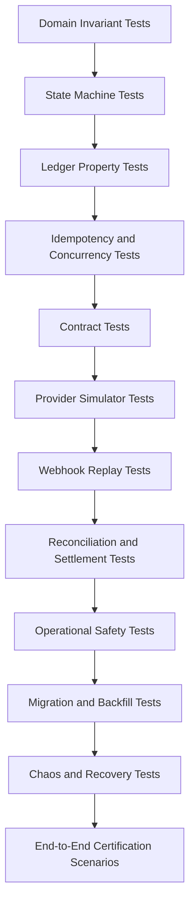

------
title: Build From Scratch: Large Production Grade Java Payment Systems - Part 058
description: Testing strategy for production-grade Java payment systems, including contract tests, provider simulator, ledger property tests, concurrency tests, webhook replay, reconciliation tests, chaos testing, migration tests, and release evidence.
series: learn-java-payment-systems
seriesTitle: Build From Scratch: Large Production Grade Java Payment Systems
order: 58
partTitle: Testing Strategy for Payment Platforms
tags:
- java
- payments
- payment-systems
- testing
- property-based-testing
- contract-testing
- testcontainers
- simulator
- chaos-testing
- ledger
- enterprise-architecture
date: 2026-07-02
---

# Part 058 — Testing Strategy for Payment Platforms

Testing payment platform bukan mencari coverage tinggi.

Testing payment platform adalah membangun bukti bahwa sistem menjaga invariant finansial saat menghadapi input buruk, retry, concurrency, provider failure, webhook duplikat, reconciliation mismatch, operator action, dan migration.

Coverage 90% bisa tetap gagal menangkap:

- double charge,
- double ledger posting,
- refund melebihi captured amount,
- payout dua kali,
- webhook out-of-order,
- provider timeout yang dianggap failed,
- settlement batch non-reproducible,
- manual adjustment tanpa approval,
- idempotency key reuse dengan body berbeda,
- ledger projection drift.

Rule utama:

> In payment systems, tests should prove invariants, not just execute branches.

## 1. Mental Model: Test Evidence, Not Just Test Cases

Payment system perlu test yang menghasilkan evidence.

Evidence untuk:

- engineer,
- reviewer,
- SRE,
- finance operations,
- security,
- compliance,
- auditor,
- incident commander.

Test suite harus bisa menjawab:

```text
Under which conditions can money be created, lost, duplicated, or misreported?
```

Jawaban ideal:

```text
We tested those conditions explicitly, and invariant checks fail the build if they happen.
```

Bukan:

```text
The unit tests passed.
```

## 2. Payment Testing Pyramid

Pyramid generic:

```text
unit -> integration -> e2e
```

Tidak cukup untuk payment.

Payment testing stack lebih tepat:



Pyramid ini bukan berarti semua test lambat.

Sebagian besar tetap cepat.

Yang berubah adalah orientasi: invariant finansial menjadi pusat.

## 3. Test Classification

| Test Type | Purpose | Speed | Example |
|---|---|---:|---|
| Value object test | correctness lokal | sangat cepat | Money rounding, currency minor unit |
| State machine test | legal transition | cepat | authorized -> captured legal |
| Posting rule test | ledger balanced | cepat | capture posts debit/credit correctly |
| Property-based test | invariant across many inputs | cepat-sedang | refund never exceeds captured |
| Idempotency test | duplicate command safety | sedang | same key returns same result |
| Concurrency test | race condition safety | sedang-lambat | capture vs cancel race |
| Contract test | API/provider boundary | cepat-sedang | error schema backward compatible |
| Adapter simulator test | external behavior | sedang | timeout + delayed webhook |
| Integration test | real DB/broker behavior | sedang | unique constraint, outbox relay |
| Replay test | historical/event sequence safety | sedang-lambat | replay webhooks after deploy |
| Reconciliation test | file matching correctness | sedang | many-to-one settlement matching |
| Settlement test | payout calculation reproducible | sedang-lambat | reserve + fee + refund batch |
| Chaos test | resilience under failure | lambat | kill webhook worker mid-run |
| Migration test | data evolution safety | lambat | ledger backfill exact totals |

## 4. Core Invariant Test List

Minimal invariant yang harus dites berulang:

### 4.1 Payment Invariants

- satu purchase tidak boleh menghasilkan lebih dari satu successful charge kecuali eksplisit multi-capture/split flow,
- payment terminal tidak boleh kembali ke non-terminal tanpa correction workflow,
- unknown outcome tidak boleh dianggap failed tanpa evidence,
- provider success evidence tidak boleh diabaikan oleh internal failure,
- duplicate webhook tidak boleh mengubah hasil kedua kali,
- out-of-order webhook tidak boleh menurunkan state,
- same idempotency key + same fingerprint harus replay response,
- same idempotency key + different fingerprint harus conflict.

### 4.2 Ledger Invariants

- setiap journal balanced,
- setiap posting rule menghasilkan debit/credit yang benar,
- setiap business operation punya idempotency key ledger,
- tidak ada negative available balance kecuali policy mengizinkan,
- refund total tidak boleh melebihi captured refundable amount,
- payout total tidak boleh melebihi available payable,
- correction/reversal tidak boleh mutate journal lama,
- balance projection bisa direbuild dari ledger entries.

### 4.3 Settlement Invariants

- settlement batch punya input watermark,
- settlement batch reproducible,
- high severity reconciliation break tidak boleh auto-settle,
- merchant hold/reserve mengurangi payable,
- payout instruction dibuat sekali per settlement item,
- failed payout tidak boleh dianggap paid.

### 4.4 Operational Invariants

- manual adjustment butuh reason/evidence,
- high-risk action butuh maker-checker,
- approver tidak boleh sama dengan maker,
- stale approval tidak boleh dieksekusi,
- break-glass action selalu audited,
- sensitive reveal selalu logged dan time-bounded.

## 5. State Machine Tests

State machine test harus membuktikan legal transition.

Contoh model:

```java
enum PaymentState {
    REQUIRES_PAYMENT_METHOD,
    REQUIRES_CONFIRMATION,
    AUTHENTICATING,
    AUTHORIZED,
    CAPTURED,
    CANCELLED,
    FAILED,
    UNKNOWN,
    REFUNDED,
    DISPUTED
}
```

Test jangan hanya happy path.

```java
@Test
void capturedPaymentCannotBeCancelled() {
    Payment p = PaymentFixtures.captured();

    assertThatThrownBy(() -> p.cancel(CancelReason.MERCHANT_REQUEST))
        .isInstanceOf(IllegalStateTransitionException.class);
}

@Test
void unknownPaymentCannotBeBlindlyRetriedAsNewCharge() {
    Payment p = PaymentFixtures.unknownAfterProviderTimeout();

    assertThatThrownBy(() -> p.startNewProviderAttemptWithoutInquiry())
        .isInstanceOf(UnknownOutcomeRequiresResolutionException.class);
}
```

State machine test matrix:

| From | Event | Expected |
|---|---|---|
| requires_confirmation | confirm accepted | processing/authenticating/authorized |
| authorized | capture success | captured |
| authorized | cancel success | cancelled |
| captured | cancel requested | rejected |
| captured | refund success | partially/refunded |
| unknown | webhook success | captured/authorized depending event |
| unknown | inquiry failed definitive | failed |
| failed | webhook success | conflict or repair workflow |
| captured | duplicate capture webhook | no-op idempotent |

## 6. Ledger Property-Based Tests

Property-based testing cocok untuk ledger.

Daripada test 5 contoh refund, generate banyak sequence.

Property:

```text
For any valid sequence of captures, refunds, chargebacks, reserves, releases, and payouts:
- every journal is balanced,
- available never violates policy,
- total refunded <= total captured,
- final projection equals sum(entries),
- replaying same operation idempotently does not change totals.
```

Pseudo jqwik-style:

```java
@Property
void ledgerRemainsBalancedForValidPaymentLifecycle(
    @ForAll("validPaymentOperationSequences") List<PaymentOperation> operations
) {
    Ledger ledger = new InMemoryLedger();
    PaymentAggregate payment = PaymentFixtures.authorizable();

    for (PaymentOperation op : operations) {
        payment.apply(op, ledger);
        assertThat(ledger.allJournals()).allMatch(Journal::isBalanced);
    }

    BalanceProjection rebuilt = BalanceProjection.rebuildFrom(ledger.entries());
    assertThat(rebuilt).isEqualTo(ledger.currentProjection());
}
```

Property-based testing tidak mengganti example-based tests.

Ia menutup ruang input yang terlalu besar untuk ditulis manual.

## 7. Idempotency Tests

Idempotency test harus mencakup API, provider, webhook, ledger, outbox, dan backoffice.

### 7.1 API Idempotency

```java
@Test
void sameIdempotencyKeyAndSameFingerprintReplaysSameResponse() {
    CreatePaymentRequest request = request(amount("IDR", 100_000));

    ApiResponse first = client.createPayment(request, idempotencyKey("k1"));
    ApiResponse second = client.createPayment(request, idempotencyKey("k1"));

    assertThat(second.body()).isEqualTo(first.body());
    assertThat(paymentRepository.countByClientReference(request.clientReference())).isEqualTo(1);
}

@Test
void sameIdempotencyKeyWithDifferentFingerprintIsConflict() {
    client.createPayment(request(amount("IDR", 100_000)), idempotencyKey("k1"));

    ApiResponse second = client.createPayment(request(amount("IDR", 200_000)), idempotencyKey("k1"));

    assertThat(second.status()).isEqualTo(409);
}
```

### 7.2 Ledger Idempotency

```java
@Test
void sameBusinessPostingDoesNotCreateSecondJournal() {
    LedgerCommand command = capturePosting(paymentId, captureId, amount("IDR", 100_000));

    ledger.post(command);
    ledger.post(command);

    assertThat(ledger.findJournalsByBusinessRef("capture", captureId)).hasSize(1);
}
```

### 7.3 Webhook Idempotency

```java
@Test
void duplicateWebhookIsNoopAfterFirstApply() {
    ProviderWebhook event = providerEvent("evt_123", "payment_succeeded");

    webhookIngestion.receive(event);
    webhookIngestion.receive(event);

    assertThat(rawWebhookRepository.countByProviderEventId("evt_123")).isEqualTo(1);
    assertThat(ledger.countJournalsForPayment(event.paymentRef())).isEqualTo(1);
}
```

## 8. Concurrency Tests

Concurrency bug jarang muncul di test linear.

Payment concurrency cases:

- two confirm requests same idempotency key,
- two confirm requests different idempotency key same payment,
- capture vs cancel,
- refund vs refund,
- webhook success vs API timeout resolution,
- payout worker double claim,
- settlement finalize double click,
- manual adjustment approval race,
- balance reservation race.

Test pattern:

```java
@Test
void concurrentCaptureAndCancelOnlyOneWins() throws Exception {
    PaymentId paymentId = fixture.authorizedPayment();
    CyclicBarrier barrier = new CyclicBarrier(2);

    Future<Result> capture = executor.submit(() -> {
        barrier.await();
        return paymentService.capture(paymentId, idempotencyKey("cap"));
    });

    Future<Result> cancel = executor.submit(() -> {
        barrier.await();
        return paymentService.cancel(paymentId, idempotencyKey("void"));
    });

    List<Result> results = List.of(capture.get(), cancel.get());

    assertThat(results).filteredOn(Result::isSuccess).hasSize(1);
    assertThat(ledger.journalsFor(paymentId)).satisfies(journals -> {
        assertThat(journals).allMatch(Journal::isBalanced);
        assertThat(journals).doesNotHaveDuplicates();
    });
}
```

Gunakan real database untuk concurrency test.

Mock repository tidak bisa membuktikan unique constraint, row lock, isolation behavior, atau deadlock handling.

## 9. Contract Tests

Payment platform punya banyak boundary:

- public API,
- merchant API,
- webhook API,
- provider adapter port,
- internal event schema,
- ledger posting command,
- reconciliation file schema,
- settlement report schema.

Contract tests harus menjaga backward compatibility.

Contoh contract rules:

```text
Public API:
- existing field cannot change type
- enum value cannot be removed
- error code remains stable
- idempotency response shape stable
- amount minor unit semantics stable

Webhook:
- event id required
- event type required
- object id required
- signature header required
- payload version explicit

Internal events:
- aggregate id required
- event id globally unique
- occurred_at immutable
- schema version required
- backward-compatible additions only
```

Pact dapat dipakai untuk consumer-driven contract tests, terutama komunikasi service-to-service HTTP. Untuk OpenAPI-first API, contract validation juga bisa dilakukan dengan schema validators dan backward-compatibility check di CI.

## 10. Provider Simulator Tests

Jangan bergantung pada provider sandbox untuk semua test.

Provider sandbox penting, tetapi tidak cukup karena:

- sulit mengatur timeout deterministik,
- sulit menghasilkan duplicate webhook ekstrem,
- sulit membuat out-of-order sequence spesifik,
- sulit membuat malformed response,
- sulit menguji incident volume,
- provider sandbox bisa berubah.

Bangun simulator sendiri.

Simulator harus mendukung:

```yaml
scenarios:
  happy_path_authorize_capture:
    authorize_response: authorized
    capture_response: captured
    webhook_sequence:
      - authorization_succeeded
      - capture_succeeded

  timeout_then_late_success:
    authorize_response: timeout
    inquiry_response_after_seconds: 30
    final_status: authorized
    webhook_delay_seconds: 90

  duplicate_webhook:
    authorize_response: authorized
    webhook_sequence:
      - authorization_succeeded
      - authorization_succeeded
      - authorization_succeeded

  out_of_order_capture:
    capture_response: captured
    webhook_sequence:
      - capture_succeeded
      - authorization_succeeded

  provider_5xx_then_idempotent_success:
    first_response: http_500
    retry_same_key_response: authorized

  malformed_response:
    authorize_response: invalid_json
```

Simulator API example:

```http
POST /simulator/scenarios
Content-Type: application/json

{
  "scenarioId": "timeout-then-late-success",
  "paymentRef": "pay_123",
  "webhookDelaySeconds": 90
}
```

Simulator bukan mainan.

Simulator adalah safety lab.

## 11. Webhook Replay Tests

Webhook harus bisa direplay.

Replay tests membuktikan bahwa memproses ulang event tidak merusak state.

Test cases:

| Case | Expected |
|---|---|
| replay same event | no duplicate ledger |
| replay older event after newer event | no state regression |
| replay event with invalid signature | rejected/quarantined |
| replay event after mapping version change | deterministic mapping or explicit migration |
| replay all events for one payment | final state same |
| replay events after partial DB failure | inbox/outbox recover |
| replay poison event | quarantined, does not block partition forever |

Pseudo:

```java
@Test
void replayingWebhookHistoryProducesSameFinalState() {
    List<RawWebhookEvent> events = fixture.webhookHistory("pay_123");

    PaymentState first = replayEngine.replay(events).finalPaymentState();
    PaymentState second = replayEngine.replay(events).finalPaymentState();

    assertThat(second).isEqualTo(first);
    assertThat(ledger.journalsFor("pay_123")).doesNotHaveDuplicates();
}
```

Replay harus tersedia untuk:

- satu payment,
- satu provider reference,
- satu merchant,
- satu file,
- satu time range,
- satu failed consumer group.

## 12. Reconciliation Tests

Reconciliation matching harus diuji seperti engine, bukan SQL report.

Test cases:

| Scenario | Expected |
|---|---|
| exact one-to-one match | matched |
| provider fee differs within tolerance | matched_with_tolerance |
| amount mismatch above tolerance | break |
| duplicate provider record | duplicate break |
| one bank settlement row contains many payments | aggregate match |
| provider ref missing but amount/date matches | candidate, not auto-match unless policy allows |
| late settlement next day | timing difference |
| refund in provider report missing internally | break + correction proposal |
| internal ledger has captured but provider missing | break + inquiry |

Golden file testing penting.

```text
src/test/resources/reconciliation/golden/
  adyen-settlement-v1.csv
  adyen-settlement-v1.expected.json
  stripe-balance-v1.csv
  stripe-balance-v1.expected.json
  bank-statement-id-v1.csv
  bank-statement-id-v1.expected.json
```

Parser harus versioned.

Kalau provider mengubah format file, test harus gagal sebelum production matching rusak.

## 13. Settlement Tests

Settlement test harus membuktikan batch reproducible.

Property:

```text
Given same ledger watermark and same merchant policy versions,
settlement result must be identical.
```

Test:

```java
@Test
void settlementRunIsReproducibleAtSameWatermark() {
    LedgerWatermark watermark = ledger.currentWatermark();
    SettlementRun first = settlementEngine.calculate(cutoff, watermark);
    SettlementRun second = settlementEngine.calculate(cutoff, watermark);

    assertThat(second.fingerprint()).isEqualTo(first.fingerprint());
}
```

Test additional:

- reserve hold reduces payable,
- refund reduces payable,
- chargeback reduces payable,
- negative balance recovered from next settlement,
- minimum payout threshold carries forward,
- risk hold blocks payout,
- invalid bank account blocks payout,
- high severity reconciliation break blocks settlement,
- same settlement item cannot create duplicate payout.

## 14. Operational Safety Tests

Backoffice action harus diuji seperti financial API.

Contoh:

```java
@Test
void makerCannotApproveOwnHighRiskAdjustment() {
    AdjustmentRequest request = backoffice.createAdjustment(
        actor("ops-a"),
        merchantId,
        amount("IDR", 50_000_000),
        reason("reconciliation correction")
    );

    assertThatThrownBy(() -> backoffice.approveAdjustment(actor("ops-a"), request.id()))
        .isInstanceOf(SegregationOfDutiesViolation.class);
}

@Test
void staleApprovalCannotExecuteAfterObjectChanged() {
    AdjustmentRequest request = fixture.pendingAdjustment();
    backoffice.approve(actor("ops-b"), request.id(), request.version());
    backoffice.modify(actor("ops-a"), request.id(), newReason("changed"));

    assertThatThrownBy(() -> backoffice.execute(request.id()))
        .isInstanceOf(StaleApprovalException.class);
}
```

Operator action tests harus memverifikasi audit event:

- actor,
- role,
- object,
- before/after,
- reason,
- evidence link,
- approval chain,
- request id,
- IP/device/session metadata jika relevan.

## 15. Integration Tests with Real Dependencies

Mock tidak cukup untuk:

- PostgreSQL transaction isolation,
- row lock,
- unique constraint,
- partial index,
- JSONB query,
- Kafka partition ordering,
- Redis TTL/atomic operation,
- outbox relay,
- inbox dedupe,
- migration script.

Gunakan real dependencies dalam test environment.

Testcontainers for Java menyediakan lightweight throwaway instances untuk database, message brokers, dan dependency lain dalam JUnit tests.

Contoh structure:

```java
@Testcontainers
class PaymentConcurrencyIntegrationTest {
    @Container
    static PostgreSQLContainer<?> postgres = new PostgreSQLContainer<>("postgres:16");

    @Container
    static KafkaContainer kafka = new KafkaContainer(
        DockerImageName.parse("confluentinc/cp-kafka:7.7.0")
    );

    @Test
    void duplicateLedgerPostingBlockedByUniqueConstraint() {
        // run against real PostgreSQL unique constraint
    }
}
```

Tetap hati-hati:

- integration test tidak boleh terlalu lambat semua,
- gunakan fixture minimal,
- gunakan deterministic clock,
- hindari sleep tidak terkendali,
- pisahkan test cepat dan slow suite.

## 16. Time Control Tests

Payment platform bergantung pada waktu:

- auth expiry,
- VA expiry,
- QR expiry,
- subscription billing cycle,
- dunning retry,
- settlement cutoff,
- payout schedule,
- dispute deadline,
- sanctions rescreening,
- reconciliation file availability,
- idempotency TTL.

Jangan pakai `Instant.now()` langsung di domain.

Gunakan `Clock`.

```java
public final class PaymentExpiryService {
    private final Clock clock;

    public PaymentExpiryService(Clock clock) {
        this.clock = clock;
    }

    public boolean isExpired(PaymentInstruction instruction) {
        return !Instant.now(clock).isBefore(instruction.expiresAt());
    }
}
```

Test:

```java
@Test
void virtualAccountExpiresAtConfiguredTime() {
    MutableClock clock = MutableClock.at("2026-07-02T10:00:00Z");
    PaymentInstruction va = fixture.virtualAccountExpiresAt("2026-07-02T11:00:00Z");

    assertThat(service.isExpired(va)).isFalse();

    clock.advance(Duration.ofHours(2));

    assertThat(service.isExpired(va)).isTrue();
}
```

Untuk billing/subscription, Stripe menyediakan test clocks/simulations untuk menguji objek Billing bergerak melewati waktu dan lifecycle webhook.

## 17. Mutation and Negative Testing

Payment code harus diuji dengan input salah.

Negative tests:

- amount zero/negative,
- currency unsupported,
- minor unit invalid,
- idempotency key missing,
- idempotency fingerprint mismatch,
- duplicate provider reference,
- invalid webhook signature,
- expired instruction success webhook,
- refund before capture,
- payout without beneficiary verification,
- settlement without reconciliation gate,
- manual adjustment without evidence.

Mutation testing berguna untuk domain invariants.

Contoh mutation yang harus terbunuh:

```text
refund <= captured changed to refund < captured
journal debit == credit changed to debit >= credit
state transition allowed for terminal state
idempotency fingerprint check removed
risk hold ignored in payout eligibility
```

Jika mutation seperti itu lolos, test suite belum menjaga uang.

## 18. End-to-End Scenario Suite

E2E bukan satu happy path.

Minimal E2E payment scenarios:

### 18.1 Card Happy Path

```text
create intent -> confirm -> authorize -> capture -> webhook -> ledger -> reconciliation -> settlement -> payout -> merchant statement
```

### 18.2 Timeout Then Late Success

```text
confirm -> provider timeout -> internal unknown -> webhook success after delay -> state resolved -> ledger posted once -> no second charge
```

### 18.3 Duplicate Client Retry

```text
client confirm timeout -> retries same idempotency key -> same result -> one provider operation if provider idempotency allows, one ledger posting
```

### 18.4 Duplicate Webhook

```text
provider sends same success event 3 times -> raw event dedupe -> state unchanged after first -> ledger one journal
```

### 18.5 Refund Race

```text
two refund requests concurrently -> total refund never exceeds captured amount
```

### 18.6 Reconciliation Break Blocks Settlement

```text
provider report amount mismatch -> high severity break -> settlement hold -> ops resolves -> settlement resumes
```

### 18.7 Payout Unknown Outcome

```text
payout request timeout -> status inquiry -> eventual success -> no duplicate payout
```

## 19. Chaos and Recovery Tests

Chaos test payment-specific.

Generic chaos:

```text
kill service, see if it restarts
```

Payment chaos:

```text
kill service exactly after provider success but before internal commit
kill outbox relay after marking event claimed
drop webhook consumer after raw persist but before apply
restart ledger projection mid-batch
make provider inquiry return stale state
delay Kafka partition for settlement events
corrupt one reconciliation file row
expire operator approval mid-execution
```

Recovery expected:

- no duplicate money movement,
- unknown workflow opens case if needed,
- outbox/inbox replay catches up,
- ledger remains balanced,
- projection rebuild produces same result,
- settlement batch blocks if evidence incomplete.

Chaos without invariant assertion is theater.

## 20. Replay-Based Regression

Every production incident should create a regression replay.

Incident artifact:

```text
incident-2026-07-02-provider-timeout-late-webhook/
  raw-requests.jsonl
  provider-responses.jsonl
  webhooks.jsonl
  ledger-before.json
  expected-ledger-after.json
  expected-payment-state.json
  notes.md
```

Replay test:

```java
@Test
void incident20260702ProviderTimeoutLateWebhookDoesNotDoubleCharge() {
    ReplayScenario scenario = ReplayScenario.load("incident-2026-07-02-provider-timeout-late-webhook");

    ReplayResult result = replayEngine.run(scenario);

    assertThat(result.paymentState()).isEqualTo(PaymentState.CAPTURED);
    assertThat(result.providerChargeCount()).isEqualTo(1);
    assertThat(result.ledgerJournals()).allMatch(Journal::isBalanced);
    assertThat(result.duplicateFinancialMovements()).isZero();
}
```

Setiap serious bug harus menjadi permanent test.

## 21. Test Data Strategy

Payment test data harus realistis tapi aman.

Jangan pakai data produksi mentah.

Gunakan:

- synthetic PAN/test card numbers dari provider sandbox,
- synthetic customer identity,
- synthetic merchant profile,
- anonymized/tokenized production-like distribution,
- generated ledger sequences,
- generated bank statement narratives,
- golden provider files.

Data dimensions:

| Dimension | Examples |
|---|---|
| currency | IDR, USD, JPY, zero-decimal currency |
| amount | small, large, boundary, fractional pre-minor-unit |
| merchant | low risk, high risk, held, negative balance |
| method | card, VA, QR, wallet, payout |
| provider | success, decline, timeout, duplicate webhook |
| time | cutoff boundary, weekend, holiday, DST if applicable |
| state | pending, unknown, captured, refunded, disputed |

## 22. CI/CD Test Gates

Tidak semua test jalan di setiap commit.

Suggested gates:

```yaml
gates:
  pull_request_fast:
    - value_object_tests
    - state_machine_tests
    - posting_rule_tests
    - api_schema_compatibility
    - selected_property_tests

  pull_request_integration:
    - postgres_constraint_tests
    - outbox_inbox_tests
    - adapter_contract_tests
    - webhook_signature_tests

  nightly:
    - high_volume_property_tests
    - concurrency_stress_tests
    - reconciliation_golden_file_suite
    - settlement_reproducibility_suite
    - provider_simulator_matrix

  pre_release:
    - e2e_payment_lifecycle
    - chaos_recovery_suite
    - migration_backfill_tests
    - performance_regression_suite
    - security_negative_tests
```

Gate harus punya owner.

Kalau nightly gagal terus dan tidak ada yang peduli, test itu bukan safety net.

## 23. Test Observability

Test environment juga butuh observability.

Setiap E2E/chaos test harus mengeluarkan:

- trace id,
- payment id,
- provider operation id,
- webhook event id,
- journal id,
- outbox event id,
- settlement run id,
- reconciliation run id.

Saat test gagal, engineer harus bisa membuka timeline:

```text
payment created
attempt started
provider timeout
unknown state recorded
webhook received
webhook applied
ledger posted
outbox published
projection updated
settlement held/released
```

Tanpa timeline, debugging test payment akan lambat.

## 24. Release Evidence Pack

Untuk major release payment platform, buat release evidence pack.

Isi:

```text
release-evidence/
  api-contract-diff.md
  database-migration-report.md
  ledger-invariant-report.json
  reconciliation-golden-report.json
  settlement-reproducibility-report.json
  provider-simulator-matrix.json
  concurrency-test-summary.json
  performance-regression-summary.json
  security-negative-test-summary.json
  known-risk-and-mitigations.md
```

Ini bukan birokrasi.

Ini cara membuat perubahan payment defensible.

## 25. Anti-Patterns

### 25.1 Test Hanya Happy Path Provider Sandbox

Provider sandbox bukan bukti cukup.

Sandbox tidak selalu bisa menghasilkan failure yang kamu butuhkan.

### 25.2 Mock Ledger

Mock ledger bisa membuat test lulus walaupun journal tidak balanced.

### 25.3 Tidak Menguji Duplicate

Di payment, duplicate bukan edge case.

Duplicate adalah normal case.

### 25.4 Tidak Menguji Out-of-Order

Webhook/event async tidak punya jaminan datang sesuai keinginan domain.

### 25.5 Menyamakan Decline dengan Error

Issuer decline bukan platform error.

Test harus membedakan business decline vs technical failure.

### 25.6 Menghapus Test Incident Lama

Incident regression adalah aset.

Jangan hapus hanya karena lambat tanpa mengganti safety-nya.

### 25.7 Test Tanpa Financial Assertion

Assertion seperti ini tidak cukup:

```java
assertThat(response.status()).isEqualTo(200);
```

Tambahkan:

```java
assertThat(provider.chargeCount(paymentId)).isEqualTo(1);
assertThat(ledger.journalsFor(paymentId)).allMatch(Journal::isBalanced);
assertThat(balanceProjection.rebuild()).isEqualTo(balanceProjection.current());
```

## 26. Minimal Test Suite Blueprint

Kalau membangun dari nol, mulai dengan suite ini:

```text
01-money-value-object-tests
02-payment-state-machine-tests
03-idempotency-tests
04-ledger-posting-rule-tests
05-ledger-property-tests
06-provider-adapter-contract-tests
07-webhook-ingestion-tests
08-outbox-inbox-integration-tests
09-concurrency-tests
10-provider-simulator-e2e-tests
11-reconciliation-golden-file-tests
12-settlement-reproducibility-tests
13-payout-unknown-outcome-tests
14-backoffice-safety-tests
15-chaos-recovery-smoke-tests
```

Urutan ini efektif karena mulai dari invariant lokal lalu naik ke lifecycle.

## 27. References

- Stripe Documentation — Testing use cases and testing environments: https://docs.stripe.com/testing-use-cases
- Stripe Documentation — Test clocks / simulations for Billing lifecycle: https://docs.stripe.com/billing/testing/test-clocks
- Stripe Documentation — Webhooks and event delivery: https://docs.stripe.com/webhooks
- Adyen Documentation — Test card numbers and test platform result behavior: https://docs.adyen.com/development-resources/test-cards-and-credentials/test-card-numbers
- Adyen Documentation — Testing result codes and refusal reasons: https://docs.adyen.com/development-resources/testing/result-codes
- Testcontainers for Java Documentation: https://java.testcontainers.org/
- Pact Documentation — Consumer-driven contract testing: https://docs.pact.io/
- jqwik — Property-Based Testing in Java: https://jqwik.net/

## 28. Closing Thought

Payment test suite harus membuat kesalahan finansial sulit lolos.

Bukan tidak mungkin.

Tapi sulit.

Test yang baik tidak hanya menjawab:

```text
Does the code work?
```

Ia menjawab:

```text
When the world behaves badly, can this platform still explain every unit of money?
```

Itulah standar testing untuk payment system production-grade.
