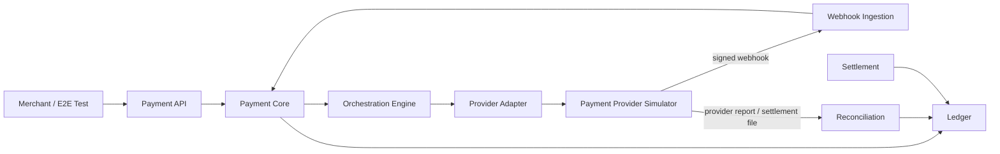
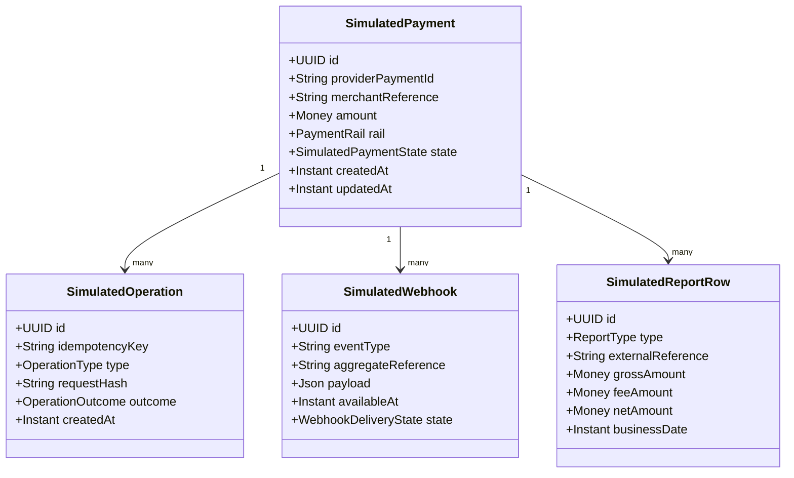
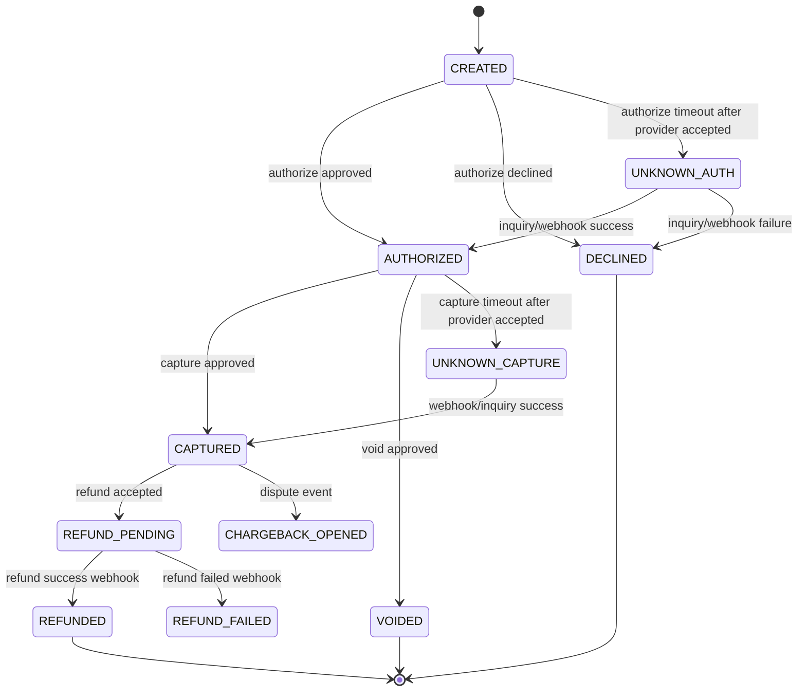
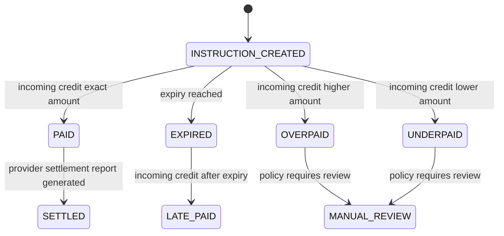
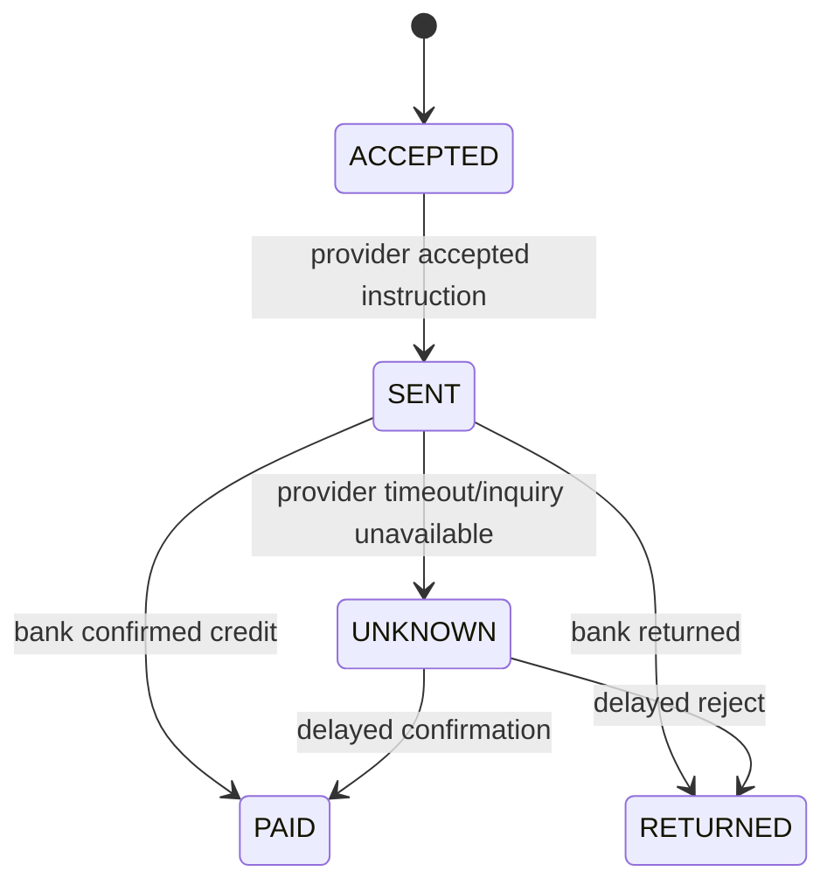
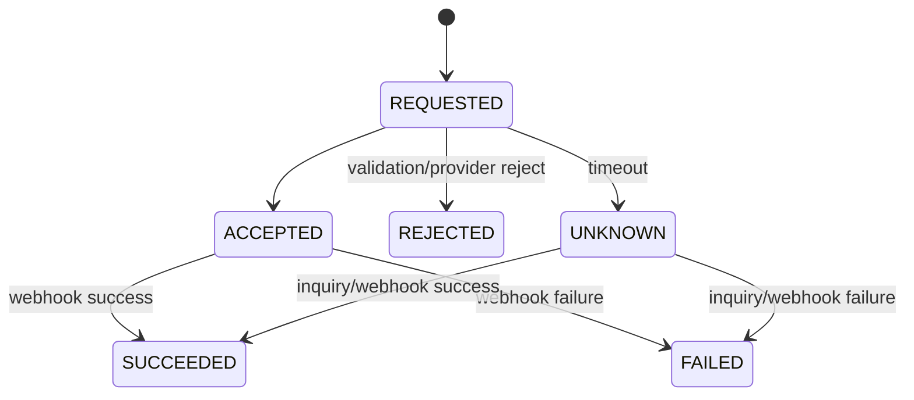
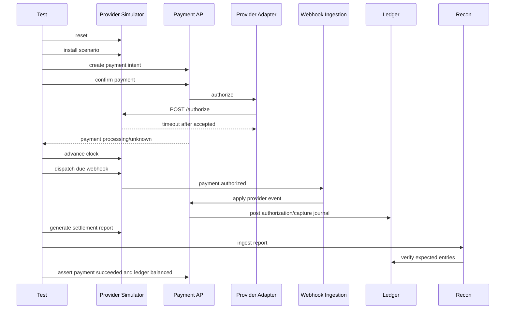
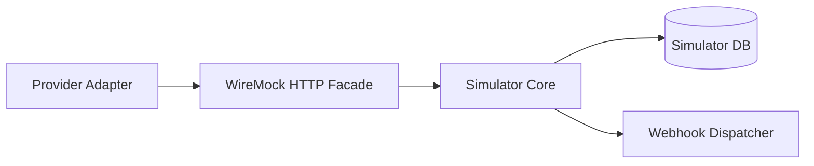

------
title: Build From Scratch: Large Production Grade Java Payment Systems - Part 059
description: Building a deterministic payment provider simulator for production-grade Java payment platforms, including provider commands, idempotency, webhooks, failure injection, settlement files, reconciliation reports, golden files, and certification-style tests.
series: learn-java-payment-systems
seriesTitle: Build From Scratch: Large Production Grade Java Payment Systems
order: 59
partTitle: Payment Provider Simulator
tags:
- java
- payments
- payment-systems
- provider-simulator
- webhooks
- testing
- testcontainers
- wiremock
- reconciliation
- settlement
- enterprise-architecture
date: 2026-07-02
---

# Part 059 — Payment Provider Simulator

Payment provider simulator bukan mock kecil untuk membuat unit test hijau.

Payment provider simulator adalah **laboratorium failure** untuk payment platform.

Tanpa simulator yang baik, engineer biasanya hanya menguji happy path:

```text
create payment -> provider returns success -> webhook returns success -> ledger posted
```

Padahal production lebih sering seperti ini:

```text
create payment -> provider timeout -> customer retries -> webhook arrives twice -> status inquiry says succeeded -> capture is delayed -> settlement file shows different fee -> refund webhook arrives before refund API response
```

Payment platform yang serius membutuhkan simulator yang bisa memaksa sistem menghadapi:

- timeout,
- duplicate request,
- idempotency replay,
- out-of-order webhook,
- delayed webhook,
- failed webhook delivery,
- provider status conflict,
- partial success,
- unknown outcome,
- amount mismatch,
- settlement fee mismatch,
- refund failure after accepted request,
- payout returned after marked sent,
- report file with duplicate row,
- report file with missing row,
- report file with unexpected currency,
- manual replay after incident.

Rule utama:

> A production payment system should not depend on the real provider to discover its own failure model.

Simulator memberi kita kemampuan untuk menguji failure dengan deterministik, murah, cepat, dan repeatable.

## 1. Apa yang Sedang Kita Bangun?

Kita akan membangun **payment provider simulator** untuk internal engineering.

Simulator ini meniru provider eksternal seperti PSP, acquirer, bank transfer provider, wallet provider, QR provider, payout provider, atau card processor pada level contract yang dibutuhkan payment platform kita.

Bukan tujuannya:

- meniru seluruh API Stripe/Adyen/Xendit/Midtrans/PayPal secara lengkap,
- menggantikan sandbox provider asli,
- menyimpan data kartu asli,
- dipakai production,
- membuat fake payment untuk customer sungguhan.

Tujuannya:

- menguji adapter contract,
- menguji orchestration flow,
- menguji webhook ingestion,
- menguji idempotency,
- menguji unknown-state repair,
- menguji ledger posting,
- menguji reconciliation,
- menguji settlement batch,
- menguji incident replay,
- menguji migration,
- menguji backoffice operation,
- menghasilkan evidence sebelum release.

Simulator ini harus cukup realistis untuk payment engineering, tetapi tetap kecil dan controlled.

## 2. Kenapa Bukan WireMock Saja?

WireMock sangat berguna untuk HTTP mocking. WireMock mendukung request matching, response templating, dan stateful scenarios. Itu bagus untuk contract test adapter sederhana.

Tapi payment provider simulator butuh lebih dari HTTP stub.

Payment simulator harus punya:

- provider-side state,
- idempotency store,
- delayed webhook scheduler,
- webhook signature generator,
- event ordering control,
- settlement file generator,
- reconciliation report generator,
- clock control,
- operation timeline,
- fault injection,
- scenario DSL,
- deterministic replay,
- test evidence export.

WireMock bisa menjadi bagian dari simulator, terutama untuk HTTP edge behavior. Tetapi core simulator sebaiknya adalah aplikasi/domain service sendiri.

Mental model:

```text
WireMock = programmable HTTP facade.
Provider Simulator = fake payment institution with state, events, reports, and failure semantics.
```

## 3. Posisi Simulator dalam Architecture

Simulator menggantikan provider eksternal di environment lokal, integration test, staging test, dan certification pipeline internal.



Dalam test, adapter tetap berbicara HTTP seperti ke provider nyata. Bedanya base URL mengarah ke simulator.

Yang penting: **production code path tetap sama**.

Jangan membuat test-only shortcut seperti:

```text
if profile == test:
    mark payment succeeded directly
```

Itu merusak nilai test.

## 4. Capability Simulator

Simulator minimal untuk seri ini harus mendukung beberapa capability.

| Capability | Tujuan |
|---|---|
| Card authorization | Menguji authorize, decline, timeout, unknown outcome |
| Capture | Menguji immediate/delayed capture, partial capture, duplicate capture |
| Void/cancel | Menguji cancel sebelum capture |
| Refund | Menguji refund sync accepted tapi async failed/succeeded |
| Bank transfer/VA | Menguji instruction, incoming credit, late payment, overpayment |
| QR payment | Menguji dynamic QR expiry, duplicate success, static QR matching |
| Payout | Menguji payout sent, returned, unknown, bank reject |
| Webhook | Menguji duplicate, delay, out-of-order, invalid signature |
| Inquiry | Menguji status polling untuk unknown state |
| Report generation | Menguji reconciliation dan settlement |
| Scenario DSL | Mengatur behavior per test secara eksplisit |

Simulator yang bagus bukan banyak endpoint. Simulator yang bagus adalah **punya failure semantics yang bisa dikontrol**.

## 5. Core Domain Model Simulator

Simulator punya domain sendiri.

Jangan langsung mencampur response HTTP dengan provider state.

Minimal model:



Key principle:

> Simulator state should be explicit, inspectable, and resettable.

Test harus bisa bertanya:

```text
provider simulator: what did you receive?
provider simulator: what did you emit?
provider simulator: why did you emit it?
```

## 6. Simulator State Machine

Simulator perlu state machine sederhana namun cukup realistis.

Untuk card-like payment:



Untuk VA/bank transfer:



Untuk payout:



Simulator tidak harus sempurna. Tetapi setiap transition harus bisa dipicu secara deterministik.

## 7. Scenario DSL

Test harus bisa mendefinisikan scenario dengan jelas.

Contoh scenario JSON:

```json
{
  "scenarioId": "card-auth-timeout-then-webhook-success",
  "rail": "CARD",
  "rules": [
    {
      "operation": "AUTHORIZE",
      "match": {
        "amountMinor": 100000,
        "currency": "IDR"
      },
      "response": {
        "mode": "TIMEOUT_AFTER_ACCEPTED"
      },
      "providerStateTransition": "AUTHORIZED",
      "webhooks": [
        {
          "eventType": "payment.authorized",
          "delaySeconds": 10,
          "duplicateCount": 2,
          "signatureMode": "VALID"
        }
      ]
    }
  ]
}
```

Scenario ini berarti:

1. payment core mengirim authorize,
2. simulator menerima request,
3. simulator menyimpan provider-side payment sebagai authorized,
4. HTTP response ke adapter timeout,
5. 10 detik kemudian simulator mengirim webhook success dua kali,
6. sistem kita harus tidak double-post ledger.

DSL harus mendukung:

- operation type,
- matching condition,
- response behavior,
- state transition,
- webhook behavior,
- report behavior,
- clock behavior,
- failure behavior.

## 8. Failure Injection Catalogue

Simulator wajib punya katalog failure.

| Failure | Contoh | Expected System Behavior |
|---|---|---|
| Immediate decline | issuer decline | payment attempt failed, no capture, no success ledger |
| HTTP 500 before acceptance | provider unavailable | safe retry possible |
| Timeout before acceptance | request not received | retry same idempotency key |
| Timeout after acceptance | provider accepted but no response | unknown state, inquiry/webhook repair |
| Duplicate webhook | same provider event twice | processed once |
| Out-of-order webhook | capture webhook before auth webhook | parked or resolved deterministically |
| Invalid signature | forged webhook | reject/quarantine |
| Amount mismatch | webhook amount differs | no state transition, case created |
| Currency mismatch | settlement currency unexpected | reconciliation break |
| Duplicate report row | file repeats transaction | matching engine identifies duplicate |
| Missing report row | provider omitted transaction | break remains open |
| Payout return | bank rejects payout | reverse payout payable movement |
| Refund async failure | refund accepted then failed | refund state failed, no refund ledger success |
| Provider idempotency conflict | same key different body | adapter/platform error |

Every failure should have a named scenario.

Bad:

```text
testTimeout()
```

Better:

```text
authorizeTimeoutAfterProviderAcceptedThenWebhookSucceedsShouldNotDoublePostLedger()
```

## 9. HTTP API of the Simulator

The simulator exposes two groups of endpoints:

1. provider-like endpoints consumed by payment platform adapter,
2. test-control endpoints consumed by test harness.

### 9.1 Provider-like Endpoints

```text
POST /sim-provider/v1/payments/authorize
POST /sim-provider/v1/payments/{providerPaymentId}/capture
POST /sim-provider/v1/payments/{providerPaymentId}/void
POST /sim-provider/v1/payments/{providerPaymentId}/refund
GET  /sim-provider/v1/payments/{providerPaymentId}
POST /sim-provider/v1/bank-transfer/instructions
POST /sim-provider/v1/qr/instructions
POST /sim-provider/v1/payouts
GET  /sim-provider/v1/payouts/{providerPayoutId}
```

These endpoints should resemble provider behavior, not internal domain.

Example authorization request:

```json
{
  "merchantReference": "pi_20260702_000001_attempt_1",
  "amount": {
    "currency": "IDR",
    "minor": 15000000
  },
  "paymentMethod": {
    "type": "CARD_TOKEN",
    "token": "tok_test_visa_3ds_frictionless"
  },
  "captureMode": "MANUAL",
  "metadata": {
    "paymentIntentId": "pi_20260702_000001"
  }
}
```

Example authorization response:

```json
{
  "providerPaymentId": "sim_pay_01JABCDEF",
  "status": "AUTHORIZED",
  "authorizationCode": "123456",
  "providerReference": "rrn_000000123456",
  "approvedAmount": {
    "currency": "IDR",
    "minor": 15000000
  },
  "createdAt": "2026-07-02T12:00:00Z"
}
```

### 9.2 Test Control Endpoints

```text
POST /sim-control/v1/reset
POST /sim-control/v1/scenarios
POST /sim-control/v1/clock/advance
POST /sim-control/v1/webhooks/dispatch-due
POST /sim-control/v1/reports/generate
GET  /sim-control/v1/payments/{providerPaymentId}
GET  /sim-control/v1/operations
GET  /sim-control/v1/webhooks
GET  /sim-control/v1/reports/{reportId}
```

Test control endpoint should never exist in production provider adapters.

## 10. Idempotency in the Simulator

Simulator must behave like a serious provider.

It stores idempotency key and request hash.

```sql
create table sim_idempotency_record (
    id uuid primary key,
    idempotency_key text not null,
    operation_type text not null,
    request_hash text not null,
    response_status int,
    response_body jsonb,
    outcome text not null,
    created_at timestamptz not null,
    unique (idempotency_key, operation_type)
);
```

Behavior:

| Case | Simulator Response |
|---|---|
| Same key, same operation, same request hash | return cached response/outcome |
| Same key, same operation, different request hash | idempotency conflict |
| No key for unsafe operation | reject or mark as non-idempotent based on scenario |
| Same key after reset | allowed because test environment reset |

Pseudo-code:

```java
public SimulatedResponse executeIdempotently(
        String idempotencyKey,
        OperationType operationType,
        String requestHash,
        Supplier<SimulatedResponse> operation
) {
    var existing = idempotencyRepository.find(idempotencyKey, operationType);

    if (existing.isPresent()) {
        if (!existing.get().requestHash().equals(requestHash)) {
            throw new IdempotencyConflictException(idempotencyKey);
        }
        return existing.get().toResponse();
    }

    var response = operation.get();
    idempotencyRepository.save(idempotencyKey, operationType, requestHash, response);
    return response;
}
```

The payment platform should pass adapter-level idempotency key to the simulator. The simulator should expose records so tests can assert retry behavior.

## 11. Webhook Dispatcher

Webhook behavior must be explicit.

A webhook record should contain:

- event id,
- provider aggregate id,
- event type,
- payload,
- signature mode,
- available time,
- delivery target,
- delivery attempts,
- next retry time,
- delivery state,
- scenario id.

Schema:

```sql
create table sim_webhook_event (
    id uuid primary key,
    scenario_id text,
    event_type text not null,
    aggregate_reference text not null,
    payload jsonb not null,
    signature_mode text not null,
    available_at timestamptz not null,
    delivery_state text not null,
    attempt_count int not null default 0,
    next_attempt_at timestamptz,
    last_status_code int,
    last_error text,
    created_at timestamptz not null
);
```

Dispatcher:

```java
public void dispatchDueWebhooks(Instant now) {
    var events = webhookRepository.findDue(now, 100);

    for (var event : events) {
        try {
            var signedRequest = signer.sign(event.payload(), event.signatureMode());
            var response = webhookClient.post(event.targetUrl(), signedRequest);

            if (response.statusCode() >= 200 && response.statusCode() < 300) {
                webhookRepository.markDelivered(event.id(), response.statusCode());
            } else {
                webhookRepository.scheduleRetry(event.id(), response.statusCode(), retryPolicy.next(event.attemptCount()));
            }
        } catch (Exception e) {
            webhookRepository.scheduleRetry(event.id(), null, retryPolicy.next(event.attemptCount()));
        }
    }
}
```

Important: the simulator should allow manual dispatch to keep tests deterministic.

Bad for integration tests:

```text
sleep 10 seconds and hope webhook arrives
```

Better:

```text
advance simulator clock by PT10S
call /dispatch-due
wait until platform processed event
```

## 12. Webhook Signature Modes

Webhook signature mode lets tests check security behavior.

| Mode | Meaning |
|---|---|
| `VALID` | signed with active secret |
| `INVALID_SIGNATURE` | wrong key |
| `MISSING_SIGNATURE` | no signature header |
| `OLD_TIMESTAMP` | valid HMAC but outside tolerance window |
| `ROTATED_SECRET_OLD` | signed with previous valid secret |
| `MALFORMED_HEADER` | signature header unparsable |

Test examples:

```text
validWebhookShouldBePersistedAndProcessed()
invalidSignatureWebhookShouldBeRejectedBeforeStateTransition()
oldTimestampWebhookShouldBeQuarantinedAsReplayRisk()
rotatedSecretWebhookShouldBeAcceptedDuringGracePeriod()
```

## 13. Report Generator

Provider simulator must generate reports.

Without reports, we cannot test reconciliation and settlement.

Report types:

- transaction report,
- settlement report,
- fee report,
- payout report,
- dispute report,
- bank statement-like report.

The report generator should be deterministic.

Input:

```json
{
  "reportType": "SETTLEMENT_DETAIL",
  "businessDate": "2026-07-02",
  "mutation": {
    "duplicateRows": 1,
    "missingReferences": ["sim_pay_missing_001"],
    "feeOverrides": [
      {
        "providerPaymentId": "sim_pay_01JABCDEF",
        "feeMinor": 3500
      }
    ]
  }
}
```

Output CSV:

```csv
provider_payment_id,merchant_reference,gross_currency,gross_minor,fee_currency,fee_minor,net_currency,net_minor,status,business_date
sim_pay_01JABCDEF,pi_20260702_000001_attempt_1,IDR,15000000,IDR,3500,IDR,14996500,SETTLED,2026-07-02
```

The simulator should also expose report metadata:

```json
{
  "reportId": "sim_report_001",
  "type": "SETTLEMENT_DETAIL",
  "businessDate": "2026-07-02",
  "rowCount": 1,
  "sha256": "...",
  "generatedAt": "2026-07-02T23:59:00Z"
}
```

Why? Because the reconciliation system should test:

- file fingerprint,
- duplicate file detection,
- parser version,
- control totals,
- matching engine,
- break creation,
- correction proposal.

## 14. Deterministic Clock

Payment tests are full of time:

- authorization expiry,
- VA expiry,
- QR expiry,
- webhook delay,
- retry backoff,
- settlement cutoff,
- payout schedule,
- dispute deadline,
- subscription billing cycle.

Never build simulator on uncontrolled wall-clock time.

Use an injectable clock.

```java
public interface SimClock {
    Instant now();
    void advance(Duration duration);
    void set(Instant instant);
}
```

Test flow:

```text
set clock to 2026-07-02T10:00:00Z
create QR instruction expiring in 5 minutes
advance simulator clock by 6 minutes
dispatch due expiry event
assert payment instruction expired
```

This avoids flaky tests.

## 15. Scenario Matching

Scenario rule matching should be deterministic and explainable.

Example matcher:

```java
public interface ScenarioMatcher {
    boolean matches(SimulatedOperationRequest request, ScenarioRule rule);
}
```

Supported conditions:

- operation type,
- amount,
- currency,
- payment method token,
- merchant reference regex,
- metadata value,
- provider payment id,
- attempt number,
- idempotency key suffix,
- scenario tag.

Do not over-engineer a general-purpose rule engine at first.

Simple ordered rules are enough:

```text
first matching rule wins
```

But the simulator must record which rule matched.

```json
{
  "operationId": "sim_op_001",
  "matchedScenarioId": "card-auth-timeout-then-webhook-success",
  "matchedRuleId": "authorize-timeout-after-accepted"
}
```

This matters when debugging failed tests.

## 16. Golden Files

Golden files make simulator/report behavior reviewable.

Use golden files for:

- normalized provider response,
- webhook payload,
- settlement report,
- reconciliation input,
- expected ledger journals,
- expected public API response,
- expected operational timeline.

Directory example:

```text
test-fixtures/
  provider-simulator/
    card-auth-timeout-then-webhook-success/
      scenario.json
      authorize-response.json
      webhook-payment-authorized.json
      expected-payment-timeline.json
      expected-ledger-journals.json
    settlement-fee-mismatch/
      scenario.json
      settlement-report.csv
      expected-reconciliation-breaks.json
```

Golden files should not be blind snapshots.

Review them like API contracts.

## 17. Simulator Persistence Model

For integration tests, in-memory may be enough.

For E2E/replay/certification tests, use PostgreSQL.

Schema sketch:

```sql
create table sim_scenario (
    id text primary key,
    name text not null,
    definition jsonb not null,
    enabled boolean not null default true,
    created_at timestamptz not null
);

create table sim_payment (
    id uuid primary key,
    provider_payment_id text not null unique,
    merchant_reference text not null,
    rail text not null,
    state text not null,
    currency char(3) not null,
    amount_minor numeric(38, 0) not null,
    scenario_id text,
    created_at timestamptz not null,
    updated_at timestamptz not null
);

create table sim_operation (
    id uuid primary key,
    operation_type text not null,
    provider_payment_id text,
    idempotency_key text,
    request_hash text not null,
    request_body jsonb not null,
    response_mode text not null,
    response_status int,
    response_body jsonb,
    matched_scenario_id text,
    created_at timestamptz not null
);

create table sim_report (
    id uuid primary key,
    report_type text not null,
    business_date date not null,
    content_sha256 text not null,
    content text not null,
    created_at timestamptz not null,
    unique (report_type, business_date, content_sha256)
);
```

Even simulator schema should enforce uniqueness where it matters. A sloppy simulator creates sloppy platform assumptions.

## 18. Java Module Layout

Example module layout:

```text
payment-provider-simulator/
  pom.xml
  src/main/java/com/acme/payments/simulator/
    api/
      ProviderPaymentResource.java
      ProviderPayoutResource.java
      ControlScenarioResource.java
      ControlWebhookResource.java
      ControlReportResource.java
    domain/
      SimulatedPayment.java
      SimulatedOperation.java
      SimulatedWebhookEvent.java
      SimulatedReport.java
      ScenarioDefinition.java
      ScenarioRule.java
    application/
      SimAuthorizeService.java
      SimCaptureService.java
      SimRefundService.java
      SimWebhookScheduler.java
      SimWebhookDispatcher.java
      SimReportGenerator.java
      SimClockService.java
    persistence/
      SimPaymentRepository.java
      SimOperationRepository.java
      SimWebhookRepository.java
      SimReportRepository.java
    signing/
      WebhookSigner.java
    scenario/
      ScenarioMatcher.java
      ScenarioLoader.java
      ScenarioValidation.java
```

Keep simulator code clean. Test infrastructure becomes part of engineering leverage.

## 19. Provider Operation Log

Simulator should expose an operation log.

This lets tests assert the platform did or did not retry.

Example assertion:

```java
assertThat(simulator.operationsForMerchantReference("pi_123"))
    .extracting(SimOperationView::operationType)
    .containsExactly(
        OperationType.AUTHORIZE,
        OperationType.STATUS_INQUIRY
    );
```

Operation log should include:

- operation type,
- request timestamp,
- idempotency key,
- request hash,
- response mode,
- response body,
- matched scenario,
- provider state before,
- provider state after.

This helps distinguish:

```text
payment failed because provider declined
```

from:

```text
payment failed because our adapter sent invalid capture amount
```

## 20. Capture Simulator Behavior

Capture has tricky edge cases.

Cases:

| Case | Expected Simulator Behavior |
|---|---|
| Capture authorized full amount | captured success |
| Partial capture below authorized amount | captured partial |
| Capture above authorized amount | provider reject |
| Duplicate capture same key | cached response |
| Duplicate capture different key | reject if already captured |
| Capture after void | reject |
| Capture after auth expiry | reject |
| Capture timeout after accepted | state unknown/captured depending scenario |

Pseudo-code:

```java
public CaptureResponse capture(String providerPaymentId, CaptureRequest request) {
    var payment = paymentRepository.lockByProviderPaymentId(providerPaymentId);

    if (!payment.isAuthorized()) {
        return CaptureResponse.rejected("PAYMENT_NOT_AUTHORIZED");
    }

    if (request.amount().isGreaterThan(payment.remainingCapturableAmount())) {
        return CaptureResponse.rejected("AMOUNT_EXCEEDS_AUTHORIZED");
    }

    var behavior = scenarioEngine.behaviorFor(OperationType.CAPTURE, request);

    if (behavior.responseMode() == ResponseMode.TIMEOUT_AFTER_ACCEPTED) {
        payment.markCaptured(request.amount());
        webhookScheduler.scheduleCaptureSucceeded(payment, behavior.webhookDelay());
        throw new SimulatedTimeoutException();
    }

    payment.markCaptured(request.amount());
    webhookScheduler.scheduleCaptureSucceeded(payment, behavior.webhookDelay());
    return CaptureResponse.succeeded(payment.providerPaymentId());
}
```

The simulator should not allow impossible states unless the scenario explicitly says it is testing provider inconsistency.

## 21. Refund Simulator Behavior

Refunds are often asynchronous.

Simulator should support:

- immediate success,
- accepted then webhook success,
- accepted then webhook failure,
- timeout before accepted,
- timeout after accepted,
- duplicate refund request,
- refund amount exceeds refundable,
- refund after chargeback,
- multiple partial refunds,
- refund currency mismatch.

State machine:



The platform should learn from this:

- API response `accepted` is not always final success,
- refund ledger success should post only when refund is confirmed successful,
- refund reservation may be needed to avoid over-refund during async window.

## 22. Payout Simulator Behavior

Payout simulator must model outbound money uncertainty.

Cases:

| Case | Meaning |
|---|---|
| Accepted | provider accepted payout instruction |
| Sent | sent to bank/rail |
| Paid | beneficiary credited |
| Returned | beneficiary bank rejected/returned |
| Unknown | status not known yet |
| Duplicate | same payout reference sent again |

Payout failure is not just an API error. It can happen after money was reserved and after provider accepted the instruction.

The simulator should emit payout report rows and bank-return rows.

## 23. Settlement and Reconciliation Simulation

A serious simulator must close the loop.

Payment system flow does not end at successful webhook.

The simulator should create provider-side facts:

```text
authorized payment
captured payment
provider fee
settlement batch
payout report
bank settlement line
```

Then reconciliation can compare:

```text
internal ledger expected settlement
vs provider settlement detail
vs bank statement
```

Test scenario:

```text
1. Create payment IDR 100,000.
2. Capture succeeds.
3. Ledger posts merchant pending payable IDR 100,000.
4. Simulator generates settlement report with fee IDR 2,500.
5. Reconciliation matches payment.
6. Settlement engine moves merchant payable net IDR 97,500.
7. Merchant statement shows gross, fee, net.
```

Negative scenario:

```text
1. Internal expects fee IDR 2,500.
2. Simulator report says fee IDR 3,000.
3. Reconciliation creates fee mismatch break.
4. Settlement does not silently hide the difference.
```

## 24. Test Harness Flow

A complete test harness flow:



No `Thread.sleep`. No manual clicking provider dashboard. No fragile sandbox dependency.

## 25. Integration with Testcontainers

Testcontainers for Java is useful because payment integration tests need real dependencies:

- PostgreSQL,
- Kafka-compatible broker,
- Redis if used,
- simulator service,
- object storage emulator if reports are files,
- local mail/slack mock for notifications if needed.

Example conceptual test topology:

```text
JUnit test
  ├─ PostgreSQL container
  ├─ Kafka container
  ├─ Payment API container/process
  ├─ Provider Simulator container/process
  └─ Test client
```

The provider simulator can run as:

- in-process JUnit extension,
- standalone Quarkus/Spring/Jersey app,
- Docker container,
- Testcontainers GenericContainer.

For early development, in-process is faster. For production-like E2E, container is better.

## 26. WireMock Integration Option

WireMock can still be valuable.

Use it for:

- low-level HTTP request matching,
- malformed HTTP responses,
- broken JSON,
- slow socket simulation,
- TLS/proxy edge behavior,
- provider endpoint not reachable.

But use simulator domain for:

- provider state,
- webhook scheduler,
- report generation,
- settlement behavior,
- operation timeline.

A hybrid architecture:



## 27. Simulator Assertions

Test should assert both platform and simulator side.

Platform assertions:

- payment state,
- attempt state,
- ledger journals,
- outbox events,
- webhook inbox,
- reconciliation result,
- settlement result.

Simulator assertions:

- number of provider operations,
- idempotency key reuse,
- request body hash,
- state transition,
- webhook count,
- report rows,
- matched scenario,
- no unexpected operations.

Example:

```java
assertThat(sim.operations())
    .filteredOn(op -> op.type() == AUTHORIZE)
    .hasSize(1);

assertThat(sim.webhooks())
    .filteredOn(wh -> wh.eventType().equals("payment.authorized"))
    .hasSize(2); // duplicate intentionally emitted

assertThat(platform.ledger().journalsFor("pi_123", "CAPTURE"))
    .hasSize(1); // duplicate webhook must not double-post
```

## 28. Provider Certification Pack

Before connecting a new real provider, create a simulator certification pack.

For each provider adapter:

```text
provider-adapters/
  sim-card-provider/
    certification/
      authorize-success.yml
      authorize-hard-decline.yml
      authorize-timeout-before-accepted.yml
      authorize-timeout-after-accepted-webhook-success.yml
      duplicate-webhook.yml
      capture-partial.yml
      refund-accepted-then-failed.yml
      settlement-fee-mismatch.yml
      payout-returned.yml
```

Certification criteria:

- adapter maps raw provider statuses correctly,
- adapter never treats timeout as definite failure when acceptance is possible,
- webhook signature verification works,
- provider references are stored,
- duplicate webhook is idempotent,
- settlement report can be reconciled,
- public API responses are stable,
- ledger invariant holds.

When onboarding a real provider, the adapter must pass the same behavior classes.

## 29. Evidence Export

Simulator should export evidence after a test run.

Example JSON:

```json
{
  "testRunId": "run_20260702_001",
  "scenarioId": "card-auth-timeout-then-webhook-success",
  "providerOperations": 2,
  "webhooksEmitted": 2,
  "reportsGenerated": 1,
  "matchedRules": [
    "authorize-timeout-after-accepted",
    "settlement-success"
  ],
  "assertions": {
    "duplicateWebhookEmitted": true,
    "singleLedgerCaptureJournal": true,
    "reconciliationMatched": true
  }
}
```

Evidence export helps:

- release review,
- incident reproduction,
- provider adapter regression,
- audit trail of engineering checks.

## 30. Anti-Patterns

Avoid these.

### 30.1 Simulator That Only Returns Success

This is a demo, not a simulator.

It creates false confidence.

### 30.2 Random Failure Without Seed

Random chaos is useful later. But simulator scenarios should be deterministic by default.

Bad:

```text
5% random timeout
```

Better:

```text
timeout on first authorize, success inquiry after 10 seconds
```

### 30.3 Skipping Webhook Signature

If test webhooks are unsigned, security path is untested.

### 30.4 Directly Updating Platform State in Tests

Do not bypass provider adapter or webhook ingestion.

Bad:

```sql
update payment_attempt set state = 'SUCCEEDED'
```

Good:

```text
simulator emits signed provider event
platform processes event through normal path
```

### 30.5 Treating Sandbox Provider as Enough

Sandbox is valuable but often not deterministic enough for deep failure testing.

Use both:

- simulator for deterministic failure matrix,
- sandbox for provider-specific integration and certification.

## 31. Minimal Implementation Roadmap

Build simulator incrementally.

### Phase 1 — Card Happy Path + Webhook

- authorize endpoint,
- capture endpoint,
- provider state,
- signed webhook,
- operation log,
- reset endpoint.

### Phase 2 — Failure Injection

- timeout before accepted,
- timeout after accepted,
- duplicate webhook,
- invalid signature,
- provider inquiry.

### Phase 3 — Refund and Payout

- refund accepted/succeeded/failed,
- payout sent/paid/returned,
- ledger-facing test scenarios.

### Phase 4 — Reports

- settlement report,
- fee mismatch,
- duplicate row,
- missing row,
- reconciliation golden files.

### Phase 5 — Certification Pack

- scenario catalogue,
- evidence export,
- CI pipeline,
- provider adapter contract suite.

## 32. Checklist

A provider simulator is ready when it can prove:

- [ ] adapter sends correct request shape,
- [ ] idempotency key behavior is tested,
- [ ] timeout before accepted is handled safely,
- [ ] timeout after accepted becomes unknown, not failed,
- [ ] webhook signature verification is tested,
- [ ] duplicate webhook does not double-apply state,
- [ ] out-of-order webhook does not corrupt lifecycle,
- [ ] refund async success/failure is tested,
- [ ] payout return is tested,
- [ ] settlement report can be generated,
- [ ] reconciliation mismatch can be produced,
- [ ] operation log is inspectable,
- [ ] scenario behavior is deterministic,
- [ ] clock is controllable,
- [ ] reports have fingerprints,
- [ ] evidence can be exported.

## 33. Exercises

1. Design a scenario where authorization API times out after provider accepted the payment, then webhook success arrives twice. Define expected platform state and ledger journals.
2. Create a settlement report mutation where fee differs by one minor unit. Decide whether it should auto-match with tolerance or create a break.
3. Model refund accepted-then-failed. Which ledger entries should exist before and after final failure?
4. Define the simulator idempotency behavior for same key/different request body.
5. Build a test that proves capture after void cannot succeed.

## 34. Key Takeaway

Payment provider simulator adalah multiplier untuk engineering maturity.

Tanpa simulator, payment team belajar failure dari production incident.

Dengan simulator, payment team bisa memaksa sistem menghadapi failure sebelum customer, merchant, finance, regulator, atau auditor menemukannya.

Rule terakhir:

> A simulator is not valuable because it mocks success. It is valuable because it makes dangerous payment failures boring, repeatable, and testable.

## References

- WireMock documentation — Stateful Behaviour and Scenarios: https://wiremock.org/docs/stateful-behaviour/
- WireMock documentation — Request Matching: https://wiremock.org/docs/request-matching/
- WireMock documentation — Response Templating: https://wiremock.org/docs/response-templating/
- Testcontainers for Java documentation: https://java.testcontainers.org/
- Testcontainers guides — PostgreSQL, Kafka, and WireMock usage examples: https://testcontainers.com/guides/
- Stripe documentation — Receive events in your webhook endpoint: https://docs.stripe.com/webhooks
- Stripe documentation — Idempotent requests: https://docs.stripe.com/api/idempotent_requests
- Adyen documentation — Webhooks: https://docs.adyen.com/development-resources/webhooks
- Adyen documentation — Testing your integration: https://docs.adyen.com/development-resources/testing
