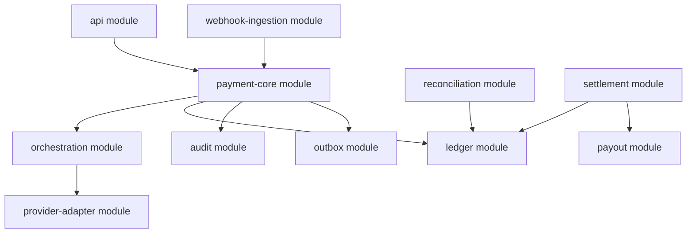
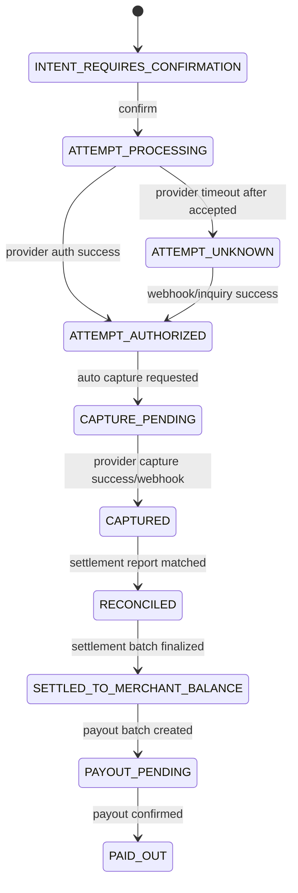
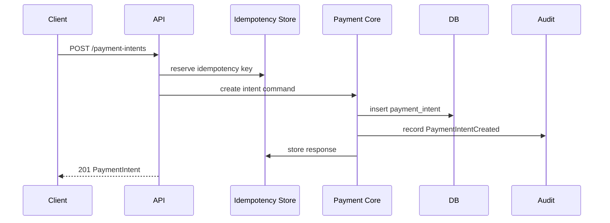
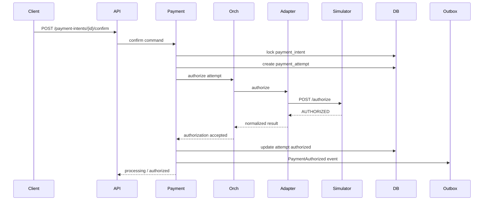
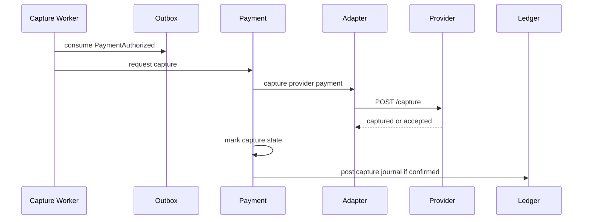
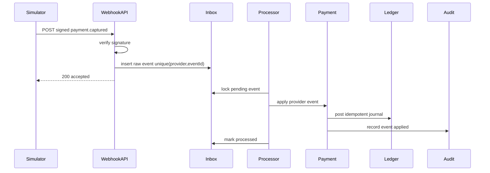
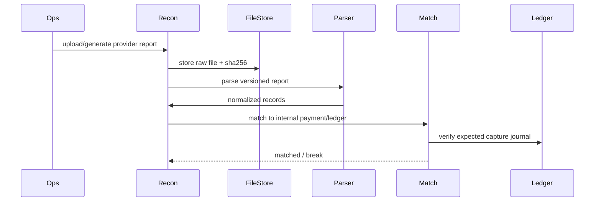
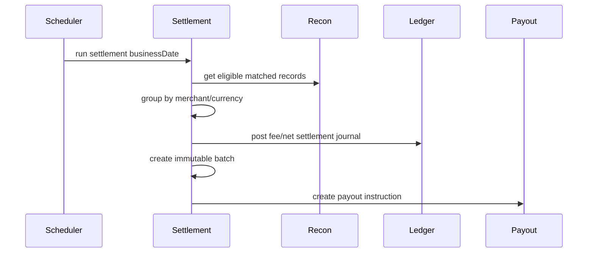
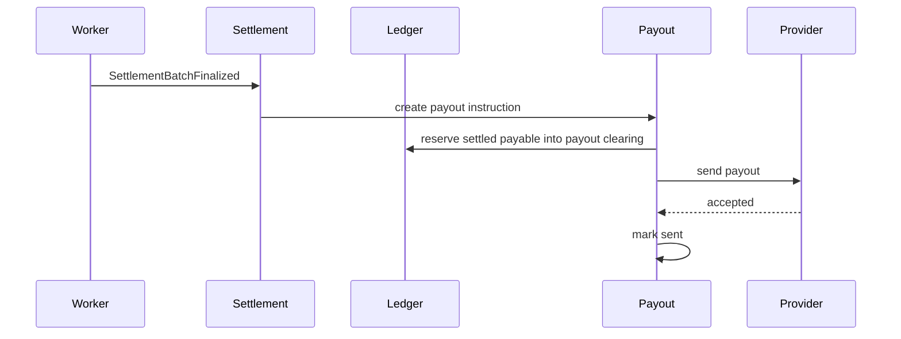

------
title: Build From Scratch: Large Production Grade Java Payment Systems - Part 060
description: End-to-end build of a production-grade Java payment platform slice from PaymentIntent creation to provider authorization, webhook ingestion, double-entry ledger posting, reconciliation, settlement, payout instruction, observability, and release acceptance.
series: learn-java-payment-systems
seriesTitle: Build From Scratch: Large Production Grade Java Payment Systems
order: 60
partTitle: End-to-End Build Payment Platform
tags:
- java
- payments
- payment-systems
- end-to-end-build
- payment-intent
- orchestration
- ledger
- webhook
- reconciliation
- settlement
- enterprise-architecture
date: 2026-07-02
---

# Part 060 — End-to-End Build: Payment Intent to Settlement with Java Services

Sekarang kita gabungkan seluruh fondasi sebelumnya menjadi satu vertical slice.

Target part ini bukan membuat demo payment sederhana.

Targetnya adalah membangun **production-shaped slice**:

```text
PaymentIntent -> Confirm -> Provider Authorization/Capture -> Webhook -> Ledger -> Reconciliation -> Settlement -> Merchant Payout
```

Kita tidak akan mengulang dasar Java, SQL, Kafka, Docker, atau REST.

Kita fokus pada **urutan keputusan, boundary, invariant, dan data model** yang membuat payment platform benar secara finansial.

## 1. Scope Build

Kita akan membangun satu flow utama:

```text
Customer pays merchant IDR 150,000 using card-like simulated provider.
Payment is authorized and captured.
Provider sends webhook success.
Ledger posts merchant payable.
Provider settlement report arrives with fee IDR 3,000.
Reconciliation matches.
Settlement engine computes merchant net settlement IDR 147,000.
Payout instruction is created.
```

Out of scope untuk vertical slice ini:

- real card network integration,
- real PAN handling,
- real PCI CDE,
- real bank file upload,
- production KYB vendor,
- ML fraud model,
- complex multi-currency FX,
- distributed tracing vendor setup,
- UI polish.

Tetapi desainnya harus production-shaped.

Artinya:

- idempotency ada,
- operation log ada,
- outbox ada,
- webhook inbox ada,
- double-entry ledger ada,
- reconciliation ada,
- settlement batch immutable,
- audit trail ada,
- failure path ada,
- simulator bisa memicu unknown/duplicate/failure.

## 2. Build Strategy: Modular Monolith First, Service Boundary Clear

Untuk belajar dan membangun dari scratch, mulai dari modular monolith yang boundary-nya jelas.

Kenapa?

Karena payment correctness lebih penting daripada memecah service terlalu cepat.

Kita bisa punya module boundary seperti service, tetapi deploy awal sebagai satu aplikasi.



Later, modules can become services.

But in Part 060, the build is a **well-bounded modular monolith** to keep transactional reasoning visible.

## 3. Repository Layout

Example repository:

```text
payment-platform/
  pom.xml
  docker-compose.yml
  openapi/
    payment-api.yaml
    webhook-api.yaml
  db/
    migration/
      V001__payment_core.sql
      V002__idempotency.sql
      V003__ledger.sql
      V004__webhook_inbox.sql
      V005__outbox.sql
      V006__reconciliation.sql
      V007__settlement.sql
  src/main/java/com/acme/payments/
    api/
    payment/
    orchestration/
    provider/
    webhook/
    ledger/
    reconciliation/
    settlement/
    payout/
    audit/
    outbox/
    shared/
  src/test/java/com/acme/payments/
    e2e/
    property/
    contract/
    concurrency/
  provider-simulator/
    ...
```

Important rule:

> Shared module should contain primitives, not business logic.

Acceptable shared primitives:

- `Money`,
- `CurrencyCode`,
- `IdempotencyKey`,
- `TenantId`,
- `MerchantId`,
- `Clock`,
- `JsonHash`,
- `Result`.

Not acceptable shared dumping ground:

- `PaymentUtil`,
- `LedgerUtil`,
- `CommonService`,
- `StatusHelper`,
- `Constants` with every enum.

## 4. End-to-End State Flow



State transition is not enough.

Each financial transition must explain ledger effect.

## 5. Core Data Tables

This is not full schema. It is the minimal E2E slice.

### 5.1 Payment Intent

```sql
create table payment_intent (
    id uuid primary key,
    merchant_id uuid not null,
    external_reference text not null,
    state text not null,
    currency char(3) not null,
    amount_minor numeric(38, 0) not null,
    capture_mode text not null,
    description text,
    created_at timestamptz not null,
    updated_at timestamptz not null,
    version bigint not null,
    unique (merchant_id, external_reference),
    check (amount_minor > 0)
);
```

### 5.2 Payment Attempt

```sql
create table payment_attempt (
    id uuid primary key,
    payment_intent_id uuid not null references payment_intent(id),
    attempt_no int not null,
    provider_code text not null,
    provider_payment_id text,
    state text not null,
    currency char(3) not null,
    amount_minor numeric(38, 0) not null,
    failure_code text,
    created_at timestamptz not null,
    updated_at timestamptz not null,
    version bigint not null,
    unique (payment_intent_id, attempt_no),
    unique (provider_code, provider_payment_id)
);
```

### 5.3 Provider Operation Log

```sql
create table provider_operation (
    id uuid primary key,
    payment_attempt_id uuid references payment_attempt(id),
    provider_code text not null,
    operation_type text not null,
    idempotency_key text not null,
    request_hash text not null,
    request_body jsonb not null,
    response_status int,
    response_body jsonb,
    outcome text not null,
    provider_reference text,
    created_at timestamptz not null,
    unique (provider_code, operation_type, idempotency_key)
);
```

### 5.4 Webhook Inbox

```sql
create table webhook_inbox (
    id uuid primary key,
    provider_code text not null,
    provider_event_id text not null,
    event_type text not null,
    signature_valid boolean not null,
    payload_hash text not null,
    raw_payload jsonb not null,
    processing_state text not null,
    received_at timestamptz not null,
    processed_at timestamptz,
    error_code text,
    unique (provider_code, provider_event_id)
);
```

### 5.5 Ledger

```sql
create table ledger_account (
    id uuid primary key,
    account_code text not null unique,
    account_type text not null,
    owner_type text,
    owner_id uuid,
    currency char(3) not null,
    normal_balance text not null,
    created_at timestamptz not null
);

create table ledger_journal (
    id uuid primary key,
    journal_type text not null,
    business_reference_type text not null,
    business_reference_id uuid not null,
    idempotency_key text not null unique,
    description text not null,
    posted_at timestamptz not null,
    reversal_of_journal_id uuid references ledger_journal(id)
);

create table ledger_entry (
    id uuid primary key,
    journal_id uuid not null references ledger_journal(id),
    account_id uuid not null references ledger_account(id),
    direction text not null,
    currency char(3) not null,
    amount_minor numeric(38, 0) not null,
    created_at timestamptz not null,
    check (amount_minor > 0)
);
```

### 5.6 Outbox

```sql
create table outbox_event (
    id uuid primary key,
    aggregate_type text not null,
    aggregate_id uuid not null,
    event_type text not null,
    event_key text not null,
    payload jsonb not null,
    status text not null,
    created_at timestamptz not null,
    published_at timestamptz,
    unique (aggregate_type, aggregate_id, event_type, event_key)
);
```

### 5.7 Reconciliation

```sql
create table reconciliation_source_record (
    id uuid primary key,
    source_type text not null,
    source_file_id uuid,
    provider_code text not null,
    external_reference text not null,
    currency char(3) not null,
    gross_amount_minor numeric(38, 0) not null,
    fee_amount_minor numeric(38, 0) not null,
    net_amount_minor numeric(38, 0) not null,
    business_date date not null,
    raw_record jsonb not null,
    created_at timestamptz not null
);

create table reconciliation_match (
    id uuid primary key,
    source_record_id uuid not null references reconciliation_source_record(id),
    payment_intent_id uuid references payment_intent(id),
    match_state text not null,
    match_rule text not null,
    difference_minor numeric(38, 0) not null default 0,
    created_at timestamptz not null
);
```

### 5.8 Settlement

```sql
create table settlement_batch (
    id uuid primary key,
    merchant_id uuid not null,
    currency char(3) not null,
    business_date date not null,
    state text not null,
    gross_amount_minor numeric(38, 0) not null,
    fee_amount_minor numeric(38, 0) not null,
    net_amount_minor numeric(38, 0) not null,
    created_at timestamptz not null,
    finalized_at timestamptz,
    unique (merchant_id, currency, business_date)
);

create table settlement_item (
    id uuid primary key,
    settlement_batch_id uuid not null references settlement_batch(id),
    payment_intent_id uuid not null references payment_intent(id),
    gross_amount_minor numeric(38, 0) not null,
    fee_amount_minor numeric(38, 0) not null,
    net_amount_minor numeric(38, 0) not null,
    created_at timestamptz not null,
    unique (settlement_batch_id, payment_intent_id)
);
```

## 6. Ledger Account Setup for Vertical Slice

For the first E2E flow, create these accounts:

| Account | Type | Owner | Normal Balance |
|---|---|---|---|
| `provider_settlement_receivable:IDR` | Asset | Platform | Debit |
| `merchant_pending_payable:{merchant}:IDR` | Liability | Merchant | Credit |
| `merchant_settled_payable:{merchant}:IDR` | Liability | Merchant | Credit |
| `platform_fee_revenue:IDR` | Revenue | Platform | Credit |
| `cash_at_bank:IDR` | Asset | Platform | Debit |
| `payout_clearing:{merchant}:IDR` | Liability/Clearing | Merchant | Credit/Debit policy-based |

Capture success journal:

```text
Dr provider_settlement_receivable 150,000
Cr merchant_pending_payable       150,000
```

Settlement fee journal after provider report:

```text
Dr merchant_pending_payable        150,000
Cr platform_fee_revenue              3,000
Cr merchant_settled_payable        147,000
```

Cash received from provider settlement:

```text
Dr cash_at_bank                    147,000
Dr platform_fee_cash_component       3,000  // or same cash account with split reporting
Cr provider_settlement_receivable  150,000
```

Payout reservation:

```text
Dr merchant_settled_payable        147,000
Cr payout_clearing                 147,000
```

Payout confirmed:

```text
Dr payout_clearing                 147,000
Cr cash_at_bank                    147,000
```

Exact account design depends on finance policy. The invariant does not change:

```text
Every journal must balance per currency.
```

## 7. Public API Surface for Vertical Slice

Minimal API:

```text
POST /v1/payment-intents
GET  /v1/payment-intents/{id}
POST /v1/payment-intents/{id}/confirm
POST /v1/payment-intents/{id}/capture
POST /v1/refunds
POST /v1/provider-webhooks/{providerCode}
GET  /v1/merchants/{merchantId}/balances
GET  /v1/settlement-batches/{id}
```

Create intent:

```json
{
  "merchantId": "6c0b611b-1ae0-4f1e-8ec4-938a8a6b6c2b",
  "externalReference": "order_10001",
  "amount": {
    "currency": "IDR",
    "minor": 15000000
  },
  "captureMode": "AUTOMATIC",
  "description": "Order 10001"
}
```

Response:

```json
{
  "id": "pi_01JABCDEF",
  "state": "REQUIRES_CONFIRMATION",
  "amount": {
    "currency": "IDR",
    "minor": 15000000
  },
  "captureMode": "AUTOMATIC"
}
```

Confirm:

```json
{
  "paymentMethod": {
    "type": "SIM_CARD_TOKEN",
    "token": "tok_success_auto_capture"
  }
}
```

Confirm response can be:

```json
{
  "id": "pi_01JABCDEF",
  "state": "PROCESSING",
  "latestAttempt": {
    "id": "pa_01JATTEMPT",
    "state": "PROCESSING",
    "providerCode": "SIM_PROVIDER"
  }
}
```

Do not promise success until success is confirmed.

## 8. Idempotency Contract

Every unsafe API accepts:

```text
Idempotency-Key: merchant_abc:order_10001:create_intent
```

Store:

- key,
- merchant id,
- endpoint,
- request hash,
- response hash/body,
- status,
- expiry.

Create intent idempotency:

```text
same key + same body -> same response
same key + different body -> 409 idempotency_conflict
```

Confirm idempotency:

```text
same key + same body -> same attempt/result
same key + different payment method -> conflict
```

Provider operation idempotency:

```text
attemptId + operationType + logicalOperationNo
```

Example:

```text
provider-idempotency-key = pa_01JATTEMPT:AUTHORIZE:1
```

Ledger idempotency:

```text
ledger idempotency key = business event id
```

Example:

```text
payment_capture_confirmed:pa_01JATTEMPT:provider_event_evt_001
```

## 9. Command Flow: Create Payment Intent



Important checks:

- amount > 0,
- currency supported,
- merchant active,
- capability enabled,
- risk/compliance restrictions not blocking create,
- external reference unique for merchant,
- idempotency body hash stable.

Java sketch:

```java
public PaymentIntentView createPaymentIntent(CreatePaymentIntentCommand command) {
    merchantPolicy.assertCanCreatePayment(command.merchantId(), command.amount());

    var intent = PaymentIntent.create(
        command.merchantId(),
        command.externalReference(),
        command.amount(),
        command.captureMode(),
        clock.now()
    );

    paymentIntentRepository.insert(intent);
    audit.record(AuditEvent.paymentIntentCreated(intent.id(), command.actor()));

    return PaymentIntentView.from(intent);
}
```

Do not call provider during create intent. Create intent establishes obligation intent, not money movement.

## 10. Command Flow: Confirm Payment Intent

Confirm starts money movement.



The tricky part: provider call cannot be inside a long database transaction that holds locks while waiting network.

Use operation log and state machine carefully.

A safe pattern:

1. transaction A: create attempt as `AUTHORIZATION_REQUESTED`, commit,
2. remote call provider with provider idempotency key,
3. transaction B: store provider operation result and apply state transition,
4. outbox event emitted in same transaction as state transition,
5. if remote call times out, transaction B records `UNKNOWN`.

Pseudo-code:

```java
public ConfirmPaymentResult confirm(ConfirmPaymentCommand command) {
    var attempt = transaction.execute(() -> {
        var intent = paymentIntentRepository.lock(command.paymentIntentId());
        intent.assertConfirmable();

        var createdAttempt = PaymentAttempt.start(intent, providerRouting.choose(intent));
        paymentAttemptRepository.insert(createdAttempt);
        paymentIntentRepository.markProcessing(intent.id(), intent.version());
        return createdAttempt;
    });

    ProviderAuthorizationResult result = providerClient.authorize(attempt);

    return transaction.execute(() -> {
        var lockedAttempt = paymentAttemptRepository.lock(attempt.id());
        providerOperationRepository.insert(result.operationLog());

        var transition = authorizationResultMapper.toTransition(result);
        paymentStateMachine.apply(lockedAttempt, transition);

        if (lockedAttempt.isAuthorized() && lockedAttempt.captureMode().isAutomatic()) {
            outbox.add(PaymentAuthorizedEvent.forAttempt(lockedAttempt));
        }

        return PaymentIntentView.from(paymentIntentRepository.get(lockedAttempt.intentId()));
    });
}
```

In real implementation, auto-capture may run through outbox/worker instead of inline.

## 11. Capture Flow

Automatic capture after authorization:



Capture journal is posted only when capture is confirmed.

If provider capture returns accepted-but-async, do not post capture success yet unless provider semantics guarantee finality.

For the simulator happy path, capture returns confirmed success and webhook duplicates are emitted to test idempotency.

## 12. Webhook Ingestion Flow



Critical invariant:

```text
HTTP 200 to provider means raw event durably stored, not necessarily fully applied.
```

Duplicate webhook behavior:

- second insert violates unique constraint,
- API returns 200 because duplicate event is already known,
- no second state transition,
- no second ledger journal.

## 13. Ledger Posting Flow

Use posting rules, not ad-hoc inserts.

Java sketch:

```java
public JournalId postCaptureConfirmed(CaptureConfirmedEvent event) {
    var key = LedgerIdempotencyKey.of(
        "capture_confirmed",
        event.paymentAttemptId().value(),
        event.providerEventId().value()
    );

    return ledger.postIdempotent(key, journal -> journal
        .type("PAYMENT_CAPTURE_CONFIRMED")
        .reference("payment_attempt", event.paymentAttemptId().value())
        .debit(account.providerSettlementReceivable(event.currency()), event.amount())
        .credit(account.merchantPendingPayable(event.merchantId(), event.currency()), event.amount())
        .description("Payment capture confirmed")
    );
}
```

Ledger engine checks:

- all entries same currency per journal or explicit FX journal model,
- total debits equal total credits,
- amount positive,
- account currency matches entry currency,
- idempotency key unique,
- account active,
- no direct update to historical entries.

## 14. Reconciliation Flow

Provider simulator generates settlement report:

```csv
provider_payment_id,merchant_reference,gross_currency,gross_minor,fee_currency,fee_minor,net_currency,net_minor,status,business_date
sim_pay_001,pi_01JABCDEF_attempt_1,IDR,15000000,IDR,300000,IDR,14700000,SETTLED,2026-07-02
```

Reconciliation ingestion:



Exact match rule:

```text
provider_code + provider_payment_id + gross amount + currency + status
```

If fee differs, the payment may still match but produce a fee break depending policy.

For this vertical slice:

- gross must match exactly,
- currency must match exactly,
- status must be `SETTLED`,
- fee is accepted from provider report and used by settlement engine,
- fee mismatch against expected pricing creates warning/break but does not block gross settlement if configured.

## 15. Settlement Flow

Settlement engine selects reconciled captured payments by merchant and business date.



Pseudo-code:

```java
public SettlementBatchId settleMerchant(MerchantId merchantId, LocalDate businessDate, CurrencyCode currency) {
    var items = reconciliationRepository.findEligibleForSettlement(merchantId, businessDate, currency);

    if (items.isEmpty()) {
        return SettlementBatchId.none();
    }

    var gross = Money.sum(items.map(ReconciledItem::grossAmount));
    var fee = Money.sum(items.map(ReconciledItem::feeAmount));
    var net = gross.minus(fee);

    return transaction.execute(() -> {
        var batch = SettlementBatch.create(merchantId, businessDate, currency, gross, fee, net);
        settlementRepository.insert(batch);
        settlementRepository.insertItems(batch.id(), items);

        ledger.postIdempotent(
            LedgerIdempotencyKey.of("settlement_batch_finalized", batch.id().value()),
            journal -> journal
                .type("MERCHANT_SETTLEMENT_FINALIZED")
                .reference("settlement_batch", batch.id().value())
                .debit(account.merchantPendingPayable(merchantId, currency), gross)
                .credit(account.platformFeeRevenue(currency), fee)
                .credit(account.merchantSettledPayable(merchantId, currency), net)
                .description("Merchant settlement finalized")
        );

        outbox.add(SettlementBatchFinalizedEvent.of(batch.id()));
        return batch.id();
    });
}
```

Settlement batch is immutable after finalization. Corrections use adjustment/reversal batches.

## 16. Payout Instruction Flow

Payout is created only from settled available balance.



For this vertical slice, payout confirmation can be simulated as success.

But architecture must allow:

- returned payout,
- unknown payout,
- duplicate payout request,
- bank account invalid,
- compliance hold before sending.

## 17. Full Happy Path Timeline

Concrete example:

```text
T00  Client creates PaymentIntent order_10001 for IDR 150,000.
T01  Platform stores PaymentIntent REQUIRES_CONFIRMATION.
T02  Client confirms with simulated card token.
T03  Platform creates PaymentAttempt #1.
T04  Adapter sends authorize to SIM_PROVIDER.
T05  Simulator returns AUTHORIZED.
T06  Capture worker captures automatically.
T07  Simulator returns CAPTURED and emits duplicate webhook.
T08  Webhook inbox stores first event and dedupes second.
T09  PaymentAttempt becomes CAPTURED.
T10  Ledger posts capture journal.
T11  Simulator generates settlement report with fee IDR 3,000.
T12  Reconciliation matches provider row to internal payment.
T13  Settlement engine finalizes merchant settlement batch.
T14  Ledger moves pending payable to settled payable and fee revenue.
T15  Payout engine reserves net IDR 147,000.
T16  Simulator accepts payout.
T17  Merchant balance shows paid/settled according to payout state.
```

A production-ready timeline view should show these events from multiple sources.

## 18. Failure Path: Timeout After Provider Accepted

Now test dangerous path.

```text
T00 confirm payment
T01 adapter sends authorize
T02 simulator accepts payment but HTTP timeout happens
T03 platform records attempt UNKNOWN
T04 client retries confirm with same idempotency key
T05 platform returns same processing/unknown response
T06 simulator emits authorized webhook
T07 platform transitions UNKNOWN -> AUTHORIZED/CAPTURED
T08 ledger posts once
```

Expected:

- payment is not marked failed at T03,
- retry does not create second provider authorization,
- duplicate webhook does not double-post ledger,
- client eventually sees succeeded/captured,
- operation timeline explains the uncertainty.

This is where the design becomes payment-grade.

## 19. Failure Path: Settlement Fee Mismatch

```text
T00 internal pricing expected fee IDR 2,800
T01 provider settlement report says fee IDR 3,000
T02 reconciliation matches gross and reference
T03 fee mismatch break/warning is created
T04 settlement policy decides whether to settle provider-reported fee or hold
```

Do not silently overwrite expected fee.

Store both:

- expected fee,
- provider fee,
- difference,
- policy decision,
- operator decision if manual.

This makes finance investigation possible.

## 20. Failure Path: Duplicate Webhook

```text
provider_event_id = evt_001
```

First webhook:

```text
insert webhook_inbox(provider, evt_001) -> success
process -> ledger journal created
```

Second webhook:

```text
insert webhook_inbox(provider, evt_001) -> unique conflict
return 200 duplicate known
no processing
```

Additionally ledger idempotency protects against processor retry:

```text
ledger idempotency key capture_confirmed:attempt_id:evt_001
```

Defense in depth:

- inbox unique constraint,
- state machine legal transition,
- ledger idempotency unique key.

## 21. Worker Model

Workers:

| Worker | Responsibility |
|---|---|
| Outbox publisher | publish domain/integration events |
| Capture worker | process authorized payment requiring auto capture |
| Webhook processor | process stored webhook inbox records |
| Unknown resolver | inquiry provider for unknown attempts |
| Reconciliation worker | parse and match source records |
| Settlement worker | finalize eligible batches |
| Payout worker | send payout instructions |
| Ledger projection worker | update balance read model |

Each worker needs:

- lease/lock,
- idempotency,
- retry budget,
- poison handling,
- metrics,
- audit/evidence.

For PostgreSQL-backed workers, `FOR UPDATE SKIP LOCKED` is commonly useful for queue-like tables. But do not use it blindly. You still need retry state, visibility, and poison handling.

## 22. Observability Minimum

For Part 060 vertical slice, create these metrics:

```text
payment_intent_created_total
payment_confirm_total{result}
payment_attempt_state_total{state}
provider_operation_total{provider,operation,outcome}
webhook_received_total{provider,event_type,signature_valid}
webhook_processed_total{provider,event_type,result}
ledger_journal_posted_total{journal_type}
ledger_posting_rejected_total{reason}
reconciliation_record_total{source_type,result}
settlement_batch_finalized_total{currency}
payout_instruction_total{state}
unknown_payment_attempt_gauge
```

And these trace spans:

```text
payment.create_intent
payment.confirm
provider.authorize
provider.capture
webhook.receive
webhook.process
ledger.post_journal
reconciliation.match
settlement.finalize_batch
payout.send
```

But traces/logs must not leak PAN, CVC, secret, token raw value, or full provider credential.

## 23. API Response Philosophy

Payment API should be honest.

Bad response:

```json
{
  "status": "success"
}
```

Better response:

```json
{
  "id": "pi_01JABCDEF",
  "state": "PROCESSING",
  "latestAttempt": {
    "state": "AUTHORIZATION_UNKNOWN",
    "nextAction": {
      "type": "WAIT_FOR_CONFIRMATION"
    }
  }
}
```

Even better after webhook success:

```json
{
  "id": "pi_01JABCDEF",
  "state": "CAPTURED",
  "amount": {
    "currency": "IDR",
    "minor": 15000000
  },
  "settlementState": "PENDING_RECONCILIATION"
}
```

Payment state and settlement state are not the same.

## 24. Acceptance Tests

Create E2E tests for at least these scenarios.

| Scenario | Must Prove |
|---|---|
| happy path payment to settlement | full flow works and ledger balances |
| duplicate create intent idempotency | one intent created |
| duplicate confirm idempotency | one provider authorization |
| authorize timeout after accepted | unknown then repaired by webhook |
| duplicate webhook | one state transition, one ledger journal |
| invalid webhook signature | no state transition |
| capture amount mismatch | rejected, no ledger posting |
| settlement report missing row | reconciliation break |
| settlement fee mismatch | break/warning per policy |
| payout returned | payout clearing reversed |

Example E2E test outline:

```java
@Test
void timeoutAfterAcceptedThenWebhookSuccessShouldSettleOnce() {
    simulator.reset();
    simulator.installScenario("card-auth-timeout-after-accepted-webhook-success-duplicate");

    var intent = client.createPaymentIntent(order10001(), idempotency("create-order-10001"));
    var confirm = client.confirm(intent.id(), simCardToken(), idempotency("confirm-order-10001"));

    assertThat(confirm.state()).isIn(PROCESSING, AUTHORIZATION_UNKNOWN);

    simulator.advanceClock(Duration.ofSeconds(10));
    simulator.dispatchDueWebhooks();

    await().untilAsserted(() -> {
        var current = client.getPaymentIntent(intent.id());
        assertThat(current.state()).isEqualTo(CAPTURED);
    });

    assertLedgerBalanced();
    assertSingleJournal("PAYMENT_CAPTURE_CONFIRMED", intent.id());

    simulator.generateSettlementReport(LocalDate.of(2026, 7, 2));
    reconciliation.run(LocalDate.of(2026, 7, 2));
    settlement.run(LocalDate.of(2026, 7, 2));

    assertSettlementBatchNetAmount(intent.merchantId(), money("IDR", 14700000));
}
```

## 25. Local Runbook

Local environment:

```text
make up
make migrate
make simulator-up
make run-api
make test-e2e
```

Example Docker Compose components:

```yaml
services:
  postgres:
    image: postgres:16
    environment:
      POSTGRES_PASSWORD: payments
      POSTGRES_DB: payments
    ports:
      - "5432:5432"

  payment-provider-simulator:
    build: ./provider-simulator
    environment:
      SIM_WEBHOOK_TARGET: http://payment-api:8080/v1/provider-webhooks/SIM_PROVIDER
    ports:
      - "9090:9090"

  payment-api:
    build: .
    environment:
      DATABASE_URL: jdbc:postgresql://postgres:5432/payments
      SIM_PROVIDER_BASE_URL: http://payment-provider-simulator:9090
    ports:
      - "8080:8080"
```

This is only a shape. Production deployment comes in later part.

## 26. Release Evidence Pack

For every release of this payment slice, produce:

```text
release-evidence/
  openapi-diff.txt
  db-migration-check.txt
  e2e-test-report.html
  ledger-invariant-report.json
  reconciliation-golden-file-report.json
  simulator-scenario-report.json
  security-redaction-test-report.json
  dependency-vulnerability-summary.txt
  operational-runbook.md
```

Payment releases should be reviewable by engineering, SRE, security, and finance operations.

## 27. Readiness Criteria

The vertical slice is ready when:

- [ ] create intent is idempotent,
- [ ] confirm is idempotent,
- [ ] provider operation log records all remote calls,
- [ ] timeout after accepted becomes unknown,
- [ ] unknown can be repaired by webhook/inquiry,
- [ ] webhook raw payload is durably stored before ack,
- [ ] duplicate webhook is safe,
- [ ] invalid webhook is rejected/quarantined,
- [ ] capture success posts balanced ledger journal,
- [ ] ledger posting is idempotent,
- [ ] reconciliation can match provider report,
- [ ] mismatch creates break instead of silent correction,
- [ ] settlement batch is immutable,
- [ ] payout instruction is created from available settled balance,
- [ ] audit trail records operator/system actions,
- [ ] observability can explain a payment timeline,
- [ ] E2E suite passes with provider simulator,
- [ ] release evidence pack is generated.

## 28. What This Build Teaches

This end-to-end slice teaches the real architecture lesson:

```text
Payment system correctness does not live in one endpoint, one service, or one table.
```

It emerges from alignment between:

- API contract,
- idempotency,
- state machine,
- provider operation log,
- webhook inbox,
- double-entry ledger,
- reconciliation,
- settlement,
- payout,
- audit,
- observability,
- tests.

If one layer is weak, another layer must catch it.

If every layer is weak, money will drift.

## 29. Common Build Mistakes

### 29.1 Posting Ledger on API Request Instead of Confirmed Fact

Do not post financial success before you have enough evidence.

### 29.2 Treating Provider Timeout as Failed

Timeout is not failure. Timeout is lack of local knowledge.

### 29.3 Reconciliation as Afterthought

If reconciliation cannot identify the transaction, the payment architecture is incomplete.

### 29.4 Settlement Without Immutable Batch

Mutable settlement batches create accounting disputes.

### 29.5 One Balance Field

One `merchant.balance` field cannot explain pending, settled, reserved, payout pending, dispute held, and negative balance.

### 29.6 Test That Bypasses Real Flow

If test directly updates state, it does not prove the payment system.

## 30. Next Step

Part 061 will move from application correctness into deployment topology:

- network segmentation,
- secrets,
- zones,
- DR,
- data classification,
- deployment environments,
- production access,
- rollout strategy,
- infrastructure-level safety.

The vertical slice from this part is the artifact that Part 061 will deploy safely.

## 31. Exercises

1. Implement create intent and confirm intent with idempotency. Prove same key/same body returns same response and same key/different body returns conflict.
2. Build provider operation log and assert one provider authorization for duplicate confirm.
3. Implement webhook inbox with unique `(provider_code, provider_event_id)` and test duplicate webhook.
4. Implement ledger posting rule for capture confirmed and property-test that journal balances.
5. Generate simulator settlement report and build exact matching reconciliation.
6. Finalize settlement batch and post fee/net journal.
7. Create payout instruction from merchant settled payable and test payout returned reversal.

## 32. Key Takeaway

A production-grade payment platform is not built by adding features randomly.

It is built as a chain of evidence-preserving transitions:

```text
intent -> attempt -> provider evidence -> webhook/inquiry -> ledger fact -> reconciliation evidence -> settlement obligation -> payout execution
```

The end-to-end build is correct only when every transition is:

- explicit,
- idempotent,
- auditable,
- replayable,
- reconciliable,
- observable,
- safe under failure.

That is the difference between a payment demo and a payment system.

## References

- Stripe documentation — Payment Intents: https://docs.stripe.com/payments/payment-intents
- Stripe documentation — Idempotent requests: https://docs.stripe.com/api/idempotent_requests
- Stripe documentation — Webhooks: https://docs.stripe.com/webhooks
- Adyen documentation — Webhooks: https://docs.adyen.com/development-resources/webhooks
- Adyen documentation — Settlement details report: https://docs.adyen.com/reporting/settlement-reconciliation/batch-level/aggregate-settlement-details-report
- PostgreSQL documentation — Explicit locking: https://www.postgresql.org/docs/current/explicit-locking.html
- PostgreSQL documentation — Numeric types: https://www.postgresql.org/docs/current/datatype-numeric.html
- Microservices.io — Transactional Outbox pattern: https://microservices.io/patterns/data/transactional-outbox.html
- Testcontainers for Java documentation: https://java.testcontainers.org/
