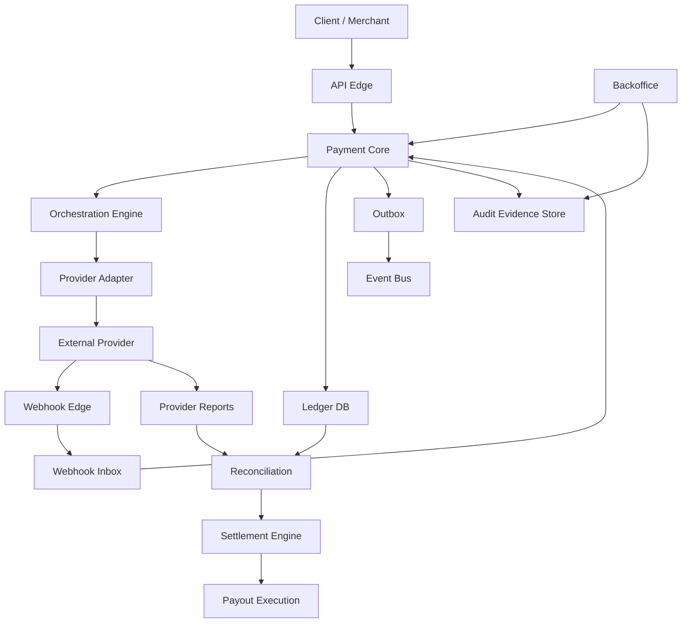
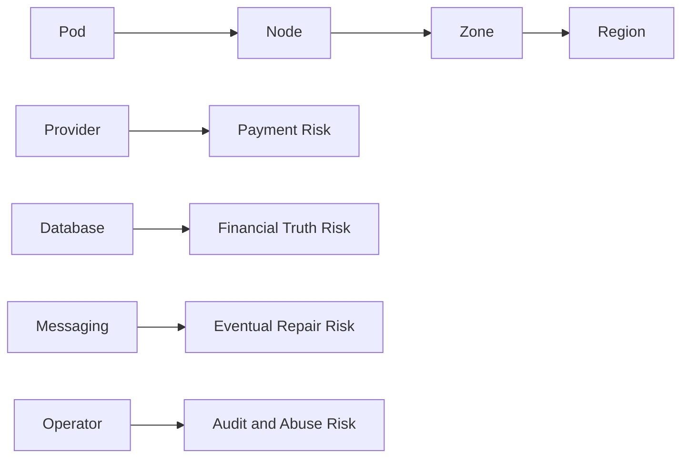
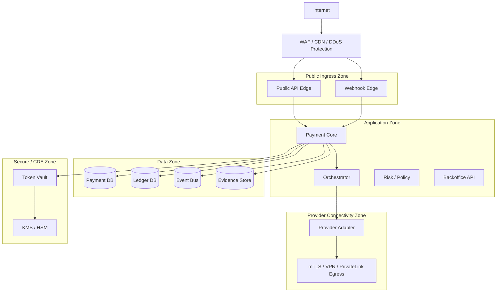
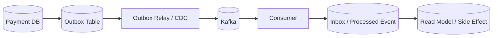
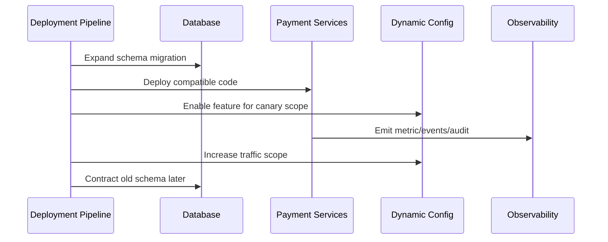
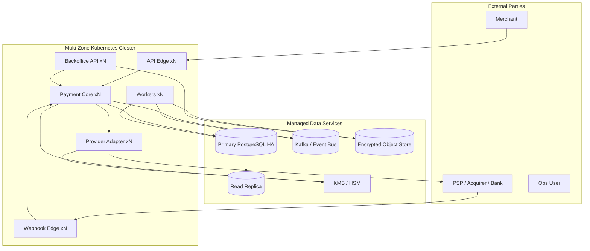

------
title: Build From Scratch: Large Production Grade Java Payment Systems - Part 061
description: Production deployment topology untuk payment platform enterprise: failure domain, network segmentation, PCI boundary, database HA, messaging, rollout, DR, secrets, observability, dan runtime safety.
series: learn-java-payment-systems
seriesTitle: Build From Scratch: Large Production Grade Java Payment Systems
order: 61
partTitle: Production Deployment Topology
tags:
- java
- payments
- payment-systems
- deployment
- kubernetes
- pci-dss
- reliability
- disaster-recovery
- enterprise-architecture
date: 2026-07-02
---

# Part 061 — Production Deployment Topology

Production deployment untuk payment system bukan hanya pertanyaan:

> "Service ini jalan di Kubernetes atau VM?"

Pertanyaan yang benar:

> "Ketika node mati, zone down, secret bocor, provider timeout, database failover, Kafka lag, atau deployment rollback terjadi, apakah sistem masih bisa menjelaskan uang dengan benar?"

Payment platform yang buruk bisa punya container, Helm chart, autoscaling, dan dashboard, tetapi tetap tidak production-grade kalau:

- payment berhasil di provider tetapi internal state hilang;
- ledger posting duplicate saat worker restart;
- webhook diterima di region yang berbeda lalu diproses out-of-order;
- database replica dipakai membaca balance yang belum committed;
- secret provider tercetak di log;
- deployment mengubah mapping status provider tanpa migration plan;
- rollback code tidak kompatibel dengan event/schema baru;
- DR berhasil menyalakan service tetapi reconciliation tidak bisa membuktikan transaksi mana yang sudah diproses.

Deployment topology untuk payment adalah **financial safety topology**.

---

## 1. Mental Model: Deployment Topology Adalah Risk Boundary

Dalam sistem biasa, topology sering didesain untuk availability dan cost.

Dalam payment system, topology harus menjawab lima hal:

1. **Where can money-changing commands run?**
2. **Where is financial truth stored?**
3. **Where can sensitive payment data appear?**
4. **What happens when topology partitions?**
5. **How do we prove what happened after recovery?**



Topology yang baik tidak hanya menaruh service di tempat berbeda. Ia memisahkan **blast radius**.

---

## 2. Production Deployment Goals

Kita ingin topology yang memenuhi tujuan berikut.

| Goal | Makna Payment-Specific |
|---|---|
| Availability | API tetap menerima request atau memberi degraded response yang aman |
| Correctness | Tidak double charge, tidak double payout, tidak lost ledger entry |
| Recoverability | Unknown state bisa diselesaikan lewat evidence, webhook, inquiry, reconciliation |
| Auditability | Semua operator/system action bisa direkonstruksi |
| Security | Cardholder data, secret, key, token, dan financial evidence terlindungi |
| Compliance | PCI/KYB/AML/audit evidence dapat dibuktikan |
| Operability | Ops bisa repair tanpa SQL manual dan tanpa bypass invariant |
| Evolvability | Schema, route, provider, dan ledger rule bisa berubah tanpa drift |

Non-goal:

- membuat semua service active-active multi-region sejak hari pertama;
- mengejar zero-downtime untuk semua jenis migration;
- menyimpan semua data di semua region;
- membuat deployment topology lebih kompleks daripada kemampuan tim mengoperasikannya.

Payment topology harus **lebih aman daripada mewah**.

---

## 3. Service Classification

Tidak semua service punya criticality yang sama.

Klasifikasi ini menentukan replica, resource, PDB, autoscaling, storage, deploy strategy, dan DR priority.

| Class | Contoh | Karakter |
|---|---|---|
| Tier 0 | Ledger DB, primary payment database, KMS/HSM dependency | Jika rusak, financial truth rusak |
| Tier 1 | Payment Core, Webhook Ingestion, Provider Adapter, Ledger Posting Worker | Money-changing path |
| Tier 2 | Reconciliation, Settlement, Payout, Risk, Policy | Delay bisa diterima, tetapi salah tidak boleh |
| Tier 3 | Reporting, Merchant Dashboard, Search Read Model | Bisa degraded/stale |
| Tier 4 | Analytics, BI export, experiment pipeline | Tidak boleh memengaruhi write path |

Rule:

> Tier lebih rendah boleh bergantung pada Tier lebih tinggi, tetapi Tier 0/1 tidak boleh bergantung pada Tier 3/4 untuk membuat keputusan finansial.

Contoh salah:

```text
Payment confirm -> calls analytics service -> analytics down -> payment cannot complete
```

Contoh benar:

```text
Payment confirm -> writes command/state/ledger -> emits event -> analytics consumes asynchronously
```

---

## 4. Failure Domain Model

Payment platform harus eksplisit terhadap failure domain.

| Failure Domain | Contoh | Control |
|---|---|---|
| Pod | JVM crash, OOM, container restart | idempotent operation, liveness/readiness, safe shutdown |
| Node | node drain, disk issue, kernel issue | PDB, topology spread, anti-affinity |
| Zone | AZ outage | multi-zone DB, pod spread, zone-aware routing |
| Region | regional outage | DR runbook, backup restore, provider failover plan |
| Provider | PSP/acquirer outage | route fallback, unknown-state inquiry, circuit breaker |
| Database | failover, lock storm, corruption | HA, PITR, WAL archive, migration discipline |
| Messaging | Kafka outage, lag, poison message | outbox, inbox, replay, DLQ/quarantine |
| Secret/Key | secret leaked, key rotation failure | KMS/HSM, rotation, audit, least privilege |
| Operator | wrong manual adjustment | maker-checker, action limit, evidence requirement |



Yang sering dilupakan: **provider adalah failure domain eksternal**. Ia bisa sukses walau internal timeout. Karena itu deployment topology internal tidak cukup kalau tidak ada operation log, webhook inbox, inquiry, dan reconciliation.

---

## 5. Network Segmentation

Payment deployment perlu memisahkan network berdasarkan sensitivity dan capability.

Minimal boundary:



Design rule:

- public ingress tidak boleh punya direct database access;
- webhook edge harus cepat menyimpan raw event, bukan langsung melakukan semua business logic;
- provider adapter boleh punya credential provider, tetapi tidak boleh expose credential ke Payment Core;
- token vault/CDE harus isolated dan punya audit yang lebih ketat;
- backoffice API tidak boleh share public merchant API route tanpa tambahan control.

---

## 6. PCI/CDE Boundary

Jika platform menyimpan, memproses, atau mentransmisikan cardholder data, deployment topology harus memperlakukan Cardholder Data Environment sebagai scope khusus.

PCI DSS v4.0.1 adalah versi aktif terbaru dari PCI DSS setelah limited revision yang tidak menambah/menghapus requirement dibanding v4.0, tetapi memperjelas requirement/guidance tertentu.

Payment architecture harus menjawab:

- apakah PAN pernah masuk ke browser-owned backend?
- apakah PAN masuk ke Payment Core?
- apakah PAN hanya masuk ke hosted field/provider?
- apakah token vault internal menyimpan PAN atau hanya provider token?
- apakah log, trace, queue, error object, and audit event bisa berisi PAN?
- apakah backoffice bisa reveal sensitive data?
- apakah CI/CD runner bisa deploy ke CDE?
- apakah developer punya direct production DB access?

Tiga pilihan umum:

| Pattern | PCI Scope | Kelebihan | Risiko |
|---|---|---|---|
| Hosted Checkout | rendah | PAN tidak masuk sistem | UX/control terbatas |
| Hosted Fields | sedang | UX lebih baik, PAN direct ke provider iframe/SDK | integration detail tetap sensitif |
| Direct PAN API + Vault | tinggi | full control | compliance, security, audit sangat berat |

Untuk seri ini, production baseline yang aman:

> Gunakan hosted fields/provider tokenization sebagai default. Bangun internal tokenization boundary hanya kalau requirement bisnis benar-benar menuntutnya dan organisasi siap mengoperasikan PCI scope yang lebih besar.

---

## 7. Kubernetes Workload Topology

Payment workload di Kubernetes harus diperlakukan sebagai workload state-sensitive walaupun aplikasinya stateless.

Contoh baseline deployment:

```yaml
apiVersion: apps/v1
kind: Deployment
metadata:
  name: payment-core
spec:
  replicas: 6
  strategy:
    type: RollingUpdate
    rollingUpdate:
      maxUnavailable: 0
      maxSurge: 1
  selector:
    matchLabels:
      app: payment-core
  template:
    metadata:
      labels:
        app: payment-core
        tier: money-changing
    spec:
      terminationGracePeriodSeconds: 60
      containers:
      - name: payment-core
        image: registry.example.com/payment-core:2026.07.02-001
        ports:
        - containerPort: 8080
        readinessProbe:
          httpGet:
            path: /health/ready
            port: 8080
          periodSeconds: 5
          failureThreshold: 2
        livenessProbe:
          httpGet:
            path: /health/live
            port: 8080
          periodSeconds: 10
          failureThreshold: 3
        resources:
          requests:
            cpu: "500m"
            memory: "1Gi"
          limits:
            cpu: "2"
            memory: "2Gi"
```

Payment-specific notes:

- `maxUnavailable: 0` mengurangi risiko capacity drop saat deploy;
- readiness harus mengecek dependency minimal yang diperlukan untuk menerima command;
- liveness tidak boleh terlalu agresif sampai membunuh JVM saat GC spike singkat;
- graceful shutdown harus menghentikan penerimaan command baru, menyelesaikan in-flight request, lalu release lease;
- worker harus punya fencing token/lease agar restart tidak menghasilkan duplicate execution.

---

## 8. Pod Disruption Budget

Untuk Tier 1 service, PDB wajib dipikirkan.

```yaml
apiVersion: policy/v1
kind: PodDisruptionBudget
metadata:
  name: payment-core-pdb
spec:
  minAvailable: 5
  selector:
    matchLabels:
      app: payment-core
```

Makna payment-specific:

- node drain tidak boleh menjatuhkan terlalu banyak payment-core sekaligus;
- webhook ingestion tidak boleh kehilangan capacity saat cluster maintenance;
- settlement worker boleh punya PDB berbeda karena bisa pause lebih aman daripada payment API.

Tetapi PDB bukan silver bullet:

- PDB tidak menyelamatkan dari voluntary disruption yang salah dikonfigurasi semua workload;
- PDB tidak mengganti idempotency;
- PDB tidak mengatasi database failover;
- PDB bisa menghambat node maintenance kalau replica terlalu sedikit.

---

## 9. Topology Spread Constraints

Payment API dan webhook ingestion harus tersebar di failure domain.

```yaml
apiVersion: apps/v1
kind: Deployment
metadata:
  name: webhook-ingestion
spec:
  replicas: 6
  selector:
    matchLabels:
      app: webhook-ingestion
  template:
    metadata:
      labels:
        app: webhook-ingestion
    spec:
      topologySpreadConstraints:
      - maxSkew: 1
        topologyKey: topology.kubernetes.io/zone
        whenUnsatisfiable: DoNotSchedule
        labelSelector:
          matchLabels:
            app: webhook-ingestion
      containers:
      - name: webhook-ingestion
        image: registry.example.com/webhook-ingestion:2026.07.02-001
```

Goal:

- zone A down tidak menghilangkan semua webhook consumer;
- provider callback tetap punya endpoint sehat;
- routing/ingress bisa mengarahkan traffic ke healthy zone.

Tetapi payment decision harus tetap per aggregate serializable. Multi-zone spread tidak berarti processing boleh race bebas.

---

## 10. Health Check Semantics

Health check payment tidak boleh dangkal.

| Endpoint | Makna | Boleh Check Apa? | Tidak Boleh Check Apa? |
|---|---|---|---|
| `/health/live` | proses masih hidup | JVM, deadlock detector, event loop sanity | provider availability, database query berat |
| `/health/ready` | siap menerima traffic | DB primary reachable, config loaded, critical dependency minimal | analytics, optional provider, long-running job |
| `/health/deep` | diagnostic manual | provider ping, DB read/write probe, Kafka lag | dipakai load balancer umum |

Readiness untuk Payment Core harus fail kalau:

- database primary tidak bisa diakses;
- migration version tidak compatible;
- signing/encryption key tidak tersedia;
- config policy tidak loaded;
- service masuk freeze mode command-changing.

Readiness tidak harus fail kalau:

- analytics down;
- reporting DB lag;
- satu provider optional down tapi route lain sehat;
- settlement batch worker sedang paused secara intentional.

---

## 11. Database Topology

Database adalah financial truth boundary.

Untuk payment system, database topology harus didesain berdasarkan data class.

| Data | Primary Storage | Replica Usage | Notes |
|---|---|---|---|
| Payment command/state | OLTP primary | read-only search/list | write path harus primary |
| Ledger journal/entry | OLTP primary / dedicated ledger DB | reporting/reconciliation snapshot | immutable, idempotent posting |
| Audit event | append-only store / DB + object storage | investigation/read model | hash chain optional |
| Raw webhook/report file | object store + metadata DB | parser/replay | immutable evidence |
| Reconciliation result | OLTP/reporting DB | dashboard | breaks need workflow |
| Analytics | warehouse/lake | only async | never in write path |

Critical rule:

> Jangan membaca balance/eligibility dari replica yang bisa lag untuk membuat keputusan money movement.

Contoh salah:

```text
Payout API reads available balance from replica -> replica lag -> payout allowed twice
```

Contoh benar:

```text
Payout API reserves balance on primary with unique command + row lock + ledger reservation
```

---

## 12. Database HA and Failover

PostgreSQL HA untuk payment harus memperhatikan:

- primary failover semantics;
- transaction durability;
- replication lag;
- connection pool behavior saat failover;
- idempotent retry setelah connection reset;
- sequence/identity behavior;
- background worker lease setelah failover;
- monitoring split-brain risk;
- PITR restore test.

JDBC/Hikari baseline:

```properties
maximumPoolSize=40
minimumIdle=10
connectionTimeout=2000
validationTimeout=1000
idleTimeout=30000
maxLifetime=900000
leakDetectionThreshold=30000
```

Payment-specific notes:

- connection timeout harus lebih kecil dari API timeout budget;
- retry database command hanya aman jika command idempotent dan transaction outcome diketahui/terverifikasi;
- setelah commit timeout, jangan otomatis assume rollback;
- use idempotency key + operation log to resolve.

---

## 13. Messaging Topology

Event bus bukan financial truth.

Event bus adalah delivery/propagation mechanism.



Payment rule:

- state change + outbox insert dalam satu DB transaction;
- consumer harus idempotent;
- ledger posting tidak boleh bergantung pada "event terkirim" kecuali event itu sendiri punya inbox/idempotency dan posting rule;
- DLQ/quarantine harus menjadi operational workflow, bukan tempat sampah permanen;
- replay harus deterministic atau setidaknya side-effect-safe.

Topic classification:

| Topic | Key | Retention | Consumer Style |
|---|---|---|---|
| `payment.events` | `payment_id` | long | idempotent, ordered per payment |
| `ledger.journals` | `journal_id/account_id` | long/compact read model dependent | immutable fact |
| `webhook.received` | `provider_event_id` or provider ref | medium/long | evidence processing |
| `reconciliation.breaks` | `break_id` | long | case workflow |
| `settlement.batches` | `settlement_batch_id` | long | reporting/payout |

---

## 14. Secrets, Config, and Key Distribution

Kubernetes Secret bukan otomatis aman hanya karena namanya Secret. Secret perlu:

- encryption at rest;
- RBAC least privilege;
- no broad list/watch permission;
- secret rotation;
- external secret manager/KMS integration;
- audit of access;
- no secret in env var when file mount/sidecar integration is safer;
- no secret in logs, traces, metrics, heap dump.

Payment secret classes:

| Secret Class | Example | Rotation Model |
|---|---|---|
| Provider API key | PSP credential | dual credential + cutover |
| Webhook signing secret | provider callback validation | overlapping validation window |
| DB credential | service account | short-lived / rotated |
| Encryption data key | envelope encryption | key version registry |
| HMAC key | fingerprint/signature | versioned key id |
| mTLS private key | provider/bank connectivity | certificate lifecycle |

Provider credential should be owned by adapter boundary.

Payment Core should not know every raw provider credential.

---

## 15. Configuration Topology

Payment config is not all equal.

| Config Type | Example | Change Safety |
|---|---|---|
| Static build config | database driver, feature module | deploy required |
| Runtime safe config | provider weight, timeout threshold | versioned dynamic config |
| Financial policy | fee plan, risk limit, payout rule | maker-checker + effective date |
| Security config | webhook secret, key id | rotation workflow |
| Emergency control | disable provider, freeze payout | audited operator action |

Payment-specific anti-pattern:

```yaml
ROUTING_RULE: "send all traffic to ProviderB"
```

without:

- version;
- actor;
- approval;
- dry-run/simulation;
- effective time;
- rollback plan;
- audit evidence;
- affected merchant/payment method scope.

Better:

```json
{
  "policyId": "route-policy-2026-07-02-001",
  "scope": { "merchantSegment": "default", "method": "CARD" },
  "rules": [
    { "if": "providerA.health == DEGRADED", "then": "exclude(providerA)" },
    { "if": "currency == IDR", "then": "prefer(providerB)" }
  ],
  "effectiveFrom": "2026-07-02T10:00:00Z",
  "approvedBy": ["ops-lead", "risk-lead"],
  "changeTicket": "PAYOPS-9821"
}
```

---

## 16. Deployment Strategy

Payment service deployment must respect schema/event compatibility.

Safe baseline:

1. deploy backward-compatible database migration;
2. deploy code that can read old and new fields;
3. enable feature for small scope;
4. verify observability and reconciliation;
5. expand traffic;
6. remove old code only after old data/events no longer needed.



Avoid:

- code first, schema later;
- deleting enum value used by old event;
- changing provider status mapping without version;
- changing ledger posting rule without effective dating;
- rollback that cannot read data written by new version.

---

## 17. Canary and Progressive Delivery

Canary for payment is not simply traffic percentage.

Canary scope should be chosen by blast radius:

| Canary Dimension | Safer Example | Risky Example |
|---|---|---|
| Merchant | internal merchant/test merchant | top merchant |
| Payment method | low-volume wallet rail | high-volume card rail |
| Amount | low ticket size | high-value payout |
| Country/currency | single currency | multi-currency FX |
| Provider | provider simulator/shadow | provider production full route |
| Operation | authorization only | payout execution |

Canary metrics:

- authorization success rate;
- unknown outcome rate;
- provider timeout rate;
- webhook latency;
- duplicate idempotency conflict;
- ledger posting failure;
- reconciliation break rate;
- refund/capture mismatch;
- customer-visible error rate;
- rollback compatibility.

Rollout should stop automatically if financial safety metrics degrade, even if HTTP 5xx looks normal.

---

## 18. Runtime Freeze Modes

Payment platform needs freeze modes.

| Freeze Mode | Effect |
|---|---|
| `PAYMENT_CREATE_FREEZE` | block new payment creation |
| `CONFIRM_FREEZE` | block confirm/charge execution |
| `CAPTURE_FREEZE` | block capture |
| `REFUND_FREEZE` | block refunds |
| `PAYOUT_FREEZE` | block outbound payouts |
| `SETTLEMENT_FREEZE` | block settlement batch finalization |
| `BACKOFFICE_ADJUSTMENT_FREEZE` | block manual money-changing actions |
| `PROVIDER_X_FREEZE` | remove provider from routing |

Freeze mode is not just config. It is an audited operational command.

Schema sketch:

```sql
create table operational_freeze (
    freeze_id uuid primary key,
    scope_type text not null,
    scope_value text,
    operation text not null,
    reason text not null,
    created_by text not null,
    approved_by text,
    created_at timestamptz not null default now(),
    expires_at timestamptz,
    lifted_at timestamptz,
    lifted_by text,
    check (operation in (
        'PAYMENT_CREATE','CONFIRM','CAPTURE','REFUND','PAYOUT','SETTLEMENT','ADJUSTMENT'
    ))
);
```

---

## 19. Disaster Recovery Topology

DR for payment is not complete when service starts in another region.

DR must prove:

- which payments were accepted before outage;
- which provider operations were sent;
- which provider operations may have unknown result;
- which ledger journals committed;
- which webhooks/reports are missing;
- which payouts were sent;
- which files were generated;
- which operator actions happened;
- whether reconciliation can resume.

DR strategy options:

| Strategy | RPO/RTO | Complexity | Payment Risk |
|---|---|---|---|
| Backup/Restore | higher RTO/RPO | lower | unknown gap needs reconciliation |
| Warm Standby | medium | medium | failover runbook critical |
| Active-Passive | lower RTO | high | split-brain prevention needed |
| Active-Active | lowest theoretical | very high | hard for ledger/global ordering |

For most teams:

> Start with single-region multi-zone + tested backup/PITR + warm standby for critical services + provider inquiry/reconciliation recovery. Move to active-active only after the ledger and idempotency model can survive it.

---

## 20. Active-Active Warning

Active-active payment deployment is often over-sold.

Hard problems:

- global idempotency key uniqueness;
- ledger journal ordering;
- double balance reservation;
- provider callback region affinity;
- settlement batch ownership;
- payout duplicate prevention;
- merchant config consistency;
- key/secret replication;
- audit log total ordering;
- cross-region database latency;
- failover without split-brain.

If you cannot explain these, do not do active-active money-changing writes.

Safer pattern:

- active-active read/search/dashboard;
- active-passive command write;
- regional webhook edges that persist raw events and forward to primary processing region;
- settlement/payout with single owner lease;
- DR mode that blocks high-risk actions until reconciliation catch-up.

---

## 21. Provider Connectivity

Provider adapter topology depends on provider connectivity model.

| Connectivity | Example | Deployment Notes |
|---|---|---|
| Public HTTPS | typical PSP API | egress allowlist, TLS validation, idempotency |
| mTLS HTTPS | bank/provider API | certificate lifecycle, private key protection |
| VPN/private link | bank connectivity | HA tunnel, route failover, monitoring |
| SFTP | settlement file/report | key rotation, file fingerprint, idempotent import/export |
| ISO 8583 TCP | processor/switch | persistent connection, heartbeat, MAC/HSM, reconnect logic |

Provider adapter must own:

- retry and timeout classification;
- request/response raw evidence;
- credential usage;
- provider operation idempotency;
- provider-specific health;
- circuit breaker state;
- inquiry/status API.

---

## 22. Batch Worker Topology

Settlement, reconciliation, report import, and payout batch workers should not run as naive cron jobs.

Use lease/fencing:

```sql
create table worker_lease (
    lease_name text primary key,
    owner_id text not null,
    fencing_token bigint not null,
    acquired_at timestamptz not null,
    expires_at timestamptz not null
);
```

Worker acquisition:

```sql
insert into worker_lease (
    lease_name, owner_id, fencing_token, acquired_at, expires_at
)
values (
    :lease_name, :owner_id, 1, now(), now() + interval '60 seconds'
)
on conflict (lease_name) do update
set owner_id = excluded.owner_id,
    fencing_token = worker_lease.fencing_token + 1,
    acquired_at = now(),
    expires_at = now() + interval '60 seconds'
where worker_lease.expires_at < now()
returning fencing_token;
```

Every irreversible action should record fencing token:

```sql
create table payout_execution_attempt (
    attempt_id uuid primary key,
    payout_id uuid not null,
    worker_owner_id text not null,
    fencing_token bigint not null,
    provider text not null,
    provider_request_id text,
    status text not null,
    created_at timestamptz not null default now(),
    unique (payout_id, provider, provider_request_id)
);
```

---

## 23. Observability Topology

Observability data must be separated by sensitivity.

| Data | Examples | Control |
|---|---|---|
| Metrics | counts, latencies, status rates | no PAN/PII |
| Logs | request id, payment id, provider op id | redacted, structured |
| Traces | span topology | no sensitive payload |
| Audit | actor/action/evidence | immutable, access controlled |
| Evidence | raw webhook, report file, provider response | encrypted, retention policy |
| Security events | key access, secret rotation, auth failure | security monitoring |

Do not put raw webhook payload into general logs. Store it in encrypted evidence store and log only fingerprint + evidence id.

---

## 24. Deployment Pipeline Gates

Payment deployment should fail before production if gates fail.

Minimum gates:

- contract tests pass;
- OpenAPI backward compatibility check pass;
- database migration dry-run pass;
- rollback compatibility check pass;
- ledger invariant property tests pass;
- idempotency/concurrency tests pass;
- provider simulator scenarios pass;
- webhook signature tests pass;
- sensitive logging tests pass;
- migration expand/contract policy pass;
- deployment manifest policy pass;
- security scan pass;
- runbook updated for risky changes.

Example release evidence:

```yaml
releaseId: payment-core-2026.07.02-001
schemaVersion: 2026.07.02.001
contractCompatibility: PASS
ledgerInvariantTests: PASS
providerSimulator: PASS
webhookReplaySuite: PASS
reconciliationGoldenFiles: PASS
rollbackPlan: documented
riskApproval: PAYRISK-1881
opsApproval: PAYOPS-9910
```

---

## 25. Environment Strategy

Recommended environments:

| Environment | Purpose | Data |
|---|---|---|
| Local | developer loop | synthetic only |
| Contract CI | API/schema compatibility | generated fixtures |
| Integration | real DB/Kafka/simulator | synthetic |
| Sandbox | provider sandbox integration | synthetic/provider test |
| Preprod | production-like topology | masked/synthetic |
| Production | real money | real data |
| DR Drill | restore/failover test | masked or controlled production backup depending policy |

Never use production card/customer data in lower env without formal masking/legal/security approval.

---

## 26. Deployment Anti-Patterns

Avoid these:

1. **One database user for all services.**
2. **All secrets mounted into all pods.**
3. **Webhook processing directly from controller without durable inbox.**
4. **Reading available balance from replica for payout decision.**
5. **No separate backoffice permission boundary.**
6. **Provider credentials in Payment Core.**
7. **Manual SQL as operational repair path.**
8. **No rollback compatibility for event/schema changes.**
9. **Treating deployment success as business success.**
10. **Active-active writes without global idempotency and ledger ownership model.**

---

## 27. Production Readiness Checklist

Before launch:

- [ ] Payment API has idempotency.
- [ ] Provider operation log persists every outbound provider command.
- [ ] Webhook edge stores raw event before processing.
- [ ] Ledger posting is idempotent and balanced.
- [ ] Balance-changing operations use primary DB and proper locking/constraints.
- [ ] Payout has reservation and duplicate prevention.
- [ ] Settlement worker uses lease/fencing.
- [ ] Reconciliation can import provider/bank reports.
- [ ] PCI/CDE boundary is documented.
- [ ] Secrets are encrypted at rest and access-scoped.
- [ ] Sensitive logging tests exist.
- [ ] PDB/topology spread exists for Tier 1 workloads.
- [ ] Backup/PITR restore has been tested.
- [ ] DR runbook has been tested.
- [ ] Freeze modes exist for high-risk operations.
- [ ] Backoffice actions are audited and controlled.
- [ ] Deployment pipeline checks contract/schema/rollback compatibility.
- [ ] Observability includes business metrics, not only CPU/HTTP.

---

## 28. Minimal Production Topology

A realistic first production topology:



This is enough for many payment platforms if:

- DB is highly available;
- backup restore is tested;
- provider operation log exists;
- webhook inbox exists;
- reconciliation is real;
- payout/settlement are controlled;
- operational repair is not raw SQL.

---

## 29. What Top 1% Engineers Notice

Average engineers ask:

> "How many replicas?"

Strong payment engineers ask:

> "If a deployment, failover, or region outage happens during a capture/refund/payout, how do we know whether money moved?"

Average engineers ask:

> "Is Kubernetes highly available?"

Strong payment engineers ask:

> "Which operations are allowed during degraded mode, and which are frozen?"

Average engineers ask:

> "Is the provider API reachable?"

Strong payment engineers ask:

> "If it timed out after we sent the request, what evidence lets us classify the state?"

That is the difference between infrastructure deployment and payment production topology.

---

## References

- Kubernetes Documentation — Pod Disruption Budgets: https://kubernetes.io/docs/tasks/run-application/configure-pdb/
- Kubernetes Documentation — Pod Topology Spread Constraints: https://kubernetes.io/docs/concepts/scheduling-eviction/topology-spread-constraints/
- Kubernetes Documentation — Good Practices for Secrets: https://kubernetes.io/docs/concepts/security/secrets-good-practices/
- Kubernetes Documentation — Encrypting Confidential Data at Rest: https://kubernetes.io/docs/tasks/administer-cluster/encrypt-data/
- PCI Security Standards Council — Document Library / PCI DSS v4.0.1: https://www.pcisecuritystandards.org/document_library/
- PCI SSC Blog — Just Published: PCI DSS v4.0.1: https://blog.pcisecuritystandards.org/just-published-pci-dss-v4-0-1
- Debezium Documentation — Outbox Event Router: https://debezium.io/documentation/reference/stable/transformations/outbox-event-router.html
