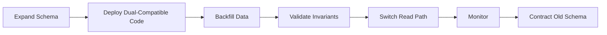
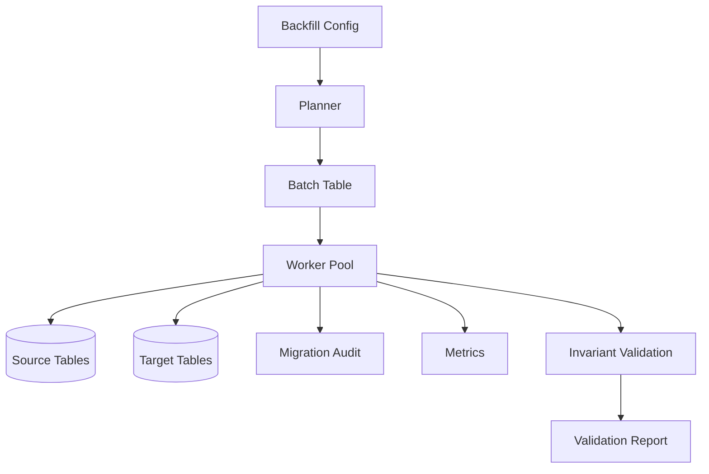
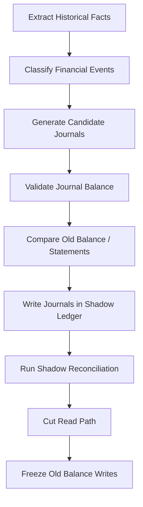
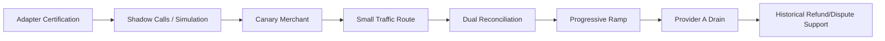
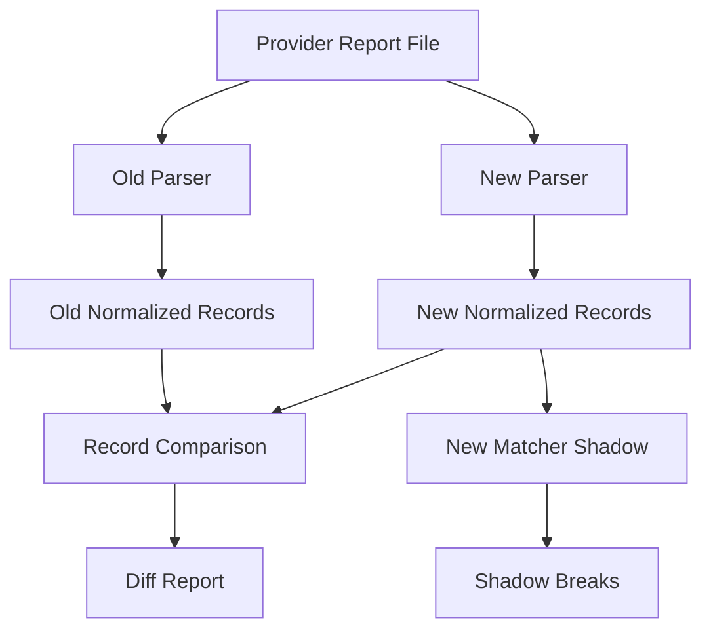

------
title: Build From Scratch: Large Production Grade Java Payment Systems - Part 062
description: Migration dan data backfill untuk payment platform: schema evolution, provider migration, ledger migration, reconciliation repair, event replay, dual-run, cutover, rollback, dan invariant-driven backfill.
series: learn-java-payment-systems
seriesTitle: Build From Scratch: Large Production Grade Java Payment Systems
order: 62
partTitle: Migration and Data Backfill
tags:
- java
- payments
- payment-systems
- migration
- data-backfill
- ledger
- reconciliation
- flyway
- debezium
- enterprise-architecture
date: 2026-07-02
---

# Part 062 — Migration and Data Backfill

Migration di payment system bukan pekerjaan database biasa.

Di sistem umum, migration gagal mungkin menyebabkan halaman error.

Di payment system, migration gagal bisa menyebabkan:

- uang terlihat hilang;
- saldo merchant salah;
- payout double;
- refund melewati captured amount;
- reconciliation break membanjir;
- audit trail tidak bisa menjelaskan perubahan;
- provider migration menghasilkan transaksi orphan;
- ledger baru tidak seimbang dengan ledger lama;
- rollback tidak bisa membaca data yang baru ditulis.

Karena itu migration dan backfill harus diperlakukan sebagai **financial operation**.

---

## 1. Mental Model: Migration Adalah Perubahan Truth Model

Ada tiga jenis perubahan:

| Jenis | Contoh | Risiko |
|---|---|---|
| Shape migration | tambah kolom, tambah tabel, ubah index | aplikasi tidak compatible |
| Meaning migration | status mapping berubah, amount semantic berubah | data lama dibaca dengan arti baru |
| Truth migration | ledger baru, provider baru, settlement model baru | uang bisa terlihat berubah |

Payment migration paling berbahaya bukan `ALTER TABLE`.

Yang paling berbahaya adalah:

> Data lama tetap sama, tetapi arti bisnisnya berubah.

Contoh:

```text
Before:
AUTHORIZED means provider approved and capture may be attempted.

After:
AUTHORIZED means provider approved, risk approved, and capture reservation posted.
```

Kalau status name sama tetapi invariant berubah, semua consumer lama bisa salah mengambil keputusan.

---

## 2. Migration Principles

Gunakan prinsip berikut.

### 2.1 Expand, Migrate, Contract



Jangan:

```text
ALTER column semantics + deploy code + hope old data fits
```

### 2.2 Never Backfill Without Evidence

Setiap backfill harus punya:

- source data;
- transformation rule version;
- actor/job id;
- time window;
- dry-run result;
- row count/control total;
- invariant report;
- rollback/compensation plan;
- audit trail.

### 2.3 Do Not Rewrite Financial History Casually

Ledger/audit history sebaiknya append-only.

Kalau ada data salah:

- buat correction journal;
- buat adjustment event;
- buat reconciliation break resolution;
- jangan update silent historical amount.

### 2.4 Make Migration Idempotent

Backfill job harus aman dijalankan ulang.

Gunakan:

- deterministic migration key;
- unique constraint;
- processed marker;
- batch checkpoint;
- advisory lock/lease;
- compare-before-write;
- run id.

---

## 3. Migration Taxonomy in Payment Platforms

| Migration | Example | Special Control |
|---|---|---|
| API contract migration | add `nextAction`, change error code | backward compatibility |
| DB schema migration | add payment_attempt table | expand/contract |
| State machine migration | split `SUCCESS` into `AUTHORIZED`/`CAPTURED` | legal transition mapping |
| Ledger migration | introduce double-entry ledger | trial balance and conservation |
| Provider migration | PSP A to PSP B | dual-run/shadow/reconciliation |
| Token migration | provider token to network token | PCI/security boundary |
| Risk rule migration | new rule engine | shadow decision comparison |
| Fee migration | pricing plan versioning | statement comparison |
| Settlement migration | new netting model | merchant payable reconciliation |
| Event migration | topic/schema version | dual-publish/dual-read |
| Reconciliation migration | new parser/matcher | golden file comparison |
| Backoffice migration | new action model | permission/audit parity |

---

## 4. Schema Migration Discipline

Use database migration tools such as Flyway/Liquibase, but remember:

> Tooling orders SQL scripts. It does not guarantee semantic safety.

Good migration file:

```sql
-- V2026070201__add_payment_attempt_provider_operation.sql

create table payment_attempt_provider_operation (
    operation_id uuid primary key,
    payment_attempt_id uuid not null references payment_attempt(payment_attempt_id),
    provider text not null,
    operation_type text not null,
    idempotency_key text not null,
    request_fingerprint text not null,
    status text not null,
    provider_reference text,
    created_at timestamptz not null default now(),
    updated_at timestamptz not null default now(),
    unique (provider, operation_type, idempotency_key),
    check (operation_type in ('AUTHORIZE','CAPTURE','VOID','REFUND','PAYOUT')),
    check (status in ('CREATED','SENT','SUCCEEDED','FAILED','UNKNOWN'))
);

create index idx_provider_operation_attempt
    on payment_attempt_provider_operation(payment_attempt_id, operation_type);
```

Bad migration:

```sql
alter table payment add column provider_status text;
update payment set provider_status = 'SUCCESS' where status = 'SUCCESS';
```

Why bad?

- `SUCCESS` might mean authorized for one method and captured for another;
- no mapping version;
- no evidence;
- no dry-run count;
- no conflict bucket;
- no unknown state handling.

---

## 5. Compatibility Matrix

Before deploying schema changes, define compatibility.

| Code Version | Old Schema | Expanded Schema | Contracted Schema |
|---|---:|---:|---:|
| Old code | works | works | breaks |
| New dual code | works if feature off | works | maybe works |
| New final code | breaks/maybe | works | works |

Correct order:

1. old code + old schema;
2. old code + expanded schema;
3. new dual code + expanded schema;
4. backfill;
5. switch read path;
6. new final code;
7. contracted schema later.

Rollback must be considered at each step.

---

## 6. Backfill Job Architecture

A safe backfill job is not a script that runs once on prod.

It is a controlled batch application.



Schema:

```sql
create table migration_run (
    run_id uuid primary key,
    migration_name text not null,
    migration_version text not null,
    mode text not null,
    status text not null,
    started_by text not null,
    started_at timestamptz not null default now(),
    completed_at timestamptz,
    source_from timestamptz,
    source_to timestamptz,
    config jsonb not null,
    dry_run_report jsonb,
    check (mode in ('DRY_RUN','WRITE')),
    check (status in ('CREATED','RUNNING','PAUSED','SUCCEEDED','FAILED','CANCELLED'))
);

create table migration_batch (
    batch_id uuid primary key,
    run_id uuid not null references migration_run(run_id),
    batch_no bigint not null,
    range_start text not null,
    range_end text not null,
    status text not null,
    selected_count bigint not null default 0,
    written_count bigint not null default 0,
    skipped_count bigint not null default 0,
    conflict_count bigint not null default 0,
    error_count bigint not null default 0,
    started_at timestamptz,
    completed_at timestamptz,
    unique (run_id, batch_no)
);

create table migration_item_result (
    result_id uuid primary key,
    run_id uuid not null references migration_run(run_id),
    batch_id uuid not null references migration_batch(batch_id),
    source_type text not null,
    source_id text not null,
    target_type text,
    target_id text,
    result text not null,
    reason text,
    fingerprint text not null,
    created_at timestamptz not null default now(),
    unique (run_id, source_type, source_id)
);
```

---

## 7. Idempotent Backfill Write Pattern

Example: backfill provider operation rows from historical payment attempts.

```sql
insert into payment_attempt_provider_operation (
    operation_id,
    payment_attempt_id,
    provider,
    operation_type,
    idempotency_key,
    request_fingerprint,
    status,
    provider_reference,
    created_at,
    updated_at
)
select
    gen_random_uuid(),
    pa.payment_attempt_id,
    pa.provider,
    case
        when pa.type = 'CARD_AUTH' then 'AUTHORIZE'
        when pa.type = 'CARD_CAPTURE' then 'CAPTURE'
        else 'AUTHORIZE'
    end,
    concat('backfill:', pa.payment_attempt_id, ':', pa.provider, ':', pa.type),
    encode(sha256(concat(pa.payment_attempt_id, ':', pa.provider, ':', pa.amount_minor)::bytea), 'hex'),
    case
        when pa.status in ('SUCCESS','CAPTURED','AUTHORIZED') then 'SUCCEEDED'
        when pa.status in ('FAILED','DECLINED') then 'FAILED'
        else 'UNKNOWN'
    end,
    pa.provider_reference,
    pa.created_at,
    now()
from payment_attempt pa
where pa.created_at >= :from
  and pa.created_at < :to
on conflict (provider, operation_type, idempotency_key) do nothing;
```

But this is only safe if:

- mapping is reviewed;
- conflicting statuses are detected;
- unknowns are not forced into success/failure;
- counts are reconciled;
- migration output is audited.

---

## 8. Ledger Migration

Migrating to a double-entry ledger is one of the riskiest migrations.

Wrong approach:

```text
For every payment success, insert one ledger row with amount.
```

Correct thinking:

> For every historical financial fact, generate balanced journals that explain current obligations and balances.

Ledger migration sources:

- payment table;
- refund table;
- payout table;
- settlement table;
- dispute table;
- fee table;
- manual adjustment table;
- provider/bank reconciliation reports.

Target invariant:

```text
For every journal:
  sum(debits) == sum(credits)

For every merchant/currency:
  migrated merchant payable == explainable payable from old system

For every provider/currency:
  provider clearing/suspense balance is explainable

For every payout:
  payout amount == settled payable reduction ± fee/reserve adjustments
```

---

## 9. Ledger Migration Stages



Recommended phases:

1. create new ledger schema;
2. dual-post new transactions to old and new model;
3. backfill historical transactions into shadow ledger;
4. compare balances by merchant/currency/day;
5. reconcile mismatches;
6. freeze old balance-changing behavior;
7. switch reads to new ledger projection;
8. keep old tables read-only for evidence period;
9. contract only after audit/compliance approval.

---

## 10. Ledger Migration Control Tables

```sql
create table ledger_migration_source_fact (
    fact_id uuid primary key,
    run_id uuid not null,
    source_table text not null,
    source_id text not null,
    fact_type text not null,
    merchant_id uuid,
    currency char(3) not null,
    amount_minor bigint not null,
    occurred_at timestamptz not null,
    source_payload jsonb not null,
    classification_version text not null,
    unique (run_id, source_table, source_id, fact_type)
);

create table ledger_migration_journal_map (
    map_id uuid primary key,
    run_id uuid not null,
    fact_id uuid not null references ledger_migration_source_fact(fact_id),
    journal_id uuid not null,
    posting_rule_version text not null,
    created_at timestamptz not null default now(),
    unique (run_id, fact_id, posting_rule_version)
);
```

Never lose the link from old source fact to new journal.

Without lineage, audit and reconciliation become guesswork.

---

## 11. Provider Migration

Provider migration is not just changing route config from Provider A to Provider B.

It affects:

- payment method token compatibility;
- 3DS flow;
- authorization/capture semantics;
- refund support;
- dispute reporting;
- settlement files;
- payout capability;
- error code mapping;
- reconciliation reports;
- webhook retry semantics;
- merchant statement format;
- risk model performance.

Provider migration phases:



Important:

> Old provider must remain supported for refunds, disputes, settlement reports, and reconciliation long after new payments stop routing to it.

---

## 12. Provider Migration Cutover Model

Do not route by code deploy. Route by versioned policy.

```sql
create table provider_route_policy (
    policy_id uuid primary key,
    policy_version text not null,
    scope jsonb not null,
    rules jsonb not null,
    effective_from timestamptz not null,
    effective_to timestamptz,
    status text not null,
    created_by text not null,
    approved_by text,
    created_at timestamptz not null default now(),
    check (status in ('DRAFT','APPROVED','ACTIVE','RETIRED'))
);
```

Capture route decision at payment time:

```sql
create table payment_route_decision (
    route_decision_id uuid primary key,
    payment_attempt_id uuid not null,
    policy_id uuid not null,
    selected_provider text not null,
    candidate_providers jsonb not null,
    decision_reason jsonb not null,
    created_at timestamptz not null default now(),
    unique (payment_attempt_id)
);
```

This allows later explanation:

> "This payment used Provider B because policy version X was active for merchant segment Y at time T."

---

## 13. Token Migration

Token migration is security-sensitive.

Scenarios:

- provider token A to provider token B;
- internal token vault to network token;
- old card vault to new card vault;
- re-tokenization because provider changes;
- rotating token format.

Risks:

- PAN exposure;
- token mismatch;
- customer payment method unusable;
- recurring payment failure;
- PCI scope expansion;
- duplicate card records;
- lost consent/mandate evidence.

Token migration should be capability-based:

```text
Payment method can be charged with Provider A token.
Payment method can be charged with Provider B token.
Payment method requires re-authentication.
Payment method cannot be migrated.
```

Schema sketch:

```sql
create table payment_method_capability (
    capability_id uuid primary key,
    payment_method_id uuid not null,
    provider text not null,
    capability text not null,
    status text not null,
    evidence_id uuid,
    created_at timestamptz not null default now(),
    unique (payment_method_id, provider, capability),
    check (capability in ('AUTHORIZE','MIT','REFUND','NETWORK_TOKEN')),
    check (status in ('AVAILABLE','REQUIRES_ACTION','UNAVAILABLE','UNKNOWN'))
);
```

---

## 14. Event Schema Migration

Event migration must handle old producers and old consumers.

Safe pattern:

- add optional field first;
- consumers tolerate unknown fields;
- producers include both old and new representation temporarily;
- consumer metrics detect old/new usage;
- remove old field only after all consumers no longer require it;
- keep schema compatibility policy enforced in CI.

Bad:

```json
{
  "status": "SUCCESS"
}
```

Better:

```json
{
  "status": "CAPTURED",
  "statusVersion": "payment-status-v2",
  "providerStatus": {
    "provider": "adyen",
    "rawResultCode": "Authorised",
    "normalizedAt": "2026-07-02T10:00:00Z",
    "mappingVersion": "adyen-card-v2026-07"
  },
  "financialEffect": "MERCHANT_PAYABLE_INCREASED"
}
```

---

## 15. Outbox Backfill

Sometimes historical records need events emitted to build new read models.

Do not publish directly from ad-hoc script.

Write to outbox with deterministic event id.

```sql
insert into outbox_event (
    event_id,
    aggregate_type,
    aggregate_id,
    event_type,
    payload,
    occurred_at,
    created_at
)
select
    gen_random_uuid(),
    'PAYMENT',
    p.payment_id::text,
    'PaymentBackfilledForSearchIndex',
    jsonb_build_object(
        'paymentId', p.payment_id,
        'merchantId', p.merchant_id,
        'status', p.status,
        'amount', p.amount_minor,
        'currency', p.currency,
        'backfillRunId', :run_id
    ),
    p.created_at,
    now()
from payment p
where p.created_at >= :from
  and p.created_at < :to
on conflict do nothing;
```

Better deterministic id:

```text
event_id = UUIDv5(namespace='outbox-backfill', name=run_id + ':' + payment_id)
```

That makes rerun safe.

---

## 16. Reconciliation Migration

When changing reconciliation parser/matcher, use dual-run.



Validation metrics:

- row count equal;
- control total equal;
- amount total by currency equal;
- transaction reference coverage;
- settlement batch coverage;
- duplicate count;
- unmatched count;
- old matcher vs new matcher break delta;
- manual review delta.

Do not cut over just because parser "does not crash".

---

## 17. Settlement Migration

Settlement migration changes merchant payable math.

You need statement comparison.

For each merchant/currency/settlement date:

```text
old_statement.gross_amount == new_statement.gross_amount
old_statement.fee_amount ~= new_statement.fee_amount within explicit tolerance
old_statement.reserve_hold == new_statement.reserve_hold
old_statement.reserve_release == new_statement.reserve_release
old_statement.payout_amount == new_statement.payout_amount
old_statement.carry_forward == new_statement.carry_forward
```

If fee model intentionally changes, the difference must be explainable by effective-dated pricing policy.

Never silently change prior settlement statements.

If correction is needed:

- issue adjustment line;
- include reason;
- link to migration run;
- expose in merchant statement;
- audit approval.

---

## 18. Read Path Migration

Read migration often causes subtle bugs.

Example: switching merchant balance view from old balance table to new ledger projection.

Phases:

1. compute new projection in shadow;
2. compare old/new balance by merchant/currency;
3. expose internal-only diff dashboard;
4. allow backoffice view toggle;
5. enable merchant API shadow response logging;
6. canary merchant-visible read;
7. full cutover;
8. freeze old table writes;
9. retain old data for audit.

Diff schema:

```sql
create table balance_projection_diff (
    diff_id uuid primary key,
    run_id uuid not null,
    merchant_id uuid not null,
    currency char(3) not null,
    old_available_minor bigint not null,
    new_available_minor bigint not null,
    old_pending_minor bigint not null,
    new_pending_minor bigint not null,
    old_settled_minor bigint not null,
    new_settled_minor bigint not null,
    diff_reason text,
    status text not null,
    created_at timestamptz not null default now(),
    check (status in ('OPEN','EXPLAINED','ACCEPTED','FIXED'))
);
```

---

## 19. State Machine Migration

Changing state machine requires mapping legal old states to legal new states.

Example:

| Old State | New State | Condition | Risk |
|---|---|---|---|
| `SUCCESS` | `AUTHORIZED` | card auth-only, no capture | capture allowed |
| `SUCCESS` | `CAPTURED` | sale/auto-capture | merchant payable |
| `FAILED` | `DECLINED` | provider refusal | no retry maybe |
| `FAILED` | `TECHNICAL_FAILED` | transport/provider error | retry maybe |
| `PENDING` | `REQUIRES_ACTION` | 3DS challenge pending | customer action |
| `PENDING` | `UNKNOWN` | provider timeout | inquiry/recon required |

Do not map `PENDING` to `FAILED` just to clean data.

Unknown is a valid state.

---

## 20. Backfill Worker Java Skeleton

```java
public final class PaymentBackfillWorker {
    private final MigrationRunRepository runRepository;
    private final MigrationBatchRepository batchRepository;
    private final PaymentSourceRepository sourceRepository;
    private final TargetWriter targetWriter;
    private final InvariantValidator invariantValidator;

    public void executeBatch(UUID runId, UUID batchId) {
        MigrationRun run = runRepository.getForUpdate(runId);
        if (!run.isWritable()) {
            throw new IllegalStateException("Migration run is not writable: " + run.status());
        }

        MigrationBatch batch = batchRepository.claim(batchId);
        List<PaymentSourceRow> rows = sourceRepository.fetchRange(
            batch.rangeStart(),
            batch.rangeEnd(),
            run.config().pageSize()
        );

        BatchResult result = new BatchResult(runId, batchId);

        for (PaymentSourceRow row : rows) {
            try {
                MigrationDecision decision = transform(row, run.migrationVersion());
                InvariantReport report = invariantValidator.validate(decision);

                if (!report.isValid()) {
                    result.conflict(row.id(), report.reason());
                    continue;
                }

                if (run.mode() == MigrationMode.WRITE) {
                    targetWriter.writeIdempotently(decision);
                }

                result.success(row.id(), decision.targetId());
            } catch (Exception e) {
                result.error(row.id(), e.getClass().getSimpleName(), e.getMessage());
            }
        }

        batchRepository.complete(batchId, result.summary());
    }
}
```

Important qualities:

- no hidden global mutable state;
- transformation version explicit;
- dry-run and write mode share same transform path;
- write path idempotent;
- per-row result persisted;
- batch checkpoint persisted;
- invariant validation before write;
- error does not stop entire migration unless threshold exceeded.

---

## 21. Migration Observability

Migration dashboard should show:

- selected row count;
- processed row count;
- write count;
- skip count;
- conflict count;
- error count;
- rows/sec;
- estimated completion;
- DB load;
- lock wait;
- replication lag;
- queue lag if emitting events;
- invariant failure by reason;
- control total delta;
- financial amount delta by currency;
- reconciliation break delta.

Alert if:

- conflict rate exceeds threshold;
- financial delta non-zero outside approved tolerance;
- error count increases;
- DB latency/lock wait spikes;
- consumer lag exceeds threshold;
- reconciliation break rate changes materially;
- merchant visible balance diff appears.

---

## 22. Rollback vs Compensation

Payment migrations often cannot be simply rolled back.

| Change | Rollback Possible? | Safer Strategy |
|---|---|---|
| Add nullable column | yes | revert code |
| Add table | yes-ish | stop using table |
| Backfill read model | yes | rebuild/drop projection |
| Emit integration events | hard | idempotent consumer + compensating event |
| Ledger journal posted | do not delete | reversal/correction journal |
| Settlement statement issued | do not delete silently | adjustment statement |
| Provider migration cutover | partial | route back, old provider support remains |
| Token migration | complex | capability fallback/re-auth |

Rule:

> Rollback code. Compensate money.

---

## 23. Freeze Windows

For high-risk migration, create an explicit freeze plan.

Possible freezes:

- block payout during ledger cutover;
- block settlement finalization during statement migration;
- block manual adjustment during balance backfill;
- block provider route changes during provider migration;
- block refund for specific provider during refund semantic migration.

Freeze should be:

- time-bound;
- approved;
- visible to ops/support;
- audited;
- reversible;
- monitored.

Do not silently freeze business operations without customer/support communication.

---

## 24. Cutover Checklist

Before cutover:

- [ ] dry-run completed;
- [ ] row counts reconciled;
- [ ] control totals reconciled;
- [ ] per-currency amount totals reconciled;
- [ ] ledger journals balanced;
- [ ] old/new balance diff explained;
- [ ] reconciliation shadow run complete;
- [ ] provider simulator tests pass;
- [ ] rollback/compensation plan approved;
- [ ] dashboards ready;
- [ ] support/ops runbook ready;
- [ ] freeze mode ready;
- [ ] stakeholder approval recorded.

During cutover:

- [ ] enable feature flag/policy for canary;
- [ ] watch financial safety metrics;
- [ ] verify no unexpected unknown spikes;
- [ ] verify reconciliation break rate;
- [ ] verify ledger posting rate;
- [ ] verify payout/settlement queues;
- [ ] keep old path available if needed.

After cutover:

- [ ] run post-cutover reconciliation;
- [ ] compare statements;
- [ ] sample audit trails;
- [ ] monitor for delayed webhook/report impact;
- [ ] document anomalies;
- [ ] schedule contract cleanup only after stability period.

---

## 25. Common Migration Failure Modes

| Failure | Cause | Prevention |
|---|---|---|
| Double ledger posting | backfill rerun not idempotent | unique posting key |
| Balance mismatch | missing refunds/disputes/fees | source fact inventory |
| Provider refund fails post-migration | old provider no longer supported | long-tail old provider adapter |
| Settlement statement changed silently | new model recalculated old period | immutable statement + adjustment |
| Read path stale | replica/projection lag | cutover validation + primary for decisions |
| Event consumer crash | schema incompatibility | compatibility tests |
| Backfill locks prod tables | large transaction/update | chunking, index, throttle |
| Reconciliation break spike | parser semantic change | dual parser/matcher shadow |
| Token unusable | token capability assumed | capability check + re-auth workflow |
| Rollback impossible | new code wrote old-incompatible data | dual-compatible deploy |

---

## 26. Payment-Specific Backfill Invariants

Always define invariants per migration.

Examples:

### Payment Attempt Backfill

```text
For every provider operation:
  there must be exactly one owning payment attempt.

For every successful capture operation:
  captured amount <= authorized amount.
```

### Ledger Backfill

```text
For every journal:
  debit total == credit total.

For every payment:
  total captured - total refunded - total chargeback == explainable merchant payable movement.
```

### Settlement Backfill

```text
For every settlement batch:
  payout amount == gross captured - refunds - fees - reserve hold + reserve release - chargebacks ± adjustments.
```

### Reconciliation Backfill

```text
For every provider settlement line:
  line is matched, intentionally unmatched, or classified as break.

No line disappears silently.
```

### Token Migration

```text
For every payment method:
  old token remains usable until new token capability is confirmed or method is marked requires_action.
```

---

## 27. Data Retention During Migration

Do not delete old data too early.

Keep:

- old source tables read-only;
- mapping tables from old id to new id;
- migration run report;
- source file fingerprints;
- raw provider reports;
- old/new balance diff;
- manual resolution records;
- approval evidence;
- cutover timestamp;
- code/schema version.

Auditor/debugger question:

> "Why is merchant M's available balance different after migration?"

A good migration can answer with facts, not guesses.

---

## 28. Anti-Patterns

Avoid:

1. Running one giant SQL update in production with no checkpoint.
2. Updating ledger history in place.
3. Mapping unknown provider states to failed.
4. Cutting over provider and deleting old adapter immediately.
5. Recalculating old merchant statements silently.
6. Migrating token data without capability/evidence model.
7. Publishing historical events directly to Kafka without outbox/idempotency.
8. Assuming green deployment means data migration success.
9. Ignoring delayed webhooks during migration window.
10. No dry-run.
11. No control totals.
12. No rollback/compensation plan.
13. No operational dashboard.
14. No support runbook.
15. No audit trail.

---

## 29. What Top 1% Engineers Notice

Average engineers ask:

> "Can we alter the table without downtime?"

Strong payment engineers ask:

> "Will the old and new meaning of this field produce the same financial obligation for every historical transaction?"

Average engineers ask:

> "Can we backfill the missing rows?"

Strong payment engineers ask:

> "What invariant proves the backfilled rows conserve money, and what evidence links each new row to old facts?"

Average engineers ask:

> "Can we switch to the new provider?"

Strong payment engineers ask:

> "How long must the old provider remain operational for refunds, disputes, settlement reports, and reconciliation?"

Migration skill in payment systems is not about SQL cleverness.

It is about controlled semantic evolution of financial truth.

---

## References

- Redgate Flyway Documentation — Migrations: https://documentation.red-gate.com/fd/migrations-271585107.html
- Debezium Documentation — Outbox Event Router: https://debezium.io/documentation/reference/stable/transformations/outbox-event-router.html
- PostgreSQL Documentation — Constraints: https://www.postgresql.org/docs/current/ddl-constraints.html
- PostgreSQL Documentation — Explicit Locking: https://www.postgresql.org/docs/current/explicit-locking.html
- Stripe Documentation — Idempotent Requests: https://docs.stripe.com/api/idempotent_requests
- Stripe Documentation — Webhooks: https://docs.stripe.com/webhooks
- Adyen Documentation — Webhooks: https://docs.adyen.com/development-resources/webhooks
- PCI SSC Blog — Just Published: PCI DSS v4.0.1: https://blog.pcisecuritystandards.org/just-published-pci-dss-v4-0-1
