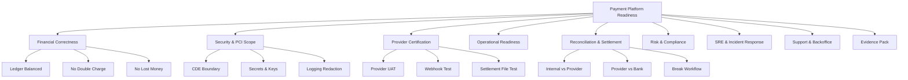
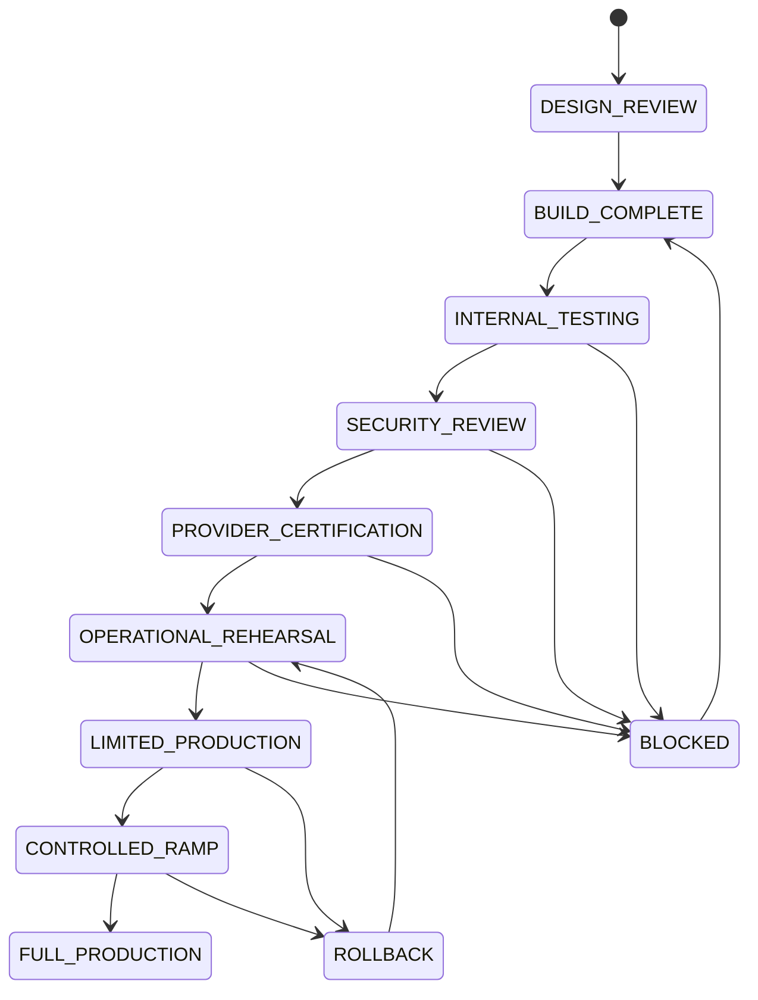
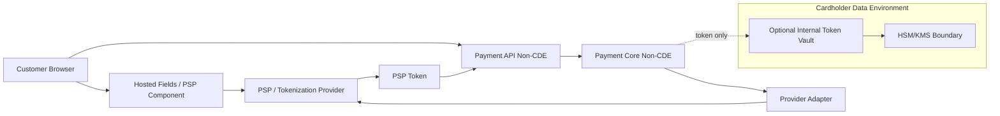
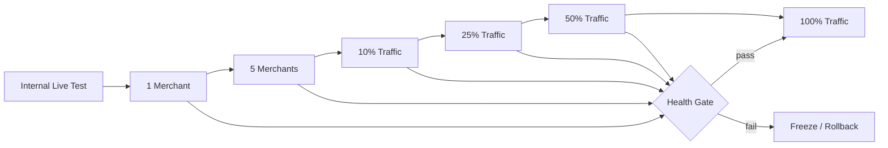

------
title: Build From Scratch: Large Production Grade Java Payment Systems - Part 063
description: Production readiness review, certification evidence, launch gates, and go/no-go decision model for a Java payment platform.
series: learn-java-payment-systems
seriesTitle: Build From Scratch: Large Production Grade Java Payment Systems
order: 63
partTitle: Readiness Review and Certification
tags:
- java
- payments
- payment-systems
- fintech
- pci-dss
- readiness-review
- certification
- sre
- compliance
- enterprise-architecture
date: 2026-07-02
---

# Part 063 — Readiness Review and Certification

Payment system yang sudah selesai dibangun belum otomatis boleh live.

Di sistem biasa, readiness sering berarti:

> service bisa deploy, endpoint bisa dipanggil, test hijau, dashboard ada.

Di payment system, readiness berarti jauh lebih keras:

> sistem boleh menyentuh uang nyata, menghasilkan kewajiban finansial nyata, menerima audit, bertahan ketika provider tidak konsisten, dan masih bisa menjelaskan setiap rupiah/dollar/cent yang bergerak.

Part ini membahas **readiness review** sebagai launch gate terakhir sebelum production. Ini bukan checklist dekoratif. Ini adalah mekanisme untuk menjawab pertanyaan:

1. Apakah sistem benar secara finansial?
2. Apakah sistem aman secara data dan credential?
3. Apakah sistem bisa dioperasikan ketika ada unknown state?
4. Apakah sistem punya evidence cukup untuk audit, dispute, reconciliation, incident, dan regulator?
5. Apakah tim tahu apa yang harus dilakukan ketika uang nyangkut?

Kita tidak sedang membuat demo payment gateway. Kita sedang membuat platform yang harus bisa dipertanggungjawabkan.

---

## 1. Mental Model: Readiness Bukan Satu Checklist

Readiness payment platform punya beberapa dimensi paralel.



Kesalahan paling umum adalah menganggap readiness sebagai status tunggal:

```text
READY = true
```

Padahal readiness harus diperlakukan sebagai **multi-domain decision**:

```text
READY_FOR_SANDBOX_CERTIFICATION
READY_FOR_LIMITED_INTERNAL_PRODUCTION
READY_FOR_PILOT_MERCHANT
READY_FOR_PUBLIC_MERCHANT
READY_FOR_HIGH_VALUE_PAYMENT
READY_FOR_AUTOMATED_SETTLEMENT
READY_FOR_AUTOMATED_PAYOUT
```

Sistem bisa siap menerima payment kecil di pilot, tetapi belum siap automatic payout. Sistem bisa siap card authorization, tetapi belum siap partial refund. Sistem bisa siap API, tetapi belum siap dispute operations.

---

## 2. Readiness State Machine

Gunakan state machine eksplisit untuk platform capability.



Setiap transition harus punya evidence.

Contoh:

| Transition | Evidence wajib |
|---|---|
| `BUILD_COMPLETE -> INTERNAL_TESTING` | test matrix, schema migration proof, local simulator pass |
| `INTERNAL_TESTING -> SECURITY_REVIEW` | threat model, data classification, secret inventory |
| `SECURITY_REVIEW -> PROVIDER_CERTIFICATION` | PCI scope memo, logging redaction proof, key rotation test |
| `PROVIDER_CERTIFICATION -> OPERATIONAL_REHEARSAL` | provider UAT result, webhook replay proof, settlement report sample |
| `OPERATIONAL_REHEARSAL -> LIMITED_PRODUCTION` | runbook drill, incident drill, reconciliation drill, support script |
| `LIMITED_PRODUCTION -> CONTROLLED_RAMP` | pilot metrics, zero unresolved critical break, payout validation |

---

## 3. Readiness Object

Jangan simpan readiness sebagai spreadsheet manual saja. Representasikan readiness sebagai object yang bisa diaudit.

```java
public record ReadinessDecision(
    String capability,
    ReadinessStage stage,
    Decision decision,
    String decidedBy,
    Instant decidedAt,
    List<EvidenceRef> evidence,
    List<RiskAcceptance> acceptedRisks,
    List<LaunchCondition> conditions
) {}

public enum ReadinessStage {
    DESIGN_REVIEW,
    BUILD_COMPLETE,
    INTERNAL_TESTING,
    SECURITY_REVIEW,
    PROVIDER_CERTIFICATION,
    OPERATIONAL_REHEARSAL,
    LIMITED_PRODUCTION,
    CONTROLLED_RAMP,
    FULL_PRODUCTION
}

public enum Decision {
    APPROVED,
    APPROVED_WITH_CONDITIONS,
    REJECTED,
    DEFERRED
}
```

Kenapa ini penting?

Karena saat terjadi incident 3 bulan setelah launch, pertanyaan yang muncul bukan hanya:

> bug-nya di mana?

Tetapi:

> siapa yang menyetujui capability ini live, berdasarkan evidence apa, dengan risiko apa yang sudah diterima?

Readiness adalah bagian dari audit trail.

---

## 4. Capability-Based Readiness

Payment platform tidak boleh launch sebagai satu unit monolitik capability.

Pisahkan readiness per capability:

```text
card.payment.authorization
card.payment.capture
authentication.3ds.challenge
authentication.3ds.frictionless
refund.full
refund.partial
refund.async
bank_transfer.virtual_account.collection
wallet.topup
wallet.spend
merchant.settlement.batch
merchant.payout.automatic
dispute.chargeback.intake
backoffice.manual_adjustment
backoffice.webhook_replay
backoffice.break_glass
```

Setiap capability punya risiko berbeda.

Contoh:

| Capability | Risiko utama | Launch strategy |
|---|---|---|
| card authorization | double charge, unknown state | pilot merchant, low amount limit |
| automatic capture | capture after auth expiry | strict auth window validation |
| partial refund | over-refund | ledger refundable balance invariant |
| automatic payout | sending money to wrong beneficiary | maker-checker initially, then automate |
| manual adjustment | internal fraud/operator error | high-risk approval policy |
| webhook replay | duplicate state transition | idempotent inbox + permission gate |
| dispute representment | missed deadline/legal loss | deadline engine + ops SLA |

---

## 5. Financial Correctness Review

Ini review paling penting.

Sistem yang cepat tapi salah secara ledger adalah sistem gagal.

### 5.1 Ledger Invariants

Minimal invariant:

```text
For every posted journal:
  sum(debit) == sum(credit)
  currency is single or explicitly FX-balanced
  journal is immutable after posting
  reversal is separate journal
  source_operation_id is idempotent
```

SQL check yang harus ada:

```sql
-- journal cannot be posted twice by same source operation
CREATE UNIQUE INDEX uq_ledger_journal_source_operation
ON ledger_journal(source_type, source_id, posting_rule_code)
WHERE status = 'POSTED';

-- entry amount cannot be zero
ALTER TABLE ledger_entry
ADD CONSTRAINT chk_ledger_entry_non_zero
CHECK (amount_minor <> 0);

-- account currency must match posting currency unless account is multi-currency enabled
-- enforced by posting service and periodic integrity job.
```

Integrity job wajib:

```sql
SELECT journal_id, currency, SUM(amount_minor) AS total
FROM ledger_entry
GROUP BY journal_id, currency
HAVING SUM(amount_minor) <> 0;
```

Hasil query harus selalu kosong untuk single-currency journal.

### 5.2 Payment Invariants

Checklist:

| Invariant | Bukti |
|---|---|
| no double charge | idempotency test + provider operation uniqueness |
| no over-capture | state machine test + DB constraint/service invariant |
| no over-refund | refundable balance projection + concurrency test |
| unknown is not failed | timeout scenario + recovery workflow |
| provider success posts ledger once | webhook duplicate test |
| capture and cancel cannot both win | concurrency test |
| settlement cannot include unreconciled blocked transaction | settlement eligibility test |
| payout cannot exceed available balance | reservation test |
| manual adjustment must be balanced | maker-checker + ledger rule test |

### 5.3 Property-Based Financial Tests

Contoh property:

```java
@Property
void totalPlatformMoneyIsConserved(@ForAll("paymentScenarios") PaymentScenario scenario) {
    var result = testHarness.run(scenario);

    assertThat(result.ledger().unbalancedJournals()).isEmpty();
    assertThat(result.ledger().negativeLiabilityWithoutPolicy()).isEmpty();
    assertThat(result.payment().doubleCharges()).isEmpty();
    assertThat(result.payment().overRefunds()).isEmpty();
}
```

Property test lebih cocok untuk payment daripada test example-only, karena bug payment sering muncul dari kombinasi event:

```text
confirm timeout
+ webhook success delayed
+ client retry
+ duplicate webhook
+ partial refund
+ settlement file late
```

---

## 6. Provider Certification Review

Provider certification biasanya bukan sekadar "API key sudah bisa dipakai".

Yang harus dibuktikan:

1. API request format benar.
2. Idempotency key diterima/dipakai sesuai kontrak provider.
3. Timeout dan unknown outcome ditangani.
4. Webhook signature diverifikasi.
5. Duplicate webhook aman.
6. Out-of-order webhook aman.
7. Refund/cancel/reversal semantics benar.
8. Settlement report bisa diparse.
9. Reconciliation bisa mencocokkan transaksi.
10. Error code provider ternormalisasi.

### 6.1 Certification Matrix

| Scenario | Expected platform behavior |
|---|---|
| authorization approved | payment becomes authorized/captured according to flow |
| authorization declined hard | no retry, customer gets actionable decline |
| authorization timeout but later success | state remains unknown until evidence arrives |
| duplicate confirm request | same logical result returned |
| duplicate webhook | no duplicate ledger posting |
| webhook invalid signature | stored as rejected evidence, not applied |
| capture after auth expired | rejected before provider call if known |
| refund greater than captured | rejected by platform invariant |
| provider sends unknown code | normalized to `PROVIDER_UNMAPPED`, triggers review |
| settlement report amount mismatch | reconciliation break created |

### 6.2 Provider Operation Evidence

Setiap external operation harus punya record.

```sql
CREATE TABLE provider_operation_log (
    operation_id UUID PRIMARY KEY,
    provider_code TEXT NOT NULL,
    operation_type TEXT NOT NULL,
    aggregate_type TEXT NOT NULL,
    aggregate_id UUID NOT NULL,
    idempotency_key TEXT NOT NULL,
    request_fingerprint TEXT NOT NULL,
    provider_reference TEXT,
    normalized_status TEXT NOT NULL,
    raw_status TEXT,
    raw_error_code TEXT,
    request_payload_ref TEXT NOT NULL,
    response_payload_ref TEXT,
    started_at TIMESTAMPTZ NOT NULL,
    completed_at TIMESTAMPTZ,
    created_at TIMESTAMPTZ NOT NULL DEFAULT now(),
    UNIQUE(provider_code, operation_type, idempotency_key)
);
```

Jangan hanya log ke stdout. Operation log adalah evidence.

---

## 7. Security and PCI Scope Review

PCI readiness harus menjawab:

1. Apakah platform menyimpan, memproses, atau mentransmisikan cardholder data?
2. Service mana yang masuk Cardholder Data Environment?
3. Data apa yang boleh masuk log, trace, event, DB, data lake, support tool?
4. Apakah PAN/CVC/SAD pernah keluar dari boundary yang diizinkan?
5. Apakah token vault tersegmentasi?
6. Apakah access ke CDE memakai least privilege dan MFA?
7. Apakah evidence audit bisa diambil tanpa membuka data sensitif?

### 7.1 CDE Data Flow Diagram



Idealnya, platform tidak pernah melihat PAN/CVC. Jika harus, scope berubah drastis.

### 7.2 Security Evidence

Minimal evidence pack:

| Area | Evidence |
|---|---|
| data classification | list field sensitif per event/table/API |
| log redaction | automated test yang membuktikan PAN/CVC tidak keluar |
| secret management | inventory secret + rotation proof |
| key management | key owner, purpose, rotation, access policy |
| vulnerability management | SAST/DAST/dependency scan result |
| access control | role matrix + privileged access review |
| network segmentation | diagram + firewall/security group rule |
| incident response | tabletop result + runbook |
| secure SDLC | change approval + code review evidence |

---

## 8. Reconciliation and Settlement Readiness

Payment bisa live hanya jika ada cara untuk membuktikan uangnya benar.

### 8.1 Reconciliation Readiness Checklist

| Capability | Required before live? | Reason |
|---|---:|---|
| provider report ingestion | yes | compare provider truth |
| bank statement ingestion | yes for settlement/payout | confirm cash movement |
| matching engine | yes | detect break |
| manual break workflow | yes | unmatched records will happen |
| correction posting | yes | repair must be controlled |
| dashboard | yes | ops must see unreconciled exposure |
| SLA alert | yes | breaks cannot rot silently |

### 8.2 Settlement Readiness Checklist

| Capability | Required before automatic payout? |
|---|---:|
| settlement batch generation | yes |
| cutoff calendar | yes |
| fee/reserve/netting rule | yes |
| negative balance policy | yes |
| payout eligibility gate | yes |
| payout approval / risk hold | yes |
| merchant statement | yes |
| failed payout handling | yes |
| reconciliation gate | yes |

Payout tanpa reconciliation adalah cara cepat menciptakan financial loss yang sulit ditemukan.

---

## 9. Operational Readiness Review

Pertanyaan operational readiness:

1. Jika webhook hilang, siapa yang tahu?
2. Jika provider timeout tapi uang berhasil terdebit, sistem melakukan apa?
3. Jika merchant komplain settlement kurang, support melihat apa?
4. Jika operator salah melakukan manual adjustment, bagaimana reversal-nya?
5. Jika reconciliation break muncul 5000 item, bagaimana triage-nya?
6. Jika payout salah beneficiary, apa emergency procedure-nya?

### 9.1 Runbook Minimum

Runbook wajib:

```text
RUNBOOK-001 unknown payment state
RUNBOOK-002 duplicate charge complaint
RUNBOOK-003 missing webhook
RUNBOOK-004 provider outage
RUNBOOK-005 settlement mismatch
RUNBOOK-006 payout failed
RUNBOOK-007 payout sent wrong beneficiary
RUNBOOK-008 reconciliation break spike
RUNBOOK-009 manual adjustment correction
RUNBOOK-010 card data leakage suspicion
RUNBOOK-011 secret/key compromise
RUNBOOK-012 database migration rollback/compensation
```

### 9.2 Drill

Runbook yang tidak pernah dilatih adalah dokumentasi fiksi.

Minimal drill sebelum live:

| Drill | Expected proof |
|---|---|
| provider timeout + later webhook success | no double charge, correct state recovery |
| webhook invalid signature flood | rejected safely, alert works |
| duplicate settlement file | dedupe works |
| reconciliation mismatch | break created, assigned, resolved |
| emergency provider disable | routing stops using provider |
| backoffice manual adjustment | maker-checker + ledger balanced |
| secret rotation | no downtime or controlled downtime |
| payment incident tabletop | role clarity + timeline |

---

## 10. SRE Readiness

SRE readiness bukan hanya CPU/memory dashboard.

Payment-specific SLO:

| SLO | Example |
|---|---|
| authorization availability | 99.9% successful platform handling excluding issuer decline |
| webhook processing latency | p95 provider event applied within 60s |
| unknown state resolution | 99% resolved within 15 minutes |
| reconciliation freshness | provider report reconciled within T+1 cutoff |
| payout execution | eligible payout processed before cutoff |
| ledger integrity | zero unbalanced posted journal |
| duplicate ledger posting | zero |
| critical break age | no critical break older than SLA |

Critical alert examples:

```text
ledger_unbalanced_journal_count > 0
payment_duplicate_charge_detected > 0
webhook_signature_invalid_rate spikes
unknown_payment_state_age_p95 > threshold
settlement_batch_generation_failed
payout_instruction_stuck_after_cutoff
reconciliation_critical_break_count > threshold
provider_success_rate_drop_by_route
```

---

## 11. Compliance Readiness

Compliance readiness bergantung yurisdiksi dan business model, tetapi payment platform umumnya perlu evidence untuk:

1. PCI DSS scope jika terkait kartu.
2. AML/CFT/sanctions screening jika melakukan regulated money movement.
3. KYC/KYB/beneficial ownership jika onboarding merchant.
4. Data protection/privacy.
5. Audit log retention.
6. Incident response.
7. Outsourcing/third-party risk provider.
8. Business continuity/disaster recovery.
9. Operational risk controls.
10. Consumer/merchant dispute handling.

Gunakan compliance sebagai control design, bukan dokumen terpisah dari sistem.

Contoh mapping:

| Compliance need | System control |
|---|---|
| sanctions screening | compliance decision before payout |
| beneficial ownership | KYB entity model + document evidence |
| auditability | immutable audit event + evidence ref |
| least privilege | role-based backoffice action policy |
| incident response | incident timeline + runbook drill |
| data minimization | field-level data classification |
| PCI logging | redaction test + access log |
| operational resilience | DR drill + RTO/RPO evidence |

---

## 12. Readiness Scoring Model

Gunakan scoring untuk komunikasi, tetapi jangan biarkan scoring menggantikan judgement.

```java
public record ReadinessScore(
    String domain,
    int score,
    Severity highestOpenRisk,
    List<String> blockers,
    List<String> acceptedRisks
) {}
```

Contoh domain scoring:

| Domain | Score | Launch meaning |
|---|---:|---|
| Financial correctness | 100 | must be near perfect |
| Security boundary | 95 | no critical open finding |
| Provider certification | 90 | all required scenario pass |
| Reconciliation | 90 | breaks manageable |
| Settlement | 85 | okay for limited pilot if payout manual |
| Operational runbook | 80 | acceptable with limited traffic |
| Observability | 85 | enough to detect critical failure |
| Performance | 75 | okay for pilot, not mass launch |

Hard blockers tidak boleh dikalahkan rata-rata score.

```text
If ledger integrity blocker exists:
  launch = NO

If CDE leakage risk exists:
  launch = NO

If unknown outcome has no recovery path:
  launch = NO

If payout has no reconciliation gate:
  automatic payout = NO
```

---

## 13. Go / No-Go Meeting

Agenda yang efektif:

1. Scope capability yang akan diluncurkan.
2. Traffic/risk limit awal.
3. Review hard blockers.
4. Review accepted risks.
5. Review evidence pack.
6. Review rollback/freeze plan.
7. Review support/ops coverage.
8. Review provider contacts/escalation.
9. Review monitoring dashboard.
10. Explicit decision.

Decision harus tertulis:

```md
# Launch Decision

Capability: card.payment.authorization_capture
Launch stage: LIMITED_PRODUCTION
Merchant scope: 5 pilot merchants
Amount limit: IDR 1,000,000 per transaction
Daily volume limit: 500 transactions
Automatic payout: disabled
Manual settlement review: enabled
Decision: APPROVED_WITH_CONDITIONS
Approver: Head of Engineering, Risk Lead, Finance Ops Lead, Security Lead
Conditions:
- Reconciliation must be reviewed daily at 09:00 Asia/Jakarta.
- Unknown payments older than 30 minutes must page L2.
- Any duplicate charge complaint freezes ramp.
Accepted risks:
- Provider settlement report arrives T+1 only.
- Payout remains manual during pilot.
```

---

## 14. Limited Production Ramp

Jangan langsung full traffic.



Ramp gate example:

| Gate | Condition |
|---|---|
| duplicate charge | zero |
| unbalanced ledger | zero |
| unknown older than SLA | zero critical |
| reconciliation break | below threshold and explained |
| provider error rate | within baseline |
| support complaint | below threshold |
| settlement validation | passed |

---

## 15. Certification Is Not The End

Provider certification, PCI assessment, internal readiness, dan security review hanya membuktikan kondisi pada titik waktu tertentu.

Production readiness harus hidup terus:

```text
every deploy
+ every provider change
+ every new payment method
+ every new country/currency
+ every new backoffice action
+ every new risk policy
+ every database migration
+ every settlement rule change
= readiness impact assessment
```

Jangan pernah menganggap payment system "sudah certified jadi aman".

Certification adalah snapshot. Payment platform adalah organisme hidup.

---

## 16. Final Readiness Checklist

Sebelum Part 064 capstone, sistem minimum harus punya:

- Payment lifecycle state machine.
- Idempotency store.
- Provider operation log.
- Webhook inbox.
- Transactional outbox.
- Double-entry ledger.
- Ledger integrity job.
- Reconciliation ingestion.
- Matching engine.
- Settlement batch.
- Payout control.
- Backoffice controlled action.
- Audit trail.
- Risk decision store.
- Compliance decision where needed.
- PCI scope diagram where relevant.
- Secret/key inventory.
- Observability dashboard.
- Incident runbooks.
- Provider simulator.
- Load test result.
- Property-based invariant tests.
- Go/no-go evidence pack.

Jika salah satu dari berikut belum ada, jangan full production:

```text
No ledger integrity proof
No idempotency proof
No unknown-state recovery
No webhook replay/dedupe
No reconciliation workflow
No settlement explainability
No payout control
No audit trail
No incident runbook
No security boundary
```

---

## 17. Sources and Further Reading

- PCI Security Standards Council — PCI DSS Document Library: https://www.pcisecuritystandards.org/document_library/
- PCI Security Standards Council — PCI DSS Overview: https://www.pcisecuritystandards.org/standards/pci-dss/
- OWASP ASVS: https://owasp.org/www-project-application-security-verification-standard/
- NIST Cybersecurity Framework 2.0: https://www.nist.gov/cyberframework
- NIST SP 800-53 Rev. 5: https://csrc.nist.gov/pubs/sp/800/53/r5/upd1/final
- NIST SP 800-61 Rev. 2 Computer Security Incident Handling Guide: https://csrc.nist.gov/pubs/sp/800/61/r2/final
- Stripe Webhooks: https://docs.stripe.com/webhooks
- Stripe Idempotent Requests: https://docs.stripe.com/api/idempotent_requests
- Adyen Webhooks: https://docs.adyen.com/development-resources/webhooks
- Adyen Settlement Reconciliation: https://docs.adyen.com/reporting/settlement-reconciliation
- Martin Fowler — Accounting Transaction: https://martinfowler.com/eaaDev/AccountingTransaction.html
