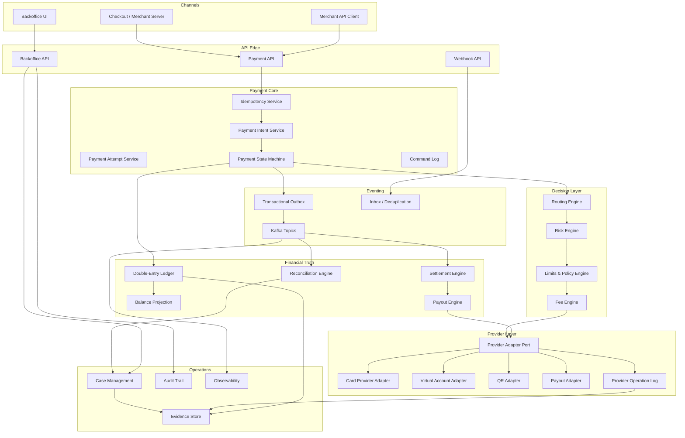
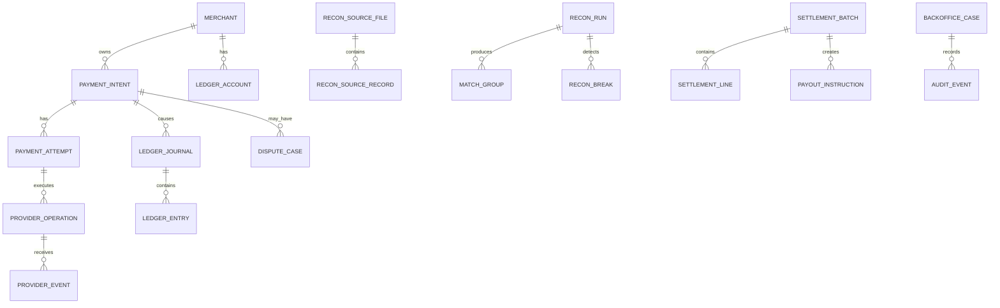
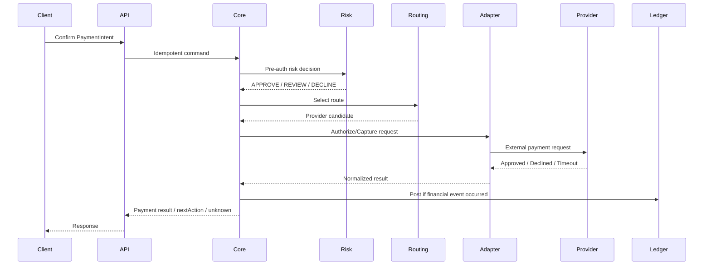
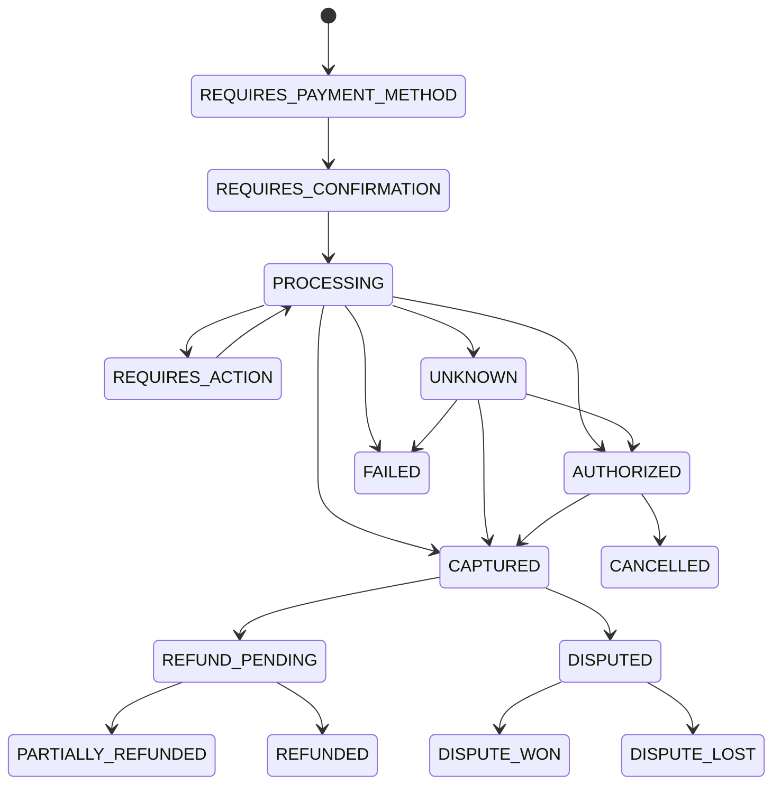
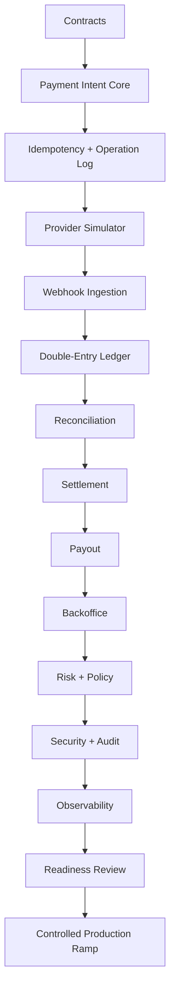

------
title: Build From Scratch: Large Production Grade Java Payment Systems - Part 064
description: Final capstone architecture review for building a large production-grade Java payment system from intent to settlement.
series: learn-java-payment-systems
seriesTitle: Build From Scratch: Large Production Grade Java Payment Systems
order: 64
partTitle: Final Capstone and Last Part
tags:
- java
- payments
- payment-systems
- fintech
- ledger
- reconciliation
- settlement
- capstone
- enterprise-architecture
- final-part
date: 2026-07-02
---

# Part 064 — Final Capstone and Last Part

Ini adalah bagian terakhir dari seri **Build From Scratch: Large Production Grade Java Payment Systems**.

Tujuan part ini bukan memperkenalkan konsep baru, tetapi menyatukan semua konsep sebelumnya menjadi satu capstone:

> desain, bangun, review, dan siapkan production-grade Java payment platform yang bisa menerima payment, menjaga ledger, menghadapi unknown state, melakukan reconciliation, menghasilkan settlement, dan menyediakan operational control yang defensible.

Payment system yang baik tidak dinilai dari seberapa banyak endpoint-nya. Ia dinilai dari seberapa kuat ia menjaga invariant ketika dunia nyata kacau.

Dunia nyata itu seperti ini:

```text
client retry
provider timeout
webhook datang terlambat
webhook duplicate
issuer decline ambigu
settlement report T+1
bank statement beda format
merchant komplain payout
operator butuh manual correction
security minta evidence
finance minta angka yang bisa diaudit
risk minta hold
customer minta refund
```

Jika arsitektur tetap benar di bawah kondisi tersebut, barulah sistem layak disebut payment platform.

---

## 1. Capstone Problem Statement

Bangun platform bernama:

```text
AstraPay Core
```

Scope awal:

1. Merchant dapat membuat `PaymentIntent`.
2. Customer dapat membayar dengan card, virtual account, QR, atau wallet.
3. Card flow mendukung authorization/capture/refund.
4. Bank transfer/VA dan QR mendukung async confirmation.
5. Provider webhook diproses aman.
6. Semua money movement diposting ke double-entry ledger.
7. Provider report dan bank statement dapat direconcile.
8. Settlement batch menghitung merchant payable.
9. Payout dapat dibuat dengan approval dan balance reservation.
10. Backoffice dapat menangani unknown state, manual adjustment, dispute, dan reconciliation break.
11. Audit trail dapat menjelaskan siapa melakukan apa, kapan, kenapa, dan efek finansialnya.

Non-goal awal:

1. Menjadi card network switch penuh.
2. Menyimpan PAN/CVC sendiri jika tidak perlu.
3. Menjadi bank core system.
4. Menjadi general accounting ERP.
5. Menggunakan ML fraud kompleks sebelum rule/risk workflow matang.

---

## 2. Final Architecture



Kunci mental model:

```text
API receives intent.
Provider executes external operation.
Webhook/report/bank statement provides evidence.
State machine decides legal transition.
Ledger records financial truth.
Reconciliation detects disagreement.
Settlement transforms settled truth into merchant payable.
Payout executes outbound money movement.
Backoffice repairs exceptional cases with controls.
Audit explains everything.
```

---

## 3. Service Boundaries

### 3.1 Payment API Service

Tanggung jawab:

- expose public merchant/customer API;
- validate request contract;
- enforce idempotency;
- create payment intent;
- confirm payment;
- return next action;
- never directly mutate ledger without core command.

Tidak boleh:

- menyimpan provider-specific logic terlalu dalam;
- mengambil keputusan settlement;
- menganggap HTTP success berarti uang sukses;
- mengubah status payment tanpa state machine.

### 3.2 Payment Core Service

Tanggung jawab:

- aggregate payment intent/attempt;
- lifecycle state machine;
- command log;
- operation orchestration;
- state transition idempotency;
- domain event generation.

Ini adalah pusat business correctness.

### 3.3 Provider Adapter Service

Tanggung jawab:

- anti-corruption layer;
- request/response mapping;
- provider idempotency;
- raw evidence storage;
- status normalization;
- webhook signature verification;
- operation log.

Tidak boleh:

- memutuskan financial truth sendiri;
- posting ledger langsung tanpa command rule;
- menelan provider error tanpa normalized taxonomy.

### 3.4 Ledger Service

Tanggung jawab:

- chart of accounts;
- posting rules;
- journal validation;
- immutable entries;
- reversal/correction;
- balance projection;
- integrity checks.

Ledger adalah financial truth, tetapi bukan tempat semua workflow domain.

### 3.5 Reconciliation Service

Tanggung jawab:

- ingest provider report;
- ingest bank statement;
- normalize source records;
- match internal vs external;
- create reconciliation break;
- propose correction;
- provide explainability.

### 3.6 Settlement Service

Tanggung jawab:

- cutoff;
- eligibility;
- fee/reserve/netting;
- settlement batch;
- merchant statement;
- payout instruction basis.

### 3.7 Payout Service

Tanggung jawab:

- beneficiary;
- approval;
- available balance reservation;
- payout execution;
- unknown payout state recovery;
- payout reconciliation.

---

## 4. Canonical Data Model

Minimal aggregate:

```text
Merchant
MerchantCapability
MerchantBalanceAccount
PaymentIntent
PaymentAttempt
ProviderOperation
ProviderEvent
LedgerAccount
LedgerJournal
LedgerEntry
BalanceProjection
ReconciliationSourceFile
ReconciliationSourceRecord
ReconciliationRun
MatchGroup
ReconciliationBreak
SettlementBatch
SettlementLine
PayoutInstruction
DisputeCase
AuditEvent
EvidenceObject
BackofficeCase
RiskDecision
PolicyDecision
```

Entity relationship high-level:



---

## 5. End-to-End Flow: Card Payment

### 5.1 Create Intent

```http
POST /v1/payment-intents
Idempotency-Key: merchant-123-order-789-create

{
  "merchantId": "m_123",
  "orderId": "ord_789",
  "amount": { "currency": "IDR", "minor": 12500000 },
  "captureMethod": "AUTOMATIC",
  "allowedMethods": ["CARD"]
}
```

Platform creates:

```text
payment_intent: REQUIRES_PAYMENT_METHOD
command_log: CREATE_INTENT accepted
ledger: no posting yet
```

No money moved yet.

### 5.2 Confirm Intent

```http
POST /v1/payment-intents/pi_123/confirm
Idempotency-Key: merchant-123-order-789-confirm-1

{
  "paymentMethodToken": "tok_card_xxx",
  "returnUrl": "https://merchant.example/return"
}
```

Flow:



### 5.3 Unknown Outcome

Jika provider timeout:

```text
payment_attempt = UNKNOWN
provider_operation = UNKNOWN_TIMEOUT
ledger = no final posting unless evidence says money moved
fulfillment = blocked or risk-dependent
recovery = inquiry + webhook + reconciliation
```

Jangan ubah menjadi failed.

### 5.4 Webhook Success Later

Webhook masuk:

```text
verify signature
store raw event
dedupe event
correlate provider reference
apply monotonic state transition
post ledger idempotently
publish domain event
```

Duplicate webhook harus menghasilkan:

```text
state unchanged
ledger unchanged
audit event records duplicate ignored
```

---

## 6. Ledger Posting Example

Card payment captured IDR 125,000.00 dengan fee platform IDR 3,000.00.

Gunakan minor unit:

```text
gross = 12,500,000 minor
fee   =    300,000 minor
net   = 12,200,000 minor
```

Posting saat capture/settled tergantung model. Untuk simplified capstone:

```text
Dr Provider Clearing Receivable      12,500,000
Cr Merchant Pending Payable          12,200,000
Cr Platform Fee Revenue Pending         300,000
```

Saat provider settle ke bank:

```text
Dr Cash at Bank                      12,500,000
Cr Provider Clearing Receivable      12,500,000
```

Saat merchant payout:

```text
Dr Merchant Settled Payable          12,200,000
Cr Cash at Bank                      12,200,000
```

Invariant:

```text
Every journal sums to zero by currency.
Every payout must be funded by available settled payable.
Every fee must be traceable to pricing plan version.
Every settlement line must be traceable to ledger journal and provider evidence.
```

---

## 7. State Machine Summary



Rules:

```text
FAILED cannot transition to CAPTURED unless failure was local-only and provider evidence proves success.
UNKNOWN must be resolved by evidence, not assumption.
CAPTURED cannot be cancelled; it can only be refunded/reversed/disputed depending rail.
REFUND cannot exceed captured minus already refunded minus disputed policy hold.
DISPUTE_LOST must post financial effect.
```

---

## 8. Testing the Capstone

Minimum test suite:

### 8.1 State Machine Tests

```text
confirm approved -> captured
confirm declined -> failed
confirm timeout -> unknown
unknown + webhook success -> captured
unknown + inquiry failed -> failed
captured + duplicate webhook -> captured unchanged
captured + refund full -> refunded
captured + refund partial twice -> partially_refunded/refunded
```

### 8.2 Ledger Property Tests

```text
all posted journals balanced
no over-refund
no payout beyond available balance
no duplicate posting for same source operation
manual adjustment must be balanced
reversal references original journal
```

### 8.3 Concurrency Tests

```text
same confirm key from 20 threads
same payment with different confirm key from 20 threads
capture vs cancel race
refund race
webhook vs polling race
payout worker race
settlement batch generation race
```

### 8.4 Provider Simulator Scenarios

```text
approved immediate
hard decline
soft decline
timeout then webhook success
timeout then webhook failure
duplicate webhook
out-of-order webhook
settlement file missing transaction
settlement file duplicate transaction
amount mismatch
provider returns unmapped error code
```

### 8.5 Operational Drill

```text
unknown payment recovery
duplicate charge complaint
settlement mismatch
payout failure
fraud hold release
manual adjustment reversal
secret rotation
provider outage
```

---

## 9. Production Cutover Plan

A sane launch plan:

```text
Phase 0: internal live test, manual payout only
Phase 1: 1 pilot merchant, low amount limit
Phase 2: 5 pilot merchants, daily reconciliation review
Phase 3: controlled routing percentage
Phase 4: automatic settlement batch, manual payout approval
Phase 5: automatic payout for low-risk merchants
Phase 6: broader merchant rollout
```

At every phase:

```text
ledger integrity = zero failures
duplicate charge = zero
unknown older than SLA = zero critical
critical reconciliation break = explained or blocked
settlement report = reviewed
support complaint = triaged
provider error = within threshold
```

---

## 10. Final Design Review Questions

A senior/staff/principal engineer should be able to answer these without hand-waving.

### 10.1 Money Correctness

1. Where is financial truth?
2. Can the system create money accidentally?
3. Can the system lose money silently?
4. Can the system double charge?
5. Can two workers payout the same balance?
6. Can refund exceed captured amount?
7. Can settlement include transaction that is not settled externally?
8. Can manual adjustment break ledger balance?
9. How do you reverse a wrong posting?
10. How do you rebuild balance projection?

### 10.2 Failure Semantics

1. What happens when provider times out?
2. What happens when webhook arrives before API response?
3. What happens when webhook arrives twice?
4. What happens when webhook arrives after local failed state?
5. What happens when settlement report disagrees?
6. What happens when bank statement misses expected payout?
7. What happens when Kafka is down?
8. What happens when outbox relay is stuck?
9. What happens when reconciliation parser bug is found?
10. What happens when operator performs wrong action?

### 10.3 Security and Compliance

1. Do we touch PAN/CVC?
2. Which services are in CDE?
3. Which logs could leak sensitive data?
4. How are secrets rotated?
5. Who can view tokens or sensitive references?
6. How are webhook signatures verified?
7. How is replay prevented?
8. What audit evidence exists for privileged action?
9. What is the incident process for suspected data leakage?
10. Which controls are automated vs manual?

### 10.4 Operations

1. Can support explain payment status to merchant?
2. Can finance explain settlement amount?
3. Can ops resolve unknown payment?
4. Can risk hold payout?
5. Can compliance freeze merchant capability?
6. Can backoffice replay webhook safely?
7. Can manual correction be approved and reversed?
8. Can incident commander reconstruct timeline?
9. Are dashboards business-useful or only CPU graphs?
10. Is there a runbook for every critical alert?

---

## 11. Anti-Patterns to Reject

Reject these designs:

### 11.1 `payments.status = SUCCESS` as Truth

A status column is not financial truth. Ledger + evidence + reconciliation is truth.

### 11.2 One Table Balance

```sql
UPDATE wallet SET balance = balance - ?
```

without journal, reservation, idempotency, and integrity checks is not payment-grade.

### 11.3 Treat Timeout as Failure

Timeout means platform does not know. Provider may have succeeded.

### 11.4 Webhook Directly Mutates Everything

Webhook must be ingested, verified, deduped, correlated, then applied by domain state machine.

### 11.5 Manual Admin Superpower

Backoffice action without maker-checker, audit, reason, evidence, and ledger invariant is operational risk.

### 11.6 Settlement Without Reconciliation

If you pay merchants before knowing what settled, you are lending money accidentally.

### 11.7 Provider Adapter Leaks Everywhere

Provider-specific statuses must not contaminate core domain. Normalize at boundary.

### 11.8 Event Bus as Financial Truth

Kafka is transport/history, not financial book of record. Ledger is financial truth.

### 11.9 Logs as Audit Trail

Application logs are not enough. Audit events need actor, action, reason, target, before/after, evidence, and immutability strategy.

### 11.10 Certification Without Runtime Control

A system can pass certification and still fail in production if observability, runbooks, and reconciliation are weak.

---

## 12. What Top Engineers Internalize

Top payment engineers do not merely know provider APIs. They internalize these invariants:

```text
Money movement is evidence-driven.
Every external call may have unknown outcome.
Every retry must be idempotent.
Every state transition must be legal and monotonic.
Every financial effect must be posted once.
Every correction must be another financial event.
Every balance must be explainable.
Every payout must be funded.
Every manual action must be controlled.
Every provider truth must be reconciled.
Every audit question must be answerable.
```

They also know that payment systems are not purely technical systems.

They sit at the intersection of:

```text
distributed systems
financial accounting
security
risk
compliance
operations
human workflow
provider ecosystem
regulatory defensibility
```

The hard part is not writing Java code. The hard part is choosing the right invariant and making the code unable to violate it silently.

---

## 13. Suggested Repository Structure

```text
astra-pay-core/
  contracts/
    openapi/
    asyncapi/
    schemas/
  services/
    payment-api/
    payment-core/
    provider-adapter/
    webhook-ingestion/
    ledger/
    reconciliation/
    settlement/
    payout/
    risk-policy/
    backoffice/
  libraries/
    money/
    idempotency/
    state-machine/
    audit/
    crypto/
    test-fixtures/
  simulator/
    provider-simulator/
    settlement-file-generator/
  ops/
    dashboards/
    alerts/
    runbooks/
    readiness/
  database/
    migrations/
    seed/
  docs/
    architecture/
    threat-model/
    pci-scope/
    readiness-review/
```

Keep shared libraries small. Shared domain logic is useful; shared mutable infrastructure abstractions often become coupling traps.

---

## 14. Final Build Milestones



Do not start with all payment methods. Start with one vertical slice, but make that slice production-shaped.

Bad vertical slice:

```text
POST /pay -> call provider -> status success
```

Good vertical slice:

```text
PaymentIntent
+ idempotency
+ provider operation log
+ webhook inbox
+ state machine
+ ledger posting
+ reconciliation sample
+ settlement line
+ audit timeline
+ simulator scenarios
+ runbook
```

---

## 15. Graduation Exercise

Untuk menguji pemahaman, desain dan implementasikan minimum platform berikut:

### Feature Scope

1. Create payment intent.
2. Confirm card payment via simulator.
3. Handle timeout then delayed webhook success.
4. Post double-entry ledger on capture.
5. Generate provider settlement report from simulator.
6. Reconcile internal ledger vs provider report.
7. Create settlement batch for merchant.
8. Reserve available balance for payout.
9. Execute payout via simulator.
10. Handle payout failed then retry.
11. Create manual adjustment with maker-checker.
12. Produce audit timeline for one payment.

### Acceptance Criteria

```text
No duplicate charge under retry.
No duplicate ledger journal under duplicate webhook.
No unbalanced journal.
No payout beyond available balance.
Unknown state resolves by evidence.
Reconciliation detects missing/mismatched transaction.
Settlement batch is reproducible.
Manual adjustment is balanced and auditable.
Provider outage does not corrupt state.
All critical operations have runbook.
```

### Extra Challenge

Add:

```text
partial refund
chargeback lost
risk hold before payout
merchant reserve
provider migration
settlement file parser version migration
active provider routing fallback
```

---

## 16. Where to Go After This Series

Next advanced series candidates:

1. **Build From Scratch: Double-Entry Ledger and Accounting Platform**
   - deeper accounting engine;
   - chart of accounts versioning;
   - subledger to general ledger;
   - close process;
   - revenue recognition;
   - multi-currency accounting.

2. **Build From Scratch: Risk and Fraud Decision Platform**
   - rule engine;
   - velocity;
   - graph features;
   - review workflow;
   - model governance;
   - false-positive economics.

3. **Build From Scratch: Reconciliation and Financial Operations Platform**
   - high-volume matching;
   - parser framework;
   - correction workflow;
   - reporting lineage;
   - break analytics.

4. **Build From Scratch: Regulated Case Management and Compliance Workflow Platform**
   - AML/KYB cases;
   - sanctions hit workflow;
   - evidence management;
   - regulatory reporting;
   - defensible audit.

5. **Build From Scratch: ISO 20022 Payment Rail Adapter**
   - pacs/pain/camt messages;
   - scheme validation;
   - status report;
   - returns;
   - liquidity and settlement.

---

## 17. Final Summary

A production-grade Java payment system is not a payment provider SDK wrapper.

It is a financial control system.

The core architecture is:

```text
Payment Intent
-> Attempt
-> Provider Operation
-> Webhook / Report Evidence
-> State Machine
-> Ledger Posting
-> Reconciliation
-> Settlement
-> Payout
-> Audit / Backoffice / Risk / Compliance
```

The deepest lesson:

> In payment systems, correctness is not a function of one successful API response. Correctness is the ability to preserve financial invariants across retries, timeouts, duplicate events, delayed reports, human operations, and audit scrutiny.

If you can design that, implement it, test it, operate it, and explain it, you are no longer building toy payment integrations. You are building payment infrastructure.

---

## 18. Series Completion

This is the final part.

```text
Series: Build From Scratch: Large Production Grade Java Payment Systems
Total parts: 064
Status: Completed
Last part: Part 064 — Final Capstone and Last Part
```

Seri ini selesai di Part 064.

---

## 19. Sources and Further Reading

- PCI Security Standards Council — PCI DSS Document Library: https://www.pcisecuritystandards.org/document_library/
- EMVCo — EMV 3-D Secure: https://www.emvco.com/emv-technologies/3-d-secure/
- EMVCo — QR Codes: https://www.emvco.com/emv-technologies/qr-codes/
- Swift — ISO 20022 for Financial Institutions: https://www.swift.com/standards/iso-20022
- FedNow — ISO 20022: https://www.frbservices.org/financial-services/fednow/what-is-iso-20022-why-does-it-matter
- Bank Indonesia — SNAP: https://www.bi.go.id/id/layanan/standar/snap/default.aspx
- Bank Indonesia — BI-FAST: https://www.bi.go.id/id/fungsi-utama/sistem-pembayaran/ritel/infrastruktur/default.aspx
- Bank Indonesia — QRIS: https://www.bi.go.id/id/fungsi-utama/sistem-pembayaran/ritel/kanal-layanan/qris/default.aspx
- Stripe — Payment Intents: https://docs.stripe.com/payments/payment-intents
- Stripe — Idempotent Requests: https://docs.stripe.com/api/idempotent_requests
- Stripe — Webhooks: https://docs.stripe.com/webhooks
- Adyen — Webhooks: https://docs.adyen.com/development-resources/webhooks
- Adyen — Settlement Reconciliation: https://docs.adyen.com/reporting/settlement-reconciliation
- Martin Fowler — Accounting Transaction: https://martinfowler.com/eaaDev/AccountingTransaction.html
- OpenTelemetry Documentation: https://opentelemetry.io/docs/
- Google SRE Book: https://sre.google/sre-book/table-of-contents/
