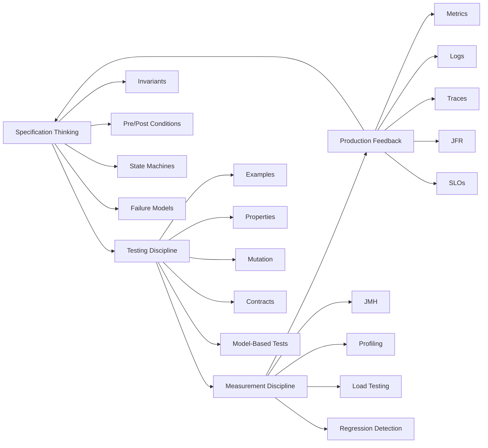
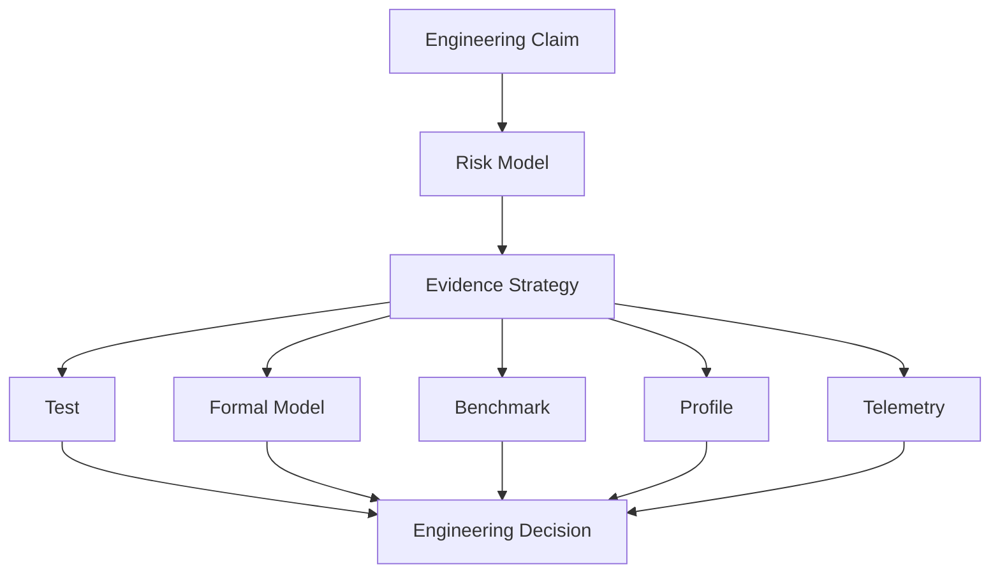
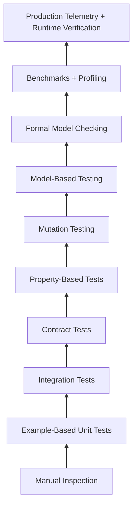
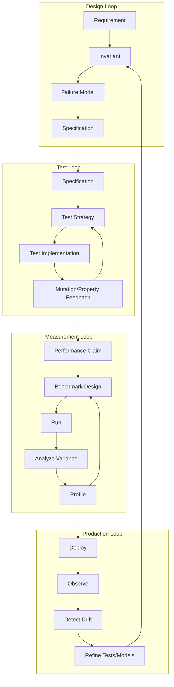

# Part 001 — Correctness & Performance Evidence Map

> Target dari seri ini bukan supaya kamu “punya banyak test”, “pakai JMH”, atau “bisa baca flamegraph”. Targetnya lebih tinggi: kamu mampu membangun sistem Java yang perilakunya bisa dijelaskan, dibatasi, diuji, diukur, diprofiling, dan dioperasikan dengan evidence yang kuat.

Banyak engineer berhenti di level ini:

- “Unit test hijau.”
- “Integration test jalan.”
- “Benchmark lebih cepat.”
- “CPU normal.”
- “Di staging oke.”

Engineer senior yang kuat akan bertanya:

- Properti apa yang sebenarnya sedang dijamin?
- Failure mode apa yang belum disimulasikan?
- Apakah benchmark merepresentasikan workload nyata?
- Apakah test oracle cukup sensitif untuk menangkap bug?
- Apakah performa lokal sama dengan performa production?
- Apakah invariant domain tetap benar ketika retry, concurrency, duplicate event, timeout, dan partial failure terjadi?

Materi ini membangun peta besar sebelum masuk ke teknik spesifik. Tanpa peta ini, testing, formal methods, benchmarking, dan performance engineering akan terasa seperti kumpulan tool terpisah. Dengan peta ini, semuanya menjadi satu sistem evidence.

---

## 1. Skill yang Sedang Kita Bangun

Kita akan membangun empat kemampuan inti.



### 1.1 Specification Thinking

Specification thinking adalah kemampuan menyatakan perilaku sistem secara eksplisit:

- apa yang boleh terjadi,
- apa yang tidak boleh terjadi,
- kapan sesuatu harus terjadi,
- state apa yang valid,
- transisi apa yang legal,
- failure apa yang dapat ditoleransi,
- evidence apa yang membuktikan implementasi mendekati spesifikasi.

Ini bukan berarti semua sistem harus dibuktikan secara matematis. Maksudnya: kamu tidak mengandalkan intuisi kabur.

### 1.2 Testing Discipline

Testing discipline adalah kemampuan memilih test yang tepat untuk risiko yang tepat. Bukan semua hal diuji dengan unit test. Bukan semua hal diuji dengan end-to-end test. Bukan semua hal dimock.

Testing yang baik menjawab pertanyaan tertentu:

- Apakah fungsi kecil ini benar untuk contoh tertentu?
- Apakah property umum ini selalu berlaku?
- Apakah kontrak producer-consumer tidak pecah?
- Apakah state machine menolak transisi ilegal?
- Apakah test suite akan gagal jika bug kecil disisipkan?
- Apakah sistem tetap benar saat event duplicate, retry, reorder, dan timeout?

### 1.3 Measurement Discipline

Measurement discipline adalah kemampuan mengukur tanpa menipu diri sendiri.

Di JVM, ini penting karena performa dipengaruhi oleh:

- warmup,
- tiered compilation,
- JIT profiling,
- escape analysis,
- GC,
- allocation rate,
- CPU cache,
- branch prediction,
- thread scheduling,
- OS noise,
- container limit,
- IO latency,
- workload shape.

Benchmark yang salah lebih berbahaya daripada tidak ada benchmark, karena ia memberi keyakinan palsu.

### 1.4 Production Feedback

Production feedback adalah kemampuan memakai telemetry runtime sebagai evidence:

- apakah invariant runtime dilanggar,
- apakah latency tail meningkat,
- apakah allocation rate berubah,
- apakah retry storm muncul,
- apakah queue length naik,
- apakah GC pause mengganggu SLO,
- apakah deployment baru mengubah error distribution.

Production bukan tempat pertama untuk menemukan kebenaran. Tapi production adalah tempat terakhir yang memvalidasi apakah model kita cukup dekat dengan kenyataan.

---

## 2. Kaufman-Style Deconstruction: Pecah Skill Besar Menjadi Subskill

Dalam pendekatan Josh Kaufman, skill besar harus dipecah menjadi subskill kecil yang bisa dilatih sengaja. Untuk topik ini, kita tidak mulai dari tool. Kita mulai dari kemampuan praktis.

| Subskill | Pertanyaan yang Harus Bisa Kamu Jawab | Output Nyata |
|---|---|---|
| Invariant discovery | Apa yang harus selalu benar? | daftar invariant domain/runtime |
| Failure modeling | Bagaimana sistem bisa salah? | failure model dan mitigation map |
| Test design | Evidence apa yang cukup murah dan kuat? | test matrix |
| Oracle design | Bagaimana test tahu hasilnya benar? | assertion/property/oracle |
| Formal modeling | Bagian mana yang terlalu kompleks untuk dites manual? | TLA+/Alloy/JML/model state |
| Benchmark design | Apa yang ingin diukur dan mengapa? | benchmark hypothesis |
| Workload modeling | Apakah input benchmark realistis? | workload profile |
| Profiling | Di mana waktu/memori habis? | flamegraph/JFR analysis |
| Regression control | Bagaimana mencegah performa turun diam-diam? | CI/perf gate/trend |
| Production validation | Apakah asumsi masih benar di real world? | metrics, alerts, SLO, dashboards |

Subskill ini berurutan secara mental, bukan selalu berurutan secara calendar. Dalam pekerjaan nyata, kamu sering bolak-balik.

---

## 3. Prinsip Utama: Evidence Harus Menjawab Klaim

Kita tidak menulis test karena “best practice”. Kita menulis test karena ada klaim.

Contoh klaim:

> “Endpoint `POST /cases/{id}/assign` idempotent untuk request key yang sama.”

Evidence yang lemah:

- satu unit test happy path,
- satu mock repository,
- assert response 200.

Evidence yang lebih kuat:

- unit test untuk idempotency decision,
- integration test dengan database constraint,
- property-based test untuk duplicate command sequence,
- concurrency test untuk dua request bersamaan,
- contract test untuk response semantics,
- production metric untuk duplicate request handling,
- trace/log correlation untuk request key.

Satu klaim bisa butuh beberapa jenis evidence karena risiko tidak berada di satu layer saja.



### 3.1 Bentuk Klaim Engineering

Klaim yang baik biasanya punya bentuk:

```text
Under <condition>, the system/component must <guarantee>, unless <explicit exception>, measured/verified by <evidence>.
```

Contoh:

```text
Under duplicate submission with the same idempotency key, the command handler must create at most one assignment record, unless the original command failed before persistence, verified by a database-backed concurrency integration test and a property-based command sequence test.
```

Kalimat ini jauh lebih kuat daripada:

```text
Assignment should be idempotent.
```

Karena ia menjelaskan:

- kondisi,
- guarantee,
- exception,
- evidence.

---

## 4. Correctness: Apa Artinya “Benar”?

Correctness bukan satu hal. Dalam sistem Java production, correctness punya banyak dimensi.

### 4.1 Functional Correctness

Functional correctness berarti output sesuai requirement untuk input tertentu.

Contoh:

```text
calculatePenalty(daysLate = 10, base = 1_000_000) returns 50_000.
```

Unit test example-based cocok untuk ini.

Tapi functional correctness sering terlalu sempit. Sistem bisa benar untuk satu input dan salah untuk ribuan variasi.

### 4.2 Domain Correctness

Domain correctness berarti aturan bisnis tidak dilanggar.

Contoh:

- closed case tidak boleh menerima evidence baru,
- approved order tidak boleh dimodifikasi tanpa amendment,
- quote expired tidak boleh dikonversi menjadi order,
- user tidak boleh approve request yang dibuat sendiri,
- workflow tidak boleh lompat dari `DRAFT` ke `CLOSED`.

Domain correctness sering lebih cocok direpresentasikan sebagai invariant dan state machine.

### 4.3 Safety

Safety berarti sesuatu yang buruk tidak pernah terjadi.

Contoh:

- saldo tidak pernah negatif,
- case tidak pernah punya dua active owner,
- order tidak pernah fulfilled sebelum payment authorized,
- event tidak pernah dipublish sebelum transaksi utama commit,
- retry tidak pernah membuat duplicate side effect.

Safety property biasanya bisa diuji dengan invariant checking, property-based testing, model checking, dan database constraint.

### 4.4 Liveness

Liveness berarti sesuatu yang baik pada akhirnya terjadi.

Contoh:

- pending case akhirnya diproses,
- queued job akhirnya dieksekusi,
- lock akhirnya dilepas,
- retry akhirnya berhenti,
- saga akhirnya mencapai terminal state.

Liveness lebih sulit dari safety karena berkaitan dengan waktu, scheduling, fairness, retry, timeout, dan resource availability.

### 4.5 Consistency

Consistency berarti beberapa representasi data tetap selaras.

Contoh:

- read model eventually konsisten dengan event log,
- aggregate status sesuai child records,
- cache tidak menyajikan data stale melewati TTL yang diizinkan,
- search index mencerminkan update setelah pipeline selesai.

Consistency harus dijelaskan dengan batas waktu dan failure semantics. “Eventually consistent” tanpa batas adalah klaim terlalu lemah.

### 4.6 Idempotency

Idempotency berarti pengulangan operasi yang sama tidak mengubah hasil beyond first successful effect.

Contoh:

- duplicate HTTP request tidak membuat duplicate order,
- duplicate Kafka message tidak menjalankan payment dua kali,
- retry command tidak membuat escalation ganda.

Idempotency adalah correctness property, bukan sekadar teknik penyimpanan request key.

### 4.7 Observational Correctness

Observational correctness berarti sistem tampak benar dari perspektif consumer.

Contoh:

- response code sesuai kontrak,
- error message tidak misleading,
- state yang terlihat user tidak kontradiktif,
- metrics dan audit trail konsisten dengan kejadian sebenarnya.

Ini penting untuk sistem regulated atau workflow-heavy. Kadang data internal benar, tetapi audit trail salah; secara operasional sistem tetap bermasalah.

---

## 5. Performance: Apa Artinya “Cepat”?

“Cepat” bukan metrik. Performance engineering memaksa kita menyatakan metrik secara eksplisit.

### 5.1 Latency

Latency adalah durasi satu operasi. Tapi latency harus punya distribusi.

Jangan hanya menulis:

```text
API response must be less than 200 ms.
```

Lebih baik:

```text
For the assignment API under normal production load, p50 <= 80 ms, p95 <= 250 ms, p99 <= 700 ms, excluding downstream outage windows but including database and authorization checks.
```

p50, p95, dan p99 menceritakan hal berbeda:

- p50: pengalaman median,
- p95: pengalaman mayoritas buruk,
- p99: tail behavior,
- max: sering terlalu noisy kecuali untuk forensic.

### 5.2 Throughput

Throughput adalah jumlah pekerjaan per satuan waktu.

Contoh:

- requests per second,
- events per second,
- records per minute,
- batch rows per hour,
- jobs completed per worker per second.

Throughput tanpa latency bisa menipu. Sistem bisa throughput tinggi tetapi p99 buruk.

### 5.3 Utilization

Utilization menjelaskan seberapa banyak resource dipakai:

- CPU,
- memory,
- heap,
- thread pool,
- DB connection pool,
- network bandwidth,
- disk IO,
- queue capacity.

Utilization tinggi tidak selalu buruk. Yang buruk adalah utilization tinggi yang disertai saturation dan queue growth.

### 5.4 Saturation

Saturation adalah kondisi ketika demand melebihi kemampuan resource. Tanda-tandanya:

- queue length naik,
- thread menunggu,
- connection pool exhausted,
- GC makin sering,
- CPU run queue panjang,
- retry meningkat,
- timeout meningkat.

Saturation sering muncul sebelum sistem benar-benar crash.

### 5.5 Efficiency

Efficiency adalah jumlah resource untuk satu unit kerja.

Contoh:

- bytes allocated per request,
- CPU ms per request,
- DB round-trip per command,
- network calls per transaction,
- locks acquired per operation.

Efficiency penting karena sistem production biasanya dibatasi cost dan capacity, bukan hanya latency lokal.

### 5.6 Stability

Stability berarti performa tidak memburuk seiring waktu.

Soak test dan production telemetry penting untuk mendeteksi:

- memory leak,
- connection leak,
- cache growth tidak terkendali,
- log amplification,
- retry storm,
- fragmentation,
- data skew.

---

## 6. Evidence Ladder: Dari Lemah ke Kuat

Tidak ada evidence yang sempurna. Setiap evidence punya kekuatan dan kelemahan.



Diagram di atas bukan berarti production telemetry “lebih baik” dari formal model. Maksudnya: semakin tinggi, semakin dekat dengan real world. Formal model bisa kuat untuk desain, tetapi tetap abstraksi. Production telemetry nyata, tetapi terlambat jika dipakai sebagai satu-satunya evidence.

### 6.1 Manual Inspection

Manual inspection berguna untuk membaca desain dan menemukan bau masalah. Tapi ia lemah sebagai bukti, karena bergantung pada manusia dan tidak repeatable.

Gunakan untuk:

- design review,
- code review,
- threat modeling,
- performance hypothesis,
- invariant discovery.

Jangan gunakan sebagai satu-satunya gate untuk correctness.

### 6.2 Example-Based Unit Tests

Unit test example-based kuat untuk contoh spesifik dan regression cepat.

Cocok untuk:

- branch logic,
- boundary value,
- small algorithm,
- domain calculation,
- mapper pure function,
- error handling lokal.

Lemah untuk:

- state space besar,
- concurrency,
- distributed failure,
- performance,
- emergent behavior.

### 6.3 Integration Tests

Integration test memeriksa kerja sama dengan komponen nyata: database, message broker, filesystem, HTTP server, cache.

Cocok untuk:

- transaction boundary,
- database constraints,
- schema compatibility,
- serialization,
- repository query,
- messaging semantics,
- infrastructure wiring.

Lemah jika terlalu banyak:

- lambat,
- flaky,
- sulit diagnosis,
- setup mahal,
- sering berubah karena environment.

### 6.4 Contract Tests

Contract test memeriksa kesepakatan antar boundary.

Cocok untuk:

- API provider-consumer,
- event schema,
- backward compatibility,
- response semantics,
- required/optional fields,
- error format.

Contract test tidak membuktikan domain benar. Ia membuktikan bahasa antar sistem tidak pecah.

### 6.5 Property-Based Tests

Property-based testing memeriksa properti umum terhadap banyak input yang dihasilkan generator.

Cocok untuk:

- parser/serializer round-trip,
- idempotency,
- commutativity,
- monotonicity,
- state transition validity,
- command sequence,
- invariant preservation.

Kualitas property-based test bergantung pada:

- generator,
- oracle,
- shrinking,
- property design,
- domain constraints.

### 6.6 Mutation Testing

Mutation testing menyisipkan perubahan kecil ke kode dan melihat apakah test gagal.

Jika mutant bertahan, ada kemungkinan test oracle lemah.

Cocok untuk:

- mengukur sensitivitas test,
- menemukan assertion kosong,
- menemukan branch tidak diuji,
- mencegah test yang hanya mengejar coverage angka.

Mutation score bukan tujuan akhir. Tujuannya adalah menemukan blind spot.

### 6.7 Model-Based Testing

Model-based testing memakai model state/behavior sebagai oracle atau generator.

Cocok untuk:

- workflow,
- state machine,
- protocol,
- retry logic,
- saga,
- command/event sequence,
- concurrency interleaving sederhana.

Ini bridge penting antara formal methods dan testing praktis.

### 6.8 Formal Model Checking

Formal model checking mengeksplorasi state space model untuk menemukan counterexample.

Cocok untuk:

- distributed protocol,
- concurrency coordination,
- idempotency design,
- lock/lease,
- workflow transition,
- eventual consistency,
- retry/timeout behavior.

Batasnya: model adalah abstraksi. Jika model salah atau terlalu lemah, hasilnya juga menipu.

### 6.9 Benchmarks and Profiling

Benchmark menjawab “berapa biaya/performa dalam kondisi tertentu”. Profiling menjawab “di mana waktu/resource habis”.

Benchmark tanpa profiling sering hanya memberi angka. Profiling tanpa benchmark sering tidak punya konteks. Keduanya harus dipakai bersama.

### 6.10 Production Telemetry

Telemetry memberi evidence runtime:

- metrics,
- structured logs,
- traces,
- JFR recordings,
- audit events,
- canary comparison,
- error budget burn.

Telemetry bukan pengganti test. Telemetry adalah feedback loop untuk memvalidasi asumsi test dan benchmark.

---

## 7. Evidence Failure Modes

Evidence juga bisa gagal. Engineer top tidak hanya bertanya “apakah ada test?”, tapi “bagaimana evidence ini bisa menipu kita?”

| Evidence | Bisa Menipu Karena | Contoh |
|---|---|---|
| Unit test | terlalu banyak mock | test hijau, wiring production salah |
| Integration test | environment terlalu ideal | DB lokal cepat, production lambat |
| Contract test | kontrak terlalu sintaktik | field ada, semantics salah |
| Property test | generator terlalu sempit | tidak pernah generate state ilegal dekat boundary |
| Mutation test | equivalent mutant | mutant survive tapi bukan bug nyata |
| Formal model | abstraksi terlalu tinggi | model tidak memasukkan duplicate event |
| Benchmark | workload tidak realistis | microbenchmark cepat, service lambat |
| Profiler | sampling bias atau fase salah | profiling saat warmup, bukan steady state |
| Load test | traffic model salah | concurrent users tinggi, arrival rate tidak realistis |
| Production metrics | cardinality/aggregation salah | p99 global menutupi tenant tertentu |

### 7.1 False Confidence

False confidence terjadi ketika evidence tampak kuat tetapi sebenarnya tidak menjawab risiko utama.

Contoh:

```java
when(repository.findById(caseId)).thenReturn(Optional.of(openCase));
service.assign(caseId, officerId);
verify(repository).save(any());
```

Test ini tidak membuktikan assignment benar. Ia hanya membuktikan method `save` dipanggil.

Pertanyaan yang lebih tepat:

- Apakah assignee valid?
- Apakah case state mengizinkan assignment?
- Apakah user punya authority?
- Apakah duplicate request aman?
- Apakah audit event dibuat?
- Apakah concurrent assignment mencegah dua active owner?

### 7.2 Low-Sensitivity Test

Test sensitivity adalah kemampuan test gagal saat bug nyata muncul.

Test dengan assertion lemah:

```java
assertNotNull(response);
```

Test dengan assertion lebih bermakna:

```java
assertThat(response.status()).isEqualTo(ASSIGNED);
assertThat(response.assigneeId()).isEqualTo(officerId);
assertThat(response.version()).isEqualTo(previousVersion + 1);
assertThat(auditTrail).containsExactly(
    AuditEvent.assignmentChanged(caseId, oldOfficerId, officerId)
);
```

Mutation testing membantu menemukan low-sensitivity test.

### 7.3 Non-Representative Measurement

Benchmark bisa valid secara teknis tetapi tidak representatif.

Contoh:

- benchmark JSON parsing dengan payload 1 KB, production 2 MB,
- benchmark cache hit 100%, production hit ratio 72%,
- benchmark satu thread, production 128 concurrent requests,
- benchmark data random uniform, production data skewed,
- benchmark tanpa TLS/network, production via gateway.

Maka benchmark harus punya hypothesis dan workload model.

---

## 8. Java System Evidence Map

Berikut peta evidence berdasarkan layer sistem Java.

| Layer | Risiko Utama | Evidence yang Cocok |
|---|---|---|
| Value object | invalid state, parsing bug, equality bug | unit test, property test |
| Domain service | rule salah, boundary salah | unit test, property test, mutation test |
| Aggregate/state machine | illegal transition, invariant breach | state-machine test, model-based test, formal model |
| Repository | query salah, transaction salah | integration test, DB constraint test |
| API boundary | contract drift, error semantics salah | contract test, integration test |
| Messaging | duplicate, reorder, poison message | integration test, property sequence test, model checking |
| Concurrency | race, lost update, deadlock | concurrency test, model checking, JFR/profiler |
| Batch/pipeline | partial progress, restart bug | property test, integration test, soak test |
| JVM runtime | GC pause, allocation pressure | JFR, async-profiler, GC logs |
| Service performance | saturation, p99 latency | load test, profiling, metrics |
| Production behavior | drift, tenant skew, silent failure | metrics, logs, traces, SLO, canary |

---

## 9. The Four Loops of Engineering Evidence

Kita akan memakai empat loop.



### 9.1 Design Loop

Design loop menghasilkan specification. Tidak harus formal dulu. Bisa mulai dari daftar invariant dan failure model.

Output minimal:

```text
Feature: Case Assignment
Critical invariants:
1. A case has at most one active assignee.
2. Closed cases cannot be reassigned.
3. Reassignment must create an audit event.
4. Duplicate request with same idempotency key must not create duplicate audit event.
5. Concurrent assignment must resolve to exactly one winning assignment or explicit conflict.
```

### 9.2 Test Loop

Test loop mengubah invariant menjadi evidence.

Contoh mapping:

| Invariant | Evidence |
|---|---|
| at most one active assignee | DB unique partial index + integration test |
| closed case cannot be reassigned | unit test + property transition test |
| reassignment creates audit event | domain test + integration test |
| duplicate request no duplicate audit | property sequence test + concurrency integration test |
| concurrent assignment explicit conflict | concurrency test + formal model |

### 9.3 Measurement Loop

Measurement loop dimulai dari klaim performa.

Contoh klaim buruk:

```text
Assignment API should be fast.
```

Contoh klaim baik:

```text
Assignment API should handle 500 requests/sec with p95 < 250 ms and p99 < 700 ms for a dataset of 10M cases, 100K active users, 80% reads, 20% writes, with Postgres and authorization checks enabled.
```

Dari sini baru benchmark/load test masuk akal.

### 9.4 Production Loop

Production loop memastikan asumsi tidak membusuk.

Telemetry yang relevan:

- assignment latency by tenant,
- conflict rate,
- duplicate request rate,
- retry count,
- DB lock wait,
- error code distribution,
- audit event creation failure,
- queue lag,
- p95/p99 per route,
- allocation rate per instance,
- GC pause.

---

## 10. In Action: Evidence Map untuk Case Assignment Workflow

Kita ambil contoh realistis: sistem case management memiliki command `AssignCase`.

### 10.1 Requirement Awal

```text
Officer can assign an open case to an eligible investigator. The operation must be auditable, idempotent, and safe under concurrent requests.
```

Requirement ini terlihat sederhana, tapi mengandung banyak risiko.

### 10.2 Pertanyaan Decomposition

- Apa definisi `open`?
- Siapa `officer`?
- Apa arti `eligible`?
- Apakah reassignment boleh?
- Apakah assignment butuh reason?
- Apa yang terjadi jika request duplicate?
- Apa yang terjadi jika dua officer assign bersamaan?
- Apakah audit event bagian dari transaksi?
- Apakah event dipublish setelah commit?
- Apa response jika case sudah assigned?
- Apa response jika assignee tidak eligible?
- Apakah assignment harus terlihat di read model segera?

### 10.3 Candidate Invariants

```text
I1. A case in CLOSED state cannot be assigned.
I2. A case has at most one active assignment.
I3. Assignment target must be eligible at decision time.
I4. Every successful assignment creates exactly one audit event.
I5. Duplicate command with same idempotency key returns same logical result.
I6. Concurrent conflicting commands do not create two active assignments.
I7. Assignment event is published only if assignment transaction commits.
```

### 10.4 Evidence Matrix

| Invariant | Main Risk | Evidence |
|---|---|---|
| I1 | illegal transition | unit test, state-machine property test |
| I2 | duplicate active owner | DB constraint, integration test |
| I3 | stale eligibility | domain test, integration test with eligibility repository |
| I4 | missing audit | unit test, integration test, mutation test |
| I5 | duplicate side effect | property-based sequence test, concurrency test |
| I6 | race condition | concurrent integration test, TLA+ model |
| I7 | ghost event | transaction/outbox integration test |

### 10.5 Why Mock-Only Test Is Not Enough

Mock-only test can verify that `repository.save()` was called, but cannot prove:

- database uniqueness,
- transaction isolation,
- concurrent behavior,
- outbox commit ordering,
- real serialization,
- schema compatibility.

Mock test is useful for domain branching. It is weak for system semantics.

---

## 11. Practical Evidence Selection Heuristics

### 11.1 Use Unit Tests When Logic Is Local

Pakai unit test jika:

- input dan output jelas,
- tidak butuh real DB/network,
- failure mode lokal,
- state kecil,
- oracle mudah.

Contoh:

```java
@Test
void closedCaseCannotBeAssigned() {
    var caze = Case.closed("CASE-1");

    assertThatThrownBy(() -> caze.assignTo(investigator("U-1")))
        .isInstanceOf(IllegalCaseTransitionException.class)
        .hasMessageContaining("closed case");
}
```

### 11.2 Use Property Tests When Input Space Is Large

Pakai property-based test jika:

- banyak kombinasi input,
- ada property umum,
- bug muncul di edge case yang sulit ditebak,
- ada transformation/round-trip,
- ada sequence command.

Contoh property:

```text
For any valid case state and any invalid transition, applying the command must preserve the previous state.
```

### 11.3 Use Integration Tests When Boundary Matters

Pakai integration test jika:

- database constraint penting,
- transaction boundary penting,
- serialization penting,
- framework wiring penting,
- query semantics penting,
- message broker behavior penting.

### 11.4 Use Formal Model When State Space Is Dangerous

Pakai formal model jika:

- ada concurrency,
- ada distributed coordination,
- ada retry/reorder/duplicate,
- ada safety/liveness property penting,
- bug mahal ditemukan setelah implementasi.

Formal model tidak perlu untuk semua CRUD. Gunakan untuk logic yang stateful dan mahal jika salah.

### 11.5 Use JMH When Measuring JVM Code in Isolation

Pakai JMH untuk micro/milli benchmark JVM karena runtime JVM punya banyak optimisasi yang membuat benchmark manual mudah salah: warmup, dead-code elimination, constant folding, JIT tiering, dan lain-lain.

Tapi JMH bukan pengganti load test. Ia menjawab pertanyaan kecil, bukan keseluruhan service behavior.

### 11.6 Use Profiling When You Need Causality

Metric memberi gejala. Profiling memberi lokasi.

Contoh:

- metric: p99 naik,
- JFR: allocation rate naik di endpoint tertentu,
- flamegraph: CPU banyak di JSON serialization,
- code review: mapper membuat object graph besar,
- fix: streaming writer atau DTO flattening.

---

## 12. Engineering Decision Table

Gunakan tabel ini ketika menentukan evidence.

| Pertanyaan | Evidence Pertama | Evidence Lanjutan |
|---|---|---|
| Apakah rule sederhana benar? | unit test | mutation test |
| Apakah banyak input tetap memenuhi property? | property-based test | mutation test |
| Apakah transisi state legal? | state-machine test | model-based test |
| Apakah protocol concurrent aman? | TLA+/model checking | concurrency integration test |
| Apakah API contract stabil? | contract test | consumer compatibility suite |
| Apakah DB constraint benar? | integration test | migration test |
| Apakah code path cepat? | JMH | profiler |
| Apakah service tahan load? | load test | production canary |
| Apakah bottleneck benar-benar di method itu? | profiler | benchmark targeted |
| Apakah deployment aman? | canary metrics | SLO/error budget |

---

## 13. The “Top 1%” Difference

Perbedaan engineer biasa dan engineer sangat kuat bukan pada jumlah tool yang diketahui. Perbedaannya ada pada kualitas pertanyaan.

### 13.1 Engineer Biasa

```text
Saya sudah tulis unit test.
```

### 13.2 Engineer Kuat

```text
Unit test ini membuktikan branch rule lokal. Untuk invariant cross-row saya menambahkan DB constraint dan integration test. Untuk duplicate command saya pakai property-based sequence test. Untuk concurrent assignment saya membuat TLA+ model kecil dan satu integration test dengan dua transaksi paralel. Untuk production saya menambahkan metric duplicate_command_total dan assignment_conflict_total.
```

Itulah evidence-oriented engineering.

---

## 14. Checklist Praktis Part 001

Sebelum menulis test atau benchmark, jawab ini:

```text
1. Klaim apa yang ingin dibuktikan?
2. Apa invariant yang harus selalu benar?
3. Apa failure mode paling mahal?
4. Evidence apa yang paling murah tetapi cukup kuat?
5. Evidence apa yang rawan false confidence?
6. Apakah oracle test cukup sensitif?
7. Apakah ada boundary yang harus diuji dengan dependency nyata?
8. Apakah ada concurrency/distributed behavior yang butuh model?
9. Apakah benchmark punya workload model?
10. Apakah production telemetry akan memvalidasi asumsi ini?
```

---

## 15. Latihan

### Latihan 1 — Ubah Requirement Menjadi Klaim

Ambil requirement berikut:

```text
User can approve a request if they have permission.
```

Ubah menjadi 5 klaim engineering dengan bentuk:

```text
Under <condition>, the system must <guarantee>, unless <exception>, verified by <evidence>.
```

Minimal mencakup:

- permission valid,
- self-approval prevention,
- expired request,
- duplicate approval,
- audit event.

### Latihan 2 — Evidence Matrix

Untuk fitur `CancelOrder`, buat tabel:

| Invariant | Risk | Evidence | Why |
|---|---|---|---|

Minimal 8 invariant.

### Latihan 3 — Benchmark Hypothesis

Jangan menulis benchmark dulu. Tulis hypothesis:

```text
We believe <implementation A> will reduce <metric> by <amount> under <workload> because <mechanism>.
```

Contoh:

```text
We believe replacing reflection-based mapping with generated mapping will reduce allocation per request by 30% under 1 KB JSON payload workload because it avoids intermediate maps and reflective method lookup.
```

---

## 16. Ringkasan

Di part pertama ini, kita menetapkan fondasi:

- correctness punya banyak dimensi: functional, domain, safety, liveness, consistency, idempotency, observational;
- performance harus dinyatakan sebagai metrik eksplisit: latency distribution, throughput, utilization, saturation, efficiency, stability;
- test, formal model, benchmark, profiler, dan telemetry adalah evidence untuk klaim tertentu;
- evidence bisa menipu jika tidak menjawab risiko utama;
- engineer kuat berpikir dari invariant dan failure model, bukan dari tool.

Part berikutnya akan masuk ke inti paling penting: **Engineering Invariants and Failure Models**. Kita akan belajar cara menggali invariant, mengklasifikasikan failure, lalu memetakannya ke design, test, formal model, dan telemetry.

---

## Referensi Primer

- OpenJDK JMH — Java Microbenchmark Harness: https://openjdk.org/projects/code-tools/jmh/
- JUnit User Guide: https://docs.junit.org/
- Java Flight Recorder tutorial: https://dev.java/learn/jvm/jfr/
- Leslie Lamport TLA+ page: https://lamport.azurewebsites.net/tla/tla.html
- PIT Mutation Testing: https://pitest.org/
- jqwik User Guide: https://jqwik.net/
