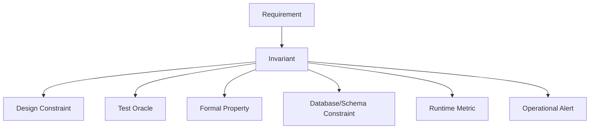
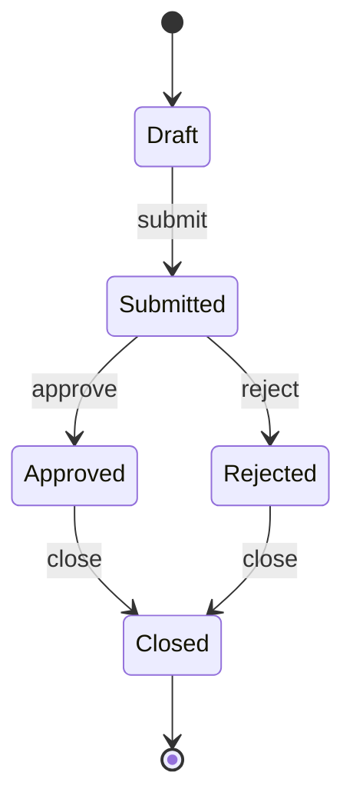
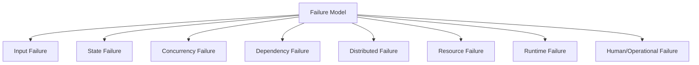
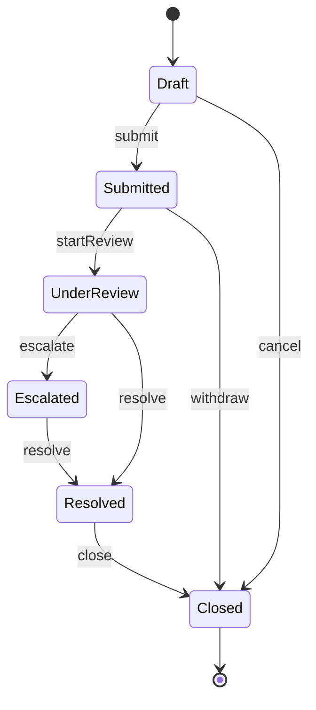
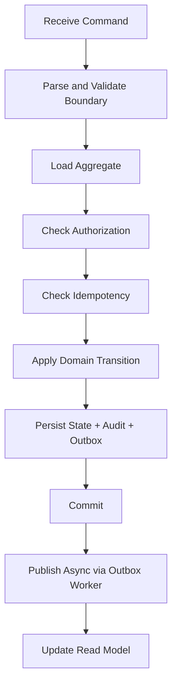

# Part 002 — Engineering Invariants and Failure Models

> Sistem Java production jarang gagal karena satu `if` sederhana. Ia gagal karena asumsi yang tidak pernah ditulis: state yang “mustahil”, retry yang ternyata duplicate, transaksi yang tidak benar-benar atomic, clock yang tidak sinkron, queue yang reorder, cache yang stale, thread yang saling menunggu, atau benchmark yang mengukur dunia fiksi.

Part ini membahas dua fondasi utama:

1. **Invariant** — sesuatu yang harus selalu benar.
2. **Failure model** — cara sistem bisa salah.

Kalau kamu bisa menulis invariant dan failure model dengan tajam, kualitas design, test, formal model, benchmark, dan observability akan naik drastis.

---

## 1. Mental Model: Invariant Adalah Tulang Belakang Correctness

Invariant adalah pernyataan yang tetap benar di semua state yang diizinkan.

Contoh sederhana:

```text
A closed case cannot receive new assignments.
```

Contoh lebih kuat:

```text
For every case, at any committed database state, there is at most one active assignment row.
```

Perhatikan bedanya.

Pernyataan pertama masih domain-level. Pernyataan kedua sudah lebih operasional:

- scope: setiap case,
- waktu: committed database state,
- batas: maksimal satu active assignment row,
- layer enforcement: bisa didukung DB constraint.

Invariant yang baik bisa dipakai untuk:

- design review,
- code structure,
- unit test,
- property test,
- mutation test,
- formal model,
- database constraint,
- runtime assertion,
- production metric,
- incident analysis.



---

## 2. Why Requirements Are Not Enough

Requirement sering ditulis dalam bahasa manusia yang ambigu.

```text
Only eligible investigators can be assigned to a case.
```

Pertanyaan yang belum dijawab:

- eligible menurut waktu kapan?
- apakah eligibility berubah setelah assignment?
- apakah eligibility harus dicek ulang saat reassignment?
- apa yang terjadi jika eligibility service timeout?
- apakah cache eligibility boleh stale?
- apakah admin bisa override?
- apakah override harus diaudit?
- apakah dua request paralel bisa memilih investigator yang sama?

Requirement memberi arah. Invariant memberi struktur.

---

## 3. Taxonomy of Invariants

Invariant tidak semua sama. Memisahkan jenisnya membantu memilih enforcement dan evidence.

### 3.1 Value Invariants

Value invariant berlaku di dalam satu value object.

Contoh:

```text
Money amount cannot be negative.
Currency must be ISO-like uppercase code.
Percentage must be between 0 and 100.
Email must be syntactically valid enough for system use.
```

Enforcement ideal:

- constructor/factory validation,
- immutable type,
- unit test,
- property-based test.

Contoh Java:

```java
public record Percentage(int value) {
    public Percentage {
        if (value < 0 || value > 100) {
            throw new IllegalArgumentException("percentage must be between 0 and 100");
        }
    }
}
```

Value invariant sebaiknya tidak ditunda sampai service layer. Jika nilai invalid tidak bisa dibuat, banyak bug hilang lebih awal.

### 3.2 Entity Invariants

Entity invariant berlaku untuk satu entity.

Contoh:

```text
A case cannot have CLOSED status without closedAt timestamp.
A user cannot be active and deleted at the same time.
A quote cannot be accepted after expiresAt.
```

Enforcement:

- entity method,
- constructor/factory,
- database check constraint,
- unit test,
- persistence integration test.

### 3.3 Aggregate Invariants

Aggregate invariant berlaku untuk sekelompok object yang harus konsisten dalam satu transaction boundary.

Contoh:

```text
A case has at most one active assignment.
An order total equals sum of line totals minus discounts plus taxes.
A workflow has exactly one current state.
```

Enforcement:

- aggregate root method,
- transaction boundary,
- DB unique/check constraints,
- optimistic locking,
- integration test,
- property sequence test.

Aggregate invariant sering rusak jika developer mengizinkan update langsung ke child entity tanpa aggregate root.

### 3.4 Workflow / State Machine Invariants

Workflow invariant berlaku pada lifecycle.

Contoh:

```text
DRAFT can transition to SUBMITTED.
SUBMITTED can transition to APPROVED or REJECTED.
APPROVED cannot transition back to DRAFT.
CLOSED is terminal.
```

Representasi eksplisit lebih aman daripada scattered `if`.



Enforcement:

- transition table,
- state pattern,
- sealed command/result type,
- property-based transition test,
- model-based test,
- formal model untuk concurrency/retry.

### 3.5 Temporal Invariants

Temporal invariant berkaitan dengan waktu.

Contoh:

```text
A quote cannot be accepted after expiry.
A retry must stop after max attempts or deadline.
A pending approval must escalate after 3 business days.
A reservation expires if not confirmed within 15 minutes.
```

Risiko utama:

- clock tidak deterministic,
- timezone,
- daylight saving,
- scheduler delay,
- retry delay,
- race antara expiry dan command,
- business calendar.

Enforcement:

- inject `Clock`,
- domain deadline object,
- deterministic scheduler test,
- property test untuk time boundaries,
- integration test untuk scheduled job,
- production metric untuk overdue state.

### 3.6 Cross-Entity Invariants

Cross-entity invariant melintasi aggregate atau table.

Contoh:

```text
An investigator cannot have more than N active high-severity cases.
A customer cannot have two active subscriptions for the same product.
A user cannot approve a request they created.
```

Risiko:

- transaction boundary terlalu kecil,
- stale read,
- cache stale,
- concurrent write,
- eventual consistency.

Enforcement bisa mahal. Pilihan umum:

- database constraint jika possible,
- serializable transaction untuk area kecil,
- optimistic lock,
- reservation pattern,
- asynchronous reconciliation,
- compensating action,
- invariant monitor.

### 3.7 Distributed Invariants

Distributed invariant berlaku di beberapa service.

Contoh:

```text
Payment must not be captured unless order is confirmed.
Shipment must not be released unless payment is authorized.
A case assignment event must not be published unless assignment commit succeeds.
```

Distributed invariant sering tidak bisa dijaga dengan satu transaksi lokal. Maka kita butuh:

- saga,
- outbox/inbox,
- idempotency key,
- deduplication,
- compensation,
- reconciliation,
- traceability,
- formal model untuk interleaving.

### 3.8 Performance Invariants

Performance invariant adalah batas perilaku resource/performa yang harus dijaga.

Contoh:

```text
Assignment command must perform at most 2 database round-trips in the normal path.
The parser must allocate less than 2 MB per 1 MB payload.
The worker must not load more than 500 records into memory per batch.
The endpoint p95 must remain below 250 ms under normal load.
```

Performance invariant penting karena bug performa sering masuk lewat perubahan kecil:

- N+1 query,
- accidental eager loading,
- logging besar,
- reflection-heavy mapper,
- unbounded collection,
- regex buruk,
- object allocation berlebihan.

Evidence:

- unit-level allocation benchmark,
- JMH microbenchmark,
- integration performance test,
- load test,
- JFR allocation profile,
- production metrics.

### 3.9 Observability Invariants

Observability invariant memastikan sistem bisa dijelaskan saat bermasalah.

Contoh:

```text
Every command must have correlationId.
Every rejected transition must produce structured reason code.
Every successful state transition must produce audit event.
Every async message must carry causationId and idempotencyKey.
```

Ini bukan sekadar logging style. Untuk sistem regulated, auditability adalah bagian dari correctness.

---

## 4. Anatomy of a Good Invariant

Invariant yang baik punya struktur:

```text
For <scope>, under <condition>, <property> must hold at <observation point>, enforced by <mechanism>, verified by <evidence>.
```

Contoh buruk:

```text
Assignment must be correct.
```

Contoh baik:

```text
For each case, after any committed assignment transaction, there must be at most one active assignment, enforced by the domain service and a database unique partial index, verified by integration tests and concurrent duplicate-command tests.
```

### 4.1 Observation Point

Observation point adalah kapan invariant harus benar.

Contoh:

- before command,
- after command returns,
- after transaction commit,
- after event publication,
- after read model catch-up,
- within 5 seconds,
- eventually after retry exhaustion.

Tanpa observation point, invariant bisa ambigu.

Contoh:

```text
Read model must reflect assignment.
```

Lebih jelas:

```text
The assignment read model must reflect a committed assignment event within 10 seconds under normal broker availability.
```

### 4.2 Enforcement Point

Enforcement point adalah tempat invariant dijaga.

Pilihan:

- type system,
- constructor/factory,
- domain method,
- service validation,
- database constraint,
- transaction isolation,
- message deduplication,
- consumer idempotency,
- reconciliation job,
- runtime monitor.

Invariant penting sebaiknya punya lebih dari satu enforcement point.

Contoh:

```text
Closed case cannot be assigned.
```

Enforcement:

- domain method menolak,
- repository update memakai `where status != 'CLOSED'`,
- integration test memastikan closed case tidak berubah,
- metric menghitung rejected illegal transition.

### 4.3 Evidence Point

Evidence point adalah cara membuktikan enforcement bekerja.

Contoh:

| Invariant | Enforcement | Evidence |
|---|---|---|
| Money non-negative | value object constructor | unit/property test |
| one active assignment | DB unique index | integration test |
| closed terminal | state transition table | property transition test |
| duplicate command safe | idempotency store | sequence/concurrency test |
| event only after commit | outbox table | transaction integration test |
| p95 under target | service design/load capacity | load test + production SLO |

---

## 5. Failure Model: Cara Sistem Bisa Salah

Failure model adalah daftar eksplisit kondisi buruk yang kita anggap mungkin.

Tanpa failure model, sistem hanya didesain untuk happy path.



---

## 6. Failure Taxonomy for Java Systems

### 6.1 Input Failure

Input failure terjadi ketika input invalid, incomplete, malicious, atau unexpected.

Contoh:

- null field,
- unknown enum,
- invalid date,
- payload terlalu besar,
- malformed JSON/XML,
- unsupported version,
- invalid encoding,
- duplicate field,
- precision loss,
- integer overflow.

Evidence:

- parser tests,
- boundary unit tests,
- property-based input generation,
- fuzzing,
- contract tests,
- schema validation tests.

### 6.2 State Failure

State failure terjadi ketika sistem berada di state yang tidak diantisipasi.

Contoh:

- state enum baru belum ditangani,
- record soft-deleted masih direferensikan,
- pending job mengacu ke entity yang sudah closed,
- read model stale,
- migration meninggalkan data legacy invalid.

Evidence:

- state-machine tests,
- migration tests,
- invariant queries,
- reconciliation job,
- production data quality metrics.

### 6.3 Concurrency Failure

Concurrency failure terjadi karena interleaving eksekusi.

Contoh:

- lost update,
- double assignment,
- double payment,
- check-then-act race,
- deadlock,
- livelock,
- lock contention,
- stale cache write,
- non-atomic read-modify-write.

Evidence:

- TLA+/PlusCal model,
- concurrent integration tests,
- optimistic locking tests,
- database isolation tests,
- JFR lock profiling,
- stress tests.

### 6.4 Dependency Failure

Dependency failure terjadi ketika sistem lain bermasalah.

Contoh:

- timeout,
- 500 response,
- partial response,
- slow response,
- connection reset,
- rate limit,
- schema drift,
- invalid response,
- dependency returns stale data.

Evidence:

- integration tests with fake server,
- fault injection,
- contract tests,
- timeout tests,
- retry policy tests,
- circuit breaker tests,
- production dependency metrics.

### 6.5 Distributed Failure

Distributed failure terjadi ketika beberapa komponen tidak punya satu kebenaran atomic.

Contoh:

- message duplicate,
- message reorder,
- message loss,
- consumer crash after side effect before ack,
- producer commits DB but fails to publish event,
- event published but read model update fails,
- saga stuck in intermediate state,
- compensation fails.

Evidence:

- outbox/inbox integration tests,
- message dedup tests,
- sequence property tests,
- model checking,
- replay tests,
- reconciliation tests,
- operational stuck-state alerts.

### 6.6 Resource Failure

Resource failure terjadi ketika sistem kehabisan atau terbatasi resource.

Contoh:

- heap pressure,
- GC pause,
- connection pool exhausted,
- thread pool exhausted,
- file descriptor exhausted,
- disk full,
- queue full,
- CPU saturated,
- network bandwidth saturated.

Evidence:

- load test,
- stress test,
- soak test,
- JFR,
- async-profiler,
- GC logs,
- pool metrics,
- capacity model.

### 6.7 Runtime Failure

Runtime failure berasal dari JVM/platform behavior.

Contoh:

- classloading issue,
- reflection config issue,
- JIT deoptimization,
- safepoint pause,
- thread pinning,
- memory leak,
- native memory leak,
- finalizer/cleaner backlog,
- timezone config mismatch.

Evidence:

- JFR,
- JVM flags review,
- startup tests,
- container memory tests,
- production runtime dashboards,
- heap dump analysis.

### 6.8 Human and Operational Failure

Banyak incident berasal dari operasi.

Contoh:

- wrong feature flag,
- bad migration order,
- partial deployment,
- misconfigured timeout,
- secret expired,
- rollback incompatible,
- manual data fix salah,
- runbook tidak jelas.

Evidence:

- deployment test,
- migration dry run,
- config validation,
- canary,
- operational checklist,
- audit log,
- runbook drill.

---

## 7. In Action: Case Escalation Workflow

Kita gunakan contoh workflow:

```text
A regulatory case starts as DRAFT, then SUBMITTED, then UNDER_REVIEW, then ESCALATED or RESOLVED. High severity cases must be escalated if not reviewed within 3 business days. Closed cases are terminal. Every escalation must be auditable and idempotent.
```

### 7.1 State Machine



### 7.2 Initial Invariants

```text
I1. CLOSED is terminal.
I2. DRAFT cannot be escalated.
I3. SUBMITTED cannot be resolved before review starts.
I4. UNDER_REVIEW high-severity case must be escalated if review deadline passes.
I5. Every escalation creates exactly one audit event.
I6. Duplicate escalation command with same idempotency key must not create duplicate audit event.
I7. A case cannot be both ESCALATED and RESOLVED.
I8. Escalation command must preserve previous state if authorization fails.
I9. Scheduled escalation job must not escalate closed cases.
I10. Read model must reflect escalation within 10 seconds under normal broker availability.
```

### 7.3 Refine Invariant I4

Original:

```text
UNDER_REVIEW high-severity case must be escalated if review deadline passes.
```

Problems:

- what is high severity?
- what is review deadline?
- what is business day?
- what if scheduler is down?
- what if case closes at the same time?
- what if clock changes?

Better:

```text
For every case with severity HIGH and status UNDER_REVIEW, if reviewStartedAt + 3 business days is earlier than the scheduler evaluation time, and the case is not terminal at transaction commit time, the escalation job must either transition it to ESCALATED exactly once or record a retryable failure reason for later processing.
```

Now we have:

- scope,
- condition,
- time semantics,
- terminal exception,
- idempotency,
- failure handling.

### 7.4 Failure Model for I4

| Failure | Possible Bug | Mitigation | Evidence |
|---|---|---|---|
| scheduler runs late | case escalated too late | overdue metric + catch-up job | integration/scheduler test |
| duplicate scheduler run | duplicate audit event | idempotency key per case/deadline | property sequence test |
| case closed concurrently | closed case escalated | conditional update/status check | concurrent integration test |
| business calendar wrong | false escalation | calendar abstraction | boundary tests |
| transaction fails after audit | ghost audit | atomic transaction/outbox | integration test |
| event publish fails | read model stale | outbox retry | outbox test + lag metric |
| clock skew | inconsistent deadline | central Clock/time source | deterministic time tests |

---

## 8. Translating Invariants into Java Design

### 8.1 Avoid Anemic State Changes

Weak design:

```java
caseEntity.setStatus("ESCALATED");
caseRepository.save(caseEntity);
```

This hides domain rules. Any caller can mutate status.

Better:

```java
public final class RegulatoryCase {
    private final CaseId id;
    private CaseStatus status;
    private Severity severity;
    private Instant reviewStartedAt;
    private long version;

    public EscalationResult escalate(EscalationCommand command, Clock clock) {
        if (status == CaseStatus.CLOSED) {
            return EscalationResult.rejected("CASE_CLOSED");
        }
        if (status != CaseStatus.UNDER_REVIEW) {
            return EscalationResult.rejected("CASE_NOT_UNDER_REVIEW");
        }
        if (!isPastEscalationDeadline(clock.instant())) {
            return EscalationResult.rejected("DEADLINE_NOT_REACHED");
        }

        this.status = CaseStatus.ESCALATED;
        return EscalationResult.escalated(
            CaseEscalated.of(id, command.reason(), command.idempotencyKey())
        );
    }
}
```

The method is not just code. It is an enforcement point.

### 8.2 Make Illegal States Harder to Represent

Instead of one giant mutable object with nullable fields, model lifecycle more explicitly.

Example:

```java
public sealed interface CaseLifecycle
    permits DraftCase, SubmittedCase, UnderReviewCase, EscalatedCase, ResolvedCase, ClosedCase {
    CaseId id();
}

public record UnderReviewCase(
    CaseId id,
    Severity severity,
    Instant reviewStartedAt,
    InvestigatorId investigatorId
) implements CaseLifecycle {}
```

This does not solve all problems, but it moves some invalid states from runtime to compile-time design.

Trade-off:

- more types,
- more mapping code,
- clearer domain transitions,
- fewer impossible combinations.

### 8.3 Put Hard Constraints in the Database When Possible

Domain code is necessary but not always enough. Concurrency can bypass application assumptions.

Example invariant:

```text
A case has at most one active assignment.
```

Application check alone is unsafe:

```text
T1 checks no active assignment.
T2 checks no active assignment.
T1 inserts assignment.
T2 inserts assignment.
```

Database constraint is stronger.

Example PostgreSQL-style concept:

```sql
CREATE UNIQUE INDEX uq_active_assignment_per_case
ON case_assignment(case_id)
WHERE active = true;
```

The exact SQL depends on database, but the principle is stable: if the invariant is data-level and critical, enforce it at the data boundary too.

### 8.4 Use Optimistic Locking for Lost Update

For aggregate update:

```text
update cases
set status = ?, version = version + 1
where id = ? and version = ?
```

If affected rows = 0, someone else modified the aggregate.

Evidence:

- integration test for version conflict,
- concurrent update test,
- metric for optimistic lock conflicts.

---

## 9. Mapping Failure Model to Tests

A common mistake: one invariant gets one unit test. That is usually insufficient.

Better: each invariant gets an evidence bundle.

| Invariant | Unit | Property | Integration | Formal | Runtime |
|---|---:|---:|---:|---:|---:|
| closed terminal | yes | yes | maybe | maybe | rejected transition metric |
| one active assignment | limited | sequence | yes | maybe | duplicate active invariant query |
| duplicate command idempotent | yes | yes | yes | yes | duplicate command counter |
| event after commit | no | no | yes | maybe | outbox lag metric |
| deadline escalation | yes | boundary | scheduler test | maybe | overdue case metric |
| no double capture | yes | sequence | yes | yes | payment reconciliation |

### 9.1 Unit Test for Local Rule

```java
@Test
void closedCaseCannotBeEscalated() {
    var caze = TestCases.closedHighSeverityCase();

    var result = caze.escalate(escalationCommand(), fixedClock());

    assertThat(result.rejected()).isTrue();
    assertThat(result.reasonCode()).isEqualTo("CASE_CLOSED");
    assertThat(caze.status()).isEqualTo(CaseStatus.CLOSED);
}
```

This verifies local behavior.

### 9.2 Property Test for Transition Preservation

Property:

```text
For any terminal case and any command, applying the command must preserve terminal state.
```

This catches missed command handlers.

Pseudo-shape:

```java
@Property
void terminalCasesRemainTerminal(@ForAll("terminalCases") RegulatoryCase caze,
                                 @ForAll CaseCommand command) {
    var before = caze.snapshot();

    command.applyTo(caze);

    assertThat(caze.status()).isEqualTo(before.status());
    assertThat(caze.status().isTerminal()).isTrue();
}
```

### 9.3 Integration Test for Transaction Boundary

If audit and state transition must be atomic, unit test is not enough.

Test concept:

```text
Given a database-backed case in UNDER_REVIEW
When escalation succeeds
Then case status is ESCALATED
And exactly one audit row exists in the same transaction boundary
And exactly one outbox event exists
```

### 9.4 Formal Model for Concurrent Scheduler and User Action

If scheduler can escalate while user closes the case, model interleavings:

```text
Variables:
- status ∈ {UNDER_REVIEW, ESCALATED, CLOSED}
- auditCount ∈ Nat

Actions:
- SchedulerEscalate
- UserClose
- RetryEscalate

Safety:
- status != CLOSED or auditCount for escalation does not increase after close
- not (status = CLOSED and status = ESCALATED)
- auditCount <= 1 for same escalation key
```

The model can reveal counterexample before writing complex concurrency tests.

---

## 10. Failure Response Strategies

Not all failures should be handled the same way.

| Strategy | When to Use | Risk |
|---|---|---|
| reject | invalid command, illegal state | bad UX if reason unclear |
| fail fast | programming/config error | can reduce availability |
| retry | transient dependency failure | duplicate side effects, retry storm |
| timeout | slow dependency | false failure under temporary slowness |
| circuit break | repeated dependency failure | degraded functionality |
| compensate | distributed side effect already happened | compensation can fail too |
| quarantine | poison message/bad data | manual backlog |
| reconcile | eventual consistency drift | delayed correctness |
| degrade | non-critical feature failure | hidden correctness loss if misclassified |

### 10.1 Retry Is Not a Correctness Strategy by Itself

Retry can make reliability better or correctness worse.

Retry requires:

- idempotency,
- deadline,
- max attempts,
- backoff,
- jitter,
- retryable/non-retryable classification,
- side-effect awareness,
- observability.

Bad retry:

```java
while (true) {
    paymentClient.capture(request);
}
```

Better mental model:

```text
Retry only operations that are either side-effect free, idempotent, or protected by an idempotency key recognized by the side-effect owner.
```

### 10.2 Compensation Is Not Undo

Compensation is a new business action that semantically counteracts a previous action.

Example:

- refund is not “uncapture payment”; it is another financial transaction,
- reopen case is not “unclose”; it may require audit and permission,
- cancel shipment is not guaranteed if shipment already left warehouse.

Therefore compensation needs its own invariants and tests.

---

## 11. Invariant Registry Template

Untuk sistem besar, invariant sebaiknya tidak hanya tersebar di code. Buat registry ringan.

```md
## Invariant: One Active Assignment Per Case

ID: CASE-INV-001
Scope: case_assignment table and Case aggregate
Statement:
  For each case, after any committed assignment transaction,
  there must be at most one active assignment.

Why it matters:
  Prevents ownership ambiguity and regulatory audit inconsistency.

Failure modes:
  - concurrent assignment
  - retry after timeout
  - manual data fix
  - migration bug

Enforcement:
  - Case.assignTo domain method
  - unique partial index on active assignment
  - optimistic lock on case aggregate

Evidence:
  - unit test for reassignment rule
  - integration test for unique constraint
  - concurrent integration test
  - property-based command sequence test

Runtime monitoring:
  - invariant query: cases with active_assignment_count > 1
  - assignment_conflict_total metric
  - duplicate_assignment_rejected_total metric

Owner: Case Platform Team
Last reviewed: 2026-07-02
```

This is not bureaucracy if kept practical. It is shared memory for correctness.

---

## 12. Failure Model Worksheet

Gunakan worksheet ini sebelum implementasi fitur kritikal.

```md
## Feature

Name:
Owner:
Criticality:

## Main Command / Workflow

Command:
Input:
Output:
Side effects:

## Invariants

1.
2.
3.

## Failure Modes

### Input
- malformed:
- missing:
- unsupported version:

### State
- illegal transition:
- stale state:
- legacy data:

### Concurrency
- duplicate command:
- concurrent conflicting command:
- lost update:

### Dependency
- timeout:
- 5xx:
- invalid response:

### Distributed
- event publish failure:
- duplicate message:
- consumer crash after side effect:

### Resource
- connection pool exhausted:
- heap pressure:
- queue full:

### Operational
- bad config:
- migration order:
- partial deployment:

## Evidence Plan

Unit:
Property:
Integration:
Contract:
Formal model:
Benchmark:
Load test:
Telemetry:

## Open Questions

1.
2.
3.
```

---

## 13. Anti-Patterns

### 13.1 “Validation Everywhere”

Validation scattered across controller, service, repository, and UI creates inconsistent enforcement.

Better:

- value invariant in value object,
- entity invariant in entity/aggregate,
- cross-aggregate invariant in domain service/application service,
- data invariant in database constraint,
- external contract at boundary.

### 13.2 “Test the Implementation, Not the Invariant”

Bad:

```java
verify(repository).save(caseEntity);
```

Better:

```java
assertThat(savedCase.status()).isEqualTo(ESCALATED);
assertThat(auditEvents).containsExactly(expectedEscalationEvent);
assertThat(outboxEvents).containsExactly(expectedOutboxEvent);
```

### 13.3 “Eventually Consistent” as an Excuse

Eventually consistent is not a free pass.

Always ask:

- eventually within how long?
- what happens before consistency?
- what operations are allowed while stale?
- how is drift detected?
- how is reconciliation performed?

### 13.4 “Retry Until It Works”

Unbounded retry can amplify outage.

Every retry policy needs:

- max attempts or deadline,
- backoff,
- jitter,
- idempotency,
- classification,
- metric.

### 13.5 “Benchmark Without a Failure Model”

Performance tests also need failure model.

Ask:

- what if cache hit ratio drops?
- what if DB p95 doubles?
- what if payload size grows 10x?
- what if one tenant has skewed data?
- what if GC pauses during peak?

---

## 14. Practical Design Review Questions

Gunakan pertanyaan ini dalam design review.

```text
1. What must always be true?
2. Where is it enforced?
3. Can concurrency violate it?
4. Can retry violate it?
5. Can stale data violate it?
6. Can partial failure violate it?
7. Can migration/manual operation violate it?
8. What test would fail if this invariant breaks?
9. What production signal would reveal violation?
10. What is the recovery path after violation?
```

Untuk fitur yang sangat kritikal, tambahkan:

```text
11. Is this small enough to model formally?
12. Can we generate tests from the model or state machine?
13. What is the cheapest evidence that gives high confidence?
14. What evidence would be misleading?
```

---

## 15. Implementation Pattern: Invariant-Centered Command Handler

Command handler production-grade biasanya punya struktur seperti ini:



Invariant mapping:

| Step | Invariant Concern |
|---|---|
| parse | input shape, schema version |
| load | entity exists, visibility |
| authorization | actor allowed |
| idempotency | duplicate side effect prevention |
| transition | state machine legality |
| persist | aggregate/data invariant |
| audit/outbox | observational/distributed invariant |
| publish | eventual consistency |
| read model | stale view bound |

This helps ensure implementation structure follows correctness structure.

---

## 16. Example: Escalation Command Handler Skeleton

```java
public final class EscalateCaseHandler {
    private final CaseRepository cases;
    private final IdempotencyStore idempotency;
    private final AuthorizationService authorization;
    private final TransactionRunner tx;
    private final Clock clock;

    public EscalationResponse handle(EscalateCaseCommand command) {
        return tx.required(() -> {
            var previous = idempotency.find(command.idempotencyKey());
            if (previous.isPresent()) {
                return previous.get().toResponse();
            }

            var caze = cases.getForUpdate(command.caseId())
                .orElseThrow(() -> new NotFoundException("case not found"));

            authorization.requireCanEscalate(command.actor(), caze);

            var result = caze.escalate(command, clock);
            if (result.rejected()) {
                idempotency.record(command.idempotencyKey(), result);
                return result.toResponse();
            }

            cases.save(caze);
            cases.appendAudit(result.auditEvent());
            cases.appendOutbox(result.integrationEvent());
            idempotency.record(command.idempotencyKey(), result);

            return result.toResponse();
        });
    }
}
```

Important notes:

- idempotency is checked inside transaction boundary,
- aggregate transition owns state rule,
- audit and outbox are persisted with state change,
- response for duplicate command is stable,
- `getForUpdate` is a deliberate concurrency choice, not accidental persistence detail.

This skeleton is not universal. It is a thinking template.

---

## 17. Practice Drills

### Drill 1 — Extract Invariants

Feature:

```text
User can approve a purchase request. The requester cannot approve their own request. Approval after expiry is rejected. Approval must be audited. Duplicate approval request must be idempotent.
```

Extract at least 10 invariants. Classify them as:

- value,
- entity,
- aggregate,
- workflow,
- temporal,
- cross-entity,
- distributed,
- observability.

### Drill 2 — Build Failure Model

For the same feature, list failures in categories:

- input,
- state,
- concurrency,
- dependency,
- distributed,
- resource,
- operational.

For each failure, write:

```text
Failure:
Impact:
Mitigation:
Evidence:
Runtime signal:
```

### Drill 3 — Evidence Bundle

Choose one invariant:

```text
Requester cannot approve their own request.
```

Design evidence bundle:

- unit test,
- property test,
- integration test,
- audit assertion,
- production metric.

### Drill 4 — Make It More Formal

Write a tiny state model for approval:

```text
States: DRAFT, SUBMITTED, APPROVED, REJECTED, EXPIRED
Actors: requester, approver
Actions: submit, approve, reject, expire
Safety: requester never approves own request
```

Then write what counterexample would look like.

---

## 18. Summary

Part ini membangun fondasi yang akan terus dipakai sepanjang seri:

- invariant adalah sesuatu yang harus selalu benar;
- failure model adalah daftar cara sistem bisa salah;
- invariant harus punya scope, condition, observation point, enforcement point, dan evidence;
- failure harus diklasifikasikan: input, state, concurrency, dependency, distributed, resource, runtime, operational;
- Java design yang baik membuat invariant sulit dilanggar;
- test yang baik membuktikan invariant, bukan implementasi detail;
- formal model berguna saat interleaving dan distributed behavior terlalu kompleks untuk contoh manual;
- telemetry production harus memonitor invariant penting, bukan hanya CPU dan error rate.

Part berikutnya akan membangun **Test Taxonomy and Verification Ladder**: kapan memakai unit test, integration test, property test, mutation test, formal model, benchmark, load test, dan production verification secara tepat.

---

## Referensi Primer

- JUnit User Guide: https://docs.junit.org/
- jqwik User Guide: https://jqwik.net/
- PIT Mutation Testing: https://pitest.org/
- OpenJDK JMH — Java Microbenchmark Harness: https://openjdk.org/projects/code-tools/jmh/
- Java Flight Recorder tutorial: https://dev.java/learn/jvm/jfr/
- Leslie Lamport TLA+ page: https://lamport.azurewebsites.net/tla/tla.html
