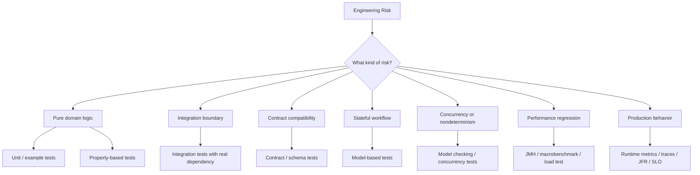
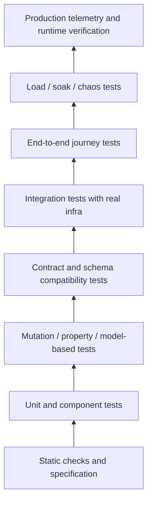
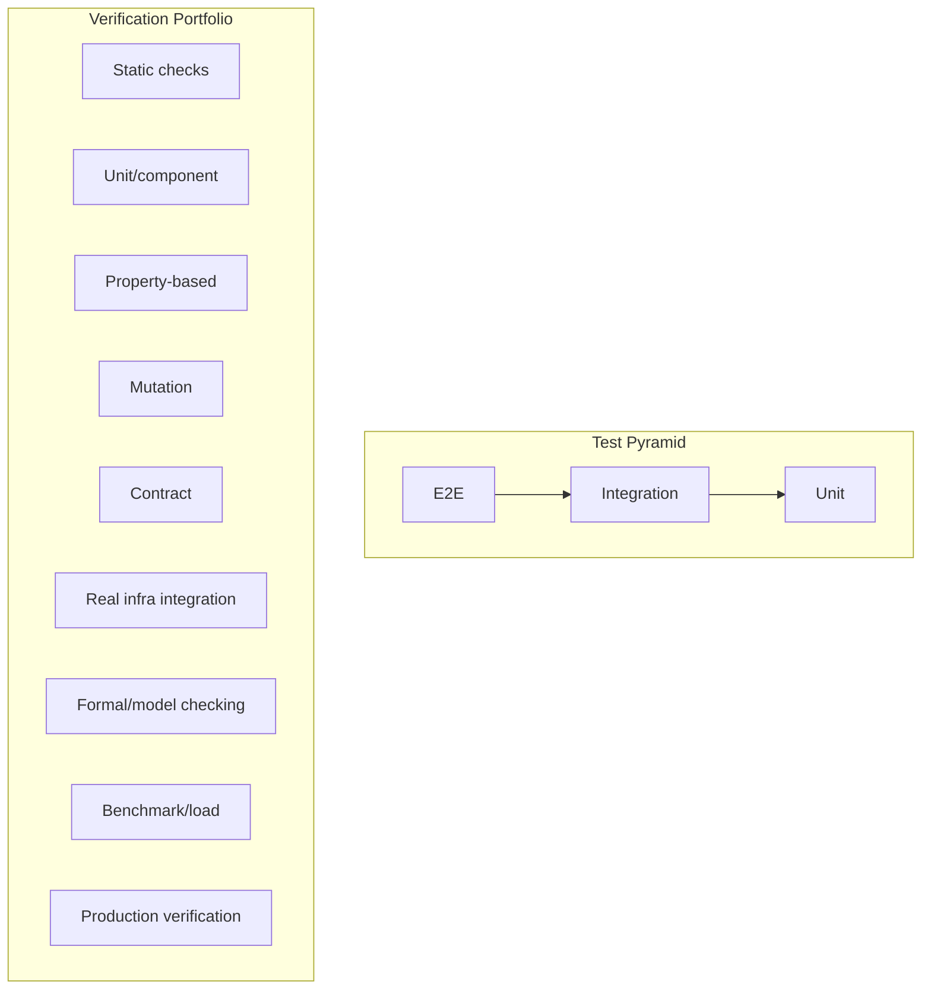
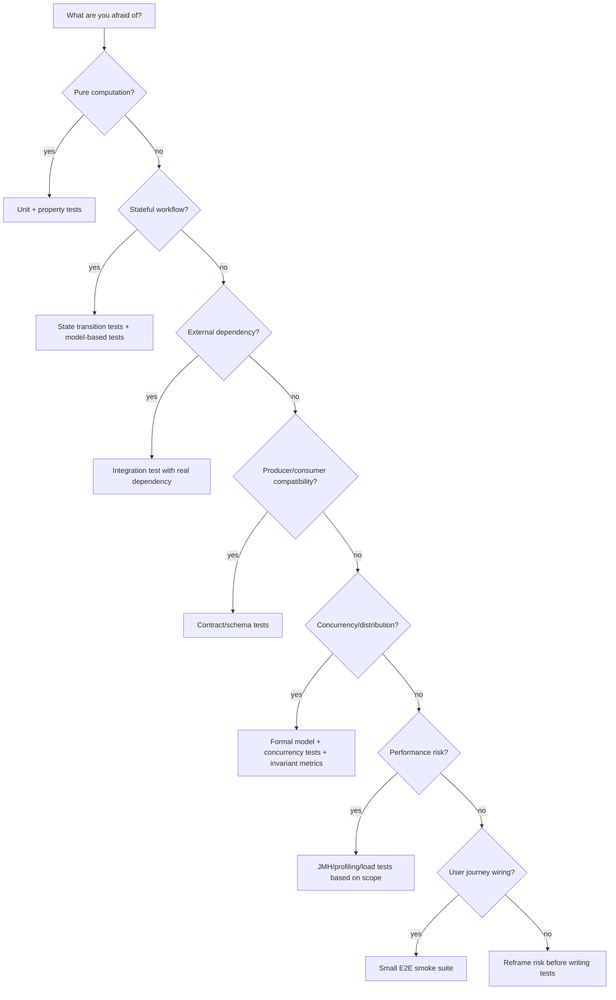
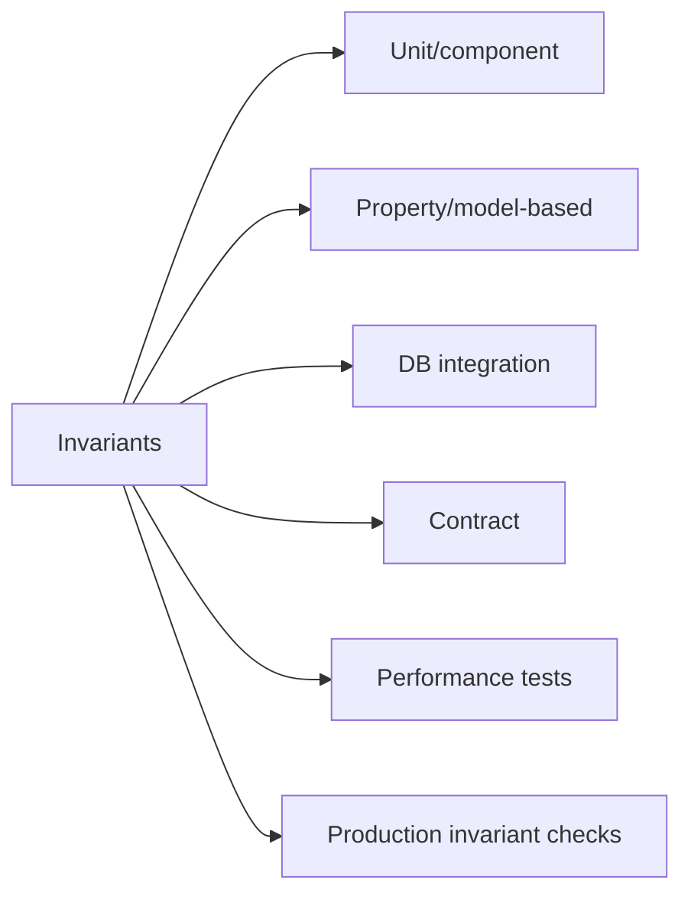
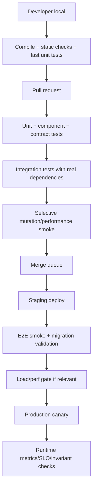
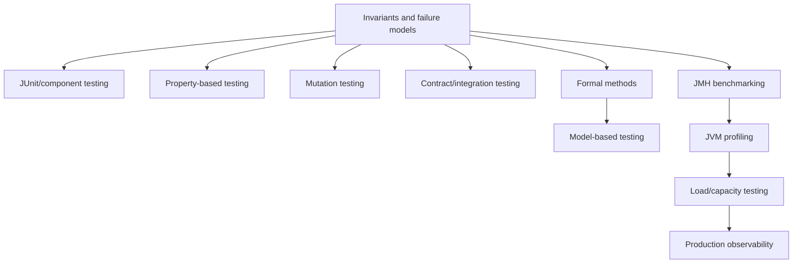

# Part 003 — Test Taxonomy and Verification Ladder

> Tujuan bagian ini: membangun **peta keputusan**. Bukan sekadar tahu istilah unit test, integration test, contract test, property-based test, mutation test, fuzzing, benchmark, load test, dan observability. Kita ingin tahu **kapan memakai apa**, **risiko apa yang dideteksi**, **bukti apa yang dihasilkan**, dan **di mana blind spot-nya**.

Engineer senior tidak menulis test sebanyak mungkin. Engineer senior menulis **evidence system** yang paling ekonomis untuk risiko yang paling penting.

Kita akan memakai prinsip berikut sepanjang seri:

```text
For every meaningful engineering risk, choose the cheapest detector that can falsify it early.
```

Artinya:

- kalau risiko bisa dideteksi oleh unit test deterministic, jangan menunggu E2E;
- kalau risiko adalah schema drift, jangan berharap unit test menangkapnya;
- kalau risiko adalah race condition, contoh test tunggal tidak cukup;
- kalau risiko adalah throughput collapse, mock test tidak relevan;
- kalau risiko adalah invariant state machine, happy-path test tidak cukup;
- kalau risiko adalah misunderstanding antara service, contract test lebih bernilai daripada mock lokal;
- kalau risiko adalah desain distributed protocol, formal model sering lebih murah daripada debugging production incident.

---

## 1. Core Mental Model

Kebanyakan tim berpikir test sebagai folder:

```text
src/test/java
```

Itu terlalu dangkal.

Untuk sistem Java yang serius, test harus dipahami sebagai **lapisan deteksi risiko**.



Setiap tool punya **deteksi optimal** dan **blind spot**.

Contoh sederhana:

| Risiko | Detector murah | Detector kuat | Blind spot umum |
|---|---:|---:|---|
| Formula salah | Unit test | Property-based test | Hanya test 3 contoh happy path |
| Rule priority salah | Unit test table | Property/model-based test | Test tidak mengeksplorasi kombinasi |
| Schema response berubah | Contract test | Provider verification in CI | Mock client lokal tetap hijau |
| DB query salah | Integration test | Integration + data fixture realistic | H2 tidak sama dengan PostgreSQL |
| Race condition | Stress/concurrency test | Formal model + deterministic scheduler | Test lokal kebetulan lewat |
| Allocation melonjak | JMH + allocation profiler | JFR/async-profiler under workload | Benchmark micro tidak representatif |
| Latency P99 buruk | Load test | Load + production telemetry | Average latency menipu |
| Incident partial failure | Chaos/failure injection | Formal model + production invariant metrics | Happy-path E2E tidak mengecek failure |

---

## 2. Verification Ladder

Verification ladder adalah urutan evidence dari paling lokal, murah, dan cepat menuju paling realistis, mahal, dan lambat.



Semakin naik:

- realism meningkat;
- cost meningkat;
- feedback makin lambat;
- debugging makin sulit;
- signal makin dekat dengan user impact.

Semakin turun:

- feedback makin cepat;
- defect localization makin mudah;
- realism makin rendah;
- perlu desain kode yang testable.

Rule praktis:

```text
Push detection downward whenever possible.
Keep only irreducible realism at higher layers.
```

Misalnya:

- validasi rule pajak tidak perlu E2E;
- query SQL spesifik database perlu integration test;
- compatibility response butuh contract test;
- P99 latency butuh load test;
- GC pause butuh runtime/profiling evidence;
- distributed liveness kadang butuh formal model.

---

## 3. Why “Test Pyramid” Is Not Enough

Test pyramid berguna untuk melawan E2E-heavy testing. Namun untuk sistem modern, pyramid terlalu sempit.



Masalah test pyramid:

1. Tidak membedakan **example-based** vs **property-based** evidence.
2. Tidak menjawab schema compatibility.
3. Tidak membantu concurrency bug.
4. Tidak membahas performance regression.
5. Tidak memasukkan production feedback.
6. Tidak mengukur apakah test oracle kuat.
7. Tidak mendorong formal reasoning untuk stateful/distributed behavior.

Pyramid tetap berguna, tapi bukan operating model lengkap.

Untuk seri ini kita pakai model **verification portfolio**.

---

## 4. Taxonomy by Risk Type

### 4.1 Functional correctness

Pertanyaan:

```text
Does this code compute the right result for the intended input space?
```

Tools:

- unit test;
- parameterized test;
- property-based test;
- mutation testing;
- static analysis;
- design by contract;
- model-based testing untuk stateful logic.

Contoh Java domain:

```java
final class PenaltyCalculator {
    Money calculatePenalty(Money baseFine, int daysLate, ViolationSeverity severity) {
        if (daysLate <= 0) return Money.zero(baseFine.currency());

        BigDecimal multiplier = switch (severity) {
            case LOW -> new BigDecimal("0.01");
            case MEDIUM -> new BigDecimal("0.025");
            case HIGH -> new BigDecimal("0.05");
        };

        return baseFine.multiply(multiplier).multiply(daysLate).capAt(baseFine.multiply("2.0"));
    }
}
```

Example-based tests bisa mengecek beberapa case:

```java
@Test
void highSeverityPenaltyIsFivePercentPerDay() {
    var penalty = calculator.calculatePenalty(
        Money.usd("1000.00"),
        3,
        ViolationSeverity.HIGH
    );

    assertThat(penalty).isEqualTo(Money.usd("150.00"));
}
```

Tapi properti yang lebih kuat adalah:

```text
For any baseFine > 0 and daysLate > 0:
penalty >= 0
penalty <= baseFine * 2
increasing daysLate must not decrease penalty
higher severity must not produce lower penalty
```

Itu bukan sekadar contoh. Itu invariant.

---

### 4.2 Behavioral correctness

Pertanyaan:

```text
Does the system perform the right observable behavior under a scenario?
```

Tools:

- component test;
- workflow test;
- state machine test;
- BDD-style scenario test;
- model-based testing;
- approval/snapshot testing untuk output tertentu;
- event-driven test harness.

Contoh behavior:

```text
Given a case is under investigation
When the officer submits an escalation request
Then the case moves to ESCALATION_REVIEW
And the escalation audit event is recorded
And the SLA clock switches to escalation policy
```

Ini bukan hanya method result. Ini perubahan state dan side effect.

Test-nya harus memverifikasi:

- state transition;
- emitted event;
- audit trail;
- SLA recalculation;
- idempotency;
- authorization;
- failure semantics.

---

### 4.3 Integration correctness

Pertanyaan:

```text
Does our code work with the real dependency contract and behavior?
```

Tools:

- Testcontainers;
- real database integration test;
- messaging broker integration test;
- external service fake with recorded contract;
- migration test;
- transaction test.

Example risk:

```java
repository.findActiveCasesByOfficer(officerId, PageRequest.of(0, 50));
```

Unit test dengan mock repository tidak membuktikan query SQL benar.

Integration test harus menangkap:

- SQL syntax;
- mapping column;
- transaction boundary;
- constraint violation;
- index-sensitive behavior;
- database-specific semantics;
- isolation behavior;
- timezone conversion;
- JSONB/operator behavior jika PostgreSQL.

---

### 4.4 Contract compatibility

Pertanyaan:

```text
Can producers and consumers evolve independently without breaking each other?
```

Tools:

- consumer-driven contract test;
- OpenAPI schema validation;
- protobuf/avro compatibility rules;
- generated client/server verification;
- backward/forward compatibility test;
- golden contract tests.

Contract test bukan integration test penuh. Ia menjawab pertanyaan sempit:

```text
Does this API still satisfy the contract expected by consumers?
```

Contoh breaking changes:

- required field baru ditambahkan;
- enum value berubah;
- response field hilang;
- type berubah dari number ke string;
- error format berubah;
- pagination semantics berubah;
- status code berubah;
- event payload incompatible.

---

### 4.5 Temporal correctness

Pertanyaan:

```text
Does behavior remain correct when time matters?
```

Risiko:

- deadline;
- SLA;
- retry delay;
- timeout;
- scheduled job;
- expiration;
- grace period;
- business calendar;
- daylight saving/timezone;
- monotonic vs wall-clock time.

Tools:

- fake clock;
- deterministic scheduler;
- temporal property tests;
- integration test for scheduled jobs;
- production metric for late/expired items.

Rule:

```text
Never let domain logic call Instant.now() directly.
```

Lebih baik:

```java
final class SlaPolicy {
    private final Clock clock;

    SlaPolicy(Clock clock) {
        this.clock = clock;
    }

    boolean isBreached(CaseFile file) {
        return Instant.now(clock).isAfter(file.slaDeadline());
    }
}
```

---

### 4.6 Concurrency correctness

Pertanyaan:

```text
Does behavior remain correct under interleaving, contention, duplicated execution, and reordering?
```

Tools:

- deterministic concurrency test;
- stress test;
- jcstress-style thinking;
- model checking;
- TLA+ for protocol logic;
- database isolation tests;
- idempotency tests;
- race reproduction harness.

Concurrency bug jarang tertangkap oleh one-shot unit test.

Typical bug:

```text
Two workers claim the same case concurrently.
```

Invariant:

```text
At most one active assignment exists for a case at any time.
```

Detector candidates:

| Detector | Good for | Weak for |
|---|---|---|
| Unit test | sequential logic | interleaving |
| Integration test | DB constraint / transaction behavior | large interleaving space |
| Stress test | probabilistic race exposure | proof / exhaustive coverage |
| Formal model | protocol correctness | implementation details |
| Production invariant metric | real-world detection | late signal |

---

### 4.7 Performance correctness

Pertanyaan:

```text
Does the system satisfy performance requirements under representative conditions?
```

Performance correctness is correctness.

Kalau requirement berkata:

```text
P99 case search latency <= 300 ms at 200 requests/second with 5M active cases
```

Maka response yang benar secara functional tapi 4 detik adalah gagal.

Tools:

- JMH microbenchmark;
- macrobenchmark;
- load test;
- soak test;
- JFR;
- async-profiler;
- database execution plan;
- production SLO metrics.

Important distinction:

| Tool | Answers |
|---|---|
| JMH | Is this local operation faster/slower under controlled JVM measurement? |
| Profiler | Where is time/allocation/lock contention spent? |
| Load test | Does the service satisfy latency/throughput under workload? |
| Soak test | Does performance degrade over time? |
| Production telemetry | What actually happens for real users? |

---

## 5. Taxonomy by Scope

### 5.1 Unit test

Scope:

```text
One class/function/module, isolated from real external systems.
```

Good for:

- pure domain rules;
- branching logic;
- validation;
- small algorithms;
- error handling;
- edge cases;
- state transition rules if model small.

Bad for:

- SQL correctness;
- serialization compatibility;
- actual broker semantics;
- HTTP behavior;
- JIT/GC/performance behavior;
- distributed protocol realism.

Healthy unit test properties:

- fast;
- deterministic;
- local;
- readable;
- checks behavior, not implementation noise;
- fails for meaningful regression;
- does not require external infra.

Bad unit test smell:

```java
verify(repository).save(any());
verify(auditClient).send(any());
verify(clock).instant();
verify(logger).info(anyString());
```

This often means the test checks implementation choreography, not domain behavior.

Better:

```java
assertThat(result.newStatus()).isEqualTo(CaseStatus.ESCALATION_REVIEW);
assertThat(result.events()).containsExactly(
    new CaseEscalated(caseId, officerId, reason)
);
```

---

### 5.2 Component test

Scope:

```text
A meaningful slice of application code, often with fake adapters.
```

Example:

```text
Command handler + domain service + in-memory repository + fake event publisher.
```

Good for:

- application behavior;
- use-case orchestration;
- transaction-like semantics at logical level;
- verifying emitted events;
- checking authorization flow;
- testing without real DB/network.

Bad for:

- real SQL/migration bugs;
- real serialization;
- broker-specific behavior;
- performance.

Component tests are often the sweet spot for application-layer behavior.

---

### 5.3 Integration test

Scope:

```text
Our code + real external dependency instance.
```

Example:

- Java service + PostgreSQL container;
- repository + real schema migration;
- Kafka producer/consumer + broker;
- Redis cache integration;
- HTTP client + WireMock/fake server;
- file storage adapter + local compatible service.

Integration tests answer:

```text
Does our adapter really speak the dependency's language?
```

They should not test every domain rule again.

Good integration test:

```text
Repository persists and reloads Case aggregate with all important fields.
```

Poor integration test:

```text
Full 12-step user journey repeated for every business rule.
```

---

### 5.4 Contract test

Scope:

```text
Boundary compatibility between producer and consumer.
```

Contract tests are about **evolution safety**.

They should answer:

- can old consumers read new producer output?
- can new consumers tolerate old producer output?
- does provider still honor consumer expectation?
- are error responses compatible?
- are required fields stable?
- is enum expansion safe?

Contract test failure means:

```text
Do not deploy this change without migration/coordination.
```

---

### 5.5 End-to-end test

Scope:

```text
Entire system path, close to user journey.
```

Good for:

- deployment wiring;
- critical journey confidence;
- smoke checks;
- cross-service behavior;
- environment readiness;
- release validation.

Bad for:

- exhaustive business rule testing;
- debugging;
- fast feedback;
- finding local logic bugs cheaply.

Use E2E sparingly.

A useful E2E test usually says:

```text
The system is wired and the critical path still works.
```

It should not be the primary detector for every rule.

---

## 6. Taxonomy by Technique

### 6.1 Example-based testing

Most familiar:

```text
Given this input, expect this output.
```

Strength:

- readable;
- concrete;
- good for known cases;
- easy to explain;
- good regression test after bug fix.

Weakness:

- narrow input coverage;
- can miss edge cases;
- depends on author imagination;
- often overfits implementation.

Use it for:

- critical examples;
- discovered bugs;
- business examples;
- boundary examples;
- readable documentation.

---

### 6.2 Table-driven / parameterized testing

Useful when the rule is a matrix.

```java
@ParameterizedTest
@CsvSource({
    "LOW, 1, 10.00",
    "LOW, 7, 70.00",
    "MEDIUM, 1, 25.00",
    "HIGH, 1, 50.00"
})
void calculatesPenaltyBySeverity(String severity, int daysLate, String expected) {
    var penalty = calculator.calculatePenalty(
        Money.usd("1000.00"),
        daysLate,
        ViolationSeverity.valueOf(severity)
    );

    assertThat(penalty).isEqualTo(Money.usd(expected));
}
```

Good for:

- decision table;
- validation matrix;
- role/permission matrix;
- state transition matrix;
- parsing matrix.

Weakness:

- still example-based;
- combinatorial explosion;
- can become unreadable.

---

### 6.3 Property-based testing

Instead of examples:

```text
For all generated inputs satisfying assumptions, property must hold.
```

Good for:

- algebraic behavior;
- round-trip serialization;
- parser/printer consistency;
- monotonicity;
- ordering;
- idempotency;
- commutativity;
- state transition invariants;
- business constraints with large input space.

Example properties:

```text
serialize(deserialize(x)) preserves meaning
sort(xs) contains same elements as xs
applying same command twice is equivalent to applying it once
penalty never exceeds legal maximum
case cannot be both CLOSED and UNDER_REVIEW
```

Property-based testing requires stronger thinking: you need to specify what must always be true.

---

### 6.4 Mutation testing

Mutation testing asks:

```text
If the production code is slightly wrong, do tests fail?
```

Example mutation:

```java
if (daysLate <= 0) { ... }
```

becomes:

```java
if (daysLate < 0) { ... }
```

If tests still pass, the test suite may be weak.

Mutation testing is excellent for detecting:

- missing assertions;
- tests that execute code but don't verify behavior;
- weak branch coverage;
- fake green tests;
- overreliance on line coverage.

It is not a perfect metric. Some mutants are equivalent or irrelevant. Use it as a feedback tool, not a religion.

---

### 6.5 Fuzzing

Fuzzing explores malformed, unexpected, adversarial, or high-volume input.

Good for:

- parsers;
- decoders;
- JSON/XML handling;
- regex;
- upload processing;
- protocol handling;
- validation boundary;
- robustness/security-adjacent failures.

Fuzzing is less about expected business answer and more about:

```text
Never crash, hang, corrupt, leak, or consume unbounded resources for invalid input.
```

---

### 6.6 Model-based testing

Model-based testing uses a simplified model as oracle.

Example:

```text
A case can transition:
DRAFT -> SUBMITTED -> UNDER_REVIEW -> DECIDED -> CLOSED
UNDER_REVIEW -> ESCALATED -> DECIDED
```

Generate command sequences:

```text
submit, assign, escalate, decide, close, reopen, assign, decide...
```

After each command:

```text
implementation state must match model state
invariants must hold
invalid commands must be rejected
```

This is powerful for workflows, lifecycle engines, order management, case management, payment state machines, and approval systems.

---

### 6.7 Formal model checking

Formal model checking explores state space of a model.

It is not “testing production Java”. It is checking whether a simplified specification admits bad states.

Good for:

- concurrency protocol;
- distributed coordination;
- idempotency;
- retry/timeout behavior;
- leader election-like patterns;
- queue/worker claim logic;
- workflow state invariants;
- eventually-completes properties.

Formal model checking can find counterexamples before code exists.

This is especially valuable when implementation bugs are expensive to reproduce.

---

### 6.8 Benchmarking and performance tests

Benchmarking answers:

```text
How does a specific piece of code perform under controlled measurement?
```

Performance testing answers:

```text
Does the system meet performance goals under workload?
```

These are not the same.

| Activity | Scope | Example |
|---|---|---|
| Microbenchmark | method/class/algorithm | compare JSON serializers |
| Component benchmark | local subsystem | evaluate cache strategy |
| Macrobenchmark | service/application | benchmark API with realistic DB |
| Load test | deployed system | 500 rps for 30 minutes |
| Soak test | long-running stability | 12 hours under normal load |
| Stress test | find breaking point | ramp until SLA failure |
| Spike test | sudden surge | 10x traffic in 60 seconds |
| Profiling | explain bottleneck | CPU/allocation/lock flamegraph |

Never treat a microbenchmark as proof of end-to-end latency.

---

## 7. Evidence Strength vs Cost

A practical scoring model:

| Technique | Speed | Debuggability | Realism | Bug class | Cost |
|---|---:|---:|---:|---|---:|
| Static check | Very high | High | Low | syntax/type/style/simple defects | Low |
| Unit test | Very high | High | Low-medium | local logic | Low |
| Property test | High-medium | Medium | Medium | broad input logic | Medium |
| Mutation test | Medium-low | Medium | N/A | weak tests | Medium |
| Component test | High-medium | High-medium | Medium | use-case behavior | Medium |
| Contract test | Medium | Medium | Boundary-realistic | compatibility | Medium |
| Integration test | Medium-low | Medium | High for dependency | adapter/data bugs | Medium-high |
| E2E test | Low | Low | High | wiring/journey | High |
| Formal model | Medium | Medium | Abstract | protocol/state bugs | Medium-high |
| JMH benchmark | Medium | Medium | Low-medium | local perf behavior | Medium |
| Load test | Low | Low-medium | High | capacity/SLO | High |
| Production telemetry | Continuous | Variable | Highest | real behavior | Required |

Use this to decide where a check belongs.

---

## 8. Choosing the Right Test: Decision Tree



Before writing a test, force yourself to answer:

```text
What failure would this test catch?
What failure would it not catch?
Is there a cheaper layer that should catch it earlier?
Is this test a detector or just ceremony?
```

---

## 9. Example: Case Escalation Workflow

Assume a case management domain:

```text
Case states:
DRAFT -> SUBMITTED -> UNDER_REVIEW -> ESCALATION_REQUESTED -> ESCALATION_REVIEW -> DECIDED -> CLOSED
```

Important invariants:

```text
closed case cannot be escalated
case cannot have two active owners
escalation requires reason
escalation emits audit event
escalation changes SLA policy
same escalation command is idempotent
```

Verification portfolio:

| Risk | Detector |
|---|---|
| Closed case escalated | Unit/component test |
| Missing reason accepted | Unit/property test |
| Duplicate escalation command creates duplicate event | Property/model-based test |
| Two officers claim same case | DB constraint integration + formal model |
| Escalation event schema breaks consumer | Contract test |
| SLA query too slow at scale | DB integration + macrobenchmark/load test |
| Event publisher unavailable | Component failure test + integration failure injection |
| Production duplicate active owner | Invariant metric/alert |

Test distribution:



The lesson:

```text
One domain invariant may need multiple detectors at different layers.
```

Example:

```text
At most one active owner per case.
```

Detectors:

1. Domain unit test prevents command-level violation.
2. Database unique partial index prevents persistence-level violation.
3. Integration test proves index works.
4. Formal model explores concurrent claim interleavings.
5. Production metric checks no corrupted data exists.

This is evidence layering.

---

## 10. The Test Oracle Problem

A test is only as strong as its oracle.

A test has two parts:

```text
execution + oracle
```

Execution runs the code. Oracle decides whether behavior is correct.

Weak oracle:

```java
@Test
void createsCase() {
    service.createCase(command);
}
```

This test only checks “no exception”. Sometimes useful, usually weak.

Slightly better:

```java
@Test
void createsCase() {
    var id = service.createCase(command);
    assertThat(id).isNotNull();
}
```

Still weak.

Better:

```java
@Test
void createsCaseWithSubmittedStatusAndAuditEvent() {
    var id = service.createCase(command);

    var saved = repository.get(id);
    assertThat(saved.status()).isEqualTo(CaseStatus.SUBMITTED);
    assertThat(saved.createdBy()).isEqualTo(command.requestedBy());
    assertThat(eventPublisher.events()).containsExactly(
        new CaseSubmitted(id, command.requestedBy())
    );
}
```

Strong oracle checks externally meaningful behavior.

Mutation testing is useful because it exposes weak oracles.

---

## 11. Coverage Is Not Confidence

Line coverage tells you:

```text
Was this line executed?
```

It does not tell you:

```text
Was the result checked?
Was the branch meaningfully asserted?
Were edge cases covered?
Would tests fail if logic were wrong?
```

Example:

```java
@Test
void weakCoverage() {
    calculator.calculatePenalty(Money.usd("100"), 10, ViolationSeverity.HIGH);
}
```

This can cover many lines with zero meaningful verification.

Better metrics:

- branch coverage for decision-heavy code;
- mutation score for oracle strength;
- property coverage for input-space behavior;
- requirement/invariant coverage;
- defect detection history;
- flaky rate;
- mean time to localize failure;
- test runtime cost;
- escaped defect analysis.

The best metric is not a number. It is:

```text
Can the test suite detect the failures we actually care about at a reasonable cost?
```

---

## 12. Flakiness as a Design Smell

Flaky tests are not merely annoying. They destroy trust.

Common causes:

| Cause | Example | Fix |
|---|---|---|
| Real time | sleep(1000) | fake clock / await condition |
| Shared state | static mutable fixture | isolated fixture |
| Test order dependency | relies on previous test | reset state |
| External dependency | real third-party API | fake/contract test |
| Race condition | unsynchronized assertion | deterministic scheduler/barrier |
| Resource contention | shared DB/schema | unique schema/container |
| Randomness | random UUID/data without seed | seed and print failing case |
| Async eventual consistency | immediate assertion | await with bounded timeout |

Bad:

```java
Thread.sleep(1000);
assertThat(repository.find(id)).isPresent();
```

Better:

```java
await().atMost(Duration.ofSeconds(5))
       .untilAsserted(() -> assertThat(repository.find(id)).isPresent());
```

Even better: design the component to expose deterministic completion signals in tests.

---

## 13. Test Runtime Budget

A serious codebase should have test runtime budget.

Example:

| Suite | Target runtime | Trigger |
|---|---:|---|
| Static checks | < 30 sec | every local/PR run |
| Unit tests | < 2 min | every local/PR run |
| Component tests | < 5 min | every PR |
| Contract tests | < 5 min | every PR/provider build |
| Integration tests | < 10-15 min | PR/merge queue |
| Mutation tests | selective/nightly | targeted modules |
| JMH smoke | selective/nightly | perf-sensitive modules |
| Full load/soak | scheduled/release | staging/perf environment |
| Formal model checking | on spec change/nightly | protocol/workflow modules |

This is not universal. The key is explicit policy.

Without runtime budget, teams drift into either:

- slow CI nobody trusts; or
- shallow tests that miss real defects.

---

## 14. CI Verification Pipeline

A practical pipeline:



Important principle:

```text
CI should not merely run tests. CI should preserve evidence artifacts.
```

Useful artifacts:

- test report;
- failing seed for property tests;
- mutation report;
- contract verification report;
- DB migration logs;
- JMH JSON output;
- GC logs/JFR recording for perf tests;
- flamegraphs;
- load test summary;
- SLO/canary comparison.

Evidence without artifact is hard to audit.

---

## 15. Mapping Testing Strategy to Code Ownership

A verification portfolio only works if ownership is clear.

| Artifact | Owner |
|---|---|
| Domain unit/property tests | owning feature team |
| Shared test utilities | platform/testing guild |
| Contract definitions | producer + consumer jointly |
| Integration harness | service team |
| Performance benchmark | module owner + performance owner |
| Formal model | protocol/workflow owner |
| Load test scenario | service owner + SRE/perf engineer |
| Production invariant alerts | service owner |

Avoid this failure:

```text
Everyone relies on the tests, but nobody owns the meaning of the tests.
```

Every important test should have a clear reason to exist.

---

## 16. Test Smells and What They Usually Mean

| Smell | Usually means |
|---|---|
| Test name says implementation detail | behavior not clearly understood |
| 20 mocks in one test | design has poor boundaries |
| Excessive `verify()` calls | test over-specifies choreography |
| Frequent fixture edits break many tests | shared fixture too broad |
| Lots of sleeps | nondeterminism not controlled |
| High coverage but many escaped bugs | weak oracle |
| E2E catches business rule bugs | lower layers missing detectors |
| Integration test validates pure math | wrong layer |
| Property test has too many assumptions | generator/model mismatch |
| Mutation score low in critical module | assertions too weak |
| Perf tests unstable | environment/workload not controlled |
| Test passes locally, fails in CI | hidden environment dependency |

A test smell is not automatically a bug. It is a design signal.

---

## 17. A Practical Verification Design Recipe

For each feature, write a small verification plan before coding.

Template:

```text
Feature:
Primary behavior:
Critical invariants:
Failure modes:
External contracts:
State transitions:
Concurrency risks:
Performance risks:
Observability requirements:

Evidence plan:
- Unit tests:
- Property/model-based tests:
- Contract tests:
- Integration tests:
- E2E smoke:
- Performance/profiling:
- Production metrics/assertions:
```

Example:

```text
Feature: Escalate case

Critical invariants:
- closed cases cannot be escalated
- escalation requires reason
- duplicate command is idempotent
- one active escalation at a time
- audit event is recorded exactly once per logical escalation

Evidence plan:
- Unit: invalid states rejected, reason required
- Property: duplicate command idempotency
- Model-based: generated state transitions preserve invariants
- Integration: DB unique constraint prevents duplicate active escalation
- Contract: escalation event schema remains compatible
- E2E: officer can escalate case through API path
- Performance: escalation list query remains under SLA
- Production: metric active_escalations_per_case_max <= 1
```

This is far more useful than asking “how many tests should we write?”

---

## 18. The Verification Portfolio for This Series

This series will build the following stack:



The important thing is not tool mastery in isolation. The important thing is knowing where each tool fits in the evidence chain.

---

## 19. Minimal Practice Exercise

Take one feature from your codebase or an imaginary case management system.

Write:

```text
1. Three invariants.
2. Three failure modes.
3. One example-based test.
4. One property you wish you could test.
5. One integration risk.
6. One contract risk.
7. One performance risk.
8. One production metric that would detect corruption or degradation.
```

Then classify each item into the verification ladder.

The purpose is to train your reflex:

```text
risk -> detector -> evidence -> blind spot
```

---

## 20. Part Summary

You now have the mental map for the rest of the series.

Key points:

- Testing is not one activity. It is a portfolio of evidence.
- Test type should be selected by risk type.
- The cheapest reliable detector should catch defects as early as possible.
- Unit tests are excellent but not universal.
- E2E tests are valuable but should not carry all correctness burden.
- Property-based and model-based tests are powerful for broad input/state spaces.
- Mutation testing evaluates test oracle strength.
- Formal methods help when interleavings and distributed behavior exceed human intuition.
- Benchmarking and profiling are part of correctness when performance is a requirement.
- Production telemetry closes the evidence loop.

The next part moves from strategy to design:

```text
How do we design Java code so that these verification techniques are cheap, deterministic, and meaningful?
```

---

## References

- JUnit User Guide: https://docs.junit.org/
- JUnit project overview: https://junit.org/
- Testcontainers for Java: https://java.testcontainers.org/
- Java Microbenchmark Harness: https://openjdk.org/projects/code-tools/jmh/
- JDK Flight Recorder: https://dev.java/learn/jvm/jfr/
