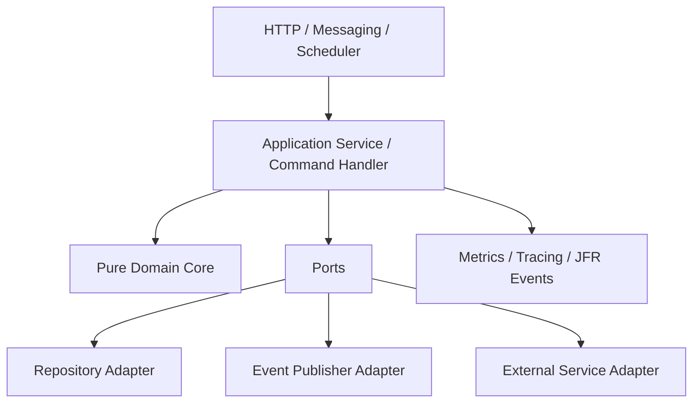
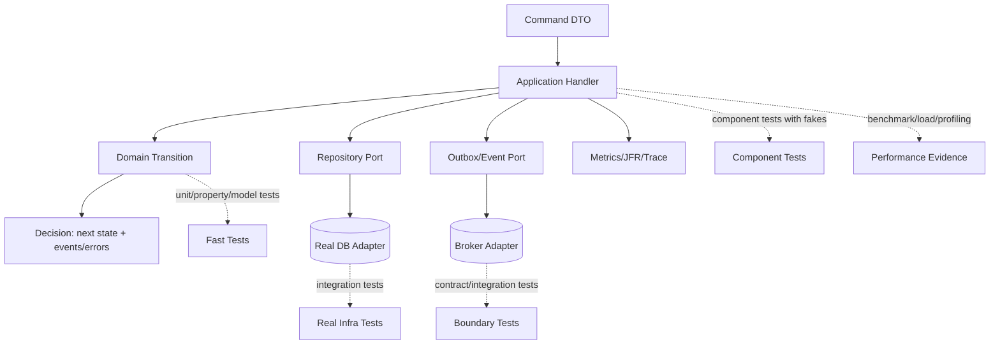

# Part 004 — Design for Testability and Measurability

> Tujuan bagian ini: membuat kode Java yang **mudah dibuktikan**, **mudah diuji**, **mudah diukur**, dan **mudah didiagnosis**. Testability bukan soal menambahkan mock setelah kode selesai. Testability adalah property desain.

Kalimat utama bagian ini:

```text
A system that is hard to test is usually a system with hidden decisions, hidden time, hidden state, hidden IO, or hidden coupling.
```

Performance juga begitu:

```text
A system that is hard to measure is usually a system with unclear boundaries, missing workload model, invisible resource usage, or no stable observation points.
```

Jadi kita tidak mulai dari “library testing apa”. Kita mulai dari desain kode.

---

## 1. Testability Is a Design Constraint

Kode yang mudah diuji punya beberapa karakteristik:

- keputusan bisnis terpisah dari IO;
- waktu bisa dikontrol;
- randomness bisa dikontrol;
- dependency eksternal berada di boundary;
- side effect terlihat;
- state transition eksplisit;
- error semantics eksplisit;
- observability bukan afterthought;
- performance-critical path punya measurement seam;
- invariant bisa diekspresikan di test dan runtime.

Kode yang sulit diuji biasanya seperti ini:

```java
public void escalate(String caseId, String reason) {
    var now = Instant.now();
    var conn = DriverManager.getConnection(System.getenv("DB_URL"));
    var caseFile = loadCase(conn, caseId);

    if (caseFile.status().equals("CLOSED")) {
        throw new IllegalStateException("closed");
    }

    var auditPayload = "case=" + caseId + ",reason=" + reason + ",time=" + now;
    new HttpClient().send(auditPayload);

    updateStatus(conn, caseId, "ESCALATION_REVIEW");
    logger.info("Escalated " + caseId);
}
```

Masalahnya bukan hanya style.

Hidden dependencies:

- real time;
- real DB;
- environment variable;
- network client;
- stringly typed state;
- audit payload construction;
- logging as only observation;
- transaction boundary tidak jelas;
- domain rule tercampur IO.

Test menjadi mahal karena tidak ada seam.

---

## 2. The Core Pattern: Pure Core, Effectful Shell

Untuk sistem Java enterprise, pattern paling praktis adalah:

```text
pure domain core + application orchestration + effectful adapters
```



Core domain:

- no database;
- no HTTP;
- no Kafka;
- no Redis;
- no current time directly;
- no random UUID directly;
- no logging as behavior;
- no environment access.

Application layer:

- loads state;
- calls domain behavior;
- persists result;
- publishes events;
- controls transaction;
- emits observability;
- maps failures.

Adapters:

- implement IO details;
- handle database-specific mapping;
- handle message serialization;
- handle network behavior;
- can be integration-tested separately.

---

## 3. Example: Bad Design vs Testable Design

### 3.1 Domain model

Use types, not strings.

```java
enum CaseStatus {
    DRAFT,
    SUBMITTED,
    UNDER_REVIEW,
    ESCALATION_REQUESTED,
    ESCALATION_REVIEW,
    DECIDED,
    CLOSED
}

record CaseId(String value) {
    CaseId {
        if (value == null || value.isBlank()) {
            throw new IllegalArgumentException("case id must not be blank");
        }
    }
}

record OfficerId(String value) {}
record EscalationReason(String value) {
    EscalationReason {
        if (value == null || value.isBlank()) {
            throw new IllegalArgumentException("escalation reason is required");
        }
    }
}
```

Strong types reduce invalid states.

### 3.2 Domain event

```java
sealed interface CaseEvent permits CaseEscalated, CaseEscalationRejected {}

record CaseEscalated(
    CaseId caseId,
    OfficerId officerId,
    EscalationReason reason,
    Instant occurredAt
) implements CaseEvent {}

record CaseEscalationRejected(
    CaseId caseId,
    OfficerId officerId,
    String reason,
    Instant occurredAt
) implements CaseEvent {}
```

### 3.3 Domain result

Avoid hiding side effects.

```java
record Decision<T>(T state, List<CaseEvent> events) {
    static <T> Decision<T> of(T state, List<CaseEvent> events) {
        return new Decision<>(state, List.copyOf(events));
    }
}
```

### 3.4 Aggregate behavior

```java
record CaseFile(
    CaseId id,
    CaseStatus status,
    Optional<OfficerId> activeOwner,
    Optional<Instant> escalationStartedAt
) {
    Decision<CaseFile> escalate(
        OfficerId officerId,
        EscalationReason reason,
        Instant now
    ) {
        if (status == CaseStatus.CLOSED) {
            return Decision.of(
                this,
                List.of(new CaseEscalationRejected(id, officerId, "case is closed", now))
            );
        }

        if (status == CaseStatus.ESCALATION_REVIEW) {
            return Decision.of(this, List.of()); // idempotent no-op
        }

        var next = new CaseFile(
            id,
            CaseStatus.ESCALATION_REVIEW,
            activeOwner,
            Optional.of(now)
        );

        return Decision.of(
            next,
            List.of(new CaseEscalated(id, officerId, reason, now))
        );
    }
}
```

This is testable because:

- input explicit;
- time explicit;
- result explicit;
- event explicit;
- no IO;
- no hidden global state;
- idempotency visible;
- invalid state behavior visible.

Unit test:

```java
@Test
void closedCaseCannotBeEscalated() {
    var now = Instant.parse("2026-07-02T10:00:00Z");
    var file = new CaseFile(
        new CaseId("CASE-1"),
        CaseStatus.CLOSED,
        Optional.of(new OfficerId("OFF-1")),
        Optional.empty()
    );

    var decision = file.escalate(
        new OfficerId("OFF-1"),
        new EscalationReason("High public risk"),
        now
    );

    assertThat(decision.state().status()).isEqualTo(CaseStatus.CLOSED);
    assertThat(decision.events()).containsExactly(
        new CaseEscalationRejected(
            new CaseId("CASE-1"),
            new OfficerId("OFF-1"),
            "case is closed",
            now
        )
    );
}
```

No database. No mock. No clock. No sleep. No network.

---

## 4. Application Service as Controlled Side-Effect Boundary

Domain code decides. Application service coordinates.

```java
interface CaseRepository {
    Optional<CaseFile> findById(CaseId id);
    void save(CaseFile caseFile);
}

interface CaseEventPublisher {
    void publish(List<CaseEvent> events);
}

interface TransactionRunner {
    <T> T inTransaction(Supplier<T> operation);
}

interface CaseMetrics {
    void escalationAttempted();
    void escalationSucceeded();
    void escalationRejected(String reason);
}
```

Command:

```java
record EscalateCaseCommand(
    CaseId caseId,
    OfficerId officerId,
    EscalationReason reason,
    UUID commandId
) {}
```

Handler:

```java
final class EscalateCaseHandler {
    private final CaseRepository repository;
    private final CaseEventPublisher publisher;
    private final TransactionRunner tx;
    private final Clock clock;
    private final CaseMetrics metrics;

    EscalateCaseHandler(
        CaseRepository repository,
        CaseEventPublisher publisher,
        TransactionRunner tx,
        Clock clock,
        CaseMetrics metrics
    ) {
        this.repository = repository;
        this.publisher = publisher;
        this.tx = tx;
        this.clock = clock;
        this.metrics = metrics;
    }

    void handle(EscalateCaseCommand command) {
        metrics.escalationAttempted();

        tx.inTransaction(() -> {
            var file = repository.findById(command.caseId())
                .orElseThrow(() -> new CaseNotFoundException(command.caseId()));

            var decision = file.escalate(
                command.officerId(),
                command.reason(),
                Instant.now(clock)
            );

            repository.save(decision.state());
            publisher.publish(decision.events());

            if (decision.events().stream().anyMatch(CaseEscalated.class::isInstance)) {
                metrics.escalationSucceeded();
            }

            return null;
        });
    }
}
```

This is not “pure”. It is intentionally effectful. But effects are controlled through ports.

Component test can use fakes:

```java
@Test
void handlerPersistsEscalationAndPublishesEvent() {
    var repository = new InMemoryCaseRepository();
    var publisher = new RecordingCaseEventPublisher();
    var tx = new ImmediateTransactionRunner();
    var clock = Clock.fixed(Instant.parse("2026-07-02T10:00:00Z"), ZoneOffset.UTC);
    var metrics = new RecordingCaseMetrics();

    var caseId = new CaseId("CASE-1");
    repository.save(new CaseFile(
        caseId,
        CaseStatus.UNDER_REVIEW,
        Optional.of(new OfficerId("OFF-1")),
        Optional.empty()
    ));

    var handler = new EscalateCaseHandler(repository, publisher, tx, clock, metrics);

    handler.handle(new EscalateCaseCommand(
        caseId,
        new OfficerId("OFF-1"),
        new EscalationReason("High public risk"),
        UUID.fromString("00000000-0000-0000-0000-000000000001")
    ));

    assertThat(repository.findById(caseId)).get()
        .extracting(CaseFile::status)
        .isEqualTo(CaseStatus.ESCALATION_REVIEW);

    assertThat(publisher.events()).hasSize(1);
    assertThat(metrics.succeeded()).isEqualTo(1);
}
```

This test is still fast and deterministic, but covers application behavior.

---

## 5. Seams: Where Tests and Measurements Attach

A seam is a place where behavior can be observed, replaced, controlled, or measured.

Important seams:

| Seam | Purpose |
|---|---|
| Clock | deterministic time |
| IdGenerator | deterministic IDs |
| RandomSource | deterministic randomness |
| Repository port | fake vs real persistence |
| Event publisher port | observe emitted events |
| Transaction runner | isolate transaction semantics |
| External client port | fake external services |
| Serializer boundary | contract/schema testing |
| Executor/Scheduler | deterministic async behavior |
| Metrics/JFR event | runtime measurement |
| Workload boundary | benchmark/load test entrypoint |

Bad design hides seams.

Good design makes seams explicit but not excessive.

---

## 6. Time Must Be Injectable

Time bugs are common in systems with SLA, expiration, retry, timeout, lock lease, token validity, and scheduled jobs.

Bad:

```java
if (Instant.now().isAfter(caseFile.slaDeadline())) {
    escalate(caseFile);
}
```

Better:

```java
final class SlaEvaluator {
    private final Clock clock;

    SlaEvaluator(Clock clock) {
        this.clock = clock;
    }

    boolean isBreached(CaseFile file) {
        return Instant.now(clock).isAfter(file.slaDeadline());
    }
}
```

But for pure domain logic, pass `now` as a value:

```java
boolean isBreachedAt(Instant now) {
    return now.isAfter(slaDeadline);
}
```

Rule of thumb:

```text
Domain method: pass time as value.
Application service: owns Clock.
Infrastructure: maps external time formats.
```

Testing time progression:

```java
final class MutableClock extends Clock {
    private Instant instant;
    private final ZoneId zone;

    MutableClock(Instant instant, ZoneId zone) {
        this.instant = instant;
        this.zone = zone;
    }

    void advance(Duration duration) {
        instant = instant.plus(duration);
    }

    @Override public ZoneId getZone() { return zone; }
    @Override public Clock withZone(ZoneId zone) { return new MutableClock(instant, zone); }
    @Override public Instant instant() { return instant; }
}
```

Use carefully. Many tests only need `Clock.fixed`.

---

## 7. Randomness and IDs Must Be Controlled

Bad:

```java
var caseId = UUID.randomUUID();
```

This makes tests harder to assert and failures harder to reproduce.

Better:

```java
interface IdGenerator<T> {
    T nextId();
}

final class UuidCaseIdGenerator implements IdGenerator<CaseId> {
    @Override
    public CaseId nextId() {
        return new CaseId(UUID.randomUUID().toString());
    }
}
```

Test generator:

```java
final class FixedIdGenerator<T> implements IdGenerator<T> {
    private final Queue<T> ids;

    FixedIdGenerator(List<T> ids) {
        this.ids = new ArrayDeque<>(ids);
    }

    @Override
    public T nextId() {
        return ids.remove();
    }
}
```

For property-based testing, randomness should be seedable and failing seeds should be printed.

Rule:

```text
Production may use randomness. Tests need reproducibility.
```

---

## 8. Make State Transitions Explicit

Hidden state transition:

```java
caseFile.setStatus("ESCALATION_REVIEW");
caseFile.setEscalated(true);
caseFile.setUpdatedAt(Instant.now());
```

Better:

```java
Decision<CaseFile> decision = caseFile.escalate(officerId, reason, now);
```

Why?

Because explicit transition gives you:

- one place to enforce invariant;
- one method to test;
- one event list to assert;
- one object to model formally;
- one transition relation to use in model-based testing.

A state transition should usually answer:

```text
Given current state + command + time/context,
what is the next state + emitted events/rejections?
```

This maps cleanly to formal modeling.

---

## 9. Prefer Return Values Over Hidden Side Effects

Hidden side effect:

```java
void approve() {
    this.status = APPROVED;
    auditService.record(...);
    notificationService.send(...);
}
```

Better:

```java
Decision<Order> approve(Approver approver, Instant now) {
    var next = withStatus(OrderStatus.APPROVED);
    return Decision.of(next, List.of(new OrderApproved(id, approver.id(), now)));
}
```

Application layer decides what to do with event.

Benefits:

- unit test can inspect events;
- event publication can be retried/outboxed;
- domain logic remains deterministic;
- mutation/property testing easier;
- formal specification easier.

---

## 10. Ports Should Be Semantic, Not CRUD-Shaped by Accident

Bad port:

```java
interface CaseRepository {
    void insert(CaseEntity entity);
    void update(CaseEntity entity);
    List<CaseEntity> select(String sql);
}
```

This leaks persistence structure.

Better:

```java
interface CaseRepository {
    Optional<CaseFile> findById(CaseId id);
    void save(CaseFile file);
    boolean hasActiveEscalation(CaseId id);
}
```

For performance-sensitive paths, ports should expose intent:

```java
interface CaseSearchRepository {
    Page<CaseSummary> findCasesForOfficer(
        OfficerId officerId,
        CaseSearchFilter filter,
        PageRequest page
    );
}
```

This lets you integration-test query behavior and benchmark specific workload.

Avoid generic repository as a reflex. It often hides important access patterns.

---

## 11. Fakes Must Preserve Important Semantics

A fake is not always safe.

Example in-memory repository:

```java
final class InMemoryCaseRepository implements CaseRepository {
    private final Map<CaseId, CaseFile> files = new HashMap<>();

    @Override
    public Optional<CaseFile> findById(CaseId id) {
        return Optional.ofNullable(files.get(id));
    }

    @Override
    public void save(CaseFile file) {
        files.put(file.id(), file);
    }
}
```

Good for component tests.

But it does not preserve:

- transaction isolation;
- unique constraints;
- optimistic locking;
- SQL mapping;
- database serialization;
- concurrent behavior.

So do not let fake tests replace integration tests.

Rule:

```text
Use fakes for application behavior.
Use real dependencies for dependency semantics.
```

If fake semantics matter, document them.

---

## 12. Transaction Boundary Must Be Visible

A lot of correctness bugs live around transactions.

Questions:

- Is event published inside or after transaction?
- What happens if publish succeeds but DB commit fails?
- What happens if DB commit succeeds but publish fails?
- Is outbox needed?
- Is idempotency key stored in same transaction?
- What isolation level is assumed?

Bad hidden transaction:

```java
@Transactional
public void handle(Command command) {
    repository.save(...);
    publisher.publish(...);
}
```

The annotation is not bad. The hidden semantics are the risk.

Make the policy explicit in design docs and tests.

Example outbox-oriented boundary:

```java
interface Outbox {
    void append(List<CaseEvent> events);
}

final class EscalateCaseHandler {
    void handle(EscalateCaseCommand command) {
        tx.inTransaction(() -> {
            var file = repository.get(command.caseId());
            var decision = file.escalate(command.officerId(), command.reason(), Instant.now(clock));

            repository.save(decision.state());
            outbox.append(decision.events());
            return null;
        });
    }
}
```

Now the test can verify:

```text
state and outbox are updated atomically
```

Integration test can verify the real DB constraint.

---

## 13. Design for Failure Injection

If failure modes cannot be triggered, they will not be tested.

Bad:

```java
paymentGateway.charge(request);
```

With concrete gateway deeply buried, testing timeout/retry behavior is painful.

Better:

```java
interface PaymentGateway {
    ChargeResult charge(ChargeRequest request) throws PaymentGatewayException;
}
```

Failure fake:

```java
final class FailingPaymentGateway implements PaymentGateway {
    private final RuntimeException failure;

    FailingPaymentGateway(RuntimeException failure) {
        this.failure = failure;
    }

    @Override
    public ChargeResult charge(ChargeRequest request) {
        throw failure;
    }
}
```

But do not stop there. Also design for:

- timeout;
- slow response;
- partial success;
- duplicate response;
- malformed response;
- retryable vs permanent error;
- rate limit;
- circuit open;
- dependency unavailable.

Failure behavior should be testable at component level and validated at integration/system level.

---

## 14. Async Code Needs Deterministic Control

Async code is often hard to test because execution escapes the test.

Bad:

```java
CompletableFuture.runAsync(() -> publisher.publish(event));
```

Problems:

- uses common pool;
- no deterministic completion;
- exceptions may be swallowed;
- test cannot control scheduling;
- production behavior depends on global resource.

Better:

```java
interface TaskExecutor {
    void execute(Runnable task);
}

final class JavaExecutorTaskExecutor implements TaskExecutor {
    private final Executor executor;

    JavaExecutorTaskExecutor(Executor executor) {
        this.executor = executor;
    }

    @Override
    public void execute(Runnable task) {
        executor.execute(task);
    }
}
```

Test executor:

```java
final class RecordingTaskExecutor implements TaskExecutor {
    private final List<Runnable> tasks = new ArrayList<>();

    @Override
    public void execute(Runnable task) {
        tasks.add(task);
    }

    void runAll() {
        tasks.forEach(Runnable::run);
        tasks.clear();
    }
}
```

Now test can say:

```java
handler.handle(command);
assertThat(publisher.events()).isEmpty();
executor.runAll();
assertThat(publisher.events()).hasSize(1);
```

This makes async behavior observable.

---

## 15. Observability Is a Test Surface

Observability is not only for production. It is also a verification surface.

A system should expose:

- business metrics;
- technical metrics;
- traces for boundary calls;
- structured logs for diagnosis;
- JFR custom events for low-level JVM/runtime-sensitive paths;
- health/readiness signals;
- invariant violation counters.

Example metrics interface:

```java
interface CaseMetrics {
    void escalationAttempted();
    void escalationSucceeded();
    void escalationRejected(String reason);
    void invariantViolation(String invariantName);
}
```

Test can assert metrics when meaningful:

```java
assertThat(metrics.counter("case.escalation.succeeded")).isEqualTo(1);
```

But do not assert every metric in every unit test. Metrics are behavior only when they represent a contract:

- audit-critical counter;
- billing meter;
- SLA metric;
- alerting invariant;
- operational safety signal.

---

## 16. JFR Custom Events for Measurability

For performance-sensitive Java code, logs are often too heavy or too coarse.

JDK Flight Recorder can capture structured runtime events with low overhead when configured appropriately.

Example custom event:

```java
import jdk.jfr.Category;
import jdk.jfr.Event;
import jdk.jfr.Label;
import jdk.jfr.Name;

@Name("com.example.CaseSearch")
@Label("Case Search")
@Category({"Application", "Case"})
final class CaseSearchEvent extends Event {
    @Label("Officer ID")
    String officerId;

    @Label("Result Count")
    int resultCount;

    @Label("Filter Count")
    int filterCount;
}
```

Usage:

```java
List<CaseSummary> search(CaseSearchQuery query) {
    var event = new CaseSearchEvent();
    event.officerId = query.officerId().value();
    event.filterCount = query.filters().size();

    event.begin();
    try {
        var result = repository.search(query);
        event.resultCount = result.size();
        return result;
    } finally {
        event.commit();
    }
}
```

This gives you a measurement point around a business operation.

Design rule:

```text
Performance-critical use cases should have stable observation points.
```

Not everything needs custom JFR events. Use them for hot paths, expensive workflows, and areas where normal metrics/traces are insufficient.

---

## 17. Design for Benchmarking

Benchmarking is easier when the code has a stable entrypoint with controllable inputs.

Hard to benchmark:

```java
public ResponseEntity<?> search(HttpServletRequest request) {
    var user = auth.currentUser();
    var filters = parse(request);
    var result = repository.search(user, filters);
    return ResponseEntity.ok(mapper.toJson(result));
}
```

Too much mixed together:

- HTTP parsing;
- auth;
- filter parsing;
- repository;
- mapping;
- serialization.

Better split:

```java
final class CaseSearchService {
    SearchResult search(CaseSearchQuery query) {
        var normalized = normalizer.normalize(query);
        var page = repository.search(normalized);
        return assembler.assemble(page);
    }
}
```

Now you can benchmark:

- filter normalization;
- query assembly;
- mapping;
- serialization;
- repository integration separately;
- full service path as macrobenchmark.

JMH benchmark entrypoint should target a stable operation:

```java
@Benchmark
public SearchResult searchHotOfficer(SearchBenchmarkState state) {
    return state.service.search(state.hotOfficerQuery);
}
```

But remember: benchmarkable code is not automatically realistic. You still need representative state and workload.

---

## 18. Make Allocation Visible

Performance bugs in Java often come from allocation rate, not obvious CPU logic.

Allocation-heavy hidden design:

```java
String payload = cases.stream()
    .map(c -> c.id() + ":" + c.status() + ":" + c.owner().orElse(""))
    .collect(Collectors.joining("\n"));
```

May be fine. May be a problem in a hot path.

Design for measurability:

- isolate mapping function;
- benchmark under representative size;
- profile allocation;
- avoid premature optimization;
- document performance assumption.

Example assumption:

```text
Case summary mapping is called for every search request.
Typical page size: 50.
P99 page size: 500.
Must not allocate more than 2 MB per request at P99 size.
```

Now you can measure it.

Without a target, “optimize allocation” is vague.

---

## 19. Error Semantics Must Be Typed

Bad:

```java
throw new RuntimeException("failed");
```

Better:

```java
sealed interface EscalateCaseError permits CaseNotFound, CaseAlreadyClosed, UnauthorizedOfficer {}

record CaseNotFound(CaseId caseId) implements EscalateCaseError {}
record CaseAlreadyClosed(CaseId caseId) implements EscalateCaseError {}
record UnauthorizedOfficer(OfficerId officerId, CaseId caseId) implements EscalateCaseError {}
```

Result type style:

```java
sealed interface EscalateCaseResult permits EscalateCaseSucceeded, EscalateCaseRejected {}

record EscalateCaseSucceeded(CaseId caseId, List<CaseEvent> events) implements EscalateCaseResult {}
record EscalateCaseRejected(CaseId caseId, EscalateCaseError error) implements EscalateCaseResult {}
```

You do not need to use result types everywhere. But for domain/application workflows, typed failure improves:

- testability;
- API error mapping;
- auditability;
- observability;
- retry policy;
- formal modeling.

An exception can still be right for programmer errors or unrecoverable infrastructure failures. The point is not “never throw”. The point is to make expected business failure explicit.

---

## 20. Make Invariants Executable

An invariant should appear in more than one place:

1. design document;
2. domain code;
3. tests;
4. database constraint if applicable;
5. runtime metric/assertion if critical.

Example invariant:

```text
A case cannot have more than one active owner.
```

Domain check:

```java
boolean hasActiveOwner() {
    return activeOwner.isPresent();
}
```

Database constraint idea:

```sql
CREATE UNIQUE INDEX ux_case_active_owner
ON case_assignment(case_id)
WHERE active = true;
```

Production invariant query:

```sql
SELECT case_id, COUNT(*)
FROM case_assignment
WHERE active = true
GROUP BY case_id
HAVING COUNT(*) > 1;
```

Metric:

```text
case_assignment.active_owner_violation.count
```

Test:

```java
@Test
void cannotAssignSecondActiveOwner() {
    // domain or integration-level test depending on ownership model
}
```

This is what “defense in depth” means for correctness.

---

## 21. Avoid Testability Damage from Framework-Centric Design

Frameworks are useful. But framework-centric design often hides domain logic inside annotations and callbacks.

Smells:

```java
@Entity
class CaseEntity {
    @PrePersist
    void beforeSave() {
        this.updatedAt = Instant.now();
        if (status.equals("CLOSED")) {
            throw new RuntimeException("...");
        }
    }
}
```

Problems:

- domain rule triggered only under persistence lifecycle;
- time hidden;
- hard to unit test;
- behavior differs if entity not persisted;
- framework callback becomes business logic host.

Better:

```java
CaseFile next = caseFile.close(now);
repository.save(next);
```

Use framework annotations for mapping and infrastructure, not as the primary expression of domain behavior.

---

## 22. Avoid Over-Abstraction

Testability does not mean wrapping everything in interfaces.

Bad:

```java
interface StringTrimmer {
    String trim(String value);
}
```

Unnecessary abstraction creates noise.

Use seams where there is:

- IO;
- time;
- randomness;
- external dependency;
- expensive operation;
- nondeterminism;
- policy variation;
- performance measurement need;
- domain boundary.

Do not abstract stable pure functions merely for mocking.

Rule:

```text
A seam should correspond to a meaningful boundary or source of nondeterminism.
```

---

## 23. Designing Test Data

Test data should be minimal, explicit, and semantic.

Bad:

```java
var file = new CaseFile(
    new CaseId("1"),
    CaseStatus.UNDER_REVIEW,
    Optional.of(new OfficerId("abc")),
    Optional.empty()
);
```

Repeated everywhere, noisy.

Better builder:

```java
final class CaseFileBuilder {
    private CaseId id = new CaseId("CASE-1");
    private CaseStatus status = CaseStatus.UNDER_REVIEW;
    private Optional<OfficerId> activeOwner = Optional.of(new OfficerId("OFF-1"));
    private Optional<Instant> escalationStartedAt = Optional.empty();

    static CaseFileBuilder aCaseFile() {
        return new CaseFileBuilder();
    }

    CaseFileBuilder closed() {
        this.status = CaseStatus.CLOSED;
        return this;
    }

    CaseFileBuilder withoutOwner() {
        this.activeOwner = Optional.empty();
        return this;
    }

    CaseFile build() {
        return new CaseFile(id, status, activeOwner, escalationStartedAt);
    }
}
```

Usage:

```java
var file = aCaseFile().closed().build();
```

Builder method names should express meaning, not fields only.

Good:

```java
closed()
underReview()
withActiveOwner("OFF-1")
withoutEscalation()
```

Less good:

```java
status(CLOSED)
activeOwner(Optional.empty())
```

Both have use cases, but semantic builders make tests read like business cases.

---

## 24. Test Data Should Not Hide Important Differences

A common anti-pattern:

```java
TestFixtures.validCase()
```

Used everywhere.

Problem: nobody knows what “valid” means. Tests become coupled to a giant fixture.

Better:

```java
var file = aCaseFile()
    .underReview()
    .withActiveOwner("OFF-1")
    .withoutEscalation()
    .build();
```

Now the relevant facts are visible.

Rule:

```text
Hide irrelevant setup. Expose facts that affect the assertion.
```

---

## 25. Design for Contract Testing

Contract testing is easier when boundary models are explicit.

Bad:

```java
Map<String, Object> response = new HashMap<>();
response.put("id", caseFile.id().value());
response.put("status", caseFile.status().name());
response.put("owner", caseFile.activeOwner().map(OfficerId::value).orElse(null));
```

Better:

```java
record CaseResponse(
    String id,
    String status,
    String ownerId
) {}

final class CaseResponseMapper {
    CaseResponse toResponse(CaseFile file) {
        return new CaseResponse(
            file.id().value(),
            file.status().name(),
            file.activeOwner().map(OfficerId::value).orElse(null)
        );
    }
}
```

Benefits:

- serialization test can target DTO;
- OpenAPI schema maps to explicit model;
- backward compatibility easier to reason about;
- mapping can be unit-tested;
- API boundary does not leak domain object directly.

---

## 26. Design for Integration Testing

Integration test should target adapter behavior.

Repository adapter:

```java
final class JdbcCaseRepository implements CaseRepository {
    private final DataSource dataSource;

    JdbcCaseRepository(DataSource dataSource) {
        this.dataSource = dataSource;
    }

    @Override
    public Optional<CaseFile> findById(CaseId id) {
        // SQL mapping lives here
    }

    @Override
    public void save(CaseFile file) {
        // SQL mapping lives here
    }
}
```

Integration test should verify:

- save/load round trip;
- nullability;
- enum mapping;
- constraints;
- optimistic locking;
- transaction behavior;
- query sorting/pagination;
- migration compatibility.

It should not retest every domain branch.

Good integration test name:

```text
saveAndLoadPreservesEscalationState
```

Bad integration test name:

```text
closedCaseCannotBeEscalated
```

That rule belongs mostly in domain/component tests. Integration may verify DB constraint if the database enforces it.

---

## 27. Design for Formal Modeling

Formal modeling becomes easier when implementation has explicit:

- states;
- commands;
- transitions;
- invariants;
- events;
- idempotency keys;
- ownership rules;
- retry rules.

A Java transition like this:

```java
Decision<CaseFile> escalate(OfficerId officerId, EscalationReason reason, Instant now)
```

maps naturally to a formal transition:

```text
Escalate(case, officer) ==
  IF status[case] = CLOSED THEN unchanged
  ELSE status' = [status EXCEPT ![case] = ESCALATION_REVIEW]
```

You do not need to write TLA+ first for every feature. But if the code is designed with explicit transitions, formal modeling becomes possible when needed.

The reverse is also true:

```text
If you cannot describe the transition relation clearly, the code is probably too implicit.
```

---

## 28. Design for Performance Triage

When production latency regresses, you need to answer quickly:

```text
Where is time spent?
Where is allocation happening?
Where is blocking happening?
What changed?
Which workload is affected?
Which resource saturated?
```

Design can help.

For each critical use case, define:

```text
Entry point:
Expected input size:
External dependencies:
Timeout budget:
Metrics:
Trace attributes:
JFR event if needed:
Benchmark scenario:
Load test scenario:
Known bottleneck candidates:
```

Example:

```text
Use case: Search active cases for officer
Entry point: CaseSearchService.search
Typical page size: 50
P99 page size: 500
Dependencies: PostgreSQL, authorization service cache
Timeout budget: 300 ms P99
Metrics: case_search.duration, case_search.result_count
Trace attrs: officer_id_hash, filter_count, page_size
JFR event: com.example.CaseSearch
Benchmark: mapping/filter normalization JMH
Load test: 200 rps mixed hot/cold officers
Bottlenecks: DB index, JSON serialization, authorization expansion
```

Now performance engineering is not guesswork.

---

## 29. The Measurability Boundary Pattern

For important operations, create a boundary where timing, tracing, and metrics are centralized.

```java
final class MeasuredCaseSearchService {
    private final CaseSearchService delegate;
    private final CaseSearchMetrics metrics;

    SearchResult search(CaseSearchQuery query) {
        long start = System.nanoTime();
        try {
            var result = delegate.search(query);
            metrics.success(Duration.ofNanos(System.nanoTime() - start), result.size());
            return result;
        } catch (RuntimeException ex) {
            metrics.failure(Duration.ofNanos(System.nanoTime() - start), ex.getClass().getSimpleName());
            throw ex;
        }
    }
}
```

This wrapper can be tested separately.

But be careful:

- do not put business logic in measurement wrapper;
- avoid high-cardinality metric labels;
- do not log sensitive data;
- use monotonic time for duration;
- define whether failed attempts count toward latency SLO.

---

## 30. Performance-Friendly API Design

Testability and performance often align:

| Design choice | Testability benefit | Performance benefit |
|---|---|---|
| Explicit input DTO | easy fixtures | avoids repeated parsing |
| Pure mapping function | unit/JMH benchmarkable | optimizable hot path |
| Bounded page size | property/integration testable | protects memory/latency |
| Semantic repository method | focused integration test | index/workload alignment |
| Typed errors | clear assertions | avoids expensive exception flow for expected rejection |
| Clock injection | deterministic tests | correct duration measurement |
| Explicit batch operation | easy workload test | reduces per-item overhead |

Example batch-oriented port:

```java
interface CaseAssignmentRepository {
    Map<CaseId, Assignment> findActiveAssignments(Set<CaseId> caseIds);
}
```

This is more testable and often faster than hiding N+1 calls inside a loop.

---

## 31. Common Anti-Patterns

### 31.1 Static global helper with hidden dependencies

```java
CaseRules.canEscalate(caseFile)
```

Fine if pure. Dangerous if it hides DB/time/config.

### 31.2 Service locator

```java
var repository = ServiceLocator.get(CaseRepository.class);
```

Harder to test, reason, and measure.

### 31.3 Business logic in mapper

```java
if (dto.status().equals("CLOSED")) reject();
```

Mapping should map. Domain/application should decide.

### 31.4 Over-mocking framework internals

```java
verify(entityManager).createQuery(...)
```

Usually brittle. Prefer repository integration test.

### 31.5 Production-only observability

If metrics/traces are impossible to assert or exercise before production, they are likely incomplete.

### 31.6 Sleep-based async tests

```java
Thread.sleep(5000);
```

A sign that completion is not observable.

### 31.7 Benchmarking a tangled endpoint

If you can only benchmark via full HTTP stack, you cannot isolate CPU, allocation, serialization, DB, and network effects.

---

## 32. Practical Design Checklist

Before implementing a non-trivial feature, answer:

```text
Correctness
- What are the invariants?
- What are invalid states?
- What are expected business failures?
- Are state transitions explicit?
- Are side effects returned or observable?

Testability
- Can domain logic run without DB/network?
- Can time be fixed?
- Can IDs/randomness be deterministic?
- Can external failures be injected?
- Can async work be controlled?
- Are fixtures minimal and semantic?

Integration
- Which dependency semantics must be tested for real?
- Which fake semantics are safe?
- Are transaction boundaries visible?
- Are schema/contract boundaries explicit?

Performance
- What is the expected workload?
- What is the latency/throughput/resource target?
- Is there a stable benchmark entrypoint?
- Are allocation/time/blocking observable?
- Are metrics/traces/JFR events available for critical paths?

Production
- Which invariant violations should be monitored?
- Which metrics indicate degradation?
- What evidence will be captured during incidents?
```

This checklist is more important than memorizing test frameworks.

---

## 33. Minimal Refactoring Recipe

When you inherit hard-to-test Java code, do not rewrite everything.

Use this sequence:

```text
1. Identify the behavior you need to protect.
2. Write a characterization test if possible.
3. Extract time/randomness/config access behind parameters or ports.
4. Extract pure decision logic from IO shell.
5. Introduce semantic result/event object.
6. Add focused unit/component tests around extracted logic.
7. Add integration tests around adapters.
8. Add metrics around critical operations.
9. Add benchmark/profiling only for performance-sensitive paths.
```

Example before:

```java
public void process(CaseRequest request) {
    // 300 lines: parse, validate, DB, rules, HTTP, logging, metrics
}
```

After first safe extraction:

```java
CaseDecision decision = decisionEngine.decide(request.toCommand(), now);
```

You do not need perfect architecture to improve testability. You need one useful seam at a time.

---

## 34. What Good Looks Like

A well-designed Java feature has this shape:



The design supports multiple evidence layers without contorting production code for tests.

---

## 35. Part Summary

Key takeaways:

- Testability and measurability are design properties.
- Keep domain decisions separate from IO.
- Make time, randomness, IDs, and async scheduling controllable.
- Make state transitions explicit.
- Prefer observable decisions/events over hidden side effects.
- Use semantic ports at meaningful boundaries.
- Use fakes for application behavior, real dependencies for dependency semantics.
- Make transaction and failure semantics explicit.
- Treat observability as a verification surface.
- Design performance-critical paths with stable measurement points.
- Do not over-abstract; create seams where uncertainty, IO, nondeterminism, or measurement need exists.

The next part moves into JUnit deeply. Now that design seams exist, we can use JUnit not merely to run tests, but to build a disciplined test architecture.

---

## References

- JUnit User Guide: https://docs.junit.org/
- Testcontainers for Java: https://java.testcontainers.org/
- JDK Flight Recorder: https://dev.java/learn/jvm/jfr/
- Java Microbenchmark Harness: https://openjdk.org/projects/code-tools/jmh/
