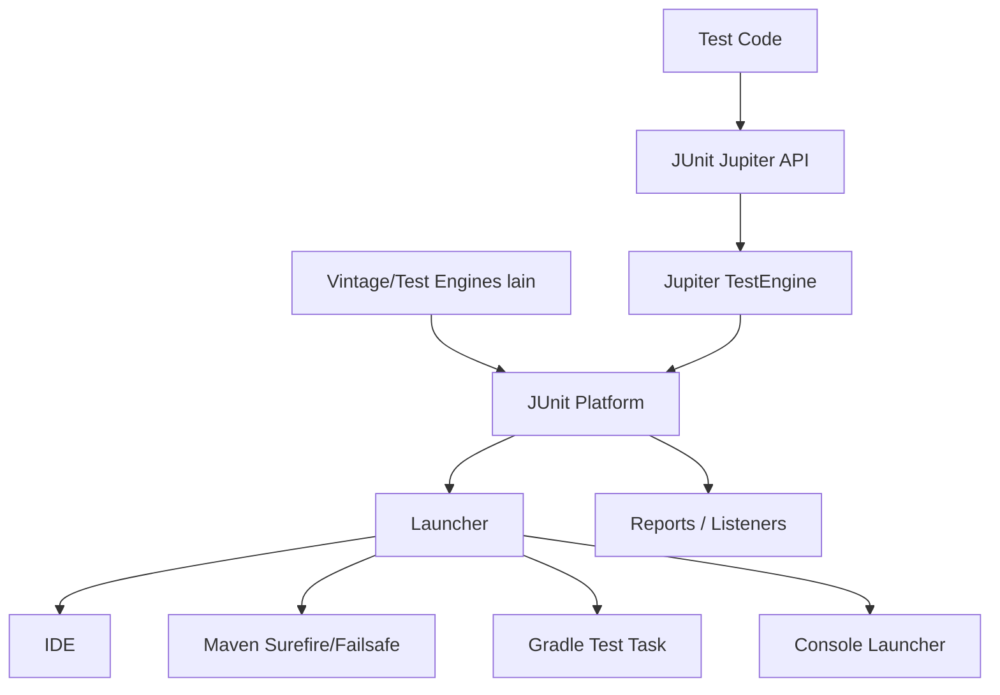
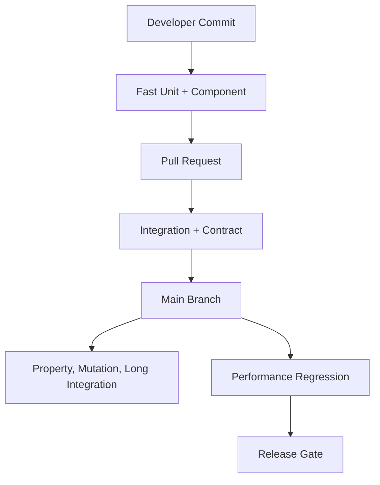

# Part 005 — JUnit Platform Deep Dive

> Tujuan bagian ini: memakai JUnit bukan sebagai “annotation runner”, tetapi sebagai **testing platform** untuk membangun test suite Java yang cepat, jelas, bisa dipilah, bisa diperluas, dan bisa dipercaya.

JUnit adalah foundation, bukan strategi testing lengkap.

Kesalahan umum engineer intermediate adalah menganggap JUnit hanya kumpulan annotation:

```java
@Test
void shouldDoSomething() {
    assertEquals(expected, actual);
}
```

Engineer yang lebih kuat melihat JUnit sebagai runtime kecil untuk menjalankan eksperimen terkontrol:

```text
code under test + fixture + stimulus + oracle + lifecycle + execution policy + reporting
```

JUnit Platform menyediakan fondasi untuk menemukan dan menjalankan test framework di JVM. JUnit Jupiter menyediakan programming model dan extension model untuk menulis test dan extension modern. Di atas itu, build tool, IDE, CI, coverage, mutation testing, benchmark gate, dan reporting bisa menempel.

Bagian ini bukan tutorial “cara menulis test pertama”. Kita akan membedah bagaimana JUnit dipakai untuk codebase besar.

---

## 1. Mental Model: JUnit Is a Test Execution Platform

JUnit modern punya tiga layer besar:



Artinya:

- test ditulis memakai Jupiter API;
- test dijalankan oleh Jupiter engine;
- engine dijalankan di atas JUnit Platform;
- platform dipanggil oleh IDE, Maven, Gradle, atau console launcher;
- extension/listener/reporting bisa membaca lifecycle execution.

Kenapa ini penting?

Karena ketika test suite membesar, problem-nya bukan hanya assertion. Problem-nya adalah:

- discovery lambat;
- parallel execution tidak aman;
- integration test tercampur unit test;
- test environment tidak deterministic;
- tag dan naming tidak konsisten;
- flaky tests tidak bisa diisolasi;
- custom extension berlebihan;
- test result sulit ditriage;
- CI tidak tahu test mana yang harus jalan.

JUnit Platform memberi struktur untuk mengendalikan itu.

---

## 2. The Verification Unit: What Is a Test, Really?

Satu test yang baik punya enam bagian, walaupun tidak selalu terlihat eksplisit:

```text
subject      : apa yang diuji
fixture      : kondisi awal
stimulus     : aksi yang diberikan
oracle       : cara menentukan benar/salah
observation  : data yang diamati
cleanup      : pemulihan state/resources
```

Contoh buruk:

```java
@Test
void test1() {
    var service = new CaseService();
    var result = service.process("A");
    assertTrue(result != null);
}
```

Masalah:

- subject tidak jelas;
- fixture tidak jelas;
- stimulus terlalu opaque;
- oracle lemah;
- nama tidak menjelaskan rule;
- failure message tidak membantu;
- tidak ada invariant yang diuji.

Contoh lebih baik:

```java
@Test
void open_case_can_be_escalated_when_required_evidence_is_missing() {
    var caseFile = CaseFileBuilder.anOpenCase()
        .withRiskLevel(RiskLevel.HIGH)
        .withoutRequiredEvidence()
        .build();

    var decision = escalationPolicy.evaluate(caseFile, fixedTime);

    assertAll(
        () -> assertEquals(EscalationDecision.ESCALATE, decision.type()),
        () -> assertEquals("MISSING_REQUIRED_EVIDENCE", decision.reasonCode()),
        () -> assertEquals(fixedTime, decision.decidedAt())
    );
}
```

Kita tidak hanya mengecek output. Kita mengecek **behavioral contract**.

---

## 3. Naming: Test Names Are Failure Reports

Test name harus membantu saat CI gagal pukul 02:00.

Nama yang lemah:

```java
@Test
void testEscalation() { }
```

Nama yang lebih baik:

```java
@Test
void closed_case_cannot_be_escalated() { }

@Test
void high_risk_case_with_missing_evidence_requires_supervisor_review() { }

@Test
void duplicate_command_returns_existing_decision_without_creating_new_audit_event() { }
```

Prinsip:

```text
test name = business condition + expected behavior
```

Bukan:

```text
test name = method name + happy path
```

Untuk domain kompleks, nama test sering lebih bernilai daripada komentar. Nama test adalah index menuju rule.

---

## 4. JUnit Lifecycle: Powerful, Dangerous, Often Overused

JUnit menyediakan lifecycle method:

```java
@BeforeAll
static void beforeAll() { }

@BeforeEach
void beforeEach() { }

@AfterEach
void afterEach() { }

@AfterAll
static void afterAll() { }
```

Gunakan lifecycle untuk resource lifecycle, bukan untuk menyembunyikan cerita test.

Contoh yang terlalu tersembunyi:

```java
class CaseWorkflowTest {
    CaseFile caseFile;
    CaseService service;

    @BeforeEach
    void setup() {
        caseFile = createCaseWithManyDefaults();
        service = createServiceWithMocks();
    }

    @Test
    void escalates() {
        var result = service.escalate(caseFile.id());
        assertTrue(result.isEscalated());
    }
}
```

Pembaca tidak tahu test sedang dimulai dari state apa.

Lebih baik:

```java
@Test
void open_case_with_missing_evidence_is_escalated() {
    var caseFile = givenOpenCase()
        .withoutRequiredEvidence()
        .build();

    var service = caseServiceWithInMemoryRepository(caseFile);

    var result = service.escalate(caseFile.id(), commandMetadata());

    assertThat(result.status()).isEqualTo(CaseStatus.ESCALATION_REVIEW);
}
```

Gunakan `@BeforeEach` untuk hal generik yang tidak mengubah cerita test:

```java
@BeforeEach
void resetClock() {
    clock.setInstant(Instant.parse("2026-07-02T10:00:00Z"));
}
```

Jangan gunakan `@BeforeEach` untuk fixture domain yang berbeda-beda per test.

### Rule of thumb

| Lifecycle Usage | Bias |
|---|---|
| Start/stop expensive shared container | OK, but usually integration-test scoped |
| Reset deterministic clock/randomness | OK |
| Create default domain object used by every test | Dangerous |
| Hide mock behavior | Dangerous |
| Share mutable state between tests | Avoid |
| Cache immutable reference data | Usually OK |

---

## 5. Test Instance Lifecycle: Per Method vs Per Class

Default JUnit Jupiter lifecycle adalah satu instance test class per test method. Ini membantu isolation.

```text
new test instance -> beforeEach -> test -> afterEach
new test instance -> beforeEach -> test -> afterEach
```

Dengan `@TestInstance(TestInstance.Lifecycle.PER_CLASS)`, satu instance dipakai untuk semua test method.

```java
@TestInstance(TestInstance.Lifecycle.PER_CLASS)
class ExpensiveResourceTest {
    private ExpensiveFixture fixture;

    @BeforeAll
    void start() {
        fixture = ExpensiveFixture.start();
    }
}
```

Ini berguna saat:

- setup sangat mahal;
- resource immutable atau resettable;
- `@BeforeAll` non-static dibutuhkan;
- integration test memakai external resource.

Tetapi risikonya besar:

- mutable field bisa bocor antar test;
- parallel execution menjadi rawan;
- urutan test bisa diam-diam memengaruhi hasil;
- flakiness muncul sporadis.

Default terbaik:

```text
Use PER_METHOD unless there is a strong reason not to.
```

Jika memakai `PER_CLASS`, dokumentasikan kenapa.

---

## 6. Assertions: Oracle Quality Matters More Than Assertion Count

Assertion bukan sekadar “expected equals actual”. Assertion adalah oracle: mekanisme untuk membedakan behavior benar dan salah.

Oracle lemah:

```java
assertNotNull(response);
assertTrue(response.isSuccess());
```

Oracle lebih kuat:

```java
assertAll(
    () -> assertEquals(CommandStatus.ACCEPTED, response.status()),
    () -> assertEquals(existingCaseId, response.caseId()),
    () -> assertEquals(1, auditRepository.countByCaseId(existingCaseId)),
    () -> assertEquals(0, eventPublisher.publishedEventsOfType(CaseRejected.class).size())
);
```

Tapi banyak assertion tidak otomatis baik. Assertion harus memeriksa invariant yang relevan.

### Bad multi-assertion

```java
assertEquals("John", user.firstName());
assertEquals("Doe", user.lastName());
assertEquals("ACTIVE", user.status());
assertEquals("2026", user.createdAt().toString().substring(0, 4));
```

Ini sering hanya snapshot manual yang brittle.

### Good multi-assertion

```java
assertAll(
    () -> assertThat(decision.allowed()).isFalse(),
    () -> assertThat(decision.reasonCode()).isEqualTo("CASE_ALREADY_CLOSED"),
    () -> assertThat(decision.sideEffects()).isEmpty(),
    () -> assertThat(caseFile.status()).isEqualTo(CaseStatus.CLOSED)
);
```

Ini mengecek rule utama dan absence of side effects.

---

## 7. AssertJ vs JUnit Assertions: Use the Right Tool

JUnit assertions cukup untuk banyak test sederhana.

```java
assertEquals(expected, actual);
assertThrows(InvalidTransitionException.class, () -> transition.apply(command));
assertAll(...);
```

AssertJ sering lebih readable untuk domain-rich assertions:

```java
assertThat(decision)
    .extracting(Decision::status, Decision::reasonCode)
    .containsExactly(DecisionStatus.REJECTED, "INVALID_STATE");
```

Untuk collection:

```java
assertThat(events)
    .extracting(DomainEvent::type)
    .containsExactly(
        EventType.CASE_ESCALATED,
        EventType.AUDIT_RECORDED
    );
```

Untuk custom assertion:

```java
assertThat(caseFile)
    .hasStatus(CaseStatus.ESCALATION_REVIEW)
    .hasAuditEvent("CASE_ESCALATED")
    .hasNoOpenValidationErrors();
```

Custom assertion akan dibahas lagi di Part 006. Prinsipnya:

```text
Make important domain checks read like domain language.
```

---

## 8. Exception Testing: Check the Contract, Not Just the Type

Test exception yang lemah:

```java
assertThrows(RuntimeException.class, () -> service.escalate(caseId));
```

Lebih baik:

```java
var ex = assertThrows(InvalidTransitionException.class,
    () -> workflow.transition(closedCase, EscalateCommand.now("missing evidence"))
);

assertAll(
    () -> assertEquals(CaseStatus.CLOSED, ex.currentStatus()),
    () -> assertEquals(CommandType.ESCALATE, ex.commandType()),
    () -> assertEquals("CLOSED_CASE_CANNOT_BE_ESCALATED", ex.reasonCode())
);
```

Exception adalah bagian dari API contract.

Untuk sistem enterprise, exception yang baik biasanya membawa:

- stable error code;
- human-readable message;
- machine-readable context;
- retryability classification;
- correlation id jika di boundary;
- domain reason jika di core.

Test harus memverifikasi classification, bukan hanya message string.

---

## 9. Assumptions: Skip Only When Environment Is Not Applicable

JUnit assumptions dipakai ketika test hanya valid pada kondisi tertentu.

```java
@Test
void uses_epoll_specific_transport() {
    assumeTrue(System.getProperty("os.name").toLowerCase().contains("linux"));

    // Linux-specific behavior
}
```

Jangan gunakan assumption untuk menutupi flaky test.

Buruk:

```java
assumeTrue(externalServiceIsAvailable());
```

Ini membuat suite tidak jujur. Jika external service wajib, test environment harus menyediakannya. Jika external service optional, test harus diberi tag integration dan dipisahkan.

Assumption baik untuk:

- OS-specific behavior;
- JDK-version-specific behavior;
- optional local developer tool;
- hardware-specific test;
- long-running diagnostic test.

Bukan untuk:

- menghindari fixing flaky test;
- mengabaikan dependency yang seharusnya disimulasikan;
- membuat CI “hijau” palsu.

---

## 10. Parameterized Tests: Matrix Without Copy-Paste

Parameterized tests berguna saat behavior sama, input bervariasi.

Contoh sederhana:

```java
@ParameterizedTest
@CsvSource({
    "OPEN, ESCALATE, ESCALATION_REVIEW",
    "ESCALATION_REVIEW, APPROVE, APPROVED",
    "APPROVED, CLOSE, CLOSED"
})
void valid_transition_moves_case_to_expected_status(
    CaseStatus from,
    CommandType command,
    CaseStatus expected
) {
    var caseFile = CaseFileBuilder.aCase().withStatus(from).build();

    var result = workflow.apply(caseFile, command);

    assertThat(result.status()).isEqualTo(expected);
}
```

Ini bagus untuk matrix kecil.

Tapi hati-hati: CSV mudah berubah menjadi spreadsheet tersembunyi yang sulit dibaca.

Untuk domain rule yang punya banyak field, pakai `@MethodSource`.

```java
@ParameterizedTest(name = "{index}: {0}")
@MethodSource("invalidTransitions")
void invalid_transition_is_rejected(TransitionScenario scenario) {
    var ex = assertThrows(InvalidTransitionException.class,
        () -> workflow.apply(scenario.caseFile(), scenario.command())
    );

    assertThat(ex.reasonCode()).isEqualTo(scenario.expectedReasonCode());
}

static Stream<TransitionScenario> invalidTransitions() {
    return Stream.of(
        scenario("closed cannot escalate")
            .givenCase(CaseFileBuilder.aClosedCase())
            .whenCommand(CommandType.ESCALATE)
            .thenReason("CLOSED_CASE_CANNOT_BE_ESCALATED"),

        scenario("approved cannot return to intake")
            .givenCase(CaseFileBuilder.anApprovedCase())
            .whenCommand(CommandType.REOPEN_INTAKE)
            .thenReason("APPROVED_CASE_CANNOT_RETURN_TO_INTAKE")
    );
}
```

### When parameterized tests are a bad fit

Parameterized test buruk ketika:

- setiap case butuh setup sangat berbeda;
- assertion berbeda-beda;
- nama scenario tidak informatif;
- row matrix terlalu besar;
- failure sulit ditriage;
- domain meaning hilang di angka/string.

Jika setiap row punya cerita berbeda, tulis test berbeda.

---

## 11. Nested Tests: Use Them for Context, Not Decoration

`@Nested` membantu mengelompokkan behavior berdasarkan context.

```java
class CaseWorkflowTest {

    @Nested
    class WhenCaseIsOpen {
        @Test
        void can_be_escalated_when_evidence_is_missing() { }

        @Test
        void can_be_closed_when_all_obligations_are_resolved() { }
    }

    @Nested
    class WhenCaseIsClosed {
        @Test
        void cannot_be_escalated() { }

        @Test
        void cannot_accept_new_evidence() { }
    }
}
```

Ini membuat struktur test mendekati state machine.

Pola bagus:

```text
Class = subject
Nested class = context/state
Test method = behavior/rule
```

Contoh:

```text
CaseWorkflowTest
  WhenCaseIsOpen
    can_be_escalated_when_evidence_is_missing
    can_be_assigned_to_investigator
  WhenCaseIsUnderReview
    cannot_be_closed_without_supervisor_approval
    can_request_additional_evidence
  WhenCaseIsClosed
    rejects_all_mutating_commands
```

Hindari nested terlalu dalam:

```text
CaseWorkflowTest
  WhenOpen
    AndHighRisk
      AndMissingEvidence
        AndSubmittedAfterDeadline
          shouldEscalate
```

Kalau nested sudah seperti decision tree, lebih baik buat scenario builder atau property-based test.

---

## 12. Dynamic Tests: Generated Test Cases With Explicit Names

Dynamic tests dibuat runtime via `@TestFactory`.

```java
@TestFactory
Stream<DynamicTest> all_valid_transitions_are_accepted() {
    return transitionCatalog.validTransitions().stream()
        .map(rule -> dynamicTest(rule.name(), () -> {
            var caseFile = CaseFileBuilder.aCase()
                .withStatus(rule.from())
                .build();

            var result = workflow.apply(caseFile, rule.command());

            assertThat(result.status()).isEqualTo(rule.to());
        }));
}
```

Dynamic tests cocok ketika:

- test case berasal dari catalog/rule table;
- nama test bisa dibuat meaningful;
- assertion sama;
- jumlah case cukup banyak;
- test data generated tapi deterministic.

Dynamic tests tidak cocok jika:

- test case random tanpa seed reproducibility;
- failure name tidak membantu;
- setup/teardown per dynamic node tidak dipahami;
- coverage sebenarnya property-based, bukan dynamic-example-based.

Untuk randomized exploration, nanti gunakan property-based testing di Part 011.

---

## 13. Tags: Execution Policy Is Part of Test Architecture

Tags memisahkan suite berdasarkan tujuan.

```java
@Tag("unit")
class CaseWorkflowTest { }

@Tag("integration")
class CaseRepositoryIT { }

@Tag("contract")
class CaseApiContractTest { }

@Tag("slow")
class MonthlyReportSoakTest { }
```

Tag bukan dekorasi. Tag adalah execution policy.

Contoh taxonomy sederhana:

| Tag | Meaning | Expected Runtime | CI Stage |
|---|---:|---:|---|
| `unit` | Pure/in-memory deterministic tests | milliseconds | every commit |
| `component` | Service with fakes/adapters | ms-seconds | every commit |
| `integration` | Real DB/broker/cache/container | seconds-minutes | PR/main |
| `contract` | Provider/consumer API compatibility | seconds | PR/main |
| `property` | Generative invariant tests | seconds-minutes | PR/nightly depending scope |
| `mutation` | Mutation analysis | minutes-hours | scheduled or important PR |
| `performance` | Benchmarks/load checks | minutes+ | controlled runners |
| `flaky-quarantine` | Known unstable tests | separate, visible | never silently ignored |

Maven Surefire example:

```xml
<plugin>
  <groupId>org.apache.maven.plugins</groupId>
  <artifactId>maven-surefire-plugin</artifactId>
  <configuration>
    <groups>unit | component</groups>
    <excludedGroups>slow,performance,flaky-quarantine</excludedGroups>
  </configuration>
</plugin>
```

Gradle example:

```kotlin
tasks.test {
    useJUnitPlatform {
        includeTags("unit", "component")
        excludeTags("slow", "performance", "flaky-quarantine")
    }
}
```

Important policy:

```text
A test tag must answer: when should this run, where should this run, and who owns failure?
```

---

## 14. Timeout Tests: Protect the Suite, But Don’t Hide the Cause

JUnit supports timeout assertions and annotation-level timeouts.

```java
@Test
void lookup_returns_within_timeout_budget() {
    assertTimeout(Duration.ofMillis(50), () -> {
        cache.lookup(key);
    });
}
```

`assertTimeout` waits for the executable to finish. `assertTimeoutPreemptively` may interrupt execution.

Be careful with preemptive timeouts:

```java
assertTimeoutPreemptively(Duration.ofMillis(100), () -> {
    service.callDatabase();
});
```

Interrupting code under test can leave thread-local state, transactions, locks, or external resources in inconsistent condition. Use it mostly for isolated code that is safe to interrupt.

Timeout tests are useful for:

- preventing accidental infinite loop;
- verifying small deterministic algorithm budget;
- bounding test suite runtime;
- checking fallback path quickly returns;
- protecting concurrency tests from hanging.

Timeout tests are weak for:

- serious performance validation;
- noisy CI timing;
- proving latency SLO;
- benchmarking.

For performance claims, use JMH, macrobenchmarks, and load tests, not JUnit timeouts.

---

## 15. Temporary Directories and File-System Tests

For file-based logic, avoid hardcoded paths.

```java
@Test
void writes_report_file(@TempDir Path tempDir) throws IOException {
    var writer = new ReportWriter(tempDir);

    writer.write(report);

    assertThat(tempDir.resolve("case-report.json"))
        .exists()
        .hasContent("{...}");
}
```

Good file test properties:

- temporary directory per test;
- no dependency on developer machine path;
- no cleanup burden;
- deterministic filenames where possible;
- explicit encoding;
- controlled line endings if relevant.

Bad file test smell:

```java
Path path = Paths.get("/tmp/report.json");
```

This will fail under parallel execution, containerized CI, or Windows.

---

## 16. JUnit Extensions: Build Capabilities, Not Magic

JUnit Jupiter extensions let you hook into lifecycle and parameter resolution.

Common extension uses:

- create/reset test resources;
- inject deterministic clock;
- manage database transactions;
- start/stop containers;
- capture logs/events;
- enforce naming/tagging policies;
- collect diagnostics on failure;
- parameter resolution.

Example: inject deterministic clock.

```java
public final class FixedClockExtension implements ParameterResolver, BeforeEachCallback {
    private final MutableClock clock = new MutableClock(
        Instant.parse("2026-07-02T10:00:00Z"),
        ZoneOffset.UTC
    );

    @Override
    public boolean supportsParameter(
        ParameterContext parameterContext,
        ExtensionContext extensionContext
    ) {
        return parameterContext.getParameter().getType().equals(MutableClock.class);
    }

    @Override
    public Object resolveParameter(
        ParameterContext parameterContext,
        ExtensionContext extensionContext
    ) {
        return clock;
    }

    @Override
    public void beforeEach(ExtensionContext context) {
        clock.setInstant(Instant.parse("2026-07-02T10:00:00Z"));
    }
}
```

Usage:

```java
@ExtendWith(FixedClockExtension.class)
class DeadlinePolicyTest {

    @Test
    void overdue_case_is_marked_late(MutableClock clock) {
        clock.setInstant(Instant.parse("2026-07-02T10:00:00Z"));

        var decision = policy.evaluate(caseSubmittedAt("2026-07-01T09:00:00Z"));

        assertThat(decision.reasonCode()).isEqualTo("DEADLINE_EXCEEDED");
    }
}
```

Good extension design:

- explicit;
- narrow responsibility;
- deterministic;
- documented;
- no hidden external IO unless obvious;
- failure messages are good;
- compatible with parallel execution or clearly not parallel-safe.

Bad extension design:

```text
@ExtendWith(MagicEnterpriseTestExtension.class)
```

Where the extension silently:

- starts database;
- creates users;
- patches static config;
- changes timezone;
- sets system properties;
- mocks security context;
- swallows exceptions;
- cleans random tables.

That is not test infrastructure. That is hidden global state.

---

## 17. Extension Pattern: Capture Diagnostics on Failure

One powerful use of extensions is diagnostics capture.

Example: capture domain events if test fails.

```java
public final class DomainEventDumpExtension implements TestExecutionExceptionHandler {
    private final InMemoryEventBus eventBus;

    public DomainEventDumpExtension(InMemoryEventBus eventBus) {
        this.eventBus = eventBus;
    }

    @Override
    public void handleTestExecutionException(
        ExtensionContext context,
        Throwable throwable
    ) throws Throwable {
        System.err.println("Domain events before failure:");
        eventBus.publishedEvents().forEach(event -> System.err.println("  " + event));
        throw throwable;
    }
}
```

In practice, extension construction with dependencies needs care. Often a base fixture object or explicit test support class is simpler than a global extension.

Preferred progression:

```text
plain helper -> fixture object -> JUnit extension -> custom TestEngine/listener
```

Do not jump to extension too early.

---

## 18. Parallel Execution: Speed Requires Isolation

Parallel test execution can reduce CI time, but it exposes hidden coupling.

Test is parallel-safe if it does not share mutable global state.

Dangerous shared state:

- static mutable fields;
- system properties;
- environment-dependent config;
- global singleton caches;
- shared database tables;
- fixed file paths;
- fixed TCP ports;
- mutable clock singleton;
- non-thread-safe fake service;
- order-dependent test data.

Example unsafe:

```java
class CurrencyFormatterTest {
    @BeforeEach
    void setup() {
        Locale.setDefault(Locale.US);
    }
}
```

Parallel execution can interleave with another test expecting a different locale.

Better:

```java
var formatter = new CurrencyFormatter(Locale.US);
```

Parallel-safe design principles:

```text
No global mutation.
Unique resources per test.
Explicit dependencies.
Immutable fixtures.
Deterministic cleanup.
No dependency on test order.
```

If a test cannot be parallelized, isolate it with resource locks/tags rather than allowing accidental coupling.

---

## 19. Test Ordering: Almost Always a Smell

JUnit can order tests, but unit/component tests should not depend on order.

Bad:

```java
@Test
@Order(1)
void createCase() { }

@Test
@Order(2)
void approveCase() { }

@Test
@Order(3)
void closeCase() { }
```

This is not three independent tests. This is one scenario disguised as three tests.

Better:

```java
@Test
void case_can_move_from_intake_to_closed_after_approval_flow() {
    var caseId = createCase();
    submitEvidence(caseId);
    approve(caseId);
    close(caseId);

    assertThat(readCase(caseId).status()).isEqualTo(CaseStatus.CLOSED);
}
```

Or if it is a workflow model, use model-based/property testing later.

Use ordering only for:

- demonstrative generated tests where order improves reporting;
- rare integration diagnostics;
- migration test harnesses with explicit lifecycle;
- non-production educational examples.

---

## 20. Disabled Tests and Quarantine Policy

`@Disabled` is dangerous because it can become invisible technical debt.

Bad:

```java
@Disabled
@Test
void rejects_duplicate_submission() { }
```

Better:

```java
@Disabled("BUG-1842: duplicate submission currently creates second audit event")
@Test
void rejects_duplicate_submission() { }
```

Better still:

```java
@Tag("flaky-quarantine")
@Test
void rejects_duplicate_submission_under_retry_race() { }
```

Then CI can report quarantine separately.

Policy:

```text
Disabled tests need owner, reason, and expiry trigger.
```

Possible metadata conventions:

```java
@Disabled("BUG-1842 until idempotency key uniqueness is enforced")
```

or custom annotation:

```java
@Target({ElementType.METHOD, ElementType.TYPE})
@Retention(RetentionPolicy.RUNTIME)
@Tag("flaky-quarantine")
public @interface Quarantined {
    String ticket();
    String reason();
}
```

---

## 21. Build Tool Integration: Separate Unit and Integration Tests

For Maven, common convention:

```text
*Test.java     -> Surefire
*IT.java       -> Failsafe
```

Example:

```xml
<build>
  <plugins>
    <plugin>
      <groupId>org.apache.maven.plugins</groupId>
      <artifactId>maven-surefire-plugin</artifactId>
      <configuration>
        <useModulePath>false</useModulePath>
        <groups>unit,component</groups>
      </configuration>
    </plugin>

    <plugin>
      <groupId>org.apache.maven.plugins</groupId>
      <artifactId>maven-failsafe-plugin</artifactId>
      <configuration>
        <groups>integration,contract</groups>
      </configuration>
      <executions>
        <execution>
          <goals>
            <goal>integration-test</goal>
            <goal>verify</goal>
          </goals>
        </execution>
      </executions>
    </plugin>
  </plugins>
</build>
```

For Gradle, create separate source sets/tasks:

```kotlin
sourceSets {
    create("integrationTest") {
        compileClasspath += sourceSets.main.get().output + configurations.testRuntimeClasspath.get()
        runtimeClasspath += output + compileClasspath
    }
}

tasks.register<Test>("integrationTest") {
    description = "Runs integration tests"
    group = "verification"
    testClassesDirs = sourceSets["integrationTest"].output.classesDirs
    classpath = sourceSets["integrationTest"].runtimeClasspath
    useJUnitPlatform {
        includeTags("integration", "contract")
    }
}
```

The point is not Maven vs Gradle. The point is that execution topology must reflect verification cost.

---

## 22. Suite Design for Enterprise Codebases

A scalable JUnit suite has layers:



Local developer loop:

```text
unit/component only, seconds
```

PR loop:

```text
unit + component + selected integration + contract, minutes
```

Main/nightly loop:

```text
full integration + property + mutation + static analysis, longer
```

Performance loop:

```text
controlled hardware, stable baseline, not ordinary noisy CI
```

Do not force every verification type into every commit. That destroys feedback speed.

---

## 23. Anti-Patterns: JUnit Edition

### 23.1 Assertion Roulette

Many assertions, no message or semantic grouping.

```java
assertEquals(a, b);
assertEquals(c, d);
assertEquals(e, f);
```

Fix with `assertAll`, custom assertions, or richer assertion descriptions.

### 23.2 Mystery Guest

Test depends on external file/resource not visible in test.

```java
load("fixtures/case1.json")
```

External fixture is fine when it is named well and small. It is bad when the reader must open five files to understand the test.

### 23.3 General Fixture

One setup creates everything for all tests.

```java
@BeforeEach
void setupEverything() { ... }
```

Most tests use only 10% of it. This causes coupling and slow tests.

### 23.4 Overspecified Interaction Test

```java
verify(repository).findById(id);
verify(repository).save(caseFile);
verify(audit).record(any());
verify(eventBus).publish(any());
verifyNoMoreInteractions(repository, audit, eventBus);
```

This can make refactoring painful without increasing correctness confidence. Verify interactions only when interaction is the behavior.

### 23.5 Sleep-Based Test

```java
Thread.sleep(500);
assertThat(job.completed()).isTrue();
```

Replace with deterministic scheduler, polling with timeout, latch, or explicit signal.

### 23.6 Test Logic Reimplements Production Logic

```java
var expected = calculateExpectedUsingSameAlgorithm(input);
assertEquals(expected, actual);
```

If expected uses the same algorithm, the test may verify nothing.

---

## 24. In Action: Testing a Workflow Transition Engine

Suppose we have a case workflow.

```java
public enum CaseStatus {
    INTAKE,
    OPEN,
    ESCALATION_REVIEW,
    APPROVED,
    CLOSED
}

public enum CommandType {
    OPEN,
    ESCALATE,
    APPROVE,
    CLOSE
}
```

A transition rule:

```java
public record TransitionRule(
    CaseStatus from,
    CommandType command,
    CaseStatus to,
    Predicate<CaseFile> guard,
    String rejectionCode
) { }
```

A transition engine:

```java
public final class CaseWorkflow {
    private final List<TransitionRule> rules;

    public CaseWorkflow(List<TransitionRule> rules) {
        this.rules = List.copyOf(rules);
    }

    public TransitionResult apply(CaseFile caseFile, CommandType command) {
        return rules.stream()
            .filter(rule -> rule.from() == caseFile.status())
            .filter(rule -> rule.command() == command)
            .findFirst()
            .map(rule -> evaluate(rule, caseFile))
            .orElseGet(() -> TransitionResult.rejected("NO_TRANSITION_RULE"));
    }

    private TransitionResult evaluate(TransitionRule rule, CaseFile caseFile) {
        if (!rule.guard().test(caseFile)) {
            return TransitionResult.rejected(rule.rejectionCode());
        }
        return TransitionResult.accepted(rule.to());
    }
}
```

A good JUnit test suite uses multiple forms.

### Example-specific behavior

```java
@Test
void open_case_with_missing_evidence_can_be_escalated() {
    var caseFile = CaseFileBuilder.anOpenCase()
        .withoutRequiredEvidence()
        .build();

    var result = workflow.apply(caseFile, CommandType.ESCALATE);

    assertThat(result)
        .isAccepted()
        .movesTo(CaseStatus.ESCALATION_REVIEW);
}
```

### Matrix behavior

```java
@ParameterizedTest(name = "{0} + {1} -> {2}")
@CsvSource({
    "INTAKE, OPEN, OPEN",
    "OPEN, ESCALATE, ESCALATION_REVIEW",
    "ESCALATION_REVIEW, APPROVE, APPROVED",
    "APPROVED, CLOSE, CLOSED"
})
void valid_transition_is_accepted(CaseStatus from, CommandType command, CaseStatus to) {
    var caseFile = CaseFileBuilder.aCase().withStatus(from).build();

    var result = workflow.apply(caseFile, command);

    assertThat(result).isAccepted().movesTo(to);
}
```

### Dynamic catalog verification

```java
@TestFactory
Stream<DynamicTest> every_configured_rule_has_a_named_rejection_code() {
    return ruleCatalog.rules().stream()
        .map(rule -> dynamicTest(rule.from() + " / " + rule.command(), () -> {
            assertThat(rule.rejectionCode())
                .isNotBlank()
                .matches("[A-Z0-9_]+")
                .doesNotContain("TODO");
        }));
}
```

### Exception contract

```java
@Test
void transition_engine_rejects_unknown_command_with_stable_reason_code() {
    var caseFile = CaseFileBuilder.aClosedCase().build();

    var result = workflow.apply(caseFile, CommandType.ESCALATE);

    assertThat(result)
        .isRejected()
        .hasReasonCode("NO_TRANSITION_RULE");
}
```

This suite is useful because each test has a different verification purpose.

---

## 25. Test Review Checklist

When reviewing JUnit tests, ask:

1. What behavior is this test proving?
2. Is the fixture visible and minimal?
3. Is the oracle strong enough?
4. Does the test fail for the right reason?
5. Is there hidden time, randomness, IO, or global state?
6. Can this test run in parallel?
7. Is the test name useful as a failure report?
8. Is this example-based, matrix-based, property-based, or integration verification?
9. Does this test verify behavior or implementation detail?
10. Is this test in the right suite/tag/stage?

A test that is easy to write but hard to trust is not cheap. It is deferred debugging cost.

---

## 26. Practical Defaults

For most Java enterprise projects:

```text
Use JUnit Jupiter as baseline.
Use AssertJ or custom assertions for richer domain checks.
Use @Nested for state/context grouping.
Use @MethodSource for domain scenario matrices.
Use tags as execution policy.
Use extensions sparingly and deliberately.
Use PER_METHOD lifecycle by default.
Avoid test ordering.
Avoid sleep-based tests.
Separate unit/component/integration/performance execution.
```

Good default dependencies:

```xml
<dependencies>
  <dependency>
    <groupId>org.junit.jupiter</groupId>
    <artifactId>junit-jupiter</artifactId>
    <scope>test</scope>
  </dependency>
  <dependency>
    <groupId>org.assertj</groupId>
    <artifactId>assertj-core</artifactId>
    <scope>test</scope>
  </dependency>
</dependencies>
```

But dependency choice is not the hard part. The hard part is preserving signal as the test suite grows.

---

## 27. What You Should Practice

Build a small workflow module and create:

- 10 example-based tests;
- 5 parameterized tests;
- 1 dynamic test factory from a rule catalog;
- 1 custom assertion class;
- 1 JUnit extension for deterministic clock;
- tag separation for unit/component/integration;
- Maven/Gradle task separation;
- one intentionally flaky test, then remove the flakiness.

The point is to internalize this:

```text
JUnit is not just test syntax. It is the execution substrate for verification feedback.
```

---

## 28. Key Takeaways

- JUnit Platform is the execution foundation; Jupiter is the programming and extension model.
- Test names are failure reports.
- Lifecycle methods should manage resources, not hide test stories.
- Assertions are oracles; oracle quality matters more than assertion count.
- Parameterized tests are good for compact matrices, not for hiding complex scenarios.
- Dynamic tests are useful for generated deterministic checks.
- Extensions should create explicit capability, not magic.
- Tags define execution policy and CI topology.
- Parallel execution is a test isolation audit.
- A scalable suite is designed, not accumulated.

Next, we go deeper into the part most teams underestimate: fixtures, test data, object mothers, builders, and custom assertions.
