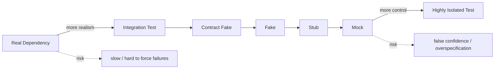
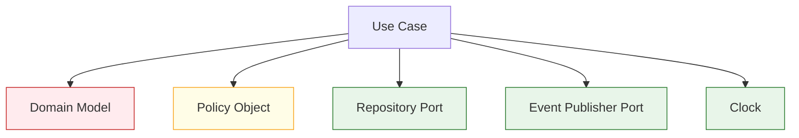
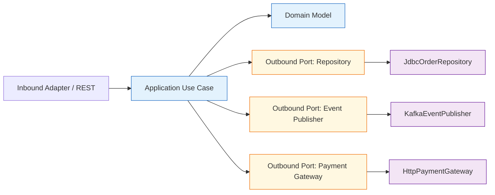

# Part 007 — Mocking, Stubbing, and Test Doubles Without Lying to Yourself

> Tujuan bagian ini: memakai mock, stub, fake, spy, dan contract fake secara sadar. Bukan untuk membuat test mudah ditulis, tetapi untuk membuat test memberi **evidence yang benar** tentang behavior sistem.

Mocking adalah salah satu teknik testing Java yang paling sering dipakai dan paling sering disalahgunakan.

Mock bisa mempercepat test. Mock juga bisa membuat test “hijau” untuk desain yang rusak.

Di codebase enterprise, bahaya terbesar bukan test gagal. Bahaya terbesar adalah test lulus tetapi tidak membuktikan hal penting apa pun.

Bagian ini membangun mental model praktis:

```text
Test double is not a shortcut.
Test double is a controlled replacement for an external collaborator.
```

Mockito, misalnya, memang menyediakan API yang bersih untuk membuat mock, melakukan stubbing, dan melakukan verification. Tetapi API yang mudah tidak otomatis membuat test benar. Yang menentukan kualitas test adalah apakah test double yang dipilih mewakili kontrak boundary secara jujur.

---

## 1. Masalah yang Sebenarnya Diselesaikan Test Double

Sebuah unit bisnis jarang berdiri sendiri. Biasanya ia berinteraksi dengan:

- database;
- HTTP service;
- message broker;
- clock;
- ID generator;
- cache;
- file system;
- authorization service;
- payment gateway;
- workflow engine;
- event publisher.

Kalau semua dependency nyata dipakai di setiap test, test menjadi lambat, fragile, dan sulit membuat failure scenario.

Test double menyelesaikan tiga masalah:

1. **Control** — kita bisa mengatur dependency memberi output tertentu.
2. **Observation** — kita bisa melihat apakah dependency dipanggil secara benar.
3. **Isolation** — kita bisa menguji logic lokal tanpa membawa semua infrastruktur.

Tetapi isolation punya harga: semakin banyak dependency diganti, semakin jauh test dari dunia nyata.



Rule praktis:

> Mock dependency yang tidak kamu own. Fake dependency yang kamu own. Jangan mock domain behavior yang seharusnya diuji.

---

## 2. Vocabulary: Dummy, Stub, Fake, Spy, Mock

Banyak bug testing lahir karena tim memakai istilah “mock” untuk semua hal. Ini membuat diskusi rancu.

| Jenis | Peran | Contoh | Risiko |
|---|---|---|---|
| Dummy | Objek hanya untuk memenuhi parameter | `new NoopLogger()` | Biasanya rendah |
| Stub | Mengembalikan jawaban terkontrol | `when(repo.find(id)).thenReturn(order)` | Bisa menyembunyikan behavior dependency |
| Fake | Implementasi sederhana tapi bekerja | `InMemoryOrderRepository` | Bisa berbeda dari real implementation |
| Spy | Membungkus objek nyata dan mengamati/mengubah sebagian behavior | `spy(realService)` | Mudah membuat test ambigu |
| Mock | Objek yang diverifikasi interaksinya | `verify(eventBus).publish(...)` | Overspecified interaction |

Perbedaan paling penting:

```text
stub answers questions
mock verifies conversations
fake behaves like a simpler real system
spy observes a real object
```

### 2.1 Dummy

Dummy dipakai saat dependency tidak relevan untuk test.

```java
final class NoopAuditSink implements AuditSink {
    @Override
    public void record(AuditEvent event) {
        // intentionally ignored
    }
}
```

Dummy yang baik tidak punya logic. Kalau dummy mulai punya kondisi, ia berubah menjadi fake atau stub.

### 2.2 Stub

Stub mengontrol input dari dependency.

```java
@Test
void rejects_order_when_customer_is_blocked() {
    CustomerDirectory directory = mock(CustomerDirectory.class);
    when(directory.statusOf(customerId)).thenReturn(CustomerStatus.BLOCKED);

    SubmitOrder useCase = new SubmitOrder(directory, orderRepository, eventPublisher);

    var result = useCase.submit(command);

    assertThat(result).isEqualTo(SubmitOrderResult.rejected("CUSTOMER_BLOCKED"));
}
```

Test ini bertanya: “kalau dependency mengatakan customer blocked, apakah use case menolak order?”

Kita tidak sedang menguji `CustomerDirectory`. Kita menguji response use case terhadap informasi tertentu.

### 2.3 Fake

Fake adalah implementasi kecil yang punya behavior nyata.

```java
final class InMemoryOrderRepository implements OrderRepository {
    private final Map<OrderId, Order> orders = new LinkedHashMap<>();

    @Override
    public Optional<Order> findById(OrderId id) {
        return Optional.ofNullable(orders.get(id));
    }

    @Override
    public void save(Order order) {
        if (orders.containsKey(order.id()) && orders.get(order.id()).version() != order.version() - 1) {
            throw new OptimisticLockFailure(order.id());
        }
        orders.put(order.id(), order);
    }
}
```

Fake berguna ketika kita ingin menguji beberapa langkah behavior tanpa database asli.

Kelemahan fake: fake bisa tidak setia pada behavior real dependency. Misalnya database asli punya unique constraint, transaction isolation, nullable column, case sensitivity, collation, atau lock behavior yang tidak ada di fake.

Karena itu fake untuk boundary penting perlu diuji dengan contract test.

### 2.4 Spy

Spy memakai objek nyata tetapi sebagian interaksinya bisa diverifikasi atau distub.

```java
EmailRenderer renderer = spy(new EmailRenderer(templateEngine));

when(renderer.renderPreview(any())).thenReturn("preview");
```

Spy sering menjadi smell karena test menjadi separuh real dan separuh synthetic. Ia bisa berguna untuk legacy code, tetapi jarang menjadi pilihan terbaik untuk desain baru.

Checklist sebelum memakai spy:

- Apakah class terlalu besar dan perlu dipisah?
- Apakah method yang ingin distub seharusnya menjadi dependency eksplisit?
- Apakah test sedang menguji implementation detail?
- Apakah spy dipakai hanya karena constructor terlalu sulit?

Jika jawabannya “ya”, masalahnya kemungkinan desain, bukan test.

### 2.5 Mock

Mock dipakai ketika interaksi adalah behavior yang ingin dibuktikan.

```java
@Test
void publishes_event_after_order_is_accepted() {
    EventPublisher publisher = mock(EventPublisher.class);
    var useCase = new SubmitOrder(customerDirectory, orderRepository, publisher);

    var result = useCase.submit(validCommand);

    assertThat(result.accepted()).isTrue();

    verify(publisher).publish(argThat(event ->
        event.type().equals("OrderAccepted") &&
        event.aggregateId().equals(result.orderId().value())
    ));
}
```

Di sini `publish` bukan implementation detail. Ia bagian dari kontrak use case: order accepted harus menghasilkan event.

---

## 3. State Verification vs Behavioral Verification

Dua gaya assertion utama:

```text
state verification       => lihat hasil akhir
behavioral verification  => lihat interaksi dengan collaborator
```

### 3.1 State Verification

```java
@Test
void applying_payment_moves_invoice_to_paid() {
    Invoice invoice = Invoice.issued(invoiceId, Money.usd("100.00"));

    invoice.applyPayment(Money.usd("100.00"));

    assertThat(invoice.status()).isEqualTo(InvoiceStatus.PAID);
    assertThat(invoice.outstanding()).isEqualTo(Money.zero("USD"));
}
```

Ini biasanya lebih robust karena tidak peduli bagaimana invoice menghitungnya secara internal.

### 3.2 Behavioral Verification

```java
verify(notificationGateway).sendPaymentReceipt(invoiceId, customerEmail);
```

Ini cocok jika interaksi itu observable side effect yang penting.

### 3.3 Anti-Pattern: Verifying Every Internal Call

```java
verify(repository).findById(id);
verify(policy).validate(order);
verify(calculator).calculate(order);
verify(repository).save(order);
verify(publisher).publish(any());
```

Test ini terlalu dekat dengan implementation sequence. Jika refactoring memindahkan urutan internal tanpa mengubah behavior, test gagal.

Pertanyaan yang harus ditanyakan:

> Kalau interaksi ini berubah, apakah user-visible behavior atau external contract ikut berubah?

Jika tidak, jangan verify.

---

## 4. Mock Only Across a Meaningful Boundary

Boundary yang layak dimock:

- remote service;
- message publisher;
- email/SMS gateway;
- payment provider;
- clock;
- ID generator;
- filesystem;
- legacy dependency;
- authorization context;
- externalized policy evaluator.

Boundary yang jarang layak dimock:

- value object;
- domain entity;
- pure function;
- mapper sederhana;
- validator lokal;
- policy object yang deterministic;
- class kecil yang kamu own dan murah dijalankan.



Interpretasi:

- Domain model sebaiknya diuji langsung.
- Policy object yang pure bisa diuji langsung atau diberi fixture.
- Repository/event publisher/clock adalah boundary natural.

---

## 5. Overspecified Mock: Test yang Terlalu Tahu

Overspecified mock terjadi saat test memverifikasi detail yang tidak relevan dengan kontrak.

Contoh buruk:

```java
@Test
void bad_test_for_order_submission() {
    when(customerRepository.findById(customerId)).thenReturn(Optional.of(customer));
    when(productRepository.findBySku("SKU-1")).thenReturn(Optional.of(product));
    when(discountService.resolve(any())).thenReturn(Discount.none());

    service.submit(command);

    InOrder inOrder = inOrder(customerRepository, productRepository, discountService, orderRepository, publisher);
    inOrder.verify(customerRepository).findById(customerId);
    inOrder.verify(productRepository).findBySku("SKU-1");
    inOrder.verify(discountService).resolve(any());
    inOrder.verify(orderRepository).save(any());
    inOrder.verify(publisher).publish(any());
}
```

Masalah:

- mengunci urutan internal;
- tidak assert hasil domain;
- tidak memeriksa isi order;
- tidak memeriksa event secara semantic;
- refactoring aman akan membuat test gagal.

Versi lebih baik:

```java
@Test
void accepts_valid_order_and_publishes_order_accepted_event() {
    when(customerDirectory.statusOf(customerId)).thenReturn(CustomerStatus.ACTIVE);
    when(catalog.priceOf(sku)).thenReturn(Money.usd("25.00"));

    var result = submitOrder.submit(commandForTwoItems(sku));

    assertThat(result).isEqualTo(SubmitOrderResult.accepted(result.orderId()));

    Order persisted = orderRepository.findById(result.orderId()).orElseThrow();
    assertThat(persisted.status()).isEqualTo(OrderStatus.ACCEPTED);
    assertThat(persisted.total()).isEqualTo(Money.usd("50.00"));

    verify(eventPublisher).publish(argThat(event ->
        event instanceof OrderAccepted accepted &&
        accepted.orderId().equals(result.orderId()) &&
        accepted.total().equals(Money.usd("50.00"))
    ));
}
```

Kita verify behavior yang benar-benar penting: order tersimpan dalam state benar dan event semantic benar.

---

## 6. Mockito Core Patterns

Mockito menyediakan mock creation, stubbing, dan verification. Gunakan sebagai alat kecil, bukan sebagai architecture.

### 6.1 Basic Stubbing

```java
CustomerDirectory directory = mock(CustomerDirectory.class);

when(directory.statusOf(customerId)).thenReturn(CustomerStatus.ACTIVE);
```

Gunakan stubbing untuk dependency query-like.

### 6.2 Throwing Failure

```java
when(paymentGateway.authorize(any()))
    .thenThrow(new PaymentGatewayUnavailable("timeout"));
```

Ini penting untuk failure-path test. Banyak suite enterprise terlalu fokus happy path.

### 6.3 Consecutive Answers

```java
when(lockClient.tryAcquire(lockName))
    .thenReturn(false)
    .thenReturn(true);
```

Berguna untuk retry behavior. Tetapi hati-hati: test seperti ini bisa terlalu implementation-specific. Lebih baik assert policy outcome, bukan jumlah retry kecuali jumlah retry adalah kontrak eksplisit.

### 6.4 Custom Answer

```java
when(idempotencyStore.computeIfAbsent(any(), any()))
    .thenAnswer(invocation -> {
        IdempotencyKey key = invocation.getArgument(0);
        Supplier<Result> supplier = invocation.getArgument(1);
        return supplier.get();
    });
```

Custom answer berguna untuk callback API. Tetapi jika custom answer mulai kompleks, itu tanda kamu butuh fake.

### 6.5 Verification

```java
verify(publisher).publish(any(OrderAccepted.class));
verifyNoMoreInteractions(publisher);
```

`verifyNoMoreInteractions` sebaiknya jarang dipakai. Ia berguna untuk boundary kritis seperti “jangan kirim email tambahan”, tetapi berbahaya jika dipakai global karena membuat test anti-refactoring.

### 6.6 ArgumentCaptor

```java
ArgumentCaptor<OrderAccepted> captor = ArgumentCaptor.forClass(OrderAccepted.class);

verify(publisher).publish(captor.capture());

assertThat(captor.getValue().orderId()).isEqualTo(orderId);
assertThat(captor.getValue().occurredAt()).isEqualTo(fixedInstant);
```

ArgumentCaptor cocok ketika assertion event lebih dari satu field dan `argThat` menjadi sulit dibaca.

---

## 7. Avoid `any()` Abuse

Ini buruk:

```java
verify(eventPublisher).publish(any());
```

Test tersebut hanya membuktikan “ada sesuatu dipublish”. Ia tidak membuktikan tipe event, aggregate id, payload, version, causation id, correlation id, atau timestamp.

Lebih baik:

```java
verify(eventPublisher).publish(argThat(event ->
    event.type().equals("OrderCancelled") &&
    event.aggregateId().equals(orderId.value()) &&
    event.metadata().correlationId().equals(correlationId) &&
    event.payload().get("reason").equals("PAYMENT_TIMEOUT")
));
```

Atau pakai assertion helper:

```java
assertThatPublishedEvent(eventPublisher)
    .single(OrderCancelled.class)
    .hasAggregateId(orderId)
    .hasReason("PAYMENT_TIMEOUT")
    .hasCorrelationId(correlationId);
```

Untuk codebase besar, custom assertion untuk event jauh lebih maintainable daripada repeated `argThat`.

---

## 8. Mocking and Null: The Silent Lie

Banyak mock default mengembalikan `null`, `0`, `false`, empty collection, atau default answer lain. Ini bisa menyembunyikan bug.

Contoh:

```java
when(customerDirectory.find(customerId)).thenReturn(customer);
```

Jika code memanggil `find(otherId)`, mock bisa mengembalikan `null`. Test mungkin gagal dengan NPE jauh dari sumber masalah, atau lebih buruk: test tetap hijau karena branch tidak ter-cover.

Strategi:

1. Gunakan strict stubbing.
2. Pakai value object kuat agar parameter mismatch terlihat.
3. Hindari broad matcher seperti `any()` untuk stubbing penting.
4. Gunakan fake yang fail-fast untuk unexpected call.

Contoh fail-fast fake:

```java
final class StrictCustomerDirectory implements CustomerDirectory {
    private final Map<CustomerId, CustomerStatus> statuses = new HashMap<>();

    void givenStatus(CustomerId id, CustomerStatus status) {
        statuses.put(id, status);
    }

    @Override
    public CustomerStatus statusOf(CustomerId id) {
        if (!statuses.containsKey(id)) {
            throw new AssertionError("Unexpected customer lookup: " + id);
        }
        return statuses.get(id);
    }
}
```

Fake seperti ini sering memberi error lebih bermakna daripada mock default.

---

## 9. Strictness: Make Unused Stubs Visible

Unused stub biasanya berarti salah satu dari ini:

- test setup terlalu besar;
- behavior berubah tetapi test tidak ikut diperbaiki;
- test mengklaim dependency penting padahal tidak dipakai;
- salah path execution;
- test copy-paste.

Contoh smell:

```java
when(discountService.resolve(any())).thenReturn(Discount.none());
when(taxService.calculate(any())).thenReturn(Money.usd("0.00"));
when(riskService.evaluate(any())).thenReturn(RiskDecision.accept());

var result = service.submit(command);

assertThat(result.accepted()).isTrue();
```

Jika `riskService` tidak pernah dipakai, test masih bisa hijau jika strictness dimatikan. Itu buruk. Strictness membantu menjaga setup tetap jujur.

Prinsip:

> Every stub should either affect the result or document a meaningful precondition.

Kalau tidak, hapus.

---

## 10. Mocking Repositories: Usually the Wrong Default

Repository sering dimock dalam unit test:

```java
when(orderRepository.findById(orderId)).thenReturn(Optional.of(order));
```

Ini boleh untuk use case yang hanya butuh satu lookup sederhana. Tetapi repository adalah boundary data yang sering punya behavior penting:

- generated ID;
- optimistic locking;
- unique constraint;
- transaction;
- pagination;
- ordering;
- null/case/collation behavior;
- persistence mapping;
- lazy loading;
- serialization/deserialization;
- timezone conversion.

Mock repository tidak membuktikan semua itu.

Strategi lebih kuat:

| Test Scope | Repository Strategy |
|---|---|
| Pure domain unit test | Tidak butuh repository |
| Use case unit test sederhana | Mock/stub port boleh |
| Use case dengan multi-step state | Fake repository |
| Persistence semantics penting | Real DB via integration test |
| Contract fake | Fake diuji melawan real repository contract |

### 10.1 Contract Fake Pattern

Buat interface test yang bisa dijalankan untuk fake dan real implementation.

```java
interface OrderRepositoryContract {
    OrderRepository repository();

    @Test
    default void saves_and_finds_order_by_id() {
        Order order = Order.accepted(OrderId.newId(), CustomerId.of("C-1"));

        repository().save(order);

        assertThat(repository().findById(order.id())).contains(order);
    }

    @Test
    default void rejects_stale_version_update() {
        Order original = Order.accepted(OrderId.newId(), CustomerId.of("C-1"));
        repository().save(original);

        Order firstUpdate = original.markPaid();
        repository().save(firstUpdate);

        Order staleUpdate = original.cancel("late cancellation");

        assertThatThrownBy(() -> repository().save(staleUpdate))
            .isInstanceOf(OptimisticLockFailure.class);
    }
}
```

Fake test:

```java
class InMemoryOrderRepositoryTest implements OrderRepositoryContract {
    private final InMemoryOrderRepository repository = new InMemoryOrderRepository();

    @Override
    public OrderRepository repository() {
        return repository;
    }
}
```

Real DB test:

```java
class JdbcOrderRepositoryTest implements OrderRepositoryContract {
    private final PostgresContainerDatabase db = PostgresContainerDatabase.start();
    private final JdbcOrderRepository repository = new JdbcOrderRepository(db.dataSource());

    @Override
    public OrderRepository repository() {
        return repository;
    }
}
```

Ini membuat fake tidak liar. Fake menjadi executable approximation dari real dependency.

---

## 11. Mocking Event Publisher: Verify Semantic Event, Not Method Call

Event publishing sering dimock:

```java
verify(publisher).publish(any());
```

Ini terlalu lemah.

Event adalah kontrak antar service. Yang penting bukan hanya publish dipanggil, tetapi event valid:

- type benar;
- aggregate id benar;
- aggregate version benar;
- occurredAt deterministic;
- causation/correlation id benar;
- payload tidak kehilangan field;
- ordering relatif benar;
- idempotency key benar;
- tidak publish event pada failure path.

Gunakan fake event publisher:

```java
final class RecordingEventPublisher implements EventPublisher {
    private final List<DomainEvent> events = new ArrayList<>();

    @Override
    public void publish(DomainEvent event) {
        events.add(event);
    }

    <T extends DomainEvent> T singleEvent(Class<T> type) {
        List<T> matched = events.stream()
            .filter(type::isInstance)
            .map(type::cast)
            .toList();

        if (matched.size() != 1) {
            throw new AssertionError("Expected single " + type.getSimpleName() + " but got " + matched);
        }
        return matched.get(0);
    }

    void assertNoEvents() {
        assertThat(events).isEmpty();
    }
}
```

Test menjadi lebih jelas:

```java
@Test
void emits_order_cancelled_when_payment_times_out() {
    var events = new RecordingEventPublisher();
    var useCase = new CancelOrder(repository, events, clock);

    useCase.cancel(orderId, CancelReason.PAYMENT_TIMEOUT);

    OrderCancelled event = events.singleEvent(OrderCancelled.class);
    assertThat(event.orderId()).isEqualTo(orderId);
    assertThat(event.reason()).isEqualTo(CancelReason.PAYMENT_TIMEOUT);
    assertThat(event.occurredAt()).isEqualTo(fixedInstant);
}
```

Ini lebih baik daripada mock karena event publisher fake menyimpan side effect yang bisa diassert seperti state.

---

## 12. Mocking Clock, ID, Randomness

Jangan mock `Instant.now()` karena static time sulit dikendalikan. Desain yang benar memakai dependency eksplisit:

```java
public final class SubmitOrder {
    private final Clock clock;
    private final IdGenerator idGenerator;

    public SubmitOrder(Clock clock, IdGenerator idGenerator) {
        this.clock = clock;
        this.idGenerator = idGenerator;
    }

    public Order submit(SubmitOrderCommand command) {
        return Order.accepted(
            idGenerator.nextOrderId(),
            command.customerId(),
            Instant.now(clock)
        );
    }
}
```

Test:

```java
Clock fixedClock = Clock.fixed(Instant.parse("2026-07-02T10:15:30Z"), ZoneOffset.UTC);
IdGenerator ids = new DeterministicIdGenerator("ORD-1");

SubmitOrder useCase = new SubmitOrder(fixedClock, ids);

Order order = useCase.submit(command);

assertThat(order.id()).isEqualTo(OrderId.of("ORD-1"));
assertThat(order.acceptedAt()).isEqualTo(Instant.parse("2026-07-02T10:15:30Z"));
```

Ini bukan hanya membuat test mudah. Ini membuat production behavior lebih eksplisit.

---

## 13. Mocking HTTP Clients: Prefer Contract Stub or Fake Server

Mocking HTTP client interface lokal sering terlalu optimis:

```java
when(paymentClient.authorize(any())).thenReturn(Authorization.approved("AUTH-1"));
```

Test ini tidak membuktikan:

- request body benar;
- header idempotency dikirim;
- timeout dikonfigurasi;
- 429 diperlakukan retryable;
- 400 diperlakukan non-retryable;
- error body diparse;
- schema kompatibel.

Untuk client boundary penting, gunakan fake server atau contract test.

```java
@Test
void sends_idempotency_key_when_authorizing_payment() {
    fakePaymentServer.stubAuthorize(200, "{\"status\":\"APPROVED\",\"authId\":\"AUTH-1\"}");

    PaymentClient client = new HttpPaymentClient(fakePaymentServer.baseUrl(), httpClient);

    Authorization authorization = client.authorize(new AuthorizationRequest(paymentId, amount, idempotencyKey));

    assertThat(authorization.status()).isEqualTo(APPROVED);
    fakePaymentServer.assertLastRequest(request -> {
        assertThat(request.header("Idempotency-Key")).isEqualTo(idempotencyKey.value());
        assertThat(request.jsonPath("$.amount")).isEqualTo("100.00");
    });
}
```

Mock client port boleh dipakai di use case test. Tetapi HTTP adapter harus diuji dengan real request/response.

---

## 14. Mocking Message Brokers: Separate Producer Contract from Business Logic

Business logic test tidak perlu Kafka/RabbitMQ asli.

```java
RecordingEventPublisher publisher = new RecordingEventPublisher();
```

Tetapi adapter broker perlu diuji:

- topic/exchange/routing key benar;
- key/partitioning strategy benar;
- headers benar;
- serialization benar;
- retry/dead-letter behavior benar;
- delivery callback/error handling benar.

Pisahkan:

```text
Domain use case test:
  verifies OrderAccepted is produced semantically

Broker adapter integration test:
  verifies OrderAccepted is serialized and sent to correct broker destination

Consumer contract test:
  verifies downstream service can parse and handle event
```

Jangan membuat satu E2E test raksasa untuk membuktikan semua hal. Itu lambat dan sulit didiagnosis.

---

## 15. Mocking Static Methods, Constructors, and Final Classes

Mockito modern bisa menangani banyak hal yang dulu sulit, tetapi kemampuan teknis bukan berarti desainnya baik.

Jika kamu perlu mock static method:

```java
try (MockedStatic<UuidFactory> mocked = mockStatic(UuidFactory.class)) {
    mocked.when(UuidFactory::newUuid).thenReturn(UUID.fromString("00000000-0000-0000-0000-000000000001"));

    // test
}
```

Pertanyaan desain:

- Kenapa UUID generation tidak menjadi dependency?
- Kenapa time tidak memakai `Clock`?
- Kenapa parsing/config/global context tidak diisolasi?
- Apakah ini legacy seam atau desain baru?

Untuk legacy code, static mocking bisa menjadi stepping stone. Untuk desain baru, lebih baik pakai port eksplisit.

---

## 16. Deep Stub: Usually a Design Smell

Mockito mendukung deep stub, misalnya:

```java
when(order.getCustomer().getAccount().getRiskProfile().isBlocked()).thenReturn(true);
```

Masalahnya bukan Mockito. Masalahnya object graph terlalu bocor.

Test tersebut tahu terlalu banyak struktur internal.

Lebih baik:

```java
when(riskPolicy.isBlocked(customerId)).thenReturn(true);
```

Atau domain model langsung:

```java
Customer customer = CustomerBuilder.blocked().build();
Order order = OrderBuilder.forCustomer(customer).build();
```

Deep stub biasanya menandakan salah satu:

- Law of Demeter dilanggar;
- domain model anemic tetapi object graph kompleks;
- use case membaca terlalu jauh;
- test setup tidak punya builder/factory yang baik.

---

## 17. Partial Mock: Dangerous but Sometimes Useful

Partial mock adalah saat sebagian behavior real, sebagian distub.

```java
var service = spy(new LegacyInvoiceService(...));
doReturn(tax).when(service).calculateTax(any());
```

Gunakan hanya untuk:

- legacy code yang belum bisa direstrukturisasi;
- characterization test sebelum refactor;
- isolasi dependency tersembunyi sementara;
- migrasi bertahap.

Jangan biarkan partial mock menetap sebagai testing style permanen. Setiap partial mock sebaiknya menghasilkan refactor task:

```text
extract dependency -> inject dependency -> replace spy with fake/mock explicit port
```

---

## 18. Characterization Tests for Legacy Code

Legacy code sering tidak punya seam. Mocking bisa membantu membuat characterization test.

Tujuan characterization test bukan membuktikan ideal behavior. Tujuannya menangkap behavior saat ini sebelum perubahan.

```java
@Test
void characterizes_current_invoice_rounding_behavior() {
    LegacyInvoiceService service = new LegacyInvoiceService();

    Invoice invoice = service.calculate(inputWithThreeDecimalTax());

    assertThat(invoice.total()).isEqualTo(new BigDecimal("123.46"));
}
```

Setelah behavior terkunci, refactor kecil:

```java
public final class LegacyInvoiceService {
    private final TaxRateProvider taxRateProvider;

    public LegacyInvoiceService(TaxRateProvider taxRateProvider) {
        this.taxRateProvider = taxRateProvider;
    }
}
```

Lalu test baru bisa memakai stub/fake explicit dependency.

---

## 19. Mocking in Hexagonal Architecture

Di hexagonal architecture, mocking harus mengikuti arah dependency.



Testing strategy:

| Layer | Test Double Strategy |
|---|---|
| Domain | No mock. Test real domain objects. |
| Application use case | Fake repository/event sink; stub external policy/gateway. |
| Outbound adapter | Real protocol/service simulator/Testcontainers. |
| Inbound adapter | Mock/fake use case, assert request mapping and response mapping. |
| Contract boundary | Contract tests between fake and real adapter. |

Anti-pattern:

```text
REST controller test mocks application service,
application service test mocks domain,
domain test mocks value object.
```

Jika semua layer dimock, tidak ada behavior nyata yang diuji.

---

## 20. Testing Controllers: Mock Application, Not Domain

Controller tests harus fokus pada HTTP mapping:

- request path/query/body;
- validation;
- authentication context mapping;
- status code;
- error response;
- headers;
- response schema.

Controller boleh mock use case karena use case diuji sendiri.

```java
@Test
void returns_201_when_order_is_accepted() throws Exception {
    when(submitOrder.submit(any())).thenReturn(SubmitOrderResult.accepted(OrderId.of("ORD-1")));

    mockMvc.perform(post("/orders")
            .contentType(MediaType.APPLICATION_JSON)
            .content("""
                {"customerId":"C-1","items":[{"sku":"SKU-1","quantity":2}]}
                """))
        .andExpect(status().isCreated())
        .andExpect(header().string("Location", "/orders/ORD-1"));
}
```

Jangan test business rule di controller test. Itu membuat test lambat dan duplikatif.

---

## 21. Testing Application Services: Prefer Fakes Over Mocks

Application service biasanya mengorkestrasi beberapa dependency. Untuk behavior stateful, fakes sering lebih jelas.

```java
@Test
void cannot_cancel_paid_order() {
    var orders = new InMemoryOrderRepository();
    var events = new RecordingEventPublisher();
    var service = new CancelOrder(orders, events, fixedClock);

    Order paid = OrderBuilder.accepted().paid().build();
    orders.save(paid);

    var result = service.cancel(paid.id(), CancelReason.CUSTOMER_REQUEST);

    assertThat(result).isEqualTo(CancelOrderResult.rejected("ORDER_ALREADY_PAID"));
    assertThat(orders.findById(paid.id()).orElseThrow().status()).isEqualTo(OrderStatus.PAID);
    events.assertNoEvents();
}
```

Test ini membuktikan:

- precondition paid order;
- command cancel;
- result rejected;
- state tidak berubah;
- event tidak dipublish.

Tidak ada mock verification yang tidak perlu.

---

## 22. Mocking Domain Objects Is Almost Always Wrong

Ini buruk:

```java
Order order = mock(Order.class);
when(order.status()).thenReturn(OrderStatus.PAID);
```

Kenapa buruk?

Karena domain object adalah behavior yang ingin diuji. Jika domain object dimock, kamu tidak menguji domain.

Lebih baik:

```java
Order order = OrderBuilder.accepted()
    .paidAt(fixedInstant)
    .build();
```

Atau:

```java
Order order = Order.accepted(orderId, customerId, fixedInstant);
order.applyPayment(paymentId, Money.usd("100.00"), fixedInstant.plusSeconds(10));
```

Domain test harus memakai domain asli.

---

## 23. Argument Matcher Design

Matcher yang buruk:

```java
verify(repository).save(any(Order.class));
```

Matcher yang lebih baik:

```java
verify(repository).save(argThat(order ->
    order.customerId().equals(customerId) &&
    order.status() == OrderStatus.ACCEPTED &&
    order.total().equals(Money.usd("50.00"))
));
```

Tetapi untuk assertion kompleks, pakai captor atau fake.

```java
ArgumentCaptor<Order> captor = ArgumentCaptor.forClass(Order.class);
verify(repository).save(captor.capture());

assertThat(captor.getValue())
    .extracting(Order::status, Order::total)
    .containsExactly(OrderStatus.ACCEPTED, Money.usd("50.00"));
```

Matcher harus menjawab: properti apa yang penting untuk kontrak?

---

## 24. Verify Negative Side Effects

Negative assertion sering lebih penting daripada positive assertion.

Contoh:

- invalid command tidak menyimpan order;
- declined payment tidak publish `OrderAccepted`;
- duplicate request tidak charge payment dua kali;
- rejected approval tidak mengirim notification sukses;
- unauthorized request tidak membaca sensitive data.

```java
@Test
void does_not_charge_payment_twice_for_duplicate_request() {
    when(idempotencyStore.find(existingKey)).thenReturn(Optional.of(previousResult));

    var result = submitOrder.submit(duplicateCommand);

    assertThat(result).isEqualTo(previousResult);
    verifyNoInteractions(paymentGateway);
}
```

`verifyNoInteractions` cocok di sini karena “tidak memanggil payment gateway” adalah invariant penting.

---

## 25. Ordering Verification: Use Sparingly

Ordering penting untuk beberapa kontrak:

- save aggregate sebelum publish event;
- acquire lock sebelum update;
- release resource setelah failure;
- begin transaction sebelum repository operations;
- write outbox sebelum commit.

Tetapi jangan verify ordering internal tanpa alasan.

Contoh valid:

```java
InOrder inOrder = inOrder(outbox, transaction);

service.submit(command);

inOrder.verify(outbox).append(any(OrderAccepted.class));
inOrder.verify(transaction).commit();
```

Namun lebih kuat lagi jika desainnya membuat ordering sebagai mekanisme nyata, misalnya transactional outbox diuji dengan real transaction integration test.

---

## 26. Test Double Failure Matrix

Gunakan matrix ini saat memilih double.

| Dependency | Recommended Double | Additional Test Needed |
|---|---|---|
| Clock | Fixed real `Clock` | None |
| ID generator | Deterministic fake | None |
| Event publisher | Recording fake | Adapter integration test |
| Repository | Fake for use case, real DB for adapter | Contract test fake vs real |
| HTTP client | Stub port in use case | Fake server/contract test for adapter |
| Payment gateway | Stub/fake simulator | Contract test + sandbox test |
| Message broker | Recording fake in domain/application | Broker integration test |
| Cache | Fake if cache semantics matter | Integration test for TTL/serialization |
| Authorization | Stub policy decision | Security integration test |
| Workflow engine | Fake command gateway | Process integration test |

---

## 27. A Production-Grade Example

Kita punya use case:

```text
Submit order:
1. reject if customer blocked;
2. calculate total from catalog price;
3. authorize payment;
4. persist order accepted;
5. publish OrderAccepted event;
6. if payment timeout, persist order pending_payment and publish PaymentAuthorizationPending.
```

### 27.1 Ports

```java
interface CustomerDirectory {
    CustomerStatus statusOf(CustomerId customerId);
}

interface Catalog {
    Money priceOf(Sku sku);
}

interface PaymentGateway {
    Authorization authorize(AuthorizationRequest request);
}

interface OrderRepository {
    void save(Order order);
    Optional<Order> findById(OrderId id);
}

interface EventPublisher {
    void publish(DomainEvent event);
}
```

### 27.2 Test Setup

```java
final class SubmitOrderTest {
    private final CustomerDirectory customers = mock(CustomerDirectory.class);
    private final Catalog catalog = mock(Catalog.class);
    private final PaymentGateway paymentGateway = mock(PaymentGateway.class);
    private final InMemoryOrderRepository orders = new InMemoryOrderRepository();
    private final RecordingEventPublisher events = new RecordingEventPublisher();
    private final Clock clock = Clock.fixed(Instant.parse("2026-07-02T00:00:00Z"), ZoneOffset.UTC);
    private final DeterministicIdGenerator ids = new DeterministicIdGenerator("ORD-1");

    private final SubmitOrder submitOrder = new SubmitOrder(
        customers, catalog, paymentGateway, orders, events, clock, ids
    );
}
```

Kita mock customer/catalog/payment karena itu external decision/query. Kita fake repository/event publisher karena kita ingin assert state dan events secara natural.

### 27.3 Happy Path

```java
@Test
void accepts_order_when_customer_active_and_payment_authorized() {
    when(customers.statusOf(CustomerId.of("C-1"))).thenReturn(CustomerStatus.ACTIVE);
    when(catalog.priceOf(Sku.of("SKU-1"))).thenReturn(Money.usd("20.00"));
    when(paymentGateway.authorize(any())).thenReturn(Authorization.approved("AUTH-1"));

    var result = submitOrder.submit(new SubmitOrderCommand(
        CustomerId.of("C-1"),
        List.of(new OrderLineRequest(Sku.of("SKU-1"), 2)),
        IdempotencyKey.of("REQ-1")
    ));

    assertThat(result).isEqualTo(SubmitOrderResult.accepted(OrderId.of("ORD-1")));

    Order order = orders.findById(OrderId.of("ORD-1")).orElseThrow();
    assertThat(order.status()).isEqualTo(OrderStatus.ACCEPTED);
    assertThat(order.total()).isEqualTo(Money.usd("40.00"));

    OrderAccepted event = events.singleEvent(OrderAccepted.class);
    assertThat(event.orderId()).isEqualTo(OrderId.of("ORD-1"));
    assertThat(event.total()).isEqualTo(Money.usd("40.00"));
}
```

### 27.4 Blocked Customer

```java
@Test
void rejects_blocked_customer_without_authorizing_payment_or_publishing_event() {
    when(customers.statusOf(CustomerId.of("C-1"))).thenReturn(CustomerStatus.BLOCKED);

    var result = submitOrder.submit(commandForCustomer("C-1"));

    assertThat(result).isEqualTo(SubmitOrderResult.rejected("CUSTOMER_BLOCKED"));
    assertThat(orders.findAll()).isEmpty();
    events.assertNoEvents();
    verifyNoInteractions(paymentGateway);
}
```

This is a strong test. It proves a business invariant and a side-effect invariant.

### 27.5 Payment Timeout

```java
@Test
void stores_pending_payment_when_gateway_times_out() {
    when(customers.statusOf(CustomerId.of("C-1"))).thenReturn(CustomerStatus.ACTIVE);
    when(catalog.priceOf(Sku.of("SKU-1"))).thenReturn(Money.usd("20.00"));
    when(paymentGateway.authorize(any())).thenThrow(new PaymentTimeout("timeout"));

    var result = submitOrder.submit(commandForCustomer("C-1"));

    assertThat(result).isEqualTo(SubmitOrderResult.pendingPayment(OrderId.of("ORD-1")));

    Order order = orders.findById(OrderId.of("ORD-1")).orElseThrow();
    assertThat(order.status()).isEqualTo(OrderStatus.PENDING_PAYMENT);

    PaymentAuthorizationPending event = events.singleEvent(PaymentAuthorizationPending.class);
    assertThat(event.orderId()).isEqualTo(OrderId.of("ORD-1"));
}
```

Notice: no test verifies exact method call ordering between calculation and authorization unless order itself is part of contract.

---

## 28. Common Mocking Smells

| Smell | Meaning | Fix |
|---|---|---|
| Test has more stubbing than assertion | Setup hides behavior | Use fixture builder/fake |
| `any()` everywhere | Test does not care about semantic input | Use semantic matcher/captor |
| Verifying every internal call | Test coupled to implementation | Assert state/outcome |
| Mocking domain entities | Domain not actually tested | Use real domain object |
| Deep stubs | Object graph leakage | Introduce boundary/policy |
| Partial mocks in new code | Hidden dependency | Extract dependency |
| Mock repository for persistence semantics | DB behavior ignored | Integration/contract test |
| `verifyNoMoreInteractions` everywhere | Anti-refactoring test | Use only for critical negative side effects |
| Stubbed exceptions but no state assertion | Failure path incomplete | Assert rollback/state/event behavior |
| One test has 10 mocks | Class has too many collaborators | Revisit design |

---

## 29. Design Heuristic: Number of Mocks as Architecture Signal

Jika satu unit test butuh 8 mock, kemungkinan:

- class terlalu banyak responsibility;
- use case terlalu orchestration-heavy;
- boundary terlalu granular;
- domain logic ada di application service;
- tidak ada cohesive domain object;
- tidak ada fixture/fake yang tepat;
- test scope salah.

Bukan berarti 8 mock selalu salah. Tetapi itu signal untuk review desain.

```text
0-2 mocks  => usually healthy
3-4 mocks  => check responsibility
5+ mocks   => likely orchestration smell or wrong test scope
```

Gunakan sebagai heuristic, bukan hukum.

---

## 30. Practical Rules

1. **Prefer real value objects and real domain entities.**
2. **Mock external decisions, not internal logic.**
3. **Use fakes for stateful owned boundaries.**
4. **Use contract tests to keep fakes honest.**
5. **Assert semantic payload, not just method calls.**
6. **Avoid broad matchers for important arguments.**
7. **Use `verifyNoInteractions` only for critical negative side effects.**
8. **Treat many mocks as design feedback.**
9. **Never let mocking replace integration tests.**
10. **When test becomes hard to write, inspect design before adding more Mockito.**

---

## 31. Mini Exercise

Ambil satu use case di codebase kamu yang sekarang memakai 5+ mock.

Refactor test-nya menjadi tiga jenis:

1. domain test tanpa mock;
2. application use case test dengan fake repository dan recording event publisher;
3. adapter integration test untuk repository/HTTP/broker.

Kemudian bandingkan:

- assertion mana yang lebih semantic;
- test mana yang lebih tahan refactor;
- failure message mana yang lebih membantu;
- setup mana yang paling kecil;
- bug apa yang sebelumnya tidak mungkin tertangkap.

---

## 32. Ringkasan

Mocking adalah teknik isolasi. Ia bukan bukti kebenaran penuh.

Mock yang baik membuat dependency eksternal terkendali. Mock yang buruk menciptakan dunia palsu tempat kode terlihat benar karena semua collaborator berbohong sesuai keinginan test.

Mental model yang harus dibawa:

```text
Use mock when interaction is the contract.
Use fake when behavior/state matters.
Use real object when it is the thing you are testing.
Use contract tests when fake must approximate production.
```

Di part berikutnya, kita naik dari object-level testing ke testing domain logic, state machines, workflows, rule transitions, dan lifecycle behavior.

---

## References

- Mockito official site and API documentation: https://site.mockito.org/
- Mockito Javadoc: https://site.mockito.org/javadoc/current/org/mockito/Mockito.html
- JUnit User Guide: https://docs.junit.org/current/user-guide/
- AssertJ documentation: https://assertj.github.io/doc/
