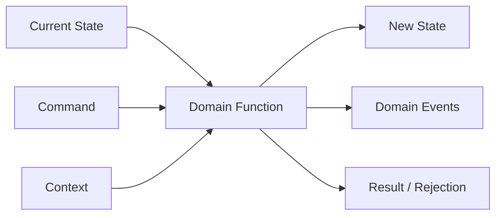
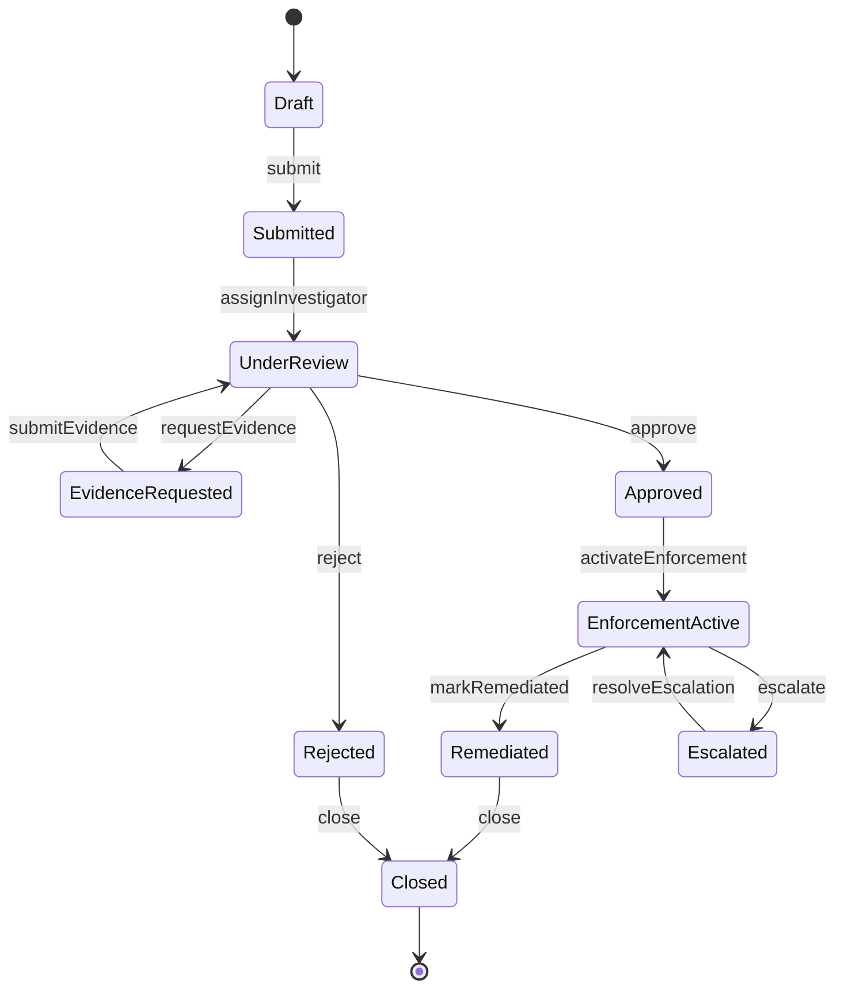
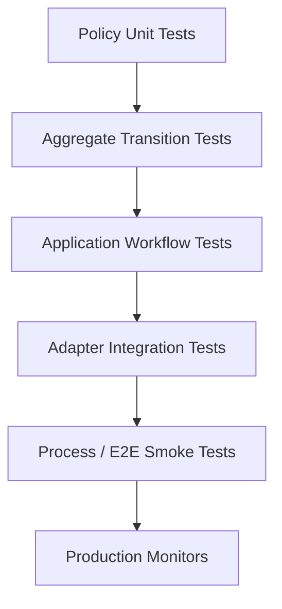

# Part 008 — Testing Domain Logic, State Machines, and Workflows

> Tujuan bagian ini: membangun test strategy untuk domain yang punya lifecycle, transisi state, rule matrix, approval flow, escalation, temporal behavior, dan cross-entity impact. Ini jenis testing yang membedakan engineer yang hanya menulis test dari engineer yang benar-benar menjaga correctness sistem.

Banyak sistem enterprise bukan sekadar CRUD.

Sistem yang serius biasanya mengandung lifecycle:

- case management;
- order management;
- payment processing;
- claims handling;
- enforcement workflow;
- compliance review;
- approval matrix;
- pricing/quote lifecycle;
- dispute resolution;
- incident management.

Pada sistem seperti ini, bug paling mahal jarang berbentuk `NullPointerException`. Bug mahal biasanya berbentuk:

```text
status salah
transisi ilegal diterima
approval dilewati
escalation terlambat
event salah urutan
case tertutup padahal masih ada obligation aktif
duplicate command menghasilkan double side effect
rule prioritas salah
state aggregate tidak konsisten dengan child entities
```

Testing domain logic harus dimulai dari model perilaku, bukan dari method implementation.

---

## 1. Mental Model: Domain Logic Is a Controlled State Transition System

Untuk domain stateful, hampir semua operation dapat dilihat sebagai:

```text
current state + command + context -> new state + domain events + side-effect intentions
```

Contoh:

```text
Case OPEN + AssignInvestigator(user=A) + context(role=Supervisor)
    -> Case ASSIGNED(investigator=A) + CaseAssigned event

Case CLOSED + AddEvidence(file=X)
    -> rejected: CASE_ALREADY_CLOSED
```

Representasi ini sangat kuat karena membuat test menjadi jelas.



Jika domain operation tidak bisa dijelaskan dalam bentuk ini, biasanya domain logic tersebar terlalu jauh di service/controller/repository.

---

## 2. Separate Domain Decision from Infrastructure Execution

Workflow sering gagal diuji karena decision dan execution dicampur.

Buruk:

```java
public void approveCase(String caseId, String userId) {
    CaseRecord record = repository.find(caseId);
    User user = userService.find(userId);

    if (!user.hasRole("SUPERVISOR")) {
        throw new ForbiddenException();
    }

    if (!record.status().equals("UNDER_REVIEW")) {
        throw new InvalidStateException();
    }

    record.setStatus("APPROVED");
    repository.save(record);
    emailService.sendApprovalEmail(record.ownerEmail());
    auditService.write("APPROVED");
}
```

Sulit diuji karena:

- status string;
- rule bercampur dengan IO;
- side effect langsung dieksekusi;
- audit/email membuat test perlu banyak mock;
- transition invariant tidak eksplisit.

Lebih baik:

```java
public final class EnforcementCase {
    private CaseStatus status;
    private InvestigatorId investigatorId;
    private final List<DomainEvent> events = new ArrayList<>();

    public ApprovalDecision approve(ApproveCase command, Actor actor, Instant now) {
        if (!actor.hasPermission(Permission.APPROVE_CASE)) {
            return ApprovalDecision.rejected("ACTOR_NOT_ALLOWED");
        }
        if (status != CaseStatus.UNDER_REVIEW) {
            return ApprovalDecision.rejected("CASE_NOT_UNDER_REVIEW");
        }
        if (investigatorId == null) {
            return ApprovalDecision.rejected("INVESTIGATOR_REQUIRED");
        }

        this.status = CaseStatus.APPROVED;
        this.events.add(new CaseApproved(id, actor.id(), now));
        return ApprovalDecision.approved(id);
    }
}
```

Application service mengeksekusi IO:

```java
public ApprovalDecision approve(ApproveCase command, Actor actor) {
    EnforcementCase caze = repository.get(command.caseId());
    ApprovalDecision decision = caze.approve(command, actor, Instant.now(clock));

    if (decision.approved()) {
        repository.save(caze);
        eventPublisher.publishAll(caze.pullEvents());
    }

    return decision;
}
```

Sekarang domain rule bisa diuji tanpa repository/email/audit.

---

## 3. Identify the State Model Before Writing Tests

Sebelum menulis test, gambarkan lifecycle.

Contoh enforcement case:



Dari diagram ini, kita dapat menghasilkan test categories:

1. allowed transitions;
2. rejected transitions;
3. guard conditions;
4. side effects/events;
5. state-specific commands;
6. temporal rules;
7. cross-entity consistency;
8. terminal state behavior;
9. idempotency behavior;
10. escalation behavior.

---

## 4. Transition Table: The First Domain Test Artifact

Jangan mulai dari code. Mulai dari transition table.

| Current State | Command | Condition | Next State | Event | Rejection |
|---|---|---|---|---|---|
| Draft | Submit | required fields complete | Submitted | CaseSubmitted | - |
| Draft | Submit | missing respondent | Draft | - | RESPONDENT_REQUIRED |
| Submitted | Assign Investigator | actor is supervisor | UnderReview | InvestigatorAssigned | - |
| Submitted | Approve | any | Submitted | - | CASE_NOT_UNDER_REVIEW |
| UnderReview | Request Evidence | evidence type valid | EvidenceRequested | EvidenceRequested | - |
| EvidenceRequested | Submit Evidence | before due date | UnderReview | EvidenceSubmitted | - |
| EvidenceRequested | Submit Evidence | after due date | EvidenceRequested | - | EVIDENCE_DEADLINE_EXPIRED |
| UnderReview | Approve | investigator assigned | Approved | CaseApproved | - |
| UnderReview | Approve | no investigator | UnderReview | - | INVESTIGATOR_REQUIRED |
| Closed | Any mutating command | any | Closed | - | CASE_ALREADY_CLOSED |

Transition table adalah executable thinking. Dari sini test bisa dibuat sistematis.

---

## 5. Example Domain Model

Kita akan gunakan domain kecil tapi realistis.

```java
public enum CaseStatus {
    DRAFT,
    SUBMITTED,
    UNDER_REVIEW,
    EVIDENCE_REQUESTED,
    APPROVED,
    REJECTED,
    ENFORCEMENT_ACTIVE,
    ESCALATED,
    REMEDIATED,
    CLOSED
}
```

Aggregate:

```java
public final class EnforcementCase {
    private final CaseId id;
    private CaseStatus status;
    private InvestigatorId investigatorId;
    private Instant evidenceDueAt;
    private final List<DomainEvent> events = new ArrayList<>();

    public EnforcementCase(CaseId id) {
        this.id = id;
        this.status = CaseStatus.DRAFT;
    }

    public Decision submit(SubmitCase command, Actor actor, Instant now) {
        if (status != CaseStatus.DRAFT) {
            return Decision.rejected("CASE_NOT_DRAFT");
        }
        if (command.respondentId() == null) {
            return Decision.rejected("RESPONDENT_REQUIRED");
        }
        status = CaseStatus.SUBMITTED;
        events.add(new CaseSubmitted(id, actor.id(), now));
        return Decision.accepted();
    }

    public Decision assignInvestigator(AssignInvestigator command, Actor actor, Instant now) {
        if (status != CaseStatus.SUBMITTED) {
            return Decision.rejected("CASE_NOT_SUBMITTED");
        }
        if (!actor.hasPermission(Permission.ASSIGN_INVESTIGATOR)) {
            return Decision.rejected("ACTOR_NOT_ALLOWED");
        }
        investigatorId = command.investigatorId();
        status = CaseStatus.UNDER_REVIEW;
        events.add(new InvestigatorAssigned(id, investigatorId, actor.id(), now));
        return Decision.accepted();
    }

    public Decision approve(ApproveCase command, Actor actor, Instant now) {
        if (status != CaseStatus.UNDER_REVIEW) {
            return Decision.rejected("CASE_NOT_UNDER_REVIEW");
        }
        if (investigatorId == null) {
            return Decision.rejected("INVESTIGATOR_REQUIRED");
        }
        if (!actor.hasPermission(Permission.APPROVE_CASE)) {
            return Decision.rejected("ACTOR_NOT_ALLOWED");
        }
        status = CaseStatus.APPROVED;
        events.add(new CaseApproved(id, actor.id(), now));
        return Decision.accepted();
    }

    public List<DomainEvent> pullEvents() {
        List<DomainEvent> copy = List.copyOf(events);
        events.clear();
        return copy;
    }
}
```

Catatan: contoh ini sengaja sederhana. Di production, invariant akan lebih banyak dan command/result/event dibuat sebagai type eksplisit.

---

## 6. Test Allowed Transition

Allowed transition test harus assert empat hal:

1. decision accepted;
2. state berubah benar;
3. important fields berubah benar;
4. domain event benar.

```java
@Test
void submitted_case_can_be_assigned_to_investigator_by_supervisor() {
    EnforcementCase caze = CaseFixture.submittedCase("CASE-1");
    Actor supervisor = ActorFixture.supervisor("U-1");
    InvestigatorId investigatorId = InvestigatorId.of("INV-1");
    Instant now = Instant.parse("2026-07-02T10:00:00Z");

    Decision decision = caze.assignInvestigator(
        new AssignInvestigator(caze.id(), investigatorId),
        supervisor,
        now
    );

    assertThat(decision).isEqualTo(Decision.accepted());
    assertThat(caze.status()).isEqualTo(CaseStatus.UNDER_REVIEW);
    assertThat(caze.investigatorId()).isEqualTo(investigatorId);

    assertThat(caze.pullEvents())
        .containsExactly(new InvestigatorAssigned(caze.id(), investigatorId, supervisor.id(), now));
}
```

Perhatikan: tidak ada mock. Domain test harus langsung menguji domain object.

---

## 7. Test Rejected Transition

Rejected transition test harus assert:

1. decision rejected dengan reason jelas;
2. state tidak berubah;
3. field penting tidak berubah;
4. tidak ada event.

```java
@Test
void approved_case_cannot_be_assigned_again() {
    EnforcementCase caze = CaseFixture.approvedCase("CASE-1");
    Actor supervisor = ActorFixture.supervisor("U-1");

    Decision decision = caze.assignInvestigator(
        new AssignInvestigator(caze.id(), InvestigatorId.of("INV-2")),
        supervisor,
        fixedInstant
    );

    assertThat(decision).isEqualTo(Decision.rejected("CASE_NOT_SUBMITTED"));
    assertThat(caze.status()).isEqualTo(CaseStatus.APPROVED);
    assertThat(caze.pullEvents()).isEmpty();
}
```

Bug umum: test hanya assert exception/rejection, tetapi lupa memastikan state tidak berubah.

---

## 8. Terminal State Invariant

Terminal states seperti `CLOSED`, `REJECTED`, `CANCELLED`, `EXPIRED` harus punya invariant kuat.

```text
Once closed, no mutating command may change state or emit event.
```

Test satu per command bisa banyak. Buat parameterized test.

```java
@ParameterizedTest
@MethodSource("mutatingCommands")
void closed_case_rejects_all_mutating_commands(CaseCommand command) {
    EnforcementCase caze = CaseFixture.closedCase("CASE-1");

    Decision decision = command.applyTo(caze, ActorFixture.supervisor("U-1"), fixedInstant);

    assertThat(decision).isRejectedWith("CASE_ALREADY_CLOSED");
    assertThat(caze.status()).isEqualTo(CaseStatus.CLOSED);
    assertThat(caze.pullEvents()).isEmpty();
}

static Stream<CaseCommand> mutatingCommands() {
    return Stream.of(
        new SubmitCase(...),
        new AssignInvestigator(...),
        new RequestEvidence(...),
        new ApproveCase(...),
        new RejectCase(...),
        new EscalateCase(...)
    );
}
```

Ini jauh lebih kuat daripada hanya test satu command.

---

## 9. Transition Matrix Testing

Untuk lifecycle besar, tulis matrix.

```java
record TransitionCase(
    CaseStatus initial,
    CaseCommand command,
    String expectedRejection,
    CaseStatus expectedStatus
) {}
```

Test:

```java
@ParameterizedTest(name = "{0} + {1} -> {3} / {2}")
@MethodSource("invalidTransitions")
void rejects_invalid_transitions(
    CaseStatus initial,
    CaseCommand command,
    String expectedRejection,
    CaseStatus expectedStatus
) {
    EnforcementCase caze = CaseFixture.caseInStatus(initial);

    Decision decision = command.applyTo(caze, ActorFixture.supervisor("U-1"), fixedInstant);

    assertThat(decision).isRejectedWith(expectedRejection);
    assertThat(caze.status()).isEqualTo(expectedStatus);
    assertThat(caze.pullEvents()).isEmpty();
}
```

Data:

```java
static Stream<Arguments> invalidTransitions() {
    return Stream.of(
        arguments(CaseStatus.DRAFT, new ApproveCase(...), "CASE_NOT_UNDER_REVIEW", CaseStatus.DRAFT),
        arguments(CaseStatus.SUBMITTED, new ApproveCase(...), "CASE_NOT_UNDER_REVIEW", CaseStatus.SUBMITTED),
        arguments(CaseStatus.APPROVED, new AssignInvestigator(...), "CASE_NOT_SUBMITTED", CaseStatus.APPROVED),
        arguments(CaseStatus.CLOSED, new RequestEvidence(...), "CASE_ALREADY_CLOSED", CaseStatus.CLOSED)
    );
}
```

Matrix test efektif jika:

- data tidak terlalu besar;
- reason code penting;
- failure message jelas;
- tiap row readable;
- allowed transition tetap punya test sendiri yang lebih detail.

Jangan memasukkan semua test ke satu matrix raksasa. Matrix bagus untuk coverage transisi, bukan untuk seluruh behavior.

---

## 10. Guard Conditions

Transition sering punya guard.

Contoh approve:

```text
UnderReview -> Approved only if:
- actor has APPROVE_CASE permission;
- investigator assigned;
- no unresolved evidence request;
- risk score below threshold;
- case has at least one valid finding;
- approval deadline not expired.
```

Jangan tulis satu test yang gagal karena semua guard sekaligus. Itu tidak diagnostik.

Buruk:

```java
@Test
void cannot_approve_invalid_case() {
    EnforcementCase caze = CaseFixture.underReviewCaseWithoutInvestigatorWithoutFindingWithExpiredDeadline();

    Decision decision = caze.approve(command, juniorActor, now);

    assertThat(decision).isRejected();
}
```

Lebih baik satu guard per test:

```java
@Test
void cannot_approve_when_investigator_is_missing() {
    EnforcementCase caze = CaseFixture.underReviewCase()
        .withoutInvestigator()
        .withValidFinding()
        .withOpenApprovalWindow()
        .build();

    Decision decision = caze.approve(command, ActorFixture.approver(), fixedInstant);

    assertThat(decision).isRejectedWith("INVESTIGATOR_REQUIRED");
    assertThat(caze.status()).isEqualTo(CaseStatus.UNDER_REVIEW);
    assertThat(caze.pullEvents()).isEmpty();
}
```

Rule:

```text
One guard failure per test, unless testing guard priority explicitly.
```

---

## 11. Guard Priority Tests

Kadang order guard penting karena system harus memberi reason tertentu.

Misalnya:

```text
If actor is not allowed, return ACTOR_NOT_ALLOWED before exposing case detail.
```

Ini security-sensitive.

```java
@Test
void permission_failure_takes_priority_over_domain_validation_to_avoid_information_leak() {
    EnforcementCase caze = CaseFixture.underReviewCase()
        .withoutInvestigator()
        .build();
    Actor unauthorized = ActorFixture.viewer("U-2");

    Decision decision = caze.approve(command, unauthorized, fixedInstant);

    assertThat(decision).isRejectedWith("ACTOR_NOT_ALLOWED");
}
```

Tanpa test seperti ini, engineer bisa refactor guard order dan secara tidak sadar membocorkan informasi domain ke user unauthorized.

---

## 12. State-Specific Commands

Command yang sama bisa valid di satu state dan invalid di state lain.

Contoh `submitEvidence`:

- valid di `EVIDENCE_REQUESTED`;
- invalid di `DRAFT`, `SUBMITTED`, `APPROVED`, `CLOSED`;
- mungkin valid terbatas di `ESCALATED` tergantung business rule.

Test:

```java
@ParameterizedTest
@EnumSource(value = CaseStatus.class, names = {"EVIDENCE_REQUESTED"}, mode = EnumSource.Mode.EXCLUDE)
void submit_evidence_is_rejected_outside_evidence_requested_state(CaseStatus status) {
    EnforcementCase caze = CaseFixture.caseInStatus(status);

    Decision decision = caze.submitEvidence(validEvidenceCommand(), investigatorActor, fixedInstant);

    assertThat(decision).isRejected();
    assertThat(caze.status()).isEqualTo(status);
    assertThat(caze.pullEvents()).isEmpty();
}
```

Namun jangan hanya assert “rejected”. Untuk domain yang audit/regulatory-sensitive, reason code harus eksplisit.

---

## 13. Temporal Domain Testing

Time adalah sumber bug besar.

Temporal rule examples:

- evidence must be submitted before due date;
- escalation occurs after SLA breach;
- payment authorization expires after 15 minutes;
- quote expires at end of business day;
- cooling-off period before enforcement action;
- case auto-closes after remediation verified for N days.

Jangan memakai `Instant.now()` di domain test. Selalu inject time.

### 13.1 Boundary Time Test

```java
@Test
void evidence_can_be_submitted_exactly_at_due_time_if_rule_is_inclusive() {
    Instant dueAt = Instant.parse("2026-07-10T17:00:00Z");
    EnforcementCase caze = CaseFixture.evidenceRequestedCase()
        .withEvidenceDueAt(dueAt)
        .build();

    Decision decision = caze.submitEvidence(validEvidence(), investigatorActor, dueAt);

    assertThat(decision).isAccepted();
    assertThat(caze.status()).isEqualTo(CaseStatus.UNDER_REVIEW);
}
```

### 13.2 Just After Boundary

```java
@Test
void evidence_is_rejected_after_due_time() {
    Instant dueAt = Instant.parse("2026-07-10T17:00:00Z");
    EnforcementCase caze = CaseFixture.evidenceRequestedCase()
        .withEvidenceDueAt(dueAt)
        .build();

    Decision decision = caze.submitEvidence(validEvidence(), investigatorActor, dueAt.plusMillis(1));

    assertThat(decision).isRejectedWith("EVIDENCE_DEADLINE_EXPIRED");
    assertThat(caze.status()).isEqualTo(CaseStatus.EVIDENCE_REQUESTED);
}
```

Boundary semantics harus eksplisit: inclusive atau exclusive.

---

## 14. Business Calendar Testing

Banyak domain tidak memakai calendar time murni. Mereka memakai business day.

Buruk jika logic langsung memanggil calendar global.

Lebih baik:

```java
interface BusinessCalendar {
    boolean isBusinessDay(LocalDate date);
    LocalDate addBusinessDays(LocalDate date, int days);
}
```

Test:

```java
@Test
void evidence_due_date_skips_weekends_and_holidays() {
    BusinessCalendar calendar = new FakeBusinessCalendar()
        .holiday(LocalDate.of(2026, 7, 6));

    EvidencePolicy policy = new EvidencePolicy(calendar);

    LocalDate dueDate = policy.calculateDueDate(LocalDate.of(2026, 7, 3), 2);

    assertThat(dueDate).isEqualTo(LocalDate.of(2026, 7, 8));
}
```

Jangan mencampur business calendar test dengan workflow test. Calendar policy diuji sendiri; workflow hanya menguji bahwa policy digunakan untuk set due date.

---

## 15. Cross-Entity Invariants

Enterprise domain sering punya invariant lintas entity.

Contoh:

```text
Case cannot be closed while any enforcement obligation is still open.
```

Aggregate design harus menentukan apakah obligation berada dalam aggregate yang sama atau berbeda.

Jika obligation bagian dari aggregate:

```java
@Test
void case_cannot_close_while_obligation_open() {
    EnforcementCase caze = CaseFixture.remediatedCase()
        .withOpenObligation("OBL-1")
        .build();

    Decision decision = caze.close(new CloseCase(caze.id()), supervisor, fixedInstant);

    assertThat(decision).isRejectedWith("OPEN_OBLIGATION_EXISTS");
    assertThat(caze.status()).isEqualTo(CaseStatus.REMEDIATED);
    assertThat(caze.pullEvents()).isEmpty();
}
```

Jika obligation aggregate berbeda, domain service/application service perlu mengorkestrasi query:

```java
@Test
void application_service_rejects_close_when_obligation_repository_reports_open_items() {
    var cases = new InMemoryCaseRepository();
    var obligations = new InMemoryObligationRepository();
    var events = new RecordingEventPublisher();

    EnforcementCase caze = CaseFixture.remediatedCase("CASE-1");
    cases.save(caze);
    obligations.save(Obligation.open("OBL-1", caze.id()));

    CloseCaseService service = new CloseCaseService(cases, obligations, events, fixedClock);

    Decision decision = service.close(new CloseCase(caze.id()), supervisor);

    assertThat(decision).isRejectedWith("OPEN_OBLIGATION_EXISTS");
    assertThat(cases.get(caze.id()).status()).isEqualTo(CaseStatus.REMEDIATED);
    events.assertNoEvents();
}
```

Ini bukan pure domain test lagi; ini application-level invariant test.

---

## 16. Workflow Testing: Not Every Workflow Needs a Workflow Engine

Workflow dapat berarti beberapa hal:

1. lifecycle state machine dalam aggregate;
2. orchestration across services;
3. human task process;
4. long-running saga;
5. external workflow engine process;
6. batch/stateful pipeline.

Testing strategy berbeda untuk masing-masing.

| Workflow Type | Primary Test Strategy |
|---|---|
| Aggregate lifecycle | Domain state transition tests |
| Application orchestration | Fakes + boundary stubs |
| Human approval | State + permission + task assignment tests |
| Saga | Command/event sequence + idempotency tests |
| Workflow engine | Process definition tests + adapter tests |
| Batch workflow | Step-level tests + data fixture + restartability tests |

Jangan pakai E2E untuk semua workflow. E2E hanya membuktikan beberapa happy path dan smoke path.

---

## 17. Testing Human Approval Flows

Approval flow biasanya punya rule:

- who can approve;
- who cannot approve own submission;
- required number of approvals;
- approval level threshold;
- segregation of duties;
- approval expiry;
- rejection resets/reopens flow;
- delegated authority;
- audit trail.

Contoh policy:

```java
public final class ApprovalPolicy {
    public ApprovalDecision approve(ApprovalRequest request, Actor actor, Instant now) {
        if (!actor.hasPermission(Permission.APPROVE_CASE)) {
            return ApprovalDecision.rejected("ACTOR_NOT_ALLOWED");
        }
        if (request.submittedBy().equals(actor.id())) {
            return ApprovalDecision.rejected("SELF_APPROVAL_NOT_ALLOWED");
        }
        if (request.expiresAt().isBefore(now)) {
            return ApprovalDecision.rejected("APPROVAL_EXPIRED");
        }
        return ApprovalDecision.accepted();
    }
}
```

Test guard satu per satu:

```java
@Test
void submitter_cannot_approve_own_case() {
    ApprovalPolicy policy = new ApprovalPolicy();
    Actor submitter = ActorFixture.approver("U-1");
    ApprovalRequest request = ApprovalRequestFixture.pending()
        .submittedBy(submitter.id())
        .expiresAt(fixedInstant.plus(Duration.ofDays(1)))
        .build();

    ApprovalDecision decision = policy.approve(request, submitter, fixedInstant);

    assertThat(decision).isRejectedWith("SELF_APPROVAL_NOT_ALLOWED");
}
```

Untuk approval multi-step:

```java
@Test
void case_is_approved_after_required_two_independent_approvals() {
    ApprovalFlow flow = ApprovalFlow.requires(2);

    flow.approve(ActorFixture.approver("U-1"), fixedInstant);
    assertThat(flow.status()).isEqualTo(ApprovalStatus.PENDING_SECOND_APPROVAL);

    flow.approve(ActorFixture.approver("U-2"), fixedInstant.plusSeconds(60));
    assertThat(flow.status()).isEqualTo(ApprovalStatus.APPROVED);
    assertThat(flow.approvers()).containsExactly(UserId.of("U-1"), UserId.of("U-2"));
}
```

---

## 18. Testing Escalation Logic

Escalation sering bersifat temporal dan priority-based.

Example:

```text
If case is UNDER_REVIEW for more than 3 business days without action,
escalate to senior reviewer.
```

Desain buruk:

```java
public void nightlyJob() {
    List<CaseRecord> records = repository.findAll();
    for (CaseRecord record : records) {
        if (record.status().equals("UNDER_REVIEW") && ChronoUnit.DAYS.between(record.updatedAt(), Instant.now()) > 3) {
            record.setStatus("ESCALATED");
            email.send(...);
        }
    }
}
```

Sulit diuji karena query, time, policy, mutation, email bercampur.

Desain lebih baik:

```java
public final class EscalationPolicy {
    private final BusinessCalendar calendar;

    public EscalationDecision evaluate(EnforcementCase caze, LocalDate today) {
        if (caze.status() != CaseStatus.UNDER_REVIEW) {
            return EscalationDecision.notEligible("CASE_NOT_UNDER_REVIEW");
        }
        int age = calendar.businessDaysBetween(caze.enteredReviewAt().toLocalDate(), today);
        if (age <= 3) {
            return EscalationDecision.notEligible("SLA_NOT_BREACHED");
        }
        return EscalationDecision.escalateTo(Role.SENIOR_REVIEWER);
    }
}
```

Policy test:

```java
@Test
void escalates_under_review_case_after_three_business_days_without_action() {
    BusinessCalendar calendar = BusinessCalendarFixture.mondayToFriday();
    EscalationPolicy policy = new EscalationPolicy(calendar);
    EnforcementCase caze = CaseFixture.underReviewCase()
        .enteredReviewAt(Instant.parse("2026-07-01T09:00:00Z"))
        .build();

    EscalationDecision decision = policy.evaluate(caze, LocalDate.of(2026, 7, 7));

    assertThat(decision).isEqualTo(EscalationDecision.escalateTo(Role.SENIOR_REVIEWER));
}
```

Batch/application test:

```java
@Test
void escalation_job_escalates_eligible_cases_and_publishes_events() {
    var cases = new InMemoryCaseRepository();
    var events = new RecordingEventPublisher();
    cases.save(CaseFixture.underReviewCase("CASE-1").enteredReviewAt(daysAgo(5)).build());
    cases.save(CaseFixture.underReviewCase("CASE-2").enteredReviewAt(daysAgo(1)).build());

    EscalationJob job = new EscalationJob(cases, new EscalationPolicy(calendar), events, fixedClock);

    EscalationReport report = job.run();

    assertThat(report.escalated()).containsExactly(CaseId.of("CASE-1"));
    assertThat(cases.get(CaseId.of("CASE-1")).status()).isEqualTo(CaseStatus.ESCALATED);
    assertThat(cases.get(CaseId.of("CASE-2")).status()).isEqualTo(CaseStatus.UNDER_REVIEW);
    assertThat(events.singleEvent(CaseEscalated.class).caseId()).isEqualTo(CaseId.of("CASE-1"));
}
```

---

## 19. Event Assertions in Workflow Tests

Workflow correctness sering bergantung pada event.

Event assertions harus mencakup:

- event type;
- aggregate ID;
- aggregate version;
- actor;
- timestamp;
- reason code;
- causation/correlation ID;
- payload business fields;
- relative ordering.

Contoh custom assertion:

```java
assertThat(events)
    .containsExactly(
        event(CaseSubmitted.class)
            .withCaseId("CASE-1")
            .withActor("U-1"),
        event(InvestigatorAssigned.class)
            .withCaseId("CASE-1")
            .withInvestigator("INV-1"),
        event(CaseApproved.class)
            .withCaseId("CASE-1")
            .withActor("U-2")
    );
```

Untuk domain workflow, event bukan logging. Event adalah observable contract.

---

## 20. Testing Idempotency in Workflows

Workflow command sering diulang karena retry, timeout, duplicate submission, broker redelivery, atau user double-click.

Invariant:

```text
Same command with same idempotency key must not duplicate side effects.
```

Test:

```java
@Test
void duplicate_submit_command_returns_same_result_without_duplicate_event() {
    var service = new SubmitCaseService(cases, idempotencyStore, events, fixedClock);
    SubmitCase command = validSubmitCommand("REQ-1");

    Decision first = service.submit(command, actor);
    Decision second = service.submit(command, actor);

    assertThat(second).isEqualTo(first);
    assertThat(cases.findAll()).hasSize(1);
    assertThat(events.eventsOfType(CaseSubmitted.class)).hasSize(1);
}
```

Untuk idempotency, jangan hanya assert response sama. Assert side effect tidak terduplikasi.

---

## 21. Testing Retryable Workflow Steps

Contoh payment authorization:

```text
If gateway times out, mark order as PENDING_PAYMENT and schedule retry.
If retry succeeds, move to ACCEPTED.
If retry permanently fails, move to PAYMENT_FAILED.
```

Test state progression:

```java
@Test
void timeout_then_successful_retry_moves_order_from_pending_payment_to_accepted() {
    Order order = OrderFixture.pendingPayment("ORD-1");

    Decision decision = order.recordPaymentAuthorized(
        new PaymentAuthorized("AUTH-1"),
        fixedInstant.plus(Duration.ofMinutes(5))
    );

    assertThat(decision).isAccepted();
    assertThat(order.status()).isEqualTo(OrderStatus.ACCEPTED);
    assertThat(order.pullEvents()).containsExactly(
        new OrderAccepted(order.id(), "AUTH-1", fixedInstant.plus(Duration.ofMinutes(5)))
    );
}
```

Test invalid retry:

```java
@Test
void payment_authorized_event_is_ignored_when_order_already_cancelled() {
    Order order = OrderFixture.cancelled("ORD-1");

    Decision decision = order.recordPaymentAuthorized(new PaymentAuthorized("AUTH-1"), fixedInstant);

    assertThat(decision).isRejectedWith("ORDER_ALREADY_CANCELLED");
    assertThat(order.status()).isEqualTo(OrderStatus.CANCELLED);
    assertThat(order.pullEvents()).isEmpty();
}
```

---

## 22. Testing Compensation

Saga/workflow sering perlu compensation:

```text
Reserve inventory -> authorize payment -> create shipment
If shipment creation fails, release inventory and void payment.
```

Jangan test saga compensation hanya dengan happy path.

```java
@Test
void voids_payment_and_releases_inventory_when_shipment_creation_fails() {
    inventory.reserve(orderId, sku, quantity);
    payment.authorize(orderId, amount);
    shipment.failCreateFor(orderId, new ShipmentProviderDown());

    SagaResult result = saga.handle(new ShipmentCreationFailed(orderId));

    assertThat(result).isEqualTo(SagaResult.compensating());
    assertThat(payment.voidedAuthorizations()).contains(orderId);
    assertThat(inventory.releasedReservations()).contains(orderId);
    assertThat(events).containsExactly(
        new PaymentVoided(orderId),
        new InventoryReleased(orderId),
        new OrderCompensationCompleted(orderId)
    );
}
```

Compensation test harus assert:

- compensation command dikirim;
- state lokal berubah;
- event benar;
- operation idempotent jika compensation message dideliver ulang.

---

## 23. Testing Rule Priority

Rule engine atau policy matrix sering punya konflik.

Example pricing/approval:

```text
Rule A: orders above 100k require director approval.
Rule B: government customer requires compliance approval.
Rule C: blocked customer cannot proceed regardless of amount.
```

Priority matters.

Test:

```java
@Test
void blocked_customer_rule_takes_priority_over_approval_routing_rules() {
    ApprovalRoutingPolicy policy = new ApprovalRoutingPolicy();
    Quote quote = QuoteFixture.builder()
        .customerBlocked(true)
        .customerType(CustomerType.GOVERNMENT)
        .total(Money.usd("150000.00"))
        .build();

    RoutingDecision decision = policy.route(quote);

    assertThat(decision).isRejectedWith("CUSTOMER_BLOCKED");
}
```

Tanpa priority test, rule refactor bisa mengubah hasil meskipun semua rule individual terlihat benar.

---

## 24. Testing Rule Matrix Without Combinatorial Explosion

Jika punya banyak faktor:

- status;
- role;
- amount tier;
- customer type;
- risk score;
- region;
- product type;
- channel;
- time window.

Full Cartesian product bisa meledak.

Strategi:

1. Test each rule in isolation.
2. Test known conflicts/priority.
3. Test boundary values.
4. Use pairwise/representative combinations.
5. Add property-based testing untuk invariant umum.
6. Use production incident as regression test.

Jangan asal membuat 500 row CSV tanpa struktur. Test matrix harus menjelaskan risk.

---

## 25. Model-Based Thinking Before Property-Based Testing

Sebelum property-based testing, kita butuh state model.

```text
States: Draft, Submitted, UnderReview, Approved, Closed
Commands: submit, assign, approve, close
Invariant:
- closed is terminal
- approved must have investigator
- every accepted command emits exactly one event
- rejected command emits no event
```

Nanti di part property-based testing, model ini bisa digunakan untuk generate random command sequence.

Untuk sekarang, cukup manual sequence test.

```java
@Test
void valid_case_lifecycle_sequence_reaches_closed() {
    EnforcementCase caze = new EnforcementCase(CaseId.of("CASE-1"));

    assertThat(caze.submit(validSubmit(), submitter, t1)).isAccepted();
    assertThat(caze.assignInvestigator(assignInv(), supervisor, t2)).isAccepted();
    assertThat(caze.approve(approve(), approver, t3)).isAccepted();
    assertThat(caze.activateEnforcement(activate(), officer, t4)).isAccepted();
    assertThat(caze.markRemediated(remediated(), officer, t5)).isAccepted();
    assertThat(caze.close(close(), supervisor, t6)).isAccepted();

    assertThat(caze.status()).isEqualTo(CaseStatus.CLOSED);
}
```

Sequence test penting untuk memastikan lifecycle lengkap, tetapi jangan hanya punya sequence test. Tetap uji tiap transition dan guard.

---

## 26. Workflow Test Layers

Gunakan layered approach.



### 26.1 Policy Unit Tests

Cepat, pure, banyak boundary.

```java
ApprovalPolicyTest
EscalationPolicyTest
DeadlinePolicyTest
RoutingPolicyTest
```

### 26.2 Aggregate Transition Tests

Fokus state mutation dan domain events.

```java
EnforcementCaseTransitionTest
OrderLifecycleTest
QuoteApprovalLifecycleTest
```

### 26.3 Application Workflow Tests

Fakes untuk repositories/events, stubs untuk external decisions.

```java
SubmitCaseServiceTest
CloseCaseServiceTest
EscalationJobTest
```

### 26.4 Adapter Integration Tests

Real DB, broker, workflow engine, HTTP mapping.

```java
JdbcCaseRepositoryTest
KafkaCaseEventPublisherTest
CamundaCaseProcessTest
```

### 26.5 E2E Smoke Tests

Sedikit saja. Validate wiring end-to-end.

---

## 27. Testing with External State Machine Frameworks

Jika memakai framework state machine, jangan menyerahkan correctness sepenuhnya ke framework.

Framework membantu menjalankan transition. Tetapi business invariant tetap milik kamu.

Testing perlu mencakup:

- state machine configuration;
- allowed transitions;
- guards;
- actions;
- extended state variables;
- event mapping;
- persistence/restoration;
- error handling;
- concurrent event submission;
- version compatibility.

Contoh conceptual test:

```java
@Test
void approve_event_moves_machine_from_under_review_to_approved() {
    StateMachine<CaseStatus, CaseEvent> machine = stateMachineFactory.getStateMachine();
    machinePersister.restore(machine, state(CaseStatus.UNDER_REVIEW));

    boolean accepted = machine.sendEvent(CaseEvent.APPROVE);

    assertThat(accepted).isTrue();
    assertThat(machine.getState().getId()).isEqualTo(CaseStatus.APPROVED);
}
```

Tetapi tetap uji domain policy secara terpisah agar test tidak hanya membuktikan framework wiring.

---

## 28. Testing Workflow Engine Processes

Jika proses dijalankan oleh workflow engine, ada dua level:

```text
process model correctness
business domain correctness
```

Process model test:

- start event;
- task routing;
- gateway condition;
- timer event;
- boundary error event;
- compensation path;
- message correlation;
- process variables;
- incident handling.

Domain correctness test:

- approval policy;
- status transition;
- invariant;
- event generation;
- idempotency;
- data consistency.

Jangan taruh semua domain rule di process diagram. Diagram menjadi sulit diverifikasi, sulit versioning, dan rawan hidden behavior. Process engine sebaiknya mengorkestrasi; domain model mengambil keputusan.

---

## 29. Testing Auditability and Regulatory Defensibility

Untuk domain regulatory, test harus membuktikan bukan hanya hasil akhir, tetapi jejak keputusan.

Invariant audit:

```text
Every accepted mutating command must produce audit record with actor, time, command type, target id, previous status, new status, reason.
```

Test:

```java
@Test
void approving_case_records_audit_trail_with_previous_and_new_status() {
    EnforcementCase caze = CaseFixture.underReviewCase("CASE-1");
    Actor approver = ActorFixture.approver("U-9");

    caze.approve(new ApproveCase(caze.id(), "sufficient evidence"), approver, fixedInstant);

    CaseApproved event = single(caze.pullEvents(), CaseApproved.class);

    assertThat(event.audit()).isEqualTo(new AuditTrail(
        approver.id(),
        fixedInstant,
        "ApproveCase",
        CaseStatus.UNDER_REVIEW,
        CaseStatus.APPROVED,
        "sufficient evidence"
    ));
}
```

Jika audit dibuat di application service, test application service. Jika audit event dibuat di domain, test domain.

Key point: audit bukan afterthought. Audit adalah part of correctness.

---

## 30. Testing State Restoration

Bug workflow sering terjadi setelah state dipersist dan di-load kembali.

Domain test in-memory tidak cukup. Butuh persistence/integration test.

```java
@Test
void restored_case_preserves_status_investigator_due_date_and_version() {
    EnforcementCase caze = CaseFixture.evidenceRequestedCase("CASE-1")
        .withInvestigator("INV-1")
        .withEvidenceDueAt(Instant.parse("2026-07-10T17:00:00Z"))
        .withVersion(7)
        .build();

    repository.save(caze);
    EnforcementCase restored = repository.get(caze.id());

    assertThat(restored.status()).isEqualTo(CaseStatus.EVIDENCE_REQUESTED);
    assertThat(restored.investigatorId()).isEqualTo(InvestigatorId.of("INV-1"));
    assertThat(restored.evidenceDueAt()).isEqualTo(Instant.parse("2026-07-10T17:00:00Z"));
    assertThat(restored.version()).isEqualTo(7);
}
```

Test ini bukan domain unit test. Ini persistence contract test.

---

## 31. Testing Concurrency-Sensitive Transitions

Contoh:

```text
Two supervisors approve same case concurrently.
Only one approval should succeed if transition is single-use.
```

Domain object sendiri mungkin tidak thread-safe. Correctness concurrency biasanya dijaga oleh repository optimistic locking atau database transaction.

Integration-level test:

```java
@Test
void concurrent_approval_allows_only_one_successful_transition() throws Exception {
    repository.save(CaseFixture.underReviewCase("CASE-1"));

    ExecutorService pool = Executors.newFixedThreadPool(2);
    CyclicBarrier barrier = new CyclicBarrier(2);

    Callable<Decision> approve = () -> {
        EnforcementCase caze = repository.get(CaseId.of("CASE-1"));
        barrier.await();
        Decision decision = caze.approve(approveCommand(), supervisor(), fixedInstant);
        if (decision.accepted()) {
            repository.save(caze);
        }
        return decision;
    };

    List<Decision> results = pool.invokeAll(List.of(approve, approve)).stream()
        .map(Future::get)
        .toList();

    assertThat(results.stream().filter(Decision::accepted)).hasSize(1);
    assertThat(repository.get(CaseId.of("CASE-1")).status()).isEqualTo(CaseStatus.APPROVED);
}
```

Di part concurrency testing nanti, kita akan bahas lebih dalam cara membuat test seperti ini lebih deterministic.

---

## 32. Testing Reopen/Reversal Flows

Lifecycle tidak selalu linear.

Example:

```text
Closed -> Reopened only if new material evidence is accepted by supervisor.
```

Reopen berbahaya karena bisa melanggar invariant terminal state.

Test explicitly:

```java
@Test
void closed_case_can_be_reopened_only_with_material_new_evidence_and_supervisor_approval() {
    EnforcementCase caze = CaseFixture.closedCase("CASE-1");

    Decision decision = caze.reopen(
        new ReopenCase(caze.id(), Evidence.material("EV-9")),
        ActorFixture.supervisor("U-1"),
        fixedInstant
    );

    assertThat(decision).isAccepted();
    assertThat(caze.status()).isEqualTo(CaseStatus.UNDER_REVIEW);
    assertThat(caze.pullEvents()).containsExactly(
        new CaseReopened(caze.id(), EvidenceId.of("EV-9"), UserId.of("U-1"), fixedInstant)
    );
}
```

Negative cases:

- non-material evidence;
- unauthorized actor;
- case not closed;
- reopened too many times;
- legal retention period expired.

---

## 33. Testing Data-Driven Rules

Banyak rule disimpan di DB/config.

Risiko:

- config invalid;
- overlapping rules;
- gap in coverage;
- priority conflict;
- effective date salah;
- timezone salah;
- stale cache;
- rollout partial.

Testing harus mencakup rule compiler/loader.

```java
@Test
void rejects_rule_set_with_overlapping_amount_ranges_for_same_customer_segment() {
    RuleSet rules = RuleSetParser.parse("""
        segment=GOV, min=0, max=100000, approver=MANAGER
        segment=GOV, min=50000, max=200000, approver=DIRECTOR
        """);

    ValidationResult result = RuleSetValidator.validate(rules);

    assertThat(result).hasError("OVERLAPPING_AMOUNT_RANGE", "GOV");
}
```

Do not only test rule evaluation. Test rule set validity.

---

## 34. Workflow Regression Tests from Incidents

Setiap incident domain harus menghasilkan regression test.

Format yang baik:

```java
@Test
void regression_case_2026_07_02_duplicate_escalation_event_after_retry() {
    // Given incident condition reconstructed from production
    EnforcementCase caze = CaseFixture.underReviewCase("CASE-123")
        .alreadyEscalatedWithEventId("EVT-1")
        .build();

    // When retry redelivers escalation command
    Decision decision = caze.escalate(new EscalateCase(caze.id(), IdempotencyKey.of("ESC-1")), scheduler, fixedInstant);

    // Then no duplicate escalation event is emitted
    assertThat(decision).isIdempotentSuccess();
    assertThat(caze.pullEvents()).isEmpty();
}
```

Incident regression test harus menyimpan shape bug, bukan semua data production.

---

## 35. Test Naming for Domain Workflows

Nama test harus seperti requirement executable.

Bagus:

```text
under_review_case_can_be_approved_by_authorized_approver_when_investigator_assigned
closed_case_rejects_all_mutating_commands
permission_failure_takes_priority_over_domain_validation_to_avoid_information_leak
duplicate_submit_command_returns_same_result_without_duplicate_event
case_cannot_close_while_obligation_open
```

Buruk:

```text
testApprove
shouldWork
approveCaseTest
caseServiceTest1
```

Untuk domain kompleks, nama panjang lebih baik daripada nama pendek yang tidak menjelaskan invariant.

---

## 36. Domain Test Review Checklist

Saat review PR, tanyakan:

- Apakah setiap allowed transition punya test?
- Apakah rejected transition memastikan state tidak berubah?
- Apakah terminal state invariant diuji?
- Apakah guard condition diuji satu per satu?
- Apakah guard priority diuji jika security/compliance-sensitive?
- Apakah temporal boundary diuji?
- Apakah event payload dan ordering diuji?
- Apakah idempotency diuji untuk command retry?
- Apakah cross-entity invariant diuji pada layer yang benar?
- Apakah persistence restoration diuji untuk state penting?
- Apakah concurrency-sensitive transition punya integration test?
- Apakah incident domain sudah menjadi regression test?

---

## 37. Practical Template

Untuk tiap workflow/lifecycle baru, buat minimal artifact berikut:

```text
1. state diagram
2. transition table
3. invariant list
4. guard list
5. event contract list
6. command idempotency policy
7. temporal boundary table
8. test matrix
9. persistence restoration cases
10. production metrics/alerts for invariant breach
```

Contoh invariant list:

```text
I1: Closed case cannot mutate.
I2: Approved case must have assigned investigator.
I3: Rejected command must not emit domain event.
I4: Every accepted mutating command emits exactly one audit event.
I5: Case cannot close with open obligations.
I6: Duplicate idempotency key cannot duplicate side effects.
I7: Unauthorized actor cannot learn domain validation reason.
```

Test harus traceable ke invariant.

---

## 38. Ringkasan

Testing domain logic, state machines, dan workflows bukan tentang menulis lebih banyak test. Ini tentang membuat behavior space eksplisit.

Urutan efektif:

```text
state diagram -> transition table -> invariant list -> guard tests -> transition tests -> sequence tests -> integration tests -> production monitors
```

Rule utama:

1. Uji domain object nyata, bukan mock domain.
2. Pisahkan decision dari IO.
3. Untuk rejected command, assert state unchanged dan no event.
4. Untuk accepted command, assert state, fields, event, audit.
5. Test terminal states sebagai invariant global.
6. Test temporal boundary secara eksplisit.
7. Test rule priority, bukan hanya rule individual.
8. Test idempotency side effects, bukan hanya response.
9. Test persistence restoration untuk lifecycle state.
10. Jadikan incident sebagai regression test.

Di part berikutnya, kita akan membahas error, exception, edge cases, dan failure taxonomy: bagaimana menguji failure path tanpa membuat test suite fragile.

---

## References

- JUnit User Guide: https://docs.junit.org/current/user-guide/
- Spring Statemachine Reference Documentation: https://docs.spring.io/spring-statemachine/docs/current/reference/
- Spring Statemachine testing support: https://docs.spring.io/spring-statemachine/docs/current/reference/#statemachine-test
- Martin Fowler, Mocks Aren't Stubs: https://martinfowler.com/articles/mocksArentStubs.html
