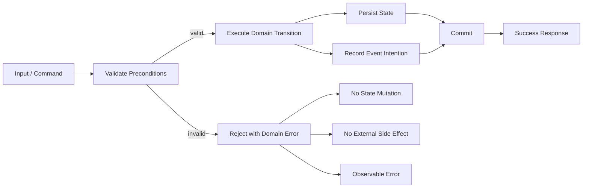

# Part 009 — Testing Exceptions, Errors, and Edge Cases

> Tujuan bagian ini: membuat negative-path testing menjadi disiplin engineering yang menjaga invariant, bukan sekadar memastikan `assertThrows()` hijau.

Software yang matang bukan hanya benar ketika input valid, dependency sehat, waktu normal, dan user patuh terhadap workflow.

Software yang matang tetap menjaga invariant ketika:

- input kosong, rusak, atau ambigu;
- state sudah berubah sebelum command diproses;
- dependency gagal sebagian;
- timeout terjadi setelah sebagian side effect dibuat;
- retry mengirim command yang sama dua kali;
- exception terlempar di tengah transaction;
- data lama tidak lagi sesuai schema terbaru;
- user melakukan action dari state yang sudah terminal;
- operasi dibatalkan;
- resource habis;
- nilai numerik overflow, rounding, atau kehilangan presisi.

Testing exception dan edge case adalah cara kita membuktikan bahwa sistem **menolak hal yang salah dengan aman**.

Bukan hanya:

```java
assertThrows(Exception.class, () -> service.doSomething(input));
```

Melainkan:

```text
ketika command invalid terjadi,
sistem harus menolak dengan error yang tepat,
tidak mengubah state,
tidak mengirim event,
tidak membuat audit yang menyesatkan,
tidak membuka retry infinite,
dan tetap menghasilkan observability yang cukup untuk diagnosis.
```

---

## 1. Mental Model: Failure Is Still a Behavior

Banyak engineer memperlakukan failure sebagai “bukan happy path”. Akibatnya negative-path test sering tipis, sporadis, dan hanya mengecek tipe exception.

Cara berpikir yang lebih kuat:

```text
successful behavior and failed behavior are both part of the contract
```

Sebuah method yang mature punya dua jenis kontrak:

```text
success contract:
    precondition valid -> postcondition tercapai

failure contract:
    precondition invalid / dependency failed -> invariant tetap aman
```

Contoh domain operation:

```text
approveCase(caseId, approver)
```

Happy path:

```text
OPEN + valid approver -> APPROVED + CaseApproved event + audit record
```

Failure path:

```text
CLOSED + valid approver -> rejected CASE_ALREADY_CLOSED
PENDING + approver without authority -> rejected APPROVER_NOT_AUTHORIZED
OPEN + audit store down -> transaction rolled back or explicit pending-outbox recovery
OPEN + duplicate request id -> return previous result or no-op safely
```

Yang diuji bukan sekadar “melempar exception”, tetapi **apakah sistem tetap berada dalam state yang benar setelah failure**.



Failure behavior adalah desain, bukan kecelakaan.

---

## 2. Error Taxonomy: Jangan Campur Semua Failure Menjadi `RuntimeException`

Sebelum menulis test, klasifikasikan error.

Tanpa taxonomy, test negatif akan kacau karena semua failure terlihat sama.

### 2.1 Taxonomy Praktis Untuk Java Service

| Kategori | Penyebab | Contoh | Response Umum | Retry? | Test Fokus |
|---|---|---|---|---|---|
| Caller error | Request/user salah | invalid field, unauthorized transition | 400/422/domain rejection | no | pesan error, no mutation |
| Authorization error | actor tidak punya hak | approve tanpa role | 403/domain rejection | no | no data leak, no side effect |
| Not found | entity tidak ada atau tidak visible | caseId salah | 404/empty | no | no creation accidental |
| Conflict | state berubah | optimistic lock, duplicate decision | 409 | maybe by caller | invariant preserved |
| Idempotency duplicate | command sama dikirim ulang | retry client | previous response/no-op | safe | no double side effect |
| Transient infrastructure | dependency sementara gagal | timeout, broker unavailable | 503/retryable | yes with policy | retry classification |
| Permanent infrastructure | config/schema salah | unknown topic, bad credential | fail fast | no until fixed | alerting, no silent retry |
| Programming bug | invariant internal rusak | impossible branch | 500/fail fast | no | surfaced loudly |
| Resource exhaustion | limit tercapai | pool exhausted, memory pressure | backpressure/503 | later | bounded failure |
| Cancellation/interruption | caller/system membatalkan | request cancelled | stop work | maybe | cleanup, interrupt preservation |

Taxonomy ini harus masuk ke desain exception, result object, API response, logging, metrics, dan retry policy.

### 2.2 Domain Rejection Bukan Selalu Exception

Dalam Java, ada dua gaya umum:

1. **exception-based failure**;
2. **result-based failure**.

Exception cocok ketika failure benar-benar exceptional terhadap flow pemanggil, atau saat kita ingin memaksa call stack keluar.

Result cocok untuk domain rejection yang expected:

```java
sealed interface ApprovalResult permits ApprovalResult.Approved, ApprovalResult.Rejected {
    record Approved(CaseId caseId, Instant approvedAt) implements ApprovalResult {}
    record Rejected(CaseId caseId, ErrorCode code, String reason) implements ApprovalResult {}
}
```

Exception-based:

```java
public Case approve(CaseId caseId, UserId approver) {
    Case c = repository.getRequired(caseId);

    if (c.isClosed()) {
        throw new DomainRejectedException(ErrorCode.CASE_ALREADY_CLOSED, caseId);
    }

    return c.approve(approver, clock.instant());
}
```

Result-based:

```java
public ApprovalResult approve(CaseId caseId, UserId approver) {
    Case c = repository.find(caseId)
        .orElseThrow(() -> new NotFoundException("case", caseId));

    if (c.isClosed()) {
        return new ApprovalResult.Rejected(
            caseId,
            ErrorCode.CASE_ALREADY_CLOSED,
            "Closed cases cannot be approved"
        );
    }

    Case approved = c.approve(approver, clock.instant());
    repository.save(approved);
    return new ApprovalResult.Approved(caseId, approved.approvedAt());
}
```

Tidak ada satu jawaban universal. Yang penting: failure contract eksplisit dan konsisten.

### 2.3 Smell: `Exception` Menjadi Protocol

Hindari desain di mana caller harus membaca string message exception untuk mengambil keputusan:

```java
catch (RuntimeException e) {
    if (e.getMessage().contains("already closed")) {
        // fragile
    }
}
```

Gunakan error code atau tipe yang stabil:

```java
catch (DomainRejectedException e) {
    if (e.code() == ErrorCode.CASE_ALREADY_CLOSED) {
        // stable protocol
    }
}
```

Test juga harus menguji protocol stabil, bukan wording rapuh.

---

## 3. Exception Test yang Benar: Assert Semantics, Not Just Type

JUnit menyediakan assertion untuk memastikan executable melempar exception tertentu. Tetapi assertion type saja sering terlalu lemah.

Buruk:

```java
@Test
void rejectClosedCase() {
    Case closed = Case.closed("C-1");

    assertThrows(RuntimeException.class, () -> closed.approve(UserId.of("u-1")));
}
```

Masalah:

- terlalu generik;
- tidak membuktikan error code;
- tidak membuktikan state tidak berubah;
- tidak membuktikan tidak ada event;
- test tetap hijau jika bug lain melempar `NullPointerException`.

Lebih baik:

```java
@Test
void closedCaseCannotBeApproved() {
    Case closed = Case.closed(CaseId.of("C-1"));

    DomainRejectedException ex = assertThrows(
        DomainRejectedException.class,
        () -> closed.approve(UserId.of("supervisor-1"), Instant.parse("2026-07-02T10:00:00Z"))
    );

    assertAll(
        () -> assertEquals(ErrorCode.CASE_ALREADY_CLOSED, ex.code()),
        () -> assertEquals(CaseStatus.CLOSED, closed.status()),
        () -> assertTrue(closed.pendingEvents().isEmpty())
    );
}
```

Kita assert empat hal:

1. tipe exception benar;
2. error code benar;
3. state tidak berubah;
4. tidak ada event palsu.

### 3.1 Pattern: Exception Contract Test

Untuk exception domain, buat pattern test yang konsisten:

```text
Given invalid precondition
When operation is invoked
Then a typed failure is returned/thrown
And error code is stable
And state is unchanged
And no external effect is requested
And observability context is present
```

Template:

```java
@Test
void cannotAssignInvestigatorAfterCaseIsClosed() {
    CaseAggregate before = CaseFixtures.closedCase()
        .withInvestigator(null)
        .build();

    CaseAggregate snapshot = before.copy();

    DomainRejectedException ex = assertThrows(
        DomainRejectedException.class,
        () -> before.assignInvestigator(UserId.of("inv-1"), TestActors.supervisor())
    );

    assertAll(
        () -> assertEquals(ErrorCode.CASE_ALREADY_CLOSED, ex.code()),
        () -> assertEquals(snapshot, before),
        () -> assertThat(before.pendingEvents()).isEmpty()
    );
}
```

Catatan penting: snapshot comparison hanya aman jika aggregate memang immutable atau memiliki equality yang meaningful. Jika tidak, assert invariant secara eksplisit.

### 3.2 Jangan Assert Message Kecuali Message Adalah Contract

Rapuh:

```java
assertEquals("Case is closed", ex.getMessage());
```

Lebih stabil:

```java
assertEquals(ErrorCode.CASE_ALREADY_CLOSED, ex.code());
```

Message boleh diuji ketika message memang bagian dari API contract, misalnya error response publik. Bahkan di sana, lebih baik assert struktur:

```json
{
  "code": "CASE_ALREADY_CLOSED",
  "message": "Case is already closed",
  "fieldErrors": []
}
```

Test:

```java
assertThat(response.code()).isEqualTo("CASE_ALREADY_CLOSED");
assertThat(response.fieldErrors()).isEmpty();
```

Wording manusia bisa berubah. Error code tidak boleh berubah sembarangan.

---

## 4. Boundary Testing: Edge Case Itu Bukan Random List

Edge case harus diturunkan dari batas model, bukan dari imajinasi acak.

Sumber edge case:

```text
input domain boundaries
state boundaries
time boundaries
numeric boundaries
collection boundaries
schema boundaries
dependency boundaries
resource boundaries
concurrency boundaries
security boundaries
```

### 4.1 Boundary Matrix

| Dimensi | Boundary | Contoh Test |
|---|---|---|
| String | null, empty, blank, max length, unicode | `name = ""`, `name = "   "`, emoji, combining chars |
| Number | min, max, zero, negative, overflow | amount = 0, -1, Long.MAX_VALUE |
| Decimal | scale, rounding, currency precision | 10.005, 0.01, currency mismatch |
| Date/time | DST, timezone, end-of-day, leap year | due date at midnight, Feb 29 |
| Collection | empty, single, duplicate, huge | no approvers, duplicate approver |
| State | initial, terminal, transitional | DRAFT, CLOSED, PENDING_APPROVAL |
| Identity | missing, malformed, duplicate | same request ID twice |
| Authorization | no role, wrong tenant, cross-org | actor from another organization |
| Dependency | timeout, partial failure, stale read | broker succeeds but DB fails |
| Schema | unknown field, missing required, invalid enum | status = `ARCHIEVED` typo |

### 4.2 Boundary Test Harus Menjawab: Batas Siapa?

Contoh `amount > 0` terlihat sederhana. Tetapi pada sistem payment/pricing, boundary melibatkan beberapa aturan:

```text
amount > 0
amount scale <= currency minor unit
amount currency == account currency
amount <= product limit
amount <= customer risk limit
amount + previous exposure <= portfolio limit
amount rounded using regulatory rounding mode
```

Maka edge case bukan hanya `-1`.

Test matrix:

```java
@ParameterizedTest
@MethodSource("invalidAmounts")
void rejectInvalidAmount(Money amount, ErrorCode expectedCode) {
    QuoteRequest request = QuoteRequestFixtures.valid()
        .withAmount(amount)
        .build();

    DomainRejectedException ex = assertThrows(
        DomainRejectedException.class,
        () -> pricingService.quote(request)
    );

    assertEquals(expectedCode, ex.code());
}

static Stream<Arguments> invalidAmounts() {
    return Stream.of(
        arguments(Money.of("USD", new BigDecimal("0.00")), ErrorCode.AMOUNT_MUST_BE_POSITIVE),
        arguments(Money.of("USD", new BigDecimal("-0.01")), ErrorCode.AMOUNT_MUST_BE_POSITIVE),
        arguments(Money.of("USD", new BigDecimal("10.001")), ErrorCode.INVALID_CURRENCY_SCALE),
        arguments(Money.of("EUR", new BigDecimal("10.00")), ErrorCode.CURRENCY_MISMATCH),
        arguments(Money.of("USD", new BigDecimal("1000000000000.00")), ErrorCode.AMOUNT_LIMIT_EXCEEDED)
    );
}
```

### 4.3 Boundary Jangan Membuat Test Tidak Terbaca

Jika matrix terlalu besar, jangan taruh semuanya di satu test method.

Pisahkan berdasarkan invariant:

```text
AmountValidationTest
CurrencyValidationTest
TemporalEligibilityTest
AuthorizationBoundaryTest
StateTransitionBoundaryTest
```

Good test suite bukan yang punya satu test super panjang. Good test suite punya peta risiko yang mudah dibaca.

---

## 5. Null, Empty, Blank, Optional: Jangan Mengandalkan Kebetulan

Java memberi banyak bentuk “tidak ada nilai”:

```text
null
Optional.empty()
empty string
blank string
empty collection
zero
unknown enum
sentinel value
```

Masing-masing punya makna berbeda.

### 5.1 Null Policy Harus Eksplisit

Contoh constructor value object:

```java
public record CaseId(String value) {
    public CaseId {
        if (value == null) {
            throw new NullPointerException("value");
        }
        if (value.isBlank()) {
            throw new IllegalArgumentException("CaseId cannot be blank");
        }
    }
}
```

Test:

```java
@Test
void caseIdRejectsNullValue() {
    NullPointerException ex = assertThrows(
        NullPointerException.class,
        () -> new CaseId(null)
    );

    assertEquals("value", ex.getMessage());
}

@ParameterizedTest
@ValueSource(strings = {"", " ", "\t", "\n"})
void caseIdRejectsBlankValue(String raw) {
    IllegalArgumentException ex = assertThrows(
        IllegalArgumentException.class,
        () -> new CaseId(raw)
    );

    assertTrue(ex.getMessage().contains("blank"));
}
```

Di sini message boleh dicek ringan karena constructor exception bukan public API utama. Untuk API publik tetap gunakan error code.

### 5.2 Jangan Pakai Optional Untuk Field Entity Secara Sembarangan

`Optional` bagus sebagai return type untuk “mungkin ada”. Tetapi sebagai field entity, sering membuat model lebih ribet.

Lebih baik domain eksplisit:

```java
public final class CaseAssignment {
    private final CaseId caseId;
    private final AssignmentStatus status;
    private final UserId investigator; // only non-null when ASSIGNED
}
```

Tetapi jika invariant tergantung state, test harus menegaskan:

```java
@Test
void assignedCaseMustHaveInvestigator() {
    IllegalArgumentException ex = assertThrows(
        IllegalArgumentException.class,
        () -> new CaseAssignment(CaseId.of("C-1"), AssignmentStatus.ASSIGNED, null)
    );

    assertThat(ex).hasMessageContaining("investigator");
}
```

Better model:

```java
sealed interface Assignment permits Unassigned, Assigned {
}

record Unassigned() implements Assignment {
}

record Assigned(UserId investigator) implements Assignment {
    Assigned {
        Objects.requireNonNull(investigator, "investigator");
    }
}
```

Dengan sealed type, beberapa invalid state menjadi unrepresentable.

Testing terbaik sering dimulai dari desain yang mencegah state ilegal dibuat.

---

## 6. Testing Validation: Field Error vs Domain Error

Jangan campur validation syntactic dengan domain rejection.

Contoh request:

```json
{
  "caseId": "C-100",
  "decision": "APPROVE",
  "reason": "ok"
}
```

Layer validation:

```text
syntactic validation:
    caseId required
    decision must be known enum
    reason max length 500

domain validation:
    case must exist
    actor must be authorized
    current state must allow APPROVE
    required evidence must be complete
```

Test syntactic validation:

```java
@Test
void rejectMissingCaseIdAtRequestBoundary() throws Exception {
    String body = """
        {
          "decision": "APPROVE",
          "reason": "ok"
        }
        """;

    mockMvc.perform(post("/cases/decision")
            .contentType(MediaType.APPLICATION_JSON)
            .content(body))
        .andExpect(status().isBadRequest())
        .andExpect(jsonPath("$.fieldErrors[0].field").value("caseId"));
}
```

Test domain validation:

```java
@Test
void rejectApproveWhenEvidenceIsIncomplete() {
    CaseAggregate c = CaseFixtures.openCase()
        .withoutRequiredEvidence()
        .build();

    DomainRejectedException ex = assertThrows(
        DomainRejectedException.class,
        () -> c.approve(TestActors.supervisor(), fixedInstant)
    );

    assertEquals(ErrorCode.REQUIRED_EVIDENCE_INCOMPLETE, ex.code());
}
```

Kenapa pemisahan ini penting?

Karena error yang sama-sama “invalid” punya owner berbeda:

```text
request boundary invalid -> client/developer integration issue
domain invalid -> legitimate business rejection
system invalid -> internal bug or data corruption
```

Masing-masing butuh response, logging, metric, dan retry policy yang berbeda.

---

## 7. Testing Rollback and No-Side-Effect Guarantees

Salah satu negative-path test paling penting adalah:

```text
when operation fails, what must not happen?
```

Contoh:

```text
approve case
    persist status APPROVED
    insert audit
    publish event
    notify external party
```

Jika approval gagal karena unauthorized, tidak boleh ada:

- status update;
- audit “approved”;
- outbox event;
- notification;
- cache invalidation palsu.

### 7.1 Test No Mutation in Domain Layer

```java
@Test
void unauthorizedApprovalDoesNotMutateCase() {
    CaseAggregate original = CaseFixtures.openCase()
        .withRequiredEvidenceComplete()
        .build();

    CaseSnapshot before = CaseSnapshot.from(original);

    DomainRejectedException ex = assertThrows(
        DomainRejectedException.class,
        () -> original.approve(TestActors.viewer(), fixedInstant)
    );

    assertAll(
        () -> assertEquals(ErrorCode.APPROVER_NOT_AUTHORIZED, ex.code()),
        () -> assertEquals(before, CaseSnapshot.from(original)),
        () -> assertThat(original.pendingEvents()).isEmpty()
    );
}
```

### 7.2 Test No Side Effect in Application Layer

```java
@Test
void unauthorizedApprovalDoesNotSaveOrPublish() {
    CaseRepository repository = mock(CaseRepository.class);
    EventPublisher publisher = mock(EventPublisher.class);

    CaseAggregate openCase = CaseFixtures.openCase()
        .withRequiredEvidenceComplete()
        .build();

    when(repository.getRequired(CaseId.of("C-1"))).thenReturn(openCase);

    ApproveCaseService service = new ApproveCaseService(repository, publisher, fixedClock);

    DomainRejectedException ex = assertThrows(
        DomainRejectedException.class,
        () -> service.approve(CaseId.of("C-1"), TestActors.viewer())
    );

    assertEquals(ErrorCode.APPROVER_NOT_AUTHORIZED, ex.code());
    verify(repository, never()).save(any());
    verifyNoInteractions(publisher);
}
```

Test ini bukan “mock fetish”. Ini mengunci invariant side-effect:

```text
invalid command must not leave durable or external traces that imply success
```

### 7.3 Transaction Boundary Test

Untuk service dengan database, unit test tidak cukup.

Test integration:

```java
@Test
void databaseChangesRollbackWhenOutboxInsertFails() {
    CaseId caseId = seedOpenCase();
    outboxRepository.failNextInsert();

    assertThrows(
        OutboxWriteException.class,
        () -> approveCaseService.approve(caseId, TestActors.supervisor())
    );

    CaseRecord stored = caseRepository.get(caseId);
    assertEquals(CaseStatus.OPEN, stored.status());

    assertThat(outboxRepository.findByAggregateId(caseId.value())).isEmpty();
}
```

Pertanyaan desain penting:

```text
Jika DB update sukses tapi event publish gagal, apa guarantee kita?
```

Jawaban production-grade biasanya bukan “publish langsung di transaction”. Biasanya:

```text
write domain state + write outbox event atomically
publish asynchronously from outbox
```

Maka test failure harus menyesuaikan architecture.

---

## 8. Idempotent Error Handling

Retry adalah mesin pembesar bug.

Jika client retry karena timeout, server bisa menerima command yang sama dua kali.

Tanpa idempotency:

```text
client sends approve request
server approves case and emits event
response lost
client retries
server approves again or rejects with confusing error
```

Dengan idempotency:

```text
same idempotency key + same semantic request -> same result or safe no-op
same idempotency key + different request -> conflict
```

### 8.1 Test Duplicate Command

```java
@Test
void duplicateApproveCommandReturnsPreviousResultWithoutDoubleEvent() {
    IdempotencyKey key = IdempotencyKey.of("req-123");
    CaseId caseId = seedOpenCaseWithCompleteEvidence();

    ApprovalResponse first = approveCaseService.approve(caseId, TestActors.supervisor(), key);
    ApprovalResponse second = approveCaseService.approve(caseId, TestActors.supervisor(), key);

    assertAll(
        () -> assertEquals(first.decisionId(), second.decisionId()),
        () -> assertEquals(1, outboxRepository.countEvents(caseId, "CaseApproved")),
        () -> assertEquals(CaseStatus.APPROVED, caseRepository.get(caseId).status())
    );
}
```

### 8.2 Test Same Key Different Payload

```java
@Test
void sameIdempotencyKeyWithDifferentPayloadIsRejected() {
    IdempotencyKey key = IdempotencyKey.of("req-123");
    CaseId caseId = seedOpenCaseWithCompleteEvidence();

    approveCaseService.approve(caseId, TestActors.supervisor(), key);

    IdempotencyConflictException ex = assertThrows(
        IdempotencyConflictException.class,
        () -> approveCaseService.reject(caseId, TestActors.supervisor(), key, "new reason")
    );

    assertEquals(ErrorCode.IDEMPOTENCY_KEY_REUSED_WITH_DIFFERENT_PAYLOAD, ex.code());
    assertEquals(1, outboxRepository.countEvents(caseId));
}
```

### 8.3 Idempotency Failure Matrix

| Scenario | Expected Behavior |
|---|---|
| same key, same payload, first success | return previous success / no duplicate side effect |
| same key, same payload, first domain rejection | return previous rejection if rejection is cached by policy |
| same key, different payload | conflict |
| no key on non-idempotent endpoint | reject or allow only if operation naturally idempotent |
| key expired | process as new or reject depending policy |
| concurrent same key | single winner, others observe same result |
| partial commit before response lost | retry reconciles from idempotency store/outbox |

Idempotency testing menggabungkan exception testing, state testing, concurrency testing, dan persistence testing.

---

## 9. Retryable vs Non-Retryable Exceptions

Salah satu bug produksi yang sering muncul:

```text
system retries error that will never succeed
```

Atau sebaliknya:

```text
system fails immediately on transient error that should be retried
```

Klasifikasi harus eksplisit.

```java
public interface FailureClassification {
    boolean retryable();
    ErrorCode code();
}

public final class DownstreamTimeoutException extends RuntimeException implements FailureClassification {
    @Override
    public boolean retryable() {
        return true;
    }

    @Override
    public ErrorCode code() {
        return ErrorCode.DOWNSTREAM_TIMEOUT;
    }
}
```

Test:

```java
@Test
void downstreamTimeoutIsRetryable() {
    DownstreamTimeoutException ex = new DownstreamTimeoutException("risk-service");

    assertAll(
        () -> assertTrue(ex.retryable()),
        () -> assertEquals(ErrorCode.DOWNSTREAM_TIMEOUT, ex.code())
    );
}

@Test
void schemaViolationIsNotRetryable() {
    RemoteContractViolationException ex = new RemoteContractViolationException("risk-service", "missing field score");

    assertAll(
        () -> assertFalse(ex.retryable()),
        () -> assertEquals(ErrorCode.REMOTE_CONTRACT_VIOLATION, ex.code())
    );
}
```

### 9.1 Test Retry Policy Behavior, Not Just Exception Class

```java
@Test
void retriesTransientRiskTimeoutButStopsAfterBudget() {
    RiskClient riskClient = mock(RiskClient.class);
    when(riskClient.score(any()))
        .thenThrow(new DownstreamTimeoutException("risk"))
        .thenThrow(new DownstreamTimeoutException("risk"))
        .thenReturn(RiskScore.low());

    QuoteService service = new QuoteService(riskClient, RetryPolicies.threeAttemptsNoSleepForTest());

    Quote quote = service.quote(validRequest());

    assertEquals(QuoteStatus.QUOTED, quote.status());
    verify(riskClient, times(3)).score(any());
}
```

Test non-retryable:

```java
@Test
void doesNotRetryRemoteContractViolation() {
    RiskClient riskClient = mock(RiskClient.class);
    when(riskClient.score(any()))
        .thenThrow(new RemoteContractViolationException("risk", "invalid response"));

    QuoteService service = new QuoteService(riskClient, RetryPolicies.threeAttemptsNoSleepForTest());

    assertThrows(RemoteContractViolationException.class, () -> service.quote(validRequest()));

    verify(riskClient, times(1)).score(any());
}
```

Retry test harus menghindari real sleep. Gunakan fake scheduler atau policy khusus test.

---

## 10. Testing Parser, Deserialization, and Schema Edge Cases

Boundary sistem sering berada di parser.

Input dari luar tidak peduli model Java kita rapi.

### 10.1 JSON Boundary Cases

Test cases:

```text
missing required field
unknown field
field null
wrong type
invalid enum
numeric value as string
very large number
array instead of object
object instead of array
invalid UTF-8
malformed JSON
extra nested object
```

Contoh:

```java
@ParameterizedTest
@MethodSource("invalidJsonBodies")
void rejectMalformedApproveRequest(String body, String expectedField) throws Exception {
    mockMvc.perform(post("/cases/C-1/approval")
            .contentType(MediaType.APPLICATION_JSON)
            .content(body))
        .andExpect(status().isBadRequest())
        .andExpect(jsonPath("$.fieldErrors[*].field", hasItem(expectedField)));
}

static Stream<Arguments> invalidJsonBodies() {
    return Stream.of(
        arguments("{}", "decision"),
        arguments("{\"decision\":null}", "decision"),
        arguments("{\"decision\":\"MAYBE\"}", "decision"),
        arguments("{\"decision\":[]}", "decision")
    );
}
```

### 10.2 Unknown Field Policy

Unknown field policy harus sadar compatibility.

Ada dua strategi:

```text
strict boundary:
    unknown field rejected
    useful for internal admin APIs and safety-critical commands

lenient boundary:
    unknown field ignored
    useful for backward/forward compatible public clients
```

Test strict:

```java
@Test
void rejectUnknownFieldForDecisionCommand() throws Exception {
    String body = """
        {
          "decision": "APPROVE",
          "unexpectedField": "x"
        }
        """;

    mockMvc.perform(post("/cases/C-1/decision")
            .contentType(MediaType.APPLICATION_JSON)
            .content(body))
        .andExpect(status().isBadRequest())
        .andExpect(jsonPath("$.code").value("UNKNOWN_FIELD"));
}
```

Test lenient:

```java
@Test
void ignoreUnknownFieldForBackwardCompatibleQueryFilter() throws Exception {
    String body = """
        {
          "status": "OPEN",
          "futureClientField": "ignored"
        }
        """;

    mockMvc.perform(post("/cases/search")
            .contentType(MediaType.APPLICATION_JSON)
            .content(body))
        .andExpect(status().isOk());
}
```

Policy ini harus masuk dokumentasi API. Jangan biarkan default serializer menentukan perilaku critical secara diam-diam.

---

## 11. Numeric Edge Cases: BigDecimal, Overflow, and Rounding

Pada sistem pricing/payment/regulatory, numeric bug bisa mahal.

### 11.1 BigDecimal Equality Trap

Java `BigDecimal` punya dua konsep:

```text
compareTo: numeric equality
equals: numeric + scale equality
```

Contoh:

```java
new BigDecimal("1.0").compareTo(new BigDecimal("1.00")) == 0
new BigDecimal("1.0").equals(new BigDecimal("1.00")) == false
```

Test harus jelas apakah scale penting.

Money value object:

```java
public record Money(String currency, BigDecimal amount) {
    public Money {
        Objects.requireNonNull(currency, "currency");
        Objects.requireNonNull(amount, "amount");

        if (amount.scale() > 2) {
            throw new DomainRejectedException(ErrorCode.INVALID_CURRENCY_SCALE);
        }
        if (amount.signum() < 0) {
            throw new DomainRejectedException(ErrorCode.AMOUNT_MUST_NOT_BE_NEGATIVE);
        }
    }
}
```

Test:

```java
@Test
void rejectAmountWithMoreThanCurrencyMinorUnit() {
    DomainRejectedException ex = assertThrows(
        DomainRejectedException.class,
        () -> new Money("USD", new BigDecimal("10.001"))
    );

    assertEquals(ErrorCode.INVALID_CURRENCY_SCALE, ex.code());
}
```

### 11.2 Overflow Test

```java
@Test
void rejectQuantityMultiplicationOverflow() {
    Quantity quantity = Quantity.of(Long.MAX_VALUE);
    UnitPrice price = UnitPrice.of(2);

    ArithmeticException ex = assertThrows(
        ArithmeticException.class,
        () -> PricingMath.total(quantity, price)
    );

    assertThat(ex).hasMessageContaining("overflow");
}
```

Implementation:

```java
public static long total(Quantity quantity, UnitPrice price) {
    return Math.multiplyExact(quantity.value(), price.cents());
}
```

Jangan biarkan overflow diam-diam wrap menjadi angka negatif.

### 11.3 Rounding Contract Test

```java
@Test
void regulatoryFeeUsesHalfUpRoundingAtTwoDecimals() {
    BigDecimal fee = RegulatoryFeeCalculator.calculate(new BigDecimal("10.005"));

    assertEquals(new BigDecimal("10.01"), fee);
}
```

Test ini penting jika rounding mode adalah bagian dari aturan bisnis atau regulasi.

---

## 12. Time Edge Cases

Time edge case akan dibahas lebih dalam di Part 010, tetapi negative-path testing harus mengenal boundary waktu.

Contoh:

```text
before effective date
at exact effective date
after expiry date
end of day by business timezone
DST transition
Feb 29
clock skew
late event
future event
```

Test temporal eligibility:

```java
@ParameterizedTest
@MethodSource("effectiveDateCases")
void eligibilityDependsOnEffectiveWindow(Instant now, boolean expectedEligible) {
    Policy policy = PolicyFixtures.activeFromTo(
        Instant.parse("2026-07-01T00:00:00Z"),
        Instant.parse("2026-08-01T00:00:00Z")
    );

    assertEquals(expectedEligible, policy.isEffectiveAt(now));
}

static Stream<Arguments> effectiveDateCases() {
    return Stream.of(
        arguments(Instant.parse("2026-06-30T23:59:59Z"), false),
        arguments(Instant.parse("2026-07-01T00:00:00Z"), true),
        arguments(Instant.parse("2026-07-15T12:00:00Z"), true),
        arguments(Instant.parse("2026-08-01T00:00:00Z"), false)
    );
}
```

Notice the half-open interval:

```text
[startInclusive, endExclusive)
```

Half-open intervals reduce overlap bugs.

---

## 13. Security and Abuse Edge Cases

Testing edge case juga meliputi abuse input.

Tidak perlu menjadikan setiap unit test sebagai security scanner, tetapi boundary service harus punya test untuk kasus umum:

```text
very long string
path traversal-like value
HTML/script-like value
SQL-like value
header injection
newline in identifier
unicode confusables
control characters
repeated nested arrays
large payload
```

Contoh identifier validation:

```java
@ParameterizedTest
@ValueSource(strings = {
    "../C-1",
    "C-1\nX-Injected: true",
    "<script>alert(1)</script>",
    "C-1;DROP TABLE cases",
    ""
})
void rejectUnsafeCaseId(String raw) {
    DomainRejectedException ex = assertThrows(
        DomainRejectedException.class,
        () -> CaseId.parse(raw)
    );

    assertEquals(ErrorCode.INVALID_CASE_ID, ex.code());
}
```

Tetapi jangan overfit test ke string tertentu saja. Buat validator dengan invariant jelas:

```text
CaseId must match ^C-[0-9]{1,12}$
```

Test:

```java
@ParameterizedTest
@ValueSource(strings = {"C-1", "C-999999999999"})
void acceptValidCaseIds(String raw) {
    assertDoesNotThrow(() -> CaseId.parse(raw));
}

@ParameterizedTest
@ValueSource(strings = {"X-1", "C-", "C-0000000000000", "C-ABC", " C-1 ", "C-1\n"})
void rejectInvalidCaseIds(String raw) {
    assertThrows(DomainRejectedException.class, () -> CaseId.parse(raw));
}
```

---

## 14. Resource Exhaustion and Backpressure Failure

Banyak negative-path test berhenti di invalid input. Padahal sistem production sering gagal karena resource pressure.

Resource boundary:

```text
connection pool exhausted
thread pool saturated
queue full
rate limit exceeded
payload too large
file too large
timeout budget exhausted
memory allocation too high
```

### 14.1 Queue Full Test

Misal service menerima work item ke bounded queue.

```java
@Test
void rejectWhenWorkQueueIsFull() {
    BoundedWorkQueue queue = new BoundedWorkQueue(1);
    queue.enqueue(new WorkItem("first"));

    QueueFullException ex = assertThrows(
        QueueFullException.class,
        () -> queue.enqueue(new WorkItem("second"))
    );

    assertAll(
        () -> assertEquals(ErrorCode.WORK_QUEUE_FULL, ex.code()),
        () -> assertEquals(1, queue.size())
    );
}
```

### 14.2 Timeout Budget Test

```java
@Test
void rejectBeforeCallingDependencyWhenTimeoutBudgetAlreadyExpired() {
    TimeoutBudget budget = TimeoutBudget.expired();
    RiskClient riskClient = mock(RiskClient.class);

    QuoteService service = new QuoteService(riskClient);

    TimeoutBudgetExceededException ex = assertThrows(
        TimeoutBudgetExceededException.class,
        () -> service.quote(validRequest(), budget)
    );

    assertEquals(ErrorCode.TIMEOUT_BUDGET_EXCEEDED, ex.code());
    verifyNoInteractions(riskClient);
}
```

This protects a critical invariant:

```text
never start expensive downstream work when request budget is already exhausted
```

---

## 15. Cancellation and Interruption

Java cancellation is easy to mishandle.

Common bugs:

```text
InterruptedException swallowed
thread interrupt flag lost
cleanup skipped
partial state committed after cancellation
Future cancellation ignored
blocking operation not bounded
```

### 15.1 Preserve Interrupt Status

Bad:

```java
try {
    Thread.sleep(1000);
} catch (InterruptedException e) {
    log.warn("interrupted");
}
```

Better:

```java
try {
    Thread.sleep(1000);
} catch (InterruptedException e) {
    Thread.currentThread().interrupt();
    throw new OperationCancelledException(e);
}
```

Test:

```java
@Test
void preservesInterruptStatusWhenCancelled() throws Exception {
    InterruptibleWorker worker = new InterruptibleWorker();

    Thread.currentThread().interrupt();
    try {
        assertThrows(OperationCancelledException.class, worker::doWork);
        assertTrue(Thread.currentThread().isInterrupted());
    } finally {
        // clear interrupt so it does not pollute the rest of the test JVM
        Thread.interrupted();
    }
}
```

Be careful: manipulating interrupt flag in unit tests can pollute other tests. Always cleanup.

### 15.2 Cancellation Must Not Commit Success

```java
@Test
void cancellationBeforeCommitDoesNotPersistSuccess() {
    CaseId caseId = seedOpenCase();
    CancellationToken token = CancellationToken.cancelled();

    assertThrows(
        OperationCancelledException.class,
        () -> approveCaseService.approve(caseId, TestActors.supervisor(), token)
    );

    assertEquals(CaseStatus.OPEN, caseRepository.get(caseId).status());
    assertThat(outboxRepository.findByAggregateId(caseId.value())).isEmpty();
}
```

---

## 16. Golden Rule: Every Failure Test Needs an Oracle

A failure test without oracle is weak.

Weak:

```java
assertThrows(Exception.class, () -> service.execute(command));
```

Strong:

```text
expected error code
expected state after failure
expected side effects absent/present
expected retry classification
expected audit/metric/log behavior
expected transaction boundary
```

Oracle matrix:

| Failure | Error Code | State | Event | Persistence | Retry | Observability |
|---|---|---|---|---|---|---|
| invalid field | VALIDATION_ERROR | unchanged | none | none | no | validation metric |
| illegal transition | ILLEGAL_TRANSITION | unchanged | none | none | no | domain rejection metric |
| optimistic lock | CONFLICT | unchanged by loser | none by loser | no duplicate | caller may retry | conflict metric |
| downstream timeout before commit | DOWNSTREAM_TIMEOUT | unchanged | none | rollback | yes | dependency timeout metric |
| outbox insert failure | OUTBOX_WRITE_FAILED | rollback | none | rollback | depends | critical alert |
| duplicate idempotent command | none / previous | stable | no duplicate | stable | safe | idempotency hit metric |

---

## 17. Test Naming for Negative Paths

Bad names:

```text
testError1
testInvalidInput
testException
```

Better names:

```text
closedCaseCannotBeApproved
unauthorizedUserCannotAssignInvestigator
sameIdempotencyKeyWithDifferentPayloadIsRejected
outboxFailureRollsBackCaseApproval
expiredPolicyIsNotEligibleAtEndExclusiveBoundary
invalidCurrencyScaleIsRejectedBeforePricing
```

Good negative test names encode the invariant.

---

## 18. A Complete Example: Approval Failure Test Suite

Domain rule:

```text
A case can be approved only when:
- status is PENDING_APPROVAL
- required evidence is complete
- approver has SUPERVISOR role
- approver is not the submitter
- policy is effective at approval time
```

Test suite outline:

```java
class ApproveCaseFailureTest {

    private final Instant now = Instant.parse("2026-07-02T10:00:00Z");

    @Test
    void cannotApproveClosedCase() { }

    @Test
    void cannotApproveDraftCase() { }

    @Test
    void cannotApproveWhenRequiredEvidenceIsMissing() { }

    @Test
    void viewerCannotApprove() { }

    @Test
    void submitterCannotApproveOwnCase() { }

    @Test
    void cannotApproveWhenPolicyIsNotYetEffective() { }

    @Test
    void cannotApproveWhenPolicyExpiredAtEndExclusiveBoundary() { }

    @Test
    void rejectionDoesNotAppendCaseApprovedEvent() { }

    @Test
    void rejectionDoesNotMutateStatus() { }

    @Test
    void applicationServiceDoesNotSaveRejectedApproval() { }
}
```

One implementation:

```java
@Test
void submitterCannotApproveOwnCase() {
    UserId submitter = UserId.of("u-1");
    CaseAggregate c = CaseFixtures.pendingApproval()
        .submittedBy(submitter)
        .withRequiredEvidenceComplete()
        .build();

    CaseSnapshot before = CaseSnapshot.from(c);

    DomainRejectedException ex = assertThrows(
        DomainRejectedException.class,
        () -> c.approve(TestActors.supervisor(submitter), now)
    );

    assertAll(
        () -> assertEquals(ErrorCode.SUBMITTER_CANNOT_APPROVE_OWN_CASE, ex.code()),
        () -> assertEquals(before, CaseSnapshot.from(c)),
        () -> assertThat(c.pendingEvents()).isEmpty()
    );
}
```

This is not over-testing. This is the behavioral perimeter of the domain.

---

## 19. Anti-Patterns

### 19.1 Catch-All Exception Assertion

```java
assertThrows(Exception.class, () -> service.execute());
```

Almost always too weak.

### 19.2 Testing Implementation Accident

```java
assertThat(ex.getStackTrace()[0].getMethodName()).isEqualTo("validateStatus");
```

This locks implementation structure, not behavior.

### 19.3 Negative Test Without State Assertion

```java
assertThrows(DomainRejectedException.class, () -> c.approve(actor));
```

Better: assert state unchanged.

### 19.4 Using Real Sleep in Retry/Timeout Tests

```java
Thread.sleep(5000);
```

Use fake scheduler, zero-delay retry policy, timeout budget abstraction, or Awaitility for async condition tests.

### 19.5 Snapshotting Everything Blindly

Snapshot assertions are useful, but can become brittle if they compare irrelevant fields.

Prefer invariant-specific assertion:

```java
assertEquals(CaseStatus.OPEN, c.status());
assertThat(c.pendingEvents()).isEmpty();
```

---

## 20. Production-Grade Checklist

Use this checklist when reviewing negative-path test coverage.

### 20.1 Exception Contract

- [ ] Does the test assert specific exception/result type?
- [ ] Does it assert stable error code?
- [ ] Does it avoid brittle message assertions?
- [ ] Does it check retryable/non-retryable classification when relevant?
- [ ] Does it distinguish domain rejection from infrastructure failure?

### 20.2 State Safety

- [ ] Does invalid command leave aggregate unchanged?
- [ ] Does failure avoid appending success events?
- [ ] Does application service avoid save/publish on rejection?
- [ ] Does transaction rollback on mid-operation failure?
- [ ] Does cancellation avoid success commit?

### 20.3 Boundary Coverage

- [ ] Null, empty, blank handled explicitly?
- [ ] Numeric min/max/overflow/scale covered?
- [ ] Date/time boundaries covered?
- [ ] Collection empty/single/duplicate/large covered?
- [ ] Schema missing/unknown/invalid enum/wrong type covered?

### 20.4 Operational Behavior

- [ ] Retry policy tested without real sleep?
- [ ] Non-retryable errors stop immediately?
- [ ] Timeout budget respected?
- [ ] Resource exhaustion produces bounded failure?
- [ ] Observability exists for rejected/failing paths?

---

## 21. Practice Lab

Implement a small `CaseApprovalService` with these rules:

```text
case status must be PENDING_APPROVAL
actor must have SUPERVISOR role
actor must not be submitter
case must have at least one evidence item
policy must be effective at approval time
approval command must have idempotency key
same idempotency key must not produce duplicate event
```

Write tests for:

```text
1. each domain rejection
2. no state mutation on each rejection
3. no outbox event on rejection
4. duplicate idempotency key same payload
5. duplicate idempotency key different payload
6. policy effective start inclusive
7. policy effective end exclusive
8. repository save failure rollback behavior
9. outbox failure rollback behavior
10. retryable vs non-retryable infrastructure exception mapping
```

Your target is not test count. Your target is confidence that failure behavior is specified.

---

## 22. Key Takeaways

- Failure is behavior, not absence of behavior.
- Negative-path tests must assert more than exception type.
- Stable error codes are better than brittle message assertions.
- Edge cases should come from model boundaries, not random guessing.
- Domain rejection, validation failure, infrastructure failure, and programming bug must not collapse into one generic exception bucket.
- Every failure test should check state, side effect, retry classification, or observability when relevant.
- Retry and idempotency make failure semantics part of distributed correctness.
- The best exception test proves that the system rejected the command and stayed safe.

---

## References

- JUnit User Guide and Assertions API: `https://docs.junit.org/`
- Java `Clock` and `java.time` API documentation: `https://docs.oracle.com/javase/8/docs/api/java/time/Clock.html`
- Oracle Java SE API documentation for core exception/time classes: `https://docs.oracle.com/javase/`
